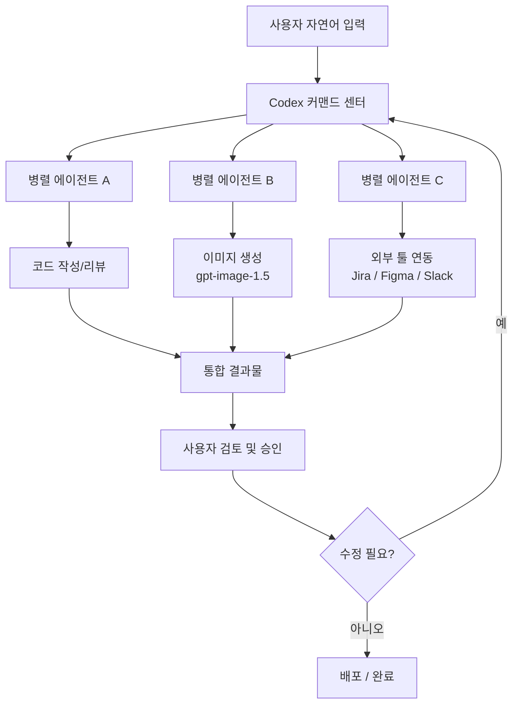
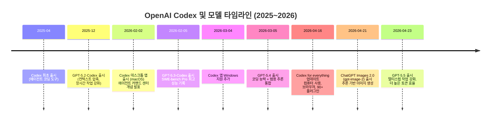
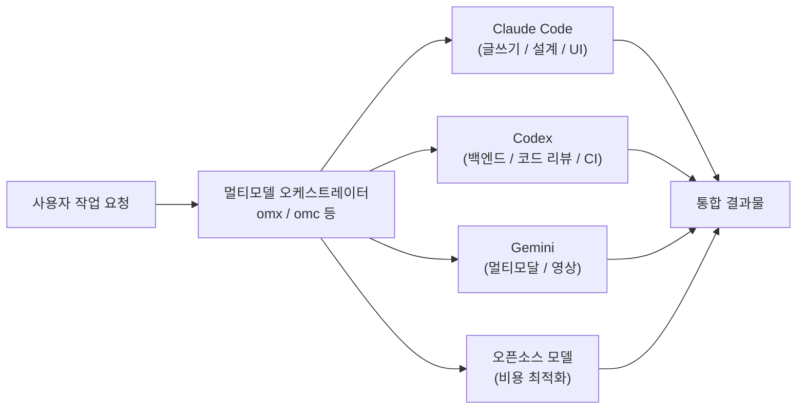

> [`@choi.openai`](https://www.threads.com/@choi.openai/post/DXdx-LqDwmv) Threads 포스트 심층 분석 — 2026년 4월 기준 최신 정보 반영

---

## 들어가며: "혼자 외쳤던 시절"의 감격

이 글의 출발점은 한 Codex 앰버서더의 솔직한 감정 토로다. 최근 개발자 타임라인에 Codex에 대한 찬사가 늘어나는 것을 보며 "조금 감격스러운 기분"이 든다는 고백으로 시작하는 이 포스트는, 단순한 제품 홍보를 넘어 AI 도구 생태계의 구조적 전환을 날카롭게 짚어낸다.

그가 Codex를 홀로 옹호하던 시절, Claude Code는 개발자 커뮤니티에서 거의 표준처럼 받아들여지고 있었다. CLI 기반 에이전트 경험, 탁월한 설계 능력, 섬세한 문장력. Claude Code의 존재감은 압도적이었고, 그 맞은편에서 Codex의 방향성을 지지하는 목소리는 소수에 불과했다. 그러나 2026년 4월 현재, 흐름은 달라지고 있다.

---

## 1부. Claude Code라는 강력한 동료 — 그 진짜 강점과 한계

### Claude Code가 잘하는 것들

저자는 Claude Code를 경쟁자로 깎아내리지 않는다. 오히려 "개발자에게 거의 축복에 가까운 제품"이라고 표현하며 그 강점을 명확히 인정한다. 실제로 Claude Code는 다음의 영역에서 두드러진 성과를 보여왔다.

**설계 및 아키텍처 능력**: 복잡한 시스템의 구조를 이해하고, 고수준의 소프트웨어 설계 논리를 제안하는 데 탁월하다. 단순히 코드를 생성하는 것이 아니라, 왜 이런 구조가 적합한지를 설명하는 맥락적 이해 능력이 강하다.

**프론트엔드 구현 능력**: UI/UX 구현에서의 섬세함은 Claude Code의 오랜 강점이었다. 시각적 직관을 가지고 코드를 작성하는 능력 덕분에 디자이너와의 협업 시나리오에서도 높은 평가를 받았다.

**문서와 글쓰기 능력**: 기획서, 법률 문서, 마케팅 카피, 에세이에 이르기까지 텍스트 생성의 질적 수준은 여전히 상위권이다. 논리적이면서도 사람의 결이 담긴 문장을 생산하는 능력은 Codex 계열이 쉽게 따라가기 어려운 영역이다.

**컴퓨터 사용(Computer Use) 능력**: 2026년 기준으로 Claude Code는 브라우저 자동화, GUI 인터랙션, 외부 도구와의 연동 등에서 성숙한 컴퓨터 사용 기능을 제공한다. OSWorld 벤치마크에서 Claude Opus 4.6이 앞서는 결과가 이를 뒷받침한다.

최신 비교 연구에 따르면, 2026년 초 benchmark 비교에서 Claude Code는 SWE-bench Verified에서 80.9%의 점수로 가장 높은 수준을 기록했으며, 첫 번째 시도에서 수정 없이 통과하는 코드 정확도가 95%에 달한다는 보고도 있다.

### CLI라는 "통곡의 벽"

그러나 저자가 지적하는 본질적인 문제는 성능이 아니다. 접근성이다.

Claude Code는 CLI(커맨드 라인 인터페이스) 도구로 설계되어 있다. Claude Code는 CLI 도구로 실행되며, 사용자가 프로젝트를 가리키고 파일을 직접 조작하는 방식으로 동작한다. 전체 코드베이스를 읽고, 테스트를 실행하고, git에 커밋하고, 스크립트를 실행하는 것이 모두 로컬 환경에서 이루어진다. 그 트레이드오프는 바로 설정의 복잡성이다.

비개발자 입장에서 터미널은 여전히 높은 진입 장벽이다. 터미널을 열고, npm 또는 pip으로 패키지를 설치하고, 권한 설정을 통과하고, 에러 로그를 해독하고, 컨텍스트를 직접 관리해야 한다. 저자는 이것을 리눅스 비유로 설명한다. "성능 좋고 자유롭지만 터미널부터 배워서 알아서 쓰세요"라고 말하는 것은 사실상 대다수 사용자를 배제하는 것과 같다.

좋은 제품은 사용자가 복잡한 환경 설정을 통과해야만 쓸 수 있는 것이 아니다. 강력한 하네스, 검증 루프, 안전망, 파일 관리, 병렬 작업, 권한 제어 같은 것들은 제품 내부에 기본 통합되어 있어야 한다. 사용자가 직접 이 모든 것을 조립해야 한다면, 그것은 아직 완성된 제품이 아닌 강력한 개발 키트에 가깝다.

---

## 2부. Codex의 전략적 방향성 — 에이전트 커맨드 센터

### Codex 데스크톱 앱의 출현

2026년 2월 2일, OpenAI는 Codex 데스크톱 앱을 공식 출시했다. 이것이 단순한 UI 추가가 아닌 이유는 이 앱의 설계 철학에 있다.

2025년 4월 Codex가 출시된 이후, 개발자들이 에이전트와 협업하는 방식은 근본적으로 바뀌었다. 모델은 이제 복잡하고 장시간 진행되는 작업을 엔드-투-엔드로 처리할 수 있게 되었고, 개발자들은 여러 에이전트를 프로젝트 전반에 걸쳐 조율하는 역할을 맡게 되었다. 작업을 위임하고, 병렬로 실행하고, 에이전트가 몇 시간에서 며칠, 몇 주에 걸치는 대규모 프로젝트를 맡도록 신뢰하는 방식으로 발전한 것이다. 핵심 과제는 에이전트가 무엇을 할 수 있느냐에서 사람이 에이전트를 어떻게 지시하고, 감독하고, 협업하느냐로 이동했다.

Codex 앱은 에이전트 코딩을 위한 커맨드 센터다. 내장된 워크트리와 클라우드 환경을 통해 에이전트들이 프로젝트 전반에서 병렬로 작업할 수 있으며, 며칠 치 분량의 작업을 단 하루 만에 완료할 수 있다.

Codex 앱은 병렬 Codex 스레드 작업을 위한 집중된 데스크톱 환경으로, 내장된 워크트리 지원과 자동화, Git 기능을 제공한다.

### Skills 시스템 — 모듈식 역량 확장

Codex가 단순한 코딩 도구를 넘어서려는 의지는 Skills 시스템에서 가장 잘 드러난다.

Skills는 지침, 리소스, 스크립트를 하나로 묶어 Codex가 도구에 안정적으로 연결하고, 워크플로우를 실행하며, 팀의 기준에 맞게 작업을 완료할 수 있도록 한다. Codex 앱에는 스킬을 생성하고 관리하는 전용 인터페이스가 포함되어 있다. 특정 스킬을 명시적으로 사용하도록 요청하거나, 작업에 맞게 자동으로 선택되도록 설정할 수 있다.

현재 제공되는 기본 스킬 라이브러리에는 다음이 포함된다: Figma에서 디자인 컨텍스트를 가져와 1:1 시각적 일치의 프로덕션 UI 코드를 생성하는 디자인 구현 스킬, Linear를 통한 프로젝트 관리 스킬, Cloudflare/Netlify/Vercel 등으로 배포하는 스킬, 그리고 GPT Image 기반 이미지 생성 스킬이 있다.

이 구조는 저자가 희망하는 "Skill Store" 개념과 맥을 같이한다. 코딩이라는 강한 코어를 유지하면서, 글쓰기·디자인·문서·리서치 같은 특화 능력은 외부 스킬처럼 조합해 쓰는 방식이다. Codex는 이제 앱과 스킬로 구성된 패키지 워크플로우를 사용자들이 직접 발견하고 설치해 사용할 수 있는 큐레이션된 플러그인 디렉토리를 포함하고 있다. 플러그인은 재사용 가능한 Codex 워크플로우를 위한 설치 가능한 번들로, 프로젝트나 팀 간에 동일한 설정을 공유하기 쉽게 만든다.

---

## 3부. "얼마나 똑똑한가"에서 "얼마나 쉽게 지휘할 수 있는가"로

### 인터페이스 문제는 성능 문제가 아니다

저자가 포스트에서 가장 명확하게 제시하는 주장은 이것이다. AI의 미래 경쟁은 "가장 똑똑한 모델 하나"를 만드는 것이 아니라, 그 똑똑함을 얼마나 자연스럽게 사람의 작업 흐름 안으로 끌어들이느냐의 싸움이라는 것이다.

기존 IDE나 터미널은 새로운 에이전트 협업 방식에 최적화된 인터페이스가 아니다. 여러 에이전트를 병렬로 실행하고, 작업을 나누고, 변경 사항을 검토하고, 필요하면 개입했다가 다시 맡기는 사이클을 자연스럽게 처리하기 위해선 그에 맞는 새로운 인터페이스가 필요하다.

OpenAI의 프레이밍은 명확하다. 어려운 문제는 "에이전트가 무엇을 할 수 있느냐"에서 "사람이 여러 에이전트를 어떻게 지시하고 감독하고 협력할 수 있느냐"로 이동했으며, IDE와 터미널 기반 워크플로우는 그러한 방식으로 설계되지 않았다.

### 비개발자도 빌더가 되는 세계

저자의 핵심 테제 중 하나는, AI는 극소수 기술자만의 도구가 아니라 누구나 사용할 수 있는 완성된 제품이어야 한다는 것이다. 그리고 2026년 4월 Codex의 업데이트는 이 방향을 가장 직접적으로 구현한다.

OpenAI의 2026년 4월 16일 "Codex for (almost) everything" 업데이트는 개발자 전용 코딩 도구에서 범용 AI 워크스페이스로 제품을 재정의한다. macOS 컴퓨터 사용(computer use), 인앱 브라우저, gpt-image-1.5 이미지 생성, 영구 메모리, 예약 자동화, 90개 이상의 플러그인(Jira, Microsoft 365 전체 제품군, Notion, Slack 포함)이 이 업데이트에 포함된다. 이 업데이트는 비기술적 비즈니스 사용자를 위해 Codex를 명시적으로 재포지셔닝한 것이다. 관리자, 마케터, 재무 분석가, 운영 담당자는 코딩, API 설정, Zapier 연결 없이 자연어 프롬프트만으로 Codex를 사용할 수 있다.

---

## 4부. Codex의 약점 — 냉정한 자기 진단

저자의 신뢰성은 이 섹션에서 극대화된다. 앰버서더임에도 불구하고 Codex의 약점을 정직하게 인정한다.

### 글쓰기와 디자인 감각의 한계

Codex와 ChatGPT 생태계에서 가장 아픈 약점은 바로 글쓰기의 질감이다. 논리적으로 틀리지 않지만 읽고 나면 사람의 결이 느껴지지 않는 텍스트. 기획 문서, 에세이, 감상문처럼 글쓴이의 취향과 망설임, 리듬이 살아 있어야 하는 글에서 OpenAI 모델 계열은 가끔 기계적이고 건조한 인상을 준다.

개발자 포럼의 반복적인 주제 중 하나는 "Claude는 정밀한 편집을 제공하고, Codex는 광범위한 리팩토링을 처리한다"는 것이다. Codex CLI에 대한 주요 불만 중 하나는 장시간 세션에서의 일관성 문제와 프론트엔드 출력물의 품질이다.

이것은 오픈AI가 해결해야 할 모델 방향성의 문제이기도 하다. 코딩 성능을 강화하는 과정에서 자연어 생성의 인간적 감수성이 희생될 수 있으며, 이는 비개발자 사용자에게 체감 품질 저하로 이어진다.

### UX의 완성도

저자는 Codex의 UX가 더 부드러워져야 한다고도 지적한다. 또한 "코드"라는 단어 자체가 비개발자에게 심리적 장벽이 될 수 있다는 점도 솔직하게 언급한다. 아무리 GUI가 있어도 제품의 네이밍이 "나는 개발자가 아니다"라는 인식을 주면 대중화의 걸림돌이 된다.

---

## 5부. 멀티모달 통합 — AI는 챗봇이 아닌 창작 운영체제로

### ChatGPT Images 2.0의 의미

저자가 "창작 워크플로우 자체를 다시 생각하게 만드는 변화"라고 표현한 것은 단순 과장이 아니다. 2026년 4월 21일 출시된 ChatGPT Images 2.0(gpt-image-2)은 이미지 생성의 패러다임을 바꾸는 출시였다.

gpt-image-2는 렌더링 전에 추론 루프를 실행한다. 이미지를 계획하고, 참조 자료를 웹에서 검색하고, 후보를 생성하고, 프롬프트 대비 결과를 검증한다. DALL-E 3는 플래닝 단계도, 웹 그라운딩도, 자체 검증도 없는 단일 샷 확산 모델이었기 때문에 잘못된 텍스트, 비일관적인 캐릭터, 어긋난 종횡비를 자주 생성했다.

이제 글, 코드, 이미지, 문서, 컴퓨터 제어가 하나의 작업 환경 안으로 들어오고 있다. 이것이 바로 AI가 "챗봇"을 넘어 "창작 운영체제"에 가까워지는 지점이다.

### GPT-5.4와 GPT-5.5의 연속 출시

GPT-5.4는 GPT-5.3-Codex의 업계 선도적인 코딩 능력을 통합한 OpenAI 최초의 메인라인 추론 모델이다. GDPval 벤치마크에서 GPT-5.4는 44개 직종에 걸쳐 전문가 수준의 수행을 측정하는 테스트에서 83%의 비교 우위를 달성했으며, GPT-5.2의 70.9%보다 크게 향상됐다.

그리고 불과 7주 뒤인 2026년 4월 23일, OpenAI는 GPT-5.5를 출시하며 "실제 업무를 위한 새로운 수준의 지능"이라고 소개했다. GPT-5.5를 탑재한 Codex는 이제 브라우저, 파일, 문서, 컴퓨터 전반에 걸쳐 더 많은 작업을 처리할 수 있게 되었다. 브라우저 사용이 확장되어 Codex가 웹 앱과 상호작용하고, 흐름을 테스트하고, 페이지를 클릭하고, 스크린샷을 캡처하고, 보이는 것을 기반으로 반복 작업을 수행할 수 있다.

---

## 6부. 멀티모델 워크플로우 — 종교가 아닌 도구 조립의 시대

### 각 모델의 비교 강점

저자는 모델 하나를 종교처럼 믿는 시대가 끝났다고 선언한다. 목적에 따라 능력을 조립하는 시대라는 것이다. 2026년 초 실제 개발자 커뮤니티의 인식을 정리하면 다음과 같다.

| 도구 | 핵심 강점 | 약점 |
|---|---|---|
| **Claude Code** | 설계 능력, 프론트엔드 UI, 자연어 글쓰기, 컴퓨터 사용, 정밀 편집 | CLI 진입 장벽, 레이트 리밋, 비용 |
| **Codex** | 백엔드/코드 리뷰, 병렬 에이전트, 제품 통합, GUI 접근성 | 글쓰기 감성, 장시간 세션 일관성 |
| **Gemini CLI** | 멀티모달(영상/이미지/문서), Google 생태계 통합 | 전반적 코딩 성능 |
| **오픈소스 모델** | 비용 효율, 커스터마이징 자유도 | 최고 수준 성능 |

성공적인 개발자들은 두 도구를 결합해 사용한다. 빠른 구현, 멀티에이전트 오케스트레이션, GUI 관련 작업에는 Claude Code를 사용하고, 터미널 집약적인 CI/CD, 코드 리뷰, 보안 점검에는 Codex를 사용하는 방식이다.

### omx, omc 같은 멀티모델 오케스트레이션 도구

커뮤니티는 영리하다. 한 모델이 모든 것을 잘하기를 기다리기보다, 각 모델의 장점을 조립해서 워크플로우를 만드는 방향으로 빠르게 움직이고 있다. 저자가 언급하는 `omx`, `omc` 같은 오픈소스 도구들이 주목받는 것도 이런 맥락이다. 어떤 에이전트 하네스를 구성할 때 글쓰기는 Claude에게, 코드 실행 루프는 Codex에게, 멀티모달 처리는 Gemini에게 맡기는 방식이 이미 실용적인 선택지로 자리잡고 있다.

---

## 7부. AI 도구 경쟁의 새로운 전선

### 비용과 운영 설계의 문제

저자는 장시간 에이전트를 운용하는 문제가 이제 단순한 성능 경쟁을 넘어섰다고 진단한다. 일부 사용자들은 Claude Code의 Opus 티어를 무거운 사용으로 30분 만에 한도에 도달한다고 보고하며, 몇 시간을 기다려야 하는 상황이 생긴다고 전한다. 반면 ChatGPT Pro($200/월) 사용자들은 Codex 사용 중 한도에 거의 도달하지 않는다고 보고하는 경향이 있다.

이는 AI 도구의 경쟁이 단순히 "어떤 모델이 더 똑똑한가"의 싸움이 아님을 보여준다. 비용 구조, 레이트 리밋 설계, 운영 안정성이 실제 업무 채택 여부를 결정한다.

### Claude Cowork와의 직접 경쟁

Anthropic의 에이전트 기반 확장도 빠르게 진행 중이다. Claude Cowork는 2026년 3월에 macOS와 Windows에서 일반 가용화(GA)에 도달했고, Dispatch는 Claude 모바일 앱을 데스크톱 에이전트를 위한 리모컨으로 전환시켰다. 두 진영 모두 비기술 사용자를 향해 빠르게 확장하고 있으며, 이것이 저자가 Codex의 GUI 방향성을 "AI 대중화의 핵심 조건"으로 보는 이유다.

---

## 8부. AI 제품의 올바른 방향 — 저자의 최종 테제

저자의 주장을 한 문장으로 요약하면: **AI의 미래는 더 어려운 터미널 안에 있지 않다. 더 많은 사람이 자기 언어로, 자기 목적을 가지고, 자기 상상을 실제로 만들어보는 경험 안에 있다.**

이를 위해 좋은 AI 제품은 다음의 조건을 갖춰야 한다고 저자는 제시한다.

첫째, 켜는 순간 무엇을 해야 하는지 이해된다. 별도의 튜토리얼 없이도 첫 번째 결과물을 빠르게 만들 수 있는 온보딩 경험.

둘째, 강력한 기능이 내부에 통합되어 있다. 하네스, 검증 루프, 안전망, 파일 관리, 병렬 작업, 권한 제어를 사용자가 직접 설정할 필요가 없다.

셋째, 개발자가 아니어도 빌더가 될 수 있다. 동시에 개발자에게는 더 깊은 제어권이 열려 있다. 진입 장벽은 낮추되 기술적 천장은 높이는 구조.

넷째, 필요한 역량을 외부에서 장착할 수 있다. 코어 모델이 완벽하지 않아도, 글쓰기·디자인·리서치 같은 특화 능력을 스킬 또는 플러그인 형태로 조합해서 보완할 수 있어야 한다.

Codex 앱은 이러한 전제를 단순하게 정의한다. 모든 것은 코드로 제어된다. 에이전트가 코드에 대해 더 잘 추론하고 생성할수록, 모든 형태의 기술적·지식 노동에서 더 강력한 역량을 갖추게 된다.

---

## 맺음말: 앰버서더의 고백이 담긴 시장 분석

이 포스트가 단순한 제품 홍보가 아닌 이유는 명확하다. 저자는 Codex의 약점을 숨기지 않았고, Claude Code의 강점을 진심으로 인정했으며, 멀티모델 전략의 합리성을 인정했다. 앰버서더 가이드라인이 "과장 홍보 금지"를 명시하고 있다는 사실을 직접 언급한 것도 이 포스트의 신뢰성을 높인다.

결국 저자가 말하고자 하는 것은 Codex가 최고라는 주장이 아니다. 접근성과 제품 완성도가 AI 대중화의 실제 변수라는 주장이다. 그리고 2026년 4월 현재, OpenAI는 이 방향을 향해 가장 빠르게 움직이고 있다는 것이다.

Codex 앱의 "에이전트 커맨드 센터", Skills 시스템, 90개 이상의 플러그인, gpt-image-2 통합, 컴퓨터 사용 기능, 그리고 GPT-5.5로의 연속적인 모델 업그레이드는 모두 같은 방향을 가리킨다. 누구나 빌더가 될 수 있는 세계를 향한 일관된 제품 비전.

그 비전이 실제로 실현될 수 있을지는 앞으로의 UX 개선, 글쓰기 능력의 인간화, 그리고 비개발자들의 실제 채택률이 증명해줄 것이다.

---

*작성일: 2026년 4월 24일*
*참고: @choi.openai Threads 포스트, OpenAI 공식 문서, 다수의 2026년 비교 분석 자료*
