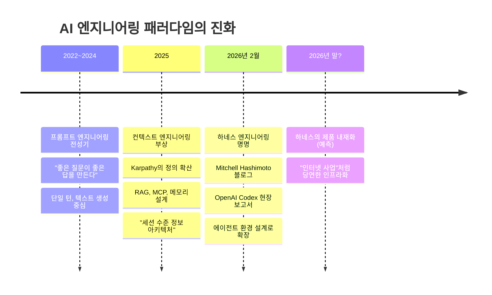
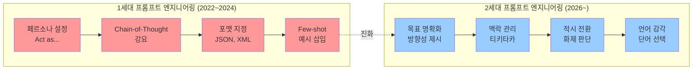
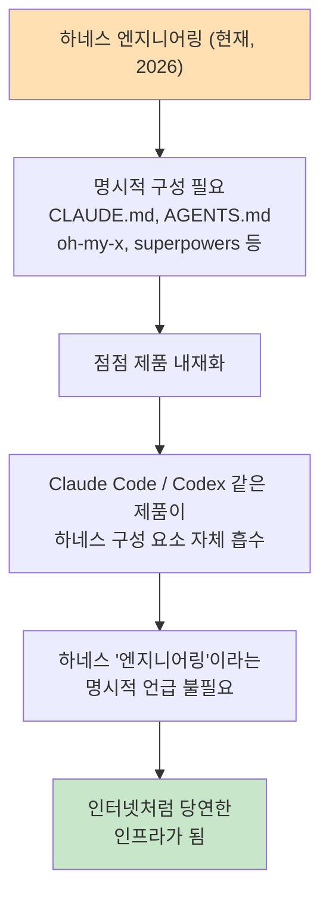
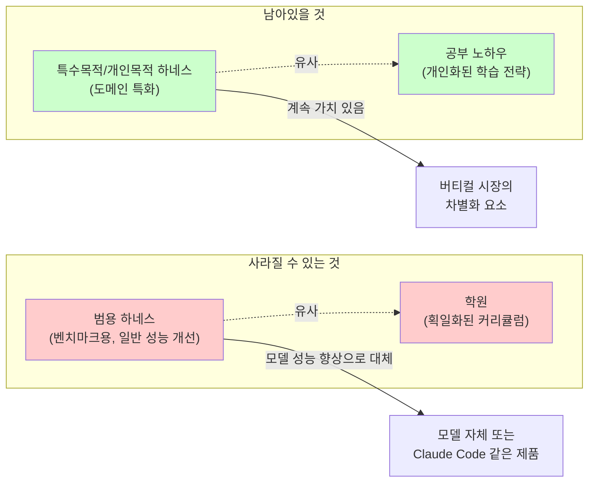
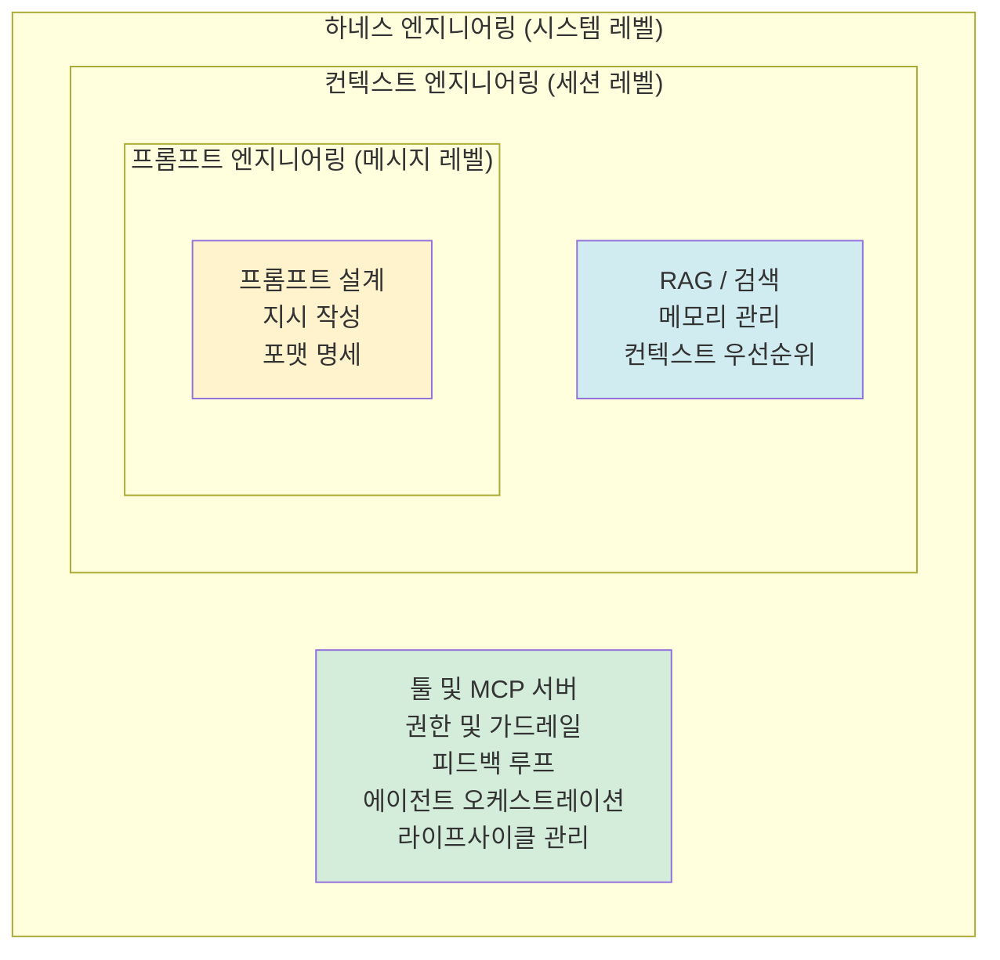
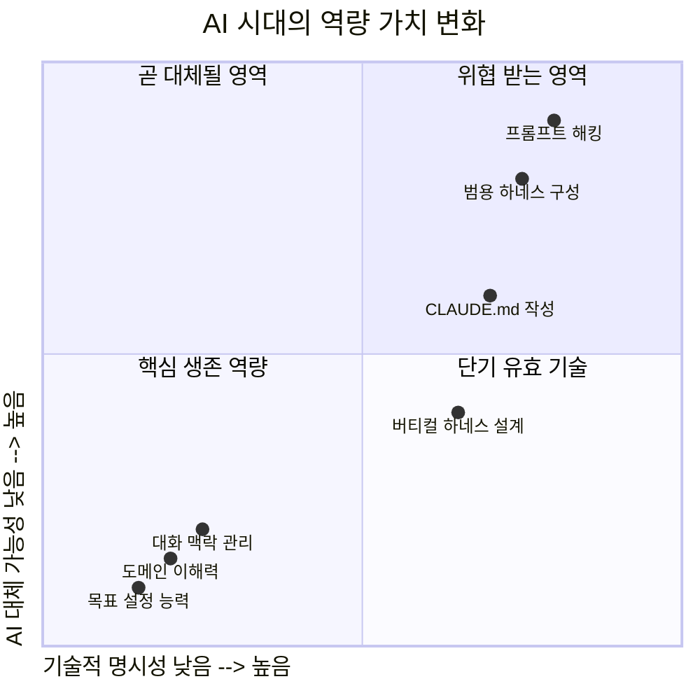
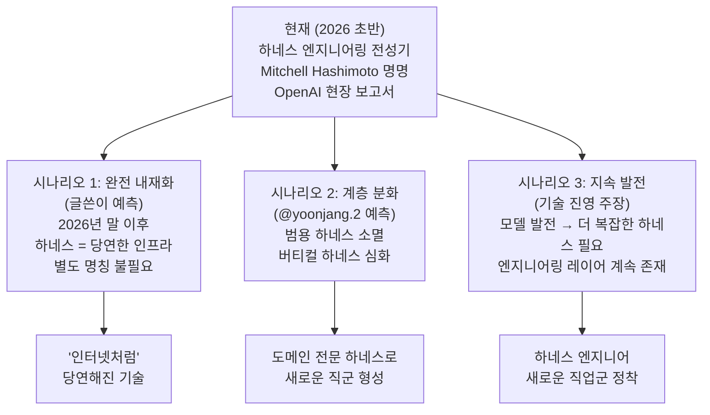

**— @uxhacker의 Threads 포스트와 댓글 토론 심층 분석**

> 작성일: 2026년 4월 24일  
> 원출처: https://www.threads.com/@uxhacker/post/DXehsL-Esij  
> 관련 댓글: [@pitteruger](https://www.threads.com/@pitteruger/post/DXfIlM1k13a), [@yoonjang.2](https://www.threads.com/@yoonjang.2/post/DXew8NngXM0)

---

## 들어가며: 이 대화가 왜 중요한가

2026년 4월 어느 날, Claude Code와 Codex로 하루를 보낸 @uxhacker(이하 '글쓴이')가 Threads에 올린 짧은 단상이 예상치 못한 토론을 불러일으켰다. 주제는 겉보기에 단순하다. "하네스 엔지니어링이라는 말이 곧 사라질 것 같다"는 예측, 그리고 "결국 좋은 대화를 잘 하는 사람이 AI 시대에 살아남는다"는 통찰이다.

그러나 이 짧은 게시물은 2025~2026년 AI 개발 생태계를 관통하는 핵심 질문들을 동시에 건드린다. 하네스 엔지니어링이란 무엇인가? 프롬프트 엔지니어링과 어떻게 다른가? 모델이 똑똑해질수록 사람의 역할은 어떻게 바뀌는가? 그리고 무엇보다 — AI 시대에 "일 잘 하는 사람"의 조건은 무엇인가?

이 문서는 해당 포스트와 댓글, 그리고 2026년 현재의 하네스 엔지니어링 담론을 교차하여 상세히 분석한다.

---

## 1부: 원문 포스트 분석 — @uxhacker의 4가지 통찰

### 1.1 추억의 하네스: "2026년 크리스마스 이후엔 아무도 이 말을 쓰지 않을 것"

글쓴이는 첫 번째 섹션에서 다소 도발적인 예언을 내놓는다. 하네스 엔지니어링(Harness Engineering)이라는 개념 자체가 2026년 말이면 역사 속으로 사라질 것이라는 전망이다.

비유도 선명하다. "진취적이고 알아서 일 잘하는 직원에게 마이크로 매니징을 통해 유리천장을 만드는 느낌." 즉, 모델이 점점 자율적이고 강력해지는데, 그 위에 복잡한 제약 구조를 얹는 행위 자체가 모순처럼 느껴진다는 것이다.

이 주장을 이해하려면 하네스 엔지니어링이 왜 등장했는지부터 되짚어야 한다.

하네스 엔지니어링은 2026년 2월 Terraform 창시자 Mitchell Hashimoto가 그의 블로그에서 명명하고, 바로 직후 OpenAI가 "Harness engineering: leveraging Codex in an agent-first world"라는 현장 보고서를 발표하면서 업계에 빠르게 퍼진 개념이다. 핵심 정의는 이렇다: **에이전트 모델을 제외한 모든 것** — 가이드라인, 도구, 메모리 시스템, 제약 조건, 피드백 루프, 라이프사이클 관리 — 이 모든 것을 설계하는 일이다.

Martin Fowler의 공식으로 요약하면: `에이전트 = 모델 + 하네스`.

OpenAI 내부 실험이 이 개념의 현실성을 입증했다. 3명(이후 7명)의 엔지니어로 구성된 팀이 5개월에 걸쳐 약 100만 줄의 코드를 단 한 줄도 직접 작성하지 않고 전부 Codex 에이전트로 생성했다. 1,500건의 PR이 병합되었고, 엔지니어 1인당 하루 평균 3.5건의 PR을 처리했다. 이것이 가능했던 이유는 모델이 더 똑똑해져서가 아니라, **하네스가 정교해졌기 때문**이었다.

그렇다면 글쓴이의 예측은 틀린 것인가? 꼭 그렇지는 않다. 여기에 그의 통찰이 있다. 하네스가 중요하지 않아지는 것이 아니라, 하네스가 **제품 안으로 흡수되어 보이지 않게 된다**는 것이다. 우리가 인터넷을 쓰면서 "TCP/IP 엔지니어링"이라는 말을 쓰지 않는 것처럼.

### 1.2 원판 불변의 법칙: "세련된 복고로서의 프롬프트 엔지니어링"

두 번째 섹션은 더 섬세한 주장을 담고 있다. 하네스가 인프라화된 이후, 우리가 다시 돌아오게 될 본질은 **프롬프트 엔지니어링**이지만, 그것은 초기의 그것과는 다르다는 것이다.

> "초기 프롬프트 엔지니어링은 테크닉적인 측면으로 접근되었다면, 이제는 거시적 시야와 방향성 제시, 분명한 목표, 횡설수설하지 않는 대화, AI와의 티키타카, 적재적소에서 발현되는 센스, 문장 구성과 단어의 사용처럼 우리가 좋은 대화를 했다고 느끼는 사람이 더 잘하게 될 것 같다."

이 구분은 매우 중요하다. 1세대 프롬프트 엔지니어링은 일종의 해킹이었다. "Act as a..."로 시작하는 페르소나 설정, Chain-of-Thought 강요, 특정 형식 지정 등은 모델의 결함을 언어적으로 우회하는 기술이었다.

글쓴이가 말하는 2세대 프롬프트 엔지니어링은 다르다. 이것은 **대화 능력 그 자체**다. 어떤 목표를 향해 대화를 이끄는 능력, 언제 구체적으로 지시하고 언제 큰 그림을 보여줄지 아는 판단력, 불필요한 맥락을 정리하고 핵심을 전달하는 능력. 이것들은 AI가 발전해도 대체되기 어려운 **메타 인지 역량**이다.

### 1.3 멋진 사람: AI와 에이전트를 모두 휘어잡는 사람들

세 번째 섹션은 가장 인간적인 통찰을 담고 있다. 글쓴이는 실생활에서 누구나 경험하는 것을 꺼낸다. "몇 번 이야기해보면 '아, 좋은 대화를 했다', '너무 즐거웠다' 하는 대화가 있다."

이런 사람들의 특징을 그는 이렇게 묘사한다:
- 언제 시작하고 끝맺을지 안다
- 지금 이 주제로 전환하는 게 좋은지 캐치한다  
- 업무 이야기라도 깔끔하고 담백하게 끝낸다

그리고 그의 결론: "이런 사람들이 AI 시대에 사람과 에이전트 모두 휘어잡지 않을까."

이것은 단순한 소프트 스킬 예찬이 아니다. AI 에이전트와의 상호작용에서도 동일한 원리가 작동한다는 통찰이다. 에이전트가 길을 잃지 않도록 맥락을 제공하는 것, 작업이 완료되었음을 인지하고 마무리하는 것, 진행 방향이 잘못되고 있을 때 적시에 수정하는 것 — 이것들은 전부 "좋은 대화 상대"의 역량이기도 하고, 효과적인 AI 협업의 역량이기도 하다.

### 1.4 뜬금없는 사람: AI 시대의 최약자

마지막 섹션은 짧지만 신랄하다. "몇 시간이 지나서 이미 끊긴 맥락을 이야기하거나, 주요 대화/톡 주제 사이에 엉뚱한 말을 하는 사람들." 글쓴이는 이것이 "최악"이라고 표현한다.

이 부분은 AI 에이전트와의 작업 패턴으로 직접 번역된다. 긴 맥락의 작업 중 갑자기 무관한 지시를 끼워 넣거나, 완료된 주제를 몇 시간 뒤에 다시 꺼내거나, 에이전트가 특정 작업에 집중하고 있을 때 전혀 다른 일을 시키는 행위. 이것들은 에이전트의 컨텍스트를 오염시키고 작업 품질을 저하시킨다.

---

## 2부: 댓글 토론 분석 — 반론과 심화

### 2.1 @pitteruger의 반론: "클로드 코드 자체가 하네스"

첫 번째 댓글은 날카로운 모순을 지적한다.

> "클로드 코드 자체가 하네스입니다. 하네스를 쓰고 있으면서 하네스가 중요하지 않을거라는 모순적인 글이네요."

이 반론은 논리적으로 타당하다. Claude Code는 실제로 하네스다. Anthropic 자체의 엔지니어링 블로그에 따르면, Claude Code는 스트리밍 에이전트 루프, 권한 기반 툴 디스패치 시스템, 컨텍스트 관리 레이어로 구성된 정교한 하네스 위에서 동작한다. Claude Code가 2026년 초 연간 반복 매출(ARR) 10억 달러를 돌파한 것은 더 나은 프롬프트 때문이 아니라, **더 나은 하네스** 때문이었다.

그렇다면 "하네스를 쓰면서 하네스가 필요 없다고 한다"는 모순은 성립하는가?

### 2.2 @uxhacker의 해명: "인터넷으로 사업하면서 인터넷 엔지니어링이라고 말하지 않는 것처럼"

글쓴이의 반응은 솔직하고 동시에 논점을 정교하게 재정립한다.

> "말씀대로 클로드 코드 자체가 하네스 맞습니다. oh-my-x 시리즈나 superpowers 같은, 클로드 코드나 코덱스 제품만이 아니라 이 제품을 감싸는 **별도 워크플로 프리셋**을 표현하려 했던 것이 좀 부족했네요."

여기서 그의 원래 주장이 더 명확해진다. 그가 "사라질 것"이라고 말했던 것은 Claude Code나 Codex 같은 **하네스 제품 자체**가 아니라, oh-my-x, superpowers 같은 **제품 위에 덧씌우는 별도 커스텀 하네스 레이어**에 대한 명시적 언급이었다.

비유는 정확하다: "우리 모두 인터넷을 쓰고 있지만 인터넷으로 사업한다고 잘 말하지 않는 것처럼." 인터넷은 당연한 인프라가 되었고, 그 위에서 어떤 서비스를 만드는지가 화제가 된다. 마찬가지로 하네스 엔지니어링도 충분히 성숙하면 제품 안에 내재화되어 별도 언급이 불필요해진다는 것이다.

### 2.3 @yoonjang.2의 심화 분석: "프롬프트 엔지니어링 ≠ 하네스 엔지니어링"

두 번째 댓글은 개념의 정교한 분리를 시도한다.

> "프롬프트 엔지니어링: 사람과 사람에서도 내가 바라는 결과물에 대한 소통의 기술임  
> 하네스 엔지니어링: 사람과 사람, 직장, 기성 워크플로우에서도 필요한 역할배분이 있음"

이 정의는 주목할 만하다. 그는 두 개념을 AI에만 한정하지 않고 인간 관계와 조직으로 확장한다. 프롬프트 엔지니어링은 "원하는 결과물을 얻기 위한 소통 기술"로, 하네스 엔지니어링은 "역할 배분과 구조 설계"로 각각 더 보편적인 개념으로 환원한다.

이 관점에서 그의 두 번째 통찰이 나온다: **범용 하네스는 사라져도 특수 목적 하네스는 살아남는다.**

> "단순 벤치마크를 늘려주려 사용하는 범용 하네스쪽에 있어서는 점점 의미가 줄어들거란 거 동의합니다. 점점 더 좁은 의미의 또는 특수목적/개인목적 하네스로 집중하게 되지 않을지"

학원과 공부 노하우의 비유가 이를 명쾌하게 설명한다:

**공부 노하우**는 "어디부터 어디까지는 버리고, 어디부터 어디까지는 집중하되, 틀리면 안 되고, 복습해야 한다"는 개인화된 전략 시스템이다. 이것은 모델이 아무리 좋아져도 AI가 개인을 대신해 만들어줄 수 없다. 반면 **학원**은 이 노하우를 획일적으로 전달하는 인프라로, AI 튜터가 충분히 대체할 수 있다.

### 2.4 @uxhacker의 재응답: 버티컬 하네스의 시장 가능성과 한계

글쓴이는 @yoonjang.2의 비유에 감탄하면서도 현실적인 시장 분석을 덧붙인다.

> "말씀하신 버티컬 영역에서 하네스는 돈이 될수도 있겠다 싶다가도 Claude Cowork 같은 제품으로 커버되지 않는 특수목적을 찾다보면 또 시장이 작을 것 같기도 하고 그렇네요."

이 반응은 솔직한 딜레마를 드러낸다. Claude Cowork, Cursor, Windsurf 같은 제품들이 점점 더 많은 워크플로를 커버해가면서, "Claude Cowork로는 안 되지만 커스텀 하네스가 필요한" 영역이 과연 얼마나 크고 지속 가능한가라는 질문이다.

---

## 3부: 2026년 현재 하네스 엔지니어링 생태계

### 3.1 개념의 계층 구조

2026년 현재, 세 가지 엔지니어링 패러다임은 경쟁 관계가 아니라 **포함 관계**로 이해되고 있다.

비유로는 컴퓨터의 계층 구조가 가장 적합하다:
- **모델 = CPU** (연산 수행)
- **컨텍스트 = RAM** (작업 메모리)
- **하네스 = 운영체제** (전체 실행 환경)

### 3.2 실증 데이터: 하네스의 효과

하네스의 실질적 효과는 수치로 확인된다.

| 실험 | 결과 |
|------|------|
| OpenAI Codex 팀 (2025.08~2026.02) | 3명→7명 엔지니어로 100만 줄 코드, 수동 작성 0줄, 속도 10배 향상 |
| Princeton 연구 | 하네스 최적화로 해결률 64% 향상 (기본 설정 대비) |
| Stanford HAI (2025년 말) | 프롬프트 개선의 품질 향상 효과 < 3%, 하네스 레벨 변경 28~47% |
| Stripe | 주간 1,300건의 AI 생성 PR 병합 |
| Claude Code | 출시 6개월 내 연간 반복 매출 10억 달러 돌파 |

### 3.3 oh-my-x, superpowers: 글쓴이가 말한 "별도 워크플로 프리셋"

글쓴이가 언급한 "oh-my-x 시리즈나 superpowers 같은" 것들은 Claude Code나 Codex **위에** 얹히는 추가 구성 레이어다. CLAUDE.md, 커스텀 슬래시 명령어, 훅(hook) 설정, 서브에이전트 구성 등이 여기에 해당한다.

글쓴이의 논지는 이런 외부 구성 레이어들이 점차 Claude Code나 Codex 같은 제품 자체에 흡수될 것이라는 예측이다. Skills 시스템이 표준화되고, CLAUDE.md 패턴이 제품 내 기본값으로 채택되며, MCP 서버 생태계가 성숙해지면 — 별도로 "하네스를 짜는" 행위의 필요성이 줄어든다.

---

## 4부: 진짜 질문 — AI 시대에 무엇이 살아남는가

### 4.1 기술의 범용화 vs. 인간 역량의 희소화

글쓴이의 전체 포스트를 관통하는 핵심 명제는 이것이다:

> **"AI 시대에 일을 잘한다는 건 결국 대화하기 좋은 사람, 어쩌면 그냥 좋은 사람이 되는 것 아닐까."**

이것은 단순한 낙관론이 아니다. 기술 레이어가 제품으로 추상화될수록, **남는 차별점은 기술이 아니라 맥락 판단력과 소통 능력**이라는 구조적 주장이다.

### 4.2 @yoonjang.2의 교육 비유가 주는 더 깊은 통찰

학원 vs. 공부 노하우의 비유는 단순히 하네스 분류의 이야기가 아니다. 이것은 **암묵지(tacit knowledge)와 형식지(explicit knowledge)의 분리**에 관한 이야기다.

학원의 커리큘럼은 형식지다 — 명시적이고, 전달 가능하며, 복제 가능하다. 그래서 AI가 대체하기 쉽다. 반면 공부 노하우는 암묵지에 가깝다 — "어디를 버릴지" 아는 판단력, "언제 복습할지" 결정하는 타이밍 감각, 자신의 약점 패턴 인식. 이것들은 개인화된 경험의 축적이다.

하네스도 마찬가지다. 범용 하네스(CLAUDE.md 템플릿, 표준 훅 설정)는 형식지화될수록 제품에 흡수된다. 그러나 특정 조직의 도메인 지식, 특정 팀의 코드베이스 철학, 특정 제품의 엣지 케이스 대응 — 이것들은 암묵지에 가까워 자동화되기 어렵다.

### 4.3 @uxhacker가 제기한 딜레마의 현실적 해석

글쓴이가 마지막에 토로한 딜레마 — "버티컬 하네스가 돈이 될 것 같다가도, Claude Cowork가 커버 못 하는 특수목적을 찾으면 시장이 작다" — 는 실제로 스타트업 전략에서 매우 현실적인 긴장이다.

이것은 사실상 **빌드 vs. 바이(Build vs. Buy)** 딜레마의 AI 버전이다. Claude Cowork나 Cursor 같은 수평적 플랫폼이 강력해질수록, 그 위에 수직 특화된 레이어를 만드는 것의 경제성 계산이 달라진다. 시장이 작을수록 수익화가 어렵지만, 반대로 플랫폼 경쟁자도 적다.

---

## 5부: 종합 — 이 대화가 남기는 질문들

### 5.1 하네스의 미래: 세 가지 시나리오

### 5.2 @uxhacker의 "좋은 사람" 테제의 의미

글쓴이의 마지막 결론 — "좋은 대화를 하는 사람, 어쩌면 그냥 좋은 사람" — 은 처음에는 너무 추상적으로 들릴 수 있다. 그러나 이 대화 전체의 맥락에서 보면, 이것은 구체적인 역량 집합을 가리킨다.

**AI와 일하는 "좋은 사람"의 구체적 역량:**

1. **목표 명확화 능력**: 에이전트에게 "좋은 코드를 써라"가 아니라 "이 기능의 성능 병목을 프로파일링하고, 상위 3가지 개선점을 코드와 함께 제안해라"라고 말할 수 있는 사람.

2. **맥락 경제성**: 에이전트의 컨텍스트 창을 낭비하지 않는 사람. 관련 없는 배경을 길게 설명하지 않고, 필요한 정보만 정확히 제공한다.

3. **적시 개입**: 에이전트가 잘못된 방향으로 가고 있을 때 3시간 뒤가 아니라 적절한 시점에 교정한다.

4. **완료 인식**: 작업이 끝났음을 인식하고 대화를 깔끔하게 마무리한다. "뜬금없는 사람"의 반대.

5. **거시적 방향성**: 세부 구현보다 전체 목표를 먼저 보는 능력. 에이전트에게 숲을 보여주고, 나무는 에이전트가 결정하게 한다.

이것들은 사실 AI 이전에도 좋은 협업자, 좋은 리더, 좋은 PM의 조건들이었다. 하네스 엔지니어링이 인프라화될수록, 이 역량들의 상대적 가치가 높아진다는 것이 이 대화의 핵심이다.

---

## 결론: 기술의 민주화와 지혜의 희소화

이 Threads 대화는 표면적으로는 하네스 엔지니어링의 수명에 관한 이야기처럼 보이지만, 실제로는 더 근본적인 질문을 다룬다: **기술이 도구화될수록 무엇이 차별화 요소로 남는가?**

글쓴이(@uxhacker)는 직관을 통해, @yoonjang.2는 비유를 통해, @pitteruger는 반론을 통해 모두 같은 지점에 수렴한다. 하네스가 제품에 흡수되고, 컨텍스트 엔지니어링이 자동화되며, 프롬프트 기법이 표준화될수록 — 남는 것은 **판단력, 소통 능력, 그리고 방향감각**이다.

AI 시대에 가장 중요한 스킬은 AI를 잘 다루는 기술이 아니라, 무엇을 위해 AI를 쓸지 아는 지혜일지도 모른다. 그리고 그것은 코드나 문서로 표현되기 어려운, 그래서 어느 제품에도 흡수되지 않는, 온전히 인간의 몫으로 남는 영역이다.

---

*이 문서는 @uxhacker의 Threads 포스트(2026년 4월), @pitteruger 및 @yoonjang.2와의 댓글 토론, 그리고 2026년 4월 기준 하네스 엔지니어링 관련 최신 자료를 바탕으로 작성되었습니다.*

*참고 출처: Anthropic Engineering Blog, Mitchell Hashimoto 블로그, OpenAI Harness Engineering 현장 보고서, Louis Bouchard의 Harness Engineering 분석, Data Science Dojo, Atlan, Epsilla*
