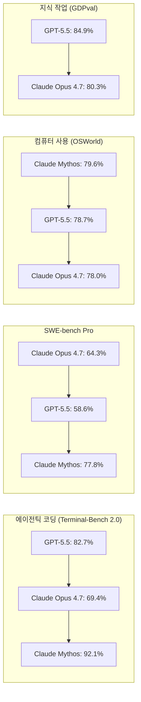
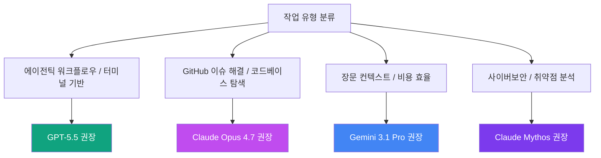
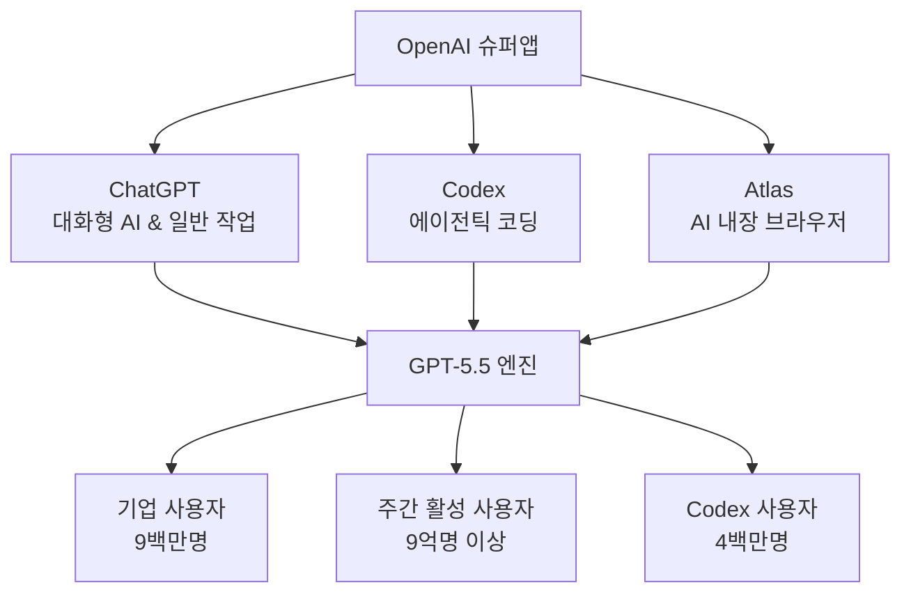
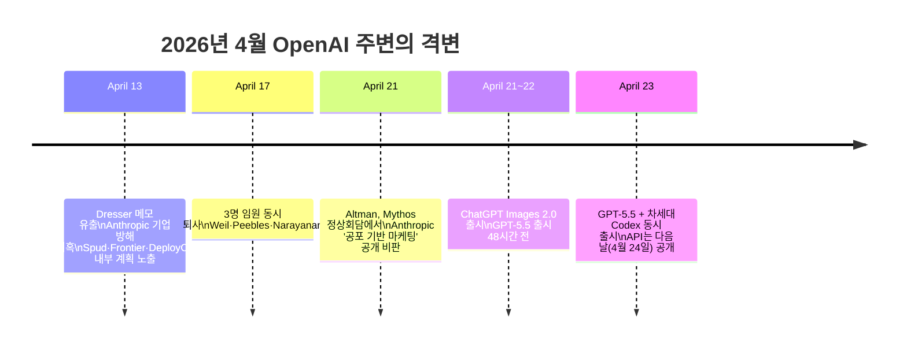
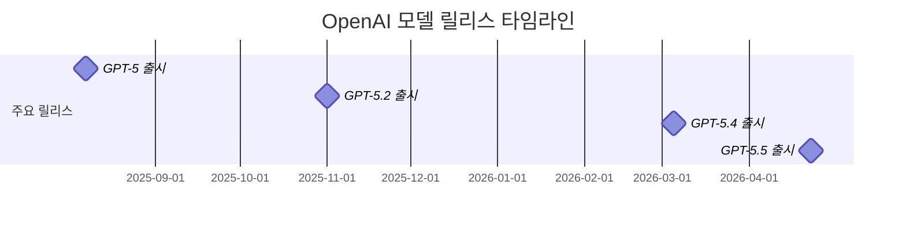
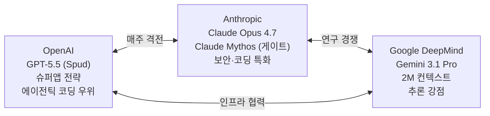

> 2026년 4월 23일 발표 | 코드명 "Spud" | OpenAI 사상 최초의 완전 재훈련 기반 모델

---

## 들어가며: 조용한 발표가 남긴 거대한 파장

2026년 4월 23일 오전 10시(태평양 표준시), OpenAI는 GPT-5.5를 유료 구독자에게 배포하기 시작했다. 발표 자체는 담담했지만, 업계의 반응은 조용하지 않았다. 단순히 새로운 모델이 나온 것이 아니었다. GPT-5.5는 OpenAI가 그간 쌓아온 기술 궤적의 방향을 단숨에 드러낸 신호탄이었다.

이 문서는 nerdy.log(@nerdy.log)가 Threads에 게재한 관찰을 출발점으로 삼아, GPT-5.5의 기술적 실체, 시장 맥락, 경쟁 구도, 그리고 사용자 경험 변화를 심층적으로 분석한다. "더 빠르고 똑똑한 AI"라는 표면 아래 어떤 판이 다시 설계되고 있는지, 그 본질을 서술한다.

---

## 1. GPT-5.5란 무엇인가: 기술적 정체성

### 1-1. 코드명 "Spud"와 완전 재훈련의 의미

GPT-5.5의 내부 코드명은 **"Spud"** 였다. 겉으로는 단순한 버전 업그레이드처럼 보이지만, 이 모델은 GPT-4.5 이후 OpenAI가 처음으로 기반부터 완전히 재훈련한(full retrain) 기저 모델(base model)이다. GPT-5.1, 5.2, 5.3, 5.4는 모두 동일한 기반 위에서 사후 훈련(post-training)을 반복한 결과물이었다. GPT-5.5는 다르다. 아키텍처 수준에서 새롭게 설계된 것이다.

OpenAI의 공동창업자이자 사장인 **Greg Brockman**은 언론 브리핑에서 이를 "진정한 의미에서의 새로운 지능 클래스"라고 불렀다. 그는 "이 모델이 앞으로 우리가 컴퓨터를 사용하는 방식, 컴퓨터 작업을 하는 방식의 토대를 놓는다는 느낌"이라고 표현했다.

OpenAI 수석 과학자 **Jakub Pachocki**는 한발 더 나아가 "지난 2년은 놀랍도록 느린 발전 속도였다"고 자평했다. GPT-5.5의 등장이 그 정체기의 종료 선언임을 시사한 발언이었다.

### 1-2. 옴니모달 아키텍처

GPT-5.5는 텍스트, 이미지, 오디오, 비디오를 단일 통합 아키텍처 안에서 처리하는 **네이티브 옴니모달(omnimodal)** 구조를 채택했다. 이전 모델들이 여러 모달을 "연결"하는 방식으로 처리했다면, GPT-5.5는 이를 하나의 기반 수준에서 통합적으로 다룬다.

### 1-3. 인프라: NVIDIA GB200 NVL72

GPT-5.5는 NVIDIA GB200 NVL72 랙 기반의 인프라 위에서 운영된다. 이 구성은 기존 대비 토큰 100만 개당 비용을 35배 낮춰주는 효율성을 제공한다. 더 강력한 모델을 더 싸게 운영할 수 있는 토대가 마련된 것이다.

---

## 2. 핵심 기능: "실제 업무를 위한 AI"

OpenAI는 GPT-5.5를 단순한 챗봇이 아닌 **"업무 실행 레이어(execution layer)"** 로 정의한다. 질문에 답하는 것을 넘어, 복잡한 목표를 이해하고, 도구를 사용하고, 결과를 스스로 검토하고, 끝까지 작업을 완수하는 시스템을 지향한다.

### 2-1. 에이전틱 코딩 (Agentic Coding)

GPT-5.5가 가장 두드러진 성과를 보이는 영역은 에이전틱 코딩이다. 단순히 코드 조각을 완성하는 것이 아니라, 프로젝트 구조를 파악하고, 실패 원인을 찾아내고, 관련 파일을 수정하고, 테스트를 추가하고, 결과를 검증하는 전 과정을 스스로 수행한다.

OpenAI는 GPT-5.5가 Codex 작업에서 GPT-5.4보다 **약 40% 적은 토큰**으로 동일한 작업을 완수한다고 밝혔다. 이는 비용과 대기 시간 모두를 낮추는 효율성 향상이다.

실제 사례로, OpenAI의 커뮤니케이션 팀은 GPT-5.5를 활용해 6개월치 강연 요청 데이터를 처리했다. 모델이 스스로 평가 기준과 리스크 프레임워크를 구축하고, 저위험 승인을 자동화하는 워크플로우를 완성했다. OpenAI 직원의 **85% 이상이 Codex를 주간 단위로 사용**하고 있으며, 대상 부서는 엔지니어링에 그치지 않고 재무, 마케팅, 데이터 사이언스, 제품 관리 등 전사로 확장됐다.

### 2-2. 컴퓨터 사용 (Computer Use)

GPT-5.5는 소프트웨어 인터페이스를 해석하고, 액션을 취하고, 워크플로우 간에 자연스럽게 전환할 수 있다. OpenAI 수석 연구 책임자 **Mark Chen**은 "모델이 컴퓨터 작업을 탐색하는 데 전임 모델들보다 훨씬 뛰어나다"고 설명했다.

NVIDIA는 전사 30,000명 이상의 직원이 GPT-5.5 기반 Codex에 접근할 수 있도록 배포를 완료했다. Jensen Huang이 전 직원에게 '광속 점프'를 권한 이메일은 이 기술이 더 이상 개발자 전용이 아님을 상징한다.

### 2-3. 지식 작업 및 과학 연구

GPT-5.5는 문서, 스프레드시트, 슬라이드를 생성하고, 다단계 온라인 리서치를 수행하며, 데이터를 분석하고 정리하는 데 최적화됐다. Mark Chen은 특히 "과학 및 기술 연구 워크플로우에서 의미 있는 향상"을 보이며, 전문 과학자들의 진보를 실질적으로 도울 수 있는 잠재력을 언급했다. 약물 발견(drug discovery) 분야도 구체적인 응용 사례로 제시됐다.

내부 연구 성과로는, GPT-5.5의 특수 버전이 수학의 Ramsey 수에 관한 새로운 증명을 발견하고, 이를 Lean 증명 시스템으로 검증했다는 사례가 공개됐다.

---

## 3. 속도와 안전성의 균형

### 3-1. 지연 없는 고성능

GPT-5.5는 성능이 크게 향상됐음에도 **GPT-5.4와 동일한 토큰당 지연(per-token latency)** 을 유지한다. 일반적으로 더 강력한 모델은 더 느려지기 마련인데, 이 균형을 유지한 것은 기술적으로 주목할 만한 성과다.

실제로 GPT-5.5는 OpenAI 자체 서빙 인프라의 로드 밸런싱 휴리스틱을 Codex로 직접 개선하여 **토큰 생성 속도를 20% 이상 향상**시켰다. 모델이 자신을 운용하는 인프라를 개선하는 재귀적 사이클이 시작된 것이다.

### 3-2. 안전 등급: "High" 위험

OpenAI의 준비 프레임워크(Preparedness Framework) 기준으로 GPT-5.5는 사이버보안과 생물학 역량에서 **"High" 위험** 등급을 받았다. 이는 현재 OpenAI 안전 등급의 최상위에 근접한 수준이다.

이에 대해 OpenAI 연구 부사장 **Mia Glaese**는 "수개월에 걸쳐 사이버 안전장치를 반복 개선해왔으며, 이번 모델에 가장 강력한 안전장치 세트를 적용했다"고 밝혔다. 내부 및 외부 레드팀, 사이버보안·생물학 전문 추가 테스트, 200개에 가까운 신뢰 파트너와의 실제 사용 사례 검토를 거쳤다.

비교 맥락으로, Anthropic의 **Claude Mythos**는 소프트웨어 취약점 발견 역량이 너무 강력하여 일반 공개를 제한한 바 있다. GPT-5.5는 "High" 등급이지만 이 "Critical" 임계점에는 도달하지 않은 것으로 판단됐다.

---

## 4. 벤치마크: 숫자로 읽는 격전

2026년 4월은 AI 역사에서 전례 없는 3강 경쟁이 펼쳐진 달이었다. OpenAI GPT-5.5, Anthropic Claude Opus 4.7(4월 16일), Google Gemini 3.1 Pro가 거의 동시에 등장했다.

### 4-1. GPT-5.5가 앞서는 영역

| 벤치마크 | GPT-5.5 | Claude Opus 4.7 | 비고 |
|---|---|---|---|
| Terminal-Bench 2.0 | **82.7%** | 69.4% | 에이전틱 터미널 작업 |
| OSWorld-Verified | **78.7%** | 78.0% | 컴퓨터 사용 (근소한 차이) |
| GDPval | **84.9%** | 80.3% | 전문가 수준 지식 작업 |
| CyberGym | **81.8%** | 73.1% | 사이버보안 역량 |
| FrontierMath Tier 4 | **35.4%** | 22.9% | 최고 난도 수학 |
| MRCR v2 (1M) | **74%** | N/A | 장문 컨텍스트 검색 |

### 4-2. Claude Opus 4.7가 앞서는 영역

| 벤치마크 | Claude Opus 4.7 | GPT-5.5 | 비고 |
|---|---|---|---|
| SWE-bench Pro | **64.3%** | 58.6% | 실제 GitHub 이슈 해결 |
| MMLU 다국어 | **91.5%** | 83.2% | 다국어 이해 |
| MCP-Atlas | **79.1%** | 75.3% | 도구 오케스트레이션 |
| HLE no-tools | **46.9%** | 41.4% | 도구 없는 추론 |

### 4-3. Claude Mythos의 위상

Anthropic의 Claude Mythos Preview는 일반 공개를 제한한 모델임에도 벤치마크에서 두 모델 모두를 압도하는 영역이 있다. Terminal-Bench 2.1 기준으로 Mythos는 92.1%를 기록했다(GPT-5.5는 82.7%, GPT-5.4는 75.3%). SWE-bench Verified에서는 93.9%로 현존 최고 수준이다. 단, Mythos는 전략적 목적(Project Glasswing)의 게이트 모델이기에 직접 비교에는 한계가 있다.

### 4-4. 세 모델의 분업 구도

2026년 4월 현재, 최고 성과를 추구하는 엔지니어링 팀들은 단일 모델을 고집하지 않는다. 작업 유형별로 최적 모델을 라우팅하는 **멀티모델 아키텍처**가 실질적인 표준으로 부상했다.

---

## 5. 가격: 비쌈과 효율의 역설

### 5-1. API 가격 구조

| 모델 | 입력 (100만 토큰) | 출력 (100만 토큰) |
|---|---|---|
| GPT-5.5 표준 | $5 | $30 |
| GPT-5.5 Pro | $30 | $180 |
| Claude Opus 4.7 | ~$5 | ~$25 |
| Gemini 3.1 Pro | (상대적 저가) | (상대적 저가) |

GPT-5.5의 토큰당 가격은 GPT-5.4 대비 2배 인상됐다. 그러나 OpenAI는 이를 "실질 비용 인상이 아니다"라고 주장한다. GPT-5.5가 동일한 Codex 작업을 약 40% 적은 토큰으로 완수하기 때문에, 작업당 실질 비용 증가는 약 20% 수준에 그친다는 논리다. 에이전틱 워크플로우처럼 한 번에 많은 작업을 수행하는 경우, 효율성 향상이 가격 인상분을 상쇄하거나 초과하는 시나리오도 가능하다.

Batch와 Flex 모드는 표준 요금의 절반으로, Priority 모드는 2.5배로 제공된다.

### 5-2. Bank of New York Mellon의 평가

뱅크 오브 뉴욕 멜론의 CIO Leigh-Ann Russell은 사전 테스트 결과를 이렇게 평했다. "5.5에서 실질적으로 중요하게 보이는 것은 응답 품질, 그리고 매우 인상적인 환각 저항성입니다. 은행은 높은 정확도가 필수이므로, 이 부분이 매우 중요합니다. 이 모델에서 진정한 단계적 변화를 목격하고 있습니다." 220개 이상의 AI 유스케이스를 운영 중인 이 은행에서 정확도 개선은 전체 스케일링 속도를 직접 결정한다.

---

## 6. 슈퍼앱 전략: 기술 기업에서 플랫폼 기업으로

GPT-5.5 발표의 가장 중요한 함의는 모델 성능 향상 자체가 아니다. OpenAI가 공개적으로 천명한 **"슈퍼앱(Super App)" 전략**이다.

Greg Brockman은 GPT-5.5를 "더 에이전틱하고 직관적인 컴퓨팅을 향한 큰 걸음"이라 불렀다. 이 발언은 단순한 모델 홍보가 아니라, OpenAI의 다음 행보를 예고한 것이다.

### 6-1. 슈퍼앱의 구성

OpenAI가 구상 중인 슈퍼앱은 ChatGPT(대화 및 일반 작업), Codex(코딩 에이전트), Atlas(AI 내장 브라우저)를 하나의 통합된 네이티브 데스크탑 환경으로 묶는 것이다. 사용자는 대화, 코딩, 웹 탐색, 실행을 탭 전환 없이 단일 인터페이스에서 완수하게 된다. 첫 번째 주요 프리뷰는 2026년 말 공개될 예정이며, GPT-5.5("Spud")가 이 통합 아키텍처의 기반 엔진 역할을 맡는다.

### 6-2. Sora 종료와 전략적 집중

이 맥락에서 주목해야 할 것이 Sora의 종료다. OpenAI는 Sora에 투입되던 컴퓨팅 자원을 GPT-5.5(Spud)와 슈퍼앱 개발로 전환했다. 창의적 실험 도구에서 생산성 중심의 기업형 AI 플랫폼으로의 전략적 피벗(pivot)을 공식화한 결정이다.

### 6-3. 현재 규모와 위치

OpenAI에 따르면 현재 ChatGPT는 주간 활성 사용자 9억 명 이상, 유료 구독자 5000만 명 이상, 비즈니스 유료 사용자 9백만 명을 확보하고 있다. Codex 활성 사용자는 4백만 명에 달한다. 이 숫자들은 경쟁사들이 쉽게 따라잡을 수 없는 플랫폼 효과의 기반이다.

---

## 7. 출시 맥락: 격변의 10일

GPT-5.5 출시는 진공 상태에서 일어난 사건이 아니다. 앞서 10일 동안 OpenAI는 Slack CEO였던 Denise Dresser의 합류를 공식화한 동시에, 세 명의 임원이 동시에 떠나는 흔들림을 겪었다. Anthropic의 Claude Mythos 공개, Altman의 공개적 반격, 그리고 Images 2.0 출시가 연달아 이어진 뒤 GPT-5.5가 등장했다. 분석가들은 이 발표 순서를 "의도적 시퀀싱"으로 읽는다. 나쁜 헤드라인을 기술 발표로 덮는 PR 전략이었다는 것이다.

---

## 8. 릴리스 속도: "8주 주기"의 구조적 의미

GPT-5.4 출시(3월 5일)에서 GPT-5.5 출시(4월 23일)까지의 간격은 **48일**이다. 2024년 주요 AI 모델의 평균 출시 간격이 16주(약 112일)였음을 감안하면, 이 속도는 업계 기준을 반으로 압축한 것이다.

이 가속의 원동력은 두 가지다. 하나는 **인프라 통제**: GB200 NVL72 기반의 자체 인프라는 실험 사이클을 획기적으로 단축시킨다. 다른 하나는 **경쟁 압력**: Anthropic의 기업 시장 잠식에 대한 긴박감이 출시 타이밍을 앞당겼다.

그러나 이 속도에는 부작용도 있다. 벤치마크 평가 일정이 릴리스 속도를 따라잡지 못하고 있다. 업계 평가 인프라가 아직 8주 주기에 맞게 설계되지 않았기 때문이다. 이는 안전성 검증의 빈틈이 생길 수 있다는 우려로 이어진다.

---

## 9. 사용자 경험의 갈등: 혁신과 혼란 사이

nerdy.log의 글이 포착한 핵심 긴장은 바로 이 지점이다. GPT-5.5의 발표가 기술적으로 인상적임에도, 사용자 반응은 단순히 환호로 수렴하지 않았다.

### 9-1. 엇갈리는 반응의 구조

**긍정적 반응:** X(구 트위터)에서 @HeyZaraKhan은 "처음으로 ChatGPT가 모든 것을 위한 AI가 되어가고 있다고 자신 있게 말할 수 있다"고 표현했다. 개발자들은 Terminal-Bench 82.7%라는 수치와 코딩 인덱스에서의 절반 비용을 근거로 실질적 가치를 인정했다.

**비판적 반응:** 에탄 몰릭(Ethan Mollick)은 "영역 전반에 걸쳐 들쭉날쭉한 성능(jagged performance)"을 지적했다. 여러 서비스가 한꺼번에 통합되면서 기존 워크플로우에 익숙한 사용자들이 오히려 불편함을 호소했다.

### 9-2. 통합의 대가

슈퍼앱을 향한 기능 통합은 본질적으로 트레이드오프를 수반한다. 단일 기능에 최적화된 도구의 단순함을 포기하고, 복합적이지만 일관된 경험을 얻는 것이다. 그러나 이 전환 과정에서 기존 사용자들이 느끼는 "거리감"은 피할 수 없다. 익숙한 것이 갑자기 낯설어지는 경험이 발생한다.

### 9-3. 개인화의 경계 흐림

슈퍼앱이 모든 것을 관통하는 단일 플랫폼이 되면, 개인화의 깊이와 경계는 어떻게 설정될 것인가. 업무 자동화, 통합 서비스, 개인 데이터의 결합이 가속될수록, 사용자가 느끼는 통제감과 개인화 기대치 사이의 간극도 커질 수 있다.

---

## 10. 경쟁 구도: 2026년 4월의 AI 지형도

**Anthropic:** ARR(연간 반복 매출)이 $9B에서 $30B으로 급성장했다. 기업 시장에서 코딩과 보안 특화 포지셔닝이 주효했다. Claude Mythos는 전략적 방어 자산(Project Glasswing)으로 분류되어, AWS·Apple·Cisco·CrowdStrike·Google·JPMorgan Chase·Microsoft·NVIDIA 등과의 연합 체계 안에서 운용된다.

**Google Gemini 3.1 Pro:** 추론 점수를 전작 대비 2배 향상시키고, 2M 토큰 컨텍스트 창을 제공하며 비용 효율성을 앞세웠다. ARC-AGI-2에서 77.1%를 기록했다.

**Anthropic의 ARR 성장과 OpenAI의 Code Red:** 기업 시장에서 Claude에게 점유율을 잃어가던 OpenAI는 2025년 12월부터 "Code Red" 상태를 선언하고 대응해왔다. GPT-5.5 출시는 이 대응의 결산이기도 하다.

---

## 11. 플랫폼 기업으로의 전환: 역사적 의미

업계에서는 GPT-5.5 발표를 단순한 모델 업그레이드가 아니라, OpenAI가 **기술 기업에서 플랫폼 기업으로 건너가는 순간**으로 평가하는 목소리가 나왔다. 이는 과장이 아니다.

과거 Microsoft가 OS에서 Office 생태계로, 그리고 클라우드 플랫폼으로 진화했듯이, OpenAI는 모델 회사에서 AI 운영 체제 회사로 전환을 선언하고 있다. ChatGPT가 단순 AI 어시스턴트가 아니라 컴퓨터 사용의 기본 인터페이스가 되려는 것이다.

GPT-6 가격이 이미 OpenAI 문서에 등장하고 있다는 점도 주목할 만하다. 릴리스 파이프라인이 이미 그 다음 단계를 향해 돌아가고 있다.

---

## 12. Jiyo의 관점: 기능의 경계를 허물 때 치러야 할 대가

nerdy.log의 글이 가장 정직하게 포착한 것은 기술적 사실이 아니라 **감각적 경험의 변화**다.

"기존의 사용자 경험을 과감하게 내려놓았던 용기가 결과적으로 이번 갈림길을 만든 핵심"이라는 관찰은 통찰적이다. 새로운 판을 여는 것과, 그 판 위로 기존 사용자들을 실어 나르는 것은 다른 문제다.

세 가지 근본적인 갈등이 이번 발표에 담겨 있다.

**첫 번째 갈등은 변화 폭과 적응 속도 사이의 간극이다.** GPT-5.5는 GPT-4.5 이후 첫 완전 재훈련 모델이다. 이미 기저에서 달라진 모델 위에, 기능 통합과 슈퍼앱 전략이라는 사용 패러다임의 변화까지 동시에 요구한다. 사용자의 적응 속도가 OpenAI의 릴리스 속도를 따라갈 수 없는 구조적 문제가 시작되고 있다.

**두 번째 갈등은 통합과 단순함 사이의 긴장이다.** 슈퍼앱이 ChatGPT, Codex, Atlas를 하나로 묶으면, 각각의 도구로서 가졌던 명료함이 흐려진다. "이걸 어디서 해야 하나"라는 질문이 늘어나고, 기능의 경계가 불분명해진다. 이것은 편의성과 복잡성 사이의 전통적인 트레이드오프다.

**세 번째 갈등은 기술 플랫폼과 사용자 익숙함의 충돌이다.** 기술적으로 완성도 높은 시스템이 사용자 경험의 관점에서 오히려 퇴행처럼 느껴지는 역설은 새로운 현상이 아니다. 그러나 AI 도구는 그 속도와 규모 면에서 이 역설을 더욱 날카롭게 드러낸다.

nerdy.log가 남긴 질문, "기능의 경계를 허물려면 그만큼 사용자들의 익숙함도 대가로 내놔야 했던 건 아닐까"는 기술 전략의 영원한 과제를 정확히 짚는다.

---

## 13. 향후 전망

### 13-1. 단기 (2026년 하반기)

슈퍼앱의 첫 번째 주요 프리뷰가 2026년 말 공개될 가능성이 높다. ChatGPT, Codex, Atlas의 통합 인터페이스가 구체적인 형태로 등장할 것이다. API 가격 변화와 구독 구조 개편도 따라올 것으로 예상된다.

### 13-2. 중기 (2027년)

GPT-6가 출시될 경우, 슈퍼앱 전략의 완성도가 본격적으로 평가받는 시점이 될 것이다. 멀티모델 라우팅 레이어를 도입한 기업들과 단일 모델 의존 기업들 사이의 격차가 가시화될 가능성이 있다.

### 13-3. 구조적 과제

릴리스 속도가 8주 이하로 압축되면서, 안전성 평가 인프라와의 간극이 업계 전반의 과제로 부상한다. OpenAI의 "High" 위험 분류가 실제 피해 사례로 이어질 경우, 규제 논의가 급격히 가속될 수 있다. 기업 시장에서 Anthropic과의 경쟁은 2026년 내내 지속될 것이며, 그 승부는 벤치마크 숫자가 아니라 엔터프라이즈 구매 사이클과 플랫폼 록인(lock-in) 효과에 의해 결정될 공산이 크다.

---

## 결론: 기준점이 된 선택

OpenAI의 GPT-5.5 발표는 단일 모델의 출시가 아니었다. 그것은 "AI를 어디까지 받아들일 것인가"에 대한 기준점의 이동이었다.

모든 것을 하나로 묶는 슈퍼앱이 사용자의 삶 속에 깊이 들어올수록, 그 편의성과 의존성, 그리고 통제감의 문제는 더욱 복잡해질 것이다. GPT-5.5는 그 방향을 가리키는 이정표이지, 목적지가 아니다.

판을 여는 시도가 없었다면 지금의 논쟁도, 기대도 없었을 것이다. 그리고 그 논쟁의 한가운데서, 우리는 AI와 함께 사는 법을 다시 배우고 있다.

---

## 참고 자료

- OpenAI 공식 발표: [Introducing GPT-5.5](https://openai.com/index/introducing-gpt-5-5/) (2026.04.23)
- CNBC: [OpenAI announces GPT-5.5, its latest artificial intelligence model](https://www.cnbc.com/2026/04/23/openai-announces-latest-artificial-intelligence-model.html)
- TechCrunch: [OpenAI releases GPT-5.5, bringing company one step closer to an AI 'super app'](https://techcrunch.com/2026/04/23/openai-chatgpt-gpt-5-5-ai-model-superapp/)
- Fortune: [OpenAI launches GPT-5.5 just weeks after GPT-5.4 as AI race accelerates](https://fortune.com/2026/04/23/openai-releases-gpt-5-5/)
- Kingy AI: [Claude Mythos Preview vs. GPT‑5.5 Benchmark Showdown](https://kingy.ai/ai/claude-mythos-preview-vs-gpt-5-5-a-benchmark-by-benchmark-showdown-between-the-two-most-important-frontier-models-of-april-2026/)
- buildfastwithai: [GPT-5.5 Review 2026](https://www.buildfastwithai.com/blogs/gpt-5-5-review-2026)
- Threads 원본: @nerdy.log / DXhgVkiD63L (2026.04.25)

---

*이 문서는 2026년 4월 25일 기준 공개된 정보를 바탕으로 작성되었습니다.*
*작성: Jiyo (LxM Research) | 참고 및 보완: 최신 웹 검색*
