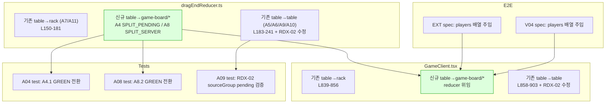

## 관련문서

[**클라우드에서 Ultraplan으로 계획하기**](https://code.claude.com/docs/ko/ultraplan)

## Context

G-B(pendingStore 브릿지) 완료 후 의도된 RED 4건(EXT-SC1/SC3, V04-SC1/SC3)을 해소하기 위한 작업. RED 원인은 두 가지:

1. **dragEndReducer의 table→game-board/game-board-new-group 분기 부재**: table source에서 `overId`가 `"game-board"` 또는 `"game-board-new-group"`이면 `targetGroup = find(overId)`가 null을 반환하여 `target-not-found`로 거절됨. A4(pending split)와 A8(server split)이 작동하지 않음.

2. **E2E fixture에서 `players[].hasInitialMeld` 미설정**: `freshHasInitialMeld` (GameClient:800-807)가 `players[seat].hasInitialMeld`를 1차 SSOT로 참조하는데, `createRoomAndStart`가 생성한 player 객체의 `hasInitialMeld: false`가 fixture의 root `hasInitialMeld: true` 를 덮어씀.

접근: 설계문서 `docs/02-design/59-g-e-rearrangement-guide.md` §4.3 — table source의 game-board/game-board-new-group 경로만 dragEndReducer로 위임, 나머지 인라인 코드 유지.

---

## 변경 흐름



---

## Step 1: DragAction 확장 + A4/A8 분기 추가 (dragEndReducer.ts)

**파일**: `src/frontend/src/lib/dragEnd/dragEndReducer.ts`

### 1a. DragAction 열거형 (L73-80)

`"REORDER_IN_GROUP"` 뒤에 추가:
```typescript
| "SPLIT_PENDING_GROUP"   // A4: pending → 새 그룹 (split)
| "SPLIT_SERVER_GROUP";   // A8: server → 새 그룹 (split)
```

### 1b. A4/A8 분기 삽입 (L181 `table→rack:ok` return 직후, L183 `// ---- table → table ----` 직전)

설계문서 59 §2.5/2.6의 코드를 그대로 사용. 삽입할 블록:

```typescript
// ---- A4/A8: table → game-board / game-board-new-group (새 그룹 split) ----
if (overId === "game-board" || overId === "game-board-new-group") {
  // 1. source 그룹에서 tileCode 제거
  const updatedSourceTiles = [...sourceGroup.tiles];
  if (updatedSourceTiles[source.index] !== tileCode) {
    return rejectWith("index-mismatch", "table→new-group:index-mismatch");
  }
  updatedSourceTiles.splice(source.index, 1);

  // A4: pending source → V-13a 무관
  // A8: server source → hasInitialMeld 필수
  if (!sourceIsPending && !hasInitialMeld) {
    return rejectWith("initial-meld-required", "table→new-group:server-pre-meld");
  }

  // 2. 새 pending 그룹 생성
  const nextSeq = pendingGroupSeq + 1;
  const newGroupId = makeNewGroupId(nextSeq);
  const newGroup: TableGroup = {
    id: newGroupId,
    tiles: [tileCode],
    type: classifySetType([tileCode]),
  };

  // 3. 전체 테이블 갱신 (source 축소 + 신규 추가) — INV-G3: source 빈 → 자동 제거
  const nextTableGroups = tableGroups
    .map(g => g.id === sourceGroup.id
      ? { ...g, tiles: updatedSourceTiles, type: classifySetType(updatedSourceTiles) }
      : g)
    .filter(g => g.tiles.length > 0)
    .concat([newGroup]);

  // 4. INV-G2 방어선
  const dupes = detectDuplicateTileCodes(nextTableGroups);
  if (dupes.length > 0) {
    return rejectWith("duplicate-detected", "table→new-group:dup-guard");
  }

  // 5. pendingGroupIds 갱신
  //    A4: source pending + 새 그룹
  //    A8: source server → pending 전환 (V-17 ID 보존) + 새 그룹
  const nextGroupIdSet = new Set(nextTableGroups.map(g => g.id));
  const nextPendingGroupIds = new Set(
    [...pendingGroupIds, ...(sourceIsPending ? [] : [sourceGroup.id]), newGroupId]
      .filter(id => nextGroupIdSet.has(id))
  );

  return {
    ...defaults,
    nextTableGroups,
    nextPendingGroupIds,
    nextPendingGroupSeq: nextSeq,
    branch: sourceIsPending ? "table→new-group:split-pending" : "table→new-group:split-server",
    action: sourceIsPending ? "SPLIT_PENDING_GROUP" : "SPLIT_SERVER_GROUP",
  };
}
```

### 1c. RDX-02 수정 (L230)

현재:
```typescript
[...pendingGroupIds, targetGroup.id].filter(...)
```
변경:
```typescript
[...pendingGroupIds, sourceGroup.id, targetGroup.id].filter(...)
```

---

## Step 2: GameClient.tsx table→game-board 위임

**파일**: `src/frontend/src/app/game/[roomId]/GameClient.tsx`

### 2a. table→rack return (L856) 직후, table→table (L858) 직전에 삽입

```typescript
// A4/A8: table source → game-board/game-board-new-group → reducer 위임
if (over.id === "game-board" || over.id === "game-board-new-group") {
  const result = dragEndReducer({
    tableGroups: freshTableGroups,
    myTiles: freshMyTiles,
    pendingGroupIds: freshPendingGroupIds,
    pendingRecoveredJokers: freshPendingRecoveredJokers,
    hasInitialMeld: freshHasInitialMeld,
    forceNewGroup: false,
    pendingGroupSeq: pendingGroupSeqRef.current,
  }, {
    source: { kind: "table", groupId: dragSource.groupId, index: dragSource.index },
    tileCode,
    overId: String(over.id),
    now: Date.now(),
  });
  if (!result.rejected) {
    setPendingTableGroups(result.nextTableGroups);
    setPendingMyTiles(result.nextMyTiles ?? freshMyTiles);
    setPendingGroupIds(result.nextPendingGroupIds);
    pendingGroupSeqRef.current = result.nextPendingGroupSeq;
  }
  return;
}
```

상단에 `dragEndReducer` import 추가 (이미 존재하면 확인).

### 2b. RDX-02 수정 (L898)

현재:
```typescript
[...freshPendingGroupIds, targetGroup.id].filter(...)
```
변경:
```typescript
[...freshPendingGroupIds, sourceGroup.id, targetGroup.id].filter(...)
```

---

## Step 3: 단위 테스트 업데이트

### 3a. A04-pending-to-new.test.ts

- **A4.1** (L33-51): `expectRejected(output, "target-not-found")` → `expectAccepted(output)` + 새 그룹 생성 검증 + action === "SPLIT_PENDING_GROUP" 검증
- NOTE 주석 (L8-13) 업데이트: "target-not-found 거절" 설명 제거, "직접 split" 설명으로 교체

### 3b. A08-server-to-new.test.ts

- **A8.2** (L53-70): `expectRejected(output, "target-not-found")` → `expectAccepted(output)` + 새 그룹 생성 + source server group pending 마킹 + action === "SPLIT_SERVER_GROUP" 검증
- NOTE 주석 (L9-12) 업데이트

### 3c. A09-server-to-server-merge.test.ts

- **A9.2** (L66-67) 또는 **A9.5** (L143-146) 에 추가 assertion:
  ```typescript
  expect(output.nextPendingGroupIds.has(sgA.id)).toBe(true);
  ```
  source server 그룹도 pending 마킹 검증 (RDX-02).

---

## Step 4: E2E fixture players 주입

### 4a. rule-extend-after-confirm.spec.ts — setupExtendAfterConfirm (L49-71)

`store.setState({...})` 내부에 `players` 배열 추가:
```javascript
players: [
  { seat: 0, type: "HUMAN", userId: "test-user", displayName: "Test", status: "CONNECTED", hasInitialMeld: true, tileCount: args.rackTiles.length },
  { seat: 1, type: "DEEPSEEK", persona: "Rookie", difficulty: "EASY", psychologyLevel: 0, status: "READY", hasInitialMeld: true, tileCount: 14 },
],
```

### 4b. rule-initial-meld-30pt.spec.ts — setupInitialMeldScenario (L59-76)

`store.setState({...})` 내부에 `players` 배열 추가:
```javascript
players: [
  { seat: 0, type: "HUMAN", userId: "test-user", displayName: "Test", status: "CONNECTED", hasInitialMeld: args.hasInitialMeld ?? false, tileCount: args.rackTiles.length },
  { seat: 1, type: "DEEPSEEK", persona: "Rookie", difficulty: "EASY", psychologyLevel: 0, status: "READY", hasInitialMeld: true, tileCount: 14 },
],
```

### 4c. V04-SC3 인라인 fixture (L199-219)

인라인 `store.setState` 호출에도 동일 패턴의 `players` 배열 추가. `hasInitialMeld: false` (초기 등록 전 시나리오).

---

## Step 5: 회귀 검증

```bash
cd src/frontend
npx jest --passWithNoTests                    # 기존 547+ PASS 유지 + A4/A8 GREEN 전환
npx playwright test e2e/rule-extend-after-confirm.spec.ts e2e/rule-initial-meld-30pt.spec.ts --workers=1
pnpm build                                     # TS 에러 없음
```

기대 결과:
- Jest: 기존 PASS 유지 + A4.1/A8.2 GREEN 전환
- EXT-SC1 GREEN (rack→server run append — fixture players 수정으로 freshHasInitialMeld 정상)
- EXT-SC3 GREEN (rack→server run 앞 append)
- V04-SC3 GREEN (PRE_MELD server drop → 새 pending 분리)
- V04-SC1 RED 유지 (G-F ConfirmTurn 범위)
- 기존 E2E PASS 유지
- `pnpm build` 성공

---

## 수정 대상 파일 요약

| 파일 | Step | 변경 |
|------|------|------|
| `src/frontend/src/lib/dragEnd/dragEndReducer.ts` | 1 | DragAction +2, A4/A8 분기 ~50줄, RDX-02 1줄 |
| `src/frontend/src/app/game/[roomId]/GameClient.tsx` | 2 | table→game-board 위임 ~20줄, RDX-02 1줄, import 확인 |
| `src/frontend/src/lib/dragEnd/__tests__/by-action/A04-pending-to-new.test.ts` | 3 | A4.1 GREEN 전환 |
| `src/frontend/src/lib/dragEnd/__tests__/by-action/A08-server-to-new.test.ts` | 3 | A8.2 GREEN 전환 |
| `src/frontend/src/lib/dragEnd/__tests__/by-action/A09-server-to-server-merge.test.ts` | 3 | RDX-02 assertion 추가 |
| `src/frontend/e2e/rule-extend-after-confirm.spec.ts` | 4 | players fixture 주입 |
| `src/frontend/e2e/rule-initial-meld-30pt.spec.ts` | 4 | players fixture 주입 (공통 + SC3 인라인) |

## 커밋 전략 (3건)

1. `feat(dragEnd): A4/A8 split 분기 + RDX-02 source pending 마킹`  — reducer + GameClient + 단위 테스트
2. `fix(e2e): EXT/V04 fixture players.hasInitialMeld 주입` — E2E fixture
3. (시간 허용 시) `feat(ActionBar): G-F ConfirmTurn selectConfirmEnabled 연결` — V04-SC1 GREEN 준비