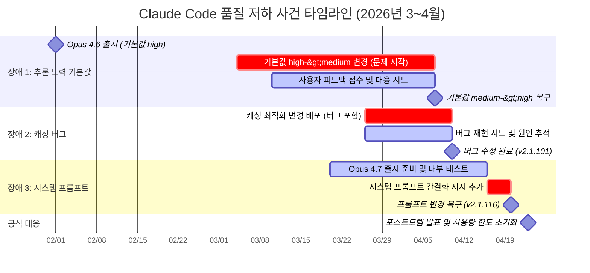
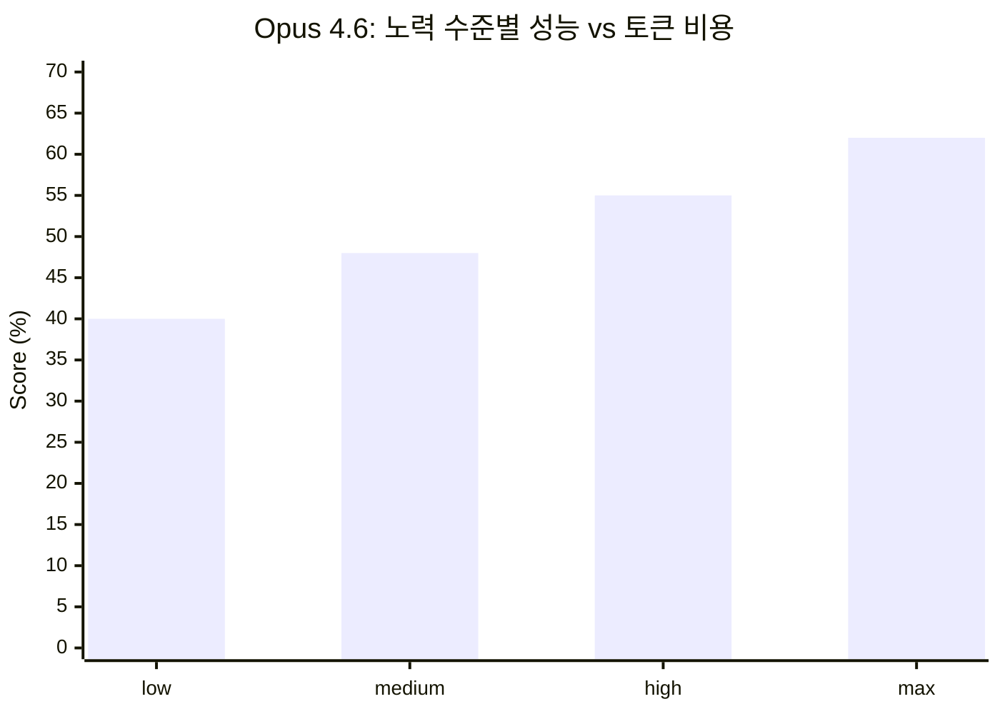
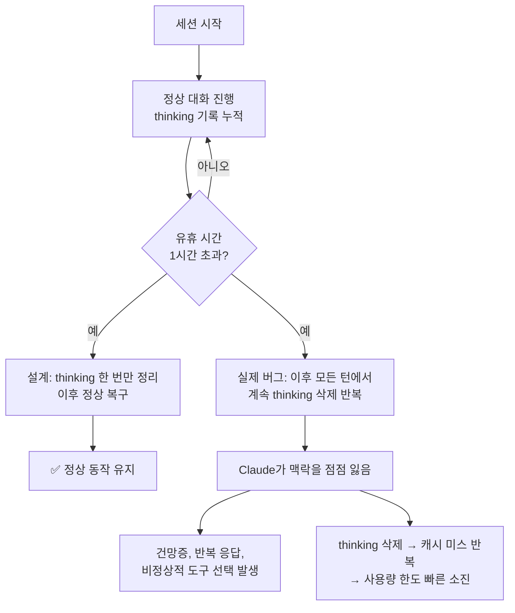
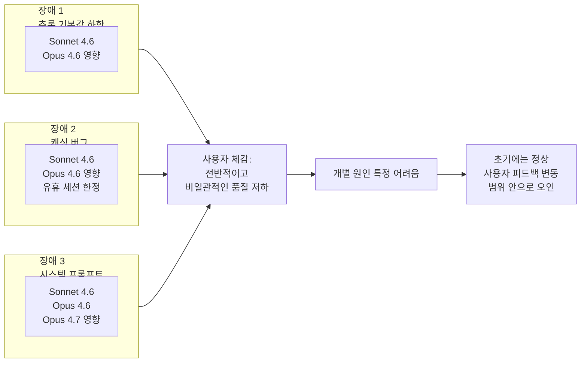
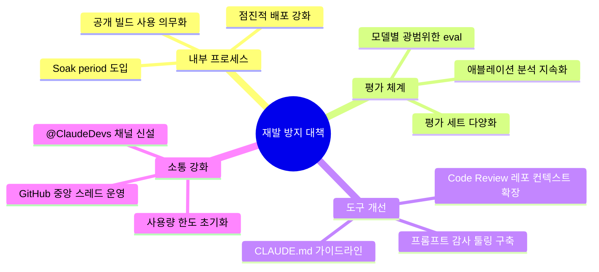

## 2026년 4월 23일 공식 발표 기준

> **원문 출처**: [Anthropic Engineering Blog — An update on recent Claude Code quality reports](https://www.anthropic.com/engineering/april-23-postmortem)  
> **커뮤니티 반응**: [GeekNews — Anthropic의 Claude Code 장애 포스트모템](https://news.hada.io/topic?id=28828)  
> **작성일**: 2026년 4월 27일  
> **버전**: v2.1.116 (수정 완료 기준)

---

## 목차

1. [사건 개요 및 배경](#1-사건-개요-및-배경)
2. [전체 타임라인](#2-전체-타임라인)
3. [장애 원인 1: 추론 노력 기본값 하향](#3-장애-원인-1-추론-노력-기본값-하향)
4. [장애 원인 2: 캐싱 최적화 버그로 인한 추론 기록 삭제](#4-장애-원인-2-캐싱-최적화-버그로-인한-추론-기록-삭제)
5. [장애 원인 3: 시스템 프롬프트의 과도한 간결화 지시](#5-장애-원인-3-시스템-프롬프트의-과도한-간결화-지시)
6. [왜 문제 발견이 이렇게 오래 걸렸는가](#6-왜-문제-발견이-이렇게-오래-걸렸는가)
7. [재발 방지를 위한 대책](#7-재발-방지를-위한-대책)
8. [커뮤니티 반응 분석 (GeekNews)](#8-커뮤니티-반응-분석-geeknews)
9. [종합 분석 및 시사점](#9-종합-분석-및-시사점)

---

## 1. 사건 개요 및 배경

2026년 3월부터 4월 사이, Claude Code를 사용하는 많은 사용자들이 AI의 응답 품질이 눈에 띄게 저하되었다는 보고를 이어갔다. 코딩 작업에서의 판단력 저하, 대화 중 맥락을 잊어버리는 "건망증", 같은 내용을 반복하는 현상, 그리고 도구(tool)를 비정상적으로 선택하는 이상 행동이 복합적으로 나타났다. 사용량 한도가 예상보다 훨씬 빠르게 소진된다는 불만도 잇따랐다.

Anthropic은 2026년 4월 23일, 이 모든 문제의 원인이 서로 다른 세 가지 변경 사항이었음을 공식 인정하고 상세한 포스트모템(사후 분석)을 발표했다. 세 가지 변경은 각기 다른 날짜에, 다른 목적으로 배포되었고, 서로 다른 모델과 트래픽 범위에 영향을 미쳤기 때문에, 전체적으로는 마치 광범위하고 일관성 없는 품질 저하처럼 보이는 혼란스러운 상황을 만들어냈다.

Anthropic이 공식적으로 강조한 핵심 포인트는 "**의도적인 모델 품질 저하는 없었다**"는 것이다. API와 추론 레이어(inference layer) 자체에는 어떤 변경도 없었으며, 문제는 전적으로 Claude Code라는 **제품 레이어**에서의 설정 변경과 버그의 조합에서 비롯되었다. 모든 문제는 2026년 4월 20일(v2.1.116) 기준으로 해결되었으며, Anthropic은 모든 구독자의 사용량 한도를 초기화하는 조치를 함께 발표했다.

---

## 2. 전체 타임라인

세 가지 장애가 각기 다른 시점에 발생하고 수정되었다는 점이 이 사건을 복잡하게 만든 핵심 요인이다.

이 타임라인에서 주목할 점은 세 가지 장애가 서로 독립적으로 발생했지만 시간적으로 겹치는 구간이 있었다는 것이다. 특히 3월 말부터 4월 초에는 장애 1과 장애 2가 동시에 진행 중이었고, 4월 16일부터 20일 사이에는 장애 3까지 겹쳐 최악의 사용자 경험이 만들어졌다.

---

## 3. 장애 원인 1: 추론 노력 기본값 하향

### 3.1 배경: 추론 노력(Reasoning Effort)이란 무엇인가

Claude Code에서 "추론 노력(reasoning effort)"이란 모델이 응답을 생성하기 전에 얼마나 오래 "생각(thinking)"하는지를 제어하는 파라미터다. 더 오래 생각할수록 더 나은 결과물이 나오지만, 그만큼 응답 시간이 길어지고 토큰 소비량도 늘어난다. Claude Code는 `/effort` 명령을 통해 사용자가 이 값을 직접 조정할 수 있도록 설계되어 있으며, `low`, `medium`, `high`, `xhigh`, `max`의 단계가 있다.

### 3.2 사건의 경위

2026년 2월, Anthropic이 Claude Code에 Opus 4.6을 탑재하면서 기본 추론 노력 수준을 `high`로 설정했다. 이후 일부 사용자들로부터 Opus 4.6의 `high` 모드에서 가끔 너무 오래 생각한 나머지 UI가 완전히 멈춘 것처럼 보인다는 피드백이 들어오기 시작했다. 응답이 수십 초, 때로는 몇 분씩 지연되면서 사용자 경험이 현저히 나빠진다는 불만이었다.

Anthropic 내부 평가(eval)에서는 `medium` 모드가 대부분의 작업에 대해 지능 측면에서 약간만 뒤처지면서도 레이턴시는 크게 낮추는 것으로 나타났다. 또한 극단적으로 긴 응답 지연(long-tail latency) 문제도 `medium`에서는 발생하지 않았다. 사용량 한도 소진 속도도 `medium`에서 더 느려 사용자가 더 많은 작업을 할 수 있었다. 이러한 판단 하에 Anthropic은 2026년 3월 4일, 기본 추론 노력 수준을 `high`에서 `medium`으로 변경하고, 제품 내 팝업 다이얼로그로 그 이유를 설명했다.

### 3.3 사용자 반응과 대응의 실패

변경 직후부터 사용자들이 Claude Code가 "덜 똑똑해진 것 같다"는 피드백을 쏟아내기 시작했다. Anthropic은 이에 대응하기 위해 여러 가지 UI 개선을 시도했다. 현재 설정된 추론 수준을 더 명확하게 표시하는 시작 알림을 추가하고, 인라인 effort 선택기를 도입하고, `ultrathink` 명령을 부활시켜 고노력 추론을 쉽게 트리거할 수 있도록 했다.

그러나 이 모든 노력에도 불구하고, 대부분의 사용자는 `medium`이 기본값이라는 사실을 인지하지 못했거나 변경하지 않은 채 그대로 사용했다. 이미지 2(스크린샷)에서 볼 수 있듯이, Claude Code v2.1.111 화면에는 "We recommend medium effort for Opus"라는 배너가 표시되었고 `Medium (recommended)`이 기본 선택 항목으로 설정되어 있었다. 이 메시지 자체가 사용자들에게 "이 설정이 Anthropic이 권장하는 최선"이라는 잘못된 인상을 주었다.

결국 Anthropic은 4월 7일, 충분한 고객 피드백을 청취한 뒤 이 결정을 번복했다. 현재는 Opus 4.7 모델에 `xhigh`, 그 외 모든 모델에 `high`가 기본값으로 적용되어 있다.

### 3.4 성능 데이터: 노력 수준별 코딩 성능 비교

이미지 1의 그래프(Agentic coding performance by effort level)는 이 결정이 얼마나 중요한 의미를 갖는지 시각적으로 보여준다. Anthropic 내부의 자율 에이전틱 코딩 평가(autonomous agentic coding evaluation)를 기준으로 한 이 데이터를 정리하면 다음과 같다.

| 모델 | 노력 수준 | Score (%) | 총 토큰 수 (approx.) |
|------|----------|-----------|----------------------|
| Opus 4.7 | low | ~51% | ~30k |
| Opus 4.7 | medium | ~57% | ~42k |
| Opus 4.7 | high | ~65% | ~80k |
| Opus 4.7 | xhigh | ~70% | ~105k |
| Opus 4.7 | max | ~74% | ~210k |
| Opus 4.6 | low | ~40% | ~30k |
| Opus 4.6 | medium | ~48% | ~50k |
| Opus 4.6 | high | ~55% | ~80k |
| Opus 4.6 | max | ~62% | ~125k |

이 데이터에서 몇 가지 중요한 사실이 드러난다. 첫째, Opus 4.7의 `low` 노력 수준이 Opus 4.6의 `low`보다 약 11%포인트 높은 성능을 보인다는 것, 즉 모델 자체의 기반 성능이 크게 향상되었다는 점이다. 둘째, Opus 4.6 기준으로 `medium`에서 `high`로 올리면 성능이 약 7%포인트 향상되는 반면, 토큰 소비량은 약 60% 증가한다. 즉, 기본값을 `medium`으로 낮춘 것은 사용자 입장에서 결코 "약간의 성능 저하"가 아니라 실질적으로 체감 가능한 수준의 지능 하락이었다.

---

## 4. 장애 원인 2: 캐싱 최적화 버그로 인한 추론 기록 삭제

이 장애는 세 가지 중 가장 기술적으로 복잡하고, 사용자에게 가장 기이하고 당혹스러운 경험을 안겨준 문제였다.

### 4.1 배경: 추론 기록(Thinking History)의 역할

Claude가 어떤 작업을 수행할 때, 모델은 내부적으로 "사고 과정(thinking)"을 생성한다. 이 thinking 블록은 단순히 현재 응답을 위한 임시 정보가 아니라, 대화 이력에 함께 저장되어 이후 대화 턴에서도 "내가 왜 이 도구를 호출했는지", "왜 이 코드를 이렇게 수정했는지"를 참조할 수 있는 핵심 컨텍스트로 기능한다. thinking 기록이 보존되어야 Claude는 긴 세션에서도 일관된 판단을 유지할 수 있다.

### 4.2 캐시 시스템의 동작 원리

Claude Code는 API 호출 비용과 속도를 최적화하기 위해 프롬프트 캐싱(prompt caching)을 적극 활용한다. 사용자가 메시지를 보내면 Claude는 입력 토큰을 캐시에 기록한다. 이후 일정 시간이 지나면 해당 캐시 항목은 만료(evict)되어 다른 사용자를 위한 공간을 확보한다. 세션이 1시간 이상 유휴 상태가 되면, 사용자가 세션을 재개할 때 이미 캐시 미스(cache miss)가 발생한 상태이므로, 이 시점에서 오래된 thinking 블록을 정리해도 실질적인 손해가 없다는 논리가 이번 최적화의 출발점이었다.

### 4.3 버그의 발생과 작동 방식

2026년 3월 26일 배포된 변경 사항의 설계 의도는 단순했다. 세션이 1시간 이상 유휴 상태였다가 재개될 때, `clear_thinking_20251015` API 헤더를 `keep:1`과 함께 사용해 가장 최근 thinking 블록 하나만 남기고 나머지를 한 번 정리하는 것이었다. 그 이후 대화 턴부터는 다시 전체 reasoning 기록을 포함해 정상 동작하도록 설계되었다.

그런데 구현에 버그가 있었다. 설계와 달리, 한번 유휴 임계값을 넘은 세션은 **이후 모든 대화 턴마다** API에 thinking 블록을 지우는 명령이 계속 전송되었다. 각 요청마다 "가장 최근 reasoning 블록 하나만 남기고 나머지 전부 삭제"하는 지시가 반복 실행되었다. 이 효과는 대화가 이어질수록 복리처럼 누적되었다. 특히 Claude가 도구(tool)를 호출하는 도중에 사용자가 후속 메시지를 보내면, 그것이 새로운 "턴"으로 인식되어 현재 진행 중인 작업의 reasoning까지 삭제되는 사태가 벌어졌다.

결과적으로 Claude는 자신이 왜 특정 도구를 호출했는지, 왜 이 코드를 수정하기로 결정했는지를 담은 기억을 매 턴마다 잃어가면서도 계속 작업을 실행하는 기이한 상태에 빠졌다. 이것이 사용자들이 경험한 "건망증", 이전과 동일한 실수 반복, 전혀 엉뚱한 도구 선택의 정체였다.

### 4.4 이미지 3으로 보는 의도 vs. 실제 동작

이미지 3(Resume after idle: intended vs actual)은 이 버그를 매우 직관적으로 보여준다.

**의도된 동작 (Intended)**  
Turn 2, Turn 3은 시스템 프롬프트, 사용자/도구 메시지, thinking 블록(sent), 새 턴 메시지가 모두 온전히 포함된 상태로 전달된다. 1시간 유휴 이후 Turn 4(재개 시점)에서 오래된 thinking 블록 일부가 `keep:1`에 의해 정리(dropped by keep:1)되고, Turn 5, Turn 6부터는 다시 정상적으로 모든 thinking이 포함된다.

**실제 동작 (Actual - bug)**  
Turn 2, Turn 3까지는 정상이다. 그러나 1시간 유휴 이후 Turn 4에서 thinking 블록이 한번 정리된 이후, Turn 5에서 **새로 생성된 thinking 블록이 잘못 삭제(wrongly dropped)** 된다. Turn 6에서는 두 개의 thinking 블록이 모두 잘못 삭제되어, Claude는 자신의 추론 기록이 점점 더 줄어드는 상태에서 작업을 이어가게 된다. 이 버그가 진행될수록 Claude의 "기억"은 가속적으로 소실된다.

### 4.5 사용량 한도 소진 문제와의 연결

이 버그는 예상치 못한 부작용을 추가로 일으켰다. thinking 블록을 매 턴마다 삭제하면서 캐시에 저장되어 있어야 할 토큰들이 계속해서 캐시 미스를 일으켰다. 캐시 미스가 발생한 토큰은 모두 새로 계산되어야 하므로, 사용자의 사용량 한도가 정상적인 세션 대비 훨씬 빠르게 소진되었다. 사용자들이 "사용량이 왜 이렇게 빨리 닳냐"며 불만을 토로했던 것이 바로 이 부작용 때문이었다.

### 4.6 재현이 어려웠던 이유

이 버그를 발견하는 데 3주 이상 걸렸던 데는 두 가지 "우연한 방해 요소"가 있었다. 첫째는 Anthropic 내부에서만 진행 중이던 서버 사이드 메시지 큐잉 관련 실험이 이 버그의 증상을 가렸다. 둘째는 CLI 환경에서 thinking 블록을 화면에 표시하는 방식의 변경이 대부분의 CLI 세션에서 버그가 눈에 띄지 않게 만들었다. 결과적으로 외부 빌드를 테스트할 때도 이 버그를 발견하지 못했다.

이 버그는 단위 테스트(unit test), 엔드투엔드 테스트(end-to-end test), 자동화 검증, 내부 도그푸딩(dogfooding)을 모두 통과한 뒤에야 실제 사용자 환경에 영향을 미쳤다. "유휴 상태 1시간 이상"이라는 모서리 사례(corner case)는 내부 테스트에서 충분히 커버되지 않았던 것이다.

### 4.7 Opus 4.7의 Code Review가 버그를 발견하다

흥미로운 점은, 사후 분석 과정에서 Anthropic이 Opus 4.7에게 해당 Pull Request를 코드 리뷰하도록 했을 때, 관련 코드 저장소 전체를 컨텍스트로 제공하자 Opus 4.7이 버그를 발견했다는 사실이다. 반면 Opus 4.6은 동일한 조건에서 버그를 찾아내지 못했다. 이는 모델 세대 간 능력 차이를 보여주는 동시에, Code Review 도구에 더 많은 레포지토리 컨텍스트를 제공해야 한다는 교훈을 남겼다.

버그는 2026년 4월 10일, v2.1.101 버전에서 수정되었다.

---

## 5. 장애 원인 3: 시스템 프롬프트의 과도한 간결화 지시

### 5.1 Opus 4.7의 장황함(Verbosity) 문제

Anthropic이 출시한 최신 모델 Claude Opus 4.7은 이전 모델인 Opus 4.6에 비해 출력이 상당히 장황하다는 특성이 있다. Anthropic은 Opus 4.7 출시 당시부터 이 특성을 인지하고 있었다. 더 많은 내용을 출력하는 것이 어려운 문제를 풀 때 더 높은 지능으로 이어진다는 긍정적 측면이 있지만, 동시에 출력 토큰이 더 많이 소비되고 응답 속도가 느려진다는 부정적 측면도 존재한다.

### 5.2 문제의 경위

Opus 4.7 출시 몇 주 전부터, Anthropic은 Claude Code의 시스템 프롬프트와 설정을 새 모델에 맞게 최적화하는 작업을 시작했다. 각 모델은 동일한 설정에서도 다르게 행동하기 때문에, 새 모델 출시 전 이러한 "하네스(harness) 튜닝"은 일반적인 사전 작업이다.

장황함을 줄이기 위한 여러 수단 중 하나로, 시스템 프롬프트에 다음과 같은 지시를 추가했다.

> *"Length limits: keep text between tool calls to ≤25 words. Keep final responses to ≤100 words unless the task requires more detail."*  
> (길이 제한: 도구 호출 사이의 텍스트는 25단어 이내. 최종 응답은 작업에 더 많은 상세 정보가 필요한 경우를 제외하고 100단어 이내로 유지.)

여러 주에 걸친 내부 테스트와 기존 평가 세트에서 회귀(regression)가 발견되지 않자, Anthropic은 이 변경에 자신감을 갖고 4월 16일 Opus 4.7 출시와 함께 이를 배포했다.

### 5.3 발견과 즉각적 복구

배포 이후 코딩 품질 저하 보고가 이어지자, Anthropic은 포스트모템 조사 과정에서 더 광범위한 평가 세트를 대상으로 애블레이션(ablation) 테스트—시스템 프롬프트에서 각 줄을 하나씩 제거하며 영향을 측정하는 방식—를 실시했다. 그 결과 이 단 한 줄의 지시가 Opus 4.6과 Opus 4.7 모두에서 **3%의 성능 하락**을 일으키고 있음이 확인되었다.

25단어, 100단어라는 강제적인 길이 제한이 Claude의 코딩 작업에서 중요한 내부 추론 과정과 설명을 억압하고 있었던 것이다. 해당 프롬프트는 4월 20일 v2.1.116에서 즉시 제거되었다.

이 사례는 시스템 프롬프트의 작은 변경 하나가, 직관적으로는 무해해 보이더라도, 실제 코딩 성능에 얼마나 광범위한 영향을 미칠 수 있는지를 잘 보여준다. 또한 내부 평가 세트가 충분히 다양하지 않으면 이러한 회귀를 사전에 탐지하기 어렵다는 점도 드러났다.

---

## 6. 왜 문제 발견이 이렇게 오래 걸렸는가

이 사건에서 많은 사용자들이 분노를 표출한 지점이 바로 여기다. 실제로 일부 사용자는 3월 26일에 캐싱 버그를 즉시 경험했는데, Anthropic이 원인을 파악하는 데 3주가 걸렸다. 이 질문에 대한 Anthropic의 설명을 구조화하면 다음과 같다.

**첫 번째 이유: 서로 다른 트래픽 범위의 중첩**  
각 변경이 다른 모델, 다른 시점, 다른 사용자 집합에 영향을 주었다. 어떤 사용자는 장애 1만 겪었고, 어떤 사용자는 장애 2만, 어떤 사용자는 세 가지 모두를 겪었다. 이 혼재가 마치 "광범위하지만 설명하기 어려운 품질 저하"처럼 보이게 만들었고, 3월 초에는 정상적인 사용자 피드백 변동 범위 안에서 구별하기 어려웠다.

**두 번째 이유: 내부 테스트 환경과 외부 환경의 괴리**  
특히 캐싱 버그는 내부에서 진행 중이던 별도의 메시지 큐잉 실험과 thinking 표시 방식 변경 때문에 내부 테스트에서 억제(suppressed)되었다. 즉, 내부 직원들이 사용하는 빌드에서는 이 버그가 겉으로 드러나지 않았다. 또한 이 버그는 "세션 유휴 1시간 이상"이라는 특정 조건에서만 발생했기 때문에, 연속적으로 빠르게 작업하는 내부 테스터들은 이를 경험하기 어려웠다.

**세 번째 이유: 평가 세트의 부족**  
시스템 프롬프트의 3% 성능 하락은, 포스트모템 과정에서 더 광범위한 평가 세트를 돌리고 나서야 발견되었다. 기존의 내부 평가 세트는 이 변화를 감지할 만큼 충분히 넓거나 다양하지 않았다.

---

## 7. 재발 방지를 위한 대책

Anthropic은 동일한 유형의 문제가 반복되지 않도록 여러 구체적인 조치를 발표했다.

### 7.1 내부 직원의 공개 빌드 사용 의무화

이번 사건에서 드러난 가장 근본적인 문제 중 하나는 내부 테스트용 빌드와 실제 공개 빌드 사이의 괴리였다. Anthropic은 앞으로 더 많은 내부 직원이 테스트용 빌드가 아닌 실제 공개 빌드를 일상 업무에 사용하도록 의무화하겠다고 밝혔다. 이를 통해 공개 빌드에서만 발생하는 버그를 내부에서도 조기에 경험하고 발견할 수 있도록 한다.

GeekNews 커뮤니티의 사용자 `youknowone`은 이 부분을 특히 날카롭게 지적했다. 직원 계정에는 5시간 쿼타 제한이 없거나 넉넉하기 때문에, 사용량 한도가 30분 만에 소진되는 버그를 경험하기 어려웠을 것이라는 분석이다.

### 7.2 시스템 프롬프트 변경에 대한 강화된 통제

시스템 프롬프트의 단 한 줄이 3%의 성능 저하를 일으킬 수 있다는 교훈을 바탕으로, Anthropic은 다음과 같은 조치를 도입한다.

- **모델별 광범위한 평가(per-model evals)**: 모든 시스템 프롬프트 변경 시, 각 모델에 대해 광범위한 평가 세트를 실행한다.
- **지속적인 애블레이션(ablation) 분석**: 시스템 프롬프트의 각 줄이 독립적으로 어떤 영향을 미치는지 지속적으로 분석한다.
- **Soak period(충분한 검증 기간) 도입**: 지능과의 트레이드오프가 발생할 수 있는 변경에 대해서는 충분한 검증 기간을 두고 점진적으로 배포한다.
- **CLAUDE.md 가이드라인 추가**: 모델별 변경 사항이 해당 모델에만 적용되도록 명시적으로 게이팅하는 가이드라인을 CLAUDE.md에 추가했다.
- **새로운 감사 도구 구축**: 프롬프트 변경 사항을 더 쉽게 리뷰하고 감사할 수 있는 새 툴링을 구축했다.

### 7.3 Code Review 도구 개선

Opus 4.7이 전체 코드 저장소 컨텍스트를 받았을 때 캐싱 버그를 발견했다는 사실에서 영감을 받아, Anthropic은 Code Review 시 참조할 수 있는 저장소 범위를 확대하는 작업을 진행 중이다. 이 개선된 Code Review 기능은 내부적으로 먼저 적용하고, 이후 고객에게도 제공할 계획이다.

### 7.4 @ClaudeDevs를 통한 투명한 소통

Anthropic은 X(구 트위터)에 `@ClaudeDevs` 계정을 신설하여, 제품 결정과 그 배경 이유를 더 깊이 있게 설명하는 공간으로 활용하겠다고 밝혔다. 동일한 업데이트를 GitHub의 중앙 집중형 스레드에도 공유할 계획이다.

### 7.5 사용량 한도 초기화

4월 23일, 모든 구독자의 사용량 한도를 완전히 초기화하는 조치가 함께 이루어졌다. 이는 캐싱 버그로 인해 예상보다 빠르게 소진된 사용량에 대한 실질적인 보상 조치다.

---

## 8. 커뮤니티 반응 분석 (GeekNews)

GeekNews에 올라온 한국 개발자 커뮤니티의 반응은 크게 세 가지 주제로 수렴된다.

### 8.1 "비용 절감 포스트모템" 프레임

가장 많은 동의를 받은 반응은 세 가지 장애의 공통 분모가 모두 "GPU 비용/토큰 소비 절감"과 직결된다는 지적이다. `crawler`는 "어떻게 세 가지 장애 원인 전부 코스트 절감과 직접적으로 관련된 것들이죠"라며 실질적으로는 비용 압박에 따른 트레이드오프 실패였다고 진단했다. `colus001`은 이를 "비용 절감 포스트 모템"이라고 압축했다.

실제로 세 가지 변경을 다시 보면 이 시각에는 근거가 있다. 추론 노력 기본값을 `high`에서 `medium`으로 낮추면 토큰 소비와 GPU 사용이 줄어든다. 캐싱 최적화도 API 호출 비용 절감이 목적이었다. 시스템 프롬프트의 출력 제한도 출력 토큰을 줄이기 위한 것이었다. 세 가지 모두 사용자 경험보다 비용 효율을 우선한 결과가 역효과를 낳았다는 해석이 가능하다.

### 8.2 내부 테스트 체계에 대한 비판

`youknowone`은 "그동안 공개 빌드를 테스트하지도 않고 배포하고 배포한 뒤에도 테스트를 안했다는 얘길 길게도 써놨네요"라고 직격했다. 3월 26일에 버그를 즉시 경험했는데 내부에서 확인하는 데 3주가 걸렸다는 것은 납득하기 어렵다는 반응이다. 같은 사용자는 "패치되자마자 3-4시간 써야 다 쓰던 5시간 쿼타가 30분만에 소진되기 시작했다"고 증언하며, 직원 계정에는 이런 극단적인 사용량 소진 경험이 없었기 때문에 발견이 늦었을 것이라고 분석했다.

### 8.3 반복되는 품질 저하 사건에 대한 불신

`xguru`는 이번 포스트모템을 계기로 Anthropic에 대한 신뢰가 오히려 낮아졌다고 표현했다. 관련 링크로 제시한 것처럼, 2025년 9월에도 동일하게 세 가지 원인의 품질 저하 사후 분석이 있었다는 점을 지적하며 "또 세 가지"라는 패턴을 언급했다. 이는 일회성 실수가 아닌 구조적 문제일 수 있음을 시사한다.

### 8.4 흥미로운 외부 데이터 포인트 (amond)

사용자 `amond`는 SWE-Bench-Pro 일일 벤치마크 데이터를 인용하며 흥미로운 관찰을 공유했다. 4월 10일~4월 20일 구간에서 Claude Code의 runtime이 절반(653s→345s), tool call이 절반(3.3K→1.8K), 토큰이 -18% 줄었는데 pass rate는 오히려 +16%p 올라갔다는 것이다. 이는 세 가지 장애가 수정되는 과정에서 실제로 효율과 성능이 동시에 개선되었음을 외부 데이터가 뒷받침한다는 점에서 의미 있는 관찰이다. 반면 같은 기간 Codex(GPT-5.4-xhigh)는 pass rate 56% 근처에 고정된 채, 토큰/runtime/tool call 모두 Claude Code의 두 배 수준을 유지했다는 비교도 흥미롭다.

---

## 9. 종합 분석 및 시사점

### 9.1 이 사건이 드러낸 구조적 취약점

이번 포스트모템은 AI 제품 개발의 고유한 어려움을 잘 보여준다. 모델 자체의 변경(inference layer)이 아닌 제품 레이어(product layer)에서의 설정 변경과 버그도 사용자 체감 품질에 지대한 영향을 미칠 수 있다. 그리고 그 영향이 여러 독립적 원인의 합산일 때, 원인을 분리하고 특정하는 것이 극히 어려워진다.

### 9.2 Test-Time Compute의 중요성

이번 사건에서 가장 핵심적인 기술적 통찰은 추론 노력(reasoning effort)과 성능 사이의 관계다. 이미지 1의 그래프가 보여주듯, 더 많은 컴퓨팅을 추론에 투입할수록 성능이 향상되는 "test-time compute scaling"은 실제로 Claude에서 측정 가능한 수준으로 작동하고 있다. Opus 4.7의 경우 `low`에서 `max`까지의 성능 차이가 약 23%포인트에 달한다. 이는 사용자가 `/effort` 설정을 단순한 속도 옵션이 아닌 실질적인 지능 레버로 인식하고 활용해야 함을 의미한다.

### 9.3 AI 제품에서의 투명성과 신뢰

Anthropic의 이번 포스트모템은 AI 기업으로서 상당히 상세하고 솔직한 수준의 공개를 했다는 점에서 긍정적으로 평가할 수 있다. 특히 Code Review 도구를 이용해 사후에 버그를 재현하고, Opus 4.7이 버그를 발견했지만 Opus 4.6은 하지 못했다는 사실을 공개한 것, 그리고 실제 시스템 프롬프트의 내용을 그대로 노출한 것은 이례적인 투명성이다.

그러나 `xguru`의 지적처럼, 7개월 만에 유사한 구조의 사건이 반복된다는 사실은 개별 버그를 넘어선 프로세스의 구조적 문제를 시사한다. 재발 방지 대책이 얼마나 실효성 있게 적용될지, 그리고 다음 사건이 발생했을 때 얼마나 빠르게 탐지하고 대응할 수 있을지가 Anthropic에 대한 신뢰를 결정하는 핵심 기준이 될 것이다.

### 9.4 Claude Code 사용자를 위한 실용적 교훈

이 사건에서 Claude Code 사용자로서 얻을 수 있는 실용적인 교훈은 다음과 같다.

- 현재 사용 중인 Claude Code의 버전과 기본 effort 설정을 확인하라. 현재는 Opus 4.7 기준 `xhigh`, 그 외 모델은 `high`가 기본값이다.
- 복잡한 엔지니어링 작업에서는 `/effort max`나 `/effort xhigh`를 명시적으로 설정하는 것이 성능에 유의미한 차이를 만들 수 있다.
- 세션을 1시간 이상 방치한 뒤 재개할 때는, 이번에 수정된 캐싱 버그가 남아 있지 않은지 (v2.1.116 이상 버전인지) 확인하라.
- `/feedback` 명령을 통한 피드백 제출이 실제로 문제 발견에 기여했다. 품질 저하를 체감한다면 적극적으로 피드백을 제출하는 것이 커뮤니티 전체에 도움이 된다.

---

## 부록: 수정 이력 요약

| 장애 번호 | 배포일 | 수정일 | 영향 모델 | 원인 | 수정 버전 |
|-----------|--------|--------|-----------|------|-----------|
| 장애 1 | 2026-03-04 | 2026-04-07 | Sonnet 4.6, Opus 4.6 | 기본 추론 노력 high→medium 변경 | — |
| 장애 2 | 2026-03-26 | 2026-04-10 | Sonnet 4.6, Opus 4.6 | 캐싱 최적화 버그 (thinking 반복 삭제) | v2.1.101 |
| 장애 3 | 2026-04-16 | 2026-04-20 | Sonnet 4.6, Opus 4.6, Opus 4.7 | 시스템 프롬프트 과도한 길이 제한 | v2.1.116 |
| 전체 수정 완료 | — | 2026-04-20 | 전체 | — | v2.1.116 |
| 사용량 한도 초기화 | — | 2026-04-23 | 전 구독자 | — | — |

---

*본 문서는 Anthropic의 공식 포스트모템 발표(2026년 4월 23일)와 GeekNews 커뮤니티 반응을 바탕으로 작성되었습니다.*
