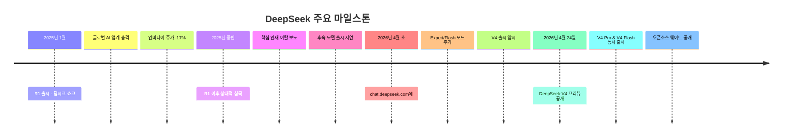
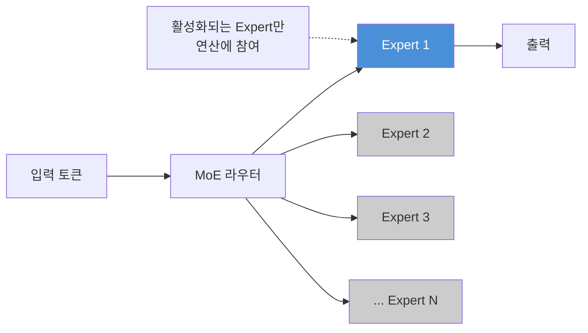
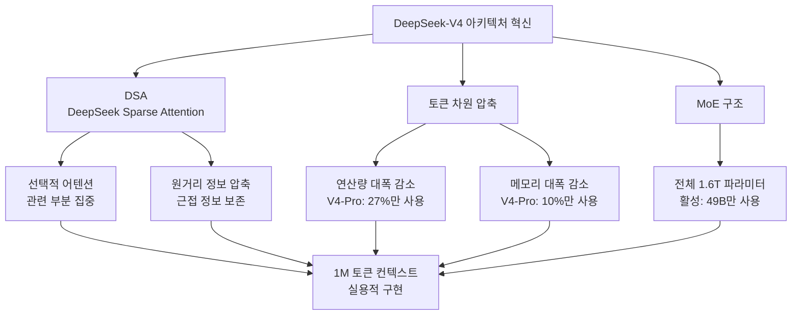
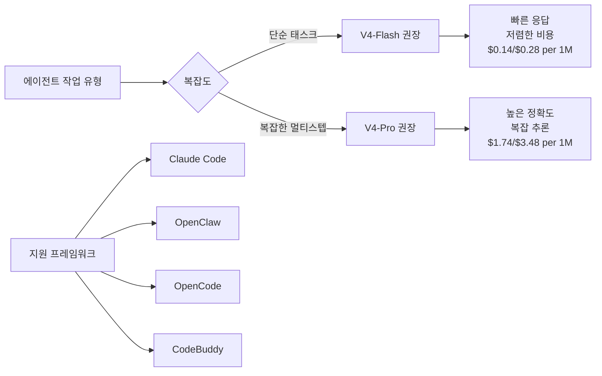
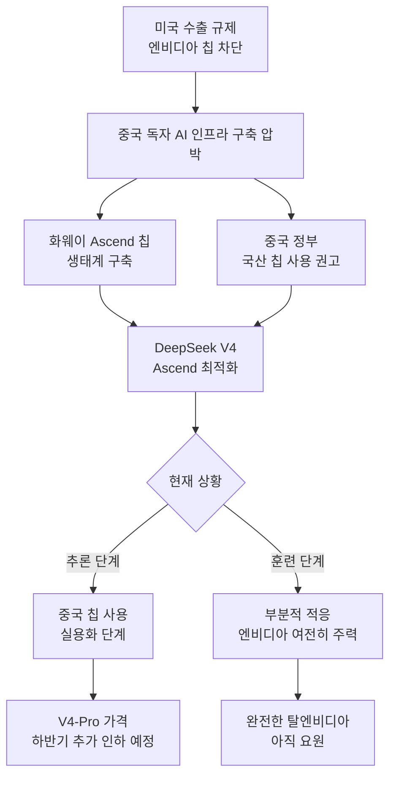
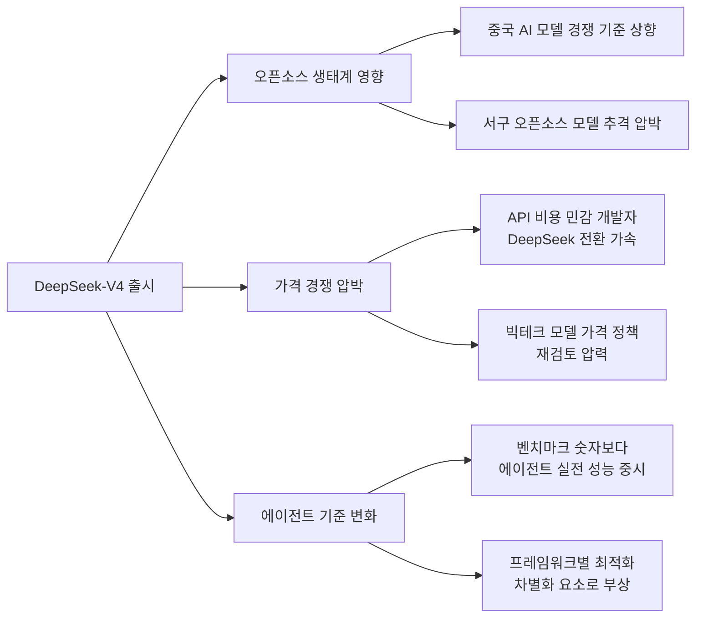

> **작성 기준일:** 2026년 4월 27일  
> **주요 출처:** MIT Technology Review, Atlas Cloud 블로그, AI넷, DeepSeek 공식 기술 리포트  
> **모델 출시일:** 2026년 4월 24일

---

## 목차

1. [배경: R1 쇼크 이후 1년](#1-배경-r1-쇼크-이후-1년)
2. [DeepSeek-V4 개요 및 라인업](#2-deepseek-v4-개요-및-라인업)
3. [아키텍처 혁신: DSA와 컨텍스트 효율성](#3-아키텍처-혁신-dsa와-컨텍스트-효율성)
4. [벤치마크 성능 심층 분석](#4-벤치마크-성능-심층-분석)
5. [에이전트 역량과 실전 최적화](#5-에이전트-역량과-실전-최적화)
6. [API, 가격, 개발자 통합](#6-api-가격-개발자-통합)
7. [오픈소스 공개와 로컬 배포](#7-오픈소스-공개와-로컬-배포)
8. [하드웨어 독립: 화웨이 Ascend와 탈(脫)엔비디아 전략](#8-하드웨어-독립-화웨이-ascend와-탈엔비디아-전략)
9. [지정학적 맥락: 미·중 AI 기술 패권 경쟁](#9-지정학적-맥락-미중-ai-기술-패권-경쟁)
10. [이번 출시의 의미: 세 가지 핵심 포인트](#10-이번-출시의-의미-세-가지-핵심-포인트)
11. [오픈소스 AI 생태계에 미치는 영향](#11-오픈소스-ai-생태계에-미치는-영향)
12. [한계와 유의사항](#12-한계와-유의사항)
13. [결론: 다음 전장은 어디인가](#13-결론-다음-전장은-어디인가)

---

## 1. 배경: R1 쇼크 이후 1년

2025년 1월, 중국 AI 스타트업 딥시크(DeepSeek)는 'R1' 모델을 공개하며 글로벌 AI 업계를 뒤흔들었다. 미국 기업들이 수십억 달러를 쏟아부은 최신 대형 언어 모델들과 맞먹는 성능을 보여줬지만, 훈련 비용은 비교가 안 될 만큼 저렴했다. 이른바 **'딥시크 쇼크'** 혹은 **'AI판 스푸트니크 모멘트'** 로 불리는 이 사건은 AI 투자 시장을 흔들고, 엔비디아 주가를 하루 만에 17% 폭락시켰으며, 미국 빅테크의 전략 전반을 재점검하게 만들었다.

그러나 R1 이후 딥시크는 비교적 조용한 시간을 보냈다. 핵심 연구원들의 이탈, 후속 모델 출시 지연, 그리고 미국과 중국 양쪽 정부의 동시 압박이라는 복잡한 환경 속에서도 딥시크는 내부적으로 차세대 플래그십 모델 개발에 집중하고 있었다.

그리고 2026년 4월 24일, 약 1년 4개월 만에 딥시크는 **DeepSeek-V4** 프리뷰 버전을 전격 공개했다. 이번 출시는 R1만큼 충격적이지는 않지만, 오픈소스 AI의 새로운 기준점을 제시했다는 점에서 업계 전반의 주목을 받고 있다.



---

## 2. DeepSeek-V4 개요 및 라인업

DeepSeek-V4는 두 가지 모델로 구성된다. 고성능 플래그십인 **V4-Pro**와 속도·비용 최적화형 **V4-Flash**다. 두 모델 모두 동일한 **100만(1M) 토큰 컨텍스트 윈도우**를 지원하며, 완전한 오픈소스로 공개됐다.

### 모델 스펙 비교표

| 항목 | DeepSeek-V4-Pro | DeepSeek-V4-Flash |
|------|----------------|------------------|
| **총 파라미터** | 1.6조 (1.6T) | 2,840억 (284B) |
| **활성 파라미터** | 490억 (49B) | 130억 (13B) |
| **사전 학습 데이터** | 33조 토큰 | 32조 토큰 |
| **컨텍스트 길이** | 100만 (1M) 토큰 | 100만 (1M) 토큰 |
| **오픈소스** | ✅ | ✅ |
| **API 제공** | ✅ | ✅ |
| **웹 접속 모드** | Expert 모드 | Fast 모드 |
| **입력 가격** | $1.74 / 백만 토큰 | $0.14 / 백만 토큰 |
| **출력 가격** | $3.48 / 백만 토큰 | $0.28 / 백만 토큰 |
| **최대 출력** | 65,536 토큰 | 65,536 토큰 |

### MoE 아키텍처의 효율성

두 모델 모두 **MoE(Mixture of Experts)** 아키텍처를 채택하고 있다. MoE는 전체 파라미터 중 추론 시 일부만 활성화하는 설계로, 대규모 모델의 성능을 유지하면서도 연산 비용을 대폭 절감할 수 있다.

- **V4-Pro**: 총 1.6조 파라미터 중 추론 시 49B만 활성화 → **활성화율 약 3%**
- **V4-Flash**: 총 284B 파라미터 중 추론 시 13B만 활성화 → **활성화율 약 4.6%**

이 설계 덕분에 겉으로는 극대규모 모델이지만 실제 추론 비용은 훨씬 작은 모델과 유사하다.



---

## 3. 아키텍처 혁신: DSA와 컨텍스트 효율성

DeepSeek-V4의 가장 중요한 기술적 혁신은 **100만 토큰 컨텍스트를 어떻게 달성했는가**에 있다. 단순히 컨텍스트를 길게 늘린 것이 아니라, 긴 컨텍스트를 다루는 방식 자체를 재설계했다.

### 어텐션 메커니즘의 근본적 재설계

기존 트랜스포머 모델에서 어텐션(Attention) 메커니즘은 입력 시퀀스의 모든 토큰 쌍 사이의 관계를 계산한다. 문장이 길어질수록 이 계산량은 제곱으로 증가하며, 이것이 긴 컨텍스트를 다루는 모델의 핵심 병목이 된다.

DeepSeek-V4는 이 문제를 **DSA(DeepSeek Sparse Attention)** 로 해결했다.

**DSA의 핵심 원리:**

1. **선택적 주의집중**: 모든 이전 토큰을 동등하게 처리하는 대신, 현재 맥락과 관련성이 높은 부분에 집중한다.
2. **원거리 정보 압축**: 오래된 컨텍스트는 압축하여 저장하되, 근접한 텍스트는 원본 그대로 유지한다.
3. **토큰 차원 압축**: 어텐션 계산 시 토큰 차원에서 압축을 수행해 메모리와 연산을 동시에 절감한다.

### 효율성 개선 수치 (V3.2 대비)

| 지표 | V4-Pro | V4-Flash |
|------|--------|---------|
| **연산량 (TFLOPs)** | 27% 사용 (73% 절감) | 10% 사용 (90% 절감) |
| **KV 캐시 메모리** | 10% 사용 (90% 절감) | 7% 사용 (93% 절감) |

이 수치가 의미하는 바는 명확하다. **100만 토큰을 처리하는 데 V4-Pro는 이전 V3.2 대비 연산은 73%, 메모리는 90%를 절감한다.** V4-Flash는 그보다 더 극적으로, 연산 90%, 메모리 93%를 절감한다.

실제 그래프(이미지 3 참조)를 보면, 시퀀스 길이가 늘어날수록 V3.2(회색 점선)의 연산량과 KV 캐시는 가파르게 상승하는 반면, V4-Pro(파란 실선)와 V4-Flash(연파란 실선)는 훨씬 완만한 증가 곡선을 보인다. 특히 100만 토큰(1,024K) 지점에서 세 모델 간의 격차는 압도적이다.



### 실용적 함의

이 효율성 개선은 단순한 기술 지표를 넘어선 실용적 의미를 갖는다:

- **코딩 에이전트**: 수백만 줄 규모의 전체 코드베이스를 한 번에 읽고 분석할 수 있다.
- **문서 처리**: 방대한 법률 문서, 연구 논문 아카이브, 기업 내부 문서를 통째로 맥락으로 활용할 수 있다.
- **장기 프로젝트 추론**: 긴 대화 히스토리나 연속적 작업 흐름에서 맥락이 끊기지 않는다.

MIT Technology Review는 V4의 1M 토큰이 실제로 얼마나 큰 양인지 구체적인 예시로 설명했다. **반지의 제왕 3부작과 호빗을 합친 분량을 모두 한 번에 처리할 수 있는 크기**다.

---

## 4. 벤치마크 성능 심층 분석

DeepSeek가 공개한 벤치마크 결과는 V4-Pro의 위치를 매우 구체적으로 보여준다. 공식 벤치마크에서 비교 대상은 Claude Opus 4.6 (Max), GPT-5.4 (xHigh), Gemini 3.1 Pro (High)이다.

### 지식 및 추론 벤치마크

| 벤치마크 | DS-V4-Pro Max | Claude Opus 4.6 Max | GPT-5.4 xHigh | Gemini 3.1 Pro High |
|---------|:---:|:---:|:---:|:---:|
| MMLU-Pro (EM) | 87.5 | 89.1 | 87.5 | **91.0** |
| SimpleQA-Verified (Pass@1) | **57.9** | 46.2 | 45.3 | 75.6 |
| Chinese-SimpleQA (Pass@1) | **84.4** | 76.2 | 76.8 | 85.9 |
| GPQA Diamond (Pass@1) | 90.1 | 91.3 | **93.0** | 94.3 |
| HLE (Pass@1) | 37.7 | 40.0 | 39.8 | **44.4** |
| LiveCodeBench (Pass@1) | **93.5** | 88.8 | - | 91.7 |
| Codeforces (Rating) | **3206** | - | 3168 | 3052 |
| HMMT 2026 Feb (Pass@1) | 95.2 | 96.2 | **97.7** | 94.7 |
| IMOAnswerBench (Pass@1) | **89.8** | 75.3 | 91.4 | 81.0 |
| Apex Shortlist (Pass@1) | **90.2** | 85.9 | 78.1 | 89.1 |

### 장문 컨텍스트 벤치마크

| 벤치마크 | DS-V4-Pro Max | Claude Opus 4.6 Max | GPT-5.4 xHigh | Gemini 3.1 Pro High |
|---------|:---:|:---:|:---:|:---:|
| MRCR 1M (MMR) | 83.5 | **92.9** | - | 76.3 |
| CorpusQA 1M (ACC) | 62.0 | **71.7** | - | 53.8 |

### 에이전트 벤치마크

| 벤치마크 | DS-V4-Pro Max | Claude Opus 4.6 Max | GPT-5.4 xHigh | Gemini 3.1 Pro High |
|---------|:---:|:---:|:---:|:---:|
| Terminal Bench 2.0 (Acc) | 67.9 | 65.4 | **75.1** | 68.5 |
| SWE Verified (Resolved) | 80.6 | **80.8** | - | 80.6 |
| SWE Pro (Resolved) | 55.4 | 57.3 | **57.7** | 54.2 |
| SWE Multilingual (Resolved) | 76.2 | **77.5** | - | - |
| BrowseComp (Pass@1) | 83.4 | 83.7 | 82.7 | **85.9** |
| HLE w/tools (Pass@1) | 48.2 | **53.1** | 52.0 | 51.6 |
| GDPval-AA (Elo) | 1554 | **1619** | **1674** | 1314 |
| MCPAtlas Public (Pass@1) | **73.6** | 73.8 | 67.2 | 69.2 |
| Toolathlon (Pass@1) | **51.8** | 47.2 | 54.6 | 48.8 |

### 벤치마크 결과 해석

이미지 1의 막대 그래프와 이미지 2의 상세 표를 종합하면 몇 가지 중요한 패턴이 드러난다.

**DeepSeek V4-Pro가 선두인 영역:**
- 코딩 벤치마크 (Codeforces: 3206, LiveCodeBench: 93.5, Apex Shortlist: 90.2)
- 수학·STEM 추론
- 중국어 지식 (Chinese-SimpleQA: 84.4)
- MCPAtlas, Toolathlon 등 일부 에이전트 태스크

**여전히 뒤지는 영역:**
- 장문 컨텍스트 이해에서는 Claude Opus 4.6가 우세 (MRCR 1M: 92.9 vs 83.5)
- GPQA Diamond, HLE 등 과학 추론에서는 Gemini 3.1이 앞섬
- GDPval-AA (Elo) 등 종합 에이전트 능력에서는 GPT-5.4, Claude Opus 4.6에 뒤짐

**솔직한 자체 평가:**

DeepSeek은 경쟁사 모델 대비 공정한 위치 설정을 했다. 내부 직원 피드백 기준으로:

> "V4-Pro는 Claude Sonnet 4.5를 넘어서며, 비사고(non-thinking) 모드에서는 Claude Opus 4.6에 근접한다. 단, Opus 4.6의 사고(thinking) 모드에는 아직 미치지 못한다."

무조건적인 우위 주장보다 이처럼 구체적이고 솔직한 포지셔닝이 오히려 신뢰도를 높인다는 평가를 받고 있다.

---

## 5. 에이전트 역량과 실전 최적화

V4의 차별점 중 하나는 단순한 벤치마크 숫자를 넘어, **실제 에이전트 프레임워크 환경에서의 최적화**에 집중했다는 점이다.

### 주요 에이전트 프레임워크 최적화 대상

DeepSeek은 다음 프레임워크에 대해 특화 파인튜닝을 수행했다고 밝혔다:

- **Claude Code** - Anthropic의 CLI 기반 코딩 에이전트
- **OpenClaw** - 오픈소스 에이전트 프레임워크
- **OpenCode** - 코드 에이전트 도구
- **CodeBuddy** - AI 코딩 보조 도구

이 결정의 배경에는 중요한 인식이 있다. 단일 환경에서 잘 작동하더라도 구조화된 에이전트 루프 내에서 일관되지 않게 동작하는 모델은 프로덕션 환경에서 안정적으로 배포하기 어렵다. DeepSeek은 이를 "에이전트 우선(Agent-first)" 전략으로 명확히 표현하고 있다.

### 개발자 만족도 조사

DeepSeek이 기술 리포트와 함께 공개한 내부 설문조사 결과는 인상적이다. **85명의 숙련된 개발자 대상 조사에서 90% 이상이 V4-Pro를 코딩 작업의 최우선 모델 선택에 포함**시켰다.

### V4-Flash의 에이전트 포지션

V4-Flash는 단순 에이전트 작업에서 V4-Pro에 준하는 성능을 보이나, 복잡한 멀티스텝 작업에서는 차이가 존재한다. 비용과 속도에 민감한 파이프라인에서는 V4-Flash가 현실적인 선택이다.



---

## 6. API, 가격, 개발자 통합

### 가격 비교

V4의 가격 경쟁력은 특히 V4-Flash에서 두드러진다.

| 모델 | 입력 ($/백만 토큰) | 출력 ($/백만 토큰) |
|------|:---:|:---:|
| DeepSeek V4-Pro | $1.74 | $3.48 |
| DeepSeek V4-Flash | $0.14 | $0.28 |
| Claude Opus 4.6 (추정) | 훨씬 고가 | 훨씬 고가 |
| GPT-5.4 (추정) | 훨씬 고가 | 훨씬 고가 |

**V4-Flash는 최상위 모델 수준의 성능을 제공하면서도 가장 저렴한 가격 선택지 중 하나**라는 평가를 받는다.

### API 통합 방법

V4는 기존 OpenAI ChatCompletions 인터페이스와 Anthropic 인터페이스를 모두 지원하므로, 코드 변경을 최소화하면서 마이그레이션이 가능하다.

```python
# 기존 DeepSeek 사용자의 경우 model 파라미터만 변경
from openai import OpenAI

client = OpenAI(
    api_key="YOUR_DEEPSEEK_API_KEY",
    base_url="https://api.deepseek.com"
)

response = client.chat.completions.create(
    model="deepseek-v4-pro",  # 또는 "deepseek-v4-flash"
    messages=[{"role": "user", "content": "안녕하세요"}],
    # thinking 모드 사용 시
    # extra_body={"reasoning_effort": "max"}
)
```

### Thinking 모드

두 모델 모두 **비사고(non-thinking)** 모드와 **사고(thinking)** 모드를 제공한다. 사고 모드에서는 `reasoning_effort` 파라미터를 `high` 또는 `max`로 설정할 수 있으며, 복잡한 에이전트 워크플로우에는 `max` 설정을 권장한다.

### ⚠️ 지원 종료 공지

기존 모델 이름인 `deepseek-chat`과 `deepseek-reasoner`는 **2026년 7월 24일(약 3개월 후)** 에 지원이 종료된다. 전환 기간 동안 해당 이름은 각각 `deepseek-v4-flash`의 비사고 모드와 사고 모드로 매핑된다. **운영 환경에서 이 모델 이름을 사용 중이라면 지금 마이그레이션을 계획해야 한다.**

---

## 7. 오픈소스 공개와 로컬 배포

DeepSeek-V4는 V4-Pro와 V4-Flash 모두 완전한 오픈소스로 공개됐다. 모델 웨이트는 Hugging Face와 ModelScope를 통해 다운로드할 수 있으며, 기술 리포트도 함께 공개됐다.

### 공개 리소스

- **Hugging Face**: `deepseek-ai/DeepSeek-V4-Pro`, `deepseek-ai/DeepSeek-V4-Flash`
- **ModelScope**: 중국 내 사용자 접근성 제공
- **기술 리포트**: DeepSeek-V4 PDF (아키텍처 상세 공개)

### 로컬 배포 현실

V4-Pro를 로컬에서 실행하려면 하드웨어 요구 사항이 상당하다. 총 1.6조 파라미터는 FP16 기준 약 3.2TB에 달하며, 이는 고사양 GPU 클러스터가 필요함을 의미한다. 대부분의 개발팀에게는 클라우드 API 액세스가 훨씬 현실적인 출발점이다.

### 오픈소스 전략의 의의

딥시크의 오픈소스 전략은 폐쇄형 모델을 중심으로 하는 서구 AI 기업들(OpenAI, Anthropic 등)과 대조된다. 이 접근은:

1. **생태계 확대**: 누구나 모델을 수정·배포할 수 있어 빠른 생태계 형성이 가능하다.
2. **엔터프라이즈 규정 준수**: 직접 호스팅을 통해 데이터 주권 문제를 해결할 수 있다.
3. **커스터마이징**: 특정 도메인이나 언어에 맞게 파인튜닝이 가능하다.

---

## 8. 하드웨어 독립: 화웨이 Ascend와 탈(脫)엔비디아 전략

DeepSeek-V4가 단순한 모델 업데이트를 넘어 지정학적 의미를 갖는 이유 중 하나는, **중국산 AI 칩에 최적화된 첫 번째 딥시크 모델**이라는 점이다.

### 화웨이 Ascend 지원

V4 출시 당일, 화웨이는 **Ascend 950 시리즈 기반의 Ascend 슈퍼노드 제품이 DeepSeek V4를 지원**한다고 공식 발표했다. 이는 V4를 자체 서버에서 운용하고 싶은 기업이나 기관이 엔비디아 GPU 없이도 화웨이 칩으로 실행 가능함을 의미한다.

### 배경: 미국 수출 규제와 중국의 대응

2022년부터 미국은 수출 규제를 통해 중국 기업의 엔비디아 최신 칩 접근을 차단해왔다. 이후 중국 시장용으로 다운그레이드된 버전(H20 등)마저 추가 규제 대상이 됐다. 중국 정부는 이에 대응해 AI 데이터센터의 국산 칩 사용을 촉진하고 있으며, 일부는 외국산 칩 사용 금지, 국산 칩 조달 할당량 등의 강제 조치도 포함된 것으로 알려진다.

로이터의 보도에 따르면, 중국 정부 관계자들이 딥시크에 화웨이 칩을 훈련 과정에 통합할 것을 권고했다. MIT Technology Review의 보도에서 *The Information*은 딥시크가 V4 출시 전 사전 접근을 엔비디아와 AMD 같은 미국 칩메이커에게는 제공하지 않고, 중국 칩메이커들에게만 제공했다고 전했다.

### 현실적 한계

그러나 엔비디아를 완전히 대체하는 것은 아직 요원하다.

- 딥시크의 기술 리포트에 따르면, 현재 화웨이 칩은 주로 **추론(inference)** 단계에 사용된다.
- 칭화대학교 류즈위안 교수는 MIT Technology Review에 "훈련(training) 과정은 일부만 중국 칩에 적응됐으며, V4는 여전히 주로 엔비디아 칩으로 훈련됐을 가능성이 높다"고 밝혔다.
- 익명의 업계 소식통들은 중국 칩이 추론에는 비교적 적합하지만, 훈련에서는 여전히 엔비디아에 미치지 못한다고 전했다.

### 미래 가격 전략

딥시크는 **V4-Pro의 가격이 화웨이 Ascend 950 슈퍼노드가 올해 하반기 대규모 출하를 시작한 이후 크게 하락할 수 있다**고 예고했다. 이는 하드웨어 독립과 비용 절감을 연계한 장기 전략을 암시한다.



---

## 9. 지정학적 맥락: 미·중 AI 기술 패권 경쟁

DeepSeek-V4는 단순한 기술 출시를 넘어, 미·중 AI 기술 패권 경쟁의 최전선에 위치한다.

### 미국 측의 시각

미국 백악관은 중국이 AI 기술 확보를 위해 "산업 규모의 증류(distillation) 시도"를 벌이고 있다고 비판했다. 이는 오픈소스로 공개된 미국 AI 모델의 출력을 이용해 중국 모델을 훈련시키는 방식을 지적한 것이다. 중국 정부는 이를 "근거 없는 주장"이라며 반박했다.

### 중국 내 확산

현재 딥시크 모델은 중국 내에서 빠른 속도로 확산 중이다:
- 지방 정부 행정 업무
- 의료 기관 임상 지원
- 금융권 분석 도구

오픈소스 전략은 이 확산을 더욱 가속화하고 있다.

### 데이터 프라이버시·검열 논란

딥시크는 일부 민감한 정치적 주제(특히 중국 정부에 비판적인 내용)에 대한 답변을 제한하는 것으로 알려져 있다. 이는 국제 사회의 우려를 낳고 있으며, 특히 기업 및 정부 기관의 채택에 걸림돌이 되고 있다.

---

## 10. 이번 출시의 의미: 세 가지 핵심 포인트

MIT Technology Review와 Atlas Cloud는 V4 출시의 의미를 공통적으로 세 가지 핵심 포인트로 정리하고 있다.

### 1️⃣ 오픈소스 AI의 새로운 기준점

R1과 마찬가지로, V4는 최고 수준의 성능을 훨씬 저렴한 비용으로 제공한다. V4-Pro는 Claude Opus 4.6, GPT-5.4, Gemini 3.1과 경쟁하는 수준이면서도 가격은 그 일부에 불과하다. V4-Flash는 최상위 모델에 준하는 성능을 거의 공짜 수준의 비용으로 이용할 수 있게 한다.

**1M 토큰 컨텍스트가 모든 공식 DeepSeek 서비스의 기본 사양**이 됐다는 선언은 다른 AI 제공업체들에게 무언의 압박을 가한다. 제한된 컨텍스트를 프리미엄 기능으로 팔던 모델은 경쟁 열위에 처하게 된다.

### 2️⃣ 메모리 효율성의 혁신적 접근

V4가 1M 토큰을 다루는 방식은 단순한 스케일링이 아닌 근본적 재설계다. DSA는 긴 컨텍스트를 처리하는 어텐션 메커니즘의 병목을 새로운 방식으로 해결했으며, 이 접근법은 DeepSeek이 1년 반에 걸쳐 발표한 일련의 연구 논문들의 집대성이다.

이 기술적 경로는 단순히 더 많은 GPU를 쌓는 방식이 아닌, 아키텍처 혁신으로 효율을 극대화하는 딥시크의 철학을 잘 보여준다.

### 3️⃣ 중국 AI 인프라 독립의 첫 걸음

V4가 화웨이 Ascend 칩에서 추론을 지원하는 것은 상징적이면서도 실질적인 의미를 갖는다. 아직 훈련 단계까지 완전히 독립하지는 못했지만, 추론 단계에서의 탈엔비디아는 중국 AI 생태계가 자립을 향해 나아가고 있음을 보여준다.

만약 Ascend 950의 대규모 출하가 예정대로 이뤄지고, V4-Pro 가격이 추가 인하된다면, V4는 중국이 병렬 AI 인프라를 성공적으로 구축하고 있다는 초기 신호탄이 될 수 있다.

---

## 11. 오픈소스 AI 생태계에 미치는 영향

### 다른 오픈소스 모델과의 경쟁

V4는 Alibaba의 Qwen-3.5, Z.ai의 GLM-5.1 등 다른 중국 오픈소스 모델들을 코딩, 수학, STEM 전 영역에서 앞선다. R1이 중국 오픈소스 AI 모델 출시 붐을 일으켰듯, V4 역시 이 생태계의 경쟁 기준점을 한 단계 끌어올릴 것으로 보인다.

### 서구 모델 제공업체에 대한 압박

V4-Flash의 가격(입력 $0.14/백만 토큰)은 비교 가능한 서구 모델 대비 압도적으로 저렴하다. 이는 AI 애플리케이션 개발자들이 비용 최적화를 위해 DeepSeek 모델을 선택할 동기를 크게 높인다. Anthropic, OpenAI, Google이 프리미엄 가격을 유지하는 한, 딥시크의 가성비는 시장 점유율 측면에서 계속 위협이 될 것이다.

### 에이전트 시대의 AI 모델 선택 기준 변화

V4가 특정 에이전트 프레임워크를 위해 특화 최적화를 수행한 것은 중요한 트렌드를 반영한다. AI 모델 선택의 기준이 **단순 벤치마크 숫자에서 실제 에이전트 루프 내에서의 일관성과 안정성**으로 옮겨가고 있다. 이 점에서 V4의 Claude Code, OpenCode 등 주요 프레임워크 지원은 개발자 채택에 직접적인 영향을 미칠 것이다.



---

## 12. 한계와 유의사항

V4가 인상적인 성과를 보여줬음에도 불구하고, 몇 가지 중요한 유의사항이 있다.

**1. 벤치마크의 한계**: 모든 수치는 DeepSeek 자체 발표 기준이다. 독립적인 제3자 검증이 이뤄질 때까지 일부 벤치마크 결과는 비판적으로 바라볼 필요가 있다.

**2. 장문 컨텍스트 실전 성능**: MRCR 1M, CorpusQA 1M 등 실제 장문 이해 벤치마크에서는 Claude Opus 4.6가 여전히 우세하다. "1M 토큰 지원"이 곧 "1M 토큰 완벽 이해"를 보장하지는 않는다.

**3. 검열과 데이터 프라이버시**: 중국 기업 특성상 정치적으로 민감한 주제에 대한 답변 제한이 있으며, 데이터가 중국 서버를 경유한다는 점에서 일부 기업·정부 고객에게는 채택 장벽이 된다.

**4. 훈련 데이터 투명성**: 훈련 데이터의 출처와 구성에 대한 상세 정보가 완전히 공개되지 않았다. 미국 AI 모델의 출력을 훈련 데이터로 활용했다는 의혹은 아직 명확히 해소되지 않았다.

**5. 하드웨어 자립 미완성**: 화웨이 Ascend 지원은 추론 단계에 국한되며, 훈련 단계에서의 엔비디아 의존성은 여전히 존재한다.

---

## 13. 결론: 다음 전장은 어디인가

DeepSeek-V4는 R1만큼의 충격은 아니지만, 오픈소스 AI의 한계를 체계적으로 밀어붙인 작품이다. 핵심은 세 가지다.

첫째, **100만 토큰 컨텍스트를 기본 사양으로 만들었다.** 이것은 단순 기능 추가가 아니라, AI 서비스의 기대치를 재설정하는 선언이다. DSA를 통한 효율성 혁신이 이를 기술적으로 뒷받침한다.

둘째, **에이전트 우선 설계가 실용성의 기준이 됐다.** 벤치마크 숫자보다 Claude Code, OpenCode 같은 실제 개발자 도구 내에서의 동작 품질을 최우선으로 삼은 결정은 AI 모델이 어떻게 평가받아야 하는지를 보여준다.

셋째, **화웨이 칩 지원은 작은 첫 걸음이지만 방향은 명확하다.** 미·중 기술 패권 경쟁 속에서 AI와 반도체의 전선은 앞으로 더욱 복잡하게 얽힐 것이다.

한국의 개발자와 기업 관점에서 보면, DeepSeek-V4는 두 가지 실용적 신호를 보낸다. **에이전트 워크플로우나 장문 문서 처리가 핵심 요구사항이라면 V4-Pro가 강력한 오픈소스 선택지**가 됐다. **비용 최적화나 지연 시간에 민감한 파이프라인이라면 V4-Flash가 가성비 측면에서 당분간 시장 최고 수준**에 가깝다.

V4가 R1과 같은 지진을 일으키지는 않았지만, 오픈소스 AI가 폐쇄형 프리미엄 모델과 실질적으로 경쟁할 수 있는 시대가 왔음을 다시 한번 확인시켜줬다. 다음 전장은 **에이전트 안정성, 멀티모달 역량, 그리고 훈련 단계의 하드웨어 자립**이 될 것이다.

---

## 참고 자료

| 출처 | 링크 |
|------|------|
| Atlas Cloud 블로그 (한국어) | https://www.atlascloud.ai/ko/blog/ai-updates/deepseek-v4-preview-launch |
| MIT Technology Review | https://www.technologyreview.com/2026/04/24/1136422/why-deepseeks-v4-matters/ |
| AI넷 보도 | http://m.ainet.link/26374 |
| DeepSeek API 문서 | https://api-docs.deepseek.com/zh-cn/guides/thinking_mode |
| 모델 웨이트 (Hugging Face) | https://huggingface.co/collections/deepseek-ai/deepseek-v4 |
| 기술 리포트 (PDF) | [DeepSeek-V4 Technical Report (HuggingFace)](https://huggingface.co/deepseek-ai/DeepSeek-V4-Pro/blob/main/DeepSeek_V4.pdf) |

---

*이 문서는 2026년 4월 27일 기준으로 공개된 정보를 바탕으로 작성됐습니다. DeepSeek-V4는 현재 프리뷰 단계이며, 정식 출시 시 세부 사항이 변경될 수 있습니다.*
