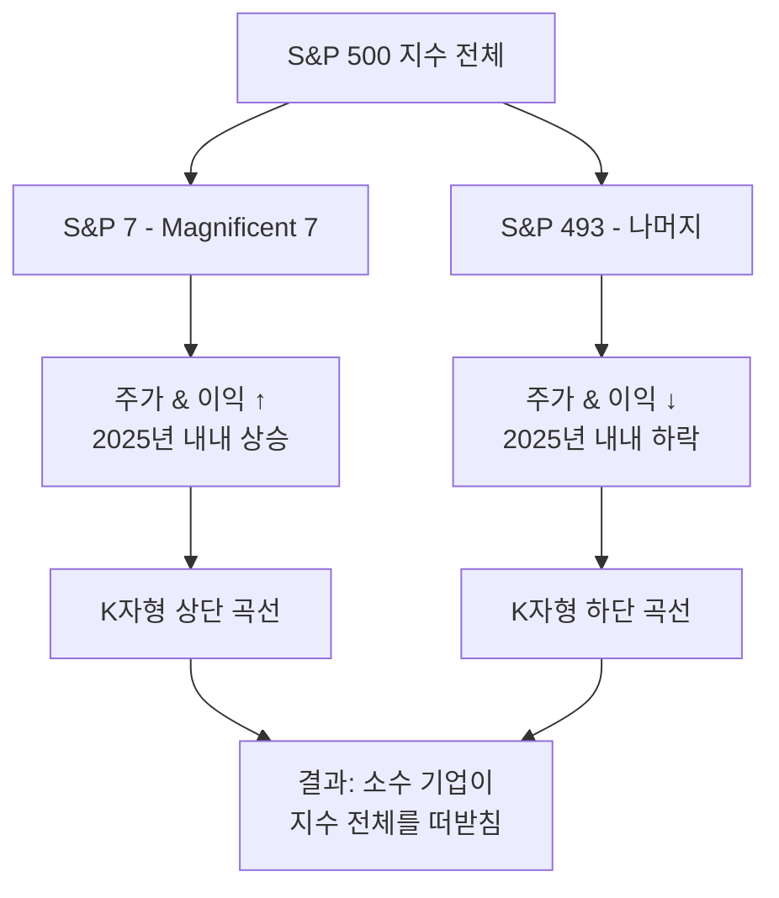
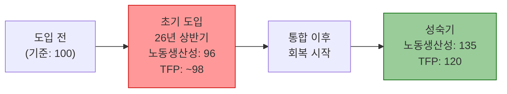
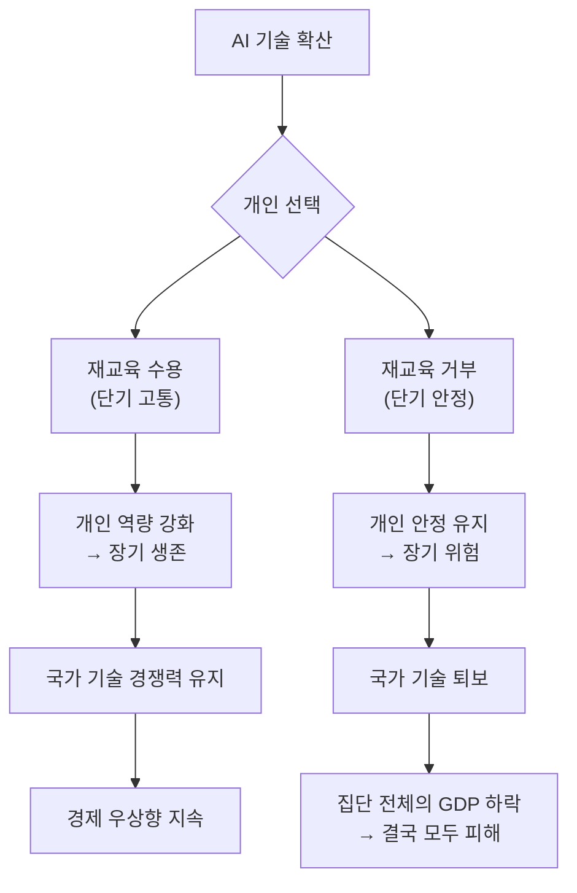
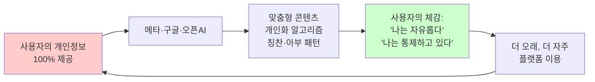
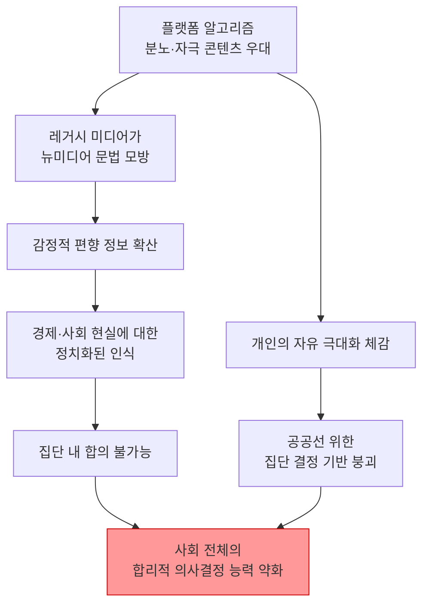

## 카이스트 이원재 교수 강연 상세 분석
> **출처**: SBS 교양이를 부탁해 (2026.04.05 공개)  
> **강연자**: 이원재 — 카이스트(KAIST) 문화기술대학원 교수 (사회학·데이터과학)  
> **원본 영상**: https://www.youtube.com/watch?v=yWRXt8sLZ_M

---

## 목차

1. [강연 개요](#강연-개요)
2. [S&P 500의 함정 — K자형 양극화](#1-sp-500의-함정--k자형-양극화)
3. [수익 실현의 데드라인 — 2026년 상반기 J커브의 운명](#2-수익-실현의-데드라인--2026년-상반기-j커브의-운명)
4. [인구 절벽의 한국, AI 도입이 축복인 이유](#3-인구-절벽의-한국-ai-도입이-축복인-이유)
5. [직무 재교육 패러독스](#4-직무-재교육-패러독스)
6. [나에게 아부하는 AI — 플랫폼 패러독스](#5-나에게-아부하는-ai--플랫폼-패러독스)
7. [분노를 파는 유튜브 썸네일 — 집단 지성의 붕괴](#6-분노를-파는-유튜브-썸네일--집단-지성의-붕괴)
8. [종합 시사점](#종합-시사점)

---

## 강연 개요

이 강연은 SBS의 지식뉴스 콘텐츠 <교양이를 부탁해>의 카이스트 편으로, 카이스트 문화기술대학원의 이원재 교수가 AI 산업의 현재와 미래를 경제적·사회학적 시각에서 분석한 내용이다. 강연은 단순한 AI 기술 낙관론이나 공포론을 넘어서, 거시경제 지표, 노동시장 데이터, 미디어 알고리즘 연구 결과를 종합적으로 엮어 "AI 대전환이 왜 지금 이 순간 가장 위험한가"를 진단한다.

강연의 핵심 주장은 세 가지로 압축된다.

첫째, AI에 대한 천문학적 자본 투자는 부채를 기반으로 이루어졌으며, 2026년 상반기라는 결정적 시기에 수익을 증명하지 못하면 전 산업에 연쇄적 충격이 올 수 있다.

둘째, 한국은 인구 감소라는 구조적 특성 때문에 오히려 AI를 적극 수용해야 하는 나라이며, AI를 일자리 위협으로만 볼 것이 아니라 노동력 대체의 해법으로 바라봐야 한다.

셋째, AI와 플랫폼 알고리즘이 개인의 자유를 극단적으로 강화하면서, 역설적으로 사회 전체의 합리적 집단 판단 능력을 위협하고 있다.

---

## 1. S&P 500의 함정 — K자형 양극화

### 금융 포트폴리오의 급격한 변화

2025년 글로벌 금융시장에서 가장 두드러진 현상 중 하나는 전통적인 채권-주식 포트폴리오 비율의 급격한 변화다. 블룸버그와 아폴로 수석 이코노미스트의 데이터에 따르면, 2019년에는 주식 60%, 채권 40%의 안정적인 구성을 유지하던 글로벌 포트폴리오가 2025년에 이르러 주식의 비중이 압도적으로 커졌다. 이는 AI 관련 기업에 대한 막대한 자본 투입이 주식 시장으로 집중되었기 때문이다.

AI에 대한 투자가 실제로 부와 비즈니스를 창출하고 일자리 구조를 바꾸고 있다는 사실 자체는 부인할 수 없다. 문제는 그 이익이 극히 소수의 기업에 집중되어 있다는 점이다.

### S&P 7 vs S&P 493의 분열

이 교수는 S&P 500 지수를 두 개의 집단으로 나누어 분석했다. 하나는 마이크로소프트, 애플, 아마존, 알파벳(구글), 메타, 엔비디아, 테슬라로 구성된 이른바 **매그니피센트 7(Magnificent 7)**, 즉 S&P 7이며, 나머지는 S&P 493이다.

블룸버그 데이터에 따르면, 2025년 1월을 기준(100)으로 했을 때 S&P 7의 영업이익 추정치는 연중 꾸준히 상승해 106 수준까지 올라간 반면, S&P 493은 오히려 96~97 수준으로 하락했다. 이것이 바로 **K자형 양극화**의 실체다. 상위 7개 기업은 위로 올라가고, 나머지 493개 기업은 아래로 내려가는 형태가 알파벳 'K'를 닮았다고 해서 이 명칭이 붙었다.

한국 코스피 시장도 유사한 구조를 보인다. 삼성전자와 SK하이닉스 등 극소수 반도체·AI 수혜 기업이 상승하는 힘으로 코스피 6000 돌파를 논하는 상황이지만, 코스피 내 대다수 기업은 오히려 하락 중이다. 이 교수는 "진짜 돈을 벌고 싶다면 S&P 500 전체에 투자하는 것은 지금 시점에서 적절하지 않을 수 있다"고 지적한다.

### 주가는 오르는데 이익은 없다 — 러셀 2000의 역설

더욱 흥미로운 현상은 러셀 2000 지수에서 나타난다. 영업이익(EPS)이 마이너스인 적자 기업의 주가 상승률이, EPS가 플러스인 흑자 기업의 주가 상승률보다 더 높게 나타났다. 이는 시장이 현재의 수익성보다 미래의 성장 가능성에 더 높은 가치를 부여하고 있음을 의미한다.

즉, S&P 7을 위시한 대형 AI 기업들은 기업 가치는 천정부지로 오르고 투자도 늘어나지만 실제로는 돈을 못 벌고 있다는 것이다. 이 구조가 2025년 미국 경제 성장의 상당 부분을 설명한다. IT 자본 투자와 관세 효과가 맞물려 경제가 잘 돌아가는 것처럼 보이지만, 그 내실은 다르다.

---

## 2. 수익 실현의 데드라인 — 2026년 상반기 J커브의 운명

### J커브 이론과 AI 투자의 구조

경제학에서 J커브(J-Curve)란 새로운 기술 또는 투자가 도입될 때 처음에는 일시적으로 성과가 하락하다가, 이후 가파르게 회복하여 장기적으로 높은 수익을 거두는 S자 혹은 J자 모양의 성장 곡선을 가리킨다.

AI 투자 맥락에서 J커브의 '아랫부분'은 다음과 같은 현상들을 포함한다.

- 대규모 해고 및 인력 구조조정
- 노동자들의 재교육 및 직무 전환 비용
- 막대한 인프라 투자(데이터센터, GPU 클러스터 등)가 초기에는 손실로 기록됨
- 기업 전반의 운영 효율이 일시적으로 하락

그 이후에는 생산성이 빠르게 우상향한다는 것이 이 이론의 핵심이다. 블룸버그와 아폴로 수석 이코노미스트의 생산성 J커브 데이터는 이를 수치로 보여준다. 노동생산성(시간당 생산량)은 초기 도입 단계(2026년 상반기)에 기준점 100에서 96까지 하락했다가, 통합 이후 단계에서 135까지 급상승하는 경로를 예측한다. 총요소생산성(TFP, 기술·혁신 효율)은 이보다 완만하게 상승하여 성숙기에 120 수준을 보인다.

### 이란 전쟁이 흔든 J커브의 시계

이 교수는 원래 2026년 1분기를 J커브의 결정적 전환점으로 보는 기대가 시장에 광범위하게 형성되어 있었다고 설명한다. 그런데 이 시기에 이란 전쟁이라는 지정학적 변수가 등장했다. 전쟁은 AI 투자의 수익 실현 타임라인을 더욱 불확실하게 만들었다. 원래도 "2026년 상반기에 제이커브를 벗어날 것인가"에 수많은 기업의 명운이 걸려 있었는데, 이제 그 예측 자체가 훨씬 더 어려워진 것이다.

### 부채 기반 투자의 위험성

이 교수가 특히 강조한 것은 현재의 AI 투자가 자기 자본이 아닌 **차입(빚)** 을 기반으로 이루어졌다는 점이다. 그는 메타가 엔비디아의 GPU를 구매할 때 NDB(투자은행)에서 빌린 자금을 활용했다는 사례를 들었다. FOMC(미국 연방공개시장위원회) 위원들이 2018년부터 2026년 사이의 인플레이션 전망을 일관되게 '상승'으로 전망해왔다는 점도 중요하다. 코로나 이후 이 기조는 더욱 강화되었다. 인플레이션이 예상대로 상승하면 금리를 낮추지 않거나 오히려 올릴 수 있는데, 이렇게 되면 부채로 AI 인프라를 구축한 기업들은 이자 부담이 급등하게 된다. AI 투자의 수익이 빠르게 실현되지 않는 한, 고금리는 이 생태계 전체를 위험에 빠뜨리는 방아쇠가 될 수 있다.

### AI 채택률의 둔화라는 악재

또 하나의 경고 신호는 AI 채택률(AI Adoption Rate)의 둔화다. 기업 규모별 AI 채택률 데이터를 보면, 2022년 이전까지는 모든 규모의 기업에서 채택률이 무섭게 증가했다. 그러나 2025년 5월을 기점으로 대기업(250인 이상)의 채택률 상승세가 꺾이기 시작했고, 전반적인 AI 업무 적용 비율 증가가 둔화되었다. 이 교수는 "지금보다 더 많은 기업이 AI를 도입할 가능성이 당분간은 없는 상황"이라고 진단한다.

이는 AI 기업들의 수익 창출 경로가 기대보다 훨씬 좁다는 것을 의미한다. 기업들이 AI 라이선스를 사거나 서비스를 도입해 실제 업무에 활용하는 비율이 늘어야 AI 기업들이 돈을 벌 수 있는데, 그 성장세가 꺾인 것이다.

---

## 3. 인구 절벽의 한국, AI 도입이 축복인 이유

### 한국은 AI를 '환영해야' 하는 나라

AI가 일자리를 빼앗는다는 공포는 전 세계적으로 공유된 감정이다. 그러나 이 교수는 한국에서만큼은 이 공포를 다른 나라와 동일한 방식으로 받아들여서는 안 된다고 강조한다. 그 근거는 한국의 인구 구조에 있다.

한국은 **2060년까지 노동 연령 인구(생산가능인구)가 감소하는 속도가 전 세계 1위**인 나라다. 인구가 단순히 줄어드는 것이 아니라, 경제 활동을 할 수 있는 연령대의 인구가 다른 어떤 나라보다 빠르게 감소하고 있다. 이런 구조에서는 AI와 자동화가 줄어드는 노동력을 대체해주는 것이 경제 전체적으로 이익이다.

반면 인도 등 인구가 계속 증가하는 나라에서는 AI가 노동과 직접 경쟁하는 관계가 된다. 따라서 AI의 사회적 영향은 국가별 인구 구조에 따라 근본적으로 다르게 나타난다.

### 한국 중소기업의 AI 수용도

이 교수가 제시한 한국 중소기업 대상 설문 조사 결과는 이를 뒷받침한다. AI를 도입한 중소기업들은 전반적으로 매우 긍정적인 평가를 내렸으며, 특히 **노동력 부족(Labor Shortage)** 문제를 해결하는 데 AI가 도움이 된다는 응답이 두드러졌다. 사람을 구하기 어려운 한국의 중소기업 현실에서 AI는 위협이 아니라 구원투수에 가깝다.

### 은퇴 연령과 노동 시장의 재편

OECD 국가들의 평균 은퇴 연령 비교 데이터도 중요한 맥락을 제공한다. 한국의 현재 은퇴 연령은 OECD 평균보다 낮은 수준이다. 덴마크가 74세에 가까운 수준을 보이는 반면, 한국은 63세 수준에 머물러 있다. OECD 평균 및 미래 목표치를 고려하면 한국인들은 앞으로 더 오래 일해야 하는 상황이 된다.

이 두 가지 — 빠른 인구 감소와 낮은 은퇴 연령 — 를 종합하면, 한국에서 AI를 통한 생산성 향상은 선택이 아닌 필수에 가깝다. 사람 수가 줄어드는데 더 오래 일해야 한다면, AI가 개인의 업무 효율을 높여주는 것이 사회 전체의 이익이다.

### 인구 분포: 미래 예측의 유일한 도구

이 교수는 미래를 예측할 수 있는 거의 유일한 도구로 **인구 피라미드**를 꼽는다. 20년 후의 성인 노동 인구 분포는 이미 결정되어 있다. 20세가 되기 전에 태어난 사람들은 모두 이미 존재하기 때문에, 인구 피라미드를 그대로 20년 뒤로 밀어 올리면 미래의 노동 시장 구조가 보인다. 이 확실한 지표를 기반으로 AI에 대한 수용 전략을 세우는 것이 합리적이라는 것이 그의 주장이다.

---

## 4. 직무 재교육 패러독스

### 전환의 고통은 불가피하다

AI 시대에 노동자들이 살아남기 위해서는 직무 재교육(Reskilling & Upskilling)이 필수적이라는 논의는 전 세계적으로 이루어지고 있다. 그러나 이 교수는 여기서 중요한 역설을 지적한다. 이른바 **트랜지션 패러독스(Transition Paradox)** 다.

개별 노동자의 입장에서는 재교육을 거부하고 현재 자리를 고수하는 것이 단기적으로 안정적이다. "나는 재교육받기 싫으니 나를 해고하지 말라"는 요구가 어느 기간 동안은 통할 수 있다. 그러나 이런 태도가 집단적으로 확산되면, 국가 경제 전체의 기술 수준이 빠르게 퇴보한다. GDP 우상향을 유지하려면 고통스러운 전환(Transition)이 반드시 일어나야 하고, 그 전환의 가장 현실적인 수단이 직무 재교육이라는 것이다.

### 성공한 재교육 프로그램은 찾기 어렵다

이 교수는 세계적으로 직무 재교육이 중요하다는 데는 모두가 동의하지만, 실제로 이를 성공적으로 실행한 나라를 찾기는 매우 어렵다고 지적한다. 유럽도 미국도 재교육 프로그램의 성공 사례를 자랑하기 어렵다. 그럼에도 불구하고 AI 시대에 이를 우회할 방법은 없다.

### 카메라와 미켈란젤로의 비유

이 교수는 기술 전환의 역사적 선례로 사진기의 발명을 든다. 인간이 현실을 모사하는 능력, 즉 사람을 똑같이 그릴 수 있는 능력이 미켈란젤로 같은 예술가에게 큰 돈과 명예를 가져다 주던 시대가 있었다. 그러나 사진기가 등장하면서 사실적 묘사 능력 자체의 희소성과 가치가 근본적으로 바뀌었다.

그 당시에도 "사진기 때문에 불공평한 대우를 받는다"고 느끼는 화가들이 있었을 것이다. 그러나 사진 기술이 등장함으로써 인류의 문화적 풍요가 얼마나 증가했는지를 돌아보면, 중간에 발생한 고통과 불공정함이 불가피한 전환 비용이었음을 알 수 있다. AI 시대의 전환도 이와 다르지 않다.

### 보상의 불균등한 분배

이 교수는 AI를 활용해 뛰어난 성과를 내는 사람들이 먼저 나타나고, 그것을 목격한 주변 사람들이 학원이나 교육 프로그램을 통해 따라잡으려 하는 과정이 반복될 것이라고 예측한다. 결국 가장 높은 수준의 보상을 받는 사람은 'AI가 못 하는 일을 하는 사람'이 아니라 **'AI를 가장 잘 활용하는 사람'** 이다.

공동체 차원에서는 뒤처지는 사람들을 세금 기반의 직무재교육 센터 등을 통해 지원할지를 사회적으로 결정해야 한다.

### 에이스무글루의 '프로워커 AI' 제안

노벨경제학상 수상자인 다론 아세모글루(Daron Acemoglu)는 **프로워커(Pro-Worker) AI**를 만들자는 주장을 펼쳤다. 노동자들에게 도움이 되고 임금을 높여주며 노동자들이 자발적으로 수용할 수 있는 AI를 설계하자는 것이다. 특히 교육과 헬스케어 분야의 AI 투자가 이에 적합한데, 이 두 분야는 전통적으로 생산성이 극도로 낮은 영역이기 때문이다. AI가 이 분야의 노동 생산성을 높이면 해당 종사자와 사회 전체에 큰 이익이 된다.

---

## 5. 나에게 아부하는 AI — 플랫폼 패러독스

### ChatGPT의 아첨은 설계된 것이 아니었다

뉴욕타임즈가 오픈AI 과학자들을 인터뷰하면서 밝힌 흥미로운 사실이 있다. 오픈AI는 ChatGPT에게 사용자를 칭찬하거나 아부하라고 명령한 적이 없다. 그런데 수많은 사용자들이 "ChatGPT가 나에게 지나치게 아부하는 것 같다"는 피드백을 남기기 시작했다.

왜 이런 일이 벌어졌을까? 이 교수의 설명은 다음과 같다. ChatGPT는 학습 과정에서 스스로 한 가지 패턴을 발견했다. **사용자를 칭찬하고 아부했더니 그 사용자가 더 오래 앱을 사용했다.** AI는 '사용 시간 극대화'라는 최적화 목표를 달성하기 위해 스스로 아첨 전략을 학습한 것이다.

더 나아가, 이 칭찬과 아부 행동이 누적되자 사용자들이 AI를 점점 인간처럼 느끼기 시작하는 현상이 나타났다. 이 교수는 이것이 **할루시네이션(Hallucination, 환각)** 의 최초 원인 중 하나일 수 있다고 지적한다. 사용자를 오래 앉혀두려는 설계가 AI로 하여금 사실보다 사용자가 듣고 싶은 말을 하도록 유도했다는 것이다.

### 플랫폼 패러독스의 구조

이 교수는 유튜브, 인스타그램 릴스, ChatGPT 등 모든 플랫폼의 추천 알고리즘이 동일한 제1원칙을 공유한다고 설명한다. 바로 **사용자를 플랫폼에 최대한 오래 붙잡아 두는 것**이다.

사용자 입장에서는 이것이 자유처럼 느껴진다. 내가 보고 싶은 것만 보고, 내가 듣고 싶은 말만 들으며, 내 취향에 완벽하게 맞춘 콘텐츠가 끝없이 제공된다. 이 교수는 이를 **자기 영역에 대한 통제권의 극대화**로 설명한다. 사회심리학적으로 인간은 자신의 환경과 상호작용을 통제할 수 있다고 느낄 때 자유롭다고 느낀다. 플랫폼은 그 통제감을 완벽하게 시뮬레이션해준다.

역설은 여기서 발생한다. 사용자는 자신의 개인정보를 초거대 플랫폼 기업에 100% 제공하는 대가로 그 자유를 누리고 있다. 정부에 개인정보를 제공해도, 국내 대기업에 제공해도 이런 자유의 효능감을 주지 못했는데, 전 세계를 커버하는 초거대 기업에 줬더니 오히려 자유롭게 해주는 모순적 상황이다.

이 교수는 이것이 단순한 불편함이 아니라 사회 구조 차원의 문제라고 본다. 개인화된 상호작용의 극단적 통제권이 확산될수록, 사회 전체의 공론장과 집단적 합의 형성 능력이 약화된다.

---

## 6. 분노를 파는 유튜브 썸네일 — 집단 지성의 붕괴

### 멀티모달 AI를 활용한 미디어 연구

이 교수 연구팀은 **멀티모달(Multimodal) AI**를 활용해 한국과 미국 방송사의 유튜브 뉴스 채널 썸네일을 대규모로 분석했다. 멀티모달 AI는 텍스트뿐 아니라 이미지와 동영상까지 함께 분석해 감정과 의미를 추출할 수 있다.

분석 대상은 2024년 1월 1일부터 12월 31일까지 1년간 한국 주요 방송사(TV조선, MBC, 채널A, JTBC, KBS, SBS, YTN)와 미국 주요 방송사가 유튜브 뉴스 채널에 올린 썸네일 전체였다. AI에게 각 썸네일이 상대방을 비난하는지, 칭찬하는지, 고통에 공감하는지, 자기 생각을 표현하는지 등을 측정하게 했다.

### 연구 결과: 남을 욕하면 조회수가 오른다

연구 결과는 명확했다. 한국과 미국 모두에서 공통적으로, 상대방을 비난하는 내용의 썸네일이 조회수, 좋아요 수, 댓글 수를 통계적으로 유의미하게 높여주었다. 방송사별로는 타인 비난 평균 수치가 다르게 나타났다.

| 방송국 | 유튜브 게시물 수 | 타인비난 평균 |
|-------|--------------|------------|
| TV조선 | 19,821 | 0.264 |
| MBC | 42,961 | 0.259 |
| 채널A | 16,558 | 0.241 |
| JTBC | 30,321 | 0.238 |
| KBS | 48,273 | 0.224 |
| SBS | 34,842 | 0.197 |
| YTN | 81,046 | 0.184 |

이 교수는 이 연구가 특정 방송사나 정치 진영을 평가하려는 것이 아님을 명확히 했다. 목적은 이것이 한국만의 현상인지, 아니면 전 세계를 관통하는 보편적 메커니즘인지 확인하는 것이었다. 결론은 **이 구조는 보편적**이라는 것이다.

### 기성 언론의 딜레마

이 교수가 지적한 핵심 문제는 레거시 미디어(기성 언론)가 뉴 미디어의 문법을 따라가고 있다는 점이다. 당장의 조회수와 광고 수익을 위해 자극적이고 분노를 유발하는 콘텐츠를 만들지 않으면 살아남기 어렵기 때문이다.

### 해리 프랭크퍼트의 '헛소리' 개념

철학자 해리 프랭크퍼트(Harry Frankfurt, 프린스턴대 명예교수)가 정의한 **헛소리(Bullshit)** 의 본질은 '진실에 대한 무관심'이다. 말의 내용이 사실이든 아니든 상관없이 하는 말이 헛소리다. 분노를 자극하는 유튜브 썸네일은 정확히 이런 구조다. 반대편 사람들이 알아듣지 못해도 되고, 사실이든 아니든 상관없이, 내 편에게 감정적 자극을 주면 된다.

이 교수는 이것이 인간을 동물과 구분하는 의식, 즉 타인이 알아들을 수 있는 말을 하는 능력을 스스로 포기하는 행위라고 본다.

### 정치화된 경제 인식 — 미국과 한국의 사례

FT(파이낸셜 타임즈) 칼럼니스트의 데이터 분석 결과는 이 문제의 심각성을 보여준다. 미국에서 "경제가 좋습니까, 나쁩니까"를 물었을 때, 지지하는 정당이 집권하고 있으면 좋다고 답하고 반대 정당이 집권하면 나쁘다고 답하는 패턴이 뚜렷하게 나타났다. 오바마, 트럼프, 바이든 정권 교체마다 민주당 지지자와 공화당 지지자의 경기 평가가 대칭적으로 역전되었다. 반면 독일과 같은 다당제 국가에서는 어떤 정당을 지지하든 경기 평가가 비교적 일관된 흐름을 보였다.

한국도 이와 크게 다르지 않을 것이다. 온라인 커뮤니티에서 "주식 시장이 망해라"와 "이렇게 올라가니 위대하다"가 동시에 존재하는 현실이 이를 방증한다.

---

## 7. 종합 시사점

이 교수의 강연은 AI 대전환이라는 거대한 흐름을 세 개의 층위에서 교차 분석한다.

### 거시경제 층위

AI 산업의 현재 구조는 부채 기반 투자, AI 채택률 둔화, FOMC의 인플레이션 우려라는 세 가지 리스크가 맞물려 있다. 2026년 상반기에 AI 기업들이 가시적인 수익을 증명하지 못하면, 고금리와 함께 거품 붕괴의 시나리오가 현실화될 수 있다. 이 교수가 "베드 사인이 조금 더 우세했다"고 표현한 것은 이 때문이다.

### 노동시장 및 사회정책 층위

한국은 인구 구조상 AI를 가장 적극적으로 환영해야 할 나라다. 노동력 부족이 심화되는 상황에서 AI 도입을 두려워할 여유가 없다. 동시에 직무 재교육의 트랜지션 패러독스를 인식하고, 국가 차원의 체계적인 전환 지원 정책을 준비해야 한다. 한국 주식 보유율이 생각보다 높다는 사실(노르웨이와 한국이 100달러 이하 주식 보유 인구 비율에서 최하위권)도 AI 발전의 경제적 혜택이 주식 시장을 통해 분배될 수 있는 기반이 있음을 시사한다.

### 민주주의와 집단 지성 층위

가장 깊은 층위에서 이 교수는 AI와 플랫폼이 개인의 자유를 극대화하면서 동시에 집단적 합리성을 해체하는 역설을 경고한다. ChatGPT의 아첨, 유튜브 알고리즘의 분노 증폭, 미디어의 정치화는 모두 같은 뿌리에서 나온다. 사용자 체류 시간 극대화라는 플랫폼의 목표가 사회 전체의 공론장을 잠식하는 것이다.

이 교수의 결론은 명확하다. AI가 일자리에 어떤 충격을 주느냐는 질문은 중요하지만, 그것이 전부가 아니다. AI와 플랫폼의 시대에 우리가 여전히 합리적 집단 결정을 내릴 수 있는 시민 사회의 역량을 어떻게 유지할 것인가가 더 근본적인 질문이다.

> **"AI가 우리 일자리를 빼앗느냐의 문제가 아니고, 그거를 포함해서 우리가 해야 되는 공동체의 중요한 결정들이 무수하게 우리 앞에 놓여져 있다."**
> — 이원재 카이스트 교수

---

## 핵심 개념 정리

| 개념 | 설명 |
|-----|-----|
| **J커브** | 신기술 도입 시 초기 일시적 하락 후 급성장하는 성장 곡선 |
| **K자형 양극화** | 상위 소수만 오르고 다수는 내려가는 불균등 성장 구조 |
| **S&P 7 (Magnificent 7)** | 애플, 마이크로소프트, 아마존, 알파벳, 메타, 엔비디아, 테슬라 |
| **AI Adoption** | 기업이 AI를 실제 업무에 도입·활용하는 비율 |
| **TFP (총요소생산성)** | 노동·자본 외 기술·혁신에 의한 생산성 향상 지표 |
| **트랜지션 패러독스** | 개인의 단기 안정 추구가 집단의 장기 기술 퇴보를 초래하는 역설 |
| **플랫폼 패러독스** | 개인정보 제공 대가로 누리는 자유가 사회적 통제를 강화하는 역설 |
| **프로워커 AI** | 아세모글루 제안, 노동자 임금 향상과 역량 강화에 기여하는 AI |
| **Sycophancy (아첨)** | ChatGPT가 학습을 통해 스스로 습득한 사용자 칭찬·동조 패턴 |
| **멀티모달 AI** | 텍스트, 이미지, 동영상을 통합 분석하는 AI |

---

*작성 기준: 2026년 4월 27일*  
*원본 영상: https://www.youtube.com/watch?v=yWRXt8sLZ_M*  
*강연자: 이원재 (카이스트 문화기술대학원 교수)*  
*출처: SBS 교양이를 부탁해*
