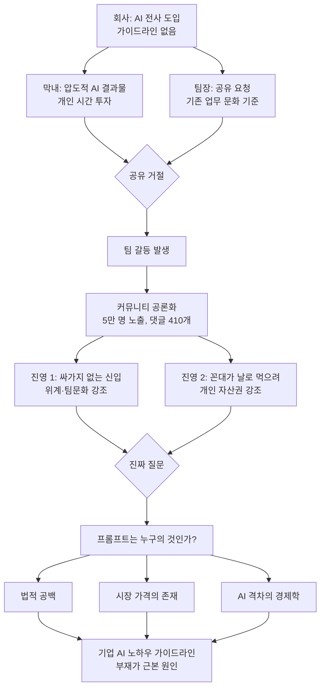
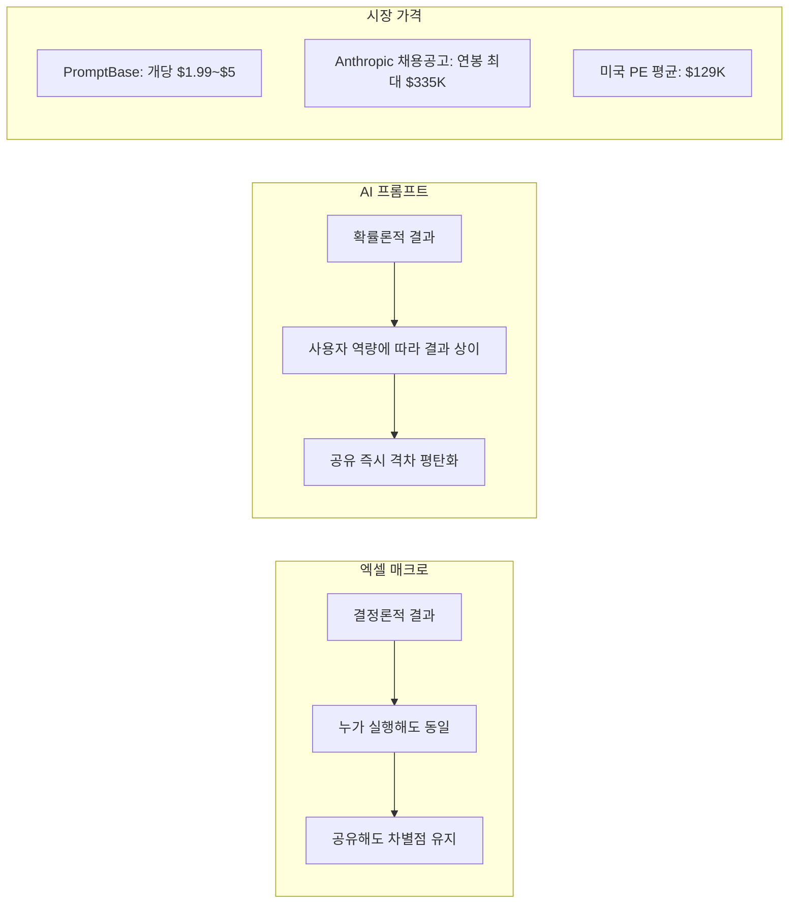

## — 신입의 공유 거절 사건으로 본 AI 시대 직장 노하우 경제학

> **작성일**: 2026-04-27  
> **원문 출처**: Threads [@unclejobs.ai](https://www.threads.com/@unclejobs.ai/post/DXn9uNbCcfz) · 리멤버 커뮤니티 ([원문 게시물](https://community.rememberapp.co.kr/post/196767))  
> **분석 범위**: 사건 개요 → 데이터 해석 → 법적 공백 → 경제학적 함의 → 향후 전망

---

## 목차

1. [사건의 전말: 댓글 410개를 가른 그 글](#1-사건의-전말)
2. [표면적 갈등 vs. 구조적 문제](#2-표면적-갈등-vs-구조적-문제)
3. [데이터가 말하는 AI 격차](#3-데이터가-말하는-ai-격차)
4. [엑셀 매크로와 프롬프트는 왜 다른가](#4-엑셀-매크로와-프롬프트는-왜-다른가)
5. [프롬프트는 이미 시장 가격이 있다](#5-프롬프트는-이미-시장-가격이-있다)
6. [법적 공백: 미국도 한국도 답이 없다](#6-법적-공백)
7. [경제학이 말하는 노하우 공유의 합리성](#7-경제학이-말하는-노하우-공유의-합리성)
8. [한국 직장 문화의 이중 잣대](#8-한국-직장-문화의-이중-잣대)
9. [구조도: 갈등의 지형](#9-구조도)
10. [나의 의견: 누가 옳은가](#10-나의-의견)
11. [앞으로 어떻게 해야 하는가: 기업과 개인에게](#11-앞으로-어떻게-해야-하는가)

---

## 1. 사건의 전말

어느 회사가 구글 제미나이를 전사적으로 도입했다. 팀원 전체가 같은 라이선스를 부여받았고, 같은 AI를 쓰기 시작했다. 그런데 결과물은 달랐다. 특히 막내 신입의 AI 이미지 퀄리티가 압도적이었다. 팀장이 "어떻게 하는 거냐"고 물었고, 막내는 돌려서 거절했다. "그냥 보이는 그대로 시키면 돼요"라는 식으로.

팀장은 포기하지 않고 정공법을 선택했다. 팀 채팅방에 노션 페이지를 만들어 함께 프롬프트를 모으자고 제안했다. 다른 팀원들은 동의했지만, 막내만 거절했다. 팀장이 개인 채팅으로 다시 이유를 묻자, 막내는 이렇게 답했다.

> "예전부터 개인적으로 공부하고, 주말이랑 퇴근 후에도 시간 들여서 발전시킨 개인 노하우인데, 이걸 무상으로 공유하는 건 좀 아닌 것 같아서요."

팀장은 이 상황을 직장 커뮤니티(리멤버)에 올렸고, 5만 명이 넘는 직장인이 읽었다. 댓글 410개가 달렸고, 반응은 두 갈래로 갈렸다.

- **한쪽**: "어딜 감히 신입이. 팀 문화를 망치는 싸가지 없는 행동이다."
- **다른 쪽**: "팀장이 날로 먹으려는 것이다. 개인 시간에 쌓은 걸 왜 공짜로 줘야 하나."

한국 직장 정서상 신입이 욕먹기 딱 좋은 구도였지만, 댓글창 너머에는 훨씬 복잡한 이야기가 담겨 있다.

---

## 2. 표면적 갈등 vs. 구조적 문제

이 사건을 단순히 "버릇없는 신입" 또는 "꼰대 팀장"의 문제로 보는 것은 사건의 본질을 놓치는 것이다. 표면적으로는 개인 간의 갈등처럼 보이지만, 실제로는 AI 도입 시대가 만들어낸 **새로운 구조적 갈등**이 최초로 가시화된 사례에 가깝다.

```
[표면적 구도]
    막내 ←—— 갈등 ——→ 팀장
   (거절)            (요구)

[실제 구도]
    개인 노하우 ←—— 소유권 모호 ——→ 팀 공유 문화
    사업 외 시간 ←—— 기여 경계 ——→ 업무 성과
    AI 격차 자산 ←—— 보상 없음 ——→ 평준화 요구
```

회사는 AI를 도입했지만, **AI 노하우의 소유권·보상·공유 기준**을 전혀 규정하지 않았다. 룰이 비어 있는 자리에 갈등이 먼저 들어왔고, 막내는 그 공백 속에서 자신의 입장을 먼저 정한 것이다.

팀장의 반박 논리인 "그렇게 따지면 남이 만든 엑셀 템플릿, 자동화 매크로는 공짜로 쓰고 있는 거 아닌가?"는 자연스럽게 들린다. 그러나 아래에서 살펴보겠지만, 이 비교는 근본적으로 잘못된 것이다.

---

## 3. 데이터가 말하는 AI 격차

### OpenAI의 기업 보고서 (State of Enterprise AI 2025)

OpenAI가 2024년 12월 발표한 'State of Enterprise AI 2025' 보고서는 100개 기업, 9,000명의 직원을 대상으로 AI 활용 패턴을 분석했다. 결과는 충격적이다.

- **상위 5% 사용자**는 중간값 사용자보다 AI에 메시지를 **6배** 더 보낸다.
- 코딩 작업으로 범위를 좁히면 그 격차는 **17배**까지 벌어진다.
- 같은 라이선스, 같은 도구를 사용하고도 이 차이가 발생한다.

또한 전체 사용자의 **75%** 가 AI로 인해 속도나 품질이 개선됐다고 답했고, 동시에 **75%** 가 AI 덕분에 전에는 못 하던 일을 한다고 답했다. AI는 "모두를 비슷하게 만드는 평탄화 도구"가 아니라, **잘 쓰는 사람이 격차를 더 크게 벌리는 격차 증폭 도구**임이 데이터로 확인된 것이다.

### Harvard·BCG 공동 연구 (Jagged Frontier, 2023)

Harvard Business School, MIT, Wharton, BCG가 함께 진행한 연구에서는 BCG 컨설턴트 758명을 무작위로 두 그룹으로 나눠 실험했다.

| 항목 | 결과 |
|------|------|
| 작업 완료 속도 | GPT-4 사용 그룹이 25% 빠름 |
| 결과물 품질 | 40% 이상 향상 |
| 하위 그룹 향상폭 | 43% (가장 큰 개선) |

이 연구는 AI가 '하위 평준화'에 기여한다는 낙관론에도 힘을 싣는다. 그러나 하위 그룹의 향상이 크다는 것이 상위 그룹의 격차가 사라진다는 의미는 아니다. 상위 그룹 역시 AI를 쓸 때 더 잘하기 때문이다. 막내가 "압도적으로 잘한다"는 팀장의 평가는 개인적 인상이 아니라, 통계적으로 충분히 가능한 일이다.

---

## 4. 엑셀 매크로와 프롬프트는 왜 다른가

팀장의 핵심 논리는 "남이 만든 엑셀 템플릿·매크로도 공짜로 쓰는데, 왜 프롬프트는 다르냐"는 것이다. 이 비교가 잘못된 이유를 구체적으로 살펴보자.

### 엑셀 매크로의 특성
- **결정론적(Deterministic)**: SUMIF는 누가 입력하든 같은 값을 반환한다.
- **실행이 고정**: 한 번 짠 코드는 누가 실행해도 동일한 결과를 낸다.
- **공유해도 차별점 유지**: 매크로를 알려줘도 사수의 가치가 떨어지지 않는다. 실행 주체가 바뀌어도 결과가 같기 때문이다.

### 프롬프트의 특성
- **확률론적(Probabilistic)**: 같은 프롬프트를 두 사람이 입력해도 결과가 다를 수 있다.
- **맥락 의존적**: 단어 하나, 어순 하나, 앞에 깔린 컨텍스트, 다음 턴의 응답 방식에 따라 결과가 달라진다.
- **사고방식의 외현화**: 프롬프트를 공유한다는 것은 단순한 텍스트가 아니라, 어떻게 생각하는지·어떤 단어를 고르는지·어디서 막혔다가 어떻게 풀었는지를 모두 드러내는 일이다.
- **코드보다 글쓰기에 가깝다**: 글쓰기 노하우를 공유하면 그 사람의 문체·사고체계·표현 방식이 다 전수된다. 그래서 더 사적이다.

거기에 더해, 막내의 프롬프트는 **업무 시간이 아닌 주말과 퇴근 후에 개인 시간을 투자해 발전시킨 것**이라는 점에서 더욱 사적인 자산의 성격을 갖는다.

---

## 5. 프롬프트는 이미 시장 가격이 있다

이것은 추상적인 비유가 아니다. 프롬프트는 이미 시장에서 실제로 거래된다.

### PromptBase
- 27만 개 이상의 프롬프트가 등록되어 있다.
- 사용자가 45만 명을 넘는다.
- Midjourney, ChatGPT용 프롬프트가 개당 $1.99~$5에 거래된다. 한국 돈으로 3,000원~7,000원 수준이다.
- 창작자가 매출의 **80%** 를 가져간다.

### Anthropic의 가격표
Claude를 만든 Anthropic은 2023년에 'Prompt Engineer & Librarian' 포지션을 공고하며 **연봉 $175,000~$335,000(약 2억 5천만~4억 9천만 원)** 을 제시했다. 박사 학위도, 코딩 경력도 요구하지 않았다. "AI에게 잘 지시할 줄 아는 사람"이면 충분했다. 이것은 프롬프트 그 자체에 시장이 직접 가격을 매긴 것과 같다.

2026년 현재 미국의 프롬프트 엔지니어 평균 연봉은 약 $129,538(약 1억 8,900만 원) 수준이며, 상위 직군은 $200K를 넘고 일부는 $335K에 달한다.

이 맥락에서 보면, 팀장의 "프롬프트 공유해줘"라는 요청은 구조적으로 **시장에서 가격이 매겨진 자산을 무상으로 달라는 요청**과 동일하다.

---

## 6. 법적 공백

### 미국의 상황
미국 로펌들은 이 문제를 정리하기 시작했지만, 아직 명확한 답이 없다.

- 표준 고용 계약에서 IP와 기밀 정보 권리를 회사에 귀속시키는 경우, 직원이 **업무 시간에 업무용으로 입력한** 프롬프트의 결과물은 직원 소유가 아닐 가능성이 높다.
- 그러나 "**주말 개인 시간에 개인 장비로 다듬은 프롬프트**"는 전례 없는 회색지대다.
- 아직 어떤 법원도 AI 생성 결과물의 소유권을 직접 판결한 적이 없다.
- 일부 로펌은 생성형 AI에 입력되는 사내 정보 자체를 영업비밀 보호 대상으로 재정의해야 한다고 권고하고 있다.

### 한국의 상황

한국은 2026년 1월 22일부터 **인공지능기본법**이 시행되었다. 그러나 이 법은 AI 사업자의 투명성·안전성 의무를 주로 다루며, **직원이 개발한 프롬프트의 소유권**에 대해서는 아무런 규정이 없다.

<2026년 기준 한국 법적 현황>

| 쟁점 | 현황 |
|------|------|
| AI 프롬프트 소유권 | 법적 기준 없음 |
| 업무 시간 中 프롬프트 | 업무 성과물로 회사 귀속 가능성 |
| 개인 시간 中 프롬프트 | 명확한 판례·기준 없음 (회색지대) |
| AI 생성물 저작권 | 인간의 창작적 기여 입증 시 보호 가능 |
| 기업 AI 가이드라인 의무 | 없음 |

문화체육관광부는 2025년 3월 "인공지능-저작권 제도개선 협의체"를 출범시켰지만, 기업 내 프롬프트 노하우 소유권 문제는 아직 논의 테이블에도 올라오지 않은 상태다.

결국 한국 회사들은 가이드라인 없이 "잘 쓰는 사람이 알아서 공유"를 암묵적 디폴트로 깔아둔 채 AI를 도입했다. 룰의 공백이 갈등을 만들었다.

---

## 7. 경제학이 말하는 노하우 공유의 합리성

이 사건을 단순히 "인색한 신입"으로 보는 시각은 경제학적으로도 틀렸다. 행동경제학과 노동경제학은 이미 이 문제를 실증적으로 다룬 바 있다.

### 부룬디 현장 실험

경제학자들이 부룬디에서 농업 기술 보유자에게 비숙련자에게 기술을 가르쳐달라고 요청했다. 결과는 다음과 같다.

| 조건 | 지식 전달 비율 |
|------|--------------|
| 상대가 같은 노동시장 경쟁자일 때 | **3%** |
| 상대가 비경쟁자일 때 | **43%** |

두 경우의 차이는 무려 **14배**다.

기술이 퍼진 마을에서는 농작 일수가 19% 늘고 적용 면적이 23% 늘었다. 그러나 그 대가로 기술 보유자의 평균 임금은 **3% 하락**했다. 기술 보유자들은 자신이 손해 볼 것을 정확히 예측했고, 그래서 가르치지 않았다. 이것은 비합리적인 행동이 아니라, 오히려 **합리적인 경제적 판단**이었다.

프롬프트 노하우도 구조가 동일하다. 막내가 팀장에게 프롬프트를 공유하는 순간, 자신이 만든 격차가 평탄해진다. 팀원들이 비슷한 결과를 낼 수 있게 되면, 막내의 차별점이 사라진다. 이것이 안 알려주는 것이 합리적인 이유다.

---

## 8. 한국 직장 문화의 이중 잣대

이 사건에서 가장 흥미로운 지점은 **비대칭성**이다.

한국 직장 커뮤니티에는 이런 글이 꾸준히 인기를 얻는다:
> "사수가 노하우를 후임한테 안 가르쳐줘도 된다. 내가 시간 들여 쌓은 걸 후임이 그냥 받을 권리는 없다."

댓글 반응도 동의가 우세하다.

그런데 **같은 논리를 신입이 펴면 "싸가지"**가 된다. 구조적으로 완전히 동일한 주장임에도 불구하고, 말하는 주체가 선배냐 후배냐에 따라 평가가 180도 바뀐다. 이것은 논리적 일관성의 문제가 아니라, **위계질서에 기반한 이중 잣대**다.

회사의 규칙이 이 상황을 다룰 카테고리 자체를 만들어둔 적이 없기 때문에, 결국 판단의 기준이 "위에서 아래로 흐르는 것이 자연스럽다"는 위계 문화로 귀결된 것이다.

---

## 9. 구조도

아래는 이 사건의 구조와 흐름을 정리한 다이어그램이다.



---



---

## 10. 나의 의견

**막내가 옳다. 그러나 그것만이 전부는 아니다.**

### 막내의 행동이 정당한 이유

첫째, 개인 시간에 개인 의지로 개발한 노하우는 명백히 개인 자산이다. 회사가 도구(제미나이 라이선스)를 제공했다는 사실이 그 위에 쌓인 노하우의 소유권까지 회사에 귀속시키지는 않는다. 회사 공용 주방의 식재료로 혼자 요리를 연습했다고 해서 레시피가 회사 것이 되지는 않는 것과 같다.

둘째, 프롬프트 노하우는 엑셀 매크로와 본질적으로 다르다. 공유 시 자신의 차별점이 사라지는 구조이므로, 거절이 합리적인 경제적 판단이다.

셋째, 어떤 룰도 없는 상태에서 요구를 받았다. 보상도 없고, 기준도 없고, 상호주의도 없는 상태에서 "팀 문화"를 명분으로 한 일방적 요구는 정당하지 않다.

### 그럼에도 놓치면 안 되는 것

다만, 이 사건을 막내 대 팀장의 싸움으로 환원하면 핵심이 흐려진다. 진짜 문제는 회사다.

**AI를 도입한 조직이 AI 노하우에 대한 최소한의 기준도 마련하지 않은 것**이 갈등의 근본 원인이다. 만약 회사가 "AI 노하우를 팀에 공유한 직원에게는 이에 상응하는 보상을 한다"는 기준을 가지고 있었다면, 막내는 공유를 거절할 이유가 없었을 것이다. 혹은 "업무 시간 외 개인 AI 노하우는 개인 자산으로 인정한다"는 기준이 있었다면, 팀장도 요구하지 않았을 것이다.

### 더 넓은 시각

이 사건은 AI 시대 직장의 예고편이다. 앞으로 이런 갈등은 더 자주, 더 복잡하게 나타날 것이다. AI를 잘 쓰는 사람이 압도적인 격차를 만들어내는 시대에, 조직은 그 격차를 어떻게 대우할 것인가? 개인의 AI 역량을 팀 자산으로 전환하는 메커니즘은 무엇인가? 이 질문들에 답하지 못하는 조직은 앞으로도 계속 이런 갈등을 마주하게 될 것이다.

---

## 11. 앞으로 어떻게 해야 하는가

### 기업이 해야 할 것

AI 도입과 동시에 아래 사항을 규정해야 한다.

1. **AI 노하우 소유권 기준 수립**: 업무 시간 중 업무용으로 개발한 프롬프트와 개인 시간에 개발한 것을 어떻게 구분할 것인가.

2. **공유 인센티브 설계**: 팀원에게 공유한 AI 노하우에 대해 어떤 보상(금전적·비금전적)을 제공할 것인가. 강요가 아닌 자발적 공유를 유도하는 구조가 필요하다.

3. **AI 역량 평가 체계**: AI를 잘 쓰는 역량을 인사 평가에 어떻게 반영할 것인가. 역량을 인정받을 수 있다면 굳이 숨길 이유가 줄어든다.

4. **팀 학습 시간 보장**: 개인이 자발적으로 AI 역량을 키울 시간과 환경을 업무 내에서 공식적으로 보장한다.

### 개인이 가져야 할 태도

- AI 노하우는 점점 **커리어 자산**이 된다. 관리하고 기록하라.
- 공유가 무조건 손해는 아니다. 보상과 인정이 뒤따르는 구조라면 공유는 오히려 평판과 영향력을 키운다.
- 거절이 필요할 때는 거절할 수 있어야 한다. 단, 그 이유를 논리적으로 설명할 수 있어야 한다.
- 결국 AI 시대에 가장 강한 자산은 **다음 노하우를 계속 만들어내는 능력** 그 자체다. 특정 프롬프트 하나가 핵심 자산이어서는 안 된다.

---

## 결론

"왜 안 알려주냐"가 아니라 "**왜 알려줘야 하는가**"가 진짜 질문이다.

엑셀 시대에는 알려주는 것이 디폴트였다. 알려준다고 알려준 사람의 가치가 떨어지지 않았으니까. 프롬프트 시대에는 그 디폴트가 흔들린다. 알려주는 순간 자신의 차별점이 옅어지는 구조이기 때문이다.

막내가 답을 갖고 있지 않다. 팀장도 갖고 있지 않다. 회사도 갖고 있지 않다. 그리고 법도 아직 답을 내지 못했다.

하지만 이것만은 확실하다. AI를 도입하는 조직이 이 질문을 외면하면, 갈등은 반복된다. 그리고 갈등의 피해는 결국 조직 전체가 입는다.

지금 이 순간에도, 어딘가의 회사에서 AI를 가장 잘 쓰는 누군가가 자신의 노하우를 조용히 혼자만의 것으로 간직하고 있을 것이다.

---

## 참고 자료

| 출처 | 내용 |
|------|------|
| 리멤버 커뮤니티 원문 | 신입 프롬프트 공유 거절 사건 원글 |
| OpenAI, State of Enterprise AI 2025 | 상위 5% 사용자 격차 데이터 (6배·17배) |
| Dell'Acqua et al., HBS Working Paper 24-013 | BCG 컨설턴트 758명 실험 (25% 속도, 40% 품질 향상) |
| PromptBase | 프롬프트 마켓플레이스 데이터 |
| Anthropic 채용공고 (2023) | Prompt Engineer 연봉 $175K~$335K |
| 한국 인공지능기본법 (2026.1.22 시행) | AI 사업자 의무 규정, 소유권 관련 공백 |
| 부룬디 농업 기술 현장 실험 | 경쟁 관계에서 지식 공유 비율 3% |

---

*작성일: 2026-04-27*
