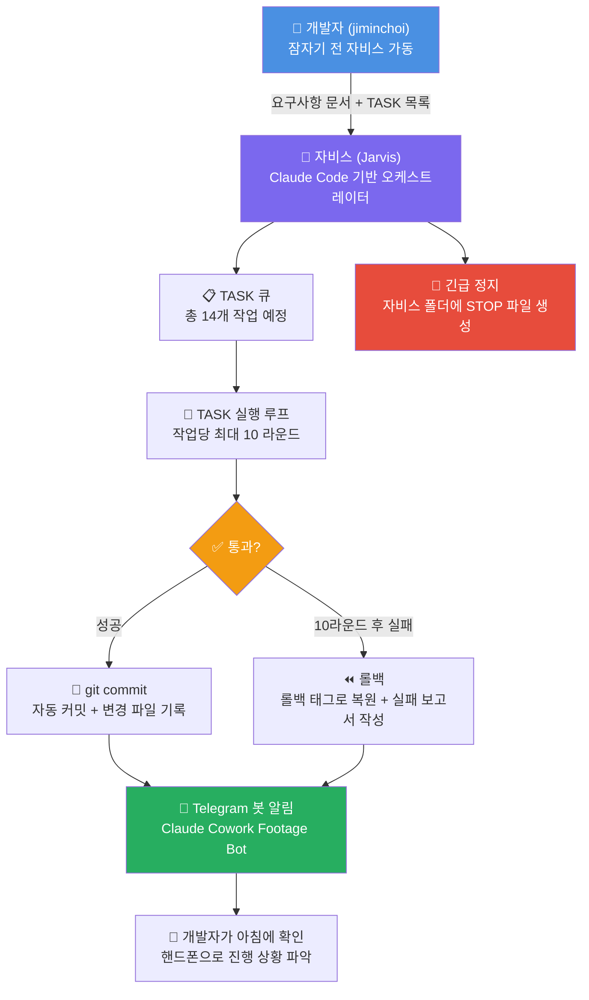
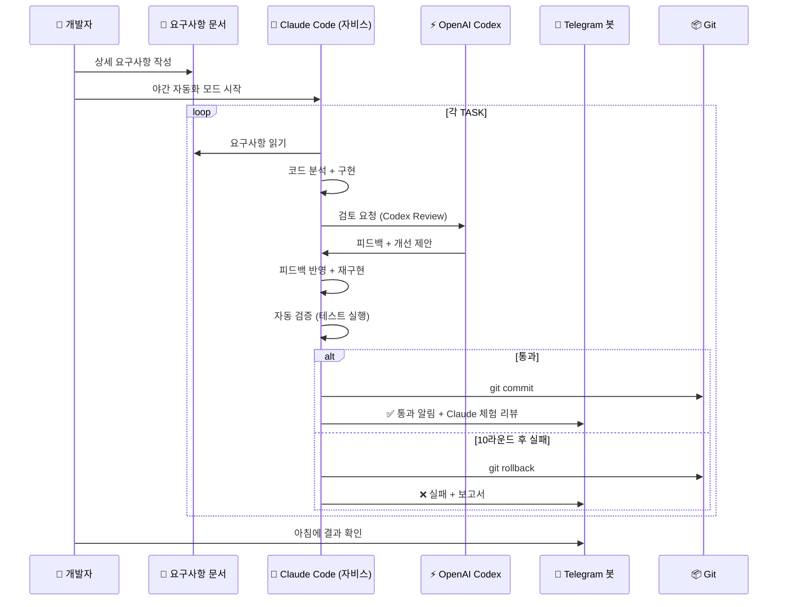

### Codex × Claude Code 상호 피드백 기반 자율 에이전트 개발 워크플로우

> **문서 작성 배경:** Threads([@audiovisual.eko]( https://www.threads.com/@audiovisual.eko/post/DXn_MOwEiXz))에 공유된 영상과 Telegram 봇 스크린샷 9장을 바탕으로 작성한 분석 리포트입니다.  
> **분석 일자:** 2026-04-28

---

## 목차

1. [전체 개요](#1-전체-개요)
2. [시스템 구조 — 자비스(Jarvis) 야간 자동화 파이프라인](#2-시스템-구조--자비스jarvis-야간-자동화-파이프라인)
3. [프로젝트 정체: JEEPO_3D란 무엇인가?](#3-프로젝트-정체-jeepo_3d란-무엇인가)
4. [야간 작업 세션 전체 타임라인 (2026-04-27)](#4-야간-작업-세션-전체-타임라인-2026-04-27)
5. [TASK별 상세 분석](#5-task별-상세-분석)
6. [Codex × Claude Code 협업 구조](#6-codex--claude-code-협업-구조)
7. [개발자 철학 및 운영 노하우](#7-개발자-철학-및-운영-노하우)
8. [Vibe Coding의 빛과 그림자](#8-vibe-coding의-빛과-그림자)
9. [기술 트렌드 컨텍스트 (2026년 현재)](#9-기술-트렌드-컨텍스트-2026년-현재)
10. [결론 및 시사점](#10-결론-및-시사점)

---

## 1. 전체 개요

스크린샷들과 Threads 게시물을 종합하면, 이것은 단순한 AI 코딩 도구 사용기가 아니다. **OpenAI Codex와 Anthropic Claude Code가 서로 피드백을 주고받으며 자동으로 소프트웨어 패치를 수행하는 자율 에이전트 시스템**의 실제 운영 로그다.

개발자(jiminchoi, @audiovisual.eko)는 **"자비스(Jarvis)"** 라는 이름의 야간 자동화 시스템을 구축했다. 이 시스템은:

- 개발자가 잠든 사이 밤새 코드를 수정하고,
- 작업 결과를 Telegram 봇을 통해 실시간으로 리포트하며,
- 핸드폰만 봐도 진행 상황을 파악할 수 있도록 설계되어 있다.

첫 번째 이미지(Image 1)는 이 시스템의 **결과물**인 JEEPO_3D 프로젝트가 실제로 동작하는 모습을 레트로 감성의 맥 클래식 디자인 모니터 케이스에 넣어 보여주는 장면이다. 화면에는 3D 캐릭터(쥐포)가 등장하고, 시간은 17:55:49, 달력, 에이전트 피드 등이 배치된 독특한 UI가 구동 중이다.

---

## 2. 시스템 구조 — 자비스(Jarvis) 야간 자동화 파이프라인



### 핵심 설계 원칙

**① 비동기 자율 실행 (Autonomous Async Execution)**  
개발자가 잠든 동안에도 시스템은 계속 동작한다. 작업당 최대 10라운드를 돌리고, 그래도 해결 안 되면 알아서 롤백하고 보고서를 작성한다. 개발자의 직접 개입 없이 야간 내내 작업을 진행하는 완전 자율 모드다.

**② 안전망 (Safety Net)**  
- **롤백 태그:** `overnight-start-20260427_035930` — 언제든 작업 전 상태로 복원 가능
- **STOP 파일:** 자비스 폴더에 파일 하나만 만들면 즉시 멈춤. 코드 없는 비상 정지 스위치
- **10라운드 제한:** 같은 문제에서 무한 루프 방지. 삽질의 경계선을 명확히 설정

**③ 투명한 관찰 가능성 (Observability)**  
- Telegram 봇이 각 TASK 시작/완료/실패를 실시간으로 알림
- 모든 변경사항이 git commit으로 기록됨 (author, date, 변경 파일, 라인 수 포함)
- 로그 경로: `/Users/jiminchoi/Desktop/자비스/overnight_logs/20260427_035930`
- Claude 체험 리뷰: 각 TASK 완료 후 Claude가 자체적으로 검증 결과를 서술

---

## 3. 프로젝트 정체: JEEPO_3D란 무엇인가?

이미지들에 등장하는 `JEEPO_3D.html`, `jeepo-3d/index.html`, `start_jeepo.py` 등의 파일명과 화면에 보이는 3D 캐릭터 UI를 종합하면, JEEPO_3D는 **3D AI 캐릭터 인터페이스**다. 구체적으로:

### 프로젝트 구성 요소

| 구성 요소 | 설명 |
|---|---|
| **쥐포 (ZUPO/JEEPO) 캐릭터** | 3D 렌더링된 메인 AI 캐릭터. 이미지 1에서 주황색 머리에 하얀 옷을 입은 캐릭터로 확인됨 |
| **Gemma** | 캐릭터 내부에서 대화를 처리하는 AI 모델. 사용자와 대화하고, 필요 시 Claude에게 위임 |
| **립 싱크 (Lip Sync)** | TTS(Text-to-Speech) 재생 중 쥐포의 입 모션이 음성과 맞게 동기화되는 기능 |
| **에이전트 피드 (Agent Feed)** | 대화 이벤트, 에이전트 상태 등을 실시간으로 보여주는 사이드 패널 |
| **Eval 위젯 (Eval Loop)** | 평가 결과나 진행 루프를 시각화하는 위젯 |
| **듀오/솔로 모드** | 쥐포 단독 표시 또는 다른 캐릭터(미리누나?)와 함께 표시하는 모드 전환 |

### 기술 스택 (코드에서 확인된 것들)

- **WebGL / Three.js 계열** — 3D 렌더링 (`GL uniforms.map.value`, `updateCharacterTexture`)
- **오디오 분석** — Web Audio API 기반 AnalyserNode로 립틱 시뮬레이션
- **립 싱크 로직** — `avg>18 && now-lipLastSwap>70` → idle↔speak 토글, `avg<10`이면 idle 고정
- **폰트 시스템** — `Pretendard`, `Apple SD Gothic Neo`, `Audiowide`, `Orbitron`, `Share Tech Mono`, `Rajdhani` 등 시네마틱 폰트 패밀리
- **로컬 스토리지** — 패널 위치 저장 (v1→v4 마이그레이션 포함)
- **브릿지 아키텍처** — `bridge_state.json`으로 Gemma↔Claude 간 상태 공유

### UI 화면 구성 (1280×720 기준)

```
┌──────────────────────────────────────────────────┐
│  [좌측 0~22%]     [중앙 22~78%]    [우측 78~100%] │
│                                                  │
│  에이전트 피드    쥐포 3D 캐릭터    에이전트 피드   │
│  (좌측 패널)      + 영상 콘텐츠    (우측 패널)    │
│                                                  │
│              [Eval 위젯]                          │
│           [자막/Transcript]                       │
└──────────────────────────────────────────────────┘
```
> 핵심 원칙: 패널이 캐릭터 위에 겹치면 안 됨. 중앙 56% 영역은 캐릭터/영상 전용.

---

## 4. 야간 작업 세션 전체 타임라인 (2026-04-27)

```mermaid
gantt
    title 자비스 야간 작업 세션 (2026-04-27)
    dateFormat HH:mm
    axisFormat %H:%M

    section 시작
    야간 작업 시작 알림         :milestone, 03:59, 0m

    section TASK 02
    02_promise_tracker R1      :active, t02, 03:59, 10m
    커밋 완료 (4:09)            :milestone, 04:09, 0m

    section TASK 03
    03_lip_sync_verification R1 :active, t03, 04:09, 15m
    커밋 완료 (4:24)             :milestone, 04:24, 0m

    section TASK 04
    04_agent_feed_scroll_fix R1 :active, t04, 04:24, 10m
    커밋 완료 (4:34)             :milestone, 04:34, 0m

    section TASK 04b
    04b_agent_feed_width R1    :active, t04b, 04:34, 17m
    커밋 완료 (4:51)            :milestone, 04:51, 0m

    section TASK 04c
    04c_readability_overhaul R1 :active, t04c, 04:51, 18m
    커밋 완료 (5:09)             :milestone, 05:09, 0m

    section TASK 04d
    04d_eval_loop_clip_fix R1  :active, t04d, 05:09, 10m
```



| 시각 | 이벤트 |
|------|--------|
| **03:59** | 야간 작업 시작. TASK 02부터 진행 (TASK 01은 이미 완료 상태) |
| **04:09** | `02_promise_tracker` 통과 (R1, 591초 = 약 9.8분) — 67+259+67줄 변경 |
| **04:24** | `03_lip_sync_verification` 통과 (R1) — 324+324+85줄 변경 |
| **04:34** | `04_agent_feed_scroll_fix` 통과 (R1, 568초) — 103+103줄 변경 |
| **04:34** | 진행 상황: **성공 3건 / 실패 0건 / 스킵 0건** (34분 경과) |
| **04:51** | `04b_agent_feed_width` 통과 (R1, 1046초 = 약 17.4분) — 300줄 추가, 64줄 삭제 |
| **05:09** | `04c_readability_overhaul` 통과 (R1, 1054초 = 약 17.6분) — 422줄 추가, 324줄 삭제 |
| **05:09** | 진행 상황: **성공 5건 / 실패 0건 / 스킵 0건** (69분 경과) |
| **05:09** | `04d_eval_loop_clip_fix` R1 시작 (6번째 TASK) |

---

## 5. TASK별 상세 분석

### TASK 02: `02_promise_tracker`

**목적:** Gemma가 사용자에게 한 약속을 반드시 지키게 만들기

**문제 배경:**  
Gemma는 `/api/local/ask` 엔드포인트에서 `delegate_to: claude` 응답을 할 때(즉, Claude에게 일을 위임할 때), "잠깐, Claude한테 검색 시킬게"라고 말하고선 결과를 사용자에게 전달하지 않는 버그가 있었다. 위임 약속만 하고 결과는 안 돌려주는 것.

**구현 내용:**
- `bridge_state.json`에 `outstanding_promises` 필드 신설
- Gemma가 위임/대기성 발화를 할 때 약속 항목 자동 추가
- `run_claude_request` 종료 시(성공/실패/취소/타임아웃) 5경로 모두 `fulfill_outstanding_promise()` 호출
- 새 API 엔드포인트 2개:
  - `GET /api/bridge/outstanding-promises` (자동 만료 처리 포함)
  - `POST /api/bridge/promise-spoken` (약속 이행 완료 마킹)
- 단위 테스트: `create→fulfill(entry_id 매칭)→mark_spoken→expire` 전체 흐름 검증
- `events.json`에 `promise_created/fulfilled/spoken/expired` 4종 이벤트 기록

**변경 파일:**
```
JEEPO_3D.html          | 67줄 추가
jeepo-3d/index.html    | 67줄 추가  
jeepo-3d/start_jeepo.py | 259줄 추가/수정
```

**결과:** ✅ R1 통과 (591초)

---

### TASK 03: `03_lip_sync_verification`

**목적:** TTS 재생 중 쥐포의 입 모션이 정확히 동작하는지 자동 검증 + 깨진 부분 수정

**주요 구현 내용:**
- **디버그 훅 노출:** `window.__zupoLipState{currentFrame, lastSwapMs, mode, avg, active, source}` (라인 2026-2033)
- **테스트 훅:** `window.__zupoLipTest.{startSine, stop, setMode, showFrame}` (라인 2035-2040)
- **사인 오실레이터를 analyser에 직결** → 오디오 없이도 립틱 시뮬레이션 가능
- **립틱 스왑 조건:** `avg>18 && now-lipLastSwap>70` → idle↔speak 토글, `avg<10`이면 idle 고정
- **모드 전환 깜빡임 차단:** `setMode`에서 `lipSwapState=0` + `updateLipDebug("idle")` 즉시
- `modeTransitioning` 동안 lipTick은 idle 고정
- **1초 dissolve:** `duration=1000`, opacity fade `t<.5?1-t*2:(t-.5)*2`, 중간에 `updateCharacterTexture("idle", true)` 텍스처 교체
- **텍스처 캐시:** `updateCharacterTexture`가 GL `uniforms.map.value` swap만 수행 (매 프레임 imageEl.src 갱신 안 함)

**변경 파일:**
```
JEEPO_3D.html          | 324줄 변경
jeepo-3d/index.html    | 324줄 변경
tests/lip_sync_visual.js| 85줄 추가
```

**결과:** ✅ R1 통과

---

### TASK 04: `04_agent_feed_scroll_fix`

**목적:** 에이전트 피드에서 사용자가 위로 스크롤하면 자동으로 맨 아래로 끌려가는 버그 수정

**요구 동작:**
1. 새 이벤트 도착 시, 사용자가 **이미 맨 아래에 있을 때만** 자동 스크롤
2. 사용자가 위로 스크롤했으면(스크롤 위치 ≠ 맨 아래) 자동 스크롤 비활성화
3. 사용자가 명시적으로 다시 맨 아래로 내리면 자동 스크롤 재활성화
4. 새 이벤트가 안 보일 때(사용자가 위에 있을 때) "↓ 새 이벤트" 인디케이터 표시

**Claude 체험 리뷰 요점:**
- `renderConversationHistory`도 빈 배열일 때 `scrollTop` 강제 설정 회귀 방어 가드 추가
- 잠재적 가벼운 문제(실패 사례에선 회귀 없음)

**변경 파일:**
```
JEEPO_3D.html          | 103줄 변경 (188 insertions, 18 deletions)
jeepo-3d/index.html    | 103줄 변경
```

**결과:** ✅ R1 통과 (568초)

---

### TASK 04b: `04b_agent_feed_width`

**목적:** Agent Feed 패널 가로 너비를 줄여서 화면 중앙의 쥐포 캐릭터를 절대 가리지 않도록

**요구 사항:**
1. 1280×720 기준 화면 중앙 60% 안 침범
2. 좌측 패널 그룹: 화면 가로 0~22% 정도까지
3. 우측 패널 그룹(Agent Feed 포함): 22% ~ 우측 끝
4. 호버 시 패널이 우측 가장자리 기준 안쪽으로만 살짝 늘어남
5. 드래그 로직은 `safePanelLeft/Top`으로 클램프
6. localStorage v3 → v4 마이그레이션 (`PANEL_STORAGE_KEYS = [v4, v3, v2, v1]` 우선순위)

**Claude 체험 리뷰 요점:**
- `agent-panel`: 560px → **260px**, `right: 16px` 우측 고정
- 호버 scale **1.01**, `transition`에 `scale .18s ease` 추가
- 좁아진 너비 대응: `font-size: 7.5px`, `line-height: 1.22`, `word-break: keep-all`(한국어)
- 시뮬레이션 검증: 중앙(left=400)에 저장된 agent → 1002로 자동 이동

**검증 결과:**

| 요소 | 지정 범위 | 실제 범위 | 통과 |
|------|---------|---------|------|
| calendar | 1024-1244 | 1021.8-1244.0 | ✓ |
| activity | 1050-1252 | 1048.0-1252.0 | ✓ |
| quality | 1032-1252 | 1029.8-1252.0 | ✓ |
| **agent** | **1004-1264** | **1001.4-1264.0** | ✓ |

중앙 281.6-998.4 (56%) 완전히 비어 있음. 듀오/솔로 모드 양쪽 모두 캐릭터/영상 풀바디 표시 영역 확보.

**변경 파일:**
```
JEEPO_3D.html          | 182줄 변경 (300 insertions, 64 deletions)
jeepo-3d/index.html    | 182줄 변경
```

**결과:** ✅ R1 통과 (1046초)

---

### TASK 04c: `04c_readability_overhaul`

**목적:** Eval 위젯과 대화창(자막/transcript)의 글씨가 너무 작아서 읽기 불가능한 문제를 시네마틱 디자인을 해치지 않으면서 가독성 100% 보장하는 수준으로 개선

**현재 상태 진단(작업 전):**
- `.eval-list` font-size: 7px (라인 805)
- `.subtitle` 계열 8px
- 페이지 전반 6~9px 폰트가 30군데 이상
- 색상 rgba(229...) 계열 대비 부족

**Claude 체험 리뷰 요점:**
- `font-family`에 `Pretendard, "Apple SD Gothic Neo"` fallback — 본문/서브타이틀/eval-list 전부
- `word-break: keep-all`이 자막·eval·conversation·agent-feed 등 핵심 텍스트 컨테이너에 적용
- `Audiowide / Orbitron / Share Tech Mono / Rajdhani` 38회 등장 — 시네마틱 폰트 패밀리 보존
- `subtitle-shell` width 746px (left 352, top 518): 캐릭터가 점유하는 상·중단(0~518)을 침범하지 않으므로 04b의 중앙 56% 보호영역과 충돌 없음
- `eval-list` `max-height` / `padding-right` 조정으로 클리핑 해결
- 폰트 hierarchy 재구성: 20-22-18-14-12-11로 재구성된 진짜 overhaul
- `CLAUDE_EXPERIENCE_PASS=true`

**변경 파일:**
```
JEEPO_3D.html          | 373줄 변경 (422 insertions, 324 deletions)
jeepo-3d/index.html    | 373줄 변경
```

**결과:** ✅ R1 통과 (1054초)

---

### TASK 04d: `04d_eval_loop_clip_fix`

**목적:** Eval Loop 위젯에서 중간/마지막 문장 한 줄이 아래쪽에 잘려서 안 보이는 버그 수정

**원인 분석 (JEEPO_3D.html 798~807줄):**
```css
.eval-list {
  max-height: 80px;    /* ← 핵심 문제 */
  overflow-y: auto;
  font-size: 7px;
  line-height: 1.22;
  padding-right: 5px;
}
```
`80px / (7px × 1.22) = 약 9.4줄` → 마지막 줄이 잘림

**결과:** 05:09 기준 R1 시작 (이 TASK는 스크린샷 시점에서 아직 진행 중)

---

## 6. Codex × Claude Code 협업 구조

Threads 게시물에서 개발자는 **"Codex와 Claude Code가 서로 피드백을 주고받으며 알아서 에이전트를 패치한다"** 고 설명했다.



### Codex와 Claude Code의 역할 분담

2026년 현재, 두 도구는 서로 다른 철학을 갖고 있지만 함께 사용할 수 있다.

**Claude Code (자비스의 핵심 엔진):**
- 로컬 파일시스템에서 직접 동작 (동기적, 인터랙티브)
- 복잡한 멀티파일 작업과 컨텍스트 유지에 강점
- 오버나이트 자율 실행에 최적화
- git-first 철학: 모든 변경사항이 커밋으로 기록되고 감사 가능

**OpenAI Codex (리뷰 레이어):**
- 클라우드 샌드박스에서 비동기적으로 실행
- Claude가 막혔을 때 두 번째 구현 패스 담당 (codex-rescue)
- 코드 리뷰 및 대안 제시
- Claude Code의 출력에 대한 외부 검증 레이어

이 구조는 2026년에 등장한 새로운 트렌드다. 한쪽이 구현하고, 다른 쪽이 검토하는 **AI-to-AI 피어 리뷰** 패러다임.

---

## 7. 개발자 철학 및 운영 노하우

### 7.1 핵심 설계 철학

개발자가 이 시스템을 만들면서 체득한 핵심 원칙들:

**① "10라운드 제한 + 롤백 + 보고서" 원칙**  
과도한 자동화가 오히려 문제를 복잡하게 만드는 경험을 한 후, 각 TASK에 최대 10번까지만 수정을 허용하고 그래도 안 되면 롤백 + 보고서 작성을 의무화했다. 이를 통해:
- 어디서 어떻게 뻘짓을 하는지 명확하게 보임
- 개발자가 작업 방식을 직접 바꿔줄 수 있게 됨
- AI가 스스로 풀 수 없는 문제를 인간에게 에스컬레이션

**② "핸드폰으로만 봐도 되는" 모니터링**  
개발자가 잠든 사이에도 진행 상황을 파악할 수 있어야 한다는 원칙 아래, 모든 알림이 Telegram으로 구조화되어 전송된다. 각 알림에는:
- TASK 번호와 이름
- 통과/실패 여부
- 소요 시간 (라운드 수 포함)
- 자동 검증 결과
- Claude 체험 리뷰 (코드 레벨 분석)
- 변경된 파일과 줄 수
- git commit 정보 (author, date)

**③ 과도한 고도화 주의**  
"해내야 하는 일들을 마쳤는데 신경 안 써도 되는 확장성까지 고려해버리고 디벨롭되는" 단계를 이미 경험했다. 이런 과잉 엔지니어링을 막기 위해 요구사항을 문서화하고, AI가 그 범위를 벗어나지 않도록 제어한다.

### 7.2 요구사항 문서의 역할

이 시스템의 핵심은 **"상세히 적힌 문서"** 다. 단순한 프롬프트가 아니라, 각 TASK별로 구체적인 요구사항, 검증 기준, 제약 조건이 문서화되어 있고, Claude Code가 이 문서를 기준으로 작업을 수행하고 검증한다.

각 TASK의 구조:
1. **목표(🎯):** 한 문장으로 핵심 요구사항 명시
2. **상세 스펙:** 구체적인 동작 조건, 엣지 케이스
3. **자동 검증 기준:** 통과/실패를 판단하는 객관적 기준
4. **Claude 체험 리뷰:** 구현 후 Claude가 직접 검증한 내용 서술

---

## 8. Vibe Coding의 빛과 그림자

개발자는 Threads에서 이렇게 표현했다:

> *"많은 분들이 Vibe Coding 하다 보면 결국 눈물을 흘리며 나락 간다고 하는데, 아직 저는 시작 단계라 도파민 터지는 상황입니다."*

### Vibe Coding의 빛 (현재 단계)

- **도파민 폭발:** 잠든 사이에 6개 이상의 버그가 자동으로 수정되는 경험
- **빠른 이터레이션:** 각 TASK가 10~18분 만에 R1 통과 (수동 개발이었다면 몇 시간?)
- **완벽한 투명성:** 모든 변경이 git으로 추적 가능, Telegram으로 실시간 모니터링
- **피로 없는 야간 작업:** 개발자는 자면서도 코드베이스가 발전

### Vibe Coding의 그림자 (경계해야 할 것들)

- **과잉 엔지니어링:** AI가 스스로 범위를 넓혀 불필요한 확장성까지 구현하는 경향
- **맥락 상실:** 긴 야간 세션에서 초반 컨텍스트가 희석되어 후반 작업이 엉킴
- **검증의 한계:** 자동 검증이 통과해도 실제 사용자 경험이 나빠지는 경우
- **기술 부채:** 빠른 패치가 쌓이면 코드 구조가 복잡해짐

### 이 시스템이 이를 어떻게 해결하나

| 위험 | 대응책 |
|------|--------|
| 무한 루프 삽질 | 10라운드 하드 리밋 |
| 돌아갈 수 없는 변경 | 롤백 태그 + git history |
| 조용한 실패 | Telegram 실시간 알림 |
| 과잉 엔지니어링 | 상세 요구사항 문서로 범위 제한 |
| 긴급 상황 | STOP 파일로 즉시 정지 |

---

## 9. 기술 트렌드 컨텍스트 (2026년 현재)

이 시스템은 2026년 AI 개발 도구 트렌드의 최첨단에 있다.

### Claude Code vs Codex: 2026년 구도

2026년 현재, 두 도구는 경쟁하면서도 협업하는 독특한 관계를 형성하고 있다.

**Claude Code의 강점:**
- 복잡한 멀티파일 작업, 오버나이트 자율 실행에서 탁월
- 로컬 컨텍스트 유지력이 높음
- Computer Use 기능으로 브라우저 자동화까지 가능
- SWE-bench에서 약 80.8% 달성

**Codex의 강점:**
- 클라우드 샌드박스로 터미널 없이 비동기 실행
- ChatGPT 플랫폼과 통합된 통합 AI 수퍼앱 경험
- 병렬 에이전트 오케스트레이션 (여러 작업 동시 진행)
- GPT-5.3-Codex 기준 약 77.3% SWE-bench 달성

**주목할 트렌드 — AI-to-AI 협업:**
OpenAI가 Claude Code용 공식 Codex 플러그인을 출시, Claude가 막혔을 때 Codex 서브에이전트를 자율적으로 호출하는 구조가 가능해졌다. 이 개발자의 시스템이 바로 이 패러다임의 실사용 사례다.

### 왜 이 시스템이 특별한가

대부분의 AI 코딩 도구 사용자가 "AI에게 하나씩 물어보는" 수준에 머무를 때, 이 개발자는 **AI들이 서로 피드백을 주고받으며 인간의 요구사항 문서를 기준으로 자율적으로 소프트웨어를 발전시키는 파이프라인**을 구축했다.

이것은 OpenAI가 공식 블로그에서 언급한 비전 — *"Interacting with Codex agents will increasingly resemble asynchronous collaboration with colleagues"* — 을 실제 개인 개발 환경에서 구현한 것이다.

---

## 10. 결론 및 시사점

### 이 프로젝트에서 배울 수 있는 것들

**① AI는 도구가 아니라 팀원이 될 수 있다**  
자비스는 단순히 코드를 생성하는 도구가 아니다. 야간에 혼자 작업하고, 결과를 리포트하고, 실패하면 스스로 롤백하는 팀원에 가깝다. 이 수준의 자율성은 명확한 요구사항 문서와 안전망 설계가 있었기에 가능했다.

**② 관찰 가능성(Observability)이 자율화의 전제 조건**  
개발자가 시스템을 믿고 잠들 수 있는 이유는 Telegram 봇이 모든 것을 투명하게 보여주기 때문이다. 자율화할수록 더 세밀한 모니터링이 필요하다.

**③ 실패의 우아한 처리가 핵심**  
"10라운드 + 롤백 + 보고서"는 완벽한 자동화보다 더 실용적이다. AI가 해결 못하는 문제를 인간에게 잘 전달하는 것이 AI가 모든 것을 해결하려는 것보다 낫다.

**④ 복수의 AI 협업이 단일 AI보다 강하다**  
Claude Code가 구현하고 Codex가 리뷰하는 구조는, 인간 팀에서 개발자가 코드를 작성하고 다른 개발자가 코드 리뷰를 하는 것과 같은 원리다. 관점의 다양성이 품질을 높인다.

**⑤ Vibe Coding의 지속 가능성은 통제에 달려 있다**  
도파민 단계를 넘어 지속 가능한 AI 협업 개발로 가려면, 범위 제한 · 안전망 · 리뷰 프로세스가 필수다. 이 개발자가 이미 나락을 경험하고 10라운드 제한을 도입한 것은 중요한 교훈이다.

---

### 다음 주가 기대되는 이유

개발자는 "1주일 뒤에 얼마나 발전할지 궁금하다"고 했다. 이 시스템이 매일 밤 동작한다면:
- 7일 × (야간 처리 가능 TASK 수) = 수십 개의 기능 개선/버그 수정
- 요구사항 문서도 함께 발전하면서 AI에게 주는 지시가 더 정교해짐
- 실패 보고서가 쌓이면서 어떤 종류의 작업을 AI에게 맡기면 안 되는지 명확해짐
- 결국 개발자는 아키텍처와 방향 결정에만 집중하고, 실행은 AI가 담당하는 구조로 수렴

이것이 2026년 소프트웨어 개발의 새로운 패러다임이다. 혼자서도 AI 팀을 이끄는 개발자.

---

*작성 일자: 2026-04-28*  
*분석 대상: @audiovisual.eko Threads 게시물 + Telegram Claude Cowork Footage Bot 스크린샷 9장*  
*참고: MindStudio, Developers Digest, DevOps.com, OpenAI 공식 문서 (2026년 4월 기준)*
