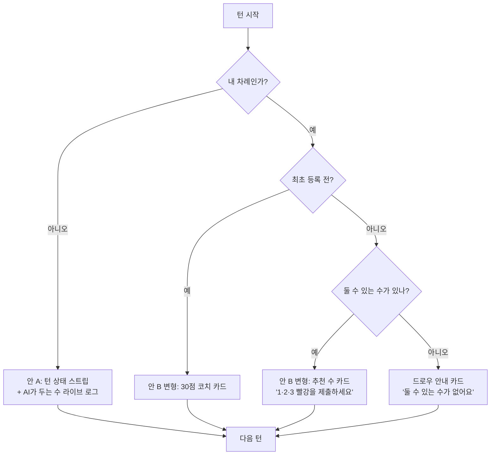

>- **From.** Design / Product
>- **To.** Claude Code (개발 담당)
>- **상태.** 기획 검토 — 구현 우선순위 협의 필요

---

## 0. 문제 정의

현재 게임 화면을 보면, **상단 룸 헤더(Room ID · 타이머 · 테스트/관전 버튼)** 와 **중앙 게임보드** 사이에 약 **660 × 40px** 정도의 빈 영역이 있습니다. 좌측 플레이어 패널의 아래쪽에도 약 **120 × 220px** 정도의 비어있는 세로 공간이 있고요. 이 영역은 현재 단순한 배경으로 비어있어, 화면의 정보 밀도와 시선 흐름이 끊기는 느낌을 줍니다.

루미큐브는 본질적으로 **턴제 + 시간 압박 + 다인 경쟁** 게임이고, 거기에 RummiArena는 **AI 에이전트와의 대전**이라는 특성까지 가지고 있습니다. 즉, 사용자가 매 순간 알고 싶은 것은 다음 네 가지입니다.

1. **지금 누구 차례인가, 시간이 얼마나 남았는가**
2. **내가 지금 무엇을 해야 하는가** (특히 최초 등록 30점 룰 같은 컨텍스트 의존 정보)
3. **상대(AI) 가 지금 무엇을 하고 있는가, 어떤 수를 두었는가**
4. **이 라운드/게임이 어디쯤 와있는가**

이 네 가지 정보가 **현재는 분산되어 있거나 아예 표시되지 않습니다.** 상단 빈 공간은 이 네 가지를 풀어낼 가장 자연스러운 캔버스입니다.

### 현재 레이아웃 (Before)

{: width="1200" height="630" }

빈 공간이 보라색 점선 박스로 표시된 두 영역입니다. 보드 위쪽의 가로 띠와 좌측 컬럼 하단이 핵심입니다.

---

## 1. 정보 우선순위 정리

빈 공간을 채우기 전에, **어떤 정보가 가장 위쪽에 와야 하는지**부터 합의하면 좋겠습니다. 아래는 우선순위 제안입니다.

| 우선순위 | 정보 | 왜 상단에 있어야 하는가 |
|---|---|---|
| **★★★** | 지금 차례인 사람 + 남은 시간 | 턴제 게임의 핵심. 1초마다 시선이 가야 함. |
| **★★★** | 내 차례일 때, 지금 해야 할 행동 (최초 등록·정상 턴·드로우 임박 등) | 지금은 노란 토스트 한 줄로만 안내됨 — 상태 의존성이 너무 약함. |
| **★★☆** | 다음 차례 / 라운드 진행도 | 대기 시간 동안 지루함을 덜고, 게임의 페이스를 인지시킴. |
| **★★☆** | 직전 상대의 수 (AI가 무엇을 놓았는지) | AI 대전의 핵심 재미 포인트. 지금은 보드 변화를 직접 봐야만 알 수 있음. |
| **★☆☆** | 점수 / 핸드 가치 / 등록 진척도 | 보조 통계. 항상 보일 필요는 없음. |

---

## 2. 개선 방향 — 3가지 안

세 가지 안을 제안드립니다. **A는 보수적**, **B는 적극적**, **C는 A·B를 상황에 맞게 자동 전환**하는 절충안입니다.

---

### 안 A. 턴 상태 + 라운드 타임라인 스트립 *(추천: 1차 출시)*

{: width="1200" height="630" }

상단 빈 띠를 **80px 안팎의 "턴 상태 스트립"** 으로 채웁니다. 좌→우로 정보 위계가 명확하게 흐릅니다.

- **(좌) 도넛형 타이머**: 큰 숫자 + 원형 진행 링. 지금처럼 헤더에 작게 박힌 `0s`보다 훨씬 시인성이 좋고, 시간이 줄어들수록 색이 옐로→레드로 바뀌면 긴장감이 커집니다.
- **(중앙) 지금 차례 + 컨텍스트 한 줄**: "네선용 (나) — 최초 등록 필요 · 30점↑" 처럼 *상태에 따라 동적으로 바뀌는* 한 줄을 표시합니다. 이 한 줄이 지금의 노란 토스트를 대체할 수 있습니다.
- **(우-중) 다음 차례 미리보기**: 누가 다음인지 + 예상 대기 시간. AI 대전에서는 "AI가 곧 둘 차례"라는 신호 자체가 관전 포인트가 됩니다.
- **(우) 라운드 진행 도트**: 작은 사각형들이 한 라운드의 턴들을 나타내고, 완료된 턴은 초록, 현재는 주황, 예정은 회색. 라운드의 페이스를 직관적으로 보여줍니다.

**장점**
- 기존 레이아웃을 거의 깨지 않고 빈 공간만 채움 → 구현 리스크 낮음.
- 노란색 첫 턴 안내 토스트가 자연스럽게 흡수됨 → 상단 정보가 *한 줄 더 줄어듦*.
- 상시 표시되어도 인지 부담이 작음 (보조 정보의 위계가 명확).

**단점**
- "내가 다음에 무엇을 해야 하는가"의 안내 강도가 약함. 초보자에겐 여전히 불친절할 수 있음.

---

### 안 B. 행동 코치 카드 + 보드 확장

{: width="1200" height="630" }

빈 띠를 **"YOUR MOVE — 행동 코치 카드"** 로 만들어, 더 적극적으로 사용자의 다음 행동을 가이드합니다. 동시에 룸 헤더의 정보(차례·타이머·라운드)를 상단 바에 압축해 넣어 **세로 공간을 절약**, 보드 자체도 살짝 위로 확장합니다.

- **메인 카피**: "최초 등록까지 4점 더 필요해요." — 사용자의 *현재 보드 상태*에 따라 카피가 동적으로 바뀝니다. 정상 턴에서는 "지금 제출해도 됩니다 (가장 큰 세트: 1·2·3 빨강)" 같은 구체적인 가이드.
- **30점 진척도 미니바**: 30점 라인이 어디에 있는지, 지금 보드에 올린 점수가 얼마인지 시각적으로 표시.
- **사이드 통계**: 내 핸드 가치 / 둘 수 있는 세트 수 / 남은 시간을 작은 KPI로.

**장점**
- 신규 유저 온보딩이 자연스럽게 됨. 룸에 들어오자마자 "내가 뭘 해야 하지?"의 답이 화면에 있음.
- AI 대전의 "코치/관전" 톤과 잘 어울림 — *Arena*라는 이름값에 맞는 분위기.
- 보드 면적이 더 커짐 → 후반 라운드에 세트가 많아질 때 유리.

**단점**
- 동적 카피·진척도·세트 카운트는 모두 **클라이언트 게임 상태에서 계산**해야 함 → 구현량이 A보다 큼.
- 카피가 자주 바뀌면 시선이 분산될 수 있음. 톤·노출 빈도 룰을 정해야 함.

---

### 안 C. 컨텍스트 자동 전환 (A + B 하이브리드)

같은 영역을, **현재 게임 상태에 따라 다른 모듈로 자동 교체**하는 방식입니다.

같은 80~96px 슬롯이 **상황에 따라 다른 정보**를 보여주는 구조입니다.

- 내 차례 + 최초 등록 전 → **30점 코치 카드** (안 B)
- 내 차례 + 정상 턴 → **추천 수 카드** (힌트와 통합)
- 상대 차례 → **턴 상태 스트립 + AI 액션 라이브 로그** (안 A 베이스, "shark가 1·2·3·4 파랑을 제출했어요" 같은 문구가 1~2초 페이드인)
- 라운드 종료/대기 → **라운드 요약 카드**

**장점**
- 한 슬롯이 가장 적절한 정보로 항상 최신화됨 → 정보 가치가 가장 높음.
- AI 액션 라이브 로그가 추가되면 *관전 재미*가 크게 올라감.

**단점**
- 모듈이 4종이라 구현 + 디자인 검토 비용이 가장 큼.
- 모듈 간 전환 애니메이션을 잘못 만들면 어수선해 보일 수 있음.

---

## 3. 좌측 컬럼 하단 빈 공간

부수적이지만, 좌측 플레이어 패널 아래의 빈 공간도 같이 검토해볼만 합니다. 두 가지 후보가 있어요.

1. **타임라인 / 액션 로그 (세로형)** — 게임 시작 후 발생한 주요 이벤트("R3: shark가 8·9·10 노랑 추가", "R4: 네선용 드로우")를 시간순으로 누적. 안 C의 라이브 로그와 같은 데이터 소스를 쓰면 됩니다.
2. **이번 게임 미니 통계** — 평균 턴 시간, 드로우 횟수, 가장 큰 세트 등. 게임 후반에 흥미로운 정보입니다.

개인적으로는 **1번(액션 로그)** 을 추천합니다. AI 대전에서 "AI가 어떻게 두고 있는지"를 사후에 훑어보는 동선은 굉장히 자연스럽습니다.

---

## 4. 권장 로드맵

| Step | 범위 | 예상 가치 | 예상 비용 |
|---|---|---|---|
| **1** | 안 A 구현 (턴 상태 스트립) — 기존 토스트 흡수 | ★★★ | ★☆☆ |
| **2** | 좌측 컬럼에 액션 로그 추가 | ★★☆ | ★☆☆ |
| **3** | 안 A의 "지금 해야 할 행동" 한 줄을, 게임 상태 기반의 동적 카피로 확장 (안 B의 일부) | ★★★ | ★★☆ |
| **4** | 안 C의 컨텍스트 전환 (AI 액션 라이브 로그 포함) | ★★☆ | ★★★ |

**1차 출시 권장**: Step 1 + Step 2. 일주일 내에 가능한 범위로 보이고, 빈 공간 문제와 정보 밀도 문제를 동시에 해결합니다.

---

## 5. Claude Code 작업 시 참고 사항

- 상단 스트립의 높이는 **76~96px** 범위에서 결정해주세요. 96px을 넘어가면 보드가 너무 좁아집니다.
- **타이머 색상 규칙**: 30s 이상=중립, 10~30s=옐로(`#f59e0b`), 10s 미만=레드(`#ef4444`) + 매 초 펄스 애니메이션. 잔여 시간 자체는 서버에서 push되는 값을 그대로 쓰면 됩니다.
- 동적 카피("최초 등록까지 N점 더 필요해요" 등)는 **i18n 키로 분리**해두면 추후 영문화·다국어가 쉽습니다.
- 라운드 도트는 단순히 `Array.from({length: turnsThisRound})` 로 그리고, 상태는 `'done' | 'current' | 'pending'` 3종이면 충분합니다.
- 액션 로그는 무한히 쌓이지 않도록 **최근 20건만** 표시하고, 그 위는 "이전 기록 보기" 버튼으로 모달 처리.
- 모바일 뷰가 있다면, 안 A 스트립은 **타이머 + 차례인 사람만 남기고** 라운드 도트와 다음 차례는 숨기는 식으로 압축하는 걸 권장합니다.

---

## 6. 합의가 필요한 포인트

다음은 디자인만으로 결정이 어려운, 제품/기획 측 합의가 필요한 항목입니다.

1. **AI 액션 라이브 로그를 1차에 넣을지** — 기술적 난이도가 가장 큼. AI 응답을 단계별로 stream할 수 있는지 확인 필요.
2. **"코치 카드"의 톤** — 친절·캐주얼("4점만 더!") vs 중립·정보형("Need 4 more points") 중 브랜드 보이스에 맞는 방향.
3. **모바일/태블릿 대응 시점** — 지금 와이어프레임은 데스크톱(≥1024px) 기준입니다.

---

질문이나 보강하고 싶은 항목이 있으면 알려주세요. 와이어프레임 SVG는 아래 공개 URL로 직접 열어볼 수 있습니다 (브라우저·Claude Code 모두 그대로 fetch 가능).

- **Before**: https://019dd2b6-aba0-7a23-a96b-92f101c312fa.claudeusercontent.com/v1/design/projects/019dd2b6-aba0-7a23-a96b-92f101c312fa/serve/docs/wireframe-before.svg?t=e423e060f25904b60dcc3bda887db6178a943011c209f2e2e9a49e2be88a0087.9d0f6dc0-1203-42b7-be68-bff019d4db6c.e88c564b-978d-4ba4-979c-c8827daa5e4c.1777360281
- **After A**: https://019dd2b6-aba0-7a23-a96b-92f101c312fa.claudeusercontent.com/v1/design/projects/019dd2b6-aba0-7a23-a96b-92f101c312fa/serve/docs/wireframe-after-a.svg?t=e423e060f25904b60dcc3bda887db6178a943011c209f2e2e9a49e2be88a0087.9d0f6dc0-1203-42b7-be68-bff019d4db6c.e88c564b-978d-4ba4-979c-c8827daa5e4c.1777360281
- **After B**: https://019dd2b6-aba0-7a23-a96b-92f101c312fa.claudeusercontent.com/v1/design/projects/019dd2b6-aba0-7a23-a96b-92f101c312fa/serve/docs/wireframe-after-b.svg?t=e423e060f25904b60dcc3bda887db6178a943011c209f2e2e9a49e2be88a0087.9d0f6dc0-1203-42b7-be68-bff019d4db6c.e88c564b-978d-4ba4-979c-c8827daa5e4c.1777360281

> URL은 약 1시간 정도 유효합니다. 만료되면 다시 발급해드릴게요. 영구 보관이 필요하면 SVG 파일 자체를 다운로드해서 레포에 같이 커밋하시는 게 가장 안전합니다.
