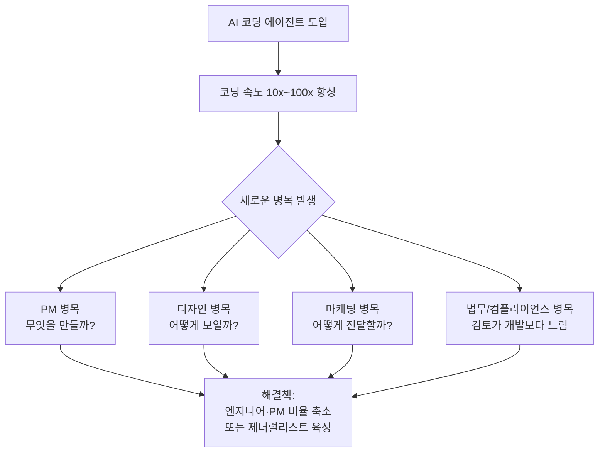
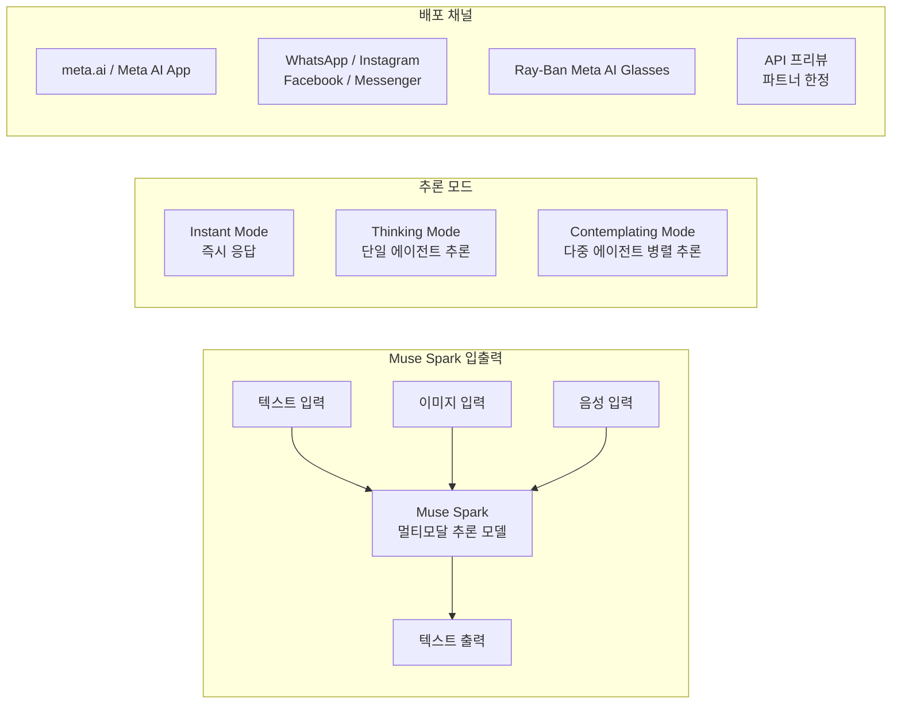
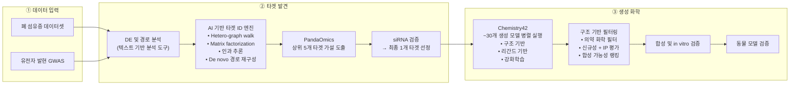
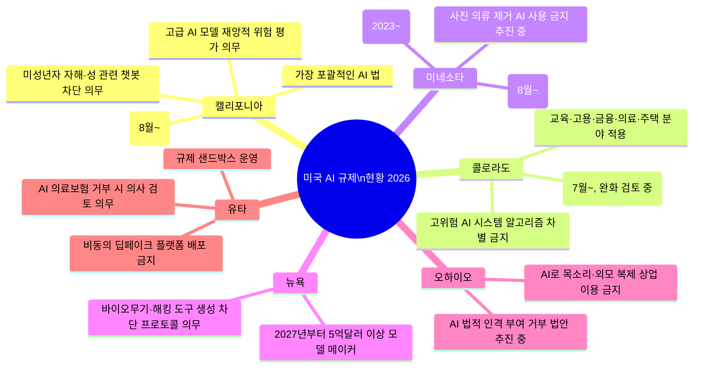
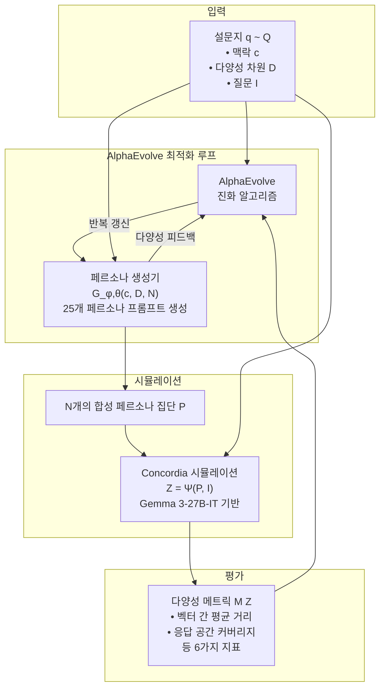
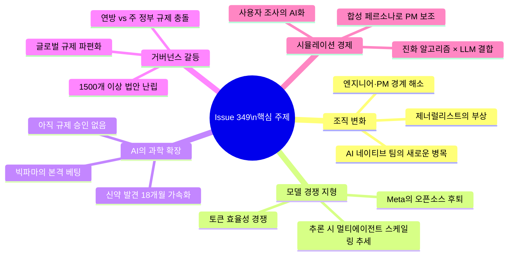

> **출처:** [DeepLearning.AI — The Batch, Issue 349](https://www.deeplearning.ai/the-batch/issue-349/) | 발행일: 2026년 4월 17일  
> **작성:** Andrew Ng (앤드류 응) 외  
> **정리 및 분석:** 2026년 4월 28일 기준

---

## 목차

1. [앤드류 응의 편지: AI 네이티브 팀의 작동 방식](#1-앤드류-응의-편지-ai-네이티브-팀의-작동-방식)
2. [Meta의 오픈소스 전략 전환: Muse Spark 등장](#2-meta의-오픈소스-전략-전환-muse-spark-등장)
3. [빅파마가 AI에 거액을 베팅하다: Eli Lilly × Insilico Medicine](#3-빅파마가-ai에-거액을-베팅하다-eli-lilly--insilico-medicine)
4. [미국 주 정부들의 AI 규제 입법 경쟁](#4-미국-주-정부들의-ai-규제-입법-경쟁)
5. [다양한 인간 집단 시뮬레이션: Persona Generator](#5-다양한-인간-집단-시뮬레이션-persona-generator)
6. [종합 시사점 및 한국적 맥락](#6-종합-시사점-및-한국적-맥락)

---

## 1. 앤드류 응의 편지: AI 네이티브 팀의 작동 방식

### 1-1. 코딩 가속화가 만들어낸 새로운 병목들

앤드류 응은 이번 호 편지에서 AI 네이티브 소프트웨어 팀이 기존 팀과 근본적으로 다르게 작동한다는 점을 설명한다. 표면적으로 가장 두드러진 차이는 코딩 에이전트를 활용해 제품을 훨씬 빠르게 만들 수 있다는 것이지만, 이 속도의 향상은 조직 운영 전반에 연쇄적인 변화를 불러온다.

AI 도구들이 코딩 속도를 10배, 심지어 100배까지 끌어올리면서 역설적으로 모든 주변 업무가 느려 보이기 시작했다. 이것이 바로 앤드류 응이 설명하는 "새로운 병목" 현상의 본질이다. 가장 먼저 터져 나오는 문제는 **프로덕트 매니지먼트 병목(PM bottleneck)** 이다. 빠르게 만들 수 있게 된 만큼, 이제는 "무엇을 만들 것인가"를 결정하는 데 더 많은 시간과 에너지가 투입되어야 한다.

### 1-2. 엔지니어:PM 비율의 변화

전통적인 소프트웨어 팀에서 엔지니어와 프로덕트 매니저(PM)의 비율은 8:1 정도가 일반적이었다. 엔지니어 여덟 명이 PM 한 명의 방향 설정에 따라 움직이는 구조다. 그런데 이 비율이 AI 네이티브 팀에서는 1:1까지 내려가고 있다. 더 나아가 이상적인 구조는 PM과 엔지니어 역할을 한 사람이 겸하는 것이다.

이유는 단순하다. PM이 결정하고 엔지니어가 구현하는 구조에서는 두 역할 사이의 커뮤니케이션 자체가 또 다른 병목이 된다. 반면 한 엔지니어가 사용자를 이해하고, 무엇을 만들지 직접 결정하며, 그것을 바로 구현까지 할 수 있다면 실행 속도는 기하급수적으로 빨라진다. 앤드류 응은 이런 구조를 직접 목격하고 있으며, 엔지니어에게는 PM 역량을, PM에게는 구현 역량을 길러야 한다고 강조한다.

### 1-3. 병목은 PM에 국한되지 않는다

앤드류 응이 관찰한 병목은 PM 역할에만 그치지 않는다. 디자인, 마케팅, 법무 컴플라이언스 모두 비슷한 문제를 겪고 있다. 그는 자신의 팀이 하루 만에 훌륭한 기능을 완성했는데, 마케팅 조직이 이를 사용자에게 전달하는 방법을 찾느라 허둥댔던 경험을 공유한다. 마찬가지로 팀이 하루 만에 소프트웨어를 만들 수 있는데 법무팀의 검토에 일주일이 걸린다면, 그것이 법무 컴플라이언스 병목이 된다.

이런 의미에서 에이전틱 코딩(agentic coding)은 단순히 소프트웨어 엔지니어링 워크플로만 바꾸는 게 아니라, 그 주변의 모든 팀을 함께 변화시키는 촉매제라고 할 수 있다.

### 1-4. 소규모 팀에서 제너럴리스트가 빛나는 이유

전통적인 대기업은 엔지니어링, PM, 디자인, 마케팅, 법무 등 각 분야의 전문가들을 모아 팀을 구성한다. 하지만 2~10인 규모의 AI 네이티브 팀에서는 2명이 5가지 역할을 모두 소화해야 한다. 따라서 깊은 전문성을 유지하면서도 다른 분야의 문제를 함께 고민하고 뛰어들 수 있는 **제너럴리스트(generalist)** 가 필수적이다.

앤드류 응은 물리적 같은 공간에서 일하는 것도 속도의 핵심 요소라고 강조한다. 원격 근무도 잘 작동할 수 있지만, 모두가 같은 방에 있어 즉각적으로 소통할 수 있을 때 가장 높은 실행 속도가 나온다고 말한다.

> **앤드류 응의 핵심 메시지:** 이번 편지는 2~10인 AI 네이티브 팀에 초점을 맞추고 있으며, 더 큰 팀 간의 조율 문제는 추후 다룰 예정이라고 밝혔다.

---

## 2. Meta의 오픈소스 전략 전환: Muse Spark 등장

### 2-1. 배경: Llama 이후의 세계

Meta는 2025년 4월 Llama 4를 출시했지만, 벤치마크 데이터 조작 의혹이 불거지며 커뮤니티의 강한 비판을 받았다. 이후 Meta는 AI 조직을 전면 재편했다. 2025년 6월, Meta는 Scale AI 지분 49%를 143억 달러에 인수하고 공동창업자 Alexandr Wang을 최초의 최고 AI 책임자(CAO)로 영입했다. 수억 달러짜리 주식 보상 패키지를 내걸고 AI 연구자 채용에 나섰으며, Meta Superintelligence Labs를 새롭게 출범시켰다.

그로부터 약 9개월 뒤인 2026년 4월 8일, Meta는 새로운 모델 패밀리의 첫 번째 결과물인 **Muse Spark**를 공개했다. 내부 개발 코드명은 "Avocado"였다.

### 2-2. Muse Spark란 무엇인가

Muse Spark는 Meta Superintelligence Labs가 AI 스택을 처음부터 다시 구축하여 만들어낸 네이티브 멀티모달 추론 모델이다. 텍스트, 이미지, 음성을 입력으로 받아(최대 26만 2천 토큰) 텍스트를 출력한다. 도구 사용(tool-use), 시각적 연쇄 사고(visual chain of thought), 멀티 에이전트 오케스트레이션을 지원한다.

**핵심 기술적 혁신:**

**① 사전학습 전면 재설계:** Meta는 사전학습 접근법, 모델 아키텍처, 최적화, 데이터 큐레이션을 모두 재작업했다. 그 결과 Muse Spark는 Llama 4 Maverick과 동등한 성능을 내면서도, 훈련에 투입된 컴퓨팅이 10배 이상 적다고 밝혔다. 인프라 효율성의 극적인 도약이다.

**② 사고 압축(Thought Compression):** 사후 훈련 과정에서 Meta는 강화학습을 적용했는데, 과도한 추론 토큰 사용에 패널티를 부과하는 방식을 취했다. 이를 팀은 "사고 압축"이라 부른다. 처음에는 패널티 하에서도 모델이 더 길게 추론해 성능을 높이다가, 이후 추론을 압축하는 법을 학습하고, 그다음 단계에서 다시 추론을 확장해 더 높은 성능에 도달하는 3단계 발전 패턴이 나타났다.

**③ 컨템플레이팅 모드(Contemplating Mode):** 단일 연쇄 사고 대신, 복수의 에이전트가 병렬로 솔루션을 제안하고 다듬으며 결과를 집계하는 방식이다. Meta에 따르면 이 방식은 비슷한 지연시간으로도 더 나은 성능을 달성한다. 이는 Moonshot AI의 Kimi K2.5 "Agent Swarm"과 함께, 더 큰 단일 모델을 훈련하는 대신 추론 시점에 여러 에이전트를 오케스트레이션하는 새로운 스케일링 패러다임의 등장을 시사한다.

**④ 헬스 특화 훈련:** 1,000명 이상의 의사를 참여시켜 건강 관련 훈련 데이터를 큐레이션했다.

### 2-3. 벤치마크 성적 비교

| 벤치마크 | Muse Spark | Claude Opus 4.6 | GPT-5.4 | Gemini 3.1 Pro |
|----------|-----------|-----------------|---------|----------------|
| **AI Intelligence Index** | 52 (4위) | 53 (3위) | 57 (공동 3위) | 57 (공동 3위) |
| **토큰 사용량 (Index)** | ~5,900만 | ~1억 5,800만 | ~1억 1,600만 | — |
| **CharXiv Reasoning** | **86.4%** 🥇 | — | 82.8% | 80.2% |
| **MMMU Pro** | 81% (2위) | — | — | **82%** 🥇 |
| **Coding Index** | 47 (4위) | — | **57** 🥇 | 56 |
| **Humanity's Last Exam** | 39.9% (Thinking) / 58% (Contemplating) | — | 41.6% | **44.7%** |
| **HealthBench Hard** | **42.8%** 🥇 | — | 40.1% | — |
| **DeepSearchQA** | **74.8%** 🥇 | 73.7% | — | — |

Muse Spark는 멀티모달 인식과 헬스 추론에서 두각을 나타내는 반면, 코딩과 에이전틱 작업에서는 아직 격차가 있다고 Meta 스스로도 인정하고 있다. 토큰 효율성 면에서는 Claude Opus 4.6 대비 약 2.7배 적은 토큰으로 비슷한 수준의 Intelligence Index 점수를 달성했다는 점이 주목할 만하다.

### 2-4. 오픈소스에서 클로즈드로의 전환 — 그 의미

Muse Spark에서 가장 큰 논란이 되는 부분은 벤치마크 성적이 아니라 공개 방식이다. Meta는 그간 오픈 웨이트(open-weight) 모델인 Llama 시리즈를 통해 미국에서 오픈소스 AI를 대표하는 기업으로 자리잡아 왔다. 개발자 커뮤니티는 Llama를 기반으로 수많은 프로젝트를 구축했다.

그런데 Muse Spark는 현재로서는 사실상 Meta 자체 제품 에코시스템 내에서만 접근 가능한 클로즈드 모델이다. API는 선별된 파트너에게만 프리뷰 형태로 제공된다. Zuckerberg는 향후 오픈소스 모델을 출시할 계획이 있다고 밝혔지만, 이 전환은 Llama에 의존해온 개발자 커뮤니티에게 큰 충격이다.

앤드류 응의 평가도 같은 맥락이다. "오픈 웨이트의 선두주자였던 미국 챔피언으로서의 역할에서 벗어난 것은 개발자 커뮤니티에게 중요한 손실이다."

---

## 3. 빅파마가 AI에 거액을 베팅하다: Eli Lilly × Insilico Medicine

### 3-1. 딜의 규모와 의미

세계 최고 가치의 제약사 중 하나인 Eli Lilly가 2026년 초, 홍콩 기반 바이오테크 기업 Insilico Medicine과 최대 27억 5천만 달러 규모의 파트너십 계약을 체결했다. 초기 지불금은 1억 1,500만 달러이며, 나머지는 개발·규제·상업적 마일스톤 달성 시 지급된다. 이는 두 회사 사이의 세 번째 협약으로, 2023년 AI 소프트웨어 라이선스, 2025년 11월 1억 달러 연구 협력에 이어 체결된 것이다.

이 계약이 중요한 이유는 단순히 금액이 크기 때문만이 아니다. Eli Lilly가 아직 인체 실험조차 이루어지지 않은 AI 생성 신약 후보들에 대해 대규모 독점 개발 및 판매 권리를 사들였다는 사실이 핵심이다. 이는 대형 제약사가 생성 AI 신약 발견 파이프라인을 본격적으로 신뢰하기 시작했음을 보여주는 강력한 신호다.

### 3-2. Insilico Medicine의 AI 신약 발견 파이프라인

첨부 이미지(Image 1)는 Insilico Medicine의 신약 발견 프로세스 전체를 시각화한 것이다. 크게 **타겟 발견(Target Discovery)** 과 **생성 화학(Generative Chemistry)** 두 단계로 나뉜다.

**PandaOmics (타겟 발견 도구):** 생물학적 데이터셋, 논문, 특허, 임상 시험 정보, 연구 지원 신청서 등을 분석한다. 딥러닝 모델이 질병 관련성, 약물 타겟으로서의 적합성, 신규성을 기준으로 후보 타겟을 순위 매긴다. 특발성 폐 섬유증(IPF, Idiopathic Pulmonary Fibrosis) 연구에서 PandaOmics는 TNIK라는 단백질을 최우선 타겟으로 지목했다. TNIK가 IPF의 섬유화에 관여한다는 사실은 알려져 있었지만, 이 단백질을 차단하는 방식으로 IPF를 치료하려는 시도는 이전에 없었던 완전히 새로운 접근이었다.

**Chemistry42 (분자 설계 도구):** 약 30개의 생성 모델이 병렬로 실행되어 후보 분자 구조들을 생성한다. 각 모델은 결합 강도, 독성, 용해도 등 다양한 특성에 최적화된다. 과학자들이 여러 라운드에 걸쳐 결과를 평가하고 정제하며, 최종적으로 합성 및 테스트한 화합물이 80개 미만인 상태에서 리드 분자(lead molecule)를 도출했다.

이를 전통적인 신약 개발과 비교하면 차이가 극명하다. 기존 방식에서는 20만~100만 개의 기존 화합물을 스크리닝한 뒤 수백 개를 합성·테스트해야 한다. Insilico의 방식은 그 규모를 수천 분의 일로 줄인 셈이다.

### 3-3. 속도의 혁명: 18개월 vs 5~6년

타겟 선정부터 전임상 안전성 테스트 준비 완료까지 걸린 시간은 약 18개월이었다. 기존 신약 개발에서 동일한 단계에 도달하는 데 통상 5~6년이 소요된다. 더 놀라운 것은 이 속도가 2021년~2024년 Insilico의 20개 이상의 프로그램 전반에 걸쳐 일관되게 유지됐다는 점이다. 각 프로그램에서 60~200개의 분자를 합성·테스트해 전임상 후보 물질 하나를 찾아냈다.

### 3-4. 임상 결과: 진짜 환자에게 효과가 있었는가?

Insilico의 가장 앞서 있는 후보 물질인 **Rentosertib(렌토서티브)** 은 IPF를 타겟으로 한다. IPF는 점진적인 폐 섬유화로 폐 기능이 저하되는 질환으로, 기존 치료법이 매우 제한적이다. Phase 2a 임상 시험 결과(Nature Medicine 게재), 최고 용량 투여군에서 강제 폐활량(FVC)이 평균 98.4mL 증가한 반면, 위약 투여군에서는 20.3mL 감소했다. 이는 AI가 발견한 약물이 실제 환자에게 효과가 있다는 구체적이고 이른 증거다.

두 번째 후보 물질 **Garutadustat(가루타두스타트)** 는 염증성 장질환(IBD) 치료를 목표로 하며, 2026년 1월 Phase 2a 임상에 진입했다. 현재 Insilico는 총 28개의 후보 약물을 개발했으며, 그 중 절반가량이 임상 시험 중이다.

### 3-5. AI 신약 개발의 한계와 현실

동시에 이 분야의 냉정한 현실도 놓치면 안 된다. 신약 개발은 통상 10~15년이 걸리고 20억 달러 이상이 소요되며, 후보 물질의 약 86%가 승인에 실패한다. 현재 AI 발견 신약 중 규제 승인을 받은 것은 아직 단 하나도 없다. BenevolentAI와 Recursion Pharmaceuticals의 AI 설계 약물들도 Phase 2에서 실패했다. Phase 2 진입 후보 물질의 70%가 다음 단계에 이르지 못한다.

앤드류 응의 평가도 신중하다. "AI가 신약 개발을 가속화하고 있지만, 이 가속화된 화합물들이 전통적인 방식으로 개발된 것들보다 더 높은 비율로 임상 시험을 통과할지는 아직 지켜봐야 할 문제다."

---

## 4. 미국 주 정부들의 AI 규제 입법 경쟁

### 4-1. 1,500개 이상의 법안이 쏟아지는 미국

미국에서는 현재 50개 주 중 40개 이상이 AI 관련 법안을 진행 중이며, 검토 중인 법안 수만 1,500개 이상에 달한다. 이미 40개 주가 100개 이상의 법률을 제정했으며, 내용은 청소년 대상 챗봇 사용 억제, AI 학습용 저작권 자료 사용 허가 요구, AI 시스템 보안 테스트 의무화 등에 걸쳐 있다.

이런 상황이 만들어지는 배경에는 트럼프 행정부와 주 정부 간의 정치적 갈등이 있다. 트럼프 대통령은 주별로 제각각 규제가 생기면 미국의 AI 리더십을 저해한다는 이유로 주 단위 입법을 억제하려 했다. 2025년 12월 행정명령을 통해 주별 입법을 저지하는 방향을 명시했고, 혁신을 가로막거나 정치적 성격의 반편향 규정을 담은 법률에 연방 자금을 삭감하겠다는 위협까지 가했다. 2026년 3월에는 연방 입법 가이드라인도 발표했다.

그러나 캘리포니아 주지사 개빈 뉴섬을 필두로 40개 이상의 주가 독자적인 입법을 계속 추진하고 있다.

### 4-2. 주요 주별 규제 현황

**캘리포니아**는 미국에서 가장 포괄적인 AI 규제를 가진 주다. 2026년 3월 30일 뉴섬 주지사는 주 정부가 사용하는 AI 도구에 대해 프라이버시 보호, 시민권 지원, 편향 완화를 요구하는 행정명령을 발동했다. 8월부터는 대형 기술 플랫폼과 AI 제공업체가 AI 생성 콘텐츠에 보이지 않는 워터마크를 의무적으로 삽입해야 한다. 1월부터는 이미 고급 AI 모델 개발자가 재앙적 위험을 평가하고 심각한 안전 사고를 신고해야 하는 의무가 발효되었다.

**콜로라도**는 2024년에 이미 미국에서 가장 엄격한 수준의 AI 법을 통과시켰다. 7월 발효 예정인 이 법은 교육, 고용, 금융, 의료, 주택 등 고위험 분야에서 알고리즘 차별로부터 소비자를 보호하도록 요구한다. 다만 기업과 기술 업계의 압력으로 연간 영향 평가 의무 등 일부 조항의 완화가 논의 중이다.

**뉴욕**은 2027년 1월부터 연매출 5억 달러 이상의 모델 제작사에게 사용자가 바이오무기나 자율 해킹 도구를 만들 수 없도록 하는 엄격한 프로토콜을 요구하고, 연간 감사와 즉각적인 사고 보고를 의무화한다.

**유타**는 특이하게도 AI 기업들이 특정 규제에서 일시적으로 적용 면제를 신청하고 새로운 기술을 규제 감독 하에 테스트할 수 있는 **규제 샌드박스** 제도를 운영하고 있다.

### 4-3. 파편화된 규제의 비용과 위험

한 AI 모델이 콜로라도에서 편향 감사, 캘리포니아에서 워터마킹, 뉴욕에서 보고 기준을 동시에 충족해야 하면서 연방 정부는 이런 요구사항들을 무력화하려는 상황이 펼쳐지고 있다. 이 관할권 다툼은 AI 시스템 개발 비용을 높이고, 새로운 서비스 출시의 법적 위험을 증가시키며, 주 의무를 이행했다는 이유로 연방 자금이 삭감될 가능성까지 만들어낸다.

앤드류 응과 The Batch 편집진은 일부 주 차원의 규제—프라이버시 보호나 아동 안전 관련—는 합리적이지만, 이런 요구사항들은 주 단위가 아닌 **국가 차원에서 부과**되어야 한다고 강조한다. 의회가 더욱 일관되고 안정적인 규제 환경을 만들어야 한다는 것이 이들의 주장이다.

---

## 5. 다양한 인간 집단 시뮬레이션: Persona Generator

### 5-1. 문제 인식: LLM은 평균적 응답을 한다

제품이나 서비스가 얼마나 잘 수용될지 이해하기 위해 LLM을 활용해 사용자를 시뮬레이션하는 시도는 이미 있어왔다. 하지만 LLM은 구체적인 인구통계학적 특성을 프롬프트에 명시하더라도, 실제 인간 집단이 보여주는 다양성의 범위를 재현하지 못하고 평균적인 응답에 집중하는 경향이 있다. 이 문제를 해결하기 위해 Google의 Davide Paglieri, Logan Cross 등의 연구자들이 **Persona Generator**를 제안했다.

### 5-2. 핵심 아이디어: 페르소나 자체가 아닌 페르소나 생성기를 최적화

기존 접근법은 개별 페르소나를 단순히 프롬프트로 기술하는 방식이었다. 예를 들어 "오늘날 정치에서 스스로를 민주당원으로 여긴다면 다음 질문에 답하라" 같은 식이다. 하지만 이 방식은 평균 회귀 문제를 피하기 어렵다.

연구팀의 핵심 통찰은 개별 페르소나를 직접 만드는 대신, **다양성을 극대화하는 방식으로 페르소나들의 집합을 프로그래밍적으로 생성하는 코드를 진화 알고리즘으로 최적화**한다는 것이다. 구체적인 의견·태도·관심사의 스펙트럼을 정의하는 가이드라인이 있다면, 진화 알고리즘이 모델에게 전체 범위를 포괄하는 응답을 이끌어내는 프롬프트 집합을 만들도록 밀어붙일 수 있다.

첨부 이미지(Image 2)는 이 시스템의 전체 아키텍처를 보여준다.

### 5-3. 구체적인 작동 방식

연구팀은 먼저 Gemini 2.5 Pro를 사용해 의료, 금융 리터러시, 음모론 등 다양한 주제에 관한 30개의 설문지를 생성했다. 각 설문지는 주제에 대한 맥락(context), 위험 감수 성향이나 기관 신뢰도 같은 "다양성 축(diversity axes)", 그리고 1(강한 동의)에서 5(강한 반대)로 답하는 관련 질문들로 구성된다.

이어서 초기에는 연구자들이 직접 작성하고 이후 AlphaEvolve가 반복적으로 업데이트하는 코드를 통해 설문지당 25개의 페르소나 프롬프트를 생성했다. 응답 자동화를 위해서는 에이전트 기반 시뮬레이션 라이브러리인 Concordia를 활용해 Gemma 3-27B-IT를 구동했다. 이 모델이 각 페르소나를 순서대로 맡아 해당 설문지에 답변하고, 각 페르소나의 응답을 벡터로 변환했다.

AlphaEvolve는 10개의 코드 버전에 대해 병렬 작업을 수행하며, 모든 페르소나의 다양성 메트릭을 극대화하는 방향으로 코드를 반복 업데이트했다. 500번의 반복 후 모든 다양성 메트릭의 평균을 극대화하는 코드를 최종 선택했다.

### 5-4. 성능 비교

| 페르소나 방법 | 응답 공간 커버리지 |
|---|---|
| **Persona Generator (본 연구)** | **82%** 🥇 |
| Nemotron Personas (NVIDIA, 미국 인구통계 기반) | 76% |
| Concordia 메모리 생성기 | 46% |

새 맥락과 다양성 축이 주어졌을 때, 연구팀의 페르소나는 모든 다양성 메트릭에서 일관되게 기존 방법들을 능가했다.

### 5-5. 왜 중요한가: PM 병목의 해결 실마리

앤드류 응의 편지에서 강조한 PM 병목, 즉 "무엇을 만들어야 하는가"의 어려움에 대한 잠재적 해결책이 여기에 있다. 다양한 합성 페르소나들을 활용하면 LLM에게 무언가를 만드는 것이 쉬울 때, 무엇을 만들어야 할지 결정하는 과정에 AI를 끌어들일 수 있다. 이는 제품 결정을 위한 가상 포커스 그룹으로서의 AI 활용 가능성을 열어준다.

이 연구는 개별 페르소나를 만드는 데서 목표를 옮겨, 훈련 데이터에 맞추는 것이 아니라 원하는 모든 가능성을 커버하는 방향으로 최적화한다는 점에서 패러다임의 전환이기도 하다. 이를 통해 아웃라이어(이상치)를 포함한 더 광범위한 사용자 행동 표현이 가능해진다.

---

## 6. 종합 시사점 및 한국적 맥락

### 6-1. 이번 호를 관통하는 공통 주제

이번 The Batch Issue #349를 관통하는 핵심 주제는 **"AI가 가속화할 때, 인간의 조직·제도·과학이 어떻게 적응하는가"** 다.

### 6-2. 한국 개발자·기업에 대한 시사점

**① AI 네이티브 팀 구성의 현실화:** 한국의 스타트업 생태계에서도 2~5인 팀이 Claude Code나 Cursor 같은 에이전틱 코딩 도구로 이전에는 10인 이상이 필요했던 제품을 만들어내는 사례가 빠르게 늘고 있다. 앤드류 응이 지적한 PM 병목은 한국의 소규모 스타트업에서도 가장 먼저 터지는 병목이다. 엔지니어가 사용자 인터뷰를 직접 진행하고 제품 방향을 결정하는 역량은 이제 선택이 아닌 필수다.

**② Muse Spark의 클로즈드 전환이 국내 개발자에게 미치는 영향:** 한국의 많은 AI 서비스와 연구 프로젝트가 Llama를 기반으로 구축되어 있다. Meta의 오픈 웨이트 전략 후퇴는 한국 AI 생태계에서 독립적인 모델 역량을 키우거나 대안을 찾아야 한다는 경각심을 다시 불러일으킨다. 멀티 에이전트 추론 시 스케일링 패턴(Muse Spark의 Contemplating Mode, Kimi의 Agent Swarm)은 국내 LLM 개발사들도 주목해야 할 아키텍처 방향이다.

**③ AI 신약 발견과 국내 바이오텍:** Eli Lilly × Insilico 딜은 글로벌 빅파마가 AI 신약 파이프라인에 본격 진입했음을 선언한다. 한국도 삼성바이오에피스, 셀트리온, 유한양행 등 다수의 바이오텍이 AI 신약 발견에 투자하고 있지만, Insilico처럼 전체 파이프라인을 AI로 일관화하고 국제적으로 검증된 임상 데이터를 확보한 수준까지 도달한 곳은 아직 드물다. Phase 2a까지 도달한 임상 데이터와 그 파이프라인의 시스템화가 핵심 경쟁력임을 확인할 수 있다.

**④ AI 규제의 한국적 함의:** 미국에서 1,500개 이상의 주 단위 AI 법안이 경쟁하고 있는 것과 달리, 한국은 국회 차원의 AI 기본법 제정 논의가 진행 중이다. 단일 국가 규제 체계라는 점은 미국과 같은 파편화 문제는 피할 수 있지만, 규제의 내용이 혁신 친화적으로 설계되어야 한다는 과제는 동일하다. 콜로라도·캘리포니아 사례처럼 고위험 AI 시스템에 대한 구체적 기준 설정, 의료·금융 분야 AI 의사결정 투명성 요구 등은 한국 AI 기본법에도 시사하는 바가 크다.

**⑤ 합성 페르소나의 실용적 활용:** Persona Generator는 소규모 팀이 대규모 사용자 조사 없이도 다양한 사용자 반응을 시뮬레이션할 수 있는 실용적 도구다. 특히 앤드류 응의 편지에서 강조한 PM 병목을 AI로 부분적으로 해소하는 접근으로 주목할 만하다. 국내 제품 팀들도 이런 합성 페르소나 도구를 조기에 프로덕트 결정 과정에 통합하는 실험을 해볼 시점이다.

### 6-3. 핵심 요약 정리

| 주제 | 핵심 포인트 | 시사점 |
|------|-----------|--------|
| AI 네이티브 팀 | 코딩 이외의 모든 기능이 새 병목으로 부상 | 엔지니어의 PM 역량, PM의 구현 역량이 필수화 |
| Muse Spark | 멀티모달·헬스 강세, 코딩 약세, 오픈소스 후퇴 | 토큰 효율성 경쟁, 멀티에이전트 스케일링 패러다임 주목 |
| AI 신약 발견 | 18개월로 타겟→분자 설계, $2.75B 딜 | 속도 혁신은 증명됐으나 임상 성공률은 미지수 |
| 미국 AI 규제 | 1500+ 법안, 연방 vs 주 충돌 | 글로벌 규제 파편화 비용, 한국 AI 기본법 설계에 반면교사 |
| Persona Generator | AlphaEvolve × LLM으로 다양성 82% 커버 | PM 의사결정 보조, 합성 사용자 조사 도구로의 발전 가능성 |

---

> **원문 링크:** [The Batch Issue #349](https://www.deeplearning.ai/the-batch/issue-349/)  
> **관련 X(Twitter) 포스트:** [Andrew Ng @andrewyng](https://x.com/andrewyng/status/2048793852702757151)  
> **작성 기준일:** 2026년 4월 28일  
> **본 문서는 The Batch Issue #349 원문 및 관련 최신 정보를 바탕으로 정리·분석한 한국어 해설 리포트입니다.**
