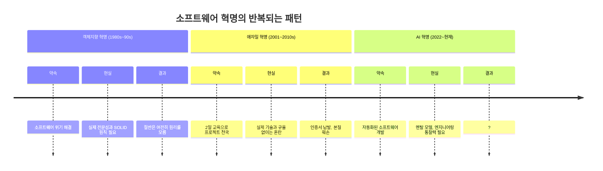
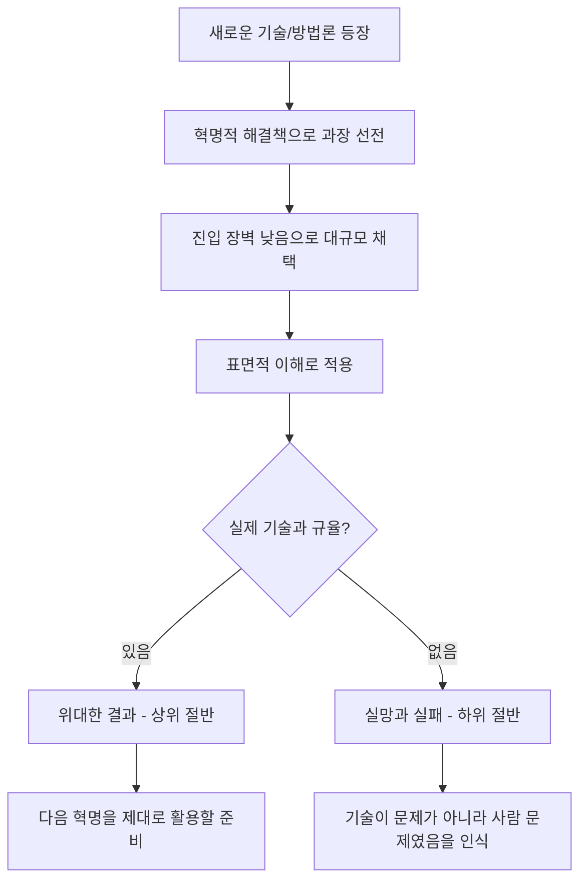
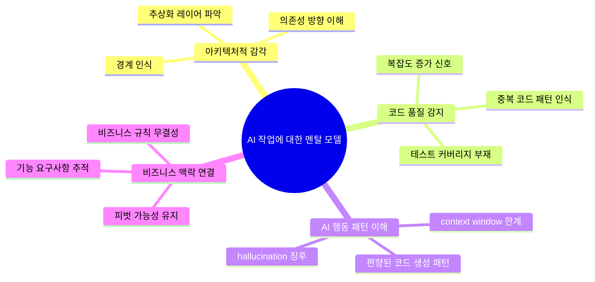
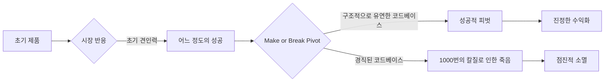
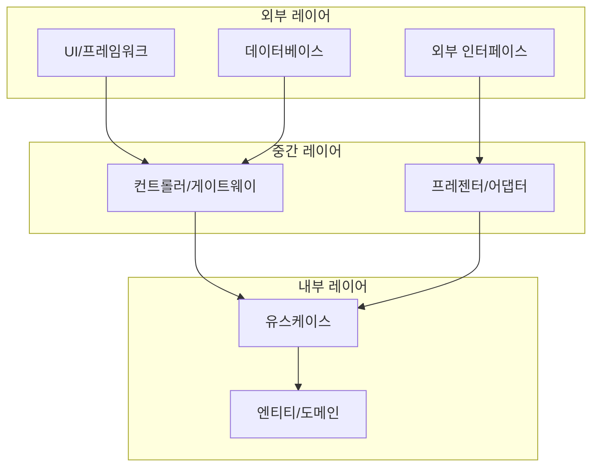
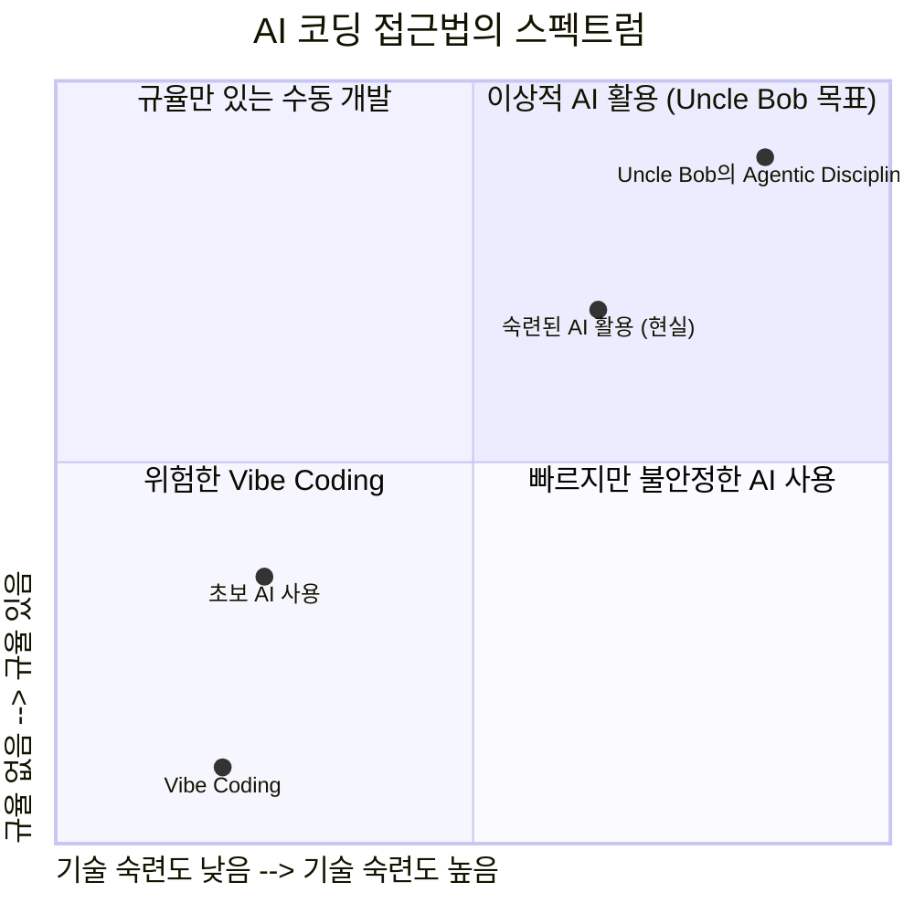
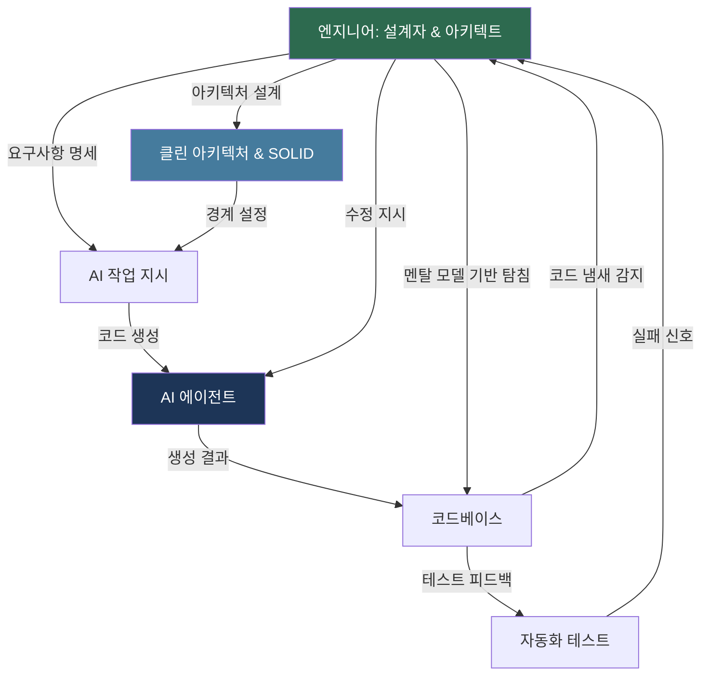

> **원문 출처**: [@unclebobmartin, X (Twitter)](https://x.com/unclebobmartin/status/2049085958952272291)  
> **작성자**: Robert C. "Uncle Bob" Martin  
> **분석 작성일**: 2026년 4월 28일

---

## 개요

소프트웨어 공학의 거장 로버트 C. 마틴(Robert C. Martin), 일명 "Uncle Bob"이 AI 코딩 도구의 급부상 속에서 소프트웨어 엔지니어들에게 강한 경고를 던졌다. 그는 최근 X(구 트위터)에 올린 글에서 "몇 가지 단순한 규율과 도구만으로는 충분하지 않다"는 핵심 메시지를 전달하며, AI 시대를 앞서 도래했던 객체지향(OO)과 애자일(Agile) 혁명과의 역사적 유사성을 통해 현시점의 소프트웨어 개발자들이 어디에 서 있는지를 냉철하게 진단했다. 이 글은 단순한 기술적 조언이 아니라, 소프트웨어 공학이 반복해온 실수의 패턴 속에서 AI라는 새로운 변수를 어떻게 다루어야 하는가에 대한 철학적 선언에 가깝다.

---

## 1. Uncle Bob은 누구인가

Uncle Bob의 본명은 로버트 세실 마틴(Robert Cecil Martin, 1952년 12월 5일생)으로, 미국의 소프트웨어 엔지니어이자 저술가이며 강연자다. 그는 17세에 독학으로 프로그래밍을 시작해 소프트웨어 산업 전반에 걸쳐 수십 년간 활동해왔다. 가장 널리 알려진 업적은 **SOLID 원칙**의 대중화와 **애자일 선언문(Agile Manifesto)** 공동 서명자로서의 역할이다.

그가 저술하거나 편집한 주요 저서들은 현대 소프트웨어 공학의 필독서로 자리 잡았다:

- *Clean Code* (클린 코드)
- *The Clean Coder* (클린 코더)
- *Clean Architecture* (클린 아키텍처)
- *Clean Agile* (클린 애자일)
- *Clean Craftsmanship* (클린 크래프트스맨십)
- *Functional Design* (함수형 디자인)
- *We, Programmers: A Chronicle of Coders from Ada to AI* (2025년 신간)

Uncle Bob은 현재 **CleanCoders.com**을 통해 온라인 교육 영상을 제공하고 있으며, 최근에는 Claude Code와 같은 AI 에이전트를 활용한 **"Agentic Discipline"** 시리즈를 제작하는 등 AI 코딩 도구에 적극적으로 관여하고 있다. 주목할 점은 그가 2년 전까지만 해도 AI 코딩 능력에 회의적이었으나, 최근에는 "AI가 생각했던 것보다 훨씬 더 유능하고 강력하다"며 견해를 공개적으로 수정했다는 사실이다.

---

## 2. 트윗 원문 전체 분석

해당 트윗은 여러 개의 단락으로 구성된 비교적 긴 글로, 다음과 같은 흐름으로 전개된다.

### 2.1 시작: 자기 절제(Self-Correction)의 고백

> *"I've been harping on the disciplines and tools for using AI lately. I find them to be a very effective approach. But I don't want to leave you with the impression that a few simple disciplines and tools is sufficient."*

Uncle Bob은 자신이 최근 AI 사용을 위한 규율(disciplines)과 도구(tools)를 강조해왔다고 인정하면서도, 그것만으로는 충분하지 않다는 중요한 단서를 달고 있다. 이 문장은 단순히 자신의 이전 주장을 보완하는 것이 아니라, 오해를 예방하기 위한 선제적 경고다. 그가 CleanCoders.com에서 Agentic Discipline 시리즈를 통해 테스트 주도 개발(TDD), 리팩토링, 멀티 에이전트 활용 등을 체계적으로 가르쳐왔기 때문에, 이 말은 더욱 무게를 가진다.

### 2.2 핵심 주장: 소프트웨어 엔지니어의 능동적 역할

> *"As the AI's build software, you — the software engineer — need to have a good mental model of what the AI is doing. You need to apply engineering insight to correct it when it takes a path you don't like. You have to be an active manager in the design and architecture of the system."*

이 단락이 트윗의 핵심이다. Uncle Bob은 AI가 소프트웨어를 구축할 때 소프트웨어 엔지니어에게 요구되는 역할을 네 가지로 명확히 제시한다:

1. **멘탈 모델(Mental Model)**: AI가 무엇을 하고 있는지 이해하는 내면적 모델
2. **엔지니어링 통찰력 적용**: AI가 잘못된 경로를 택했을 때 수정하는 능력
3. **능동적 관리자 역할**: 설계와 아키텍처에 대해 적극적으로 관여
4. **내부 투시(See Within)**: 완전한 코드 리뷰 없이도 AI가 하는 일을 파악하고, 의심을 형성하여 실험으로 검증하는 능력

특히 "**see within without resorting to exhaustive code reviews**"라는 표현은 매우 인상적이다. AI가 수천 줄의 코드를 생성할 때 엔지니어가 모든 코드를 일일이 검토하는 것은 비현실적이다. 대신, 엔지니어는 코드의 구조와 패턴에 대한 감각적 이해를 가지고 의심스러운 부분을 선택적으로 탐침(probe)해야 한다는 것이다. 이는 경험이 많은 개발자와 경험이 적은 개발자 사이의 결정적 차이가 될 것이다.

### 2.3 스타트업의 피벗 문제

> *"I've had a fair bit of experience with startups. What I've observed is that most startups that gain a bit of traction early on face a huge make or break pivot before they can truly cash in. Do you believe the structure of your software will survive that pivot?"*

Uncle Bob은 스타트업 경험에서 도출한 날카로운 질문을 던진다: **AI가 만든 소프트웨어의 구조가 피벗(pivot)을 견딜 수 있는가?**

스타트업에서 피벗이란 단순한 기능 추가가 아니라, 때로는 비즈니스 모델 자체, 타겟 고객, 핵심 기능 전체가 변하는 급격한 방향 전환을 의미한다. 이런 상황에서 소프트웨어의 **아키텍처적 유연성**은 생존의 문제다. 초기에 빠르게 구축하기 위해 AI에 무분별하게 의존한 코드베이스가 피벗 순간에 기술 부채(technical debt)의 무게를 버티지 못하고 무너지는 시나리오를 그는 우려하는 것이다.

그는 이것이 새로운 문제가 아님을 덧붙인다: AI 이전에도 많은 스타트업이 피벗을 감당하지 못하고 "1000번의 칼질로 인한 천천한 죽음(slow death of 1000 cuts)"을 맞이했다. AI는 이 위험을 제거하지 않는다. 오히려 잘못 사용하면 악화시킬 수 있다.

### 2.4 역사적 패턴: OO와 Agile의 교훈

Uncle Bob은 현재의 AI 상황을 두 개의 역사적 혁명과 비교한다.

#### 객체지향(OO)의 교훈

> *"When OO came out it was promoted as the revolution that would solve the software crisis. Who knew it was going to take some actual expertise and skill to use correctly. Hell, half the programmers in the world still don't know what the principles really are."*

1980~90년대에 객체지향 프로그래밍이 등장했을 때, 그것은 "소프트웨어 위기(software crisis)"를 해결할 혁명으로 선전되었다. 캡슐화, 상속, 다형성이라는 세 가지 기둥은 마치 마법처럼 소프트웨어 개발의 모든 문제를 해결해줄 것처럼 받아들여졌다. 그러나 Uncle Bob이 평생을 바쳐 SOLID 원칙을 가르쳐온 것에서 알 수 있듯, 수십 년이 지난 지금도 절반의 개발자는 OO의 원리를 제대로 이해하지 못한다.

#### 애자일(Agile)의 교훈

> *"When agile came out, it was sold as the revolution that would solve the software crisis. All you needed was two days with your butt in a chair and a certificate that said master on it and you could now drive projects to heaven. Who knew that it would actually take some skill and discipline."*

2001년 애자일 선언문 이후, 애자일은 또 다른 혁명으로 팔렸다. 이틀짜리 교육을 받고 "Scrum Master" 인증서를 받으면 프로젝트를 천국으로 이끌 수 있다는 환상이 퍼졌다. Uncle Bob은 애자일 선언문 공동 서명자로서, 특히 *Clean Agile* 에서 "애자일의 상업화가 그 본질을 훼손했다"고 비판해왔다. 인증서가 전문성을 대체할 수 없었고, 실제 기술과 규율 없이 애자일을 채택한 많은 조직은 오히려 혼란만 가중시켰다.

### 2.5 결론: 낙관적 반분론

> *"Notice that I said half. The other half have done, and will do, great things."*

트윗의 마지막 문장은 인상적인 균형을 보여준다. Uncle Bob은 비관주의자가 아니다. 그는 절반이 제대로 활용하지 못한다고 말할 때, 동시에 나머지 절반은 위대한 일을 해왔고 앞으로도 그럴 것이라고 선언한다. 이것이 그의 핵심 메시지다: AI는 도구를 제대로 이해하고 실제 기술과 규율을 가진 엔지니어에게는 강력한 레버리지가 될 것이며, 그렇지 않은 사람들에게는 또 다른 실망이 될 것이다.

---

## 3. 구조적 분석: 세 혁명의 비교

세 혁명은 놀라울 정도로 유사한 패턴을 보인다. 각 혁명은 다음 단계를 따른다:

---

## 4. "멘탈 모델"이란 무엇인가 — 심층 해부

Uncle Bob이 언급한 "AI가 무엇을 하는지에 대한 좋은 멘탈 모델"은 추상적으로 들리지만, 실제로는 매우 구체적인 능력들의 집합이다.

### 4.1 멘탈 모델의 구성 요소

### 4.2 "코드를 꿰뚫어 보는" 능력 (See Within Without Exhaustive Review)

Uncle Bob이 말하는 이 능력은 경험 많은 개발자가 코드를 훑어볼 때 발동하는 **패턴 매칭 능력**이다. 수천 줄의 AI 생성 코드 중에서:

- 함수명이 지나치게 포괄적이거나 의미 없는 경우
- 하나의 클래스가 너무 많은 책임을 지는 경우
- 의존성이 안쪽에서 바깥쪽으로 역전된 경우
- 인터페이스 없이 구체 클래스에 직접 의존하는 경우

이런 코드 냄새(code smell)를 빠르게 포착하고, 의심이 가는 영역을 선택적으로 깊게 탐침(probe)하는 것이다. 이것은 전체 코드를 다 읽지 않아도 AI가 문제 있는 방향으로 가고 있음을 감지하는 전문가적 직관이다.

Uncle Bob은 *Clean Code* Chapter 17에서 66가지 코드 냄새와 경험 법칙(heuristics)을 정리한 바 있는데, 이것은 AI 생성 코드에 더욱 적실성을 가진다. AI는 *빠르게* 기술적으로 동작하는 코드를 만들지만, 이 66가지 문제를 *대규모로 빠르게* 재현한다는 것이 최근 연구들의 공통된 지적이다.

실제로 GitClear의 분석에 따르면 Google, Microsoft, Meta 등 주요 기업의 코드베이스에서 AI 도입 이후 코드 중복이 4배 증가했으며, 처음으로 복사-붙여넣기 코드가 리팩토링된 코드를 초과했다.

---

## 5. 스타트업 피벗 문제의 구체적 함의

### 5.1 피벗이란 무엇이고 왜 소프트웨어 구조가 결정적인가

스타트업의 피벗은 일반적으로 다음과 같은 형태를 취한다:

피벗 시나리오의 예를 들면:

- B2C 플랫폼 → B2B SaaS로 전환 (인증, 멀티테넌시, 요금 체계 전면 변경)
- 수동 서비스 → 자동화 플랫폼 (핵심 비즈니스 로직의 재구조화)
- 단일 지역 → 글로벌 서비스 (국제화, 데이터 거버넌스 변경)

AI가 생성한 코드가 비즈니스 로직을 UI 레이어나 데이터 접근 레이어와 뒤섞어 놓은 경우, 이런 피벗은 사실상 전면 재개발을 의미하게 된다.

### 5.2 Uncle Bob의 클린 아키텍처가 답인 이유

Uncle Bob의 **Clean Architecture**는 이 문제에 대한 직접적인 해답을 제공한다. 핵심은 **의존성 규칙(Dependency Rule)** 으로, 모든 소스 코드 의존성은 항상 바깥쪽에서 안쪽으로, 즉 고수준 정책을 향해야 한다:

이 구조가 제대로 지켜진 코드베이스에서는 피벗 시 UI를 교체하거나, 데이터베이스를 바꾸거나, 외부 서비스를 전환하더라도 핵심 비즈니스 로직은 온전히 보존된다. AI는 이 아키텍처를 자동으로 따르지 않는다. 엔지니어가 의식적으로 지시하고 검증해야 한다.

---

## 6. OO, Agile, AI — 세 혁명의 실패 패턴 비교 분석

### 6.1 객체지향(OO)의 경우

| 항목 | 내용 |
|------|------|
| 등장 시기 | 1980~1990년대 |
| 핵심 약속 | 코드 재사용, 유지보수성, 소프트웨어 위기 해결 |
| 잘못된 기대 | 상속 계층만 만들면 자동으로 좋은 설계 |
| 실제 필요한 것 | SOLID 원칙, 디자인 패턴, 객체 협력 이해 |
| 결과 | 수십 년이 지난 지금도 절반은 원칙을 모름 |
| 남은 교훈 | 도구가 아닌 원칙이 중요하다 |

Uncle Bob이 평생 SOLID를 가르쳐온 것은 OO 혁명이 도구(OO 언어)는 제공했지만 원칙(SOLID)은 시장이 제대로 전파하지 못했다는 사실을 직접 체험했기 때문이다.

### 6.2 애자일(Agile)의 경우

| 항목 | 내용 |
|------|------|
| 등장 시기 | 2001년 이후 |
| 핵심 약속 | 유연성, 빠른 피드백, 고객 만족 |
| 잘못된 기대 | 스크럼 인증서 = 프로젝트 성공 |
| 실제 필요한 것 | TDD, 지속적 통합, 페어 프로그래밍, 리팩토링 |
| 결과 | 애자일 산업화, 형식적 도입, 절반은 본질 훼손 |
| 남은 교훈 | 프로세스가 아닌 기술 규율이 중요하다 |

Uncle Bob은 *Clean Agile*에서 애자일 운동이 본래의 기술적 규율(XP의 13가지 실천법)에서 멀어지고 비즈니스 프레임워크로 변질된 것을 통렬히 비판한다. 이틀짜리 교육으로 "Certified Scrum Master" 딱지를 받는 것이 애자일의 표준이 된 현실이 그 단적인 예다.

### 6.3 AI의 경우 (현재 진행형)

| 항목 | 내용 |
|------|------|
| 등장 시기 | 2022년 ChatGPT 이후 급부상 |
| 핵심 약속 | 자동 코드 생성, 개발 속도 10배 향상 |
| 잘못된 기대 | 프롬프트만 잘 쓰면 모든 소프트웨어 완성 |
| 실제 필요한 것 | 멘탈 모델, 엔지니어링 통찰력, 아키텍처 감각 |
| 현재 위험 | 비이 코딩, 기술 부채 4배 증가, 피벗 불가능한 구조 |
| 결과 (미정) | 절반은 위대한 일, 절반은 천천한 죽음 |

---

## 7. "Vibe Coding"과 Uncle Bob의 경고

Uncle Bob의 메시지는 Andrej Karpathy가 2025년 2월에 명명한 **Vibe Coding** 현상과 직접적으로 충돌한다. Karpathy는 "바이브를 따르고, 모든 변경을 수용하고, 코드가 존재하는지조차 잊으라"고 했다. 이것은 Uncle Bob이 경고하는 바로 그 접근법이다.

Uncle Bob이 제시하는 **Agentic Discipline**과 Vibe Coding의 차이는 다음과 같다:

| 비교 항목 | Vibe Coding | Agentic Discipline |
|-----------|-------------|-------------------|
| 목표 | 빠른 결과물 | 지속 가능한 소프트웨어 |
| AI 역할 | 주도적 개발자 | 보조 구현자 |
| 엔지니어 역할 | 수동적 수용자 | 능동적 관리자/설계자 |
| 코드 검토 | 생략 | 선택적 탐침(probing) |
| 테스트 | 선택적 | 필수 (단, TDD 방식 조정) |
| 아키텍처 | AI에 위임 | 엔지니어가 명시적 지시 |
| 피벗 가능성 | 낮음 | 높음 |
| 기술 부채 | 빠르게 축적 | 관리됨 |

---

## 8. TDD와 AI — Uncle Bob의 진화된 입장

Uncle Bob은 최근 트윗에서 AI와 TDD의 관계에 대해 주목할 만한 견해를 밝혔다: **"TDD는 AI에게 매우 비효율적이다. 테스트는 필수적이지만, TDD의 세 가지 법칙이 권장하는 마이크로 단계로는 아니다. 원칙은 동일하지만 기법은 AI의 다른 '마음'에 맞게 조정되어야 한다."**

이것은 매우 중요한 뉘앙스다. Uncle Bob은 TDD 원칙의 포기가 아니라, AI라는 새로운 협업자의 특성에 맞는 테스트 전략의 조정을 이야기하는 것이다. AI는 "집중력 있는 백치 천재(focused idiot savant)"처럼 좁은 영역에서는 탁월하지만 전체 맥락을 놓치기 쉽다. 따라서 테스트는 AI의 작업 결과를 빠르게 검증하는 피드백 루프로서 더욱 중요해지지만, 마이크로 스텝의 TDD보다는 더 큰 단위의 테스트 경계를 먼저 설정하고 AI에게 그 안에서 구현을 맡기는 방식이 더 효과적이다.

---

## 9. "절반"의 의미 — 기술 이분화(K자형 양극화)의 소프트웨어 버전

Uncle Bob의 "절반은 위대한 일을 할 것"이라는 선언은 단순한 낙관론이 아니다. 그것은 사실상 소프트웨어 공학 내에서의 **기술 이분화(skill bifurcation)** 를 예고한다.

AI 시대의 소프트웨어 엔지니어는 다음 두 그룹으로 나뉠 가능성이 높다:

**상위 절반: AI를 레버리지로 사용하는 엔지니어**
- 클린 아키텍처, SOLID 원칙, 설계 패턴을 이해하고 AI에게 올바른 방향을 제시
- AI 생성 코드의 코드 냄새를 빠르게 감지하고 수정
- 테스트를 통해 AI의 작업을 검증하는 피드백 루프 설계
- 피벗 가능한 소프트웨어 구조를 유지하면서 AI로 속도를 높임
- 결과: 이전보다 10~100배의 생산성

**하위 절반: AI에 의존하는 엔지니어**
- 프롬프트를 던지고 결과를 수동적으로 수용
- 단기적 속도에 집중, 아키텍처 무시
- 기술 부채 축적, 피벗 순간에 전면 재개발 직면
- "1000번의 칼질로 인한 죽음" 반복
- 결과: 단기 생산성은 높지만 장기적 경쟁력 상실

이것은 경제학에서 말하는 K자형 회복과 유사하다. AI는 잘 준비된 엔지니어의 역량을 기하급수적으로 확장시키는 동시에, 준비 안 된 엔지니어의 나쁜 습관을 기하급수적으로 가속시킨다.

---

## 10. 한국 개발 생태계에 대한 함의

Uncle Bob의 메시지는 한국의 소프트웨어 개발 생태계에 특별한 울림을 가진다.

### 10.1 빠른 AI 도입과 원칙 교육의 부재

한국은 역사적으로 기술 채택 속도가 매우 빠르다. GitHub Copilot, Cursor, Claude Code 등 AI 코딩 도구의 도입률은 세계 최고 수준이다. 그러나 Uncle Bob이 경고하듯, 빠른 도입이 반드시 올바른 활용을 의미하지 않는다. OO 혁명 때처럼, 클린 코드와 SOLID 원칙에 대한 깊은 이해 없이 AI 도구를 활용하면 기술 부채만 더 빠르게 쌓일 뿐이다.

### 10.2 스타트업 생태계와 피벗 리스크

한국의 스타트업 생태계는 투자 압박과 빠른 성과 증명 요구로 인해 AI로 빠르게 MVP를 구축하는 경향이 강하다. Uncle Bob의 피벗 경고는 이 문맥에서 더욱 날카롭다. 초기 견인력을 얻은 스타트업이 본격적인 성장을 위해 피벗해야 할 때, AI가 만든 경직된 코드베이스가 발목을 잡는 시나리오는 이미 현실에서 나타나고 있다.

### 10.3 "AI Orchestrated Development"로의 전환 필요성

단순한 바이브 코딩이나 AI 의존 개발이 아닌, 엔지니어가 설계와 아키텍처를 능동적으로 주도하면서 AI를 구현 레이어의 보조자로 활용하는 **AI Orchestrated Development(AI 오케스트레이션 개발)** 패러다임으로의 전환이 필요하다. 이것은 Uncle Bob이 주장하는 Agentic Discipline과 완전히 일치한다.

---

## 11. 실천적 가이드: Uncle Bob의 메시지를 어떻게 적용할 것인가

Uncle Bob의 트윗에서 실천 가능한 구체적 지침을 도출하면 다음과 같다:

### 11.1 멘탈 모델 구축을 위한 필수 지식

1. **Clean Architecture** — 의존성 규칙, 레이어 분리, 유스케이스 중심 설계
2. **SOLID 원칙** — 단순히 외우는 것이 아니라 코드에서 위반 사례를 즉각 감지하는 능력
3. **코드 냄새 목록** — *Clean Code* Chapter 17의 66가지 경험 법칙
4. **TDD 원칙** — AI와의 협업에서 테스트를 피드백 루프로 활용하는 방법
5. **리팩토링 기법** — AI가 생성한 코드를 유지 가능한 형태로 개선하는 능력

### 11.2 AI 작업 지시 시 아키텍처 경계 명시

AI에게 코드를 작성시킬 때 "그냥 구현해줘"가 아니라:
- 어떤 레이어에 속하는 코드인지 명시
- 어떤 인터페이스를 구현해야 하는지 제시
- 외부 의존성을 어떻게 주입받아야 하는지 지시
- 기존 아키텍처 패턴과의 일관성 유지 요구

### 11.3 선택적 탐침(Selective Probing) 방법

모든 코드를 읽지 말고, 다음 신호에 집중하여 선택적으로 깊이 탐침하라:
- 클래스/모듈이 500줄 이상으로 커지고 있는가?
- 함수명이 "process", "handle", "manage" 같은 모호한 동사인가?
- 인터페이스 없이 구체 클래스에 직접 의존하는 코드가 있는가?
- 비즈니스 로직이 컨트롤러나 데이터 접근 레이어에 섞여 있는가?

### 11.4 피벗 가능성 정기 점검

스프린트마다 한 번씩 스스로에게 물어라: **"만약 내일 핵심 비즈니스 모델이 바뀐다면, 코드베이스의 어느 부분을 교체해야 하는가?"** 만약 그 범위가 너무 크다면, 지금 당장 리팩토링이 필요하다는 신호다.

---

## 12. 결론: 역사는 반복된다, 그러나 절반은 배운다

Uncle Bob Martin의 이 트윗은 짧지만 수십 년의 소프트웨어 공학 경험에서 증류된 지혜를 담고 있다. 그의 메시지는 다음 네 가지로 요약된다.

첫째, **도구의 혁명은 기술의 필요성을 제거하지 않는다.** OO도, Agile도, AI도 마찬가지다. 새로운 도구가 등장할 때마다 그것이 기존의 전문성 요구를 없애줄 것이라는 환상이 퍼지지만, 역사는 일관되게 반대임을 증명해왔다.

둘째, **소프트웨어 엔지니어는 AI 시대에 더욱 능동적인 역할을 해야 한다.** 수동적으로 AI의 출력을 수용하는 것이 아니라, 설계와 아키텍처의 능동적 관리자로서 AI를 지도하고 수정해야 한다.

셋째, **스타트업의 생존은 코드베이스의 아키텍처적 유연성에 달려 있다.** AI가 만든 코드가 피벗을 견딜 수 있는 구조인지 끊임없이 점검해야 한다.

넷째, **절반은 위대한 일을 할 것이다.** 이것은 낙관론이 아니라 선택이다. 실제 전문성과 규율로 AI를 올바르게 사용하는 엔지니어는 이전 세대가 상상할 수 없었던 레버리지를 얻게 될 것이다.

Alan Turing이 1947년에 말했다: *"우리의 어려움 중 하나는 우리가 무엇을 하고 있는지 놓치지 않도록 적절한 규율을 유지하는 것이다."* 75년이 지나, 그 경고는 AI 에이전트 시대에 더욱 예리하게 울린다.

Uncle Bob은 그 규율을 가르치는 것을 멈추지 않았다. 이제 우리가 배울 차례다.

---

## 참고 자료

- Uncle Bob Martin (@unclebobmartin), X(Twitter), 2026
- Clean AI: Agentic Discipline Episode 1, CleanCoders.com
- Robert C. Martin, *Clean Code*, Prentice Hall, 2008
- Robert C. Martin, *Clean Architecture*, Prentice Hall, 2017
- Robert C. Martin, *Clean Agile*, Prentice Hall, 2019
- Robert C. Martin, *We, Programmers: A Chronicle of Coders from Ada to AI*, 2025
- GitClear, *Code Quality in the Age of AI*, 2025 (211백만 라인 분석)
- Carnegie Mellon University, Cursor 도입 후 코드 복잡도 분석 연구, 2025
- DEV Community, "Skills, Not Vibes: Teaching AI Agents to Write Clean Code", January 2026
- Darren Redmond, "Does AI Coding Reduce or Increase the Need for Uncle Bob and Clean Code?", September 2025

---

*이 문서는 Uncle Bob Martin의 X 트윗 원문과 관련 배경 정보를 바탕으로 작성된 심층 분석 자료입니다.*
