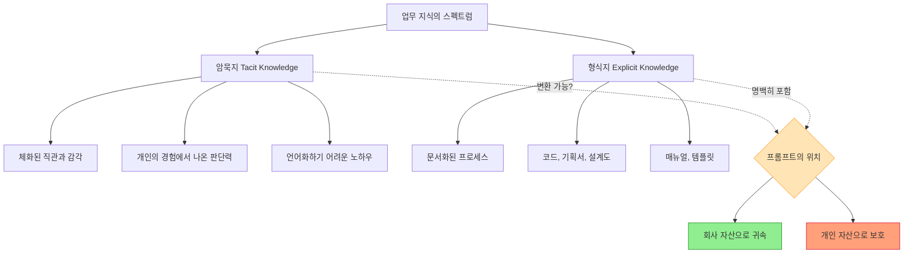
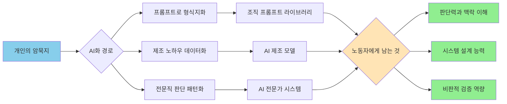
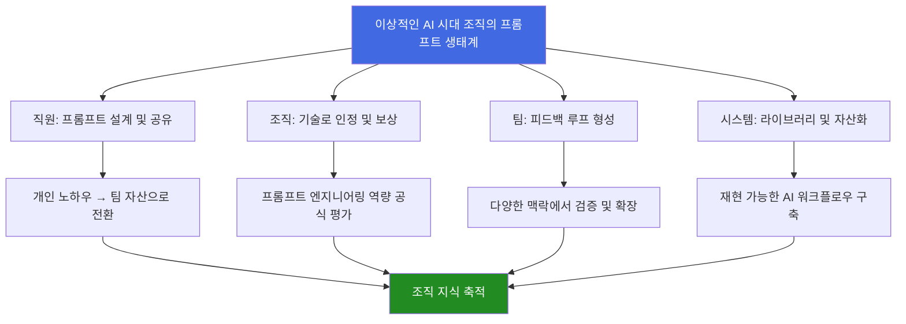
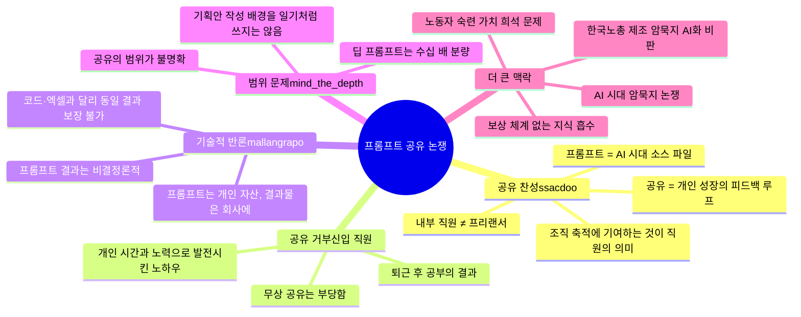

> 작성 기준일: 2026년 4월 28일  
> 원본 담론 출처: [리멤버 커뮤니티](https://community.rememberapp.co.kr/post/196767), Threads ([@ssacdoo]( https://www.threads.com/@ssacdoo/post/DXptSjYEyY-), [@mallangrapo](https://www.threads.com/@mallangrapo/post/DXp6GQpk8Ch), [@mind_the_depth](https://www.threads.com/@mind_the_depth/post/DXp36x4gemX))

---

## 들어가며 — 왜 이 사소해 보이는 논쟁이 폭발했는가

2025년 4월, 리멤버 커뮤니티에 올라온 게시물 하나가 조회수 5만을 넘기며 댓글 410개를 두 갈래로 갈랐다. 내용은 단순했다. 어느 팀장이 AI 이미지 생성을 잘 다루는 막내 팀원에게 프롬프트를 공유해달라고 요청했는데, 그 직원이 "개인 노하우이니 무상으로 공유할 수 없다"고 거절했다는 것이다. 이를 본 Threads의 @ssacdoo는 상당히 직접적이고 논리적인 장문의 글로 응수했고, 이에 @mallangrapo와 @mind_the_depth가 각각 다른 각도에서 반론을 제기했다.

표면만 보면 이건 그냥 세대 갈등이나 직장 예절 문제처럼 보인다. 그러나 실제로 이 논쟁은 훨씬 깊은 질문을 건드리고 있다. AI 시대에 '직무 수행 과정에서 생성된 지식'의 소유권은 누구에게 있는가. 프롬프트는 단순한 '문장 몇 줄'인가, 아니면 소스 코드에 준하는 '재현 가능성의 핵심'인가. 그리고 궁극적으로, 조직에서 일한다는 것의 의미가 AI 시대에 어떻게 재정의되어야 하는가.

이 글은 세 개의 Threads 게시물과 리멤버 원문을 통해 제기된 논점들을 전면 해부하고, 이 논쟁이 2026년 현재의 노동 시장 구조 변화와 어떻게 연결되는지를 깊이 살펴본다.

---

## 1. 사건의 구조 — 무엇이 실제로 일어났는가

### 원본 사건 재구성

리멤버 커뮤니티 게시물의 팩트를 정리하면 이렇다.

- 회사는 제미나이(Gemini)를 전사 도입하고 팀별 AI 활용을 적극 독려하는 방침을 내렸다.
- 막내 팀원은 AI, 특히 AI 이미지 생성에 뛰어난 능력을 보여 빠르고 품질 높은 결과물을 생산하고 있었다.
- 팀장은 팀 전체의 역량 향상을 위해 노션 공유 페이지를 만들어 프롬프트를 함께 올리자는 제안을 했고, 다른 팀원들은 동의했다.
- 막내는 팀 채팅에서 먼저 완곡하게 거절했고, 개인 채팅에서도 "퇴근 후와 주말에 개인적으로 공부해서 발전시킨 노하우이므로 무상 공유는 아닌 것 같다"고 재차 거절했다.

이 사건에는 몇 가지 중요한 맥락이 더 있다. 회사가 AI를 전사 도입했다는 것은, AI 활용이 이 직원의 순수한 개인 취미가 아니라 이미 '업무의 일부'로 공식화된 맥락 안에 있다는 뜻이다. 또한 팀장이 단순히 "나도 써보고 싶다"고 요청한 것이 아니라, 팀 전체의 노션 공유 시스템이라는 조직적 맥락 안에서 제안했다는 점도 중요하다.

### 논쟁의 층위를 나누는 것의 중요성

이 사건을 제대로 분석하려면, 논쟁이 실제로 세 가지 서로 다른 층위에서 동시에 일어나고 있다는 점을 먼저 구분해야 한다.

**첫째, 법적·계약적 층위:** 프롬프트는 법적으로 회사 자산인가, 개인 자산인가?

**둘째, 조직 문화적 층위:** 공유하지 않는 것이 협업 감각의 결여인가, 아니면 정당한 개인 자산 보호인가?

**셋째, 개인 성장 층위:** 공유하는 것이 개인에게도 이득인가, 아니면 손해인가?

---

## 2. @ssacdoo의 논지 — 프롬프트는 AI 시대의 소스 파일이다

### 핵심 프레임: 유추를 통한 논리 구조

기획자의 장표(PPT)는 기획안의 최종본만이 아니다. 시장을 보는 관점, 문제를 구조화하는 방식, 설득의 흐름이 모두 담긴 과정물이다. 그렇다고 기획자가 "이건 제 전략적 사고이니 최종 결론만 드리겠다"고 말하면 이상한 사람이 된다. 디자이너도 마찬가지다. PSD 파일, After Effects 프로젝트 파일, Blender 씬 파일, 레이어 구조, 키프레임 세팅까지, 최종 JPG나 MP4 너머의 모든 제작 과정 파일들이 회사 서버에 아카이빙된다. 개발자의 코드도, 마케터의 캠페인 세팅값도 모두 마찬가지다.

그렇다면 AI로 만든 결과물이 회사 업무의 일부라면, 그 결과를 만들기 위해 사용한 프롬프트 역시 작업 공정이고, AI 시대의 소스 파일에 가깝다는 논리가 성립한다. 프롬프트는 단순히 "보이는 그대로 시키면 만들어준다"는 말로 축소될 수 없는, 문제 정의, 결과물의 상상, 조건 설정, 실패 회피 전략이 응축된 설계물이라는 것이다.

### 공유 대상의 기준 제시

### 직원과 프리랜서의 구분

### 개인 성장 관점에서의 역설

그리고 가장 흥미로운 부분이 마지막에 나온다. @ssacdoo는 공유가 개인에게도 이득이라는 역설적 주장을 펼친다. 혼자 쥐고 있는 프롬프트는 결국 자신의 머릿속에서만 검증된다. 하지만 프롬프트를 공유하면, 기획자는 다른 문제 정의에 붙여보고, 디자이너는 다른 시각 언어로 확장하고, 마케터는 캠페인 구조 안에서 변형하고, 개발자는 자동화나 템플릿으로 바꾼다. 그 과정에서 자신이 보지 못한 가능성이 나오고, 어떤 표현이 더 좋은지, 어떤 조건이 불필요한지, 어떤 구조가 다른 업무에도 전이될 수 있는지를 알게 된다. 즉 프롬프트 공유는 손실이 아니라 피드백 루프라는 것이다.

---

## 3. 반론들 — 무엇이 실제로 다른가

### @mallangrapo의 반론: 프롬프트는 코드나 엑셀 함수와 다르다

이 주장에는 일리가 있다. "이렇게 하면 됩니다"라고 프롬프트를 공유했는데 다른 팀원이 다른 결과를 얻으면, 공유한 사람이 오히려 "왜 나한테는 똑같이 안 나오냐"는 질문 공세에 시달리게 된다. 이는 실제로 많은 AI 활용 조직에서 발생하는 현실적인 문제다.

### @mind_the_depth의 반론: '공유'의 범위가 불명확하다

그는 AI와의 딥한 대화를 통해 결과물을 만든 경우, 그 프롬프트는 한 문단으로 요약이 안 된다고 지적한다. 몇 시간에 걸친 대화 로그 전체가 프롬프트라면, 그걸 다 공유해야 하는가. 기획안 포맷이 유사한 팀워크의 공유물이라면, 딥한 프롬프트는 그것의 수십 배 분량일 수 있다는 것이다.

이에 대해 @ssacdoo는 직접 답글에서 기준을 제시한다. "대화 로그를 전부 까서 공유해야 한다는 게 아니라, '프로젝트를 진행함에 있어 어떻게 프롬프트를 설계했는지에 대한 설명' 정도"라고 한다. 암묵지를 형식지로 바꾸는 게 아니라, 다른 사람이 이어받았을 때 감이 잡히는 정도면 충분하다는 것이다.

---

## 4. 논쟁의 진짜 핵심 — 암묵지와 형식지의 경계, 그리고 AI

이 논쟁의 가장 깊은 층위에는 지식관리론(Knowledge Management)의 고전적 개념인 '암묵지(Tacit Knowledge)'와 '형식지(Explicit Knowledge)'의 경계 문제가 있다.

피터 드러커와 노나카 이쿠지로 등의 지식경영론에서는, 암묵지는 개인의 머릿속에 체화된 경험과 직관으로서 쉽게 이전되지 않고, 형식지는 언어나 기호로 명시화되어 공유 가능한 지식이라고 구분한다. 조직의 지식 창조 과정은 암묵지를 형식지로 변환하는 '표출화(Externalization)' 과정을 핵심으로 한다.

이 프레임에서 보면, @ssacdoo도 @mind_the_depth도 사실 같은 원칙에 동의한다고 볼 수 있다. '사람의 머릿속에 체화된 암묵지까지 회사가 소유할 수는 없다'는 것이다. @ssacdoo도 명시적으로 이를 인정한다. 그러나 그는 '회사 프로젝트를 위해 작성된 구체적인 프롬프트와 워크플로우'는 이미 형식지화된 산출물이라고 본다. 반면 @mind_the_depth는 AI와의 딥한 대화 로그 전체는 여전히 암묵지에 가깝다고 보는 것이다.

### 프롬프트는 어디에 위치하는가?

이 논쟁에서 핵심은 '프롬프트'가 암묵지와 형식지 중 어느 쪽에 가까운가이다. 그리고 이 질문에 대한 답은 프롬프트의 종류에 따라 다르다.

**단순 프롬프트의 경우:** "세련된 기업 로고 이미지 생성해줘"와 같은 단순 명령은 형식지에 가깝다. 공유가 쉽고 당연하다.

**중간 복잡도 프롬프트의 경우:** 특정 스타일 지침, 부정 조건(negative prompt), 참조 레퍼런스 구조, 반복 수정을 통해 도달한 최종 프롬프트 템플릿은 형식지화된 노하우다. 이는 코드 함수나 기획 템플릿과 다를 바 없다.

**딥 프롬프트 세션의 경우:** 수 시간에 걸쳐 AI와 대화하며 문제를 정의하고, 방향을 수정하고, 맥락을 쌓아가며 만들어낸 결과의 경우, 그 과정 전체를 단일 '프롬프트'로 환원하기 어렵다. 이건 작업 일지에 가깝다.

이 세 가지 유형을 구분하지 않고 '프롬프트 공유' 문제를 단일하게 논하는 것이 이 논쟁이 갈등하는 주요 원인이다.

---

## 5. 더 넓은 맥락 — 한국 노동계에서 불거지는 암묵지 논쟁

이 직장 내 논쟁은 사실 더 큰 사회적 논쟁의 축소판이다. 2026년 4월 현재, 한국 노동계에서는 '암묵지의 AI화'라는 더 심각한 쟁점이 부상하고 있다.

한국노동조합총연맹은 산업통상자원부의 '제조암묵지기반 AI모델개발사업'에 대해 강도 높게 비판했다. 수십 년에 걸쳐 제조 명장들이 쌓아온 숙련과 경험, 직관을 데이터로 전환해 AI가 대체하고 재현하려는 사업이라는 것이다. 한국노총은 "그 성과를 해당 노동자에게 어떻게 보상할지, 사회와 어떻게 배분할지에 대한 어떠한 기준도 없다"고 비판했다. 제조 암묵지가 AI로 넘어가는 순간, 기업 입장에서는 값비싼 고숙련 노동자를 유지할 유인이 급격히 떨어지기 때문이다.

이 맥락에서 보면, 신입 직원의 프롬프트 공유 거절은 단순히 '꼴받는 신입'의 이기주의적 행동이 아닐 수도 있다. 그것은 AI 시대에 노동자가 자신의 노하우와 숙련이 어떻게 조직에 흡수되고 개인의 가치가 희석되는가에 대한 직관적 불안의 표현일 수 있다. 물론, 그 불안이 정당하다고 해서 그 표현 방식(공유 완전 거부)이 적절하다는 뜻은 아니지만.

세계경제포럼(WEF)은 2025~2030년을 "AI와 자동화가 업무 구조를 본격적으로 재편하는 시기"로 규정했다. 글로벌 컨설팅사들도 2026년이 AI 활용 능력이 연봉과 경력의 핵심 변수로 작동하기 시작하는 해라고 진단했다. 이 환경에서, AI를 잘 쓰는 능력 자체가 개인의 경쟁력이 되어버린 세계에서, 그 핵심 능력의 산출물을 공유하라는 요구는 노동자 입장에서 결코 단순하지 않다.

---

## 6. @mallangrapo 반론에 대한 구체적 검토 — '결과가 달라진다'는 문제

코드도 마찬가지다. 같은 파이썬 코드를 다른 환경(OS, 라이브러리 버전, 데이터 상태)에서 실행하면 다른 결과가 나올 수 있다. 그렇다고 "코드를 공유하면 다른 결과가 나올 수 있으니 공유 안 하겠다"고 말하는 개발자는 없다. 결과의 재현 가능성 문제는 공유하지 않을 이유가 아니라, 공유할 때 맥락 설명이 필요한 이유다.

디자인 파일도 마찬가지다. PSD 파일을 열어도 폰트가 없거나, 링크된 레이어가 없거나, AI 파일 버전이 다르면 원본과 다르게 렌더링될 수 있다. 그렇다고 디자이너가 원본 파일 공유를 거부하지는 않는다. 환경 차이를 설명하는 메모를 함께 넘기는 것이 협업의 방식이다.

프롬프트 공유도 마찬가지여야 한다. "이 프롬프트는 Gemini 1.5 Pro에서, 이런 시스템 컨텍스트 하에, 이런 이미지 스타일 레퍼런스를 전제로 작동했습니다. 다른 모델에서는 결과가 다를 수 있습니다"라는 메모와 함께 공유하는 것이 올바른 방식이다.

---

## 7. 내 의견 — 공유의 의무는 있으나, 인정의 의무도 있다

여러 논점을 검토한 뒤 내가 내리는 결론은 이렇다.

**공유는 맞다. 그러나 논쟁이 여기서 멈추면 절반만 옳다.**

그러나 나는 이 논쟁에서 회사 쪽의 책임이 충분히 논의되지 않았다고 생각한다.

**프롬프트 설계를 '그냥 문장 몇 줄'로 취급하는 조직 문화가 먼저 바뀌어야 한다.** AI 이미지를 잘 뽑아내는 직원을 "와, 잘했다"고 칭찬하는 것과, 그 직원이 어떤 설계 원칙으로 프롬프트를 구성했는지를 기술 역량으로 인정하고 평가하는 것은 완전히 다른 이야기다. 많은 조직에서 전자는 하지만 후자는 하지 않는다.

만약 회사가 "프롬프트를 공유하라"고 요구하면서도 그것을 평가하거나 보상하는 체계가 없다면, 그 요구는 노동자의 노하우를 무상으로 흡수하는 것과 다르지 않다. 제조업 현장에서 숙련 노동자의 암묵지를 AI에 학습시키면서 아무런 보상도 배분 기준도 없다는 노동계의 비판과 구조적으로 같다.

좋은 프롬프트를 설계하는 것은 분명한 작업이고, 기술이고, 기여다. 공유는 당연하지만, 인정도 당연해야 한다. @ssacdoo의 글도 이 지점에서 끝맺는다 — "공유는 당연하다. 인정도 당연하다."

---

## 8. 신입 직원 입장에서의 옹호와 비판 — 동시에

나는 이 신입 직원을 단순히 '꼴받는 신입'으로 규정하는 것에는 동의하지 않는다. 동시에 그 직원의 대응 방식은 분명히 잘못되었다고 생각한다.

**옹호할 수 있는 부분:** 이 직원이 회사에 배울 게 없다고 느끼는 데는 이유가 있을 수 있다. AI 전환 시대에 많은 조직에서 신입 직원들은 오히려 선배들에게 AI 사용법을 가르쳐야 하는 역전된 상황에 처해 있다. "나만 열심히 공부해서 AI를 잘 쓰고 있는데, 그걸 그냥 나눠줘야 한다"는 불만은, 조직이 지식 이전을 일방향으로만 강요한다고 느낄 때 자연스럽게 생기는 감정이다. 또한, AI 능력이 곧 대체되지 않을 경쟁력이라는 불안한 시대에, 자신의 핵심 역량이 공개되는 것에 대한 두려움도 이해할 수 있다.

**비판받아야 하는 부분:** 그럼에도 불구하고, 회사의 리소스와 프로젝트를 활용해서 쌓은 노하우를 완전히 '개인 자산'으로 선언하는 것은 논리적으로 성립하지 않는다. 퇴근 후에 공부한 것과, 회사 업무를 처리하면서 발전시킨 것을 완전히 분리하기 어렵다는 점도 있다. 무엇보다, 팀원들이 "정중하게" 물어봤는데도 완전히 거절한 것은 협업 감각 면에서 문제가 있다. 공유의 범위와 방식을 협의하고, "이건 제가 제안하고 싶은 프롬프트 설계 방법론입니다"라는 형태로 가치를 보여줄 기회를 스스로 날린 것이다.

---

## 9. AI 시대, 조직에서 살아남는 사람의 조건

이 논쟁은 결국 AI 시대에 조직에서 어떤 사람이 진짜 가치 있는가라는 질문으로 귀결된다.

이 말은 단순히 "공유하는 사람이 착한 사람"이라는 도덕적 주장이 아니다. 더 냉정한 경력 관점에서 봐도 맞다. AI 모델 자체는 빠르게 진화하고 있고, 특정 모델에 최적화된 프롬프트 한 줄의 가치는 모델 업데이트와 함께 금방 희석된다. 반면, 문제를 어떻게 정의하고, AI 출력을 어떻게 비판적으로 평가하고, 팀의 워크플로우를 어떻게 설계하는가의 능력은 모델이 바뀌어도 남는다. 그 역량을 조직 안에서 보여주는 가장 효과적인 방법은 숨기는 게 아니라 체계화하는 것이다.

---

## 10. 결론 — 논쟁이 남긴 진짜 질문들

이 논쟁이 댓글 410개를 낳은 이유는, 단순히 '꼰대 vs 신입'이나 '공유 찬성 vs 반대'의 이분법으로 해결되지 않는 진짜 질문들이 안에 있기 때문이다.

그 질문들을 정리하면 이렇다.

**첫째, 프롬프트 설계는 직무 능력으로 평가받고 있는가?** 공유를 요구하기 전에, 그 능력을 인정하고 보상하는 체계가 갖춰져 있는지를 조직은 먼저 점검해야 한다.

**둘째, '공유'의 범위와 형식을 명확히 합의했는가?** 전체 대화 로그인지, 최종 프롬프트 템플릿인지, 설계 방법론에 대한 설명인지를 구체화하지 않은 채 "공유해달라"고 하면 요구 자체가 모호하다.

**셋째, 조직은 지식 축적의 피드백 루프를 설계하고 있는가?** 공유된 프롬프트가 어떻게 발전되고, 누가 기여했는지가 추적되고 인정받는 시스템이 있는가.

**넷째, AI 시대 노동자의 숙련 가치는 어떻게 보호되어야 하는가?** 이 질문은 신입 직원 한 명의 프롬프트를 넘어, 제조업 명장의 암묵지, 의사의 임상 직관, 법조인의 판단력이 AI에 흡수되는 거시적 흐름과 연결된다.

이 네 가지 질문에 답하지 않은 채 "공유해야 한다" 혹은 "공유 안 해도 된다"고만 말하는 것은, 모두 논쟁의 절반만 보는 것이다.

AI 시대의 조직은 개인의 노하우가 팀의 자산으로 자연스럽게 흐르도록 설계되어야 하고, 그 흐름에 기여한 사람이 인정받는 문화가 있어야 한다. 그 두 가지가 함께 작동할 때 비로소, 프롬프트 공유 거절 같은 갈등은 생겨날 이유가 없어진다.

신입의 태도가 꼴받는 이유가 있다. 하지만 그 꼴받음의 원인 중 일부는, 노하우를 흡수하면서도 인정하지 않는 조직 문화에도 있다는 점을 이 논쟁은 조용히 가리키고 있다.

---

## 부록 — 논쟁 구조 요약

---

*이 문서는 2026년 4월 28일 기준으로 작성되었으며, 리멤버 커뮤니티 및 Threads의 공개 게시물을 바탕으로 분석한 것입니다.*
