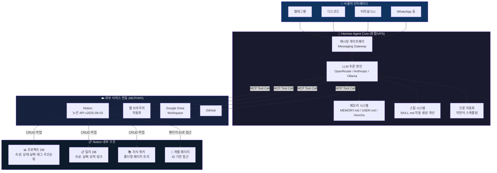
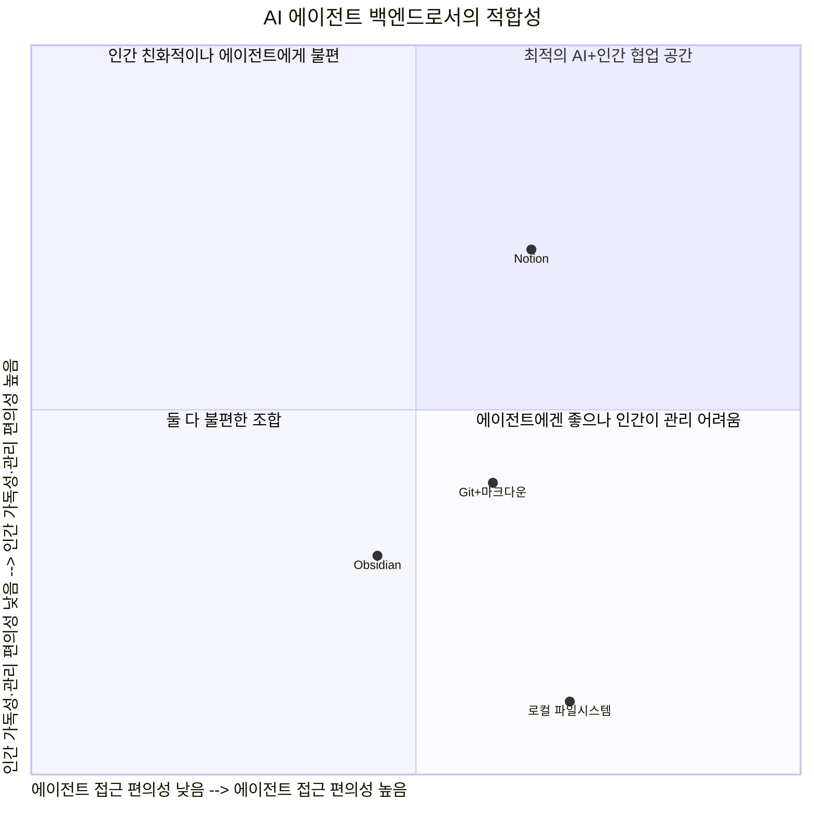
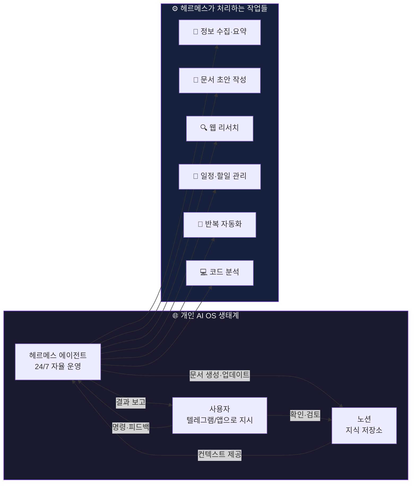

> **원문 출처**: [@ai.trend.ray](https://www.threads.com/@ai.trend.ray/post/DXo8M6jkSba) — Threads 게시물  
> **작성일**: 2026년 4월 28일  
> **분석 키워드**: Hermes Agent, 개인 AI OS, 옵시디언(Obsidian), 노션(Notion), 지식관리, AI 에이전트 백엔드

---

## 개요: 이 글이 말하는 것

이 게시물은 한 AI 파워유저가 자신만의 **"AI 개인 운영체제(Personal OS)"** 를 구축하는 과정에서 겪은 실패와 전환의 이야기를 담고 있다. 핵심은 간단하다 — AI 에이전트인 헤르메스(Hermes)를 두뇌로 삼고, 그 에이전트가 생성하는 대량의 문서들을 저장하고 관리하는 외부 지식 저장소로 어떤 툴이 더 적합한가에 대한 실전 검증 결과물이다.

처음에는 **헤르메스 + 옵시디언**의 조합으로 출발했지만, 결론적으로 이 조합은 실패로 귀결되었다. 현재는 **헤르메스 + 노션**으로 전체 문서를 이전하는 중이며, 그 과정에서 발견한 장단점들을 솔직하게 공유하고 있다.

이 분석 문서는 해당 게시물의 내용을 깊이 해석하고, 헤르메스 에이전트의 기술적 맥락, 옵시디언과 노션의 차이, AI 시대의 지식 관리 방법론까지 확장하여 서술한다.

---

## 1. 헤르메스(Hermes Agent)란 무엇인가?

게시물 말미에 저자 본인이 간략하게 부연 설명을 달았다: *"헤르메스는 AI 에이전트입니다. 로컬에서 돌아가는 AI 비서라고 생각하시면 되어요!"*

이 설명만으로는 부족하니 기술적 맥락을 좀 더 살펴보자.

### 1.1 Hermes Agent의 정체

Hermes Agent는 **NousResearch(Nous Research)** 가 만든 오픈소스 AI 에이전트 프레임워크이다. NousResearch는 Hermes, Nomos, Psyche 등의 AI 모델을 개발한 AI 연구 기관으로, 이 에이전트 프레임워크는 2026년 초부터 주목받기 시작했다.

헤르메스의 가장 큰 특징은 **"성장하는 에이전트(The agent that grows with you)"** 라는 콘셉트다. 단순히 질문에 답하고 끝나는 챗봇이 아니라, 사용할수록 스스로 학습하고 진화하는 폐쇄적 학습 루프(closed learning loop)를 내장하고 있다는 점에서 기존 AI 툴과 차별화된다.

헤르메스의 주요 특징을 정리하면 다음과 같다.

**자기 진화 시스템**: 복잡한 작업(도구 5회 이상 호출)을 완료한 뒤 재사용 가능한 스킬 문서를 자동으로 생성한다. 그리고 이 스킬들은 사용 중에 낡거나 부정확한 내용이 발견되면 스스로 패치한다. 이것이 바로 DSPy와 GEPA를 기반으로 한 "자기 진화 시스템"의 핵심이다.

**영구 메모리**: MEMORY.md와 USER.md 파일을 통해 세션이 종료되더라도 학습한 정보가 유지된다. 사용자에 대해 점점 더 깊이 이해하는 개인화 모델을 구축한다. 여기에 Honcho(변증법적 사용자 모델링), Mem0, RetainDB 등 7가지 외부 메모리 백엔드를 플러그인 방식으로 연결할 수 있다.

**다양한 플랫폼 연결**: 텔레그램, 디스코드, 슬랙, WhatsApp, Signal, 이메일 등 15개 이상의 메시징 플랫폼에서 동시에 접근 가능하다. 즉, 랩톱을 열지 않아도 텔레그램을 통해 에이전트와 대화하고 명령을 내릴 수 있다.

**유연한 인프라**: 5달러짜리 VPS, GPU 클러스터, 혹은 Modal·Daytona 같은 서버리스 환경에서 운용할 수 있다. 특히 유휴 상태일 때 비용이 거의 0에 수렴하는 서버리스 배포가 가능해 개인 사용자에게도 경제적이다.

**MCP 지원**: Model Context Protocol을 통해 노션(Notion), GitHub, Google Workspace, Linear 등 외부 서비스와 직접 연동된다. 노션과의 연동이 공식 번들 스킬로 제공된다는 점이 이 글의 배경과 직접적으로 연결된다.

### 1.2 OpenClaw에서 Hermes로

게시물에서 저자는 *"오픈클로에서 헤르메스로 바꿀 때 어떤 편안함이 느껴졌다"* 고 회고하며, 옵시디언에서 노션으로의 전환이 그와 같은 느낌이라고 비유한다.

OpenClaw(오픈클로)는 Hermes Agent의 전신격이 되는 유사 에이전트 프레임워크이며, Hermes는 `hermes claw migrate` 명령어를 통해 OpenClaw의 설정, 메모리, 스킬, API 키를 자동으로 마이그레이션할 수 있는 기능까지 내장하고 있다. 즉 저자는 에이전트 툴 자체도 이미 한 번 갈아탄 경험이 있고, 이번에는 그 에이전트가 사용하는 저장 백엔드를 교체하는 것이다.

---

## 2. 실패한 조합: 헤르메스 + 옵시디언

### 2.1 옵시디언(Obsidian)은 어떤 툴인가?

옵시디언은 마크다운 기반의 로컬 지식 관리 툴로, "제2의 뇌(Second Brain)"를 표방하는 PKM(Personal Knowledge Management) 도구의 대명사다. `[[이중 대괄호]]` 링크 문법으로 노트들 사이를 연결하고, 그 연결들이 시각적으로 그래프를 형성하는 백링크(backlink) 시스템이 핵심 철학이다. 이른바 **제텔카스텐(Zettelkasten)** 방법론을 디지털로 구현한 툴 중 가장 널리 사용되는 것이 옵시디언이다.

> **제텔카스텐(Zettelkasten)** 이란?  
> 20세기 독일 사회학자 니클라스 루만(Niklas Luhmann)이 고안한 메모 기법으로, 각 메모(zettel)에 고유한 ID를 부여하고 다른 메모들과 링크로 연결해 지식의 네트워크를 구축하는 방법이다. 메모들이 유기적으로 연결되어 시간이 지날수록 통찰이 스스로 떠오르는 구조를 목표로 한다.

옵시디언의 강점은 명확하다. 인터넷 연결 없이 로컬에서 동작하며, 모든 데이터가 마크다운 평문 파일로 저장되어 플랫폼 종속성이 없다. 플러그인 생태계가 방대하고, 그래프 뷰를 통해 지식 구조를 시각화할 수 있다. 특히 AI 에이전트에게 볼트(Vault, 옵시디언의 작업 공간) 경로에 직접 접근 권한을 주면, 에이전트가 파일 시스템 수준에서 바로 문서를 읽고 쓸 수 있다는 장점이 있다.

### 2.2 왜 실패했는가? — 옵시디언의 구조적 한계

저자가 헤르메스 + 옵시디언 조합을 "결과적으로 실패했다"고 진단하는 이유는 여러 층위에 걸쳐 있다.

**첫 번째 문제: 링크 피로도**

옵시디언의 `[[이중 대괄호]]` 링크는 문서들 사이를 연결하는 강력한 도구이지만, 동시에 함정이기도 하다. AI 에이전트가 대량의 문서를 생성할 경우, 그 문서들 사이의 링크 관계는 폭발적으로 증가한다. 사람이 이 링크를 타고 타고 가며 원하는 정보에 도달하는 과정은 상당한 인지적 피로를 유발한다.

저자는 이 문제를 해결하기 위해 INDEX(색인)와 MOC(Map of Content, 내용 지도)를 도입했다. MOC는 특정 주제와 관련된 노트들을 하나의 허브 페이지에서 정리해주는 메타 문서로, 제텔카스텐의 네트워크 구조에 계층성을 추가한 것이다. 그러나 저자의 경험에 따르면, 이러한 보완책을 사용해도 피로도는 "상당히 높은" 수준이었다. 결국 헤르메스가 생성한 대량의 문서들을 인간이 주기적으로 리뷰하고 파악하는 데에는 근본적인 어려움이 있었다.

**두 번째 문제: 넘버링 규칙의 경직성**

옵시디언에서 체계적인 지식 관리를 하려면 파일 네이밍과 넘버링 규칙을 초기에 완벽하게 설계해야 한다. 그렇지 않으면 나중에 구조를 바꾸는 것이 "굉장히 어렵다". 저자는 넘버링 규칙 때문에 볼트를 여러 번 처음부터 다시 구성해야 했다고 털어놓는다. 이것은 옵시디언이 본질적으로 **파일 시스템 위에 구축된 툴**이기 때문이다. 파일 이름이 곧 문서의 주소이고, 그 주소 체계를 바꾸면 기존 링크가 모두 깨진다.

**세 번째 문제: AI와의 인터페이스**

AI 에이전트인 헤르메스에게 옵시디언 볼트 내의 특정 문서 위치를 알려주고 접근하게 하는 것은 비교적 직관적이다 — 파일 시스템 경로를 알면 되기 때문이다. 그러나 그 반대 방향, 즉 에이전트가 생성한 문서를 규칙에 맞는 위치에 정확하게 저장하고 링크를 연결하는 과정에서 "작은 miss들"이 발생했다. 아무리 강제 규칙을 만들어도 완벽하지 않았다는 것이다. AI 에이전트의 파일 쓰기 동작은 사람처럼 맥락을 종합적으로 고려하기 어렵기 때문에, 엄격한 파일 시스템 구조를 일관되게 유지하는 것은 생각보다 까다로운 문제다.

---

## 3. 새로운 선택: 헤르메스 + 노션

### 3.1 노션의 접근 방식

노션은 옵시디언과 철학 자체가 다르다. 옵시디언이 "모든 것은 파일이고, 파일들이 연결된다"는 유닉스 철학에 가깝다면, 노션은 "모든 것은 블록이고, 블록들로 페이지를 자유롭게 구성한다"는 웹 기반 협업 도구의 철학에 가깝다. 노션은 제텔카스텐 방식의 링크 중심 지식 관리보다는, 전통적인 **폴더형 계층 구조**와 **데이터베이스(DB) 시트**를 결합한 구조를 기반으로 한다.

그리고 이 구조가 오히려 AI 에이전트와의 협업에는 더 궁합이 잘 맞았다는 것이 저자의 핵심 발견이다.

### 3.2 노션의 장점 1: AI와의 소통 품질

저자가 가장 먼저 꼽는 장점은 **AI와의 소통 방식이 좋아진다**는 것이다.

노션의 DB 페이지에서는 각 항목마다 **속성(Properties)** 을 정의할 수 있다. 상태(Status), 날짜, 태그, URL, 담당자, 우선순위 등 다양한 타입의 속성을 구조화된 형태로 관리한다. AI 에이전트의 관점에서 이것은 매우 중요한 차이를 만들어낸다.

옵시디언에서 에이전트가 문서의 메타데이터를 다루려면 마크다운 파일 상단의 YAML 프론트매터(front matter)를 파싱하고, 규칙에 맞게 수정한 뒤, 파일에 다시 써야 한다. 이 과정에서 "작은 miss들"이 발생한다. 반면 노션에서는 API를 통해 특정 페이지의 특정 속성값을 직접 지정해서 변경할 수 있다. 헤르메스가 노션 API를 호출하면 `{"properties": {"Status": {"select": {"name": "Done"}}}}` 이런 식으로 단일 속성만 정확하게 업데이트하는 것이 가능하다.

구조화된 API 호출은 문서 전체를 파싱하고 수정하는 것보다 훨씬 더 정확하고 예측 가능하다. 저자가 *"상호 소통이 더 좋아졌다"*고 표현한 것은 바로 이 기술적 메커니즘 덕분이다.

또한 저자는 *"현재 모든 볼트의 내용을 정리해오고 있음에도 꼬임이 없이 넘어가고 있다"* 고 덧붙인다. 즉 옵시디언에서 노션으로 문서를 이전하는 대규모 마이그레이션 작업 중에도 에이전트와의 협업이 매끄럽게 진행되고 있다는 것이다.

### 3.3 노션의 장점 2: 가독성과 유연한 구조

옵시디언은 기본적으로 파일 트리 구조다. 왼쪽 사이드바에 폴더와 파일들이 나열되어 있고, 사용자는 이 트리를 열고 닫고를 반복하며 원하는 문서를 찾아간다. 넘버링 규칙이 복잡해질수록 이 트리 탐색은 더욱 힘겨워진다.

노션은 다르다. 각 페이지가 블록 단위로 구성되어 있어 드래그 앤 드롭으로 자유롭게 재배치할 수 있다. 저자의 표현처럼 *"홈페이지처럼 사용자의 커스텀이 가능"* 하다. 페이지의 상단에 핵심 정보를 카드 형태로 배치하고, 그 아래에 관련 DB 뷰를 삽입하고, 또 그 아래에 관련 문서 링크를 나열하는 등 자유로운 구성이 가능하다.

더 중요한 것은 **넘버링 규칙의 굴레에서 벗어난다**는 점이다. 노션에서는 블록을 자유롭게 이동할 수 있기 때문에 초기 설계가 완벽하지 않아도 나중에 얼마든지 재구성이 가능하다. 이것은 AI 에이전트가 대량으로 생성하는 콘텐츠를 관리하는 환경에서 특히 중요하다. 에이전트가 처음에 잘못된 위치에 문서를 만들어도, 사람이 손쉽게 끌어다 올바른 위치로 옮길 수 있기 때문이다. 옵시디언에서는 파일을 옮기면 그 파일을 가리키는 모든 링크가 깨질 위험이 있다.

### 3.4 노션의 장점 3: 연결성 — 도구 간, 기기 간

저자는 *"옵시디언처럼 연결도 가능하다"* 고 언급한다. 노션도 페이지 간 링크, 멘션, 관계형 DB 등을 통해 문서 연결을 지원한다. 그러나 진짜 강점으로 꼽는 것은 **기기 간 연결성**이다.

옵시디언은 기본적으로 로컬 파일 기반 툴이다. 다기기 동기화를 하려면 옵시디언 Sync 유료 플랜을 쓰거나, iCloud나 Google Drive 같은 외부 동기화 솔루션을 도입해야 한다. 설정이 번거롭고 충돌 문제가 생길 수 있다.

노션은 처음부터 온라인 기반으로 설계되었다. 휴대폰, 노트북, 아이패드 등 어떤 기기에서든 실시간으로 동일한 내용을 확인하고 수정할 수 있다. AI 에이전트가 서버에서 작업한 결과물이 즉시 모든 기기에 반영된다는 것은 실용적으로 매우 큰 장점이다. 외출 중에 스마트폰으로 헤르메스에게 작업을 지시하고, 그 결과를 노션에서 바로 확인할 수 있는 워크플로우가 가능하다.

---

## 4. 노션의 단점 — 솔직한 자기 평가

저자는 장점만 나열하지 않는다. 현재 시점에서 발견한 단점들도 솔직하게 공유한다.

### 4.1 속성 과부하 문제

노션 DB의 속성은 자유롭게 추가할 수 있다는 것이 장점이지만, *"속성값이 너무 많아지면 가독성이 떨어지는 것은 마찬가지"* 다. 연결성을 높이기 위해 관계형 속성, 롤업 속성 등을 계속 추가하다 보면 하나의 DB 항목이 수십 개의 속성을 가지게 되고, 이것 자체가 새로운 복잡성의 원천이 된다.

저자가 *"DB 속성값을 일일이 옮기기가 쉽지 않다"* 고 말하는 것은 마이그레이션 맥락에서 특히 와닿는 말이다. 옵시디언의 YAML 프론트매터에 있던 정보를 노션 DB의 구조화된 속성으로 매핑하는 작업은 자동화가 가능하지만, 어떤 속성을 만들고 어떤 값으로 채울지에 대한 사전 설계가 충분히 이루어지지 않으면 나중에 대규모 수정이 필요해진다.

### 4.2 AI에게 문서 위치 설명하기의 어려움

이것이 더 근본적인 기술적 한계다. 옵시디언에서 AI 에이전트가 특정 문서를 찾아가려면 파일 시스템 경로만 알면 된다. `~/vault/projects/2026/hermes/daily-log.md` 같은 형태다. 로컬 파일 시스템이기 때문에 에이전트가 직접 파일을 열고 읽는 것이 가능하다.

노션은 다르다. 노션의 모든 데이터는 노션의 서버에 있고, 접근은 API를 통해서만 가능하다. 에이전트가 특정 문서에 접근하려면 두 가지 방법 중 하나를 써야 한다. 첫째는 **페이지 링크**를 직접 알고 있거나, 둘째는 **문서 ID**를 미리 확보해두는 것이다. 노션의 모든 페이지에는 고유한 UUID 형식의 ID가 있으며, 이 ID를 통해 API 호출이 이루어진다.

저자가 *"반드시 문서 ID를 만들어서 남겨야 한다. 그래야 빠르게 해당 문서를 찾아가게 할 수 있다"* 고 강조하는 것은 이 때문이다. 결국 에이전트를 위한 "문서 주소록" 같은 것을 별도로 관리해야 한다는 의미이며, 이것은 추가적인 관리 부담이다.

---

## 5. 시스템 아키텍처: 헤르메스 + 노션의 동작 방식

아래는 헤르메스 에이전트가 노션을 백엔드로 사용할 때의 전체 시스템 흐름을 도식화한 것이다.

### 5.1 Notion API를 통한 에이전트 상호작용

헤르메스가 노션과 상호작용하는 방식은 기술적으로 MCP(Model Context Protocol) 또는 직접 REST API 호출 두 가지 경로가 있다. 노션 MCP 서버는 에이전트에게 다음과 같은 작업을 가능하게 한다.

- **페이지 생성**: 특정 DB 안에 새 페이지를 만들고, 속성값을 설정한다.
- **속성 업데이트**: 페이지 ID를 이용해 특정 속성만 정확하게 수정한다 (예: 상태를 "진행 중"에서 "완료"로 변경).
- **쿼리 및 필터**: DB에서 특정 조건을 만족하는 항목들을 검색하고 정렬한다.
- **블록 추가**: 기존 페이지에 새로운 컨텐츠 블록을 추가한다.

단, 노션 API는 **초당 호출 제한(rate limit)** 이 있다. 헤르메스가 대량의 문서를 빠르게 생성하거나 업데이트하려 할 경우 이 제한에 걸릴 수 있으며, 저자도 이것을 노션의 제약 중 하나로 언급했다.

---

## 6. 옵시디언 vs 노션: AI 에이전트 백엔드 관점 비교

아래 표는 AI 에이전트와 함께 지식 관리 백엔드로 사용할 때의 두 툴을 비교한 것이다.

| 비교 항목 | 옵시디언 (Obsidian) | 노션 (Notion) |
|---|---|---|
| **기반 구조** | 로컬 마크다운 파일 시스템 | 온라인 블록 기반 DB |
| **데이터 소유권** | 완전한 로컬 소유 | 노션 서버 (클라우드) |
| **AI 접근 방식** | 파일 시스템 경로 직접 접근 | API + 페이지 ID |
| **에이전트 쓰기 정확도** | YAML 파싱 오류 발생 가능 | 구조화된 API로 정확 |
| **구조 변경 유연성** | 낮음 (링크 깨짐 위험) | 높음 (블록 자유 이동) |
| **넘버링 규칙 의존도** | 매우 높음 | 낮음 |
| **다기기 동기화** | 유료 또는 외부 솔루션 필요 | 기본 제공 (실시간) |
| **가독성·커스터마이징** | 제한적 | 높음 (홈페이지형 구성) |
| **API 제공** | 없음 (플러그인 의존) | 공식 REST API |
| **무료 플랜** | 완전 무료 | 기본 기능 무료 |
| **보안·프라이버시** | 최고 (로컬) | 클라우드 의존 |
| **대량 문서 리뷰 편의성** | 낮음 (링크 피로도) | 높음 (DB 뷰 다양) |

---

## 7. AI 개인 OS란 무엇인가? — 더 큰 맥락

이 게시물이 단순히 "노션 써봤더니 좋더라"는 수준에 그치지 않는 이유는, 그 배경에 **AI 개인 운영체제(Personal AI OS)** 라는 더 야심찬 개념이 있기 때문이다.

AI 에이전트를 단순히 챗봇처럼 쓰는 것이 아니라, 자신의 디지털 생활 전반을 처리하는 상시 가동 비서로 운용한다는 발상이다. 헤르메스는 24시간 텔레그램 등을 통해 접근 가능하고, 크론 스케줄러로 정기 작업을 자동화하며, 각 대화 세션에서 학습한 내용을 메모리에 축적하고, 복잡한 작업은 서브에이전트를 생성해 병렬로 처리할 수 있다.

이 에이전트가 처리한 결과물들, 즉 분석 보고서, 정보 수집 내용, 프로젝트 현황 등이 노션이라는 외부 지식 저장소에 구조화된 형태로 축적된다. 사용자는 언제 어느 기기에서든 노션을 열어 에이전트의 작업 결과를 확인하고, 필요한 경우 피드백을 주며, 다음 작업을 지시한다.

이 생태계에서 에이전트는 **실행 엔진**이고, 노션은 **지식 저장소**이며, 사용자는 **의도와 방향을 제공하는 오케스트레이터**가 된다. 전통적인 지식 관리가 "사람이 모든 것을 직접 기록하고 정리한다"는 모델이었다면, AI 개인 OS는 "에이전트가 대부분을 처리하고, 사람은 검토와 방향 설정에 집중한다"는 역할 분담이 핵심이다.

---

## 8. 보안과 프라이버시: 노션의 클라우드 이슈

저자는 노션의 잠재적 보안 우려에 대해서도 솔직하게 언급한다. 일부 사람들이 노션의 클라우드 기반 특성이 보안 위험이 있다고 지적하는데, 저자의 반응은 현실적이다: *"사실 내 지식 위키는 훔쳐갈 알맹이가 거의 없다."*

이것은 단순한 농담이 아니라 합리적인 위험 평가다. AI 에이전트가 다루는 일반적인 개인 지식 위키의 내용 — 읽은 기사 요약, 아이디어 메모, 프로젝트 현황, 할일 목록 등 — 은 외부로 유출되더라도 심각한 피해를 주기 어렵다. 반면 금융 정보, 의료 기록, 기업 기밀 등 민감한 정보를 다루는 경우라면 로컬 기반의 옵시디언이나 자체 호스팅 솔루션이 여전히 우선적인 선택이 되어야 한다.

또한 노션은 현재 무료 플랜을 사용 중이라고 밝혔다. 노션의 무료 플랜은 개인 사용 기준으로 상당히 넉넉하며, API 호출 역시 무료 플랜에서도 가능하다 (단, 통합 공유 설정이 필요).

---

## 9. 앞으로의 여정: 초기 전환의 설렘과 과제

저자는 이 전환이 아직 "극 초기 시점"임을 솔직하게 인정한다. 더 많은 장단점이 시간이 지나면서 발견될 것이다. 하지만 현재의 느낌은 과거 OpenClaw에서 Hermes로 바꿀 때와 동일한 "편안함"이라고 표현한다.

이 비유는 의미심장하다. OpenClaw에서 Hermes로의 전환이 단순한 툴 교체가 아니라 에이전트의 패러다임 자체가 바뀌는 경험이었다면, 옵시디언에서 노션으로의 전환도 단순히 저장 위치가 바뀌는 것이 아니라 지식 관리의 철학과 워크플로우 자체가 재설계되는 경험이라는 의미일 것이다.

지식 관리 방법론이 제텔카스텐(Zettelkasten)의 연결 중심에서 데이터베이스 중심으로 이동한다는 것은, AI 시대에 맞는 새로운 "개인 지식 인프라"의 모습이 점점 구체화되고 있음을 보여준다. 제텔카스텐은 인간 한 명의 인지 과정을 보조하기 위해 설계되었다. 하지만 AI 에이전트가 수백, 수천 건의 문서를 생성하는 시대에는, 그 대량의 정보를 **인간과 AI 모두가 접근하고 관리하기 쉬운 구조화된 형태**로 저장하는 것이 더 실용적이다.

---

## 10. 결론 및 시사점

이 게시물은 단순한 "앱 추천"이 아니다. AI 에이전트를 실제로 장기간 운용한 사람이 실패를 겪고, 원인을 분석하고, 대안을 실험한 실전 리포트다.

핵심 시사점을 정리하면 다음과 같다.

**AI 에이전트의 백엔드 선택은 UX만의 문제가 아니다.** 에이전트가 어떤 방식으로 데이터를 읽고 쓸 수 있는지, API가 얼마나 구조화되어 있는지, 에러 복구가 얼마나 쉬운지 등 기술적 호환성이 핵심이다.

**제텔카스텐의 한계는 인간이 아닌 AI가 콘텐츠를 대량 생성할 때 극명하게 드러난다.** 인간 한 명이 하루에 쓰는 노트의 수는 한계가 있지만, AI 에이전트는 하루에 수백 개의 문서를 생성할 수 있다. 이 규모에서 링크 중심의 탐색은 현실적으로 관리가 어렵다.

**유연성이 일관성보다 중요해지는 시대가 오고 있다.** 엄격한 규칙과 넘버링 체계가 장기적 일관성을 보장하지만, AI 에이전트와 협업하는 환경에서는 유연하게 구조를 변경할 수 있는 능력이 오히려 더 가치 있을 수 있다.

**온라인 동기화는 에이전트 기반 워크플로우에서 필수다.** 에이전트는 24시간 어느 기기에서든 접근 가능해야 하기 때문에, 로컬 파일 기반 저장소는 근본적인 제약이 된다.

**이것은 아직 진행 중인 실험이다.** 저자 스스로가 "극 초기"라고 말했고, AI 에이전트와 지식 관리 툴의 결합은 아직 성숙한 분야가 아니다. 헤르메스 + 노션이 최종 답이 아닐 수도 있다. 하지만 이런 실험과 공유가 축적될수록, AI 시대에 맞는 개인 지식 인프라의 모범 사례가 점차 형성될 것이다.

---

## 부록: 참고 자료 및 링크

- **Hermes Agent 공식 문서**: [hermes-agent.nousresearch.com/docs](https://hermes-agent.nousresearch.com/docs/)
- **Hermes Agent GitHub**: [github.com/NousResearch/hermes-agent](https://github.com/NousResearch/hermes-agent)
- **Hermes Agent 한국어 가이드 (WikiDocs)**: [wikidocs.net/book/19414](https://wikidocs.net/book/19414)
- **Hermes + Notion 스킬 (LobeHub)**: [lobehub.com/skills/azmiariffaris-hermes-agent-notion](https://lobehub.com/skills/azmiariffaris-hermes-agent-notion)
- **Notion API 공식 문서**: [developers.notion.com](https://developers.notion.com)
- **Notion AI 에이전트 (Notion 3.0) 소개**: 노션이 2025년 출시한 AI 에이전트 기능으로, MCP를 통해 Claude, Cursor 등 외부 AI 툴과 통합 가능

---

*이 문서는 [@ai.trend.ray](https://www.threads.com/@ai.trend.ray/post/DXo8M6jkSba)의 Threads 게시물을 바탕으로, 헤르메스 에이전트와 지식 관리 도구에 관한 최신 정보를 추가하여 재구성한 분석 문서입니다. 작성일: 2026년 4월 28일.*
