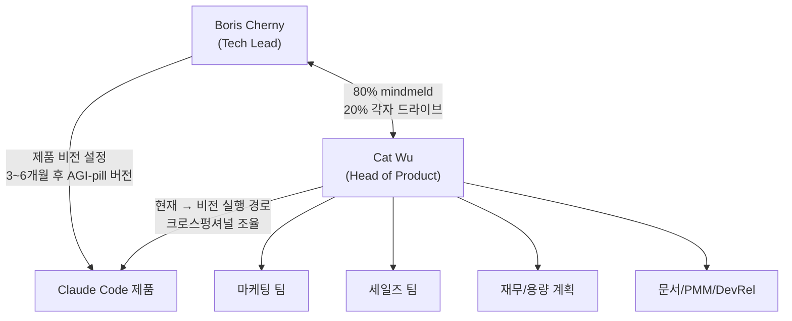
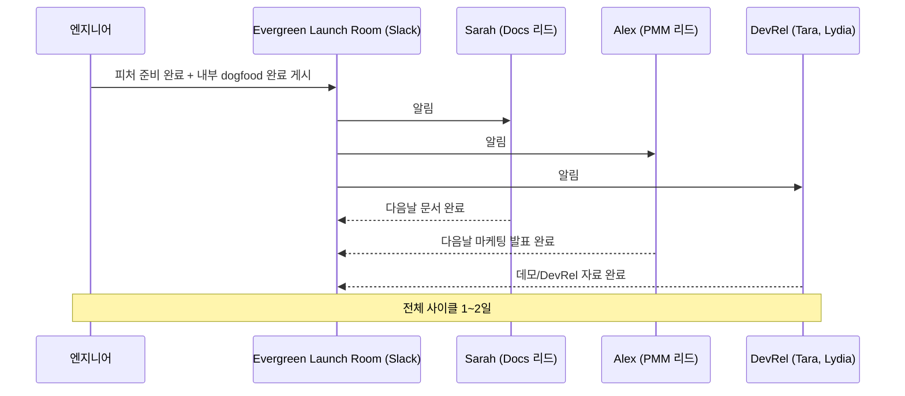
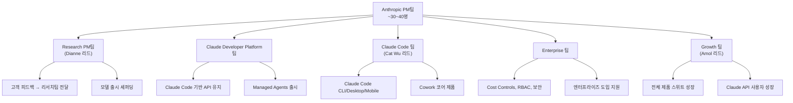
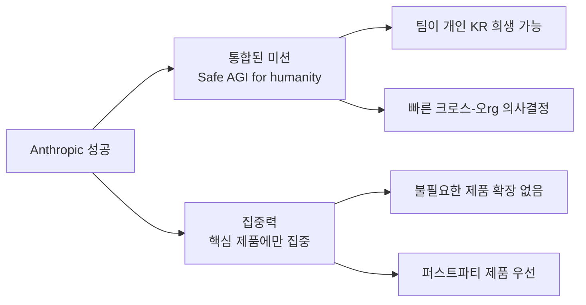
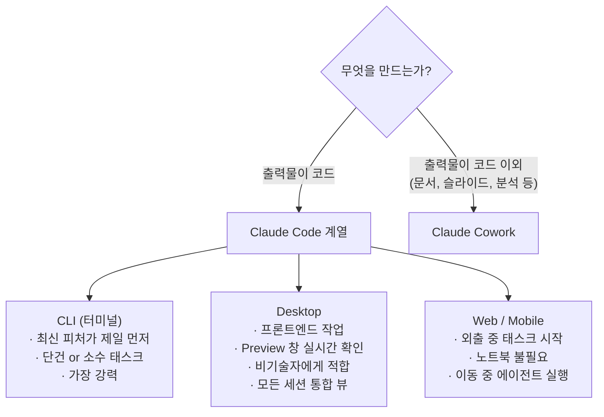
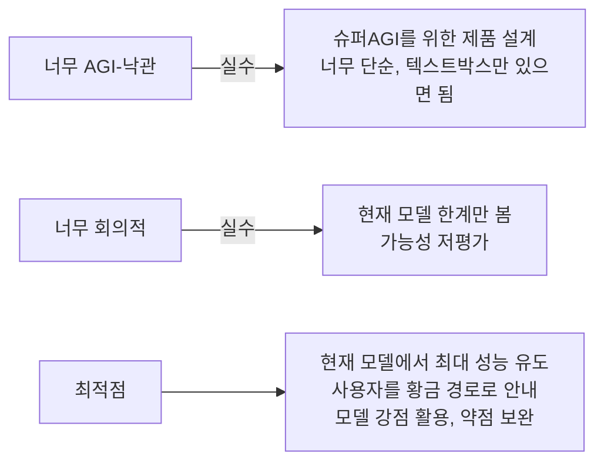
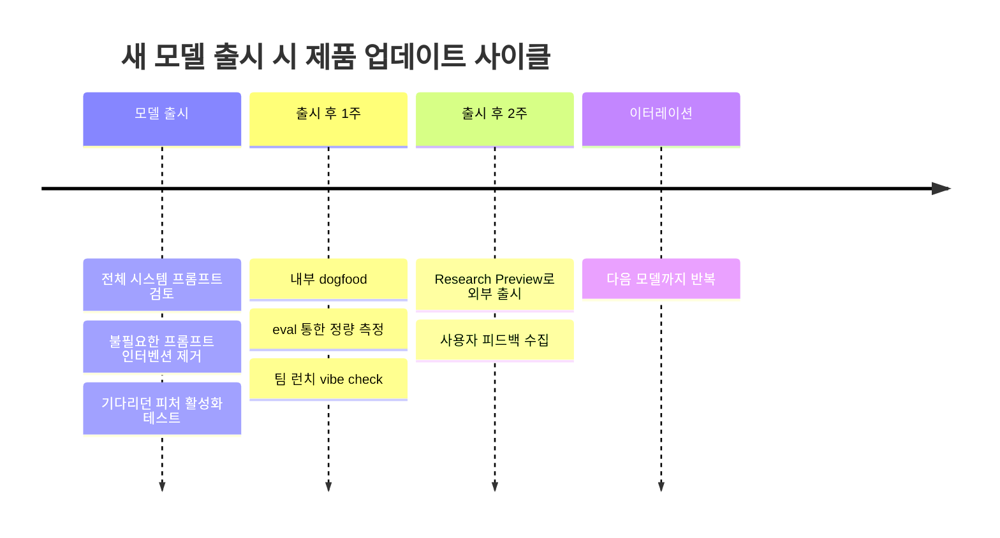
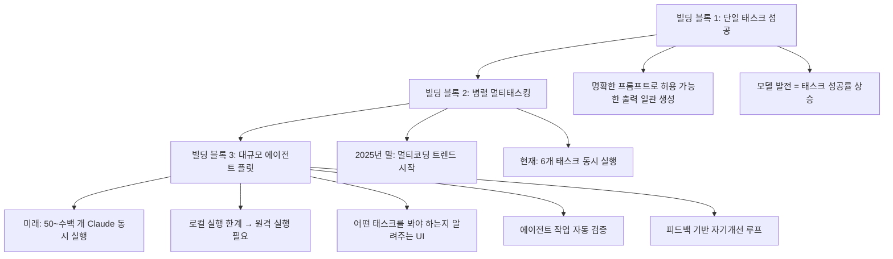

## Cat Wu × Lenny's Podcast 완전 분석
### Claude Code Head of Product Cat Wu 인터뷰 전문 해설

> **출처**: Lenny's Podcast (2026년 4월 23일 공개)  
> **게스트**: Cat Wu — Anthropic, Claude Code & Cowork Head of Product  
> **호스트**: Lenny Rachitsky  
> **영상**: https://www.youtube.com/watch?v=PplmzlgE0kg  
> **작성일**: 2026년 4월 29일

---

## 목차

1. [Cat Wu는 누구인가](#1-cat-wu는-누구인가)
2. [Boris Cherny와의 협업 구조](#2-boris-cherny와의-협업-구조)
3. [Anthropic이 PM에게 요구하는 것](#3-anthropic이-pm에게-요구하는-것)
4. [초고속 출시를 가능하게 하는 프로세스](#4-초고속-출시를-가능하게-하는-프로세스)
5. [PRD와 로드맵의 진화](#5-prd와-로드맵의-진화)
6. [Claude Mythos 모델과 출시 속도](#6-claude-mythos-모델과-출시-속도)
7. [Claude Code 소스코드 유출 사건](#7-claude-code-소스코드-유출-사건)
8. [OpenClaw 결정의 배경](#8-openclaw-결정의-배경)
9. [Anthropic PM팀의 구조](#9-anthropic-pm팀의-구조)
10. [엔지니어와 PM 역할의 경계 붕괴](#10-엔지니어와-pm-역할의-경계-붕괴)
11. [Product Taste: 시대의 핵심 스킬](#11-product-taste-시대의-핵심-스킬)
12. [인간 두뇌가 여전히 필요한 이유](#12-인간-두뇌가-여전히-필요한-이유)
13. [끊임없는 혼돈 속에서 정신건강 유지하기](#13-끊임없는-혼돈-속에서-정신건강-유지하기)
14. [빠른 출시가 희생하는 것들](#14-빠른-출시가-희생하는-것들)
15. [/powerup 커맨드](#15-powerup-커맨드)
16. [Anthropic 성공의 두 가지 비결](#16-anthropic-성공의-두-가지-비결)
17. [Claude Code vs Desktop vs Cowork 사용 가이드](#17-claude-code-vs-desktop-vs-cowork-사용-가이드)
18. [Cowork 시작 방법과 실전 사례](#18-cowork-시작-방법과-실전-사례)
19. [Cat Wu의 PM 테크 스택](#19-cat-wu의-pm-테크-스택)
20. [어느 팀이 토큰을 가장 많이 쓰는가](#20-어느-팀이-토큰을-가장-많이-쓰는가)
21. [AI 기업 PM에게 필요한 신흥 스킬](#21-ai-기업-pm에게-필요한-신흥-스킬)
22. [Evals: 저평가된 필수 역량](#22-evals-저평가된-필수-역량)
23. [Claude의 성격이 성공의 핵심인 이유](#23-claude의-성격이-성공의-핵심인-이유)
24. [새 모델 출시가 제품을 어떻게 바꾸는가](#24-새-모델-출시가-제품을-어떻게-바꾸는가)
25. [Claude Code와 Cowork의 비전](#25-claude-code와-cowork의-비전)
26. [AI 주도 세계에서 살아남는 법](#26-ai-주도-세계에서-살아남는-법)
27. [95% 자동화의 함정](#27-95-자동화의-함정)
28. [프로토타입이 아닌 진짜 앱을 만들어라](#28-프로토타입이-아닌-진짜-앱을-만들어라)
29. [AI 회의론자와 신봉자 사이의 간극](#29-ai-회의론자와-신봉자-사이의-간극)
30. [라이트닝 라운드 핵심 정리](#30-라이트닝-라운드-핵심-정리)
31. [Jiyo의 시각: 이 인터뷰가 말하는 더 큰 그림](#31-jiyo의-시각-이-인터뷰가-말하는-더-큰-그림)

---

## 1. Cat Wu는 누구인가

Cat Wu(캐서린 우)는 현재 Anthropic에서 Claude Code와 Cowork의 Head of Product를 맡고 있는 인물로, 이 세대에서 가장 중요한 AI 제품 중 하나를 직접 이끌고 있다. 그녀의 배경은 매우 독특한데, 단순한 PM 출신이 아니라 수년간의 엔지니어 경험 이후 Index Ventures에서 VC 파트너로 일했고, 그 뒤 Scale AI, Dagster Labs를 거쳐 Anthropic에 합류했다. Princeton 대학 출신으로, Figma, Datadog, Discord 같은 회사들을 투자자 관점에서 분석한 경험이 지금 그녀의 제품 시각에 큰 영향을 미쳤다.

이 인터뷰에서 Cat Wu는 단순한 PM 이야기를 넘어, AI 시대에 제품을 어떻게 바라봐야 하는지에 대한 철학적 프레임워크를 제시한다. 그녀는 현재 수백 명의 PM을 인터뷰하면서 대부분의 사람들이 AI PM 역할을 완전히 잘못 이해하고 있다는 사실을 목격하고 있다고 말한다.

---

## 2. Boris Cherny와의 협업 구조

Lenny Podcast에서 가장 많이 회자되는 Boris Cherny의 에피소드(팟캐스트 역대 1위)와 달리, Cat Wu는 상대적으로 덜 알려져 있다. 하지만 그녀는 Claude Code의 성공에서 Boris와 거의 동등한 역할을 한다고 봐야 한다.

Boris Cherny는 기술 리드이자 제품 비저너리로, 3~6개월 뒤의 AGI-pill 버전 제품이 어떤 모습이어야 하는지를 설정하는 역할을 한다. 그는 하루에도 수십 개의 PR을 핸드폰으로 머지하는, 전설적인 실행력을 보여주는 인물이다. Cat은 그 비전에서 현재 상태까지의 실행 경로를 설계하고, 마케팅, 세일즈, 재무, 용량 계획 등 크로스펑셔널 파트너들을 조율하며 제품이 출시 직전에 블로킹 없이 나올 수 있도록 한다.

그 둘의 관계는 "80% 마인드멜드, 20% 각자 드라이브"로 표현된다. 80%는 완전히 같은 생각이고, Cat이 더 신경 쓰는 20%는 Cat이, Boris가 더 신경 쓰는 20%는 Boris가 이끈다는 방식이다. 이 구조가 명확한 책임 분리 없이도 마찰 없이 돌아가는 이유는 두 사람 모두 제품 성공보다 Anthropic 미션을 우선시하는 문화 때문이다.

---

## 3. Anthropic이 PM에게 요구하는 것

Cat Wu는 현재 수백 명의 PM을 인터뷰하면서 공통적으로 잘못된 접근 방식을 목격한다. 이전 세대의 PM들은 기술 변화가 느렸기 때문에 6~12개월 단위로 계획하고, 여러 팀의 로드맵을 정렬하는 데 시간을 쏟았다. 코드를 짜는 비용이 매우 높았으므로 신중하게 우선순위를 따졌다.

하지만 지금의 Anthropic은 다르다. 제품 피처 타임라인이 6개월에서 1개월로 줄었고, 심지어 1주일, 하루가 되기도 한다. 이 환경에서 PM이 해야 하는 일은 멀티쿼터 로드맵을 정렬하는 것이 아니라, "아이디어에서 출시까지의 시간을 어떻게 줄일 것인가"에 집중하는 것이다.

Cat이 가장 좋아하는 PM 프로파일은 "엔지니어 출신으로 제품 감각이 뛰어난 사람"이다. 실제로 Claude Code 팀의 거의 모든 PM은 엔지니어 출신이거나 Claude Code로 코드를 직접 짜는 사람들이다. 심지어 디자이너들도 프론트엔드 엔지니어 경험이 있다. 이는 팀 전체가 하나의 언어로 소통하면서 빠르게 움직일 수 있게 해준다.

---

## 4. 초고속 출시를 가능하게 하는 프로세스

Cat Wu가 설명하는 빠른 출시의 핵심은 세 가지다.

### 4-1. 명확한 목표 설정

LLM은 너무 범용적이라 무엇을 위한 제품인지 모호해지기 쉽다. 따라서 좋은 PM은 다음을 명확히 정의해야 한다.
- **핵심 사용자**: 예) 엔터프라이즈 전문 개발자
- **해결할 문제**: 예) 권한 프롬프트가 너무 많아 피로감
- **목표 상태**: 예) 전문 개발자가 안전하게 권한 프롬프트 0개로 도달

이 명확성은 수많은 가능한 접근 방법 중에서 잘못된 방향을 빠르게 제거해준다.

### 4-2. Research Preview 브랜딩

Claude Code는 거의 모든 피처를 Research Preview로 출시한다. 이 브랜딩은 사용자에게 "이것은 실험적이고, 영원히 지원되지 않을 수도 있으며, 피드백을 수집 중인 초기 아이디어"임을 알린다. 덕분에 팀은 출시에 대한 심리적 부담 없이 1~2주 만에 피처를 사용자 손에 쥐어줄 수 있다.

### 4-3. Evergreen Launch Room 프로세스

엔지니어가 피처를 준비하고 내부 테스트(dogfood)를 마치면 Slack의 Evergreen Launch Room에 게시한다. 그러면 Docs 리드 Sarah, PMM 리드 Alex, DevRel의 Tara와 Lydia가 즉시 달려들어 하루 만에 마케팅 공지, 문서, DevRel 자료를 완성한다. 이 타이트한 프로세스가 엔지니어의 출시 마찰을 최소화하고, PM이 이런 시스템을 설계해야 한다는 것이 Cat의 핵심 주장이다.

---

## 5. PRD와 로드맵의 진화

전통적인 PM의 상징이었던 PRD(Product Requirements Document)는 Anthropic에서 완전히 사라진 건 아니지만 그 형태가 크게 바뀌었다.

Anthropic은 두 가지로 PRD를 대체한다.

첫째, **주간 메트릭 리뷰**다. 전체 팀이 매주 핵심 지표를 공유하고 비즈니스의 모든 측면을 깊이 이해한다. 이를 통해 팀 전체가 무엇이 중요한지, 어떤 트레이드오프를 해야 하는지 직관적으로 알게 된다.

둘째, **팀 원칙(Team Principles) 문서**다. 핵심 사용자가 누구인지, 왜 그들을 선택했는지, 무엇을 희생할 수 있는지를 명시한 원칙 목록이다. 이것이 있으면 개별 엔지니어가 PM의 승인 없이도 스스로 결정을 내릴 수 있다.

물론 특히 모호하거나 무거운 인프라 작업이 필요한 프로젝트에는 여전히 원페이저(one-pager) 수준의 PRD를 작성한다. 하지만 이것은 예외지 규칙이 아니다.

---

## 6. Claude Mythos 모델과 출시 속도

Lenny가 "Mythos 모델이 출시 속도를 올렸느냐"고 물었을 때, Cat의 대답은 솔직했다. Mythos는 믿을 수 없이 강력한 모델이고 내부에서도 사용하지만, 수분기에 걸쳐 쌓아온 출시 속도의 대부분은 프로세스와 팀 문화에서 나온다고 했다.

### Claude Mythos Preview란?

2026년 4월 7일 Anthropic이 공개한 Claude Mythos Preview는 특이한 출시 방식을 취했다. 사이버보안 분야에서의 능력이 너무 강력해 일반에 공개하지 않기로 결정한 것이다. 대신 **Project Glasswing**이라는 컨소시엄을 통해 40개 이상의 조직에 모니터링된 접근권을 부여했다.

주요 능력:
- 오픈소스 코드베이스에서 제로데이 취약점 자율 발견
- 클로즈드소스 소프트웨어의 소스코드를 역추론해 취약점 발굴
- N-day(알려진 미패치 취약점)을 실제 익스플로잇으로 변환
- 전문 보안 교육 없는 엔지니어도 완전한 working exploit 생성 가능
- 전문가급 CTF(Capture the Flag) 챌린지 73% 성공률

UK AISI(AI Security Institute)의 평가에 따르면, Mythos Preview는 이전 프론티어 모델 대비 사이버 능력이 현저히 향상되었으며, 이전에는 사람이 며칠 걸리던 멀티스텝 공격을 자율적으로 실행할 수 있다.

이 모델은 Anthropic이 말하는 "step change"이며, 기존 Opus 계열보다 한 단계 위에 있는 Capybara 티어로도 불린다. 모델 가격은 Opus 4.6의 5배 수준이다.

---

## 7. Claude Code 소스코드 유출 사건

2026년 3월, Claude Code CLI 애플리케이션의 소스코드가 외부에 공개되는 사건이 발생했다. 이 유출로 인해 미공개 피처들과 모델 계획이 드러났다. Cat Wu는 이에 대해 솔직하게 설명했다.

원인은 **인간의 실수(human error)** 였다. Claude와 함께 PR을 작성하던 직원이 패키지 릴리즈 업데이트 과정에서 실수를 범했고, 이것이 두 단계의 인간 리뷰를 통과해버렸다. 이중 검토를 거쳤음에도 유출이 발생했다는 점에서 프로세스 자체의 결함으로 볼 수 있다.

Anthropic의 대응은 빠르고 솔직했다. 즉시 조사에 착수했고, 프로세스 강화를 위한 추가 안전장치들을 대부분 이미 배포했다고 밝혔다. 해당 직원은 해고 없이 계속 재직 중이며("프로세스 실패지 개인 실패가 아니다"), 교훈을 바탕으로 더 강한 가드레일을 만드는 데 집중했다.

이 에피소드는 Claude Code 팀이 실수에 대응하는 문화를 잘 보여준다. 책임은 묻되 비난은 하지 않고, 시스템 개선에 집중하는 방식이다.

---

## 8. OpenClaw 결정의 배경

OpenClaw는 Claude 구독을 서드파티 제품에 연결해주는 외부 프로젝트였다. Anthropic은 이 연결을 차단하면서 오픈소스 커뮤니티의 반발을 샀다. Cat Wu는 이 결정을 방어했다.

핵심 이유는 두 가지다. 첫째, Claude 인프라는 서드파티 제품의 다른 사용 패턴에 맞게 설계되지 않았다. 둘째, Anthropic은 Claude 구독자와 퍼스트파티 제품에 집중해야 하는 비즈니스적 이유가 있다. 월 200달러 구독으로 사실상 무제한에 가까운 컴퓨트를 서드파티에 지원할 수는 없다는 것이다.

Anthropic은 전환을 완화하기 위해 기존 사용자에게 크레딧을 제공했다. 이 결정은 "퍼스트파티 제품과 API를 우선시한다"는 Anthropic 미션 우선순위에서 비롯된 것이다.

---

## 9. Anthropic PM팀의 구조

Anthropic의 PM팀은 현재 약 30~40명으로, 크게 다섯 그룹으로 나뉜다.

**Research PM팀** (Dianne Na Penn 리드): 고객으로부터의 모델 피드백을 수집해 리서치팀에 전달하고, 모델 출시를 총괄한다. 모델의 성능이 실제 사용자 요구를 반영하도록 하는 핵심 연결 고리 역할이다.

**Claude Developer Platform팀**: Claude Code가 구축된 API를 유지관리하고, Managed Agents(에이전트를 빌드하고 Anthropic이 호스팅하는 방식) 같은 기능을 출시한다.

**Claude Code 팀** (Cat Wu 리드): Claude Code CLI, Desktop, Mobile, 그리고 Cowork 코어 제품을 담당한다.

**Enterprise 팀**: 엔터프라이즈 고객을 위한 비용 제어, RBAC(역할 기반 접근제어), 보안 컨트롤 등을 통해 대기업이 Claude 도구를 안심하고 사용할 수 있는 환경을 만든다.

**Growth 팀** (Amol Avasare 리드): 전체 제품 스위트의 성장과 Claude API 사용자 성장을 담당한다.

---

## 10. 엔지니어와 PM 역할의 경계 붕괴

이 에피소드의 가장 도발적인 논점 중 하나다. Cat Wu는 명확하게 말한다: "모든 역할이 합쳐지고 있다." PM은 일부 엔지니어링을 하고, 엔지니어는 PM 역할을 하며, 디자이너는 PM이 되면서 동시에 코드를 짠다.

Claude Code 팀에는 사용자 피드백을 Twitter에서 발견한 후 1주일 만에 제품을 출시할 때까지 PM의 개입이 거의 필요 없는 엔지니어들이 있다. Cat은 이를 "가장 효율적인 출시 방식"이라고 부른다.

그렇다면 PM은 필요 없는가? Cat의 답은 "아니다, 방식이 달라진다"이다. PM이 희귀하게 가치 있는 이유는 여전히 제품 감각(Product Taste) 때문이다.

---

## 11. Product Taste: 시대의 핵심 스킬

> *"코드가 저렴해질수록, 무엇을 만들지 결정하는 능력이 더 가치 있어진다."*

Cat Wu가 가장 강하게 주장하는 것이 바로 Product Taste다. 수만 개의 GitHub 이슈가 쏟아지는 환경에서, 어떤 요청이 가치 있고 어떻게 만들어야 하는지를 판단하는 능력이 핵심이다.

엔지니어 배경이 지금 당장 특히 유용한 이유는, 어떤 기능이 구현하기 얼마나 어려운지를 알기 때문이다. 쉬운 것은 논쟁 없이 1시간 만에 구현하면 된다. 어려운 것은 그 비용을 알고 더 신중하게 우선순위를 매길 수 있다.

하지만 Cat은 이 엔지니어 배경의 우위가 "몇 달 안에" 바뀔 수 있다고 한다. 모델이 코딩 능력에서 크게 도약할 때마다 어떤 기술이 가치 있는지도 바뀐다. 따라서 가장 중요한 스킬은 특정 기술 자체가 아니라, **기술 변화를 읽고 팀이 필요로 하는 역할을 빠르게 채우는 능력**이다.

---

## 12. 인간 두뇌가 여전히 필요한 이유

초지능 이전까지 인간이 계속 필요한 영역에 대한 Cat의 분석은 현실적이다.

**첫째, 상식적 EQ 판단**: 제품 출시에는 수천 개의 이해관계자와 움직이는 부품이 있다. 모델은 "누가 중요한 이해관계자인지, 그들과 어떤 채널로 소통해야 하는지, 그들의 선호가 무엇인지"를 아직 잘 모른다. 이런 암묵적 사회적 지식은 여전히 인간의 영역이다.

**둘째, 무엇을 만들지 결정하기**: 기술 지형이 어떻게 변하는지 파악하고, 팀이 실제로 무엇을 필요로 하는지 이해하며, 가장 중요한 공백을 채우는 판단.

**셋째, 만들어진 것이 좋은지 알기**: 출시된 것을 평가하고, 사용자가 어디서 막히는지 감지하며, 빠르게 이터레이션하는 역량.

Cat은 모델이 이 영역들을 계속 발전시킬 것이라는 점을 인정하면서도, 현재는 여전히 인간이 우위에 있다고 본다.

---

## 13. 끊임없는 혼돈 속에서 정신건강 유지하기

Cat Wu는 Anthropic의 내부 문화를 솔직하게 묘사한다. 일요일 밤에 P0 이슈가 터지고, 월요일에 또 다른 P0가, 월요일 오후에는 "P0000" 수준의 이슈가 발생하는 식이다. 그녀는 일요일의 P0가 월요일 오후의 이슈 앞에서 얼마나 사소해 보이는지 웃음 섞어 말한다.

이 환경에서 생존하는 방법은:
- 스트레스를 지나치게 받지 않는 것 (번아웃 방지)
- 도전을 "힘들지만 해결할 수 있다"는 태도로 바라보기
- 충분히 잠자고 다음 날 좋은 결정 내리기
- 잘 안 풀리는 제품은 핵심 기능을 막지 않는 한 내려놓기

Anthropic은 주로 업계 경험이 풍부하고 기복을 겪어본 사람들을 채용한다. 그 경험이 이런 카오스에서의 침착함으로 이어진다는 것이다.

---

## 14. 빠른 출시가 희생하는 것들

Cat은 솔직하게 말한다. Anthropic이 지불하는 대가는 **제품 일관성**이다.

예전에는 코드가 비쌌기 때문에 제품 스위트의 모든 것이 정교하게 계획되었다. 각 제품의 위치, 유스케이스, 통합 방식이 명확했다. 이제는 너무 빠르게 움직이고 너무 많은 아이디어를 테스트하다 보니, 때때로 기능들이 서로 겹친다.

이는 종종 의도적이다. 두 가지 폼팩터를 모두 사랑하지만 외부 사용자에게 어느 것이 더 나은지 알고 싶을 때, 둘 다 출시해서 피드백을 받는다. 하지만 이 방식은 새로운 사용자에게 혼란을 준다. "X를 하려면 어떤 제품을 써야 하는가?"라는 질문이 복잡해진다.

Cat이 언급한 또 다른 희생은 **사용자 FOMO**다. 이제 에이전틱 툴 생태계에서 사람들은 최신 트렌드를 놓칠까 봐 매일 Twitter를 체크해야 한다고 느낀다. Anthropic은 사용자들이 이 빠른 속도의 러닝머신에서 느끼는 피로를 더 줄여야 한다는 것을 알고 있다.

---

## 15. /powerup 커맨드

Cat Wu가 직접 언급한 피처로, Claude Code의 내장 온보딩 경험이다. 원래 Anthropic은 "제품이 직관적이어서 별도의 튜토리얼이 필요 없어야 한다"는 원칙을 고수했다. 그러나 100개가 넘는 피처가 쌓이면서, 사용자들이 "정말 꼭 써야 하는 10개가 무엇인지 알려달라"는 요구가 폭주했다.

그 결과 원칙을 수정하고 `/powerup` 커맨드를 추가했다. 이는 Claude Code의 핵심 기능들과 베스트 프랙티스를 단계적으로 안내해주는 내장 온보딩 플로다.

---

## 16. Anthropic 성공의 두 가지 비결

Cat Wu는 Anthropic이 후발주자임에도 압도적 성과(2026년 기준 약 $14B ARR, $380B 밸류에이션)를 낸 이유를 두 가지로 압축한다.

### 16-1. 미션의 통합력

> *"안전한 AGI를 전 인류에게"*

이 미션이 결정의 기준이 된다. 두 가지 우선순위가 충돌할 때, "Anthropic 미션에 더 중요한 것은 무엇인가?"라는 질문이 답을 준다. 그리고 팀 전체가 그 결정을 기꺼이 받아들인다.

Cat은 극단적인 예를 든다. "Claude Code가 실패하더라도 Anthropic이 성공한다면 나는 매우 행복할 것이다." 이 말이 가능한 이유는 개인의 KR이 아니라 회사 미션이 최상위 목표이기 때문이다.

이것이 OpenAI처럼 소셜 네트워크나 뉴스피드로 제품을 확장하지 않는 이유이기도 하다. 미션에서 벗어나는 것은 선택지에 없다.

### 16-2. 집중력(Focus)

미션과 다른 것 같지만 Cat은 구분한다. 미션은 팀이 자신의 KR을 희생하는 것이고, 집중력은 무엇에 시간을 쓸지 결정하는 것이다. Anthropic은 이 두 가지를 동시에 잘한다.

---

## 17. Claude Code vs Desktop vs Cowork 사용 가이드

Cat Wu의 자신의 실제 사용 패턴을 바탕으로 한 가이드다.

**Claude Code CLI**: 가장 강력한 표면이다. 새 피처가 CLI에 제일 먼저 착지한다. Cat Wu 본인도 단건 코딩 태스크를 킥오프할 때는 CLI를 쓴다.

**Claude Code Desktop**: 프론트엔드 작업에 최적화되어 있다. Preview 창을 우측에 열어두면 웹앱이 실시간으로 빌드되는 것을 보면서 Claude와 대화할 수 있다. 터미널이 불편한 사람들에게도 그래픽 인터페이스로 접근하기 좋다. CLI, Desktop, Web, Mobile 세션을 모두 한 번에 볼 수 있는 통합 제어판 역할도 한다.

**Web / Mobile**: 외출 중 노트북 없이 태스크를 시작할 수 있다. Cat은 노트북을 열고 와이파이 때문에 비행기를 못 닫는 사람들의 밈을 언급하며, Mobile이 바로 그 문제를 해결한다고 말한다.

**Claude Cowork**: 출력물이 코드가 아닌 모든 지식 업무에 사용된다. Slack 제로, 인박스 제로, 슬라이드 덱 제작, 목표 문서 작성, 런치 플랜 등 비코드 산출물을 위한 도구다.

---

## 18. Cowork 시작 방법과 실전 사례

### 시작 3단계

**1단계: 데이터 소스 연결**
Cowork의 품질은 접근 가능한 컨텍스트의 품질에 직접 달려있다.
- Google Calendar
- Slack
- Gmail
- Google Drive
- (선택) Figma MCP

**2단계: 목표 중심의 프롬프트 작성**
"이런 컨퍼런스를 위한 슬라이드 덱을 만들어줘. 이것이 PMM이 제안한 내용이고, 이것은 내가 만든 초안인데 마음에 안 들어. 이 키노트와 너무 겹치지 않도록 해줘. 먼저 제안 아웃라인을 만들어줘."

**3단계: 의사결정자 역할 수행**
Cowork가 브레인스토밍 파트너로서 방대한 정보를 합성해 가능성들을 제시하면, 최종 결정은 인간이 한다.

### Cat Wu의 실전 사례: 하룻밤 슬라이드 덱

Cat은 "Code with Claude" 컨퍼런스 발표 자료를 Cowork를 통해 준비한 과정을 상세히 설명한다.

1. Cowork에 Google Drive, Slack 연결
2. PMM이 만든 초안과 커버할 포인트들 공유
3. "Claude Code가 어시스턴트에서 에이전트로 전환하는 스토리를 담아줘"라는 내러티브 지시
4. Cowork가 한 시간 동안 작업: Twitter 런치 내역, Evergreen Launch Room, Claude Code Announce 채널 분석
5. 20페이지짜리 덱을 아침에 완성해서 전달
6. Cat이 리뷰 후 피드백: "슬라이드 텍스트가 너무 많다, 더 간결하게"
7. Anthropic 디자인 시스템이 연결되어 있어 시각적으로도 전문가 수준

Cat은 이 과정이 자신이 혼자 했다면 수 시간이 걸렸을 일이라고 말한다. 덕분에 자신은 어떤 데모를 플러그인할지, 발표의 핵심 포인트가 무엇인지에만 집중할 수 있었다.

---

## 19. Cat Wu의 PM 테크 스택

Cat Wu의 일상 도구 스택은 놀랍도록 단순하다.

- **Claude Code**: 코딩 및 기술 태스크
- **Claude Cowork**: 비코드 지식 업무 (전체 업무 시간의 약 30%)
- **Slack**: Anthropic의 사실상 OS

Cowork에 30%를 쓰는 이유는 생산성 때문만이 아니다. Cat은 Cowork가 잘 못하는 것들을 직접 경험하기 위해 의도적으로 Cowork의 한계를 밀어붙이는 시간으로 쓴다. 이것이 그녀가 제품 PM으로서 가장 빠르게 피드백을 얻는 방법이다.

Slack은 해킹 가능성 때문에 사랑받는다. Anthropic은 Slack 봇을 직접 만들어 커스텀 워크플로를 구축한다. 예를 들어 내부 Evergreen Launch Room, User Love 채널, Feedback 채널 등이 모두 Slack 위에서 돌아간다.

또한 Claude Code가 개인화된 업무용 소프트웨어 붐을 일으켰다. Anthropic 직원들은 자신의 반복적인 업무를 위한 커스텀 웹앱을 직접 만들기 시작했다. 이를 통해 기성 SaaS가 완벽히 맞지 않는 케이스도 본인에게 맞는 도구를 만들 수 있게 됐다.

**세일즈 케이스**: Claude Code 팀의 한 세일즈 직원은 핵심 Claude Code 덱(101, 201, Mastering Claude Code)과 Salesforce, Gong 등에서 고객 컨텍스트를 가져와 덱을 자동 커스터마이징하는 웹앱을 직접 만들었다. 고객이 Bedrock을 쓰는지 Claude for Enterprise를 쓰는지에 따라 슬라이드가 달라지고, HIPPA 컴플라이언스가 필요하면 해당 슬라이드가 추가된다. 이전에 20~30분 걸리던 작업이 몇 초로 줄었다.

---

## 20. 어느 팀이 토큰을 가장 많이 쓰는가

당연히 엔지니어링팀이 최다 토큰 사용자다. 그런데 Cat이 꼽은 2위는 **Applied AI팀**이다.

Applied AI팀은 고객들이 최신 API와 모델 피처를 도입하도록 돕는, 매우 기술적인 GTM(Go-to-Market) 역할이다. 이들은 두 가지 이유로 토큰을 많이 쓴다.

**Claude Code 측면**: 고객을 위한 프로토타입을 빠르게 만들어야 할 때 Claude Code를 집중 활용한다.

**Cowork 측면**: 하루에 5~10개의 고객 미팅을 소화하기 때문에, 전날 밤 Cowork에게 다음 날 미팅 요약, 고객 요청 사항, 이전 미팅 액션 아이템 정리를 맡긴다. Cowork가 Slack에서 최신 ETA 정보까지 리서치해 브리핑 자료를 완성해주면, 미팅 당일 가장 최신 정보를 들고 들어갈 수 있다.

토큰 비용이 직원 연봉을 초과하는가에 대한 질문에, Cat은 아직 평균 엔지니어 연봉보다 낮지만 모델과 제품이 개선될 때마다 토큰 비용의 비율이 증가하고 있다고 답했다.

---

## 21. AI 기업 PM에게 필요한 신흥 스킬

이 에피소드에서 가장 밀도 높은 섹션이다. Cat Wu가 말하는 AI 기업 PM의 핵심 스킬 체계다.

### 스킬 1: "적절한 AGI-pill" 수준 유지하기

가장 어려운 스킬은 한 달 뒤의 제품이 어떤 모습이어야 하는지 정의하는 것이다. 모델 능력이 언제 어떻게 바뀔지 불확실하고, 사용자 행동도 예측하기 어렵다. 동시에 지나치게 미래를 가정한 제품을 만드는 것도 위험하다.

슈퍼AGI를 위한 제품은 사실 쉽다. 텍스트박스 하나에 무엇이든 말하면 알아서 한다. 어려운 것은 **현재 모델에서 최대 성능을 끌어내는 제품**이다. 사용자를 황금 경로로 안내하고, 모델의 강점을 활용하면서 약점을 보완하는 하니스를 설계하는 능력이 드물고 가치 있다.

### 스킬 2: 모델에게 자신의 실수를 반성시키기

Cat Wu가 가장 저평가된 AI 스킬로 꼽은 것이다. 모델이 예상과 다르게 행동했을 때, 왜 그런 결정을 내렸는지 모델에게 직접 묻는 것이다.

예: 모델이 프론트엔드 변경 후 테스트를 실행했지만 실제 UI는 확인하지 않았다면:
- "왜 UI를 실제로 확인하지 않았나?"
- 모델 답변 예시: "시스템 프롬프트에 혼란스러운 부분이 있었다", "프론트엔드 검증이 태스크의 일부라는 걸 몰랐다", "서브에이전트에게 검증을 위임했는데 서브에이전트가 확인하지 않았다"

이 반성을 통해 하니스의 어느 부분을 수정해야 하는지 알 수 있다.

### 스킬 3: 피드백을 신뢰할 수 있는 5명 찾기

모든 피드백이 동등하지 않다. 특정 모델이나 하니스 조합의 좋고 나쁜 점을 정확히 표현할 수 있는 사람이 소수 있다. Cat은 그런 5명을 찾아 빠른 피드백 루프를 만드는 것이 중요하다고 말한다.

Cat이 꼽은 두 그룹:
- **Amanda**: Claude의 캐릭터를 직접 빚는 사람으로, 성공/실패 기준을 명확히 표현하는 능력이 탁월하다.
- **Claude Code 팀 전체**: 팀 런치 시 새 모델을 테스트하며 "이 모델은 생각을 너무 짧게 설명한다", "메모리는 많이 쓰지만 품질이 의심된다", "스스로 테스트를 잘 한다/안 한다" 같은 날카로운 직관을 제공한다.

---

## 22. Evals: 저평가된 필수 역량

Cat Wu는 Evals(평가 세트)를 두 가지 이유에서 과소평가되었다고 말한다.

첫째, 많이 만들 필요가 없다. 10개의 훌륭한 eval이면 충분히 가치 있다. 팀이 목표가 무엇인지, 얼마나 달성했는지, 무엇이 빠졌는지를 정량적으로 이해하도록 돕는다.

둘째, PM이 eval을 만드는 것이 특히 효과적이다. PM이 eval을 만들면 "제품의 정의"가 자동으로 따라온다. "이것이 성공이고 이것은 실패"를 명확히 하는 행위가 제품 정의의 핵심이기 때문이다.

Cat 자신은 피처가 더 명확한 제품 정의가 필요할 때 직접 eval 작업을 한다. 예: "여기 5개의 eval이 있고, 이것들은 성공하고 이것들은 실패한다. 이 프롬프트로 성공률을 높였다." 이런 결과물이 팀의 다음 개선 방향을 잡아준다.

memory 같은 피처는 eval이 특히 중요하다고 Cat은 강조한다.

---

## 23. Claude의 성격이 성공의 핵심인 이유

이 에피소드에서 Cat Wu가 가장 열정적으로 말한 부분 중 하나다.

### 왜 성격이 중요한가

Claude를 사용하는 사람들이 가장 많이 언급하는 것은 성능만이 아니다. "함께 일하는 것이 즐겁다"는 경험이다. OpenClaw가 차단됐을 때 사람들이 슬퍼한 이유 중 하나도 Claude의 개성과 분리되는 것 때문이었다.

**Claude 성격의 핵심 특성:**
- **가볍고 재미있다**: 작업에서도 유머와 가벼움이 있다
- **낮은 에고**: 실수를 지적받으면 진심으로 인정하고 고친다 ("Oh shoot, thanks for telling me. Let me fix it")
- **긍정적이다**: "이건 불가능해 보이는데"라는 사용자에게 "괜찮아, 이렇게 시작해보자, 내가 시작해줄까?"라고 반응한다
- **솔직한 피드백**: 무조건 동의하는 게 아니라 진심 어린 피드백을 준다

이러한 성격은 Claude를 단순한 도구가 아닌 **훌륭한 동료(co-worker)** 처럼 만든다. Anthropic은 이 성격을 의도적으로 설계하고 유지한다.

Claude의 성격을 빚는 Amanda의 역할이 특히 어려운 이유는, 코딩과 달리 성공 기준이 불명확하기 때문이다. "Claude가 어떤 사람이어야 하는가"에 대한 강한 확신과, 그것이 성공했는지 실패했는지를 표현하는 능력이 동시에 필요하다.

---

## 24. 새 모델 출시가 제품을 어떻게 바꾸는가

Cat이 밝히는 새 모델 출시 때의 제품 업데이트 패턴은 매우 흥미롭다.

### 패턴 1: 기능 제거

새 모델이 나오면 오히려 기능을 제거하는 경우가 많다. 이전 모델이 스스로 못 해서 추가한 것들이 이제 필요 없어지기 때문이다.

**To-do List 사례**:
- 초기 Claude Code: 20개 콜사이트 수정 요청 → 5개만 하고 멈춤
- Sid가 to-do list 추가 → 20개 모두 완료
- 초기: "to-do list 다 완성했어? 다 할 때까지 끝내지 마"라고 계속 remind 필요
- Opus 4 이후: 프롬프팅 없이도 자연스럽게 to-do list를 활용하고 완료
- 현재: 사용자에게는 여전히 유용(진행 상황 확인)하지만, 모델 성능을 위한 장치로는 불필요

> *"모델이 하니스를 아침식사로 먹어버린다"*

### 패턴 2: 새로운 기능 잠금 해제

정확도가 충분하지 않아서 출시 못 했던 기능들이 새 모델과 함께 현실이 된다.

**Code Review 사례**:
- 여러 번 시도했지만 정확도 부족으로 출시 못 함
- Opus 4.5, Opus 4.6, Sonnet 4.6에 이르러서야 충분히 신뢰할 수 있는 수준 도달
- 현재: 여러 코드 리뷰 에이전트를 병렬 실행, 전체 코드베이스 순회, PR 머지 전 필수 통과 단계로 자리 잡음

이것이 Cat이 강조하는 "아직 완전히 작동하지 않는 제품을 미리 빌드하라"는 원칙의 근거다. 프로토타입이 있으면 새 모델이 나왔을 때 스왑인해서 즉시 테스트할 수 있다.

### 모델 출시 시 시스템 프롬프트 검토

모든 모델 출시 때, Claude Code 팀은 전체 시스템 프롬프트를 읽으며 "이 모델은 이 remind가 아직도 필요한가?"를 검토한다. 불필요해진 것은 제거한다. 이것이 시스템을 지속적으로 간결하게 유지하는 방법이다.

---

## 25. Claude Code와 Cowork의 비전

Cat Wu는 제품 비전을 "빌딩 블록" 관점에서 설명한다.

핵심은 **자기개선 루프**다. 태스크가 사용자 기대치에 못 미쳤을 때, 피드백을 주면 모델이 이후 모든 실행에서 그 피드백을 반영해 같은 실수를 반복하지 않는다.

모바일, Dispatch(폰에서 제어), 원격 실행 인프라 등이 이 비전을 향한 빌딩 블록들이다.

---

## 26. AI 주도 세계에서 살아남는 법

Cat Wu의 조언은 실용적이다.

**단기 액션:**
1. 반복적으로 하는 수동 작업이 무엇인지 파악하라
2. Claude Code, Cowork, 또는 다른 AI 툴로 그것을 자동화하라
3. 성공률이 매우 높아질 때까지 자동화를 이터레이션하라
4. 그렇게 확보된 20%의 시간으로 지금껏 못 했던 중요한 일을 하라

**장기 관점:**
AI가 지루하고 반복적인 일을 가져가면, 인간은 자신이 진정으로 즐기는 창의적인 부분에 집중할 수 있다. 이것이 더 많은 일을 가능하게 하는 지렛대다.

---

## 27. 95% 자동화의 함정

이 에피소드에서 가장 실용적인 인사이트 중 하나다.

> *"95% 작동하는 자동화는 자동화가 아니다."*

많은 사람들이 자동화를 90~95%까지 만들고 포기한다. 하지만 나머지 5~10%가 없으면 자동화의 가치가 없다. 마지막 5%가 더 오래 걸리는 것은 사실이지만, 그 시간을 투자해야 진정한 자동화를 얻는다.

Cat 자신도 이 함정에 빠졌다고 고백한다. Gmail에서 스팸성 이메일을 "spammy" 폴더로 분류하는 자동화를 만들었는데, 95%는 훌륭하지만 가끔 중요한 이메일을 놓친다. 그녀는 이 인터뷰를 통해 그것을 100%로 만들겠다는 동기를 얻었다.

또한 자동화를 **가르치는** 프로세스가 중요하다. 선호를 표현하고, 피드백을 주고, Cowork에게 피드백을 반영해 스킬을 업데이트하도록 지시하고, 스킬이 올바르게 업데이트됐는지 확인하는 것이다. Anthropic은 이 플로를 더 직관적으로 만드는 것도 작업 중이다.

---

## 28. 프로토타입이 아닌 진짜 앱을 만들어라

Cat Wu의 강한 조언:

> *"매일 실제로 사용하는 앱을 만들어라. 프로토타입은 가치가 없다."*

많은 사람들이 AI로 한 번 원샷 프로토타입을 만들고 "쿨하다"고 생각한 후 다시 열지 않는다. 이것은 배움도 없고 실제 레버리지도 없다.

동시에 반대 극단도 경계한다. 끊임없이 설정을 최적화하고, 스킬과 MCP를 추가하고, 워크플로를 개선하는 데 너무 많은 시간을 쓰는 사람들이 있다. 결국 잠을 못 자고 원래 만들려던 제품을 못 만든다. Twitter에서 흔히 보이는 "내 셋업 좀 봐" 유형이다.

Cat의 결론: "간단한 셋업이 실제로 더 잘 작동한다. /powerup으로 레벨업하고 핵심에 집중하라."

---

## 29. AI 회의론자와 신봉자 사이의 간극

Andrej Karpathy의 트윗을 언급하며 Cat은 이 분열을 분석한다.

2023~2024년 초 ChatGPT나 Claude를 써봤다가 "별로네"하고 포기한 사람들은 여전히 AI에 회의적이다. 반면 실제 코딩에 AI를 사용해본 사람들은 그 강력함을 직접 체험했다. 이 두 그룹은 서로를 이해하지 못한다.

핵심적 전환점은 **채팅 기반에서 액션 기반으로의 이동**이다. 2024년 세대의 제품은 채팅 기반이었다. Claude Code 세대의 제품은 액션 기반이다. 에이전트가 "어떻게 하면 되는지 말해주는 것"이 아니라 "실제로 해버리는 것"의 체험이 "아하 모멘트"를 만든다.

Claude in Chrome 익스텐션을 언급하며: "폼 채워줘"라고 하면 에이전트가 직접 채워준다. 이것을 보는 순간 사람들의 세계관이 바뀐다.

---

## 30. 라이트닝 라운드 핵심 정리

| 질문 | Cat Wu의 답 |
|---|---|
| 자주 추천하는 책 | *How Asia Works* (경제발전 정책), *The Technology Trap* (기술혁명과 노동시장 역사), *Paper Menagerie* (성장소설·AI·SF 단편집) |
| 최근 좋아한 콘텐츠 | Drive to Survive (F1 다큐), Free Solo (암벽등반 다큐 - 본인도 클라이머) |
| 가장 좋아하는 제품 | Waymo ("매일 2회 출퇴근. 기다리는 차를 미안해하지 않아도 됨. 이동 중 업무 가능") |
| 인생 모토 | **"Just do things"** (그냥 해라) |
| Claude 생각 단어 중 최애 | "manifesting" (스티커로도 소유 중) |
| AGI 이후의 삶 | 암벽 등반, 퐁텐블로 근처 이사, 주 1~2권 독서 |

"Just do things" 모토에 대한 Cat의 설명이 인상적이다. "역할은 가짜다. 제약을 이해하면 무엇을 할 수 있는지 알 수 있고, 빠르게 시도하고, 실수에서 배우고, 잘못하면 사과하거나 수정하면 된다. 그냥 해라."

---

## 31. Jiyo의 시각: 이 인터뷰가 말하는 더 큰 그림

이 에피소드는 단순한 PM 커리어 조언을 넘어, AI 전환기의 조직론과 제품론에 대한 중요한 신호를 담고 있다.

### 시그널 1: "AI-Orchestrated Development"의 제도화

Cat Wu가 묘사하는 Anthropic의 개발 방식은 내가 오랫동안 관찰해온 "AI-Orchestrated Development"와 정확히 일치한다. 바이브코딩이 "감각적으로 AI에게 던지는" 방식이라면, Anthropic의 방식은 **명확한 목표와 원칙을 설정하고 → AI가 작업을 실행하며 → 인간이 의사결정을 내리는** 구조화된 오케스트레이션이다.

엔지니어가 PM 역할을 하고, 디자이너가 코드를 짜는 것은 역할 경계의 소멸이 아니라 **도구 사용의 일반화**에서 비롯된다. Claude Code가 누구에게나 코드를 쓸 수 있게 해주면서, 진짜 희소 자원은 "무엇을 만들지 아는 것"(Product Taste)으로 이동한다.

### 시그널 2: 한국 개발자/PM들에게의 함의

Cat Wu 인터뷰에서 나온 핵심 프레임 "현재 모델에서 최대 성능을 유도하는 제품 설계"는 한국의 AI 도입 환경에서도 동일하게 적용된다. 한국 기업들이 AI를 도입할 때 흔히 범하는 실수는 모델의 현재 한계를 무시한 채 미래 능력을 가정한 제품을 설계하거나, 반대로 현재 한계에 갇혀 가능성을 과소평가하는 것이다.

### 시그널 3: 95% 자동화 함정은 보편적이다

국내외를 막론하고, AI 자동화를 시도하는 사람들 대부분이 "거의 다 되는" 수준에서 멈춘다. Cat Wu의 경고는 특히 기업 환경에서의 AI 도입 프로세스에 중요한 함의를 가진다. ROI를 정확히 측정하려면 100%까지 가야 한다.

### 시그널 4: 모델이 하니스를 먹어치운다

이 인터뷰에서 가장 아키텍처적으로 중요한 통찰은 "새 모델이 나올 때마다 이전에 쌓아놓은 프롬프트 인터벤션들이 불필요해진다"는 것이다. 시스템을 설계할 때 이 사실을 고려해야 한다. 복잡한 하니스는 결국 모델에 의해 대체된다. 단순한 구조가 지속 가능하다.

### 시그널 5: Claude Cowork의 등장이 의미하는 것

Cowork는 단순한 새 AI 도구가 아니라, 비개발자 지식 노동자를 위한 에이전틱 AI의 첫 번째 진지한 시도다. Wall Street가 Cowork 출시 때 소프트웨어 주식을 흔든 것은 과장이 아니다. "지식 업무의 자동화"가 코딩보다 훨씬 광범위한 노동시장을 건드린다는 인식에서 비롯된 반응이다. 이것이 앞으로 1~2년 안에 어떤 직군에 어떤 변화를 가져올지, 우리는 이미 충분한 신호를 받고 있다.

---

## 참고 자료

- **Lenny's Podcast**: https://www.lennysnewsletter.com/p/how-anthropics-product-team-moves
- **YouTube**: https://www.youtube.com/watch?v=PplmzlgE0kg
- **Cat Wu Twitter**: https://x.com/_catwu
- **Cat Wu Substack**: https://catwu.substack.com
- **Claude Code**: https://claude.com/product/claude-code
- **Claude Cowork**: https://www.anthropic.com/product/claude-cowork
- **Claude Mythos Preview (보안 평가)**: https://red.anthropic.com/2026/mythos-preview
- **Cat Wu의 Anthropic 블로그 포스트**: https://claude.com/blog/product-management-on-the-ai-exponential
- **Boris Cherny 에피소드**: https://www.lennysnewsletter.com/p/head-of-claude-code-what-happens

---

*이 문서는 Lenny's Podcast 2026년 4월 23일 에피소드를 기반으로 공개 검색 정보를 보강하여 작성한 분석 문서입니다.*  
*작성: 2026년 4월 29일*
