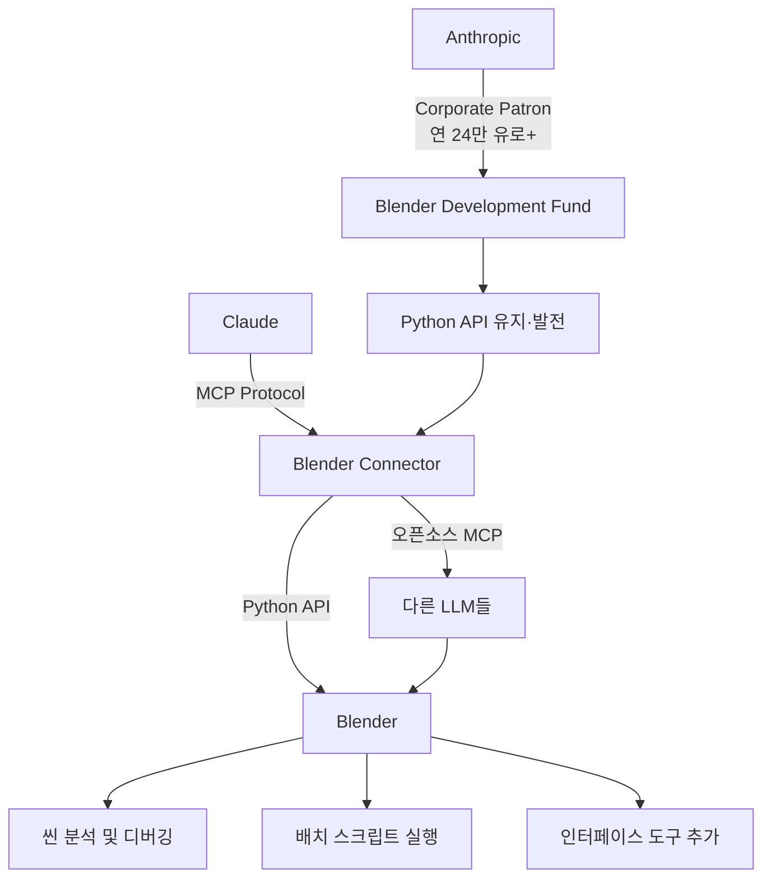
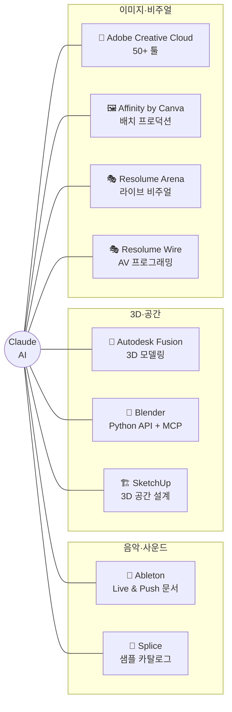
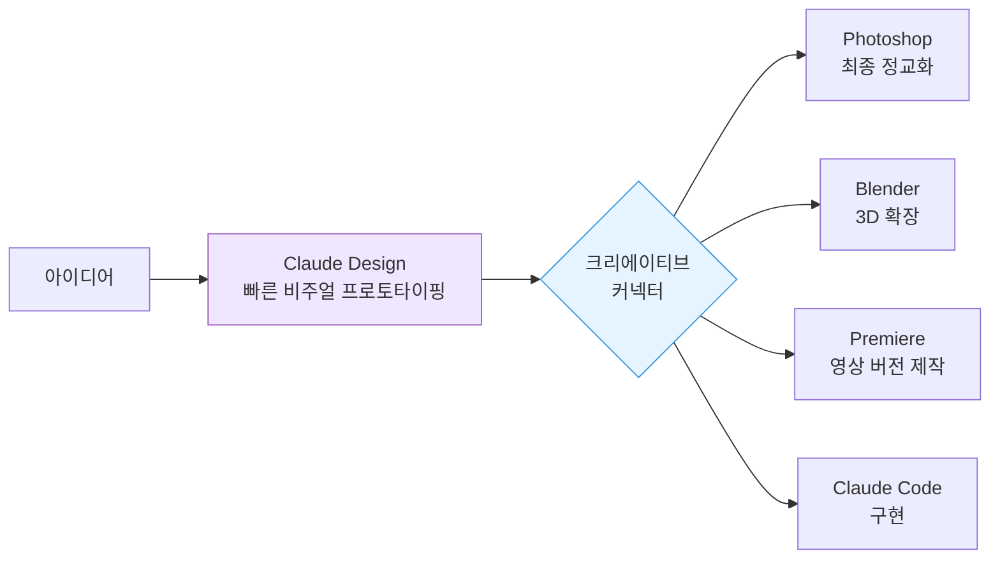
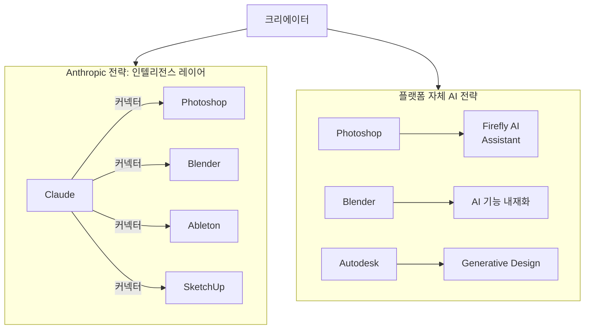

## Photoshop · Blender · Ableton 통합 커넥터 9종 완전 분석

---
## 관련글
[**Claude now plugs directly into Photoshop, Blender, and Ableton to automate creative workflows**](https://startupfortune.com/claude-now-plugs-directly-into-photoshop-blender-and-ableton-to-automate-creative-workflows/)

[**Claude for Creative Work: AI가 크리에이티브 소프트웨어 안으로 들어오다**](https://k82022603.github.io/posts/claude-for-creative-work-ai%EA%B0%80-%ED%81%AC%EB%A6%AC%EC%97%90%EC%9D%B4%ED%8B%B0%EB%B8%8C-%EC%86%8C%ED%94%84%ED%8A%B8%EC%9B%A8%EC%96%B4-%EC%95%88%EC%9C%BC%EB%A1%9C-%EB%93%A4%EC%96%B4%EC%98%A4%EB%8B%A4/)

## 1. 발표의 배경과 맥락

2026년 4월 28일, Anthropic은 크리에이티브 소프트웨어 업계를 향해 선명한 전략적 신호를 보냈다. Adobe Creative Cloud, Blender, Ableton Live, Autodesk Fusion, Splice, SketchUp, Affinity by Canva, Resolume Arena·Wire — 전문 크리에이터들이 매일 사용하는 바로 그 도구들에 Claude가 직접 연결되는 9개의 커넥터를 한꺼번에 공개한 것이다.

이 발표가 단순한 통합(integration) 소식 이상의 의미를 갖는 이유는 그것이 내포한 전략적 방향성 때문이다. Anthropic이 스스로 표현한 목표는 이렇다. "Claude는 취향이나 상상력을 대체할 수 없다. 그러나 새로운 작업 방식을 열어줄 수 있다." 이 문장 하나가 이번 발표의 본질을 담고 있다. Claude를 크리에이티브 대체재로 포지셔닝하는 것이 아니라, 전문가의 기존 워크플로우 안에 AI가 녹아드는 '생산성 레이어(productivity layer)'로 만들겠다는 선언이다.

타이밍도 의미심장하다. 불과 며칠 전 Anthropic은 Claude Opus 4.7을 일반 출시했고, 이와 동시에 Claude Design이라는 비주얼 프로토타이핑 제품을 리서치 프리뷰로 선보였다. Claude Design은 출시 당일 Figma 주가를 7% 끌어내릴 만큼 시장에 충격을 줬는데, 이번 크리에이티브 커넥터 발표는 그 연장선상에서 정반대 방향의 시장을 공략한다. Claude Design이 "디자인을 모르는 사람도 빠르게 결과물을 만들도록" 돕는다면, 크리에이티브 커넥터는 "이미 툴을 완벽히 아는 전문가들의 반복적이고 기술적인 작업을 덜어주기" 위한 것이다.

Anthropic의 연간 반복 수익(ARR)은 이미 300억 달러를 넘어섰고, Claude Code 단독으로도 25억 달러 이상의 ARR을 기록했다는 보도가 나오는 시점에서, 이번 크리에이티브 커넥터 발표는 Anthropic이 개발자 시장을 넘어 디자인·음악·3D·영상이라는 광대한 크리에이티브 전문직 시장에 본격적으로 진입하겠다는 의지 표명으로 읽힌다.

---

## 2. 커넥터란 무엇인가 — MCP와의 관계

본격적인 각 커넥터 분석에 앞서, '커넥터(Connector)'가 무엇인지부터 짚고 넘어갈 필요가 있다. Anthropic의 정의에 따르면 커넥터는 "Claude가 외부 플랫폼과 도구에 직접 접근하고 작업을 수행하도록 하는 도구"다. 다시 말해, 채팅창에서 아이디어를 나누는 데 그치는 것이 아니라 실제 소프트웨어 안에서 데이터를 읽고, 명령을 실행하고, 결과물을 생성하는 수준의 연결이다.

이 커넥터들의 기술적 기반은 MCP(Model Context Protocol)다. MCP는 Anthropic이 주도하여 오픈 표준으로 공개한 프로토콜로, 서로 다른 소프트웨어 간에 AI 모델이 컨텍스트를 공유하고 도구를 호출할 수 있는 표준화된 방식을 제공한다. 특히 이번 Blender 커넥터의 경우, MCP 기반으로 제작되었기 때문에 Claude뿐만 아니라 다른 LLM들도 동일한 커넥터를 통해 Blender에 접근할 수 있다는 점이 강조되었다. 이는 Blender 측의 오픈소스 철학과도 맞닿아 있다.

크리에이티브 커넥터가 제공하는 기능은 크게 다섯 가지 카테고리로 정리된다.

첫째, **복잡한 툴에 대한 튜터링** — 공식 문서를 기반으로 소프트웨어 사용법을 맥락에 맞게 설명한다.  
둘째, **스크립트·플러그인 작성** — 소프트웨어의 API를 활용해 자동화 코드를 직접 생성하고 적용한다.  
셋째, **포맷 변환 및 데이터 재구조화** — 파일 형식 변환이나 에셋 정리 작업을 처리한다.  
넷째, **반복적인 프로덕션 작업 자동화** — 배치 처리, 프로젝트 스캐폴딩 설정, 씬 전체에 걸친 절차적 변경 등을 수행한다.  
다섯째, **Claude Design과의 연계** — 비주얼 프로토타이핑 결과물을 전문 툴로 넘겨 정교화한다.

---

## 3. 9개 커넥터 상세 분석

### 3.1 Adobe for Creativity — 가장 광대한 커넥터

이번 발표에서 가장 큰 주목을 받을 커넥터는 단연 Adobe다. Photoshop, Premiere Pro, Express, Illustrator, Firefly, Lightroom, InDesign, Stock을 포함해 Creative Cloud의 50개 이상 도구에 Claude가 접근할 수 있게 된다.

단순히 "Photoshop에 Claude가 연결된다"는 말로는 이 커넥터의 가치를 제대로 표현하기 어렵다. Creative Cloud는 사실상 그 자체가 하나의 크리에이티브 생태계다. 브랜드 캠페인 에셋을 Photoshop에서 작업하고, Premiere로 영상 편집하고, Lightroom으로 사진을 보정하고, InDesign으로 인쇄물을 만드는 일련의 워크플로우가 Claude라는 단일 인터페이스를 통해 조율될 수 있다는 뜻이다.

실용적인 시나리오를 상상해보면 이렇다. 마케터가 Claude에게 "이 제품 이미지로 인스타그램용, 유튜브 썸네일용, 배너 광고용 에셋을 각각 만들어줘"라고 요청하면, Claude가 Photoshop의 다양한 기능을 오케스트레이션하여 각각의 규격에 맞는 결과물을 생성하는 멀티스텝 작업을 처리할 수 있다.

다만 이 지점에서 전략적 긴장감도 존재한다. Adobe는 이달 같은 시기에 자사의 AI 어시스턴트인 Firefly AI Assistant를 발표하면서, Creative Cloud 사용자들을 Adobe 자체 AI 생태계 안에 묶어두려는 시도를 동시에 진행하고 있다. Claude 커넥터를 허용하면서도 동시에 자체 AI를 강화하는 Adobe의 전략은, AI 시대 플랫폼 기업들이 택하는 전형적인 헤징(hedging) 전략이다.

### 3.2 Blender — 기술적으로 가장 주목할 커넥터

Blender 커넥터는 이번 발표에서 기술적으로 가장 흥미로운 케이스다. Blender 개발팀이 직접 MCP 커넥터를 제작했으며, Claude는 Blender의 Python API를 자연어 인터페이스로 활용할 수 있게 된다.

구체적으로 3D 아티스트가 할 수 있는 일들을 살펴보면, 복잡한 Blender 씬 전체를 분석하고 디버깅하는 것이 가능해진다. 씬 안의 여러 오브젝트에 일괄적으로 변경사항을 적용하는 배치 스크립트를 자연어로 요청해 생성받을 수 있으며, Blender Python API를 통해 Blender 인터페이스에 완전히 새로운 도구를 직접 추가하는 것까지 가능하다.

이 커넥터가 특별한 이유는 또 있다. 앞서 언급했듯 MCP 기반이기 때문에 Claude만이 아닌 다른 LLM들도 이 커넥터를 활용할 수 있다. 이는 Blender의 오픈소스 철학이 AI 에코시스템에서도 그대로 구현된 것이며, 특정 AI 벤더에 종속되지 않겠다는 Blender 재단의 입장을 명확히 한다.

Anthropic은 단순한 파트너십을 넘어 **Blender Development Fund의 Corporate Patron**으로 참여했다는 사실도 공식 발표했다. Blender 재단에 따르면 Corporate Patron 티어는 연간 최소 24만 유로(약 3억 5천만 원)의 후원이 요구되는 최고 등급이다. 현재 Epic Games, Netflix, Wacom이 같은 티어에 있다. Anthropic의 자금 지원은 Blender의 Python API를 유지·발전시키는 데 전용된다는 점도 명시되었는데, 이는 자사 커넥터의 기술적 기반을 직접 투자로 강화하는 전략적 행보다.

### 3.3 Ableton — 음악 프로듀서를 위한 깊은 문서화

Ableton 커넥터는 이번 발표에서 가장 명확하게 범위를 정의한 케이스다. Claude의 답변을 Ableton Live와 Push의 공식 제품 문서에 근거해 제공하는 방식으로 동작한다.

이것이 왜 가치 있냐는 질문에 대한 답은 음악 프로덕션의 특성에서 찾을 수 있다. 음악 제작 중에는 집중의 흐름(flow)이 절대적으로 중요하다. 특정 이펙트를 어떻게 설정하는지, Midi Routing 구조를 어떻게 잡아야 하는지, Push의 특정 기능을 어떻게 활용하는지 궁금할 때 매뉴얼을 뒤지거나 유튜브를 검색하면 그 흐름이 깨진다. Ableton 커넥터는 바로 그 순간, 공식 문서에 근거한 정확한 답을 워크플로우를 떠나지 않고 받을 수 있게 해준다.

이 커넥터는 단순한 FAQ 검색을 넘어 더 깊은 작업에도 유용하다. 어레인지먼트 전략에 대한 조언을 구하거나, 특정 이펙트 체인이 음향적으로 의도한 방향과 맞는지 확인하거나, Live의 복잡한 Midi 기능 조합을 탐색하는 데 도움이 된다.

### 3.4 Splice — 샘플 라이브러리 검색의 통합

Splice는 음악 프로듀서들이 사용하는 로열티 프리 샘플 플랫폼이다. 이 커넥터를 통해 프로듀서들은 Claude를 떠나지 않고도 Splice의 방대한 샘플 카탈로그를 직접 검색할 수 있다.

실제 작업 흐름에서 이 커넥터의 활용은 Ableton 커넥터와 연계될 때 더욱 강력해진다. 예를 들어, 음악 프로듀서가 "이 트랙의 드롭에 어울리는 퍼커션 샘플 찾아줘"라고 요청하면 Splice에서 샘플을 검색하고, 이를 Ableton으로 임포트해 작업을 이어가는 멀티툴 워크플로우가 Claude 내에서 컨텍스트 스위칭 없이 이루어질 수 있다.

### 3.5 Autodesk Fusion — 3D 모델링의 자연어 인터페이스

Fusion 구독자는 이제 대화를 통해 3D 모델을 생성하고 수정할 수 있다. 제품 디자이너나 엔지니어가 "이 브라켓의 두께를 2mm 늘리고 모서리에 필렛을 추가해줘"처럼 자연어로 요청하면 Fusion 안에서 실제 모델이 변경된다.

이 커넥터가 가져올 변화는 특히 초기 프로토타이핑 단계에서 두드러질 것으로 예상된다. 지금까지 3D 모델링은 높은 진입 장벽 때문에 전문가가 아니면 쉽게 접근하기 어려웠다. 자연어 인터페이스는 그 장벽을 낮춰, 아이디어 단계에서 빠르게 형태를 잡는 것을 가능하게 한다.

### 3.6 SketchUp — 공간 개념을 3D 출발점으로

SketchUp 커넥터는 건축가, 인테리어 디자이너, 도시 계획가들에게 특히 유용하다. 방의 레이아웃, 가구 개념, 부지 계획에 대한 텍스트 설명을 3D 모델의 시작점으로 전환하여 SketchUp에서 바로 열어 정교화할 수 있는 형태로 제공한다.

예를 들어 "35평 아파트, 거실 남향, 주방과 식당 오픈 플랜, 방 3개"라고 설명하면 그에 맞는 기본 3D 구조를 SketchUp에서 열 수 있는 파일로 만들어주는 방식이다. 처음부터 빈 캔버스에서 시작하는 것과 개념 스케치가 이미 3D로 표현된 상태에서 시작하는 것은 생산성에서 큰 차이를 낳는다.

### 3.7 Affinity by Canva — 배치 작업과 커스텀 기능

Affinity 제품군(Photo, Designer, Publisher)을 인수한 Canva와의 협력으로 만들어진 이 커넥터는 반복적인 프로덕션 작업에 초점을 맞춘다. 배치 이미지 조정, 레이어 이름 변경, 파일 내보내기 같은 작업을 자동화하고, 앱 안에 커스텀 기능을 직접 생성하는 것도 가능하다.

대형 에이전시나 브랜드 팀이라면 이 커넥터의 가치를 즉시 파악할 것이다. 100개의 소셜 미디어 에셋에 동일한 색상 보정을 적용하거나, 수십 개의 레이어를 일관된 명명 규칙으로 정리하는 작업은 기술적으로는 단순하지만 시간을 크게 소모하는 일이다.

### 3.8 Resolume Arena & Wire — 라이브 퍼포먼스의 실시간 제어

Resolume는 VJ(Visual Jockey)와 라이브 비주얼 아티스트들이 쓰는 소프트웨어다. Arena는 라이브 비주얼 믹싱 도구이고, Wire는 비주얼 프로그래밍 환경이다. 이 두 커넥터는 Claude를 통해 자연어로 라이브 퍼포먼스 비주얼 시스템을 실시간 제어할 수 있게 한다.

라이브 공연의 특성상 이 커넥터의 가치는 명확하다. 쇼가 진행되는 동안 복잡한 메뉴를 탐색하거나 집중을 끊을 수 없다. 자연어 명령으로 비주얼 레이어를 조정하고 효과를 바꿀 수 있다면, 그 즉각성은 퍼포먼스의 질에 직접적으로 기여한다.

---

## 4. 커넥터 전체 조감

| 커넥터 | 핵심 가치 | 주요 사용자 |
|---|---|---|
| Adobe for Creativity | 50+ Creative Cloud 툴 오케스트레이션 | 디자이너, 마케터, 영상 편집자 |
| Ableton | 공식 문서 기반 정확한 기술 지원 | 음악 프로듀서 |
| Splice | 샘플 카탈로그 통합 검색 | 음악 프로듀서, 사운드 디자이너 |
| Autodesk Fusion | 자연어 3D 모델 생성·수정 | 제품 디자이너, 엔지니어 |
| Blender | Python API 자연어 인터페이스, MCP 오픈 표준 | 3D 아티스트, 인디 게임 개발자 |
| SketchUp | 텍스트 설명 → 3D 출발점 | 건축가, 인테리어 디자이너 |
| Affinity by Canva | 배치 작업 자동화, 커스텀 기능 생성 | 에이전시 디자이너, 브랜드 팀 |
| Resolume Arena | 라이브 비주얼 실시간 자연어 제어 | VJ, 라이브 비주얼 아티스트 |
| Resolume Wire | AV 비주얼 프로그래밍 자연어 인터페이스 | VJ, 인터랙티브 설치 아티스트 |

---

## 5. Claude Design와의 연계 — 양방향 크리에이티브 전략

이번 커넥터 발표를 이해하려면 같은 달 출시된 Claude Design과의 관계를 함께 봐야 한다. 두 제품은 크리에이티브 워크플로우의 서로 다른 단계를 겨냥하며, 양방향에서 전문 크리에이터를 감싸는 구조를 형성한다.

Claude Design은 Claude Opus 4.7의 비전 기능을 활용해 대화를 통해 디자인, 프로토타입, 슬라이드, 마케팅 소재를 생성하는 비주얼 프로토타이핑 도구다. Pro, Max, Team, Enterprise 플랜 사용자를 위한 리서치 프리뷰로 제공되며, 텍스트 프롬프트로 시작해 인라인 코멘트와 조정 노브로 정교화할 수 있다. 최종 결과물은 Canva, PDF, PPTX, 또는 독립 HTML 파일로 내보내거나, 그대로 Claude Code로 넘겨 구현할 수 있다.

두 제품의 관계를 도식화하면 이렇다.

비전문 디자이너(PM, 마케터, 창업자)는 Claude Design에서 초안을 잡고, 전문 디자이너는 그 결과물을 Photoshop이나 Affinity에서 받아 완성도를 높인다. 3D 아티스트는 SketchUp에서 받은 기본 구조를 Blender로 가져가 작업한다. Anthropic은 이 두 제품을 통해 크리에이티브 파이프라인의 앞단(아이디어→초안)과 뒷단(초안→전문 완성본)을 동시에 장악하려는 것이다.

---

## 6. 멀티툴 워크플로우 — 커넥터 연결의 가능성

이번 발표에서 가장 흥미로운 가능성은 여러 커넥터를 연결해 사용하는 멀티툴 워크플로우다. 현재는 각 커넥터가 독립적으로 동작하지만, 향후 연계가 깊어질수록 다음과 같은 시나리오가 현실화된다.

**음악 프로듀서 시나리오:** Claude 안에서 Splice 커넥터로 샘플을 탐색·선택하고, Ableton 커넥터를 통해 그 샘플을 현재 프로젝트에 임포트하며, 어레인지먼트 구조에 대한 조언까지 한 번의 대화 흐름 안에서 모두 처리한다. 지금까지 이 작업은 Splice 브라우저, Ableton, 별도의 검색 탭을 오가며 컨텍스트를 지속적으로 전환해야 했다.

**3D 아티스트 시나리오:** SketchUp에서 개념적인 공간 구조를 대화로 잡고, 이를 Blender로 가져와 세부 모델링을 진행하며, Blender Python API를 활용해 씬 전체에 조명과 재질을 배치 적용한다.

**브랜드 팀 시나리오:** Claude Design에서 캠페인 시안 여러 방향을 빠르게 생성하고, 확정된 방향을 Adobe 커넥터를 통해 Photoshop, Illustrator, Premiere에서 각각의 포맷에 맞게 최종 생산한다.

---

## 7. 전략적 의미 — "기능"이 아닌 "레이어"가 되는 것

이번 발표의 전략적 함의를 이해하기 위해서는 Anthropic이 자신을 어떻게 포지셔닝하려는지를 봐야 한다. 핵심은 Claude를 "크리에이티브 툴 안의 하나의 기능"이 아니라 "여러 크리에이티브 툴을 아우르는 인텔리전스 레이어"로 만들겠다는 것이다.

이 전략은 경쟁사들의 접근법과 명확히 구별된다. Adobe는 Firefly AI Assistant를 통해 자사 생태계 내에 AI를 통합하고, Autodesk는 자체 Generative Design 기능을 강화한다. 각 플랫폼은 자기 제품 안에 AI를 넣는 방식으로 경쟁한다. 반면 Anthropic의 전략은 각 플랫폼의 위 또는 사이에 서서, 사용자가 어떤 툴을 쓰든 Claude가 그 중간을 연결하는 허브가 되는 것이다.

이 전략이 성공하면 Anthropic은 크리에이티브 전문가들의 일상적인 작업 흐름 안에 자리잡게 된다. 실패하면 각각의 플랫폼이 자체 AI 기능을 강화하면서 Claude의 개입 여지가 줄어든다. Adobe의 이중 전략(Claude 커넥터 허용 + Firefly AI Assistant 출시)이 바로 이 긴장 관계의 현재 표현이다.

경쟁 구도를 정리하면 이렇다.

---

## 8. 교육 파트너십 — 미래 전문가 세대 선점

Anthropic은 이번 발표와 함께 예술·디자인 대학과의 교육 파트너십도 공개했다. 현재 확정된 세 곳은 미국 로드아일랜드 스쿨 오브 디자인(RISD)의 Art and Computation 프로그램, 링링 칼리지 오브 아트 앤드 디자인의 Fundamentals of AI for Creatives, 그리고 영국 골드스미스 대학교의 MA/MFA Computational Arts 프로그램이다.

학생과 교수진은 Claude 및 새로운 크리에이티브 커넥터에 대한 접근 권한을 제공받으며, 이들의 피드백은 Anthropic이 크리에이티브 전문가들의 실제 필요를 파악하는 데 활용된다. 이 파트너십은 단순한 홍보 이상의 의미를 갖는다. 다음 세대의 디자이너, 3D 아티스트, 음악 프로듀서들이 커리어를 시작하는 시점부터 Claude가 작업 환경의 일부로 자리잡도록 하는 장기적 포지셔닝이다.

---

## 9. 모든 플랜에서 즉시 사용 가능

9개 커넥터는 모두 Free, Pro, Max, Team, Enterprise를 포함한 **모든 Claude 플랜에서 즉시 사용 가능**하다. 이는 의미 있는 결정이다. 프리미엄 기능으로 제한하지 않고 전체 사용자 기반에 개방함으로써 빠른 채택과 피드백 수집을 우선시하겠다는 신호다.

커넥터를 사용하기 위해서는 Claude.ai의 커넥터 설정에서 원하는 서비스를 연결하면 된다. 각 커넥터는 해당 소프트웨어의 유효한 구독이 필요한 경우도 있으며(예: Autodesk Fusion 구독), Adobe의 경우 Creative Cloud 계정이 필요하다.

---

## 10. 남은 과제와 전망

이번 발표가 가져오는 가능성만큼 현실적으로 해결해야 할 과제들도 존재한다. 전문 크리에이티브 팀이 이 커넥터들을 실제 프로덕션 파이프라인에 통합하려면 다음 질문들에 답이 필요하다.

**인가(Authorization) 세분화:** AI가 파일을 변경하거나 에셋을 생성할 때, 어떤 수준의 접근 권한을 부여할 것인지 세밀한 제어가 필요하다. 특히 팀 환경에서는 누가 AI에게 무엇을 허용할 수 있는지에 대한 명확한 거버넌스가 요구된다.

**감사 로그(Audit Log):** 모델이 실행한 변경사항을 추적하고 기록하는 기능은 전문 작업 환경에서 필수적이다. 어떤 명령으로 어떤 파일이 어떻게 변경되었는지 추적할 수 없다면, 오류 발생 시 복구가 어렵다.

**롤백 메커니즘:** AI가 잘못된 배치 변경을 적용했을 때 되돌릴 수 있는 안정적인 메커니즘이 없으면, 전문 작업 환경에서의 신뢰를 쌓기 어렵다.

**도메인 특화 정밀도:** Photoshop 레이어 구조나 Blender 씬의 복잡성을 실제 전문가 수준으로 이해하고 처리할 수 있는지는 실제 사용 데이터가 쌓여야 검증된다.

Anthropic의 다음 행보로는 Claude Design과 크리에이티브 커넥터 간 통합 심화, 더 많은 창작 교육 기관으로의 파트너십 확대, Blender MCP 패턴을 기반으로 한 추가 오픈소스 툴 연결이 예상된다. 궁극적으로 이 모든 움직임은 하나의 질문에 대한 Anthropic의 답이다. AI 시대에 크리에이티브 전문가의 생산성 레이어는 누가 가져가는가.

---

*작성일: 2026년 4월 29일*
