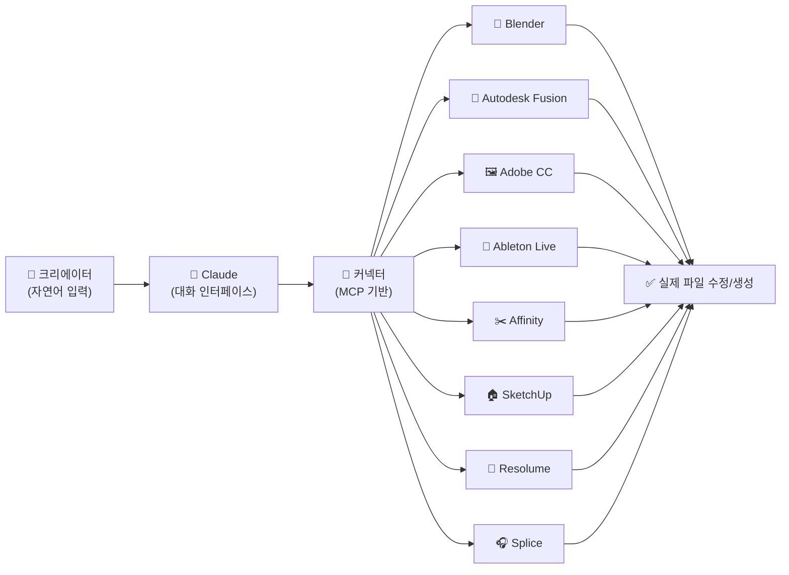
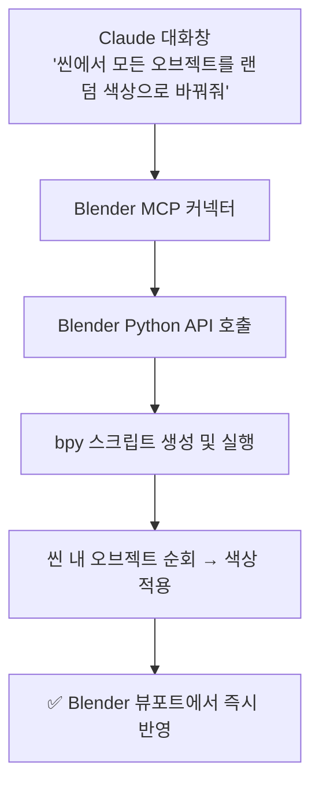
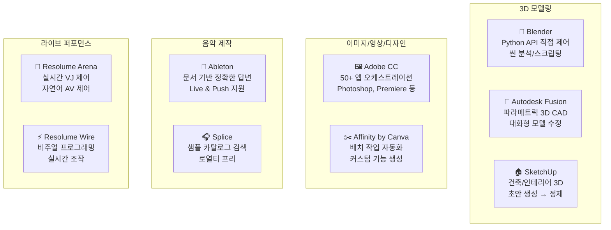
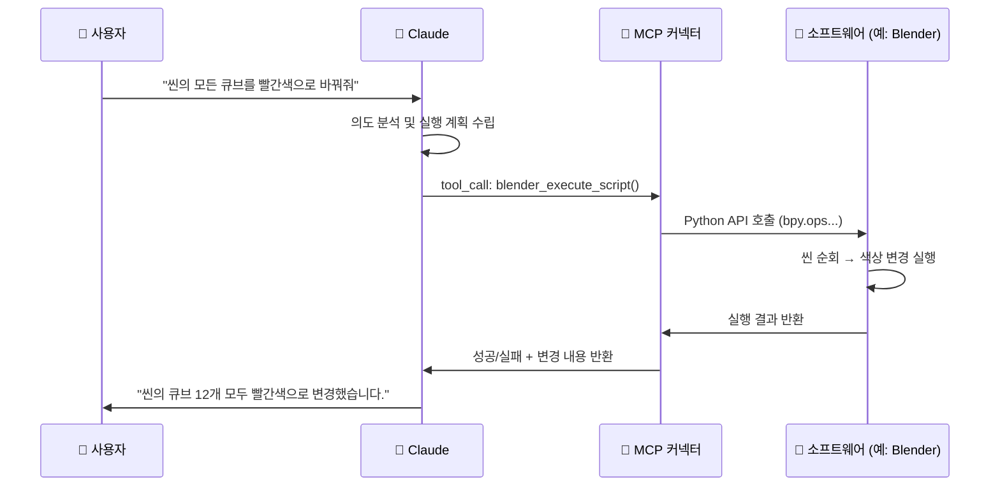
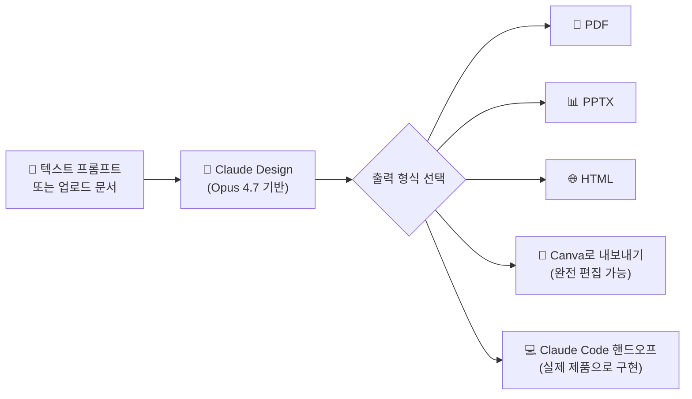
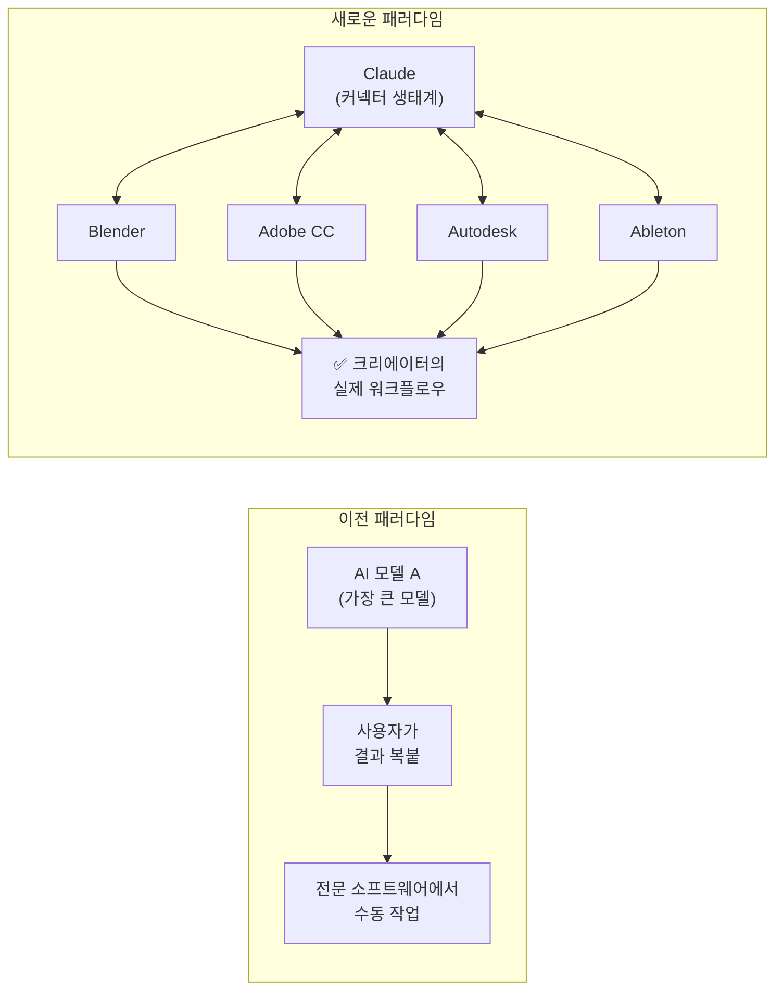

> **발표일**: 2026년 4월 28일 | **출처**: [Anthropic 공식 블로그](https://www.anthropic.com/news/claude-for-creative-work)  
> **문서 작성**: 2026년 4월 29일

---

>
>앤트로픽이 Claude에 블렌더(Blender), 오토데스크 퓨전, 어도비 크리에이티브 클라우드 등 주요 창작 소프트웨어를 직접 제어할 수 있는 기능을 출시했습니다.
>
>이전에도 외부 앱을 연결하는 'MCP'를 통해 사용이 가능했지만, 이번 업데이트는 클로드에 직접 내재되어 코딩을 전혀 모르는 일반인도 즉시 사용할 수 있게 되었습니다.
>
>이제는 "2층짜리 카페 3D 모델을 만들어줘"라고 대화창에 치기만 하면, 클로드가 연동된 프로그램을 알아서 움직여 작업물을 수정하고 완성할 수 있게 되었습니다.
>
>https://www.threads.com/@choi.openai/post/DXrwwJaAr3K
>
>
>Claude一口气接入了8个创意行业的顶级工具，Blender，Adobe，Autodesk，Ableton，Splice，Canva，SketchUp，Resolume。
>
>它不再是让你在聊天框里生成东西，再导出到软件里修改，而是直接钻进你每天打开8小时的软件内部，帮你调试场景，批量修改物体，写自定义脚本，处理所有你不想做的重复性劳动。
>
>以前的AI是让你换个地方工作，现在的AI是跑到你的工位上帮你干活。
>
>这标志着AI正式进入工具原生时代，它的下一个战场再也不是谁的模型更大，而是谁能无缝嵌入普通人的真实工作流。
>
>我认为对所有创作者来说，学会用好这些连接器，比追任何新出的大模型都重要。
>
>https://x.com/ayi_ainotes/status/2049184029157765397
>

## 목차

1. [개요: 무엇이 달라졌는가](#1-개요-무엇이-달라졌는가)
2. [커넥터란 무엇인가](#2-커넥터란-무엇인가)
3. [9개 커넥터 전체 분석](#3-9개-커넥터-전체-분석)
4. [기술 아키텍처: MCP 기반 설계](#4-기술-아키텍처-mcp-기반-설계)
5. [Claude의 창작 활용 5가지 방식](#5-claude의-창작-활용-5가지-방식)
6. [Claude Design: 함께 이해해야 할 병행 출시](#6-claude-design-함께-이해해야-할-병행-출시)
7. [교육 기관과의 협력](#7-교육-기관과의-협력)
8. [산업적 의미: 왜 중요한가](#8-산업적-의미-왜-중요한가)
9. [크리에이터의 관점: 기회와 우려](#9-크리에이터의-관점-기회와-우려)
10. [AI 오케스트레이션의 창작 영역 진입](#10-ai-오케스트레이션의-창작-영역-진입)

---

## 1. 개요: 무엇이 달라졌는가

2026년 4월 28일, Anthropic은 "Claude for Creative Work"라는 이름으로 창작 산업 전반을 겨냥한 대규모 업데이트를 발표했다. 이번 발표의 핵심은 간단하지만 의미는 결코 단순하지 않다. Claude가 대화창 안에 머무르지 않고, 크리에이터들이 이미 매일 사용하는 소프트웨어 **안으로** 직접 들어간다는 것이다.

Anthropic은 Blender, Autodesk, Adobe, Ableton, Splice를 포함한 파트너 연합과 함께 총 **9개의 커넥터**를 동시에 출시했다. 커넥터는 Claude가 외부 플랫폼과 도구에 직접 접근할 수 있게 하는 기능으로, 이제 Claude는 단순히 "정보를 주는 AI"가 아니라 실제 소프트웨어를 조작하고 작업물을 생성·수정·완성하는 **행위자(agent)** 로 기능한다.

Anthropic이 공식 블로그에 남긴 문장은 이 업데이트의 철학을 압축적으로 담고 있다.

> *"Claude can't replace taste or imagination, but it can open up new ways of working."*  
> (Claude는 취향이나 상상력을 대체할 수 없지만, 완전히 새로운 작업 방식을 열 수 있다.)

이 선언은 단순한 마케팅 문구가 아니다. Anthropic은 AI가 창작자를 대체하는 것이 아니라, 창작자가 더 빠르고 더 야심차게 일할 수 있도록 뒷받침하는 역할을 명확히 설정하고 있다. 반복적인 수작업, 도구 간 수동 전환, 복잡한 스크립트 작성 같은 "창의성을 소모하는 작업들"을 Claude가 대신 처리하도록 한다는 구상이다.

---

## 2. 커넥터란 무엇인가

커넥터를 이해하기 위해서는 먼저 이전 방식과의 차이를 이해해야 한다. 이전까지도 Claude를 Blender나 Adobe 같은 소프트웨어와 연결하는 것은 가능했다. MCP(Model Context Protocol)를 통해 외부 앱을 연결하면 됐다. 하지만 이 방식에는 치명적인 진입 장벽이 있었다. MCP 서버를 직접 설치하고, JSON 설정 파일을 편집하고, 환경변수를 잡아주는 등 일정 수준의 개발 지식이 필요했다. 일반 크리에이터에게는 현실적으로 접근하기 어려운 영역이었다.

이번 업데이트는 그 장벽을 완전히 낮춘다. Claude의 커넥터 디렉토리에서 원하는 소프트웨어 커넥터를 클릭 몇 번으로 설치하면, 이후 코드 한 줄 몰라도 Claude와 해당 소프트웨어가 직접 대화한다. Blender를 열어놓고 Claude에게 "씬에 있는 모든 오브젝트의 재질을 금속으로 바꿔줘"라고 입력하면, Claude가 Blender의 Python API를 통해 실제로 그 작업을 수행한다.

커넥터의 작동 방식은 기술적으로는 MCP 프로토콜에 기반하지만, 사용자 경험 측면에서는 마치 Claude.ai 안에 내장된 기능처럼 작동한다. 별도의 서버 없이, 별도의 설정 없이, Claude 인터페이스에서 바로 연결된다. 이것이 이번 업데이트가 "MCP를 통해 이미 가능했던 것"과 근본적으로 다른 이유다.

---

## 3. 9개 커넥터 전체 분석

Anthropic이 이번에 동시 출시한 커넥터는 총 9개다. (Resolume가 Arena와 Wire로 나뉘어 있어 10개로 세기도 하지만, Anthropic은 공식적으로 9개 커넥터로 분류한다.) 각각의 도구와 기능을 상세히 살펴보자.

---

### 3.1 Blender

Blender는 인디 게임 개발부터 건축 시각화, 영화 제작까지 광범위한 산업에서 사용되는 무료 오픈소스 3D 제작 도구다. Blender 개발팀이 직접 MCP 커넥터를 제작했으며, 이번에 Claude 공식 커넥터로 출시됐다.

이 커넥터가 제공하는 기능은 크게 세 가지다. 첫째, Blender 씬 전체를 분석하고 디버깅하는 것이 가능하다. 복잡한 modifier 스택이나 node 구성을 Claude에게 설명해달라고 하면, Claude는 해당 씬을 직접 분석하여 무엇이 어떻게 연결되어 있는지 설명한다. 둘째, 씬 내 오브젝트에 변경 사항을 일괄 적용하는 커스텀 스크립트를 작성하고 실행할 수 있다. 예를 들어 100개의 오브젝트에 동일한 재질 설정을 적용하거나, 특정 조건에 맞는 오브젝트만 선택적으로 수정하는 작업이 가능하다. 셋째, Blender의 Python API를 통해 Blender 인터페이스에 새로운 도구를 직접 추가할 수 있다.

특히 주목할 만한 점은 **Anthropic이 Blender Development Fund에 패트론으로 참여**하기로 했다는 것이다. 단순한 파트너십을 넘어 Blender의 오픈소스 생태계 자체를 재정적으로 지원하겠다는 선언이다. 또한 Blender 커넥터는 MCP 기반으로 구축되어 있어 Claude 외 다른 LLM에서도 사용 가능하다. Blender의 오픈소스 철학과 상호 운용성에 대한 헌신이 반영된 설계다.

---

### 3.2 Autodesk Fusion

Autodesk Fusion은 3D CAD/CAM/CAE 소프트웨어로, 기계공학, 제품 디자인, 제조업 분야에서 널리 사용된다. Fusion 구독자라면 이제 Claude와의 대화를 통해 3D 모델을 생성하고 수정할 수 있다.

Autodesk는 이 연동을 위해 두 가지 기술 레이어를 제공한다. **Autodesk Assistant**는 AI를 Fusion 내부에 직접 통합하여 사용자가 현재 작업 중인 컨텍스트를 이해하고 워크플로우 내에서 행동을 취할 수 있도록 한다. **Fusion Model Context Protocols(MCPs)** 는 제3자 AI 시스템이 Fusion에 연결하여 설계 컨텍스트에 접근하고 보안적으로 작업을 수행할 수 있게 하는 인프라다.

실용적인 측면에서 보면, 엔지니어나 제품 디자이너가 복잡한 Fusion 인터페이스를 모두 숙달하지 않아도 자연어로 "이 부품의 두께를 5mm에서 8mm로 변경하고, 필렛을 추가해줘"와 같이 요청할 수 있다. Fusion은 파라메트릭 모델링을 기반으로 하므로 Claude가 파라미터를 변경하면 연관된 모든 형상이 자동으로 업데이트된다.

---

### 3.3 Adobe for Creativity

Adobe 커넥터는 이번 발표 중 아마도 가장 광범위한 영향력을 지닌 것이다. **Creative Cloud의 50개 이상 도구**에 걸쳐 Claude가 이미지, 비디오, 디자인 작업을 수행할 수 있게 한다. Photoshop, Premiere, Express, Illustrator, Firefly, Lightroom, InDesign, Stock 등이 포함된다.

이 커넥터가 특별한 이유는 단일 도구가 아닌 **멀티 앱 워크플로우 오케스트레이션**이 가능하다는 점이다. Claude는 Photoshop에서 이미지를 편집하고, Illustrator에서 벡터 요소를 추가하고, Premiere에서 해당 에셋을 영상에 합성하는 멀티 스텝 작업을 하나의 대화 흐름 안에서 처리할 수 있다. 기존에 크리에이터가 앱을 오가며 수작업으로 처리하던 파이프라인을 Claude가 자동으로 이어준다.

Claude에 Adobe 계정을 연결하면 더 높은 사용 한도, 더 많은 도구 접근, 세션 간 저장 기능을 사용할 수 있다.

---

### 3.4 Affinity by Canva

Affinity는 Canva가 인수한 프로 수준의 크리에이티브 소프트웨어 제품군이다(Affinity Photo, Affinity Designer, Affinity Publisher). 이 커넥터는 두 가지 핵심 기능에 집중한다.

첫째, **반복적인 프로덕션 작업 자동화**다. 배치 이미지 조정, 레이어 이름 변경, 파일 익스포트 같은 작업들을 Claude에게 맡길 수 있다. 예를 들어 수백 개의 이미지에 동일한 색상 보정을 적용하거나, 특정 명명 규칙에 따라 레이어를 재정리하는 것이 가능하다.

둘째, **앱 내 커스텀 기능 생성**이다. Affinity의 API를 통해 Claude가 새로운 기능을 직접 앱에 추가할 수 있다. 이는 사실상 플러그인 개발과 유사한 기능을 코딩 없이 수행할 수 있음을 의미한다.

---

### 3.5 SketchUp

SketchUp은 건축, 인테리어 디자인, 도시 계획 분야에서 폭넓게 사용되는 3D 모델링 도구다. 이 커넥터는 상대적으로 접근하기 쉬운 시나리오에 집중한다. Claude와의 대화로 3D 모델링의 **시작점**을 만드는 것이다.

예를 들어 "30평 아파트 거실 레이아웃을 만들어줘. 소파는 창문 쪽에 배치하고, TV 유닛은 마주보는 벽에 놓아줘"라고 입력하면, Claude가 기본 3D 구조를 생성하고 SketchUp에서 열 수 있는 형태로 전달한다. 이후 세부적인 정제 작업은 SketchUp에서 계속 진행하는 방식이다. 전문가에게도 초안 작업 시간을 획기적으로 단축해주는 효과가 있다.

---

### 3.6 Ableton

Ableton Live와 Push는 전자음악 프로듀서, DJ, 라이브 퍼포먼스 아티스트들이 사용하는 핵심 도구다. Ableton 커넥터는 다른 커넥터들과 약간 다른 방식으로 작동한다. Claude의 응답을 **공식 제품 문서에 근거**하게 만드는 것이 주요 기능이다.

이것이 왜 중요한가? Ableton Live는 기능이 방대하고 워크플로우가 복잡하여, 일반적인 AI가 부정확한 정보를 제공하기 쉬운 도메인이다. 커넥터를 통해 Claude는 Ableton의 공식 문서를 직접 참조하여 정확한 정보를 제공한다. "Live 12에서 미디 클립을 특정 템포로 워핑하는 방법"이나 "Push 3의 특정 버튼 기능" 같은 질문에 더 신뢰할 수 있는 답변이 가능해진다.

---

### 3.7 Resolume Arena & Wire

Resolume는 VJ(Video Jockey)와 라이브 비주얼 아티스트들이 사용하는 전문 소프트웨어다. Arena는 실시간 비디오 믹싱과 라이브 공연용 미디어 서버 소프트웨어이고, Wire는 비주얼 프로그래밍 환경이다.

이 커넥터는 **라이브 퍼포먼스 중 실시간 자연어 제어**라는 매우 구체적인 사용 사례를 지원한다. 공연 중 "레이어 3의 불투명도를 70%로 낮추고, BPM을 128로 맞춰줘"와 같이 말로 지시하면 Claude가 Resolume를 직접 제어한다. 복잡한 매핑 설정을 손으로 건드릴 필요 없이 자연어로 빠르게 조작할 수 있다는 점에서 라이브 퍼포먼스 환경에서 실용적인 가치가 있다.

---

### 3.8 Splice

Splice는 음악 프로듀서들이 가장 많이 사용하는 로열티 프리 샘플 카탈로그 플랫폼이다. 수백만 개의 샘플, 루프, 프리셋을 제공한다.

Splice 커넥터는 Claude와 대화하는 도중 Splice 카탈로그를 직접 검색할 수 있게 한다. "120BPM에 맞는 하우스 뮤직 드럼 루프 찾아줘"라고 하면 Claude가 Splice를 검색하고 결과를 보여준다. Ableton 커넥터와 결합하면 더욱 강력하다. Splice에서 찾은 샘플을 Ableton 세션에 바로 불러오는 워크플로우가 가능해진다.

---

### 커넥터 전체 비교 요약

---

## 4. 기술 아키텍처: MCP 기반 설계

이번 커넥터 시스템의 기술적 기반은 **MCP(Model Context Protocol)** 다. MCP는 Anthropic이 2024년 오픈소스로 공개한 표준 프로토콜로, AI 모델과 외부 도구 사이의 통신을 표준화한다. Claude뿐 아니라 다른 LLM들도 MCP를 통해 동일한 도구들과 통신할 수 있다.

이 아키텍처의 핵심적인 의미는 세 가지다.

첫째, **개방성**이다. MCP 기반이기 때문에 Claude 외의 AI 모델도 동일한 커넥터를 사용할 수 있다. Blender 커넥터가 대표적인 예다. Anthropic은 이 점을 명시적으로 강조하며, Blender의 오픈소스·상호운용성 철학과의 일치를 표명했다.

둘째, **보안성**이다. 커넥터는 소프트웨어의 API 레이어를 통해 통신하므로, 임의적인 시스템 접근이 아닌 명확히 정의된 권한 범위 안에서만 작동한다. Autodesk가 "보안적으로 작업을 수행"이라고 명시한 것도 이 맥락이다.

셋째, **생태계 확장 가능성**이다. 이번에 9개 커넥터로 시작했지만, MCP 프로토콜 위에 쌓이는 에코시스템이 커질수록 더 많은 도구들이 Claude와 연결될 수 있다. Anthropic이 제공하는 커넥터 디렉토리는 이 생태계의 허브 역할을 한다.

---

## 5. Claude의 창작 활용 5가지 방식

Anthropic은 이번 발표에서 Claude를 창작에 활용할 수 있는 구체적인 방식 다섯 가지를 제시했다.

### 5.1 창작 도구 학습 및 숙달

Claude는 복잡한 소프트웨어를 위한 **온디맨드 튜터**로 기능할 수 있다. Blender의 modifier 스택을 설명해달라고 하거나, Ableton의 특정 신디사이제이션 기법을 걸어달라고 하면 Claude가 실제로 그 작업을 보여준다. 유튜브 튜토리얼을 찾아 헤매거나, 공식 문서를 뒤지는 대신 현재 작업 중인 컨텍스트 안에서 즉시 배울 수 있다.

### 5.2 코드로 도구 확장

Claude Code는 이미 사용 중인 소프트웨어를 위한 스크립트, 플러그인, 생성 시스템을 작성한다. 커스텀 쉐이더, 절차적 애니메이션 스크립트, 파라메트릭 모델 생성기를 요청하면 문서화된 코드를 만들어준다. 이 코드는 재사용하고 수정할 수 있는 형태다.

### 5.3 도구 간 파이프라인 연결

Claude는 형식을 변환하고, 데이터를 재구조화하고, 여러 애플리케이션에 걸쳐 에셋을 동기화할 수 있다. 디자인, 3D, 오디오 도구 사이에서 수작업으로 파일을 옮기는 수고 없이 작업 흐름을 유지할 수 있다. 예를 들어 Splice에서 찾은 샘플을 Ableton에 불러오고, Ableton에서 만든 음악을 Adobe Premiere의 영상에 붙이는 전체 파이프라인을 Claude가 조율한다.

### 5.4 빠른 탐색과 핸드오프 가능

Claude Design(별도 항목에서 상세 설명)은 아이디어를 빠르게 시각화하고 다른 도구로 내보낼 수 있는 기반을 제공한다. 아이디어 탐색 단계에서 Claude가 여러 방향을 빠르게 시각화해주면, 크리에이터는 피드백을 주고 선택하는 역할에 집중할 수 있다.

### 5.5 반복적인 프로덕션 작업 처리

에셋 배치 처리, 프로젝트 스캐폴딩 설정, 씬 전반에 걸친 절차적 변경 적용 같은 멀티 스텝 작업을 Claude가 처리한다. 크리에이터가 "하고 싶지 않은 일"을 대신 해주는 것이다. 창의적인 에너지를 정말 중요한 의사결정에 집중할 수 있게 해준다.

---

## 6. Claude Design: 함께 이해해야 할 병행 출시

"Claude for Creative Work" 발표를 완전히 이해하려면 약 10일 전인 2026년 4월 17일에 출시된 **Claude Design**을 함께 이해해야 한다. 두 발표는 사실상 하나의 전략적 그림의 서로 다른 조각이다.

Claude Design은 Anthropic Labs에서 출시한 최초의 공개 제품으로, Claude Opus 4.7을 기반으로 하는 AI 네이티브 시각 디자인 도구다. 텍스트 프롬프트를 입력하면 Claude가 디자인, 프로토타입, 슬라이드, 원페이저 등 시각적 결과물을 만들어준다.

Claude Design의 주요 특징은 다음과 같다.

**코드베이스 인식 디자인 시스템**: GitHub 저장소를 연결하면 Claude가 실제 React 컴포넌트를 읽어 브랜드 색상, 타이포그래피, 컴포넌트 패턴을 자동으로 학습한다. 이후 모든 디자인 작업은 이 디자인 시스템을 자동으로 상속한다.

**Canva와의 긴밀한 파트너십**: Claude Design에서 만든 결과물은 Canva로 직접 내보내 드래그 앤 드롭 편집기에서 완전히 편집 가능한 디자인으로 변환된다. Anthropic과 Canva는 2년간의 협력 관계를 유지해왔으며, 이번 발표는 그 관계의 중요한 심화 단계다.

**Claude Code로의 핸드오프**: 디자인이 완성되면 Claude Code로 바로 전달하여 실제 작동하는 제품으로 구현하는 파이프라인이 가능하다. 아이디어 → 시각 프로토타입 → 실제 코드까지의 전체 사이클이 Anthropic 생태계 안에서 완성된다.

Claude Design은 Pro, Max, Team, Enterprise 구독자에게 기존 요금제 포함으로 제공된다. claude.ai/design에서 접근할 수 있다.

---

## 7. 교육 기관과의 협력

Anthropic은 이번 발표와 함께 **예술·디자인 교육 기관과의 파트너십**도 공개했다. 단순한 소프트웨어 출시를 넘어, 다음 세대의 크리에이터들이 AI를 창작 도구로 자연스럽게 받아들이게 하는 생태계 구축 전략이다.

첫 번째로 협력하는 세 개 교육 기관은 다음과 같다.

- **Rhode Island School of Design (RISD)**: Art and Computation 프로그램
- **Ringling College of Art and Design**: Fundamentals of AI for Creatives 프로그램  
- **Goldsmiths, University of London**: MA/MFA Computational Arts 프로그램

이 기관의 학생과 교수진은 Claude와 새로운 커넥터에 대한 접근권을 받게 된다. Anthropic은 이들의 피드백을 수집하여 크리에이티브 전문가들이 이 도구에서 실제로 무엇을 필요로 하는지 파악하겠다고 밝혔다. 향후 더 많은 교육 기관으로 프로그램을 확장할 계획도 있다.

이 전략의 논리는 단순하다. 오늘의 학생이 내일의 프로 크리에이터다. 이들이 학교에서 AI 도구와 함께 작업하는 방식을 배우면, 산업 전반의 AI 채택 속도는 자연스럽게 높아진다.

---

## 8. 산업적 의미: 왜 중요한가

### 8.1 "AI 네이티브 시대"의 도래

중국 AI 관찰자 ayi_ainotes는 이번 업데이트를 두고 "2026년 현재까지 AI 업계에서 가장 가치 있는 업데이트"라고 평가했다. 이 평가의 근거는 단순히 기능의 추가가 아니라 **AI가 작동하는 방식의 근본적 전환**에 있다.

기존 AI 도구들은 대화창 안에서 결과물을 만들고, 사용자가 그것을 복사해서 전문 소프트웨어로 가져가는 방식이었다. "AI가 만든 것을 소프트웨어로 가져가 수정하는" 구조였다. 이번 업데이트는 이 구조를 뒤집는다. Claude가 직접 소프트웨어 안으로 들어가 작업한다. AI가 사용자의 자리에 함께 앉아서 일하는 방식이다.

ayi_ainotes는 이것을 이렇게 표현했다: "이전의 AI는 당신이 다른 곳에서 일하게 만들었다. 이제의 AI는 당신의 자리에 달려와 일을 도와준다."

### 8.2 플랫폼 전략: 모델 경쟁에서 생태계 경쟁으로

이번 발표는 Anthropic의 전략적 전환을 명확히 보여준다. AI 모델의 성능 경쟁에서, **기존 워크플로우에의 깊은 통합** 경쟁으로의 이동이다.

한 분석가의 표현을 빌리면, "AI의 다음 전쟁터는 누구의 모델이 더 큰가가 아니라, 누가 일반인의 실제 워크플로우에 더 매끄럽게 녹아들 수 있는가"이다. Anthropic은 이 경쟁에서 크리에이티브 소프트웨어 영역을 선점하겠다는 의도를 분명히 했다.

### 8.3 Adobe, Autodesk의 전략적 수용

주목할 만한 점은 Adobe와 Autodesk 같은 기존 창작 소프트웨어 강자들이 Claude와의 통합을 거부하지 않고 적극적으로 협력했다는 것이다. 이들 기업들도 AI 통합을 전략적으로 중요하게 보고 있음을 시사한다.

Adobe의 경우, Creative Cloud 50개 이상의 도구를 Claude에 개방하는 결정은 상당한 용기가 필요한 선택이다. 하지만 역으로 보면, AI를 통한 워크플로우 가속이 Adobe 구독의 가치를 높이는 방향으로 작용한다는 판단이 있었을 것이다. Autodesk도 마찬가지다. Fusion 구독자에게 Claude 연동이라는 추가 가치를 제공함으로써 구독 유지율을 높이는 전략이다.

---

## 9. 크리에이터의 관점: 기회와 우려

### 9.1 기회: 확장된 역량

이번 업데이트가 크리에이터에게 열어주는 가장 명확한 기회는 **역량의 비대칭적 확장**이다. 혼자 작업하는 1인 크리에이터도 이제 3D 모델링, 음악 제작, 영상 편집, 브랜드 디자인을 넘나드는 멀티 디스플린 작업을 더 쉽게 시도할 수 있다.

특히 전문 소프트웨어의 학습 곡선 문제가 완화된다. Blender는 강력하지만 진입 장벽이 높기로 유명하다. Autodesk Fusion의 파라메트릭 모델링 개념은 비전공자에게 난해하다. Claude가 자연어 인터페이스로 이 도구들에 접근하게 해주면, "사용은 할 수 있지만 깊이 파고들 시간이 없었던" 사람들에게도 고급 기능의 문이 열린다.

### 9.2 우려: 노동과 기술의 재편

그러나 창작 업계의 우려도 실재한다. No Film School 같은 영상 제작 커뮤니티 매체는 Adobe-Anthropic 파트너십 소식을 전하며 "솔직히 말하면, 이것은 정확히 그것(AI의 창작 영역 침범)이다"라고 직설적으로 표현했다.

반복적인 작업의 자동화는 해당 작업을 수행하던 인력에게는 위협이 된다. 배치 이미지 처리, 레이어 정리, 프로젝트 스캐폴딩 같은 작업들은 많은 주니어 크리에이터들이 커리어를 시작하는 기초 작업이기도 하다. 이러한 작업들이 자동화되면, 주니어 인력의 일자리가 사라지는 동시에 시니어 레벨로 올라가기 위한 경험의 사다리도 함께 사라질 수 있다.

Anthropic 자신도 이 긴장을 의식한다. "Claude는 취향이나 상상력을 대체할 수 없다"는 공식 문구는 크리에이터들의 불안을 달래기 위한 메시지이기도 하다.

---

## 10. AI 오케스트레이션의 창작 영역 진입

이번 발표를 개발자 및 아키텍처 관점에서 바라보면, 몇 가지 핵심적인 구조적 전환이 눈에 들어온다.

### 10.1 "AI 오케스트레이션 개발"의 확장

필자가 계속 추적해온 "AI 오케스트레이션 개발(AI-Orchestrated Development)" 패러다임이 이제 개발 영역을 넘어 **창작 영역으로 확장**되고 있다. Claude Code가 엔지니어의 코딩 워크플로우 안으로 들어온 것처럼, Claude 커넥터들은 크리에이터의 창작 워크플로우 안으로 들어온다. 핵심 원리는 동일하다. AI가 도구를 오케스트레이션하고, 인간은 방향을 설정하고 판단한다.

바이브 코딩(Vibe Coding)이 개발 영역에서 논란이 됐던 것처럼, 이번 업데이트는 창작 영역에서 유사한 논쟁을 촉발할 것이다. "AI가 Blender를 조작하는 것이 진정한 3D 아트인가?" "Claude가 생성한 음악 아이디어가 창작자의 것인가?" 이런 질문들이 크리에이터 커뮤니티에서 본격적으로 부상할 것으로 예상된다.

### 10.2 MCP 생태계의 전략적 중요성

기술 아키텍처 측면에서 가장 주목할 점은 MCP가 단순한 통합 프로토콜을 넘어 **AI 생태계의 인프라 레이어**로 자리잡아가고 있다는 것이다. Blender 커넥터가 MCP 기반이어서 다른 LLM도 사용할 수 있다는 점은 중요하다. MCP를 설계하고 오픈소스로 공개한 Anthropic은 이 인프라 레이어를 표준화함으로써 경쟁자들도 사용할 수밖에 없는 생태계를 구축했다.

LxM(Ludus Ex Machina) 프로젝트 관점에서도 흥미롭다. AI 모델 간 게임 배틀을 통해 지능을 평가하는 아이디어처럼, 앞으로는 "어떤 AI 모델이 Blender를 더 효과적으로 오케스트레이션하는가"도 AI 역량 평가의 새로운 차원이 될 수 있다. 단순 벤치마크를 넘어선 실제 도구 활용 역량의 비교가 의미 있는 평가 지표로 부상할 것이다.

### 10.3 크리에이터를 위한 커넥터 활용 전략

실용적인 관점에서, 이 커넥터들을 효과적으로 활용하려는 크리에이터들에게 권하는 접근 방식이 있다.

첫째, **한 커넥터를 깊게 파악**하는 것부터 시작해야 한다. 9개 커넥터를 동시에 활용하려 하면 오히려 혼란스럽다. 자신의 주 작업 도구(예: Blender를 주로 쓴다면 Blender 커넥터)에서 시작해 Claude와의 협업 패턴을 익히는 것이 현명하다.

둘째, **반복 작업 목록 작성**이 도움이 된다. 현재 작업에서 시간을 잡아먹지만 창의성을 요하지 않는 반복 작업들을 목록화하고, 그 중 어느 것을 Claude에게 맡길 수 있는지 탐색한다.

셋째, 중국 AI 관찰자의 말처럼, **새로운 대형 모델을 쫓는 것보다 이 커넥터들을 잘 활용하는 방법을 익히는 것이 크리에이터에게 더 중요**하다. 모델의 역량보다 실제 워크플로우에서의 통합 역량이 창작 생산성에 더 직접적인 영향을 미치는 시대가 왔다.

---

## 결론: 도구 원주민 시대의 개막

Anthropic의 "Claude for Creative Work" 발표는 단순한 기능 업데이트가 아니다. 이것은 AI가 창작 소프트웨어 산업에 공식적으로, 그리고 깊이 진입했음을 선언하는 사건이다. Blender, Adobe, Autodesk, Ableton 같은 창작 도구들의 거인들이 AI와의 통합을 전략적으로 수용했다는 사실 자체가 업계의 방향을 읽게 해준다.

커넥터 모델의 가장 중요한 함의는 이것이다. **AI가 더 이상 별도의 공간에 있지 않다**. 크리에이터가 매일 8시간을 보내는 소프트웨어 안에 AI가 들어왔다. 이 변화에 적응하는 크리에이터와 그렇지 못한 크리에이터 사이의 생산성 격차는 앞으로 빠르게 벌어질 것이다.

Anthropic이 스스로 말했듯, Claude는 취향과 상상력을 대체하지 않는다. 그러나 취향과 상상력을 제외한 나머지 작업들에서 Claude는 이제 크리에이터의 자리에 나란히 앉아 있다.

---

**참고 자료**

- [Claude for Creative Work - Anthropic 공식 블로그](https://www.anthropic.com/news/claude-for-creative-work) (2026.04.28)
- [Anthropic releases 9 Claude connectors for creative tools - 9to5Mac](https://9to5mac.com/2026/04/28/anthropic-releases-9-new-claude-connectors-for-creative-tools-including-blender-and-adobe/) (2026.04.28)
- [Claude Gains Integrations With Adobe, Blender, SketchUp - MacRumors](https://www.macrumors.com/2026/04/28/claude-creative-tool-connectors/) (2026.04.28)
- [Claude Design by Anthropic Labs - 공식 발표](https://www.anthropic.com/news/claude-design-anthropic-labs) (2026.04.17)
- [Canva and Anthropic launch Claude Design - The Next Web](https://thenextweb.com/news/canva-anthropic-claude-design-ai-powered-visual-suite) (2026.04.17)
- [The End is Near: Adobe Partners With Anthropic - No Film School](https://nofilmschool.com/adobe-claude-connector-announced) (2026.04.28)
- @choi.openai Threads 포스트 (2026.04.28)
- @ayi_ainotes X(트위터) 포스트 (2026.04.28)
- [Adobe on Instagram: "Adobe for creativity + Claude Now ..."](https://www.instagram.com/reel/DXrdECmjYRH/)
- [Adobe for creativity: a new way to create with Adobe, now in Claude](https://blog.adobe.com/en/publish/2026/04/28/adobe-for-creativity-connector)
- 

---

*문서 작성: Claude Sonnet 4.6 | 정보 기준일: 2026년 4월 29일*
