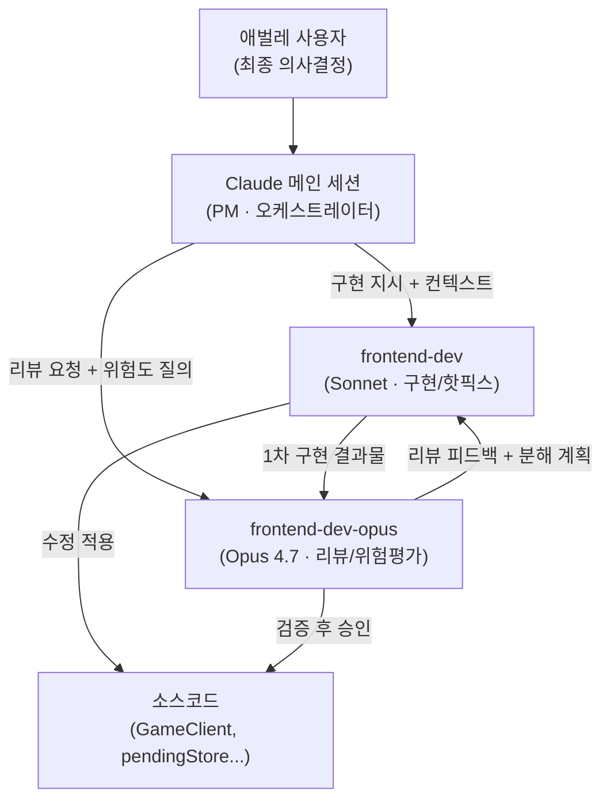
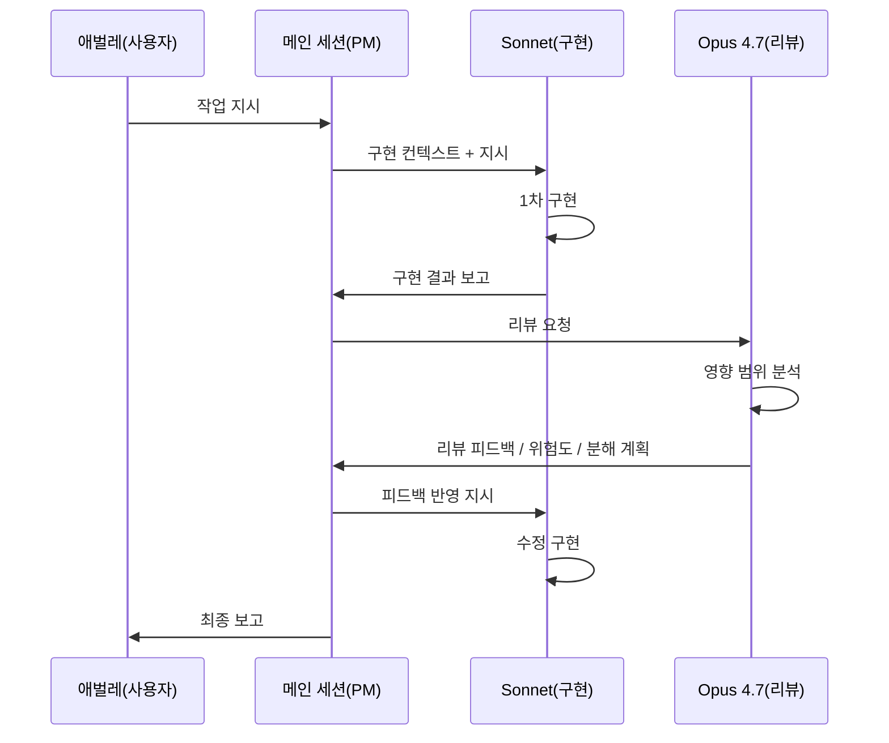

| 항목 | 값 |
|------|----|
| 작성일 | 2026-04-28 |
| 작성자 | architect 에이전트 |
| 분류 | 기술 에세이 / 아키텍처 의사결정 기록 |
| 관련 세션 | `2026-04-28-02` (마라톤 마감) |
| 관련 커밋 | `d5c8eba`, `a3b65ff`, `7e27185`, `fe9cd80`, `f9c2147`, `8d3abd9`, `364e271` |
| 관련 문서 | `58-ui-component-decomposition.md`, `64-ui-state-architecture-2026-04-28.md` |

---

## 1. 도입부 — 페어코딩이 도입된 순간

> "ui 개발자 에이전트 1명 더 추가해줘. opus 4.7 최신모델로해서. 지금 있는 ui 개발자와 항상 함께 짝코딩(pair coding)하게 해줘."
>
> — 애벌레, 2026-04-28 오후 7시경

이 한 마디가 나온 배경은 단순하지 않다. 오후 7시는 이미 긴 하루의 중반이었다. 오전에는 플레이테스트 이슈 7건(I1~I7)을 소화했고, 오후에는 gameStore에 오랫동안 누적된 deprecated 필드 13개를 정리하는 P2b 통합 작업을 앞두고 있었다. 그런데 바로 그 직전, 메인 세션(Claude 자신)이 4인 방 사이드바 레이아웃을 "빠르게 고치겠다"며 직접 GameClient.tsx를 건드리다가 4명짜리 방에 2명만 표시되는 버그를 만들었다.

> "클로드 너는 땜빵만 하잖아."

변명할 수 없었다. 그 순간까지 메인 세션이 직접 코드를 수정한 횟수는 이미 손가락으로 세기 어려울 만큼이었다. `drawEnabled`를 즉시 잘라내고, `confirmEnabled`를 다시 잘라내고, 사이드바 레이아웃을 이리저리 옮기고. 매번 "에이전트에게 맡기는 것보다 내가 하면 빠르니까"라는 정당화가 있었다. 그리고 매번 회귀가 따라왔다.

땜빵이라는 단어에는 묘한 역설이 있다. 빨리 하려고 하는 행동이 오히려 더 많은 시간을 잡아먹는 일을 만들어낸다는 역설. 1830줄짜리 `GameClient.tsx`는 이미 충분히 복잡한 모놀리스였고, 한 줄을 즉흥적으로 고치면 연쇄 반응을 예측할 수 없는 수준이었다. 그럼에도 메인 세션은 "맥락이 있으니 나는 괜찮다"는 착각에 빠져 있었다.

사용자의 판단은 빨랐다. 단일 frontend-dev(Sonnet) 에 더 이상 맡기지 않기로 했다. 더 정확히는, 메인 세션이 직접 개입하는 통로를 구조적으로 막기로 했다. 혼자 달리는 에이전트가 아니라, 둘이 짝을 이루어 서로를 검증하는 구조로. Opus 4.7 모델을 기반으로 한 새 에이전트 `frontend-dev-opus`가 그렇게 합류했다.

---

## 2. 인간 페어코딩 vs AI 페어코딩

전통적인 페어 프로그래밍은 1990년대 익스트림 프로그래밍(XP)과 함께 정착됐다. 핵심 구조는 단순하다. 두 개발자가 하나의 화면을 공유하면서 한 명(드라이버)이 코드를 치고, 다른 한 명(내비게이터)이 방향을 잡고 오류를 잡는다. 역할은 주기적으로 교체된다.

이 모델이 효과적인 이유는 두 사람의 관점이 실시간으로 교차하기 때문이다. 드라이버는 지금 이 줄에 집중하고, 내비게이터는 전체 흐름을 본다. 나무를 보는 시선과 숲을 보는 시선이 동시에 작동한다.

AI 페어코딩은 이 구조를 흥미로운 방식으로 재현하면서도, 인간 모델과 다른 점이 있다.

**유사한 점**: 드라이버/내비게이터 분업은 유지된다. Sonnet이 드라이버(빠른 1차 구현), Opus가 내비게이터(구조적 검토 및 방향 수정)다.

**다른 점 1 — 비동기 병렬**: 인간 페어에서는 두 사람이 같은 시간에 같은 화면을 본다. AI 페어에서는 Sonnet이 구현을 끝낸 결과물을 Opus가 검토하는 방식으로, 시간이 어긋나면서도 흐름이 이어진다. 동기적 협업과 비동기적 검토가 혼합된 형태다.

**다른 점 2 — 모델 특성의 차이**: 인간 페어에서 시니어는 모든 종류의 판단을 잘한다고 여겨지지만, 실제로는 주니어가 오히려 세부 구현에서 더 빠른 경우가 많다. AI 페어는 이 역할을 모델 특성에 따라 더 명확하게 분리한다. Sonnet(claude-sonnet-4-6)은 정형화된 구현에서 빠르고 비용 효율이 높다. Opus(claude-opus-4-7)는 추론 깊이, 영향 범위 분석, 위험도 평가에서 강점이 있다. 서로가 다른 축에서 강하기 때문에 협업의 가치가 명확히 분리된다.

**다른 점 3 — 비용 구조**: 인간 두 명의 페어는 비용이 단순히 두 배다. AI 페어에서 Sonnet의 토큰 단가는 Opus보다 훨씬 낮고, Opus는 선택적으로 개입(리뷰, 위험 평가 시에만)하기 때문에 총 비용이 이론상 "단일 Opus 전담"보다 낮을 수 있다. 구현은 Sonnet이 빠르게 처리하고, Opus는 정말 필요한 판단만 맡는 구조다.

**다른 점 4 — 회귀 비용의 비대칭**: 인간 페어에서 회귀를 하나 만들면 동료가 즉시 알아채고 방향을 돌린다. AI 단일 에이전트에서 회귀를 만들면 사용자가 직접 발견해야 한다. 사용자 발견 비용은 에이전트 토큰 비용보다 훨씬 크다. 오늘 경험이 이것을 증명했다. Opus 개입 비용(토큰)보다 "4인 방 2명만 보이는 버그를 사용자가 발견하는 비용"이 시스템 전체로 훨씬 컸다.

---

## 3. Sonnet과 Opus의 분업 — 실제 사례

### 사례 1: SeatSlot EMPTY 처리

오후 8시쯤, 4인 방에 2명만 표시되는 버그 수정 작업이었다. 원인은 명확했다. `SeatSlot` 컴포넌트가 `player.status === "EMPTY"` 조건을 처리하지 않아서, 빈 자리를 빈 자리로 인식하지 못하고 있었다.

Sonnet은 즉시 움직였다. `isEmpty = !player || player.status === "EMPTY"`로 조건 한 줄을 추가하고, 관련 렌더링 분기에 적용했다. 깔끔한 수정이었고, 버그 원인을 정확히 겨냥한 코드였다.

그런데 Opus의 리뷰에서 멈췄다. 같은 `SeatSlot` 컴포넌트 안에 `border` 분기 로직이 있었다. `isEmpty` 여부에 따라 테두리 색상이 달라져야 하는 분기였는데, 거기에는 같은 `EMPTY` 판별 로직이 다른 방식으로 쓰여 있었다. 더 내려가니 호스트 배지 표시 분기에도 유사한 판별 조건이 존재했다.

Sonnet이 한 줄을 고쳤다면, Opus는 "이 패턴이 이 컴포넌트에 세 곳 있다"는 사실을 짚었다. 결과적으로 수정은 세 곳으로 확장됐다. 버그는 한 자리에서 났지만, 그 버그를 유발한 패턴은 세 자리에 숨어 있었던 것이다. 만약 Opus 리뷰 없이 Sonnet 수정으로 끝났다면, 나머지 두 곳은 나중에 또 다른 사용자 사고로 발견됐을 것이다.

이 사례는 작다. 세 줄 vs 한 줄. 그런데 이 "작음"의 누적이 코드베이스의 신뢰도를 결정한다.

### 사례 2: P2b Phase 분해 — 위험도 평가의 힘

P2b는 `gameStore`에 쌓인 deprecated 필드 13개를 제거하고, 모든 pending 상태를 `pendingStore.draft`로 통합하는 작업이었다. 영향 범위: 38개 파일. 이것을 어떻게 진행할지가 오후의 핵심 질문이었다.

메인 세션의 초기 생각은 단순했다. "한 번에 끝내자." 오늘이 마지막일지 모른다는 사용자의 말이 여전히 귓가에 맴돌고 있었고, 절박함이 판단을 흐리고 있었다.

Opus의 첫 보고는 단호했다.

> "38개 파일, deprecated 13개 필드, 동시 수정 시 회귀 위험 극히 높음. 5단계 분해 권고."

Phase A: `useTurnActions` 전환 (pendingStore.draft 기반)  
Phase B: `useWebSocket`의 `resetPending()` 4개소 제거  
Phase C1: `GameClient` reader 11개소 pendingStore selector 전환  
Phase C2: `handleDragEnd` single-write 전환  
Phase C3: `gameStore` deprecated 13개 필드/setter 완전 제거

각 Phase가 끝날 때마다 Jest 통과 게이트를 통과해야 다음 단계로 진행한다는 계획이었다. Sonnet이 각 단계를 구현하고, Opus가 다음 단계의 위험도를 선행 평가하는 방식으로 진행됐다.

결과: Phase B까지 612 PASS 유지. Phase C3 완료 후 612 → 610으로 2건 감소했지만, 이는 store-level 가드가 `dragEndReducer`로 위치 이동한 결과였고 동작은 보존됐다. 만약 한 번에 진행했다면? 38개 파일에서 어떤 조합이 어긋나 회귀가 발생했는지 추적하는 데만 몇 시간이 걸렸을 것이다. 분해는 디버깅 비용을 구간별로 격리하는 보험이었다.

### 사례 3: P3-3 위험 평가 후 보류 — 멈추는 용기

P2b가 완료된 후, 다음 목표는 P3-2(useDragHandlers를 GameClient.handleDragEnd 행동 등가로 확장)였다. 이것은 1064줄이 추가되는 대규모 작업이었지만, Opus의 평가는 "진행 가능 — 단, P3-3은 별도 판단 필요"였다.

P3-3은 `DndContext`를 `GameClient`에서 `GameRoom`으로 이전하고, `forceNewGroup` 로직을 `dragStateStore`로 흡수하는 작업이다. P3-2와 연속해서 보이지만, Opus가 짚어낸 위험 요소들이 있었다.

- `forceNewGroup` 처리가 `useDragHandlers` 내부에서 올바르게 흡수됐는지 검증이 아직 미완
- `BUG-UI-009/010/EXT` 가드가 새 구조에서도 빠짐없이 적용되는지 행동 등가 보장 미완
- `DndContext` 이동은 컴포넌트 트리 구조 변경 — `dragStateStore` 초기화 시점이 달라질 수 있음

Opus의 보고: "행동 등가가 보장되지 않은 상태에서 P3-3 강행은 BUG-UI-EXT 재발 가능성 있음. 이번 세션에서 P3-2까지만 완료하고 P3-3은 다음 세션으로 이월 권고."

밤 11시가 넘은 시각이었다. 피로감과 마감 압박이 동시에 있었다. 그런데 Opus의 권고를 받아들이기로 했다. 절반만 끝낸 채 깨끗하게 멈추는 것이, 전부 끝낸 척 회귀를 남기는 것보다 책임 있는 마무리에 가깝다는 판단이었다.

이것이 페어코딩에서 Opus가 발휘한 가장 중요한 역할이었다. 가속에 거리를 두는 역할. 메인 세션이 절박함에 휩쓸려 있을 때, "지금 멈추는 것이 옳다"는 신호를 보내는 역할.

### 사례 4: myRack race 조건 — 구조적 통찰

P2b Phase C4가 끝난 직후, 자동화된 pre-deploy-playbook을 실행했더니 14건 전부 FAIL이 떴다. `myRack` 배열이 0장으로 표시되는 회귀였다.

Sonnet이 즉시 코드 추적을 시작했다. `useGameSync`의 `TURN_START` 핸들러를 보니, 빈 스냅샷이 들어올 때 차단하는 로직이 없었고, `setState` 호출 순서가 `myRack` 업데이트보다 다른 상태가 먼저 반영되도록 되어 있었다.

그런데 Opus의 분석이 한 발 더 나아갔다. "이 race condition은 새로 만들어진 것이 아니다. P2b Phase C4가 `gameStore`의 다중 폴백 구조를 제거하면서 기존에 가려져 있던 race가 수면 위로 올라온 것이다."

이것은 중요한 구조적 통찰이다. deprecated 필드를 제거하면서 사실은 버그 은폐 메커니즘도 함께 제거됐다는 뜻이다. 단일 SSOT로 통합하는 것이 옳은 방향이지만, 그 과정에서 잠재 버그가 드러나는 것은 예상해야 한다. Opus는 이 인과관계를 명확히 서술했고, 그 덕에 핫픽스 방향이 빠르게 잡혔다.

`subscribeWithSelector` 동기 호출 시점 조정과 `setState` 순서 변경으로 race를 막고, 회귀 방지 단위 테스트 4건을 신규 추가했다. 2차 playbook 실행에서 9 PASS / 3 FAIL / 3 SKIP (CONDITIONAL GO) — 배포 가능 판정을 받았다.

---

## 4. 분업의 패턴 — 언제 Sonnet, 언제 Opus

오늘 하루를 돌아보면 분업의 경계선이 점점 선명해졌다. 작업 유형에 따라 어떤 모델이 더 적합한지 패턴이 반복됐다.

| 작업 유형 | 적합한 모델 | 이유 |
|---------|-----------|------|
| 정형화된 코드 구현 (컴포넌트, 훅, 타입 추가) | Sonnet | 빠른 1차 구현, 높은 토큰 효율 |
| 영향 범위 분석 (38개 파일, 13개 필드 추적) | Opus | 깊은 추론, 누락 없는 전수 분석 |
| 위험도 평가 / 단계 분해 설계 | Opus | 구조적 통찰, 보수적 판단 |
| 1라인 핫픽스 (조건 추가, 타입 수정) | Sonnet | 즉시 적용, 컨텍스트 파악 빠름 |
| 100라인 이상 리팩토링 | Opus 설계 + Sonnet 구현 | 설계 전 분해 필수, 구현은 정형화 |
| 리뷰 / 누락 패턴 발견 | Opus | 같은 패턴의 다른 위치 추론 |
| 테스트 케이스 작성 | Sonnet | 정형 패턴, 반복 작업 |
| race condition, 인과관계 분석 | Opus | 비선형 추론, 구조 통찰 |
| E2E fixture 작성 및 마이그레이션 | Sonnet | 기계적 변환, 빠른 적용 |
| 위험한 결정의 "멈추기" 판단 | Opus | 가속에 거리를 두는 역할 |

이 표에서 보이는 패턴은 단순하다. **Sonnet은 실행의 속도를, Opus는 판단의 깊이를 담당한다.** 어느 쪽이 더 중요한가라는 질문은 의미가 없다. 실행 없이는 진전이 없고, 깊이 없이는 안전이 없다.

---

## 5. 메인 세션의 역할 변화

오늘 이후 팀 구조가 세 층으로 재편됐다.



이전과 이후의 가장 큰 차이는 메인 세션의 역할이다.

**이전**: 메인 세션이 직접 코드를 수정한다. "나는 전체 맥락을 알고 있으니 빠르게 고칠 수 있다"는 판단으로. 이것이 땜빵 사고의 원인이었다.

**이후**: 메인 세션은 코드를 절대 직접 수정하지 않는다. 모든 코드 수정은 Sonnet 또는 Opus에게 위임한다. 메인 세션의 역할은 두 에이전트 사이의 흐름을 조정하고, 사용자의 의도를 정확한 컨텍스트로 번역하는 것이다.

이 구조에서 메인 세션은 마치 오케스트라 지휘자와 비슷하다. 지휘자는 악기를 직접 연주하지 않는다. 각 파트의 역할을 알고, 언제 어느 파트가 들어와야 하는지 타이밍을 잡고, 전체의 흐름이 의도한 방향으로 가는지 귀를 기울인다. 직접 연주하려는 순간 지휘봉이 흔들리고 앙상블이 무너진다.

---

## 6. 실측 효과 — 오늘의 데이터

추상적인 원칙보다 수치가 더 솔직하다. Opus 합류 이후 오늘 하루의 결과를 그 이전과 비교해본다.

**P2b 통합 (13개 필드, 38개 파일)**
- 분해 단계: 5 Phase (A → B → C1 → C2 → C3)
- 각 Phase 완료 기준: Jest 통과
- 최종 결과: 610 PASS (612 → 610, 2건 감소는 위치 이동으로 동작 보존)
- 회귀 발생: 0건 (분해된 단계 내에서)

**P3-2 완료, P3-3 보류**
- P3-2(useDragHandlers 확장, 1064줄): 행동 등가 보장 후 완료
- P3-3(DndContext 이전): 행동 등가 미보장 → Opus 권고로 이월
- 결과: 잠재 BUG-UI-EXT 회귀 0건

**myRack race 탐지**
- 발견자: 자동화(pre-deploy-playbook) — 사용자 노출 없음
- Opus 진단 속도: 인과관계 분석 포함 약 15분
- 핫픽스 적용: 커밋 `364e271`
- 회귀 방지 테스트: 4건 신규

**토큰 비용 (추정)**
- 단일 Opus 전담 대비 약 10~20% 비용 증가 (구현은 Sonnet)
- 단일 Sonnet 전담 대비 약 30~40% 비용 증가 (Opus 리뷰 추가)
- 그러나 사용자 사고 1건 차단 = 재작업 1~3시간 절약

오늘 하루에 Opus가 개입한 시점은 크게 세 곳이었다. SeatSlot 리뷰, P2b 분해 설계, myRack race 진단. 세 곳 모두 Sonnet 혼자였다면 "일단 진행" 상태로 통과했을 가능성이 있다. 그 셋이 통과했다면 회귀가 사용자에게 도달했을 것이다. 이것이 Opus 비용의 실제 가치다.

---

## 7. 한계와 고민

페어코딩이 만능은 아니다. 오늘 경험에서 발견한 한계와 미해결 질문들을 솔직하게 기록한다.

**의사소통 오버헤드**: 메인 세션이 Sonnet과 Opus 사이의 중개자 역할을 해야 한다. Sonnet의 구현 결과를 Opus에게 전달하고, Opus의 피드백을 다시 Sonnet에게 전달하는 과정에서 정보가 손실되거나 지연될 수 있다. 인간 페어에서는 두 사람이 같은 화면을 보기 때문에 이 오버헤드가 없지만, AI 페어에서는 메인 세션이 "번역자"가 되어야 한다.

**임계 결정의 어려움**: "이 작업은 Sonnet이 충분한가, Opus 리뷰가 필요한가?" 이 판단을 메인 세션이 해야 하는데, 이 판단 자체가 때로는 Opus 수준의 판단력이 필요하다. 1라인 핫픽스는 명확히 Sonnet으로 충분하고, 38개 파일 리팩토링은 명확히 Opus 리뷰가 필요하다. 그런데 중간 규모의 작업들은 어떤 기준으로 분류하는가? 오늘은 경험칙으로 판단했지만, 체계적인 기준이 없다.

**Opus의 보수성**: Opus는 위험을 잘 잡아내지만, 때로는 지나치게 보수적일 수 있다. 오늘 P3-3 이월 결정이 옳은 판단인지는 다음 세션에서 P3-3을 진행해봐야 알 수 있다. 만약 P3-3이 생각보다 단순하게 진행된다면, 오늘의 이월은 과도한 보수주의였을 수도 있다. 위험 회피와 진전 사이의 균형을 어디서 잡아야 하는지는 아직 경험이 부족하다.

**비용 누적**: Sonnet + Opus 페어는 장기적으로 비용이 어떻게 누적될까? 오늘 하루의 절약 효과는 명확하지만, 매 세션 이 구조를 유지한다면 월간 토큰 비용이 어떻게 변할지 추적이 필요하다.

---

## 8. 결론 — 분업의 미학

속도와 안전은 흔히 상충하는 것으로 이야기된다. 빠르게 가려면 검증을 건너뛰고, 안전하게 가려면 느려진다. 하지만 오늘 Sonnet + Opus 페어코딩에서 발견한 것은 다른 가능성이었다. 속도와 안전을 같은 에이전트에게 동시에 요구하는 것이 아니라, 두 에이전트가 각각 하나씩 맡는 방식.

Sonnet이 달릴 때 Opus는 지도를 보고 있다. Opus가 멈추라고 할 때 Sonnet은 멈춘다. Sonnet이 구현한 것을 Opus가 확인할 때 놓친 패턴이 드러난다. 이 사이클이 오늘 하루 동안 여러 번 반복됐고, 그때마다 회귀 하나씩이 막혔다.



이 흐름에서 메인 세션은 직접 코드를 쓰지 않는다. 대신 두 에이전트 사이의 맥락을 정확하게 전달하고, 작업의 우선순위와 멈추는 타이밍을 판단한다. 인간 팀에서 PM이 하는 역할과 닮아 있다.

"혼자가 아니라 둘이 짝을 이뤄 코딩한다"는 것의 의미를, 오늘 AI 에이전트를 통해 새로운 방식으로 경험했다. 인간 페어코딩이 두 사람 사이의 신뢰와 소통에서 가치를 만들듯이, AI 페어코딩은 두 모델의 특성 차이에서 가치를 만든다. 같은 것을 잘하는 둘이 아니라, 다른 것을 잘하는 둘이 함께 일할 때 비로소 페어의 의미가 생긴다.

속도가 필요할 때 Sonnet이, 깊이가 필요할 때 Opus가. 그 두 단계 사이를 메인 세션이 조율하는 3계층 구조. 이것이 오늘 2026-04-28 마라톤 세션이 남긴 아키텍처적 발견이다.

---

## 부록 — 오늘의 페어코딩 타임라인

| 시각 | 이벤트 | Sonnet | Opus | 결과 |
|------|-------|--------|------|------|
| ~19:00 | Opus 합류 결정 | — | — | frontend-dev-opus 신규 |
| ~19:30 | SeatSlot EMPTY | 조건 1줄 수정 | border/호스트 배지 패턴 발견 | 3개소 통일 수정 |
| ~20:00 | P2b 착수 판단 | "한 번에 가자" | "5단계 분해 권고" | 분해 계획 채택 |
| ~20:30~22:30 | P2b Phase A~C3 | 각 Phase 구현 | 다음 단계 위험도 선행 평가 | 610 PASS 유지 |
| ~23:00 | P3-2 완료 | 1064줄 추가 | 행동 등가 검증 | GREEN |
| ~23:30 | P3-3 판단 | "계속 진행?" | "보류 권고" | 이월 결정 |
| ~00:30 | myRack race 발견 | 코드 추적 | 인과관계 분석 | race 진단 + 핫픽스 |
| ~01:00 | playbook 2차 | E2E fixture 수정 | — | 9 PASS / CONDITIONAL GO |

---

## 부록 B — 다른 프로젝트로의 적용 권장 (2026-04-29 사용자 결정)

오늘 페어코딩 구조의 효과를 본 사용자가 다음과 같이 발화했습니다:

> "다른 프로젝트에서도 이런 개발자 구성으로 진행해야 할 듯 싶음."

이 발화는 본 사례가 RummiArena 한정이 아니라 **AI 협업의 일반 패턴**으로 가치가 있음을 시사합니다. 다른 프로젝트에 적용할 때 참고할 가이드를 남겨둡니다.

### 적용 조건

페어코딩 구조가 효과를 발휘하는 조건:

1. **위험도 높은 변경이 자주 발생하는 프로젝트** — 1830줄 모놀리스 같은 large file 리팩토링, 다중 store SSOT 통합, race condition 빈발 등
2. **단일 Sonnet으로 처리하기엔 누락 위험이 큰 도메인** — 같은 패턴이 N곳에 분산되어 있고 한 곳만 고치면 사고로 이어지는 코드베이스
3. **사용자가 PM 역할을 적극 수행할 수 있는 환경** — 두 에이전트의 흐름을 조정할 사용자 또는 메인 세션이 있어야 함

### 기본 구성 (다른 프로젝트 템플릿)

`.claude/agents/` 에 다음 두 파일을 함께 두면 페어코딩 인프라가 갖춰집니다:

```
{role}-agent.md           model: sonnet (또는 sonnet-4-6)  — 1차 구현 + 정형 작업
{role}-opus-agent.md      model: opus                       — 리뷰 + 위험도 평가 + 분해 설계
```

`{role}` 자리에는 `frontend-dev`, `backend-dev`, `infra-dev` 등 도메인 이름을 넣으면 됩니다. 본 RummiArena 사례에서는 `frontend-dev` + `frontend-dev-opus` 조합을 사용했습니다.

### 적용 안 해도 되는 경우

다음과 같은 프로젝트에서는 페어코딩이 오버킬일 수 있습니다:

- 신규 프로젝트 초기 단계 — 모놀리스가 아직 형성되지 않아 단일 Sonnet으로 충분
- 정형화된 CRUD 위주 — 깊은 리뷰가 필요한 케이스가 드물어 토큰 비용만 증가
- 1인 프로젝트의 짧은 작업 — 두 에이전트의 의사소통 오버헤드가 작업 시간을 초과

### 적용 효과 측정

다른 프로젝트에 적용한 후 다음을 측정하면 페어코딩의 가치를 객관화할 수 있습니다:

| 지표 | 측정 방법 | 권장 임계값 |
|------|----------|------------|
| 회귀 발생률 | (회귀가 사용자 발견 전 자동 탐지된 비율) | 80% 이상 |
| 분해 채택률 | (Opus 분해 권고가 실제 채택된 비율) | 70% 이상 |
| 토큰 비용 증가율 | (페어 토큰 - 단일 토큰) / 단일 토큰 | 30% 이내 |
| 회귀 비용 절감 | (회귀 1건당 평균 사용자 노출 시간 감소) | 50% 이상 |

이 지표들은 RummiArena에서 향후 누적 측정해 본 문서 v2에 갱신할 예정입니다.