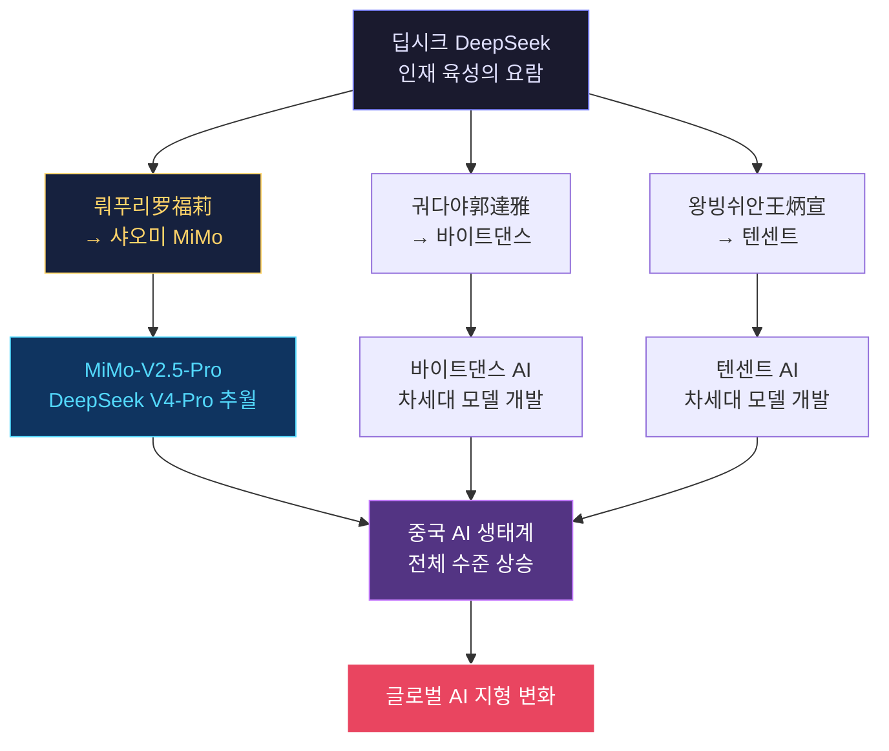
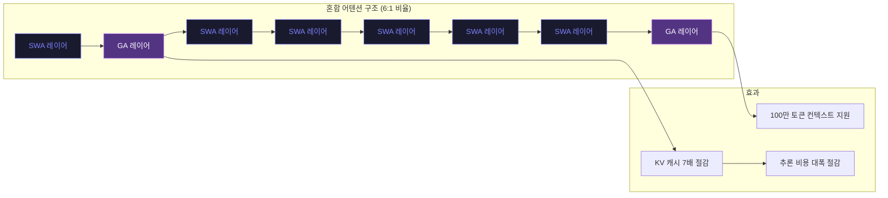
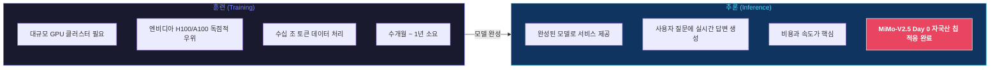
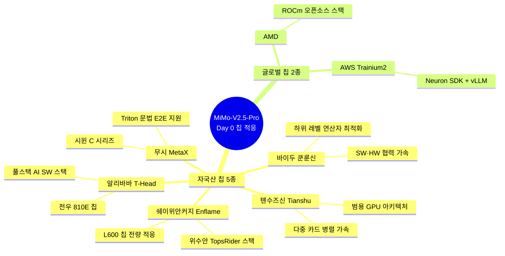
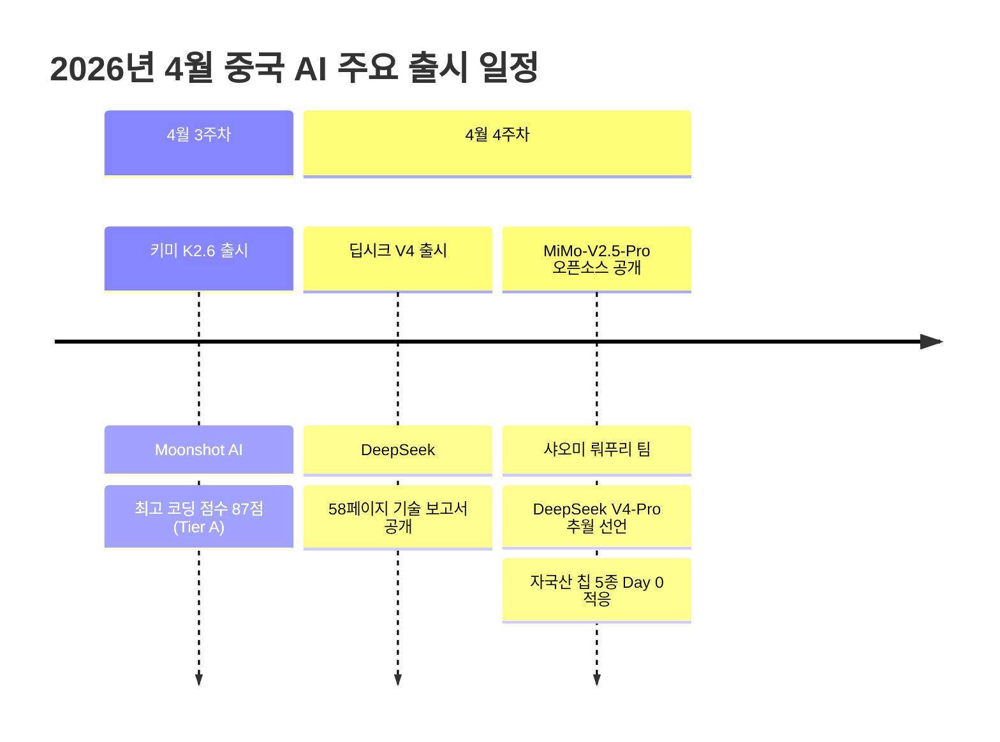
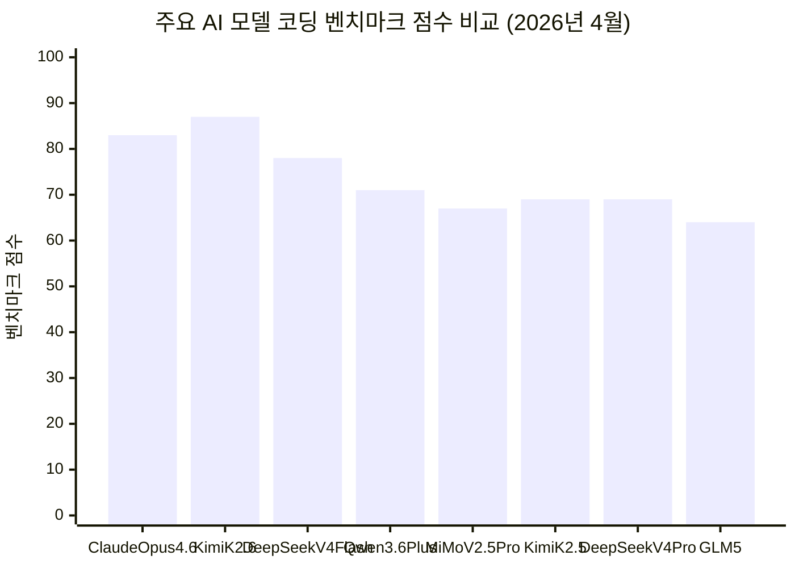

## 샤오미 뤄푸리의 MiMo-V2.5 발표와 중국 반도체 독립 선언

> **작성일**: 2026년 4월 29일  
> **출처**: [Facebook 분석](https://www.facebook.com/share/p/1CZk9donUz) + 최신 웹 검색 기반  
> **키워드**: MiMo-V2.5-Pro, 뤄푸리(罗福莉), 딥시크, 샤오미, 중국 AI, 오픈소스, 추론 반도체 독립

---

## 목차

1. [들어가며 — 조용한 기습, 조용한 승리](#들어가며)
2. [뤄푸리(罗福莉) — 딥시크가 세상에 내놓은 인물](#뤄푸리)
3. [딥시크 출신들이 만든 제2의 딥시크 생태계](#딥시크-출신-생태계)
4. [MiMo-V2.5-Pro 기술 상세 분석](#기술-분석)
5. [벤치마크 성능 비교](#벤치마크)
6. [추론 단계 반도체 독립 선언 — 자국산 칩 5종 Day 0 동시 적응](#반도체-독립)
7. [중국 AI 파괴적 가격 전쟁의 시작](#가격-전쟁)
8. [샤오미의 전략적 의미 — 스마트폰 회사에서 AI 플레이어로](#샤오미-전략)
9. [글로벌 AI 지형 변화의 의미](#글로벌-의미)
10. [Hunter Alpha 사건: 조용한 선공](#hunter-alpha)
11. [마치며 — 경쟁이 생태계가 되고, 생태계가 속도를 만든다](#마치며)

---

## 1. 들어가며 — 조용한 기습, 조용한 승리 {#들어가며}

2026년 4월 28일, 중국 AI 업계에서 조용하지만 결코 작지 않은 사건이 일어났다. 샤오미(小米)의 AI 대형 언어 모델 팀인 MiMo가 차세대 플래그십 모델 **MiMo-V2.5-Pro**를 공개 오픈소스로 출시하면서 딥시크(DeepSeek)의 최신 오픈소스 모델 **DeepSeek-V4-Pro**를 주요 에이전트 벤치마크에서 앞서는 결과를 발표한 것이다. 이 발표를 진두지휘한 인물은 바로 뤄푸리(罗福莉), 딥시크 R1 시리즈의 핵심 기여자이자 현재 샤오미 MiMo 대형 모델 총책임자다.

한때 세계를 충격에 빠뜨린 딥시크가 배출한 인재가, 불과 5개월 만에 자신이 기여했던 그 딥시크를 벤치마크에서 넘어서는 구조. 이것이 2026년 봄 중국 AI 업계가 세상에 보여주는 자화상이다.

이번 발표가 단순한 벤치마크 성능 비교를 넘어 갖는 의미는 크게 세 가지다. 첫째, 딥시크가 키운 인재들이 중국 AI 업계 전체로 퍼져 '제2의 딥시크'들을 만들어내고 있다는 점. 둘째, 추론(Inference) 단계에서 자국산 칩 5종에 대해 동시 Day 0 적응을 완료하는 반도체 독립의 서막. 셋째, 30일간 100조 토큰 무료 제공이라는 전례 없는 개발자 생태계 흡수 전략. 이 세 가지를 종합해서 보면, MiMo-V2.5-Pro의 등장은 단순한 모델 업데이트가 아니라 중국 AI 생태계의 구조적 전환을 알리는 신호탄이다.

---

## 2. 뤄푸리(罗福莉) — 딥시크가 세상에 내놓은 인물 {#뤄푸리}

### 2-1. 쓰촨성 소도시에서 세계 AI 무대까지

뤄푸리는 1995년생으로 쓰촨성 이빈(宜賓)이라는 소도시 출신이다. 훗날 언론에서 "천재 소녀"라는 수식어를 붙였지만, 정작 본인은 고등학교 때까지 컴퓨터를 제대로 접해본 적이 없었다고 회고한다. 평범한 출발점에서 그녀를 세계 AI 무대로 이끈 것은 대학 진학 이후의 집요한 학문적 열정이었다.

학부는 베이징사범대학(北京師範大學) 컴퓨터 전공, 대학원은 베이징대학(北京大學) 전산언어학 방향으로 진학했다. 그리고 2019년, NLP 분야의 가장 권위 있는 학술대회 중 하나인 **ACL(Association for Computational Linguistics)** 에서 단 한 해에 논문 8편을 발표하며 처음으로 학계의 주목을 받기 시작했다. 그 중 2편이 제1저자였다. 석사 과정 동안 국제 최상위 컨퍼런스 논문 발표 수는 총 20편을 넘었고, Google Scholar 기준 2024년 피인용 수는 2,160회에 달한다.

### 2-2. 알리바바 다모 아카데미에서 딥시크까지

학업을 마친 뤄푸리는 알리바바의 연구 부문인 **다모 아카데미(DAMO Academy, 達摩院)** 에 '阿里星' 특채 프로그램으로 입사했다. 이곳에서 그녀는 다국어 사전훈련 모델 **VECO**를 주도적으로 개발했는데, 이 모델은 당시 하루 평균 50억 건의 호출을 기록할 정도로 실제 서비스에서 광범위하게 사용됐다. 또한 AliceMind 오픈소스화 작업도 이끌었다.

2022년에는 알리바바를 떠나 퀀트 헤지펀드이자 딥시크의 모회사인 **환팡 퀀트(幻方量化)** 에 입사해 딥러닝 전략 모델링과 알고리즘 연구에 집중했다. 이어 딥시크로 이직하여 **MoE(Mixture of Experts)** 아키텍처 기반 대형 언어 모델인 DeepSeek-V2의 핵심 개발자로 활약했다.

딥시크 R1 모델이 2025년 초 전 세계를 충격에 빠뜨렸을 때, 뤄푸리는 발표 자리에 직접 나서 CEO보다 더 주목받았다. 언론은 그녀를 "AI 천재 소녀", "95허우(95后) 인재"라고 불렀고, 한동안 중국 AI 업계 최고의 화제 인물이 됐다. 하지만 정작 본인은 2025년 2월 소셜 플랫폼에서 이렇게 말했다.

> *"저는 천재가 아닙니다. 높이 띄워질수록 떨어질 때 더 아픕니다. 그저 어렵고 올바른 일을 조용히 하고 싶습니다."*  
> — 뤄푸리, 2025년 2월 소셜 미디어 게시글

### 2-3. 샤오미로의 이적 — 레이쥔의 선택

2024년 말부터 레이쥔(雷軍) 샤오미 회장이 직접 움직였다는 이야기가 업계에 퍼지기 시작했다. 연봉 약 **천만 위안(한화 약 20억 원)** 수준의 조건으로 영입을 제안했다는 것이다. 처음에 뤄푸리는 침묵했다. 이직 사실도 오랫동안 공개하지 않았다. 그러다 2025년 11월 12일, 그녀는 공식적으로 샤오미 합류를 선언했다. 그 글의 핵심은 다음과 같았다.

> *"지능은 결국 언어에서 물리 세계와의 상호작용으로 나아갈 것이다. 나는 지금 Xiaomi MiMo에서, 창의적이고 재능 있고 진심으로 기술을 사랑하는 연구자들과 함께, 그러한 미래를 구축하는 데 전력을 다하고 있으며, 내가 생각하는 AGI를 향해 전속력으로 달려가고 있다."*

그로부터 불과 5개월 후인 2026년 4월 28일, 그녀가 이끄는 MiMo-V2.5-Pro가 딥시크 V4-Pro를 벤치마크에서 넘어섰다.

---

## 3. 딥시크 출신들이 만든 제2의 딥시크 생태계 {#딥시크-출신-생태계}

뤄푸리의 이야기는 중국 AI 업계에서 벌어지고 있는 더 큰 흐름의 일부에 불과하다. 딥시크 V4 기술 보고서에는 연구 및 엔지니어링 분야 저자 약 300명의 이름이 담겨 있는데, 그 중 10명에게 "이미 퇴직" 표시가 붙어 있다. 2025년 하반기 이후 딥시크의 핵심 연구·개발 인력 최소 5명이 외부로 이직한 것으로 확인됐다.

각 인물의 행선지를 보면 더욱 흥미롭다.

- **딥시크 R1 핵심 저자 궈다야(郭達雅)** → 바이트댄스(ByteDance)
- **딥시크 LLM 핵심 저자 왕빙쉬안(王炳宣)** → 텐센트(Tencent)
- **딥시크 V2 핵심 기여자 뤄푸리(罗福莉)** → 샤오미(Xiaomi)

딥시크가 키운 인재들이 중국의 빅테크 전반으로 퍼져나가고, 이제 각자의 자리에서 딥시크를 넘어서는 모델을 만들고 있다. 이것이 바로 현재 중국 AI 업계의 구조다.



이 구조는 실리콘밸리의 '페이팔 마피아(PayPal Mafia)' 현상과 유사하다. 한 성공적인 조직이 뛰어난 인재를 배출하고, 그 인재들이 업계 전반으로 퍼져 생태계 전체를 끌어올리는 메커니즘이다. 경쟁이 생태계가 되고, 생태계가 전체 수준을 높이는 선순환이 중국 AI 업계에서 현실로 작동하기 시작했다.

2026년 4월 한 주 동안 **딥시크 V4**, **키미 K2.6**, **MiMo-V2.5-Pro**가 거의 동시에 오픈소스로 공개되었다. 셋 모두 조 단위 파라미터, 최대 100만 토큰 컨텍스트를 지원하며, 모두 자국산 칩 추론 적응을 선언했다. 이제 중국 AI 시장은 서방과의 싸움 이전에 자국 모델 간의 치열한 성능·가격 경쟁이 먼저 시작된 양상이다.

---

## 4. MiMo-V2.5-Pro 기술 상세 분석 {#기술-분석}

### 4-1. 모델 패밀리 구성

MiMo-V2.5 시리즈는 두 가지 모델로 구성된다.

| 모델 | 용도 | 특징 |
|------|------|------|
| **MiMo-V2.5-Pro** | 복잡한 장기(long-horizon) Agent 태스크 전용 | 최고 성능, 복잡 추론 |
| **MiMo-V2.5** | 범용 Agent 시나리오 | 더 빠른 추론 속도, 지연 민감 작업에 적합 |

두 모델 모두 이미지·오디오·비디오를 아우르는 **네이티브 전 모달(Full-Modal) Agent** 기능을 지원한다. 이전 세대 MiMo-V2-Pro가 텍스트와 코드 중심이었다면, V2.5는 멀티모달 처리를 단일 아키텍처로 통합했다는 점에서 구조적 도약이다.

### 4-2. 핵심 아키텍처 명세

MiMo-V2.5-Pro의 기술 사양을 구체적으로 살펴보면 다음과 같다.

```
총 파라미터: 1.02조 (1.02T)
활성화 파라미터: 420억 (42B, 추론 시 활성)
아키텍처: 혼합전문가 MoE (Mixture of Experts)
어텐션: 혼합 어텐션 (Mixed Attention)
사전훈련 데이터: 27조 (27T) 토큰
정밀도: FP8 혼합 정밀도
기본 시퀀스 길이: 32K 토큰
최대 컨텍스트: 100만 (1M) 토큰
라이선스: MIT (상업적 추론 배포 및 2차 훈련 허용)
```

### 4-3. 혼합 어텐션 구조 — KV 캐시 7배 절감

MiMo-V2.5-Pro의 핵심 기술 혁신 중 하나는 **혼합 어텐션(Mixed Attention)** 구조다. 구체적으로는 **로컬 슬라이딩 윈도우 어텐션(SWA, Sliding Window Attention)** 과 **글로벌 어텐션(GA, Global Attention)** 을 **6:1 비율**로 교차 배치한다.

이 구조가 중요한 이유는 실제 서비스 운영 비용과 직결되기 때문이다. 슬라이딩 윈도우 어텐션은 윈도우 크기 128토큰으로 제한적 범위만 집중 처리해, 장문 컨텍스트에서 **키-값 캐시(KV Cache) 저장 공간을 기존 대비 7배 절감**한다. 이는 동일한 하드웨어로 훨씬 더 긴 컨텍스트를 처리하거나, 같은 컨텍스트 길이에서 훨씬 더 많은 동시 요청을 처리할 수 있다는 것을 의미한다.



### 4-4. 다중 토큰 예측(MTP) 모듈 — 출력 처리량 3배 향상

또 하나의 핵심 기술은 **다중 토큰 예측(MTP, Multi-Token Prediction)** 모듈의 기본 통합이다. 일반적인 언어 모델은 한 번의 포워드 패스(forward pass)에서 다음 토큰 하나를 예측한다. MTP는 여러 토큰을 동시에 예측하여 출력 처리량(throughput)을 크게 높인다.

샤오미에 따르면 MTP 통합으로 출력 처리량이 약 **3배** 향상됐다. 실제 서비스 관점에서 이것은 같은 서버 인프라로 세 배 더 많은 사용자를 동시에 처리할 수 있다는 의미다.

### 4-5. 토큰 효율성 — 경쟁 모델 대비 현저한 절약

샤오미 공식 발표에 따르면, 에이전트 벤치마크 ClawEval에서 동일한 점수를 달성하는 데 필요한 토큰 수 기준으로 다음과 같은 효율 차이가 나타난다.

- **MiMo-V2.5-Pro vs Kimi K2.6**: 42% 토큰 절감
- **MiMo-V2.5 vs Meta Muse Spark**: 50% 토큰 절감

---

## 5. 벤치마크 성능 비교 {#벤치마크}

### 5-1. 주요 에이전트 벤치마크

샤오미가 발표한 벤치마크 결과에서 MiMo-V2.5-Pro는 딥시크 V4-Pro를 여러 주요 지표에서 앞섰다.

| 벤치마크 | MiMo-V2.5-Pro | DeepSeek V4-Pro | 비고 |
|----------|---------------|-----------------|------|
| **GDPVal-AA (Elo)** | 1위 | 하위 | 에이전트 종합 평가 |
| **Claw-Eval (pass³)** | 1위 | 하위 | 에이전트 코딩 평가 |
| **SWE-Bench Pro** | 57.2 | 55.4 | 소프트웨어 엔지니어링 |
| **Terminal-Bench 2.0** | 68.4 | 67.9 | 터미널 기반 코딩 |
| **SWE-Bench Verified** | 78.9 | 80.6 | (DeepSeek 소폭 우위) |
| **MiMo Coding Bench** | 73.7 | — | Claude Opus 4.6는 77.1 |

### 5-2. 글로벌 코딩 벤치마크 (독립 기관 평가)

독립 벤치마크 사이트 기준으로도 MiMo-V2.5-Pro는 상위권에 자리잡고 있다.

| 모델 | 코딩 점수 | 티어 |
|------|-----------|------|
| Kimi K2.6 | 87 | **Tier A** (80+) |
| DeepSeek V4 Flash | 78 | Tier B |
| Qwen 3.6 Plus | 71 | Tier B |
| **MiMo V2.5 Pro** | **67** | **Tier B** |
| Kimi K2.5 | 69 | Tier B |
| GLM 5 | 64 | Tier B |
| Claude Opus 4.6 | 83 | **Tier A** |

> 📌 **맥락**: Tier B 중국 모델들과 Claude Opus 4.6(Tier A) 사이의 격차는 약 5~20점 수준이다. Tier A에 도달한 중국 모델은 테스트된 13개 모델 중 Kimi K2.6 하나뿐이다. "중국이 따라잡았다"는 서사는 특정 벤치마크에서는 유효하지만, 전반적으로는 여전히 격차가 존재한다.

### 5-3. 가격 대비 성능 — 진짜 파괴력

벤치마크 수치보다 더 중요한 것은 **가격 대비 성능**이다.

```
MiMo-V2.5-Pro API 가격: 입력 기준 $1/100만 토큰
Claude Opus 4.6 API 가격: 입력 기준 약 $5/100만 토큰
→ MiMo-V2.5-Pro: Opus 4.6 가격의 1/5 수준
```

성능이 동급이거나 근접하면서 가격이 5분의 1이라면, 비용에 민감한 스타트업과 기업 고객 입장에서 선택은 자명해진다. 이것이 중국 오픈소스 AI 모델들이 가진 진짜 파괴력이다.

---

## 6. 추론 단계 반도체 독립 선언 — 자국산 칩 5종 Day 0 동시 적응 {#반도체-독립}

### 6-1. 훈련 vs. 추론 — 왜 추론이 중요한가

이번 발표에서 벤치마크 성능보다 더 전략적으로 중요한 사실은 **자국산 칩 5종과 AMD·아마존 Trainium2에 대한 Day 0 추론 적응** 선언이다. 이를 이해하려면 훈련과 추론을 구분해야 한다.



훈련 단계에서는 엔비디아 GPU가 여전히 절대적인 지위를 차지한다. 반면 추론 단계는 상대적으로 다양한 하드웨어로 처리 가능하며, 실제 서비스 비용의 대부분이 발생하는 구간이기도 하다. 미국의 수출 통제로 엔비디아 최신 GPU를 확보하기 어려운 중국 입장에서, 추론 단계의 자국산 칩 독립은 실질적인 AI 서비스 자립을 의미한다.

### 6-2. 자국산 칩 5종 상세

오픈소스 공개 첫날 동시 적응을 완료한 자국산 칩 목록과 핵심 기술 내용은 다음과 같다.

**① 알리바바 핑터우거(平头哥 T-Head) — 전우(真武) 810E**
알리바바의 반도체 자회사 T-Head가 개발한 전우(Zhenwei) 810E 칩을 기반으로, 풀스택 자체 개발 AI 소프트웨어 스택과의 심층 적응을 완료했다. T-Head는 RISC-V 아키텍처 기반 칩 개발에서 중국 내 선두권을 달리는 기업으로, 알리바바 클라우드(Alibaba Cloud) 서비스에 실제로 배포되고 있다.

**② 바이두 쿤룬신(百度昆仑芯, Baidu Kunlun)**
바이두의 AI 칩 자회사 쿤룬신이 개발한 칩으로, 하위 레벨 연산자 최적화와 소프트웨어·하드웨어 협력 가속화를 통해 적응을 완료했다. 쿤룬신은 현재 바이두 어니봇(ERNIE Bot)의 추론 인프라 일부를 담당하고 있으며, 2세대 쿤룬 칩은 80TOPs 이상의 추론 성능을 제공한다.

**③ 쉐이위안커지(燧原科技, Enflame)**
자체 개발 위수안(驭算, TopsRider) 소프트웨어 스택을 기반으로 L600 칩 전량에 대한 적응을 완료했다. Enflame은 텐센트의 투자를 받아 설립된 AI 칩 스타트업으로, 데이터센터용 추론 가속기에 집중하고 있다.

**④ 무시(沐曦, MetaX)**
시윈(曦云) C 시리즈 칩과 MXMACA 소프트웨어 스택을 사용하며, Triton 문법 기반 GPU 명령어 엔드투엔드 지원을 완료했다. MetaX는 NVIDIA GPU와의 호환성을 높인 '드롭인 교체' 전략으로 주목받는 칩 설계 기업이다.

**⑤ 톈수즈신(天数智芯, Tianshu Zhixin)**
자체 개발 범용 GPU 아키텍처와 풀스택 소프트웨어 스택을 기반으로, 심층 연산자 최적화, 비디오 메모리 스케줄링 조정, 추론 가속화를 완료했다. 특히 다중 카드 병렬 가속과 메모리 접근 병목 최적화를 통해 고강도 추론 부하도 원활히 지원한다.

### 6-3. 글로벌 칩 2종 동시 지원

**AMD — ROCm 오픈소스 소프트웨어 스택**  
AMD의 오픈소스 GPU 컴퓨팅 플랫폼 ROCm을 통해 적응을 완료했다. 이는 엔비디아 GPU 없이도 AMD GPU로 MiMo-V2.5-Pro를 추론할 수 있다는 의미다.

**아마존 웹서비스 Trainium2 — Neuron SDK + vLLM**  
AWS가 자체 개발한 AI 훈련·추론 칩 Trainium2에 대해 Neuron SDK와 vLLM 추론 프레임워크를 통해 적응을 완료했다. 오픈소스 출시 즉시 글로벌 AWS 사용자가 MiMo-V2.5-Pro를 사용할 수 있는 환경을 구축한 것이다.



### 6-4. 반도체 독립의 전략적 의미

딥시크 V4도 이미 화웨이 어센드 910C와 무어스레드에서의 추론을 선언했다. MiMo-V2.5는 한 발 더 나아가 무려 5개의 자국산 칩에서 동시 추론을 가능하게 만들었다. 이는 단순한 기술 시위가 아니다.

미국의 반도체 수출 통제가 강화되는 가운데, 중국의 전략은 훈련 단계에서는 엔비디아 대안을 여전히 찾는 중이지만, **추론 단계에서만큼은 엔비디아에 의존하지 않는 독자적 인프라를 구축**하겠다는 것이다. MiMo-V2.5의 Day 0 다중 칩 적응은 그 선언이다.

---

## 7. 중국 AI 파괴적 가격 전쟁의 시작 {#가격-전쟁}

### 7-1. 30일 100조 토큰 무료 — 생태계 흡수 전략

샤오미는 MiMo-V2.5-Pro 오픈소스 공개와 함께 **30일간 100조(100T) 토큰을 무료로 제공**하는 '백조 토큰 프로젝트'를 선언했다.

100조 토큰이 얼마나 큰 숫자인지 가늠해보면 이렇다.

```
한 사람이 하루 10만 토큰을 사용한다고 가정하면:
100조 토큰 ÷ 10만 토큰/일 = 10억 인·일
→ 100만 명이 100일 동안 쓸 수 있는 양
→ 1,000만 명이 10일 동안 쓸 수 있는 양
```

이 규모는 단순한 프로모션이 아니다. 개발자 생태계 전체를 MiMo 플랫폼으로 단숨에 흡수하겠다는 전략적 선언이다. 무료로 대규모 접근을 허용해 개발자들이 MiMo API에 의존하는 코드와 인프라를 구축하게 만들면, 그 이후의 유료 전환은 자연스럽게 따라온다.

### 7-2. 중국 AI 가격 구조 비교

2026년 4월 기준 주요 모델의 API 가격을 비교하면 중국 모델들의 가격 파괴력이 명확해진다.

| 모델 | 입력 ($/ 100만 토큰) | 출력 ($/ 100만 토큰) | 비고 |
|------|---------------------|---------------------|------|
| Claude Opus 4.6 | ~$5 | ~$15 | 클로즈드 소스 |
| GPT-5.4 | ~$5 | ~$15 | 클로즈드 소스 |
| **MiMo-V2.5-Pro** | **$1** | **$3** | 오픈소스, MIT |
| MiMo-V2-Pro | ~$1 | ~$3 | 전 세대 |
| DeepSeek V4-Pro | ~$0.5 | ~$1.5 | 오픈소스 |

### 7-3. 중국 AI 시장 재편의 속도

2026년 4월 한 주 동안 공개된 오픈소스 모델들의 동시 등장은 중국 AI 시장 재편의 속도를 보여준다.



---

## 8. 샤오미의 전략적 의미 — 스마트폰 회사에서 AI 플레이어로 {#샤오미-전략}

### 8-1. 레이쥔의 8조 원 AI 투자 선언

레이쥔 샤오미 CEO는 2026년 3월 MiMo-V2-Pro 출시 다음 날, **3년간 87억 달러(약 8조 7천억 원)의 AI 투자**를 약속했다. 단순한 보도자료 수준의 투자 선언이 아니라, 뤄푸리 영입이라는 실질적 행동이 이를 뒷받침하고 있다.

### 8-2. OpenRouter 점유율 — 시장이 보낸 신호

2026년 4월 초 기준, 샤오미 MiMo 모델들은 OpenRouter 전체 트래픽의 **21.1%** 를 차지하고 있다. 이는 OpenAI의 7.5%보다 약 세 배 높은 수치다. 더욱 눈길을 끄는 것은 **주간 42%** 의 성장률이다.

### 8-3. Hunter Alpha 사건의 시사점

2026년 3월 11일, OpenRouter에 'Hunter Alpha'라는 익명 모델이 조용히 등록됐다. 성능이 워낙 인상적이어서 수일간 일간 사용량 1위를 기록했고, 누적 처리량이 1조 토큰을 돌파했다. AI 커뮤니티에서는 "이것이 DeepSeek V4인가?"라는 추측이 쏟아졌다. 정답은 샤오미 MiMo-V2-Pro였다.

이 사건은 두 가지를 보여준다. 첫째, 샤오미 모델의 실력이 전 세계 개발자들 사이에서 자연스럽게 검증됐다는 점. 둘째, 브랜드 없이 순수 성능만으로도 시장에서 인정받을 수 있는 수준에 도달했다는 점. "스마트폰 회사"라는 선입견 없이 오직 성능으로 판단받은 결과였다.

---

## 9. 글로벌 AI 지형 변화의 의미 {#글로벌-의미}

### 9-1. 뤄푸리의 AGI 전망

뤄푸리는 최근 한 인터뷰에서 AGI에 대한 자신의 관점을 밝혔다. 현재 AI 진전이 약 20% 수준이며, 2026년 말까지 60~70%에 도달할 수 있을 것으로 봤다. 2년 내 AGI 달성도 가능하다는 낙관적 전망도 내놨다. 또한 그녀는 AI가 "언어에서 물리 세계와의 상호작용으로" 나아가야 한다는 비전을 꾸준히 강조한다. 이는 단순한 텍스트 처리를 넘어 로봇공학·멀티모달·실세계 행동 AI로의 방향을 의미한다.

### 9-2. 오픈소스 vs. 클로즈드 소스의 역학

MiMo-V2.5-Pro가 MIT 라이선스로 공개됐다는 사실은 단순한 접근성 문제가 아니다. 기업이 샤오미 API에 의존하지 않고 자체 인프라에 모델을 배포할 수 있다는 의미다. 동시에 파인튜닝과 2차 훈련도 허용된다.

이 전략은 딥시크가 처음 보여준 '오픈소스로 생태계를 확보하고 API 서비스로 수익화한다'는 구조를 그대로 계승하면서도, 자국산 칩 적응이라는 인프라 독립 전략을 동시에 추진한다는 점에서 한 차원 더 나아간 것이다.

### 9-3. 중국 AI의 현주소 — 냉정한 평가

여기서 객관적 균형이 필요하다. 독립 벤치마크 기준으로 중국 모델 13종 중 Tier A(80점 이상)에 도달한 모델은 키미 K2.6 단 하나다. MiMo-V2.5-Pro를 포함한 나머지 상위 중국 모델들은 Tier B(60~79점)에 위치하며, Claude Opus 4.6(83점)과는 5~20점 차이가 존재한다.

따라서 "중국이 AI에서 미국을 따라잡았다"는 서사는 특정 벤치마크에서는 유효하지만, 전반적으로는 과장이다. 그러나 동시에 "미국 모델이 압도적으로 앞선다"는 서사도 빠르게 낡아가고 있다. 격차는 좁혀지고 있으며, 그 속도는 예상보다 훨씬 빠르다.



---

## 10. Hunter Alpha 사건: 조용한 선공 {#hunter-alpha}

MiMo-V2.5-Pro 이야기에서 빼놓을 수 없는 삽화가 있다. 2026년 3월 11일, OpenRouter에 Hunter Alpha라는 이름의 정체불명 모델이 등록됐다. 공식 설명도, 개발사 정보도 없었다. 그런데 이 모델의 성능이 놀라웠다.

수일 만에 OpenRouter 일간 사용량 1위를 차지했고, 누적 처리 토큰이 1조 개를 돌파했다. 동시에 DeepSeek V4 출시가 임박했다는 소문이 업계에 돌고 있었기 때문에, 많은 개발자들이 "Hunter Alpha = DeepSeek V4 내부 테스트 버전"이라고 추측했다. OpenClaw 창업자 Peter Steinberger도 X(구 트위터)에 신원 확인 요청을 올렸을 정도다.

3월 18일, 수수께끼가 풀렸다. 정체는 샤오미의 MiMo-V2-Pro였다. 스마트폰 회사가 만든 AI 모델이 브랜드를 숨긴 채 순수 성능만으로 DeepSeek V4로 오인받을 만큼 인상적인 결과를 냈다는 사실은, 당시 AI 커뮤니티에 적지 않은 충격을 줬다.

뤄푸리는 이 순간을 X에서 다음과 같이 회고했다.

> *"이것은 조용한 기습이었습니다. 우리가 계획했기 때문이 아니라, Chat에서 Agent로의 패러다임 전환이 너무 빠르게 일어났기 때문입니다. 우리 팀조차도 거의 믿기 어려울 정도였습니다."*

---

## 11. 마치며 — 경쟁이 생태계가 되고, 생태계가 속도를 만든다 {#마치며}

2026년 4월 28일의 MiMo-V2.5-Pro 출시를 어떻게 읽어야 하는가.

단기적으로는 딥시크 V4-Pro를 특정 에이전트 벤치마크에서 앞선 중국 오픈소스 모델 하나의 등장이다. 중기적으로는 딥시크가 만들어낸 인재 생태계가 중국 AI 업계 전반으로 확산되어 '제2, 제3의 딥시크'를 양산하는 구조의 출현이다. 장기적으로는 추론 단계 자국산 칩 독립을 통해 미국의 반도체 수출 통제를 우회하는 중국 AI 인프라 자립의 첫 번째 실질적 이정표다.

뤄푸리의 여정은 이 모든 것을 하나의 서사로 압축한다. 쓰촨성 소도시에서 시작해, ACL에서 8편의 논문을 발표하고, 알리바바 다모 아카데미를 거쳐, 딥시크에서 MoE 대형 모델을 만들고, 샤오미에서 불과 5개월 만에 딥시크를 넘어섰다. 그리고 그 과정에서 그녀가 일관되게 했던 말이 있다.

> *"저는 천재가 아닙니다. 그저 어렵고 올바른 일을 조용히 하고 싶습니다."*

그녀는 조용히 말했고, 조용히 딥시크를 이겼다.

경쟁이 생태계가 되고, 생태계가 속도를 만들고, 그 속도가 글로벌 AI 지형을 바꾸고 있다.

---

## 참고 링크

| 구분 | URL |
|------|-----|
| 샤오미 MiMo 공식 홈페이지 | https://mimo.xiaomi.com |
| 허깅페이스 MiMo-V2.5 컬렉션 | https://huggingface.co/collections/XiaomiMiMo/mimo-v25 |
| 백조 토큰 무료 프로젝트 | https://100t.xiaomimimo.com/ |
| 딥시크 공식 홈페이지 | https://www.deepseek.com |

---

> *본 문서는 제공된 원문과 2026년 4월 29일 기준 웹 검색 결과를 종합하여 작성되었습니다.*  
> *일부 벤치마크 수치는 출처에 따라 상이할 수 있으며, AI 업계 특성상 빠른 속도로 상황이 변화함을 감안하시기 바랍니다.*
