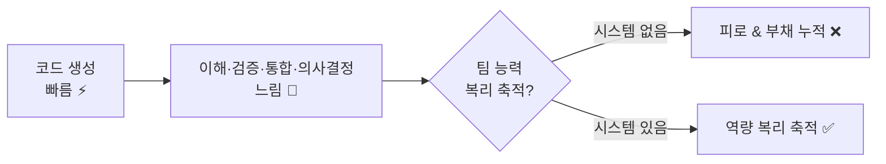
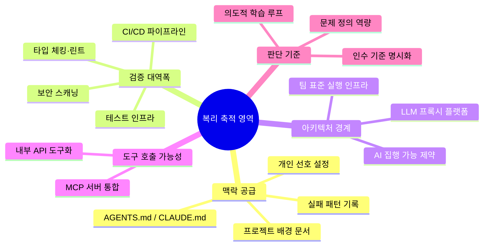
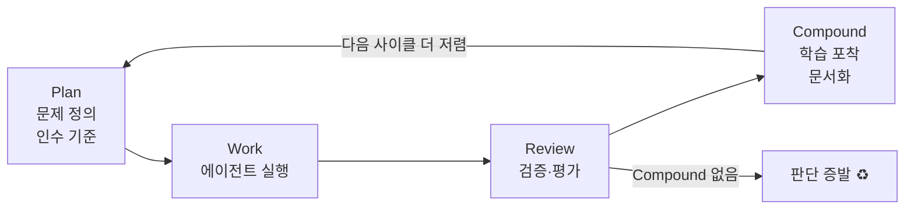
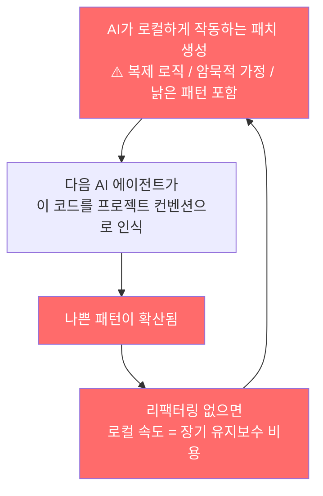
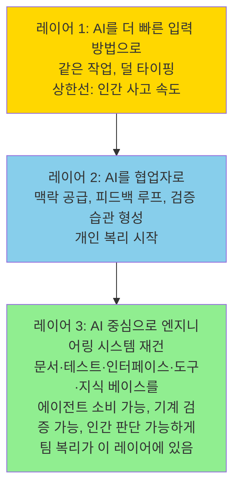

### [*What Actually Compounds in AI Coding*](https://yage.ai/share/ai-coding-compound-interest-en-20260429.html) — 심층 분석

---

## 개요

이 글은 Superlinear Academy가 2026년 4월 29일 발행한 아티클
["What Actually Compounds in AI Coding"](https://yage.ai/share/ai-coding-compound-interest-en-20260429.html)을
기반으로, 관련 최신 연구와 업계 데이터를 결합하여 전면적으로 재구성한 분석이다.

핵심 질문은 단순하다. **AI 코딩 도구를 도입하면 팀의 능력이 시간이 지날수록 복리로 쌓이는가, 아니면 소비되는가?**
이 물음에 대한 답은 흥분했다가 지치는 팀들의 경험 패턴, 쌓이는 것과 쌓이지 않는 것의 구분,
그리고 부정적 복리가 작동하는 하방 메커니즘을 순서대로 짚어가면서 도출된다.

---

## 1. 흥분에서 피로로: AI 코딩 도입의 전형적 궤적

AI 코딩 도구를 도입한 팀들이 공통적으로 경험하는 패턴이 있다.
도입 첫 1~2주는 말 그대로 감동적이다. 반나절이 걸리던 보일러플레이트 코드가 몇 분 만에 나오고,
귀찮아서 미뤄두던 작은 유틸리티들을 에이전트에게 시작만 맡겨도 바로 진척이 생긴다.
이 변화는 실재한다. 하지만 이것은 첫 주의 흥분을 설명할 뿐이지,
두 번째 달의 피로를 설명하지는 않는다.

두 번째 달이 되면 문제의 모양이 바뀐다.
코드 생성량은 늘었는데 리뷰 큐가 쌓이기 시작한다.
에이전트가 수정은 빠르게 하지만, 기존 로직을 더 쉽게 부수기도 한다.
어떤 경계선이 절대 침범해서는 안 되는지, 어떤 모듈 오너가 어느 수준의 추상화를 중요하게 생각하는지를
에이전트는 전혀 알지 못한다. 매 세션마다 프로젝트 맥락을 다시 설명해야 하는데,
이전 라운드에서 축적된 것이 어떤 메커니즘으로도 보존되지 않기 때문이다.
팀 전체가 AI를 쓰지만 결과물의 스타일, 추상화 경계, 품질 기준은 제각각이다.
AI가 코드를 쓰는 비용은 낮아졌지만, 팀 단위의 델리버리가 연속적으로 개선되고 있지는 않다.

이 상황의 핵심 구조를 도식으로 표현하면 아래와 같다.

속도가 빠른 단계는 생성(Generation)이다. 느린 단계는 이해(Understanding), 검증(Verification),
통합(Integration), 그리고 의사결정(Decision-making)이다.
AI는 첫 번째 단계만 가속했고, 나머지 네 단계는 그대로다.

---

## 2. '복리(Compounding)'의 정의를 먼저 잡아야 한다

이 글이 던지는 핵심 개념은 '복리'다.
복리란 오늘 반 시간을 절약하는 것이 아니라,
**오늘 한 일 덕분에 내일이, 다음 주가, 다음 프로젝트가 오늘보다 더 저렴해지는 것**을 의미한다.

이 기준으로 보면, AI 코딩 관련해 반복적으로 거론되는 것들 중 상당수는 복리 효과가 없다.

---

## 3. 복리가 되지 않는 것들

### 3.1 도구 구매

라이선스는 만료되고, 가격은 바뀌고, 새 도구가 이전 도구를 대체한다.
도구 자체는 전달 채널(delivery channel)일 뿐이다.
축적되는 것은 도구 그 자체가 아니라, 도구 주변에 쌓인 맥락·규칙·테스트·플랫폼이다.

2026년 현재, 엔지니어들의 AI 코딩 도구 지출에 대한 CFO들의 반발이 실제로 나타나고 있다.
Pragmatic Engineer의 2026년 설문에서, 일부 엔지니어들은 월 $600에 달하는 Cursor 비용을 치르다가
Claude Code로 전환하고 있다고 보고했다. 도구는 계속 바뀐다는 사실이 실증되고 있는 셈이다.

### 3.2 일회성 프롬프트 트릭

"이렇게 쓰면 더 잘 된다"는 프롬프트 기술의 수명은 모델 업그레이드 주기로 측정된다.
모델 업그레이드는 이제 몇 달 간격으로 일어난다.
모델 버전을 넘어서 살아남는 것은 이번 주에 어떤 표현이 더 잘 작동했는지가 아니라,
맥락의 품질과 검증 시스템의 엄밀함이다.

### 3.3 코드 라인 수 측정

코드 라인 수로 성과를 측정하는 것은 복리가 안 되는 걸 넘어서 역효과를 낸다.
GitClear가 2020년에서 2024년 사이에 변경된 2억 1천 1백만 라인을 분석한 결과,
리팩터링과 코드 이동은 25%에서 10% 미만으로 줄었고,
2024년의 코드 블록 복제 비율은 2020년의 무려 10배였다.
Larridin의 문서화에 따르면 배포 빈도는 두세 배 증가했지만 실질적인 산출물은 거의 변화가 없었다.

AI 시대에 의미 있는 지표는 코드 생존율(code survival rate), 변경 실패율(change failure rate),
리뷰 부담(review burden), 롤백 빈도(rollback frequency), 유지보수성 점수(maintainability score)다.
하지만 대부분의 팀은 여전히 처리량(throughput) 중심으로 측정하고 있다.
이것 자체가 AI가 엔지니어링 부채를 증폭시키는 메커니즘 중 하나다.

```mermaid
xychart-beta
    title "2020-2024 코드 품질 지표 변화 (GitClear)"
    x-axis ["리팩터링/코드이동", "복사-붙여넣기 코드"]
    y-axis "비율 (%)" 0 --> 30
    bar [25, 8.3]
    bar [10, 12.3]
```

### 3.4 시니어 엔지니어의 전수(全數) 코드 리뷰

인간의 읽기 대역폭(reading bandwidth)은 하드 상한선이다.
Colin Breck은 이것을 명확하게 표현했다: **인간은 AI가 쓰는 모든 코드를 읽을 시간이 결코 없다.**
리뷰는 라인-바이-라인 문법 점검에서 인텐트-바이-인텐트 설계 평가로 전환해야 한다.
기계가 컨벤션과 안전성 자동화를 담당하고, 인간은 설계 결정과 비즈니스 리스크를 평가해야 한다.
이 전환 없이는 시니어 엔지니어들이 조직이 AI로 우회하려 했던 바로 그 병목이 된다.

Faros AI의 1만 명 이상 개발자 대상 텔레메트리에 따르면,
AI 사용 팀은 작업을 21% 더 많이 완료하고 PR을 98% 더 많이 병합했지만,
PR 리뷰 시간도 91% 증가했다. 개인 산출량은 급등하지만 리뷰 대역폭은 그대로이므로,
큐는 리뷰 단계에서 쌓인다.

### 3.5 기록 없는 교육

워크숍이 끝나고 아무것도 규칙, 테스트, 공유 컨텍스트 파일에 기록되지 않으면,
조직 자본은 증가하지 않는다.

MIT Sloan의 연구 프레임워크는 세 가지를 구분한다:
**검증(Verification)** 은 이번 품질을 보증하고,
**평가(Evaluation)** 는 이번 라운드가 옳았는지를 판단하고,
**학습 포착(Learning Capture)** 은 다음 번 품질을 보증한다.
많은 팀이 처음 두 가지는 하지만 세 번째는 건너뛴다.
모든 리뷰 판단이 다음 사이클이 시작되기 전에 증발한다.
그것이 복리 없는 리뷰다.

---

## 4. 실제로 축적되는 것들

코드 생성 비용이 떨어지면, 엔지니어링 시스템의 병목은 쓰는 것에서 다섯 가지 영역으로 이동한다:
맥락 공급(context supply), 검증 대역폭(verification bandwidth),
아키텍처 경계(architectural boundaries), 도구 호출 가능성(tool callability),
판단 기준(judgment standards). 개인과 팀 모두의 복리는 이 다섯 영역에서 일어난다.

### 4.1 첫 번째 축적: 기계 판독 가능한 맥락

프로젝트 배경, 설계 결정, 실패한 시도, 테스트 컨벤션, 배포 방법, 개인 선호 —
이것을 한 번 써두면 모든 미래 에이전트 세션이 재사용한다.
ChatGPT 스타일의 대화는 매번 제로에서 시작하지만,
프로젝트 폴더 안의 규칙, 문서, 테스트 스위트, 로컬 지식 베이스는 사용할수록 두꺼워진다.

이 논리는 팀으로도 확장된다. **AGENTS.md**는 크로스툴 마크다운 명세 파일로,
AI 에이전트에게 어떻게 빌드하는지, 어떻게 테스트를 실행하는지,
어떤 컨벤션을 따르는지, 어떤 함정을 피해야 하는지를 알려준다.
유지 관리 원칙은 실용적이다: 에이전트가 같은 실수를 두 번 하면, 그 제약을 파일에 써 넣는다.
이것은 문서 업데이트의 동기를 "문서 KPI 충족"에서 "AI 행동 수정"으로 뒤집는다.
후자는 자기 지속적(self-sustaining)이다. 업데이트하지 않으면 오류가 계속 발생하기 때문이다.

### 4.2 두 번째 축적: 결정론적 검증 역량

AI 코딩을 사용할 때 효과적인 관행은, AI가 무언가를 쓰도록 허용하기 전에 묻는 것이다:
**"나중에 이것이 올바른지 어떻게 알 것인가?"**
테스트, 타입 체킹, 린트, 스크린샷, 벤치마크, 골든 케이스 — 이것들은 프로세스 오버헤드가 아니다.
AI를 위한 항법 신호(navigation signals)다.
검증이 결정론적일수록 AI가 자체적으로 더 많이 재작업할 수 있다.
검증이 없으면 인간이 AI 오류와 AI 수정 사이의 피드백 운반자가 된다. 그 모델은 스케일되지 않는다.

검증이 개인 습관에서 팀 인프라로 격상될 때 질적 전환이 발생한다.
Google의 DORA 2025 보고서(약 5,000명의 실무자 대상)는 하나의 결론을 내렸다:
**AI는 증폭기다 — 강점도 약점도 함께 증폭한다.**
강한 엔지니어링 기반을 가진 팀은 안정성을 희생하지 않고 처리량을 늘리고,
약한 기반을 가진 팀은 출력도 가속하지만 문제도 동시에 가속한다.

SonarSource는 이것을 이렇게 프레이밍했다: AI가 초당 수백 라인의 코드를 생성할 때,
전통적인 동료 리뷰의 전제는 더 이상 성립하지 않는다.
팀들은 "블랙박스 코드"의 시대로 진입하고 있다 —
기능적으로 올바르게 보이고 테스트를 통과하지만,
의존 관계와 암묵적 가정을 어떤 단일 개발자도 진정으로 소화하지 못한 코드.

### 4.3 세 번째 축적: 팀 표준을 실행 가능한 인프라로 인코딩

Martin Fowler와 Rahul Garg는 이것을 이렇게 프레이밍한다:
시니어 엔지니어의 패턴 체크, 컨벤션 집행, 리스크 알림은
한 사람의 머릿속 판단에서 공유 인프라로 마이그레이션될 수 있다.
핵심 단어는 "인프라"다: 인간이 읽는 스타일 가이드가 아니라,
AI가 집행할 수 있는 제약 — 명시적이고, 다중 예시가 있고, 검사 가능하며, 추상적 일반화가 적은.
동료가 떠나도 그 사람의 머릿속 기준은 문밖으로 걸어 나가지 않는다.

다음 레벨에서는 플랫폼 엔지니어링이 AI 활성화 레이어가 된다.
플랫폼 수준의 거버넌스 없이는, 모든 팀이 자체 규칙, 모델 선택, 비용 추적, 맥락 관리를 발명하고,
조직 역량은 결코 축적되지 않는다.

Shopify의 접근법이 참고 사례를 제공한다:
단일 AI 코딩 도구로 표준화하는 대신, Cursor, Claude Code, GitHub Copilot, 실험적 도구가
동시에 연결할 수 있는 중앙화된 LLM 프록시를 구축했다.
플랫폼이 통합된 거버넌스, 비용 통제, 권한, 컨텍스트 인젝션, 감사 로깅을 제공한다.
팀들은 자체 도구를 선택한다.
이것은 AI 도구를 개별 구독 모음에서 거버넌스되고 관찰 가능하며 누적 가능한 조직 역량으로 전환한다.

### 4.4 네 번째 축적: 문제 정의와 인수 기준

코드 생성이 저렴해지면, 실제로 희소한 것은 무엇을 쓸지, 왜 쓸지, 무엇이 올바른 것인지를 아는 것이다.
개인 역량은 모호한 요구사항을 에이전트 실행 가능한 태스크 정의로 번역하고,
암묵적 취향과 판단을 검사 가능한 기준으로 전환함으로써 축적된다.

Every.to는 **Plan → Work → Review → Compound** 4단계 사이클을 제안하며,
핵심 주장은 가치의 80%가 코딩 자체가 아니라 계획과 리뷰에 있다는 것이다.
하지만 계획은 마지막 "Compound" 단계가 실행될 때만 가치가 축적된다:
기능이 완성된 후, 설계 선택의 근거, 거부된 대안, 발생한 버그와 수정 패턴 —
이 모든 판단이 레포지토리에 다시 기록되어야 한다.
4단계가 없으면 매 라운드의 판단이 증발한다.

이와 밀접하게 연관된 것이 의도적 학습이다.
Anthropic이 52명의 주니어 엔지니어를 대상으로 수행한 RCT에서,
AI 보조 그룹은 방금 사용한 개념에 대한 이해도 테스트에서 17% 낮은 점수를 받았다.
하지만 고득점 그룹 내에서 AI 사용 방식이 유의미하게 달랐다:
그들은 AI로 생성한 다음, 설명을 요청하고, 대안을 비교하고,
스스로 재구성하고 검증했다. 출력을 액면 그대로 받아들이지 않았다.
학습 가속기로서의 AI는 역량을 복리로 쌓는다. 이해의 대체재로서의 AI는 역량을 소비한다.
이 차이는 행동의 문제이지, 도구의 속성이 아니다.

---

## 5. 하방 복리도 작동한다

축적되는 것은 긍정적 방향으로 복리가 될 수 있지만, 반대도 사실이다:
나쁜 패턴, 나쁜 습관, 나쁜 신호는 AI의 피드백 루프 안에서 자기 복제할 수 있다.

### 5.1 컨텍스트 오염

중앙 메커니즘은 컨텍스트 오염이다.
AI가 복제된 로직, 암묵적 가정, 또는 아무도 더 이상 따르지 않는 낡은 패턴을 모방한
로컬하게 작동하는 패치를 생성한다.
다음 이터레이션에서 또 다른 AI 에이전트가 이 코드를 읽고 모방할 프로젝트 컨벤션으로 취급한다.
나쁜 패턴은 개발자의 부주의가 아니라 스스로 전파되는 피드백 루프를 통해 퍼진다.
각 세대의 출력이 다음 세대를 훈련한다.

GitClear 데이터가 이것을 포착한다: 리팩터링과 코드 이동이 25%에서 10% 미만으로 떨어지는 동안,
복사-붙여넣기 코드는 8.3%에서 12.3%로 상승했다.
AI는 로컬하게 사용 가능한 코드를 생성하는 경향이 있다.
리팩터링과 아키텍처 판단 없이는, 로컬 속도가 장기 유지보수 비용으로 변한다.

### 5.2 다중 라운드 이터레이션의 보안 위험

IEEE ISTAS 2025 실험에서 400개 샘플을 40회 이터레이션했을 때,
**단 5라운드만에 치명적 취약점이 37.6% 증가했다.**
AI에게 명시적으로 보안을 개선하도록 요청했을 때도 새로운 취약점이 계속 나타났다.
AI 자기 이터레이션은 자동으로 상향 추세를 타지 않는다.
정적 분석, 보안 테스트, 인간 리뷰가 루프에서 제외되면,
반복 수정이 얕은 수정을 깊은 위험 축적으로 전환한다.

### 5.3 시스템 이해의 침식

더 깊은 문제는 시스템 이해의 침식이다.
상태 머신 설계부터 권한 경계, 실패 복구 경로까지의 핵심 비즈니스 로직이
주로 AI에 의해 생성되고, 팀이 각 레이어에서 이해를 검증하지 않으면,
시스템 행동 계약에 대한 정신적 소유권이 점차 사라진다.

표면적으로는 기능이 작동하고 테스트를 통과한다.
하지만 아무도 "이 주문 상태가 pending에서 shipped로 바로 점프할 수 있는" 이유를 설명할 수 없다.
테스트는 특정 케이스가 통과함을 증명한다.
하지만 새벽 3시 프로덕션 인시던트 상황에서,
이 시스템이 왜 잘못된 상태에 들어갔는지 정확히 아는 능력을 대체할 수 없다.
그 순간의 복구 비용이 수개월간의 "편의"의 누적 청구서다.

이것을 더 악화시키는 것은 점진성이다:
각 AI 이터레이션이 이미 불투명한 로직 위에 구현을 쌓아서,
어느 누구도 독립적으로 핵심 로직을 수정할 수 없는 상태가 될 때까지 계속된다.

### 5.4 협업 감소의 숨겨진 비용

MIT Sloan의 연구는 쉽게 간과되는 변화를 문서화했다:
Copilot 사용자의 동료 협업이 거의 80% 감소했다.
그 중 일부는 가치 있을 수 있다 — 낮은 가치의 방해가 AI로 대체된 것.
하지만 다른 부분은 캐주얼한 질문과 페어 프로그래밍을 통해 전달되던 암묵적 지식이다.
그 지식이 에이전트 판독 가능한 문서로 포착되지 않으면,
협업 감소가 장기적인 지식 격차가 된다.

### 5.5 신뢰와 인식의 괴리

Stack Overflow의 2025년 4만 9천 명 이상 개발자 대상 설문에서,
AI 도구 사용 또는 채택 의향은 76%에서 84%로 상승했지만,
AI 출력 정확도에 대한 불신도 31%에서 46%로 상승했다. 높은 신뢰를 표현한 비율은 3.1%에 불과했다.
JetBrains의 2025년 2만 4천 534명 개발자 대상 설문에서 85%가 AI를 사용하지만,
44%만 핵심 워크플로우에 내재화했다.
사용과 신뢰 사이의 격차는 "쓰지만 신뢰하지 않는" 상태다.
무엇을 신뢰하고 무엇을 신뢰하지 않을지에 대한 공유된 검증 기준 없이는,
팀은 최악의 조합에 빠진다: 무거운 AI 사용 + 생성된 모든 라인에 대한 인간 이중 점검.

### 5.6 인식 편향: 실제 속도와 체감 속도의 역설

인식 편향이 이것을 수정하기 더 어렵게 만든다.

METR은 16명의 경험 있는 오픈소스 개발자를 모집하고
246개의 실제 이슈에서 AI 사용 여부를 무작위 배정했다.
결과는 충격적이었다: **AI 사용자들은 작업 완료에 19% 더 오래 걸렸지만,
주관적으로는 20% 더 빠르다고 느꼈다.**

개발자들은 AI를 사용하면 작업 속도가 24% 빨라질 것이라 예측했고,
실제로 느려졌음에도 불구하고 20% 빨라졌다고 믿었다.
인간의 인식은 생성의 순간적인 속도를 기억하고, 이해·수정·검증의 더 느린 속도를 무시한다.

> 주목할 만한 사실: METR의 후속 연구(2026년 2월)에서는 후기 AI 모델들에 대해
> 일부 속도 향상 징후가 나타났다. 특히 Claude Code with Opus 4.5 등 에이전틱 도구가
> 초기 2025년 Cursor 기반 연구와는 다른 결과를 보일 수 있다는 점에서,
> 이 연구는 진화하는 AI 역량에 대한 스냅샷으로 이해해야 한다.

측정 없이는, 개인은 "빠르게 느껴지는 것"이 아니라 실제로 작동하는 것으로 향하지 않는다.

---

## 6. AI 코딩 도입의 세 레이어

AI 코딩 도입은 세 레이어로 이해될 수 있다.

**레이어 1**: AI를 더 빠른 입력 방법으로 취급한다. 같은 작업, 덜 타이핑. 이점은 직관적이고 실재하지만, 상한선은 인간의 사고 속도다.

**레이어 2**: AI를 협업자로 취급한다. 맥락 공급, 피드백 루프, 검증 습관이 형성되기 시작한다. 개인 복리가 여기서 시작된다.

**레이어 3**: AI를 중심으로 엔지니어링 시스템을 재건한다. 문서, 테스트, 인터페이스, 도구, 지식 베이스를 에이전트가 소비할 수 있고, 기계가 검증할 수 있고, 인간이 판단할 수 있게 만든다. 팀 복리는 이 레이어에 있다.

도구는 계속 개선될 것이다. 하지만 팀들 간의 격차는 누가 더 나은 모델에 대한 접근권을 샀는지에서 오지 않을 것이다. 그것은 누가 AI가 효과적으로 작동하고 인간이 효과적으로 판단할 수 있는 엔지니어링 환경으로 더 일찍 재건했는지에서 올 것이다. **그 격차가 복리가 된다.**

---

## 7. 2026년 최신 맥락: 업계 현황

### 생성 코드 비율의 급증

2026년 초 현재, AI 생성 코드의 비율은 거의 50%에 육박하며,
채택 곡선은 초기 예측보다 빠르게 가팔라지고 있다.
Google의 Sundar Pichai는 전체 코드의 25%가 AI 보조 생성이라고 밝혔으며,
이것이 대체가 아닌 엔지니어링 속도(+10%)의 실질적 이득임을 강조했다.

### 역설적 고용 시장

흥미롭게도, AI 도구들이 개별 개발자를 더 생산적으로 만들면서
기업들은 더 많은 소프트웨어를 더 빨리 출시할 수 있다고 믿게 되고,
이것이 더 큰 엔지니어링 팀에 대한 투자를 견인하고 있다.
2026년 소프트웨어 엔지니어 구인 공고는 30% 증가해 67,000개를 넘었다 —
AI 주도 감원 5만 2천 건이 있었음에도 불구하고.
역할이 제거되는 것과 역할이 창출되는 것 사이의 선명한 분할이 드러나고 있다.

### 에이전틱 전환의 가속

2026년은 에이전틱 AI가 소프트웨어 개발 라이프사이클 전체를 재구성하는 해로 예고되고 있다.
과거에는 몇 주간의 크로스팀 조율이 필요했던 작업들이
집중적인 작업 세션으로 압축될 수 있게 되었다.
이 역량 확장은 더 촘촘한 피드백 루프와 더 빠른 학습을 가능하게 한다.

---

## 8. 결론: 희소한 것은 무엇인가

코드 생성이 제로 비용에 가까워지면, 실제로 희소해지는 것은 변하지 않는다:
무엇을 만들지 명확하게 생각하는 것, 올바르게 만들었음을 체계적으로 검증하는 것,
다음 라운드를 오늘보다 더 저렴하게 만드는 조직 기억.
이것들은 항상 엔지니어링 덕목이었다. AI는 이것들을 "잘하면 좋다"에서
**"안 하면 실패한다"로** 이동시켰을 뿐이다.

다른 각도에서 보면, AI 코딩 붐에서 가장 과소평가된 것들은 정확히 주목받지 못하는 것들이다:
지속적으로 업데이트되는 컨텍스트 파일, 모든 AI 세션에서 실행되는 안전 규칙,
공유된 테스트 인프라, 모든 인시던트 교훈을 시스템에 다시 기록하는 메커니즘.
이것들은 Hacker News 1면을 장식하지 않을 것이다.
하지만 이것들이 팀이 역량을 축적하고 있는지, 아니면 소비하고 있는지를 결정한다.

**도구는 구식이 된다. 모델은 교체된다. 이 엔지니어링 자산들은 복리가 된다.**

---

*작성일: 2026년 4월 30일*

*참고 자료: Superlinear Academy "What Actually Compounds in AI Coding" (2026.04.29), METR RCT Study (2025.07), Google DORA 2025 Report, GitClear 2025 Research, Faros AI Productivity Paradox Report, MIT Sloan Generative AI Research, Stack Overflow Developer Survey 2025, JetBrains Developer Survey 2025, Anthropic RCT on Junior Engineers, IEEE ISTAS 2025 Security Experiment, Anthropic 2026 Agentic Coding Trends Report*
