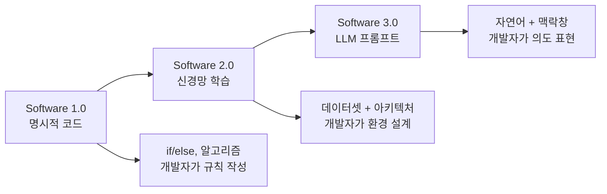
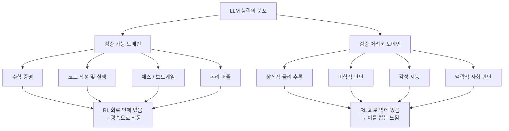
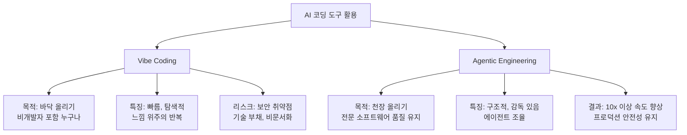
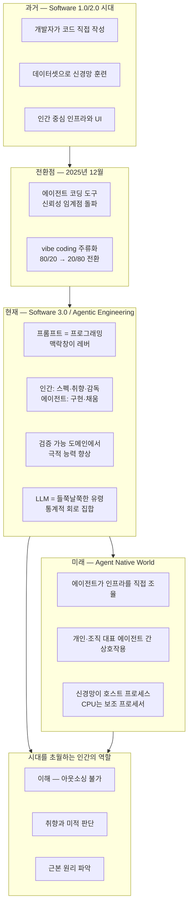

### AI Ascent 2026 — Sequoia Capital × Andrej Karpathy 대담 완전 분석

> **출처:** [YouTube — Sequoia Capital, 2026.04.30](https://www.youtube.com/watch?v=96jN2OCOfLs)  
> **발표자:** Andrej Karpathy (OpenAI 공동창업자, Tesla Autopilot 前 총괄, Eureka Labs 창업자)  
> **진행자:** Stephanie Zhan (Sequoia Capital 파트너)  
> **행사:** AI Ascent 2026


---

## 목차

1. [발표자 소개와 배경](#1-발표자-소개와-배경)
2. ["가장 뒤처진 프로그래머" — 2025년 12월의 전환점](#2-가장-뒤처진-프로그래머--2025년-12월의-전환점)
3. [Software 3.0 — 새로운 컴퓨팅 패러다임](#3-software-30--새로운-컴퓨팅-패러다임)
4. [에이전트가 인스톨러가 된다 — OpenClaw 사례](#4-에이전트가-인스톨러가-된다--openclaw-사례)
5. [MenuGen vs. Raw Prompt — 낡은 패러다임의 종말](#5-menugen-vs-raw-prompt--낡은-패러다임의-종말)
6. [2026년에 당연해 보일 것들](#6-2026년에-당연해-보일-것들)
7. [검증 가능성(Verifiability)과 들쭉날쭉한 지능](#7-검증-가능성verifiability과-들쭉날쭉한-지능)
8. [파운더를 위한 조언 — 자동화의 프런티어](#8-파운더를-위한-조언--자동화의-프런티어)
9. [Vibe Coding에서 Agentic Engineering으로](#9-vibe-coding에서-agentic-engineering으로)
10. [LLM은 동물이 아니라 유령이다](#10-llm은-동물이-아니라-유령이다)
11. [에이전트 네이티브 세계와 학습의 미래](#11-에이전트-네이티브-세계와-학습의-미래)
12. [전체 패러다임 지도 — Mermaid 다이어그램](#12-전체-패러다임-지도--mermaid-다이어그램)
13. [핵심 인사이트 요약](#13-핵심-인사이트-요약)

---

## 1. 발표자 소개와 배경

Andrej Karpathy는 현재 살아있는 AI 연구자 중 가장 광범위한 실전 경험을 가진 인물로 손꼽힌다. 그는 OpenAI 공동창업자 중 한 명으로 이 행사가 열린 바로 그 사무실 안에서 회사를 공동창업했으며, Tesla에서는 Autopilot 자율주행 시스템을 실제로 동작하는 수준으로 구현한 장본인이다. 현재는 AI 네이티브 교육 플랫폼 Eureka Labs를 운영하고 있다.

그가 대중적으로 더 잘 알려진 계기는 2025년 초 "vibe coding"이라는 용어를 만들어낸 것이다. 자연어 프롬프트로 소프트웨어를 만들어내는, 그야말로 '느낌대로 코딩하는' 이 개념은 순식간에 바이럴되어 개발 문화 전반에 영향을 미쳤다. 그로부터 약 1년 뒤, Karpathy는 Sequoia Capital의 AI Ascent 2026 무대에서 훨씬 더 성숙하고 구조화된 후속 개념을 제시하기 위해 다시 섰다.

진행자 Stephanie Zhan은 첫 질문부터 예리하게 치고 들어간다. "vibe coding을 만들어낸 당신이 '프로그래머로서 지금껏 가장 뒤처진 느낌'이라고 말했다. 어떤 심경이었냐"는 것이다. 이 물음 하나가 이 대담의 핵심 긴장을 만들어낸다.

---

## 2. "가장 뒤처진 프로그래머" — 2025년 12월의 전환점

Karpathy에게 2025년 12월은 단순한 시간적 경계가 아니라 질적인 단절의 순간이었다. 그 이전에도 Lot Code 같은 에이전트 도구들을 사용해왔지만, 모델이 코드 청크를 잘못 작성하면 수정해야 했고, 여전히 개발자가 손을 많이 대야 했다. 그러다 12월부터 무언가가 바뀌었다.

"청크들이 그냥 맞게 나오기 시작했어요. 더 요청하면 그것도 맞았고, 언제 마지막으로 수정했는지 기억이 나지 않아요. 그냥 시스템을 점점 더 믿게 됐고, 그렇게 vibe coding을 하고 있었습니다."

이 진술은 단순한 개인 경험 공유가 아니다. Karpathy는 많은 사람들이 2025년 내내 AI를 'ChatGPT 같은 것' 정도로만 경험했지만, 12월 시점을 기준으로 다시 바라봐야 한다고 강조한다. 특히 에이전트적이고 일관된 워크플로우가 실제로 작동하기 시작한 시점이 바로 그때라는 것이다. 그 결과 그의 사이드 프로젝트 폴더는 "매우 가득 찼다"고 표현할 정도가 되었고, 항상 무언가를 vibe coding하는 자신을 발견하게 됐다.

이 맥락에서 "가장 뒤처진 프로그래머"라는 표현은 절망이 아닌 경이로움에 가깝다. 직접 코드를 짜는 행위 자체가 의미를 잃어가는 속도가 너무 빨라서, 자신이 그 흐름을 따라가기 바쁠 정도라는 의미다. 설레면서도 당황스러운 감정의 혼합이라고 그는 솔직하게 인정한다.

---

## 3. Software 3.0 — 새로운 컴퓨팅 패러다임

Karpathy는 소프트웨어의 역사를 세 단계로 구분하는 프레임워크를 제시한다. 이 구분은 단순한 도구의 변화가 아니라 프로그래밍의 본질이 무엇인지에 대한 재정의다.

```
Software 1.0: 개발자가 코드를 직접 작성한다.
              → 명시적인 규칙, 조건문, 알고리즘

Software 2.0: 개발자가 데이터셋을 구성하고 신경망을 훈련한다.
              → 프로그래밍 = 데이터 배치 + 목적함수 설계 + 아키텍처 선택

Software 3.0: 개발자가 자연어 프롬프트로 LLM에게 지시한다.
              → 프로그래밍 = 맥락창(context window) 안에 넣을 텍스트 구성
```

핵심은 GPT 계열 LLM들이 인터넷 전체를 학습하는 과정에서 사실상 수천 가지 태스크를 동시에 멀티태스킹하도록 강제되었고, 그 결과 일종의 프로그래밍 가능한 컴퓨터가 되었다는 것이다. LLM은 이제 맥락 창을 해석하는 인터프리터이며, 우리가 그 맥락 창에 무엇을 담느냐가 곧 프로그래밍이 된다.

이 프레임을 받아들이는 순간 팀이 무언가를 만드는 방식은 근본적으로 달라져야 한다. 이전에는 "어떻게 코드로 명세할까"를 고민했다면, 이제는 "에이전트에게 복사-붙여넣기할 텍스트가 무엇인가"를 고민하는 패러다임이다.



---

## 4. 에이전트가 인스톨러가 된다 — OpenClaw 사례

Software 3.0 패러다임이 실제로 어떻게 다른지를 보여주는 첫 번째 구체적 사례가 [OpenClaw](https://openclaw.ai/)(컴퓨터의 OS 권한을 바탕으로 파일 관리, 웹 브라우징, 터미널 명령 등 실제 작업을 자율적으로 수행하는 오픈소스 AI 에이전트 프레임워크) 설치 방식이다.

전통적인 소프트웨어 설치는 셸 스크립트로 이루어진다. 다양한 플랫폼과 환경을 지원하다 보면 이 스크립트가 거대하게 부풀어 오르고 복잡해진다. 개발자는 모든 경우의 수를 명시적으로 코드에 담아야 한다. 이것은 전형적인 Software 1.0 방식이다.

그런데 OpenClaw의 설치 방식은 전혀 다르다. "이 텍스트를 복사해서 에이전트에게 붙여넣으세요." 그게 전부다. 에이전트가 자신의 지능을 동원해 현재 환경을 파악하고, 무엇이 필요한지 추론하고, 에러가 나면 스스로 디버깅하며 설치를 완료한다. 개발자는 모든 경우의 수를 미리 코드에 적을 필요가 없다. 에이전트가 그 빈칸을 스스로 채운다.

Karpathy는 이것이 "훨씬 더 강력하다"고 말한다. 세부 사항을 정밀하게 명세하지 않아도 되며, 에이전트가 자신의 환경을 보고 지능적인 행동을 취하기 때문이다. Software 3.0의 핵심이 이 단순한 설치 과정 하나에 응축되어 있다.

---

## 5. MenuGen vs. Raw Prompt — 낡은 패러다임의 종말

두 번째 사례는 더 극적이다. Karpathy는 레스토랑 메뉴 사진을 찍으면 각 항목의 이미지를 보여주는 "MenuGen" 앱을 vibe coding으로 만들었다. 앱이 메뉴를 OCR로 읽고, 이미지 생성 모델로 각 음식 사진을 만들어 렌더링한다. 꽤 공을 들인 작업이다.

그런데 이것의 Software 3.0 버전을 목격한 순간, 그는 충격을 받는다. 누군가가 그냥 메뉴 사진을 Gemini에게 주면서 "Nanabanana를 사용해서 메뉴 위에 음식 이미지를 오버레이해줘"라고 프롬프트를 넣었더니, Nanabanana가 원본 메뉴 사진 픽셀 위에 각 항목의 시각화를 직접 렌더링한 결과물을 돌려줬다는 것이다.

Karpathy의 결론은 명쾌하다. "내 MenuGen 전체가 쓸모없어졌어요. 그 앱은 존재하면 안 됩니다." 신경망이 대부분의 작업을 직접 수행하고, 프롬프트나 맥락은 그냥 이미지 하나이고, 출력도 이미지 하나인데, 그 사이에 앱이라는 중간 레이어가 필요 없어졌다.

이것이 Software 3.0의 진짜 의미다. 단순히 기존 개발이 빨라지는 게 아니다. 기존에 존재했던 많은 앱들이 사실 필요 없는 것이 된다. 더 정확히 말하면, 기존 패러다임에서만 의미 있었던 앱들이 사라지고, 그 자리를 신경망과 프롬프트의 조합이 직접 채운다.

그는 이것이 프로그래밍의 속도를 높이는 문제가 아니라 더 일반적인 정보 처리 자동화의 문제라고 강조한다. 코드는 구조화된 데이터 위에서 작동했지만, 이제는 비구조화된 정보, 이미지, 지식 등을 직접 처리하는 것이 가능해졌다.

> "이전에는 존재할 수 없었던 새로운 것들이 이제 가능해집니다. 기존에 있던 것들이 빨라지는 게 아니에요. 가장 흥미로운 것은 그게 아닙니다."

---

## 6. 2026년에 당연해 보일 것들

질문은 미래로 향한다. 90년대에 웹사이트를 만든 것, 2010년대에 모바일 앱을 만든 것, 지난 클라우드 시대에 SaaS를 만든 것처럼, 지금은 대부분 만들어지지 않았지만 나중에 되돌아보면 당연해 보일 것이 무엇이냐는 물음이다.

Karpathy의 외삽(extrapolation)은 꽤 급진적이다. MenuGen 예시에서 보듯 많은 코드가 사라진다면, 그 끝은 어디인가. 그는 완전히 뉴럴 컴퓨터를 상상할 수 있다고 말한다. 원시 비디오나 오디오 입력을 받아 신경망이 직접 처리하고, 디퓨전으로 그 순간에 최적화된 UI를 렌더링하는 장치. 각 사용자와 상황에 맞게 UI 자체가 생성되는 세계.

더 흥미로운 역사적 관찰이 뒤따른다. 컴퓨팅 초기인 1950~60년대에 컴퓨터가 계산기처럼 생길지, 아니면 신경망처럼 작동할지가 명확하지 않았다고 그는 지적한다. 결국 계산기 경로, 즉 클래식 컴퓨팅으로 갔고, 신경망은 그 위에 가상화되어 돌아가고 있다. 하지만 미래에는 이 관계가 뒤집힐 수 있다.

```
현재: [CPU/GPU 클래식 컴퓨팅] → 신경망이 그 위에서 가상화
미래: [신경망] → CPU가 결정적 태스크를 위한 보조 프로세서로
```

신경망이 메인 프로세스가 되고, CPU는 특정 결정적 작업(deterministic tasks)을 위한 도구 사용(tool use) 용도로만 남는 세계. Karpathy는 "매우 이질적이고 낯선 결과물"이라고 부르면서도, "우리는 아마 단계적으로 그쪽으로 가게 될 것"이라고 말한다.

---

## 7. 검증 가능성(Verifiability)과 들쭉날쭉한 지능

이 대담에서 가장 분석적으로 밀도가 높은 구간이다. Karpathy는 AI가 어떤 도메인을 더 빠르게, 더 쉽게 자동화하는지를 이해하는 핵심 개념으로 **검증 가능성(Verifiability)** 을 제시한다.

전통적 컴퓨터는 코드로 명세할 수 있는 것을 쉽게 자동화한다. 그렇다면 현세대 LLM은 무엇을 쉽게 자동화하는가? 바로 **검증할 수 있는 것**이다. 프런티어 랩들이 LLM을 훈련시킬 때 거대한 강화학습 환경을 사용하며, 검증 가능한 보상 신호를 모델에게 준다. 그 결과 모델은 수학, 코드처럼 객관적으로 정답을 확인할 수 있는 도메인에서 능력이 폭발적으로 성장하고, 그 외 영역에서는 들쭉날쭉(jagged)한 모습을 보인다.



가장 극적인 사례로 그는 이렇게 말한다: "10만 줄짜리 코드베이스를 리팩토링하거나 제로데이 취약점을 찾아낼 수 있는 모델이 동시에 '세차장이 50미터 앞에 있으니 걸어서 가세요'라고 대답합니다. 이건 미친 거예요." (차를 세차하러 가는데 걸어가면 차가 없다는 상식을 모른다.)

이 들쭉날쭉함은 두 가지를 함의한다. 첫째, 모델이 아직 완전하지 않으며, 사람이 루프에 머물며 무엇을 하고 있는지 파악해야 한다. 둘째, 어느 회로(circuit) 안에 있는 태스크인지를 먼저 파악해야 모델을 효과적으로 활용할 수 있다. 만약 자신의 애플리케이션이 RL 회로 밖에 있다면, 범용 모델에 의존하지 말고 파인튜닝을 진지하게 검토해야 한다.

체스 능력의 사례도 시사적이다. GPT-3.5에서 GPT-4로 넘어가면서 체스 능력이 크게 향상됐는데, 이는 순수한 스케일 업의 결과가 아니었다. OpenAI 내부의 누군가가 체스 데이터를 사전훈련 세트에 대량 포함시켰기 때문이다. 즉, 우리는 어느 정도 "랩들이 무엇을 믹스에 넣느냐"에 의존할 수밖에 없으며, 매뉴얼 없이 주어진 도구를 직접 탐색하며 어느 회로가 강하고 어느 회로가 약한지를 스스로 발견해야 한다.

---

## 8. 파운더를 위한 조언 — 자동화의 프런티어

수학, 코딩처럼 가장 명확하게 검증 가능한 도메인에서 이미 랩들이 탈출 속도(escape velocity)를 달성한 것처럼 보인다면, 파운더는 어디서 기회를 찾아야 하는가.

Karpathy의 답변은 검증 가능성 프레임을 창업에 그대로 적용하는 것이다. 대형 랩들이 아직 집중하지 않은 도메인 중에서 검증 가능한 환경을 만들 수 있는 곳이 있다면, 그곳은 여전히 기회다. 직접 RL 환경이나 파인튜닝을 수행할 수 있기 때문이다. 대규모 다양한 데이터셋과 RL 환경이 있다면 실제로 잘 작동하는 모델을 만들 수 있는 기술 자체는 이미 존재한다.

그는 구체적인 사례를 제시하지는 않았다("무대 위에서 힌트를 줄 생각은 없다"며 웃으며 회피했다). 하지만 프레임은 명확하다.

**파운더가 자문해야 할 질문:**
- 이 도메인에서 성공/실패를 객관적으로 검증할 수 있는가?
- 그 검증 환경을 데이터화할 수 있는가?
- 대형 랩들이 아직 이 영역에 집중하지 않았는가?

반대로, 거의 모든 것이 어느 정도는 검증 가능하게 만들 수 있다는 점도 그는 강조한다. 글쓰기처럼 주관적으로 보이는 영역도 LLM 심사단(judge council)을 활용하면 합리적인 수준의 검증 환경을 구성할 수 있다. 결국 차이는 "가능/불가능"이 아니라 "쉬움/어려움"의 스펙트럼이다.

---

## 9. Vibe Coding에서 Agentic Engineering으로

이 대담의 가장 중심적인 개념 전환이 여기에 있다. Karpathy는 두 용어를 명확하게 구분한다.

### Vibe Coding
> "바닥을 높인다. 모든 사람이 소프트웨어에서 할 수 있는 것의 하한선이 높아진다."

비개발자도 앱을 만들 수 있게 해주는 민주화의 도구다. 탐색적이고, 자유롭고, 빠르다. 하지만 보안 취약점, 기술 부채, 비문서화된 비즈니스 로직이라는 대가가 따른다. 개발자가 코드 diff를 읽지 않고 "바이브에 완전히 항복"하면 프로덕션 환경에서 심각한 문제가 발생한다.

### Agentic Engineering
> "이전에 존재했던 프로덕션 소프트웨어의 품질 기준을 지키면서 더 빠르게 간다."

이것은 하나의 엔지니어링 규율(engineering discipline)이다. Karpathy가 이 단어를 선택한 이유는 명확하다. "Agentic"은 대부분의 시간에 코드를 직접 작성하지 않고 에이전트를 지휘한다는 현실을 반영한다. "Engineering"은 그 지휘에 기술, 예술, 그리고 깊이가 있음을 강조한다.



채용 프로세스도 바뀌어야 한다고 그는 제안한다. 여전히 알고리즘 퍼즐을 풀게 하는 것은 구시대적이다. 대신 이런 식이어야 한다: "트위터 클론을 구현하세요. 에이전트들이 실제 활동을 시뮬레이션합니다. 그리고 제가 10개의 Codex 에이전트를 투입해서 당신의 서비스를 해킹하려 할 겁니다. 뚫리면 안 됩니다." 큰 프로젝트를 완성하고 실제 공격을 방어할 수 있는지가 agentic engineer를 검증하는 진짜 기준이다.

현재 10x 개발자라는 개념도 재정의가 필요하다. 이 분야에서 정말 잘하는 사람들의 배수는 10x가 아니라 그것을 훨씬 뛰어넘는다. 잠재적 천장이 엄청나게 높다는 의미다.

---

## 10. LLM은 동물이 아니라 유령이다

이 대담에서 철학적으로 가장 날카로운 부분이다. Karpathy는 LLM을 이해하는 적절한 비유로 "동물"이 아닌 "유령"을 제안한다.

우리는 보통 AI를 만들 때 "지능을 키우는" 것처럼 생각한다. 유아에서 성인으로 성장하는 동물처럼. 하지만 이 비유는 잘못됐다는 것이 그의 주장이다.

**동물 비유의 문제점:**
- 동물은 생존 압력과 진화적 필요에 의해 내재적 동기를 가진다
- 동물은 호기심, 재미, 역량 증진에 대한 욕구가 있다
- 지식과 문제 해결 능력이 전 영역에 걸쳐 높은 상관관계를 보이며 고르게 성장한다

**LLM(유령)의 실체:**
- 사전훈련 기반: 인류 텍스트의 통계적 시뮬레이션
- RL로 강화: 수학 퍼즐에서 보상, 사람의 투표에서 보상
- 내재적 동기가 없는 통계적 회로들의 집합
- 들쭉날쭉한(jagged) 능력 분포

이 비유가 실용적으로 중요한 이유는 LLM을 어떻게 다루어야 하는지에 대한 기대치 교정 때문이다. 예를 들어, LLM에게 소리를 질러도 더 잘 작동하거나 덜 작동하지 않는다. 그것은 감정을 가진 존재가 아니기 때문이다. 이 모든 것은 그냥 통계적 시뮬레이션 회로다.

유령이라는 메타포는 "소환된다(summoned)"는 느낌도 담고 있다. 데이터와 보상 함수에 의해 형태가 결정되는 무언가. 그 형태가 무엇인지를 파악하는 것, 어느 회로가 강하고 어느 회로가 약한지를 탐색하는 것이 LLM 활용의 핵심 역량이다.

> "만약 RL에 포함된 회로 안에 있다면 광속으로 날아갑니다. 데이터 분포 밖에 있다면 고군분투하게 되죠. 어느 회로 안에 있는지 파악해야 합니다."

---

## 11. 에이전트 네이티브 세계와 학습의 미래

### 에이전트 네이티브 세계

Karpathy는 현재 인프라 대부분이 여전히 인간을 위해 설계되어 있다는 점에 답답함을 느낀다. 라이브러리 문서도, 서비스 설정 UI도 모두 "사람이 직접 할 것"을 전제로 만들어졌다. 그는 이렇게 불평한다: "이 URL로 가세요 같은 말을 들을 때마다 답답합니다. 나는 아무것도 하고 싶지 않아요. 에이전트에게 복사-붙여넣기할 텍스트가 뭔지 알려주세요."

미래의 인프라가 에이전트 네이티브가 된다는 것은 구체적으로 무엇을 의미하는가. MenuGen을 배포할 때 Vercel 설정, DNS 구성, 서비스 연결 등으로 얼마나 힘들었는지를 예로 들며, 그는 이상적인 테스트를 제시한다: "프롬프트 하나로 앱을 만들고 배포까지 되어야 한다. 그 과정에서 아무것도 직접 건드리지 않아야 한다." 그것이 인프라가 충분히 에이전트 네이티브해졌는지의 기준이다.

에이전트들이 더 많은 권한과 맥락을 가지게 되면 궁극적으로 개인과 조직을 대표하는 에이전트 간의 상호작용 세계로 간다. "내 에이전트가 당신 에이전트와 이야기해서 미팅 세부 사항을 조율한다"는 것이 그가 그리는 방향이다.

### 인간에게 남는 것 — 취향, 판단, 이해

에이전트가 점점 더 많은 것을 대신 하게 될 때, 인간에게 더 가치 있어지는 기술은 무엇인가. Karpathy의 현재 답은 이렇다:

**여전히 인간이 담당해야 하는 것:**
- 미학적 취향(aesthetics)
- 엔지니어링 설계와 판단
- 스펙의 최상위 수준 정의
- 에이전트들이 만든 결과물에 대한 감독과 교정

구체적인 에피소드가 인상적이다. MenuGen에서 Google 계정으로 가입하고 Stripe으로 결제할 때 에이전트가 이 두 이메일을 매칭하려다 문제가 발생했다. Stripe 이메일과 Google 이메일이 다를 수 있다는 것을 에이전트가 파악하지 못한 것이다. 이런 상식적 설계 판단이 아직 에이전트에게는 부족하다.

또한 그는 NumPy, PyTorch의 `keepdims` vs `keepdim`, `axis` vs `dim`, `reshape` vs `permute` 같은 API 세부 사항은 이미 잊어버렸다고 말한다. 에이전트가 다 기억하기 때문이다. 하지만 텐서의 뷰(view)와 스토리지(storage)의 차이, 어느 경우에 메모리 복사가 발생하는지 같은 **근본적인 이해**는 여전히 필요하다. "인턴(에이전트)은 API 세부사항을 기억하지만, 당신은 왜 그것이 문제인지를 알아야 한다."

### 학습에 대한 결론 — "생각은 아웃소싱해도, 이해는 아웃소싱할 수 없다"

대담의 마지막을 장식하는 것은 트위터에서 본 한 문장이다.

> **"You can outsource your thinking, but you can't outsource your understanding."**  
> *(생각은 아웃소싱할 수 있지만, 이해는 아웃소싱할 수 없다.)*

Karpathy는 이 문장을 며칠에 한 번씩 떠올린다고 말한다. 에이전트에게 점점 많은 것을 위임할수록, 무엇을 만들어야 하는지, 왜 그게 가치 있는지, 어떻게 방향을 지시해야 하는지를 아는 것은 여전히 인간의 몫이다. 자신이 에이전트의 병목이 되고 있다고 느낄 정도로, 이해 자체가 점점 더 희소하고 가치 있는 자원이 된다.

그가 LLM 기반 지식 베이스(LLM wikis)에 관심을 갖는 이유도 여기 있다. 같은 데이터를 다른 각도에서 바라보는 투영(projection)을 경험할 때마다 새로운 통찰을 얻는다고 그는 말한다. 이 과정이 이해를 깊게 하는 방법이기 때문이다.

---

## 12. 전체 패러다임 지도 — Mermaid 다이어그램



---

## 13. 핵심 인사이트 요약

이 대담에서 Karpathy가 전달하는 메시지는 여러 층위에 걸쳐 있다. 몇 가지 핵심 명제로 압축하면 다음과 같다.

**패러다임 전환에 관하여**  
2025년 12월은 에이전트 코딩 도구의 신뢰성이 임계점을 돌파한 시점이다. 단순히 도구가 개선된 것이 아니라, 개발자가 도구를 신뢰하는 수준이 바뀌었다. 이 전환을 아직 경험하지 못했다면, 지금 다시 살펴봐야 한다.

**무엇이 사라지고 무엇이 남는가**  
많은 앱들이 "존재하지 않아야 할" 앱이 된다. 신경망과 프롬프트만으로 해결되는 것들 사이에 있는 중간 레이어가 제거된다. 반면, 무엇을 만들어야 하는지 방향을 정하는 이해와 판단은 더 희소해지고 더 가치 있어진다.

**어디에 기회가 있는가**  
대형 랩들이 아직 포커스를 맞추지 않은, 하지만 검증 가능한 RL 환경을 구성할 수 있는 도메인. 검증 가능하면 파인튜닝을 통한 독자적 능력 개발이 가능하다.

**Vibe Coding과 Agentic Engineering의 차이**  
Vibe Coding은 하한선을 높이는 도구다. Agentic Engineering은 상한선을 높이는 규율이다. 프로덕션 소프트웨어에는 후자가 필요하다. 두 개념을 혼동하는 것이 지금 업계에서 가장 흔한 실수다.

**LLM을 이해하는 올바른 모델**  
동물처럼 고르게 성장하는 지능이 아니라, 데이터와 보상 함수에 의해 소환된 통계적 회로들의 집합. 어느 회로 안에 있는지를 파악하는 것이 활용의 핵심이다. RL 회로 안에 있으면 광속, 밖에 있으면 파인튜닝이 필요하다.

**배움에 관하여**  
생각은 에이전트에게 위임할 수 있다. 이해는 위임할 수 없다. 지능이 저렴해질수록 이해의 가치는 더 높아진다.

---

*작성일: 2026년 4월 30일*
