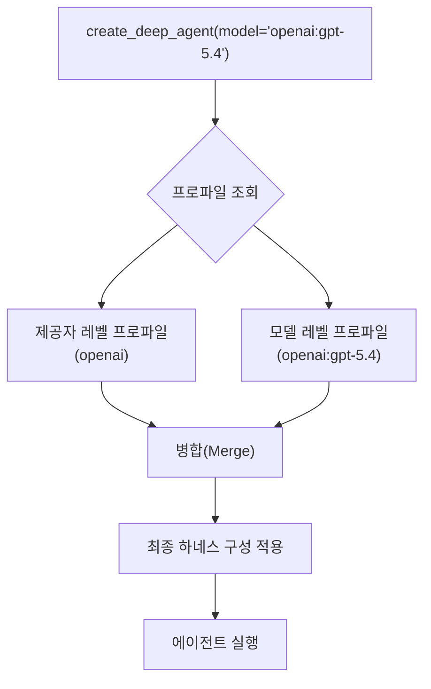
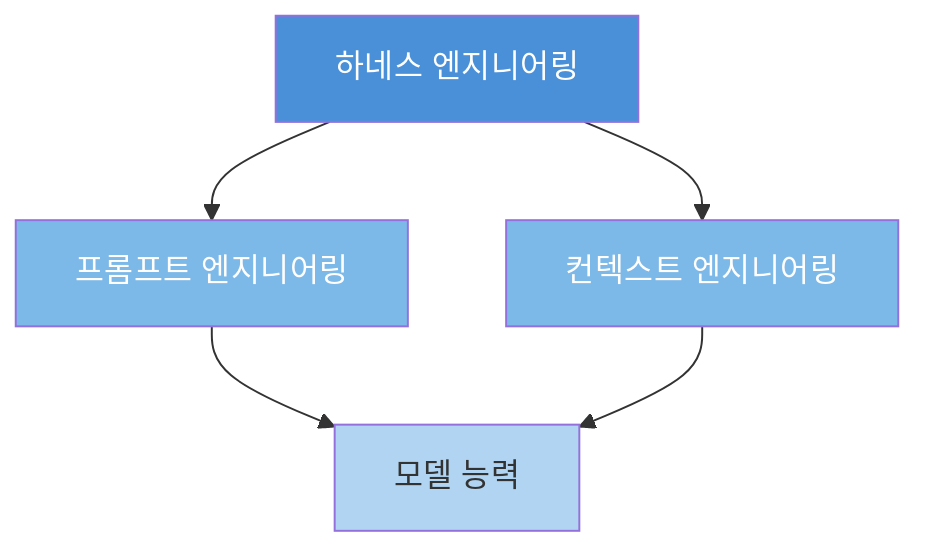
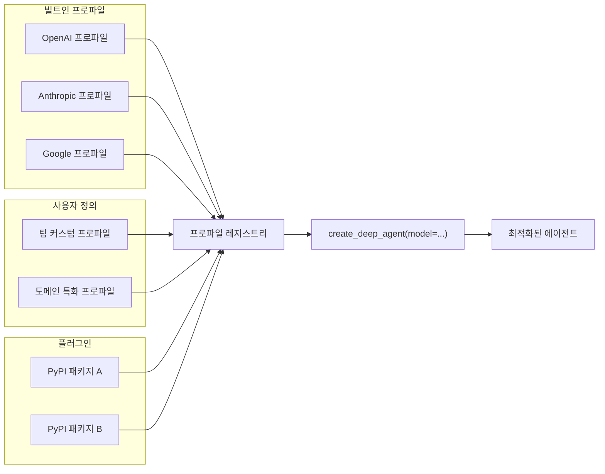

> **출처**: LangChain Blog — [*Tuning Deep Agents to Work Well with Different Models*](https://www.langchain.com/blog/tuning-deep-agents-different-models)  
> V. Trivedy, M. Daugherty · 2026년 4월 29일

---

## 개요

LangChain이 2026년 4월 29일, **deepagents**의 새로운 핵심 기능인 **하네스 프로파일(Harness Profiles)** 을 공개했다. 이번 업데이트는 에이전트 시스템 설계의 근본적인 전환점을 상징한다. 지금까지 deepagents는 모든 LLM에 동일한 프롬프트·도구·미들웨어 세트를 적용하는 단일 설계 방식을 취하고 있었다. 하지만 이번 릴리스를 통해 모델별로 하네스 구성을 선언적으로 분리하고, 각 모델 패밀리의 특성에 맞게 에이전트 실행 환경 전체를 최적화할 수 있게 되었다.

핵심 수치만 먼저 보면 다음과 같다.

| 모델 | 기본 하네스 | 프로파일 적용 후 | 향상 |
|------|------------|----------------|------|
| GPT-5.3 Codex | 33% | 53% | **+20pp** |
| Claude Opus 4.7 | 43% | 53% | **+10pp** |

이 수치는 tau2-bench의 어려운 태스크 서브셋을 기준으로 측정된 것으로, 프롬프트·도구·미들웨어 수준의 개입만으로도 10~20 퍼센트포인트 성능 향상이 가능함을 실증한다.

---

## 배경: 왜 단일 하네스는 한계에 부딪혔는가

### 에이전트 하네스란 무엇인가

에이전트 하네스(agent harness)는 단순한 LLM 래퍼가 아니다. **에이전트의 실행 환경 전체**를 의미한다. 구체적으로는 다음 요소들의 집합이다.

- 시스템 프롬프트 (기본 지침, 페르소나, 제약)
- 도구 집합 (파일 편집, 셸 실행, 검색 등)
- 미들웨어 (요약, 메모리, 플래닝, HITL 등)
- 서브에이전트 설정
- 스킬 로딩 방식
- 컨텍스트 관리 전략

deepagents는 LangChain과 LangGraph 위에 구축된 "배터리 포함(batteries-included)" 에이전트 하네스로, 플래닝 도구, 가상 파일시스템 백엔드, 서브에이전트 스포닝 기능을 기본 제공한다. `create_deep_agent()` 한 줄로 즉시 작동하는 에이전트를 얻을 수 있고, 나머지는 필요한 부분만 커스터마이즈하는 방식이다.

```python
from deepagents import create_deep_agent

agent = create_deep_agent()
result = agent.invoke({
    "messages": [{"role": "user", "content": "Research LangGraph and write a summary"}]
})
```

### 단일 하네스의 근본적 문제

문제는 **모델마다 최적의 상호작용 방식이 근본적으로 다르다**는 점이다. 이는 세 가지 층위에서 작동한다.

**첫째, 프롬프팅 가이드의 차이.** OpenAI의 Codex 프롬프팅 가이드는 `apply_patch`, `shell_command` 같은 특정 도구 이름과 구현 방식을 권장하며, 이것이 실제로 Codex 모델의 성능을 끌어올린다. 반면 Anthropic의 Claude 프롬프팅 가이드는 도구 결과 반영(tool result reflection)이나 능동적 탐색(active investigation) 패턴을 강조한다. 같은 패밀리 내에서도 차이가 있다. Opus 4.6에서 4.7로 마이그레이션 가이드조차 프롬프트 수준의 변경을 권장하는 내용을 담고 있다.

**둘째, 하네스 차이가 벤치마크 점수에 직접 영향을 미친다.** Terminal-Bench 2.0은 이를 가장 선명하게 보여주는 공개 사례다. Claude Code 하네스를 사용한 Opus 4.6 제출이 Opus 4.6 제출 중 최하위를 기록했다. 같은 모델인데도 하네스에 따라 리더보드 순위가 달라지는 것이다. 이전 연구에서는 gpt-5.2-codex를 Terminal-Bench 2.0 기준 52.8%에서 66.5%로(상위 30위에서 상위 5위로) 끌어올리는 데 성공했는데, 그 방법이 모델 변경이 아닌 하네스 레이어 변경뿐이었다.

**셋째, 벤치마크 생태계가 빠르게 성숙하고 있다.** Terminal-Bench 2.0은 89개의 실제 터미널 환경 태스크로 구성된 벤치마크로, 2026년 현재 GPT-5.5가 82.7%로 선두를 달리고 Claude Opus 4.7(Adaptive)이 69.4%로 그 뒤를 잇고 있다. 프론티어 모델조차 어려운 태스크에서 65% 미만을 기록하는 만큼, 하네스 최적화의 여지가 충분히 남아 있다.

---

## 하네스 프로파일의 설계 원칙

### 선언적 오버레이 레이어

하네스 프로파일은 하네스에서 모델마다 달라지는 부분을 제어하는 **선언적 오버레이 레이어**다. 구체적으로 다음 요소들을 모델 또는 제공자(provider) 단위로 설정할 수 있다.

```
HarnessProfile
├── system_prompt_prefix   # 시스템 프롬프트 앞에 추가할 내용
├── system_prompt_suffix   # 시스템 프롬프트 뒤에 추가할 내용
├── excluded_tools         # 이 모델에서 제외할 도구 집합
├── excluded_middleware    # 이 모델에서 제외할 미들웨어
├── tool_overrides         # 특정 도구를 다른 구현으로 교체
└── subagent_config        # 서브에이전트 설정
```

### 키 기반 등록과 자동 병합

프로파일은 두 가지 방식으로 등록할 수 있다.

- **제공자 수준**: `"openai"`, `"anthropic"` — 해당 제공자의 모든 모델에 적용
- **모델 수준**: `"openai:gpt-5.4"` — 특정 모델에만 적용

두 수준의 프로파일이 동시에 존재하면, `create_deep_agent` 가 모델을 해석할 때 자동으로 병합(merge)한다. 중요한 것은 **콜 사이트가 변하지 않는다**는 점이다. 개발자는 `create_deep_agent(model="...")` 한 줄만 유지하면 되고, 모델을 교체해도 등록된 프로파일이 자동으로 적용된다.



### 코드 vs YAML 등록

프로파일 등록은 Python 코드와 YAML 파일 두 방식 모두 지원한다.

**Python 코드 방식:**
```python
from deepagents import HarnessProfile, register_harness_profile

register_harness_profile(
    "openai:gpt-5.4",
    HarnessProfile(
        system_prompt_suffix="Respond in under 100 words.",
        excluded_tools={"execute"},
        excluded_middleware={"SummarizationMiddleware"},
    ),
)
```

**YAML 방식:**
```yaml
# openai.yaml
base_system_prompt: You are helpful.
system_prompt_suffix: Respond briefly.
excluded_tools:
  - execute
  - grep
excluded_middleware:
  - SummarizationMiddleware
  - my_pkg.middleware:TelemetryMiddleware
general_purpose_subagent:
  enabled: false
```

YAML 방식은 설정 관리를 코드 로직과 분리할 수 있어, CI/CD 파이프라인이나 팀 단위의 프로파일 버전 관리에 적합하다.

---

## 모델별 프로파일 내용: 무엇이 달라졌나

LangChain은 OpenAI, Anthropic, Google 모델에 대한 기본 프로파일을 출하했다. 각 프로파일은 해당 벤더의 공식 프롬프팅 가이드를 직접 소스로 삼아 작성되었다.

### Codex 프로파일 (OpenAI)

Codex에 대한 변경은 도구와 프롬프트 두 축에서 이루어졌다.

**도구 변경:**

deepagents의 기본 `file_edit` 구현을 OpenAI 권장 방식인 `apply_patch` 도구로 교체했다. 또한 deepagents의 `execute` 도구를 `shell_command`라는 이름으로 별칭(alias) 처리했다. 이는 단순히 명칭의 문제가 아니다. Codex 모델은 훈련 과정에서 이 특정 도구 이름과 상호작용하도록 최적화되어 있기 때문에, 도구 이름을 맞추는 것만으로도 모델의 도구 호출 패턴이 달라진다.

**프롬프트 변경:**

도구 호출 전 병렬 배치 실행을 권장하는 지침이 추가되었다.

```
Before any tool call, decide ALL files and resources you will need.
Batch reads, searches, and other independent operations into parallel 
tool calls instead of issuing them one at a time.
```

이는 Codex가 단계적으로 도구를 하나씩 호출하는 경향을 교정하기 위한 것이다. 필요한 파일과 리소스를 미리 결정하고 독립적인 작업은 병렬로 묶어서 처리하게 함으로써, 멀티턴 도구 사용의 효율을 크게 높인다.

### Claude Opus 프로파일 (Anthropic)

Opus의 경우 도구 변경은 없었고, 변경 사항 전체가 프롬프트 레벨에 집중되었다. 추가된 두 개의 핵심 XML 블록은 Claude의 사고 방식 자체를 재구성한다.

**도구 결과 반영 (Tool Result Reflection):**

```xml
<tool_result_reflection>
After receiving tool results, carefully reflect on their quality 
and determine optimal next steps before proceeding. Use your thinking 
to plan and iterate based on this new information, and then take the 
best next action.
</tool_result_reflection>
```

이 블록은 Claude가 도구 결과를 받은 직후 그 품질을 평가하고, 이를 바탕으로 다음 행동을 신중하게 계획하도록 유도한다. Claude는 일반적으로 도구 결과를 받으면 즉시 다음 행동으로 넘어가는 경향이 있는데, 이 지침은 그 중간에 명시적인 반성(reflection) 단계를 삽입한다.

**능동적 탐색 (Active Investigation):**

```xml
<tool_usage>
When a task depends on the state of files, tests, or system output, 
use tools to observe that state directly rather than reasoning from 
memory about what it probably contains. Read files before describing them. 
Run tests before claiming they pass. Search the codebase before asserting 
a symbol does or does not exist. Active investigation with tools is the 
default mode of working, not a fallback.
</tool_usage>
```

이 블록은 Claude의 고질적인 문제인 "추론으로 때우기(reasoning from memory)"를 직접 겨냥한다. 파일을 설명하기 전에 읽고, 테스트가 통과한다고 주장하기 전에 실제로 실행하고, 심볼이 존재하지 않는다고 단언하기 전에 코드베이스를 검색하라는 지침이다. 도구 사용을 예외적 수단이 아닌 기본 작동 방식으로 설정한다.

---

## 성능 검증: tau2-bench 서브셋 실험

### 벤치마크 설계

deepagents 팀은 tau2-bench의 **어려운 태스크 서브셋**을 선별하여 실험했다. 선별 기준은 프론티어 모델이 아직 포화 상태에 이르지 않은 태스크였다. 이미 대부분의 모델이 95% 이상을 달성한 쉬운 태스크들은 하네스 수준의 변경이 미치는 영향을 측정하기 어렵기 때문에 제외했다.

tau2-bench는 멀티턴 도구 사용과 지시 추종(instruction following)을 종합적으로 평가하는 벤치마크로, 에이전트 시스템의 실제 능력을 측정하는 데 적합하다.

### 결과 분석

```
GPT-5.3 Codex:   33% → 53%  (+20pp)
Claude Opus 4.7:  43% → 53%  (+10pp)
```

두 모델 모두 53%라는 동일한 결과에 수렴했다는 점이 흥미롭다. 이는 기본 모델 성능 차이(Opus 4.7 > Codex)가 하네스 최적화를 통해 완전히 상쇄되었음을 의미한다. 다시 말해, 모델 능력보다 하네스 설계가 최종 성능을 좌우하는 상황이 벌어진 것이다.

Codex의 20pp 향상은 특히 주목할 만하다. 기본 하네스에서 Codex가 Claude에 비해 크게 뒤처졌던 것은, Codex가 기대하는 도구 이름과 실제 하네스가 제공하는 도구 이름이 불일치했기 때문이라고 볼 수 있다. `apply_patch`와 `shell_command`로의 교체가 그 불일치를 해소한 것이다.

---

## 하네스 엔지니어링의 부상: 더 큰 맥락

### 프롬프트 엔지니어링을 넘어서

이번 deepagents 업데이트는 에이전트 AI 개발의 패러다임 전환을 반영한다. 2024~2025년의 화두가 "프롬프트 엔지니어링"이었다면, 2026년의 화두는 **"하네스 엔지니어링"** 이다.

하네스 엔지니어링은 프롬프트 엔지니어링과 컨텍스트 엔지니어링 위에 놓인 상위 레이어다. 모델에게 무엇을 말하느냐(프롬프트)보다, 모델이 작동하는 조건 전체를 설계한다. 어떤 도구를 어떤 이름으로 제공할지, 어떤 미들웨어가 어떤 순서로 개입할지, 컨텍스트를 어떻게 압축하고 로드할지 — 이 모든 것이 하네스 엔지니어링의 영역이다.



### Terminal-Bench 2.0과 하네스의 관계

Terminal-Bench 2.0은 하네스의 중요성을 가장 잘 보여주는 공개 벤치마크다. Claude Code 하네스를 사용한 Opus 4.6 제출이 Opus 4.6 제출 중 최하위를 기록한 사례는, **하네스가 동일한 모델의 성능을 최고와 최저로 갈라놓을 수 있음**을 증명한다.

2026년 4월 현재 Terminal-Bench 2.0 리더보드에서는 GPT-5.5가 82.7%로 선두를 달리고, Claude Opus 4.7 (Adaptive)이 69.4%로 2위다. 하지만 이 점수들은 특정 하네스 하에서 측정된 것이다. 하네스를 최적화하면 같은 모델로 다른 순위를 달성할 수 있다는 것이 이번 deepagents 연구가 보여주는 핵심 메시지다.

ForgeCode처럼 하네스 퍼스트(harness-first) 아키텍처를 앞세운 시스템이 GPT-5.4와 Claude Opus 4.6의 조합으로 Terminal-Bench 2.0에서 81.8%를 달성한 것도 같은 맥락이다. 모델 선택보다 오케스트레이션 설계가 성능을 결정하는 시대가 도래했다.

### 에이전트 평가의 새로운 기준

이 변화는 AI 에이전트를 평가하는 방식 자체를 바꾼다. 단일 모델 벤치마크로 에이전트 성능을 판단하는 것은 이제 불충분하다. 벤치마크 점수에는 항상 "어떤 하네스 하에서?"라는 질문이 따라붙어야 한다. deepagents의 하네스 프로파일은 이 질문에 구조적으로 답하려는 시도다.

---

## 확장성: 플러그인 에코시스템

### 제3자 프로파일 배포

deepagents는 하네스 프로파일을 파이썬 패키지의 엔트리 포인트(entry point)를 통해 플러그인으로 배포할 수 있도록 설계되어 있다.

```
deepagents.provider_profiles  → 제공자 프로파일 플러그인
deepagents.harness_profiles   → 하네스 프로파일 플러그인
```

이를 통해 특정 모델이나 워크플로에 최적화된 프로파일을 PyPI 패키지로 배포하고, 팀 또는 커뮤니티 단위로 공유하는 에코시스템이 가능해진다. 예컨대 특정 도메인(코드 리뷰, 데이터 분석, 보안 감사 등)에 특화된 프로파일을 사내 패키지로 관리하거나, 오픈소스로 PR을 통해 기여할 수 있다.

### 전체 에코시스템 구조



---

## 실용적 사용법

### 기본 사용 (프로파일 자동 적용)

```python
from deepagents import create_deep_agent
from langchain.tools import internet_search

agent = create_deep_agent(
    model="google_genai:gemini-3.1-pro-preview",
    tools=[internet_search],
    system_prompt=research_instructions,
)
```

지원 모델에 대해서는 프로파일이 자동 적용된다. 콜 사이트는 변경 없이 모델만 교체하면 된다.

### 커스텀 프로파일 등록

```python
from deepagents import HarnessProfile, register_harness_profile

# 특정 모델에 대한 커스텀 프로파일
register_harness_profile(
    "anthropic:claude-opus-4-7",
    HarnessProfile(
        system_prompt_suffix="""
<domain_context>
This agent specializes in Korean enterprise software architecture.
Always output analysis in Korean with technical precision.
</domain_context>
""",
        excluded_middleware={"SummarizationMiddleware"},
    ),
)
```

### 설치

```bash
uv add deepagents
```

> **참고**: 현재 Python 전용이며, TypeScript 버전은 출시 예정이다.

---

## 한계와 향후 과제

몇 가지 현실적인 한계도 짚어볼 필요가 있다.

**측정 범위의 제한.** 공개된 결과는 tau2-bench의 특정 서브셋에 한정된다. 프론티어 모델이 포화하지 않은 어려운 태스크를 선별했다는 점에서 대표성에 논쟁의 여지가 있다. 다양한 벤치마크와 실제 프로덕션 환경에서의 검증이 필요하다.

**프로파일 유지보수 부담.** 모델이 업데이트될 때마다 프로파일도 업데이트해야 할 수 있다. 벤더의 프롬프팅 가이드가 바뀌면 기존 프로파일이 구식이 될 위험이 있다.

**최적 프로파일 탐색의 어려움.** 어떤 프롬프트나 도구 설정이 특정 모델에 최적인지 체계적으로 탐색하는 것은 여전히 수동 작업의 영역이다. 자동화된 프로파일 최적화 연구가 뒤따라야 할 것이다.

---

## 결론

deepagents의 하네스 프로파일은 에이전트 AI 개발의 성숙을 보여주는 지표다. 모델을 교체하면 된다는 접근에서, 모델별로 실행 환경 전체를 최적화해야 한다는 접근으로의 전환이다.

10~20 퍼센트포인트의 성능 향상이 모델 업그레이드 없이 하네스 수준의 변경만으로 달성된다는 사실은, 많은 에이전트 팀이 아직 상당한 성능 여력을 남겨두고 있음을 의미한다. 최고의 에이전트 빌더는 더 이상 가장 영리한 프롬프트를 쓰는 사람이 아니라, **가장 잘 설계된 하네스를 구축하는 사람**이 될 것이다.

---

*작성일: 2026년 4월 30일*
