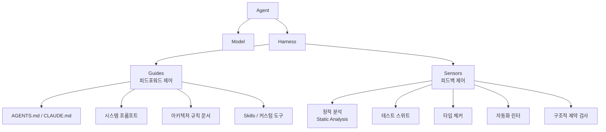
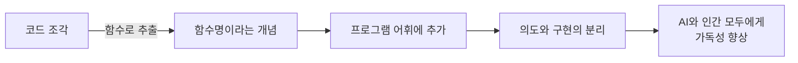
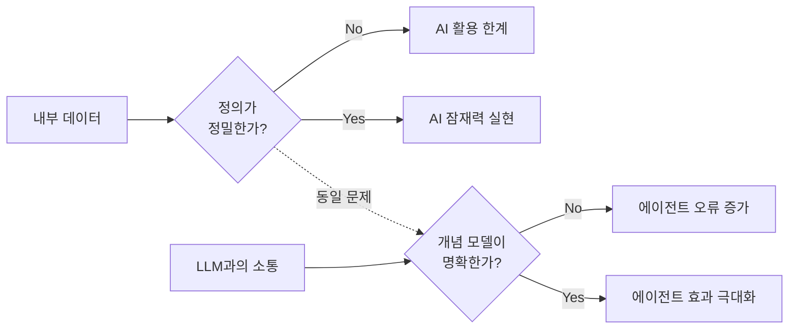
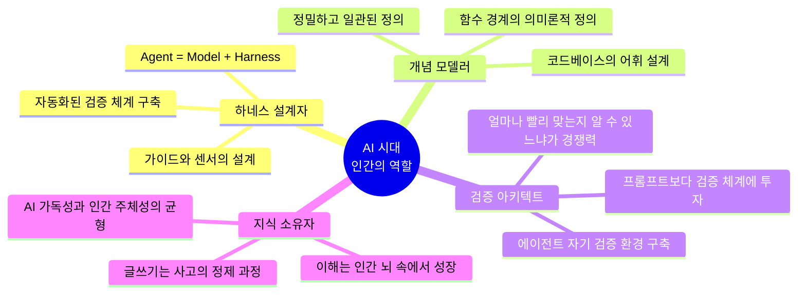

> **원문**: [https://martinfowler.com/fragments/2026-04-29.html](https://martinfowler.com/fragments/2026-04-29.html)  
> **원저자**: Martin Fowler (Thoughtworks)  
> **원문 발행일**: 2026년 4월 29일

---

## 개요

Martin Fowler의 "Fragments"는 그가 최근 읽은 글, 동료들의 작업, 그리고 자신이 주목하는 기술 흐름을 짧게 엮어내는 비정기 칼럼 형식의 포스트다. 이번 2026년 4월 29일자 Fragments는 총 여섯 개의 독립적이면서도 서로 연결된 주제를 다루고 있다. 다루는 내용들을 하나의 실로 꿰면, AI 에이전트 시대에 소프트웨어 엔지니어링이 어떻게 재편되고 있는지, 그리고 그 변화 속에서 인간 개발자의 역할과 정체성이 어디로 이동하고 있는지에 대한 Fowler의 성찰이 담겨 있다.

전체 글의 흐름은 다음과 같다. **① 에이전트 코딩 실천론** → **② 하네스 엔지니어링의 구체화** → **③ 함수 구조와 AI의 코드 이해 방식** → **④ 소프트웨어 브레인 비판** → **⑤ 내부 데이터 품질과 개념 모델링** → **⑥ AI 시대의 글쓰기와 사고의 귀속 문제**. 이 여섯 개의 주제는 단편적으로 보이지만, 실은 "AI가 더 많은 것을 할수록, 인간은 무엇을 해야 하는가?"라는 하나의 질문 주위를 맴돌고 있다.

---

## 1부: Chris Parsons의 AI 코딩 가이드 3차 업데이트 — 검증이 곧 게임의 규칙

### 배경

Chris Parsons는 `chrismdp.com`에서 AI를 이용한 코딩 가이드를 꾸준히 업데이트해 온 실무 엔지니어다. Fowler는 이 가이드를 "지금까지 본 AI 개발 조언 중 가장 구체적이고 실용적인 것 중 하나"라고 평가하며 소개한다. 가이드는 2025년 3월에 처음 작성되어 같은 해 8월 한 차례 업데이트됐고, 이번이 세 번째 개정이다. Fowler가 이 가이드를 특별히 주목하는 이유는 단순히 좋은 조언을 담고 있기 때문이 아니라, 그 조언이 **충분히 구체적이어서 학습 가능하다**는 점이다. 추상적인 원칙이 아닌 실제 워크플로우와 도구 선택, 그리고 그 이유가 담겨 있다는 것이다.

### 변하지 않는 기본 원칙들

Parsons는 3차 업데이트에서도 이전 버전의 핵심 원칙이 여전히 유효하다고 확인한다. 변경은 작게 유지하라, 가드레일을 구축하라, 문서화를 철저히 하라, 그리고 모든 변경은 배포 전에 반드시 검증하라는 것이다. 이 원칙들은 AI 코딩이 등장하기 전 소프트웨어 공학에서도 강조하던 것들이지만, AI 에이전트 환경에서는 그 의미가 달라졌다.

특히 **"검증(Verified)"의 정의가 바뀌었다**는 점이 핵심이다. 과거에는 "검증됐다"는 것이 "당신이 읽었다"를 의미했다. 개발자가 직접 코드를 눈으로 확인하는 것이 곧 검증이었다. 그러나 모던 에이전트의 처리량(throughput)이 폭발적으로 늘어난 지금, "검증됐다"는 말은 "테스트에 의해, 타입 체커에 의해, 자동화된 게이트에 의해, 혹은 당신의 판단이 필요한 곳에서만 당신에 의해 확인됐다"는 뜻으로 확장됐다. 검증 행위 자체가 사라진 것이 아니라, 그것이 항상 인간의 머릿속에서 일어날 필요가 없어진 것이다.

### 바이브 코딩 vs 에이전트 엔지니어링

Parsons는 Simon Willison이 한 것과 마찬가지로, **"바이브 코딩(vibe coding)"과 "에이전트 엔지니어링(agentic engineering)"을 명확히 구분**한다. 바이브 코딩이란 AI가 생성한 코드를 보지도 않고 신경도 쓰지 않는 방식, 즉 "되는 것 같으면 그냥 쓰는" 접근법이다. 반면 에이전트 엔지니어링은 AI를 하나의 강력한 도구로 다루되, 그 출력을 체계적으로 검증하고 통제하는 방식이다. Parsons는 Claude Code와 Codex CLI를 에이전트 엔지니어링의 대표 도구로 꼽으며, 이 도구들이 내부적으로 제공하는 **하네스(harness)** 가 그들의 핵심 강점이라고 본다.

### 게임의 규칙 변화: "얼마나 빨리 만드냐"에서 "얼마나 빨리 맞는지 알 수 있냐"로

Parsons가 내놓은 가장 핵심적인 통찰은 소프트웨어 개발의 경쟁 축이 바뀌었다는 것이다. 다섯 가지 접근법을 생성하고 하루 오후에 다섯 개 전부를 검증할 수 있는 팀이, 하나를 생성하고 피드백을 받는 데 일주일을 기다리는 팀을 압도한다. 이 말의 함의는 단순하다. 투자를 **"더 좋은 프롬프트 만들기"가 아니라 "더 좋은 검증 체계 만들기"에** 쏟아야 한다는 것이다. 에이전트가 인간에게 묻기 전에 현실적인 환경에서 스스로 검증하게 만들고, 그것이 불가능한 경우에는 피드백이 즉각적으로 올 수 있는 환경을 만들어야 한다.

### 시니어 엔지니어의 새로운 역할: "diff를 승인하는 사람"에서 "하네스를 설계하는 사람"으로

이 부분에서 Fowler가 인용한 Parsons의 발언은 많은 시니어 개발자에게 불편하지만 정확한 진단이다. 지금 시니어 엔지니어의 역할이 조용히 "diff를 승인하는 것"으로 바뀌고 있는가? 맞다, 그렇다. 그러나 그 상황에서 빠져나오는 길은 AI를 훈련시켜서 diff가 처음부터 올바르게 나오도록 만드는 것이다. 팀에서 하네스를 설계하는 사람이 되고, 그 일을 가시적인 성과로 만드는 것이다. 리뷰는 복리로 성장하지 않지만, 하네스를 설계하는 역량은 복리로 성장한다. 이것이 Parsons의 주장이고, Fowler도 이에 동의한다.

---

## 2부: 하네스 엔지니어링 — 2026년의 핵심 개념

### 개념의 등장

Fowler는 4월 초 Birgitta Böckeler가 쓴 하네스 엔지니어링(Harness Engineering) 아티클을 "훌륭하다"고 소개하며, 그 글이 엄청난 트래픽을 끌어모았다는 점을 덧붙인다. 그러면서 Böckeler가 Chris Ford와 함께 녹화한 영상 토론도 추천한다. 이 영상에서 두 사람은 하네스 내의 **컴퓨테이셔널 센서(computational sensors)**, 예를 들어 정적 분석(static analysis)이나 테스트 같은 도구들의 역할에 집중해서 논의한다.

하네스 엔지니어링이라는 개념은 2026년 초 하나의 분야로 명명됐다. 그 계기는 OpenAI의 엔지니어 Ryan Lopopolo가 쓴 내부 에이전트 인프라 관련 글이었고, 이후 Terraform과 Ghostty를 만든 Mitchell Hashimoto가 그 핵심 통찰을 공식으로 정리했다. 공식은 간단하다.

```
Agent = Model + Harness
```

이 공식이 강력한 이유는 "프롬프트 엔지니어링"이 결코 줄 수 없었던 것, 즉 **모델 바깥에 있는 모든 것에 이름을 붙여줬기 때문이다**. Böckeler와 Fowler는 이를 가이드(Guide)와 센서(Sensor)의 분류 체계로 정교화했다.



**가이드(Guides)** 는 에이전트가 행동하기 전에 방향을 잡아주는 피드포워드(feedforward) 제어 장치다. AGENTS.md나 CLAUDE.md 같은 문서, 시스템 프롬프트, 아키텍처 제약 문서가 여기에 속한다. **센서(Sensors)** 는 에이전트의 출력을 관찰하고 검증하는 피드백(feedback) 제어 장치다. 정적 분석, 테스트, 타입 체커, 커스텀 린터가 여기에 속한다.

### 컴퓨테이셔널 센서의 강점

Böckeler가 영상에서 강조한 포인트 중 하나는 LLM과 컴퓨테이셔널(결정론적) 도구 사이의 역할 구분이다. LLM은 탐색적이고 모호한 규칙에 뛰어나지만, 정말로 객관적인 것이 있다면 그것을 형식적이고 명확하며 결정론적인 형식으로 바꾸는 것이 훨씬 더 높은 보장을 제공한다. 즉, 컴퓨테이셔널 센서는 AI가 판단할 필요도 없고 판단해서도 안 되는 영역을 담당한다.

Böckeler가 실험을 통해 발견한 흥미로운 사실은, **에이전트는 정적 분석 경고를 인간보다 훨씬 성실하게 처리한다**는 것이다. 인간 개발자는 경고를 무시하거나 나중으로 미루는 경향이 있지만, 에이전트는 모든 경고를 실제로 해소한다. 이는 센서를 추가할 때 품질이 오히려 높아질 수 있다는 것을 의미한다.

### OpenAI의 실증 사례

OpenAI는 2026년 2월, Codex를 사용해 수동으로 작성된 코드 없이 내부 베타 앱 전체를 구축했다는 내용의 보고서를 발표했다. 5개월 동안 100만 줄의 코드, 1,500개의 PR, 그리고 대부분의 PR이 1분 이내에 검토되고 자동 병합됐다. 이것이 가능했던 이유는 모델의 능력만이 아니라, **환경이 충분히 명확하게 정의돼 있었기 때문**이다. 하네스가 에이전트가 실패할 때마다 그 이유를 찾아 환경 자체를 개선하는 방향으로 발전했다.

---

## 3부: 함수 길이와 AI의 코드 이해 방식

### Adam Tornhill의 질문

소프트웨어 엔지니어링의 오래된 논쟁 중 하나인 "함수는 얼마나 길어야 하는가"를 Adam Tornhill이 AI 에이전트 시대의 맥락에서 다시 꺼냈다. Fowler는 이 글을 소개하며, AI 시대에도 이 질문이 여전히 관련이 있다고 강조한다.

### AI는 인간처럼 코드를 "이해"하지 않는다

Tornhill의 핵심 주장은, AI 모델은 인간이 코드를 이해하는 방식으로 코드를 이해하지 않는다는 것이다. AI는 **토큰의 패턴에서 의미를 추론**하며, 코드에 명시적으로 표현된 것에 크게 의존한다. 연구에 따르면 의미 있는 식별자(identifier)를 임의의 이름으로 교체하면 모델 성능이 크게 떨어진다. 현재 모델들은 추론된 의미(inferred semantics)보다 **이름, 구조, 지역적 맥락 같은 리터럴 피처(literal features)** 에 크게 의존한다.

이 말의 함의는 중요하다. 사람이 읽기 좋은 코드와 AI가 읽기 좋은 코드가 어느 정도 겹친다는 것이다. 명확한 이름, 잘 분리된 함수, 작고 집중된 구조가 인간에게도 AI에게도 유리하다.

### 함수의 역할: 길이가 아니라 구조

Tornhill과 Fowler 모두 "함수를 몇 줄로 해야 하는가"라는 질문이 잘못된 질문이라는 데 동의한다. 진짜 질문은 **"함수가 유용한 개념을 정의하고 있는가"** 이다. Tornhill은 좋은 예시를 든다. 네 줄짜리 코드가 잘 선택된 함수 이름 아래 감싸여 있을 때, 그 이름은 프로그램의 어휘(vocabulary)에 새로운 개념을 추가한다. 이것이 함수 분리의 핵심이다.



Fowler는 자신이 오래전에 쓴 원칙을 여기서 재확인한다. 코드 조각을 읽으면서 "이게 뭘 하는 건지" 파악하는 데 노력이 들어간다면, 그것을 함수로 추출하고 그 "무엇"에 해당하는 이름을 붙여야 한다. 그렇게 하면 다시 읽을 때 함수의 목적이 바로 드러나고, 대부분의 경우 그 함수가 어떻게 목적을 달성하는지는 굳이 들여다볼 필요가 없다. **의도(intention)와 구현(implementation)의 분리**, 이것이 함수 길이 논쟁의 진짜 핵심이다.

함수 경계가 잘못 설정돼 있으면, 그 위에 쌓이는 모든 것이 이해하기 어려워지고 변경하기도 어려워진다. AI 에이전트를 사용하는 코드베이스에서도 이는 정확히 같이 적용된다. 에이전트가 코드를 수정할 때 참조할 수 있는 개념적 단위가 명확히 정의돼 있어야 에이전트의 오류 가능성이 줄어든다.

---

## 4부: 소프트웨어 브레인 — AI 혐오의 뿌리

### Nilay Patel의 진단

The Verge의 편집장 Nilay Patel이 쓴 "왜 사람들은 AI를 싫어하는가([Why People Hate AI](https://www.theverge.com/podcast/917029/software-brain-ai-backlash-databases-automation))"라는 글을 Fowler가 소개한다. Patel은 소프트웨어 세계의 많은 사람들이 **"소프트웨어 브레인(software brain)"** 을 가지고 있다고 주장한다.

소프트웨어 브레인이란 세상 전체를 소프트웨어 코드의 구조화된 언어로 제어 가능한 데이터베이스들의 집합으로 보는 사고방식이다. Zillow는 집들의 데이터베이스, Uber는 차와 승객의 데이터베이스, YouTube는 영상의 데이터베이스다. 이런 식으로 세상을 보면, 데이터를 통제하면 모든 것을 통제할 수 있다는 생각으로 자연스럽게 이어진다.

### 왜 사람들은 이것을 싫어하는가

문제는 이 사고방식이 **사람도 데이터베이스로 본다**는 것이다. 많은 사람들은 그것을 좋아하지 않는다. 자신의 삶이 얼마나 많이 데이터베이스에 포착되고 있는지 잠시 생각하는 것만으로도 불쾌해진다. 아무도 끊임없이 감시당하고 싶지 않고, 특히 그것이 기술 기업을 더욱 강력하게 만드는 방식으로 이루어질 때는 더욱 그렇다. 그러나 AI 산업의 집착은 정확히 그 방향이다. 모든 것을 데이터베이스에 넣어서 소프트웨어가 볼 수 있게 하는 것. 지금 모든 회의 시스템에 AI 노트 테이커가 들어가 있는 이유도 바로 그 때문이다.

### 프로그래머와 변호사의 유사성

Patel은 Fowler 자신도 자주 사용하는 비유를 끌어온다. 프로그래머와 변호사의 유사성이다. 계약서를 작성하는 변호사는 계약 당사자들이 어떻게 행동해야 하는지에 대한 프로토콜을 만들고 있다. 소프트웨어 브레인의 핵심이 "코드의 구조화된 언어로 생각하면 실제 세계에서 일이 일어나게 할 수 있다"는 것이라면, 변호사 브레인의 핵심은 "법령과 인용의 구조화된 언어로 생각하면 마찬가지로 세상에서 일이 일어나게 할 수 있고, 심지어 사회에 대한 권력을 줄 수 있다"는 것이다.

차이점은 법이 비결정론적(non-deterministic)이라는 것이다. 소송은 사람들이 계약이 어떻게 실행되어야 하는지에 대해 서로 다른 생각을 가질 때 무슨 일이 일어나는지를 해결하는 과정이다. 반면 코드는(이론적으로는) 결정론적이다. 실행하면 답이 나온다. 이 차이가 소프트웨어 브레인과 변호사 브레인의 본질적 차이다.

---

## 5부: 내부 데이터 품질과 개념 모델링

### "정밀하고 일관된 정의"가 가장 어려운 문제다

Fowler는 한 회사와 대화를 나눴던 사례를 소개한다. 그 회사는 내부 데이터를 AI로 분석하고 싶었지만, 데이터가 엉망이었다. 사람들은 의미 없는 필드에 값을 집어넣었고, 중요한 엔티티를 분류하는 방식에도 일관성이 없었다. 누군가 이렇게 말했다. **"내부 데이터의 가장 어려운 문제는 정밀하고 일관된 정의다."** Fowler는 이에 전혀 놀라지 않았다고 한다. 그것은 수십 년 동안 컴퓨터와 함께한 그의 경험에서 변함없이 반복되는 주제였기 때문이다.

이 문제는 소프트웨어 브레인이 가진 희망의 상당 부분을 약화시킨다. 모든 것을 데이터베이스로 만든다고 해도, 그 데이터베이스 안의 데이터가 정밀하고 일관되게 정의돼 있지 않으면 AI가 그것으로 할 수 있는 일은 제한적이다.

### AI 프로그래밍에서의 함의: 개념 모델링

이 문제는 LLM과의 프로그래밍 관계에도 그대로 적용된다. **LLM과의 효과적인 소통에 정밀하고 일관된 정의가 결정적으로 중요하다.** 이 정의들은 대화 속에서 성장해야 하고, 시간이 지나면서 관리돼야 한다. Fowler는 **개념 모델링(conceptual modeling)** 이 에이전트 프로그래밍과 그 다음 단계에서도 핵심 기술이 될 것이라고 전망한다. 적어도 그가 그것을 희망하는데, 그것이 그가 프로그래밍에서 가장 즐기는 부분이기 때문이다.



개념 모델링이란 복잡한 현실 세계의 현상을 명확하게 정의된 추상 개념들의 체계로 표현하는 작업이다. 소프트웨어 설계에서 도메인 모델링, 클래스 설계, 엔티티-관계 다이어그램 등이 여기에 속한다. AI 에이전트를 사용할 때 이 작업을 잘 해두는 것이 결국 에이전트의 오류를 줄이고 효과를 높이는 근본적인 방법이라는 것이 Fowler의 시각이다.

---

## 6부: 샌프란시스코의 새로운 분위기 — AI와 인간 글쓰기의 귀속 문제

### Ezra Klein이 목격한 실리콘밸리의 불안

Patel의 글을 경유하여 Fowler는 [Ezra Klein의 뉴욕타임스 칼럼](https://www.nytimes.com/2026/03/29/opinion/ai-claude-chatgpt-gemini-mcluhan.html?unlocked_article_code=1.eFA.abX-.lGEOqsmKZVY_&smid=url-share)을 소개한다. Klein은 최근 샌프란시스코를 방문해 AI 업계 사람들을 만났고, 예상과 달리 그들에게서 불안감을 발견했다고 한다. 돈이 넘치는 실리콘밸리의 AI 사람들이 세상의 꼭대기에 있을 것 같지만, 실제로는 상당히 불안해하고 있었다.

그들의 논리는 이렇다. AI 시대가 도래했고, 승자와 패자는 부분적으로 채택 속도에 의해 결정될 것이다. AI 조수와 코더들 위에서 작업하는 이점은 시간이 지날수록 복리로 커지며, 지금 그 과정을 시작하는 것이 나중에 경쟁자보다 훨씬 앞서 나가는 것이다. 그래서 그들은 AI를 삶과 회사에 완전히 통합하기 위해 서로 경쟁하고 있다. 단순히 AI를 사용하는 것만이 아니라, **자신을 AI에게 읽힐 수 있도록(legible) 만드는 것**까지 포함해서.

### "AI에 대한 가독성"이 새로운 경쟁 축

여기서 Fowler는 Patel의 관찰의 핵심이 이 "가독성(legibility)"에 있다고 말한다. 동료들이 이메일, 회의 노트, 슬라이드 덱, 기타 모든 것을 AI가 읽고 작업할 수 있는 파일로 덤프하는 이유가 이것이다. AI는 비정형 정보를 쿼리하는 데 뛰어나기 때문에, 이렇게 하면 노트 속에 파묻혀 있는 것을 훨씬 효과적으로 찾아낼 수 있다. Fowler는 자신도 구글에 검색어를 던지는 것보다 질문을 써서 Gemini에 던지는 것이 훨씬 쉽다는 것을 발견했다고 한다.

Klein은 AI가 과거 요청들을 기록하고 그것을 현재 질문을 조율하는 데 활용하는 모습을 묘사하면서, 그 결과를 "느껴진다는 느낌과 희화화된다는 느낌의 이상한 혼합"이라고 표현했다. 치료사가 자신이 정말 잘 들어왔다는 것을 증명하기 위해 안달하며 현재 관심사와 과거 질문들 사이에 끊임없이 연결 고리를 그어대는 것 같다고.

### 글쓰기, 사고, 그리고 귀속의 문제

이 부분이 이 Fragments 전체에서 가장 개인적이면서도 깊은 성찰을 담고 있다. Fowler는 Klein이 작가라는 점에서 자신과 같은 유혹에 직면하고 있다고 말한다. 고생해서 글을 쓰는 대신, LLM에게 자신의 글쓰기 스타일을 요약한 AGENTS.md 파일을 만들게 하고, 며칠에 한 번씩 어떤 주제에 대한 글을 작성하게 하고, 읽고 조금 수정한 다음 게재하면 어떨까? 기술적으로는 가능하다.

그러나 Fowler에게 그것은 전혀 매력적이지 않다. 그가 원하는 것은 **LLM의 일시적 세션이 아니라 자기 자신의 뇌 속에서 이해가 성장하는 것**이기 때문이다. 다른 사람들에게 자신의 사고를 설명하기 위해 글을 쓰는 것이 바로 그 사고를 정제하는 방법이다. Klein의 표현을 빌리면, 아이디어를 "출판 가능한 것으로 쪼아내는(chiseling)" 과정이 글쓰기다. AI에게 대신 쓰게 하는 것은 자신의 마음을 불구로 만드는 것이다.

이것은 단순히 글쓰기에 관한 이야기가 아니다. **지식과 이해의 귀속(attribution)에 관한 이야기다.** 무언가를 이해한다는 것이 내 안에 있는 것이어야 한다는 것, 그리고 그 과정을 외주화하면 무언가 본질적인 것을 잃게 된다는 것이다.

---

## 전체 주제의 통합: AI 시대에 인간 엔지니어의 역할

이 Fragments의 여섯 개 파편은 서로 다른 저자들의 서로 다른 글들을 소개하지만, Fowler가 그것들을 함께 엮음으로써 하나의 메시지를 구성한다.



핵심을 정리하면 이렇다.

첫째, **검증(verification)이 게임의 핵심으로 이동했다.** 빠르게 만드는 능력보다, 빠르게 맞는지 확인하는 능력이 팀의 경쟁력을 결정한다. 이를 위해 하네스를 설계하는 것이 시니어 엔지니어의 핵심 역할이다.

둘째, **하네스 엔지니어링은 2026년 AI 엔지니어링의 중심 개념이다.** `Agent = Model + Harness`라는 공식은 AI 에이전트 시스템을 이해하는 가장 명확한 프레임이다. 가이드와 센서의 설계, 그리고 컴퓨테이셔널 센서의 적극적 활용이 이 분야의 핵심이다.

셋째, **코드의 구조와 이름이 AI 에이전트 시대에도 여전히 결정적으로 중요하다.** AI는 인간처럼 코드를 이해하지 않지만, 인간이 읽기 좋은 코드 — 명확한 이름, 잘 분리된 함수, 의도와 구현의 분리 — 가 AI에게도 이롭다. 함수 경계는 코드베이스의 어휘를 정의하고, 그 어휘가 에이전트의 이해를 돕는다.

넷째, **소프트웨어 브레인의 한계는 "정밀하고 일관된 정의"의 부재에서 온다.** 모든 것을 데이터로 만들 수 있다는 사고방식은, 그 데이터가 제대로 정의돼 있을 때만 AI와의 시너지를 낼 수 있다. 개념 모델링이 에이전트 프로그래밍의 핵심 기술이 될 것이다.

다섯째, **AI를 사용하되, 이해는 인간의 뇌 속에서 성장해야 한다.** AI에게 글쓰기나 생각의 결과를 위임하는 것은 편리하지만, 그 과정에서 성장하는 이해를 포기하는 것이다. AI 가독성을 높이는 경쟁이 가속화되는 가운데, Fowler는 인간 주체성과 지적 성장의 귀속을 명확히 하는 것이 중요하다고 본다.

---

## 관련 링크 및 자료

| 주제 | 저자 | 링크 |
|------|------|------|
| Chris Parsons의 AI 코딩 가이드 | Chris Parsons | https://www.chrismdp.com/coding-with-ai/ |
| 하네스 엔지니어링 원문 아티클 | Birgitta Böckeler | https://martinfowler.com/articles/harness-engineering.html |
| 하네스 엔지니어링 영상 토론 | Böckeler & Chris Ford | https://www.youtube.com/watch?v=uLWOLmeHOSE |
| 함수 길이에 관한 글 | Adam Tornhill | https://adamtornhill.substack.com/p/how-long-should-a-function-be-and |
| 왜 사람들은 AI를 싫어하는가 | Nilay Patel | https://www.theverge.com/podcast/917029/software-brain-ai-backlash-databases-automation |
| 샌프란시스코의 새로운 분위기 | Ezra Klein | https://www.nytimes.com/2026/03/29/opinion/ai-claude-chatgpt-gemini-mcluhan.html |
| Fowler의 함수 길이 원칙 | Martin Fowler | https://martinfowler.com/bliki/FunctionLength.html |

---

*작성일: 2026년 4월 30일*
