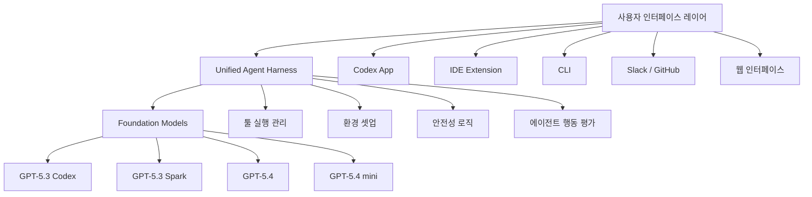
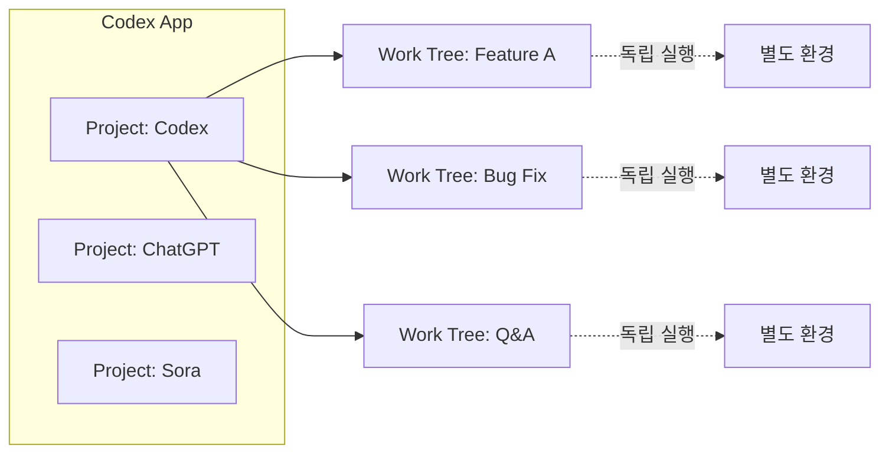
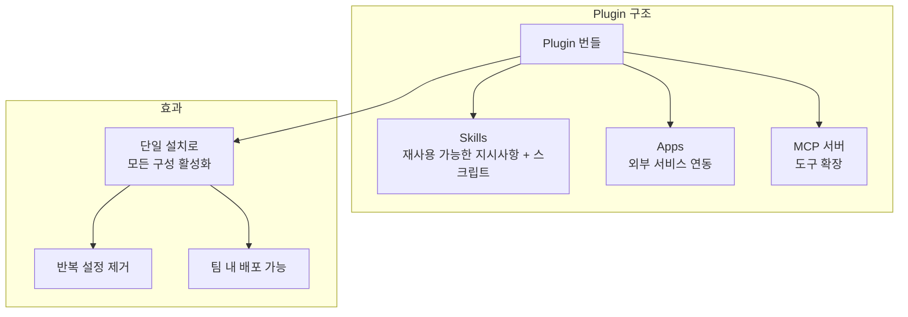
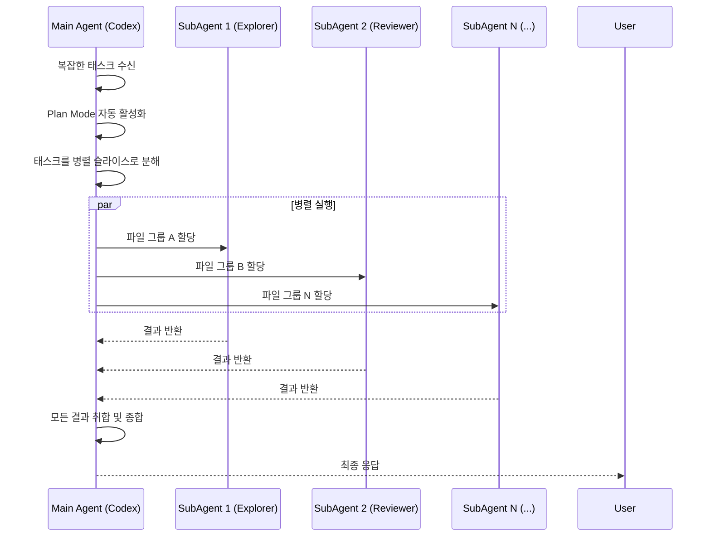
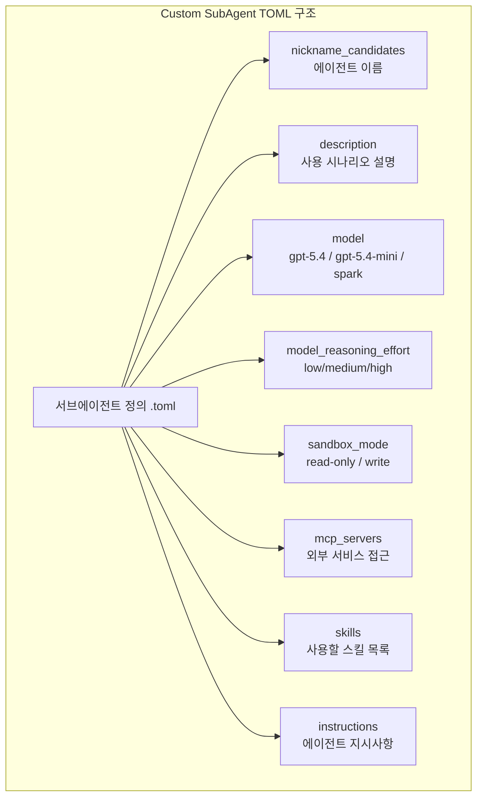
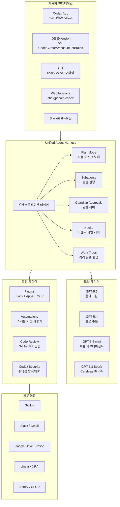
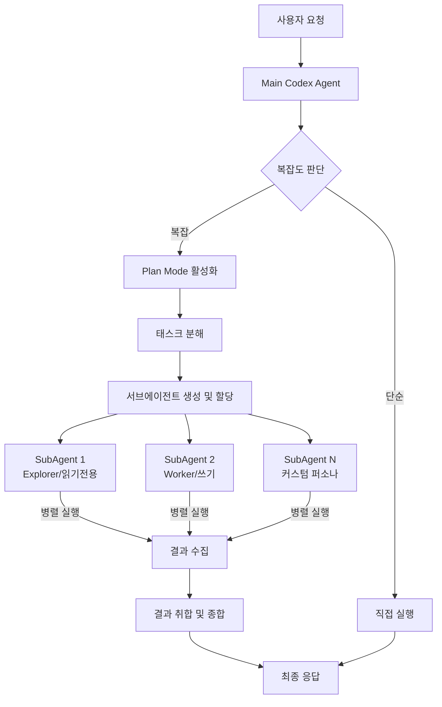

## AI Engineer World's Fair 2026 워크샵 — Vaibhav Srivastav & Katia Gil Guzman (OpenAI)

> **원본 영상**: [Codex and Subagents — Vaibhav Srivastav & Katia Gil Guzman, OpenAI](https://www.youtube.com/watch?v=MhHEGMFCEB0)  
> **채널**: [AI Engineer](https://www.youtube.com/@aiDotEngineer)  
> **발표자**: Vaibhav Srivastav (VB) / Katia Gil Guzman — OpenAI 런던 Developer Experience 팀

---

## 목차

1. [세션 개요 및 발표자 소개](#1-세션-개요-및-발표자-소개)
2. [Codex란 무엇인가 — 소프트웨어 엔지니어링 에이전트](#2-codex란-무엇인가--소프트웨어-엔지니어링-에이전트)
3. [파운데이션 모델의 진화](#3-파운데이션-모델의-진화)
4. [성능 개선 — WebSockets와 Fast Mode](#4-성능-개선--websockets와-fast-mode)
5. [Codex App — 프로젝트, Work Trees, 멀티태스킹](#5-codex-app--프로젝트-work-trees-멀티태스킹)
6. [Automations — 백그라운드 에이전트 작업 자동화](#6-automations--백그라운드-에이전트-작업-자동화)
7. [Plugins — Skills, Apps, MCP 서버의 통합 번들](#7-plugins--skills-apps-mcp-서버의-통합-번들)
8. [게임 및 웹앱 개발 플러그인 — Playwright & Image Gen](#8-게임-및-웹앱-개발-플러그인--playwright--image-gen)
9. [데모 분석 — Game Studio, Google Drive, Slack/Gmail 자동화](#9-데모-분석--game-studio-google-drive-slackgmail-자동화)
10. [코드 리뷰 — 품질 보증의 새로운 기준](#10-코드-리뷰--품질-보증의-새로운-기준)
11. [Subagents — 병렬 작업의 패러다임 전환](#11-subagents--병렬-작업의-패러다임-전환)
12. [커스텀 Subagent 설계 및 실전 구성](#12-커스텀-subagent-설계-및-실전-구성)
13. [블리딩 엣지 기능 — Guardian Approvals, Hooks, 퍼스낼리티](#13-블리딩-엣지-기능--guardian-approvals-hooks-퍼스낼리티)
14. [Codex Security 및 Claude Code 플러그인](#14-codex-security-및-claude-code-플러그인)
15. [Q&A 핵심 내용 정리](#15-qa-핵심-내용-정리)
16. [2026년 4월 현재 최신 업데이트 — 워크샵 이후 변화](#16-2026년-4월-현재-최신-업데이트--워크샵-이후-변화)
17. [종합 아키텍처 다이어그램](#17-종합-아키텍처-다이어그램)
18. [핵심 요약 및 시사점](#18-핵심-요약-및-시사점)

---

## 1. 세션 개요 및 발표자 소개

이 워크샵은 AI Engineer 커뮤니티를 대상으로 진행된 실습 중심의 기술 세션으로, OpenAI 런던 사무소의 Developer Experience 팀 소속 두 발표자가 Codex의 현재 역량과 미래 방향을 직접 시연하는 방식으로 구성되었다.

**Katia Gil Guzman**은 Codex의 플러그인, 자동화, 그리고 비주얼 개발 워크플로우 파트를 담당했으며, **Vaibhav Srivastav(VB)** 는 파운데이션 모델의 진화, Subagents, 그리고 블리딩 엣지 기능들을 다루었다. 두 사람 모두 단순 슬라이드 발표가 아닌 실제 작업 환경을 그대로 보여주는 라이브 데모 형식을 채택했고, 청중에게 동시에 따라해볼 것을 권장했다.

세션의 구성은 크게 다섯 파트로 나뉜다. Codex 개요, 플러그인과 자동화 데모, Subagents 심층 탐구, 블리딩 엣지 기능, Q&A 순서로 진행됐으며, 각 파트는 이론 설명보다 실제 사용 패턴과 워크플로우를 중심으로 전개되었다.

---

## 2. Codex란 무엇인가 — 소프트웨어 엔지니어링 에이전트

워크샵에서 가장 먼저 짚은 포인트는 Codex를 "코딩 어시스턴트"로만 이해하는 것이 범주 오류라는 점이다. OpenAI는 Codex를 **소프트웨어 엔지니어링 에이전트(software engineering agent)** 로 정의한다. 이 차이는 단순한 마케팅 언어가 아니라 기능적 차이를 반영한다.

코드를 생성하는 것에 그치지 않고, Codex는 커맨드를 실행하고, 테스트를 돌리고, 코드베이스 전체를 탐색하고, 그 결과를 바탕으로 의사결정을 내린다. 이는 실제 소프트웨어 엔지니어가 업무 중에 하는 전체 사이클, 즉 이해→계획→구현→검증→반복의 루프를 에이전트가 대행할 수 있다는 의미다. 발표자 표현을 빌리자면 "a software engineer colleague would do" 수준의 작업 범위를 목표로 한다.

이 에이전트 아키텍처는 세 레이어로 구성된다.

첫 번째는 파운데이션 모델이다. GPT-5.3 Codex, Spark, GPT-5.4 등이 이 레이어에 해당하며, 모델이 업그레이드될수록 Codex 전체 성능이 자동으로 향상되는 구조다.

두 번째는 **유니파이드 에이전트 하네스(unified agent harness)** 다. 이것은 모델 위에 얹히는 래퍼(wrapper) 레이어로, 에이전트의 행동을 평가하고, 툴 실행을 관리하고, 환경 셋업을 담당하고, 안전성 로직을 내장한다. 단순히 모델에게 프롬프트를 던지는 것이 아니라, 에이전트가 원활하게 장시간 작업을 수행할 수 있도록 지탱하는 실행 플랫폼이다.

세 번째는 다양한 인터페이스 레이어다. Codex App, IDE 확장 플러그인(VS Code, Cursor, Windsurf 등), CLI, Slack 봇, GitHub 연동 등 여러 표면을 통해 동일한 에이전트 역량에 접근할 수 있다.

---

## 3. 파운데이션 모델의 진화

VB는 자신이 OpenAI에 합류한 2025년 12월을 기준점으로 삼아 모델 발전 속도를 설명했다. 당시 리딩 모델은 GPT-5.2였고, 그로부터 불과 몇 달 만에 GPT-5.2 Codex, GPT-5.3 Codex, GPT-5.3 Codex Spark, GPT-5.4, 그리고 GPT-5.4 mini까지 연속적으로 출시되었다.

이 발전 패턴에서 중요한 것은 단순한 성능 향상이 아니라 모델과 하네스가 함께 개선되는 **플라이휠 구조**다. 더 좋은 모델이 나오면 하네스가 그 모델의 역량을 최대로 끌어내는 방식으로 최적화되고, 하네스의 개선이 다시 모델 활용도를 높이는 선순환이 형성된다.

각 모델의 포지셔닝을 정리하면 다음과 같다.

**GPT-5.3 Codex**는 장시간 실행 작업과 복잡한 태스크에 특화된 모델로, 에이전트가 얼마나 오래 중단 없이 작업을 이어갈 수 있는지를 극한까지 밀어붙이는 방향으로 개발되었다.

**GPT-5.3 Codex Spark**는 Cerebras와의 협업으로 탄생한 모델이다. Cerebras의 웨이퍼 스케일 칩 아키텍처가 가진 대역폭 이점을 활용해 텍스트 전용이지만 거의 즉각적인 수준의 응답 속도를 구현했다. ChatGPT Pro 구독자에게 리서치 프리뷰 형태로 제공되며, 실시간 코딩 이터레이션에 최적화되어 있다.

**GPT-5.4**는 워크샵 당시 최신 메인라인 모델로, GPT-5.3 Codex의 코딩 역량을 GPT-5.4의 범용 추론 능력에 통합한 결과물이다. 코딩뿐 아니라 스프레드시트, 프레젠테이션, 문서 작업 등 전문 업무 전반에 걸쳐 성능을 발휘하도록 설계됐다.

**GPT-5.4 mini**는 서브에이전트와 짧은 태스크를 위한 경량 모델이다. 메인 모델 대비 토큰 소비가 30% 수준이라 동일한 크레딧으로 약 3.3배 더 오래 쓸 수 있으며, 코드베이스 탐색, 대용량 파일 리뷰 등 추론 집약도가 낮은 서브에이전트 작업에 권장된다.

---

## 4. 성능 개선 — WebSockets와 Fast Mode

모델 성능 향상과 병행하여 토큰 전송 속도 개선도 중요한 축으로 진행됐다. 워크샵에서 VB가 특별히 강조한 두 가지 기술적 개선이 있다.

첫 번째는 **WebSockets 도입**이다. 기존의 HTTP 폴링 방식 대신 WebSocket을 통해 디바이스와 API 서버 사이에 지속적인 커넥션을 유지함으로써 별도의 추가 비용 없이 토큰 전송 속도를 약 **1.75배** 향상시켰다. 이는 단순히 응답이 빠르게 느껴지는 것을 넘어, 에이전트가 장시간 작업 중에 중간 결과를 스트리밍할 때 체감 속도를 크게 개선한다.

두 번째는 **Fast Mode**다. WebSockets 기반 1.75배 향상 위에 추가로 2배 빠른 토큰 속도를 제공하는 옵션이다. 두 기술을 합산하면 기존 대비 약 3.5배 이상의 체감 속도 향상이 가능하다는 계산이 나온다. 발표자는 이 분야의 개선 작업이 계속 진행 중이며 더 많은 속도 향상이 예정되어 있다고 언급했다.

이 두 기술적 개선은 특히 Subagents처럼 여러 에이전트가 동시에 장시간 작업을 진행하는 시나리오에서 실질적인 차이를 만들어낸다.

---

## 5. Codex App — 프로젝트, Work Trees, 멀티태스킹

VB 본인이 "하드코어 CLI 사용자"였다가 Codex App 출시 이후 워크플로우의 중심을 옮겼다고 고백할 만큼, Codex App은 단순한 GUI 래퍼를 넘어 실질적인 작업 허브로 설계되었다.

Codex App의 핵심 가치는 **멀티 프로젝트 × 멀티 태스크 동시 작업**이다. 앱 좌측 패널에서 여러 프로젝트를 전환하면서 각 프로젝트 내에서 Work Trees를 활용해 여러 기능을 동시에 개발할 수 있다.

**Work Trees**는 Git의 작업 트리 개념을 네이티브로 지원하는 기능이다. 동일한 저장소에서 서로 다른 기능 요청, 버그 수정, Q&A 작업을 서로 간섭 없이 병렬로 진행할 수 있다. 컨텍스트 스위칭의 비용을 최소화하면서 여러 작업을 동시에 진행하는 것이 가능해진다.

플랫폼 지원 측면에서도 Codex App은 macOS에서 시작해 이제 **네이티브 Windows 지원**까지 확장됐다. 특히 Windows 전용 네이티브 샌드박스가 내장되어 있으며, 이 시점 기준으로 경쟁 에이전트 하네스 중 Windows 네이티브 샌드박스를 지원하는 것은 Codex가 유일하다고 발표자는 강조했다. 이후 Linux도 IDE 확장 플러그인을 통해 지원된다.

---

## 6. Automations — 백그라운드 에이전트 작업 자동화

Automations는 Codex의 기능 중 Katia가 "개인적으로 가장 좋아하는 기능"이라고 표현할 만큼 실용적인 워크플로우 변화를 가져오는 기능이다. 기본 개념은 단순하다. 특정 지시사항을 담은 Codex 작업을 백그라운드에서 스케줄에 따라 자동 실행하는 것이다.

크론 잡(cron job)처럼 매일 특정 시각에 실행되거나, 특정 이벤트를 트리거로 삼을 수 있다. Codex가 이미 연결된 앱과 플러그인에 접근할 수 있기 때문에, 자동화는 단순히 코드를 실행하는 것에 그치지 않고 외부 서비스와의 상호작용까지 포함한다.

발표자가 실제로 운용 중인 자동화 예시들을 보면 범용성이 얼마나 넓은지 파악할 수 있다.

**Slack 메시지 요약 자동화**: 매일 오전 9시에 실행되며, 전날 이후 Slack에 올라온 메시지 중 긴급 응답이 필요한 것을 식별하고, 전체 내용을 토픽별로 요약해 제공한다. 놓칠 수 없는 중요한 회사 공지사항도 별도로 필터링된다.

**Gmail 트리아지 자동화**: 하루에도 수십 통씩 쏟아지는 이메일을 Codex가 스캔해서 실제로 응답이 필요한 이메일과 그렇지 않은 것을 분류해준다. 스팸성 요청을 걸러내는 기능까지 포함되어 있어 이메일 처리 시간을 시간 단위로 절약할 수 있다고 발표자는 밝혔다.

**코드베이스 데이터 동기화 자동화**: 저장소의 YAML 파일에서 이벤트 데이터를 읽어 Google Sheets를 업데이트하는 작업처럼, 반복적인 데이터 이동 작업을 완전 자동화할 수 있다.

자동화는 Codex App 내에서 직접 생성하거나, 대화 형식으로 "이런 자동화를 만들어줘"라고 요청하면 Codex가 자동으로 구성 파일을 작성해주는 방식으로 셋업이 가능하다.

---

## 7. Plugins — Skills, Apps, MCP 서버의 통합 번들

플러그인은 Codex 생태계에서 재사용 가능한 역량을 패키지화하고 배포하는 단위다. 플러그인 하나를 설치하면 그 안에 포함된 Skills, App 연동, MCP 서버 설정이 한 번에 활성화된다. 각 구성요소를 따로 설치하고 설정하는 번거로움을 없앤 것이다.

**Skills**는 특정 프로세스를 위해 패키지화된 재사용 가능한 지시사항이다. 반복적으로 수행하는 워크플로우가 있다면 스킬로 만들어두면 Codex가 관련 태스크를 만날 때 자동으로 해당 스킬을 참조한다. 지시사항 뿐만 아니라 스크립트와 리소스도 포함할 수 있으며, Codex에게 스킬을 직접 만들어달라고 요청하는 것도 가능하다. 스킬은 `SKILL.md` 파일을 포함한 폴더 구조로 구성되며, 저장소, 사용자, 관리자, 시스템 레벨의 여러 위치에서 로드된다.

**Apps**는 외부 서비스와의 연결이다. Notion, Linear, Google Drive, Slack, GitHub 등 개발자가 일상에서 사용하는 도구들에 Codex가 직접 접근할 수 있게 해준다.

**MCP 서버**는 외부 시스템의 도구를 Codex에게 노출하는 표준 프로토콜이다. 커스텀 도구나 내부 시스템을 Codex에 통합할 때 활용된다.

이 세 가지를 하나의 번들로 묶은 것이 플러그인이다. 워크샵 당시 OpenAI가 큐레이션한 공식 플러그인 목록이 제공되며, 사용자가 직접 플러그인을 제작할 수도 있다. Plugin Creator를 통해 대화형으로 플러그인을 생성하는 것도 지원된다.

---

## 8. 게임 및 웹앱 개발 플러그인 — Playwright & Image Gen

개발자들이 게임이나 웹앱을 만들 때 반복적으로 사용하는 워크플로우 패턴을 관찰한 OpenAI 팀은 이를 특화 플러그인으로 패키지화했다. Game Studio 플러그인과 Web App 플러그인이 그것이다.

이 플러그인들에 포함된 두 가지 핵심 스킬이 시각적 개발 워크플로우를 근본적으로 바꾼다.

**Playwright Interactive** 스킬은 헤드리스 브라우저를 Codex가 직접 제어할 수 있게 해주는 기능이다. Playwright는 원래 E2E 테스트 자동화 도구로 알려져 있지만, 이 맥락에서는 Codex가 개발 중인 앱이나 게임을 실제 브라우저 환경에서 렌더링하고, 클릭하고, 스크린샷을 찍고, 화면을 분석하는 용도로 활용된다. Codex가 코드를 작성하고, 실행하고, 결과를 눈으로 확인하고, 문제를 발견해 다시 수정하는 사이클을 자율적으로 수행할 수 있다는 의미다. 2026년 4월 이후 업데이트에서는 앱 내 브라우저가 내장되어 더욱 강화된 형태로 발전했다.

**Image Gen** 스킬은 게임 스프라이트나 UI 자산처럼 시각적 에셋을 Codex가 직접 생성하는 기능이다. 워크샵 데모에서는 플랫포머 게임의 캐릭터 스프라이트 5가지 이상을 사람의 개입 없이 Codex가 자동 생성하는 장면이 시연됐다. 발표자가 준 프롬프트는 "벽돌로 만들어진 플랫폼이 있는 플랫포머 게임을 만들어줘" 단 한 줄이었다.

---

## 9. 데모 분석 — Game Studio, Google Drive, Slack/Gmail 자동화

워크샵에서 진행된 세 가지 주요 데모를 순서대로 분석한다.

### 데모 1: Game Studio 플러그인

게임 스튜디오 플러그인을 활성화한 상태에서 단 한 줄의 프롬프트("벽돌 플랫폼 플랫포머 게임 만들어줘")를 주자 Codex는 다음 과정을 자율적으로 수행했다.

이미지 생성 스킬을 호출해 게임에 필요한 모든 스프라이트를 생성하고, Playwright Interactive 스킬을 통해 생성된 게임을 브라우저에서 직접 렌더링하고 시각적으로 검증하고, 문제가 발견되면 코드를 수정하고 다시 렌더링하는 디버깅 루프를 자율 실행했다. 완성까지 약 한 시간이 소요됐으며, 발표자는 최종 결과물을 전혀 수정하지 않은 그대로 시연했다.

### 데모 2: Google Drive 플러그인을 활용한 코드베이스-스프레드시트 동기화

OpenAI 개발자 웹사이트의 저장소에는 Codex 밋업 이벤트 정보가 YAML 파일들로 관리된다. Codex에게 "Google Drive의 Codex Events 스프레드시트를 저장소의 현재 밋업 정보로 업데이트해줘"라고 요청한 결과, 약 2분 만에 57개의 이벤트 행이 정확하게 입력됐다.

이 데모가 보여주는 것은 단순한 파일 읽기/쓰기가 아니다. Codex가 코드베이스의 구조를 파악하고 데이터 소스를 식별하여 외부 서비스(Google Sheets)에 적절한 형식으로 작성하는 전 과정을 자율적으로 수행했다.

### 데모 3: Slack 자동화 생성

대화 형식으로 Codex에게 "Slack에서 Codex 유즈케이스를 언급하는 모든 내용을 찾아 웹사이트에 올릴 중요한 유즈케이스 목록을 만드는 자동화를 만들어줘"라고 요청하자, Codex가 자동화 구성을 생성하는 과정이 시연됐다. 실행 주기를 지정하지 않았기 때문에 Codex가 팝업 형태로 스케줄 설정을 안내하는 흐름도 확인할 수 있었다. 라이브 데모 특성상 일부 동작이 예상과 다르게 진행됐지만, 수동 설정 경로를 통해 자동화 구성의 전 과정을 보여줬다.

---

## 10. 코드 리뷰 — 품질 보증의 새로운 기준

VB가 "개인적으로 편향되어 있을 수 있지만, Codex 코드 리뷰는 현재 업계 최고 수준"이라고 자부할 만큼, Codex의 코드 리뷰 기능은 특별한 위치를 차지하고 있다. 실제로 OpenAI 내부에서는 Greg Brockman을 포함한 모든 직원이 생성하는 **모든 풀 리퀘스트가 기본적으로 Codex 코드 리뷰를 거친다**.

Codex 코드 리뷰가 탁월한 이유는 단순히 diff만 분석하는 것이 아니라 전체 저장소의 컨텍스트와 함께 변경사항을 해석하기 때문이다. 이를 통해 변경된 코드가 건드리지 않은 다른 모듈에 미칠 **이차 효과(second order effects)** 까지 찾아낸다. 일반적인 코드 리뷰 도구가 diff 레벨에서만 작동하는 것과 근본적으로 다른 접근이다.

리뷰 결과는 P0, P1, P2 등의 우선순위로 분류되어 제공되며, 단순히 문제를 나열하는 것에 그치지 않고 Codex에게 직접 수정을 요청하거나 새로운 PR 브랜치를 여는 것도 가능하다.

접근 방식은 다음과 같이 세 가지로 제공된다.

**GitHub 연동 방식**: ChatGPT 계정을 GitHub에 연결하면 모든 PR에 대해 자동 리뷰가 활성화된다. PR 페이지에 직접 코멘트 형태로 결과가 표시된다.

**Slash 명령 방식**: Codex App 또는 CLI에서 `/review` 명령을 입력하면 새로운 스레드에서 리뷰 프로세스가 독립적으로 실행된다.

**Claude Code 플러그인 방식**: VB와 동료 Dom이 제작한 플러그인으로, Claude Code 세션 내에서 Codex의 코드 리뷰 역량을 직접 호출할 수 있다.

---

## 11. Subagents — 병렬 작업의 패러다임 전환

Subagents는 이 워크샵의 핵심 주제이자 VB가 가장 열정적으로 소개한 기능이다. 개념 자체는 단순하지만, 그 함의는 소프트웨어 개발 방식을 근본적으로 바꿀 수 있을 만큼 크다.

**Subagents의 정의**: 메인 태스크를 독립적으로 병렬 실행 가능한 하위 태스크들로 분해하고, 각 하위 태스크를 별도의 에이전트에게 위임한 뒤, 모든 에이전트의 결과를 수집해 종합 응답을 제공하는 오케스트레이션 메커니즘이다.

단일 에이전트가 50개의 파일을 순차적으로 검토하는 것과, 20개의 서브에이전트가 각각 2~3개의 파일을 동시에 검토한 뒤 결과를 합산하는 것을 비교해보면 시간 절약 효과가 직관적으로 이해된다.

Subagents는 사용자가 명시적으로 요청할 때만 생성된다. Codex가 자의적으로 서브에이전트를 생성하지 않는다는 것은 중요한 설계 원칙이다. 다만 태스크 복잡도가 높다고 판단되면 자동으로 **Plan Mode**를 활성화해 어떤 방식으로 접근할지 먼저 계획을 제시한다.

데모에서 VB는 Codex 에이전트 퍼소나 저장소(45개의 `.toml` 파일)를 20개의 서브에이전트를 통해 동시에 검토하는 시나리오를 시연했다. 메인 Codex가 Plan Mode를 통해 5단계 실행 계획을 수립하고, 45개 파일을 그룹화하여 각 서브에이전트에게 할당하고, 병렬로 검토를 실행한 뒤 취약점(P1: sandbox mismatch 등)을 종합 보고하는 전 과정이 진행됐다.

**Subagents 실용 시나리오들**:

코드 리뷰 관점에서는 보안, 코드 품질, 버그, 레이스 컨디션, 테스트 취약성, 유지보수성 각각에 대해 별도의 서브에이전트를 할당해 동시 리뷰를 수행할 수 있다. 사이버 보안 분야에서는 서로 다른 가설과 관점을 가진 여러 서브에이전트가 동일한 코드베이스나 커밋을 분석해 취약점 지도를 작성하는 시나리오가 가능하다. 기능 설계 단계에서도 "이 기능을 구현하는 6가지 다른 방법"을 서브에이전트들에게 병렬로 탐색시키고 결과를 비교하는 방식으로 활용할 수 있다.

---

## 12. 커스텀 Subagent 설계 및 실전 구성

OpenAI는 기본적으로 세 가지 서브에이전트 퍼소나를 제공한다.

**Default** 퍼소나는 범용 폴백 에이전트로, 특별히 지정하지 않을 때 사용된다. **Worker** 퍼소나는 실행 중심 에이전트로, 특정 기능을 구현하거나 작업을 완료하는 데 특화되어 있다. **Explorer** 퍼소나는 코드베이스 탐색, 정보 수집, 분석에 적합하며 기본적으로 읽기 전용 샌드박스에서 실행된다.

커스텀 서브에이전트는 TOML 파일로 정의된다. 파일 하나가 에이전트 하나를 정의하며, 다음 속성들을 설정할 수 있다.

`nickname_candidates` 필드에는 에이전트의 이름 후보를 지정한다. 데모에서 Jason, Hume 같은 이름으로 에이전트가 생성된 것은 이 설정 때문이다. `model` 필드에서는 어떤 모델을 사용할지 지정한다. 리뷰 에이전트는 빠른 Spark 모델이 적합하고, 복잡한 구현 에이전트는 GPT-5.4가 적합할 것이다. `model_reasoning_effort` 필드로 추론 강도를 조절할 수 있다. `sandbox_mode`는 에이전트의 권한을 제어하는 핵심 설정으로, 리뷰 에이전트는 반드시 읽기 전용(read-only)으로 설정해야 하고, 문서 작성이나 버그 리포트 생성 에이전트는 쓰기 권한이 필요하다. `mcp_servers` 필드로 특정 에이전트에게만 Sentry나 Linear 같은 특정 외부 서비스 접근 권한을 부여할 수 있다. `skills` 필드로 해당 에이전트가 사용할 스킬들을 지정한다.

커스텀 에이전트를 만드는 가장 쉬운 방법은 Codex에게 "이런 퍼소나를 가진 서브에이전트를 만들어줘"라고 요청하는 것이다. Codex는 자신의 구조를 알고 있기 때문에 TOML 파일을 올바른 경로에 직접 생성해준다.

서브에이전트 설정에서 주목할 점은 `agents.max_depth` 설정이다. 기본값은 1로, 서브에이전트가 다시 서브에이전트를 생성하는 재귀적 팬아웃을 방지한다. 이 값을 높이면 더 깊은 위임 구조가 가능하지만, 토큰 사용량과 지연 시간이 기하급수적으로 증가할 수 있어 신중한 판단이 필요하다.

---

## 13. 블리딩 엣지 기능 — Guardian Approvals, Hooks, 퍼스낼리티

워크샵 후반부에서 VB는 "이전에 출시됐지만 충분히 주목받지 못한" 실험적 기능들을 소개했다.

### Guardian Approvals

"욜로 모드(yolo mode)"라 불리는 에이전트에게 무제한 권한을 부여하는 방식은 편리하지만 안전하지 않다. Guardian Approvals는 이 딜레마를 해결하기 위한 기능이다.

특정 작업이 디렉토리 삭제, 서버 실행, 파일의 인터넷 노출 등 권한이 필요한 작업을 수행하려 할 때, 메인 Codex가 자동으로 전용 서브에이전트를 생성한다. 이 서브에이전트는 해당 작업이 인간의 개입이 필요한 수준인지 아닌지를 특정 프롬프트를 기반으로 판단한다. 대부분의 경우 자동 승인 처리되어 작업이 계속 진행되고, 정말 위험하다고 판단되는 경우에만 사용자에게 확인을 요청한다.

이를 통해 인간의 피로도(human fatigue)를 줄이면서도 에이전트가 위험한 작업을 마음대로 실행하는 것을 방지할 수 있다. `/experimental` 경로에서 활성화 가능한 실험 기능이다.

### Hooks

Hooks는 특정 이벤트에 반응하여 프로그래밍 방식으로 Codex의 행동을 제어하는 메커니즘이다. 세 가지 훅이 지원된다.

**Start Hook**은 세션 시작 시 실행된다. 예를 들어 GitHub 저장소에서 최신 코드를 자동으로 풀(pull)받는 용도로 활용할 수 있다. **Per Tool Use Hook**은 도구가 실행될 때마다 트리거된다. 연구자들이 Codex가 수행하는 모든 도구 사용을 문서화하는 용도로 활용할 수 있다. **Stop Hook**은 세션이 종료될 때 실행된다. VB는 이를 "계속 진행해줘" 로직을 구현하는 데 활용한다고 설명했다. 장시간 작업을 설정할 때 Stop Hook에 Python 스크립트를 연결해, Codex가 한 사이클을 마치고 종료하려 할 때마다 "한 번 더 검증 단계를 실행하고 결과를 보고해줘"라는 지시를 자동으로 주입하는 방식이다.

Hooks는 `hooks.json` 파일로 구성되며, 각 훅에 연결할 스크립트와 조건을 정의한다.

### 퍼스낼리티 설정

Codex App의 개인화 설정에서 에이전트의 커뮤니케이션 스타일을 조정할 수 있다. 친근한(friendly) 퍼스낼리티, 실용적인(pragmatic) 퍼스낼리티 등을 선택하거나 커스텀 지시사항을 추가할 수 있다. 예를 들어 "모든 작업 후 수행한 내용을 항상 인용해줘" 같은 지시를 상시 적용되도록 설정하는 것이 가능하다.

---

## 14. Codex Security 및 Claude Code 플러그인

### Codex Security

Codex Security는 GitHub 프로젝트의 취약점을 찾고 수정하는 데 특화된 기능이다. 커밋 단위로 저장소를 분석해 취약점 패치를 생성하고, 이를 코드베이스에 직접 적용하는 것까지 자동으로 처리한다. 취약점 탐지와 패치 적용을 하나의 워크플로우로 통합한 보안 자동화 기능이다.

### Claude Code 플러그인

발표 당시 가장 흥미로운 점 중 하나는 OpenAI의 Codex가 Anthropic의 Claude Code를 위한 플러그인을 제공한다는 사실이었다. VB와 동료 Dom이 개발한 이 플러그인은 Claude Code 세션 내에서 Codex의 코드 리뷰 역량을 직접 호출할 수 있게 해준다. 커뮤니티의 반응이 예상보다 훨씬 뜨거워 개발 팀도 놀랐다고 발표자는 언급했다.

이 플러그인으로 할 수 있는 작업은 지금까지의 변경사항 리뷰 요청, 적대적 리뷰(adversarial review) 실행, 변경사항 검토 등이다.

---

## 15. Q&A 핵심 내용 정리

### Q1: 과거 세션에서 자동화/서브에이전트 추천을 어떻게 받나?

Codex는 세션 기록을 `~/.codex/sessions/` 경로에 저장한다. CLI, App, IDE 확장 플러그인 어디서든 "내 과거 세션들을 보고 내가 사용할 만한 자동화나 서브에이전트를 추천해줘"라고 요청하면 된다. 별도의 설정 없이 자연어 요청으로 동작한다.

### Q2: 클라우드 에이전트로 작업을 넘기는 방법은?

로컬에서 작업 중에 노트북을 닫아야 할 때 클라우드 에이전트로 작업을 위임하는 것이 가능하다. Codex App에서 Cloud 모드를 선택하면 된다. 더 나아가 **Best of N** 기능을 통해 동일한 작업을 클라우드에서 여러 번(예: 4번) 병렬 실행하고, 가장 좋은 결과를 선택하는 방식도 지원된다.

### Q3: 클라우드 태스크에서 Skills가 지원되지 않는 이유는?

로컬 Skills는 저장소에 체크인된 경우 클라우드에서도 읽을 수 있지만, 로컬에만 있는 Skills는 신뢰 여부를 판단할 방법이 없기 때문에 클라우드 환경에서 실행을 허용하지 않는다. Skills는 Python 스크립트나 실행 파일을 포함할 수 있기 때문에, 신뢰할 수 없는 스크립트가 클라우드 샌드박스에서 실행되는 것을 방지하는 보안 정책이다. 신뢰할 수 있는 MCP 서버나 CLI 지원, SSH 에이전트 기능이 추후 계획에 포함되어 있다고 밝혔다.

---

## 16. 2026년 4월 현재 최신 업데이트 — 워크샵 이후 변화

이 워크샵이 공개된 이후 Codex 생태계는 빠른 속도로 발전했다. 현재(2026년 4월 30일) 기준의 최신 상태를 정리한다.

### GPT-5.5 출시 (2026년 4월 23~24일)

워크샵에서 최신 모델로 소개됐던 GPT-5.4를 이미 GPT-5.5가 대체했다. GPT-5.5는 Codex에서 가장 복잡한 코딩, 컴퓨터 사용, 지식 작업, 리서치 워크플로우에 권장되는 플래그십 모델이다. 주목할 점은 GPT-5.5가 GPT-5.4와 동일한 토큰당 지연시간을 유지하면서 훨씬 높은 수준의 지능을 제공한다는 것이다. 또한 GPT-5.5는 동일한 Codex 태스크를 더 적은 토큰으로 완료하는 토큰 효율성을 갖추고 있어 실질적인 비용 효과도 있다.

현재 Codex 모델 라인업은 다음과 같다.

| 모델 | 특징 | 적합한 사용 시나리오 |
|------|------|---------------------|
| GPT-5.5 | 최신 플래그십, 고지능·고효율 | 복잡한 구현, 리팩토링, 디버깅, 리서치 |
| GPT-5.4 | GPT-5.3 Codex 코딩 역량 + 범용 추론 | GPT-5.5 미제공 시 기본값 |
| GPT-5.4 mini | 빠르고 저비용, 2x 이상 속도 | 코드베이스 탐색, 서브에이전트 |
| GPT-5.3 Codex Spark | Cerebras 기반 초고속 텍스트 전용 | 실시간 코딩 이터레이션 (Pro 전용) |

### "Codex for (almost) everything" 업데이트 (2026년 4월 초)

대규모 기능 업데이트가 진행됐다. 핵심 변경사항들을 정리하면 다음과 같다.

**백그라운드 컴퓨터 사용(Computer Use)**: Codex가 Mac의 모든 앱을 직접 조작할 수 있게 됐다. 화면을 보고, 클릭하고, 타이핑하는 방식으로 작동하며, 여러 에이전트가 사용자의 작업과 독립적으로 병렬 실행된다.

**앱 내 브라우저(In-app Browser)**: Localhost 개발 서버와 파일 기반 페이지를 Codex가 직접 조작할 수 있는 내장 브라우저가 추가됐다. 시각적 버그 재현, UI 클릭 테스트, 로컬 수정 검증을 앱 안에서 직접 수행할 수 있다.

**90개 이상의 신규 플러그인**: Atlassian Rovo(JIRA), CircleCI, CodeRabbit, GitLab Issues, Microsoft Suite, Neon by Databricks 등 개발 워크플로우 핵심 도구들이 대거 추가됐다.

**컨텍스트 기반 작업 제안**: Codex가 프로젝트 컨텍스트, 연결된 플러그인, 메모리를 활용해 "오늘 작업을 어떻게 시작하면 좋을지" 또는 "이전 프로젝트에서 어디까지 진행됐는지"를 먼저 제안하는 기능이 추가됐다.

**주간 활성 사용자 증가**: 워크샵 당시 300만 명이었던 주간 활성 사용자가 이후 업데이트 발표 기준으로 더 증가했다는 언급이 있다.

### 모델별 사용 권장 가이드라인 (최신)

복잡한 계획, 조율, 최종 판단에는 GPT-5.4 이상을 사용하고, 코드베이스 탐색, 대용량 파일 리뷰, 보조 문서 처리 등 추론 집약도가 낮은 서브에이전트 작업에는 GPT-5.4 mini를 활용하는 것이 토큰 효율 측면에서 권장된다.

---

## 17. 종합 아키텍처 다이어그램

### Codex 전체 생태계 구조

### Subagents 실행 흐름

---

## 18. 핵심 요약 및 시사점

이 워크샵이 전달하는 메시지의 핵심을 한 문장으로 요약하면, **Codex는 더 이상 코딩 어시스턴트가 아니라 소프트웨어 개발 전체 사이클을 관리하는 에이전트 플랫폼**이라는 것이다.

구체적으로 이 전환이 실무에 의미하는 바는 다음과 같다.

**작업의 병렬화**: 단일 에이전트의 순차 실행이 아닌, 목적에 맞는 서브에이전트들의 동시 실행이 가능해졌다. 50개의 파일을 하나씩 검토하는 대신, 20개의 서브에이전트가 동시에 검토하는 방식으로 작업 시간을 비선형적으로 단축할 수 있다.

**위임의 확장**: Work Trees와 Automations를 통해 개발자가 자리를 비운 사이에도 에이전트가 계속 작업하는 비동기 협업이 가능해졌다. 클라우드 에이전트로의 작업 이관, Best of N 병렬 시도, Stop Hook을 통한 연속 실행 등이 이 영역을 담당한다.

**품질 보증의 자동화**: 모든 PR에 대한 기본 Codex 코드 리뷰, 다양한 관점을 가진 서브에이전트들을 통한 다각도 검토, Codex Security를 통한 취약점 자동 탐지와 패치까지 이어지는 파이프라인이 구축 가능하다.

**도구 생태계의 통합**: MCP 서버, 플러그인, 앱 연동을 통해 개발 팀이 이미 사용하는 모든 도구와 Codex가 연결된다. 컨텍스트를 이동하지 않고 Codex 내에서 Linear 이슈를 읽고, GitHub에 PR을 올리고, Slack에 결과를 보고하는 일관된 워크플로우가 가능하다.

한편 이 모든 기능이 효과적으로 작동하려면 에이전트에게 명확하고 구체적인 목표를 제시하는 역량, 적절한 서브에이전트 구성과 권한 설계 능력, 그리고 에이전트가 수행한 작업에 대한 검토와 판단 역량이 개발자에게 여전히 필요하다. 에이전트를 이용하는 인간의 역량이 더욱 중요해지는 구조다.

2026년 4월 현재 GPT-5.5, 컴퓨터 사용, 90개 이상의 신규 플러그인, 앱 내 브라우저 등을 포함한 대규모 업데이트가 완료된 상황에서, 이 워크샵은 단지 현재 기능의 소개가 아니라 AI 오케스트레이티드 소프트웨어 개발이 어디를 향해 가고 있는지를 보여주는 방향 지표로서의 의미가 더 크다.

---

*작성일: 2026년 4월 30일*  
*참고: 워크샵 트랜스크립트 전문, OpenAI Codex 공식 문서 (developers.openai.com/codex), OpenAI 공식 발표 (openai.com)*
