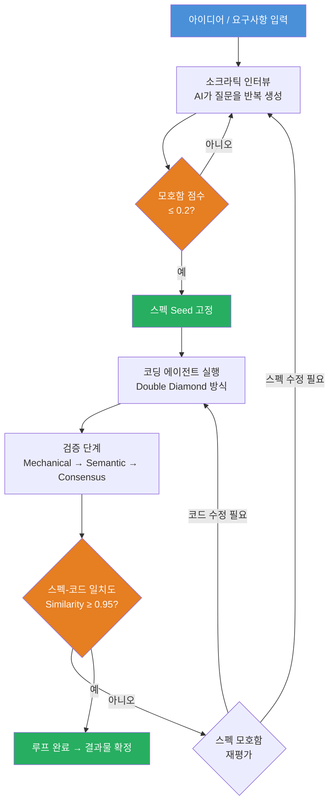
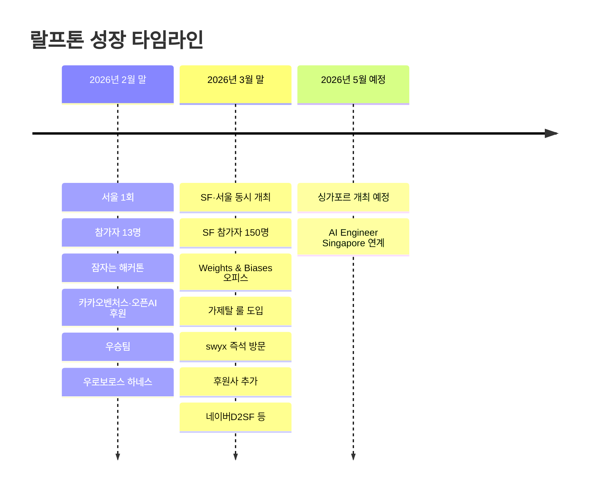
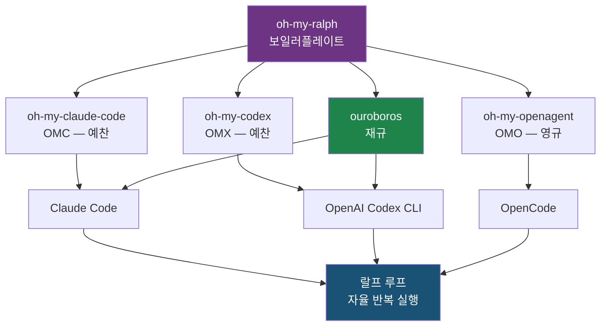
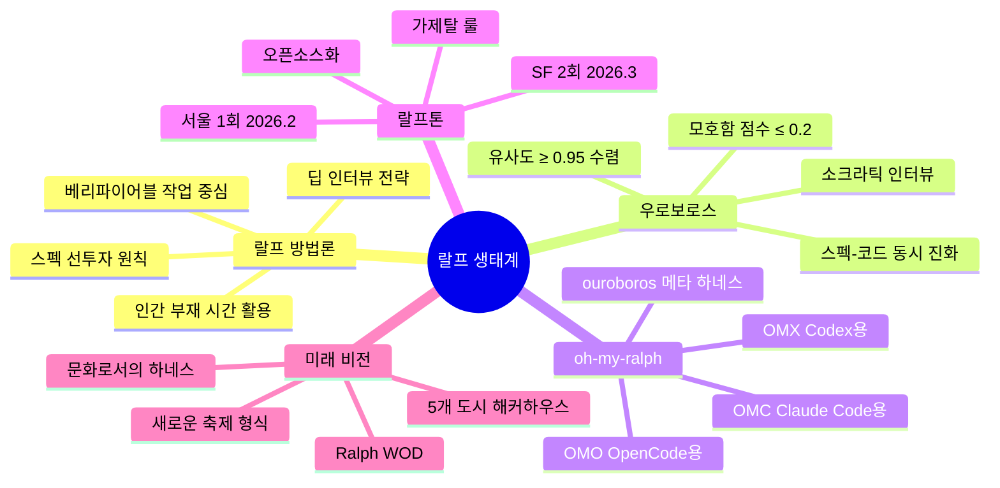

> **영상 출처**: [랄프는 Hype 일까 | 정구봉 초대석 — sudoremove & Team Atn](https://www.youtube.com/watch?v=iBPITohmSB4)  
> **게스트**: 정구봉 (Goobong Jeong) / Team Attention 대표  
> **채널**: sudoremove  
> **방영일**: 2026년 4월 30일

---

## 개요

이 영상은 한국 Claude Code 에반젤리스트이자 Team Attention 대표인 정구봉(이하 '구봉')을 sudoremove 채널에 초대해 진행한 심층 인터뷰다. 총 42분 분량으로, 주제는 크게 세 축으로 나뉜다. 첫째는 "랄프(Ralph)"라는 AI 에이전트 루프 방법론의 실체와 한계, 둘째는 구봉이 직접 창안한 해커톤 형식 '랄프톤(Ralphthon)'의 탄생과 글로벌 확장 과정, 셋째는 그가 지향하는 커뮤니티·문화 빌딩 비전이다. 진행자 JB와 JC가 던지는 날카로운 질문에 구봉이 솔직하게 답하는 구조로, 랄프에 대한 맹목적 찬양보다는 현실적인 사용법과 철학적 고민이 담긴 대화다.

> **Hype(하입)** 는 "실제 가치나 성능보다 과도하게 칭찬받거나 홍보되어, 나중에 거품이 꺼질 수 있는 유행"을 의미합니다.
---

## 1장. 랄프(Ralph)란 무엇인가 — 방법론의 재정의

### 와일 루프(while loop)를 넘어서

'랄프'는 원래 코딩 에이전트를 와일 루프(while loop)로 강제 반복시키는 단순한 개념으로 시작되었다. 코딩 에이전트를 멈추지 않고 계속 일하게 만든다는 것이 핵심인데, 구봉은 이를 "어떻게든 코딩 에이전트를 계속 일하게 하는 방법"이라고 정의한다. 그러나 영상에서 그는 이 단순한 정의를 빠르게 수정한다. 와일 루프로 무작정 돌리는 것은 "바보 같은 랄프"이며, 진짜로 의미 있는 랄프를 돌리려면 사전 준비가 훨씬 중요하다는 것이다.

그가 제시하는 현명한 랄프의 전제 조건은 명확하다. 스펙 문서를 미리 정밀하게 작성해 두고, 그 스펙을 완료하라는 프롬프트를 반복적으로 던지는 방식이다. 이렇게 하면 루프 반복 과정에서 슬럼(slump, 정체 구간)이 발생하더라도 여러 방법론을 통해 극복할 수 있다고 설명한다.

### 인간이 핸들을 잡는 것보다 나은가

이 질문에 구봉은 단호하게 "당연히 그렇지 않다"고 답한다. 사람이 직접 핸들을 잡고 작업하는 것이 품질 면에서는 여전히 우위에 있다. 그렇다면 랄프는 왜 쓰는가? 구봉의 대답은 단순하고 명쾌하다: **사람이 빠져야만 할 때 쓰는 것이 진짜 랄프다.** 자고 있을 때, 다른 미팅에 있을 때, 혹은 물리적으로 자리를 비워야 할 때—그 공백을 AI가 채우도록 하는 것이 랄프의 본령이다.

### 랄프가 잘 맞는 작업 영역

구봉이 경험을 통해 정리한 랄프 적합 작업의 특징은 "베리파이어블(verifiable)"하다는 것이다. 코딩 작업이 대표적이다. 코드는 실행해 보면 맞는지 틀리는지 즉각적으로 검증이 된다. 반면 정성적인 판단이 필요한 작업에서는 결과물이 좋지 않을 가능성이 높다고 솔직하게 인정한다. 그러면서도 예외 사례를 언급한다: 매뉴얼 만들기처럼 반복 시도(trial and error)의 반복 자체가 본질인 작업에서는 랄프가 유효하게 작동했다는 것이다. 영상 편집 방향을 무한히 시도시키는 방식도 성공 사례로 언급된다.

---

## 2장. 스펙이 진화하는 랄프 — 우로보로스 하네스

### 고정된 스펙의 한계

전통적인 랄프 사용법은 "스펙을 잘 짜고 나서 그 스펙이 맞을 때까지 에이전트를 반복시키라"는 것이다. 그러나 구봉은 이 접근에 근본적인 한계가 있다고 지적한다. 인간이 처음부터 완벽한 스펙을 작성할 수 없기 때문이다. 스펙 자체가 불완전하다면 아무리 반복해도 불완전한 결과물이 나올 뿐이다.

### 우로보로스(Ouroboros): 스펙도 함께 진화한다

랄프톤 1회 우승자인 '재규'가 만든 하네스 '우로보로스(Ouroboros)'는 이 문제를 정면으로 해결한다. 이름 자체가 '꼬리를 먹는 뱀'이라는 고대 상징에서 따왔듯, 각 루프가 다음 루프의 입력을 개선하는 자기진화 구조다.

작동 원리는 이렇다. AI가 스펙을 초안 작성하고 코딩을 시작하면, 시스템이 스펙과 코드 사이의 **모호함(ambiguity)** 을 수치로 계산한다. 이 모호함 점수가 일정 임계치(0.2) 이하로 떨어질 때만 다음 코딩 단계로 진행한다. 모호함이 높으면 스펙을 수정하거나 코드를 수정한다. 즉 스펙이 고정된 것이 아니라, 코딩 사이클과 함께 실시간으로 정제되는 살아 있는 문서가 된다.

실제 랄프톤 1회에서 우로보로스를 사용한 팀은 AI에게 133번의 소크라틱 인터뷰(문답법)를 진행시켜 모호성 지수를 0.05까지 낮춘 후 랄프를 돌렸고, 하루 넘게 안정적으로 에이전트가 동작했다. 생성된 코드는 10만 줄에 달했으며 그 중 7만 줄이 테스트 코드였다는 점에서 하네스 설계의 정교함을 잘 보여준다.

### 딥 인터뷰: 이틀을 인터뷰에 쏟아붓다

구봉은 극단적인 사례를 소개한다. 어떤 참가자는 랄프를 돌리기 전 AI와의 인터뷰를 이틀 동안 진행했다. 아무런 컨닝 없이 오직 요구사항을 정제하는 대화만 이틀을 가졌고, 그 결과 에이전트가 하루 넘게 끊기지 않고 동작했다. 이 사례는 "스펙 투자의 수익률"을 극명하게 보여준다. 스펙을 정밀하게 만드는 데 들인 시간이 랄프 실행 안정성으로 직결된다는 것이다. 또한 그 스펙은 재사용 가능한 자산이 된다. 더 좋은 모델이 나왔을 때 같은 스펙으로 다시 돌리면 더 좋은 코드가 나오기 때문이다.

---

## 3장. 200달러짜리 슬롯머신 — 기도 메타의 심리학

### 도박과 중독의 요소를 모두 갖춘 경험

구봉은 랄프 경험의 심리적 본질을 솔직하게 분석한다. 특히 비개발자 입문자들이 처음 랄프를 접할 때 나타나는 패턴이 흥미롭다. 처음의 진입장벽을 넘고 나면 이들은 랄프를 맹렬하게 찬양하며 5시간 리밋이 끝나는 시간에 알람을 맞춰 놓고 자고 일어나서 다시 돌리는 행동을 반복한다.

이 경험을 구봉은 '슬롯머신'에 비유한다. 일을 시켰는데 잘 나올 수도 있고 안 나올 수도 있다. 그런데 가끔씩 한 번에 '땅!' 하고 잘 나오는 순간이 있다. 그 순간의 쾌감이 너무 강렬하다. 자기 전에 돌려 놓고 아침에 일어나 결과를 확인하는 것은 "하루짜리 복권"과 같은 경험이다. 매달 200달러라는 비교적 큰 구독료를 내고, 하루에 다섯 시간에 한 번씩 뽑기권을 얻는 구조라는 것이다. 구봉은 이를 "도박과 중독의 요소를 모두 갖췄다"고 명쾌하게 정리한다.

이것은 랄프의 단점이자 동시에 강점이다. 재미라는 요소가 사람들을 계속 참여시키고, 시행착오를 통해 스스로 더 나은 방법을 찾도록 동기를 부여하기 때문이다.

---

## 4장. 랄프톤(Ralphthon) — 잠자는 해커톤의 탄생

### 서울 1회: 13명, 숙소 대여, 하룻밤의 실험

2026년 2월 말, 구봉은 서울에서 첫 랄프톤을 개최했다. 컨셉은 파격적이었다: **랄프를 돌리고 사람들은 잠을 잔다.** 해커톤인데 참가자들이 실제로 수면을 취한다. 16명이 들어갈 수 있는 숙소를 빌렸는데, 방 하나에 100만 원이 넘는 비용이었다.

재미있는 것은 후원사 확보 과정이다. 카카오벤처스 심사역을 우연히 만나 이야기를 나눴는데, 그 심사역이 후원 의사를 내비쳤다. 구봉은 미팅이 끝나자마자 구체적인 금액 확인도 없이 100만 원짜리 숙소를 바로 결제했다. "생각보다 훨씬 많이 도와주셨다"는 말로 결과를 정리했다. 오픈AI도 후원에 합류해 Codex 크레딧을 제공했다.

13명의 참가자가 모여 하네스 엔지니어링을 마치고 랄프를 돌린 뒤 잠을 잤다. 다음 날 아침 결과물을 확인하는 이 형식은 국내에서 큰 반향을 일으켰다. 전체 참가팀이 만들어 낸 코드가 50만 줄에 달했고, 우승팀(우로보로스 팀)은 133번의 소크라틱 인터뷰로 스펙을 정제한 뒤 10만 줄의 코드를 생성했다.

### SF 2회: swyx의 즉석 등판, 150명 규모

성공에 힘입어 약 한 달 만에 샌프란시스코에서 두 번째 랄프톤이 열렸다. 이번에는 물리적으로 잠을 재울 수 없었기에 '잠자는 해커톤' 대신 새로운 콘텐츠가 필요했다. 여기서 탄생한 것이 **가제탈(Gazettal) 룰**이다.

랄프를 돌리고 나면 노트북에서 손을 떼야 한다. 만약 에이전트가 멈춰서 손을 대야 한다면, 수치스러움의 표시로 '가제탈'을 써야 한다. 그러면 옆 사람들이 다가와 놀리고 조롱한다. 이 우스꽝스러운 규칙 덕분에 사람들이 빠르게 친해지고, 콘텐츠가 생성되며, 커뮤니티가 형성된다.

처음 예상 인원은 50명이었다. 그러나 등록자가 폭발적으로 늘어 Weights & Biases 오피스로 장소를 변경했다. W&B의 AI 에반젤리스트 Alex가 팔로워 수가 상당한 인물이었고, 그가 해커톤을 라이브 스트리밍하면서 트위터(X)에서 화제가 됐다. 그 트윗을 본 AI 커뮤니티의 유명 인사 **swyx**가 즉석에서 행사장을 방문했다. 최종 참가자는 150명에 달했다.

---

## 5장. oh-my-ralph — 4종 보일러플레이트 생태계

### 하네스(Harness)란 무엇인가

랄프를 이해하려면 먼저 '하네스'라는 개념을 이해해야 한다. 하네스는 AI 에이전트가 원하는 방향으로 동작하도록 제어하는 구조적 틀이다. 단순히 프롬프트를 던지는 것과 달리, 하네스는 에이전트의 행동 양식 전체를 설계한다. 루프 조건, 검증 로직, 실패 시 복구 전략, 서브에이전트 호출 방식 등이 모두 하네스에 포함된다.

구봉이 운영하는 **oh-my-ralph**는 커뮤니티가 만들어 낸 핵심 하네스 4종을 한데 묶은 보일러플레이트 레포지토리다. 포크(fork)만 해도 바로 랄프를 돌릴 수 있도록 설계되었다. 구봉은 이를 "랄프톤을 누구나 할 수 있게 하는 도구"라고 설명한다.

### 4종 하네스 상세

| 하네스 | 제작자 | 대상 도구 | 특징 |
|--------|--------|-----------|------|
| **ouroboros** | 재규 (Q00) | Claude Code / Codex CLI | 스펙-코드 모호함 수치 계산, 소크라틱 인터뷰, 자기진화 루프 |
| **oh-my-claude-code (OMC)** | 예찬 | Claude Code | 예찬 스타일의 Claude Code 플러그인, 스킬 기반 확장 |
| **oh-my-codex (OMX)** | 예찬 | OpenAI Codex CLI | Codex를 래핑해 동일 워크플로우 구현 |
| **oh-my-openagent (OMO)** | 영규 | OpenCode | 울트라워크 명령어로 토큰을 폭발적으로 사용, 팀 모드·서브에이전트 총동원 |

각 하네스는 특정 코딩 에이전트를 "더 잘 쓸 수 있게 해주는 플러그인" 개념으로 이해하면 쉽다. OMC는 Claude Code용, OMX는 Codex용, OMO는 OpenCode용 플러그인이다. 우로보로스는 다중 런타임을 지원하는 메타 하네스에 가깝다.

특히 OMO에서 사용하는 `ultrawork` 명령어는 흥미롭다. 이 단어를 입력하면 에이전트가 서브에이전트를 호출하고 팀 모드를 활성화하며 토큰을 폭발적으로 소비하면서 가능한 모든 수단을 동원해 작업을 완료하려 한다. 구봉은 이를 여전히 "물 떠 놓고 기도하는 느낌"이 든다고 솔직하게 평한다.

### 토큰 한계 문제와 다중 모델 전략

5시간 토큰 제한이라는 현실적 장벽에 대해서도 구봉은 실용적인 해법을 공유한다. 오퍼스 모델만 쓰지 않고 작업에 따라 소넷, 하이쿠, Gemini 등 다양한 모델을 조합해 사용한다. 코드 실행 시간이 길게 끼어 있으면 토큰 소비 속도가 줄어 리밋에 걸리지 않고 더 오래 돌릴 수 있다는 실전 팁도 공유했다. Codex에 막히면 바로 교체해서 사용하는 전략도 언급했다.

---

## 6장. Claude Code에서 Codex로 — 주력 도구 이동의 이유

### 토큰 체감 가성비: Codex가 3배 이상

영상에서 가장 실질적인 정보 중 하나는 구봉이 메인 도구를 Claude Code에서 OpenAI Codex로 전환하고 있다는 선언이다. 이유는 단순하다: **가성비**다.

같은 200달러 구독료를 내지만, Claude Code는 같은 작업을 시키면 금방 토큰 리밋에 도달하는 반면, Codex는 같은 작업에서 훨씬 여유가 있다. 구봉의 체감으로는 Codex가 Claude Code보다 토큰을 세 배 이상 제공한다. "써도 써도 안 달린다"는 표현이 인상적이다.

한편 기능 면에서는 팀 모드를 제외한 Claude Code의 주요 기능이 Codex에 거의 모두 들어와 있다고 설명한다. 서브에이전트, 훅(hook), 스킬즈 등 핵심 기능이 Codex에도 구현되었다는 것이다. OpenAI 내부에서도 최근 Codex를 강하게 밀기 시작하면서 기능이 빠르게 추가되고 있다는 분석도 덧붙였다. 경쟁의 결과로 사용자가 더 많은 토큰을 제공받게 되는 구조라고 평가하며, 앞으로도 이 흐름은 계속될 것이라 전망한다.

### CLI 집중이라는 공통분모

양사 모두 CLI(명령줄 인터페이스)에 집중한다는 점이 흥미롭다고 구봉은 언급한다. IDE 확장이나 GUI 도구보다 CLI가 주력 개발 환경이 되는 흐름은 과거에 익숙했던 개발자들에게 다행스러운 일이기도 하다. 구봉 자신도 Cursor가 유행할 때 "이제 IDE를 써야 하나" 고민했다가 Claude Code라는 CLI 도구가 등장하면서 환경이 오히려 더 익숙해졌다고 회상한다.

---

## 7장. 랄프톤의 오픈소스화 — 누구나 랄프톤을 열 수 있게

### 프로토콜과 운영 앱의 공개

구봉의 다음 목표는 랄프톤이라는 형식 자체를 오픈소스로 완전히 공개하는 것이다. 이미 운영 프로토콜과 웹 앱 모두 GitHub에 올라가 있으며, 폴리싱(polish) 작업을 진행 중이다. 누구든 레포지토리를 클론하고 환경 변수만 바꾸면 자신만의 랄프톤 사이트를 배포할 수 있다. 캐릭터나 이름도 커스텀 가능하다.

프로토콜에는 운영의 현실적인 세부 사항이 가득하다. 장소 선정 시 에어컨 유무 확인, 30일 전까지 장소 확보, 굿즈 준비 일정 등 직접 랄프톤을 열어 본 경험이 녹아 있다. (구봉 본인은 장소를 3일 전에 확보하고 트위터에 "더 큰 장소 구합니다"를 올린 케이스였지만.) AI와 대화하면서 만든 자료들이 모두 남아 있고, 그것을 AI에게 다시 먹여 프로토콜을 생성시켰다.

### 후원받기 꿀팁

구봉이 공유하는 후원 유치의 핵심은 역설적으로 간단하다. 장소를 먼저 예약하고 나서 후원사를 찾으라는 것이다. 실제로 구봉은 카카오벤처스 심사역과의 대화가 끝나자마자 구체적인 금액 협의도 없이 바로 숙소를 예약했다. 또한 Team Attention 측에서 오픈AI Codex 팀과의 연결을 통해 크레딧 지원을 받을 수 있는 채널을 만들어 두었으며, 이를 랄프톤 개최자들에게 연결해줄 수 있다고 밝혔다.

---

## 8장. 다음 계획 — Ralph WOD, 5개 도시 해커하우스

### Ralph WOD: 운동하는 랄프톤

랄프 돌리고 잠자는 것 다음 단계로 구봉이 준비 중인 것은 '랄프 WOD'다. WOD는 크로스핏에서 '오늘의 운동(Workout of the Day)'을 뜻하는 용어다. 랄프를 돌려 놓고 참가자들이 함께 크로스핏을 하는 이벤트다.

그 이유는 명확하다. 운동은 사람들을 빠르게 친하게 만드는 최고의 도구이기 때문이다. 크로스핏의 특성상 각자 수준에 맞게 난이도를 조절할 수 있어 누구나 참여 가능하고, 함께 땀 흘리고 웃으면서 커뮤니티가 자연스럽게 형성된다. 랄프톤의 '가제탈 룰'과 마찬가지로, 유쾌한 경험을 매개로 사람들이 AI라는 공통의 관심사로 묶이게 하는 전략이다.

진행자들이 "운동 안 한지 오래됐다"며 무조건 가겠다는 반응을 보인 것도 흥미롭다. 커뮤니티의 낮은 진입장벽이 바로 이런 유쾌함에서 나온다.

### 5개 도시 해커하우스 비전

구봉이 그리는 더 큰 그림은 물리적 공간을 기반으로 한 글로벌 커뮤니티다. 목표 도시는 서울, 샌프란시스코, 런던, 아부다비, 싱가포르 다섯 곳이다. 이 도시들은 SF에서 시작하는 글로벌 스타트업들이 순서대로 거점을 만드는 경로와 정확히 일치한다.

Hugging Face 오피스 방문 경험에서 영감을 받았다고 밝혔다. 허깅페이스는 직원이 아닌 외부 오픈소스 기여자들에게도 사무공간을 개방하고, 3D 프린터, 로봇, 공구 등 시설을 공유한다. 구봉이 구상하는 해커하우스도 이와 유사하다: 숙박, 작업, 대화, 운동, 촬영, 콘텐츠 제작이 가능한 복합 공간이다.

모든 도시에 직접 공간을 짓는 대신, 현지의 좋은 오프라인 공간들과 협력하는 방식을 취한다. 협력의 댓가로 Team Attention이 제공하는 것은 '문화'—랄프톤 같은 해커톤 프로그램, 해커하우스 운영 프로토콜, 그리고 이를 지원하는 소프트웨어다.

---

## 9장. 문화는 인간의 하네스다 — 구봉의 철학

### 하네스의 본질을 다시 정의하다

대화의 후반부에서 구봉은 '하네스'라는 개념을 AI의 영역에서 인간의 영역으로 확장한다. 하네스란 "원하는 대로 동작하게 하는 것"이다. 지하철에서 왼쪽 통행이 자연스럽게 이루어지는 것, 사람들이 특정 행동 양식을 자연스럽게 따르는 것—이것이 바로 사회적 하네스이고, 더 큰 틀에서는 **문화**다.

그는 AI를 잘 사용하는 행동 양식을 빠르게 사람들에게 전파하고 싶다고 말한다. 그러기 위해서는 그 행동 양식을 잘 '패키징'해서 전달해야 한다. 랄프톤, 가제탈 룰, Ralph WOD 등이 모두 이 패키징의 산물이다.

### 커뮤니티가 종교와 닮은 이유

구봉은 한 걸음 더 나아가, 인간의 행동을 가장 강력하게 강제하는 것이 종교라고 말한다. 그런 의미에서 자신이 하는 일은 "새로운 종류의 종교를 만드는 것"과 닮았다고 자조적으로 표현한다. 물론 이것은 비유적 표현이다. 핵심은 **공간 + 믿음 + 의례(ritual)** 의 조합이다. 랄프가 미래라고 믿는 사람들이 모일 수 있는 물리적 공간, 함께 랄프를 돌리는 의례적 행위, 그리고 그 안에서 형성되는 공동체 의식. 이것이 그가 커뮤니티 빌딩에서 추구하는 것이다.

### 해커톤의 재발명

구봉의 궁극적인 목표는 단순히 랄프톤을 확산시키는 것이 아니다. '해커톤'이라는 기존 개념에 포함되지 않는 완전히 새로운 무언가를 만드는 것이다. 모두가 함께 즐기는 새로운 형태의 축제, 새로운 유형의 문화적 이벤트를 창안하고 싶다는 것이 그의 비전이다.

---

## 10장. 구봉이 전달하는 메시지 — "많이 써라, 이를 거 없다"

영상의 마지막 메시지는 간결하고 강력하다. "많이 쓰는 것이 제일 좋다. 양에서 질이 나온다." 그리고 이렇게 덧붙인다: "AI를 써서 지금까지 갖고 있던 것이 무너지면 어떡하지 하는 생각보다는, 앞으로가 훨씬 더 크니까 그냥 해보는 것이 무조건 이득이다."

각자의 사용 방법이 다를 것이며, 완전히 개인화될 것이라는 전망도 제시한다. 지금 공유되는 프랙티스들은 참고는 되지만 정답이 아니다. 많이 써 봐야 자신에게 맞는 하네스와 방법론이 무엇인지 알 수 있다는 메시지다.

---

## 핵심 개념 정리

---

## 주요 링크 모음

| 리소스 | URL |
|--------|-----|
| oh-my-ralph (보일러플레이트) | https://github.com/team-attention/oh-my-ralph |
| 랄프톤 공식 페이지 | https://ralphthon.vercel.app |
| 랄프톤 GitHub | https://github.com/team-attention/ralphthon |
| Team Attention GitHub | https://github.com/team-attention |
| ouroboros (재규) | https://github.com/Q00/ouroboros |
| oh-my-codex (예찬) | https://github.com/Yeachan-Heo/oh-my-codex |
| oh-my-openagent (영규) | https://github.com/code-yeongyu/oh-my-openagent |
| Claude Code Ralph Wiggum 플러그인 | https://github.com/anthropics/claude-code/tree/main/plugins/ralph-wiggum |
| 구봉 LinkedIn | https://www.linkedin.com/in/gb-jeong/ |
| sudoremove YouTube | https://www.youtube.com/@sudoremove |

---

## 총평

이 영상은 랄프라는 방법론에 대한 맹목적인 찬양을 지양하고, 실전에서 마주치는 한계와 그것을 극복하기 위한 현실적인 방법을 솔직하게 다룬다는 점에서 가치 있다. "물 떠 놓고 기도하는 느낌"이라는 표현이 반복적으로 등장하는 것이 상징적이다. 구봉 자신도 랄프가 완벽하지 않음을 인정하면서도, 그 불완전함 속에서 최선의 사용법을 찾는 실험적 태도를 유지한다.

특히 주목할 만한 통찰은 세 가지다. 첫째, 스펙 투자의 수익률 — 사전 인터뷰에 이틀을 쏟으면 에이전트가 하루 넘게 안정적으로 동작한다는 경험적 법칙. 둘째, 하네스의 개인화 — 자신이 만든 하네스를 자신이 제일 잘 쓰며, 하네스는 반드시 반복적으로 개선되어야 한다. 셋째, 문화로서의 하네스 — AI 사용 행동 양식을 유쾌하게 패키징해 전파하는 것이 랄프톤이라는 해커톤 형식의 본질이라는 것.

랄프는 Hype인가? 구봉의 답은 이렇게 요약된다: 지금 당장 인간을 이기지는 못하지만, 2년 뒤에는 달라질 것이다. 그 2년을 준비하기 위해, 지금 많이 써보는 것이 무조건 이득이다.

---

*작성일: 2026년 4월 30일*
