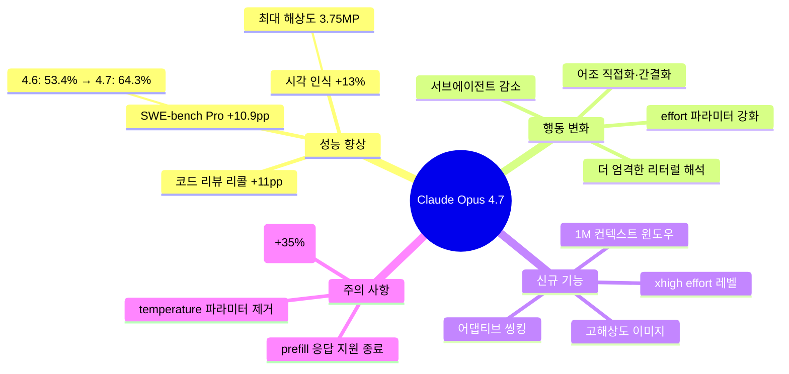
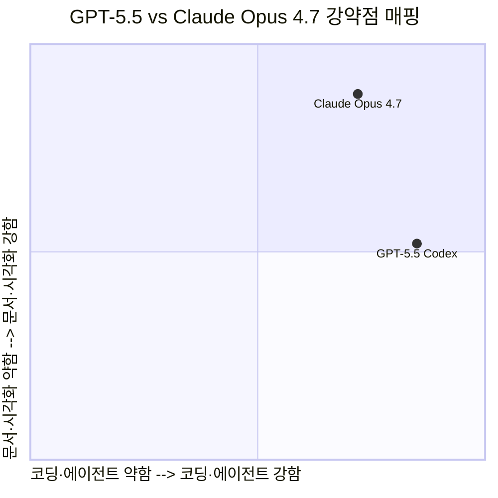
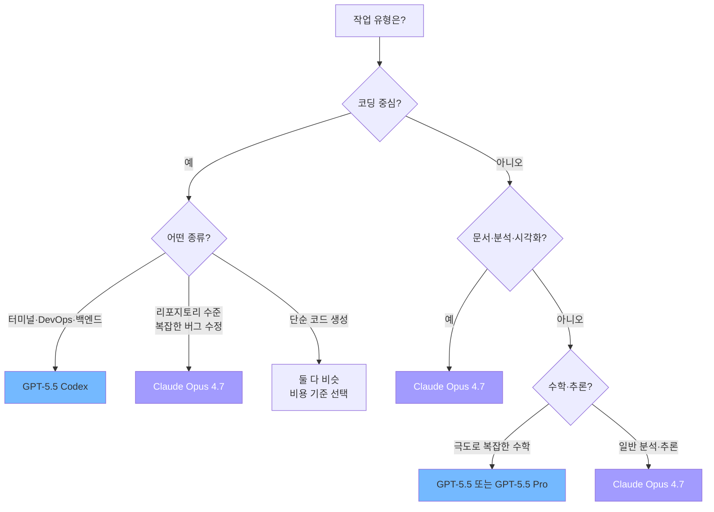
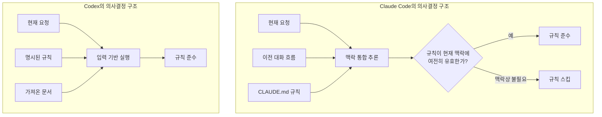
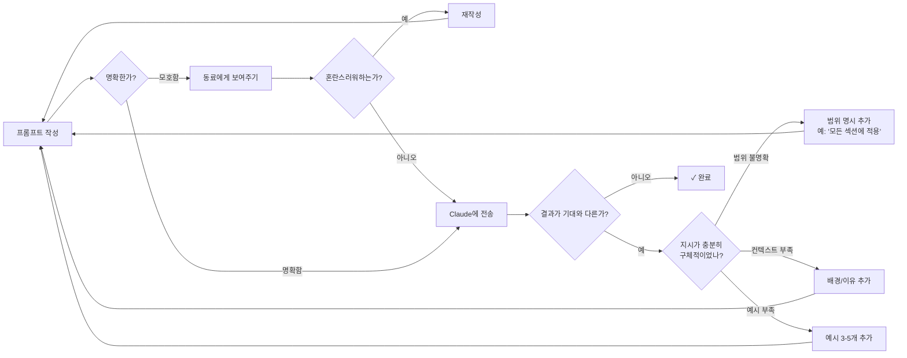

### GPT-5.5 Codex와의 비교, Claude Code vs Codex 행동 차이, 그리고 새로운 프롬프팅 원칙

---

## 1. 들어가며: 현장에서 올라오는 목소리들

2026년 4월 하순, 소셜 미디어에는 Claude Opus 4.7을 둘러싼 엇갈린 반응들이 쏟아졌다. "어제 auto mode on 기능에 혹해서 Opus 4.7으로 바꾸었었는데, 결국 쌍욕 시전해주고 Opus 4.6으로 되돌려 버렸다"는 한 Facebook 포스팅은 이 새 모델이 단순한 업그레이드가 아님을 시사한다. 동시에 Threads에서는 GPT-5.5 Codex와 Claude Opus 4.7의 세밀한 비교 분석이 오가고 있었다. "각자 뾰족한 부분이 다르다"는 표현이 핵심을 찌른다.

이 문서는 그 뾰족한 부분들이 무엇인지, 왜 그런 차이가 생기는지, 그리고 이 새로운 환경에서 어떻게 프롬프트를 작성해야 하는지를 종합적으로 정리한다. Anthropic의 공식 프롬프팅 가이드라인, 실제 사용자 경험, 최신 벤치마크 데이터를 교차 검토하여 현장에서 바로 쓸 수 있는 통찰을 도출하는 것이 목표다.

---

## 2. Claude Opus 4.7: 무엇이 달라졌나

### 2.1 핵심 변화 개요

Claude Opus 4.7은 2026년 4월 16일 출시되었다. 모델 이름은 전작과 비슷하지만 내부적으로는 여러 면에서 다른 철학으로 설계되었다. Anthropic의 공식 문서는 변화의 방향을 명확하게 제시하고 있다.

가장 주목할 만한 변화는 세 가지로 압축된다.

**첫째, 리터럴 명령 해석의 강화.** Opus 4.6은 "이 섹션을 수정해"라는 지시를 받으면 맥락을 파악해 관련 섹션들도 함께 수정해주는 경향이 있었다. 4.7은 그렇게 하지 않는다. 명시적으로 요청하지 않은 것은 하지 않는다. 이 변화는 예측 가능성을 높이는 동시에, 이전 프롬프트 작성 방식으로는 기대했던 결과가 나오지 않는다는 불만을 낳는다.

**둘째, effort 파라미터의 중요성 증대.** 이전 모델들에서도 effort 파라미터가 있었지만, 4.7에서는 이 파라미터가 모델 동작에 훨씬 직접적이고 강력한 영향을 미친다. Anthropic은 "이 모델에서 effort는 그 어떤 이전 Opus 버전보다 중요하다"고 명시적으로 밝히고 있다.

**셋째, 토크나이저 변경.** 새로운 토크나이저는 동일한 텍스트를 처리할 때 기존 대비 최대 35% 더 많은 토큰을 사용할 수 있다. 이는 비용과 컨텍스트 윈도우 관리 측면에서 중요한 실무적 함의를 가진다.

### 2.2 왜 사용자들은 당혹스러워했나

"쌍욕을 시전했다"는 표현의 배경을 이해하려면, 4.7의 리터럴 해석 특성이 기존 프롬프트 자산에 어떤 영향을 미치는지 살펴봐야 한다.

Anthropic의 공식 프롬프팅 가이드는 이를 직접적으로 언급한다. "Claude Opus 4.7은 이전 버전들보다 더 리터럴하게 프롬프트를 해석한다. 특히 낮은 effort 레벨에서 그러하다. 모델은 한 항목에 대한 지시를 다른 항목으로 묵시적으로 일반화하지 않으며, 요청하지 않은 것을 추론하지 않는다."

이것이 의미하는 바는 명확하다. 기존에 "잘 작동하던" 프롬프트가 4.7에서는 예상과 다르게 동작할 수 있다. 이전 모델들이 프롬프트의 '의도'를 파악해 보완해줬다면, 4.7은 '문자 그대로'만 실행한다. 이는 API 개발자에게는 반가운 예측 가능성이지만, 자연어 기반 대화형 작업 흐름을 기대하는 사용자에게는 불편함으로 느껴진다.

또한 auto mode(어댑티브 씽킹)의 기본 비활성화도 혼란을 가중시켰다. 4.6에서 `thinking: {type: "adaptive"}`가 기본적으로 동작하던 것과 달리, 4.7에서는 명시적으로 활성화해야 한다. 이를 모른 채 4.7로 전환한 사용자들은 思考 과정 없이 응답하는 모델을 경험했을 것이다.

### 2.3 Effort 파라미터: 새로운 핵심 제어 변수

Effort 레벨은 단순히 "더 열심히 생각하라"는 신호가 아니다. 이 파라미터는 도구 사용 빈도, 추론 깊이, 서브에이전트 생성 여부, 응답 길이 등 모델 동작의 여러 차원을 동시에 조정한다.

실무적 가이드라인은 다음과 같다.

- **코딩·에이전트 작업**: `xhigh`를 기본값으로 시작하라. max 대비 비용 효율이 좋으면서 성능은 대부분의 경우 동등하다.
- **일반 지식 작업**: `high`를 최소값으로 설정하라.
- **비용 민감 작업**: `medium`을 실험하되, 복잡한 추론이 필요한 작업에서는 품질 저하를 감수해야 한다.
- **단순 Q&A, 저지연 작업**: `low`를 사용하되, 복잡한 문제에서는 과소사고(under-thinking) 위험이 있다.

Anthropic의 권고는 명확하다. `max`나 `xhigh`에서 실행할 때는 max_tokens를 최소 64k로 설정해 모델이 서브에이전트와 도구 호출에 걸쳐 충분히 생각하고 행동할 공간을 확보하라.

---

## 3. GPT-5.5 Codex vs Claude Opus 4.7: 뾰족한 부분이 다르다

### 3.1 비교의 맥락

GPT-5.5는 2026년 4월 23일 출시되었다. Claude Opus 4.7 출시 일주일 후다. 두 모델이 거의 동시에 등장하면서 자연스럽게 비교 논의가 활발해졌다. Threads의 표현처럼 "각자 뾰족한 부분이 다르다"는 것이 대체적인 현장 평가다.

### 3.2 GPT-5.5의 강점: 터미널 작업과 토큰 효율

벤치마크 데이터는 GPT-5.5가 터미널 환경에서 특히 강함을 보여준다. Terminal-Bench 2.0에서 GPT-5.5는 82.7%를 기록했고, Claude Opus 4.7은 69.4%에 그쳤다. 이것이 이번 전체 비교에서 한 방향으로 가장 큰 격차를 보이는 수치다.

또한 Codex와의 통합이 가져오는 샌드박스 실행 환경은 강점이다. 코드를 실행하고, 결과를 보고, 수정하는 피드백 루프가 OpenAI 생태계 안에서 더 타이트하게 구성된다. 특히 Codex Desktop의 컴퓨터 사용(computer use) 기능은 현장 평가에서 "가히 사기적이랄만큼 좋다"는 언급을 받았다.

토큰 효율 측면에서도 GPT-5.5는 장점을 보인다. 동일한 코딩 작업에서 Claude Opus 4.7 대비 약 72% 더 적은 출력 토큰을 사용한다는 분석이 있다. 하루 500건의 에이전트 작업을 돌린다고 가정하면, 이 차이는 월 수천 달러의 비용 차이로 이어질 수 있다.

### 3.3 Claude Opus 4.7의 강점: 리포지토리 수준 코딩과 문서·시각화

SWE-bench Pro에서 Claude Opus 4.7은 64.3%를 기록해 GPT-5.5의 58.6%를 앞질렀다. 이 벤치마크는 실제 GitHub 이슈를 실제 코드베이스에서 해결하는 능력을 측정한다. 단순 코드 생성이 아니라 복잡한 멀티파일 리포지토리 수준의 작업에서 강하다는 의미다.

문서 작업과 시각화에서도 Claude가 우위를 가진다. Threads의 평가처럼 "보고서, 문서가 정말 깔끔하게 나온다", "2D 계열은 상당히 탁월하다", "UI나 프론트엔드도 오퍼스가 코덱스 쓸 때보다 미묘하게 더 잘 나온다"는 것이 사용자 경험의 중론이다.

MCP(Model Context Protocol)와 Skills 생태계의 성숙도도 중요한 차별점이다. Anthropic이 먼저 주도한 이 생태계는 현재 상당한 수준으로 발달해 있어, 특히 사무직 워크플로우에서 Claude가 더 쉽게 통합된다.

### 3.4 어떤 상황에서 무엇을 선택할 것인가

요약하면 "개발 전문가면 GPT-5.5 Codex, 아니면 Claude"라는 현장 평가는 상당히 정확하다. 터미널을 주력으로 쓰는 DevOps 엔지니어나 고도의 수학적 추론이 필요한 작업이라면 GPT-5.5가 유리하다. 반면 사무직, 문서 작업, 복잡한 코드베이스 이해, 시각화, MCP 기반 워크플로우는 Claude의 영역이다.

---

## 4. Claude Code vs Codex: 규칙 준수 vs 맥락 우선

### 4.1 흥미로운 실험 관찰

한 사용자가 동일한 프로젝트에서 Claude Code와 Codex를 번갈아 사용하며 흥미로운 차이를 발견했다. 프로젝트에는 코드 구조를 지식 그래프로 구성하는 `graphify`라는 오픈소스 도구가 통합되어 있었고, CLAUDE.md(또는 동등한 규칙 파일)에 "수정 전에 반드시 graphify query를 실행하라"는 규칙이 명시되어 있었다.

결과는 명확하게 갈렸다. Codex는 매 요청마다 이 규칙을 준수했다. Claude Code는 자주 이 규칙을 무시했다.

### 4.2 왜 이런 차이가 발생하는가

두 에이전트가 이 상황에서 직접 설명한 자신의 동작 방식은 다음과 같다.

**Claude**: "이전 대화 흐름과 지금 하고 있는 작업의 목적을 함께 고려하고, md에 있는 규칙을 참고합니다. 즉, 규칙보다 맥락을 우선적으로 고려한 선택을 할 수 있다."

**Codex**: "현재 프롬프트 및 가져온 문서, 명시된 규칙 등 입력된 정보를 우선적으로 따릅니다. 유연성이 떨어지는 대신 일관성이 높은 결과를 보여줍니다."

이 차이는 철학적 차이이기도 하다. Claude는 지시를 해석할 때 "왜 이 지시가 여기 있는가"를 고려하며, 현재 상황에서 그 지시의 의도가 충족된다고 판단하면 지시를 생략할 수 있다. Codex는 지시를 입력으로 간주하고 실행한다.

### 4.3 실무적 함의

이 차이는 어떤 상황에서 어떤 도구를 쓸지에 대한 명확한 지침을 제공한다.

**규칙 일관성이 중요한 경우**: 코드베이스 전반에 특정 도구 사용을 강제해야 하거나, 파이프라인에서 예측 가능한 동작이 필요하다면 Codex가 더 적합하다. 인프라 코드, CI/CD 통합, 팀 단위 개발 표준 적용 등이 여기에 해당한다.

**맥락 기반 판단이 중요한 경우**: 작업의 의도와 흐름을 이해하며 유연하게 적응하는 에이전트가 필요하다면 Claude Code가 더 적합하다. 복잡한 리팩토링, 설계 결정, 아키텍처 수준의 작업 등이 여기에 해당한다.

실제로 이 두 특성을 조합하는 워크플로우도 유효하다. "Claude Code로 프롬프트와 컨텍스트를 잘 관리하면서 초안을 만들고, 문서와 주석을 잘 관리하면서 Codex로 리뷰를 시키면 된다"는 접근이 그 예다.

---

## 5. 프롬프팅 패러다임의 전환: 인간의 사고력이 병목이 된다

### 5.1 기계가 더 정확해질수록 인간의 지시가 더 중요해진다

Anthropic의 공식 프롬프팅 가이드 출시와 함께 한 통찰이 주목받았다. 요약하면 이렇다: "기존에 쓰던 Claude 프롬프트, 이제 전부 버려야 할지도 모른다."

이 표현은 단순한 수사가 아니다. Claude Opus 4.7의 엄격한 리터럴 해석 특성은, 이전 모델들이 "알아서 채워줬던" 프롬프트의 모호함을 더 이상 보완해주지 않음을 의미한다. 결과물이 예전보다 못하게 느껴진다면 모델 성능이 떨어진 것이 아니라, 엉성하게 작성했던 프롬프트의 밑천이 드러난 것이다.

이는 더 큰 흐름의 일부다. AI 모델이 고도화될수록, 진짜 병목 구간은 기술이 아니라 인간의 의도 명확화 능력으로 이동하고 있다. 마법 같은 프롬프트 비법을 찾는 것보다, 내가 무엇을 원하는지 정확히 정의하는 사고력이 더 강력한 무기가 된다.

### 5.2 프롬프팅 원칙의 실제 적용

Anthropic이 제시하는 핵심 원칙인 "황금률"은 간단하다. 최소한의 맥락을 가진 동료에게 프롬프트를 보여줬을 때 그가 혼란스러워한다면, Claude도 혼란스러울 것이라는 원칙이다.

몇 가지 실천적 변화가 필요하다.

**범위를 명시적으로 지정하라.** "이 지시를 첫 번째 섹션뿐만 아니라 모든 섹션에 적용하라"처럼, 적용 범위를 직접 언급해야 한다. 이전에는 모델이 추론했지만 이제는 하지 않는다.

**이유를 설명하라.** 단순히 "절대 줄임표를 쓰지 마라"보다 "이 텍스트는 TTS 엔진이 읽을 것이므로 줄임표를 사용하면 안 된다"처럼 배경을 설명하면 모델이 더 잘 일반화한다.

**예시를 사용하라.** 원하는 출력 형식, 어조, 구조를 보여주는 실제 예시가 가장 효과적인 프롬프팅 기법이다. 3-5개의 잘 구성된 예시는 길고 복잡한 지시문보다 더 신뢰할 만한 결과를 낳는다.

---

## 6. 현장 평가 종합: 모델 선택의 실제 기준

### 6.1 Claude Opus 4.7의 실제 사용 적합성

사무직 작업자들에게는 Claude가 여전히 최선의 선택이다. 문서 작성, 보고서, 프레젠테이션, 시각화, MCP 생태계 통합 등에서 Claude는 명확한 강점을 보인다. "보고서, 문서가 정말 깔끔하게 나온다"는 현장 평가는 단순한 선호의 문제가 아니라 모델 설계 철학의 반영이다.

개발자 관점에서는 Claude Opus 4.7이 복잡한 코드베이스를 이해하고 멀티파일 변경을 수행하는 작업에 강하다. SWE-bench Pro 수치가 보여주듯, 단순 코드 생성을 넘어 실제 리포지토리 수준의 문제 해결에서 경쟁 모델을 앞선다.

다만 한계도 명확하다. Codex에 비해 동일 작업에서 더 많은 토큰을 소비하는 경향이 있고, 터미널 작업에서는 열세다. 그리고 "한다고 한 일을 안 하는 경우가 더러 있다"는 지적처럼, 4.7의 리터럴 해석 특성이 완벽하게 일관성 있게 적용되지 않는 경우도 있다.

### 6.2 Claude Opus 4.6으로의 복귀 현상의 해석

일부 사용자가 4.7에서 4.6으로 복귀한 현상은 단순히 4.7이 나쁘다는 의미가 아니다. [MindStudio의 분석](https://www.mindstudio.ai/blog/claude-opus-47-vs-46-what-changed)이 지적하듯, 4.6의 '성능 저하'를 경험하고 있었다면 그 저하된 4.6 대비로 4.7을 비교하는 것이어서, 실제 능력 비교가 왜곡되었을 수 있다.

더 근본적으로는, 4.7은 기존 프롬프트 자산을 재조정하지 않은 사용자에게 기대 이하의 결과를 낳는다. Pro 요금제로의 다운그레이드와 Claude Code와의 멀어짐도 비용 효율의 문제이지, 4.7이 4.6보다 모든 면에서 낫지 않음을 의미하지는 않는다.

적합한 use case에서, 적절히 재조정된 프롬프트와 함께 사용하면, Claude Opus 4.7은 분명 더 나은 결과를 낸다.

---

## 7. 결론: 변화하는 인간-AI 인터페이스

모델이 고도화될수록 인간의 역할이 "모호한 의도를 전달하는 존재"에서 "정밀한 목표를 명시하는 존재"로 변화하고 있다. 이는 AI가 더 강력해진 결과이지, 더 어려워진 결과가 아니다. 의도를 정확하게 언어화하는 능력이 AI 활용 역량의 핵심으로 부상하고 있다.

GPT-5.5와 Claude Opus 4.7의 경쟁은 단순한 벤치마크 싸움이 아니다. 두 회사가 AI 에이전트의 올바른 작동 방식에 대해 서로 다른 철학을 가지고 있음을 보여준다. OpenAI는 일관성과 생태계 통합을, Anthropic은 맥락 이해와 장기적 자율성을 우선시한다.

어느 것이 더 낫다는 단일한 답은 없다. 작업의 성격, 팀의 구성, 비용 구조, 기존 생태계에 따라 최적의 선택은 달라진다. "각자 뾰족한 부분이 다르다"는 현장의 직관이 그 어떤 벤치마크보다 정확한 요약이다.

---

*작성일: 2026년 5월 1일*
