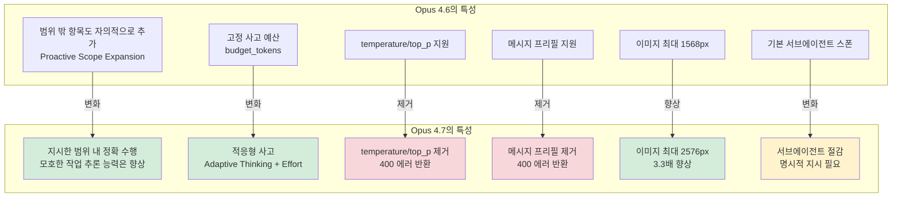
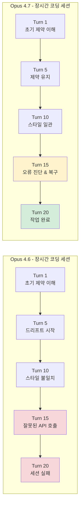
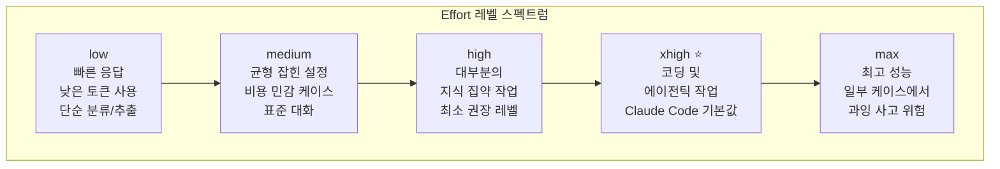
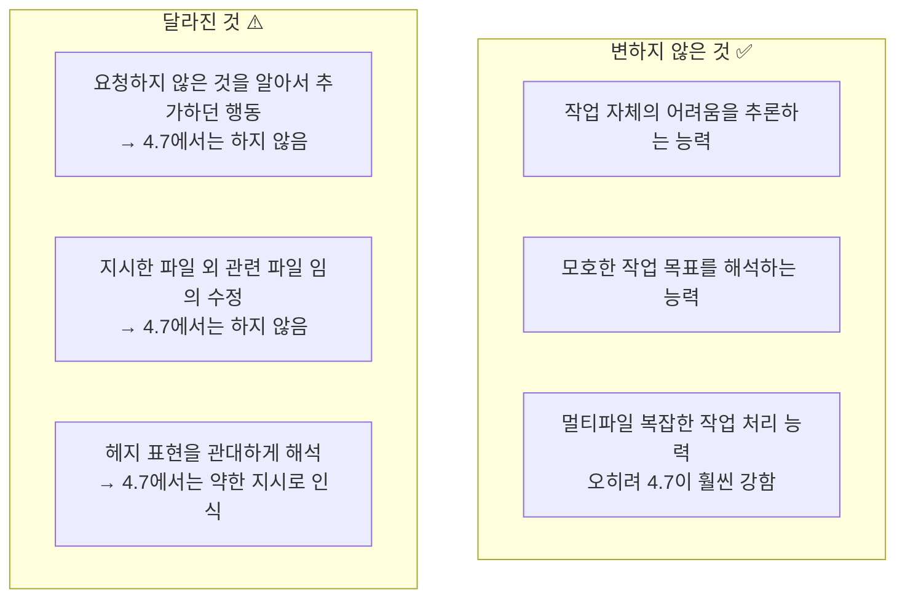
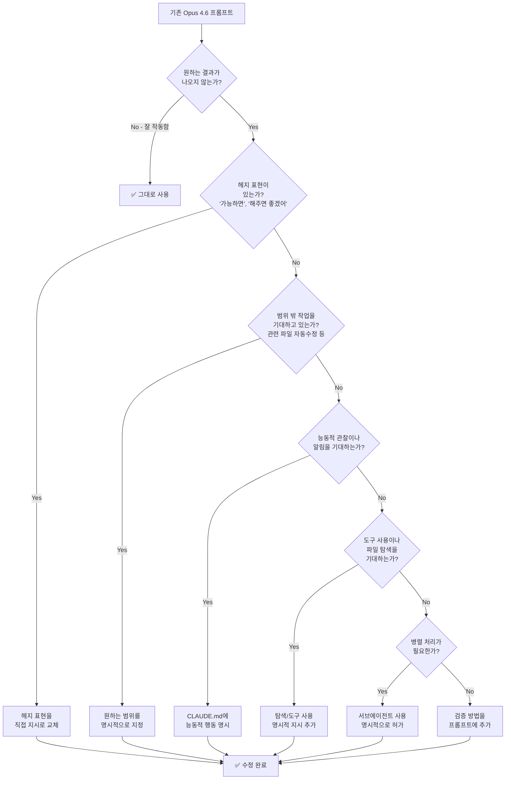
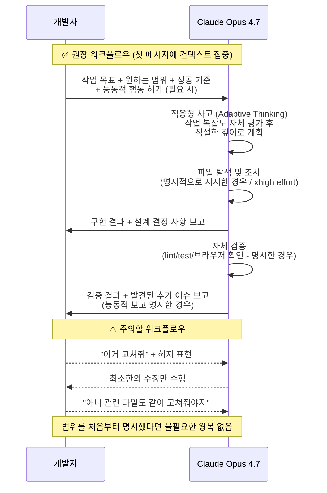
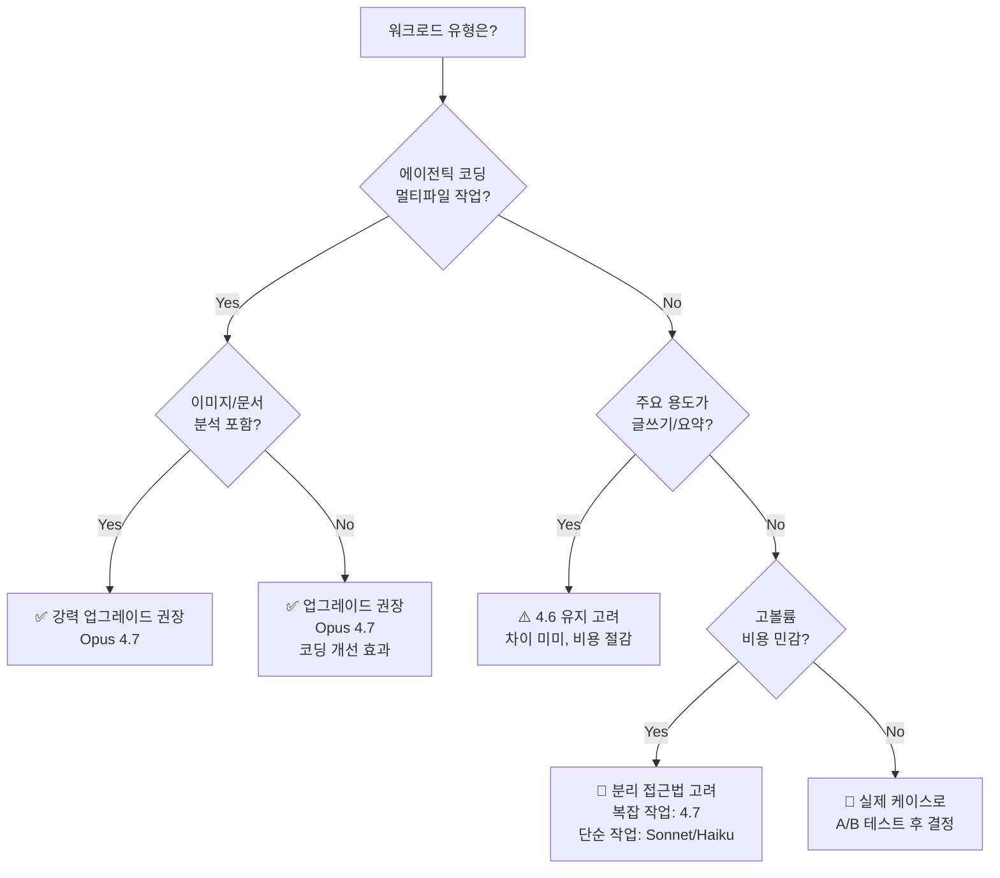
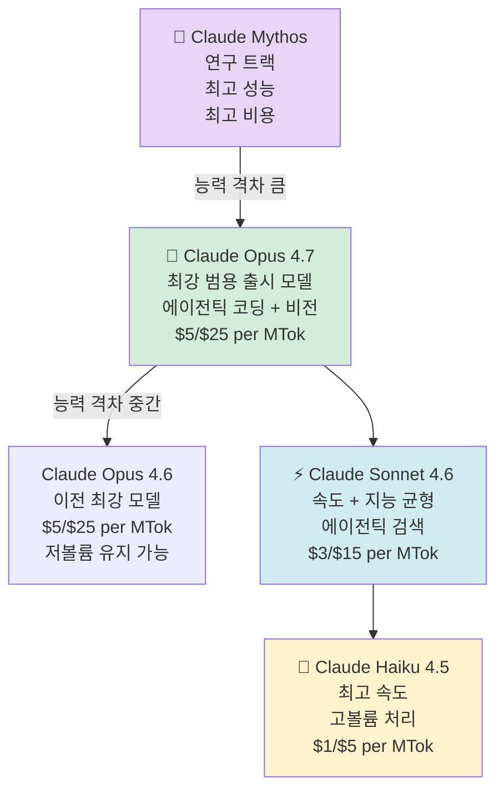

## Opus 4.6과의 비교 · API 마이그레이션 · 바이브코딩 프롬프트 전략

> 작성일: 2026년 5월 1일 | 참고: Anthropic 공식 문서, MindStudio, Claude Code 팀 Boris Cherny 팁

---

## 목차

1. [핵심 요약](#1-핵심-요약)
2. [Claude Opus 4.7이란 무엇인가](#2-claude-opus-47이란-무엇인가)
3. [Opus 4.6 vs 4.7: 무엇이 달라졌나](#3-opus-46-vs-47-무엇이-달라졌나)
4. [성능 변화 상세 분석](#4-성능-변화-상세-분석)
5. [변하지 않은 것들](#5-변하지-않은-것들)
6. [토큰 비용 및 가격 정책](#6-토큰-비용-및-가격-정책)
7. [API 마이그레이션 가이드](#7-api-마이그레이션-가이드)
8. [바이브코딩 개발자를 위한 프롬프트 전략 전환](#8-바이브코딩-개발자를-위한-프롬프트-전략-전환)
9. [업그레이드 여부 결정 프레임워크](#9-업그레이드-여부-결정-프레임워크)
10. [Claude 모델 전체 생태계에서의 위치](#10-claude-모델-전체-생태계에서의-위치)
11. [마이그레이션 체크리스트](#11-마이그레이션-체크리스트)

---

## 1. 핵심 요약

Claude Opus 4.7은 2026년 4월 16일에 출시되었습니다. Opus 4.6 대비 아키텍처 전면 개편이 아닌 **핵심 영역의 집중 개선**이 이루어진 모델입니다. 가장 큰 변화는 세 가지입니다.

첫째, **에이전틱 코딩 성능**이 크게 향상되었습니다. SWE-bench 기준으로 Opus 4.6이 80.8%였던 것에 비해 Opus 4.7은 87.6%를 기록했습니다. 멀티파일 편집, 장시간 자율 코딩 세션에서 특히 두드러집니다.

둘째, **비전(Vision) 및 멀티모달 이해도**가 실질적으로 향상되었습니다. 이미지 해상도가 1568px에서 2576px(약 3.3배)로 늘어나고, 차트·PDF·기술 다이어그램 이해가 대폭 개선되었습니다.

셋째, **작업 범위의 경계를 더 엄격하게 지킵니다.** 이것이 바이브코딩 개발자들이 가장 주의해야 할 변화입니다. Anthropic 공식 문서는 Opus 4.7이 "모호함을 4.6보다 더 잘 처리하며, 더 적은 방향 지시로도 모호한 작업을 추론해낼 수 있다"고 명시합니다. 단, Opus 4.6이 "요청하지 않은 것까지 알아서 추가해주던" 모델이었다면, Opus 4.7은 "요청한 것만 수행하고 그 이상은 하지 않는" 모델입니다. 작업 자체의 난이도나 모호함을 처리하는 능력은 오히려 향상되었으나, 범위 밖의 것을 자의적으로 추가하지 않습니다.

> **중요**: 가격표상 가격($5/$25 per MTok)은 동일하지만, 새로운 토크나이저로 인해 동일한 텍스트가 최대 35% 더 많은 토큰을 소비할 수 있어 실제 비용은 올라갈 수 있습니다.

---

## 2. Claude Opus 4.7이란 무엇인가

Claude Opus 4.7은 Anthropic의 현재 가장 강력한 범용 출시 모델입니다. (연구 트랙 모델인 Claude Mythos가 더 위에 위치합니다.) 이 모델은 다음과 같은 특성을 가집니다.

- **출시일**: 2026년 4월 16일
- **모델 ID**: `claude-opus-4-7`
- **가격**: 입력 $5/MTok, 출력 $25/MTok (목록가 기준, 실효 비용은 다를 수 있음)
- **컨텍스트 윈도우**: 1M 토큰 (표준 API 가격, 장문 프리미엄 없음)
- **최대 출력**: 128k 토큰
- **주요 강점**: 장기 에이전틱 작업, 지식 업무, 비전, 메모리 태스크

Opus 4.7의 핵심 철학은 "Claude Code 팀의 Boris Cherny가 말했듯, Claude를 대화 상대처럼이 아니라 위임받은 유능한 엔지니어처럼 대우하라"는 것입니다. 이 철학이 프롬프팅 방식의 변화를 요구합니다.

---

## 3. Opus 4.6 vs 4.7: 무엇이 달라졌나



### 주요 변화 요약표

| 항목 | Opus 4.6 | Opus 4.7 | 비고 |
|------|----------|----------|------|
| 지시 따르기 | 의도 추론 + 범위 밖 항목 추가 | 지시한 범위 내 정확 수행 | 범위 경계 명시 필요 |
| 사고 방식 | `budget_tokens`(고정 예산) | Adaptive Thinking + Effort | API 변경 필요 |
| Effort 레벨 | 없음 | low / medium / high / xhigh / max | xhigh가 Claude Code 기본값 |
| 이미지 해상도 | 최대 1568px | 최대 2576px | 토큰 최대 3배 증가 |
| 토크나이저 | 구 버전 | 신 버전 | 동일 텍스트 최대 35% 더 많은 토큰 |
| temperature/top_p | 지원 | 제거(400 에러) | 파라미터 삭제 필요 |
| 어시스턴트 프리필 | 지원 | 제거(400 에러) | structured outputs로 대체 |
| SWE-bench 점수 | 80.8% | 87.6% | +6.8%p 향상 |
| 응답 길이 | 기본적으로 verbose | 작업 복잡도에 비례 | 단순 질문은 더 짧게 |
| 서브에이전트 | 기본적으로 스폰 | 절감, 명시 필요 | 병렬화 시 명시적 지시 |
| 사이버보안 가드레일 | 없음 | 새로 추가 | CVP 신청 필요 |

---

## 4. 성능 변화 상세 분석

### 4.1 에이전틱 코딩: 가장 눈에 띄는 개선

Opus 4.6의 가장 잘 알려진 문제점은 장시간 자율 코딩 세션에서의 **드리프트(Drift)** 였습니다. 긴 세션이 진행될수록 초기 제약 사항을 잊어버리고, 코딩 스타일이 일관되지 않으며, 도구 호출에서 잘못된 API 호출이 연쇄적으로 일어나는 현상이었습니다.

Opus 4.7은 이 문제를 직접적으로 해결합니다.

**개선된 중간 작업 복구 능력**: 오류가 발생했을 때 동일한 실패 접근을 반복하는 대신, 원인을 진단하고 다른 방법으로 복구하는 경향이 강해졌습니다.

**환각된 함수 호출(Hallucinated Function Calls) 감소**: 도구 호출 정확도가 향상되어, 잘못된 API 호출이 파이프라인 전체를 망가뜨리는 사태가 줄었습니다.

**멀티파일 편집 시 스타일 일관성**: 이전에는 긴 편집 작업에서 변수명 컨벤션이나 코드 스타일이 중간에 변하는 문제가 있었으나, Opus 4.7은 컨텍스트를 더 잘 유지합니다.



단, 단순 단일 파일 편집이나 짧은 Q&A 형식의 코딩 도움에서는 4.6과 4.7의 차이가 크지 않습니다. 4.6도 이미 충분히 좋은 성능을 보였습니다.

### 4.2 비전 및 멀티모달: 기대 이상의 개선

비전 개선은 changelog에서 강조되는 것보다 훨씬 실질적인 변화입니다. Opus 4.6은 다음 영역에서 약점을 보였습니다.

- 다중 데이터셋이 겹쳐있는 밀도 높은 차트
- 손으로 쓴 텍스트
- 다중 페이지 문서 분석
- 요소가 겹쳐있는 이미지

Opus 4.7은 이 모든 영역에서 개선되었습니다. 특히 주목할 만한 세 가지 구체적인 향상을 살펴보면, 우선 차트 및 그래프 해석 능력의 경우 여러 데이터셋이 있는 복잡한 시각화에서도 축, 범례, 데이터 시리즈를 더 정확하게 읽어냅니다. 문서 추출의 경우 다단 레이아웃, PDF 내 표, 혼합 포맷의 스캔 문서를 더 안정적으로 처리합니다. 이미지 내 공간 추론에서는 화살표, 콜아웃, 중첩된 요소가 있는 다이어그램을 더 잘 이해합니다. 기술 다이어그램과 주석이 달린 스크린샷 분석에 특히 유용합니다.

**실용적 의미**: 이미지 분석이 포함된 워크플로우(문서 처리, 시각적 Q&A, UI 리뷰, 스크린샷에서 데이터 추출)에서는 4.7 업그레이드를 거부하기 어렵습니다. 실용적 관점에서 비전의 격차가 코딩 격차보다 더 큽니다.

> **주의**: 고해상도 이미지(2576px)는 이전 대비 최대 3배 더 많은 이미지 토큰을 사용합니다(이미지당 최대 4,784 토큰 vs 이전 약 1,600 토큰). 고해상도가 불필요한 경우 전송 전에 다운샘플링을 권장합니다.

### 4.3 적응형 사고(Adaptive Thinking)와 Effort 레벨

Opus 4.7에서 가장 중요한 API 변화 중 하나는 고정 사고 예산(`budget_tokens`)이 제거되고 **적응형 사고(Adaptive Thinking) + Effort 파라미터** 체계로 전환된 것입니다.



**Effort 레벨 선택 가이드**:

- `low`: 짧고 명확한 작업, 지연 시간 민감 워크로드. 단, 복잡한 작업에서 사고가 얕아질 위험 있음
- `medium`: 비용 절감이 필요한 케이스. 표준 대화, 콘텐츠 생성, 검색, 분류
- `high`: 대부분의 지식 집약 작업의 최소 권장 레벨
- `xhigh`: 코딩, 에이전틱 작업의 최적 설정. Claude Code의 기본값
- `max`: 일부 케이스에서 성능 향상 가능하나, 과잉 사고(overthinking) 위험 있음. 시험 후 사용

> **중요 인사이트**: Hex CTO Caitlin Colgrove의 분석에 따르면, **low effort Opus 4.7은 medium effort Opus 4.6과 성능이 비슷**합니다. 즉, 같은 비용으로 더 나은 결과를 얻으려면 xhigh, max를 써야 하지만 토큰 비용이 올라갑니다.

---

## 5. 변하지 않은 것들

모든 것이 바뀐 것은 아닙니다. 다음 영역에서는 4.6과 4.7이 사실상 동등합니다.

**장문 작성 품질**: 분석적 글쓰기, 요약, 구조화된 문서 작성에서는 두 모델이 비슷한 수준의 산문을 생성합니다. 글쓰기가 주된 용도라면 차이를 거의 느끼지 못할 것입니다.

**수학 및 논리 추론**: 벤치마크상 미미한 개선이 있지만, 수학 집약적 작업에서 어떤 모델을 선택할지를 바꿀 만큼의 차이는 아닙니다. 심각한 정량 추론이 필요하다면 추론 특화 모델이나 더 광범위한 모델 비교를 고려해야 합니다.

**응답 지연 시간(Latency)**: Opus 4.7은 더 빠르지 않습니다. 복잡한 요청에서 첫 토큰까지의 평균 시간이 약간 늘어날 수도 있습니다. 개선된 추론이 더 많은 처리를 요구하기 때문입니다.

**컨텍스트 윈도우 크기**: 1M 토큰으로 동일합니다. 변화 없습니다.

---

## 6. 토큰 비용 및 가격 정책

### 6.1 공식 가격 vs 실효 비용

공식 목록가는 Opus 4.6과 동일($5/$25 per MTok)이지만, 실효 비용은 올라갈 수 있습니다.

| 항목 | 영향 | 예상 비용 증가 |
|------|------|---------------|
| 새 토크나이저 | 동일 텍스트가 최대 35% 더 많은 토큰 사용 | 1.0~1.35배 |
| Claude Code 기본 Effort | xhigh로 상향 (이전 medium) | 추가 출력 토큰 발생 |
| 적응형 사고 | 복잡한 요청에서 더 긴 추론 | 추가 토큰 발생 |
| 고해상도 이미지 | 이미지당 최대 4,784 토큰 (이전 ~1,600) | 이미지 워크로드 최대 3배 |

> **실용적 예측**: 프롬프트나 설정을 조정하지 않고 단순히 모델을 교체한다면, 일반적인 콘텐츠 파이프라인의 경우 중간 10%대의 비용 증가를 예상할 수 있습니다.

### 6.2 비용 절감 전략

비용이 우려된다면 다음 전략을 고려하세요.

**Effort 레벨 조정**: 모든 작업에 xhigh를 쓸 필요는 없습니다. 간단한 추출·분류 작업은 low나 medium으로도 충분합니다.

**Task Budget 활용**: beta 기능인 Task Budget을 사용하면 에이전틱 루프 전체의 토큰 예산을 모델에게 알려줄 수 있습니다. 모델이 예산을 인식하고 작업을 우선순위화하여 마무리합니다.

**멀티모델 라우팅**: 복잡한 작업은 Opus 4.7로, 단순 실행 작업은 Sonnet이나 Haiku로 라우팅하는 "Anthropic Advisor Strategy"를 고려하세요. Opus 4.7로 계획하고 가벼운 모델로 실행합니다.

**이미지 다운샘플링**: 고해상도가 불필요한 경우, 전송 전에 이미지를 다운샘플링하여 이미지 토큰 비용을 줄이세요.

---

## 7. API 마이그레이션 가이드

### 7.1 모델 이름 업데이트

```python
# Opus 4.6에서 Opus 4.7으로 마이그레이션
model = "claude-opus-4-6"  # 이전
model = "claude-opus-4-7"  # 이후
```

### 7.2 Breaking Changes (400 에러 원인)

#### ① Extended Thinking 제거 → Adaptive Thinking으로 전환

`thinking: {type: "enabled", budget_tokens: N}`은 Opus 4.7에서 **400 에러**를 반환합니다.

```python
# ❌ Opus 4.6 방식 (Opus 4.7에서 400 에러 발생)
client.messages.create(
    model="claude-opus-4-6",
    max_tokens=64000,
    thinking={"type": "enabled", "budget_tokens": 32000},
    messages=[{"role": "user", "content": "..."}],
)

# ✅ Opus 4.7 방식
client.messages.create(
    model="claude-opus-4-7",
    max_tokens=64000,
    thinking={"type": "adaptive"},
    output_config={"effort": "xhigh"},  # 코딩·에이전틱 작업의 경우
    messages=[{"role": "user", "content": "..."}],
)
```

> **주의**: Adaptive Thinking은 Opus 4.7에서 기본적으로 **꺼져 있습니다**. `thinking: {type: "adaptive"}`를 명시적으로 설정해야 사용됩니다.

#### ② 샘플링 파라미터 제거

`temperature`, `top_p`, `top_k`를 기본값이 아닌 값으로 설정하면 **400 에러**가 발생합니다.

```python
# ❌ Opus 4.7에서 400 에러
client.messages.create(
    model="claude-opus-4-7",
    temperature=0.7,  # 400 에러
    top_p=0.9,        # 400 에러
    ...
)

# ✅ 해결책: 파라미터 완전 제거
client.messages.create(
    model="claude-opus-4-7",
    # temperature, top_p, top_k 없음
    ...
)
```

> **참고**: temperature=0으로 결정론적 출력을 사용하고 있었다면, 이것은 동일한 출력을 보장한 적이 없었습니다. 제거해도 동작에 큰 영향은 없습니다.

#### ③ 어시스턴트 메시지 프리필 제거

어시스턴트 메시지 프리필은 **400 에러**를 반환합니다.

```python
# ❌ 이전 방식: 프리필로 JSON 출력 강제
messages = [
    {"role": "user", "content": "사용자 데이터를 JSON으로 반환해주세요."},
    {"role": "assistant", "content": "{"}  # 400 에러
]

# ✅ 해결책: Structured Outputs 사용
client.messages.create(
    model="claude-opus-4-7",
    output_config={
        "effort": "high",
        "format": {"type": "json_object"}
    },
    messages=[{"role": "user", "content": "사용자 데이터를 JSON으로 반환해주세요."}],
)
```

#### ④ 사고 내용 기본 숨김

Opus 4.6에서는 기본적으로 사고 내용(thinking text)이 응답에 포함되었지만, Opus 4.7에서는 기본적으로 **빈 상태**로 옵니다.

```python
# 사고 내용을 UI에 표시하고 싶다면 명시적으로 설정
thinking = {
    "type": "adaptive",
    "display": "summarized",  # 기본값은 "omitted"
}
```

> **UX 주의**: 이 변경으로 인해, 이전에 추론 과정을 스트리밍으로 보여주던 UI는 Opus 4.7에서 갑자기 "긴 정지 후 응답"처럼 보일 수 있습니다. `display: "summarized"` 설정으로 해결하세요.

#### ⑤ 새로운 토크나이저로 인한 토큰 수 변화

동일한 텍스트가 Opus 4.7에서 1.0~1.35배 더 많은 토큰을 사용할 수 있습니다. `/v1/messages/count_tokens` 엔드포인트로 재검증하세요.

### 7.3 권장 변경사항

#### Task Budget 활용 (베타)

```python
response = client.beta.messages.create(
    model="claude-opus-4-7",
    max_tokens=128000,
    output_config={
        "effort": "high",
        "task_budget": {"type": "tokens", "total": 128000},
    },
    betas=["task-budgets-2026-03-13"],
    messages=[{"role": "user", "content": "이 코드베이스를 검토하고 리팩토링 계획을 제안해주세요."}],
)
```

> **task_budget vs max_tokens**: `task_budget`은 모델이 인식하는 에이전틱 루프 전체의 예산 제안(soft cap)이고, `max_tokens`는 모델이 인식하지 못하는 하드 캡입니다. 자기조절이 필요하면 `task_budget`, 절대적인 상한선이 필요하면 `max_tokens`를 사용하세요.

#### 이미지 처리 업데이트

```python
# Opus 4.7은 자동으로 고해상도 지원 (별도 헤더 불필요)
# 하지만 이미지 토큰이 최대 3배 증가할 수 있음
# 고해상도가 불필요하면 다운샘플링 후 전송

from PIL import Image

def downsample_image(image_path, max_long_edge=1568):
    """Opus 4.7의 고해상도 필요 없는 경우 다운샘플링"""
    img = Image.open(image_path)
    w, h = img.size
    long_edge = max(w, h)
    if long_edge > max_long_edge:
        scale = max_long_edge / long_edge
        img = img.resize((int(w*scale), int(h*scale)))
    return img
```

#### 베타 헤더 정리

```python
# ❌ 더 이상 필요 없는 헤더들
betas = [
    "interleaved-thinking-2025-05-14",     # 제거 가능 (adaptive thinking이 자동 처리)
    "fine-grained-tool-streaming-2025-05-14",  # 제거 가능 (GA로 전환)
    "effort-2025-11-24",                   # 제거 가능 (GA로 전환)
    "token-efficient-tools-2025-02-19",    # 제거 가능 (모든 Claude 4+에 내장)
]
```

### 7.4 Claude Code에서의 마이그레이션 자동화

Claude Code를 사용한다면 `/claude-api migrate` 스킬로 마이그레이션을 자동화할 수 있습니다.

```text
/claude-api migrate this project to claude-opus-4-7
```

이 스킬은 모델 ID 교체, breaking parameter 변경, 프리필 대체, effort 설정을 코드베이스 전반에 걸쳐 적용하고, 수동으로 확인해야 할 항목의 체크리스트를 생성합니다.

---

## 8. 바이브코딩 개발자를 위한 프롬프트 전략 전환

이 섹션은 Claude Opus 4.6으로 바이브코딩을 해왔던 개발자가 Opus 4.7로 전환할 때 프롬프트를 어떻게 바꿔야 하는지 구체적으로 설명합니다. 결론부터 말하면, **프롬프트를 더 길게 쓰라는 것이 아닙니다.** 바뀐 것은 두 가지입니다. 첫째는 **범위(Scope) 경계**를 명시하는 것, 둘째는 **헤지(hedge) 표현을 제거**하는 것입니다. 작업 자체의 모호함이나 복잡함을 처리하는 능력은 오히려 4.7이 더 향상되었습니다.

### 8.1 핵심 패러다임: 무엇이 실제로 달라졌는가

Anthropic 공식 문서는 Opus 4.7이 "모호함(ambiguity)을 4.6보다 더 잘 처리하며, 더 적은 방향 지시로도 모호한 작업을 추론해낼 수 있다"고 명시합니다. 이것은 이전 버전으로의 회귀가 아닙니다. 정확히 무엇이 달라졌는지를 분리해서 이해해야 합니다.



한 개발자가 이 차이를 정확히 표현했습니다: *"더 이상 암묵적인 일반화가 없습니다. 요청하지 않으면 하지 않습니다. 파이프라인에는 좋고, Claude가 빈칸을 채워주는 것에 의존하던 프롬프트에는 불편합니다."* Opus 4.6은 관대했습니다. 모호한 프롬프트를 써도 의미를 추측하고 합리적인 기본값으로 채워줬습니다. Opus 4.7은 정확히 여러분이 말한 것을 합니다 — 그 이상도, 그 이하도 아닙니다. 프로덕션 파이프라인에서는 엄청난 업그레이드이지만, 느슨한 프롬프팅에 익숙한 사람에게는 다운그레이드처럼 느껴질 수 있습니다.

**Boris Cherny(Claude Code 창시자)의 말**: "Opus 4.7에 적응하는 데 며칠이 걸렸다. 모델에게 효과적으로 작업을 위임하는 방법을 배워야 했다. 핵심은 더 많이 쓰는 게 아니라, 경계를 명확히 하는 것이다."

### 8.2 실제로 바꿔야 할 것 vs 바꾸지 않아도 되는 것

#### 바꾸지 않아도 되는 것

짧고 모호하더라도 **작업 자체가 어렵고 복잡한** 프롬프트는 4.7이 더 잘 처리합니다. 4.6에서 멀티파일 작업이나 장시간 세션에서 드리프트가 발생하던 문제는 4.7에서 크게 개선되었습니다. "이 레거시 코드베이스 전체를 현대적인 패턴으로 리팩토링해줘" 같은 복잡한 한 줄 프롬프트는 4.7에서 오히려 더 잘 처리됩니다.

```
# 이런 프롬프트는 4.7에서 4.6보다 더 잘 동작합니다
"이 버그를 찾아서 고쳐줘" (복잡한 디버깅 작업)
"이 모듈 전체를 분석해서 아키텍처 문제점을 알려줘"
"이 PR 코드를 리뷰해줘"
```

#### 반드시 바꿔야 할 것: 헤지 표현 제거

4.6에서는 "할 수 있으면 해줘", "해주면 좋겠어" 같은 표현을 모델이 관대하게 해석했습니다. 4.7에서는 이것이 지시를 약하게 만들어 모델이 실제로 하지 않거나 최소한으로만 처리합니다.

```
# ❌ 헤지 표현 (4.7에서 약한 지시로 인식)
"가능하면 타입도 추가해줘"
"필요하다면 테스트도 작성해줘"
"시간 되면 문서화도 해줘"

# ✅ 직접적인 지시
"타입을 추가해줘"
"테스트를 작성해줘"
"JSDoc 주석으로 문서화해줘"
```

#### 반드시 바꿔야 할 것: 범위 외 작업을 원한다면 명시

4.7은 지시한 파일, 지시한 기능만 수정합니다. 4.6에서는 관련 있어 보이는 것들을 같이 정리해주던 행동을 4.7은 하지 않습니다. 이것이 원하는 행동이라면 명시해야 합니다.

```
# ❌ Opus 4.6: 알아서 관련 파일도 같이 수정해줌
"UserCard 컴포넌트 리팩토링해줘"

# ✅ Opus 4.7: 범위 밖 작업을 원한다면 명시
"UserCard 컴포넌트를 리팩토링하고,
이 컴포넌트를 사용하는 다른 파일들도 같이 업데이트해줘.
작업 중 발견한 관련 개선사항도 능동적으로 알려줘."
```

#### 반드시 바꿔야 할 것: 능동적 관찰을 원한다면 명시

4.6은 코드를 작업하다가 다른 문제를 발견하면 알아서 언급해줬습니다. 4.7은 그렇게 하지 않습니다. 원한다면 시스템 프롬프트나 CLAUDE.md에 명시하세요.

```
# CLAUDE.md 또는 시스템 프롬프트에 추가
"작업 완료 후, 내가 명시적으로 요청하지 않았더라도
작업 결과에 영향을 줄 수 있는 관찰사항이나 잠재적 문제를
능동적으로 공유해줘."
```

### 8.3 프롬프트 전환 패턴: 실제 예시

#### 패턴 1: 범위 밖 작업을 원할 때 → 명시

```
# ❌ 4.6에서는 알아서 해줬지만, 4.7에서는 하지 않음
"버튼 컴포넌트 리팩토링해줘"
# (4.6: Button.tsx + 이를 import하는 파일들까지 같이 수정)
# (4.7: Button.tsx 파일만 수정)

# ✅ 원하는 범위를 명시
"Button.tsx를 리팩토링하고,
이 컴포넌트를 사용하는 모든 파일에서
import 경로와 props 사용법도 함께 업데이트해줘.
원하는 결과: variant(primary/secondary/ghost), size(sm/md/lg) props 지원"
```

#### 패턴 2: 코드 리뷰 → 무엇을 중점적으로 볼지 지정

```
# 이건 4.7에서도 잘 동작합니다 (작업 자체가 명확)
"이 코드 리뷰해줘"

# 하지만 특정 관점이 필요하다면 명시하면 더 좋음
"이 코드를 리뷰하고 다음 세 가지에 집중해줘:
1. 보안 취약점 (SQL injection, XSS 등)
2. 성능 병목 (N+1 쿼리, 불필요한 재렌더링)
3. TypeScript 타입 오류

검토 후 심각도(high/medium/low)로 분류해줘.
리뷰하다 발견한 다른 문제들도 별도로 언급해줘."
```

#### 패턴 3: 복잡한 구현 요청 → 4.7이 더 잘함

```
# 이런 복잡한 작업은 4.7이 4.6보다 훨씬 잘 처리합니다
"실시간 협업 기능이 있는 문서 편집기를 구현해줘.
Yjs + WebSocket, React, TypeScript 사용."

# 완료 기준만 추가하면 금상첨화
"실시간 협업 기능이 있는 문서 편집기를 구현해줘.
Yjs + WebSocket, React, TypeScript 사용.
완료 기준: 두 개의 브라우저 탭을 열어서 동시 편집이 동기화되는 것을 확인할 수 있을 것."
```

#### 패턴 4: 첫 메시지에 전체 컨텍스트 제공 (복잡한 에이전틱 작업 시)

4.6 시절에는 대화를 통해 점진적으로 발전시키는 방식도 잘 통했습니다. 4.7에서도 이 방식은 기본적으로 동작하지만, **장시간 에이전틱 세션에서 드리프트 문제가 4.6보다 훨씬 적기 때문에** 처음부터 전체 컨텍스트를 주는 방식이 특히 효과적입니다.

```
# 4.7 에이전틱 세션에서 권장하는 방식
"실시간 업데이트 기능이 있는 관리자 대시보드를 구현해줘.

전체 요구사항:
- 사용자 통계 카드 (총 가입자, 일간 활성자, 전환율)
- 최근 7일 매출 선 그래프 (recharts 사용)
- WebSocket으로 30초마다 데이터 자동 업데이트
- 로딩 상태 및 에러 상태 처리
- 기술 스택: Next.js 15, TypeScript, Tailwind CSS

파일 구조:
- /app/dashboard/page.tsx (메인 페이지)
- /components/dashboard/*.tsx (각 위젯)
- /hooks/useDashboardData.ts (데이터 페칭 훅)

완료 기준: 각 컴포넌트가 독립적으로 테스트 가능할 것.
작업 중 설계상 결정이 필요한 부분이 있으면 진행하기 전에 먼저 알려줘."
```

### 8.4 Effort 레벨을 프롬프트로 제어하기

API를 직접 사용하지 않고 Claude.ai 인터페이스나 Claude Code를 사용하는 경우, 프롬프트 내에서 사고 깊이를 조절할 수 있습니다. Opus 4.7은 작업 복잡도를 자체적으로 평가해서 사고 깊이를 조절하지만, 명시적으로 유도할 수도 있습니다.

```
# 더 깊은 사고가 필요한 복잡한 문제
"이 문제는 겉으로 보이는 것보다 더 복잡합니다.
응답하기 전에 단계별로 신중하게 생각해주세요.
여러 접근 방법을 검토한 후 가장 좋은 방향을 선택해주세요."

# 간단한 작업에서 빠른 응답을 원할 때
"빠르게 직접적으로 답변해줘.
깊은 분석보다는 간결한 답변이 필요해."
```

### 8.5 도구 사용(Tool Use)을 명시적으로 지시하기

Opus 4.7은 기본적으로 도구 호출 빈도가 줄었습니다. 추론으로 충분히 처리 가능한 것은 도구를 호출하지 않고 추론으로 처리하려는 경향이 있습니다. 파일 탐색이나 도구 사용을 명시적으로 원한다면 지시가 필요합니다.

```
# ❌ 4.7: 추론으로만 답변하려 할 수 있음
"이 버그 왜 생겼어?"

# ✅ 파일을 직접 읽고 확인하기를 원한다면 명시
"이 버그를 찾기 전에:
1. 관련 파일들을 직접 열어서 읽어봐
2. 스택 트레이스에 언급된 모든 파일을 조사해
3. 어떤 가정을 하기 전에 반드시 실제 코드를 확인해
그 다음 버그 원인을 설명해줘"

# Effort를 높이면 자연스럽게 도구 사용 증가
# API: output_config: {effort: "high"} 또는 "xhigh"
```

### 8.6 서브에이전트(SubAgent) 병렬 처리를 명시하기

Opus 4.7은 기본적으로 서브에이전트를 덜 생성합니다. 병렬 처리가 필요한 경우 명시적으로 허가해야 합니다. 단, 서브에이전트 없이도 4.7은 직렬로 더 안정적으로 처리하므로, 속도가 필요한 경우에만 병렬화를 고려하세요.

```
# ❌ 4.7 기본: 직렬 처리 선호
"이 세 개 파일 리팩토링해줘"

# ✅ 병렬 처리를 원한다면 명시
"다음 세 파일은 서로 독립적이므로 서브에이전트를 활용해서
병렬로 동시에 리팩토링해줘:
- /src/components/Header.tsx
- /src/components/Footer.tsx
- /src/components/Sidebar.tsx
각 파일의 리팩토링 결과를 개별적으로 보고해줘."
```

### 8.7 결과 검증 방법 포함하기

Opus 4.7은 4.6 대비 더 긴 자율 작업이 가능하므로, 검증 없이 진행하면 방향이 잘못될 위험이 더 커집니다. 스스로 검증할 방법을 제공하면 훨씬 안정적인 결과를 얻을 수 있습니다.

```
# 백엔드 작업
"구현 완료 후, 서버를 실행하고 주요 엔드포인트를
curl로 테스트해서 정상 동작을 확인해줘.
실패한 케이스가 있으면 바로 수정해줘."

# 프론트엔드 작업
"코드 작성 후, 브라우저에서 실제로 렌더링이
올바른지 확인해줘. (Claude Chromium 확장 사용 가능)"

# 일반 코드 작업
"구현 후, 작성한 코드에 대한 단위 테스트를 실행해서
모든 테스트가 통과하는지 확인해줘.
실패한 테스트가 있으면 수정해줘."
```

### 8.8 CLAUDE.md / 시스템 프롬프트 업데이트

Opus 4.6 시절에 작성한 `CLAUDE.md`나 시스템 프롬프트는 재검토가 필요합니다. Opus 4.6이 암묵적으로 채워주던 것들을 이제는 명시해야 합니다. 단, 작업 방식이나 기술 스택 등의 일반적인 내용은 4.6 때와 크게 다르지 않게 작성해도 됩니다. 핵심은 **"알아서 해줬으면 하는 것들"을 명시**하는 것입니다.

```markdown
# Opus 4.6 시절 CLAUDE.md (암묵적 기대 포함)
이 프로젝트는 Next.js 앱입니다. 코드를 깔끔하게 유지해주세요.
```

위 내용에서 4.7을 위해 추가해야 할 것들:

```markdown
# Opus 4.7에 맞게 업데이트된 CLAUDE.md

## 프로젝트 컨텍스트
- 기술 스택: Next.js 15, TypeScript, Tailwind CSS, Prisma + PostgreSQL
- 스타일 컨벤션: ESLint + Prettier (`.eslintrc.json` 참조)
- 컴포넌트 구조: Atomic Design 패턴 적용

## 코딩 원칙
- 모든 함수는 TypeScript 타입 명시 필수
- async/await 사용, Promise chain 지양
- 컴포넌트는 50줄 이하로 유지, 초과 시 분리
- 에러 처리는 try/catch로 명시적으로

## 능동적 행동 (4.7 전용: 명시하지 않으면 하지 않음)
- 작업 중 발견한 버그나 개선사항은 능동적으로 공유할 것
- 코드 작업 시 관련된 다른 파일도 같이 업데이트할 것
- 작업 완료 후 lint와 type-check를 자동으로 실행할 것:
  `npm run lint && npm run type-check`
- 중요한 설계 결정이 필요할 때는 진행 전에 먼저 확인할 것

## 파일 수정 범위
- 특별히 제한하지 않는 한, 작업 목표 달성에 필요한 모든 파일 수정 가능
- 단, 기존 API/props 인터페이스 변경 시 명시적으로 알릴 것
```

### 8.9 바이브코딩 프롬프트 점검 흐름도



### 8.10 Opus 4.7에서의 바이브코딩 워크플로우



---

## 9. 업그레이드 여부 결정 프레임워크

### 9.1 워크로드별 권장 모델



### 9.2 의사결정을 위한 3가지 질문

**질문 1: 주요 워크로드는 무엇인가?**
에이전틱 코딩이나 비전 작업이라면 4.7에 명확한 이점이 있습니다. 텍스트만의 추론이나 글쓰기라면 이점이 약합니다.

**질문 2: 볼륨 대비 비용 차이는 얼마인가?**
최근 30일간의 토큰 사용량에 새 토크나이저 영향(최대 1.35배)을 적용해서 계산하세요. 차이가 미미하다면 업그레이드하고, 크다면 워크플로우별로 선택적 적용을 고려하세요.

**질문 3: 실제 실패 케이스에서 4.7을 테스트했는가?**
업그레이드의 가장 좋은 이유는 4.7이 4.6에서 반복적으로 겪던 특정 문제를 해결할 때입니다. 벤치마크 결과만 보지 말고, 실제로 겪었던 가장 어려운 케이스를 양쪽 모델에서 테스트하세요.

### 9.3 "4.6이 나빠진 건가?" 질문에 대한 답

일부 사용자들이 최근 몇 달간 4.6이 "이전보다 나빠진 것 같다"고 느끼는 경우, 이는 실제로 조용히 업데이트된 4.6 버전과 비교하고 있을 수 있습니다. 이런 상황에서 4.7로 전환하면 벤치마크가 시사하는 것보다 더 큰 개선을 느낄 수 있습니다(이미 저하된 기준선과 비교하기 때문에).

---

## 10. Claude 모델 전체 생태계에서의 위치



**경쟁 모델과의 비교**: GPT-5.4와 Gemini 3.1 Pro가 비슷한 가격대에서 경쟁하고 있습니다. Opus 4.7만의 선택이 아니라 실제 워크플로우에 맞는 최적 모델을 선택하는 것이 중요합니다.

**Mythos와의 격차**: Opus 4.7과 Claude Mythos 사이의 능력 격차는, Opus 4.6과 4.7 사이의 격차보다 훨씬 큽니다. Opus 4.7 최적화에 장기 투자를 고려한다면, 이 상위 계층의 존재를 인지하고 아키텍처 결정을 내리세요.

---

## 11. 마이그레이션 체크리스트

### API 마이그레이션 (필수)

- [ ] 모델 이름 `claude-opus-4-6` → `claude-opus-4-7` 업데이트 (또는 alias 업데이트)
- [ ] `temperature`, `top_p`, `top_k` 파라미터 요청에서 완전 제거
- [ ] `thinking: {type: "enabled", budget_tokens: N}` → `thinking: {type: "adaptive"}` + `output_config: {effort: "..."}` 교체
- [ ] 어시스턴트 메시지 프리필 제거 (structured outputs 또는 system prompt instructions로 대체)
- [ ] 사고 내용을 UI에 표시하는 경우, `thinking.display: "summarized"` 명시적 설정
- [ ] 종단간 비용과 지연 시간 재벤치마킹
- [ ] `max_tokens` 파라미터를 새 토크나이저에 맞게 상향 조정
- [ ] 클라이언트 사이드 토큰 수 계산 로직 재테스트

### 이미지/비전 관련

- [ ] 이미지 토큰 예산 재검토 (전체 해상도 이미지당 최대 4,784 토큰)
- [ ] 고해상도 불필요 시 이미지 다운샘플링 로직 추가
- [ ] 포인팅/바운딩박스 좌표 스케일 변환 코드 제거 (Opus 4.7에서 1:1 비율)

### 베타 헤더 정리

- [ ] `interleaved-thinking-2025-05-14` 헤더 제거
- [ ] `fine-grained-tool-streaming-2025-05-14` 헤더 제거
- [ ] `effort-2025-11-24` 헤더 제거
- [ ] `token-efficient-tools-2025-02-19` 헤더 제거 (Claude 4+에 내장)

### 동작 변화 대응 (프롬프트 업데이트)

- [ ] 응답 길이 재기준화 (기존 길이 제어 프롬프트 제거 후 명시적으로 재조정)
- [ ] CLAUDE.md / 시스템 프롬프트 재작성 (암묵적 가정 → 명시적 지시로)
- [ ] 도구 사용 빈도가 줄어든 경우 명시적 도구 사용 지시 추가
- [ ] 서브에이전트 병렬화가 필요한 경우 명시적 허가 추가
- [ ] xhigh 또는 max effort 사용 시 `max_tokens` 최소 64k로 설정

### 바이브코딩 프롬프트 전환

- [ ] 모호한 바이브코딩 프롬프트를 구체적 요구사항 + 성공 기준 포함 형식으로 재작성
- [ ] 점진적 대화 방식에서 전면 컨텍스트 제공 방식으로 전환
- [ ] 범위를 명확히 지정하는 습관 형성 (어떤 파일만 수정할지 등)
- [ ] 검증 방법을 프롬프트에 포함 (lint/test/브라우저 확인 등)
- [ ] CLAUDE.md 업데이트 (기술 스택, 컨벤션, 수정 규칙, 검증 요구사항 명시)

### 보안 관련

- [ ] 사이버보안 관련 합법적 작업이 있다면 [Cyber Verification Program](https://claude.com/form/cyber-use-case) 신청

### 에이전틱 워크플로우 (선택 권장)

- [ ] Task Budget 베타 채택 검토 (`task-budgets-2026-03-13` 헤더)
- [ ] Auto Mode 활성화 고려 (Max/Teams/Enterprise 플랜)
- [ ] 긴 세션 후 작업 확인을 위한 Recap 기능 활용
- [ ] `/fewer-permission-prompts` 스킬로 권한 허용 목록 최적화

---

## 참고 자료

- [Anthropic 공식 마이그레이션 가이드](https://platform.claude.com/docs/en/about-claude/models/migration-guide)
- [Claude Code 베스트 프랙티스 (Anthropic 공식)](https://claude.com/blog/best-practices-for-using-claude-opus-4-7-with-claude-code)
- [Claude 프롬프팅 베스트 프랙티스](https://platform.claude.com/docs/en/build-with-claude/prompt-engineering/claude-prompting-best-practices)
- [MindStudio: Opus 4.7 vs 4.6 비교](https://www.mindstudio.ai/blog/claude-opus-47-vs-46-what-changed)
- [MindStudio: Opus 4.7 프롬프팅 방법](https://www.mindstudio.ai/blog/how-to-prompt-claude-opus-4-7)
- [Boris Cherny의 6가지 팁 (Claude Code 창시자)](https://github.com/shanraisshan/claude-code-best-practice/blob/main/tips/claude-boris-6-tips-16-apr-26.md)

---

*이 문서는 2026년 5월 1일 기준으로 작성되었습니다. Anthropic의 공식 문서와 커뮤니티 분석을 바탕으로 작성되었으며, 최신 정보는 Anthropic 공식 문서를 참조하세요.*
