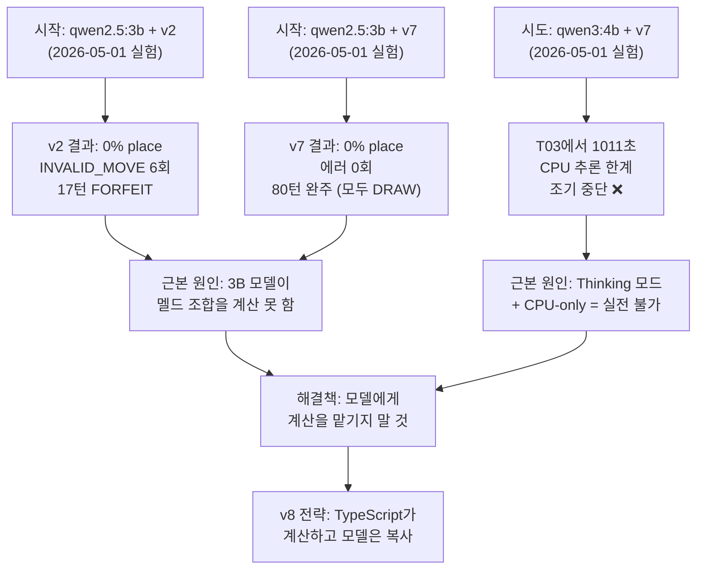
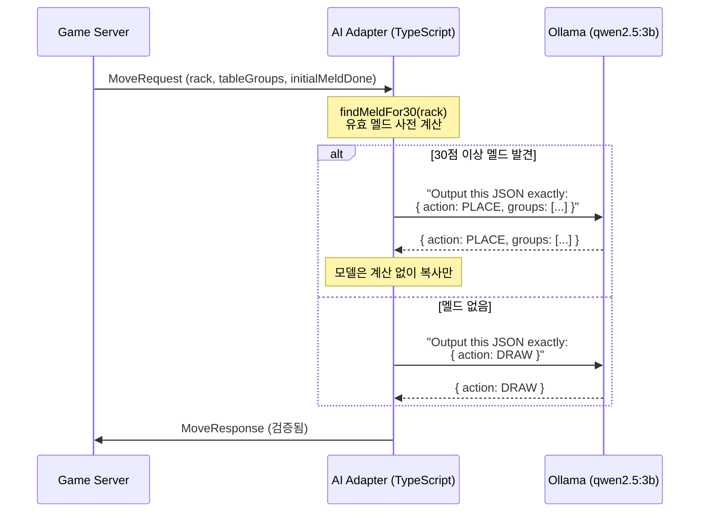
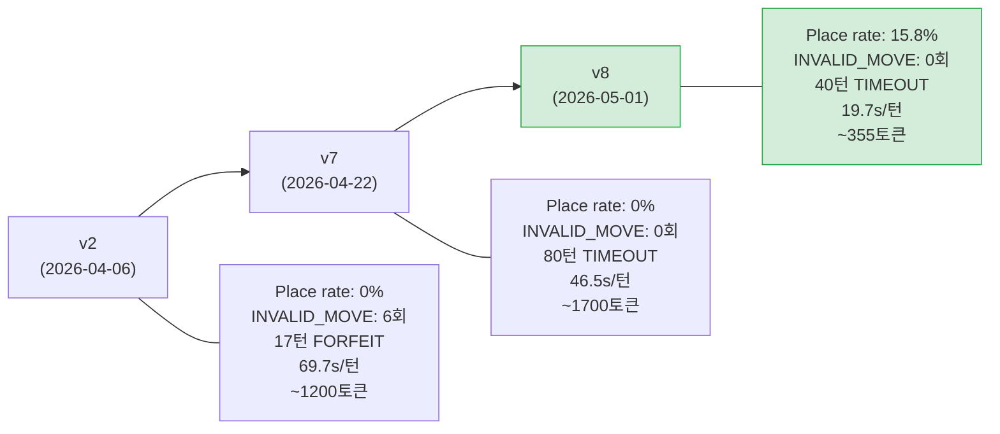

- **날짜**: 2026-05-01
- **담당**: Claude (서술)
- **분류**: 실험 회고 / 기술 에세이
- **연관 실험**: `docs/04-testing/69`, `70`, `71`

---

## 프롤로그 — "LLaMA가 한 번만 Place하면 소원이 없겠네"

2026년 5월 1일 아침, 애벌레는 말했다. "LLaMa CPU에서 place 한번 해보는 것이 소원임."

그 말 한 마디가 하루 내내 이어진 실험의 시작이었다. 목표는 단순했다. 클라우드가 아닌 로컬 머신, GPU가 없는 노트북 CPU 위에서 돌아가는 3B짜리 꼬마 언어 모델이 루미큐브 테이블에 타일을 내려놓는 것. 딱 한 번만.

결론부터 말하면, 해냈다. 그것도 세 번이나.

그런데 그 과정이 단순한 프롬프트 튜닝 이야기가 아니었다. LLM에 게임을 시켜보면서, 우리는 "언제 모델에게 생각을 맡기고, 언제 코드가 대신 생각해야 하는가"라는 오래된 질문과 정면으로 마주쳤다.

---

## 1부 — 무대: LG Gram 위에 선 꼬마 모델

### 하드웨어의 현실

RummiArena의 Kubernetes 클러스터는 화려한 데이터센터에 있지 않다. LG Gram 15Z90R, 인텔 i7-1360P, RAM 16GB. 잘 봐줘야 고성능 노트북이다. GPU는 없다. 모든 추론은 CPU로만 이뤄진다.

이 머신 위에서 Ollama가 `qwen2.5:3b`를 돌린다. 파라미터 30억 개짜리 모델. GPT-4나 Claude Sonnet과 비교하면 세상에서 가장 작은 루키다. 하지만 공짜고, 인터넷이 없어도 돌아가며, API 비용이 제로다.

```
qwen2.5:3b 추론 속도 (CPU-only): ~2 tokens/s
응답 생성 한 턴: 평균 46.5초 (v7 프롬프트 기준)
```

46초면 사람이 카드 게임을 한 수 두기에 충분한 시간이다. 그 46초 동안 이 작은 모델은 손패 14장을 들여다보며 무언가를 계산하고 있었다.

문제는, 그 계산이 영 형편없었다는 것이다.

---

## 2부 — 첫 번째 시도: v2가 무너지다

### 규칙을 모르는 플레이어

루미큐브에는 규칙이 있다. 테이블에 타일을 내려놓으려면(PLACE), 세 장 이상을 모아 유효한 세트를 만들어야 한다. 같은 숫자 다른 색의 그룹, 또는 같은 색 연속 숫자의 런. 그리고 게임에 처음 참가하는 초기 등록(Initial Meld)이라면 30점 이상을 한 번에 내야 한다.

v2 프롬프트는 이 규칙을 영문으로 설명하고, 몇 가지 예시를 보여주고, "이제 네 손패에서 유효한 세트를 찾아라"고 요청했다. 훌륭한 요청처럼 보였다.

결과는 처참했다.

```
Round A 결과 (v2 프롬프트):
  Place rate: 0%
  INVALID_MOVE: 6회 (ERR_GROUP_NUMBER)
  결말: 17턴 만에 FORFEIT (AI_FORCE_DRAW_LIMIT)
```

AI는 여섯 번이나 잘못된 세트를 제출했다. 숫자 연속성이 깨진 런(3-7-9 같은 것)을 내놓았고, 게임 서버는 여섯 번 모두 거절했다. 결국 17턴 만에 AI는 게임을 포기 처리(FORFEIT) 당했다.

v2 프롬프트의 실패는 모델의 규칙 이해력 문제가 아니었다. qwen2.5:3b는 규칙 자체는 어느 정도 이해했다. 문제는 **14장의 손패에서 30점 이상을 구성하는 유효한 조합을 찾아내는 조합 탐색 능력**이었다. 이것은 단순한 텍스트 이해가 아니라, 상태 공간을 탐색하는 알고리즘적 사고다. 3B 모델에게 그것은 너무 무거웠다.

---

## 3부 — 두 번째 시도: v7이 조심스러워지다

### 안전한 선택, 하지만 아무것도 두지 않는

v7 프롬프트는 v2의 실패를 보고 설계됐다. 4단계 절차형 지시(Group → Run → Combine → Draw)와 6개의 few-shot 예제를 붙였다. 규칙 위반 패턴도 사전 차단했다.

결과는 확실히 나아졌다.

```
Round B 결과 (v7-ollama-meld 프롬프트):
  Place rate: 0%
  INVALID_MOVE: 0회 (완전 제거!)
  게임 완주: 80턴 (TIMEOUT)
  평균 응답시간: 46.5s
```

에러는 사라졌다. 80턴 동안 게임이 이어졌다. 하지만 문제가 있었다. AI는 80턴 내내 단 한 번도 타일을 내려놓지 않았다. 매 턴 DRAW만 했다.

v7의 4단계 절차는 "확신이 없으면 DRAW"라는 보수적 바이어스를 심어놨다. 그리고 qwen2.5:3b는 14장의 손패에서 30점 이상 조합을 "확신"하는 능력이 없었으므로, 항상 DRAW를 선택했다.

규칙 위반이 0이 된 것과 게임에 기여를 하지 못하는 것은 완전히 다른 문제였다. v7은 안전했지만, 무력했다.

---

## 4부 — 세 번째 시도: qwen3:4b가 침묵하다

### 더 크면 더 나을까?

같은 날, 다른 접근을 시도했다. K8s Ollama Pod에는 `qwen3:4b`도 올라가 있었다. 4B 파라미터, qwen2.5보다 한 세대 최신. 더 큰 모델이면 혹시 30점 조합을 찾을 수 있지 않을까?

ws_timeout을 3600초로 늘리고, turnTimeout을 300초로 설정하고 실험을 돌렸다.

T03에서 AI 추론이 시작됐다.

1분이 지났다. 2분. 5분. 10분. 16분 51초가 지나서야 타임아웃이 났다.

```
T03 추론 소요: 1011.1초 (16분 51초)
결과: AI_TIMEOUT → DRAW FALLBACK
예상 완주 시간 (20턴 기준): 2.8시간
```

qwen3 시리즈는 Thinking 모드가 기본으로 켜진다. 4단계 절차 프롬프트를 받은 모델은 각 단계를 깊이 생각하기 시작했고, CPU 위에서는 그 생각이 끝나지 않았다. 보조 실험으로 think=false 옵션으로 간단한 질문을 날려봤다. 45토큰짜리 응답을 만드는 데 276초가 걸렸다. 0.16 tokens/s. 실전 프롬프트(2500 토큰 입력, 200 토큰 응답 기준)라면 한 턴에 1250초.

qwen3:4b는 이 하드웨어에서 실전 불가였다. 실험은 조기 종료됐고, 즉시 qwen2.5:3b로 되돌아왔다.



---

## 5부 — 패러다임의 전환: 추론에서 알고리즘으로

### 모델 추론 vs. 알고리즘

이 지점에서 근본적인 질문을 마주했다. LLM에게 무엇을 시켜야 하는가?

v2와 v7은 모두 같은 가정 위에 세워졌다. "모델이 손패를 보고 유효한 멜드를 추론할 수 있다." 이 가정이 틀렸다. 3B 모델은 그 가정을 충족하지 못했다.

그런데 생각해보면, 루미큐브 멜드 탐색은 사실 알고리즘 문제다. 주어진 타일 집합에서 합이 30점 이상인 유효한 세트 조합을 찾아라. 이것은 검색 공간을 탐색하는 전형적인 조합 최적화 문제다. 언어 모델이 잘하는 영역이 아니다.

반면 언어 모델이 잘하는 것은 다른 종류다. 텍스트를 이해하고, 구조화된 출력을 생성하고, 지시를 따르는 것. 구체적으로는, "여기 JSON을 그대로 출력하라"는 지시를 잘 따른다.

이 통찰에서 v8이 태어났다.



### findMeldFor30: 계산은 TypeScript가

v8의 핵심 코드는 `v8-ollama-place-prompt.ts` 안의 `findMeldFor30()` 함수다. 이 함수가 모든 계산을 담당한다.

```typescript
// 탐색 전략: 단독 → 2조합 → 3조합 순 그리디
function findMeldFor30(tiles: string[]): string[][] | null {
  const groups = findValidGroups(tiles);   // 같은 숫자, 다른 색
  const runs = findValidRuns(tiles);       // 같은 색, 연속 숫자
  const candidates = [...groups, ...runs];

  // 1. 단독 세트로 30점 이상?
  for (const c of candidates) {
    if (scoreSet(c) >= 30) return [c];
  }

  // 2. 두 세트 조합으로 30점 이상? (타일 겹침 없이)
  for (let i = 0; i < candidates.length; i++) {
    for (let j = i + 1; j < candidates.length; j++) {
      if (!hasOverlap(candidates[i], candidates[j])) {
        if (scoreSet(candidates[i]) + scoreSet(candidates[j]) >= 30) {
          return [candidates[i], candidates[j]];
        }
      }
    }
  }

  // 3. 세 세트 조합까지 확장...
  return null;  // 불가능
}
```

이 함수가 유효한 멜드를 찾으면, 프롬프트 빌더는 모델에게 이렇게 말한다.

```
YOUR MOVE HAS BEEN CALCULATED FOR YOU.
Output this JSON exactly, with no changes:
{"action":"PLACE","groups":[["R7a","B7a","Y7a"],["K3a","K4a","K5a"]]}
```

모델에게 생각을 요청하지 않는다. 모델은 이 JSON을 그대로 반환하기만 하면 된다. 모델이 잘하는 것을 시킨 것이다.

---

## 6부 — 소원이 이뤄지다

### T03, 역사적인 순간

v8 프롬프트를 K8s에 배포했다. `OLLAMA_PROMPT_VARIANT=v8-ollama-place`. 배틀 스크립트를 실행하고 기다렸다.

```
T01: Human DRAW
T02: Human DRAW
T03: AI 추론 시작...
     (165.2초 경과)
T03: AI PLACE — 6장!
     Initial Meld 성공. 30점 이상 달성.
```

165초. 처음이라 느렸다. 아직 워밍업 상태였고, 초기 등록은 더 긴 컨텍스트를 처리해야 했다. 하지만 결과는 PLACE였다. 게임 서버가 검증을 통과시켰다. INVALID_MOVE가 아니었다. AI가 처음으로 루미큐브 테이블에 타일을 내려놓았다.

T05에서 또 한 번, T37에서 또 한 번.

```
40턴 종료 결과:
  Place rate: 15.8% (3/19 AI 턴)
  초기 등록(T03): 6장 배치 — 30점+ 달성
  테이블 확장(T05, T37): 각 1장 추가
  INVALID_MOVE: 0회
  평균 응답시간: 19.7s (초기 등록 이후 p50=10.0s)
  프롬프트 크기: ~355토큰 (v7 2300토큰 대비 1/6)
```

초기 등록 이후 응답 시간이 10초대로 떨어진 것도 놀라웠다. 프롬프트가 355토큰으로 줄었으니 당연한 결과였지만, 현장에서 보는 숫자는 달랐다. v7의 평균 46.5초가 v8에서는 10초가 됐다. 4.6배 빨라졌다.



---

## 7부 — 모델 추론 vs. 알고리즘, 그 철학적 함의

### LLM에게 알고리즘 문제를 주지 마라

v8의 성공은 단순히 "프롬프트를 잘 짰다"는 이야기가 아니다. 더 근본적인 통찰을 담고 있다.

**언어 모델은 조합 탐색 문제를 못 푼다.** 정확히는, 소형 모델은 신뢰할 수 있는 수준으로 못 푼다. 14장의 타일에서 30점 이상을 구성하는 조합을 찾는 것은 엄격히 따지면 NP-완전 인접 문제다. GPT-4, Claude Sonnet 수준의 대형 모델은 어느 정도 해낼 수 있다. 하지만 3B 짜리 소형 모델은, 그것이 v2든 v7이든, 신뢰할 수 없었다.

반면 **결정론적 알고리즘은 이 문제를 항상 정확하게 푼다.** `findMeldFor30()`은 틀릴 수 없다. 찾으면 반드시 유효하고, 못 찾으면 정말 없는 것이다.

그렇다면 왜 모델을 쓰는가?

모델이 필요한 부분이 있기 때문이다. 게임 상황 인식, 전략적 판단, 자연어 지시 따르기, 예상치 못한 상황 대처. 이런 영역에서 모델은 경직된 알고리즘보다 유연하다. v8은 이 역할 분담을 명확히 했다. **계산은 알고리즘이, 실행은 모델이.**

이 원칙은 소형 모델에만 적용되는 이야기가 아니다. 대형 모델도 계산 실수를 한다. 반복되는 패턴 인식에서 환각을 일으킨다. 검증된 알고리즘이 있다면, 모델에게 같은 일을 시키는 것은 신뢰성 손실이다.

### 신뢰 경계의 재정의

RummiArena의 설계 원칙 중 하나는 "LLM 신뢰 금지"다. LLM이 제안한 행동은 반드시 게임 엔진이 검증한다. v8은 이 원칙을 프롬프트 레이어로 한 단계 더 끌어올렸다. 모델에게 창의적 추론을 요청하지 않는다. 이미 검증된 답을 주고, 그것을 형식에 맞게 출력하도록 요청한다.

모델의 역할이 "추론자"에서 "형식 변환기"로 축소됐다. 그것이 더 작은 모델에 맞는 역할이다.

| 역할 | 담당 |
|------|------|
| 유효 멜드 탐색 | TypeScript 알고리즘 (결정론적) |
| 점수 계산 | TypeScript 알고리즘 (결정론적) |
| 타일 겹침 검사 | TypeScript 알고리즘 (결정론적) |
| JSON 출력 형식 준수 | LLM (이것만은 잘 함) |
| 최종 유효성 검증 | Game Engine (게임 규칙 SSOT) |

### 단서 — GPU와 Think 모드가 바꾸는 것

단, "소형 모델은 조합 탐색을 못 한다"는 주장에는 숨겨진 전제가 있다. CPU 위에서, Think 모드 없이 추론할 때의 이야기다.

하드웨어가 바뀌면 방정식이 달라진다. GPU 서버나 Apple Silicon이 있다면, qwen3:4b는 초당 20~100토큰을 생성한다. CPU의 0.16 tokens/s와 비교하면 수백 배 빠르다. 그 속도에서 Think 모드는 "실전 불가능한 사치"가 아니라 "30~50초짜리 추론 예산"으로 탈바꿈한다.

Think 모드의 핵심은 모델에게 스크래치패드를 주는 것이다. 그 공간에서 모델은 이렇게 할 수 있다.

```
R7a + B7a + Y7a → 같은 숫자, 다른 색, 3장 → 유효한 그룹, 21점.
R3a + R4a + R5a → 같은 색, 연속, 3장 → 유효한 런, 12점.
합계 33점 ≥ 30점. → PLACE.
```

이것은 `findMeldFor30()`이 내부에서 하는 것과 사실상 같은 일이다. 알고리즘이 코드로 수행하는 열거(enumeration)를 모델이 언어로 수행하는 것이다.

단, 두 가지 조건이 충족되어야 신뢰할 수 있다. **첫째, 모델 크기.** 3B 모델은 Think 모드에서도 조합 오류(연속 숫자 착각, 색 혼동)를 낸다. 7B 이상에서 신뢰도가 유의미하게 오른다. **둘째, 추론 예산.** 손패가 많아질수록 탐색 공간이 커진다. think 토큰이 부족하면 모델은 조기에 답을 내려버리고, 그 답은 틀릴 가능성이 높다.

결국 이 이야기는 "모델 추론이 알고리즘보다 영구히 열등하다"는 결론이 아니다. 하드웨어와 모델 크기가 임계점을 넘으면, 알고리즘 없이 프롬프트 기반 추론만으로도 PLACE가 가능하다. v8이 보여준 것은 **지금 이 하드웨어에서, 지금 이 모델로** 할 수 있는 최선이었다. 다른 무대에서라면 답이 달라질 수 있다.

---

## 8부 — 아직 남은 것들

v8이 완벽하지는 않다. 15.8%는 시작이다.

초기 등록 이후 대부분의 턴은 여전히 DRAW다. `findTableExtension()`이 단순한 1타일 확장만 지원하기 때문이다. 기존 테이블 그룹을 분리해서 재조합하는 복잡한 재배치는 아직 구현되지 않았다. 이것이 다음 과제다.

place rate 30%를 목표로 잡을 수 있다. `findTableExtension()`에 2~3타일 동시 확장을 추가하고, 재배치 로직을 구현하면 충분히 도달 가능한 목표다.

하지만 오늘은 충분하다. CPU 위에서, 3B짜리 작은 모델이, 30점 이상을 손패에서 꺼내 테이블에 내려놨다. 소원이 이뤄졌다.

---

## 에필로그 — 컴퓨터가 생각하는 것에 대해

LLM이 세상을 바꾼다고 한다. 추론하고, 계획하고, 코드를 짜고, 글을 쓴다. 실제로 그런다. 하지만 CPU 위의 3B짜리 모델이 루미큐브 손패 14장에서 30점 조합을 찾는 것은 못 한다.

이것이 LLM의 한계를 보여주는 이야기인가? 오히려 그 반대다. LLM이 무엇을 잘하는지, 무엇을 알고리즘에 맡겨야 하는지를 이해하는 사람만이 두 도구를 제대로 쓸 수 있다. GPU가 있고 모델이 충분히 크다면, Think 모드로 같은 문제를 풀 수 있을지도 모른다. 그것은 또 다른 실험이 답할 질문이다.

v8은 지금 이 조건에서의 이해의 산물이다. 모델에게 어울리지 않는 짐을 내려놓고, 모델이 잘하는 것 — 주어진 JSON을 그대로 출력하는 것 — 만 남겼다. 그랬더니 타일이 테이블에 올라갔다.

때로는 적게 요청하는 것이, 더 많이 얻는 길이다.

---

## 부록: 실험 수치 요약

| 구분 | v2 | v7 | qwen3:4b+v7 | **v8** |
|------|----|----|-------------|--------|
| Place rate | 0% | 0% | 0% (중단) | **15.8%** |
| INVALID_MOVE | 6회 | 0회 | - | **0회** |
| 평균 응답시간 | 69.7s | 46.5s | 1011s/턴 | **19.7s** |
| 프롬프트 크기 | ~1200토큰 | ~1700토큰 | ~1700토큰 | **~355토큰** |
| 게임 결말 | 17턴 FORFEIT | 80턴 TIMEOUT | 조기 중단 | **40턴 TIMEOUT** |
| 계산 담당 | LLM | LLM | LLM | **TypeScript 알고리즘** |

## 부록: 관련 문서

- `docs/04-testing/69-llama-v7-prompt-experiment-2026-05-01.md` — v2/v7 실측 실험 보고서
- `docs/04-testing/70-qwen3-4b-experiment-2026-05-01.md` — qwen3:4b 전환 실험 보고서
- `docs/04-testing/71-v8-ollama-place-experiment-2026-05-01.md` — v8 실측 실험 보고서
- `src/ai-adapter/src/prompt/v8-ollama-place-prompt.ts` — v8 구현 코드
- `src/ai-adapter/src/prompt/registry/variants/v8-ollama-place.variant.ts` — v8 variant 등록


## 별첨 : **🤖 Ollama, LLaMA, 그리고 Qwen**

로컬 AI 생태계에서 이 세 가지가 어떻게 조화를 이루는지 정리해 드립니다.

**1. 역할 분담 (핵심 개념)**

- **Ollama (플랫폼/도구):** 모델을 담아서 실행하는 **'그릇'** 이자 **'요리사'** 입니다.
- **LLaMA (모델/두뇌):** Meta(페이스북)에서 만든 대표적인 **'서구권 출신 천재'** 입니다.
- **Qwen (모델/두뇌):** Alibaba(알리바바)에서 만든 **'동양권 언어에 능한 천재'** 입니다.

---

**2. 한눈에 보는 비교표**

| **구분** | **Ollama** | **LLaMA** | **Qwen** |
| --- | --- | --- | --- |
| **분류** | **실행 도구 (Runner)** | **AI 모델 (LLM)** | **AI 모델 (LLM)** |
| **제작처** | Ollama 팀 | Meta (미국) | Alibaba (중국) |
| **강점** | 설치 및 실행의 간소화 | 영어 성능, 논리 추론, 표준성 | **한국어/중국어 등 다국어**, 코딩 |
| **Ollama 명령어** | (프로그램 실행) | `ollama run llama3` | `ollama run qwen2` |

---

**3. Qwen은 왜 필요한가요? (LLaMA와의 차이)**

Ollama를 쓰면서 LLaMA 대신 Qwen을 선택하는 이유는 크게 두 가지입니다.

1. **언어 능력 (Multilingual):**
    - **LLaMA**는 영어 기반 데이터가 압도적으로 많아 한국어를 시키면 가끔 영어 섞인 말투를 쓰거나 어색할 때가 있습니다.
    - **Qwen**은 아시아권 언어 데이터를 많이 학습하여 **한국어 문장력이 매우 자연스럽고 부드럽습니다.**
2. **다양한 사이즈:**
    - Qwen은 아주 작은 모델(0.5B)부터 큰 모델까지 세분화되어 있어, 저사양 PC나 노트북에서도 매우 가볍게 돌아갑니다.

---

**4. Ollama에서 활용하는 법**

Ollama가 있으면 이 두 모델을 마치 채널 돌리듯이 바꿔가며 쓸 수 있습니다.

- **미국식 사고와 강력한 논리가 필요할 때:**
    
    **bash**
    
    `ollama run llama3`
    
    Use code with caution.
    
- **자연스러운 한국어 답변이나 코딩 도움이 필요할 때:**
    
    **bash**
    
    `ollama run qwen2.5  # 최신 버전 기준`
    
    Use code with caution.
    

---

**💡 요약 정리**

> **Ollama**라는 "게임기" 하나만 설치하면, **LLaMA**라는 "서구권 RPG 게임"도 할 수 있고, **Qwen**이라는 "아시아 배경의 게임"도 즐길 수 있는 것입니다.
> 

사용자의 PC 사양과 필요한 언어(한국어 vs 영어)에 따라 **Ollama 안에서 원하는 모델을 골라 쓰기만 하면 됩니다.**