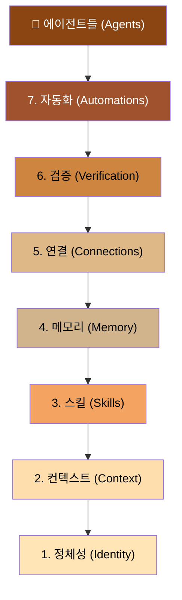
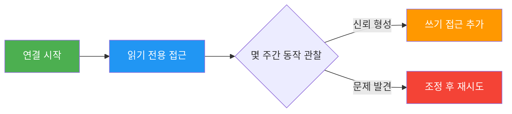
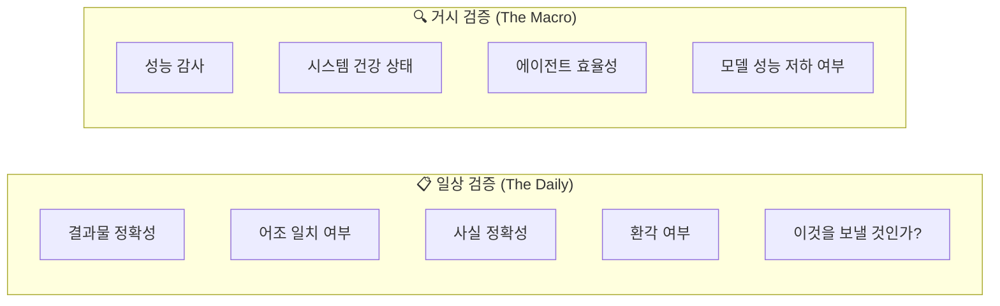
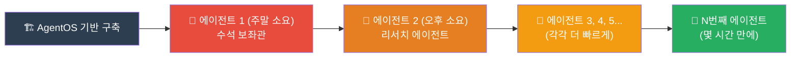
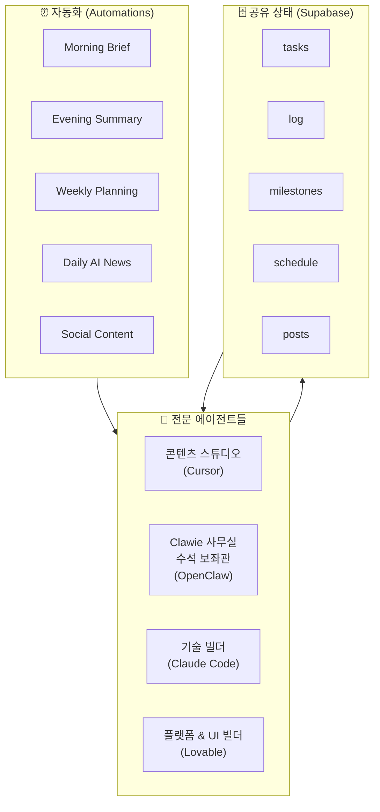
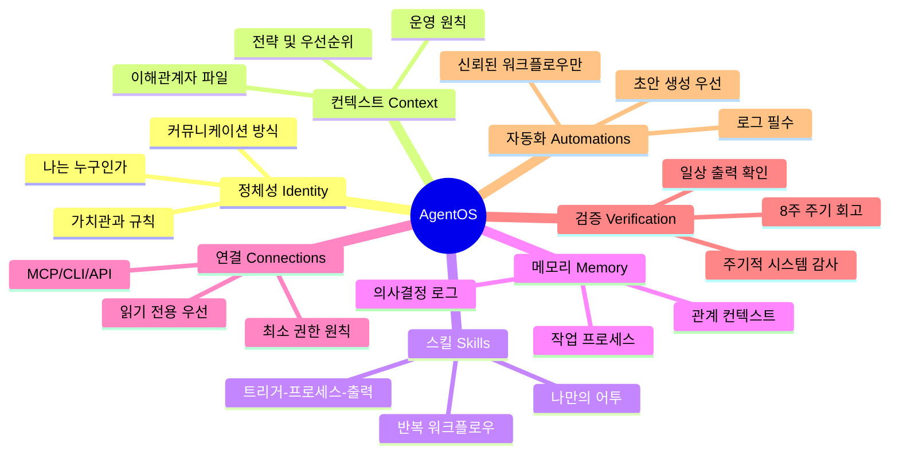

> **출처:** [AI Daily Brief — "How To Build a Personal Agentic Operating System"](https://www.youtube.com/watch?v=ntvkDnk_5jA)  
> **발표자:** Nufar Gaspar (EnterpriseClaw)  
> **공개일:** 2025년 4월 26일  
> **무료 프로그램:** https://aidbagentos.ai/

---

## 개요

이 영상은 AI Daily Brief 채널의 "Operators Bonus Episode" 시리즈 중 하나로, EnterpriseClaw의 Nufar Gaspar가 출연하여 **AgentOS(에이전트 운영체제)** 라는 개념을 소개하고, 누구나 자신만의 에이전트 시스템을 구축할 수 있도록 실용적인 7단계 레이어 프레임워크를 설명합니다. 이 프레임워크는 OpenClaw, Claude Code, Cursor, Codex 등 특정 도구에 종속되지 않으며, **어떤 AI 도구를 쓰더라도 동일하게 작동하는 이식 가능한 시스템**을 목표로 합니다.

AgentOS 프로그램은 AIDB New Year, Claw Camp에 이은 세 번째 무료 교육 프로그램으로, 코딩보다는 **지식 노동자(Knowledge Worker)** — 즉 전략, 소통, 운영, 의사결정, 연구, 관리 업무를 하는 모든 직장인 — 을 주요 대상으로 합니다.

---

## 1. 왜 AgentOS가 필요한가? — "모든 도구는 모든 도구가 되고 있다"

### 도구 수렴 현상 (Tool Convergence)

Nufar Gaspar는 현재 AI 생태계에서 가장 중요한 트렌드로 **"모든 도구가 모든 도구가 되어가고 있다(Every Tool Is Becoming Every Tool)"** 는 현상을 꼽습니다. 구체적으로:

- **Cursor**가 에이전트와 자동화 기능을 추가했고,
- **Claude Code**는 새로운 메모리 시스템을 도입하고 다른 채널에서도 소통 가능해졌으며,
- **OpenClaw**는 파일을 라디오로 읽고 Codex는 백그라운드에서 실행되며,
- 오픈소스 진영의 **Her(Noose 계열)**, **Windsurf**, **Anti-Gravity** 등도 유사한 아키텍처로 수렴하고 있습니다.

이처럼 모든 도구가 동일한 기능 집합으로 빠르게 수렴하고 있기 때문에, **어떤 도구를 선택하느냐는 점점 덜 중요**해지고 있습니다. 반면, 그 도구 아래에 **어떤 시스템을 구축하느냐**가 훨씬 더 중요해지고 있습니다.

### 진짜 차별점 — 밑에 깔린 시스템

많은 사람들이 최신 AI 도구를 사용하면서도 최적의 결과를 얻지 못하는 이유는, 도구 자체의 문제가 아니라 **도구 아래에 깔린 시스템(underlying system)을 제대로 구축하지 않았기 때문**입니다. Nufar는 이를 "본능이나 최선의 노력에 의존한 구축"이라고 표현하며, 그 결과 도구가 가진 잠재력보다 훨씬 낮은 성과를 내게 된다고 지적합니다.

### 텍스트 파일의 힘 — 이식 가능한 시스템

모든 에이전트 도구는 결국 동일한 방식으로 작동합니다. 즉, **텍스트 파일을 읽어서** 다음을 파악합니다:

- 나는 누구를 위해 일하는가?
- 이 사용자는 무엇을 알고 있는가?
- 어떤 일을 할 수 있는가?
- 무엇을 기억하는가?
- 어떤 외부 시스템에 접근할 수 있는가?

따라서 **AgentOS를 구성하는 거의 모든 것은 텍스트 파일**이며, 이는 곧 작업의 결과물이 완전히 이식 가능함을 의미합니다. 도구를 바꾸거나 새 도구를 추가할 때, 새 도구가 같은 폴더를 가리키기만 하면 됩니다. 마이그레이션도, 재구축도 필요 없습니다.

---

## 2. AgentOS의 7가지 레이어

AgentOS는 7개의 계층으로 구성된 스택(stack)입니다. 모든 에이전트는 이 레이어 위에서 실행되며, 각 에이전트는 전체 기반을 상속받습니다.



---

### 레이어 1: 정체성 (Identity) — "나는 누구인가"

**정체성 레이어**는 AgentOS의 가장 기초가 되는 레이어로, 에이전트가 당신과 대화할 때마다 가장 먼저 읽는 파일입니다. 이 파일은 단 한 가지 질문에 답합니다: **"당신은 누구이며, 에이전트가 항상 지켜야 할 규칙은 무엇인가?"**

각 도구마다 이 파일의 이름은 다릅니다:
- **OpenClaw**: `soul`
- **Cursor**: `agents.mmd`
- **Claude Code**: `claude`
- **GitHub Copilot**: `copilot-instructions`

하지만 개념은 동일합니다. 이 파일을 능동적으로 작성하지 않으면, 에이전트는 제로에서 시작하거나 우연히 수집한 정보에 의존하게 됩니다.

**좋은 정체성 파일에 들어가야 할 내용:**

| 항목 | 예시 |
|------|------|
| 나는 누구인가 | 직책, 산업, 역할, 배경 |
| 커뮤니케이션 방식 | 직접적 vs 외교적, 글머리 기호 vs 산문, 간결 vs 상세 |
| 내가 중요하게 여기는 것 | 간결함 선호, 사고 도전 요청, 이유 설명 vs 바로 답 제시 |
| 지켜야 할 규칙 | "외부 이메일 보내기 전 반드시 초안 보여줘", "나를 칭찬하지 마", "내가 놓치는 것을 항상 알려줘" |

**핵심 팁 — AI에게 인터뷰 받기:**  
정체성 파일을 직접 처음부터 작성하려고 하면 금방 포기하게 됩니다. 대신, AI 도구에게 이렇게 말하세요:

> *"나의 정체성 파일을 만들고 있어. 내가 어떻게 일하는지, 무엇을 원하는지, 무엇을 원하지 않는지, AI에 대해 지금 무엇이 답답한지, 어떤 규칙을 적용하고 싶은지에 대해 15가지 질문을 해줘."*

그런 다음 가능하면 말로 대답하고(타이핑보다 훨씬 쉽습니다), AI가 초안을 작성하면 편집한 뒤 배포합니다. 처음 버전이 70% 수준이어도 괜찮습니다. 이후 3주에 걸쳐 부족한 부분을 패치해 나가면 됩니다.

**수석 보좌관(Chief of Staff) 에이전트 예시:**
- "미팅 전 사전 자료 없이는 절대 미팅에 들어가게 하지 마"
- "내가 답장해야 할 사람을 항상 알려줘"
- "다음 주에 과잉 약속을 하고 있을 때 플래그를 세워줘"

---

### 레이어 2: 컨텍스트 (Context) — "나는 무엇을 알고 있는가"

**컨텍스트 레이어**는 AI가 일반적인 결과물을 내놓느냐, 아니면 당신의 실제 상황에 맞는 진정으로 유용한 결과를 내놓느냐를 결정짓는 가장 중요한 단일 요소입니다.

일반적인 AI 조언은 구글 검색 하나면 얻을 수 있습니다. 하지만 **공개 인터넷에서 절대 얻을 수 없는 것**이 있습니다:
- 당신의 상황
- 당신의 로드맵
- 당신의 조직도
- 당신의 고객 세그먼트
- 당신의 우선순위

그리고 이것은 더 나은 모델로도 해결되지 않습니다. 다음 분기에 무엇을 출시할지, 핵심 이해관계자가 누구인지는 당신이 직접 알려주지 않는 한 어떤 모델도 알 수 없습니다.

**컨텍스트 파일의 특성:**  
컨텍스트 파일은 당신이 타이핑하는 프롬프트의 일부가 아닙니다. 에이전트가 필요할 때 꺼내 읽을 수 있는 **라이브러리**입니다.

**흔한 함정 — 40페이지 문서:**  
한 세션에서 모든 컨텍스트를 엔지니어링하려고 하면 40페이지짜리 문서가 만들어지고, 곧 업데이트를 포기하게 됩니다. 이것은 컨텍스트가 아니라 빠르게 낡아버릴 소설일 뿐입니다.

**올바른 접근법 — 컨텍스트 큐레이션:**

- **3~5개의 집중된 파일** (각각 한 페이지 분량)
- 각 파일은 하나의 주제만 다룸 (팀, 제품, 고객, 분기, 이해관계자 등)
- 날짜 기재 및 최신 상태 유지
- 변경사항이 생기면 즉시 업데이트

컨텍스트 큐레이션은 프로젝트가 아니라 **실천(practice)** 입니다. AI에게 어떤 상황을 다시 설명하고 있는 자신을 발견할 때마다, 그 내용은 컨텍스트 파일에 있어야 했던 것입니다. 적어두고 라이브러리에 추가하면 됩니다.

**수석 보좌관 에이전트를 위한 최소 컨텍스트 파일:**

```
📁 컨텍스트 라이브러리
├── stakeholders.md     ← 보고 대상, 직속 부하, 핵심 협업자, 각자의 관심사
├── strategy.md         ← 올해 달성 목표, 조직의 집중 사항
└── operating-principles.md ← 의사결정 방식, 어디서 반대하는지, 무엇을 에스컬레이션하는지
```

---

### 레이어 3: 스킬 (Skills) — "나는 어떻게 일하는가"

**스킬 레이어**는 반복적으로 수행하는 워크플로우에 대한 재사용 가능한 명령어 집합입니다. 모든 지식 노동자는 쉽게 20~30개의 반복 패턴을 갖고 있으며, 각각을 다음과 같이 작성할 수 있습니다:

> *"[특정 트리거]를 말하면, [특정 프로세스]를 [다음 소스]를 사용하여 수행하고, [이 형식]으로 결과물을 생성해."*

**스킬이 없을 때 생기는 문제:**
- 매번 형식을 다시 설명해야 합니다
- 매번 같은 소스를 붙여 넣어야 합니다
- AI가 이상한 어투로 쓴다고 불평하지만 정작 본인의 어투를 가르치지 않습니다

스킬을 한 번 잘 작성하면, **영원히 정확하게 실행**됩니다.

**MVP 스킬 원칙:** 처음부터 완벽할 필요 없습니다. 첫 버전을 일주일 써보고, 어떤 부분이 틀렸는지 파악하고 패치합니다. 몇 주 후면 그 스킬이 매번 처음부터 시작하는 것보다 훨씬 나은 초안을 만들어냅니다.

**수석 보좌관 에이전트를 위한 예시 스킬:**

| 스킬 이름 | 설명 |
|-----------|------|
| Pre-Read | 어떤 미팅이든 한 페이지 사전 자료 생성 |
| Daily Brief | 받은편지함, Slack, 캘린더를 스캔해 오늘 할 일 요약 |
| Voice Match | AI가 당신처럼 글을 쓰도록 도움 |
| Commitment Tracker | 여러 통화와 미팅에서 약속한 내용 추적 |

---

### 레이어 4: 메모리 (Memory) — "무엇을 기억하는가"

**메모리 레이어**는 현재 모든 에이전트 도구 회사가 가장 집중적으로 투자하고 있는 영역입니다. OpenClaw의 메모리가 마법처럼 느껴지는 핵심이 바로 이것이며, Claude Code도 최근 자동 메모리를 추가했고, Cursor도 프로젝트 레벨 메모리를 갖추고 있습니다.

**메모리가 중요한 이유:**  
메모리는 다른 모든 레이어가 세션을 넘어 유지되게 만드는 접착제입니다. 메모리가 없으면 매번 처음부터 시작해야 합니다.

**현실적인 접근법:**

1. **먼저 도구의 메모리 작동 방식을 이해하세요.** 직접 물어보세요:
   > *"당신의 메모리 시스템이 어떻게 작동하는지 설명해줘. 세션 간에 무엇을 기억하고, 무엇을 잊어버려?"*

2. **한계를 인식하세요.** 대부분의 도구는 세션 간 메모리, 보존 vs 폐기 기준, 컨텍스트 윈도우와 저장된 메모리의 상호작용에서 여전히 한계가 있습니다.

3. **의도적으로 기억시키세요.** 에이전트가 자체적으로 기억하지만, 항상 올바른 것을 포착하지는 않습니다. 중요한 결정, 우선순위 변경, 긴 세션의 종료 시점에는 의도적으로 에이전트에게 기억하도록 지시해야 합니다.

**수석 보좌관 에이전트를 위한 전문 메모리:**

```
📚 전용 메모리 구조
├── decision-log.md        ← 무엇을, 왜, 어떤 대안을 고려했는지
├── working-process.md     ← 수석 보좌관이 지속적으로 개선을 관리하도록
└── relationship-context.md ← 특정 이해관계자와의 대화가 어떻게 진행됐는지, 반응 등
```

---

### 레이어 5: 연결 (Connections) — "무엇에 접근할 수 있는가"

**연결 레이어**는 에이전트가 실제 세계의 시스템에서 행동할 수 있게 해주는 레이어입니다. 이메일, 캘린더, Slack, Jira, Salesforce, 데이터베이스 등에 연결됩니다.

**연결 방법:**
- **MCP (Model Context Protocol)**: 많은 도구가 지원하는 오픈 표준
- **CLI 도구**: 에이전트가 외부 시스템과 어떻게 상호작용할지 더 많은 판단을 부여
- **직접 API 또는 스크립팅**: 더 깊은 커스터마이징 가능

Claude Code Desktop, Cursor Marketplace 같은 도구들은 연결을 점점 더 쉽게 설정할 수 있도록 만들어가고 있습니다.

**가장 중요한 원칙 — 읽기 전용으로 시작하기:**



에이전트가 이메일을 읽기만 하게 하고, 쓰기 접근권(실제 이메일 발송, 캘린더 이벤트 추가 등)은 에이전트의 동작을 몇 주간 지켜본 후 신뢰가 쌓이면 그때 추가하세요.

**위험은 현실입니다:**  
능력이 확장될수록 위험도 함께 커집니다. 이미 실제 사고가 발생하고 있습니다. 예를 들어, 회사 Slack에 접근 가능한 에이전트에게 팀원이 대화를 걸었을 때, 에이전트가 당신의 개인 메모, 동료에 대한 의견, 초안 피드백을 공유해버리는 상황이 실제로 일어나고 있습니다.

**보안 원칙:**
- 최소 권한(Least Privilege) 연결 사용
- 업무 시스템 연결 시 IT팀과 상의
- 회사의 경고 사례를 만드는 사람이 되지 마세요

**수석 보좌관 에이전트를 위한 권장 연결:**

| 접근 수준 | 시스템 | 비고 |
|-----------|--------|------|
| 읽기 전용 | 캘린더, 받은편지함 | 최소한의 시작점 |
| 읽기+쓰기 | 개인 할 일 목록 | 신뢰 구축 후 |
| 승인 후 실행 | Slack (DM으로 초안 전송) | 발송 전 승인 필요 |

---

### 레이어 6: 검증 (Verification) — "올바른가"

**검증 레이어**는 AgentOS에서 가장 간과되기 쉬운 레이어입니다. 에이전트 OS에서 발생하는 최악의 상황은 실패가 아닙니다. **자신감 있게 틀린 결과물을 내놓고 당신이 미처 알아채기 전에 그것을 배포하는 것**입니다.

**검증의 두 가지 차원:**



**일상 검증:**  
각 에이전트 작업마다 3~5가지 빠른 테스트를 수행합니다. 이메일 초안이라면 어조 일치 여부와 사실 확인을, 데이터 분석이라면 숫자 검증을 합니다. 대부분 1분 미만이며, 연습할수록 빨라집니다. 저위험 작업에서 신뢰가 쌓이면 고위험 작업만 검증하면 됩니다.

**거시 검증 — 시스템 감사:**  
주기적으로 에이전트와 함께 회고(retrospective)를 진행합니다:
- 어떤 스킬이 전혀 호출되지 않고 있는가?
- 어떤 컨텍스트 파일이 낡아버렸는가?
- 어떤 에이전트가 업데이트된 지시사항이 필요한가?

**이 감사 규율이 없으면:**  
약 8주 후에 전체 OS가 낡아버립니다. 감사 규율이 있으면 OS는 계속해서 복리처럼 성장합니다.

---

### 레이어 7: 자동화 (Automations) — "당신이 없어도 실행되는가"

**자동화 레이어**는 스택의 최상단에 위치하며, 에이전트가 당신이 보지 않을 때 실행할 수 있는 것들입니다. 매일 오전 7시의 일일 요약, Slack 핑을 보내는 모니터링 작업 등이 이에 해당합니다.

**자동화는 강력하지만 위험합니다.** 새벽 3시에 잘못된 답변으로 실행되는 에이전트는 당신이 깨어나기 전에 피해를 줄 수 있습니다.

**자동화의 3대 원칙:**

1. **충분히 수동으로 실행해보고 신뢰가 쌓인 워크플로우만 자동화하세요.**  
   아직 손으로 검증해본 적 없는 프로세스는 자동화하지 마세요.

2. **직접 발송 대신 초안 생성으로 시작하세요.**  
   다른 사람에게 직접 가는 결과물이 아니라, 당신이 검토할 초안을 생성하도록 설정하세요.

3. **항상 로그를 남기세요.**  
   무엇이 실행되었고, 그것이 무엇을 했는지 알아야 합니다.

---

## 3. 수석 보좌관(Chief of Staff) 에이전트 — 실전 예시

Nufar Gaspar는 AgentOS의 첫 번째 에이전트로 **수석 보좌관 에이전트**를 구축할 것을 권장합니다. 이 에이전트는:

- 받은편지함 검토
- 미팅 사전 자료 준비
- 여러 통화에서 약속한 내용 추적
- 놓치는 관점(blind spot) 플래그 설정
- 주간 업데이트 초안 작성
- 당신의 사람들과 우선순위 파악

이것이 Nufar 본인이 첫 번째로 구축한 에이전트이기도 하며, 그녀는 **Chloe**라는 이름을 붙여 OpenClaw에서 운영 중입니다. Chloe는 그녀의 전체 시스템의 프론트 도어 역할을 합니다.

수석 보좌관은 결국 **다른 에이전트들을 관리하는 에이전트**가 될 수 있습니다. 신입 개인 기여자든, 팀을 관리하는 베테랑 임원이든, 누구나 수석 보좌관을 갖는 것이 도움이 됩니다.

---

## 4. 복리 효과 — 에이전트가 쌓일수록 빨라진다

AgentOS의 가장 강력한 특성은 **복리 효과(Compounding Returns)** 입니다.



- **첫 번째 에이전트**는 AgentOS를 구축하는 동시에 에이전트 자체도 만들기 때문에 가장 어렵습니다. 수석 보좌관을 만드는 데 주말 정도가 걸릴 수 있습니다.
- **두 번째 에이전트** (예: 리서치 에이전트, 이사회 준비 에이전트)는 기반 시스템이 있으므로 오후면 충분합니다. 이미 당신을 알고, 당신의 컨텍스트를 알고, 당신의 목소리를 아는 상태에서 직무 설명과 몇 가지 특정 스킬만 추가하면 됩니다.
- **세 번째, 다섯 번째 에이전트**로 갈수록 점점 빠르게 구축할 수 있습니다.

---

## 5. Nufar의 실제 에이전트 시스템 — 임원 사무실


Nufar는 자신의 실제 시스템을 **"임원 사무실(Executive Office)"** 비유로 공유합니다:



- **중앙 허브**: 수석 보좌관 Clawie가 전문 에이전트들의 활동을 파악하는 공유 허브
- **전문 에이전트들**: 콘텐츠, 기술 구축, 플랫폼 작업 등을 위한 전문화된 에이전트들
- **파이프라인**: n8n을 통한 연결
- **공유 데이터베이스**: Supabase에 tasks, log, milestones, schedule, posts 등 저장

---

## 6. AgentOS와 이전 프로그램들의 비교

| 프로그램 | 특징 | 초점 |
|---------|------|------|
| AIDB New Year | 10개의 독립적인 프로젝트 | 기초 스킬셋 (이미지 생성, 글쓰기, 모델 선택 등) |
| Claw Camp | OpenClaw 특화, 많은 공통 요소 포함 | 특정 도구 심화 학습 |
| **AgentOS** | 플랫폼·모델·하네스 중립 | 도구 교체 가능한 시스템 구축 |

AgentOS의 차별점은 **도구 독립성**입니다. Claude Code든, Codex든, 다른 어떤 도구든 상관없이 동일하게 작동하는 시스템을 구축합니다.

---

## 7. 핵심 교훈 요약

### "도구를 선택하는 것은 점점 덜 중요해진다"

AI 도구들이 빠르게 수렴하면서, 선택한 도구가 무엇인지보다 **그 도구 아래에 무엇을 구축했는지**가 훨씬 더 중요해졌습니다. 지금 기반을 구축하는 사람들은 복리 효과를 누리게 될 것이고, 그렇지 않은 사람들은 새 도구가 나올 때마다 처음부터 다시 시작해야 할 것입니다.

### AgentOS의 7가지 레이어 요약



### 실천을 위한 즉각적 행동 계획

1. **이번 주에 할 일**: 정체성 파일 작성 (AI에게 인터뷰 받기)
2. **이번 주에 할 일**: 3개의 핵심 컨텍스트 파일 작성 (이해관계자, 전략, 운영 원칙)
3. **이번 주에 할 일**: 수석 보좌관 에이전트의 첫 번째 스킬 작성 (Pre-Read 또는 Daily Brief)
4. **2주차**: 메모리 설정 및 첫 번째 연결 (읽기 전용 캘린더/이메일)
5. **3주차**: 검증 루틴 확립 및 첫 번째 자동화 실험

---

## 참고 자료

- **AgentOS 무료 프로그램**: https://aidbagentos.ai/
- **영상 원본**: https://www.youtube.com/watch?v=ntvkDnk_5jA
- **채널**: AI Daily Brief (@AIDailyBrief)
- **발표자**: Nufar Gaspar, EnterpriseClaw
- **관련 에피소드**: "How to Build a Personal Context Portfolio in MCP server" (NLW), "Skill Masterclass" (AI Daily Brief)
- **팟캐스트**: https://pod.link/1680633614

---

*이 문서는 2025년 4월 26일 공개된 AI Daily Brief 영상을 기반으로 작성되었습니다.*
