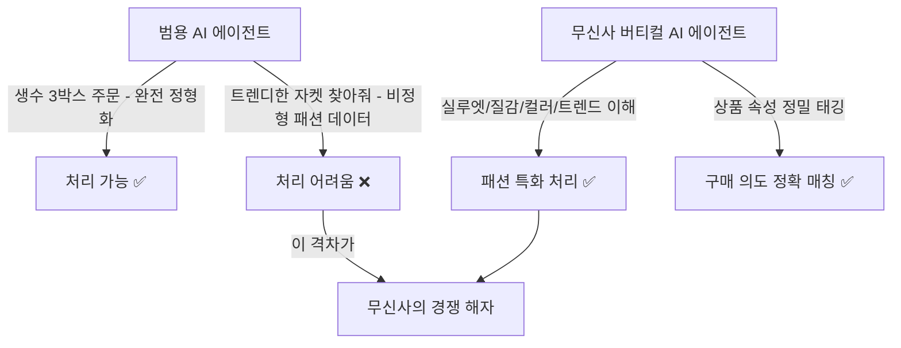
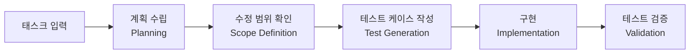
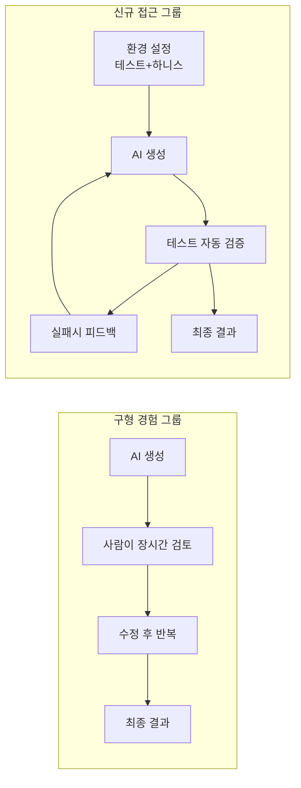
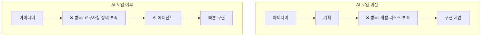
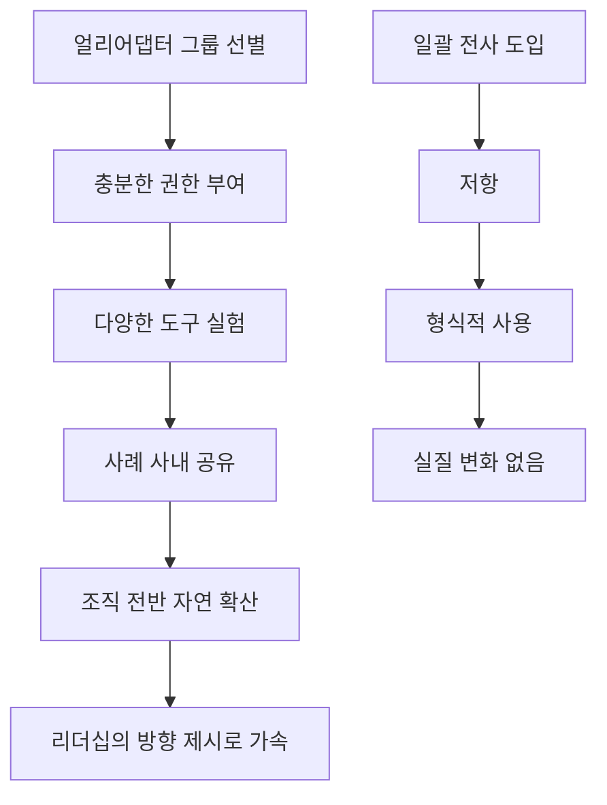
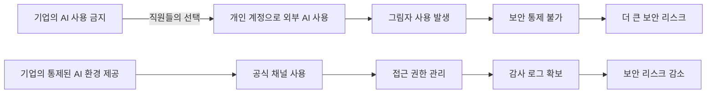
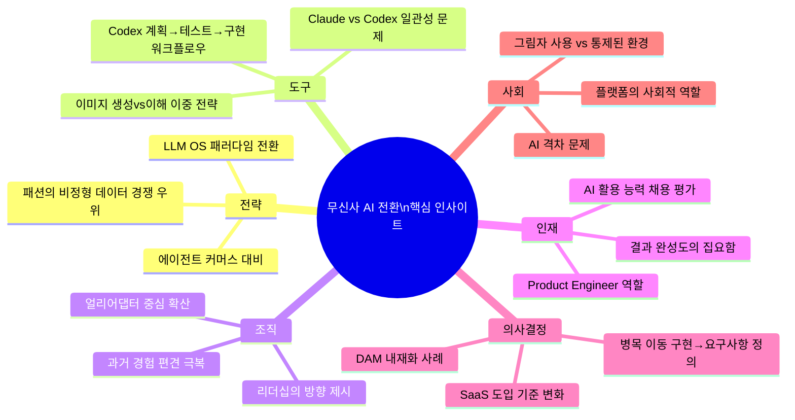

### — 전준희 무신사 CTO가 공개한 AI 전환의 실체

---

## 목차

1. [행사 개요 및 맥락](#1-행사-개요-및-맥락)
2. [전준희 CTO는 누구인가](#2-전준희-cto는-누구인가)
3. [패션 기업이 왜 AI인가: IT 패러다임의 거대한 전환](#3-패션-기업이-왜-ai인가-it-패러다임의-거대한-전환)
4. [LLM OS 시대와 에이전트 커머스의 도래](#4-llm-os-시대와-에이전트-커머스의-도래)
5. [패션이 AI에 가장 강하게 저항할 수 있는 이유](#5-패션이-ai에-가장-강하게-저항할-수-있는-이유)
6. [Codex 도입의 계기: Anthropic 부사장 방문이 바꾼 것](#6-codex-도입의-계기-anthropic-부사장-방문이-바꾼-것)
7. [Claude vs Codex: 실제 현장 사용 경험의 차이](#7-claude-vs-codex-실제-현장-사용-경험의-차이)
8. [조직 내 AI 기술 격차: 과거 경험이 만든 편견](#8-조직-내-ai-기술-격차-과거-경험이-만든-편견)
9. [채용 방식의 전면 개편: AI 활용 능력을 직접 평가하다](#9-채용-방식의-전면-개편-ai-활용-능력을-직접-평가하다)
10. [개발 병목의 이동: 구현에서 요구사항 정의로](#10-개발-병목의-이동-구현에서-요구사항-정의로)
11. [Product Engineer의 부상: 개발자 역할의 재정의](#11-product-engineer의-부상-개발자-역할의-재정의)
12. [AI 도입 확산 전략: 얼리어댑터 중심의 확산 모델](#12-ai-도입-확산-전략-얼리어댑터-중심의-확산-모델)
13. [비개발 직군의 의사결정 변화: DAM 구축 사례](#13-비개발-직군의-의사결정-변화-dam-구축-사례)
14. [SaaS 시장의 지각변동: 내재화 기준이 바뀐다](#14-saas-시장의-지각변동-내재화-기준이-바뀐다)
15. [보안 문제의 올바른 접근: 그림자 사용 vs 통제된 환경](#15-보안-문제의-올바른-접근-그림자-사용-vs-통제된-환경)
16. [패션 특화 이미지 모델 전략](#16-패션-특화-이미지-모델-전략)
17. [역설적 발견: 리소스가 부족한 팀이 AI를 더 잘 쓴다](#17-역설적-발견-리소스가-부족한-팀이-ai를-더-잘-쓴다)
18. [AI 격차 문제와 사회적 책임](#18-ai-격차-문제와-사회적-책임)
19. [종합 분석 및 시사점](#19-종합-분석-및-시사점)

---

## 1. 행사 개요 및 맥락

2026년 4월 29일, 서울 성수동에서 오픈AI 코리아 주최로 **"코덱스로 일하는 방식의 변화: 무신사의 AI 네이티브 운영 체계"** 라는 제목의 밋업 행사가 열렸다. 이 행사는 오픈AI의 코딩 에이전트 Codex의 실제 현장 적용 사례를 공유하기 위해 마련된 자리였으며, 조코딩, 허성범, choi.openai, 신영선의 AI탐구 등 국내 주요 AI 인플루언서 30여 명이 참석했다.

행사의 공식 스피커로 나선 전준희 무신사 최고기술책임자(CTO)는 파이어사이드 챗 형식의 세션에서 세 가지 핵심 주제를 다루었다. 첫째는 Codex 도입 배경과 개발 워크플로우 전반에 AI를 통합하는 과정, 둘째는 도입 전후 개발 속도 및 생산성의 실질적 변화, 셋째는 코딩 에이전트가 개발자 역할을 어떻게 재정의하고 있는가였다.

이 행사의 내용은 단순한 기술 소개를 넘어, 국내 대표 패션 플랫폼이 실제 조직 운영 레벨에서 AI를 어떻게 통합해 나가고 있는지를 솔직하게 공개한 자리였다는 점에서 업계의 큰 주목을 받았다.

---

## 2. 전준희 CTO는 누구인가

전준희 CTO의 이력을 이해하면, 무신사의 AI 전략이 왜 이토록 공격적인지 그 배경을 파악할 수 있다.

그는 국내에서 이스트소프트를 공동 창업한 이후 미국 실리콘밸리로 건너가 구글 및 유튜브 플랫폼 총괄 엔지니어링 디렉터, 우버 엔지니어링 디렉터, 쿠팡 엔지니어링 부사장 등 글로벌 빅테크의 핵심 기술 리더십 포지션을 두루 거쳤다. 귀국 후에는 음식 배달 플랫폼 요기요(위대한상상)의 대표이사를 역임했다.

이 화려한 이력에서 핵심은 그가 단순히 코드를 잘 짜는 엔지니어가 아니라, **플랫폼의 생태계 동학(dynamics)을 체득한 리더**라는 점이다. 닷컴 시대, 스마트폰 앱 시대를 모두 현장에서 겪으며 패러다임 전환의 실체를 몸으로 알고 있다. 그가 2024년 10월 무신사 테크 부문장으로 합류한 것은, 무신사가 단순한 패션 유통사를 넘어 AI 테크 기업으로의 전환을 선언하겠다는 의지의 표현이었다.

---

## 3. 패션 기업이 왜 AI인가: IT 패러다임의 거대한 전환

전준희 CTO가 행사에서 첫 번째로 던진 질문은 간명했다. **"패션 커머스 기업이 왜 AI냐"** 는 것이다. 이에 대한 그의 답변은 생존의 언어로 포장되어 있었다.

그는 IT 역사의 패러다임 전환을 통해 이를 설명했다. 닷컴 시대가 스마트폰 앱 시대로 넘어왔을 때, 인터넷이 있었음에도 앱을 만들지 못한 기업들은 시장에서 도태되었다. 그리고 지금 또 한 번의 거대한 전환이 시작되고 있다. 바로 **LLM OS(거대 언어 모델 운영체제) 시대**의 도래다.

이 관점은 학술적으로도 이미 논의되고 있다. 2023년부터 AI 연구자들 사이에서는 LLM이 단순한 언어 모델을 넘어 **에이전트 운영체제의 핵(kernel)** 역할을 할 수 있다는 개념이 제시되어 왔다. LLM은 ①언어 이해와 추론 능력, ②자연어로 표현된 모든 명령을 처리하는 유연성, ③외부 도구와의 통합 능력을 갖추고 있어, 기존 OS가 하드웨어 위에서 앱의 실행을 조율하듯 LLM이 디지털 서비스 실행의 중심이 될 수 있다는 논리다.

전준희 CTO의 비전에서 이 개념은 매우 구체적인 모습을 띤다. 머지않은 미래에 소비자는 무신사 앱을 직접 열어 필터를 누르고 상품을 검색하는 대신, ChatGPT 같은 AI 에이전트에게 "주말에 입을 트렌디한 재킷 찾아줘"라고 말하면 에이전트가 알아서 상품을 찾고, 비교하고, 결제까지 완료하는 방식으로 쇼핑이 이뤄지게 된다. 이 세상에서 **앱이라는 개념 자체가 퇴장하고, AI 에이전트가 새로운 인터페이스**가 된다.

```
[현재]                    [에이전트 시대]
사용자 → 앱 실행         사용자 → AI 에이전트
        → 검색 필터               → 의도 파악
        → 상품 탐색               → 서비스 직접 실행
        → 장바구니                → 결제 완료
        → 결제
```

이 전환은 단순히 UX의 변화가 아니다. **비즈니스의 근본 구조**가 바뀐다. 검색창이 사라지고, 필터가 사라지고, 앱 아이콘이 사라진다. 소비자의 의도를 파악하는 AI 에이전트가 그 모든 것을 대체한다. 이 흐름에서 뒤처진 플랫폼은 에이전트의 하위 공급자로 전락할 위험에 처한다.

---

## 4. LLM OS 시대와 에이전트 커머스의 도래

전준희 CTO가 두 번째로 강조한 것은 **에이전트가 커머스 생태계의 새로운 중간 지배자(middleman)가 될 것**이라는 점이다.

현재의 커머스 생태계에서 네이버쇼핑, 쿠팡, 무신사 같은 플랫폼들은 소비자와 브랜드 사이의 중간자 역할을 통해 막대한 수익을 창출한다. 그런데 AI 에이전트가 이 중간자의 위치를 차지하면 어떻게 될까. 소비자는 배달앱에 직접 접속하는 대신 에이전트에게 "생수 3박스 주문해 줘"라고 말한다. 에이전트가 가격을 비교하고, 배송 일정을 확인하고, 결제까지 처리한다. 이 과정에서 소비자는 어느 유통 채널에서 물건이 왔는지조차 신경 쓰지 않게 된다.

이것은 기존 플랫폼 기업들에게 **실존적 위협**이다. 플랫폼이 에이전트에 종속된 단순 재고(inventory) 제공자로 전락하면, 그 플랫폼이 쌓아온 브랜드 인지도, 사용자 인터페이스, 개인화 알고리즘 같은 경쟁 우위는 모두 무의미해진다.

이 맥락에서 전준희 CTO의 결론은 하나다. **무신사 스스로가 고도화된 AI 기술력을 갖춘 플랫폼이 되어야 한다.** 남의 에이전트에 잡아먹히지 않으려면, 무신사 자체가 패션 도메인에서 가장 강력한 AI 에이전트가 되어야 한다는 것이다. 생존의 문제다.

---

## 5. 패션이 AI에 가장 강하게 저항할 수 있는 이유

전준희 CTO가 무신사를 선택한 이유, 그리고 무신사가 AI 전환에서 특수한 위치에 있는 이유는 **패션이라는 도메인의 본질적 특수성**에 있다.

생수를 주문하는 건 쉽다. "1.5리터짜리 탄산수 3박스"라는 요구사항은 완전히 정형화된다. AI 에이전트가 처리하기에 완벽한 태스크다. 그러나 옷은 다르다.

패션 상품은 비정형 데이터의 집약체다. 소비자가 "요즘 유행하는 느낌의 자켓"을 찾을 때, 그 요구사항 안에는 실루엣, 소재의 질감, 로고의 위치와 크기, 밑단 처리 방식, 컬러 그라데이션, 트렌드 감도, 착용자의 체형과의 조화 같은 수십 개의 시각적·문화적 변수가 내포되어 있다. 이것은 신발끈 색상, 로고 위치, 밑창 소재 같은 세부 속성이 상품 정체성에 결정적인 영향을 미치는 세계다.

범용 AI 모델은 이 수준의 미묘한 시각적 뉘앙스를 아직 완벽히 이해하지 못한다. 때문에 **패션에 특화된 버티컬 AI 에이전트**를 자체 구축하는 것이 무신사의 핵심 비즈니스 경쟁력이 된다. 범용 에이전트가 따라오기 어려운 영역, 즉 패션의 시각적 복잡성이 오히려 무신사의 방어막이 된다는 역설적인 논리다.



이것이 요기요 대표였던 전준희 CTO가 무신사를 선택한 이유다. 그는 AI 에이전트 시대가 왔을 때 음식 배달은 범용 에이전트에게 침식될 가능성이 높지만, 패션은 비정형 데이터의 특수성 덕분에 가장 마지막까지 버티컬 플랫폼이 의미를 가질 수 있는 영역이라고 판단한 것이다.

---

## 6. Codex 도입의 계기: Anthropic 부사장 방문이 바꾼 것

무신사의 AI 전환에는 구체적인 도화선이 있었다. 전준희 CTO는 그 계기를 **Anthropic(앤트로픽) 부사장의 방문**에서 찾는다.

Claude 3.5가 출시되던 무렵(2024년), Anthropic의 부사장이 무신사를 방문했다. 그 자리에서 전달된 메시지는 충격적이었다. 실리콘밸리의 현업 개발자들이 LLM을 활용해 실제 상용 서비스에 배포되는 코드를 작성하고 있다는 것이었다. 단순한 프로토타입이나 데모가 아니라, 프로덕션 환경에 올라가는 실제 코드를 AI가 쓴다는 이야기였다.

처음에는 반신반의했다. 전준희 CTO는 집에서 직접 테스트를 해보았고, 그 경험이 생각을 바꾸어 놓았다. AI가 단순히 코드 조각(snippet)을 생성하는 수준을 넘어, 컨텍스트를 이해하고 실무에서 쓸 수 있는 수준의 코드를 작성하는 도구로 진화해 있었다.

이 경험이 무신사 개발 조직에 Codex 같은 AI 코딩 도구를 전면 도입하게 된 결정적 동기가 되었다. 주목할 것은 이 계기가 기술 벤치마크 결과나 연구 논문이 아니라, **본인이 직접 손으로 테스트한 경험**에서 나왔다는 점이다. C레벨 리더가 직접 코딩 도구를 써보고 가능성을 확인한 뒤 조직 전체의 방향을 바꾸는 의사결정을 내렸다.

---

## 7. Claude vs Codex: 실제 현장 사용 경험의 차이

무신사는 Codex 이전에 Claude를 사용한 경험이 있다. 전준희 CTO는 두 도구의 차이를 매우 솔직하게 설명한다.

**Claude 사용 경험:**  
초기에는 Claude를 코딩 보조 도구로 활용했다. 그러나 조직 내 사용자가 늘어나면서 문제가 나타났다. 특히 시스템 부하가 높거나 장애가 발생하는 상황에서 모델의 응답 품질이 **들쭉날쭉(inconsistent)** 하다는 경험이 쌓였다. 개발 운영 관점에서 이것은 심각한 문제다. 어떤 때는 탁월한 결과를 내놓고, 어떤 때는 기대에 못 미치는 결과를 내놓는 도구는 프로세스에 편입하기 어렵다. 결과의 예측 가능성과 일관성은 엔터프라이즈 도구의 핵심 요건인데, 이 부분에서 불만이 생긴 것이다.

**Codex 사용 경험:**  
Codex는 접근 방식 자체가 달랐다. 요청이 들어왔을 때 즉각적으로 코드를 생성하는 대신, 다음의 순서를 따랐다.



처음에는 이 흐름이 느리고 답답하게 느껴졌다. 당장 코드가 필요한데, 계획부터 세운다고? 그러나 실제 사용이 쌓이면서 이 접근 방식의 가치가 드러났다.

핵심은 **테스트 케이스의 역할**이다. AI 모델은 컨텍스트가 길어지면 이전 내용을 일부 잊어버리는 경향이 있다. 그런데 테스트 케이스가 존재하면, 모델이 이전 맥락을 잊더라도 **테스트가 기준점(anchor)** 역할을 한다. 새로 생성된 코드가 기존에 정의된 테스트를 통과하는지 여부로 회귀(regression)를 자동으로 감지할 수 있기 때문이다. 결과적으로 실수가 훨씬 줄었다.

이것은 단순히 어떤 AI 모델이 더 우수한가의 문제가 아니다. **AI 코딩 에이전트의 워크플로우 설계 철학**이 현업의 실제 요구사항과 어떻게 맞닿는가의 문제다. 실수를 줄이고, 장기 작업에서도 맥락의 일관성을 유지하며, 사람이 검토하기 쉬운 형태로 결과를 제출하는 에이전트가 실제 기업 환경에서 더 강력하다는 것을 무신사의 현장 경험이 보여준다.

참고로, OpenAI Codex는 현재 codex-1이라는 o3 모델의 소프트웨어 엔지니어링 특화 버전으로 구동되며, 클라우드 샌드박스 환경에서 GitHub 리포지토리를 직접 읽고 기능 개발, 버그 수정, PR 제안 등을 비동기적으로 수행한다. 2025년 말 기준 주간 활성 사용자가 200만 명을 돌파했으며, ChatGPT와의 통합 플랫폼으로 발전하는 방향으로 진화하고 있다.

---

## 8. 조직 내 AI 기술 격차: 과거 경험이 만든 편견

이 파트는 전준희 CTO의 관찰 중 가장 날카롭고 실용적인 인사이트 중 하나다.

조직 내에서 AI 활용 수준의 격차는 **도구의 품질 차이가 아니라, 사람의 과거 경험에서 비롯된 편견** 때문에 생긴다.

**구형 경험을 가진 그룹의 문제:**  
2023년 초에 AI 코딩을 처음 접한 개발자들은 당시 모델의 명백한 한계를 몸으로 경험했다. 기본적인 기능 구현에는 도움이 됐지만, 픽셀 수준의 UI 정렬, 세부 UX 조정, 엣지 케이스 처리 같은 마지막 완성도 작업에서는 프롬프트를 수십 번 반복해야 했다. 이 경험이 누적되면서 자연스럽게 "AI는 믿기 어렵다"는 인식이 뇌리에 박혔다.

결과적으로 이들의 워크플로우는 AI를 **보조 도구**로 쓰고, 최종 품질은 사람이 끝까지 책임지는 구조로 굳어졌다. AI가 생성한 코드를 그대로 신뢰하지 않고 장시간 검토하는 것이 당연한 습관이 되었다.

**최근 AI를 시작한 그룹의 접근:**  
반면 2024~2025년에 AI 코딩을 시작한 개발자들은 처음부터 이미 훨씬 성숙한 모델을 접했다. 이들은 다른 방식으로 환경을 구성한다. 처음부터 테스트와 하니스(test harness)를 기반으로 작업 환경을 설정하고, AI가 생성한 코드를 기본적으로 신뢰하면서 테스트 결과로 검증하는 방식을 택한다. 같은 도구를 쓰지만, 인식 체계 자체가 다르다.



이 차이가 만들어내는 생산성 격차는 단순히 타이핑 속도나 기술 숙련도의 문제가 아니다. **AI를 신뢰하는 구조를 설계할 수 있느냐** vs. **AI를 불신하는 구조 안에서 쓰느냐**의 차이다.

전준희 CTO의 통찰은 여기서 멈추지 않는다. 이 패턴은 개인 수준뿐만 아니라 **조직 수준에서도 똑같이 나타난다**고 한다. AI를 이미 도입했지만 초창기의 나쁜 경험 때문에 형성된 불신이 조직 문화로 굳어진 기업들이 있다. 이런 조직은 AI 기술 자체가 크게 발전해도 과거의 방식에서 벗어나지 못한다. 기술은 이미 개선되었지만, 그 기술을 활용하는 인식 체계가 과거에 머물러 있어 생산성을 오히려 제한한다.

---

## 9. 채용 방식의 전면 개편: AI 활용 능력을 직접 평가하다

무신사의 변화는 채용 현장에서 가장 구체적으로 드러난다. 전준희 CTO는 최근 신입 개발자 채용에서 AI 활용 능력을 직접 평가 항목으로 포함시켰다고 밝혔다.

전통적인 개발자 채용 방식은 알고리즘 문제 풀기 중심이다. 정해진 입출력이 있는 문제를 주어진 시간 안에 풀어내는 능력을 본다. 그러나 무신사는 이 방식에서 근본적으로 달라진 접근을 취했다.

**새로운 채용 평가 방식:**  
정답이 하나로 정해진 알고리즘 문제 대신, **비정형 문제**를 주었다. 요구사항이 모호하고 제약 조건이 불완전한 상황을 주고, 지원자가 Codex를 활용해 스스로 요구사항을 발굴하고, 앱을 설계하고, 동작하는 결과물을 만들어내는 과정을 관찰했다.

평가의 핵심은 두 가지다. 첫째, **불완전한 상황에서 제약 조건을 스스로 정리하는 능력** — 기계가 실행할 수 있는 수준으로 요구사항을 구조화할 수 있는가. 둘째, **AI를 활용해 실제로 동작하는 결과물을 만들어내는 능력** — AI를 쓸 줄 아는 것과 AI로 결과를 내는 것은 다르다.

이렇게 선발된 신입 개발자 66명은 현재 5년, 10년 차 시니어 개발자들과 함께 일하면서도 빠르게 결과물을 만들어내고 있다. 경력이 아닌 **AI 활용 능력과 문제 정의 역량**이 생산성을 결정하는 시대가 이미 도래했음을 보여주는 사례다.

이것은 국내 기업의 채용 관행에서 의미 있는 전환점이다. 코딩 테스트의 패러다임이 바뀌고 있다. CS 지식과 알고리즘 숙련도만으로는 부족하고, AI와 함께 일하는 방식을 처음부터 체득한 인재를 뽑는 방향으로 이동하고 있다.

---

## 10. 개발 병목의 이동: 구현에서 요구사항 정의로

전준희 CTO가 밝힌 AI 도입 이후 조직 내 가장 큰 변화 중 하나는 **병목 지점의 이동**이다.

AI 도입 이전에는 전형적인 병목이 개발 리소스 부족에 있었다. 아이디어는 있지만 구현할 인력이 없어서 기능이 개발되지 못하는 상황이 반복되었다. "개발팀이 바쁘니 이 기능은 다음 분기로 미루자"는 식의 의사결정이 일상이었다.

AI 코딩 에이전트가 코드 생성을 빠르게 처리하기 시작하면서 이 병목이 사라졌다. 그런데 예상치 못한 새로운 병목이 나타났다. **무엇을 만들지 구체적으로 정의하는 단계**에서 막힌다.

이 변화는 표면적으로는 단순해 보이지만, 실제 함의는 깊다. 인간에게 설명하는 수준의 기획은 이제 충분하지 않다. "이런 기능을 만들면 좋겠어요"라는 수준의 요구사항으로는 AI가 원하는 결과를 만들어내지 못한다. **기계가 이해하고 실행할 수 있는 수준으로 요구사항을 정밀하게 구조화**해야 한다. 예외 조건은 무엇인지, 경계 케이스(edge case)는 어떻게 처리할 것인지, 비즈니스 로직의 우선순위는 어디에 있는지 — 이 모든 것을 명확히 정의해야 AI가 올바른 코드를 생성한다.



이 전환이 의미하는 것은 단순한 개발 속도 향상을 넘어서, **조직 내에서 가장 중요한 역량이 무엇인가에 대한 재정의**다. 빠르게 코드를 생성하는 능력보다, 문제를 정확하게 정의하고 요구사항을 구조화하는 능력이 새로운 병목이자 핵심 역량이 된다.

---

## 11. Product Engineer의 부상: 개발자 역할의 재정의

전준희 CTO는 행사의 마지막 부분에서 무신사가 내부적으로 **Product Engineer**라는 새로운 역할 개념을 정의하고 있다고 밝혔다. 이는 기존의 직무 구분 체계가 AI 시대에 더 이상 유효하지 않다는 판단에서 비롯된 것이다.

프론트엔드 개발자, 백엔드 개발자, DevOps 엔지니어처럼 기술 스택으로 역할을 나누는 방식은 AI가 코드를 생성하는 시대에 점점 의미를 잃어간다. AI 에이전트는 프론트엔드와 백엔드의 경계를 넘나들며 코드를 작성하기 때문이다.

**Product Engineer가 갖춰야 할 역량:**

| 기존 개발자 역량 | Product Engineer 역량 |
|---|---|
| 코드 직접 작성 | 요구사항 정의와 구조화 |
| 언어/프레임워크 숙련도 | AI 결과물 검증 능력 |
| 기술 스택 전문성 | 제품 맥락 이해 |
| 기능 구현 | 사용자 가치와의 연결 |
| 버그 수정 | 엣지 케이스 식별 |

Product Engineer는 단순히 코드를 많이 짜는 사람이 아니다. **제품 맥락을 이해하고, 요구사항을 구조화하고, AI가 만든 결과물을 검증하며, 이를 실제 사용자 가치로 연결하는** 역할을 한다. CS 지식은 여전히 필요하지만, 핵심은 구현 자체에서 **문제 정의, 판단, 검증, 제품화 능력**으로 이동하고 있다.

이 역할 재정의는 개발자 직군에만 국한되지 않는다. PM, 기획자, 데이터 분석가 등 제품을 둘러싼 모든 역할이 영향을 받는다.

---

## 12. AI 도입 확산 전략: 얼리어댑터 중심의 확산 모델

무신사의 AI 도입 방식은 하향식 명령이 아니라, **얼리어댑터를 중심으로 한 자발적 확산 모델**이다. 전준희 CTO는 전사적으로 일괄 도입하기보다 이 방식이 효과적이라고 강조한다.

구체적인 방식은 다음과 같다. 먼저 조직 내에서 새로운 기술을 적극적으로 받아들이는 그룹을 식별한다. 이 그룹에게 충분한 사용 권한을 부여하고 다양한 AI 도구를 실제 업무에 적용해보게 한다. 그리고 어떤 방식으로 활용했을 때 효과가 있었는지, 어떤 업무 패턴에서 가장 큰 효율 개선이 있었는지 사례를 지속적으로 사내 커뮤니케이션 채널에 공유하게 한다.

이 방식이 효과적인 이유는 **도메인 특수성** 때문이다. 영업, 마케팅, 개발, 운영 등 조직마다 반복 업무와 비효율의 형태가 다르다. 중앙에서 일괄 적용하는 방식으로는 각 팀의 특수한 맥락을 반영하기 어렵다. 현업을 가장 잘 아는 사람들이 직접 적용하고 개선하는 과정이 필요하다.



그러나 이 자발적 확산 모델에도 전제 조건이 있다. 개별 사례가 단순한 실험에 그치지 않고 조직 전반의 일하는 방식으로 확장되려면, **시니어 리더십의 명확한 방향 제시와 지지**가 반드시 뒤따라야 한다. "AI 기반으로 일하는 조직으로 전환해야 한다"는 메시지가 위에서 분명하게 전달될 때, 아래에서의 자발적 실험들이 조직적 변화로 이어진다.

---

## 13. 비개발 직군의 의사결정 변화: DAM 구축 사례

전준희 CTO가 공유한 가장 인상적인 사례 중 하나는 **비개발 직군의 의사결정 방식 변화**를 보여주는 DAM(Digital Asset Management) 구축 이야기다.

무신사에는 이미지, 영상, 광고 카피, 배너 등 방대한 디지털 에셋이 존재하며, 이를 국가별·모델별로 라이선스를 관리해야 하는 복잡한 요구가 있었다. 이를 위해 외부 솔루션을 검토했더니 초기 구축 비용만 수억 원, 연간 라이선스 비용도 상당한 수준으로 견적이 나왔다.

여기서 변화가 시작됐다. 개발을 오랫동안 쉬었던 한 **비개발 매니저**가 이 비용에 의문을 품었다. 그는 BRD(Business Requirements Document)와 Adobe, Bynder 같은 기존 소프트웨어의 화면 캡처를 Codex에 입력했다. 결과는 놀라웠다. **약 30분 만에 기본적인 플로우가 작동하는 프로토타입**이 나왔다.

이를 통해 "이 정도 수준이면 내부에서 직접 만들 수 있겠다"는 판단이 가능해졌다. 수억 원짜리 외부 솔루션 도입 대신 내재화를 선택하는 의사결정의 근거가 30분의 프로토타이핑에서 나온 것이다.

이 사례가 보여주는 것은 단순히 비용 절감이 아니다. **AI가 내부 도구 구축 가능성의 기준 자체를 바꾸고 있다**는 것이다. 과거에는 "개발자가 필요하고, 시간과 비용이 얼마다"라는 계산이 도구 내재화의 장벽이었다. 이제는 "30분 프로토타입으로 가능성을 확인하고, 필요하면 확장한다"는 방식이 가능해졌다. 의사결정의 속도와 방식이 근본적으로 달라졌다.

---

## 14. SaaS 시장의 지각변동: 내재화 기준이 바뀐다

DAM 사례는 더 큰 산업적 함의를 갖는다. 전준희 CTO는 이것이 **SaaS 시장 전반에 대한 중요한 시사점**임을 직접 언급했다.

전통적으로 기업들이 외부 SaaS를 도입하는 주된 이유는 시간과 인력의 비용이었다. 마케팅 자동화 툴, 고객 세그먼트 관리 시스템, 내부 운영 콘솔 등을 처음부터 개발하려면 상당한 수의 개발자와 수개월의 시간이 필요했다. 비용이 비싸더라도 검증된 외부 솔루션을 도입하는 것이 합리적 선택이었다.

그런데 AI 코딩 에이전트와 GPT API를 활용하면 일부 기능은 내부 팀이 비교적 빠르게 구현해볼 수 있는 환경이 만들어지고 있다. 무신사의 경우 실제로 마케팅 툴의 일부 기능을 소수의 개발자가 내재화하기 시작했고, 자연어 처리 기능까지 붙이면서 상당한 범위를 커버하게 되었다.

이 변화의 의미는 다음과 같이 정리할 수 있다.

```
[과거의 구매/구축 결정 기준]
- 구축 시간 (수개월)이 너무 길다 → 구매
- 개발 인력 비용이 비싸다 → 구매
- 유지보수가 어렵다 → 구매

[AI 시대의 새로운 기준]
- 30분 프로토타입으로 가능성 검증 → 구축 검토
- 핵심 기능은 AI로 빠르게 구현 → 부분 내재화
- 차별화가 필요한 영역 → 필수 구축
- 범용적·비핵심 기능 → 여전히 구매
```

이 변화가 모든 SaaS를 위협한다는 것은 아니다. 그러나 "외부 솔루션을 도입할지, 내부에서 만들지"를 판단하는 문턱이 AI에 의해 크게 낮아졌다는 것은 분명하다. 특히 기업 고유의 맥락이 강하게 반영되어야 하거나, 차별화 자체가 핵심 경쟁력인 기능들은 내재화 압력이 강해질 것이다.

---

## 15. 보안 문제의 올바른 접근: 그림자 사용 vs 통제된 환경

AI 도입에서 기업이 가장 민감하게 반응하는 주제 중 하나가 보안이다. 행사에서 오픈AI 팀과의 대담에서도 이 주제가 다뤄졌다.

특히 제조업이나 규제 산업에서는 소스코드, 계정 정보, 결제 데이터, 내부 문서 등이 외부 AI 모델로 유출될 가능성을 크게 우려한다. 이에 대해 오픈AI 측은 ChatGPT Enterprise나 Codex Enterprise 같은 기업용 플랜에서 조직 단위 로그인, 사용자 관리, HR 정보 연동, 논리적으로 분리된 테넌트 구조 등 엔터프라이즈 수준의 보안 체계를 제공하고 있다고 설명했다.

그러나 이 논의에서 가장 중요한 인사이트는 기술적 보안 스펙보다 **의사결정 프레임의 전환**에 있다.

보안을 이유로 AI 사용을 완전히 막으면 어떻게 될까. 직원들은 업무 효율화를 위해 개인 계정을 통해 외부 AI 서비스를 사용한다. 이것이 바로 **그림자 사용(shadow use)** 이다. 보안 정책이 오히려 더 위험한 상황을 만들어내는 역설이다. 기업이 통제하지 못하는 채널을 통해 내부 정보가 흘러나가기 때문이다.



따라서 올바른 보안 전략은 사용을 막는 것이 아니라, **통제 가능한 공식 환경을 제공하는 것**이다. 직원들이 안전하게 AI를 활용할 수 있는 경로를 열어주되, 그 안에서 적절한 통제와 감시 체계를 갖추는 것이 현실적인 접근이다.

---

## 16. 패션 특화 이미지 모델 전략

패션 커머스에서 이미지는 단순한 시각 자료가 아니다. 상품 자체다. 따라서 이미지 및 영상 모델에 대한 논의는 무신사에게 특히 중요한 주제였다.

오픈AI 측은 GPT 기반 이미지 모델이 인코더-디코더 구조의 발전을 통해 이미지를 이해하고 재생성하는 능력이 함께 향상되고 있다고 설명했다. 특히 특정 패턴에 과적합(overfitting)되지 않고 다양한 상황에 일반화하는 방향으로 발전하고 있다는 점이 언급되었다.

무신사의 이미지 AI 전략은 크게 두 갈래로 나뉜다.

**① 이미지 생성:** 광고 소재, 룩북, 상품 배경 이미지 등의 생성에는 패션에 특화된 모델과 내부에서 구축한 자체 모델을 병행 활용한다. 패션 이미지의 미묘한 뉘앙스와 브랜드 일관성을 유지하려면 범용 이미지 생성 모델만으로는 부족하기 때문이다.

**② 이미지 이해 및 속성 태깅:** 반면 이미지를 읽고 속성을 태깅하는 작업에는 GPT 같은 범용 멀티모달 모델을 적극 활용한다. 신발끈의 색상, 로고의 위치와 색, 밑창 소재, 의류의 프린트 패턴과 실루엣 같은 상품 속성을 자동으로 태깅하는 데에는 범용 모델의 일반화 능력이 오히려 강점이 된다.

이 이중 전략은 **특화 vs. 범용**의 트레이드오프를 영역별로 다르게 해결하는 방식이다. 창의적 생성에는 특화 모델을, 구조화된 이해에는 범용 모델을 쓰는 것이다.

---

## 17. 역설적 발견: 리소스가 부족한 팀이 AI를 더 잘 쓴다

전준희 CTO가 공유한 가장 반직관적인 관찰이다. 조직 내에서 AI를 가장 빠르게, 가장 깊이 활용하는 팀은 리소스가 풍부한 팀이 아니라 **오히려 사람이 부족한 팀**이었다고 한다.

헤드카운트를 넉넉하게 받은 팀보다, 제한된 인력으로 더 많은 일을 처리해야 하는 팀이 AI를 더 빠르게 익히고 실제 업무에 통합했다. 이유는 단순하다. 선택이 아니라 **생존의 문제**였기 때문이다. AI를 활용해 자동화하지 않으면 업무를 감당할 수 없는 상황이 도구 활용의 강력한 동기가 되었다.

이 관찰은 AI 도입 전략에 중요한 시사점을 준다. 풍부한 리소스는 변화의 동기를 약화시킬 수 있다. 반면 제약 조건이 명확한 상황에서 사람들은 더 창의적이고 적극적으로 새로운 도구를 탐색한다.

전준희 CTO는 AI를 잘 활용하는 개발자를 **"결과를 끝까지 밀어붙이는 사람"** 으로 정의한다. 한 번의 AI 응답을 받고 적당히 만족하는 경우와, 원하는 결과가 나올 때까지 계속 수정하고 엣지 케이스를 파고드는 경우 사이에는 결과물의 품질 면에서 큰 차이가 발생한다고 한다.

이것이 의미하는 바는 명확하다. AI 시대의 역량 차이는 도구에 대한 접근권이나 기술적 숙련도의 문제가 아니다. **결과의 완성도를 끝까지 끌어올리려는 집요함(persistence)** 에서 갈린다. 이 집요함은 AI가 대체할 수 없는, 여전히 인간의 영역에 속하는 역량이다.

---

## 18. AI 격차 문제와 사회적 책임

행사의 마지막에는 AI 활용의 이면에 존재하는 **격차 문제**가 논의되었다.

현장에서는 특정 지역의 경우 AI를 접해볼 기회 자체가 부족하다는 이야기가 나왔다. 일부 조직은 이미 Codex, 멀티모달 모델, 에이전트 파이프라인을 실제 업무에 연결하고 있지만, 다른 한편에서는 아직 AI를 시작할 계기조차 없는 상황이 공존한다. 같은 나라, 같은 업종 안에서도 이미 격차가 벌어지고 있다.

오픈AI 측은 AGI의 혜택을 더 넓게 확산하는 것이 회사의 목표이며, 정부와 협력해 교육과 사용 기회를 확대하려는 노력이 필요하다고 설명했다.

무신사는 이 문제에 대해 자사의 역할도 있다고 보고 있다. 무신사 서비스 내에서 자연스럽게 AI 경험을 제공함으로써 사용자들이 AI에 친숙해질 수 있도록 기여할 수 있다는 시각이다. 플랫폼 기업이 갖는 사회적 역할이기도 하다.

결국 다음 단계의 과제는 기술 자체의 발전 속도가 아니라, **활용 격차를 어떻게 줄이고 더 많은 사람이 실제로 AI를 활용할 수 있는 환경을 만드는가**에 있다는 점이 행사의 마무리 메시지로 제시되었다.

---

## 19. 종합 분석 및 시사점

이번 밋업에서 나온 이야기들을 종합하면, 무신사의 AI 전환 사례는 단순한 도구 도입의 성공 사례가 아니다. 이는 **IT 패러다임 전환기에 기업이 어떻게 생존 전략을 수립하고 실행해야 하는가**에 대한 구체적인 현장 증언이다.

### 핵심 시사점 요약

**① 패러다임 전환을 먼저 보는 것이 전략의 출발점이다**  
무신사가 AI에 투자하는 이유는 AI가 멋있어서가 아니다. LLM OS 시대에 에이전트 커머스가 현실화되면 기존 플랫폼이 에이전트에 종속될 수 있다는 구조적 위협을 먼저 인식했기 때문이다. 기술 도입의 동기가 명확할 때 조직의 변화도 진정성을 갖는다.

**② 도구 평가는 벤치마크가 아니라 현장 경험으로 한다**  
Claude와 Codex의 비교는 어느 모델이 더 "성능이 좋은가"의 문제가 아니었다. 실제 개발 환경에서 일관성을 유지하며, 운영 관점의 부담을 줄이고, 장기 작업에서도 신뢰할 수 있는 워크플로우를 제공하는가의 문제였다. 현장 사용 경험이 도구 선택의 기준이 되어야 한다.

**③ 인식의 업데이트가 도구의 발전만큼 중요하다**  
기술은 이미 발전했는데 조직은 2023년식 인식 체계로 2026년 도구를 쓰고 있는 경우가 많다. 과거의 경험이 만든 편견을 인식하고, 의도적으로 인식 체계를 업데이트하는 조직 관리 노력이 필요하다.

**④ 채용의 기준이 바뀌었다**  
알고리즘 문제 풀기 능력이 아니라, 불완전한 상황에서 요구사항을 구조화하고 AI를 활용해 결과를 만들어내는 능력을 보는 시대가 시작되었다. 지원자들도, 채용 담당자들도 이 변화를 인식해야 한다.

**⑤ 병목의 이동을 직시해야 한다**  
구현 병목이 사라진 자리에 요구사항 정의 병목이 생겼다. 이는 PM, 기획자, 비즈니스 담당자의 역할이 더 중요해졌음을 의미한다. 기계가 실행할 수 있는 수준으로 요구사항을 구조화하는 능력이 새로운 핵심 역량이다.

**⑥ 보안은 막는 것이 아니라 통제 가능하게 여는 것이다**  
AI 사용을 금지하면 그림자 사용이 생긴다. 통제된 공식 환경을 열어주는 것이 실제로 더 안전한 접근이다.

**⑦ 집요함이 역량을 가른다**  
도구에 대한 접근이 평등해질수록, 그 도구로 무엇을 끝까지 만들어내느냐가 차별화 요소가 된다. 한 번 받은 결과에 만족하지 않고 계속 개선하는 집요함이 AI 시대의 핵심 역량이다.

---



---

*작성일: 2026년 5월 1일*  
*원문 출처: [@choi.openai]( https://www.threads.com/@choi.openai/post/DXweMpKj90U) Threads (2026.04.30) — OpenAI × 무신사 AI 네이티브 워크플로우 밋업 정리*
