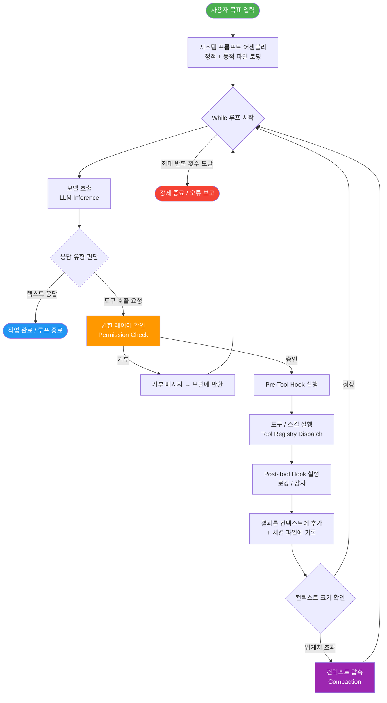
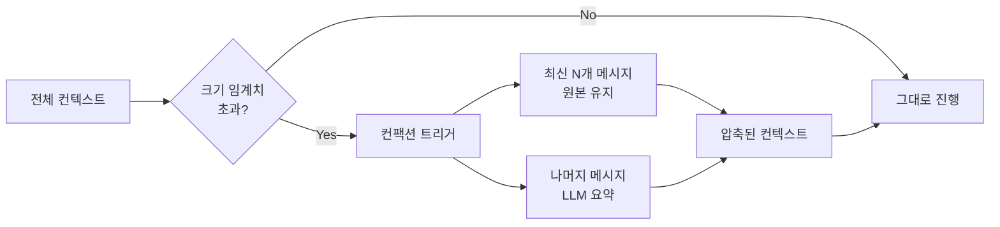
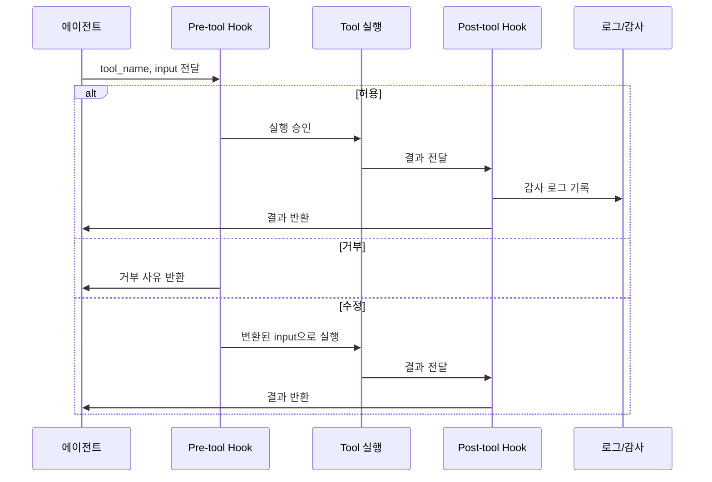

> **원본 영상:** [The Common Architecture Behind Every Agent Harness](https://www.youtube.com/watch?v=nWzXyjXCoCE)  
> **채널:** Prompt Engineering  
> **작성일:** 2026년 5월 1일  
> **참고:** 영상 트랜스크립트 + 최신 업계 동향 종합 정리

---

## 목차

1. [시작하며 — 왜 지금 하네스인가?](#1-시작하며--왜-지금-하네스인가)
2. [에이전트 하네스란 무엇인가?](#2-에이전트-하네스란-무엇인가)
3. [하네스 vs 프레임워크](#3-하네스-vs-프레임워크)
4. [전체 구조 개요](#4-전체-구조-개요)
5. [9가지 핵심 컴포넌트 상세 해설](#5-9가지-핵심-컴포넌트-상세-해설)
   - 5.1 [While 루프 — 하네스의 심장](#51-while-루프--하네스의-심장)
   - 5.2 [컨텍스트 관리](#52-컨텍스트-관리)
   - 5.3 [도구와 스킬, 그리고 레지스트리](#53-도구와-스킬-그리고-레지스트리)
   - 5.4 [서브에이전트 관리](#54-서브에이전트-관리)
   - 5.5 [내장 스킬 (Built-in Skills)](#55-내장-스킬-built-in-skills)
   - 5.6 [세션 퍼시스턴스 / 메모리](#56-세션-퍼시스턴스--메모리)
   - 5.7 [시스템 프롬프트 어셈블리](#57-시스템-프롬프트-어셈블리)
   - 5.8 [라이프사이클 훅 (Lifecycle Hooks)](#58-라이프사이클-훅-lifecycle-hooks)
   - 5.9 [권한 및 안전 레이어](#59-권한-및-안전-레이어)
6. [미니 하네스 파이썬 구현 예시](#6-미니-하네스-파이썬-구현-예시)
7. [최신 업계 동향 (2025~2026)](#7-최신-업계-동향-20252026)
8. [핵심 인사이트 요약](#8-핵심-인사이트-요약)

---

## 1. 시작하며 — 왜 지금 하네스인가?

"에이전트 하네스"라는 단어는 AI 개발 커뮤니티에서 매일같이 등장하지만, 정작 이 단어가 무엇을 의미하는지 깔끔하게 정의할 수 있는 사람은 드물다. 심지어 실제로 에이전트를 만들고 있는 개발자들조차 명확한 답을 못 내놓는 경우가 많다. 이 영상(및 본 문서)의 목표는 그 혼란을 해소하고, 하네스가 무엇인지, 왜 중요한지, 그리고 어떻게 구성되어 있는지를 명확하게 정리하는 것이다.

2025년이 '에이전트의 해'였다면, 2026년은 '에이전트 하네스의 해'다. 업계 데이터에 따르면 기업 AI 에이전트 프로젝트의 최대 88%가 프로덕션 단계에 도달하지 못하고 있으며, 그 핵심 원인으로 지목되는 것이 바로 하네스의 부재 또는 부실한 설계다. 즉, 아무리 좋은 모델(뇌)이 있어도, 그것을 현실 세계에서 작동시킬 신경계와 골격(하네스)이 없다면 아무런 소용이 없다는 것이다.

---

## 2. 에이전트 하네스란 무엇인가?

가장 단순하게 표현하면 다음과 같다.

> **하네스(Harness)는 모델을 에이전트로 바꿔주는 고정된 아키텍처다.**

현대 LLM(대형 언어 모델)은 본질적으로 "일회성 텍스트 생성기"다. 질문을 던지면 답변을 내놓고 멈춘다. 여기에는 지속성도 없고, 도구 호출 능력도 없으며, 결과를 보고 다시 판단하는 반복 능력도 없다. 하네스는 바로 이 부분을 채워준다.

영상의 비유를 빌리자면, **모델은 엔진이고, 하네스는 자동차**다. 아무리 강력한 엔진도 핸들, 브레이크, 바퀴, 연료 시스템이 없으면 어디에도 갈 수 없다. 하네스는 모델이 실제 세계와 상호작용하고, 행동하고, 결과를 관찰하고, 문제가 실제로 해결될 때까지 계속 전진할 수 있게 해주는 모든 인프라를 가리킨다.

이 개념의 대표적인 실세계 예시가 바로 코딩 에이전트 도구들이다. **Codex, Cursor, Claude Code, Windsurf** 같은 툴들이 모두 하네스의 예시다. 각 도구는 "실제 코드 저장소에서 모델이 코드를 작성하고 편집하게 만들자"라는 구체적인 문제로부터 출발했으며, 서로 독립적으로 개발되었음에도 불구하고 놀랍도록 유사한 아키텍처로 수렴하였다. 이 수렴 현상 자체가 하네스 설계에 '정답에 가까운 패턴'이 존재함을 시사한다.

---

## 3. 하네스 vs 프레임워크

하네스와 자주 혼동되는 개념이 바로 **프레임워크(Framework)** 다. LangChain, LangGraph, AutoGen, CrewAI 같은 도구들이 여기에 해당한다. 이 둘은 완전히 다른 철학을 가지고 있다.

| 구분 | 프레임워크 (Framework) | 하네스 (Harness) |
|------|----------------------|----------------|
| **설계 철학** | 인간이 조립한다 | 에이전트가 바로 사용한다 |
| **제공 방식** | 추상화 레이어(체인, 메모리, 리트리버 등) | 작동하는 에이전트를 완제품으로 제공 |
| **조립 주체** | 개발자(human architect) | 없음 (이미 조립되어 있음) |
| **핵심 구성** | 빌딩 블록의 집합 | while 루프 + 도구 레지스트리 + 권한 레이어 |
| **대표 예시** | LangChain, AutoGen | Claude Code, Cursor, Codex |

프레임워크는 개발자에게 재료와 도구를 주고 "자, 이걸로 에이전트를 만들어봐"라고 말한다. 반면 하네스는 처음부터 에이전트 그 자체다. 목표를 제공하면 나머지는 하네스가 알아서 처리한다. 이 차이를 명확히 이해하는 것이 좋은 에이전트 시스템을 설계하는 출발점이다.

---

## 4. 전체 구조 개요

하네스의 전체 실행 흐름을 도식화하면 다음과 같다.



---

## 5. 9가지 핵심 컴포넌트 상세 해설

### 5.1 While 루프 — 하네스의 심장

하네스의 가장 근본적인 구성 요소는 바로 **while 루프**다. 이것이 없으면 에이전트라고 부를 수 없다.

루프의 동작 원리는 단순하다. 모델은 시스템 프롬프트를 읽고, 어떤 도구를 호출할지 결정하고, 도구를 실행하고, 그 결과를 다시 컨텍스트에 넣어 다음 루프를 돌린다. 이 과정은 모델이 텍스트만으로 구성된 응답(즉, 추가 도구 호출 없이 결론을 내리는 응답)을 생성하거나, 설정된 **최대 반복 횟수(iteration cap)** 에 도달할 때까지 계속된다. 최대 반복 횟수 제한은 루프가 영원히 돌아가는 것을 방지하는 안전장치이며, 프로덕션 하네스에서는 반드시 구현해야 한다.

텍스트 전용 모델에만 해당되는 이야기가 아니다. 이미지, 오디오 등을 다루는 멀티모달 모델에도 동일한 루프 패턴이 적용된다.

```python
# While 루프의 핵심 골격 (의사 코드)
MAX_ITERATIONS = 50
iteration = 0

while iteration < MAX_ITERATIONS:
    response = call_llm(context, system_prompt)
    
    if response.is_text_only():
        break  # 작업 완료
    
    tool_call = response.get_tool_call()
    result = execute_tool(tool_call)
    context.append(result)
    
    iteration += 1
```

### 5.2 컨텍스트 관리

에이전트가 루프를 돌 때마다 컨텍스트(대화 기록)는 계속 쌓인다. 사용자 메시지, 도구 호출 기록, 도구 결과, 모델의 중간 응답이 모두 누적되다 보면 결국 LLM의 **컨텍스트 윈도우 한계**에 부딪히게 된다.

하네스는 이 문제를 해결하기 위해 세 가지 전략을 사용한다.

- **그대로 유지(Verbatim):** 가장 최근의 중요한 메시지들은 원본 그대로 유지한다.
- **요약(Summarize):** 오래된 메시지들은 요약하여 중요 정보를 압축된 형태로 보존한다.
- **폐기(Discard):** 더 이상 관련 없는 정보는 완전히 제거한다.

Claude Code를 예로 들면, 예전에는 컨텍스트 예산이 약 20만 토큰이었으나 현재는 Opus 모델 기준으로 100만 토큰까지 늘어났다. 하지만 이 한도의 80~90%에 도달하면 **컨팩션(Compaction)** 이 발동된다. 최근 메시지들은 원본을 유지하고, 그보다 오래된 내용은 요약 처리된다.

컨텍스트 관리는 단순해 보이지만 잘못 처리하면 치명적인 결과를 낳는다. 중요한 정보가 잘못 요약되거나 폐기되면 에이전트는 엉뚱한 결론을 내리거나 이미 해결한 문제를 다시 시작하는 상황이 발생한다.



### 5.3 도구와 스킬, 그리고 레지스트리

하네스에서 **도구(Tools)** 와 **스킬(Skills)** 은 서로 다른 레이어에 존재한다.

**도구**는 범용적 기본 연산이다. 파일 읽기, Bash 명령 실행, 코드 검색 같은 저수준 작업들이 여기에 해당한다. 어느 팀이나 어느 프로젝트에서나 공통으로 사용할 수 있는 보편적인 능력들이다.

**스킬**은 그 위에 쌓이는 조직 특화 지식이다. 특정 팀의 워크플로우, 특정 프로젝트의 컨벤션, 또는 특정 도메인의 전문 지식을 인코딩한 것이다. 보통 마크다운 파일(`.md`) 형태로 저장되어, 에이전트가 호출 시점에 해당 파일을 읽어 적용한다.

이 둘을 모두 관리하는 것이 **레지스트리(Registry)** 다. 레지스트리는 다음 세 가지를 담당한다.

- 어떤 도구/스킬이 **사용 가능한지** 목록화
- 각 도구/스킬이 **어떤 권한**을 필요로 하는지 정의
- 모델의 호출 요청을 **실제 핸들러 함수로 디스패치**

```python
# 도구 레지스트리 기본 구조 (의사 코드)
class Tool:
    name: str
    permission: PermissionLevel  # READ, WORKSPACE, FULL
    handler: Callable
    description: str

registry = {
    "read_file": Tool("read_file", READ, handle_read, "파일 내용 읽기"),
    "run_bash":  Tool("run_bash",  WORKSPACE, handle_bash, "Bash 명령 실행"),
    "delete_file": Tool("delete_file", FULL, handle_delete, "파일 삭제"),
}
```

### 5.4 서브에이전트 관리

하나의 작업이 너무 크거나, 병렬 처리가 필요하거나, 서로 다른 전문성이 요구될 때 하네스는 **서브에이전트(Sub-agents)** 를 생성한다.

각 서브에이전트는 다음을 독립적으로 가진다.

- **자체 세션:** 메인 에이전트와 격리된 독립적 컨텍스트
- **제한된 도구 집합:** 해당 서브에이전트의 임무에 필요한 도구만 접근 가능
- **집중형 시스템 프롬프트:** "너는 지금 이 특정 작업만 담당한다"는 명확한 지시

서브에이전트 운용의 핵심 패턴은 **Spawn → Restrict → Collect**다. 서브에이전트를 생성(Spawn)하고, 권한을 제한(Restrict)하고, 결과를 수집(Collect)하는 것이다. 영상에서 소개된 구현 예시에서는 탐색(Exploration), 일반(General), 검증(Verification)이라는 세 가지 서브에이전트 아키타입을 정의하며, 각각은 고유한 권한 레벨, 도구 목록, 시스템 프롬프트를 보유한다.

```mermaid
flowchart TD
    M[메인 에이전트] --> SA1[탐색 서브에이전트\nExploration]
    M --> SA2[일반 서브에이전트\nGeneral]
    M --> SA3[검증 서브에이전트\nVerification]
    SA1 -->|READ 권한만| T1[파일 시스템 탐색]
    SA2 -->|WORKSPACE 권한| T2[코드 수정 / 실행]
    SA3 -->|READ 권한만| T3[결과 검증 / 테스트]
    T1 & T2 & T3 -->|결과 수집| M
```



### 5.5 내장 스킬 (Built-in Skills)

모든 하네스는 기본적으로 동작할 수 있도록 **내장 스킬 세트**를 함께 탑재해 출시된다. 이것들은 협상의 여지가 없는 최소 요건이다.

코딩 에이전트의 경우, 내장 스킬의 예시는 다음과 같다.

- **파일 조작:** 읽기(read), 쓰기(write), 편집(edit)
- **코드 검색:** 심볼 검색, 패턴 매칭
- **셸 실행:** Bash 명령 실행, 환경 변수 접근
- **코드 탐색:** 클래스/함수 정의 찾기, 참조 추적

이 레벨을 넘어서 더 고수준의 내장 스킬도 존재한다. Git 커밋 만들기, PR(Pull Request) 열기, 테스트 결과 해석하기 같은 것들이다. 이런 고수준 스킬들은 하네스 제조사(벤더)마다 다를 수 있으며, 이것이 Claude Code와 Cursor, Codex가 서로 다른 개성을 가지는 이유 중 하나다.

핵심 원칙은 하나다. **에이전트가 파일을 읽거나 편집할 수 없다면, 그건 코딩 에이전트가 아니다.**

### 5.6 세션 퍼시스턴스 / 메모리

장시간 실행되는 에이전트 세션은 상태(state)를 가진다. 만약 하네스가 중간에 크래시(crash)된다면, 모든 진행 상황이 증발해버리는 상황이 발생한다. 이를 방지하는 것이 **세션 퍼시스턴스(Session Persistence)** 컴포넌트다.

현대 하네스에서 가장 널리 쓰이는 방식은 **Append-Only JSON 파일** 또는 **마크다운 파일**이다. 에이전트가 생성하는 모든 이벤트 — 메시지, 도구 호출, 도구 결과, 컨텍스트 압축 이벤트 — 가 한 줄의 JSON으로 즉시 디스크에 기록된다. 파일은 덮어쓰지 않고 오직 추가(append)만 한다.

이 설계의 장점은 다음과 같다.

- **재개 가능성:** 하네스가 죽어도 파일은 살아있으므로, 정확히 멈춘 지점부터 재시작할 수 있다.
- **동시성 안전:** 파일이 추가 전용이기 때문에 두 번의 하네스 실행이 같은 로그 파일을 공유해도 서로 충돌하지 않는다.
- **감사 추적:** 에이전트가 무엇을 했는지 전체 기록이 남는다.

```python
# Append-Only 이벤트 로그 (의사 코드)
def append_event(filepath, event: dict):
    with open(filepath, 'a') as f:
        f.write(json.dumps(event) + '\n')
        f.flush()  # 즉시 디스크에 플러시

def replay_session(filepath) -> list:
    events = []
    with open(filepath, 'r') as f:
        for line in f:
            events.append(json.loads(line.strip()))
    return events
```

Anthropic 팀이 공개한 바에 따르면, 그들은 세션 관리를 하네스 자체와 분리하는 설계를 채택했다. 이는 관심사의 분리(Separation of Concerns) 원칙을 에이전트 아키텍처에 적용한 흥미로운 사례다.

### 5.7 시스템 프롬프트 어셈블리

많은 사람들이 놀라는 부분이 바로 이것이다. **현대 하네스에서 시스템 프롬프트는 고정된 문자열이 아니다.** 시스템 프롬프트는 실행 시점에 동적으로 조립되는 파이프라인이다.

조립 과정은 다음과 같이 진행된다. 하네스는 현재 작업 디렉토리에서 상위 디렉토리 방향으로 순회하며 특정 파일들을 찾는다. Claude Code의 경우 `CLAUDE.md`, 많은 에이전트들이 채택하는 `AGENTS.md` 같은 파일들이 이에 해당한다. 이 파일들을 발견하면 그 내용을 시스템 프롬프트에 주입(inject)한다.

이 방식을 통해 팀별, 프로젝트별, 심지어 디렉토리별로 에이전트의 동작 방식을 커스터마이즈할 수 있다.

그런데 여기서 한 가지 중요한 주의사항이 있다. 대부분의 현대 하네스는 **프롬프트 캐싱(Prompt Caching)** 을 적극 활용한다. 시스템 프롬프트의 정적인 부분이 캐시되어 반복 호출 시 토큰 비용을 절감하는 것이다. 만약 동적 컴포넌트를 시스템 프롬프트의 앞부분에 배치하면 캐시가 깨져버리게 된다. 따라서 **정적 내용을 앞에, 동적으로 로딩되는 내용을 뒤에** 배치하는 순서 규칙이 반드시 지켜져야 한다.

```
시스템 프롬프트 조립 순서:
1. [정적] 하드코딩된 기본 지시사항 (캐시됨)
2. [정적] 내장 도구 목록 및 설명 (캐시됨)
3. [동적] 상위 디렉토리의 AGENTS.md 내용
4. [동적] 현재 디렉토리의 CLAUDE.md 내용
5. [동적] 사용자 메모리 파일 내용
```

### 5.8 라이프사이클 훅 (Lifecycle Hooks)

훅(Hook)은 하네스의 **확장성(Extensibility)** 을 담당하는 컴포넌트다. 하네스 코드 자체를 수정하지 않고도, 특정 시점에 커스텀 로직을 주입할 수 있게 해주는 메커니즘이다.

두 가지 종류의 훅이 있다.

**Pre-tool Hook (사전 훅)** 은 도구가 실행되기 전에 발동된다. 도구 이름과 입력값을 받아서 다음 세 가지 중 하나를 결정할 수 있다.

- **허용(Allow):** 도구를 그대로 실행
- **거부(Deny):** 도구 실행을 차단하고 모델에 거부 이유 반환
- **수정(Modify):** 입력값을 변환한 후 실행

**Post-tool Hook (사후 훅)** 은 도구 실행이 완료된 후 발동된다. 결과물을 검사할 수 있지만, 실행을 막을 수는 없다. 주로 로깅, 감사(audit), 관찰 가능성(observability) 확보에 사용된다.

훅의 가장 중요한 활용 사례 중 하나는 **하드웨어 간 통신(intercom communication)** 이다. 여러 하네스가 훅을 통해 서로 신호를 주고받을 수 있으며, 이것이 오늘날 기업들이 하네스를 채택하고 자신들의 인프라에 통합하는 방식이기도 하다.



### 5.9 권한 및 안전 레이어

이 컴포넌트가 하네스를 **유용한 도구와 위험한 도구 사이의 경계**에 서게 하는 요소다. 현대 하네스는 계층적 권한 모드를 정의한다.

**권한 단계:**

| 레벨 | 이름 | 허용 작업 예시 |
|------|------|--------------|
| 1단계 | READ | 파일 읽기, 디렉토리 목록, grep |
| 2단계 | WORKSPACE | 파일 수정, 코드 실행, 패키지 설치 |
| 3단계 | FULL | 시스템 파일 수정, sudo, 삭제 |

각 도구는 자신이 필요로 하는 **최소 권한 레벨**을 선언한다. 하네스는 도구가 실제로 실행되기 전에 권한 레이어에서 이를 검사하고 승인 여부를 결정한다.

더 나아가, Bash와 같은 도구는 **동적 명령어 분류** 기능을 통해 같은 도구라도 실행되는 명령어에 따라 다른 권한 레벨을 적용한다.

- `ls`, `cat`, `grep` → READ (읽기 전용)
- `pip install`, `npm run` → WORKSPACE
- `rm -rf`, `sudo`, `shutdown` → FULL (전체 접근 필요)

이 정적 규칙 위에, 에이전트는 파괴적인 작업을 실행하기 전에 **사용자에게 명시적 승인을 요청하며 일시 중지**할 수 있다. "이 파일을 삭제해도 될까요?" 같은 확인 절차가 바로 이 레이어에서 구현된다.

---

## 6. 미니 하네스 파이썬 구현 예시

영상에서는 위의 9가지 컴포넌트를 모두 포함하는 최소한의 파이썬 구현을 보여준다. 아래는 그 핵심 구조를 정리한 것이다.

```python
import json
import os
from dataclasses import dataclass
from enum import Enum
from typing import Callable, Any

# ─── 1. 권한 레벨 정의 ───────────────────────────────────────
class Permission(Enum):
    READ = "read"
    WORKSPACE = "workspace"
    FULL = "full"

# ─── 2. 도구 데이터클래스 ────────────────────────────────────
class Tool:
    name: str
    permission: Permission
    handler: Callable
    description: str

# ─── 3. 도구 레지스트리 ──────────────────────────────────────
class ToolRegistry:
    def __init__(self):
        self._tools: dict[str, Tool] = {}
    
    def register(self, tool: Tool):
        self._tools[tool.name] = tool
    
    def get(self, name: str) -> Tool | None:
        return self._tools.get(name)
    
    def descriptors(self) -> list[dict]:
        return [{"name": t.name, "permission": t.permission.value,
                 "description": t.description}
                for t in self._tools.values()]

# ─── 4. 세션 퍼시스턴스 ──────────────────────────────────────
class SessionMemory:
    def __init__(self, filepath: str):
        self.filepath = filepath
    
    def append(self, event: dict):
        with open(self.filepath, 'a') as f:
            f.write(json.dumps(event) + '\n')
            f.flush()
    
    def replay(self) -> list[dict]:
        if not os.path.exists(self.filepath):
            return []
        with open(self.filepath, 'r') as f:
            return [json.loads(line) for line in f if line.strip()]

# ─── 5. 컨텍스트 관리 ────────────────────────────────────────
def compact_context(history: list, max_tokens: int, llm_call) -> list:
    if count_tokens(history) < max_tokens * 0.8:
        return history
    # 최근 20개 메시지는 보존, 나머지는 요약
    recent = history[-20:]
    old = history[:-20]
    summary = llm_call(f"다음 대화를 요약해: {old}")
    return [{"role": "system", "content": f"[이전 대화 요약] {summary}"}] + recent

# ─── 6. 시스템 프롬프트 어셈블리 ─────────────────────────────
def assemble_system_prompt(base_prompt: str, workdir: str) -> str:
    parts = [base_prompt]  # 정적 부분 먼저
    # 동적 파일 로딩 (캐시 무효화 방지를 위해 뒤에 배치)
    for fname in ["AGENTS.md", "CLAUDE.md"]:
        fpath = os.path.join(workdir, fname)
        if os.path.exists(fpath):
            with open(fpath) as f:
                parts.append(f.read())
    return "\n\n".join(parts)

# ─── 7. 라이프사이클 훅 ──────────────────────────────────────
def pre_tool_hook(tool_name: str, input_data: Any) -> tuple[bool, Any]:
    """True = 허용, False = 거부. 수정된 input 반환 가능"""
    print(f"[Pre-hook] 도구 실행 예정: {tool_name}")
    return True, input_data

def post_tool_hook(tool_name: str, output: Any):
    """결과 감사 / 로깅 (실행 차단 불가)"""
    print(f"[Post-hook] 도구 실행 완료: {tool_name}")

# ─── 8. 메인 While 루프 ──────────────────────────────────────
def run_harness(goal: str, workdir: str, registry: ToolRegistry,
                memory: SessionMemory, llm_call, max_iterations=50):
    
    system_prompt = assemble_system_prompt(BASE_PROMPT, workdir)
    history = memory.replay()  # 이전 세션 복원
    history.append({"role": "user", "content": goal})
    
    for i in range(max_iterations):
        # 컨텍스트 압축 확인
        history = compact_context(history, MAX_TOKENS, llm_call)
        
        # 모델 호출
        response = llm_call(history, system_prompt, registry.descriptors())
        memory.append({"type": "llm_response", "content": response})
        
        # 텍스트 응답 = 완료
        if response.is_text_only():
            print(f"✅ 작업 완료: {response.text}")
            break
        
        # 도구 호출 처리
        tool_call = response.get_tool_call()
        tool = registry.get(tool_call.name)
        
        if tool is None:
            history.append({"role": "tool", "content": "오류: 알 수 없는 도구"})
            continue
        
        # 권한 확인
        if not check_permission(tool.permission, workdir):
            history.append({"role": "tool", "content": "오류: 권한 부족"})
            continue
        
        # Pre-tool Hook
        allowed, modified_input = pre_tool_hook(tool.name, tool_call.input)
        if not allowed:
            history.append({"role": "tool", "content": "오류: Hook에 의해 거부됨"})
            continue
        
        # 도구 실행
        result = tool.handler(modified_input)
        memory.append({"type": "tool_result", "tool": tool.name, "result": result})
        
        # Post-tool Hook
        post_tool_hook(tool.name, result)
        
        history.append({"role": "tool", "content": str(result)})
    
    else:
        print(f"⚠️ 최대 반복 횟수({max_iterations}) 도달")
```

---

## 7. 최신 업계 동향 (2025~2026)

영상이 다루는 아키텍처 개념은 2025~2026년 업계 전반에서 빠르게 검증되고 있다.

**Meta의 Manus 인수 ($20억, 2025년 12월)** 는 하네스가 얼마나 중요한 자산인지를 보여주는 가장 극적인 사례다. Manus는 Anthropic, OpenAI 등의 파운데이션 모델을 사용하므로, Meta가 인수한 것은 모델이 아니라 하네스였다. Manus 팀은 6개월 동안 하네스 아키텍처를 다섯 번이나 처음부터 다시 만들었으며, 매번 에이전트의 신뢰성과 작업 완료율이 향상되었다. 모델은 변하지 않았고, 하네스만 바뀌었다.

**LangChain의 Deep Research 재설계**도 비슷한 교훈을 준다. 모델의 개선이 아니라 하네스 아키텍처의 개선(컨텍스트 관리, 서브태스크 조정 방식 등)이 성능 향상의 주요 원인이었다.

**Vercel의 발견**은 또 다른 역설적 교훈을 준다. 에이전트에서 도구의 80%를 제거하자 오히려 성능이 향상되었다. 도구가 적을수록 모델의 판단이 단순해지고, 실행 단계가 줄어들며, 오류가 누적될 가능성이 낮아진다. 이는 "하네스의 개선이 반드시 더 많은 기능을 추가하는 것을 의미하지는 않는다"는 중요한 교훈이다.

학계에서도 이 주제는 주목받고 있다. ICML 2025에서는 단일 LLM이 다양한 게임을 플레이할 수 있도록 지각(perception), 메모리, 추론 모듈을 플러그인 방식으로 조합하는 모듈형 게임 에이전트 하네스 연구가 발표되었으며, 하네스 없는 기본 모델 대비 모든 게임에서 승률이 향상되는 결과를 보였다.

2026년 현재, 업계에서 주목받는 하네스 설계 원칙인 **IMPACT 프레임워크**(swyx 제안)는 다음 여섯 가지를 핵심으로 본다.

- **I**ntent: 목표를 멀티모달하게 인코딩하고 평가로 검증
- **M**emory: 세션을 초월하는 장기 메모리와 스킬 라이브러리
- **P**lanning: 실행 전 계획 수립과 단계별 자기 검증
- **A**ction: 도구 실행과 서브에이전트 조율
- **C**ontext: 컨텍스트 관리와 프롬프트 캐싱
- **T**esting: 각 단계에서 에러를 잡아내는 검증 게이트

---

## 8. 핵심 인사이트 요약

이 영상과 최신 업계 동향이 공통적으로 가리키는 결론은 하나다.

> **"모델은 뇌다. 하네스는 몸이다. 뛰어난 뇌가 있어도 몸이 없으면 아무것도 할 수 없다."**

9가지 컴포넌트를 한 문장으로 정리하면 다음과 같다.

| # | 컴포넌트 | 한 줄 요약 |
|---|---------|-----------|
| 1 | While 루프 | 에이전트를 에이전트답게 만드는 반복 실행 엔진 |
| 2 | 컨텍스트 관리 | LLM의 기억 한계를 극복하는 압축 전략 |
| 3 | 도구 & 스킬 레지스트리 | 무엇을 할 수 있는지 관리하는 능력 목록 |
| 4 | 서브에이전트 관리 | 큰 문제를 쪼개어 병렬 처리하는 분업 시스템 |
| 5 | 내장 스킬 | 하네스가 기본으로 제공하는 필수 능력들 |
| 6 | 세션 퍼시스턴스 | 크래시에도 살아남는 영속적 기억 |
| 7 | 시스템 프롬프트 어셈블리 | 환경에 맞게 동적으로 조립되는 지시문 |
| 8 | 라이프사이클 훅 | 도구 실행 전후에 끼어드는 확장 포인트 |
| 9 | 권한 & 안전 레이어 | 도구가 할 수 있는 것과 없는 것을 통제하는 게이트 |

2025년이 "에이전트를 만들 수 있다는 것을 증명한 해"였다면, 2026년은 "에이전트를 신뢰할 수 있게 만드는 방법을 완성하는 해"다. 그리고 그 핵심에는 언제나 하네스 아키텍처가 있다.

---

*본 문서는 YouTube 영상 "The Common Architecture Behind Every Agent Harness" (Prompt Engineering 채널) 및 2025~2026년 업계 자료를 바탕으로 작성되었습니다.*
