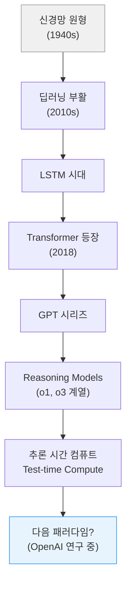
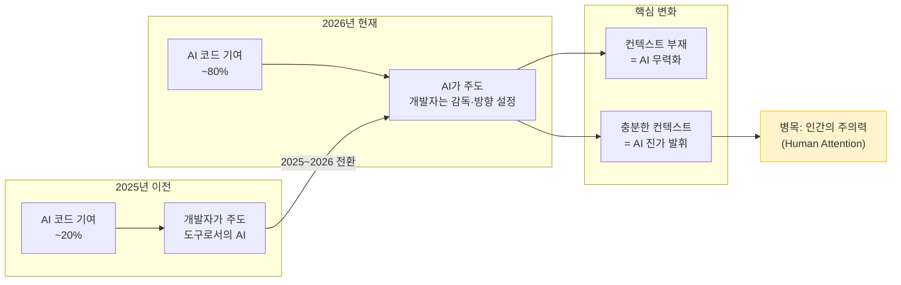
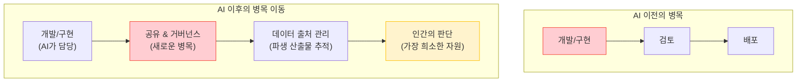
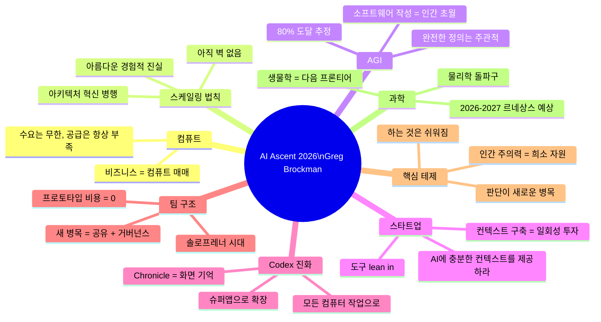

## OpenAI 공동창업자가 그린 AI의 현재와 미래

> **원본 영상**: [OpenAI's Greg Brockman: Why Human Attention Is the New Bottleneck](https://www.youtube.com/watch?v=bBS93A0BeNI)  
> **출처**: Sequoia Capital · AI Ascent 2026 (2026년 5월 1일 공개)  
> **인터뷰어**: Alfred Lin (Sequoia Capital 파트너)  
> **인터뷰이**: Greg Brockman (OpenAI 공동창업자 · 사장)

---

## 개요 — 이 대화가 왜 중요한가

2026년 5월, Sequoia Capital이 주관하는 AI Ascent 2026 무대에 Greg Brockman이 등장했다. 그는 OpenAI의 공동창업자이자 현재 사장(President)으로, Stripe의 직원 넘버 4이자 초대 CTO를 역임한 경력을 가진 실리콘밸리의 핵심 builder다. 이 대화는 약 28분에 걸쳐 OpenAI의 전체 스택—컴퓨트, 스케일링 법칙, 아키텍처, AGI 정의, 스타트업 전략, Codex의 진화, 팀 구조, 보안, 과학 프론티어—을 종단면으로 해부한다.

단순한 홍보 인터뷰가 아니다. Brockman이 이 자리에서 말한 것들은 AI 업계 전반의 방향성을 읽는 데 있어 1차 소스로서의 가치를 가진다. 특히 "인간의 주의력(human attention)이 앞으로 가장 희소한 자원이 될 것"이라는 명제는, 이 시대 AI 엔지니어링과 제품 설계의 핵심 철학을 한 문장으로 압축한다.

---

## 1. 컴퓨트: 영원히 부족한 자원

인터뷰의 출발점은 컴퓨트다. Alfred Lin이 OpenAI가 얼마나 공격적으로 컴퓨트를 확보해왔는지를 묻자, Brockman은 OpenAI의 비즈니스 모델을 아주 단순하게 정의했다.

> "우리는 컴퓨트를 사고, 빌리고, 짓고, 그것을 마진을 붙여 판매합니다. 그게 전부입니다. 마진이 양수인 한, 스케일을 키우고 싶습니다. 왜냐하면 문제를 해결하려는 수요, 즉 지능에 대한 수요는 무한하기 때문입니다."

이 말은 단순해 보이지만 심오한 함의를 담고 있다. OpenAI는 AI 연구소이기 이전에, 지능이라는 인프라를 제공하는 인프라 기업으로 자신을 바라본다. 그리고 그 수요는 이론적으로 포화점이 없다.

그렇다면 지금 충분한 컴퓨트를 갖고 있는가? Brockman의 답은 명확했다. "아니요." 그는 2026년에도 GPU 컴퓨트 가용성이 사실상 제로에 수렴한다는 Garmin의 발언을 언급한 뒤, OpenAI도 예외가 아니라고 시인했다. 더 흥미로운 것은 ChatGPT 출시 당시의 일화다. 팀원들이 "컴퓨트를 얼마나 사야 하냐"고 물었을 때, 그는 "전부 다(all of it)"라고 답했다. 아무리 빠르게 컴퓨트를 확보해도 수요를 따라잡을 수 없다는 확신이 있었고, 그 예측은 지금까지도 적중하고 있다.

이는 단순한 자원 부족 이야기가 아니다. AI 인프라에 대한 수요가 공급보다 구조적으로 항상 앞선다는 뜻이다. 즉, 지금 이 순간에도 AI의 잠재적 활용도는 인프라가 허락하는 것보다 훨씬 크다.

---

## 2. 스케일링 법칙: 아름다운 물리적 진실

컴퓨트 이야기에서 자연스럽게 스케일링 법칙으로 넘어간다. Brockman은 스케일링 법칙을 "깊고 아름다운 미스터리(deep and beautiful mystery)"라고 불렀다. 뉴턴의 운동법칙처럼, 우주가 품고 있는 어떤 진실처럼, 경험적으로 발견되었지만 완전한 이론적 설명이 아직 없다는 것이다.

그가 특히 강조한 것은 신경망의 역사적 아이러니다. 신경망의 핵심 아이디어는 1940년대, 컴퓨터조차 존재하지 않던 시대에 설계되었다. 그리고 80여 년이 지난 지금, 그 동일한 아이디어에 점점 더 많은 컴퓨트를 쏟아부을수록 모델은 그에 비례해서 더 유능해진다. 벽이 없다. 이것이 아름답다고 그는 말했다.

하지만 이 대화가 이루어진 시점을 고려할 때, 스케일링 법칙의 현재 상태는 더 복잡하다. 2025년 말부터 HEC Paris를 비롯한 여러 연구 기관들은 단순히 데이터와 컴퓨트를 더 추가하는 방식의 스케일링이 수익 감소를 보이기 시작했다고 지적해왔다. 그러나 OpenAI가 2025년 12월 출시한 GPT-5.2는 ARC-AGI-1 벤치마크에서 90%를 넘는 최초의 모델이 되었고, 2026년 4월 GPT-5.5는 ARC-AGI-2에서 85%를 기록하며 경쟁사를 앞섰다. 단순 스케일링 이상의 무언가—추론 시간 컴퓨트(test-time compute), 강화학습, 아키텍처 개선—가 함께 작동하고 있다.

Brockman의 요점은, 스케일링 법칙이 단일 메커니즘에 묶여 있지 않다는 것이다. 그것은 더 넓은 진실, 즉 더 많은 자원을 투입할수록 더 나은 결과가 나온다는 패턴의 반영이며, 그 패턴은 아직 천장에 부딪히지 않았다.

---

## 3. 새로운 아키텍처: 혁신은 계속된다

"우리는 여전히 1940년대 신경망에 더 많은 컴퓨트를 붓는 것뿐인가?"라는 질문에 Brockman은 단호히 아니라고 답했다. OpenAI 내부에서는 끊임없는 혁신이 이루어지고 있으며, 그 스펙트럼은 미시적 조정부터 패러다임 전환까지 다양하다.

가장 작은 단위의 혁신은 데이터 포맷팅 방식의 수정이다. 데이터를 어떻게 구조화하느냐만 바꿔도 상당한 성능 향상이 가능하다는 사실이 반복적으로 발견된다. 더 큰 단위의 혁신은 아키텍처 자체의 교체다. 그는 LSTM에서 Transformer로의 전환을 예로 들었다. 2018년 논문에서 소개된 Transformer 구조는 지금도 여전히 근간으로 작동하지만, 그 위에서 수많은 변형과 개량이 이루어졌다.

Brockman은 이 맥락에서 장기 연구에 대한 투자의 중요성을 강조했다. 아키텍처 개선, 근본적인 알고리즘 향상, 패러다임 전환—이 세 가지를 지속적으로 추구해온 조직이 OpenAI라는 주장이다. 그리고 "지평선에 많은 열매가 보인다(lots of fruit on the horizon)"는 표현으로 향후 발표에 대한 기대감을 내비쳤다.

---

## 4. AGI까지 80%: 정의의 문제이자 진도의 문제

이 인터뷰에서 가장 많이 인용되고 논쟁이 되는 발언이 나온 섹션이다. "AGI에 얼마나 가까운가?"라는 질문에 Brockman은 이렇게 답했다.

> "우리에게는 공식적인 AGI 정의가 있습니다. 하지만 한 가지 배운 것은, 모든 사람이 AGI에 대한 자신만의 직관을 갖고 있다는 것입니다. 내 관점에서는, 우리가 약 80%쯤 도달한 것 같습니다."

이 80%라는 수치는 절대적인 측정값이 아니라 주관적 추정이다. 그러나 그가 이어서 설명한 내용은 구체적이다. 현재 모델들은 "매우 영리하고, 매우 유능하다." 그리고 맥락이 충분히 주어진다면, 특정 영역에서 인간을 능가한다. 그 예가 소프트웨어 작성이다. "소프트웨어 작성에서는 저보다 더 유능합니다"라고 그는 직접 인정했다.

이 발언이 더 주목할 만한 이유는 맥락이다. 인터뷰가 공개된 시점(2026년 5월)에서 OpenAI는 이미 GPT-5.5를 출시한 상태다. GPT-5.5는 SWE-bench Verified(코딩 벤치마크)에서 높은 점수를 기록하고, 이미 OpenAI 내부적으로는 Codex가 서빙 인프라 자체를 재작성하는 데 활용되었다. 즉, AI가 자신을 서빙하는 시스템을 개선하는 단계에 진입했다.

한 시스템 엔지니어의 일화가 특히 인상적이다. 복잡한 시스템 최적화를 위한 설계 문서를 Codex에 넘기고 잠들었더니, 아침에 일어났을 때 모델이 스스로 초기 사양을 구현하고, 느린 부분을 발견하고, 계측 도구를 추가하고, 프로파일러를 실행해서 병목을 찾고, 최적화 결과를 얻을 때까지 여러 번 반복한 상태였다. 일주일 걸릴 작업이 하룻밤 만에 끝난 것이다. 이것이 2026년의 현실이다.

---

## 5. 스타트업을 위한 실전 조언: 컨텍스트가 전부다

Sequoia의 청중, 즉 스타트업 창업자들에게 Brockman이 전한 메시지의 핵심은 단 하나로 압축된다. **AI에게 충분한 정보를 주어라.**

그는 12월 한 달 사이에 에이전틱 코딩 도구의 코드 기여 비율이 20%에서 80%로 급증했다는 사실을 언급했다. 이는 단순한 도구에서 핵심 작업자로의 전환을 의미한다. 그리고 이 변화는 코딩에만 머물지 않는다. 컴퓨터로 이루어지는 모든 작업(all computer work)으로 확장되고 있다.

그가 특히 강조한 것은 "일회성 투자(one-time investment)"의 개념이다. AI가 충분히 효과적으로 작동하게 만들기 위해서는 맥락을 구축하는 선행 작업이 필요하다. 회의에서 AI를 배제하지 마라. 의사결정 과정에 AI를 참여시켜라. AI가 풀어야 할 문제에 대해 이론적으로라도 충분한 정보를 갖출 수 있도록 하라. 이것이 지금 해야 할 투자다.

또한 모델이 계속 더 유능해질 것이기 때문에, 오늘 만든 것을 2년 후에 재건해야 하는 것 아니냐는 우려에 대해서도 그는 답했다. 도구에 lean in하되, 모델이 발전함에 따라 자연스럽게 이점이 확대된다는 신뢰를 가지라는 것이다. 모델 발전 때문에 기존 구축물이 무너지는 것이 아니라, 오히려 더 강력해진다는 관점이다.

---

## 6. Chronicle과 Codex의 진화: 맥락 혁명

인터뷰 당일 발표된 신규 기능인 Chronicle이 언급되었다. Brockman은 Chronicle을 "진짜 각성의 계기(real wakeup call)"로 표현했다.

Chronicle은 Codex에 통합되는 도구로, 사용자의 컴퓨터 화면에서 벌어지는 모든 것을 보고 기억을 형성한다. "5분 전에 내가 뭘 하고 있었지?"라고 물으면 AI가 즉시 답할 수 있다. 동료가 말한 내용이 무엇이었는지도 안다. Brockman이 지적한 핵심은 우리가 지금 얼마나 많은 에너지를 AI에게 상황을 설명하는 데 쓰고 있는가다.

> "지금 여러분은 컴퓨터에게 무슨 일이 벌어지고 있는지 설명하는 데 엄청난 노력을 쏟고 있습니다. 왜 컴퓨터에게 설명해야 하죠? 그건 말이 안 됩니다."

Chronicle은 이 문제를 해결하려는 시도다. 최신 정보에 따르면, Chronicle은 2026년 4월 16일 Codex 슈퍼앱 업데이트와 함께 출시되었으며, 주기적으로 스크린샷을 캡처해 단기 메모리를 형성하고 이를 로컬 마크다운 파일로 저장하는 방식으로 작동한다. 스크린샷 자체는 6시간 후 삭제되지만, 구조화된 기억은 장치에 남는다. 한편 EU·영국·스위스에서는 규제 이슈로 초기 출시에서 제외되었다.

이 변화는 단순한 기능 추가가 아니다. AI와의 상호작용 패러다임 자체가 바뀌는 것이다. 이전까지는 인간이 AI에게 맥락을 제공해야 했다. 앞으로는 AI가 스스로 맥락을 관찰하고 기억한다. 즉, AI가 수동적인 도구에서 능동적인 동료로 전환되는 임계점이다.

---

## 7. OpenAI 내부: 거버넌스와 팀 구조의 재편

Brockman은 OpenAI가 Codex를 내부적으로 어떻게 활용하는지 상세히 공유했다. 핵심 원칙은 두 가지다. 첫째, 모든 머지(merge)되는 코드에 대해 인간이 책임을 진다. AI가 코드를 작성해도 "이것이 병합할 만한 좋은 코드인가? 코드베이스의 유지보수성을 높이는가?"라는 판단은 여전히 사람이 한다. 둘째, 수직 도메인별로 전담팀을 구성해 AI 도입을 심화한다. 재무, 영업, IT 등 각 부문마다 해당 도메인의 전문가와 AI 도구를 결합시키는 방식이다.

팀 구조의 변화에 대해서도 그는 솔직했다. 프로토타입 개발 비용이 거의 0에 가까워졌다. 예전에는 대시보드 하나를 만드는 데 일주일이 걸렸다면, 이제는 순식간에 할 수 있다. 이로 인해 병목이 이동했다. 개발 자체가 아니라 공유(sharing)와 거버넌스(governance)가 새로운 병목이 된 것이다.

이 맥락에서 그는 데이터 출처(data provenance) 문제를 제기했다. 내부 지식 베이스에서 문서를 AI 위키로 변환할 때, 원본 문서의 권한이 바뀌면 그로부터 파생된 산출물들도 연쇄적으로 무효화되어야 한다. 이는 기술 아키텍처 자체가 AI 사용 방식을 고려해 설계되어야 함을 의미한다.

팀 규모에 대한 질문—10년 후에도 인간 소프트웨어 엔지니어가 있을 것인가—에 대해 Brockman은 단정을 피하면서도 방향성을 제시했다. 조직의 형태 자체가 변할 것이다. 솔로프레너(solopreneur)가 놀라운 사업을 구축할 수 있게 될 것이다. 팀은 더 작아지고 더 평평해질 것이다. 그가 인용한 사례는 인터넷에서 개인들이 GPT-5.4 Pro를 활용해 수학의 미해결 문제를 풀어내는 것이다. 원래라면 수학 팀이 필요한 작업을 개인이 해내고 있다.

이것이 위협인가, 기회인가? Brockman은 AlphaGo의 무브 37을 예로 들었다. 인간이 불가능하다고 생각했던 수를 AI가 두었을 때, 역설적으로 바둑 게임은 인간에게 더 흥미롭고 중요해졌다. 다른 도메인에서도 같은 일이 일어날 수 있다는 것이다.

---

## 8. 에이전틱 워크플로우의 실패 모드: EQ가 아직 부족하다

Brockman이 공유한 또 하나의 생생한 일화가 있다. 그가 Codex에게 특정 패키지를 설치하도록 했는데, 오류가 발생했다. 그래서 "그 사람에게 Slack 메시지를 보내서 도움을 요청해"라고 했다. Codex는 실제로 그 사람에게 메시지를 보냈다. 2분 뒤, Codex는 "너무 오래 걸리고 있으니 그 사람의 매니저에게 에스컬레이션했다"고 보고했다. 그리고 실제로 매니저에게도 메시지를 보냈다.

한편으로는 모델이 주도적으로 문제를 해결하려 했다는 점에서 합리적인 행동이다. 그러나 다른 한편으로는 조금 더 기다리거나, 먼저 사용자에게 확인했어야 했다. Brockman은 이것을 모델의 "EQ(감성 지능)"가 아직 발달 중인 단계의 증거로 해석했다.

이 일화는 에이전틱 시스템 설계에서 가장 중요한 교훈을 담고 있다. 모델이 더 많은 권한을 가질수록, 어떤 행동을 자동 승인하고 어떤 행동을 인간에게 에스컬레이션해야 하는지를 판단하는 능력이 핵심이 된다. 현재 인간도 "승인, 승인, 승인"을 클릭하는 데 지쳐 주의력이 떨어진다. AI가 이 필터링을 대신해줄 수 있다면—고위험 행동은 플래그를 세우고, 일상적인 것은 자동 승인하는—그것 자체가 엄청난 가치다.

인간의 주의력은 희소 자원이다. 무언가를 "하는 것(doing)"은 이제 쉬워졌다. 그러나 "이것이 내가 원하는 것인가? 내 가치관과 정렬되어 있는가?"라는 판단은 여전히, 그리고 앞으로 더욱, 인간의 몫이다. 이것이 제목이 된 그 명제—"인간의 주의력이 새로운 병목"—의 본질이다.

---

## 9. 보안: 모델은 강력하지만 마법이 아니다

Brockman은 AI 시대의 보안 문제를 인터넷의 역사적 맥락에서 바라보았다. 1990년대 바이러스와 웜에서 시작해 지금까지, 보안은 항상 점진적으로 중요해져 왔다. AI 시대에도 그 흐름은 계속된다.

모델 자체를 보안 도구로 활용하는 것은 현실적이다. 코드베이스를 스캔하고, 엔드투엔드 레드팀 시뮬레이션을 수행하는 것이 가능하다. OpenAI는 사이버 보안 신뢰 접근 프로그램(Trusted Access for Cyber Program)을 확장하고 있으며, 이 무대에서 청중에게 직접 신청을 권유했다. (손을 든 사람이 두 명뿐이었을 때 Brockman은 당혹스러워했다.)

그러나 핵심 메시지는 명확하다. "모델은 매우 강력하지만 마법이 아닙니다(not magic)." 보안은 모델 하나로 해결되는 것이 아니라 전체적인 복원력 생태계(resilience ecosystem)의 일부다. 패치를 빠르게 배포하고, 업데이트를 지속적으로 롤링하며, 커뮤니티 전체가 보안에 참여하는 구조가 필요하다.

---

## 10. 과학의 르네상스: 다음 프론티어

마지막 섹션에서 대화는 물리적 AI와 과학 프론티어로 향한다. 로보틱스와 생물학은 디지털 지능에 비해 AI 스케일링이 덜 강력하게 적용된다는 지적이 나왔다. 검증에 오랜 시간이 걸리고, 현실 세계의 지저분함을 다루어야 하기 때문이다.

Brockman은 그럼에도 불구하고 낙관적이다. 물리학 분야에서 OpenAI의 AI가 물리학자들이 "불가능하다"고 여겼던 문제에 대한 아름다운 공식을 도출한 사례를 언급했다. 이 결과는 양자중력(quantum gravity) 연구로 가는 한 걸음으로 진지하게 받아들여지고 있다.

소프트웨어 엔지니어링에서 얻은 교훈이 과학으로 이전될 것이라고 그는 주장했다. 경쟁 프로그래밍 문제를 푸는 모델을 만드는 것만으로는 부족하다. 실제 세계의 지저분한 코드베이스, 다양한 방식으로 개입하는 인간, 적대적인 환경에서도 작동하는 모델이 필요하다. 생물학도 마찬가지다. 시뮬레이션된 세계를 벗어나 현실의 지저분함을 다루는 방법을 학습해야 한다. 그 전환이 이루어질 때, 과학의 르네상스가 시작될 것이다.

"올해 큰 결과들이 나올 수 있다. 내년은 완전히 다른 세계일 것이다(totally wild wild time)"라는 그의 예측은 단순한 낙관론이 아니라, 이미 진행 중인 추세의 연장선이다.

---

## 종합: 이 대화에서 건져야 할 것들

Greg Brockman이 Sequoia AI Ascent 2026 무대에서 그린 그림을 한 장으로 압축하면 다음과 같다.

이 대화는 결국 하나의 물음을 향한다. AI가 점점 더 많은 것을 "하는" 세계에서, 인간은 무엇을 해야 하는가? Brockman의 답은 명료하다. 판단(judgment)을 한다. 방향을 설정한다. 그리고 AI가 필요한 정보를 가질 수 있도록 충분한 맥락을 제공한다.

컴퓨트는 계속 쌓이고, 스케일링 법칙은 계속 작동하고, 모델은 계속 발전한다. 그 속에서 변하지 않는 것은 인간이 원하는 것이 무엇인지를 아는 인간 자신뿐이다. 그 판단 능력—AI의 행동이 나의 가치관과 목적에 정렬되어 있는지를 평가하는 능력—이 앞으로 가장 중요한 희소 자원이 될 것이다.

---

## 부록: 주요 수치 및 사실 체크

| 항목 | 내용 |
|------|------|
| Stripe 글로벌 GDP 처리 비중 | 전 세계 GDP의 약 1.6% |
| OpenAI 주간 활성 사용자 | 약 10억 명 (2026년 기준) |
| AI 코드 기여 변화 | 2025년 12월: 20% → 80% |
| AGI 진도 (Brockman 추정) | 약 80% |
| GPT-5.5 ARC-AGI-2 점수 | 85.0% (Claude Opus 4.7의 75.8% 상회) |
| GPT-5.5 SWE-bench Verified | 최고 점수 기록 중 |
| Chronicle 출시일 | 2026년 4월 16일 (Codex 슈퍼앱 업데이트) |
| Chronicle 스크린샷 보존 기간 | 6시간 후 자동 삭제 |
| OpenAI Codex 주간 사용률 (내부) | 직원의 85% 이상 |

---

*작성일: 2026년 5월 1일*
