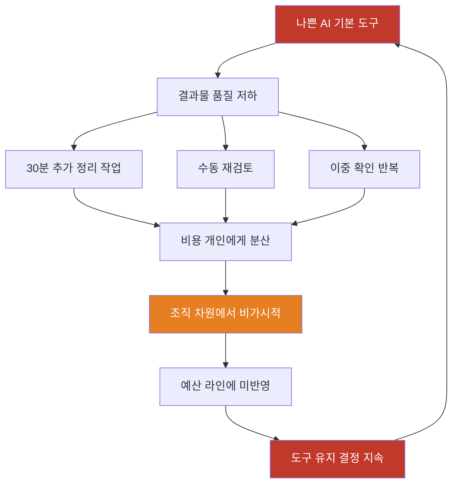
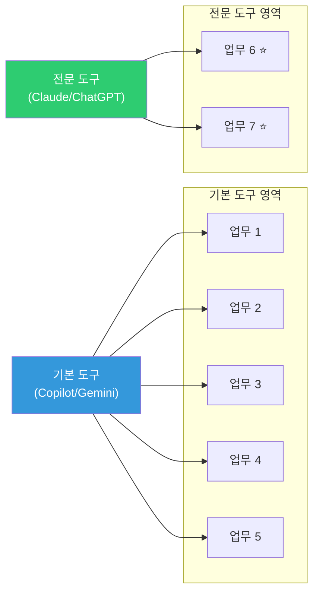
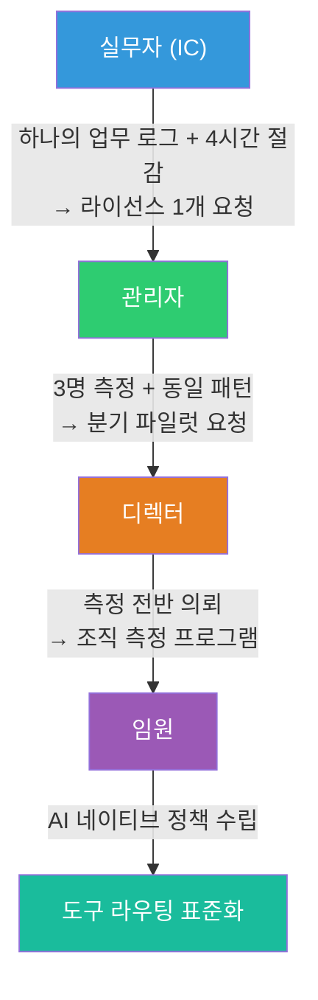
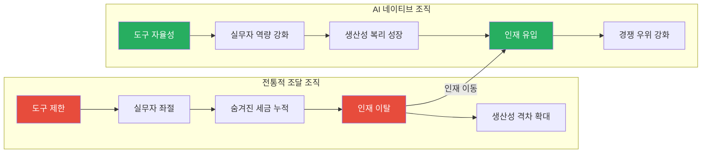

> **원본 영상:** "Microsoft Is Testing Claude Against Its Own Copilot. Here's Why."  
> **채널:** AI News & Strategy Daily | Nate B Jones  
> **게시일:** 2026년 4월 30일  
> **링크:** https://www.youtube.com/watch?v=JvCtGjrn_N0

---

## 개요: 이 영상이 등장한 배경

2026년 4월, AI 전략 채널 **Nate B Jones**에 게재된 이 영상은 단순한 도구 리뷰가 아니다. 제목이 암시하듯 "Microsoft Is Testing Claude Against Its Own Copilot"이라는 실화에서 출발하지만, 영상의 핵심 메시지는 훨씬 더 보편적이고 실용적인 문제를 다룬다. 그 문제란 바로 이것이다. **조직이 공식 승인한 AI 도구가 실제 업무를 수행하지 못할 때, 현장의 실무자는 어떻게 더 나은 도구를 확보할 수 있는가?**

이 영상이 등장한 배경을 이해하려면 먼저 2026년 초에 실제로 벌어진 Microsoft의 결정을 알아야 한다. Microsoft는 자사의 Microsoft 365 Copilot 안에 경쟁사인 Anthropic의 Claude를 실질적으로 통합하기 시작했다. GeekWire의 보도에 따르면, Microsoft는 2026년 3월 "Critique"라는 새로운 기능을 발표했는데, 이 기능은 Copilot의 Researcher 에이전트 안에서 GPT가 초안을 작성하면 Claude가 그 내용의 정확성과 완결성, 인용 품질을 검토하는 방식으로 작동한다. 즉, 두 라이벌 AI 모델이 순차적으로 협력하는 구조다. 더 나아가 Microsoft는 Anthropic를 Microsoft Online Services의 공식 하위 데이터 처리자(sub-processor)로 지정했으며, 이에 따라 기업 관리자들이 Copilot의 에이전트 모드에서 GPT 대신 Claude Sonnet 4 또는 Opus 4 모델을 직접 선택할 수 있도록 허용했다. 이 결정 자체가 이미 하나의 메시지다. Microsoft조차도 단일 AI 모델로 모든 업무를 처리할 수 없다는 사실을 인정한 것이다.

이런 맥락 속에서 Nate B Jones는 그 아래 계층, 즉 조직 내 실무자들이 매일 겪는 훨씬 더 실제적인 딜레마를 파고든다. 영상의 구조는 전략적으로 치밀하게 설계되어 있으며, 총 열 개의 챕터에 걸쳐 문제 진단부터 현실적인 해결책까지를 단계적으로 제시한다.

---

## 1장. 공식 도구는 실제 업무를 처리하지 못한다

영상은 도발적인 전제에서 시작한다. 이사회와 경영진은 AI로부터 열 배의 성과를 원하지만, 조직이 공식 승인한 유일한 도구는 그 수준의 성과를 낼 능력이 없다. 현장의 실무자들은 이 사실을 알고 있다. 팀원들도 안다. 심지어 상위 관리자들 중 일부도 알고 있다. 그러나 거의 아무도 이것을 공개적으로 말하지 않는다.

그 이유는 단순하다. 일단 공식 도구가 부족하다고 말하는 순간, 그 사람은 문제를 해결하려는 사람처럼 보이지 않고 오히려 문제 자체가 되어버린다. "섀도 IT를 만들려 한다", "예외를 요청하는 까다로운 사람"이라는 낙인이 찍히는 것이다.

이 모든 상황의 근저에는 하나의 잘못된 전제가 자리한다. **AI 도구들은 기본적으로 서로 교환 가능하다는 믿음.** 그러나 Nate는 이 전제를 정면으로 부수며 이렇게 말한다. 기업용 기본 도구와 전문 특화 도구가 모두 'AI 도구'라는 범주에 속한다고 해서 같은 것이 아니다. 스프레드시트와 데이터 웨어하우스가 모두 '숫자가 있는 곳'이라고 해서 같은 것이 아닌 것처럼. 도구들 사이의 차이는 업무의 현장에서만 드러나며, 우리는 아직 그 차이를 조직이 이해할 수 있는 언어로 설명하는 데 익숙하지 않다.

---

## 2장. 왜 당신의 주장이 '선호도'로 들리는가

실무자의 호소가 왜 번번이 외면당하는지를 이해하는 것이 전략적 전환의 첫 걸음이다. 조직의 상위에서 볼 때, AI 도구 선택은 이미 끝난 결정이다. 코파일럿이든 제미나이든, 벤더 통합, 볼륨 할인, 컴플라이언스 검토, 이미 완료된 통합 작업 등 현실적인 이유들이 있었다. 현장 실무자가 "이 도구는 별로야"라고 말할 때, 경영진은 그것을 증거가 아니라 취향으로 해석한다.

위에서 보면 채팅 박스, 모델, 엔터프라이즈 플랜, 보안 검토 – 이 정도면 충분히 유사해 보인다. 도구의 차이는 실제 작업의 맥락 속에서만, 즉 검색이 올바른 결과를 찾아내는지, 복잡한 데이터에서도 추론이 제대로 작동하는지, 결과물을 한 시간씩 다듬지 않아도 바로 사용할 수 있는지를 직접 경험해야만 보인다.

더 심각한 문제는 균질화의 욕구 자체가 비이성적이지 않다는 점이다. 모든 팀이 각자 원하는 도구를 쓰도록 허용하면 기술 스택은 파편화되고, 보안 검토는 불가능해지며, 조직 자체가 비일관성으로 무너진다. 조직이 이 논리를 모르는 게 아니다. 그것을 알면서도 변화를 주저하는 것이다. 따라서 실무자가 해야 할 일은 이 논리를 뒤집는 것이 아니라, 조직이 반응할 수 있는 언어로 문제를 재프레임하는 것이다.

---

## 3장. 나쁜 AI 기본 도구의 숨겨진 세금

영상에서 가장 강력한 통찰 중 하나는 "숨겨진 세금(hidden tax)"이라는 개념이다. 나쁜 AI 기본 도구의 비용은 절대 항목별 예산 라인에 나타나지 않는다. 그것은 30분짜리 추가 작업, 5분짜리 수정, 이중 확인, 그리고 AI가 그럴듯하지만 쓸 수 없는 결과물을 제시했을 때 느끼는 내적인 찌증 속에 분산되어 존재한다.

보고서가 완성되는 데 더 오래 걸려도 아무도 모른다. 분석 결과가 얕아서 본인이 다시 써도 아무도 모른다. 코드 리뷰가 중요한 오류를 놓쳐서 수동으로 재확인해도 아무도 모른다. 이 비용은 개인들에게 분산되어 있기 때문에, 조직 차원에서는 전혀 보이지 않는다. 구매부서는 절대 이 비용을 볼 수 없다. 관리자도 못 볼 가능성이 높다.

따라서 첫 번째 행동은 에스컬레이션이 아니다. **측정이다.**

같은 작업을 기본 도구와 전문 특화 도구에 동시에 투입하는 순간, 기본 도구는 더 이상 보이지 않는 존재가 아니게 된다. 동일한 입력이 두 도구에 들어가고, 하나의 도구가 즉시 사용 가능한 결과물을 내놓을 때, 그 대화는 더 이상 취향의 문제가 아니라 성능의 문제가 된다. 조직은 당신의 취향은 무시할 수 있지만, 성능의 격차는 최소한 인정해야만 한다.

이 대목에서 영상은 실제 사례를 언급한다. 구글의 주임 엔지니어 **Janna Dogen**은 2026년 1월, 팀이 1년에 걸쳐 구축한 분산 에이전트 오케스트레이터 문제를 Claude에 설명했더니 약 한 시간 만에 근사한 프로토타입이 나왔다는 경험을 소셜 미디어에 게시했고, 이 게시물은 약 900만 회의 조회수를 기록했다. 물론 이것이 Claude가 Google의 프로덕션 시스템을 한 시간 만에 대체했다는 의미는 아니다. 문제를 이미 깊이 이해한 전문가가 압축된 설명을 제공한 상황에서 나온 프로토타입이었다. 그러나 바로 그것이 핵심이다. 업무를 아는 사람이 두 도구에 동일한 작업을 부여했을 때 차이는 즉시 드러난다는 것.

---

## 4장. 기본 도구를 공격하지 않고 프레임 재설정하기

여기서 대부분의 사람들이 실수를 저지른다. 기본 도구를 갈아치우자는 주장은 거의 항상 패배한다. 조직이 그 도구를 선택한 데는 나름의 합리적인 이유가 있었고, 그 결정을 틀렸다고 인정하게 만드는 요청은 정치적으로 수용되기 어렵다.

Nate가 제안하는 올바른 접근은 더 작고 날카로운 질문을 하는 것이다.

> **"우리가 기본 도구를 사용하기로 한 결정 안에서, 어떤 특정 업무 유형에서 기본 도구가 전문 도구보다 현저히 뒤처지는가?"**

이 질문은 조직의 기존 결정을 건드리지 않는다. 기술 스택을 위협하지 않는다. 그리고 누구나 전면적인 방향 전환 없이 "예"라고 말할 수 있는 여지를 남긴다.

그 다음 질문은 이렇다.

> **"그 특정 업무 유형에만 전문 도구를 추가하는 비용은 얼마인가?"**

이제 대화의 구조가 완전히 달라진다. Claude 대 Copilot이 아니라, "이 업무가 기본 도구에서는 주당 X시간이 들지만 전문 도구는 그 시간 대부분을 되찾아 준다. 증명할 수 있다"는 논의가 된다.

팀이 7가지 업무를 한다면, 기본 도구가 5개를 처리할 수 있다면 그 5개는 그대로 두면 된다. 나머지 2개에만 전문 도구를 추가하는 것이다. 이것은 표준화의 위반이 아니라, **더 나은 표준화 정책**이다.

---

## 5장. 하나의 업무를 선택하고 측정하라

여기서 영상은 구체적인 실행 지침으로 전환된다. 세 가지 업무도, 전체 워크플로도 아니다. **단 하나의 업무**를 선택해야 한다.

그 업무는 네 가지 기준을 충족해야 한다.

첫째, 최소 주 1회 이상 반복적으로 발생하는 업무여야 한다. 그래야 한 주 안에 충분한 데이터 포인트를 확보할 수 있다. 둘째, 최소 30분 이상 소요되는 업무여야 한다. 그래야 도구 간 시간 차이가 의미 있는 수준으로 드러난다. 셋째, 그 업무를 오랫동안 직접 해온 사람이라 좋은 결과물을 즉시 알아볼 수 있어야 한다. 평가 기준이 내재화되어 있어야 한다는 뜻이다. 넷째, 그 결과물이 실제 청중에게 전달되어야 한다. 팀 채널이든, 고객이든, 관리자든, 누군가가 그 결과물을 본다면 품질이 외부 기준점을 갖게 된다.

이 네 번째 기준이 특히 중요하다. 결과물이 아무도 보지 않는 개인 작업이라면 조직은 이를 개인적인 워크플로 선호도로 치부할 수 있다. 그러나 결과물이 실제 청중에게 전달된다면, 품질은 측정 가능한 현실이 된다.

흥미롭게도, 대부분의 경우 이 조건들을 모두 충족하는 업무는 자신이 가장 불만족스러워하는 바로 그 업무다. 그 좌절감 자체가 신호다.

동일한 입력 데이터를 기본 도구와 도전자 도구에 투입하고, 다음 네 가지를 기록한다. 소요 시간, 재작업 필요량, 품질 점수, 그리고 그 결과물을 실제로 전송했는지 여부. 대시보드가 필요 없다. 복잡한 생산성 연구도 필요 없다. 일주일 말에 5~15개의 데이터 행이 생긴다. 이것이 원래 도구 선정 의사결정 과정에서 생산된 어떤 증거보다도 더 실질적인 데이터다. 벤더 데모는 당신의 업무를 측정하지 않았다. RFP 평가도 당신의 업무를 측정하지 않았다. **당신이 비즈니스에 누락된 데이터를 생산하는 것이다.**

---

## 6장. 성공 기준을 실제적으로 만드는 법

측정에서 가장 많은 사람들이 실패하는 지점은 바로 성공 기준을 잘못 설정하는 것이다. 벤더가 측정하는 것이 아니라 팀이 실제로 중요하게 여기는 것을 측정해야 한다.

주간 고객 다이제스트 업무라면, 성공 기준은 출력 길이가 아니다. 토큰당 비용도 아니다. 포맷이 보기 좋은지도 아니다. 진짜 질문은 단 하나다. "슬랙에서 30분 동안 스크롤하며 직접 해야 했던 일을 이 도구가 대신해주었는가?"

코드 리뷰라면, 질문은 에이전트가 몇 개의 코멘트를 남겼는지가 아니다. "에이전트의 리뷰만으로 이 PR을 머지할 수 있겠는가?"다.

파이프라인 관리라면, 요약이 영업 운영 언어처럼 들리는지가 아니다. "다음 단계가 없는 딜, 두 번 이상 밀린 마감일, 수익 팀이 실제로 봐야 할 리스크를 올바르게 식별했는가?"다.

질문은 항상 동일하다. **에이전트가 내가 원래 하려던 일을 대신할 수 있을 만큼 충분히 잘 했는가?** 그 대답을 할 수 있는 사람은 해당 업무를 깊이 아는 실무자뿐이다. 결과물이 진짜인지 가짜인지를 알 수 있는 사람. 이것이 실무자가 가진 측정의 강점이다.

---

## 7장. Sales Ops 사례: 90분 대 15분

영상은 이 원리를 구체적인 시나리오로 보여준다.

Copilot을 기본 도구로 사용하는 회사의 영업 운영 리드가 있다. 그녀는 매주 월요일 아침 파이프라인 위생 보고서를 작성한다. 다음 단계가 없는 딜, 두 번 이상 밀린 마감일, 리스크 요약, 수익 리더십 슬랙 채널용 브리프. 기본 도구로는 이 보고서를 전송할 수 있는 수준으로 만드는 데 약 90분이 걸린다. 모델이 문장은 잘 쓰지만 딜 이력 구조를 제대로 처리하지 못하고, 잘못된 슬립 날짜를 계속 제시하기 때문이다.

그녀는 동일한 소스에 연결된 전문 에이전트로 몇 주간 같은 업무를 실행해 본다. 첫째 주, 전문 도구의 초안은 약 20분의 수정이 필요했다. 둘째 주, 10분으로 줄었다. 도구와 협업하는 방식에 점점 익숙해졌기 때문이다. Copilot은 여전히 평균 90분, 품질 점수 5점 만점에 2~3점. 전문 도구는 평균 15분, 품질 점수 4~5점. "전송할 수 있겠는가" 열의 답변이 대부분의 실행에서 "아니오"에서 "예"로 바뀌었다.

이제 그녀는 이런 업무가 조직 전체에 얼마나 많이 분포되어 있는지 확인하고, 그것을 곱하여 요청을 제출하면 된다. 이것이 증거 기반으로 이길 수 있는 주장의 형태다.

```mermaid
xychart-beta
    title "기본 도구 vs 전문 도구 비교 (Sales Ops 사례)"
    x-axis ["소요 시간(분)", "품질 점수(/5)", "전송 가능 여부(%)"]
    y-axis "수치" 0 --> 100
    bar [90, 50, 30]
    bar [15, 80, 90]
```

---

## 8장. 조직 전체로 확장하는 법

개인 데이터를 조직 차원의 논거로 전환하는 것이 핵심 단계다. 이를 위해서는 유사한 업무를 수행하는 동료들과 대화해야 한다. 그들의 경험이 자신의 데이터와 일치하는지 확인해야 한다.

조직에서 6명과 대화하여 60명 샘플의 패턴을 파악한다면, IT 부서에 제출할 때 이렇게 말할 수 있다. "이것은 제 의견이 아닙니다. 직접 데이터를 수집했습니다. 6명을 인터뷰했고, 이것은 조직 내 60명의 표본입니다. 모두 같은 패턴을 보입니다. 따라서 전체적으로 연간 X시간, 또는 X명의 공학적 인력이 낭비되고 있습니다." 이 순간부터 대화는 진지해진다.

한 가지 업무 유형에 대한 증거가 있다면 그 업무 유형에 대해서만 요청한다. 하나의 라이선스를 지원할 증거가 있다면 하나의 라이선스를 요청한다. 증거에 맞게 요청 범위를 조정하는 것이 핵심이다. 측정을 사용하여 불만을 쏟아내지 말고, 구체적인 요청을 하는 데 사용해야 한다.

---

## 9장. 요청의 고도: 관리자에서 임원까지

동일한 증거도 듣는 사람에 따라 다른 언어로 번역되어야 한다.

**실무자 → 관리자 레벨**에서는 작고 직접적인 요청이 통한다. "저는 주간 고객 다이제스트를 기본 도구와 Claude로 각각 실행해 보았습니다. 로그가 여기 있습니다. Claude가 저에게 4시간을 돌려주었습니다. 이 용도로만 사용할 승인된 라이선스를 받을 수 있을까요?" 많은 관리자들이 이에 응답한다. "아니오"라는 대답이 나온다면, 그것은 조달, 보안 검토, 팀 선례, 예산 타이밍 등 구체적인 이유가 함께 따라온다. 구체적인 "아니오"는 그냥 다음에 해결해야 할 문제를 알려주는 것일 뿐이다.

**관리자 → 디렉터 레벨**에서는 파일럿 요청이 적절하다. "3명이 이 측정을 실행했고, 둘 다 같은 패턴을 보였습니다. 해당 업무 유형에 대해 한 분기 동안 전문 도구를 파일럿으로 사용하고 결과를 보고하고 싶습니다."

**디렉터 → 임원 레벨**에서는 더 이상 도구를 요청하는 게 아니다. 조직에 측정을 의뢰하는 것이다. 핵심 질문은 이렇다. "우리의 AI 기본 도구가 우리에게 비용을 초래하고 있다는 것을 어떻게 알 수 있을까요?" 그 솔직한 대답은 "최고의 인재들이 더 나은 도구를 제공하는 회사로 조용히 떠날 때만 알게 됩니다"이다.

---

## 10장. 네 가지 반론에 대한 대응

조직에서 도구 변경을 요청할 때 거의 반드시 마주치게 되는 네 가지 반론과 그 대응법이다.

**반론 1: "우리는 이미 그 도구 비용을 지불했습니다."**

라이선스 비용은 매몰 비용이다. 질문은 특정 업무에 대한 전문 라이선스의 추가 비용이 되찾아오는 시간보다 비싼지 여부다. 사람당 주 4시간이라면 그것을 곱해서 비용 효과를 계산할 수 있다.

**반론 2: "그것은 섀도 IT입니다."**

섀도 IT는 공개 없이, 검토 없이 도구를 채택하는 것이다. 지금 하는 것은 정반대다. 회사에 이 문제를 공개하고 함께 더 잘 해결하자고 요청하는 것이다.

**반론 3: "우리는 표준화가 필요합니다."**

표준화의 가치를 인정할 수 있다. 그러나 AI 시대에 하나의 도구로 모든 업무를 처리하는 것이 표준화의 유일한 형태라고 보는 것은 실수다. 이미 조직들은 다른 범주에서 이것을 알고 있다. Excel, Tableau, Looker를 각각 다른 분석 업무에 사용한다. 에이전트 레이어도 마찬가지다. 기본 도구가 이기는 곳에서는 기본 도구를 표준화하되, 업무가 요구하는 곳에서는 전문 도구를 사용하고 그 경계를 측정해라.

**반론 4: "우리는 또 다른 벤더를 승인하지 않을 것입니다."**

이것이 진짜 반론인지 반사적인 반응인지 확인해야 한다. 실제 장벽이 무엇인지 물어봐야 한다. 데이터 거주 문제인가? 관리 통제 문제인가? 계약 최소 금액 문제인가? 정말 "그냥 안 된다"가 답이라면, 그 조직에는 아마도 인재 유지 문제가 생길 것이다. 데이터를 계속 제시하는 것 외에 다른 방법이 없다.

---

## AI 네이티브 기업은 이 문제가 없다

영상의 후반부에서 Nate는 중요한 구분을 제시한다. 진정한 AI 네이티브 기업에서는 이 논쟁 자체가 필요 없다. 그런 기업은 기본 입장이 "예, 도구를 사용하세요. 생산적이길 원합니다. 당신 앞에 장벽을 세우지 않겠습니다"이기 때문이다. 그들이 세우는 유일한 관문은 데이터 책임과 컴플라이언스다. 그리고 그런 기업에서는 많은 경우 개인 실무자에게도 필요한 도구를 확보할 예산이 주어진다.

현재 전통적인 조달 관행으로 운영되는 조직은 전체의 80% 이상이다. AI는 본질적으로 이 조달 프로세스를 파괴하고 있으며, 기존 방식은 더 이상 작동하지 않는다. 조달 프로세스를 완전히 뒤엎으려는 것이 아니라, 조직이 실제로 소화하고 수용할 수 있는 방식으로 그 과정에 균열을 만드는 것이 목표다.

---

## 인재는 좋은 도구가 있는 곳으로 모인다

영상의 마지막 챕터는 거시적인 트렌드를 조망한다. 2026년의 주요 테마 중 하나는 인재의 집중이다. AI 네이티브 도구 환경이 탁월한 기업으로 인재가 모여들고 있다. 도구 문제를 단순한 조달 문제로만 보지 말아야 한다. 이것은 인재 유지 문제다.

도구 문제를 해결하지 못하고 돌파구를 찾지 못한다면, AI 혁명의 한가운데서 나선형으로 침체하는 상황이 된다. 반면 해결책을 찾고도 돌파구가 막힌다면, 더 허용적인 AI 도구 환경을 가진 기업으로 이동하는 것이 선택지가 된다. 그리고 그것은 떠나는 사람의 손실이 아니라, **도구를 허용하지 못한 조직의 손실**이다.

---

## 실제 맥락: Microsoft는 왜 Claude를 테스트했는가

영상의 제목인 "Microsoft Is Testing Claude Against Its Own Copilot"은 이 모든 논의를 실제 뉴스와 연결하는 핵심 고리다. Microsoft가 자사 제품 안에서 경쟁사 모델을 공식 채택한 것은, 대규모 조직 차원에서 영상의 핵심 테제를 스스로 실증한 사례다.

"Critique" 기능의 작동 방식은 단순하다. Copilot의 Researcher 에이전트가 리서치 쿼리를 받으면 GPT가 먼저 응답 초안을 작성하고, 그 다음 Claude가 정확성, 완결성, 인용 품질을 검토한 후 최종 사용자에게 응답이 전달된다. Microsoft에 따르면 이 멀티 모델 접근법은 심층 리서치 품질의 업계 기준인 DRACO 벤치마크에서 13.8% 향상을 가져왔으며, OpenAI, Google, Perplexity, Anthropic의 독립형 딥리서치 도구들을 앞섰다.

이 결정이 갖는 상징적 의미는 크다. Microsoft는 자사의 기본 AI 모델이 모든 업무에서 최선이 아닐 수 있다는 것을 공개적으로 인정했다. 그들은 기본 도구와 전문 도구를 라우팅하는 전략을 채택했다. 그것이 바로 이 영상 전체가 실무자들에게 말하는 내용이다. 단지 그것을 이제 Microsoft가 자사 플랫폼 수준에서 구현하고 있는 것이다.

더불어 Anthropic는 Microsoft Online Services의 공식 하위 데이터 처리자로 지정되었으며, 기업 관리자들은 Copilot의 에이전트 모드에서 GPT 대신 Claude Sonnet 4 또는 Opus 4를 선택할 수 있는 모델 전환기를 사용할 수 있게 되었다. 이것은 단순한 파트너십이 아니라, **도구의 상호교환 가능성이라는 오래된 가정을 최대 벤더 중 하나가 스스로 폐기했다**는 선언이다.

---

## 핵심 요약: 이번 주에 할 일

영상 전체의 메시지를 하나의 실행 계획으로 압축하면 다음과 같다.

하나의 업무를 선택한다. 철학적으로 가장 좋은 포인트를 만드는 업무가 아니라, 측정하기 쉽고, 반복적이며, 직접 판단할 수 있고, 결과물이 실제로 누군가에게 전달되는 업무를 선택한다. 기본 도구와 도전자 도구로 각각 실행하고 측정한다. 데이터가 지지하는 것만 요청한다. 그리고 톤은 데이터에 집중한다. 분노는 이해할 수 있지만, 데이터가 그 어떤 감정보다 훨씬 더 잘 통한다.

에이전트 레이어는 계속해서 파편화될 것이다. 코드 리뷰에 최선인 도구가 탐색적 코딩이나 고객 리서치나 법률 검토나 영업 운영이나 제품 전략에 최선이 아닐 수 있다. 실제 업무를 실제 도구에 대해 측정하는 법을 배우는 기업이 환경이 변화할 때 더 잘 라우팅할 것이다. 그렇게 하지 못하는 기업들은 2년 전에 맺은 벤더 계약을 기본으로 삼고, 그것을 원칙이라고 부르겠지만 실제로는 그냥 관성이다.

이미 그 차이를 느끼는 사람들은 현장에 있는 실무자들이다. 이미 그것을 느끼고 있다. 정리 작업에서, 두 번째 검토에서, 하루에 15분씩 돌려주는 전문 도구에서. 이제 남은 질문은 그 좌절을 데이터로 전환하고, 그 데이터를 올바른 도구를 확보하는 논거로 만드는 방법이다.

---

*작성일: 2026년 5월 1일*
