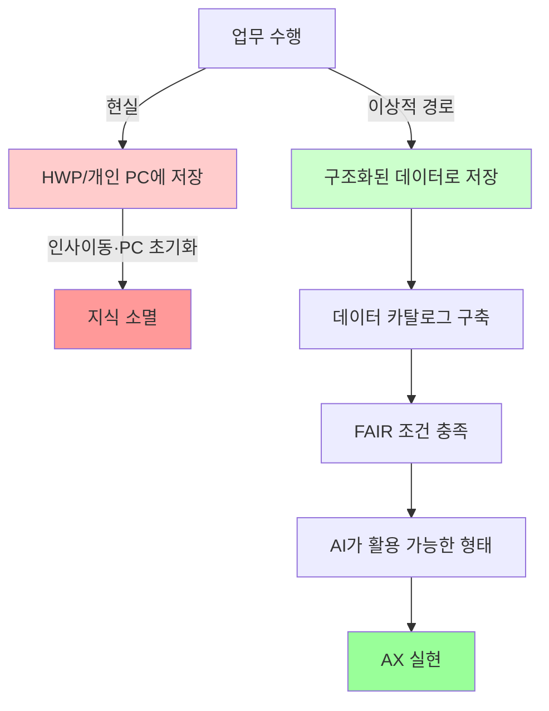
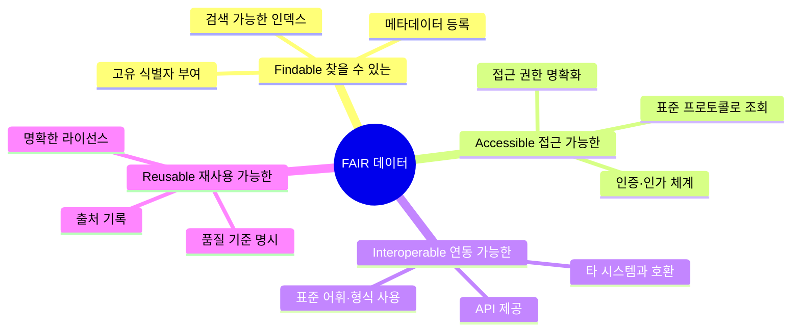
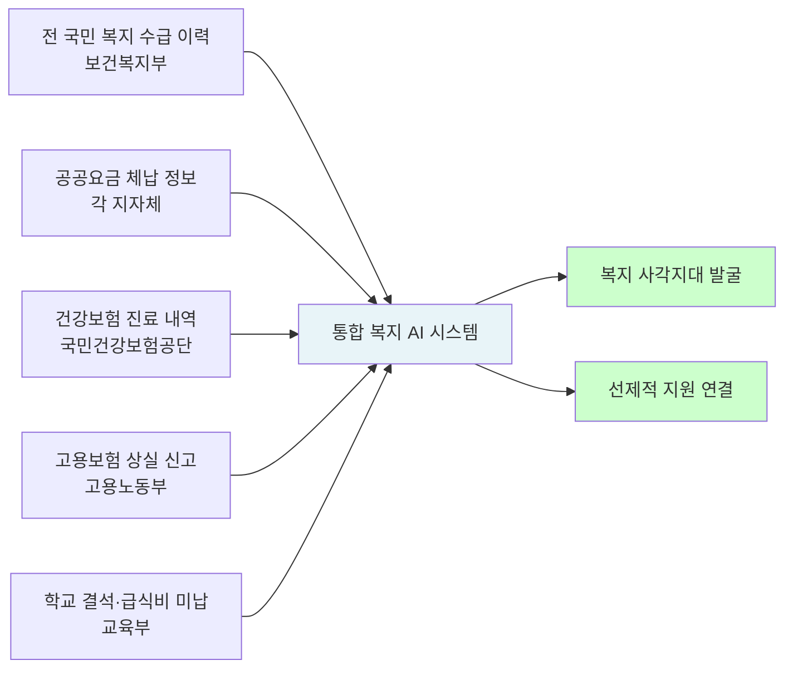
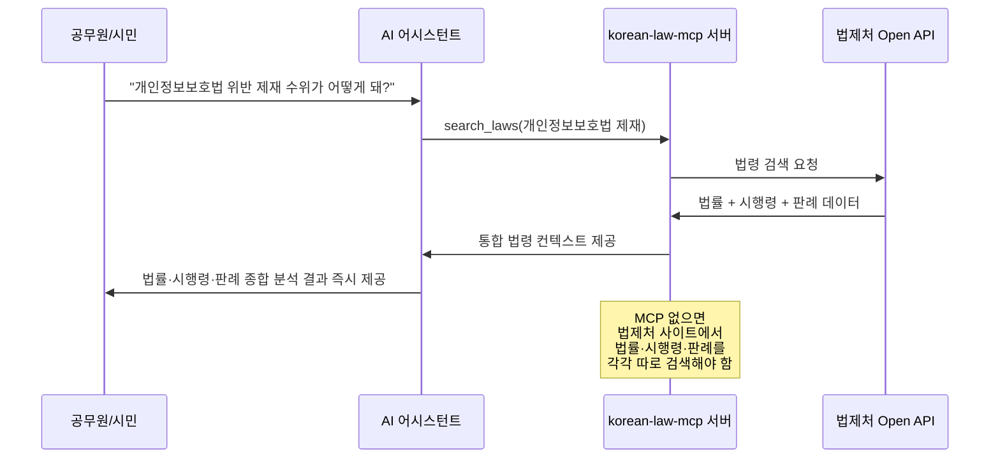
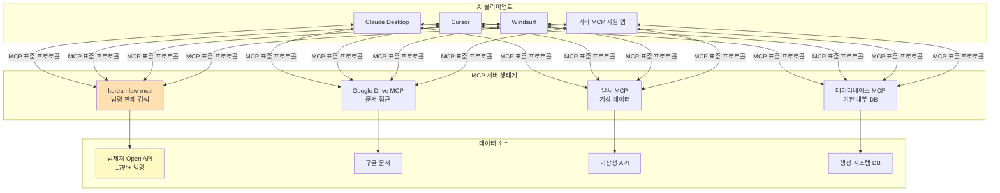
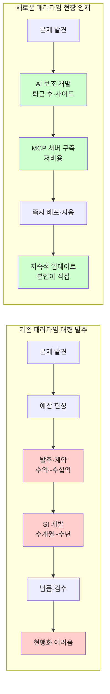
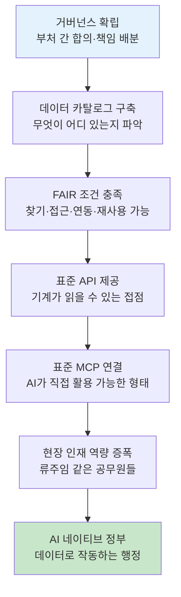

## 데이터 인프라 없는 AI 전환의 구조적 모순과 현장 인재의 가능성

---

## 들어가며: 두 개의 목소리

2026년 4월 말, 서울 르 메르디앙 명동에서 열린 '사회보장 AX 미래 전략 심포지엄'에서 박태웅 국가AI전략위원회 공공AX분과장(녹서포럼 의장)이 한국 공공 AI 전환의 구조적 문제를 정면으로 비판했다. 그의 발언은 짧지만 날카로웠다. "정부 AX의 99%는 순서가 틀렸다." 

같은 날 소셜미디어에서는 이 강연장 분위기를 전하는 게시글과 함께, 비슷한 취지의 현장 목소리가 울려 퍼졌다. "DX도 제대로 안 돼 있는데 AX를 논할 수 있겠냐"는 탄식이었다. 담당자 한 명 한 명이 열심히 고민해서 쓴 보고서가 모두 각자의 PC 안에 잠들어 있고, 인사이동 한 번에 PC가 밀리면 그 지식은 사라진다는 것이다.

두 목소리는 같은 문제를 가리키고 있다. AI 전환을 이야기하기 이전에, 행정 지식이 데이터로서 살아 숨 쉬도록 만드는 기초 작업이 선행되어야 한다는 것이다. 그리고 역설적이게도, 그 해법의 단서가 코딩 한 줄 못 하던 문과 출신 공무원 한 명에게서 나왔다.

---

## 1. DX에서 AX로 — 건너뛴 계단

디지털 전환(DX, Digital Transformation)과 AI 전환(AX, AI Transformation)은 종종 같은 맥락에서 묶여 언급되지만, 성격이 근본적으로 다르다. DX가 업무 프로세스를 디지털 매체 위에 올리는 작업이라면, AX는 그 디지털화된 데이터를 AI가 소화하고 판단할 수 있는 형태로 재구성하는 작업이다. 즉, DX는 AX의 선결 조건이다.

그런데 한국 공공 부문의 현실은 그 순서가 뒤집혀 있다. 많은 기관이 이미 AI 도입 예산을 편성하고, AI 챗봇을 민원 창구에 붙이고, AI 기반 의사결정 시스템을 발주하고 있다. 그러나 그 AI가 먹어야 할 데이터는 여전히 아래아한글(HWP) 파일 형태로 개인 PC 폴더 안에 봉인되어 있다.

박 분과장은 이 문제를 선명하게 지적했다. 정부 웹사이트와 내부 시스템 대부분에 로그조차 붙어 있지 않다는 것이다. 로그가 없으면 어떤 메뉴가 얼마나 사용되는지, 사용자가 목적을 달성했는지 포기했는지조차 알 수 없다. 데이터 없이 시스템을 개편하면 결국 담당자 취향이나 상급자 지시로 결정될 수밖에 없다. AI의 판단력은 데이터의 질과 양에 의존하는데, 데이터 기반이 없는 시스템 위에 AI를 올리는 것은 모래 위에 탑을 쌓는 것과 다르지 않다.

---

## 2. HWP 5년의 역설 — 열심히 일했지만 데이터는 없다

"아래아한글 파일로 5년간 열심히 일했다면 데이터는 한 장도 없는 셈이다." 박 분과장의 이 발언은 단순한 수사가 아니다. 구조적 현실을 정확하게 짚는 진단이다.

한국 공공 행정의 표준 문서 도구는 오랫동안 HWP(아래아한글)였다. 이 포맷은 사람이 읽기에는 훌륭하지만, AI가 처리하기에는 불친절하다. 더 근본적인 문제는 저장 구조다. 보고서는 개인 담당자의 로컬 드라이브에 저장되고, 공유 서버가 있더라도 체계적인 분류 없이 폴더 구조로만 관리된다. 전자결재 시스템을 통과한 문서는 결재 기록으로는 남지만, 그 내용이 검색 가능한 데이터로 정제되지는 않는다.

결과적으로 공공 행정에서 생산되는 지식의 99%는 사람의 머릿속과 개인 PC에 분산된 채로 존재한다. 인사이동이 발생하고 PC가 초기화되는 순간, 그 지식은 기록으로서의 의미를 잃는다. 새로 부임한 담당자는 같은 일을 처음부터 다시 고민하고, 같은 보고서를 다시 쓰고, 같은 실수를 반복한다. 조직 학습이 일어나지 않는 구조다.

이 문제를 소셜미디어에서 지적한 목소리는 더 구체적인 해법을 제시했다. 활용 가능한 작은 단위까지 데이터를 쪼개어 펼쳐 보는 것, 어떤 산출물이라도 클라우드 형태로 접근 가능하도록 만드는 것이 AX보다 먼저라는 것이다. 이는 기술적 제안이기 이전에 행정 문화의 전환을 요구한다. 지식이 개인의 자산이 아니라 조직의 자산이 되어야 한다는 인식 변화가 필요하다.

---

## 3. FAIR 데이터 원칙 — AI가 먹을 수 있는 데이터의 조건

박 분과장은 AI가 활용할 수 있는 데이터가 되려면 FAIR 조건을 갖춰야 한다고 강조했다. FAIR는 미국과 EU가 약 20년 전부터 데이터 관리의 기준으로 삼아온 원칙으로, 다음 네 가지 속성의 약자다.

**Findable(찾을 수 있는):** 데이터에 고유 식별자가 부여되고, 메타데이터가 충분히 기술되어 검색 엔진이나 카탈로그에서 발견될 수 있어야 한다. 현재 공공 데이터의 상당 부분은 이 조건을 충족하지 못한다. 어떤 데이터가 어느 부처 어느 시스템에 있는지조차 통합적으로 파악되지 않는 경우가 많다.

**Accessible(접근 가능한):** 적절한 권한을 가진 사용자나 시스템이 표준화된 프로토콜을 통해 데이터에 접근할 수 있어야 한다. 공공 데이터 상당수는 담당자가 직접 이메일로 파일을 보내주거나, 공문 신청을 해야만 받을 수 있는 구조다. 이는 AI 시스템이 자율적으로 데이터를 수집하는 것을 원천적으로 불가능하게 만든다.

**Interoperable(연동 가능한):** 서로 다른 시스템이 데이터를 해석하고 활용할 수 있도록 표준 어휘와 형식을 사용해야 한다. 각 부처가 서로 다른 분류 체계, 다른 코드 값, 다른 날짜 형식을 사용하는 현실에서 데이터 통합은 매번 대규모 정제 작업을 필요로 한다.

**Reusable(재사용 가능한):** 데이터가 원래 수집 목적 외의 다른 용도로도 활용될 수 있도록 출처, 라이선스, 품질 기준이 명확히 기록되어야 한다. 공공 데이터가 재사용 가능한 형태로 제공된다면, 민간의 혁신 역량과 공공의 데이터 자원이 결합하는 생태계가 형성될 수 있다.

미국과 EU는 이미 수십 년 전부터 이 원칙을 정부 데이터 관리의 표준으로 삼고 인프라를 구축해왔다. 한국의 공공 데이터 개방 수준이 국제 순위에서 높게 평가받는 경우도 있지만, 개방된 데이터의 FAIR 조건 충족 정도는 여전히 개선이 필요한 영역이다. 특히 AI가 실시간으로 접근하고 처리할 수 있는 수준의 기계 가독성(machine-readability)을 갖춘 데이터는 전체 공공 데이터 중 극히 일부에 불과하다.

---

## 4. 데이터 카탈로그 — AX의 진짜 출발점

데이터 카탈로그는 조직이 보유한 데이터 자산의 목록을 체계적으로 정리한 것이다. 어떤 데이터가 어디에 있고, 어떤 형식이며, 누가 관리하고, 어떻게 접근할 수 있는지를 한눈에 파악할 수 있게 해준다. 민간 기업에서는 이미 데이터 거버넌스의 핵심 도구로 자리 잡았다.

박 분과장의 지적은 충격적이다. 데이터 카탈로그를 먼저 만들고 AX를 시작한 정부 기관이 현재 단 한 곳도 없다는 것이다. 모든 기관이 카탈로그 없이, 즉 자신이 무슨 데이터를 얼마나 보유하고 있는지조차 파악하지 않은 채로 AI 도입을 논하고 있다는 것이다.

이것이 얼마나 심각한 문제인지는 선제적 복지 서비스 사례를 통해 명확해진다. AI가 복지 사각지대를 선제적으로 발굴하려면 다음과 같은 데이터가 실시간으로 연동되어야 한다.

이 데이터들은 현재 산업부, 과학기술정보통신부, 고용노동부, 교육부, 각 지방자치단체에 뿔뿔이 흩어져 있다. 각자 다른 시스템, 다른 형식, 다른 갱신 주기로 관리된다. 데이터 명세와 카탈로그를 정리하지 않은 채로 "선제적 복지를 하겠다"고 말하는 것은 공허한 구호에 불과하다는 것이 박 분과장의 결론이다.

---

## 5. AI가 행정 판단을 대체하는 시나리오 — 수요 기반 교통 체계

데이터 기반이 충분히 갖춰졌을 때 어떤 일이 가능해지는지를 보여주는 사례로 박 분과장은 농촌 교통 체계를 들었다. 이 사례는 단순한 편의 서비스를 넘어, AI가 행정 판단 자체를 대체하는 미래를 보여준다.

농촌 지역의 경우 인구 밀도에 따라 적합한 교통 수단이 달라진다. 초저밀도 지역에는 수요 응답형 '100원 택시'가, 밀도가 조금 높아지면 콜버스, 마을버스, 노선버스, 전철로 이어지는 스펙트럼이 존재한다. 지금까지 이 판단은 중앙 공무원이나 지자체 담당자가 현장 조사와 경험을 바탕으로 했다. 그 판단이 적절한지 검증하기도 어렵고, 상황이 바뀌어도 신속하게 반영되지 않는다.

데이터 기반으로 전환하면 이야기가 달라진다. 콜버스 운행 데이터가 중앙 플랫폼에 실시간으로 수집되면, 어느 시점에 콜버스의 수요가 노선버스 전환 기준을 넘어서는지, 막차 시각은 언제가 효율적인지, 배차 간격은 몇 분이 최적인지를 데이터가 자동으로 산출할 수 있다. 이용 데이터가 쌓이면 수단 전환의 타이밍까지 데이터가 결정한다. 인간 판단자의 편향이나 관성에서 자유로운, 데이터 기반 행정 판단이다.

이것이 AX의 진정한 의미다. AI가 단순히 민원 응대 챗봇으로 기능하는 것이 아니라, 데이터 축적을 통해 행정 의사결정 자체를 합리화하는 것이다. 그리고 이 시나리오의 전제 조건은 변함없이 하나다. 데이터가 실시간으로, 표준화된 형식으로, 통합적으로 수집되어야 한다.

---

## 6. 류주임의 등장 — 개인 역량 증폭의 시대

박 분과장의 강연에서 가장 강렬한 울림을 남긴 것은 비판이 아니라 희망의 사례였다. 광진구청 주무관 류승인 씨의 이야기다.

류 주무관은 코딩 경험이 없는 문과 출신 공무원이다. 그가 퇴근 후 혼자서 만든 것은 'korean-law-mcp', 즉 법령 MCP 서버다. 이 서버는 헌법부터 법률, 행정규칙, 자치법규, 판례까지 17만 건이 넘는 법령 데이터를 AI가 통합 검색하고 분석할 수 있도록 연결한다.

이 도구가 없을 때를 상상해보자. 개인정보보호법의 제재 수위를 파악하려면, 법제처 사이트에서 법률 본문을 찾고, 시행령을 따로 찾고, 관련 판례를 또 따로 검색해야 한다. 각 페이지를 오가며 내용을 머릿속에서 종합하는 데 상당한 시간이 걸린다. MCP 서버가 연결된 AI 어시스턴트에게 같은 질문을 하면, AI가 직접 법령 데이터를 끌어와 즉시 정리해준다.

더욱 주목할 만한 것은 이 프로젝트가 도달한 기술적 수준이다. 법제처의 41개 공개 API를 16개의 MCP 도구로 재구조화하여, AI가 법령을 검색하고 분석하는 데 필요한 컨텍스트를 효율적으로 제공한다. LLM이 만들어낼 수 있는 가짜 조문을 실시간으로 탐지하는 인용 검증 기능까지 갖추었다. "화관법"이라고 입력하면 "화학물질관리법"으로 자동 변환하고, HWP 형식의 별표·별지서식도 다운로드하여 마크다운으로 추출한다. 법률에서 시행령, 시행규칙으로 이어지는 3단 위임 구조를 한눈에 시각화하는 기능도 있다.

박 분과장의 평가는 단호하다. 같은 결과물을 정부 조달 방식으로 발주했다면 수억 원이 투입됐을 것이라는 것이다. 한 명의 공무원이 퇴근 후 시간을 내어 만든 도구가, 수억 원짜리 외주 개발과 동등한 가치를 지닌다. 이것이 AI 시대에 개인의 역량이 어마어마하게 증폭될 수 있다는 증거다.

---

## 7. MCP가 열어주는 가능성 — 프로토콜이 민주화하는 전문성

류 주무관의 사례를 이해하려면 MCP(Model Context Protocol)가 무엇인지 알아야 한다.

MCP는 AI 모델이 외부 데이터와 도구를 직접 활용할 수 있도록 매뉴얼과 컨텍스트를 함께 제공하는 프로토콜이다. USB 포트에 비유하면 이해하기 쉽다. USB 규격이 표준화되어 있어서 어떤 제조사의 컴퓨터에도 어떤 USB 기기를 연결할 수 있듯이, MCP 규격이 표준화되어 있어서 어떤 AI 어시스턴트에도 어떤 MCP 서버를 연결할 수 있다.

MCP의 의미는 기술적 편의성을 넘어선다. 이 프로토콜이 존재하기 이전에는, 공공 데이터를 AI와 연결하려면 각 AI 모델의 API를 직접 다루고 파인튜닝이나 RAG 시스템을 구축할 수 있는 전문적인 개발 역량이 필요했다. MCP는 그 진입 장벽을 극적으로 낮췄다. 프로그래밍 경험이 없어도, AI의 도움을 받아 특정 데이터 소스를 AI와 연결하는 MCP 서버를 구축할 수 있게 됐다.

류 주무관의 사례가 바로 이것이다. 문과 출신, 코딩 비전공, 현직 공무원이 퇴근 후 시간을 내어 17만 건의 법령 데이터를 AI와 연결했다. 그가 법률을 가장 잘 아는 전문가가 아닐 수 있다. 그러나 법령 데이터를 검색하는 공무원의 실제 업무 흐름을 가장 잘 아는 사람이다. 그 현장 지식이 MCP라는 도구를 만나 폭발적인 생산성으로 이어졌다.

---

## 8. 현장 인재 vs. 거대 발주 — 행정 혁신의 패러다임 전환

박 분과장이 류 주무관의 사례를 강연에 소환한 이유는 단순한 미담 소개가 아니다. 이것은 정부 AX의 방법론에 관한 근본적인 질문을 던진다.

지금까지 정부 IT 혁신의 패러다임은 '대형 발주'였다. 문제가 있으면 컨설팅 용역을 발주하고, 시스템이 필요하면 SI 업체에 수억~수십억 원 규모의 개발을 맡기는 방식이다. 이 방식은 몇 가지 구조적 한계를 안고 있다.

첫째, 발주자-수주자 간 정보 비대칭이다. 실제로 업무를 수행하는 현장 담당자가 시스템 요구사항을 정의하는 데 충분히 참여하기 어렵다. 결과적으로 실제 업무 흐름과 맞지 않는 시스템이 만들어지는 경우가 빈번하다.

둘째, 혁신의 속도 문제다. 발주-계약-개발-검수-배포에 이르는 공공 조달 프로세스는 최소 수개월에서 수년이 걸린다. AI 기술이 몇 달 만에 판도를 바꾸는 시대에, 이 속도로는 혁신을 따라가기 어렵다.

셋째, 유지보수와 현행화의 문제다. 외주 개발된 시스템은 납품 이후 현행화가 어렵다. 업무가 바뀌거나 법령이 개정되어도 시스템을 즉시 업데이트하려면 추가 예산과 계약이 필요하다.

류 주무관 모델은 이 세 가지 한계를 모두 넘어선다. 문제를 가장 잘 아는 현장 담당자가 직접 도구를 만들고, AI의 도움으로 개발 속도를 대폭 단축하며, 필요할 때마다 스스로 업데이트할 수 있다. 박 분과장이 "AI 시대에 개인의 역량이 어마어마하게 증폭될 수 있다"고 강조한 것은 이 가능성을 가리킨다.

---

## 9. 국가AI전략위원회의 12대 원칙 — 비전과 현실의 거리

박 분과장은 강연 말미에 AI전략위원회가 수립한 대국민 서비스 12대 원칙을 소개했다. 이 원칙들은 AI 시대 공공 서비스가 지향해야 할 이상적인 모습을 담고 있다.

원칙의 핵심은 크게 네 방향으로 요약된다. 모든 정부 서비스를 하나의 아이디로 이용할 수 있어야 한다는 통합 접근성, 디지털 기기에 익숙하지 않은 국민을 위한 아날로그 경로를 반드시 병행 보장해야 한다는 포용성, 자격이 있는 복지는 신청 없이 자동 제공되어야 한다는 선제적 서비스, 그리고 모든 민원이 AI를 통해 단일 창구에서 처리되어야 한다는 창구 통합이다.

이 원칙들이 실현되면 한국 공공 서비스는 근본적으로 달라진다. 복지 수혜자가 직접 자격을 확인하고 서류를 갖추어 신청하는 것이 아니라, 시스템이 먼저 자격을 발견하고 수혜자에게 능동적으로 연락한다. 민원인이 어느 창구에 가야 하는지 헤매지 않아도, AI가 문제를 파악하고 적절한 담당 부서로 연결하거나 직접 처리한다.

그런데 박 분과장이 이 원칙들을 소개한 맥락은 낙관적 비전 제시가 아니었다. 이 원칙들이 실현되려면 결국 FAIR 데이터, 표준 API, 표준 MCP, 그리고 거버넌스가 갖춰져야 한다는 것이다. 비전과 현실 사이의 거리를 데이터 기반 인프라가 메워야 한다. 그리고 지금은 그 인프라가 턱없이 부족하다.

---

## 10. 거버넌스가 최종 답이다 — 기술 문제 아닌 의지의 문제

박 분과장은 강연의 결론으로 거버넌스를 가장 중요한 요소로 꼽았다. 이것은 의미심장한 강조점이다.

FAIR 데이터를 갖추는 것은 기술 문제가 아니다. 어떤 부처가 어떤 데이터를 어떤 형식으로 공개할 것인지, 부처 간 데이터 연동의 권한과 책임을 누가 가질 것인지, 데이터 현행화를 누가 보장할 것인지는 모두 제도와 의사결정의 문제다. 이 결정을 내릴 권한이 어디에 있는지, 그 권한이 실제로 행사될 수 있는 구조인지가 거버넌스의 핵심이다.

한국 공공 데이터 문제의 많은 부분은 기술 역량 부족에서 비롯된 것이 아니다. 부처 간 칸막이, 데이터 주권에 대한 이해 충돌, 예산 구조의 경직성, 담당자 개인의 역량 차이보다는 조직 문화의 관성이 더 큰 장벽이다. AI 도입 예산은 있지만 데이터 카탈로그 구축 예산은 없고, 화려한 서비스 외주는 있지만 기초 데이터 정비는 없는 현실이다.

박 분과장이 제시한 해법의 구조는 명확하다. FAIR 조건을 갖춘 데이터에 표준 API와 표준 MCP가 붙고, 그 현행화가 제도적으로 보장된다면, 류 주무관 같은 현장 인재들이 정부를 AI 네이티브로 바꿀 수 있다는 것이다. 위에서 아래로의 대형 발주가 아니라, 아래에서 위로의 현장 혁신이 가능해진다.

---

## 11. 한계와 과제 — 낙관론만으로는 부족하다

류 주무관 모델이 가진 가능성을 인정하면서도, 몇 가지 구조적 한계는 분명히 짚어야 한다.

첫째, 확장성과 품질 보증의 문제다. 개인이 퇴근 후에 만든 도구는 개인의 역량과 열정에 의존한다. 그 개인이 이직하거나 업무 부서가 바뀌면 도구의 유지보수는 누가 맡는가? 공공 서비스에 활용되는 도구라면 보안 검토, 개인정보 처리 방침, 접근 권한 관리 등의 공식 프로세스를 거쳐야 한다.

둘째, 제도화의 역설이다. 현장 인재의 자발적 혁신을 장려하는 동시에, 그 결과물이 지속 가능한 공공 인프라로 전환되는 경로가 필요하다. 류 주무관의 MCP 서버가 박 분과장의 강연에서 소환되어 수억 원짜리 외주와 비교되는 것은 인상적이지만, 정작 이 도구를 정부 공식 시스템으로 전환하고 지속 가능하게 운영하는 메커니즘은 무엇인가?

셋째, 격차의 문제다. 류 주무관 같은 현장 인재가 모든 기관에 존재하지는 않는다. AI 도구를 활용하여 MCP 서버를 구축할 수 있는 역량을 갖춘 공무원은 아직 소수다. 현장 인재 모델이 보편화되려면 공무원 대상의 AI 활용 교육, 실험을 장려하는 조직 문화, 그리고 실패를 허용하는 제도적 환경이 함께 조성되어야 한다.

이 한계들은 박 분과장이 거버넌스를 최종 답으로 강조한 이유를 다시 설명한다. 현장 혁신과 제도적 뒷받침이 함께 가지 않으면, 류 주무관의 성공은 예외적 미담으로 남을 뿐이다.

---

## 맺으며: 순서를 바로잡는 용기

"정부 AX의 99%는 순서가 틀렸다"는 선언은 불편하다. 이미 진행 중인 사업을 부정하고, 이미 편성된 예산의 우선순위를 다시 묻기 때문이다. 그러나 순서가 틀린 채로 계속 나아가면 문제는 더 깊어진다.

AI는 데이터를 먹고 산다. 데이터가 없거나 기계가 읽을 수 없는 형태로 갇혀 있다면, 아무리 강력한 AI를 도입해도 공회전에 그친다. 클라우드는 아직 없고, 보고서는 여전히 각자의 PC에 있고, 인사이동 한 번에 지식이 사라지는 구조 위에서 AI 전환을 논하는 것은 건물 외장 공사를 하면서 기초 공사를 생략하는 것과 같다.

순서를 바로잡는 작업은 화려하지 않다. 데이터 카탈로그를 만들고, API를 표준화하고, 클라우드에 문서를 올리고, 로그를 붙이는 일은 눈에 띄지 않는다. AI 챗봇 출시 기념행사나 수억 원짜리 AI 시스템 도입 보도자료만큼 주목받지 못한다. 그러나 이 기초 작업 없이는 그 어떤 화려한 AI도 제 역할을 할 수 없다.

류 주무관이 퇴근 후 혼자 만든 법령 MCP 서버는 그 반대편의 이야기를 들려준다. 데이터가 열려 있고, 표준 프로토콜이 있고, AI라는 도구가 있다면, 문과 출신 공무원 한 명이 수억 원짜리 시스템을 만들어낼 수 있다. 기초가 갖춰지면 현장의 지혜가 폭발한다. 지금 필요한 것은 그 기초를 먼저 닦는 결단이다.

---

## 참고

- [디지털데일리, 이안나 기자, "정부 AX 99% 순서 틀렸다"…국가AI전략위 공공AX분과장, 작심 비판, 2026.04.29.](https://www.ddaily.co.kr/page/view/2026042914460899752)
- [박태웅 국가AI전략위원회 공공AX분과장, '사회보장 AX 미래 전략 심포지엄' 기조 강연, 2026.04.29.](https://www.youtube.com/watch?v=jiuurDMKYV0?t=53m33s) - [관련문서](https://drive.google.com/file/d/1dbBYu8H2is2wzHFZYLd6ykfudF-Fp3P0/view)
- [GitHub, chrisryugj/korean-law-mcp (국가법령정보 MCP 서버)](https://github.com/chrisryugj/korean-law-mcp)
- Threads, [@badamyoung]( https://www.threads.com/@badamyoung/post/DXwZXXXjy-l) 및 [@chris_gomdori](https://www.threads.com/@chris_gomdori/post/DXwYGFWifFj) 게시글, 2026.04.29.

---

*작성일: 2026년 5월 1일*
