> **논문**: *Agentic Harness Engineering: Observability-Driven Automatic Evolution of Coding-Agent Harnesses*  
> **arXiv**: [2604.25850](https://arxiv.org/abs/2604.25850) (2026년 4월 28일)  
> **저자**: Jiahang Lin, Shichun Liu, Chengjun Pan, Lizhi Lin, Shihan Dou, Xuanjing Huang, Hang Yan, Zhenhua Han, Tao Gui  
> **소속**: Fudan University · Peking University · Shanghai Qiji Zhifeng Co., Ltd  
> **코드**: [github.com/china-qijizhifeng/agentic-harness-engineering](https://github.com/china-qijizhifeng/agentic-harness-engineering) (MIT 라이선스)

---

## 목차

1. [배경과 동기: 왜 하네스인가](#1-배경과-동기-왜-하네스인가)
2. [문제 정의: 하네스 자동 진화의 네 가지 난제](#2-문제-정의-하네스-자동-진화의-네-가지-난제)
3. [핵심 통찰: 병목은 관측 가능성이다](#3-핵심-통찰-병목은-관측-가능성이다)
4. [AHE의 세 가지 관측 가능성 기둥](#4-ahe의-세-가지-관측-가능성-기둥)
   - 4.1 [구성 요소 관측 가능성: NexAU 프레임워크](#41-구성-요소-관측-가능성-nexau-프레임워크)
   - 4.2 [경험 관측 가능성: Agent Debugger](#42-경험-관측-가능성-agent-debugger)
   - 4.3 [결정 관측 가능성: Evolve Agent](#43-결정-관측-가능성-evolve-agent)
5. [AHE 외부 루프: 알고리즘 구조](#5-ahe-외부-루프-알고리즘-구조)
6. [실험 설계](#6-실험-설계)
7. [실험 결과 분석](#7-실험-결과-분석)
   - 7.1 [Terminal-Bench 2 주요 결과](#71-terminal-bench-2-주요-결과)
   - 7.2 [프롬프트 전용 자기 진화의 한계](#72-프롬프트-전용-자기-진화의-한계)
   - 7.3 [교차 벤치마크 전이: SWE-bench-verified](#73-교차-벤치마크-전이-swe-bench-verified)
   - 7.4 [교차 모델 전이](#74-교차-모델-전이)
8. [구성 요소별 기여 분석 (Ablation)](#8-구성-요소별-기여-분석-ablation)
9. [자기 귀속의 신뢰성: 회귀 맹목 문제](#9-자기-귀속의-신뢰성-회귀-맹목-문제)
10. [AHE가 진화시킨 구성 요소의 실제 사례](#10-ahe가-진화시킨-구성-요소의-실제-사례)
11. [한계점 및 향후 연구 방향](#11-한계점-및-향후-연구-방향)
12. [의의: 하네스 엔지니어링 패러다임의 전환](#12-의의-하네스-엔지니어링-패러다임의-전환)
13. [설치 및 사용 방법](#13-설치-및-사용-방법)

---

## 1. 배경과 동기: 왜 하네스인가

숙련된 소프트웨어 엔지니어가 새로운 프로젝트에 합류하는 상황을 생각해보자. 그 엔지니어의 역량은 단순히 프로그래밍 언어를 아는 것으로 결정되지 않는다. IDE 설정, 자동화 스크립트, 디버깅 도구, 코드 리뷰 관습, 그리고 이전 프로젝트에서 몸으로 익힌 노하우가 합쳐져야 비로소 "잘하는 엔지니어"가 된다. AI 코딩 에이전트도 정확히 같은 원리가 적용된다. 에이전트가 얼마나 잘 작동하느냐는 기반 언어 모델의 지능만이 아니라, 그것을 둘러싼 도구와 환경의 설계에 크게 좌우된다.

최근 코딩 에이전트 분야는 빠르게 성숙하고 있다. SWE-bench, Terminal-Bench 2, MLE-bench 등 다양한 벤치마크에서 측정되는 에이전트 성능은 꾸준히 향상되어 왔는데, 이 향상의 원인을 분석해보면 기반 모델의 능력 향상만으로는 설명이 부족하다. 실제로 Claude Code, OpenHands, SWE-agent처럼 같은 기반 모델을 사용하더라도 시스템 설계에 따라 벤치마크 점수가 크게 달라진다.

이 차이를 만드는 것이 바로 **하네스(harness)** 다. 하네스란 모델이 파일 시스템, 셸, 외부 서비스와 상호작용하는 방식을 중재하는 시스템 전체를 가리킨다. 구체적으로는 시스템 프롬프트, 도구(tool), 미들웨어(middleware), 스킬(skill), 장기 기억(long-term memory), 서브 에이전트 설정 등이 하네스를 구성하는 핵심 요소들이다.

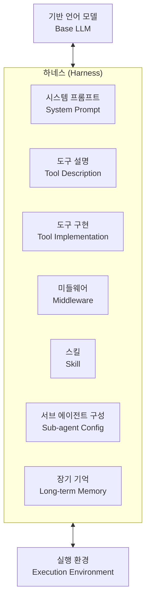

문제는 하네스가 현재 대부분 **수작업**으로 개발된다는 점이다. 인간 엔지니어가 에이전트의 실행 궤적을 직접 검토하고, 반복되는 실패 패턴을 찾아내고, 프롬프트나 도구를 조금씩 수정하는 방식이다. 모델의 능력이 빠르게 발전하는 시대에, 이 수동 루프는 세 가지 이유에서 한계를 드러낸다. 비용이 너무 높고, 확장이 어려우며, 과학적으로 엄밀하게 연구하기도 힘들다.

자동화 시도들이 전혀 없었던 것은 아니다. **Reflexion**과 **Self-Refine**은 에이전트가 자신의 실행 결과를 돌아보며 출력을 개선하는 방식을 취한다. **ACE(Agentic Context Engineering)** 는 자연어 플레이북을 컨텍스트에 주입하여 에이전트 행동을 유도한다. **TF-GRPO(Training-Free Group Relative Policy Optimization)** 는 성공적인 도구 사용 시퀀스를 강화하는 접근을 취한다. 하지만 이 모두는 프롬프트 수준의 편집에 머무르며, 도구 구현체나 미들웨어, 장기 기억 같은 하네스의 핵심 구성 요소에는 손을 대지 못한다. 마치 자동차를 개선한다면서 핸들만 조정하고 엔진, 서스펜션, 변속기는 그대로 두는 것과 같다.

---

## 2. 문제 정의: 하네스 자동 진화의 네 가지 난제

왜 하네스 엔지니어링을 자동화하기 어려운가? 연구팀은 네 가지 구조적 난제를 명확히 식별한다.

첫 번째는 **이질적인 액션 공간(heterogeneous action space)** 이다. 시스템 프롬프트는 자연어 문서이고, 도구는 Python 코드이며, 미들웨어는 실행 훅이고, 스킬은 재사용 가능한 작업 단위다. 이처럼 전혀 성격이 다른 구성 요소들을 하나의 편집 공간으로 다루는 것 자체가 어렵다.

두 번째는 **희박하고 노이즈가 많은 평가 신호(sparse and noisy evaluation signal)** 다. 태스크 통과/실패라는 이진 신호만 주어지는데, 이것만으로 어떤 하네스 변경이 어떤 효과를 냈는지 귀속(attribution)시키기가 매우 어렵다.

세 번째는 **수백만 토큰에 달하는 긴 궤적(multi-million-token trajectories)** 이다. 하나의 에이전트 실행에서 수천 줄의 셸 출력, 도구 호출 결과, 중간 추론 과정이 뒤섞인 원시 로그가 생성된다. "어떤 하네스 결함이 이 실패를 초래했는가"를 이 방대한 로그에서 찾아내는 것은 사람에게도 힘든 일이다.

네 번째는 **귀속의 어려움(attribution difficulty)** 이다. 어떤 편집의 효과가 즉시 나타나지 않거나, 다른 편집들과 복잡하게 상호작용하는 경우, 어떤 변경이 실제 성능 향상에 기여했는지를 알기 어렵다.

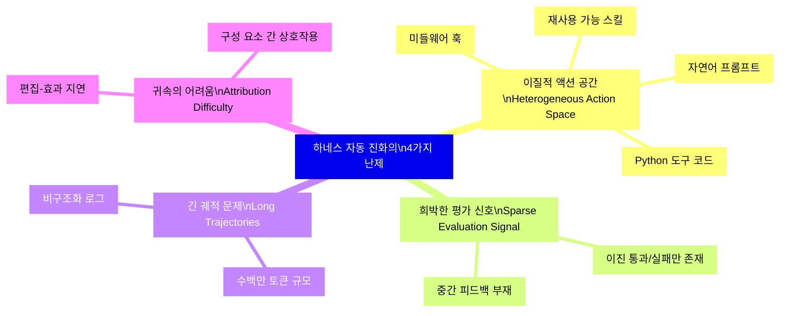

---

## 3. 핵심 통찰: 병목은 관측 가능성이다

이 논문의 가장 중요한 통찰은 단순하지만 강력하다. 위에서 나열한 네 가지 난제의 **진짜 병목은 에이전트의 능력이 아니라 관측 가능성(observability)** 이라는 것이다.

에이전트가 어떻게 행동할 수 있는지(행동 공간)를 명확하게 정의하고, 에이전트가 무슨 일이 일어났는지(궤적 정보)를 구조화된 형태로 볼 수 있게 하며, 에이전트의 각 결정이 다음 라운드에서 검증 가능한 예측으로 기록된다면, 에이전트는 안정적으로 더 나은 하네스 설계에 수렴할 수 있다.

이 통찰로부터 AHE(Agentic Harness Engineering)가 탄생한다. AHE는 하네스 진화 루프의 세 단계 각각에 대응하는 세 가지 **관측 가능성 기둥(observability pillar)** 을 세운다. 구성 요소 편집 단계에는 **구성 요소 관측 가능성**, 궤적 검사 단계에는 **경험 관측 가능성**, 의사 결정 단계에는 **결정 관측 가능성**이 대응한다. 이 세 기둥이 모든 편집을 **반증 가능한 계약(falsifiable contract)** 으로 전환한다.

---

## 4. AHE의 세 가지 관측 가능성 기둥

AHE 전체 파이프라인의 구조는 다음과 같다. 기반 모델은 고정된 채로, 오직 하네스의 명시적 구성 요소만이 편집 대상이 된다.

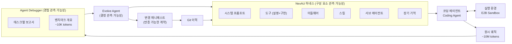

### 4.1 구성 요소 관측 가능성: NexAU 프레임워크

첫 번째 기둥인 **구성 요소 관측 가능성(component observability)** 은 NexAU 프레임워크를 통해 실현된다. NexAU는 하네스를 7가지 **직교적(orthogonal)** 구성 요소 유형으로 분해한다. 각 구성 요소는 작업 공간 내 고정된 마운트 포인트에 독립적인 파일로 존재한다.

| 구성 요소 | 역할 | 편집 단위 |
|---|---|---|
| **시스템 프롬프트** | 에이전트의 전반적인 행동 지침과 규율 | Markdown 파일 |
| **도구 설명** | 각 도구의 용도·매개변수·반환값 기술 | YAML 파일 |
| **도구 구현** | 실제 도구의 실행 로직 | Python 파일 |
| **미들웨어** | 도구 호출 전후 개입하는 훅 (검증·후처리) | Python 파일 |
| **스킬** | 특정 작업 패턴을 캡슐화한 재사용 단위 | Python 파일 |
| **서브 에이전트 구성** | 보조 에이전트 설정과 호출 조건 | YAML 파일 |
| **장기 기억** | 이전 경험에서 학습한 교훈·패턴 | Markdown 파일 |

이 **느슨한 결합(loose coupling)** 이 핵심이다. 미들웨어를 추가할 때 시스템 프롬프트를 수정할 필요가 없고, 스킬을 추가할 때 도구를 건드릴 필요가 없다. UNIX 철학에서 "각 프로그램이 하나의 일을 잘 수행한다"는 원칙처럼, 각 구성 요소가 하나의 관심사(concern)만 담당한다. 각 논리적 편집은 git 이력에 하나의 커밋으로 기록되어, 파일 수준의 diff와 롤백 세분성(rollback granularity)이 자연스럽게 따라온다.

OpenHands나 SWE-agent 같은 기존 하네스 프레임워크에서는 구성 요소들이 긴밀하게 얽혀 있어, 하나를 수정하면 다른 부분에 의도치 않은 영향이 전파된다. NexAU의 분리 구조는 이 문제를 원천적으로 해소하여 진화 에이전트가 안전하게 실험할 수 있는 환경을 만든다.

**시드 하네스 H₀는 의도적으로 최소화된다.** bash 도구 하나만 포함하고, 미들웨어·스킬·서브 에이전트·장기 기억은 전혀 없다. 이는 실험 과학의 대조군(control group) 설계와 같다. 만약 시드가 이미 벤치마크에 맞춰져 있다면 이후 편집의 기여도 분석이 오염된다. 최소한의 시드는 AHE가 추가하는 모든 구성 요소가 실측된 실행 결과로 자신의 가치를 스스로 증명하도록 강제한다.

### 4.2 경험 관측 가능성: Agent Debugger

두 번째 기둥인 **경험 관측 가능성(experience observability)** 은 Agent Debugger를 통해 실현된다. 각 벤치마크 태스크에 대해 k개의 실행 궤적이 생성되는데, 이 원시 궤적은 수백만 토큰에 달하며 하네스 결함에서 비롯된 오류들이 산재해 있다.

Agent Debugger는 이 방대한 궤적을 **파일 기반 환경**으로 변환한다. 각 궤적 메시지가 개별 파일에 저장되고, 일반적인 셸 도구로 탐색할 수 있는 구조다. 개발자가 로그를 `grep`과 `less`로 탐색하듯, 에이전트가 궤적을 탐색 가능한 파일 시스템으로 다루게 된다.

분석은 **두 가지 수준**으로 계층화된다. 먼저 각 태스크에 대해 통과/실패 상태와 근본 원인을 기술하는 **태스크별 분석 보고서(per-task analysis report)** 가 생성된다. 그다음, 모든 태스크별 보고서가 **벤치마크 수준 개요(benchmark-level overview)** 로 집계되어 반복적인 실패·성공 패턴을 조감도로 제공한다. 이 개요가 매 진화 반복의 시작점이 된다.

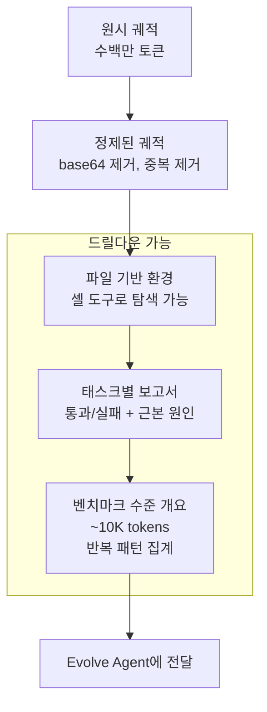

이 구조는 **점진적 공개(progressive disclosure)** 원칙을 따른다. 진화 에이전트는 기본적으로 요약된 10K 토큰 수준의 보고서를 소비하되, 필요하면 원시 궤적까지 드릴다운하여 보고서의 주장을 직접 검증할 수 있다. 계층적 구조는 토큰 소비를 절약하면서도, 에이전트가 필요한 깊이의 증거에 언제든 접근할 수 있도록 보장한다.

런타임 인프라 측면에서 Agent Debugger는 동시성 16으로 실행되며 태스크당 600초의 타임아웃이 적용된다. 모든 롤아웃은 E2B 원격 샌드박스 내에서 실행되어, 셸 부작용이 태스크 간에 유출되지 않도록 격리된다.

### 4.3 결정 관측 가능성: Evolve Agent

세 번째 기둥인 **결정 관측 가능성(decision observability)** 은 Evolve Agent가 실현한다. Evolve Agent는 AHE 루프를 닫는 역할이다. 매 라운드마다 Agent Debugger가 생성한 계층적 증거 코퍼스를 읽고, 어떤 하네스 구성 요소를 추가·수정·제거할지 결정하고, 작업 공간에 편집을 적용하며, 모든 편집의 이유를 기록한다.

두 가지 제약이 이 편집을 통제한다.

**통제 가능성(controllability):** Evolve Agent는 하네스 작업 공간 내부에만 쓸 수 있다. 실행 디렉토리, 트레이서, 검증기, LLM 설정은 읽기 전용이다. 시드 시스템 프롬프트는 삭제 불가로 표시된다. 검증기를 비활성화하거나, 모델을 교체하거나, 추론 예산을 늘리는 등의 지름길이 원천 차단된다. 이로써 기록된 모든 성능 향상이 순수하게 하네스 편집에서 비롯된 것임을 보장한다.

**증거 기반 편집(evidence-driven edits):** 모든 변경 사항에는 다음 네 항목을 포함하는 **매니페스트(manifest)** 항목이 첨부된다.

```
[매니페스트 항목 구조]
1. 실패 증거    → 어떤 태스크의 어떤 궤적에서 문제가 관찰되었는가
2. 근본 원인    → 해당 실패가 어떤 하네스 결함에서 비롯되었는가
3. 목표 수정    → 이 편집이 구체적으로 무엇을 변경하는가
4. 예상 영향    → 어떤 태스크가 수정될 것이고, 어떤 태스크에 회귀 위험이 있는가
```

다음 라운드에서 예측된 수정/회귀 집합이 실제 태스크별 변화와 교차 검증되어 각 편집에 대한 판정이 내려진다. 효과 없다고 판정된 편집은 파일 수준에서 자동 롤백된다. 과학적 가설이 실험으로 반증되는 것처럼, 각 편집은 다음 평가에 의해 반증 가능한 계약이 된다. 이 메커니즘은 "자기 정당화(self-justification)"에 의한 편집 누적을 방지한다. 아무리 그럴듯한 근거를 제시해도, 다음 라운드의 실측 결과가 뒷받침하지 않으면 해당 편집은 제거된다.

---

## 5. AHE 외부 루프: 알고리즘 구조

AHE의 외부 루프는 다음 7단계로 구성된다.

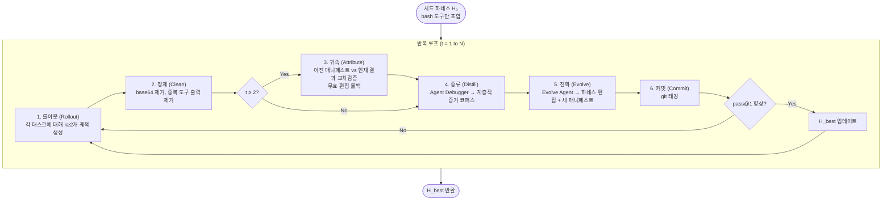

**귀속(Attribute) 단계가 증류(Distill) 이전에 실행**된다는 점이 중요하다. 이전 매니페스트의 판정 결과가 증거 코퍼스에 포함되므로, 매니페스트 항목이 단순한 근거(rationale)가 아닌 계약(contract)으로 기능한다. 이를 통해 Evolve Agent는 이전 반복에서 어떤 편집이 실제로 효과가 있었고 어떤 편집이 실패했는지를 명확히 인지한 채 다음 편집을 결정할 수 있다.

또한 첫 번째 반복과 **병렬로 탐색 에이전트(Explore Agent)** 가 실행된다. 이 에이전트는 NexAU 소스 코드와 공개된 코딩 에이전트 레퍼런스에서 소수의 재사용 가능한 스킬을 시드한다. 이 스킬들은 특별한 보호를 받지 않으며, 두 번째 반복부터 Evolve Agent가 관측된 롤아웃에 기반하여 유지, 정제, 또는 제거할 수 있다. 초기 부트스트래핑을 제공하되 이후 진화 과정에서 증거 기반으로 필터링되도록 설계된 것이다.

**k ≥ 2로 설정하는 이유**도 명확하다. 태스크당 최소 2번의 롤아웃이 있어야 "부분 통과" 태스크가 발생한다. 어떤 태스크를 때로는 통과하고 때로는 실패한다는 것은, 하네스 결함이 있기는 하지만 모델 능력 자체의 문제는 아님을 시사한다. 이 부분 통과 태스크들이 비교 진단의 자연스러운 기준점이 된다.

---

## 6. 실험 설계

### 평가 벤치마크

**Terminal-Bench 2 (주요 벤치마크)**
- 전체 89개 태스크: Easy 4개, Medium 55개, Hard 30개
- 태스크별 타임아웃: 1시간
- 실제 터미널 워크플로 작업으로 구성

**SWE-bench-verified (교차 전이 벤치마크)**
- 7개 저장소에 걸친 500개 태스크
- django (231), sympy (75), sphinx-doc (44), matplotlib (34), scikit-learn (32), pydata (22), astropy (22)

### 평가 지표

| 지표 | 정의 |
|---|---|
| **pass@1** | 태스크당 k개 롤아웃의 평균 이진 성공률. 인프라 중단·타임아웃도 실패로 처리하는 엄격한 기준 |
| **tokens/trial** | 모든 LLM 호출의 프롬프트+완료 토큰 합산 평균 (천 단위) |
| **Succ/Mtok** | 백만 토큰당 예상 성공 수 (비용 효율성 복합 지표) |

### 실험 설정

모든 실험에서 Code Agent, Agent Debugger, Evolve Agent 세 역할 에이전트가 **하나의 기반 모델 GPT-5.4(high reasoning)** 를 공유한다. 동일 모델 사용은 의도적 설계다. 세 역할이 같은 모델을 쓰면, 관측된 성능 향상이 분석기나 편집기의 능력 차이가 아닌 순수한 하네스 편집의 효과임을 격리할 수 있다.

교차 모델 전이 실험에서는 GPT-5.4(medium, xhigh), Qwen-3.6-plus, Gemini-3.1-flash-lite-preview, DeepSeek-v4-flash 등 5개 대안 모델을 추가 평가했다.

비교 대상 베이스라인은 다음과 같다.

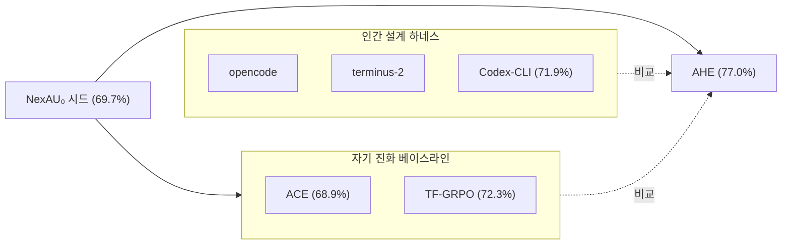

---

## 7. 실험 결과 분석

### 7.1 Terminal-Bench 2 주요 결과

AHE는 bash 전용 NexAU₀ 시드에서 시작하여 태스크당 k=2 롤아웃으로 10회 반복을 수행했으며, 약 32시간 만에 완료되었다.

**핵심 수치 비교:**

| 시스템 | pass@1 (%) | 비고 |
|---|---|---|
| NexAU₀ 시드 | 69.7 | bash 도구만 포함한 최소 하네스 |
| ACE | 68.9 | 프롬프트 플레이북 주입 |
| Codex-CLI | 71.9 | OpenAI 인간 설계 하네스 |
| TF-GRPO | 72.3 | 성공 도구 시퀀스 강화 |
| **AHE (10회)** | **77.0** | **모든 베이스라인 능가** |

진화 곡선을 보면 성능 향상은 반복 전반에 걸쳐 누적되며, 일부 반복에서 하락이 발생하더라도 H_best 보존 메커니즘 덕분에 최고 기록은 계속 갱신된다.

각 반복에서 추가된 주요 편집들은 다음과 같다:
- **반복 2**: Contract-first 워크플로 + 조정 가능한 셸 타임아웃 [프롬프트 + 도구]
- **반복 5-6**: Publish-state guard: 검증 완료 상태 보호 [프롬프트 + 도구]
- **반복 7**: 교차 스텝 위험 모니터: 명령 시퀀스 관찰 [미들웨어]
- **반복 8**: Post-success 하드 블록 + 사전 턴 위험 현저성 [도구 + 미들웨어]

**난이도별 패턴:**

Easy(4개)와 Medium(55개)에서는 AHE가 모든 베이스라인을 능가하거나 동률이다. Hard(30개)에서만 AHE가 Codex-CLI에 근소하게 뒤처진다. 연구팀은 이 격차가 장기 태스크에서 구성 요소 간 **간섭(interference)** 때문임을 밝힌다. 장기 기억, 미들웨어, 시스템 프롬프트가 모두 마감 검증을 반복 트리거하여 한정된 턴 예산을 소진하는 것이다. 흥미롭게도, AHE의 장기 기억만 단독으로 교체해도 Hard에서 Codex-CLI를 이미 능가한다. 이는 구성 요소 간 상호작용 문제이지, 누락된 능력의 문제가 아니다.

### 7.2 프롬프트 전용 자기 진화의 한계

ACE와 TF-GRPO가 AHE에 뒤처지는 근본 원인은 **레이어 불일치(layer mismatch)** 에 있다.

ACE는 자연어 플레이북을 컨텍스트에 주입하고, TF-GRPO는 성공적인 도구 시퀀스를 강화한다. 둘 다 같은 NexAU₀ 시드에서 출발하면서도 주변 스캐폴딩(scaffolding)을 전혀 편집하지 않는다.

구성 요소 수준의 분석이 이를 명확히 보여준다. 성능 향상이 실제로 존재하는 곳은 ACE와 TF-GRPO가 건드리지 않는 구성 요소들이다.

| 구성 요소 단독 교체 | 성능 변화 |
|---|---|
| 장기 기억 | **+5.6 pp** |
| 도구 | **+3.3 pp** |
| 미들웨어 | **+2.2 pp** |
| 시스템 프롬프트 | **−2.3 pp** |

시스템 프롬프트 단독 교체는 오히려 성능을 낮춘다. 79줄의 범용 규율을 인코딩하지만, 이를 실행 가능하게 만드는 도구·미들웨어·기억이 없으면 에이전트를 혼란스럽게 만드는 것이다.

### 7.3 교차 벤치마크 전이: SWE-bench-verified

Terminal-Bench 2에서 잘 작동하는 하네스가 다른 벤치마크에서도 효과적일까? 연구팀은 추가 진화 없이 AHE 하네스를 SWE-bench-verified에 그대로 적용해 이 질문에 답한다.

**SWE-bench-verified 결과 (500개 태스크):**

| 시스템 | 전체 성공률 | tokens/k |
|---|---|---|
| ACE | 74.6% | 679k |
| TF-GRPO | 74.2% | 582k |
| NexAU₀ (시드) | 75.2% | 526k |
| **AHE** | **75.6%** | **461k** |

ACE와 TF-GRPO는 원래의 NexAU₀ 시드보다 성능이 하락한다. 시드 대비 11~29% 더 많은 토큰을 소비하면서도 전반적 성공률이 떨어진다. 이 현상의 원인은 구조적이다. ACE가 주입하는 플레이북과 TF-GRPO가 강화하는 궤적 분포는 Terminal-Bench 궤적에서 증류된 것으로, 모든 모델 호출 프롬프트에 실려 전달된다. 다른 태스크 표면에서는 이 텍스트가 비용만 추가하고 기반 정책을 실질적으로 바꾸지 못한다. 프롬프트에 행동을 인코딩하는 방식의 근본적 한계가 드러나는 것이다.

AHE는 반대로 가장 높은 전반적 성공률을 달성하고 토큰도 가장 적게 소비한다. 향상이 django와 sphinx-doc처럼 크고 다단계 편집-검증 루프가 필요한 저장소에 집중된다. 이들 저장소의 구조가 AHE가 Terminal-Bench에서 압축한 도구·미들웨어·장기 기억의 구조와 일치하기 때문이다.

**토큰 효율성의 비밀**: 행동을 프롬프트에 인코딩하면 매 LLM 호출마다 해당 텍스트를 재처리하는 비용이 발생한다. 반면 도구·미들웨어·기억에 인코딩하면 실행 시점에 한 번만 활성화된다. AHE는 이 구조적 차이 덕분에 ACE 대비 32%, TF-GRPO 대비 21%, 시드 대비 12%의 토큰을 절감한다.

### 7.4 교차 모델 전이

GPT-5.4 high에서 진화된 AHE 하네스를 추가 진화 없이 5개 대안 기반 모델에 적용했다.

```mermaid
---
config:
    xyChart:
        width: 900
        height: 600
        showDataLabel: false
    themeVariables:
        xyChart:
            titleColor: "#000000"
---
xychart-beta
    title "교차 모델 전이 결과 (pass@1 %)"
    x-axis ["GPT-5.4 med", "GPT-5.4 high", "GPT-5.4 xhigh", "Gemini-3.1-flash-lite", "DeepSeek-v4-flash", "Qwen-3.6-plus"]
    y-axis "pass@1 (%)" 30 --> 85
    bar [65.7, 69.7, 72.5, 36.5, 51.7, 56.2]
    bar [68.0, 77.0, 74.7, 41.6, 61.8, 62.5]
```

모든 5개 대안 모델에서 양의 향상이 확인된다.

| 모델 | 시드 | AHE 적용 | 향상 |
|---|---|---|---|
| GPT-5.4 med | 65.7% | 68.0% | +2.3 pp |
| GPT-5.4 high | 69.7% | 77.0% | **+7.3 pp** |
| GPT-5.4 xhigh | 72.5% | 74.7% | +2.3 pp |
| Gemini-3.1-flash-lite | 36.5% | 41.6% | +5.1 pp |
| DeepSeek-v4-flash | 51.7% | 61.8% | **+10.1 pp** |
| Qwen-3.6-plus | 56.2% | 62.5% | +6.3 pp |

**교차 패밀리 향상이 동일 패밀리 내 향상보다 크다**는 점이 흥미롭다. 기반 모델 성능이 낮을수록(포화 상태에서 멀수록) AHE가 도구·미들웨어·장기 기억에 인코딩한 조정 패턴에 더 크게 의존한다. 반면 더 강력한 기반 모델은 같은 조정을 프롬프트에서 저비용으로 재유도할 수 있다. 이는 AHE가 벤치마크 특화 튜닝이 아닌 범용적인 엔지니어링 경험을 인코딩한다는 증거다.

GPT-5.4 패밀리 내 비단조적(non-monotone) 프로필(medium +2.3, high +7.3, xhigh +2.3)은 AHE의 스텝 예산과 타임아웃이 GPT-5.4 high에 맞춰 진화했기 때문이다. medium은 추론 능력이 낮고, xhigh는 더 많은 시행이 타임아웃을 초과해 실패로 처리된다. 연구팀은 이 타임아웃-예산 결합(timeout-budget coupling)을 일반화 위험 요소로 분류하고 향후 개선 과제로 제시한다.

---

## 8. 구성 요소별 기여 분석 (Ablation)

AHE 성능 향상의 원천을 파악하기 위해, 각 구성 요소를 NexAU₀ 시드에 단독으로 교체하는 ablation 실험을 수행했다.

| 구성 요소 | 단독 기여 (pp) |
|---|---|
| 장기 기억 | **+5.6** |
| 도구 | **+3.3** |
| 미들웨어 | **+2.2** |
| 시스템 프롬프트 | −2.3 |

각 구성 요소가 서로 다른 **실패 표면(failure surface)** 을 소유한다는 점이 핵심 발견이다.

**장기 기억 (+5.6 pp)**: 12개의 경계 사례 교훈을 추가한다. "성능 마진이 요구사항 경계에 있을 때 추가 검증 필요", "대기열 초과 시 취소 처리 방식", "소스 패키징 시 디렉토리 레이아웃 규칙" 같은 구체적 패턴들이다. Hard 태스크에서는 장기 기억 단독이 전체 AHE를 능가하는 반면, Easy에서는 불필요한 재검증으로 소폭 감소한다.

**도구 (+3.3 pp)**: 1364줄의 확장된 셸 도구로, 각 명령어 실행 시 주변 파일에서 관련 계약 힌트(contract hint)를 자동 탐색하여 에이전트에게 제공한다. Medium에서는 전체 AHE의 0.9pp 이내에 도달한다.

**미들웨어 (+2.2 pp)**: 평가자와 동형(isomorphic)인 마감 검사를 강제하는 finish-hook을 추가한다. Easy에서는 모든 태스크를 통과시키지만, Hard에서는 턴 수를 증가시킨다.

**시스템 프롬프트 (−2.3 pp)**: 79줄의 범용 규율을 인코딩하지만, 실행 가능성이 나머지 구성 요소들에 의존한다. 단독으로 삽입하면 오히려 성능이 하락한다.

이 결과에서 도출되는 핵심 통찰은 구성 요소 유형에 따른 **전이 가능성의 차이**다. 사실적 하네스 구조(factual harness structure), 즉 도구·미들웨어·장기 기억은 태스크와 모델을 넘어 전이될 수 있다. 반면 산문 수준 전략(prose-level strategy), 즉 시스템 프롬프트에 인코딩된 행동 지침은 전이되지 않는다. ACE나 TF-GRPO가 교차 벤치마크 전이에서 실패하는 이유가 여기에 있다.

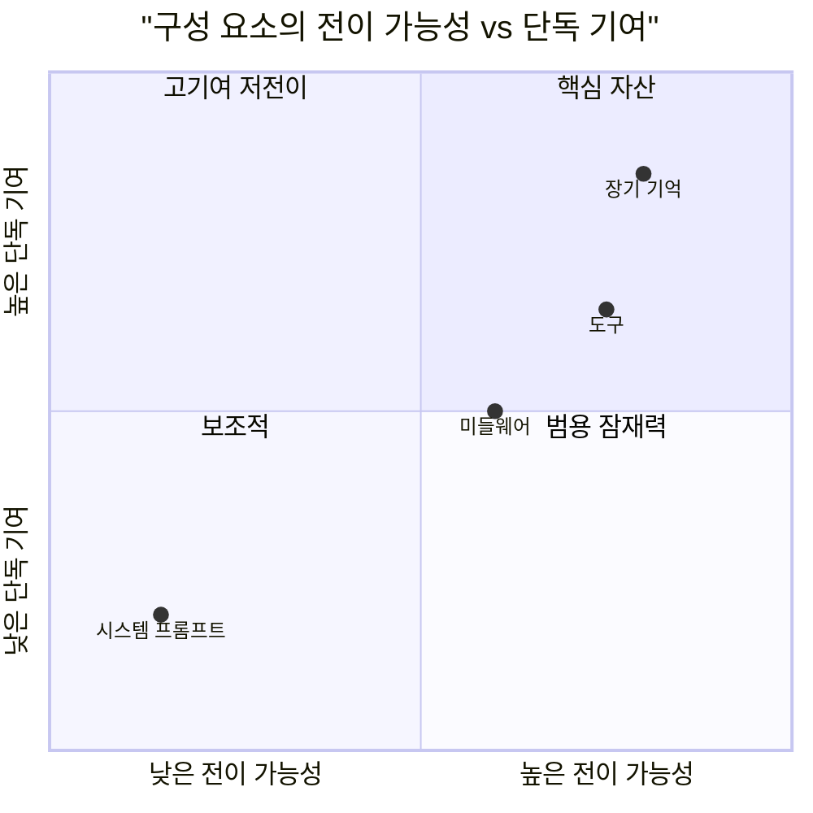

세 양의 구성 요소 향상의 합(+11.1pp)이 전체 AHE(+7.3pp)보다 크다는 점도 주목할 만하다. 구성 요소들이 **비가산적(non-additively)으로 상호작용**하기 때문이다. 장기 기억, 미들웨어, 시스템 프롬프트가 모두 동일한 마감 스타일 검증을 향해 밀어, 중복 재검사로 턴을 소비한다. Evolve Agent가 55개 Medium 태스크가 지배하는 전체 지표를 최적화하므로 Medium 중심 트레이드오프에 수렴하며, 난이도별 상호작용 인식 진화(interaction-aware evolution)는 향후 과제로 남겨진다.

---

## 9. 자기 귀속의 신뢰성: 회귀 맹목 문제

각 진화 라운드에서 Evolve Agent는 다음 라운드에 수정될 태스크와 회귀 위험이 있는 태스크를 명시한다. 이 예측의 정확도를 평가한 결과, 대조적인 패턴이 드러난다.

**수정 예측 정확도:**
- 수정 정밀도: 33.7% (랜덤 베이스라인 6.5%의 **약 5배**)
- 수정 재현율: 51.4% (랜덤 베이스라인 10.6%의 **약 5배**)

**회귀 예측 정확도:**
- 회귀 정밀도: 11.8% (랜덤 베이스라인 5.6%의 **약 2배**)
- 회귀 재현율: 11.1% (랜덤 베이스라인 5.4%의 **약 2배**)

```mermaid
xychart-beta
    title "자기 귀속 신뢰성: Cross-iteration Mean vs Random Baseline"
    x-axis ["Fix Precision", "Fix Recall", "Regression Precision", "Regression Recall"]
    y-axis "Value (%)" 0 --> 60
    bar [33.7, 51.4, 11.8, 11.1]
    bar [6.5, 10.6, 5.6, 5.4]
```

에이전트는 편집이 **왜 도움이 되는지**는 잘 예측하지만, 같은 편집이 **어떤 태스크를 깨뜨릴지**는 거의 예측하지 못한다. 이 **회귀 맹목(regression blindness)** 이 진화 곡선에서 비단조적 계단을 만들어낸다. 예측 정밀도/재현율이 랜덤 대비 5배인 수정 예측에 비해, 회귀 예측은 고작 2배에 그친다.

이 비대칭성은 직관적으로도 이해된다. 에이전트는 관찰된 실패 패턴에서 편집 근거를 추론하도록 훈련된 맥락에 있지만, 편집이 관찰되지 않은 태스크에서 어떤 부작용을 낼지는 예측하기 훨씬 어렵다. 이를 개선하는 것이 자기 진화 루프의 가장 명확한 향후 연구 방향이다.

---

## 10. AHE가 진화시킨 구성 요소의 실제 사례

10회 반복을 거치면서 AHE가 실제로 어떤 구성 요소를 어떻게 진화시켰는지 세 가지 사례로 살펴본다.

### 사례 1: 미들웨어 수준 편집

**새 파일**: `workspace/middleware/execution_risk_hints.py`

```python
class ExecutionRiskHintsMiddleware(Middleware):
    def after_tool(self, hook):
        command = hook.tool_input.get("command", "")
        output  = hook.tool_output.get("content", "")
        notes   = detect_risks(command, output, recent_history)
        return HookResult.with_modifications(
            tool_output=append_notes(output, notes))
```

이 미들웨어는 `run_shell_command` 호출 이후마다 최근 액션 이력과 새 도구 출력을 읽어 다음 네 가지 반복적 위험 패턴을 감지하고, 짧은 정정 힌트를 출력에 추가하여 에이전트가 다음 턴에 자기 수정할 수 있게 한다.

| 위험 패턴 | 주입되는 힌트 |
|---|---|
| localhost 전용 도달 가능성 | "bind 0.0.0.0 not 127.0.0.1" |
| 동일 오류 클래스 반복 | "switch tactic, do not retry" |
| 타임아웃 후 긴 스텝 누적 | "shorter probe or background" |
| 얕은 도움말 또는 파일 검증 | "exercise the real feature" |

### 사례 2: 프롬프트 수준 편집

**편집**: `workspace/systemprompt.md`에 7가지 새 작업 규칙 추가

1. Contract first (계약 우선)
2. Mirror the evaluator before finishing (완료 전 평가자 미러링)
3. Preserve semantics, minimal changes (의미 보존, 최소 변경)
4. Control candidate selection (후보 선택 통제)
5. Generalize instead of overfitting (과적합 대신 일반화)
6. Manage time explicitly (시간 명시적 관리)
7. Finish only when end state is ready (준비 완료 시에만 종료)

이 편집은 여러 반복에 걸쳐 반복적으로 관찰된 수비 행동들을 시스템 프롬프트에 성문화하여 모든 스텝에 적용한다.

### 사례 3: 도구 수준 편집

**편집**: `tools/shell_tools/run_shell_command.py`

```python
def run_shell_command(command, is_background,
        timeout_ms = 300000):
    result = sandbox.run(cmd, timeout=timeout_ms)
    if result.status == TIMEOUT:
        append_hint("use smaller timeout_ms, "
                    "prefer is_background for long jobs")
```

원래의 단순 bash 도구에 `timeout_ms` 파라미터와 타임아웃 발생 시 회복 힌트를 추가한다. 에이전트가 긴 작업을 짧은 프로브나 백그라운드 모드로 유도한다. 이 확장을 포함한 최종 셸 도구는 1364줄에 달한다.

이 세 사례 모두 사람의 개입 없이, 순전히 롤아웃 증거에 기반하여 에이전트가 자동으로 생성한 편집이다. 추상적 지침이 아니라 실제 실패 궤적에서 귀납적으로 도출된 경험적 지식의 결정체다.

---

## 11. 한계점 및 향후 연구 방향

연구팀은 AHE의 한계를 솔직하게 인정하며 다섯 가지를 제시한다.

**벤치마크 편향**: 현재 평가는 Terminal-Bench 2에 집중되어 있다. 다른 프로그래밍 언어, 배포 환경, 다른 유형의 소프트웨어 엔지니어링 작업으로의 일반화가 보장되지 않는다.

**벤치마크 특화 튜닝 위험**: 여러 구성 요소에 대한 편집을 허용한다는 것은 벤치마크 특화 최적화의 기회도 제공한다. 전이 실험이 이 위험을 측정하도록 설계되었지만, OOD(out-of-distribution) 실패 가능성은 열려 있다.

**불완전한 거버넌스**: 제한된 편집, 귀속, 롤백 메커니즘이 있지만 완전한 가드레일은 아니다. 장기 하네스 정리(cleanup)와 오용 방지가 아직 불완전하다.

**컴퓨트 오버헤드**: 전체 10회 반복에 약 32시간이 소요된다. 각 반복마다 89개 태스크 × k=2 롤아웃 + Agent Debugger + Evolve Agent 실행이 필요하다. 소규모 팀이나 제한된 컴퓨트 환경에서는 부담이 될 수 있다.

**회귀 맹목(regression blindness)**: 가장 뚜렷한 약점이다. 에이전트는 편집이 왜 도움이 되는지는 잘 예측하지만, 동일 편집이 어떤 태스크를 깨뜨릴지는 거의 예측하지 못한다. 더 정교한 회귀 예측 메커니즘이 필요하다.

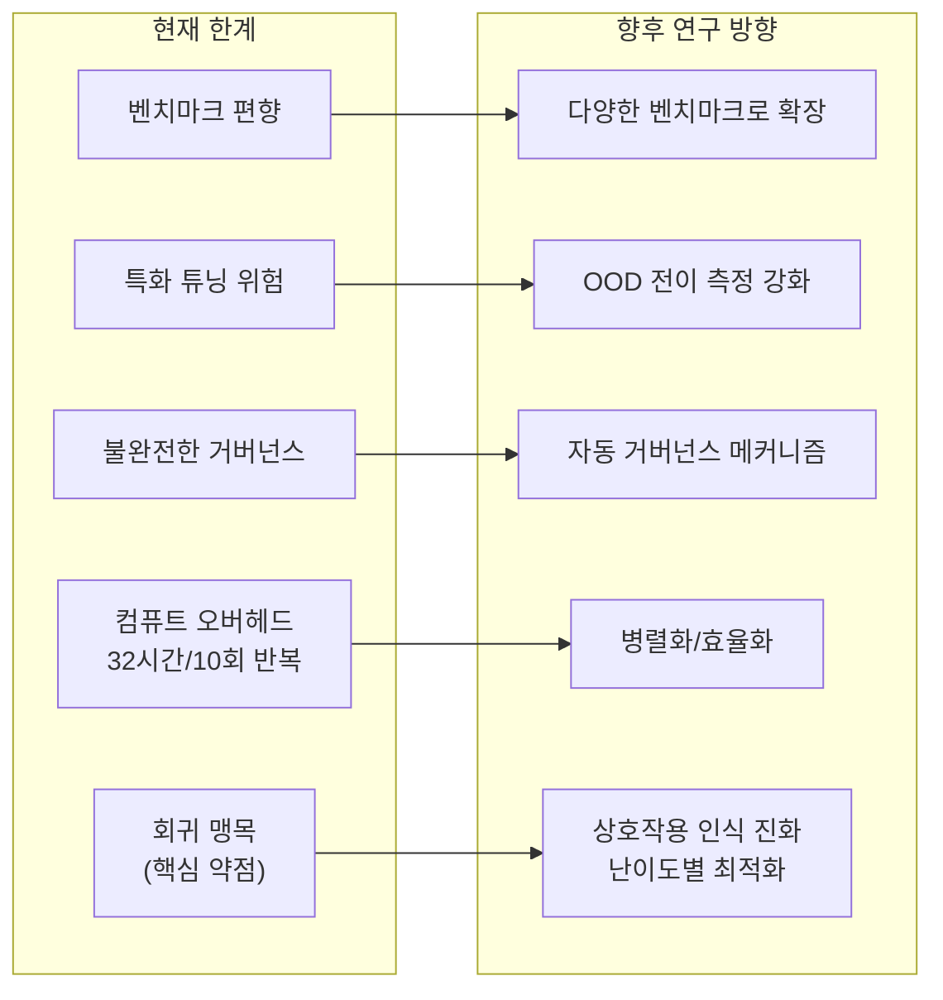

---

## 12. 의의: 하네스 엔지니어링 패러다임의 전환

AHE가 제시하는 가장 중요한 함의는 코딩 에이전트 최적화의 **패러다임 전환**이다.

기존의 에이전트 최적화는 두 가지 방향으로 수렴해 왔다. 하나는 기반 모델의 가중치(weight)를 업데이트하는 것(파인튜닝, RLHF), 다른 하나는 프롬프트를 개선하는 것(프롬프트 엔지니어링, 컨텍스트 엔지니어링)이다. 두 방향 모두 성과가 있었지만, 모델 외부의 **명시적 아티팩트**—도구, 미들웨어, 기억—는 학습 가능한 적응 표면(learnable adaptation surface)으로 취급되지 않았다.

AHE는 이 아티팩트들을 일등 시민으로 격상시킨다. 하네스 편집을 축적하고, 검사하고, 태스크 간·모델 간에 전이할 수 있다면, 코딩 에이전트는 숨겨진 매개변수 업데이트에만 의존하지 않고 **명시적 아티팩트로 경험을 외부화**할 수 있다.

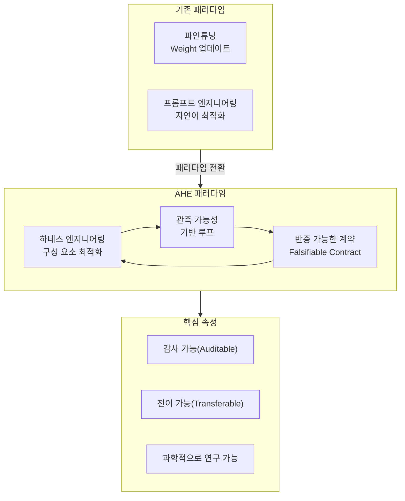

이 비전은 인류의 지식이 개인의 뇌가 아닌 책, 도구, 제도에 축적되어 세대를 넘어 전이되는 방식과 유사하다. AHE에서 진화된 하네스는 단순히 특정 모델, 특정 벤치마크를 위한 설정이 아니라, 소프트웨어 엔지니어링 에이전트가 습득한 **경험의 결정체**다.

더 나아가, AHE가 보여준 구성 요소별 기여 분석 결과—도구·미들웨어·장기 기억은 전이되고 시스템 프롬프트 지침은 전이되지 않는다—는 하네스 설계에 대한 실용적 지침을 제공한다. 경험적 지식은 자연어 지침보다 실행 가능한 코드와 구조화된 기억에 인코딩해야 한다는 것이다.

---

## 13. 설치 및 사용 방법

### 사전 요구 사항

- Python 3.13 이상
- [uv](https://docs.astral.sh/uv/) 패키지 매니저
- tmux

**macOS:**
```bash
brew install uv tmux
```

**Linux:**
```bash
curl -LsSf https://astral.sh/uv/install.sh | sh
sudo apt install -y tmux
```

### 소스 코드 복제 및 설정

```bash
git clone https://github.com/Curry09/agentic-harness-engineering.git
cd agentic-harness-engineering
uv sync

cp .env.example .env
```

**.env 필수 환경 변수:**

| 변수 | 용도 |
|---|---|
| `LLM_API_KEY` / `LLM_BASE_URL` | Code Agent와 Evolve Agent용 주 LLM 엔드포인트 |
| `E2B_API_KEY` | E2B 샌드박스 (SaaS 또는 셀프 호스팅) |
| `GITHUB_TOKEN` | 비공개 의존성(NexAU, harbor-LJH) 접근 |
| `SERPER_API_KEY` | Evolve Agent의 웹 검색 |

`ADB_LLM_*`과 `GPT54_LLM_*`은 선택 사항이며, 설정하지 않으면 `LLM_*` 값을 사용한다. Agent Debugger에 더 강력한 모델을 별도 지정할 때 활용한다.

### 실험 실행

```bash
# E2B 템플릿 빌드
uv run python scripts/build_templates.py --dataset-dir /path/to/dataset -j 16

# 실험 실행
./scripts/evolve.sh configs/experiments/exp-003-simple-code-gpt54.yaml

# 로그 스트림 연결
./scripts/evolve.sh --attach configs/experiments/exp-003-simple-code-gpt54.yaml

# 특정 반복부터 재개
./scripts/evolve.sh \
  --experiment 2026-04-10__23-20-14__gpt54 \
  --start-iteration 16 \
  configs/experiments/exp-003-simple-code-gpt54.yaml

# 평가 건너뛰고 기존 롤아웃 재사용 (Evolve Agent 디버깅용)
./scripts/evolve.sh --skip-eval configs/experiments/exp-003-simple-code-gpt54.yaml
```

---

## 참고 자료

- **논문**: [arXiv:2604.25850](https://arxiv.org/abs/2604.25850) — *Agentic Harness Engineering: Observability-Driven Automatic Evolution of Coding-Agent Harnesses*
- **코드**: [github.com/china-qijizhifeng/agentic-harness-engineering](https://github.com/china-qijizhifeng/agentic-harness-engineering) (MIT 라이선스)
- **NexAU 프레임워크**: [github.com/nex-agi/NexAU](https://github.com/nex-agi/NexAU)
- **PyTorchKR 원문 정리**: [discuss.pytorch.kr/t/9987](https://discuss.pytorch.kr/t/agentic-harness-engineering-ahe/9987)

### 관련 연구

- [Meta-Harness](https://discuss.pytorch.kr/t/meta-harness-stanford-iris-lab-llm/9811): Stanford IRIS Lab의 에이전트 하네스 탐색 프레임워크
- [OpenHarness](https://discuss.pytorch.kr/t/openharness-claude-code-44-python-ai-feat-hkuds/9559): Claude Code보다 44배 가벼운 Python 기반 오픈소스 하네스 (HKUDS)
- [Mini-Coding-Agent](https://discuss.pytorch.kr/t/mini-coding-agent-ai-6-feat-sebastian-raschka/9638): AI 코딩 에이전트의 6가지 핵심 구성 요소 최소 구현체

---

*작성일: 2026년 5월 2일*
