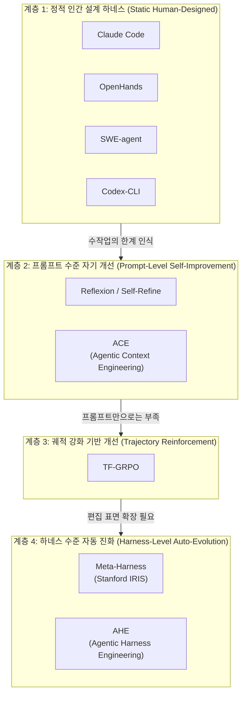
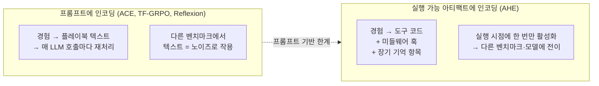

> 이 문서는 AHE(Agentic Harness Engineering) 논문 해설의 부록으로, AHE가 기존 하네스 엔지니어링 접근법들과 어떻게 다른지를 계통적으로 정리한다.

---

## 관련글 

[**Agentic Harness Engineering(AHE): 관측 가능성 기반 코딩 에이전트 하네스의 자동 진화 프레임워크**](https://k82022603.github.io/posts/agentic-harness-engineering(ahe)-%EA%B4%80%EC%B8%A1-%EA%B0%80%EB%8A%A5%EC%84%B1-%EA%B8%B0%EB%B0%98-%EC%BD%94%EB%94%A9-%EC%97%90%EC%9D%B4%EC%A0%84%ED%8A%B8-%ED%95%98%EB%84%A4%EC%8A%A4%EC%9D%98-%EC%9E%90%EB%8F%99-%EC%A7%84%ED%99%94-%ED%94%84%EB%A0%88%EC%9E%84%EC%9B%8C%ED%81%AC/)

## 1. 하네스 엔지니어링 접근법의 계보

하네스 엔지니어링이라는 개념이 독립적인 연구 영역으로 부상한 것은 비교적 최근의 일이다. 그 이전까지 "프롬프트 엔지니어링"이라 불리던 관행들이 점차 그 한계를 드러내면서, 연구자들과 실무자들은 모델 외부의 실행 환경 전체를 최적화 대상으로 삼아야 한다는 인식을 공유하기 시작했다. OpenAI는 2026년 초 "Harness Engineering: Leveraging Codex in an Agent-First World"라는 글을 통해 이 흐름을 명시적으로 선언했고, LangChain과 Anthropic 역시 컨텍스트 엔지니어링과 에이전트 하네스 설계를 핵심 실천 영역으로 다루기 시작했다.

이 흐름을 따라 등장한 다양한 접근법들은 크게 네 가지 계층으로 분류할 수 있다.

각 계층은 "무엇을 최적화 대상으로 삼는가"와 "누가(사람인가 에이전트인가) 최적화를 수행하는가"라는 두 축을 따라 서로 구분된다.

---

## 2. 계층별 접근법 상세 비교

### 계층 1: 정적 인간 설계 하네스

이 계층에 속하는 시스템들은 하네스를 인간 엔지니어가 설계하고 고정한다. 에이전트 실행 중에 하네스 자체는 변하지 않는다.

**Claude Code**는 Anthropic이 설계한 코딩 에이전트 하네스로, 5단계 점진적 컴팩션(budget reduction → snip → microcompact → context collapse → auto-compact), 서브에이전트 격리, 27가지 이벤트 타입을 처리하는 훅 파이프라인을 갖추고 있다. 설계 철학, 아키텍처, 실행 환경 모두 Anthropic 엔지니어의 수작업으로 완성된 결과물이다.

**OpenHands**는 Docker 샌드박싱, EventStream 메시지 버스, Agent Controller라는 3계층 하네스 설계를 갖춘 가장 완결된 오픈소스 코딩 에이전트 플랫폼이다. 프로덕션 배포에 적합한 구조적 완성도를 갖추고 있지만, 하네스의 각 부분이 긴밀하게 얽혀 있어 특정 구성 요소만 분리하여 수정하기 어렵다.

**SWE-agent**는 Agent-Computer Interface(ACI)를 통해 파일 뷰어, 검색, 에디터 도구에 명시적 상태 제약과 오류 피드백을 적용한다. 특정 작업 도메인에 맞게 도구 인터페이스를 최적화하는 설계의 참조 구현체로 평가된다.

**Codex-CLI**는 OpenAI가 설계한 하네스로, Terminal-Bench 2 기준 pass@1 71.9%를 달성한 강력한 인간 설계 기준점이다. AHE 논문에서 직접 비교 대상으로 사용된다.

이 계층의 공통적 한계는 최적화 루프가 항상 인간을 통과해야 한다는 점이다. 에이전트가 아무리 많은 실패를 경험해도, 그 실패로부터 하네스 자체를 개선하는 주체는 여전히 사람이다. 모델이 빠르게 발전하는 시대에 이 수동 루프는 확장성, 속도, 과학적 엄밀성 모두에서 병목이 된다.

---

### 계층 2: 프롬프트 수준 자기 개선

이 계층의 접근법들은 에이전트 자신이 자신의 출력이나 전략을 개선한다는 점에서 계층 1과 다르다. 하지만 개선의 대상은 여전히 **프롬프트 혹은 컨텍스트**에 한정된다.

**Reflexion**과 **Self-Refine**은 에이전트가 자신의 실행 결과를 돌아보며 다음 시도에서 더 나은 출력을 생성하는 에피소드별 자기 반성(episodic self-critique) 메커니즘이다. 실패 후 "왜 실패했는가"를 언어적으로 성찰하고 이를 다음 프롬프트에 반영한다. 출력 수준의 개선에는 효과적이지만, 하네스의 실행 구조(도구 구현, 미들웨어 로직)는 전혀 건드리지 못한다.

**ACE(Agentic Context Engineering)** 는 Stanford와 SambaNova가 제안한 프레임워크로, 컨텍스트를 "살아있는 플레이북(living playbook)"으로 취급한다. Generator(태스크 실행 및 실패 탐색), Reflector(실패 분석 및 인사이트 추출), Curator(플레이북 업데이트) 세 역할이 협력하는 폐쇄 루프를 형성한다. 컨텍스트가 점진적으로 축적·정제되어 brevity bias(간결화로 인한 도메인 지식 손실)와 context collapse(반복 재작성으로 인한 세부 정보 침식) 문제를 완화한다.

AppWorld 에이전트 벤치마크에서 +10.6%, 금융 분석 태스크에서 +8.6%의 향상을 보고했으며, ICLR 2026에 채택된 결과물이다. 그러나 모든 개선이 프롬프트에 인코딩되어 매 LLM 호출마다 재처리 비용을 치른다. Terminal-Bench 2에서 진화된 플레이북을 SWE-bench-verified에 적용했을 때, 오히려 시드 대비 성능이 하락하고 11~29% 더 많은 토큰을 소비한 것이 AHE 논문에서 실험적으로 확인됐다.

---

### 계층 3: 궤적 강화 기반 개선

**TF-GRPO(Training-Free Group Relative Policy Optimization)** 는 성공적인 도구 사용 시퀀스를 강화하는 방식으로 에이전트의 행동 분포를 조정한다. 가중치 업데이트 없이 궤적 수준의 피드백을 활용하는 점에서 Reflexion보다 한 단계 깊은 개선을 시도한다.

하지만 TF-GRPO 역시 강화된 궤적 분포를 모든 모델 호출의 프롬프트에 실어 전달하는 구조다. 프롬프트 기반 접근의 근본적 문제—실행 가능한 코드가 아닌 자연어에 행동이 인코딩된다는 것—는 그대로 남아 있다. ACE와 마찬가지로 교차 벤치마크 전이에서 오히려 시드 대비 성능 하락을 보인다.

---

### 계층 4: 하네스 수준 자동 진화

이 계층의 접근법들은 하네스 자체를 편집 대상으로 삼는다. 에이전트가 프롬프트만이 아니라 도구 코드, 미들웨어, 기억 구조 같은 실행 환경의 구성 요소 자체를 수정한다.

**Meta-Harness(Stanford IRIS Lab)** 는 LLM 주변의 실행 코드를 자동으로 최적화하는 에이전트 하네스 탐색 프레임워크다. 에이전트 제안자(agentic proposer)가 소스 코드, 점수, 모든 이전 후보의 실행 궤적에 파일 시스템을 통해 접근하여 새로운 하네스 코드를 제안한다. IMO 수준 수학 추론에서 5개 held-out 모델 평균 +4.7pp 향상, 에이전틱 코딩에서 Terminal-Bench 2 최고 성능을 달성했다고 보고한다. 단, 이전 후보들의 전체 컨텍스트를 대용량으로 처리하는 방식이어서 반복당 컨텍스트 생성량이 다른 접근법들보다 훨씬 크다.

**AHE**는 Meta-Harness와 같은 계층에 위치하지만, 세 가지 관측 가능성 기둥이라는 고유한 구조로 차별화된다.

---

## 3. AHE의 고유한 특징: 관측 가능성 우선 설계

### 3-1. 편집 표면의 명시적 분리

기존 접근법들과 AHE의 가장 근본적인 차이는 **무엇을 편집하는가**가 아니라 **편집 가능한 것을 어떻게 정의하는가**에 있다.

기존 하네스 시스템들(OpenHands, SWE-agent 등)에서는 하네스 구성 요소들이 긴밀하게 얽혀 있다. 미들웨어 로직이 시스템 프롬프트와 결합되어 있거나, 도구 구현이 에이전트 실행 루프와 분리되지 않는다. 이 결합도는 수작업 개발에서는 크게 문제가 되지 않지만, 자동화 루프에서 에이전트가 특정 구성 요소만 안전하게 실험하기 어렵게 만든다.

AHE의 NexAU 프레임워크는 하네스를 7가지 직교적 구성 요소로 분해하여 각각을 독립적인 파일로 마운트 포인트에 노출한다. 이 **느슨한 결합(loose coupling)** 이 에이전트에게 깔끔한 행동 공간을 제공한다. 미들웨어를 추가해도 시스템 프롬프트를 건드릴 필요가 없고, 장기 기억을 수정해도 도구 코드는 그대로다. 각 논리적 편집은 git 커밋 하나에 해당하므로 파일 수준의 diff와 롤백이 자연스럽게 따라온다.

### 3-2. 궤적 정보의 계층적 증류

기존의 프롬프트 기반 접근법들이 직면하는 공통 문제는 수백만 토큰짜리 원시 궤적에서 어떻게 유의미한 신호를 추출하느냐다. ACE는 이 문제를 Generator-Reflector-Curator 루프로 접근하지만, 궁극적으로 추출된 인사이트를 다시 프롬프트에 담는다.

AHE의 Agent Debugger는 다른 전략을 취한다. 원시 궤적을 탐색 가능한 **파일 시스템**으로 변환하여 에이전트가 grep이나 셸 스크립팅 도구로 직접 탐색할 수 있게 한다. 여기에 태스크별 분석 보고서 → 벤치마크 수준 개요라는 **2단계 계층 구조**를 더함으로써, 진화 에이전트가 기본적으로 ~10K 토큰의 요약만 소비하되 필요하면 수백만 토큰의 원시 궤적까지 드릴다운할 수 있는 점진적 공개(progressive disclosure) 구조를 실현한다. 이것이 토큰 효율성 우위의 구조적 원천이다.

### 3-3. 반증 가능한 계약으로서의 편집

기존 접근법들에서 에이전트의 각 편집 혹은 개선은 그 효과를 사후적으로 측정하기 어렵다. ACE의 플레이북 업데이트가 어떤 태스크의 성공에 기여했는지, TF-GRPO의 궤적 강화가 어떤 패턴을 실제로 바꿨는지 귀속(attribution)시키는 메커니즘이 없다.

AHE는 모든 편집에 **매니페스트(manifest)** 를 첨부한다. 매니페스트에는 실패 증거(어떤 태스크의 어떤 궤적), 추론된 근본 원인, 목표 수정, **예상 영향**(수정될 태스크와 회귀 위험이 있는 태스크)이 포함된다. 다음 라운드에서 이 예측이 실제 결과와 교차 검증되어 각 편집에 대한 판정이 내려진다. 효과 없다고 판정된 편집은 자동 롤백된다.

이 구조는 각 편집을 단순한 개선 시도가 아닌 **반증 가능한 과학적 가설**로 전환한다. 에이전트가 아무리 그럴듯한 이유를 제시하더라도, 다음 라운드의 실측 결과가 뒷받침하지 않으면 해당 편집은 제거된다. 이것이 "자기 정당화(self-justification)"에 의한 편집 누적을 구조적으로 차단하는 메커니즘이다.

---

## 4. 종합 비교표

| 구분 | 수작업 하네스 설계 | Reflexion / Self-Refine | ACE | TF-GRPO | Meta-Harness | **AHE** |
|---|---|---|---|---|---|---|
| **최적화 주체** | 인간 엔지니어 | 에이전트 (자기 반성) | 에이전트 (Generator-Reflector-Curator) | 에이전트 (궤적 강화) | 에이전트 (제안자) | 에이전트 (Evolve Agent) |
| **편집 대상** | 전체 하네스 (수동) | 출력 텍스트 | 컨텍스트/플레이북 (프롬프트 수준) | 궤적 분포 (프롬프트 수준) | 하네스 코드 전반 | 하네스 구성 요소 (파일 수준) |
| **구성 요소 분리** | 낮음 (긴밀 결합) | 해당 없음 | 해당 없음 | 해당 없음 | 중간 | **높음 (7가지 직교 컴포넌트)** |
| **편집의 롤백** | 수동 | 불가 | 불가 | 불가 | 부분적 | **파일 수준 자동 롤백** |
| **궤적 처리 방식** | 인간 직접 검토 | 에피소드 반성 | Generator 출력 분석 | 궤적 분포 강화 | 전체 이전 궤적 대용량 처리 | **계층적 증류 (~10K 토큰 요약 + 드릴다운)** |
| **편집 귀속 메커니즘** | 인간 판단 | 없음 | 없음 | 없음 | 점수 기반 | **반증 가능한 계약 + 자동 판정** |
| **경험 인코딩 위치** | 하네스 전체 | 출력 내 | 프롬프트 | 프롬프트 | 하네스 코드 | **도구·미들웨어·장기 기억** |
| **매 호출 재처리 비용** | 없음 | 낮음 | **높음** (프롬프트에 탑재) | **높음** (프롬프트에 탑재) | 중간 | **낮음** (실행 시점 1회 활성화) |
| **교차 벤치마크 전이** | 불명확 | 미확인 | **하락** (벤치마크 특화) | **하락** (벤치마크 특화) | 일부 확인 | **유지·향상 (SWE-bench-verified 검증)** |
| **교차 모델 전이** | 해당 없음 | 해당 없음 | 미확인 | 미확인 | 미확인 | **확인 (5개 모델 전원 양의 향상)** |
| **시드 요구 사항** | 설계 의존 | 기존 하네스 필요 | 기존 하네스 필요 | 기존 하네스 필요 | 초기 코드 필요 | **최소 (bash 도구 하나)** |
| **자동화 완결성** | 없음 | 부분 (출력만) | 부분 (프롬프트만) | 부분 (프롬프트만) | 높음 | **높음 (폐쇄 루프)** |
| **회귀 예측** | 인간 판단 | 없음 | 없음 | 없음 | 없음 | 있음 (단, 정밀도 낮음 — 회귀 맹목 문제 존재) |

---

## 5. "편집 표면"으로 보는 핵심 차이

가장 직관적인 비교 기준은 **"어디에 경험을 인코딩하는가"** 다. 각 접근법이 습득한 경험을 저장하는 위치가 전이 가능성, 토큰 비용, 롤백 가능성을 모두 결정한다.

ACE와 TF-GRPO에서 경험은 자연어 플레이북이나 강화된 궤적 분포로 변환되어 프롬프트에 탑재된다. 이 텍스트는 매 LLM 호출마다 재처리 비용을 발생시키고, 다른 벤치마크 표면에서는 유용한 신호 대신 노이즈로 작용한다. AHE의 실험 결과에서 ACE와 TF-GRPO가 SWE-bench-verified에서 시드보다 성능이 낮아지고 토큰을 더 많이 소비한 이유가 여기에 있다.

AHE에서 경험은 도구 코드(어떤 파일에서 계약 힌트를 탐색할지), 미들웨어 훅(실행 후 위험 패턴 감지), 장기 기억 항목(경계 사례 교훈)으로 변환된다. 이것들은 실행 시점에 한 번만 활성화되고, 자연어 지침과 달리 실행 가능한 로직으로 인코딩되어 있기 때문에 태스크 표면이 달라져도 동일하게 작동한다.

---

## 6. Meta-Harness와 AHE의 비교: 같은 계층, 다른 설계 철학

Meta-Harness와 AHE는 둘 다 하네스 코드를 자동으로 진화시킨다는 점에서 같은 계층에 속한다. 그러나 핵심 설계 철학이 다르다.

Meta-Harness는 **풍부한 이전 경험에 대한 접근성(rich access to prior experience)** 을 핵심 원리로 삼는다. 에이전트 제안자가 모든 이전 후보 하네스의 소스 코드, 점수, 실행 궤적에 파일 시스템을 통해 접근한다. 이 접근 방식은 반복당 처리하는 컨텍스트 양이 매우 크고, 이전 시도들 전체가 편집 근거로 활용된다.

AHE는 **관측 가능성(observability)** 을 핵심 원리로 삼는다. 방대한 경험을 그대로 에이전트에게 노출하는 대신, 계층적으로 증류하여 ~10K 토큰 수준의 구조화된 증거로 압축한다. 편집의 근거는 과거 이력 전체가 아니라 현재 라운드의 분석 보고서와 이전 매니페스트의 판정 결과다.

두 접근법의 실용적 차이는 **자기 귀속 메커니즘의 유무**에서 가장 선명하게 드러난다. AHE의 매니페스트는 다음 라운드에서 검증되어 판정을 받는 반증 가능한 계약으로 기능한다. 반면 Meta-Harness는 이전 후보들의 경험에서 귀납하여 새로운 하네스를 제안하지만, 각 편집이 어떤 예측 하에 이루어졌고 그 예측이 실현됐는지를 명시적으로 추적하는 메커니즘은 서로 다른 설계를 취한다.

| 비교 항목 | Meta-Harness | AHE |
|---|---|---|
| 핵심 원리 | 풍부한 이전 경험 접근 | 관측 가능성 기반 구조화 |
| 궤적 처리 | 전체 이전 후보 + 실행 궤적 대용량 | 계층적 증류 (~10K 토큰 요약) |
| 편집 단위 | 하네스 코드 전반 | 7가지 직교 컴포넌트 파일 |
| 편집 귀속 | 점수 기반 비교 | 반증 가능한 계약 + 자동 판정 |
| 롤백 메커니즘 | 부분적 | 파일 수준 자동 롤백 |
| 컴퓨트 특성 | 고대용량 컨텍스트 처리 | 증류로 토큰 절감 |
| 교차 전이 검증 | IMO 수학, 코딩 양 도메인 | 코딩 교차 벤치마크·교차 모델 |

---

## 7. AHE의 한계: 다른 접근법들과의 관계에서

AHE가 다른 접근법들보다 모든 면에서 우위에 있는 것은 아니다. 특히 두 가지 측면에서 한계가 분명하다.

첫 번째는 **Hard 태스크에서의 구성 요소 간 간섭**이다. AHE가 각 구성 요소를 분리하더라도, 실제 실행에서 장기 기억, 미들웨어, 시스템 프롬프트가 모두 마감 검증을 트리거하면서 서로 경쟁하는 현상이 발생한다. Hard 태스크에서 Codex-CLI 같은 정적 인간 설계 하네스에 근소하게 뒤처지는 원인이다. 단일 구성 요소들의 기여 합산(+11.1pp)이 전체 AHE(+7.3pp)보다 크다는 실험 결과가 이 비가산적 상호작용을 증명한다.

두 번째는 **회귀 맹목(regression blindness)** 이다. Evolve Agent는 편집이 왜 도움이 되는지는 잘 예측하지만(수정 정밀도/재현율이 랜덤 대비 ~5배), 같은 편집이 어떤 태스크를 깨뜨릴지는 거의 예측하지 못한다(회귀 정밀도/재현율이 랜덤 대비 ~2배). 이로 인해 진화 곡선이 비단조적으로 출렁이며, 자동화된 회귀 예방 메커니즘이 없는 인간 설계 하네스와 비교할 때 오히려 취약한 지점이 된다. 이 문제를 해결하는 것이 AHE 이후 연구의 가장 명확한 방향이다.

---

## 정리

AHE가 다른 접근법들과 구별되는 가장 본질적인 특징은 다음 세 가지로 요약된다. 첫째, 하네스를 분리 가능한 파일로 노출함으로써 **에이전트에게 안전하고 명확한 행동 공간을 제공**한다. 둘째, 수백만 토큰의 원시 궤적을 계층적으로 증류하여 **에이전트가 실제로 소비할 수 있는 증거 코퍼스를 만든다**. 셋째, 모든 편집을 반증 가능한 계약으로 만들어 **자기 정당화 편집 누적을 구조적으로 차단**한다.

이 세 가지 설계 결정이 합쳐져 AHE를 "프롬프트를 조금 더 잘 쓰는 시스템"이 아닌, 하네스 엔지니어링 자체를 과학적으로 수행하는 자동화 루프로 만든다.

---

*작성일: 2026년 5월 3일*
