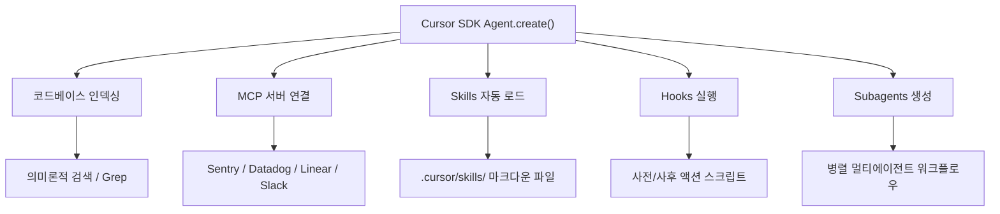
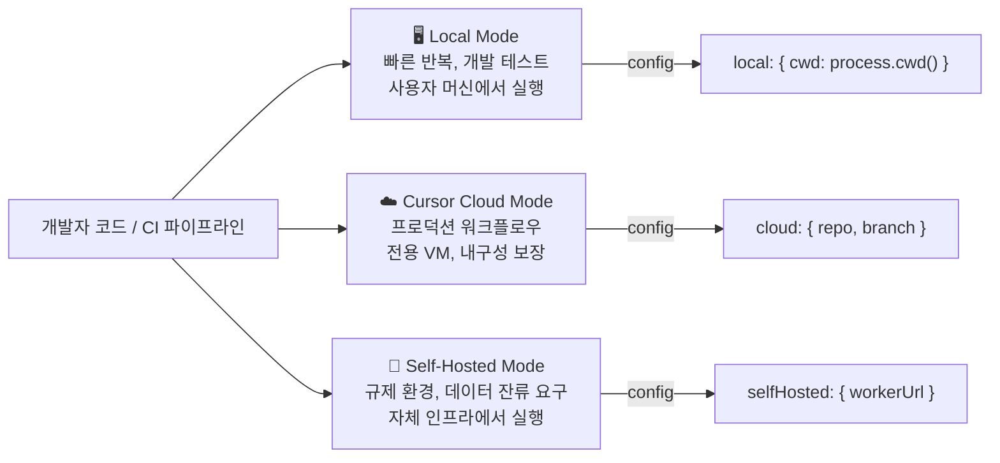
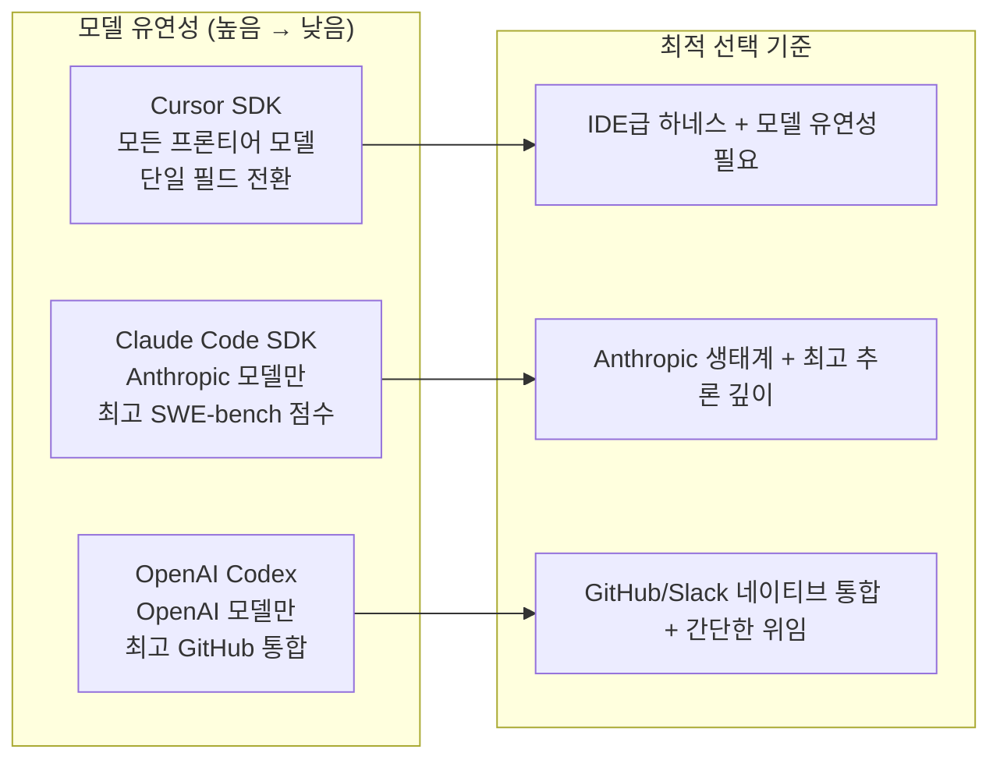
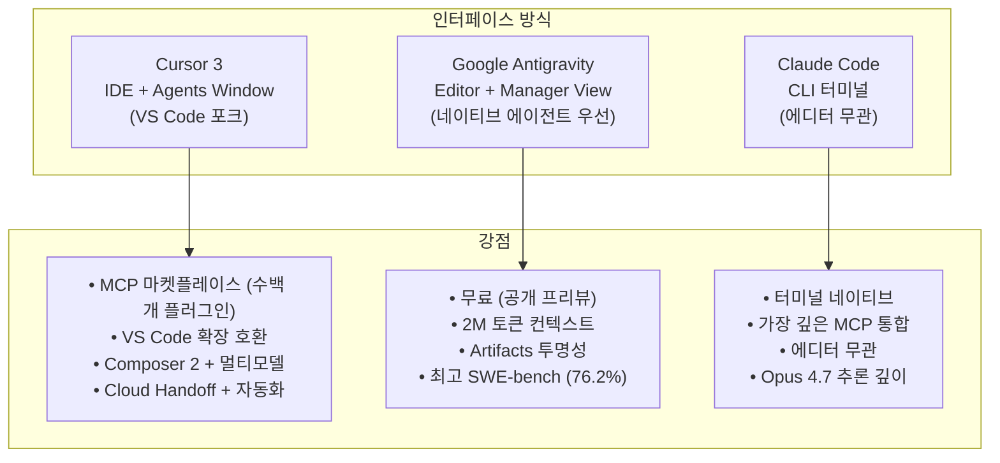
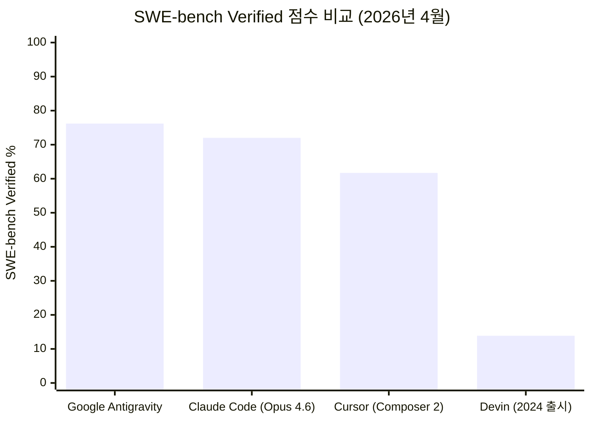
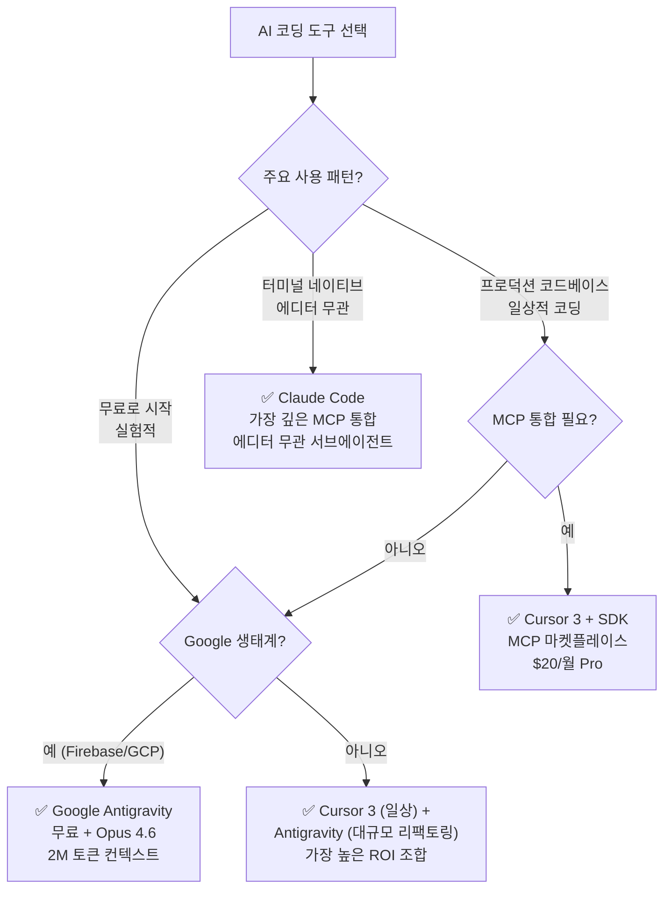

> **작성 기준일**: 2026년 5월 2일  
> **원문 출처**: [Build Fast with AI](https://www.buildfastwithai.com) — [Cursor SDK 튜토리얼](https://www.buildfastwithai.com/blogs/cursor-sdk-coding-agents-typescript-2026) (2026.05.01) / [Cursor 3 vs Google Antigravity 비교](https://www.buildfastwithai.com/blogs/cursor-3-vs-antigravity-ai-ide-2026) (2026.04.03)  
> **최신 정보 반영**: Cursor 공식 블로그([cursor.com/blog/typescript-sdk](https://cursor.com/blog/typescript-sdk)), MarkTechPost, Analytics Drift 등 2026년 4~5월 기사 참조

---

## 목차

1. [Cursor SDK란 무엇인가?](#1-cursor-sdk란-무엇인가)
2. [왜 일반 LLM API와 다른가?](#2-왜-일반-llm-api와-다른가)
3. [빠른 시작: 설치와 첫 에이전트](#3-빠른-시작-설치와-첫-에이전트)
4. [핵심 기능 심층 분석](#4-핵심-기능-심층-분석)
   - 4-1. MCP 서버
   - 4-2. Skills (스킬)
   - 4-3. Hooks (훅)
   - 4-4. Subagents (서브에이전트)
5. [세 가지 배포 모드: Local / Cloud / Self-Hosted](#5-세-가지-배포-모드)
6. [실제 사용 사례](#6-실제-사용-사례)
7. [가격 정책](#7-가격-정책)
8. [Cursor SDK vs Claude Code SDK vs OpenAI Codex 비교](#8-cursor-sdk-vs-claude-code-sdk-vs-openai-codex-비교)
9. [Cursor 3란 무엇인가?](#9-cursor-3란-무엇인가)
10. [Google Antigravity란 무엇인가?](#10-google-antigravity란-무엇인가)
11. [Cursor 3 vs Antigravity vs Claude Code: 전면 비교](#11-cursor-3-vs-antigravity-vs-claude-code-전면-비교)
12. [가격 비교: 어떤 플랜이 나에게 맞는가?](#12-가격-비교)
13. [벤치마크: SWE-bench, Terminal-Bench 2.0](#13-벤치마크)
14. [나에게 맞는 도구는?](#14-나에게-맞는-도구는)
15. [자주 묻는 질문](#15-자주-묻는-질문)

---

## 1. Cursor SDK란 무엇인가?

2026년 4월 29일, AI 코딩 도구 시장을 선도하는 Anysphere(Cursor 개발사)는 `@cursor/sdk`라는 TypeScript 패키지를 공개 베타로 출시했습니다. 이것은 단순한 라이브러리 배포가 아니라, Cursor의 핵심 에이전트 인프라를 외부 개발자에게 완전히 개방한다는 선언이었습니다.

한마디로 설명하면 이렇습니다. 지금까지 Cursor의 강력한 AI 에이전트를 사용하려면 Cursor 데스크탑 앱, CLI, 혹은 웹 인터페이스 안에 직접 들어가 있어야 했습니다. SDK 출시 이후에는 몇 줄의 TypeScript 코드만으로 어디서든 — CI/CD 파이프라인, 백엔드 서버, 심지어 다른 회사의 제품 내부 — 동일한 에이전트를 호출할 수 있습니다.

Cursor는 2023년 12월 약 $1M ARR에서 2026년 1분기 $2B ARR을 돌파했으며, 기업 가치는 $50B에 근접하는 것으로 알려져 있습니다. Rippling, Notion, Faire, C3 AI 같은 주요 기업들이 이미 프로덕션에서 SDK를 실행하고 있다는 점이 그 가치를 방증합니다.

> **핵심 인사이트**: Cursor SDK를 "코딩 도구"라고 부르는 것은 AWS Lambda를 "코드를 실행하는 방법"이라고 부르는 것과 같습니다. 기술적으로는 맞지만, 실질적으로는 부족한 설명입니다. 이것은 **자율적인 소프트웨어 엔지니어링을 위한 인프라**입니다.

---

## 2. 왜 일반 LLM API와 다른가?

많은 개발자들이 GPT나 Claude 같은 LLM API를 직접 코딩 작업에 사용해본 경험이 있습니다. 결과는 대체로 실망스럽습니다. 모델은 코드를 그럴듯하게 생성하지만, 실제 레포지토리에 어떤 파일이 있는지, 어떤 의존성을 쓰는지, 테스트 결과가 어떤지 전혀 모르는 상태에서 답변합니다. 컨텍스트를 맞추는 데 오히려 더 많은 시간이 소요됩니다.

Cursor SDK는 이 문제를 근본적으로 해결합니다.

```
일반 LLM API 호출
┌─────────────────────────────────────┐
│  개발자가 직접 컨텍스트 준비         │
│  → 파일 내용 복붙                    │
│  → 에러 메시지 복붙                  │
│  → 관련 코드 찾아서 붙여넣기        │
│  → 결과 검토 후 다시 붙여넣기       │
└─────────────────────────────────────┘

Cursor SDK 에이전트
┌─────────────────────────────────────┐
│  에이전트가 자동으로 처리            │
│  ✓ 코드베이스 인덱싱 & 의미론적 검색│
│  ✓ MCP 서버로 외부 도구 연결         │
│  ✓ Skills로 프로젝트 관례 학습       │
│  ✓ Hooks로 루프 제어                 │
│  ✓ Subagents로 병렬 처리             │
└─────────────────────────────────────┘
```

---

## 3. 빠른 시작: 설치와 첫 에이전트

### Step 1: 설치 및 API 키 설정

```bash
npm install @cursor/sdk
export CURSOR_API_KEY=your_api_key_here
```

Cursor 계정 설정의 API 섹션에서 키를 발급받습니다.

### Step 2: 로컬 에이전트 실행 (15줄 이하)

```typescript
import { Agent } from "@cursor/sdk";

const agent = await Agent.create({
  apiKey: process.env.CURSOR_API_KEY!,
  model: { id: "composer-2" },
  local: { cwd: process.cwd() },
});

const run = await agent.send(
  "이 레포지토리가 하는 일을 요약하고 주요 진입점을 나열해줘"
);

for await (const event of run.stream()) {
  console.log(event);
}
```

`Agent.create()`를 호출하는 순간, 에이전트는 코드베이스 인덱싱, 의미론적 검색, 전체 Cursor 하네스를 자동으로 확보합니다. 개발자가 직접 구현한 것은 아무것도 없습니다.

### Step 3: 클라우드 에이전트로 PR 자동 생성

```typescript
const agent = await Agent.create({
  apiKey: process.env.CURSOR_API_KEY!,
  model: { id: "composer-2" },
  cloud: {
    repo: "your-org/your-repo",
    branch: "main",
  },
});

const run = await agent.send(
  "CI 실패 #1234의 근본 원인을 찾아서 수정 PR을 열어줘"
);
```

클라우드 에이전트는 전용 가상머신 위에서 실행되기 때문에, 로컬 머신의 전원을 꺼도 작업이 계속 진행됩니다. 완료되면 브랜치 푸시, PR 생성, 스크린샷 첨부까지 자동으로 처리합니다.

---

## 4. 핵심 기능 심층 분석



### 4-1. MCP 서버: 외부 도구와 에이전트 연결

MCP(Model Context Protocol)는 외부 도구와 데이터 소스를 에이전트 런타임에 연결하는 오픈 표준입니다. Cursor SDK를 사용하는 에이전트는 Sentry 에러를 쿼리하고, Datadog 메트릭을 가져오고, Linear 티켓을 읽고, Slack에 메시지를 보내는 것 모두 에이전트 루프 내에서 처리할 수 있습니다.

`.cursor/mcp.json` 파일 하나만 설정하면 됩니다:

```json
{
  "mcpServers": {
    "sentry": {
      "type": "http",
      "url": "https://mcp.sentry.io/sse"
    },
    "linear": {
      "type": "stdio",
      "command": "npx @linear/mcp"
    }
  }
}
```

이 파일이 존재하면 SDK 에이전트가 자동으로 연동을 인식합니다. 예를 들어, CI 실패로 트리거된 에이전트가 Sentry에서 스택 트레이스를 조회하고, Linear 티켓으로 컨텍스트를 파악한 뒤, 수정 PR을 자동으로 여는 것이 가능합니다. 툴 호출 로직을 직접 작성할 필요가 없습니다.

### 4-2. Skills: 에이전트에게 코드베이스 관례 가르치기

Skills는 `.cursor/skills/` 디렉토리에 저장된 마크다운 파일로, 에이전트에게 도메인별 워크플로우, 코딩 패턴, 프로젝트 관례를 가르칩니다. 항상 컨텍스트에 포함되는 규칙(Rules)과 달리, Skills는 에이전트가 관련성 있다고 판단할 때만 동적으로 로드됩니다. 덕분에 컨텍스트 윈도우가 불필요하게 비대해지지 않습니다.

```markdown
# .cursor/skills/api-pattern.md
## REST API 엔드포인트 패턴

새로운 REST 엔드포인트를 만들 때는 항상:
1. Zod 스키마를 사용한 입력 유효성 검사 추가
2. src/lib/errors.ts의 기존 에러 처리 패턴 준수
3. tests/api/에 통합 테스트 작성
4. docs/openapi.yaml의 OpenAPI 스펙 업데이트
```

"새로운 /users/export 엔드포인트 추가"라는 작업을 받은 에이전트는 이 스킬 파일을 자동으로 로드하여 명시적으로 지시하지 않아도 관례를 따릅니다.

### 4-3. Hooks: 에이전트 루프 제어

Hooks는 에이전트 실행 루프의 특정 시점(사전/사후)에 실행되는 스크립트입니다. SDK를 수정하지 않고도 로깅, 가드레일, 알림, 루프 제어를 추가할 수 있습니다.

가장 강력한 패턴은 **Stop Hook**을 이용해 조건이 충족될 때까지 에이전트를 계속 실행시키는 것입니다:

```typescript
// .cursor/hooks/grind.ts — 모든 테스트가 통과할 때까지 반복 실행
const input = await Bun.stdin.json();
const MAX_ITERATIONS = 5;

if (input.status !== "completed" || input.loop_count >= MAX_ITERATIONS) {
  process.stdout.write(JSON.stringify({}));
  process.exit(0);
}

process.stdout.write(
  JSON.stringify({
    followup_message: `반복 ${input.loop_count + 1}/${MAX_ITERATIONS}: 모든 테스트가 통과할 때까지 계속.`,
  })
);
```

이 훅은 테스트가 통과하거나 최대 반복 횟수에 도달할 때까지 에이전트에게 자동으로 후속 프롬프트를 전송합니다. 폴링도, 외부 오케스트레이션도 필요 없습니다.

### 4-4. Subagents: 복잡한 작업의 병렬화

메인 에이전트는 자체 프롬프트와 모델을 가진 명명된 서브에이전트에게 하위 작업을 위임할 수 있습니다. 서브에이전트는 병렬로 각자 격리된 컨텍스트에서 실행된 후 결과를 부모 워크플로우에 다시 합칩니다.

실용적인 예시: 코드 리뷰를 수행하는 에이전트가 보안, 성능, 정확성, 가독성 각각을 담당하는 4개의 병렬 서브에이전트를 생성하고, 단일 보고서로 결과를 합칩니다. 서브에이전트 없이는 순차 처리로 4배의 시간이 걸렸을 작업입니다.

---

## 5. 세 가지 배포 모드



**Local 모드**는 개발 시작점으로 적합합니다. 에이전트가 현재 작업 디렉토리에서 실행되며, 단순 작업은 수 초 내에 완료됩니다. 단, 머신이 오프라인 상태가 되거나 프로세스가 종료되면 실행이 중단됩니다.

**Cloud 모드**는 각 에이전트 실행마다 전용 가상머신을 할당받습니다. 레포지토리가 신선하게 클론된 완전 격리 환경이며, 연결이 끊겨도 작업이 지속됩니다. 랩탑을 덮어도 에이전트는 계속 실행되며, 완료 후 PR을 열거나 브랜치를 푸시합니다. 클라우드 에이전트는 Cursor의 Agents Window와 웹 앱에도 표시되므로, 진행 상황을 수동으로 확인하거나 직접 개입할 수도 있습니다.

**Self-Hosted 모드**는 엄격한 데이터 잔류 또는 컴플라이언스 요구 사항을 가진 기업을 위한 옵션입니다. 모든 코드 실행과 도구 접근이 자체 네트워크 내에서 이루어지며, 어떤 데이터도 외부로 나가지 않습니다.

| 모드 | Config 필드 | 최적 사용 사례 | 데이터 위치 |
|------|------------|--------------|------------|
| Local | `local: { cwd: process.cwd() }` | 빠른 반복, 개발 테스트, 빠른 스크립트 | 사용자 머신 |
| Cursor Cloud | `cloud: { repo, branch }` | 프로덕션 워크플로우, 장시간 실행, 백그라운드 자동화 | Cursor 클라우드 VM |
| Self-Hosted | `selfHosted: { workerUrl }` | 규제 환경, 데이터 잔류 요구, 온-네트워크 컴퓨팅 | 자체 인프라 |

---

## 6. 실제 사용 사례

### CI/CD 자동화 — 가장 일반적인 패턴

빌드가 실패하면 에이전트가 실패한 작업 로그를 가져와 근본 원인을 파악하고, 수정 사항을 생성한 뒤 로컬에서 테스트 스위트를 실행해 검증하고, 인간의 개입 없이 PR을 엽니다. Cursor의 추정에 따르면 이 패턴을 사용하는 팀들은 일상적인 CI 유지보수 시간을 **30~50% 단축**했습니다.

### 티켓-to-PR 파이프라인

Rippling과 Notion 팀은 Linear 또는 Jira 티켓을 가져와 요구사항을 이해하고, 구현을 생성하고, 테스트를 작성하고, 엔지니어 리뷰를 위한 드래프트 PR을 여는 에이전트를 운영하고 있습니다. 출시 전부터 X(트위터)에서 바이럴된 Kanban 보드 데모가 바로 이 워크플로우입니다 — 티켓을 "Ready for Agent" 컬럼으로 드래그하면 클라우드 에이전트가 자동으로 PR을 생성합니다.

### 레포지토리 상태 자동화

Faire 엔지니어링 팀은 지속적인 개발자 개입 없이 코드베이스를 건강하게 유지하는 방법으로 SDK를 활용하고 있습니다. 에이전트가 백그라운드에서 타입 에러, 오래된 의존성, 누락된 테스트 커버리지, 문서 공백 등을 감사하고 발견된 각 문제에 대해 PR을 엽니다. Cursor는 내부적으로 시간당 수백 개의 이런 자동화를 실행하고 있습니다.

### 고객 대면 에이전트 제품

여러 회사들이 SDK를 자체 제품에 직접 임베드하고 있습니다. 자체 에이전트 런타임, 샌드박싱 시스템, 코드베이스 검색 인프라를 구축하는 대신, Cursor SDK를 호출해 모든 것을 즉시 얻습니다. 최종 사용자는 인터페이스에서 "Cursor"를 전혀 볼 일 없이 에이전트 경험을 누립니다.

---

## 7. 가격 정책

Cursor SDK는 토큰 기반 소비 가격 모델을 사용합니다. 좌석당, 실행당, 월당 요금이 아니라, **에이전트가 실제로 소비하는 토큰에 대해서만 지불**합니다. 이는 하루 5회에서 5,000회까지 다양한 프로그래매틱 워크로드 볼륨에 적합합니다.

| 모델 | 입력 (1M당) | 출력 (1M당) | 일반적인 CI 실행 비용 | 최적 사용 사례 |
|-----|-----------|-----------|---------------------|--------------|
| Composer 2 Standard | $0.50 | $2.50 | ~$0.05 | 배치 작업, 백그라운드 자동화, 대용량 처리 |
| Composer 2 Fast (기본값) | $1.50 | $7.50 | ~$0.15 | 실시간 워크플로우, 인터랙티브 사용 사례 |
| Gemini 3.1 Pro | $2.00 | $12.00 | ~$0.22 | 장문 컨텍스트 추론, 멀티모달 작업 |
| Claude Opus 4.7 | $5.00 | $25.00 | ~$0.50 | 복잡한 아키텍처 결정, 깊은 추론 |
| GPT-5.5 | $5.00 | $30.00 | ~$0.55 | 터미널 집약적 에이전트 작업, 컴퓨터 사용 |

**비용 시뮬레이션**: 20명 엔지니어링 팀이 매월 1천만 아웃풋 토큰을 생성한다고 가정할 때, Claude Opus 4.7 대신 Composer 2 Standard를 사용하면 아웃풋 토큰만으로도 연간 약 **$2,700**을 절약할 수 있습니다. 대규모에서 이 계산은 더욱 커집니다.

> **권장 전략**: 백그라운드 및 배치 작업의 기본값은 Composer 2 Standard. 복잡한 아키텍처 결정이나 보안에 민감한 리뷰에는 Opus 4.7 또는 GPT-5.5로 라우팅. 모델 전환은 `Agent.create()`의 단일 필드 변경만으로 가능합니다.

---

## 8. Cursor SDK vs Claude Code SDK vs OpenAI Codex 비교

세 가지 프로그래매틱 코딩 에이전트 프레임워크가 같은 카테고리를 놓고 경쟁하고 있습니다. 선택은 아키텍처, 기존 도구 체인, 자동화하려는 작업에 따라 달라집니다.

| 특성 | Cursor SDK | Claude Code SDK | OpenAI Codex |
|-----|-----------|----------------|-------------|
| 언어 | TypeScript | Python + TypeScript + CLI | TypeScript / Python |
| 실행 모델 | Local, Cloud VM, Self-hosted | 로컬 터미널 + 클라우드 | 클라우드 샌드박스 VM |
| 기본 모델 | Composer 2 ($0.50/M) | Claude Opus 4.7 ($5/M) | GPT-5.5 ($5/M) |
| 모델 유연성 | Cursor 지원 모든 모델 | Anthropic 모델 전용 | OpenAI 모델 전용 |
| MCP 지원 | ✅ (네이티브, .cursor/mcp.json) | ✅ (네이티브) | ❌ |
| Skills 시스템 | ✅ (.cursor/skills/) | ✅ (커스텀 훅) | ❌ |
| Hooks/가드레일 | ✅ (.cursor/hooks.json) | ✅ (Claude 훅) | ❌ |
| 서브에이전트 | ✅ (명명된, 병렬) | ✅ (에이전트 팀) | ✅ (워크트리) |
| GitHub 통합 | 클라우드 에이전트 PR 출력 | GitHub Actions 경유 | 네이티브 (Slack, GitHub) |
| 가격 모델 | 토큰 기반 소비 | 토큰 기반 소비 | 구독 + 토큰 |



**Cursor SDK가 승리하는 경우**: 인덱싱, MCP, Skills, Hooks, Subagents를 포함한 완전한 IDE급 하네스가 필요하면서 특정 모델에 묶이고 싶지 않을 때. 모델 유연성이 가장 의미 있는 차별점으로, Composer 2에서 Claude Opus 4.7 또는 GPT-5.5로 전환하는 것이 문자 그대로 한 줄 설정 변경입니다.

**Claude Code SDK가 승리하는 경우**: 이미 Anthropic 생태계에 깊이 연루되어 있고 Claude의 추론 깊이와 가장 깊은 통합을 원할 때. SWE-bench Pro에서 Opus 4.7의 64.3%는 그 벤치마크에서 최고의 코딩 모델입니다.

**OpenAI Codex가 승리하는 경우**: 즉시 사용 가능한 최고의 GitHub 및 Slack 통합, 비동기 fire-and-forget 작업 위임이 필요하고 MCP나 커스텀 Skills가 필요 없을 때. 단점은 모델 고정 — OpenAI 인프라와 가격에 묶입니다.

---

## 9. Cursor 3란 무엇인가?

2026년 4월 2일, Anysphere는 회사 역사상 가장 중요한 업데이트를 출시했습니다. Cursor 3는 **Agents Window**라는 완전히 새로운 인터페이스를 도입합니다. 이 인터페이스는 처음부터 하나의 아이디어를 중심으로 설계되었습니다: 개발자는 에이전트를 관리하고, 에이전트가 코드를 작성합니다.

Cursor 3는 증분 업데이트가 아닙니다. 개발자가 로컬 머신, 워크트리, SSH, 클라우드 환경에 걸쳐 여러 AI 에이전트를 병렬로 실행할 수 있는 독립형 인터페이스를 추가하며, 이 모든 것이 메인 코딩 세션을 방해하지 않고 이루어집니다.

제품 철학이 근본적으로 바뀌었습니다. 이전의 Cursor는 AI가 향상된 에디터였습니다. 이제 목표가 명확합니다: **개발자가 건축가이고, 에이전트가 빌더**입니다.

Cursor는 2026년 초 연간 수익 $20억을 돌파하며 3개월 만에 두 배로 성장했습니다. Fortune 500 기업의 50% 이상이 Cursor를 도입했으며, Nvidia, Uber, Adobe도 그 목록에 있습니다.

### Cursor 3 주요 기능

**Agents Window**: 처음부터 새로 설계된 인터페이스로 IDE에 덧붙인 패널이 아닙니다. 멀티 워크스페이스 레이아웃을 지원하여 하나의 공간에서 다른 레포지토리 전반에 걸쳐 작업할 수 있습니다. Agent Tabs는 여러 채팅의 나란히 보기나 그리드 뷰를 허용합니다.

**Design Mode**: 내장 브라우저에서 UI 요소를 직접 클릭하고 드래그하여 주석을 달고, 에이전트가 정확히 변경하길 원하는 컴포넌트를 지정할 수 있습니다. 5분짜리 텍스트 설명이 10초짜리 클릭이 됩니다.

**Composer 2와 실시간 RL**: Cursor의 독자적인 코딩 모델로, 실제 사용자 인터랙션에 대한 실시간 강화학습으로 훈련되었습니다. Cursor 내부 A/B 테스트 결과: 에이전트 편집 지속성 +2.28%, 불만족 후속 메시지 -3.13%, 지연 시간 -10.3% 개선.

**클라우드 에이전트와 자동화**: Cursor Automations는 코드 커밋, Slack 메시지, 또는 예약된 타이머 같은 이벤트를 기반으로 에이전트를 트리거합니다. 보안 에이전트는 현재 매주 3,000개 이상의 내부 PR을 리뷰하며 주당 200개 이상의 취약점을 발견하고 있습니다.

**새로운 명령어**: `/worktree` — 별도 git 워크트리에서 격리된 작업 실행, `/best-of-n` — 동일 작업을 여러 모델에 실행하고 결과를 비교. 후자는 IDE를 떠나지 않고 모델 출력을 A/B 테스트하는 효과가 있습니다.

---

## 10. Google Antigravity란 무엇인가?

Google Antigravity는 2025년 11월 Gemini 3와 함께 출시된 무료 에이전트 우선(agent-first) IDE입니다. Gemini 3.1 Pro와 Claude Opus 4.6을 기반으로 구동되며, SWE-bench Verified에서 76.2%, Terminal-Bench 2.0에서 54.2%를 기록했습니다.

출신 배경이 흥미롭습니다. Google은 2024년 7월 Windsurf 팀(CEO Varun Mohan 포함)을 $24억에 인수했습니다. 그 팀이 6개월도 안 되어 Antigravity를 만들었습니다. VS Code 포크가 아니라 처음부터 에이전트 우선 환경으로 네이티브하게 구축되었습니다.

### 두 가지 뷰

**Editor View**는 VS Code와 유사합니다 — 문법 강조, 에이전트 사이드바, Gemini 3 Flash 기반 인라인 자동완성.

**Manager View**가 Antigravity가 흥미로운 지점입니다. 동시에 최대 5개의 병렬 에이전트를 파견하고, 실시간 진행 상황을 모니터링하고, 변경 사항을 수락하기 전에 아티팩트(작업 계획, 스크린샷, 브라우저 녹화)로 작업 결과를 리뷰하는 미션 컨트롤 대시보드입니다.

**Artifacts 시스템**이 Antigravity의 가장 독창적인 아이디어입니다. 모든 에이전트 액션이 검증 가능한 기록을 생성합니다. 개발자는 모든 코드 줄을 리뷰할 필요 없이, 에이전트의 계획과 테스트 결과가 요청한 것과 일치하는지만 리뷰하면 됩니다. 엔터프라이즈 컴플라이언스에 더 적합한 신뢰 모델입니다.

**솔직한 단점**: Antigravity는 아직 초기 단계입니다. 2026년 초에는 컨텍스트 메모리 오류, 버전 호환성 버그, 작업 중간에 에이전트가 종료되는 실제 안정성 문제가 있었습니다. MCP 지원이 아직 없습니다. 야망은 있지만 신뢰성은 아직 완전히 갖추지 못했습니다.

**Planning Mode vs Fast Mode**: Planning Mode는 에이전트의 추론을 외부화합니다 — 한 줄도 쓰기 전에 아티팩트로 작업 목록과 안내를 생성합니다. Fast Mode는 계획 단계를 건너뛰고 바로 실행합니다. 프로덕션 코드에는 Planning Mode가 올바른 기본값이고, Fast Mode는 일회성 프로토타입과 보일러플레이트에 적합합니다.

**2백만 토큰 컨텍스트 윈도우**: Antigravity의 Gemini 3 Pro는 최대 200만 토큰을 처리합니다 — 전체 코드베이스가 한번에 컨텍스트 내에 들어옵니다. "인증 미들웨어가 어디에 정의되어 있나?"와 같은 질문에 전체 코드베이스에서 정확한 답변을 얻을 수 있습니다.

---

## 11. Cursor 3 vs Antigravity vs Claude Code 전면 비교



| 특성 | Cursor 3 | Google Antigravity | Claude Code |
|-----|---------|------------------|------------|
| 개발사 | Anysphere | Google (구 Windsurf 팀) | Anthropic |
| 출시 | 2026년 4월 | 2025년 11월 | 2025년 |
| 인터페이스 | IDE + Agents Window | Editor + Manager View | 터미널 (CLI) |
| 기본 모델 | Composer 2 + 멀티모델 | Gemini 3 Pro / 3.1 Pro | Claude Opus 4.6 |
| 병렬 에이전트 | ✅ (로컬, 클라우드, SSH) | 최대 5개 에이전트 | 서브에이전트 경유 |
| SWE-bench 점수 | Composer 2로 Top-3 | 76.2% Verified | ~72% |
| 컨텍스트 윈도우 | 프로젝트 전반 | 200만 토큰 | 20만 토큰 |
| MCP 지원 | ✅ (마켓플레이스) | ❌ 아직 없음 | ✅ (네이티브) |
| 가격 | 무료 + Pro $20/월 | 무료 (공개 프리뷰) | API 비용 기반 |
| VS Code 호환 | ✅ (포크) | ❌ 호환 안됨 | 에디터 무관 |
| Design Mode | ✅ (클릭-드래그 UI) | 브라우저 녹화 | ❌ |
| Cloud Handoff | ✅ (로컬→클라우드) | ✅ | ✅ |
| 자동화 | ✅ (예약 + 이벤트 기반) | 제한적 | Claude 에이전트 경유 |

---

## 12. 가격 비교

| 플랜 | 가격 | 포함 내용 |
|-----|-----|---------|
| Cursor Free | $0/월 | 제한된 모델 사용량, 핵심 기능 |
| Cursor Pro | $20/월 | 무제한 Composer 2, 우선 접근 |
| Cursor Ultra | $200/월 | 20배 모델 사용량, 엔터프라이즈 기능, 보장된 컴퓨팅 |
| Antigravity Free | $0 (공개 프리뷰) | Gemini 3.1 Pro + Claude Opus 4.6 포함 |
| Claude Code | API 가격 (헤비 사용 시 ~$100+/월) | 완전한 Opus 4.6 접근, 터미널 기반 |

솔직한 의견: 프로덕션 코드에서 매일 사용한다면 Cursor Pro $20/월은 합리적인 가치입니다. Composer 2 품질과 MCP 생태계가 이를 정당화합니다. 그러나 혼자 개발하는 개발자나 학생이 무언가를 만들고 싶다면, Opus 4.6 접근이 포함된 Antigravity의 무료 티어는 시장이 아직 충분히 인식하지 못한 놀라운 거래입니다.

Cursor Ultra $200/월 플랜은 예측 가능한 고용량 워크플로우를 가진 팀을 위한 것입니다. 대부분의 개인 개발자에게는 이 티어가 필요하지 않습니다.

---

## 13. 벤치마크

Google Antigravity는 SWE-bench Verified에서 **76.2%** 를 기록했습니다. 이는 2026년 4월 기준 코딩 에이전트에 대해 발표된 가장 높은 점수 중 하나입니다. 참고로 Devin은 2024년 출시 당시 13.86%를 기록했습니다. 당시 인상적이라고 여겨졌던 것과 지금 표준 사이의 격차가 얼마나 놀라운지 보여줍니다.

Antigravity는 Laude Institute가 관리하는 터미널 사용 에이전트 평가 벤치마크인 Terminal-Bench 2.0에서 **54.2%** 를 기록했습니다. Cursor의 Terminal-Bench 2.0 점수는 공식 Harbor 평가 프레임워크를 사용하여 모델-에이전트 쌍당 5회 반복으로 계산되며, Antigravity와 Kiro IDE와 함께 Top-3에 위치합니다.

Claude Code(Claude Opus 4.6 사용)는 동일 벤치마크에서 약 **72%** 를 기록합니다 — Antigravity의 76.2%보다 약간 낮지만, 평가 실행 전반의 변동 마진 내에 있습니다.



> **주의**: SWE-bench Verified는 특정 재현 가능한 GitHub 이슈를 측정합니다. 유용한 프록시이지만 실제 코드베이스에서의 생산성을 완벽하게 측정하는 것은 아닙니다. 실제 사용자 인터랙션에서의 Cursor Composer 2 A/B 테스트 개선(편집 지속성 +2.28%, 불만족 후속 메시지 -3.13%)은 순수 벤치마크 점수보다 실제 개발자 경험을 더 잘 예측할 수 있습니다.

---

## 14. 나에게 맞는 도구는?



**Cursor 3 사용 추천**: 프로덕션 코드베이스에서 작업하고, 기존 .cursorrules와 워크플로우가 있고, MCP 통합이 필요하거나, 가장 성숙한 일상 코딩 경험을 원하는 경우. Composer 2 품질, Design Mode, 클라우드 에이전트 인프라가 2026년 전문 개발자의 기본값이 됩니다.

**Google Antigravity 사용 추천**: 에이전트 우선 워크플로우를 실험하고, Google 생태계(Firebase, Google Cloud, Gemini API)에서 구축하거나, 무료 Opus 4.6 코딩 환경을 원하거나, 컴플라이언스나 디버깅을 위한 Artifacts 투명성 시스템이 필요한 경우. 단, 안정성 문제에 대한 인내심이 필요합니다.

**Claude Code 사용 추천**: 터미널 네이티브 개발자이거나, 가장 깊은 MCP 통합을 원하거나, 전체 설정에서 작동하는 에디터 무관 에이전트가 필요하거나, 이미 다른 목적으로 Anthropic API를 사용하고 있는 경우. Claude Code는 모든 변경 사항을 추적하고 싶은 복잡한 멀티 스텝 리팩토링 작업에도 최선의 선택입니다.

**최고의 조합**: 일상 코딩에는 Cursor 3, 독립적인 작업으로 명확하게 정의할 수 있는 대규모 리팩토링이나 새 기능 구축에는 Antigravity Manager View. $20/월 + 무료 Antigravity 조합이 최고의 ROI입니다.

---

## 15. 자주 묻는 질문

**Q. Cursor SDK를 설치하려면 어떻게 하나요?**  
`npm install @cursor/sdk`로 설치합니다. Cursor 계정 설정의 API 섹션에서 API 키를 발급받아 `CURSOR_API_KEY` 환경 변수로 설정합니다.

**Q. Cursor SDK와 LLM API를 직접 호출하는 것의 차이는?**  
LLM API를 호출하면 모델을 얻습니다. Cursor SDK는 모델 + 전체 에이전트 하네스를 제공합니다 — 자동 코드베이스 인덱싱, 의미론적 코드 검색, MCP 서버 통합, Skills, Hooks, 서브에이전트, 샌드박스 클라우드 실행. 일반 LLM 호출은 레포지토리가 존재하는지조차 모릅니다. Cursor SDK 에이전트는 레포지토리를 검색하고, 인덱싱하고, 터미널 명령을 실행하고, 완료 후 PR을 열 수 있습니다.

**Q. CI/CD 자동화에 Cursor SDK를 사용할 수 있나요?**  
예. CI/CD 자동화가 초기 프로덕션 배포에서 가장 일반적인 사용 사례입니다. 클라우드 배포 모드가 이를 위해 설계되었습니다 — 에이전트가 전용 VM에서 실행되어 연결이 끊겨도 장시간 실행 CI 워크플로우가 안정적으로 완료됩니다.

**Q. Cursor 3에서 Agents Window에 어떻게 접근하나요?**  
최신 버전의 Cursor로 업그레이드한 후 `Cmd+Shift+P`(Mac) 또는 `Ctrl+Shift+P`(Windows/Linux)를 누르고 "Agents Window"를 입력합니다. IDE와 동시에 실행하거나 독립형 뷰로 실행할 수 있습니다.

**Q. Google Antigravity는 MCP를 지원하나요?**  
2026년 4월 기준, Google Antigravity는 아직 MCP 서버를 지원하지 않습니다. 이는 Figma, Amplitude, 또는 커스텀 엔터프라이즈 플러그인 등의 MCP 통합에 의존하는 팀에게 중요한 제한사항입니다. MCP 지원이 요구 사항이라면 현재로서는 Cursor나 Claude Code가 더 나은 선택입니다.

**Q. Cursor 3와 Google Antigravity를 동시에 사용할 수 있나요?**  
예, 많은 개발자들이 이렇게 사용하고 있습니다. 일상적인 코딩 지원, 탭 완성, MCP 연결 도구에는 Cursor 3; 잘 정의된 독립적인 작업이 있는 대규모 자율 리팩토링 세션이나 새 기능에는 Antigravity Manager View를 활용합니다.

---

## 마치며

2026년, AI 코딩 도구는 "에디터 옆에 앉은 도우미"에서 "조직이 파이프라인에 배선하는 프로그래매틱 인프라"로 전환되고 있습니다. Cursor SDK는 그 전환의 가장 명확한 신호입니다.

대부분의 개발자들은 아직 단일 에이전트 워크플로우를 실행하고 있지만, 멀티에이전트 병렬 실행이 이미 가능합니다. 생산성 천장은 아직 닿지 않았습니다. Cursor 3와 Antigravity 모두 그 천장을 상당히 높입니다 — 하지만 오직 IDE를 여는 방법만이 아니라 실제로 일하는 방법을 재구성할 때만 가능한 이야기입니다.

---

*이 가이드는 2026년 5월 2일 기준 최신 정보를 반영합니다. Cursor 공식 블로그, MarkTechPost, Analytics Drift, Lushbinary 등의 자료를 종합하여 작성되었습니다.*
