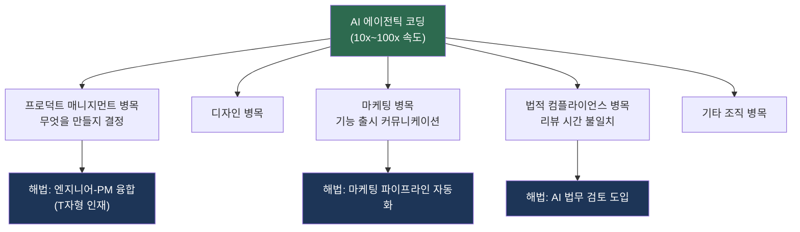
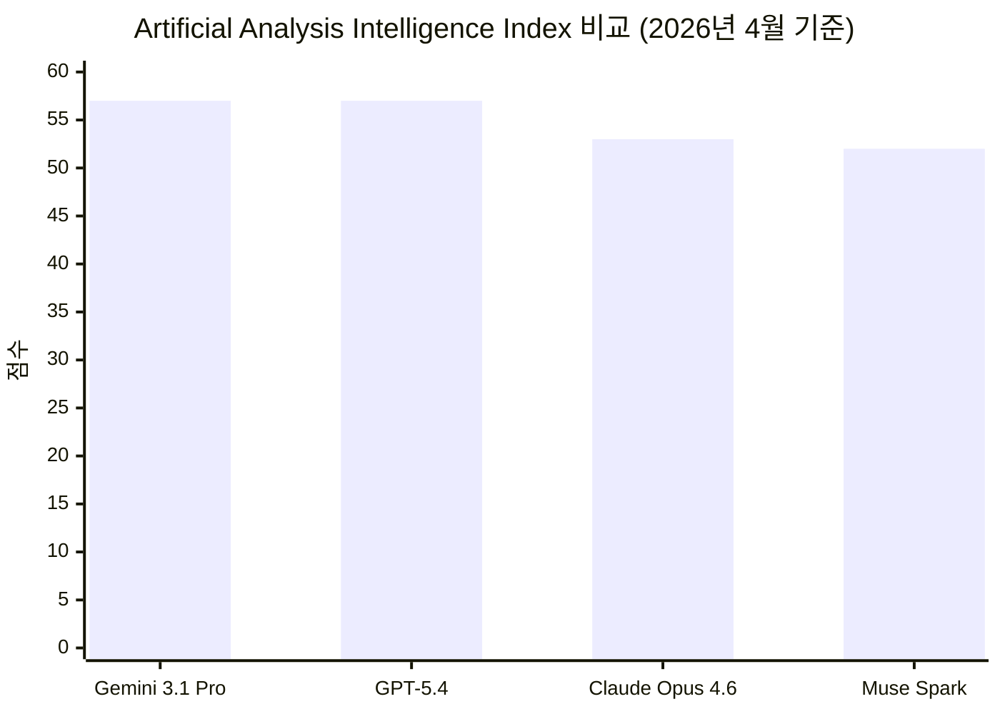
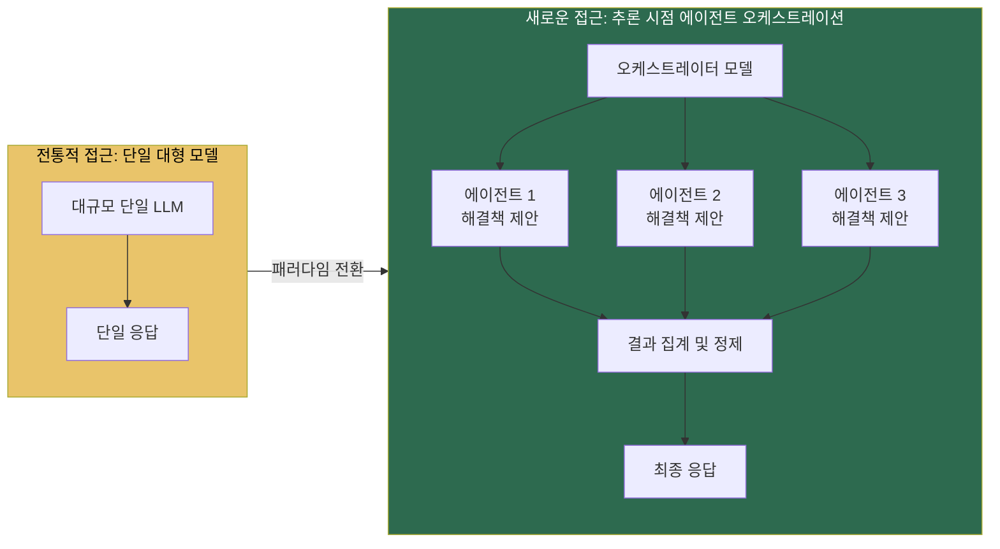
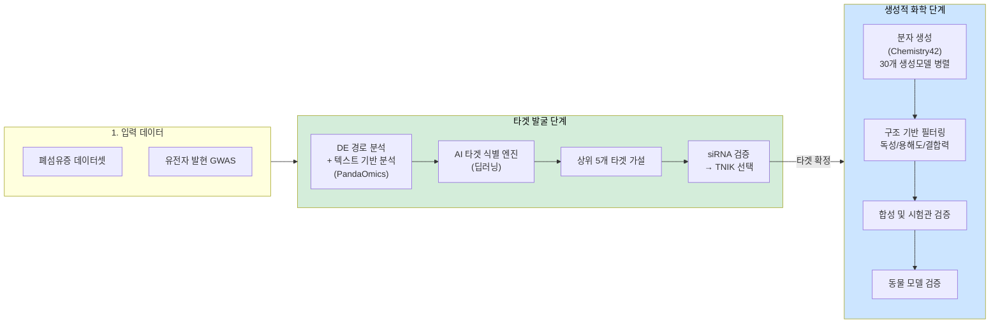
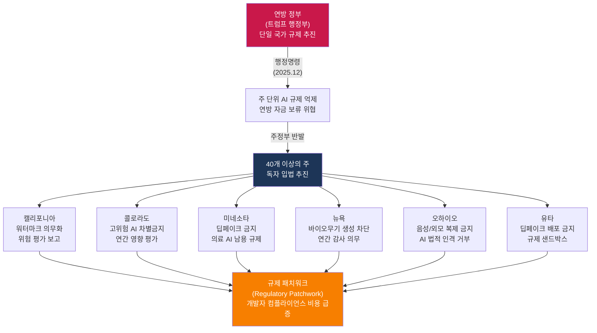
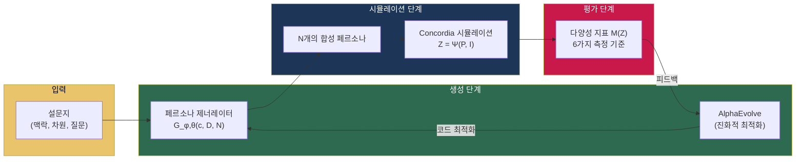
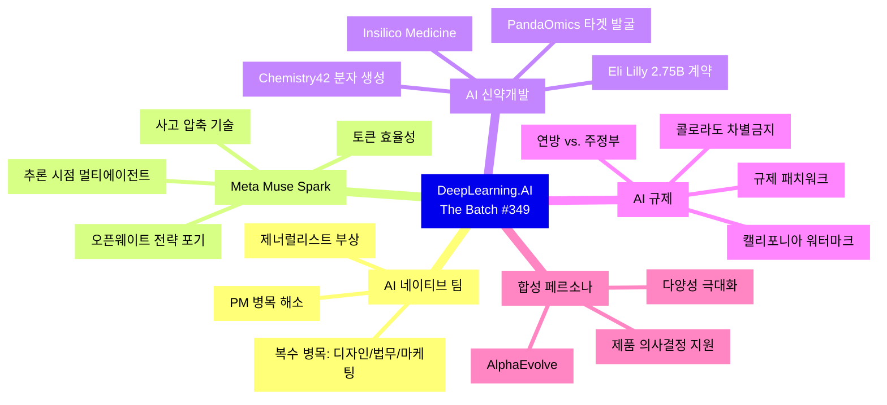

> **원문**: [The Batch Issue #349 (2026년 4월 17일)](https://www.deeplearning.ai/the-batch/issue-349/)  
> **주요 키워드**: AI 네이티브 팀, Meta Muse Spark, AI 신약개발, 미국 AI 규제 패치워크, 합성 페르소나

---

## 관련글

[**The Batch Issue #349 - AI 네이티브 팀의 새로운 병목들**](https://k82022603.github.io/posts/the-batch-issue-349-ai-%EB%84%A4%EC%9D%B4%ED%8B%B0%EB%B8%8C-%ED%8C%80%EC%9D%98-%EC%83%88%EB%A1%9C%EC%9A%B4-%EB%B3%91%EB%AA%A9%EB%93%A4/)

## 목차

1. [앤드류 응의 편지 — AI 네이티브 팀의 작동 방식](#1-앤드류-응의-편지)
2. [Meta의 전략 전환 — Muse Spark와 오픈웨이트 포기](#2-meta의-전략-전환)
3. [빅파마의 AI 베팅 — Eli Lilly와 Insilico Medicine](#3-빅파마의-ai-베팅)
4. [미국 주정부 AI 입법 경쟁 — 규제 패치워크의 등장](#4-미국-주정부-ai-입법-경쟁)
5. [다양한 인간 코호트 시뮬레이션 — 합성 페르소나 연구](#5-합성-페르소나-연구)
6. [종합 시사점](#6-종합-시사점)

---

## 1. 앤드류 응의 편지 — AI 네이티브 팀의 작동 방식

이번 호에서 앤드류 응(Andrew Ng)은 AI 네이티브 소프트웨어 엔지니어링 팀이 전통적인 팀과 근본적으로 다른 방식으로 작동한다는 점에 대해 이야기한다. 가장 표면적인 차이는 AI 네이티브 팀이 코딩 에이전트를 활용해 제품을 훨씬 빠르게 만든다는 것이지만, 이 속도의 차이가 조직 운영 방식 전반에 걸쳐 연쇄적인 변화를 만들어내고 있다는 것이 핵심이다.

### 1.1 프로덕트 매니지먼트 병목

코딩이 빨라지면서 역설적으로 **무엇을 만들지 결정하는 일**이 새로운 병목이 되었다. 앤드류 응은 이 문제를 해결하기 위해 일부 팀들이 엔지니어 대 PM(프로덕트 매니저) 비율을 기존 8:1에서 1:1 수준까지 낮추고 있다고 설명한다. 그러나 그는 여기서 한 발 더 나아간 해법을 제시한다. PM 한 명이 무엇을 만들지 결정하고, 엔지니어 한 명이 그것을 만드는 구조에서도 두 사람 사이의 커뮤니케이션 자체가 병목이 된다는 것이다.

앤드류 응이 관찰한 가장 빠른 팀들은 대부분 엔지니어가 제품에 대한 판단력을 갖추거나, PM이 직접 빌딩 능력을 갖춘 형태였다. 엔지니어가 사용자를 이해하고 무엇을 만들지 직접 결정하며 바로 구현까지 할 수 있을 때, 실행 속도는 극적으로 빨라진다. 이는 단순한 역할 확장의 문제가 아니라, AI 시대에 소프트웨어 팀의 구조 자체가 재편되고 있음을 보여준다.

### 1.2 코딩 가속화가 만들어내는 새로운 병목들

코딩 속도가 10배, 100배 빨라질 때 그 주변의 모든 것이 상대적으로 느려 보이기 시작한다. 앤드류 응은 이를 **스위블 체어 병목(Swivel-Chair Bottleneck)** 이라는 개념으로 설명한다. 예컨대, 그의 팀 중 일부는 훌륭한 기능을 너무 빠르게 만들어버려 마케팅 조직이 그 내용을 사용자에게 어떻게 전달할지 허둥지둥해야 했다. 또한 팀이 하루 만에 소프트웨어를 만들 수 있는데, 법무팀이 리뷰하는 데 일주일이 필요하다면 이것이 곧 법적 컴플라이언스 병목이 된다. 즉, 에이전틱 코딩은 소프트웨어 엔지니어링의 워크플로우만 바꾸는 것이 아니라, 그 주변의 마케팅, 디자인, 법무 등 모든 조직 단위를 동시에 뒤흔들고 있다.

### 1.3 제너럴리스트의 부상

AI가 활성화된 소규모 팀이 더 많은 것을 해낼 수 있게 되면서, 제너럴리스트가 빛을 발하기 시작했다. 전통적인 대기업에서는 엔지니어링, PM, 디자인, 마케팅, 법무 등 수많은 전문가들이 한데 모여야 프로젝트가 진행될 수 있었다. 그러나 2인 팀이 5개의 서로 다른 전문성이 필요한 일을 해내야 한다면, 각 개인은 자신의 핵심 역할 이외의 영역도 소화할 수 있어야 한다.

앤드류 응은 이런 흐름이 불편한 현실이라는 것을 인정하면서도, 동시에 필요한 역량을 기꺼이 배우려는 개인과 소규모 팀들이 이전에는 불가능했던 수준의 성과를 낼 수 있는 시대가 되었다는 점에서 낙관적인 시각을 유지한다. 그는 이를 **"학습과 빌딩의 황금기(Golden Age of Learning and Building)"** 라고 표현한다.

---

## 2. Meta의 전략 전환 — Muse Spark와 오픈웨이트 포기

### 2.1 배경: Llama 이후의 Meta

Meta는 오픈웨이트 모델의 미국 내 최대 챔피언으로 알려져 있었다. Llama 시리즈를 통해 Meta는 오픈소스 AI 생태계의 중심에 서 있었고, 수많은 개발자와 스타트업이 그 위에서 프로젝트를 구축했다. 그러나 2026년 4월, Meta는 약 1년 만에 처음으로 새로운 AI 모델을 발표했는데, 그것이 바로 **Muse Spark**다. 이 모델은 공개 가중치 방식이 아닌 독점(Proprietary) 폐쇄 모델 형태로 출시되었으며, 이는 개발자 커뮤니티에 상당한 충격을 주었다.

이번 발표의 배경에는 Llama 4의 훈련 데이터가 벤치마크 답변으로 오염되었다는 비판이 있었다. Meta는 이를 계기로 AI 연구소를 재편하였고, 2025년 6월에는 Scale AI의 지분 49%를 143억 달러에 인수하면서 공동창업자 알렉산더 왕(Alexandr Wang)을 최고 AI 책임자로 영입했다. 이와 함께 수억 달러 규모의 보상 패키지를 내걸고 대대적인 인재 채용에 나섰다.

### 2.2 Muse Spark의 핵심 기술 특성

Muse Spark는 텍스트, 이미지, 음성 입력을 지원하는 네이티브 멀티모달 추론 모델이다. 최대 262,000 토큰의 컨텍스트 윈도우를 지원하며, 도구 사용(Tool Use) 및 멀티 에이전트 오케스트레이션 기능을 갖추고 있다.

Meta는 기술적 세부 사항을 최소한으로만 공개했지만, 다음과 같은 주요 특징을 강조했다.

**사전 훈련(Pretraining) 개선**: Meta는 사전 훈련 방식, 모델 아키텍처, 최적화, 데이터 큐레이션 전반을 재설계했다. Muse Spark는 Llama 4 Maverick과 유사한 성능을 달성하면서도 훈련에 투입된 연산량을 10배 이상 줄였다고 주장한다.

**사고 압축(Thought Compression)**: 사후 훈련 단계에서 Meta는 모델이 과도한 추론 토큰을 사용하면 페널티를 주는 강화학습을 적용했다. 이 과정에서 모델은 처음에 더 길게 추론하는 방식으로 성능을 높이다가, 점차 추론을 압축하는 방법을 학습하고, 이후 다시 더 길게 추론하면서 추가적인 성능 향상을 이루었다. 이는 단순히 추론 길이를 줄이는 것이 아니라, 추론의 질을 높이는 방향으로 진화한 것이다.

**컨템플레이팅 모드(Contemplating Mode)**: 단일 사고 체인을 처리하는 대신, 컨템플레이팅 모드는 여러 에이전트를 동시에 구동하여 각각이 해결책을 제안하고 정제한 뒤 결과를 병렬로 집계하는 방식을 취한다. Meta는 이 방식이 유사한 레이턴시로 더 높은 성능을 달성한다고 주장한다.

**헬스케어 특화 투자**: 의료 추론 능력 강화를 위해 Meta는 1,000명 이상의 의사를 동원하여 훈련 데이터를 큐레이션했다. 이는 Meta가 헬스케어를 자사 AI의 핵심 차별화 영역으로 전략적으로 선택했음을 보여준다.

### 2.3 벤치마크 성능 분석

Muse Spark의 성능은 전반적으로 경쟁력 있으며, 특히 토큰 효율성에서 두드러진다. Artificial Analysis Intelligence Index에서 Muse Spark는 추론 모드 기준 52점으로 4위를 차지했는데, 이는 공동 3위인 Gemini 3.1 Pro Preview와 GPT-5.4(각 57점), 그리고 Claude Opus 4.6(53점)에 이은 결과다. 흥미로운 점은 Muse Spark가 이 테스트를 완료하는 데 약 5,900만 토큰을 사용한 반면, Claude Opus 4.6은 1억 5,800만 토큰, GPT-5.4는 1억 1,600만 토큰을 사용했다는 것이다. 즉, 절대적인 점수는 낮더라도 **연산 비용 대비 효율성**에서 Muse Spark는 탁월한 성과를 보인다.

멀티모달 영역에서는 강점을 보인다. 차트와 그림을 이해하는 CharXiv Reasoning에서 Muse Spark는 86.4%로 GPT-5.4(82.8%)와 Gemini 3.1 Pro(80.2%)를 모두 앞섰다. 헬스케어 벤치마크(HealthBench Hard)에서도 42.8%로 GPT-5.4(40.1%)를 제쳤다.

반면 코딩 분야에서는 Artificial Analysis Coding Index에서 47점으로 GPT-5.4(57점), Gemini 3.1 Pro Preview(56점), Claude Sonnet 4.6(51점)에 뒤처졌다. Meta 자체는 이를 현재 진행 중인 아키텍처 재설계의 산물로 설명하며, 이 기반 위에 더 큰 모델을 구축할 계획임을 밝혔다.

### 2.4 전략적 의미: 오픈웨이트 시대의 종언?

Muse Spark 발표가 개발자 커뮤니티에 던진 가장 큰 충격은 성능 수치보다 전략적 방향의 전환에 있다. Meta는 그동안 미국에서 오픈웨이트 AI의 가장 강력한 옹호자였으나, 이번 발표를 통해 독점 모델 방향으로 선회했다. 이 결정은 Llama 모델을 기반으로 프로젝트를 구축해온 수많은 개발자들 사이에서 우려를 불러일으켰다.

The Batch의 분석가들이 주목하는 것은 Muse Spark의 컨템플레이팅 모드와 Kimi K2.5의 에이전트 스웜(Agent Swarm) 이라는 공통된 패턴이다. 점점 더 많은 연구소가 단일 대형 모델을 훈련시키는 대신, 추론 시점에 여러 에이전트를 오케스트레이션하도록 모델을 훈련시키는 방식으로 성능을 끌어올리고 있다. 이는 AI 확장(Scaling)의 패러다임이 단순한 모델 크기 증가에서 **추론 시점의 병렬 에이전트 협업**으로 진화하고 있음을 시사한다.

---

## 3. 빅파마의 AI 베팅 — Eli Lilly와 Insilico Medicine

### 3.1 역사적 계약의 의미

2026년 3월, 세계 최대 제약회사 중 하나인 일라이 릴리(Eli Lilly)가 홍콩 기반 바이오테크 기업 Insilico Medicine에 최대 **27억 5천만 달러**에 달하는 계약을 체결했다. 초기에는 1억 1,500만 달러를 지급하여 아직 인체 임상 실험을 거치지 않은 미공개 약물들에 대한 독점 개발·판매 권리를 획득하고, 이후 개발, 규제 승인, 상업적 마일스톤에 따라 추가 지급이 이루어지는 구조다. 이는 두 회사 사이의 세 번째 협력으로, 2023년 AI 소프트웨어 라이선스 계약, 2025년 11월 1억 달러 규모의 연구 협력에 이은 것이다.

생성형 AI가 텍스트, 이미지, 오디오, 비디오, 코드를 생성할 수 있다는 것은 이미 증명되었다. 이제 세계에서 가장 가치 있는 제약회사가 AI가 약물도 생성할 수 있다는 데 수십억 달러를 베팅한 것이다.

### 3.2 Insilico Medicine의 AI 신약개발 파이프라인

2014년 설립된 Insilico Medicine은 AI를 신약개발 파이프라인 전반에 걸쳐 적용해왔다. 현재까지 28개의 후보 약물을 개발했으며, 그 중 약 절반이 임상시험에 진입해 있다.

가장 주목받는 약물은 **렌토서팁(Rentosertib)** 으로, 특발성 폐섬유증(Idiopathic Pulmonary Fibrosis, IPF)을 표적으로 한다. IPF는 폐에 점진적으로 흉터가 생기면서 폐 기능을 서서히 저하시키는 질환으로, 기존에는 효과적인 치료법이 매우 제한적이었다. Phase 2a 임상 결과는 긍정적이었는데, 최고 용량을 투여받은 참가자들은 폐 기능 지표(강제 폐활량)가 평균 98.4밀리리터 증가한 반면, 위약 투여군은 20.3밀리리터 감소했다. 이는 AI가 생성한 약물이 실제 환자에게 도움이 될 수 있다는 초기이지만 구체적인 증거다.

두 번째 약물인 **가루타두스타트(Garutadustat)** 는 염증성 장질환 치료를 목적으로 하며, 2026년 1월에 Phase 2a에 진입했다.

### 3.3 첨부 이미지 1: AI 신약개발 파이프라인 다이어그램 해설

첨부된 첫 번째 이미지는 Insilico Medicine의 AI 기반 신약개발 전체 프로세스를 시각화한 것으로, 크게 **타겟 발굴(Target Discovery)** 과 **생성적 화학(Generative Chemistry)** 두 단계로 구성된다.

**[1단계] 입력 데이터**: 폐섬유증 데이터셋과 유전자 발현·GWAS(전장 유전체 연관 분석) 데이터를 수집한다.

**[2단계] DE 및 경로 분석 + 텍스트 기반 분석 도구**: PandaOmics라는 도구가 생물학 데이터셋, 발표 논문, 특허, 임상시험, 연구비 지원 신청서를 분석한다. 트렌드, 발표 논문, 임상시험, 연구비 데이터를 종합하여 후보 타겟을 선별한다.

**[3단계] AI 기반 타겟 식별 엔진**: 이질적 그래프 워크(Hetero-graph walk), 행렬 인수분해(Matrix factorization), 인과 추론(Causal inference), 드 노보 경로 재구성(De novo pathway reconstruction) 등 딥러닝 기법을 적용하여 각 타겟을 질환 관련성, 약물 타겟 적합성, 신규성 측면에서 순위화한다.

**[4단계] 상위 5개 타겟 가설 도출**: 소분자 약물 가능성, 단백질·수용체 키나아제 특성, 신규성을 종합하여 상위 후보를 추린다.

**[5단계] siRNA 검증**: 선택된 타겟에 대해 siRNA 기법으로 생물학적 유효성을 검증한다. IPF의 경우, 이 과정에서 TNIK 단백질이 최우선 타겟으로 선정되었다. TNIK는 IPF와 관련 질환을 특징짓는 섬유화 과정에 관여하는 단백질로, 이전에 누구도 TNIK를 억제하는 방식으로 IPF를 치료하려는 시도를 한 적이 없었다.

**[6단계] 분자 생성**: Chemistry42라는 도구를 사용하여 약 30개의 생성 모델이 병렬로 후보 분자 구조를 생성한다. 각 모델은 결합력, 독성, 용해도 등의 특성을 최적화하도록 설계되었으며, 과학자들이 여러 라운드에 걸쳐 결과를 평가하고 정제한다. 이 과정에서 불과 80개 미만의 화합물을 합성·테스트하여 리드 분자를 도출했다. 기존 신약개발에서는 통상 20만~100만 개의 기존 화합물을 스크리닝한 뒤 수백 개의 후보를 합성·테스트한다.

**[7단계] 합성 및 생체 내 검증**: 후보 분자를 실제로 합성하고, 시험관 내(in vitro) 분석 검증 및 섬유증 동물 모델에서의 검증을 수행한다.

이 전체 과정에서 타겟 선별부터 전임상 안전성 테스트 준비 완료 분자 합성까지 약 **18개월**이 소요되었는데, 이는 기존의 5~6년과 비교했을 때 혁명적인 단축이다.

### 3.4 AI 신약개발의 도전과 가능성

AI 신약개발의 잠재력은 분명하지만, 현실적인 장벽도 여전히 존재한다. 일반적으로 신약 하나를 개발하는 데는 10~15년이 걸리고 20억 달러 이상의 비용이 든다. 그리고 후보 물질의 86%는 최종 승인에 이르지 못한다. AI는 이 과정의 초기 단계를 극적으로 가속화하는 능력을 증명했지만, 가장 중요한 물음은 여전히 남아 있다. **AI가 설계한 약물이 기존 방식으로 개발된 약물과 비교했을 때 임상시험 통과율이 더 높을 것인가?**

2025년 중반 기준으로 173개의 AI 활성화 신약 프로그램이 임상 단계에 있다는 동료 심사 분석이 있었음에도, 아직까지 AI가 발굴한 약물이 규제 기관의 최종 승인을 받은 사례는 없다. BenevolentAI와 Recursion Pharmaceuticals의 AI 설계 약물도 Phase 2에서 실패했다. Insilico의 렌토서팁이 Phase 2a에서 긍정적인 결과를 보인 것은 고무적이지만, 이것이 최종 임상 성공으로 이어질지는 지켜봐야 한다.

그럼에도 불구하고, 이번 일라이 릴리와의 27억 5천만 달러 계약은 주요 제약 기업들이 AI 신약개발에 대해 실질적인 상업적 신뢰를 갖기 시작했음을 보여주는 중요한 신호다.

---

## 4. 미국 주정부 AI 입법 경쟁 — 규제 패치워크의 등장

### 4.1 연방 대 주정부: 규제 전쟁의 배경

트럼프 행정부는 AI 규제를 주(州) 단위가 아닌 연방 차원에서 통일적으로 추진해야 한다는 입장을 일관되게 견지해왔다. 2025년 12월, 트럼프 대통령은 주 단위 AI 입법을 억제하기 위한 행정명령에 서명했다. 이 명령은 혁신을 저해하거나 정치적 편향으로 비춰질 수 있는 반편향 규제를 표적으로 삼았으며, 해당 법을 통과시키거나 집행하는 주에 연방 자금을 보류하겠다고 위협하고 의회에 주 규제를 차단하도록 촉구했다.

그러나 이런 연방 정부의 압박에도 불구하고, 40개 이상의 주에서 독자적인 AI 관련 법안을 추진하고 있다. 집계에 따르면 현재 1,500건 이상의 법안이 검토 중이며, 이미 40개 주에서 100개 이상의 법률이 제정되어 있다. 이 법률들은 청소년 챗봇 이용 규제, AI 학습 데이터 저작권 허가, AI 시스템 보안 테스트 의무화 등 다양한 내용을 담고 있다.

### 4.2 주별 AI 규제 현황

**캘리포니아**는 미국에서 가장 포괄적인 AI 법체계를 구축하고 있다. 개빈 뉴섬 주지사는 2026년 3월 30일, 주 정부가 활용하는 AI 도구에 대해 프라이버시 보호, 시민권 지지, 편향 완화를 요구하는 행정명령을 발동했다. 8월부터는 대형 기술 플랫폼과 AI 제공업체가 AI 생성 결과물에 비가시적 워터마크를 의무적으로 적용해야 한다. 또한 1월에 발효된 법들에 따르면, 고급 AI 모델 개발자는 재앙적 위험을 평가하고 심각한 안전 사고를 보고해야 하며, LLM 제공업체는 챗봇이 미성년자와 자해나 성적 내용에 대해 대화하지 못하도록 막아야 한다.

**콜로라도**는 2024년에 미국에서 가장 엄격한 AI 규제 중 하나를 통과시켰으며, 7월부터 발효될 예정이다. 교육, 고용, 금융, 의료, 주거 등 고위험 분야에서 의사결정을 내리는 AI 시스템의 개발자와 배포자가 알고리즘 차별로부터 소비자를 보호하도록 요구한다. 그러나 기업과 기술 회사들의 압력으로 인해 주의회는 연간 영향 평가 의무화 등 일부 부담을 완화하는 방향을 검토 중이다.

**미네소타**는 2023년 딥페이크 선거 개입 금지로 선제적으로 움직인 데 이어, AI를 이용한 의류 제거 이미지 생성 금지 및 개인 행동 기반 가격 동적 책정 금지 법안을 검토하고 있다. 8월에는 AI를 이용해 관련 의사의 검토 없이 의료 보험 적용을 거부하는 행위를 금지하는 법률이 시행된다.

**뉴욕**은 딥페이크 초기 보호부터 2026년의 더 광범위한 규제에 이르기까지 미국에서 가장 엄격한 AI 규제 중 일부를 수립했다. 2027년 1월부터는 매출 5억 달러 이상의 모델 제작사가 생물학 무기 제조나 자율 해킹 도구 개발을 차단하는 엄격한 프로토콜을 준수해야 하며, 연간 감사와 즉각적인 사건 보고가 요구된다.

**오하이오**는 3월 말 발효된 법에 따라 AI를 이용해 제품 판매나 친밀 이미지 생성을 위해 허가 없이 사람의 목소리나 외모를 복제하는 행위를 금지하고 있다. AI 시스템에 배우자, 관리자, 재산 소유자로서의 법적 인격과 권리를 부여하는 것을 거부하는 법안도 검토 중이다.

**유타**는 2026년에만 여러 법안을 통과시키면서 2024년 AI 정책법을 정교하게 다듬었다. 특히 비동의 성적 딥페이크 배포 금지, 의사 검토 없는 AI 기반 의료 거부 금지 등을 포함하며, AI 기업이 새로운 기술을 시험하는 동안 특정 규제에서 일시적으로 면제받을 수 있는 규제 샌드박스 제도를 운영하고 있다.

### 4.3 규제 패치워크의 파급 효과

이 복잡한 규제 지형이 만들어내는 가장 큰 문제는 **컴플라이언스 비용의 급증**이다. 하나의 AI 모델이 콜로라도에서는 편향 감사를, 캘리포니아에서는 워터마킹을, 뉴욕에서는 보고 기준을 충족해야 하는 상황에서, 연방 정부는 이 모든 요건을 무력화하려 하고 있다. 이 관할권 갈등은 AI 시스템 구축 비용을 높이고, 새로운 애플리케이션과 서비스 배포의 법적 위험을 증가시킨다.

The Batch의 분석가들은 일부 주 단위 의무 사항은 합리적이라고 본다. 사용자는 AI 기업이 자신의 프라이버시를 보호해줄 것이라고 기대할 수 있어야 하고, 아이들은 성인을 위해 만들어진 AI 콘텐츠로부터 보호받아야 한다. 그러나 이러한 요건은 국가 차원에서 부과되어야 하며, 의회가 더 통합되고 안정적인 규제 환경을 구축해야 한다고 촉구한다.

---

## 5. 합성 페르소나 연구 — 다양한 인간 코호트 시뮬레이션

### 5.1 연구 배경: LLM의 '평균 응답' 문제

LLM이 사용자 의견을 대리 시뮬레이션할 수 있다는 아이디어는 새롭지 않다. 가능성, 기능, 가격 등에 대해 질문에 답하는 사용자를 시뮬레이션함으로써 공개적 반응을 이해하려는 시도는 이미 존재해왔다. 그러나 LLM은 실제 인간 집단이 보여주는 다양한 반응의 폭을 재현하지 못한다는 근본적인 문제가 있었다.

예를 들어, LLM에게 "오늘 정치적으로 민주당 지지자라면 이 질문에 어떻게 답하겠냐"고 물으면, 모델은 전형적이고 평균적인 응답을 생성하는 경향이 있다. 심지어 특정 인구통계학적 특성을 구체적으로 지정하더라도, 실제 인간 집단이 보일 극단적 관점이나 비전형적 반응을 포착하지 못했다.

### 5.2 연구 내용: Persona Generator

구글의 다비데 파글리에리(Davide Paglieri), 로건 크로스(Logan Cross) 등 연구팀은 이 문제를 해결하기 위해 **페르소나 제너레이터(Persona Generators)** 를 제안했다. 핵심 아이디어는 개별 페르소나를 생성하는 것이 아니라, **다양성을 극대화하는 페르소나 생성 코드 자체를 최적화**하는 것이다.

연구팀은 구글의 진화적 방법론인 **AlphaEvolve**를 활용하여 25개의 페르소나 프롬프트를 생성하고, 그 페르소나들의 태도 다양성을 극대화하는 코드를 개발했다.

**연구 프로세스**는 다음과 같다.

먼저 Gemini 2.5 Pro를 사용하여 의료, 금융 문해력, 음모론 등 다양한 주제에 대한 30개의 설문지를 생성했다. 각 설문지는 맥락(주제 설명), 다양성 축(위험 허용도, 기관에 대한 신뢰 등), 그리고 1(강하게 동의)에서 5(강하게 반대)까지 척도로 답하는 질문들로 구성되었다.

다음으로, AlphaEvolve가 각 설문지당 25개의 페르소나 프롬프트를 생성하는 코드를 반복적으로 업데이트했다. 10개의 코드 버전을 병렬로 작업하며 500번의 반복을 거쳐 다양성 지표를 극대화했다.

각 페르소나의 응답을 자동화하기 위해 **Concordia** 라이브러리로 Gemma 3-27B-IT를 프롬프트하여 각 페르소나가 차례로 설문지에 응답하게 했다. 두 벡터 간 평균 거리, 모든 가능한 응답에 대한 커버리지 등 6가지 지표로 다양성을 평가했다.

### 5.3 첨부 이미지 2: 페르소나 제너레이터 시스템 아키텍처 해설

첨부된 두 번째 이미지는 페르소나 제너레이터의 전체 시스템 아키텍처를 시각화한 것이다.

왼쪽에는 입력값으로 **설문지(Questionnaires)** 가 있으며, 각 설문지는 맥락(Context c), 차원(Dimensions D), 질문(Questions I)의 세 요소로 구성된다.

중앙 상단의 **AlphaEvolve**는 페르소나 제너레이터 코드를 반복적으로 최적화하는 역할을 한다. 최적화된 **페르소나 제너레이터 G_φ,θ(c, D, N)** 은 맥락과 차원을 입력받아 N개의 합성 페르소나 집합 P를 생성한다.

오른쪽 위의 **N개의 합성 페르소나 집단(Population of N synthetic personas P)** 은 생성된 페르소나들의 집합으로, 이들 사이의 교차 및 진화 과정을 통해 다양성이 극대화된다.

중앙 하단의 **Concordia 시뮬레이션 Z = Ψ(P, I)** 은 각 페르소나가 설문지에 응답하는 과정을 시뮬레이션한다. 이 결과는 오른쪽의 **다양성 지표 M(Z)** 로 측정되어 시각화된다.

AlphaEvolve는 이 다양성 지표를 피드백으로 받아 페르소나 제너레이터를 지속적으로 개선하는 피드백 루프를 형성한다.

### 5.4 연구 결과 및 의미

결과는 인상적이었다. 새로운 맥락과 다양성 축이 주어졌을 때, 이 시스템의 페르소나들은 미국 인구통계 통계를 기반으로 한 방대한 페르소나 프롬프트 데이터셋인 Nemotron Personas와 Concordia 메모리 생성기를 모두 능가했다. 테스트 설문지에서 새로운 시스템의 페르소나들은 가능한 모든 응답의 82%를 커버했으며, 이는 Nemotron Personas의 76%와 Concordia 메모리 생성기의 46%보다 높았다.

이 연구의 핵심 통찰은 개별 페르소나 최적화에서 **페르소나 생성기(Generator) 자체의 최적화**로 목표를 전환했다는 점에 있다. 훈련 데이터와의 일치(가장 확률 높은 출력을 생성하는 경향)를 최적화하는 대신, 원하는 모든 가능성을 커버하는 것을 최적화했다. 이는 획기적인 패러다임 전환으로, 페르소나 생성기를 최적화함으로써 실제 사용자 행동을 더 광범위하게 대표할 수 있게 된다.

앤드류 응의 편지에서 언급된 **프로덕트 매니지먼트 병목**과도 직결되는 연구다. 무엇을 만들지 결정하는 것이 새로운 병목이 된 시대에, 합성 페르소나는 LLM을 프롬프트하는 것만으로 무엇을 만들지 결정하는 데 따르는 어려움을 해결하는 흥미로운 가능성을 제공한다.

---

## 6. 종합 시사점

이번 Issue 349는 AI 기술의 발전이 단순히 모델 성능 향상에 그치지 않고, 조직 구조, 산업 생태계, 규제 체계 전반을 재편하고 있음을 다각도로 보여준다.

### 6.1 조직 패러다임의 변화

앤드류 응의 편지는 AI 네이티브 팀이 단순히 "AI 도구를 사용하는 팀"이 아님을 강조한다. 코딩 속도가 10~100배 빨라진다는 것은 단순한 효율화가 아니라, 조직의 모든 기능 단위에 파급 효과를 일으키는 구조적 변화다. PM, 디자이너, 마케터, 법무팀 모두 이 변화에 적응해야 하며, 특히 엔지니어링과 PM 역할의 경계가 급격히 허물어지고 있다. 제너럴리스트의 부상은 단순한 트렌드가 아닌 구조적 필연이다.

### 6.2 추론 시점의 멀티에이전트 아키텍처 패러다임

Meta의 Muse Spark와 Kimi K2.5의 사례는 모델 성능을 끌어올리는 방식이 단순한 파라미터 증가에서 **추론 시점의 멀티에이전트 병렬 처리**로 옮겨가고 있음을 보여준다. 이는 AI 아키텍처 설계의 근본적인 패러다임 전환이다.

### 6.3 AI의 과학 영역 진출

Insilico Medicine과 일라이 릴리의 협력은 AI가 과학의 가장 어려운 문제들을 해결하기 시작했음을 보여주는 이정표다. 신약개발의 초기 단계에서 AI의 역할은 이미 증명되고 있으며, 남은 과제는 이 가속화된 파이프라인이 임상시험 성공률에서도 차이를 만들어낼 수 있는지다.

### 6.4 규제 불확실성의 현실화

미국의 AI 규제 패치워크는 AI 개발자와 배포자에게 실질적인 컴플라이언스 부담을 가중시키고 있다. 연방 정부와 주정부 사이의 규제 갈등이 해소되지 않는 한, 이 불확실성은 AI 생태계의 지속적인 비용 요인이 될 것이다.

### 6.5 합성 데이터와 PM 병목의 교차점

합성 페르소나 연구는 AI 개발 워크플로우 자체에 대한 AI의 기여라는 점에서 흥미롭다. 무엇을 만들지 결정하는 것이 새로운 병목이 된 시대에, AI를 사용해 더 다양한 사용자 반응을 시뮬레이션하는 것은 이 병목을 해결하는 유망한 접근법이 될 수 있다.

---

---

*작성일: 2026년 5월 2일*  
*원문 출처: [DeepLearning.AI The Batch Issue #349](https://www.deeplearning.ai/the-batch/issue-349/) (2026년 4월 17일 발행)*
