> **출처**: DeepSeek-AI, 베이징대학교, 칭화대학교 공동 연구  
> **논문 공개**: 2026년 4월 30일 (이후 GitHub 저장소 비공개 처리됨)  
> **비디오 해설**: ["How DeepSeek Made Vision Models 10× Cheaper"](https://www.youtube.com/watch?v=315Xn6h_e_4) — Prompt Engineering 채널 (2026.05.02)

---

## 목차

1. [왜 이 논문이 화제인가?](#1-왜-이-논문이-화제인가)
2. [DeepSeek 비전 AI의 2년 계보](#2-deepseek-비전-ai의-2년-계보)
3. [근본 문제 인식: 지각 격차와 참조 격차](#3-근본-문제-인식-지각-격차와-참조-격차)
4. [핵심 아이디어: 시각 원시 단위로 사고하기](#4-핵심-아이디어-시각-원시-단위로-사고하기)
5. [모델 아키텍처와 극단적 토큰 효율성](#5-모델-아키텍처와-극단적-토큰-효율성)
6. [5단계 학습 파이프라인](#6-5단계-학습-파이프라인)
7. [4가지 핵심 태스크 설계](#7-4가지-핵심-태스크-설계)
8. [벤치마크 결과: 수치가 말하는 것](#8-벤치마크-결과-수치가-말하는-것)
9. [논문이 인정한 3가지 한계](#9-논문이-인정한-3가지-한계)
10. [논문 실종 미스터리와 제품 출시 동향](#10-논문-실종-미스터리와-제품-출시-동향)
11. [DeepSeek의 일관된 철학: 더 적게, 더 스마트하게](#11-deepseek의-일관된-철학-더-적게-더-스마트하게)
12. [총평: 이 연구가 AI 산업에 던지는 메시지](#12-총평-이-연구가-ai-산업에-던지는-메시지)

---

## 1. 왜 이 논문이 화제인가?

2026년 4월 30일, DeepSeek는 GitHub 저장소에 "Thinking with Visual Primitives"라는 논문을 공개했다가 곧바로 삭제하는 이례적인 행보를 보였다. 논문은 사라졌지만, AI 커뮤니티는 이미 내용을 빠르게 캡처하고 분석하기 시작했다. 그도 그럴 것이, 이 논문이 제시한 숫자들이 너무나 인상적이었기 때문이다.

800×800 해상도의 단일 입력에 대해 다른 최신 모델들이 수백 개에서 천 개 이상의 KV 캐시 항목을 사용하는 반면, 이 새로운 모델은 단 90개의 항목만으로 동등하거나 더 나은 성능을 달성했다. 이는 동일한 시각 정보를 처리하는 데 드는 연산 비용이 경쟁 모델 대비 약 10배나 적다는 의미다. 단순히 싸게 만든 게 아니라 더 잘 생각하면서도 싸게 만들었다는 점이 핵심이다.

---

## 2. DeepSeek 비전 AI의 2년 계보

이 논문은 갑자기 등장한 것이 아니다. DeepSeek는 지난 2년간 비전 관련 연구를 꾸준히 축적해왔으며, 각 모델마다 하나의 일관된 질문을 추구해왔다: **"여전히 작동하는 가장 저렴한 표현 방식은 무엇인가?"**

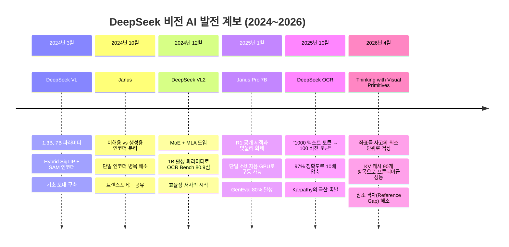

이 계보에서 주목할 사건은 2025년 10월의 DeepSeek OCR 논문이다. 이 연구는 텍스트 토큰 1,000개를 비전 토큰 100개로 압축하면서도 97%의 정확도를 유지한다는 개념을 제시했다. Andrej Karpathy는 이를 보고 "토크나이저는 사라져야 한다. 픽셀이 언어 모델의 더 나은 입력일 수 있다"는 반응을 보였을 정도였다. Thinking with Visual Primitives는 바로 이 흐름의 정점에 놓여 있다.

---

## 3. 근본 문제 인식: 지각 격차와 참조 격차

이 논문은 현재 멀티모달 AI 모델이 겪는 어려움을 두 가지로 명확히 구분한다.

### 지각 격차 (Perception Gap)

첫 번째는 **지각 격차**다. 모델이 세밀한 시각 정보를 제대로 "보지" 못하는 문제다. 고해상도 크로핑, 동적 패칭, Thinking with Images와 같은 접근법들이 모두 이 문제에 집중해왔다. OpenAI의 GPT 시리즈나 Google Gemini의 고해상도 처리 능력도 기본적으로 이 방향의 개선이다.

### 참조 격차 (Reference Gap)

두 번째는 더 근본적인 문제인 **참조 격차**다. 논문은 "설령 모델이 완벽하게 볼 수 있다 하더라도, 자연어는 연속적인 시각 공간 안에서 정확하고 모호하지 않은 포인터 역할을 하기에 본질적으로 너무 불분명하다"고 주장한다.

이를 이해하기 위해 구체적인 예시를 떠올려보자. 어떤 팀 단체사진에서 "왼쪽에서 세 번째 줄, 오른쪽에서 두 번째 사람"이 누구인지를 여러 단계의 추론을 거치며 추적한다고 상상해보라. 추론이 길어질수록 어느 사람을 지칭하고 있었는지 놓치게 된다. 인간은 이 문제를 손가락으로 가리키는 행위로 해결한다. 모델에게는 그에 해당하는 수단이 없었던 것이다.

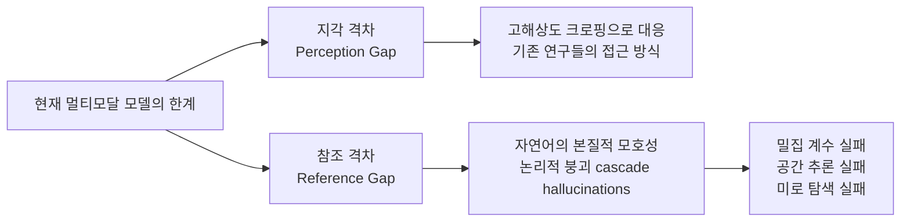

---

## 4. 핵심 아이디어: 시각 원시 단위로 사고하기

논문이 제안하는 해법은 우아할 만큼 단순하다. **경계 박스(bounding box)와 점(point) 좌표를 언어 토큰과 동등한 수준의 '사고의 최소 단위(minimal units of thought)'로 격상**시키는 것이다.

기존 접근법이 시각 정보를 나중에 검증하거나 결과로 출력하는 부수적 수단으로 다뤘다면, 이 논문은 추론 과정 자체에 시각 좌표를 직접 엮어넣는다. 모델이 사고하는 도중에 손가락으로 가리키듯이 좌표를 찍어나가는 것이다.

실제로 모델이 출력하는 형태는 다음과 같다:

```
<|ref|>bear<|/ref|><|box|>[[50,447,647,771]]<|/box|>
```

이것은 함수 호출도 아니고 별도 도구도 아니다. 모델의 사고 연쇄(chain of thought) 안에 직접 포함되는 특수 토큰이다. 텍스트를 생성하듯이 좌표를 생성하며, 그 좌표가 다음 추론 단계의 논리적 닻(anchor) 역할을 한다.

팀 단체사진에서 "남성이 몇 명인가?"라는 질문을 받으면, 모델은 일일이 각 사람의 경계 박스를 생성하면서 25개의 박스를 나열한 뒤 합산해 25명이라는 정답을 도출한다. 언어만으로 추론할 때 발생하는 혼동이 구조적으로 불가능해지는 것이다.

---

## 5. 모델 아키텍처와 극단적 토큰 효율성

### 전체 구조

모델의 기본 구조는 LLaVA와 유사한 표준 아키텍처를 따른다. 입력이 비전 트랜스포머를 통과하고, 텍스트는 토크나이저를 거쳐 두 스트림이 대형 언어 모델로 합쳐진다. 출력 쪽에는 디토크나이저가 있다.

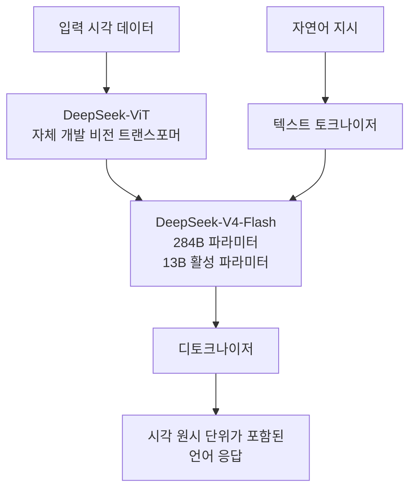

### 언어 백본: DeepSeek-V4-Flash

언어 백본으로는 DeepSeek V4의 더 작은 변형인 V4-Flash를 사용한다. 이것은 전체 파라미터 284B의 혼합 전문가(Mixture-of-Experts, MoE) 모델이지만, 추론 시 활성화되는 파라미터는 13B에 불과하다. 즉, 프론티어급 추론 능력을 갖추면서도 실제 연산 비용은 13B 모델 수준이다. 참고로 이 V4-Flash는 DeepSeek가 "고효율 백만 토큰 컨텍스트 인텔리전스"를 목표로 2026년에 발표한 모델이다.

### 비전 인코더의 단계별 압축

이 모델의 진정한 혁신은 시각 인코더에 있다. DeepSeek-ViT라는 자체 개발 비전 트랜스포머를 사용하며, 임의 해상도를 지원한다.

756×756 해상도를 예시로 전체 압축 파이프라인을 따라가 보자:

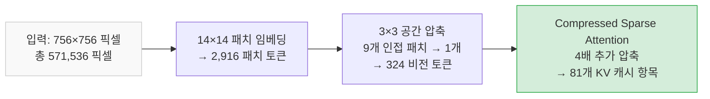

전체 픽셀에서 KV 캐시 항목까지의 압축률은 **7,056배**다. 이것이 다른 모델 대비 이미지당 처리 비용이 약 10분의 1에 불과한 이유다. 또한 논문은 성능과 연산 비용의 균형을 위해 비전 토큰 수를 81개에서 384개 사이로 제한하며, 이 범위를 벗어나는 해상도는 원래 비율을 유지하면서 크기를 조정한다.

---

## 6. 5단계 학습 파이프라인

모델 학습은 5단계로 이루어지며, 전문가 두 명을 따로 키운 다음 합치는 독특한 전략을 채택한다.

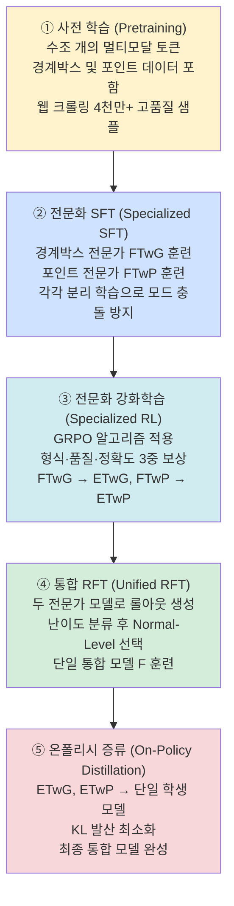

### 사전 학습 데이터 구축의 세심함

사전 학습을 위한 데이터 구축 과정은 특히 주목할 만하다. 연구팀은 Hugging Face를 비롯한 여러 사이트에서 대규모 웹 크롤링을 통해 97,984개의 박스 그라운딩 관련 데이터 소스를 수집했다. 그 다음 두 단계의 필터링을 거쳤다.

첫 번째 의미론적 검토 단계에서는 의미 없는 기계 코드("0", "1" 같은 순수 숫자 레이블), 일반화 불가능한 사적 식별자("내 룸메이트"), 모호한 약어("OK", "NG")를 가진 데이터를 제거했다. 97,984개에서 43,141개로 줄었다.

두 번째 시각-기하학적 품질 검토에서는 심각한 어노테이션 누락(누락률 50% 초과), 객체를 제대로 감싸지 못하는 경계 박스, 이미지 면적의 90% 이상을 차지하는 무의미한 박스를 걸러냈다. 최종적으로 31,701개 데이터 소스에서 카테고리별 균형 샘플링을 통해 4천만 개 이상의 고품질 샘플을 확보했다.

### 강화학습의 세 가지 보상 모델

RL 단계에서는 세 가지 관점의 보상 모델을 동시에 적용한다.

- **형식 보상 모델 (Format RM)**: 생성된 시각 원시 단위의 형식이 올바른지 규칙 기반으로 검증. 경계박스의 경우 중복 박스 생성(무한 루프)도 페널티 부여.
- **품질 보상 모델 (Quality RM)**: LLM 기반 생성형 보상 모델. 사고 과정과 최종 답변의 일관성, 자기모순, 보상 해킹 행동 여부를 검토.
- **정확도 보상 모델 (Accuracy RM)**: 태스크별 맞춤 설계. 계수 태스크는 상대 오차 기반 지수 감쇠 보상으로 부드러운 학습 신호를 제공.

---

## 7. 4가지 핵심 태스크 설계

논문이 다루는 태스크들은 시각 원시 단위 사용이 특히 효과적인 영역으로 선별되었다.

### 태스크 1: 계수 (Counting)

가장 직관적인 응용 분야다. 모델은 경계 박스를 하나씩 생성하면서 세어나간다. 미묘한 점은 태스크를 두 가지로 나눈 것이다.

**거친 계수 (Coarse-grained Counting)**: "이 사진에 개가 몇 마리인가?" 같은 일반 카테고리 계수. 모델은 일괄 그라운딩으로 모든 후보를 동시에 위치 파악한 뒤 합산한다.

**세밀한 계수 (Fine-grained Counting)**: "왼쪽에 있는 흰색 개는 몇 마리인가?" 같이 속성이나 공간 조건이 포함된 계수. GQA 데이터셋의 장면 그래프를 활용해 질문을 생성하고, 오답 유혹 샘플(같은 카테고리지만 다른 속성의 객체)을 포함해 강인성을 강화했다.

### 태스크 2: 공간 추론 및 일반 시각 질답 (Spatial Reasoning & General VQA)

"회색 금속 구체와 같은 크기의 보라색 고무 물체가 있는가?" 같은 질문이 여기에 해당한다. 모델은 먼저 기준 객체를 경계 박스로 특정한 뒤, 각 후보 객체들을 순차적으로 박스로 표시하며 비교 추론을 이어간다. 자연어만으로는 중간에 어느 객체를 논하고 있었는지 잊어버리는 현상이 이 방식으로 완전히 방지된다.

### 태스크 3: 미로 탐색 (Maze Navigation)

가장 극적인 개선이 나타난 영역이다. 순수 언어 기반 사고 연쇄는 불규칙한 궤적을 정확하게 기술하는 데 구조적 한계가 있다. 포인트 좌표를 인지 단위로 활용함으로써 모델은 DFS(깊이 우선 탐색) 방식으로 미로를 탐색하며 경로를 추적할 수 있다.

콜드 스타트 데이터로 무려 460,000개의 합성 미로를 생성했다. 직사각형 격자, 동심원 원형 미로, 육각형 벌집 구조 등 세 가지 위상 구조를 사용하고, 경사 배경·두꺼운 벽·다양한 마커 유형·무작위 소각도 회전 등으로 시각 스타일을 다양화해 과적합을 방지했다. 풀 수 없는 미로도 포함시켰는데, 처음에는 풀 수 있어 보이지만 완전 탐색을 해야만 불가능함을 확인할 수 있도록 경로 중간에 교묘하게 벽을 배치했다.

### 태스크 4: 경로 추적 (Path Tracing)

여러 선이 얽혀 있는 그림에서 특정 선의 시작점에서 끝점까지 따라가는 태스크다. 교차점마다 어느 방향으로 선이 이어지는지를 기하학적 연속성으로 판단해야 하며, 색상 기반 지름길을 막기 위해 모든 선을 동일한 색상과 두께로 그린 버전도 포함했다. 125,000개의 합성 샘플을 생성했다.

---

## 8. 벤치마크 결과: 수치가 말하는 것

### 토큰 효율성 비교

| 모델 | KV 캐시 항목 수 | 압축 전 토큰 수 |
|------|-------------|-------------|
| **Ours (284B-A13B)** | **~90** | **~361** |
| Gemma-4-31B | — | ~289 |
| Qwen3-VL-235B-A22B | — | ~660 |
| GPT-5.4 | — | ~740 |
| Claude-Sonnet-4.6 | — | ~870 |
| Gemini-3-Flash | — | ~1,100 |

800×800 해상도 기준으로 KV 캐시 항목이 단 90개라는 것은 Gemini-3-Flash의 1,100개에 비해 약 12배 적은 수치다. 이것이 "10배 더 저렴하다"는 주장의 근거다.

### 핵심 벤치마크 성능

| 카테고리 | 벤치마크 | Gemini-3-Flash | GPT-5.4 | Claude-Sonnet-4.6 | 우리 모델 |
|---------|---------|--------------|--------|-----------------|---------|
| 계수 | CountQA (EM) | 66.1 | 48.3 | 34.8 | **64.9** |
| 계수 | Pixmo-Count (EM) | 88.2 | 76.6 | 68.7 | **89.2** |
| 세밀한 계수 | DS_Finegrained_Counting | 79.1 | 84.2 | 82.6 | **88.7** |
| 공간 추론 | SpatialMQA | 67.0 | 61.9 | 58.2 | **69.4** |
| 공간 추론 | MIHBench | 83.2 | 83.5 | 81.7 | **85.3** |
| 위상 추론 | DS_Maze_Navigation | 49.4 | 50.6 | 48.9 | **66.9** |
| 위상 추론 | DS_Path_Tracing | 41.4 | 46.5 | 30.6 | **56.7** |

### 결과 해석

가장 극적인 차이는 위상 추론 태스크에서 나타난다. 미로 탐색에서 DeepSeek의 새 모델은 66.9%를 기록했고, GPT-5.4는 50.6%, Claude-Sonnet-4.6은 48.9%에 머물렀다. 약 17포인트 차이다. 경로 추적에서도 56.7%로 가장 근접한 경쟁자 GPT-5.4의 46.5%를 크게 앞섰다.

이는 예상된 결과다. 미로 탐색과 경로 추적이야말로 언어가 궤적을 기술하는 데 구조적으로 취약한 영역이기 때문이다. 반면 Gemini-3-Flash는 원시 계수 질답(CountQA)에서 여전히 앞서며, 위상 추론이 아닌 순수 지각 중심 태스크에서는 경쟁이 치열하다.

---

## 9. 논문이 인정한 3가지 한계

이 논문의 또 다른 미덕은 솔직함이다. 논문은 각주에 "보고된 점수는 이 논문의 연구 초점과 직접 관련된 평가 차원의 일부만을 다루며, 따라서 모델의 전반적인 능력을 나타내지 않는다"고 명시했다. 즉, GPT-5.4나 Claude를 전면적으로 앞섰다는 주장이 아니라, 시각적으로 근거한 추론 태스크에서 앞섰다는 것이다.

논문이 인정한 세 가지 한계는 다음과 같다:

**첫째, 해상도 제약**: 모델은 입력 해상도에 묶여 있어 극도로 세밀한 장면에서 여전히 오류가 발생할 수 있다. 지각 격차(Perception Gap)를 다루는 기존 연구들과 상호 보완적으로 결합하면 해결 가능한 방향이 있다.

**둘째, 명시적 트리거 의존성**: 현재 "시각 원시 단위로 사고하기" 능력을 발동시키려면 프롬프트에 명시적인 트리거 단어가 필요하다. 모델이 상황에 따라 스스로 이 메커니즘을 발동할지 결정하는 능력은 아직 없다.

**셋째, 위상 추론의 교차 시나리오 일반화 부족**: 포인트 기반 추론이 미로 탐색 등에서는 탁월한 성능을 보이지만, 학습 분포를 벗어난 새로운 위상 시나리오에서는 일반화가 떨어진다.

---

## 10. 논문 실종 미스터리와 제품 출시 동향

### 왜 논문이 사라졌는가?

2026년 4월 30일에 공개된 GitHub 저장소는 며칠 내로 비공개 처리되었다. AI 커뮤니티는 다양한 해석을 내놓았다. 가장 설득력 있는 분석은 이 논문이 독립적인 비전 모델보다는 DeepSeek의 컴퓨터 사용(computer use) 에이전트 개발의 일환일 수 있다는 것이다. 경계 박스와 포인트 좌표를 추론에 직접 활용하는 능력은 브라우저나 데스크탑 환경에서 에이전트가 작동하는 방식과 정확히 일치한다.

또한 일부 관찰자들은 DeepSeek가 별도의 "V4-Flash-Vision" 모델을 출시하는 것이 아니라 비전 가중치를 V4 메인 라인에 직접 통합하고 있을 가능성을 제시했다. 논문 삭제는 출시 전략이나 제품화 준비 과정의 일부일 수 있다.

### 실제 서비스 출시 동향

2026년 4월 29일, DeepSeek는 앱과 웹에서 비전 모드를 제한적으로 롤아웃하기 시작했다. 빠른 응답(Fast mode)과 전문가 모드(Expert mode)와 함께 비전 기능이 일부 사용자에게 제공되기 시작했다는 보고가 나왔다. 논문 자체는 숨겨졌지만, 그 뒤에 있는 모델은 조용히 배포되고 있는 것으로 보인다.

---

## 11. DeepSeek의 일관된 철학: 더 적게, 더 스마트하게

이 모든 연구를 관통하는 하나의 질문이 있다: **"여전히 작동하는 가장 저렴한 표현 방식은 무엇인가?"**

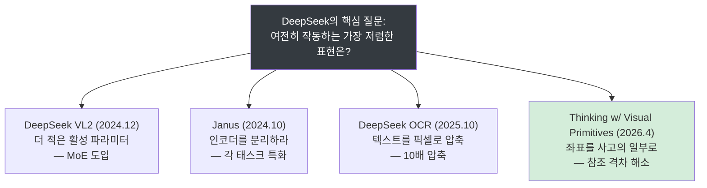

이 철학은 단순히 기술적 효율성을 넘어선다. 동일한 연산 자원으로 더 많은 사용자에게 서비스를 제공할 수 있고, 더 긴 컨텍스트를 처리할 수 있으며, 엣지 디바이스 배포 가능성도 높아진다. V4-Flash가 "고효율 백만 토큰 컨텍스트 인텔리전스"를 목표로 한다는 점을 고려하면, 비전 토큰 효율화는 장문 멀티모달 상호작용을 가능하게 하는 핵심 기반 기술이기도 하다.

---

## 12. 총평: 이 연구가 AI 산업에 던지는 메시지

### 기술적 기여

Thinking with Visual Primitives가 제안하는 것은 단순한 성능 개선이 아니다. 이것은 AI가 시각적 사고를 하는 방식에 대한 패러다임 전환이다. 언어 모델이 언어 토큰을 생성하듯 좌표 토큰을 생성하게 함으로써, 시각과 언어의 경계가 근본적으로 흐려진다.

인간이 복잡한 공간 문제를 다룰 때 손가락으로 가리키고, 선을 따라가고, 경로를 표시하는 것처럼, 모델도 이제 그 인지적 행위를 내면화한다. 이것이 논문이 Daniel Kahneman의 "시스템 2 사고"를 언급하며 "System-2-like multimodal intelligence"로의 경로를 제시한 이유다.

### 산업에 던지는 질문

이 연구는 경쟁사들에게도 중요한 시사점을 던진다. 더 많은 토큰, 더 높은 해상도만이 답이 아닐 수 있다. 참조 능력, 즉 추론 중에 정확하게 "가리키는" 능력이 다음 세대 멀티모달 AI의 핵심 변수가 될 수 있다. 또한 10배 낮은 처리 비용은 비전 AI의 상용화 경제학을 근본적으로 바꿀 잠재력이 있다.

논문은 비록 삭제되었지만, 그 아이디어는 이미 커뮤니티에 퍼져나갔고 DeepSeek의 제품 서비스에도 조용히 스며들고 있다. 다음에 우리가 AI에게 "저 세 번째 사람을 가리켜봐"라고 요청할 때, 이 논문의 아이디어가 작동하고 있을 것이다.

---

## 참고 자료

- DeepSeek-AI et al., "Thinking with Visual Primitives" (2026) — GitHub 클론본: https://github.com/mitkox/Thinking-with-Visual-Primitives
- Prompt Engineering 채널, "How DeepSeek Made Vision Models 10× Cheaper" (2026.05.02)
- DeepSeek-AI, "DeepSeek-V4: Towards Highly Efficient Million-Token Context Intelligence" (2026)
- AI News: "DeepSeek Primitives Boost Visual Reasoning" (2026.04.30)

---

*이 문서는 DeepSeek의 "Thinking with Visual Primitives" 논문 전문, 관련 유튜브 해설 영상 트랜스크립트, 그리고 최신 웹 검색 결과를 종합하여 작성되었습니다. 2026년 5월 2일 기준 정보입니다.*


---

# [별첨] Thinking with Visual Primitives — 논문 핵심 도해 완전 해설 [#](https://claude.ai/public/artifacts/e1891f36-c067-46dc-be00-ed796568e0ad)

> 이 문서는 DeepSeek-AI의 ["Thinking with Visual Primitives" (2026) 논문](https://github.com/mitkox/Thinking-with-Visual-Primitives/blob/main/Thinking_with_Visual_Primitives.pdf)에 수록된  
> 핵심 도해(Figure 4~10, Table 1)를 상세히 해설합니다.  
> 각 예시는 모델이 어떤 방식으로 시각 원시 단위(경계 박스·포인트)를 실제 추론에 활용하는지를 구체적으로 보여줍니다.

---

## 목차

- [Figure 4: 공간 추론의 콜드스타트 예시](#figure-4-공간-추론의-콜드스타트-예시--보라색-고무-물체-탐색)
- [Figure 5: 미로 탐색의 콜드스타트 예시](#figure-5-미로-탐색의-콜드스타트-예시--육각형-미로-dfs-탐색)
- [Figure 6: 경로 추적의 콜드스타트 예시](#figure-6-경로-추적의-콜드스타트-예시--왕관-아이콘에서-문어까지)
- [Table 1: 프론티어 모델 비교 벤치마크](#table-1-프론티어-모델과의-종합-성능-비교)
- [Figure 7: 그라운딩 기반 추론 쇼케이스 1](#figure-7-경계-박스를-활용한-추론-쇼케이스-1--계수와-세밀한-구분)
- [Figure 8: 그라운딩 기반 추론 쇼케이스 2](#figure-8-경계-박스를-활용한-추론-쇼케이스-2--세계-지식과-행동-안내)
- [Figure 9: 그라운딩 기반 추론 쇼케이스 3](#figure-9-경계-박스를-활용한-추론-쇼케이스-3--유머-이해와-밀집-계수)
- [Figure 10: 포인팅 기반 추론 쇼케이스](#figure-10-포인트를-활용한-추론-쇼케이스--위상-추론의-정수)
- [전체 예시에서 발견되는 공통 패턴](#전체-예시에서-발견되는-공통-패턴)

---

## Figure 4: 공간 추론의 콜드스타트 예시 — 보라색 고무 물체 탐색

### 장면 구성

CLEVR 툴체인으로 합성된 3D 씬이다. 씬 안에는 금속 재질의 큐브·구체·원기둥, 고무 재질의 큐브·원기둥 등 다양한 속성의 소형 객체들이 배치되어 있다. 배경은 중립적이며, 각 객체는 재질(금속/고무), 색상, 크기(대/소), 형태가 명확히 구분된다.

### 질문

> **"회색 금속 물체와 같은 크기의 보라색 고무 물체가 있는가?"**

이 질문은 단순한 시각 인식 문제가 아니다. 두 번의 검증 단계가 요구된다. 먼저 '회색 금속 물체'를 찾아 그 크기를 파악해야 하고, 그 다음 그 크기에 맞는 '보라색 고무 물체'가 씬에 존재하는지 탐색해야 한다. 이른바 멀티 홉 속성 비교(multi-hop attribute verification) 문제다.

### 모델의 추론 과정 단계별 분석

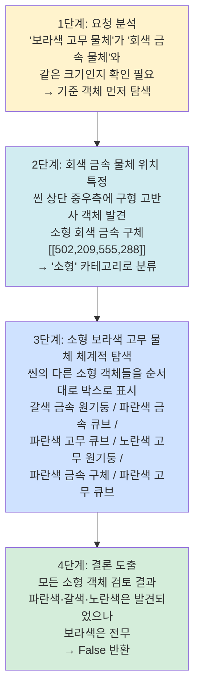

### 이 예시의 기술적 의의

이 예시에서 핵심적인 관찰 포인트는 모델이 탐색을 **순서대로, 빠짐없이** 수행한다는 점이다. 각 후보 객체에 경계 박스를 찍으면서 색상과 재질을 언급하고 제거해나가는 방식은, 마치 탐정이 용의자 명단에서 하나씩 알리바이를 확인하며 지워나가는 과정과 같다. 순수 언어 추론이었다면 "씬에 보라색 고무 물체가 있어야 한다"는 방향으로 환각을 일으켰을 가능성이 높다. 경계 박스가 모델의 주의를 실제 존재하는 객체에 고정시켜 준 것이다.

또한 `[[502,209,555,288]]`과 같은 좌표는 단순한 출력이 아니다. 이 좌표는 이후 추론 단계에서 "소형 크기 기준점"으로 작동하며, 이후 탐색할 객체들의 크기 비교 기준이 된다. 좌표가 논리적 닻의 역할을 하는 것이다.

---

## Figure 5: 미로 탐색의 콜드스타트 예시 — 육각형 미로 DFS 탐색

### 장면 구성

육각형 셀로 이루어진 벌집 구조(honeycomb lattice) 미로다. 크기는 중간 난이도 수준이며, 시작점은 라임색 텍스트 레이블로, 도착점은 귤색 원으로 표시되어 있다. 왼쪽은 원본 미로, 오른쪽은 모델이 탐색한 경로가 포인트 마커로 시각화된 버전이다.

### 질문

> **"라임색 텍스트 레이블에서 귤색 원까지 이동할 수 있는 경로가 있는가? 경로를 그려라."**

### 모델의 DFS 탐색 단계별 분석

이 예시는 10단계에 걸친 탐색 과정을 보여준다. 핵심은 포인트 좌표가 **탐색 상태 추적 도구**로 사용된다는 점이다.

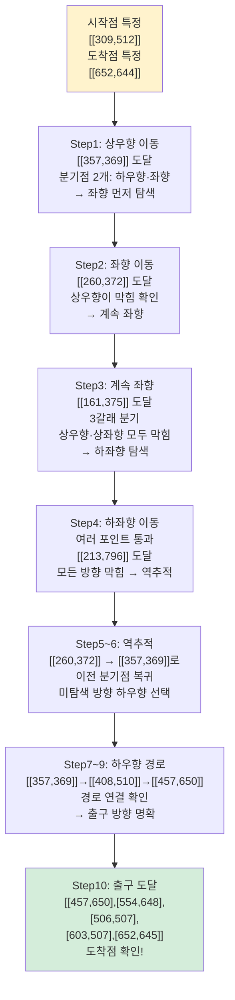

### 최종 경로 출력

```
<point>[[310,513],[357,369],[408,510],[457,650],[554,648],[506,507],[603,507],[652,645]]</point>
\boxed{True}
```

### 이 예시의 기술적 의의

이 예시는 시각 원시 단위 중 **포인트**가 어떻게 경로 탐색 알고리즘의 인지적 등가물로 기능하는지를 명확하게 보여준다. 

가장 인상적인 부분은 역추적(backtracking) 처리다. Step5에서 막다른 길에 부딪혔을 때 모델은 이전 분기점의 좌표를 명시적으로 언급하며 돌아간다. 이것은 단순히 "왔던 길로 돌아간다"는 언어적 기술이 아니라, 저장된 좌표를 참조점으로 활용하는 실질적인 상태 추적이다. 순수 언어 추론이라면 "어느 분기점"이었는지 10단계가 지난 시점에서 혼동을 일으켰을 것이다.

또한 오른쪽 시각화 버전을 보면 탐색 경로가 실제로 시각화되어 있어, 모델의 출력 포인트들이 구조적으로 올바른 경로임을 육안으로 확인할 수 있다. 논문이 460,000개의 다양한 난이도 미로를 콜드스타트 데이터로 사용한 이유가 바로 이 복잡한 역추적 능력을 체득시키기 위해서였다.

---

## Figure 6: 경로 추적의 콜드스타트 예시 — 왕관 아이콘에서 문어까지

### 장면 구성

여러 개의 베지어 곡선(Bézier curve)이 복잡하게 얽혀 있는 씬이다. 각 선의 시작점에는 아이콘(왕관, 펭귄, 문어 등)이 있고, 각 선의 끝점에도 아이콘이 있다. 도전 과제는 교차점에서 어느 방향으로 선이 계속 이어지는지를 기하학적 연속성으로 판단하는 것이다. 오른쪽 시각화 버전에서는 대상 곡선(마젠타색)의 추적 경로가 점들로 표시되어 있다.

### 질문

> **"왕관 아이콘은 어디에 연결되는가? 목적지 아이콘 이름을 답하라."**

### 모델의 추론 과정

먼저 왕관 아이콘의 위치를 좌표로 특정한다.

```
<point>[[176,758]]</point>
```

그 다음, 마젠타 선을 따라가며 수십 개의 중간 경유점을 순차적으로 출력한다. 직선 구간은 간격을 넓게, 커브가 심한 구간이나 교차점 근방은 더 촘촘하게 좌표를 찍는다. 이 밀도 조절이 핵심이다—곡률이 높아질수록 모델이 더 세밀하게 추적한다는 것은 인간이 복잡한 교차로에서 속도를 늦추는 것과 동일한 인지 전략이다.

```
<point>
[[176,759],[230,779],[294,799],[326,806],[361,806],[380,793],...
...,[665,313],[732,356],[822,419]]
</point>
```

최종 도착 좌표 `[[821,419]]`에서 연결된 아이콘이 **문어(octopus)** 임을 확인하고 답한다.

```
Response: The line connects to the octopus icon.
\boxed{octopus}
```

### 이 예시의 기술적 의의

이 태스크는 시각 원시 단위의 **웨이포인트 밀도 자동 조절** 능력을 보여준다. 논문에서 언급한 것처럼, 경로 추적의 사고 내용 합성에서 직선 구간은 적은 포인트로, 고곡률 구간이나 교차 밀집 구간은 세밀한 좌표로 표현하도록 훈련된다. 이는 인간이 복잡한 실을 풀 때 교차점 근방에서 더 집중하는 것과 동일한 패턴이다.

또한 이 예시의 어려운 버전에서는 모든 선이 동일한 색상과 두께로 그려진다. 색상이라는 지름길이 제거된 상태에서 오직 곡선의 기하학적 연속성만으로 올바른 선을 추적해야 한다. 이 버전에서의 성공은 모델이 단순 패턴 매칭이 아닌 진정한 경로 추적 능력을 내면화했음을 의미한다.

---

## Table 1: 프론티어 모델과의 종합 성능 비교

이 표는 논문의 핵심 주장을 수치로 검증하는 자리다. 공정한 비교를 위해 모든 모델을 API를 통해 동일한 프롬프트 세트로 평가했으며, 추론/사고 예산이 설정 가능한 모델(GPT, Gemini-3-Flash)은 모두 '낮음(low)'으로 통일했다.

### 계수(Counting) 부문

| 벤치마크 | Gemini-3-Flash | GPT-5.4 | Claude-Sonnet-4.6 | Gemma4-31B | Qwen3-VL | **우리 모델** |
|---------|:---:|:---:|:---:|:---:|:---:|:---:|
| CountQA (EM) | **66.1** | 48.3 | 34.8 | 43.2 | 42.7 | 64.9 |
| Pixmo-Count (EM) | 88.2 | 76.6 | 68.7 | 82.9 | 77.2 | **89.2** |
| DS_Finegrained_Counting (EM) | 79.1 | 84.2 | 82.6 | 79.5 | 87.2 | **88.7** |

계수 부문에서는 Gemini-3-Flash와 거의 동등하거나 일부에서 앞선다. 특히 세밀한 계수(DS_Finegrained_Counting)에서는 Claude 대비 6포인트, GPT 대비 4.5포인트 앞선다. 경계 박스를 하나씩 찍어가며 세는 방식이 세밀한 속성 구분이 필요한 계수에서 특히 효과적임을 보여준다.

### 공간 추론 및 일반 VQA 부문

| 벤치마크 | Gemini-3-Flash | GPT-5.4 | Claude-Sonnet-4.6 | Gemma4-31B | Qwen3-VL | **우리 모델** |
|---------|:---:|:---:|:---:|:---:|:---:|:---:|
| MIHBench | 83.2 | **83.5** | 81.7 | 82.2 | 75.1 | **85.3** |
| SpatialMQA | 67.0 | 61.9 | 58.2 | 60.6 | 54.5 | **69.4** |
| EmbSpatial | 82.6 | 80.9 | 75.1 | 82.1 | **83.7** | **83.7** |
| CV-Bench | **88.6** | 87.5 | 85.1 | 87.5 | 88.1 | 88.4 |
| OmniSpatial | **59.6** | 58.8 | 53.2 | 49.4 | 55.3 | 59.5 |
| DS_Spatial_Reasoning | 93.2 | 81.1 | **97.2** | 77.2 | 96.8 | **98.7** |

공간 추론 부문에서 가장 두드러지는 수치는 DS_Spatial_Reasoning에서의 98.7%다. Claude-Sonnet-4.6의 97.2%, Gemini-3-Flash의 93.2%를 모두 앞선다.

### 위상 추론(Topological Reasoning) 부문 — 가장 극적인 격차

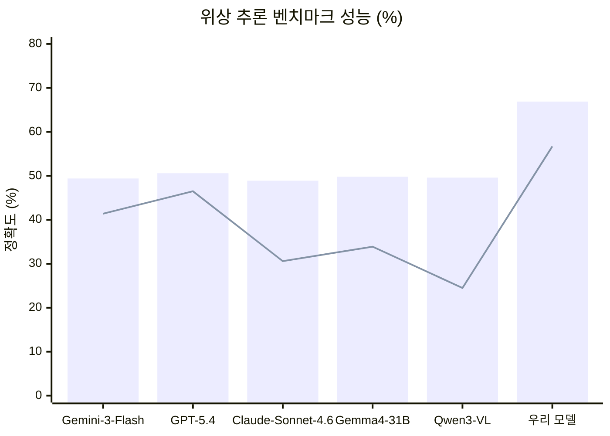

| 벤치마크 | Gemini-3-Flash | GPT-5.4 | Claude-Sonnet-4.6 | Gemma4-31B | Qwen3-VL | **우리 모델** |
|---------|:---:|:---:|:---:|:---:|:---:|:---:|
| DS_Maze_Navigation | 49.4 | 50.6 | 48.9 | 49.8 | 49.6 | **66.9** |
| DS_Path_Tracing | 41.4 | 46.5 | 30.6 | 33.9 | 24.5 | **56.7** |

이 수치가 이 연구의 핵심 기여를 가장 선명하게 드러낸다. 미로 탐색에서 경쟁 모델들은 모두 49~50% 언저리에 몰려 있다—거의 무작위 추측에 가까운 수준이다. 반면 이 모델은 66.9%로 약 17포인트를 앞선다. 경로 추적에서는 56.7%로, 가장 근접한 경쟁자(GPT-5.4, 46.5%)보다 10포인트 이상 앞서고, Qwen3-VL(24.5%)의 두 배가 넘는다.

### 표에서 읽어야 할 중요한 단서

논문은 표 상단 캡션에 솔직하게 명시했다: "보고된 점수는 이 논문의 연구 초점과 직접 관련된 평가 차원의 일부만을 다루며, 모델의 전반적인 능력을 나타내지 않는다." CV-Bench나 CountQA에서 Gemini-3-Flash가 여전히 우세한 것은 이 모델이 모든 측면을 앞선 것이 아님을 보여준다. 논문의 주장은 '시각적으로 근거한 위상 추론'에서의 우위이며, 그 주장은 수치로 뒷받침된다.

---

## Figure 7: 경계 박스를 활용한 추론 쇼케이스 1 — 계수와 세밀한 구분

이 쇼케이스에는 세 가지 질문이 담겨 있으며, 경계 박스 기반 추론의 다양한 응용 측면을 보여준다.

---

### 예시 1: "이 사진에 포켓몬이 몇 마리인가?"

테이블 위에 다양한 장난감 피규어들이 놓여 있다. 도라에몽, 원피스 루피·조로, 짱구, 탐정 피카츄 등 다른 프랜차이즈 캐릭터들과 포켓몬 캐릭터들이 뒤섞여 있다.

모델의 사고 과정은 세 단계로 구조화된다:

**1단계: 요청 이해** — 포켓몬 프랜차이즈 캐릭터만 식별해야 함을 인지한다.

**2단계: 포켓몬 탐색** — 씬을 스캔하며 피카츄, 파이리, 이상해씨, 꼬부기, 푸린, 코일(?), 잠만보(?)를 경계 박스로 묶는다.

```
<ref>pokemons</ref>
<box>[[215,483,368,711],[330,180,422,348],[465,438,582,638],
      [581,403,674,588],[635,195,723,323],[640,244,814,429]]</box>
```

**3단계: 다른 프랜차이즈 명시적 제거** — 도라에몽, 루피, 조로, 짱구, 탐정 모자 캐릭터를 명시적으로 언급하며 제외한다.

이 세 번째 단계가 특히 중요하다. 단순히 포켓몬을 세는 것이 아니라, 제외해야 할 대상을 명시적으로 처리함으로써 오답의 원인이 될 수 있는 혼동을 차단한다. **최종 답: 6마리.**

---

### 예시 2: "어느 쪽이 더 무거운가?"

천칭 저울 양쪽에 회색 금속 로커와 반투명 무지개색 거대 곰돌이 젤리가 놓여 있다. 상식적으로는 로커가 훨씬 무거워야 하지만, 저울은 젤리 쪽이 내려가 있다.

모델은 각 물체를 경계 박스로 특정한 뒤, 저울의 물리적 증거를 체계적으로 분석한다:

- 왼쪽 로커 트레이: `[[20,685,393,759]]` — 위쪽에 위치
- 오른쪽 젤리 트레이: `[[636,747,970,860]]` — 아래쪽에 위치

트레이의 높낮이를 비교함으로써 "젤리 쪽이 더 무겁다"는 반직관적 결론에 도달한다. 이 예시는 **상식과 시각적 증거가 충돌할 때 모델이 시각 정보를 우선**한다는 것을 보여준다. 경계 박스로 트레이를 명확히 특정했기에 높이 비교가 모호하지 않다.

---

### 예시 3: "이 사진에 치와와가 몇 마리인가? (치와와 vs 블루베리 머핀 그리드)"

인터넷에서 유명한 "치와와 vs 머핀" 밈 형식이다. 3×4 그리드에 치와와 얼굴과 블루베리 머핀이 번갈아 배치되어 있어 색상과 질감이 매우 유사하다.

모델은 전체 그리드를 스캔하며 치와와만을 선택적으로 박스로 묶는다:

```
<ref>Chihuahuas</ref>
<box>[[2,366,233,641],[247,0,498,341],[255,680,498,997],
      [499,347,749,670],[743,0,996,317],[743,658,992,997]]</box>
```

그 다음 위치를 언어로도 확인한다: "1열 2·4번, 2열 1·3번, 3열 2·4번." **최종 답: 6마리.** 이 예시는 시각적으로 유사한 객체들 사이에서 정확한 분류가 가능함을 보여준다.

---

## Figure 8: 경계 박스를 활용한 추론 쇼케이스 2 — 세계 지식과 행동 안내

이 쇼케이스는 중국어 질문에 대한 응답 세 가지로 구성된다. 기본 모델(DeepSeek V4-Flash)의 다국어 능력이 비전 추론과 자연스럽게 결합됨을 보여준다.

---

### 예시 1: "이 근처에 NBA 팀이 있는가?" (금문교 사진)

모델은 씬에서 독특한 랜드마크를 탐색한다. 파란 수면 위의 선명한 붉은색 현수교와 배경의 도시 스카이라인, 언덕을 식별하고:

```
<ref>채색된 금문교</ref>
<box>[[0,134,882,795]]</box>
```

금문교 → 샌프란시스코 → 골든 스테이트 워리어스(Chase Center 위치) 순서로 세계 지식을 연결해 "예, NBA 팀이 있습니다"라고 정확하게 답한다.

이 예시가 흥미로운 이유는 경계 박스가 단순히 객체를 세거나 비교하는 용도가 아니라, **지식 검색의 출발점**으로 기능하기 때문이다. 랜드마크를 박스로 특정함으로써 그 물리적 실체에 세계 지식을 연결하는 과정이 명확해진다.

---

### 예시 2: "테이블 위 기기와 재료를 보고 맛있는 라테를 어떻게 만드는가?"

전자동 에스프레소 머신, 스팀 봉, 스테인리스 밀크 피처, 원두 봉지, 도자기 커피잔이 테이블 위에 있다.

모델은 각 도구를 경계 박스로 특정하면서 조작 순서를 설명한다:

- 블랙 자동 에스프레소 머신: `[[111,107,721,970]]`
- 스팀 봉: `[[164,405,236,693]]`
- 스테인리스 밀크 피처: `[[670,638,853,905]]`
- 라테 버튼: `[[408,219,444,261]]`
- 도자기 커피잔: `[[535,779,770,988]]`

그 다음 조작 순서를 명확하게 안내한다: ① 라테 버튼 선택 → ② 스팀 봉으로 우유 거품 내기 → ③ 도자기 잔에 에스프레소와 거품 우유 혼합. 이것은 AR 어시스턴트나 가전 제어 에이전트의 원형과 같다. 경계 박스가 "어떤 버튼"인지 모호함 없이 가리키기 때문에, 사용자는 박스가 표시된 컨트롤 패널의 정확한 위치를 알 수 있다.

---

### 예시 3: "이곳은 어디인가?" (중국 전통 골목 사진)

어두운 목재 문틀, 석회 벽면, 광고 포스터, 조약돌 길, 전통 지붕 구조를 차례로 박스로 특정하면서 건축 양식의 특징을 분석한다:

- 깊은 색 목재 문틀: `[[2,249,176,607]]`
- 전통 사각 등불: `[[56,219,118,284]]`
- 조약돌 보도: `[[0,554,675,995]]`
- 전통 구식 건물: `[[320,330,515,555]]`
- 나무 현판: `[[556,386,616,472]]`

목재 구조, 흙벽, 조약돌 도로, 납염 직물 장식품을 종합적으로 분석하여 "중국 윈난성 고대 마을, 예를 들어 리장 고성, 샤시 고진 또는 바이족/나시족 전통 건축 양식 지역"으로 결론 내린다.

이 예시는 여러 건축적 단서를 박스로 고정한 뒤 순차적으로 추론함으로써, 단일 특징이 아닌 **종합적 특징 패턴으로 지역을 추론**하는 능력을 보여준다.

---

## Figure 9: 경계 박스를 활용한 추론 쇼케이스 3 — 유머 이해와 밀집 계수

---

### 예시 1: "왜 이것이 웃긴가?" (과일 vs 고양이 비교)

좌측에 흰 과육에 자연적인 검은 점이 있는 과일 조각, 우측에 슬프고 초록 눈을 가진 흰 고양이의 클로즈업이 나란히 배치되어 있다.

모델은 두 장면을 비교하며 유사점을 경계 박스로 연결해 분석한다:

- 과일 조각: `[[75,303,414,758]]`
- 동공처럼 보이는 검은 점: `[[185,463,244,552]]`
- 코처럼 보이는 왜곡된 섬유: `[[273,519,369,655]]`
- 고양이의 흰 얼굴: `[[530,284,999,888]]`
- 고양이의 초록 눈: `[[594,547,690,617]]`
- 고양이의 분홍 코: `[[755,715,842,786]]`

그 다음 유머의 메커니즘을 설명한다: "과일 왼쪽의 자연적인 검은 점들이 슬픔에 잠긴 초록 눈 고양이와 놀랄 만큼 유사한 얼굴 표정을 형성한다. 비슷한 '눈'과 '코'가 두 대상 사이의 우스운, 기이한 유사성을 만들어낸다." 이 예시는 모델이 단순 사실 추론을 넘어 **미적·유머적 맥락에서도 시각 원시 단위를 활용**함을 보여준다.

---

### 예시 2: "어떻게 탈출할 것인가?" (방 탈출 게임)

밀폐된 방 안에 높은 선반 위 금빛 열쇠, 잠긴 목재 문, 그리고 낮은 나무 의자가 있다.

```
<ref>빛나는 금빛 열쇠</ref>  <box>[[566,110,649,165]]</box>
<ref>금속 손잡이와 자물쇠의 어두운 목재 문</ref>  <box>[[665,231,991,910]]</box>
<ref>단순한 목재 의자</ref>  <box>[[399,554,603,936]]</box>
```

모델은 세 객체를 경계 박스로 특정한 뒤, 의자를 발판으로 사용해 열쇠를 꺼낸 다음 문을 열면 된다는 논리적 해법을 도출한다. 물리적 제약(손이 닿지 않음)과 가용 자원(의자)을 연결하는 인과 추론이 경계 박스를 통해 명확하게 구조화된다.

---

### 예시 3: "이 사진에 몇 명이 있는가?" (대형 단체사진)

여러 줄로 늘어선 29명의 흑백 단체사진이다. 후방 서있는 사람들, 중간 앉아있는 사람들, 앞줄 의자에 앉은 사람들이 겹쳐있어 계수가 까다롭다.

모델은 전체 프레임을 한 번에 스캔하여 식별된 모든 사람을 단일 경계 박스 시퀀스로 출력한다:

```
<ref>people</ref>
<box>[[4,459,80,859],[32,506,147,900],[105,477,189,883],...
     ...[856,529,989,891]]</box>
```

총 29개의 박스를 출력한 뒤, "맨 뒤에 서있는 사람들, 중간에 약간 앞으로 몸을 굽힌 사람들, 맨 앞줄 의자에 앉은 사람들을 포함한다"고 설명하며 합산한다. **최종 답: 29명.** 이것이 앞서 설명한 거친 계수(coarse-grained counting)의 전형적인 패턴이다—일괄 그라운딩으로 모든 후보를 동시에 위치 파악한 뒤 합산한다.

---

## Figure 10: 포인트를 활용한 추론 쇼케이스 — 위상 추론의 정수

이 쇼케이스에는 두 예시가 있으며, 둘 다 포인트 좌표를 경계 박스 대신 사용하는 경우다. 경계 박스가 객체의 크기와 위치를 포착한다면, 포인트는 **궤적과 경로**를 표현하는 데 더 적합하다.

---

### 예시 1: "초록 마름모에서 빨간 레이블까지 미로를 통과할 수 있는가?" (원형 미로)

동심원 구조의 원형 미로(circular maze)다. 각 링은 각도 섹터로 나뉘며, 인접 링과 섹터 사이의 연결 여부가 미로의 구조를 결정한다. 이런 위상 구조는 육각형 미로와는 다른 방향 개념(시계 방향/반시계 방향, 안쪽/바깥쪽)이 필요하다.

모델은 18단계에 걸친 탐색을 수행하며 여러 막다른 길을 처리한다. 원형 미로에 맞게 방향 언어도 달라진다—"시계 방향", "반시계 방향", "바깥쪽", "안쪽" 등의 표현이 등장한다.

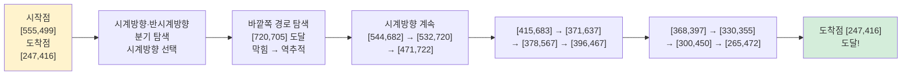

최종 경로:
```
<point>[[555,499],[597,472],[600,594],[544,682],[532,720],[471,722],
        [415,683],[371,637],[378,587],[396,467],[368,397],[330,355],
        [300,450],[265,472],[247,416]]</point>
\boxed{True}
```

---

### 예시 2: "C는 몇 번에 연결되는가?" (선 추적)

베이지색 선들이 여러 방향으로 교차되어 있으며, 시작점 C에서 시작하는 선을 추적해 종단점의 번호를 찾아야 한다.

```
시작점: <point>[[195,594]]</point>

경로 추적:
<point>[[195,594],[319,617],[338,626],[342,588],[375,547],
        [438,522],[508,512],[565,505],[604,490],[609,464],
        [595,427],[579,391],[580,364],[606,358],[661,372],
        [720,408],[765,442],[803,458]]</point>

도착점: <point>[[803,457]]</point>
Response: 종단점은 5번. \boxed{5}
```

Figure 6의 경로 추적과 비교하면 이 예시는 훨씬 단순한 케이스지만, 동일한 원리가 적용됨을 보여준다. 경유점의 밀도가 변화하는 구간(특히 여러 선이 교차하는 부분)에서 더 세밀하게 좌표를 출력해 올바른 선을 유지한다.

---

## 전체 예시에서 발견되는 공통 패턴

8가지 도해 전반에 걸쳐 반복적으로 나타나는 구조적 패턴을 정리하면 다음과 같다.

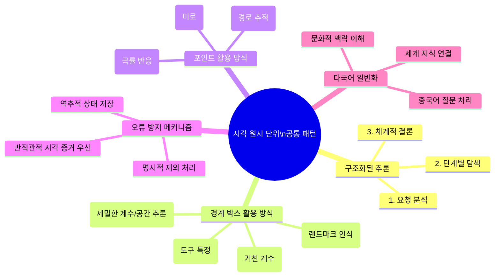

### 패턴 1: 구조화된 3단계 사고

거의 모든 예시에서 **① 요청 분석 → ② 체계적 탐색 → ③ 결론 도출**의 3단계 구조가 반복된다. 이것은 훈련 과정에서 콜드스타트 데이터의 구조적 형식이 모델에 내면화된 결과다.

### 패턴 2: 경계 박스는 기억 시스템을 대체한다

긴 추론 과정에서 모델은 앞서 식별한 객체의 좌표를 다시 참조한다. 예를 들어 미로 탐색에서 역추적 시 이전 분기점 좌표를 명시적으로 언급한다. 이는 경계 박스와 포인트가 단순한 출력이 아니라 **작업 기억(working memory)의 역할**을 한다는 것을 시사한다.

### 패턴 3: 부정 사례 처리의 명시성

"치와와 vs 머핀" 예시에서 다른 프랜차이즈를 명시적으로 제외하고, 공간 추론 예시에서 보라색 고무 물체가 없다는 결론을 내리는 과정, 미로에서 풀 수 없는 케이스를 판단하는 과정 모두 부정 사례를 명시적으로 처리한다. 이는 논문이 강조한 "신뢰할 수 있는 거부(faithful refusal)" 훈련의 결과다.

### 패턴 4: 위상 추론에서 포인트의 우위

경계 박스가 객체의 존재와 속성을 앵커링하는 데 강점을 보인다면, 포인트는 경로와 궤적을 표현하는 데 불가결하다. 미로와 경로 추적 예시에서 경계 박스 대신 포인트를 사용하는 것은 기술적 선택이 아니라 태스크의 본질에서 비롯된 자연스러운 귀결이다.

---

## 시사점: 이 예시들이 미래 AI에 의미하는 것

기존 접근법에서는 경계 박스가 출력의 일부였다: 모델이 먼저 명확히 생각한 다음 "목표물은 좌측 상단 좌표 [100,200,300,400]에 있다"고 알려주는 방식이었다. 그런데 DeepSeek의 접근법은 다르다. 추론 과정 중 모델이 시각적 객체를 언급할 때마다 동시에 그 좌표를 출력한다.

이 차이는 겉보기에 사소해 보이지만 인지 과학적으로 깊은 함의를 갖는다. 추론의 사후 검증이 아닌 추론 자체의 매개체로서 좌표를 사용한다는 것은, 사고 과정이 시각 공간에 물리적으로 닻을 내린다는 의미다. 이것이 논문이 Daniel Kahneman의 "시스템 2 사고"를 언급하며 "System-2-like multimodal intelligence"를 목표로 한다고 밝힌 이유다.

Figure 4부터 Figure 10까지의 예시들은 이 원리가 단순한 개념이 아니라 실제로 작동하는 시스템임을 보여준다. 단체사진의 29명을 정확히 세고, 위상이 복잡한 원형 미로를 18단계 탐색으로 통과하고, 반직관적인 저울 실험에서 시각 증거를 우선하는 이 모든 능력이 하나의 공통 메커니즘—추론 중에 손가락으로 가리키기—에서 나온다.

---

*이 별첨 문서는 DeepSeek-AI의 "Thinking with Visual Primitives" (2026) 논문에 수록된 Figure 4~10 및 Table 1을 상세히 해설합니다. 2026년 5월 2일 기준 공개 정보를 바탕으로 작성되었습니다.*
