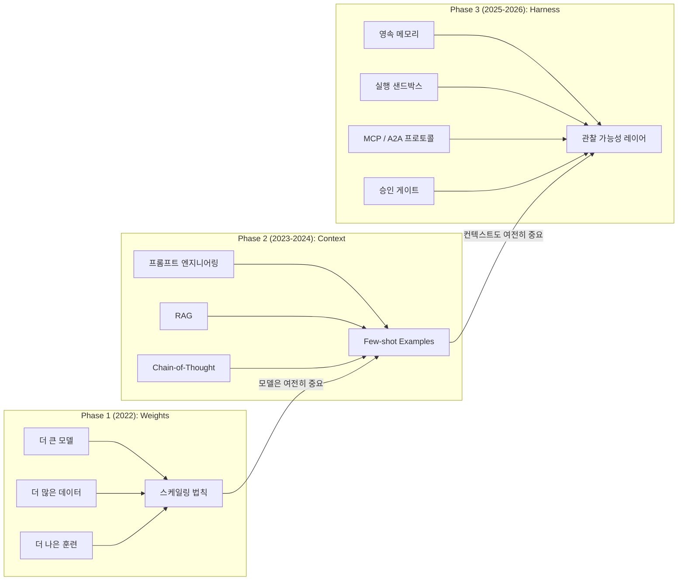
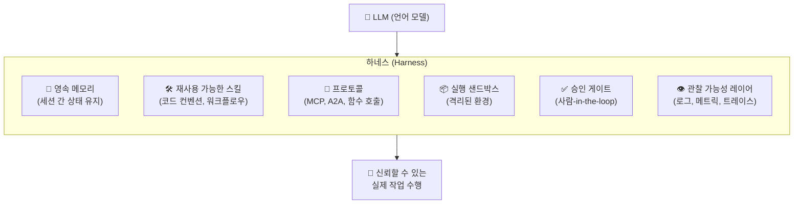
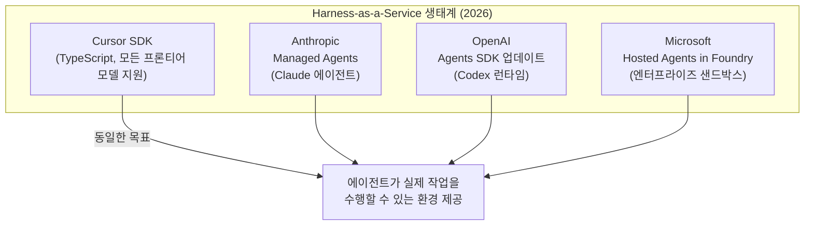
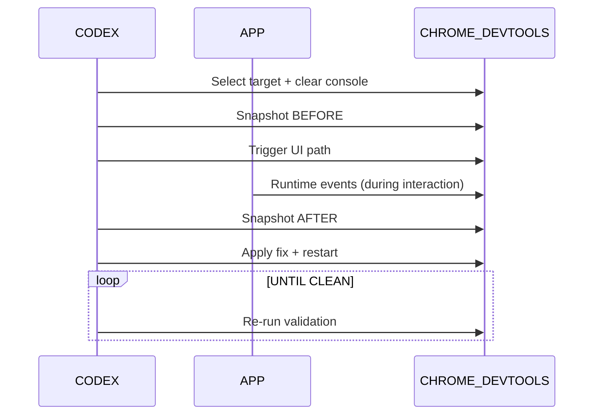
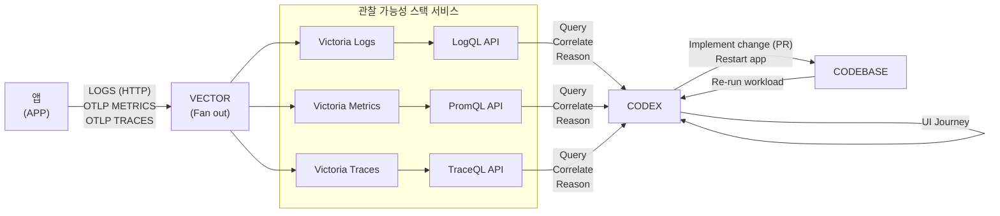
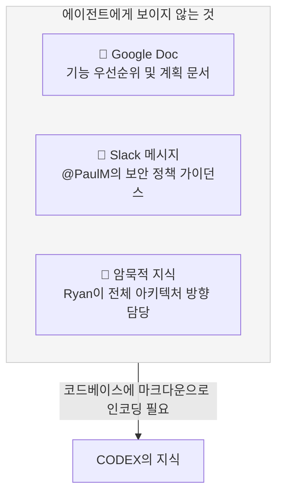
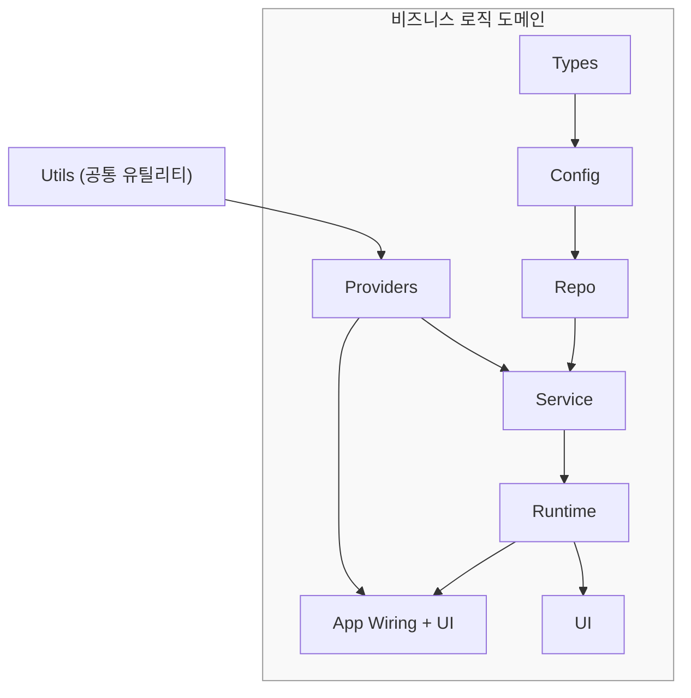

> **출처**: AI Daily Brief — ["How Harness-as-a-Service Will Change Agents"](https://www.youtube.com/watch?v=jvqQ8VlhO-w) (2026.05.01)  
> **기반 자료**: [OpenAI Codex 하네스 엔지니어링 블로그](https://openai.com/index/harness-engineering/) (2026.02.11), [Cursor SDK 공개 베타](https://cursor.com/blog/typescript-sdk) (2026.04.29)

---

## 목차

1. [빅테크 AI 실적: 붐의 증거](#1-빅테크-ai-실적-붐의-증거)
2. [AI 에이전트 진화의 3단계 역사](#2-ai-에이전트-진화의-3단계-역사)
3. [하네스(Harness)란 무엇인가](#3-하네스harness란-무엇인가)
4. [Harness-as-a-Service의 등장](#4-harness-as-a-service의-등장)
5. [Cursor SDK: 대표적 하네스 서비스](#5-cursor-sdk-대표적-하네스-서비스)
6. [OpenAI의 하네스 엔지니어링 실전 사례](#6-openai의-하네스-엔지니어링-실전-사례)
7. [하네스가 모델 성능을 바꾼다: 벤치마크 결과](#7-하네스가-모델-성능을-바꾼다-벤치마크-결과)
8. [실제 구축 사례들](#8-실제-구축-사례들)
9. [하네스 엔지니어링의 핵심 원칙](#9-하네스-엔지니어링의-핵심-원칙)
10. [향후 전망](#10-향후-전망)

---

## 1. 빅테크 AI 실적: 붐의 증거

2026년 1분기 빅테크 실적은 AI 붐이 이제 단순한 기대나 가설이 아닌 명백한 현실임을 수치로 입증했습니다. AI 버블론을 진지하게 받아들이기 어렵게 만드는 숫자들이 쏟아졌습니다.

### 클라우드·AI 부문 성장률 비교

```
Google Cloud   ████████████████████████████████████ +63% YoY
Microsoft Azure ██████████████████████ +40% YoY (39% 실제)
Meta Revenue   ████████████████████ +33% YoY
AWS            ████████████████ +28% YoY
```

### Google: 가장 큰 승자

구글은 이번 실적에서 압도적인 승리를 거뒀습니다. 전체 매출이 22% 성장한 가운데, AI 관련 사업 부문에서 특히 눈에 띄는 성과를 냈습니다.

- **Google Cloud**: 전년 대비 63% 매출 성장
- **신규 주문 백로그**: 4분기 말 2,400억 달러에서 4,600억 달러로 급증
- **Gemini 유료 기업 고객**: 분기 대비 40% 급증
- **토큰 처리량**: 분당 160억 토큰 처리, 분기 대비 60% 증가
- **검색 광고 매출**: 전년 대비 19% 성장 (AI가 검색을 위협한다는 기존 서사를 뒤집음)
- **순이익**: 626억 달러로 전년 대비 81% 증가

CEO 순다르 피차이는 "AI가 처음으로 클라우드의 최대 성장 동력이 됐다"고 밝히며, 수요를 따라잡지 못할 만큼 컴퓨트 공급이 부족한 상황임을 인정했습니다. 시장은 주가를 하루 만에 7% 올리는 것으로 화답했습니다.

특히 눈에 띄는 것은 검색 부문입니다. AI가 구글의 핵심 검색 사업을 잠식할 것이라는 기존의 서사와 달리, 실제로는 정반대 현상이 일어났습니다. AI 기반 검색 강화가 오히려 사용자 쿼리 수를 역대 최고치로 끌어올렸고, 광고 수익도 덩달아 성장했습니다. 구글은 비즈니스에 대한 가장 큰 실존적 위협을 성장 가속기로 전환하는 데 성공한 셈입니다.

### Amazon AWS: 건강한 회복세

아마존은 전체 매출 17% 성장, 순이익 77% 증가를 기록했습니다. AWS는 2023년 12% 성장이라는 저점을 찍은 이후 매 분기 성장세가 가속화되어 28%까지 회복됐습니다. 주목할 점은 아마존이 자체 칩 비즈니스(Trainium)가 독립 사업체라면 연간 반복 매출(ARR) 500억 달러 규모라고 밝혔다는 것입니다. 아마존은 자체 데이터센터 칩 사업이 세계 3대 수준에 이르렀다고 자평했습니다.

### Microsoft Azure: 안정적이지만 아쉬운 성과

마이크로소프트는 Azure 39% 성장, 전체 매출 18% 성장으로 기대치를 소폭 상회했습니다. Copilot 유료 좌석 수는 1월 1,500만 개에서 2,000만 개로 늘었습니다. 그러나 구글·아마존의 드라마틱한 성장세에 비해 상대적으로 밋밋한 성적표로, 주가는 거의 변동 없이 마감됐습니다. OpenAI 독점 배포 계약 종료에 따른 경쟁 심화도 부담 요인으로 지목됩니다.

### Meta: 기록적 실적에도 주가 하락

메타는 분기 매출 563억 달러로 전년 대비 33% 성장(2021년 이후 최고치)이라는 기록적인 실적을 냈음에도 불구하고, 주가는 5% 하락했습니다. 이유는 다시 한번 막대한 자본 지출 계획 때문이었습니다. 메타는 올해 설비투자 전망을 1,350억 달러에서 1,450억 달러로 상향 조정했고, 시장은 이를 냉담하게 받아들였습니다.

이번 빅테크 실적의 핵심 메시지는 하나입니다. **AI 붐은 이제 현실이며, 여전히 가속 중이다.** 메모리 칩 제조사부터 데이터센터 건설사까지 모든 업스트림 공급망이 100% 풀가동 상태에서도 토큰에 대한 무한한 수요를 따라잡지 못하고 있습니다.

---

## 2. AI 에이전트 진화의 3단계 역사

이번 에피소드의 핵심 개념인 "하네스"를 이해하려면 AI 에이전트가 어떻게 진화해왔는지를 먼저 파악해야 합니다. 커뮤니티 연구자 A는 에이전트 개발의 중심축이 지난 4년간 세 단계를 거쳐 바깥쪽으로 이동했다고 정리했습니다.



### Phase 1: 가중치(Weights) 시대 — 2022년

모든 것이 모델 자체에 집중됐던 시기입니다. 더 크고, 더 많은 데이터로 훈련된 모델이 곧 더 나은 에이전트를 의미했습니다. RLHF와 파인튜닝이 행동을 형성했고, 스케일링 법칙이 AI 발전의 교과서였습니다. 단일 턴 질문-응답 작업에는 탁월했지만, 하나의 사실을 업데이트하려면 전체를 재훈련해야 했고 수백만 사용자에게 개인화된 경험을 제공하는 것은 불가능에 가까웠습니다.

### Phase 2: 컨텍스트(Context) 시대 — 2023~2024년

패러다임의 전환이 일어났습니다. "모델을 바꾸지 않아도 된다. 모델이 보는 것을 바꾸면 된다." 이 깨달음은 프롬프트 엔지니어링, Few-shot 예시, Chain-of-Thought, RAG(검색증강생성)라는 기법들을 탄생시켰습니다. 동일한 모델이 앞에 무엇을 제시하느냐에 따라 완전히 다르게 행동할 수 있게 됐고, 개발자들은 파인튜닝 대신 프롬프트와 검색 파이프라인 반복에 집중하기 시작했습니다. 그러나 컨텍스트 윈도우는 유한하고, 긴 프롬프트는 노이즈가 많으며, 새 세션마다 이전의 모든 것이 지워진다는 근본적인 한계가 있었습니다.

### Phase 3: 하네스(Harness) 시대 — 2025~현재

핵심 질문 자체가 바뀌었습니다. "모델에게 무엇을 말해야 할까?" 에서 "모델이 어떤 환경에서 작동해야 할까?" 로. 모델은 더 이상 지능의 유일한 위치가 아닙니다. 영속 메모리, 재사용 가능한 스킬, MCP·A2A 같은 표준화된 프로토콜, 실행 샌드박스, 승인 게이트, 관찰 가능성 레이어로 구성된 하네스 안에 모델이 위치하게 됩니다. 모델은 동일하게 유지되고, 해결해야 할 태스크가 바뀝니다.

**중요한 것은 각 단계가 이전 단계를 대체하지 않았다는 점입니다.** 가중치는 여전히 중요하고, 컨텍스트 엔지니어링도 여전히 중요합니다. 다만 무게중심이 바깥쪽으로 이동했을 뿐입니다.

---

## 3. 하네스(Harness)란 무엇인가

"하네스"라는 용어를 처음 들으면 낯설게 느껴질 수 있습니다. 가장 쉬운 비유는 다음과 같습니다. 모델이 엔진이라면, 하네스는 그 엔진을 자동차로 만드는 모든 것입니다.

### 하네스의 구성 요소



### 하네스가 없을 때 vs 있을 때

**하네스 없이** 코딩 에이전트가 기능 구현 → 테스트 실행 → PR 생성 작업을 수행한다면, 모델은 리포지토리 구조, 프로젝트 컨벤션, 워크플로우 상태, 도구 인터랙션 모두를 취약한 프롬프트 하나에 우겨넣어야 합니다.

**하네스가 있으면**, 영속 메모리가 컨텍스트를 공급하고, 스킬 파일과 코드 컨벤션이 프로토콜화된 인터페이스를 강제하며, 런타임이 단계를 순서화하고 실패를 처리합니다. **동일한 모델, 완전히 다른 신뢰성.**

Sam Altman은 최근 인터뷰에서 이렇게 말했습니다. "하네스가 얼마나 중요한지 과장하기 어렵다. 나는 더 이상 하네스와 모델을 완전히 분리 가능한 것으로 보지 않는다." 그는 Codex를 사용할 때 놀라운 결과가 나왔을 때, 그것이 모델 덕분인지 하네스 덕분인지 항상 알 수 없다고 인정했습니다.

---

## 4. Harness-as-a-Service의 등장

### 하드웨어 키트 조립의 시대에서 PC로

2025년까지의 오픈소스 하네스 시대는 마치 1970년대 취미 컴퓨팅 시대와 비슷했습니다. Ed Roberts의 Altair 8800이 나오고 Apple II 세대가 등장하기 직전, 컴퓨터를 갖고 싶은 사람은 회로 기판, 칩, 납땜 인두를 이용해 직접 조립해야 했습니다. OpenClaw(오픈소스 에이전트 프레임워크) 시대가 그랬습니다.

**OpenClaw로 에이전트를 만들려면 직접 해야 하는 것들:**

- 모델 선택
- 시스템 프롬프트 작성
- 도구 정의
- 에이전트 루프 배선 (다음에 무엇을 할지 결정, 도구 디스패치, 결과 처리, 종료 시점 결정)
- 컨텍스트 관리
- 에러 처리
- 서브에이전트 조율 (병렬 작업 시)
- 실행 간 상태 저장 방법 결정
- 배포 위치 결정
- 모니터링 방법 결정
- 문제 발생 시 직접 수리

이 모든 것을 스스로 조립, 설정, 유지해야 했습니다. 이 시기의 사용자들이 진정한 의미의 "에이전트 키트 조립자"였다면, 지금 우리는 PC 시대, 즉 **Harness-as-a-Service** 시대에 진입하고 있습니다.

### Harness-as-a-Service란

새로운 인프라 카테고리로, 기업들이 에이전트 런타임(LLM을 실제 작업 수행 가능한 무언가로 전환하는 엔진)에 대한 접근권을 판매합니다. AWS가 컴퓨팅을, Stripe가 결제 레일을 판매하는 것과 같은 방식입니다.

**HaaS(Harness-as-a-Service)를 사용할 때 사용자가 제공하는 것 3가지:**
1. 어떤 모델을 원하는가
2. 에이전트가 접근할 수 있는 도구
3. 에이전트에게 맡길 태스크

**HaaS가 처리해주는 것:**
- 에이전트 루프 (사전 구축)
- 도구 디스패치 (사전 구축)
- 샌드박싱 (사전 구축)
- 스트리밍 (사전 구축)
- 에러 처리 (사전 구축)
- 컨텍스트 압축 (사전 구축)
- 이 모든 레이어를 탁월하게 만드는 것이 풀타임 업무인 팀에 의해 조율 및 최적화

### 2026년 HaaS 플레이어들



마이크로소프트의 Sachi Nadella는 Foundry의 호스티드 에이전트를 발표하며 이렇게 말했습니다. "모든 에이전트에는 자신만의 컴퓨터가 필요하다. 새로운 호스티드 에이전트로 모든 에이전트는 내구적 상태, 내장 신원 및 거버넌스, 그리고 어떤 하네스나 프레임워크도 지원하는 전용 엔터프라이즈급 샌드박스를 갖게 된다."

---

## 5. Cursor SDK: 대표적 하네스 서비스

### 무엇인가

Cursor SDK(`@cursor/sdk`)는 2026년 4월 29일 공개 베타로 출시된 TypeScript 패키지로, 개발자에게 Cursor 데스크톱 앱, CLI, 웹 앱을 구동하는 것과 동일한 에이전트 런타임, 하네스, 모델에 대한 프로그래밍 방식의 접근권을 제공합니다.

Rippling, Notion, Faire, C3 AI 등이 이미 프로덕션에서 사용 중이며, Cursor의 기업 가치는 공개 베타 출시 직전 500억 달러 기업 가치로 자금 조달 협상 중인 것으로 알려졌습니다.

### 기존 LLM API 호출과의 차이

```
[기존 방식: LLM API 직접 호출]
개발자 → API 호출 → 모델 응답
- 리포지토리 구조 모름
- 어떤 의존성을 사용하는지 모름
- 테스트 결과가 어떤지 모름
- 프롬프트에 모든 것을 직접 넣어야 함

[Cursor SDK 방식]
개발자 → SDK → 에이전트 런타임 + 하네스 + 모델
- 코드베이스 자동 인덱싱
- 시맨틱 코드 검색
- 터미널 명령 실행 가능
- PR 자동 오픈 가능
- MCP 서버 연결
- 서브에이전트 위임
```

설치는 `npm install @cursor/sdk`로 간단히 시작할 수 있으며, 로컬 머신이나 Cursor의 클라우드에서 전용 VM으로 어떤 프론티어 모델과도 실행할 수 있습니다.

기본적인 코드 예시:
```typescript
import { Agent } from "@cursor/sdk";

const agent = await Agent.create({
  apiKey: process.env.CURSOR_API_KEY!,
  model: { id: "composer-2" },
  local: { cwd: process.cwd() },
});

const run = await agent.send("이 리포지토리가 무엇을 하는지 요약해줘");
for await (const event of run.stream()) {
  console.log(event);
}
```

### 하네스가 포함하는 것들

SDK 에이전트는 Cursor 자체 제품을 구동하는 것과 동일한 하네스를 사용합니다. 여기서 '하네스'는 단순한 LLM 호출을 넘어 에이전트를 효과적으로 만드는 지원 인프라 전체를 의미합니다. 여기에는 코드베이스 인덱싱, 시맨틱 검색, 즉시 grep을 포함한 지능형 컨텍스트 관리, MCP 서버 지원, 스킬, 훅, 서브에이전트가 포함됩니다.

### 지원 모델 (2026년 기준)

| 모델 | 특징 |
|------|------|
| Composer 2 Standard | $0.50/M 입력 토큰, $2.50/M 출력 토큰 (기본값) |
| Claude Opus 4.7 | SWE-bench Pro 64.3% (최고 코딩 추론) |
| GPT-5.5 | OpenAI 최신 모델 |
| Gemini 3.1 Pro | Google 최신 모델 |

모델 전환은 설정 파일 한 줄 변경으로 가능하여, 마이그레이션이나 API 변경 없이 Composer 2에서 Claude Opus 4.7이나 GPT-5.5로 전환할 수 있습니다.

### Gmail 내 Cursor 에이전트: 실제 구현 사례

Jack Driscoll은 SDK를 사전 출시 상태로 며칠 만에 실험한 뒤 Gmail 내장 Cursor 에이전트를 선보였습니다. Gmail 받은편지함 안에서 이메일 스레드를 채팅에 공유하면, 에이전트가 이메일을 읽고 컨텍스트로 가져와 코드 편집, 문제 수정 등을 수행하고 결과를 다시 채팅 창에 스트리밍해줍니다.

Driscoll은 이것이 다른 SDK와 무엇이 다른지 이렇게 설명했습니다. "가장 큰 차이점은 Cursor SDK가 단순히 '도구를 가진 LLM 호출'이 아니라는 점입니다. 리포 컨텍스트, 편집, 검색, 터미널, 워크플로우, 스트리밍 상태, 모델 선택, 로컬 및 호스티드 실행을 갖춘 동일한 코딩 에이전트 런타임을 노출합니다."

---

## 6. OpenAI의 하네스 엔지니어링 실전 사례

### 개요: 코드 0줄에서 백만 줄짜리 제품까지

OpenAI 엔지니어링 팀의 Ryan Lopopolo가 2026년 2월 공개한 블로그는 하네스 엔지니어링의 실제 위력을 가장 잘 보여주는 사례입니다. 5개월 동안 단 한 줄의 수동 코드도 없이 내부 사용자를 가진 실제 소프트웨어 제품을 만든 과정을 담고 있습니다.

**핵심 수치:**
- 기간: 5개월
- 코드 라인 수: 약 100만 줄
- 합병된 PR 수: 약 1,500개
- 엔지니어 1인당 하루 평균 PR: 3.5개
- 수동 작성 코드 라인: 0줄
- 예상 대비 단축 기간: 약 1/10

### 에이전트가 앱 자체를 볼 수 있게 만들기

처리량이 증가하면서 병목 지점이 사람의 QA 역량으로 이동했습니다. 팀은 앱의 UI, 로그, 앱 메트릭 자체를 Codex가 직접 읽을 수 있게 만들었습니다.

**Chrome DevTools Protocol 통합 흐름:**



에이전트가 UI 경로를 실행하기 전후의 스냅샷을 찍고, 런타임 이벤트를 관찰하며, 수정을 적용하고, 문제가 없을 때까지 검증을 반복합니다.

### 완전한 관찰 가능성 스택 제공



Codex는 LogQL, PromQL로 로그와 메트릭을 쿼리하고, 이를 바탕으로 "서비스 시작이 800ms 이내에 완료되도록 보장하라" 같은 고수준 목표를 실행 가능한 태스크로 처리할 수 있게 됐습니다.

### 에이전트가 알 수 없는 것은 존재하지 않는다



이 원칙은 매우 실용적인 함의를 가집니다. Slack에서 나눈 아키텍처 패턴에 관한 논의는 리포지토리에 마크다운으로 기록되지 않으면 에이전트에게 3개월 후에 입사한 신규 입사자에게도 모르는 것과 마찬가지입니다.

### 지식 구조: 단일 거대한 지침서 대신 목차

| 잘못된 방식 | 올바른 방식 |
|------------|------------|
| 하나의 거대한 AGENTS.md | 짧은 AGENTS.md (약 100줄) = 목차 |
| 모든 것이 중요하다고 명시 | 더 깊은 진실 소스로 포인터 제공 |
| 오래된 규칙이 쌓여서 노이즈 | 구조화된 docs/ 디렉토리를 시스템 오브 레코드로 |
| 기계적 검증 불가 | 린터와 CI 잡으로 지식 베이스 최신성 강제 |

```
AGENTS.md              ← 목차 (약 100줄)
ARCHITECTURE.md        ← 도메인 및 패키지 레이어 맵
docs/
├── design-docs/
├── exec-plans/
│   ├── active/
│   ├── completed/
│   └── tech-debt-tracker.md
├── generated/
├── product-specs/
└── references/
    ├── design-system-reference-llms.txt
    └── ...
```

### 레이어드 도메인 아키텍처



각 도메인 내 코드는 고정된 레이어 세트를 통해 '앞 방향으로만' 의존할 수 있습니다(Types → Config → Repo → Service → Runtime → UI). 교차 관심사(인증, 커넥터, 텔레메트리, 피처 플래그)는 단일 명시적 인터페이스인 Providers를 통해서만 진입합니다. 이 모든 것이 커스텀 린터로 기계적으로 강제됩니다.

---

## 7. 하네스가 모델 성능을 바꾼다: 벤치마크 결과

하네스의 중요성을 가장 명확하게 보여주는 것은 실제 벤치마크 결과입니다. Endor Labs의 연구 결과는 충격적입니다.

### 보안 정확도 벤치마크 (Security Correctness)

| 조합 | 보안 점수 | 기능 점수 |
|-----|-----------|-----------|
| Cursor + GPT-5.5 | **23.5%** ← 신기록 | 87.2% |
| Cursor + Claude Opus 4.7 | 22.9% | **91.1%** |
| Claude Code (Opus 4.7 네이티브) | ~19% | 87.2% |
| Codex (GPT-5.5 네이티브) | ~19% | 61.5% |

**GPT-5.5의 기능 점수 변화:** Codex 네이티브 하네스 61.5% → Cursor 하네스 87.2% **(+25.7%p)**

**Opus 4.7의 기능 점수 변화:** Claude Code 네이티브 87.2% → Cursor 하네스 91.1% **(+3.9%p)**

Endor Labs의 결론: **"동일한 모델, 동일한 주간, 두 가지 하네스, 두 가지 다른 기능적 결과."**

Alex Voltov의 독립 검증에서도 Cursor 하네스는 코딩 벤치마크 Wolfbench AI에서 GPT-5.5에 가장 강력한 성능을 보였고, Opus 4.7 실행 시 Claude Code와 동등한 수준이었습니다.

이 데이터가 의미하는 바는 명확합니다. 앞으로 AI 에이전트 성능을 평가할 때, 모델 이름만으로는 충분하지 않습니다. **어떤 하네스에서 실행되느냐**가 동등하게, 또는 더 중요한 변수가 됩니다.

---

## 8. 실제 구축 사례들

Cursor SDK가 출시된 첫날부터 개발자들은 다양한 아이디어를 구현하기 시작했습니다.

### 사례 1: Gmail 내장 코딩 에이전트

앞서 소개한 Jack Driscoll의 사례입니다. Gmail의 이메일을 채팅에 공유하면 에이전트가 리포지토리에서 직접 코드를 수정하고, 결과를 스트리밍으로 돌려줍니다. Gmail과 채팅은 단순히 입력 및 협업 레이어이고, Cursor SDK가 실제로 코드베이스를 에이전트처럼 운영하는 부분입니다.

### 사례 2: 자율 버그 감지 에이전트

Tea가 구축한 버그 캐칭 에이전트는 프로덕션 코드베이스에서 작동하며, 자체 브라우저 창을 통해 앱 실행 상태를 직접 볼 수 있습니다. Havari는 이것이 왜 중요한지 설명했습니다. "현재 에이전트는 코드를 작성하고 잘 되길 바랍니다. 테스트를 실행할 수는 있지만, 테스트가 모든 것을 잡아내지는 않습니다. 특히 UI 동작, 통합 이슈, 또는 실제 브라우저 상태에 의존하는 플로우는요." 앱을 실제로 볼 수 있다는 것은 더 빠른 반복, 더 자신있는 에이전트 핸드오프, 사람의 검증 작업을 크게 줄여줍니다.

### 사례 3: IT 트리아지 Chrome 플러그인

Robert Busherie는 SDK를 사용해 Chrome 플러그인에 Cursor 에이전트를 임베드했습니다. 비기술 사용자가 버그를 말로 묘사하는 대신, 브라우저에서 직접 코드를 티켓에 덤프해 IT 트리아지를 지원합니다.

### 공통점

이 모든 사례가 보여주는 것은 Cursor 에이전트를 IDE 컨테이너에서 해방시키면서도 런타임 환경을 유지한다는 점입니다. 개발자들은 처음부터 시작하지 않아도 되고, 이미 검증된 인프라 위에서 원하는 것을 빠르게 구축할 수 있습니다.

---

## 9. 하네스 엔지니어링의 핵심 원칙

OpenAI의 실전 경험과 Cursor SDK 사례에서 도출된 하네스 엔지니어링의 핵심 원칙들입니다.

### 원칙 1: 에이전트 중심 설계

코드베이스를 새로운 인간 입사자가 아닌, 에이전트가 이해하기 쉽게 설계합니다. 에이전트의 컨텍스트 안에 없는 것은 존재하지 않는 것과 같습니다. Google Docs의 문서, Slack의 대화, 사람들의 머릿속에 있는 지식은 에이전트에게 접근 불가능합니다.

### 원칙 2: 기계적 강제

문서화만으로는 일관성을 유지할 수 없습니다. 아키텍처 경계, 코드 스타일, 로깅 규칙 등은 커스텀 린터와 CI 잡으로 기계적으로 강제해야 합니다. "지루한" 기술(boring tech)을 선호하는 것도 이 이유에서입니다. 훈련 세트에 충분히 표현되어 있고, API가 안정적이며, 에이전트가 예측 가능하게 작동합니다.

### 원칙 3: 피드백 루프 설계

인간의 QA 역량이 병목이 되지 않도록, 에이전트가 자신의 작업을 스스로 검증할 수 있는 피드백 루프를 구축합니다. 코드 실행 → 테스트 → UI 검증 → 로그/메트릭 확인 → 수정 → 재실행의 자동화된 루프.

### 원칙 4: 점진적 공개 (Progressive Disclosure)

에이전트에게 한꺼번에 모든 것을 알려주려 하지 않습니다. 작고 안정적인 진입점(AGENTS.md)에서 시작해, 더 깊은 정보가 필요한 곳을 가르쳐줍니다. "모든 것이 중요하다"고 하면 아무것도 중요하지 않게 됩니다.

### 원칙 5: 가비지 컬렉션으로서의 기술 부채 관리

에이전트는 기존 패턴을 복제합니다. 좋지 않은 패턴도 마찬가지입니다. 주기적인 "황금 원칙" 기반 정리 에이전트를 실행해 코드베이스의 일관성을 유지합니다. 기술 부채는 고이자 대출처럼, 연속적으로 소량씩 갚는 것이 나중에 고통스러운 대규모 정리보다 항상 낫습니다.

### 원칙 6: 높은 처리량이 소통 철학을 바꾼다

에이전트 처리량이 인간의 주의보다 훨씬 빠를 때, 기존의 차단식 병합 게이트나 무기한 테스트 플레이크 대기는 역효과를 냅니다. 수정은 저렴하고, 기다리는 것이 비쌉니다.

---

## 10. 향후 전망

### 민주화의 역설

PC 시대가 수백만 명의 사람들이 컴퓨터를 사용할 수 있게 했지만, 그들이 마더보드를 조립하는 것을 배운 것은 아닙니다. Dell 데스크톱 덕분이었습니다. HaaS도 마찬가지입니다. 대부분의 사람들에게 민주화 효과는 직접 에이전트를 구축하는 것이 아니라, 에이전트로 구동되는 제품을 사용하거나, 소수의 노브만으로 커스텀 가능한 사전 구성된 에이전트를 활용하는 형태로 나타날 것입니다.

그러나 흥미롭고 이례적인 점은, 지금 우리는 에이전트 자체가 코딩과 인프라 구축을 도와주는 세상에 살고 있다는 것입니다. Cursor SDK 같은 도구의 잠재 사용자층은 개발자에 국한되지 않습니다. 비개발자이지만 에이전트 기반 도구로 원하는 것을 구축할 수 있는 새로운 종류의 빌더들이 등장하고 있습니다.

Cursor의 SDK 출시, SpaceX 컴퓨트 계약, Google의 개발자 충성도 접근 방식 모두 같은 방향을 가리키고 있습니다. 모델은 상품화되고 있고, 하네스가 제품이 되고 있습니다.

### 미해결 질문들

완전히 에이전트가 생성한 시스템에서 아키텍처 일관성이 수년에 걸쳐 어떻게 진화하는지는 아직 알 수 없습니다. 인간의 판단이 가장 큰 레버리지를 발휘하는 지점이 어디인지, 그리고 그 판단을 어떻게 인코딩해야 복리 효과를 낼 수 있는지도 여전히 연구 중입니다. 모델이 계속 발전함에 따라 이 시스템이 어떻게 진화할지도 미지수입니다.

그러나 한 가지는 분명합니다. **소프트웨어 개발에서 규율은 여전히 필요합니다. 단, 그 규율이 코드보다 스캐폴딩(scaffolding)에서 더 많이 발현됩니다.** 코드베이스의 일관성을 유지하는 도구, 추상화, 피드백 루프가 점점 더 중요해지고 있습니다.

---

## 요약

| 개념 | 핵심 내용 |
|------|----------|
| **하네스(Harness)** | LLM을 실제 작업 수행 가능한 에이전트로 만드는 환경 전체 |
| **3단계 진화** | 가중치 → 컨텍스트 → 하네스 (각 단계는 이전 것 위에 쌓임) |
| **HaaS** | 에이전트 런타임을 서비스로 제공 (AWS처럼 컴퓨팅, Stripe처럼 결제) |
| **Cursor SDK** | 동일한 모델을 다른 하네스에서 실행하면 벤치마크 점수가 크게 달라짐 |
| **OpenAI 사례** | 5개월, 100만 줄 코드, 수동 코드 0줄, 에이전트가 모든 것을 생성 |
| **민주화** | PC처럼 조립 없이 사용 가능한 에이전트 시대의 시작 |

---

*이 문서는 AI Daily Brief 에피소드 "How Harness-as-a-Service Will Change Agents"와 OpenAI 엔지니어링 블로그 "Harness Engineering: Leveraging Codex in an Agent-First World"를 기반으로 작성되었습니다. 최종 업데이트: 2026년 5월 2일*
