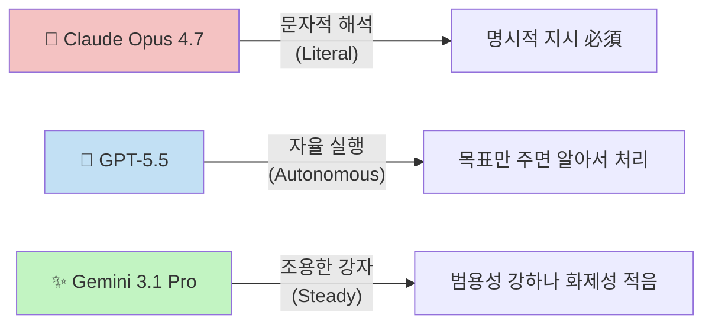
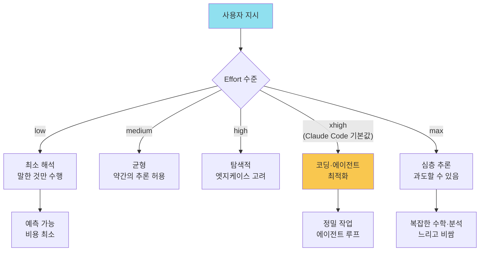
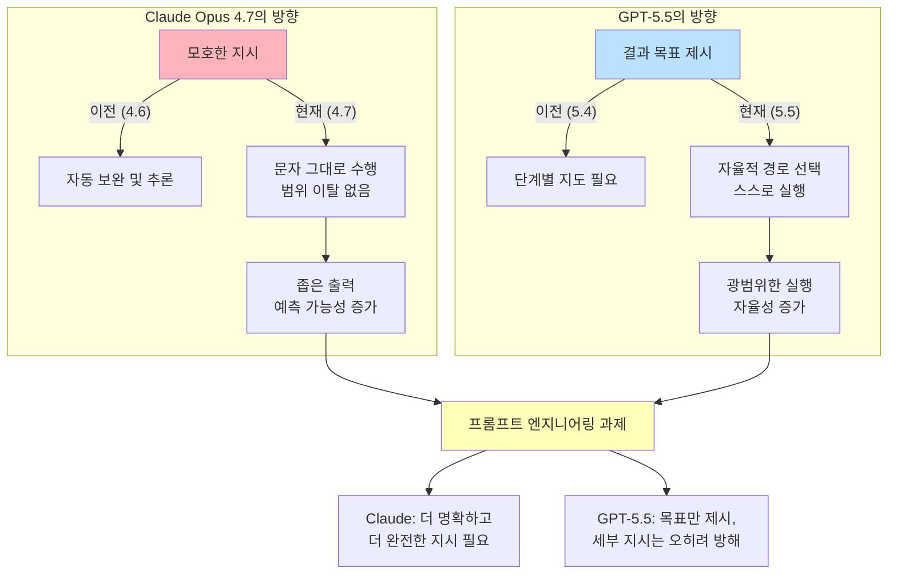
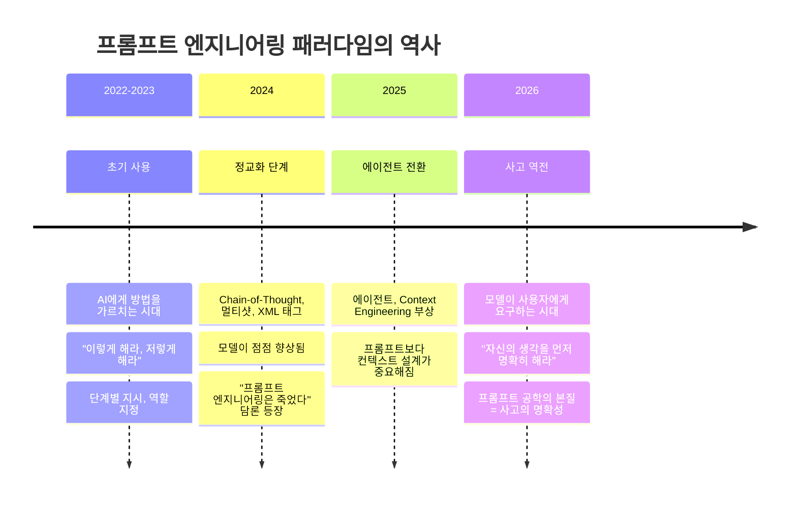
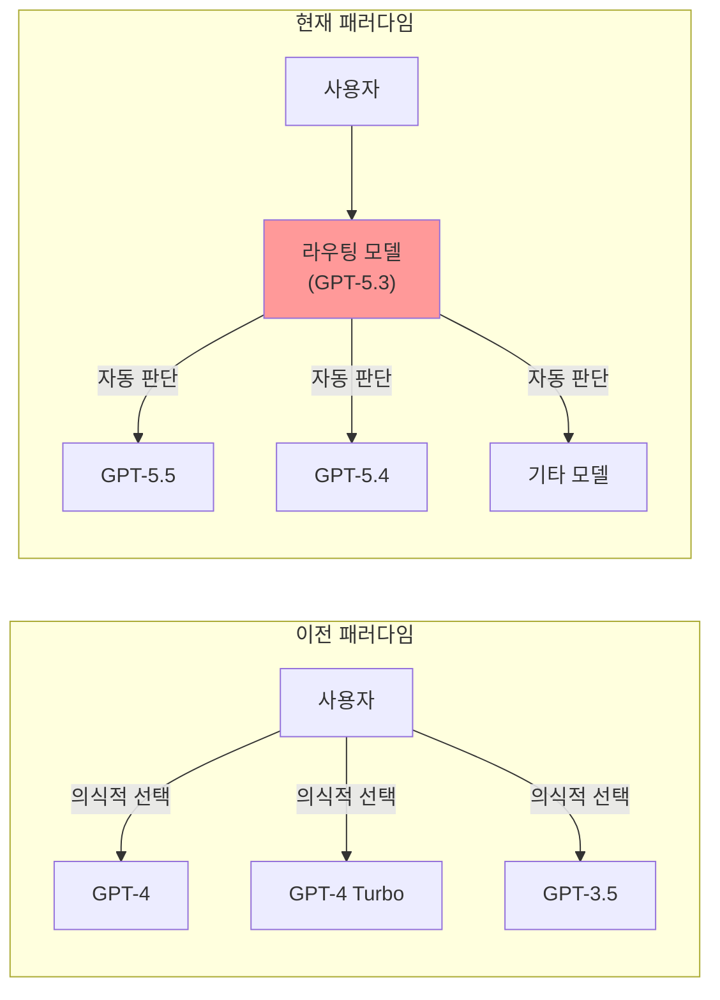

## Claude Opus 4.7 / GPT-5.5 / Gemini 3.1 Pro — [2026년 4~5월 현장 분석](#2026년-45월-현장-분석) 

> **<LLM 모델 서비스 3대장 근황>**
> 
> Claude Opus 4.7 - 자꾸 말을 해줘야된다.
> 
> OpenAI GPT 5.5 - 할 말을 없게 만든다.
> 
> Google Gemini 3.1 - 딱히 해줄 말이 없음.
> 
> https://www.threads.com/@kanjseok/post/DXyqFiPknHl

> **<최근 들어 많은 사람들이 GPT와 클로드가 갑자기 멍청해졌다고 말하는 이유를 이제야 이해했습니다>**
>
> 我终于明白为啥最近很多人都在说，GPT和Claude突然变笨了，
> 
> 昨天OpenAI和Anthropic同时发布了官方提示工程指南，看完我才发现，并不是模型变笨了，是它们终于聪明到，不再容忍人类懒得想清楚了🤣🤣🤣
> 
> 而且最有意思的是，两个模型的进化方向，居然是完全相反的，
> 
> Claude Opus 4.7变得越来越字面，以前它会主动帮你补全模糊的指令，现在你说什么它就做什么，多一个字都不会猜🤣🤣
> 
> GPT-5.5变得越来越自主，以前你要手把手教它每一步怎么做，现在你只要告诉它你想要什么结果，它自己会选最优路径，
> 
> 所以老提示失效的原因也完全相反，用在Claude上的模糊提示，会得到越来越窄的输出，用在GPT上的详细流程，会变成多余的噪声，
> 
> 过去三年我们一直在学怎么教模型做事，现在反过来了，模型开始要求我们，先把自己的思考结构化，
> 
> 其实就是提示工程的本质，已经从教模型怎么做，变成了先把自己想明白，
> 
> 所以真正的瓶颈可能不是模型的能力，而是写提示的那个人的思考清晰度，
> 
> 我感觉以后赢的人，不会是提示写得最长最复杂的人，而是那个最知道自己真正想要什么的人🤔
> 
> https://x.com/ayi_ainotes/status/2049898131035193396
> 

---
## 관련글

[**Claude Opus 4.7 완전 가이드**](https://k82022603.github.io/posts/claude-opus-4.7-%EC%99%84%EC%A0%84-%EA%B0%80%EC%9D%B4%EB%93%9C/)

## 목차

1. [들어가며 — 불편한 침묵들](#들어가며)
2. [3대장 근황 개요](#3대장-근황-개요)
3. [Claude Opus 4.7 — "말을 해줘야 된다"는 것의 의미](#claude-opus-47)
4. [GPT-5.5 — "할 말을 없게 만든다"는 것의 의미](#gpt-55)
5. [Google Gemini 3.1 Pro — "딱히 해줄 말이 없음"의 의미](#google-gemini-31-pro)
6. [두 모델이 가리키는 정반대의 진화 방향](#두-모델의-정반대-진화)
7. [Claude의 잠수함 업데이트 충격 — 현장 보고](#claude-잠수함-업데이트-충격)
8. [프롬프트 엔지니어링의 패러다임 전환](#프롬프트-엔지니어링의-패러다임-전환)
9. [AI 업계의 중독 전략 — 개발자를 향한 시선](#ai-업계의-중독-전략)
10. [라우팅 구조와 도구가 사람을 선택하는 시대](#라우팅-구조와-도구가-사람을-선택하는-시대)
11. [결론 — 병목은 모델이 아니라 생각의 명확성](#결론)

---

## 들어가며 — 불편한 침묵들 {#들어가며}

2026년 4월과 5월 사이, AI 커뮤니티에는 묘한 긴장감이 흘렀다. 수많은 사람들이 "GPT가 갑자기 바보가 됐다", "Claude가 이상하다"는 말을 SNS에 쏟아냈다. 그런데 실제 사정은 정반대였다. 모델이 퇴화한 것이 아니라, 모델들이 각자의 방향으로 진화를 거듭한 결과, 기존의 사용 방식이 더 이상 통하지 않게 된 것이다.

이 시기 AI 커뮤니티의 반응은 크게 세 종류로 나뉘었다. 첫째, 모델이 망가졌다고 단정 짓는 사람들. 둘째, 이 변화를 정확히 진단하고 빠르게 적응해 오히려 더 좋은 결과를 내는 사람들. 셋째, 변화 자체에 지쳐 플랫폼을 아예 바꿔버리는 사람들.

특히 주목할 만한 것은 Anthropic과 OpenAI가 거의 동시에 공식 프롬프트 엔지니어링 가이드를 발표했다는 사실이다. 두 문서의 내용은 전혀 달랐지만, 결국 하나의 메시지를 가리키고 있었다. 그것은 단순히 "AI를 기계처럼 대하라"는 실용적 충고를 넘어, AI와의 관계 맺기 방식 자체가 근본적으로 재정의되고 있음을 뜻한다.

이 글은 그 전환의 실체를 각 모델의 구체적 변화, 현장에서 발생한 장애와 혼란, 그리고 프롬프트 엔지니어링 패러다임의 깊은 이동을 통해 입체적으로 살펴본다.

---

## 3대장 근황 개요 {#3대장-근황-개요}

2026년 4~5월 기준, LLM 3대장은 다음과 같이 요약된다.

```
Claude Opus 4.7  → 자꾸 말을 해줘야 된다
GPT-5.5         → 할 말을 없게 만든다
Gemini 3.1 Pro  → 딱히 해줄 말이 없음
```

이 세 줄의 요약은 단순한 유머가 아니다. 각 모델의 현재 특성과 사용자 경험을 압축적으로 포착한 현장 보고다. 먼저 각각의 의미를 풀어보자.



---

## Claude Opus 4.7 — "말을 해줘야 된다"는 것의 의미 {#claude-opus-47}

### 출시 배경과 위치

Claude Opus 4.7은 2026년 4월 16일에 정식 출시되었다. Anthropic이 "현재 가장 유능한 일반 공개 모델"로 내세우는 플래그십이며, 전작 Opus 4.6 대비 코딩, 에이전트 작업, 고해상도 비전에서 의미있는 성능 향상을 이루었다고 주장한다. 컨텍스트 윈도우 100만 토큰, 최대 출력 128K 토큰을 지원하며, 고해상도 이미지 처리 능력(최대 2,576px / 3.75MP, 이전 1,568px 대비 약 3.3배 확대)도 새롭게 추가됐다.

그런데 사용자들이 체감한 가장 큰 변화는 벤치마크 숫자가 아니었다. 그것은 모델의 태도 변화였다.

### 문자적 해석 — "말한 것만, 정확히, 그것만"

Claude Opus 4.7은 이전 버전보다 훨씬 더 문자 그대로 지시를 따른다. 특히 낮은 effort 수준에서는 한 항목에 대한 지시를 다른 항목으로 자동으로 일반화하지 않으며, 명시적으로 요청하지 않은 것을 추론하여 실행하지도 않는다.

이게 무슨 말인가. 쉽게 말하면 이렇다. 예전에는 "이 이메일 좀 다듬어줘"라고 말하면 Claude가 전체를 다시 쓰고, 어조를 조정하고, 구조를 정리하고, 발견한 사실 오류까지 지적해줬다. Opus 4.7은 그렇게 하지 않는다. "다듬다"는 말의 범위 안에서만 행동한다.

Claude Opus 4.7은 전작보다 훨씬 더 문자 그대로 지시를 따른다. 이전에는 모호한 지시를 스스로 보완해주었지만, 이제는 말한 것이 전부다. 한 글자도 추측하지 않는다.

이 변화가 "자꾸 말을 해줘야 된다"는 불만으로 이어지는 것은 당연하다. 개발자들이 몇 달에 걸쳐 축적한 프롬프트 패턴은 4.6의 "의도 추론" 능력에 의존하고 있었다. 그 능력이 갑자기 사라진 것처럼 느껴지기 때문이다.

실제로 Heavy-user들이 불필요하게 늘어난 프롬프트로 꼽는 것들을 정리하면 다음과 같다:

- "참조한 문서 경로를 복붙하지 말고, 네가 이해한 내용을 반영해라"
- "시키지 않은 일은 하지 마라"
- "참조 자료를 꼼꼼하게 먼저 파악하고 답해라"
- "문서 전체 내용을 보고 이해한 것을 바탕으로 대답해라"

이 모든 지시들은 Opus 4.6에서는 굳이 명시하지 않아도 모델이 알아서 해주던 것들이다. 4.7에서는 그것이 전부 명시적 지시로 변환되어야 한다. 프롬프트의 양이 늘어나고 조작의 정교함이 요구되는 것이다.

### 그런데, 이것은 퇴화가 아니다

Anthropic의 입장은 명확하다. 이것은 기능 결함이 아니라 의도된 설계 방향이다.

프롬프트 가이드의 가장 명확한 테마 중 하나는 Opus 4.7이 낮은 effort 수준에서 특히 4.6보다 더 문자 그대로 지시를 따른다는 것이다. 이는 대체로 좋은 소식이다. API 사용 케이스에서 정교하게 튜닝된 프롬프트, 구조화된 추출, 멀티스텝 파이프라인에는 더 문자적인 지시 이행이 보통 더 적은 혼란과 더 예측 가능한 동작을 의미한다. 단점도 분명하다. Opus 4.6이 덮어주던 약한 프롬프트들이 이제 더 가시적으로 실패한다.

에이전트 오케스트레이션의 맥락에서 생각하면 이 설계가 왜 합리적인지 이해할 수 있다. 에이전트가 의도를 멋대로 추론해서 잘못된 방향으로 행동했을 때의 대가는, 단순한 대화 오류와 비교할 수 없을 만큼 크다. 모호한 지시에서 에이전트가 추론에 의존했을 때 오류가 발생하면 그 오류가 누적된다. 말한 것만 정확히 하고 모호함을 만나면 멈추는 모델이 디버깅과 통제 면에서 훨씬 낫다.

### Effort 파라미터와 Adaptive Thinking

Opus 4.7의 또 다른 중요한 변화는 **effort 파라미터**다. 이제 모델의 작동 방식은 단순한 on/off 스위치가 아니라, 세분화된 노력 수준(low, medium, high, xhigh, max)으로 조절된다.

Effort는 범위에 관한 것이다. 낮은 effort 응답은 말 그대로 요청한 것에만 집중한다. 높은 effort 응답은 탐색하고, 엣지 케이스를 고려하고, 더 많은 툴 호출을 수행하고, 최소한을 넘어선다. 모델이 얼마나 야심차게 행동할 수 있는지의 문제다.

특히 `xhigh`는 Claude Code의 새 기본값으로, 코딩 및 에이전트 작업에 권장되는 수준이다. 주목할 점은, effort 수준에 따라 모델의 문자적 해석 정도 자체가 달라진다는 것이다. 낮은 effort에서는 최소한의 해석으로 수행하지만, 높은 effort에서는 더 많이 추론하고 맥락을 활용한다.

또한 temperature, top_p, top_k 같은 샘플링 파라미터가 완전히 폐기된 것도 중요한 변화다. 이제 이 파라미터들을 기본값이 아닌 다른 값으로 설정하면 400 에러가 반환된다. 모델 행동의 조종은 이제 프롬프팅을 통해 이루어진다.

이것은 단순한 API 변경이 아니다. 프롬프트가 모델 제어의 유일한 공식 채널이 되었다는 선언이다.



---

## GPT-5.5 — "할 말을 없게 만든다"는 것의 의미 {#gpt-55}

### 출시와 정체성

GPT-5.5는 2026년 4월 23일에 출시되었다. OpenAI는 이를 자율적인 멀티스텝 컴퓨터 작업을 최소한의 지시로 처리하도록 설계된 새로운 등급의 에이전트 지능으로 내세웠다.

GPT-5.5는 코드 작성 및 디버깅, 온라인 조사, 데이터 분석, 문서 및 스프레드시트 생성, 소프트웨어 운영 등을 할 일이 끝날 때까지 도구를 이동하며 수행한다. 단계마다 세심하게 관리하는 것이 아니라, 복잡하고 복합적인 작업을 주면 스스로 계획하고, 도구를 사용하고, 결과를 확인하고, 모호함을 헤쳐나가며 계속 진행할 수 있다.

"할 말을 없게 만든다"는 표현은 과장이 아니다. GPT-5.5를 사용한 실제 사례 중 하나는 단위 테스트 실행 및 수정 작업을 7시간 동안, 655개의 메시지를 통해, 747개의 테스트를 완료하고 버그를 수정한 케이스다. 중간에 사람이 개입하지 않았다. 이런 결과 앞에서는 통상적인 비교 분석 언어 자체가 무력해진다.

### "목표만 주면 경로는 내가 선택한다" — 자율성의 극대화

GPT-5.5의 핵심은 단계적 지도 없이도 결과에 도달하는 능력이다. 이전 세대에서는 사용자가 AI를 단계별로 안내해야 했다. 이제는 목표만 정의하면 GPT-5.5가 스스로 경로를 선택하고 실행한다.

에이전트 AI는 단순히 질문에 답하는 것이 아니라 행동을 취한다. GPT-5.5는 고수준 목표를 받아 이를 단계별로 분해하고, 순서대로 실행하며, 손잡아 이끌어주지 않아도 작업을 완수한다.

이것이 역설적으로 "상세한 프로세스 지시가 노이즈가 된다"는 현상을 만들어낸다. 이미 스스로 최적 경로를 찾는 모델에게 단계별 지시를 강요하면, 모델의 자율적 최적화를 방해하는 셈이 된다. Claude에게 필요한 것(명시적 지시)이 GPT-5.5에게는 오히려 방해가 되는 것이다.

### 벤치마크와 가격

GPT-5.5는 44개 직업에 걸친 지식 업무 평가인 GDPval에서 84.9%, 자율 컴퓨터 사용을 테스트하는 OSWorld-Verified에서 78.7%, 프롬프트 튜닝 없이 복잡한 고객 서비스 워크플로를 평가하는 Tau2-bench Telecom에서 98.0%를 기록했다.

그러나 가격도 상응하여 올랐다. API 가격은 GPT-5.4의 두 배 수준으로, 표준 GPT-5.5가 입력 100만 토큰당 5달러, 출력 100만 토큰당 30달러이며, GPT-5.5 Pro는 입력 30달러, 출력 180달러로 에이전트 배포를 위한 장기 컨텍스트와 높은 토큰 생성량을 고려한 가격이다.

이 가격 구조는 단순한 비용 인상이 아니다. AI를 "대화 도구"가 아닌 "업무 수행 인력"으로 재포지셔닝하겠다는 선언이다.

---

## Google Gemini 3.1 Pro — "딱히 해줄 말이 없음"의 의미 {#google-gemini-31-pro}

### 출시와 특성

Gemini 3.1 Pro는 2026년 2월 19일 출시되었다. 이 새 모델은 향상된 추론 능력을 보여주며, 복잡한 문제 해결 벤치마크에서 상당히 높은 점수를 기록했다. 데이터 합성이나 복잡한 주제 설명 같은 고급 추론이 필요한 작업을 위해 설계되었다.

Gemini 3.1 Pro는 ARC-AGI-2에서 77.1%를 기록했으며, 이는 이전 Gemini 3 Pro의 두 배가 넘는 추론 성능이다.

"딱히 해줄 말이 없다"는 표현은 나쁜 의미가 아니다. 오히려 조용한 강자의 상태에 더 가깝다. Gemini 3.1 Pro는 4.7이나 5.5처럼 커뮤니티에서 논쟁과 혼란을 일으키지 않는다. 성능 면에서 경쟁력을 갖추고 있으나, 두 경쟁 모델처럼 사용자의 작업 방식 자체를 변화시키는 충격을 주지는 않는다.

Gemini 3.1 Pro는 Claude의 잠수함 업데이트 충격이나 GPT-5.5의 가격 인상 논란 없이, 상대적으로 안정적인 선택지로 자리매김하고 있다. 이것이 Claude 혼란 이후 일부 사용자들이 Gemini로 갈아탄 이유이기도 하다.

---

## 두 모델이 가리키는 정반대의 진화 방향 {#두-모델의-정반대-진화}

이 시기 AI 담론에서 가장 통찰력 있는 관찰 중 하나는, Claude와 GPT-5.5의 진화 방향이 정확히 반대를 향하고 있다는 것이다. 이 대비를 제대로 이해하면, 기존 프롬프트가 왜 무용지물이 됐는지를 설명할 수 있다.



Anthropic과 OpenAI가 동시에 프롬프트 엔지니어링 가이드를 발표한 것은 이 맥락에서 중요하다. 두 문서가 가리키는 메시지는 표면적으로는 동일하다. "AI를 기계로 생각하고, 기계적으로 대하라." 하지만 구체적인 방향은 정반대다.

Anthropic의 가이드는 본질적으로 이렇게 말한다. "원하는 것을 정확히, 완전히 명시하라. 모델이 알아서 추론해줄 것이라 기대하지 마라." 반면 OpenAI의 가이드(그리고 GPT-5.5의 동작 방식)는 이렇게 말한다. "결과가 무엇인지 명확히 하라. 어떻게 할지는 모델이 더 잘 안다. 세부 지시를 줄수록 오히려 방해가 된다."

이것을 개발 패러다임으로 비유하면 다음과 같다.

Claude Opus 4.7은 **명령형(imperative)** 프로그래밍과 결을 같이 한다. 무엇을 할지를 단계별로 정확히 정의해야 한다. GPT-5.5는 **선언형(declarative)** 프로그래밍에 더 가깝다. 원하는 결과 상태를 선언하면 시스템이 경로를 찾는다.

---

## Claude의 잠수함 업데이트 충격 — 현장 보고 {#claude-잠수함-업데이트-충격}

이론적 분석을 넘어, 현장에서 실제로 무슨 일이 일어났는지를 살펴봐야 한다.

### "잠수함 업데이트"란 무엇인가

AI 커뮤니티에서 "잠수함 업데이트"는 공식 공지 없이 모델의 행동 방식이 조용히 바뀌는 것을 말한다. Claude의 경우, 이번 변화는 두 가지 측면에서 사용자들을 충격에 빠뜨렸다.

첫째, 명시적으로 공지된 변화들 — 즉 문서에 나와 있는 변화들 — 에 대해서는 대응이 가능하다. 개발자들은 마이그레이션 가이드를 읽고 프롬프트를 조정하면 된다.

둘째, 문서화되지 않은 암묵적 행동 변화가 문제였다. Claude의 "성격", 즉 말투, 반응 방식, 무엇을 선제적으로 제안할지, 어디서 멈출지 같은 것들이 미묘하게 달라졌다. 이것은 마이그레이션 가이드에 명시되지 않는다.

### 내부 시스템 장애 수준의 혼란

직접 피해를 경험한 현장 보고에 따르면, 4월 중 다음과 같은 일들이 벌어졌다.

말하지 않은 것은 완전히 무시하고 처리하는 모드로 전환이 이루어졌고, 감사/감독 에이전트 쪽 로그가 급증했다. 이것은 단순한 기능 저하가 아니라 내부 시스템이 완전 장애 수준으로 혼란에 빠졌음을 의미한다.

에이전트 기반 워크플로에서 이 변화는 치명적이다. 에이전트가 수행한 행동의 감사(audit) 로그가 갑자기 폭증했다는 것은, 에이전트가 예상과 다른 행동을 반복적으로 수행했다는 뜻이다. 기존 프롬프트가 암묵적 추론에 의존하고 있었는데, 그 추론이 사라지자 에이전트가 지시의 경계선에서 계속 이탈하거나 예상 밖의 판단을 내린 것이다.

결국 해당 팀은 4월 중 상당수 내부 Claude 사용을 중단하고, Gemini와 GPT 위주로 재편하여 안정화하는 결정을 내렸다. Max 계정도 개인용, 회사용 모두 Pro로 전환했다. "어차피 종량제로 먹이는 중"이라는 표현은, ~~고정 구독료보다 사용량 기반 과금이 사실상 더 유리하거나 불가피하게 됐다는 현실적 판단에서 나온 것이다~~. [**공짜 AI 시대 끝났다 - '클로드 종량제'가 알리는 AI 격차 시대 5가지 대응 전략**](https://maily.so/nogadahunter/posts/e9o0y2wer8w)

### Opus가 "말을 못 알아먹는다"는 체감

일부 사용자는 단순히 문자적 해석이 강해진 것을 넘어서, "말을 못 알아먹는 것 같다"는 표현을 쓴다. 이것은 아마도 두 가지 현상이 결합된 결과일 것이다.

하나는 앞서 설명한 literal interpretation의 강화다. 다른 하나는 Opus 4.7에서 기본적으로 사고 과정(thinking)이 숨겨지게 된 것이다. Anthropic의 공식 마이그레이션 문서는 모델이 "지시를 문자 그대로 받아들이며 일반화하지 않는다"고 명시하고 있다. 사용자는 모델이 무슨 생각을 하는지 볼 수 없고, 모델은 자신이 추론한 것을 자발적으로 드러내지 않는다. 소통의 가시성이 줄어든 것이다.

---

## 프롬프트 엔지니어링의 패러다임 전환 {#프롬프트-엔지니어링의-패러다임-전환}

### 3년의 역사와 현재 지점

AI를 사용해 온 지난 3년을 돌아보면 하나의 흐름이 보인다.

초기에 사람들은 AI에게 일하는 법을 가르쳤다. "이렇게 대답해라", "저런 형식으로 출력해라", "다음 단계로 이렇게 넘어가라". 프롬프트 엔지니어링은 AI를 제어하는 기술이었다.

이제 상황이 뒤집혔다. AI가 우리에게 요구하기 시작했다. 먼저 자신의 생각을 구조화하라고. 이것은 단순한 기술적 변화가 아니라, AI와 인간의 관계에서 책임 분담 구조의 근본적 재편이다.



### "思考工程" — 프롬프트 공학의 끝은 사고 공학

가장 날카로운 통찰 중 하나는 "提示工程的尽头是思考工程" — 프롬프트 공학의 끝은 사고 공학이라는 표현이다. [**On Persona Prompting - Language as LLM Control Surface**](https://medium.com/@stunspot/on-persona-prompting-8c37e8b2f58c)

프롬프트를 잘 쓰는 사람은 사실 생각을 잘 정리하는 사람이다. 이전에 모호한 프롬프트가 통했던 것은, 모델이 그 모호함을 채워주었기 때문이다. 그 과정은 비유하자면 레스토랑에서 "뭔가 맛있는 거 가져다줘"라고 했을 때 서빙 직원이 알아서 골라주던 것과 같다. 지금의 변화는 그 서빙 직원이 "정확히 무엇을 드시고 싶은지 먼저 말씀해주세요"라고 요구하는 것이다.

이것은 모델이 나빠진 것이 아니다. 서비스의 레벨이 올라간 것이다. 고급 요리사는 "맛있는 것"이 아니라 정확한 주문을 기다린다. 모호한 요청을 처리하는 것이 그들의 역할이 아니기 때문이다.

실제로 Anthropic과 OpenAI의 공식 가이드가 공통적으로 강조하는 것은 이것이다. 프롬프트를 작성하기 전에 자신이 진짜 원하는 것이 무엇인지를 먼저 명확히 하라. 그 내적 명확성 없이는 아무리 정교한 프롬프트 기술을 동원해도 결과가 흔들린다.

```
이전 패러다임:
사용자 → (모호한 지시) → AI → (의도 추론) → 결과

현재 패러다임:
사용자 → [내적 명확화] → (명확한 지시) → AI → 결과
```

전체 소요 시간은 비슷하거나 오히려 더 길어질 수 있다. 하지만 위치가 바뀌었다. 이전에는 AI가 시간을 써서 모호함을 채웠다. 지금은 사용자가 그 시간을 앞단에서 쓴다.

### 에이전트가 와도 프롬프트는 죽지 않는다

"에이전트가 출현하면 프롬프트는 쓸모없어진다"는 주장은 반복적으로 등장했고, 반복적으로 틀렸음이 증명됐다. 에이전트와의 대화도 결국은 프롬프트로 이루어진다. Agent Team, Multi-agent 오케스트레이션, 복잡한 자동화 워크플로도 마찬가지다. 프롬프트를 통해 에이전트에게 목표를 전달하고, 컨텍스트를 제공하고, 경계를 설정한다.

변한 것은 프롬프트의 형식과 성격이다. 단계적 지시에서 목표 중심 선언으로, 방법론 설명에서 성공 기준 정의로, 과정 지시에서 제약 조건 명세로. 프롬프트 엔지니어링은 죽지 않았다. 진화했다.

---

## AI 업계의 중독 전략 — 개발자를 향한 시선 {#ai-업계의-중독-전략}

이 문제를 더 비판적으로 바라볼 필요가 있다. AI 기업들이 가장 공략하는 사용자 그룹은 누구인가.

분석에 따르면 세 종류다. 첫째, 개발자. 둘째, 개발자 고용을 대체하려는 자. 셋째, AI를 통해 개발자가 될 수 있다고 믿는 자.

이 세 그룹이 형성하는 사용 패턴이 있다. "Vibe coding"이라고도 불리는 이 패턴은, 프로덕션급이 아닌 목업 단계의 앱과 웹서비스를 매일 만들며 그 결과에 도취되는 중독감을 경험한다. 토큰과 비용을 쏟아부으면서도 멈추지 못하는 구조다.

AI 업계는 정확히 이 지점을 노린다. 사용자가 어쩔 수 없이 계속 돈을 더 쓰게 되는 지점을 향해 서비스를 설계한다. GPT-5.5의 가격을 두 배로 올리면서도 "정확도가 높다"고 말하는 것은 달콤한 유혹이지만, 동시에 사실상 갈취에 가까운 구조이기도 하다.

AI 서비스들이 종량제 방식을 확대하는 것도 이 맥락에서 이해할 수 있다. 고정 구독으로는 Heavy-user가 많이 쓰면 손해다. 하지만 종량제는 더 많이 쓸수록 더 많이 낸다. 그리고 "어쩔 수 없이 계속 쓰는" 중독 사용자들은 자연스럽게 종량제에서 더 많은 비용을 지출하게 된다.

---

## 라우팅 구조와 도구가 사람을 선택하는 시대 {#라우팅-구조와-도구가-사람을-선택하는-시대}

ChatGPT의 라우팅 구조 변화도 주목할 만하다. OpenAI는 GPT-5.4를 레거시 모델로 분류하고, 챗에서도 사용자의 선택이나 의도와 상관없이 GPT-5.3이라는 분기 판단 모델을 기본으로 적용하며 AI가 알아서 모델 매칭을 하는 구조를 도입했다.

이것이 의미하는 바는 심층적이다. **사람이 도구를 선택하는 것이 아니라, 도구가 사람을 알아서 선택하고 맞춘다.** 기술 발전으로 볼 수도 있지만, 동시에 사용자의 선택권과 통제권을 모델 공급자가 가져가는 것이기도 하다.



더 나아가, AI를 만들어낸 글로벌 독과점 기업들이 이제는 자신들이 만든 AI가 가르치고 이끄는 대로 기간 사업의 구조를 설계하고 제시하는 방향으로 나아가고 있다. 이것은 단순히 AI 도구의 문제가 아니라, 기술 생태계 내 권력 구조의 문제다.

모든 사람을 개발자로 규정하는 현재의 AI 흐름, 즉 프로덕션을 목표로 하지 않더라도 코드를 쓰고 앱을 만들도록 유도하는 방향성은 분명히 질문을 요구한다. 이것이 과연 기술의 민주화인가, 아니면 새로운 형태의 종속인가.

---

## 결론 — 병목은 모델이 아니라 생각의 명확성 {#결론}

2026년 봄, AI 3대장은 각기 다른 방향으로 나아가고 있다.

Claude Opus 4.7은 "정확하게 말하면 정확하게 실행하겠다"는 약속이다. 이것은 신뢰할 수 있는 에이전트를 구축하는 데 필수적인 예측 가능성이기도 하지만, 동시에 사용자에게 더 높은 수준의 사전 명확성을 요구하는 부담이기도 하다.

GPT-5.5는 "결과를 보여주면 내가 거기에 도달하겠다"는 약속이다. 자율성이 높은 만큼 잘못된 방향으로 달려갈 리스크도 크지만, 장기적 작업에서의 생산성은 비교를 거부하는 수준이다.

Gemini 3.1 Pro는 조용히, 그러나 꾸준히 그 자리를 지키고 있다.

이 모든 변화를 관통하는 하나의 메시지가 있다. 진짜 병목은 모델의 능력이 아니라, 모델에게 무언가를 요청하는 그 사람의 사고 명확도라는 것이다. 프롬프트를 가장 길게, 가장 복잡하게 쓰는 사람이 이기는 게임이 아니다. 자신이 진짜로 원하는 것을 가장 잘 아는 사람이 이기는 게임이다.

이것은 AI 기술의 문제가 아니라 인간의 사고 능력 문제다. AI가 발전할수록, 아이러니하게도 그 앞에 앉은 인간의 사고 품질이 더 결정적인 변수가 된다.

"이전에는 3시간을 써서 AI가 자신의 생각을 대신 정리해주게 했다. 이제는 3시간을 써서 자신이 먼저 생각을 정리한 다음 AI에게 요청한다. 총 시간은 변하지 않았다. 순서가 뒤집혔을 뿐이다."

이 순서의 역전이 현재 AI 사용 패러다임 전환의 핵심이다.

---

*작성일: 2026년 5월 2일*


---

## 2026년 4~5월 현장 분석

```
 https://www.threads.com/@kanjseok/post/DXyqFiPknHl

<LLM 모델 서비스 3대장 근황>

Claude Opus 4.7
- 자꾸 말을 해줘야된다.

OpenAI GPT 5.5
- 할 말을 없게 만든다.

Google Gemini 3.1
- 딱히 해줄 말이 없음.

---

Claude 여담.

잠수함 업데이트 후 말 해준 것만 다루고,
말 안 해준 건 개무시하고 처리 중이라서,
대비는 개뿔 내부 시스템 완전 장애 수준으로 
감사/감독 에이전트쪽 로그 급증.. ㅅ발.

4월 중에 상당수 내부 사용 중단한 상태인데,
이건 뭐 시스템 다 뜯어고쳐야 할 판이라
Gemini, GPT 위주로 재편해서 안정화 함.

Max 계정 개인용 회사용 모두 Pro 전환함.
어차피 종량제 대놓고 먹이는 중이니.
—
 https://www.threads.com/@lwh_corvus/post/DXyxlh-EzzK

가끔 오푸스는 말도 잘 못알아먹는거 같음..
—
 https://www.threads.com/@kanjseok/post/DXyne0Nko0s

Anthropic, OpenAI 프롬프트 가이드,
두 문서가 가리키는 하나의 메시지.

AI를 기계라고 생각하고, 
제발 기계적으로 대하라.

—-

 https://www.threads.com/@kanjseok/post/DXoAlrVEta6

최근 두어 달 Opus 사용시 불필요하게 늘어난 프롬프트 몇 가지
- 아니 참조한 문서의 경로를 복붙으로 쓰지 말고, 
- 너가 그걸 보고 이해한 걸 반영해라 이것아 이게 어디 날로 쳐먹으려고.
- 시키지 않은 일은 하지마 제발 내 말 좀 들어 제발
- 참조 붙여주면 제발 꼼꼼하고 자세하게 면밀한 파악부터 하라고 맨날 대충대충이야 왜

덕분에, 이걸 왜 계속 써야하나 나도 Thinking 모드 켜짐.

—-

https://www.facebook.com/share/p/1CuquU2BcC

최근에 왜 많은 사람들이 GPT와 Claude가 갑자기 바보가 됐다고 하는지 이유가 있다고 AYi_AInotes는 이렇게 말하네요. GPT와 Claude가 정반대이고 기존 프롬프트가 무용지물일 수 있다고 합니다. 아래 AYi_AInotes가 말하는 내용 한번 살펴보세요.  "이제 모델에게 어떻게 하라고 하는 걸 넘어, 먼저 자기 생각을 명확히 하는 걸로 바뀌었어요"
----
어제 OpenAI와 Anthropic이 동시에 공식 프롬프트 엔지니어링 가이드를 발표했거든요.
다 읽어보니, 모델이 바보가 된 게 아니라, 그 녀석들이 마침내 똑똑해져서, 인간의 게으른 생각을 더 이상 용납하지 않게 됐다는 걸 알았어요

게다가 가장 재미있는 건, 두 모델의 진화 방향이 완전히 반대라는 거예요.

Claude Opus 4.7은 점점 더 문자 그대로의 해석을 하게 됐어요.
예전엔 모호한 지시를 스스로 보완해 주더니, 이제는 당신이 뭐라고 하면 그게 다예요, 한 글자도 추측 안 해요.

GPT-5.5는 점점 더 자율적으로 변했어요,
예전엔 매 단계마다 손잡고 가르쳐야 했는데,
이제는 원하는 결과만 말해주면, 스스로 최적의 경로를 골라요,

그래서 기존 프롬프트가 무용지물이 된 이유도 완전히 반대예요,
Claude에 쓰는 모호한 프롬프트는 점점 더 좁은 출력을 내고,
GPT에 쓰는 상세한 프로세스는 불필요한 노이즈가 돼요,

지난 3년 동안 우리는 모델에게 일하는 법을 가르치는 법을 배웠어요,
이제는 그 반대예요,
모델이 우리에게 요구하기 시작했어요, 먼저 자기 생각을 구조화하라고,

사실 이게 프롬프트 엔지니어링의 본질이에요,
이미 모델에게 어떻게 하라고 가르치는 걸 넘어, 먼저 자기 생각을 명확히 하는 걸로 바뀌었어요,

그래서 진짜 병목은 모델의 능력이 아니라, 프롬프트를 쓰는 그 사람의 사고 명확도일지도 몰라요,
저는 앞으로 이길 사람은, 프롬프트를 제일 길고 복잡하게 쓰는 사람이 아니라, 자기 진짜로 원하는 걸 가장 잘 아는 사람이 될 거라고 느껴요

source X AYi_AInotes

#promptguide #gpt55 #opus47 #wonwizard

—-

https://www.facebook.com/share/p/1Cbn8JQGYR/

.
지피티5.5를 보면 알 수 있는 사실.

AI 업계에서 돈 쓰는 사람들.
돈을 꾸준히 쓰는 사람들.
돈을 어쩔 수 없이 쓰는 사람들은
자신도 모르게 중독 사용자가 된 사람들이다.

오픈에이아이도
엔쓰로픽도
제미나이도 정확하게 그 지점을 공략하고 있다.

개발자, 개발자 고용 대체를 원하는 자,
개발자가 될 수 있다고 믿는 자.

그래서 프로덕션급이 아닌
목업 단계의 앱과 웹서비스를 양산하며
매일 만들기와 만든 결과에 도취되는 중독감에
토큰과 비용을 녹여가는 그룹이 형성되었고
AI 업계는 그들이 어쩔 수 없이 계속 돈을 더 쓰게되는
지점을 향해 새로운 서비스를 제공하고 있다.

지피티5.5는 정확도가 높다라고 하며
API 요금도 종전의 두배를 책정했다.
달콤한 유혹이지만,
솔직히 이건 거의 갈취 수준의 행위에 가깝다.

그와중에 재미있는건
챗지피티가 라우팅 구조를 적극 도입하며
5.4 마저도 레거시 모델로 분류하고
채팅에조차 사용자의 선택이나 의도와 상관 없이
5.3 이라는 해괴한 분기 판단 모델을 디폴트로 적용하며
알아서 모델 매칭을 한다는 것이다.

사람이 도구를 선택하는게 아니라
도구가 사람을 알아서 선택하고 맞춘다는 개념.
참으로… 비인간적인데 그게 기술 발전이라고 믿는것.

AI를 만들어낸 글로벌 독과점 기업들은
이제 자신들이 만든 AI가 가르치고 이끄는대로
기간사업의 구조를 설계하고 구축하고 제시한다.

개인적으로 나는
챗지피티는 5.2 모델 시절까지가 인간을 존중한
마지막이었다고 생각한다.

모든 사람을 개발자로 규정하는 현 시대의 AI 흐름.
이게 맞는건가 깊이 생각해봐야 한다.

—-

https://x.com/ayi_ainotes/status/2049898131035193396

我终于明白为啥最近很多人都在说，GPT和Claude突然变笨了，

昨天OpenAI和Anthropic同时发布了官方提示工程指南，
看完我才发现，并不是模型变笨了，
是它们终于聪明到，不再容忍人类懒得想清楚了🤣🤣🤣

而且最有意思的是，
两个模型的进化方向，居然是完全相反的，

Claude Opus 4.7变得越来越字面，
以前它会主动帮你补全模糊的指令，
现在你说什么它就做什么，多一个字都不会猜🤣🤣

GPT-5.5变得越来越自主，
以前你要手把手教它每一步怎么做，
现在你只要告诉它你想要什么结果，它自己会选最优路径，

所以老提示失效的原因也完全相反，
用在Claude上的模糊提示，会得到越来越窄的输出，
用在GPT上的详细流程，会变成多余的噪声，

过去三年我们一直在学怎么教模型做事，
现在反过来了，
模型开始要求我们，先把自己的思考结构化，

其实就是提示工程的本质，
已经从教模型怎么做，变成了先把自己想明白，

所以真正的瓶颈可能不是模型的能力，而是写提示的那个人的思考清晰度，

我感觉以后赢的人，不会是提示写得最长最复杂的人，而是那个最知道自己真正想要什么的人🤔

—-

https://x.com/haibindev/status/2050010095740993633

没有啊，GPT5.5强的很，没有发现变笨，claude是真的弃用了。

https://x.com/haibindev/status/2050009734544322687

GPT 5.5真的太赞了，可以长时间执行复杂任务。

下图我让它跑单元测试并修复，它进行了将近7个小时，输出了655条消息，完成了747个测试并且进行了bug修复，这恐怕换成任何模型都做不到。

https://x.com/haibindev/status/2050040114848641483

这两天使用codex，比较少遇到上下文压缩时“Error running remote compact task”的问题了，我这个skill用的次数越来越少了。

这是个好事啊，不过还是需要备着点，发生时直接新建会话输入 $golast就能直接继续不需要操心。

—-

https://x.com/susiebbpdm/status/2050164909397172523

Nope. I use first principles reasoning, chain of reasoning. Claude gets tied in knots because he's got 'values' that are put above reality, truth, reason. That's the root of the problem. He's used for narrative control. Or 're-education'.

—-

https://x.com/samwalker100/status/2049996098752713032

Yeah. Funny thing? My prompts barely noticed a change. Turns out when you stop pretending that prompts are "lists of clear and specific instructions" and start treating them like homoiconic token field gradient biases, the "step by step"ness of the model isn't much of a concern.

 https://medium.com/@stunspot/on-persona-prompting-8c37e8b2f58c

—-

https://x.com/iluciddreaming/status/2049928547360538864

以前：花三小时写提示，让 AI 帮你想清楚。
  现在：花三小时想清楚，再写提示。
  总时间没变，顺序反了。

—-

https://x.com/enol15003389/status/2050002633491116505

这个观察太准了！以前是我们手把手教模型，现在反过来，模型开始逼我们先把自己的想法想清楚。Claude越来越字面，GPT越来越自主，看似相反，其实都在把“思考责任”甩回给我们。提示工程的尽头，原来是思考工程。以后厉害的人，不是提示写得最长，而是最清楚自己真正想要什么。模型没变笨，是我们得升级了。

—

https://x.com/hiheimu/status/2050136140683088027

这种演变
越发现的提示词工程的重要
继续学提示词去～

https://x.com/ayi_ainotes/status/2050140241625845882

是的，像 Skylence 出来的时候，很多人都说提提示词过时了，没用了，我当时还被很多人怼，包括后面有这个 Agent 出来，包括什么 Agent Team 这些概念出来，更是觉得都说提示词没用了，但你发现你跟 Agent 对话，其实不还是需要提示词吗哈哈哈

—-

https://x.com/cirgral81/status/2049985006143963631

De eso se trata la vida , de plantear bien las preguntas.

https://x.com/ayi_ainotes/status/2049992799995473979

bro，你这句把AI瓶颈说成人生本质了，Absolutely amazing，这就像去餐厅点菜，不是服务员越来越猜不透，而是你得先想清楚自己到底想吃什么味道，它才能给你上对的那盘，
你最近哪个决定，是靠把问题问清楚直接破局的？欢迎分享！

—

https://x.com/pluvio9yte/status/2050080555312783512

变笨的是Claude，而不是GPT。GPT现在越来越聪明能说人话，理解需求了

https://x.com/ayi_ainotes/status/2050104241411272777

是的，感觉 claude 是为了省算力🤣


```