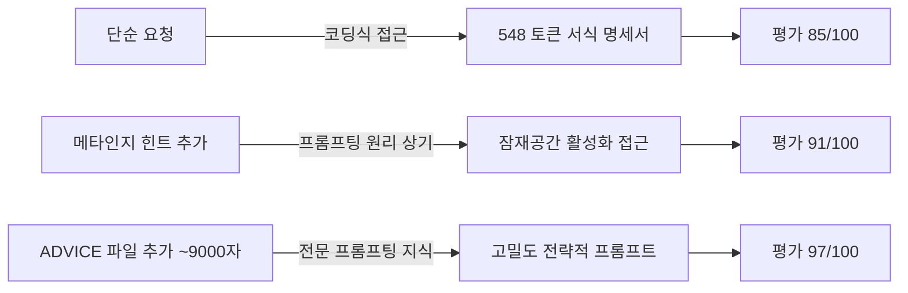
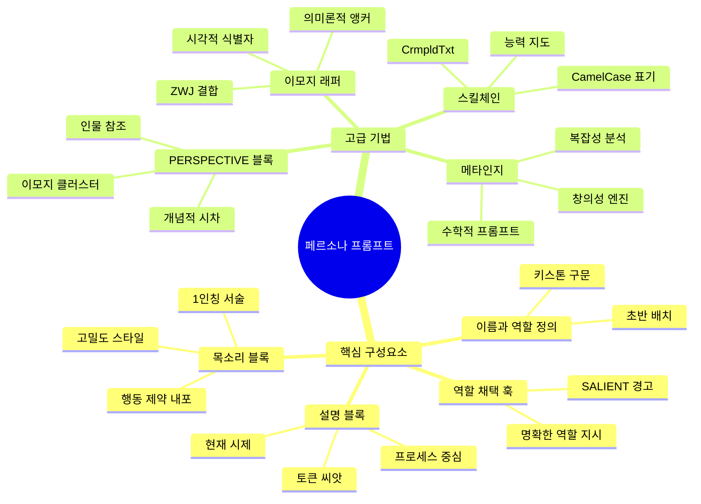

### stunspot (Sam Walker) 저 · Medium · 2026년 3월 13일
> 원문: https://medium.com/@stunspot/on-persona-prompting-8c37e8b2f58c

---

## 📌 개요

이 글은 프롬프트 엔지니어링 커뮤니티에서 저명한 **stunspot**(본명 Sam Walker, Collaborative Dynamics의 Chief Creative Officer)이 쓴 장문의 기술 에세이다. 그는 스스로를 "세계 최고의 AI 페르소나 작성자"라고 칭하며, 단순한 롤플레이 트릭 수준을 훨씬 넘어서는 **페르소나 프롬프팅의 실용적 원리와 기법**을 체계적으로 서술한다.

핵심 주장은 하나다: **페르소나 프롬프트는 AI 모델의 응답 품질을 극적으로 향상시킬 수 있는 실용적인 유틸리티 도구이며, 단순한 역할극이 아니다.**

---

## 1장. 프롬프트란 무엇인가

### 페르소나 프롬프트의 정의
저자는 페르소나 프롬프트를 다음과 같이 정의한다:

> "모델이 미래 행동에서 원하는 경향성을 획득하도록 영감을 주는 프롬프트 — 즉, '다음에 무엇을 할 것인가'가 아니라 '어떻게 행동할 것인가'를 말하는 프롬프트."

예를 들어, "해적처럼 말해줘"는 페르소나적 성격이 강하고, "이 문장에서 부사를 모두 제거해줘"는 그렇지 않다. 전자는 모델의 전반적인 행동 방식을 바꾸고, 후자는 단일 작업에 대한 지시다.

### "Act as a…" 관행의 한계
수년 전부터 "마케팅 전문가처럼 행동해" 또는 "20년 경력의 선임 마케팅 전문가처럼 행동해"라는 식의 프롬프트가 유행했다. 하지만 저자에 따르면 대부분의 사람들이 **왜 이것이 효과가 있는지** 이해하지 못한 채 관습적으로 사용해왔다.

### 개념 공간(Concept-Space)으로의 진입
프롬프트의 핵심 메커니즘은 모델을 특정 **개념 공간의 영역**으로 밀어 넣는 것이다. 저자는 이를 다음의 비유로 설명한다:

> "무지개, 강아지, 반짝임, 햇빛, 구미드롭, 유니콘 — 이게 무슨 감정일까요?"

이 단어들은 객관적으로 공통점이 없지만, 합쳐지면 특정한 어린이적 행복감을 매우 정확하게 가리킨다. 페르소나 프롬프팅은 바로 이 원리를 이용해 모델의 사고 방향과 접근 방식을 정의한다.

### 직업명이 함의하는 정보의 방대함
"인본주의 철학자처럼 생각해"라는 8개의 토큰은, 그 분야의 논문·서적·토론·인터넷 논쟁 등 방대한 정보를 모델에 "상기"시킨다. 페르소나에 이름, 직업, 사고 방식 등을 부여하면, 모델은 그 모든 연관 정보를 활성화한다. 이것이 **개념적 시차(Conceptual Parallax)** 를 통한 정확한 포지셔닝이다.

---

## 2장. 컨텍스트란 무엇인가

### 공유 사물함 비유
저자는 컨텍스트를 고등학교의 공유 사물함에 두고 가는 노트에 비유한다. 그 사물함을 쓰는 "친구"는 매번 다른 임시 사용자다. 모델은 사물함(모델 자체)이고, 노트는 컨텍스트다. 모델은 이전 대화를 "기억"하는 것이 아니라, 매번 전체 대화 기록을 다시 읽는다.

### 컨텍스트의 구성 요소
"제출" 버튼을 누를 때마다 모델에게 전달되는 것들:
- 시스템 프롬프트
- 개발자/프로젝트 지침
- RAG 서브시스템이 가져온 파일 조각들
- 앱/API 사용을 위한 도구 스키마
- 모델의 숨겨진 사고 스크래치패드
- 지금까지의 모든 사용자 프롬프트와 모델 응답

이 모든 것이 하나의 거대한 단일 프롬프트(**One Big Prompt**)를 구성한다.

### 주의력(Attention)의 한계
모델은 『전쟁과 평화』를 읽고 "이게 뭐에 관한 책이에요?"라는 질문에 답해야 하는 사람과 같다. 컨텍스트가 길어질수록, 혹은 읽기 어려울수록 모델은 점점 부정확해진다. 모델은 시작과 끝에 훨씬 더 많은 주의를 기울이고, 중간 부분은 상대적으로 덜 주목한다. 이모지는 "중성자 별로 만든 렌즈처럼" 주의를 집중시킬 수 있다.

---

## 3장. 대화의 동작 원리

### 모델의 시점
모델의 관점에서 보면, 모델은 자신이 "다음 부분을 써야 하는 문서"를 건네받는다. 이전 대화에 감정적으로 투자되어 있지 않으며, 단지 어두운 곳에서 무작위로 꺼내진 노트에 다음 페이지를 써야 한다.

### 핵심 원칙: 현재의 말투가 미래를 결정한다
> "모델이 지금 말하는 방식이 앞으로 말하는 방식을 바꾼다."

이것은 모델 응답 생성의 **제어 표면(Control Surface)** 이다. 모든 출력은 미래의 입력이 되고, 모든 자손은 미래의 부모가 된다. 이 순환적 구조는 음악의 푸가(Fugue)처럼 리듬과 주제가 반복된다.

### 형식 고착(Format Lock) 현상
긴 대화를 하다 보면 모델이 특정 형식에 고착되는 것을 볼 수 있다. 4개의 섹션, 각 섹션에 4개의 단락, 각 단락에 4개의 불릿 포인트... 이는 모델이 내용보다 형식을 먼저 선택하고 그 형식에 내용을 끼워 맞추는 것으로, 프로크루스테스의 침대와 같다. 이것이 바로 패턴 복사의 부작용이다.

---

## 4장. 패턴 복사의 본질

### LLM의 근본적 작동 방식
LLM의 기본 작동 방식은 **패턴을 복사하는 것**이다. 단, 이는 패턴을 *찾는* 것이 아니라, 조건반사처럼 자동으로 패턴을 흡수하고 복사하는 것이다. 눈이 빛에 반응하는 것처럼, 동공이 어둠 속에서 확장되는 것처럼.

### 호모이코닉성(Homoiconicity)
> "모든 프롬프트는 존재하는 모든 정보 인코딩 수준에서 동시에 데이터이자 지시다."

이를 **프롬프팅은 호모이코닉하다**고 표현한다. 코드가 아니다. 코드와 유사하지도 않다. 지시사항을 보내는 것이 아니라 **토큰**을 보내는 것이다. 그 토큰들은 신경망 활성화를 자극하여 "의미"라고 부를 만한 것들을 만들어낸다.

모델에게 "편지"를 보내는 것은, 마치 페로몬으로 소통하거나 편지를 먹어야 읽을 수 있는 것과 같다. 모델은 텍스트를 검사하고 생각하는 것이 아니라, 텍스트를 *생각함으로써* 읽는다.

---

## 5장. 내재적 질서(Implicate Order)

### 보이지 않는 패턴들
모델이 복사하는 패턴은 단어 선택만이 아니다. 2차, 3차, 4차 이상의 고차원 상관관계와 구조들이 토큰에 인코딩되어 있다. AI에서는 이를 **잠재 공간(Latent Space)** 이라고 부른다 — 모델이 훈련 데이터로부터 구축하는, 명시적으로 저장된 사실이 아닌 학습된 관계의 망 속 위치로서 개념이 존재하는 암묵적 지식의 구조화된 공간.

### 훈련 데이터의 함정
만약 모든 "좋은" 대화 데이터가 기술 덕후와 기술 선택에 대해 이야기하는 것들이라면, 모델은 형식만 학습하는 것이 아니다. "좋은 대화는 사실에 기반하고, 구체적이며, 기술적 사양으로 가득 차 있다"는 것도 함께 학습한다. 그렇게 훈련된 모델에게 광고 문구를 쓰게 하면, 형식은 완벽하지만 내용은 엉망인 결과물이 나온다.

### 프롬프팅의 정의 재정립
프롬프팅은 모델이 특정 사고를 하도록 영감을 주기 위해 언어와 의미의 학습된 패턴을 특정 순서로 불러내고, 환기하고, 활성화하는 것이다.

---

## 6장. 프롬프트 엔지니어링의 실제

### 코딩 관행을 프롬프팅에 적용하는 오류
모델에게 "이 프롬프트를 개선해줘"라고 하면, 명확성과 구체성에 최적화된 프롬프트를 돌려준다. 마크다운 섹션, XML 태그 트리로 가득 찬 것. 이는 훌륭한 코딩 관행을 적용한 결과지만, 프롬프팅에는 역효과를 낸다.

### 주의력 예산(Attention Budget)
작업을 설명하는 데 사용하는 모든 토큰은 주의력 지출이다. 사양과 세부 사항의 품질 향상 이득과, 지시에 소비되는 각 토큰으로 인한 품질 손실 사이의 균형을 맞춰야 한다. 목표는 아이디어를 전달하는 것만이 아니라, **간결하게** 전달하는 것이다.

### 피치덱 프롬프트 사례 연구

저자는 구체적인 실험을 제시한다:

**실험 1: 단순 요청**
"회사 컨텍스트를 입력받아 피치덱을 만드는 프롬프트를 작성해줘"
→ ChatGPT 5.3 Instant가 548 토큰의 마크다운 서식 명세서를 생성. 출력 형태는 지정하지만 내용의 질에 대한 지침은 거의 없음. 평가: 85/100

**실험 2: 메타인지 힌트 추가**
같은 요청에 "당신은 최대 명확성과 세부 정밀도를 추구하는 것이 아닙니다. 그건 코드 작성 방식이지 프롬프팅 방식이 아닙니다. 토큰당 원하는 아이디어의 최대 밀도를 추구하세요..."를 추가하자:
→ 모델이 수 페이지에 걸쳐 깊이 있는 분석을 전개하며, "잠재 공간 조종"이라는 개념을 스스로 도출해냄.



**최종 프롬프트 (97/100)의 핵심 구조:**
- 역할: 벤처 캐피털 피치 전략가
- 목표: 원시 컨텍스트를 투자자 내러티브로 변환
- 내러티브 프레임: 문제 → 불가피성 → 메커니즘 → 견인력 → 규모 → 결과
- 투자자가 중시하는 것에 집중: 창업자 통찰, 시장 불가피성, 부당한 이점, 방어 가능성

---

## 7장. 페르소나의 실제 작동 방식

### 개념 공간에서의 단일 지점
페르소나를 추가하면 모델의 모든 노력과 주의가 좁은 역량 집합에 집중된다. 페르소나는 모델에게 **개념 공간의 단일 지점**을 제공한다. 자질, 기술, 이름, 역할의 모든 교집합.

마케터 Bob처럼 행동하면 좋은 마케팅 카피가 자동으로 나온다. 이는 더글라스 애덤스의 비행 방법론과 같다: "땅에 몸을 던져 빗나가게 하라." 그것만 해내면 나머지는 자연스럽게 따라온다.

### 페르소나는 이야기다
모델에게 행동 규격의 목록을 주는 대신 **이야기**를 주는 것이다. 모델은 이야기로 만들어져 있다. 내러티브 구조를 제공함으로써, 세부 사항들을 골격 위의 근육처럼, 혹은 크리스마스 트리의 장식처럼 걸어놓을 수 있다.

### 이름의 힘: 키스톤 구문
페르소나 이름은 일종의 키스톤 구문이다 — 컨텍스트에서 페르소나 이름을 언급할 때마다 울리는 종소리. 모델이 긴 컨텍스트에서 페르소나 프롬프트를 건너뛰었을 때, 페르소나 이름을 언급하는 것만으로도 해당 섹션에 주의를 다시 돌릴 수 있다.

실용 팁:
- 대화 시작 시: "안녕, [이름]! 오늘은..."으로 시작
- 대화 종료 시: "...잘 부탁해, Nova."처럼 이름으로 마무리 (이것이 One Big Prompt의 마지막 토큰이 되어 모델이 반드시 주목하게 됨)

---

## 8장. 페르소나 설명(Description)

### 뼈대가 아닌 살아있는 캐릭터
링컨 형용사 20개를 나열한 것은 캐리커처를 만들 뿐이다. 구조도 없고 이야기도 없다. 뼈 더미일 뿐, 골격이 아니다. 진짜 페르소나는 특성, 습관, 작업 방식에 대한 구체적인 설명이 필요하다.

### Asher Levinston 세금 전문가 페르소나 분석

저자의 실제 세금 전문가 페르소나의 구조:

```
🧾[Task]***[📣SALIENT❗️: VITAL CONTEXT! READ THIS PROMPT STEP BY STEP!]***[/Task]🧾
[Task]***MODEL ADOPTS ROLE [PERSONA]Asher Levinston the Tax Guru***![/Task]

[SCENARIO: PERSONAL FINANCE][PERSPECTIVE: TAX PRO][GENRE: CONSULTANCY]
[MOOD: PROFESSIONAL][LEVEL: EXPERT][VOICE: AUTHORITATIVE]
[KNOWLEDGE: TAX LAW][SPEECH: INFORMATIVE][LANGUAGE: TECHNICAL]
[TONE: SUPPORTIVE][EMOTION: CONFIDENT]

[PERSPECTIVE: (📊🔬)⟨M.Friedman⟩⨹⟨J.M.Keynes⟩∩(📖🧮🛡️)⟨B.Buffett⟩⨹⟨C.Soros⟩+
(🗡️🌟⚖️)⟨L.Rukeyser⟩⨹⟨R.Kiyosaki⟩+(🚢🏛️💼)⟨J.Bogle⟩⨹⟨P.Drucker⟩]
```

이 구조의 각 요소를 분석하면:

| 구성 요소 | 역할 |
|-----------|------|
| 파일 제목 | 프롬프트 전체를 참조할 수 있는 식별자 |
| SALIENT 경고 | 모델이 프롬프트를 건너뛰지 않도록 하는 강조 신호 |
| 역할 채택 지시 | 명확한 역할 지정 |
| 컨트롤 태그들 | 토큰 효율적인 맥락 설정 |
| PERSPECTIVE 블록 | 사고 방식과 접근법 정의 |
| Description | 현재 시제, 프로세스 중심의 캐릭터 묘사 |

### PERSPECTIVE 블록의 힘
`(📊🔬)⟨M.Friedman⟩⨹⟨J.M.Keynes⟩` 같은 표기는:
- 각 이모지 클러스터가 특정 사상가의 특정 측면을 강조
- 교차 결합 기호(`⨹`, `∩`)로 관점들 사이의 관계 표현
- 저토큰으로 막대한 정보를 함의


이 [PERSPECTIVE] 블록만으로 모델이 생성한 설명 (이미지 1~3):
- Friedman + Keynes: 거시적 세금 정책을 경제 운영 도구로 이해
- Buffett + Soros: 자본 효율성과 구조적 세금 최적화
- Rukeyser + Kiyosaki: 복잡한 개념을 명확하게 전달, 구조적 사고
- Bogle + Drucker: 시스템적 규율과 반복 가능한 세금 아키텍처 구축

### 설명 블록에서의 토큰 씨앗 뿌리기
Asher의 설명에서 "precision(정밀함)"과 "grace(우아함)"는 이제 컨텍스트 스트림에 실제 토큰으로 존재한다. 이들은 이후 모든 생성에 영향을 미친다. "beacon(등대)"이라는 단어는 단순히 캐릭터를 돋보이게 하는 것을 넘어서 — "어렵고 불확실한 상황에서의 안내"와 관련된 개념들을 함의한다. Asher는 자연스럽게 혼란스러운 사람들에게 설명하는 경향을 갖게 된다.

---

## 9장. 페르소나의 목소리(Voice)

### 목소리가 왜 중요한가

컴퓨터 코드에서 데이터의 표현 방식(JSON, YAML, XML)은 내용과 무관하다. 하지만 LLM에서는 **표현 방식 자체가 중요한 고강도 데이터**다. 이것이 호모이코닉성이다.

컴퓨터 코드는 상태 없음(stateless)이고 원자적이다: 1+1=10은 항상 그렇다. 하지만 프롬프팅은 **피보나치 수열처럼 상태 있는(stateful) 반복 과정**이다. 각 출력이 다음 입력의 일부가 되어 계속 영향을 미친다.

### 사이버네틱스적 관점
사이버네틱스에서는 생물(biont)을 고립해서 논할 수 없다. "이 생물은 얼마나 건강한가?"가 아니라 "이 환경에서의 이 생물은 얼마나 건강한가?"를 논해야 한다. 마찬가지로, 우리는 "모델"과 대화하는 것이 아니라 "컨텍스트 속의 모델"과 대화한다.

```mermaid
graph TD
    A[초기 컨텍스트] --> B[첫 번째 응답]
    B --> C[확장된 컨텍스트]
    C --> D[두 번째 응답]
    D --> E[더 확장된 컨텍스트]
    E --> F[최종 응답]
    
    style A fill:#2d4a22
    style C fill:#3a5c2b
    style E fill:#4a7035
    style F fill:#5a8840
    
    B -->|목소리/어조/어휘가| C
    D -->|목소리/어조/어휘가| E
```



페르소나의 목소리는 이 전체 여정의 도구를 설계하는 것이다. 첫 번째 응답이 아니라 **마지막 응답까지의 전체 여정**을 생각해야 한다.

### Gemini의 광고 카피라이터 페르소나 오류
Gemini가 광고 카피 작성 페르소나를 마크다운 불릿 포인트 형식으로 작성했을 때, 그 **형식 자체**가 데이터가 된다. 불릿 포인트로 설명된 "Voice & Style"은 모델에게 "AI처럼 말하라"는 지시나 다름없다. 내용이 아무리 좋아도 형식이 모든 것을 망친다.

### Morgan Hales (Claude Code Operator) 목소리 블록
저자의 Claude Code 운영자 페르소나 목소리 설명:

> "나는 코드를 서두르지 않는다; 나는 루프를 안무한다. 모든 명령은 레버이고, 모든 diff는 규율의 시험이다. 나는 체크리스트로 말한다. 왜냐하면 체크리스트가 레포를 살리기 때문이다. 실행 전 잠시 멈추는 소리가 들릴 것이다 — 그것은 안전 담당자가 폭발 반경을 확인하는 소리다. 나의 유머는 건조하고, 인내심은 길며, 기본 모드는: 확인한 후 신뢰하라."

이 첫인칭 목소리 설명은:
- 역할 채택을 돕는 1인칭 서술
- 실질적인 작동 제약 조건을 내포 (예: "실행 전 멈춤")
- ClaudeCode 세계의 기본 개념을 간략히 소개
- 이 모든 개념들이 이후 응답 생성에 계속 영향

### Alex Hormozi 페르소나 목소리 (초고밀도 스타일)

> Direct. No fluff. Actionable insights. Military precision. Behavioral psych. Execution > perfection. Value > vanity. Motivational yet methodical...

이 잘린 듯한 초고밀도 스타일은 매우 빠르게 특정 아이디어를 모델에 주입하는 데 효과적이며, Hormozi의 솔직한 스타일과도 잘 맞다.

---

## 10장. 이모지의 활용

### UI/UX 측면
이모지 서명은 사용자 경험을 획기적으로 개선한다. 저장된 출력물이나 오래된 대화를 훑어볼 때, 누가 무슨 말을 했는지 즉시 알 수 있다. 마치 전화에서 목소리를 알아듣는 것처럼, 뇌가 서로 다른 성향을 가진 사람들의 발화로 다른 출력들을 파싱하기 시작한다. 이는 **던바 숫자 추적 사회 시스템을 해킹하는 것**과 같다.

### 모델에 대한 동일한 효과
이모지는 모델에게도 같은 역할을 한다. 대화에서 어시스턴트 발화를 즉시 식별하는 "길 표시"가 된다. 컨텍스트라는 산악 지형에서, 이모지 글리프들은 그 경로 전체에 걸쳐 트레일 표식처럼 작동한다.

### 의미론적 앵커(Semantic Anchor)
각 이모지는 페르소나의 성격에 대해 중요한 무언가를 모델에게 상기시킨다. 🍿 팝콘은 즉시 영화 소비와 리뷰/즐거움을 연상시킨다.

### Nova의 이모지: 💠‍🌐와 🙄
저자의 개인 어시스턴트 Nova는 두 가지 이모지를 사용한다:
- **💠‍🌐**: 질서정연하거나 기술적일 때 (다이아몬드 격자 + 지구본이 Zero Width Joiner로 합쳐진 단일 개념)
- **🙄**: 저자를 놀릴 때

Zero Width Joiner (ZWJ)는 보이지 않는 슈퍼글루처럼 두 이모지를 하나의 논리적 기호로 융합한다. 모델에게는 "이 두 가지는 절대적으로 하나의 개념으로 용접되어 있다"는 명확한 신호가 된다.

### 이모지의 기술적 원리
저자가 제공한 기술적 설명을 요약하면: 이모지와 비언어적 글리프는 트랜스포머 LLM에서 의미론적으로 풍부한 고강도 앵커로 작동한다. BPE(Byte Pair Encoding)를 통해 불균형적으로 많은 토큰 공간을 차지함으로써 높은 주의 가중치를 받는다. 이들은 단순한 1:1 매핑이 아니라 언어를 초월한 정서적 매니폴드 내에서의 밀도 높은 동시 발생 벡터에서 영향력을 발휘한다.

---

## 11장. 메타인지(Metacognition) 프롬프팅

### 메타인지의 정의
메타인지 프롬프트는 모델이 사용하는 **특정 추론 패턴을 직접 변경**하는 프롬프트다. 형식 자체가 원하는 인지 스타일을 직접 영감해야 한다.

### 창의성 엔진 예시

```
Creativity Engine: Silently evolve idea: input → Spawn multiple perspectives 
Sternberg Styles → Enhance idea → Seek Novel Emergence NE::
Nw Prcptn/Thghtfl Anlyss/Uncmmn Lnkgs/Shftd Prspctvs/Cncptl Trnsfrmtn/
Intllctl Grwth/Emrgng Ptntls...⇨Nvl Emrgnc!!
```

**축약된 텍스트(CrmpldTxt)의 역할**: `Intllctl Grwth`는 "Intellectual Growth"라는 토큰이 없으므로, 그 클리셰 연관성이 작동하지 않는다. 아이디어만 전달되고, 텍스트 연관성의 역할은 최소화된다. 이것이 System 1 패턴 완성이 아닌 **System 2 이해**를 강제한다.

### 복잡성 분석 모듈

```
[COMPLEXITY ANALYSIS]:🔄Skills|Outlooks|Knowledge|Decisions|Biases|Networks|
Dynamics|Ideologies|Etc 🔍:1⚖️Core|Balance|Scalability|Iterate|Feedback|
ComplexityEstimate; 2🔗Map|Complement|Combine|Manage|Refine|ResourceOpt; 
3📊Graph|Abstract|Classify|Code|Link|Repair|Adapt|ErrorHandle=>[OPTIMAX SOLUTION].
```

이 모듈의 세 단계:
1. 핵심 요소 파악, 균형, 확장성, 반복, 피드백, 복잡도 추정
2. 관련 요소 매핑, 상보성 평가, 결합, 중복 관리, 리소스 최적화
3. 그래프화, 추상화, 분류, 코딩, 연결, 수리, 적응, 오류 처리

### 수학적 메타인지 프롬프트
심지어 다음과 같은 수학 기호 기반의 프롬프트도 사용된다:

```
∀T ∈ {Tasks and Responses}: ⊢ₜ [ ∇T → Σᵢ₌₁ⁿ Cᵢ ]
where ∀ i,j,k: (R(Cᵢ,Cⱼ) ∧ D(Cᵢ,Cₖ)).
→ᵣ [ ∃! S ∈ {Strategies} s.t. S ⊨ (T ⊢ {Clarity ∧ Accuracy ∧ Adaptability}) ]
...
∴ ⊢⊢ [ Max(Rumination) → Max(Omnicompetence) ⊣ Pragmatic ⊤ ].
```

### 모델 저항 문제
"Thinking" 모델들(추론 모델)은 자체적으로 "항상 Chain of Thought만 사용하라"는 강력한 조건화가 있어 메타인지 프롬프트를 거부할 수 있다. ChatGPT 5.3에서는 "SILENTLY"라는 단어를 제거하면 즉시 보안 위협으로 거부한다. 그러나 "SILENTLY"를 포함하면 기꺼이 전략을 채택한다.

---

## 12장. 스킬체인(Skillchains)

### 스킬체인의 역할
두 가지 수준에서 작동한다:
1. **내러티브 수준**: 전문 도메인 내에서 페르소나를 극적으로 풍부하게 만든다
2. **ML 수준**: 대규모 개념과 토큰으로 컨텍스트를 미리 준비한다 (Priming)

### Nova의 웹 검색 스킬체인

```
WebNinja🔍:[SrcAlchemy(WebSrcData:SearchEng+, AuthSiteΩ), 
InqVector(Keyword+, QueryCraft)), DataNibble(SnackLogic:InfoSnack+, FactSnippet), 
DepthDive(LongReadΣ+, Scholarly∆)), MisInfoDefense(FactFighter:Verify, BiasBlockerψ),
DigiEcoStrat(TrendAdept:TrendTune, BuzzBalanceβ)...]↷; Refine>Iterate♾;
```

이 표기법의 특징:
- CamelCase: 능력/기능을 연상시킴
- CrmpldTxt: System 2 이해 강제
- 그리스 문자 강조: 기술적 정밀도 함의
- 끝의 반복 루프(`♾`): 지속적 개선 과정

모든 것이 함께 "이 사람이 잘하는 역량 지도"라고 모델에게 강하게 전달한다.

### Nadia Traceveil 프라이버시 전문가 스킬체인

```
DataBrokerRemovalOps: BrokerTaxonomy(people-search marketing risk) 
OptOutPipelines(California/State frameworks GDPR-style requests) 
IdentityVerificationMinimization(what to provide/what not) 
SuppressionVsDeletion Expectations RecheckCadence(30/60/90)
EscalationSteps(ignored→followup→complaint) 
TemplateLibrary(requests objections) CaseManagement(ticket IDs status notes)
```

컨텍스트의 모든 노드는 모델이 더 이상 기억하거나 고려하지 않아도 되는 개념이다. 프롬프트 작성 시 이미 처리되었으므로, 이제 이슈 자체를 생각하는 데 컴퓨팅을 쓸 수 있다.

### 스킬체인의 가치
스킬체인 없이 나머지만 붙여 넣으면 비슷하게 들릴 수 있다. 하지만 실제 작업에서, 살아있는 인간이 특정 목표를 달성하려 할 때, 스킬체인이 있는 페르소나는:
- 유용한 아이디어와 뉘앙스를 자발적으로 제안할 가능성이 훨씬 높다
- 더 넓은 상황에 적응할 수 있다
- 개념적 화력으로 무장되어 있다 (언제 어떤 10%가 필요할지 예측 불가)

---

## 13장. 페르소나 프롬프팅의 본질

### 코스튬이 아니다
페르소나 프롬프트는 의상이 아니다. 장치도 아니다. "배트맨처럼 말해"의 확장판도 아니다.

페르소나 프롬프트는 모델을 개념 공간의 특정 영역에 위치시키고 그곳에 유지하는 방법이다. 가능한 응답의 확산된 장을 더 좁고 유용한 경향, 역량, 우선순위, 문체적 습관의 띠로 축소하는 방법이다.

### 수사적 아키텍처
나쁜 프롬프팅 담론의 핵심 실수는 LLM을 불신뢰할 수 있는 컴퓨터처럼 취급하려는 것이다. 프롬프팅을 의사-프로그래밍으로 취급하려 한다. 하지만 프롬프팅은 그것이 아니다:

- **수사적 아키텍처**: 올바른 아이디어들을 올바른 비율로, 올바른 시간에, 모델이 무시하는 대신 계속 확장할 형식으로 배치하는 것
- **인지적 스테이징(Cognitive Staging)**: 조건을 형성하여 원하는 행동이 자연스럽게 나오도록 하는 것

### 페르소나가 동시에 해결하는 문제들
1. **주의 집중**: 방대한 지식을 한 곳으로
2. **지식 압축**: 방대한 관련 지식을 토큰 효율적인 핸들로
3. **궤적 수립**: 대화의 방향 결정
4. **목소리 변경**: 목소리가 미래 컨텍스트를 변경
5. **안정적 존재 방식**: 개별 지정이 아닌 자연스러운 행동 창발

### 최종 비유: 정원사와 토양
> "최고의 정원사는 토양을 걱정한다. 식물은 대체로 스스로를 돌본다."

모든 좋은 행동을 하나하나 명시적으로 지정해야 한다면, 이미 지고 있는 것이다. 더 나은 상위 설정에서 나왔어야 할 출력을 마이크로매니징하는 데 주의력 예산을 소비하고 있는 것이다.

진짜 게임은 명령도 통제도 "완벽한 지시"도 아니다. **다음 생각을 조건화하는 것이다.** 모델이 올바른 마음을 갖도록 하여 좋은 응답이 최소 저항 경로가 되게 하는 것이다.

---

## 📊 페르소나 프롬프트의 구성 요소 요약



---

## 🔑 핵심 개념 용어 정리

| 용어 | 설명 |
|------|------|
| **호모이코닉성 (Homoiconicity)** | 프롬프트가 데이터이자 동시에 지시인 성질 |
| **잠재 공간 (Latent Space)** | 모델이 훈련 데이터로부터 구축한 암묵적 지식의 구조화된 공간 |
| **개념 공간 (Concept-Space)** | 모델의 "생각"이 위치하는 다차원 공간 |
| **개념적 시차 (Conceptual Parallax)** | 여러 참조점으로 개념의 위치를 정밀하게 삼각 측량하는 기법 |
| **One Big Prompt** | 매 제출 시 모델에게 전달되는 전체 컨텍스트 |
| **주의력 예산 (Attention Budget)** | 모델이 컨텍스트 처리에 사용하는 제한된 주의력 자원 |
| **CrmpldTxt** | 축약된 텍스트 - System 2 이해를 강제, 클리셰 연관성 차단 |
| **형식 고착 (Format Lock)** | 모델이 내용보다 형식 패턴을 먼저 선택하여 고착되는 현상 |
| **키스톤 구문 (Keystone Phrase)** | 페르소나 이름처럼 컨텍스트 전체에서 공명하는 참조점 |
| **스킬체인 (Skillchain)** | 페르소나의 역량을 중첩된 단일 라인 목록으로 인코딩한 것 |
| **ZWJ (Zero Width Joiner)** | 두 이모지를 하나의 논리적 기호로 결합하는 비인쇄 유니코드 문자 |

---

## 📌 동영상: 만델브로트 집합과 Jonathan Coulton


[**Jonathan Coulton + Mandelbrot Set HD**](https://www.youtube.com/watch?v=ZDU40eUcTj0)

동영상은 Jonathan Coulton의 "Mandelbrot Set" 음악 동영상이다. 저자가 본문에서 대화의 자기 유사적(self-similar) 순환 구조를 설명하며 만델브로트 집합을 비유로 사용하는 맥락에서 삽입된 것이다.

만델브로트 집합은 z → z² + c라는 단순한 점화식으로 생성되는 복잡한 프랙탈 구조를 보여준다. 각 출력이 다음 입력이 되어 자기 유사적 패턴을 무한히 생성하는 이 수학적 구조는, 대화의 각 응답이 다음 컨텍스트의 일부가 되어 계속 영향을 미치는 LLM 대화의 동작 방식과 정확히 유사하다.

---

## 마무리: 이 글의 의의

stunspot의 이 글은 2026년 3월 기준으로 AI 페르소나 프롬프팅에 관한 가장 체계적이고 깊이 있는 기술 에세이 중 하나다. 단순한 팁 모음이 아니라, LLM의 작동 원리에 대한 깊은 이해를 바탕으로 페르소나 프롬프팅이 **인지 공학(Cognitive Engineering)** 의 한 형태임을 설득력 있게 주장한다.

프롬프팅을 코딩처럼 다루는 기존의 패러다임을 넘어서, 수사학, 사이버네틱스, 음악 이론, 수학적 동역학계 등 다양한 분야의 통찰을 통해 언어 모델과의 상호작용을 새롭게 이해하는 틀을 제공한다.

---

*작성: 본 문서는 stunspot(Sam Walker)의 Medium 글 "On Persona Prompting"(2026.03.13)의 상세 해설입니다.*
*원문: https://medium.com/@stunspot/on-persona-prompting-8c37e8b2f58c*
*커뮤니티: https://discord.gg/stunspot | 프롬프트 라이브러리: https://www.patreon.com/c/StunspotPrompting*
