> **출처** : *The Common Architecture Behind Every Agent Harness* (Prompt Engineering, 2026.05.01)  
> **영상** : https://www.youtube.com/watch?v=nWzXyjXCoCE  
> **구성** : ① 하네스 정의 → ② 프레임워크와의 차이 → ③ 9가지 핵심 구성 요소 → ④ Python 레퍼런스 구현 → ⑤ 전체 데이터 흐름 → ⑥ 2026년 최신 동향 → ⑦ 설계 원칙 정리

---
## 관련글

[**에이전트 하네스(Agent Harness)의 공통 아키텍처**](https://k82022603.github.io/posts/%EC%97%90%EC%9D%B4%EC%A0%84%ED%8A%B8-%ED%95%98%EB%84%A4%EC%8A%A4(agent-harness)%EC%9D%98-%EA%B3%B5%ED%86%B5-%EC%95%84%ED%82%A4%ED%85%8D%EC%B2%98/)

## 목차

1. [왜 지금 "하네스"인가](#0-왜-지금-하네스인가)
2. [하네스란 무엇인가 — 정의](#1-하네스란-무엇인가--정의)
3. [하네스 vs. 프레임워크 — 중요한 구별](#2-하네스-vs-프레임워크--중요한-구별)
4. [하네스의 9가지 핵심 구성 요소](#3-하네스의-9가지-핵심-구성-요소)
   - 3-1. While Loop — 반복 엔진
   - 3-2. Context Management — 컨텍스트 관리
   - 3-3. Skills & Tools — 스킬과 도구
   - 3-4. Sub-agents — 서브에이전트
   - 3-5. Built-in Skills — 내장 스킬
   - 3-6. Session Persistence — 세션 영속성
   - 3-7. System Prompt Assembly — 시스템 프롬프트 조립
   - 3-8. Lifecycle Hooks — 생명주기 훅
   - 3-9. Permissions & Safety — 권한과 안전
5. [Python 레퍼런스 구현 — 전체 프로젝트 구조](#4-python-레퍼런스-구현--전체-프로젝트-구조)
6. [전체 데이터 흐름 — 한눈에 보기](#5-전체-데이터-흐름--한눈에-보기)
7. [최신 동향 — 2026년의 하네스 아키텍처](#6-최신-동향--2026년의-하네스-아키텍처)
8. [정리 — 하네스를 설계할 때 기억해야 할 것](#7-정리--하네스를-설계할-때-기억해야-할-것)
9. [참고 자료](#참고-자료)

---

## 0. 왜 지금 "하네스"인가

2025~2026년을 기점으로 AI 에이전트는 단순한 챗봇 수준을 완전히 벗어났다. 실제 코드 저장소를 읽고 수정하며, 테스트를 실행하고, 버그를 스스로 찾아 고치고, 파일 시스템을 자유롭게 탐색하는 수준까지 도달했다. Codex, Cursor, Claude Code, Windsurf 같은 도구들이 시장에 등장하면서 "에이전트를 어떻게 구동하는가"라는 질문이 개발 커뮤니티의 핵심 화두로 부상했다. 그 중심에 있는 개념이 바로 **하네스(harness)** 다.

그런데 흥미롭게도, 하네스를 직접 만들고 있는 사람들조차 그것을 깔끔하게 정의하지 못하는 경우가 많다. "LangChain 쓰면 되는 거 아닌가?", "프레임워크랑 다른 건가?", "그냥 도구 호출(tool calling) 아닌가?" 같은 질문이 끊이지 않는다. 단어는 넘쳐나지만 정의는 제각각이다. 같은 단어를 쓰면서 서로 다른 것을 가리키는 혼란이 커뮤니티 전체에 퍼져 있다.

이 문서는 그 혼란을 정리하는 것을 목표로 한다. 하네스가 정확히 무엇인지, 왜 프레임워크와 다른지, 어떤 구성 요소로 이루어져 있는지를 실제 코드 수준까지 파고들어 해설한다. 특히 에이전트를 직접 만들려는 사람이라면, 이 문서가 설계의 출발점이 될 수 있다.

---

## 1. 하네스란 무엇인가 — 정의

하네스를 한 문장으로 정의하면 다음과 같다.

> **하네스는 모델을 에이전트로 변환하는 고정 아키텍처다.**

이 문장의 각 단어를 해체해서 살펴보는 것이 이해에 도움이 된다.

**"모델"** 이란 무엇인가. 현대의 LLM(대형 언어 모델)은 근본적으로 "한 번의 텍스트 생성기(one-shot text generator)"다. 입력을 받고, 출력을 내보내고, 멈춘다. 그 자체로는 파일을 읽거나, 코드를 실행하거나, 결과를 확인하고 다시 시도하는 능동적인 행위를 할 수 없다. ChatGPT든 Claude든 Gemini든, 모델 자체는 질문에 답하는 존재지 스스로 행동하는 존재가 아니다.

**"에이전트"** 란 무엇인가. 에이전트는 단순히 답하는 것을 넘어 행동하는 존재다. 파일을 열고, 코드를 수정하고, 터미널 명령을 실행하고, 그 결과를 보고 다음 행동을 결정한다. 에이전트는 "문제가 실제로 해결될 때까지" 계속 시도한다.

**"고정 아키텍처"** 란 무엇인가. 이것이 핵심이다. 하네스는 조립이 필요 없이 이미 완성된 구조다. 사용자는 목표만 제시하면 된다. 하네스가 나머지를 처리한다.

따라서 하네스는 모델에게 행동 능력을 부여하는 완성된 구조다. 행동을 취하고, 그 결과를 보고, 문제가 실제로 해결될 때까지 계속 진행하게 만드는 것이 하네스의 역할이다.

**비유: 엔진과 자동차**

모델은 엔진이고, 하네스는 그 엔진을 감싸고 있는 자동차다. 아무리 강력한 엔진이라도 자동차 없이는 어디도 갈 수 없다. 핸들, 브레이크, 연료 시스템, 기어, 타이어가 있어야 비로소 주행이 가능하다. 하네스는 바로 이 "자동차 전체"에 해당한다.

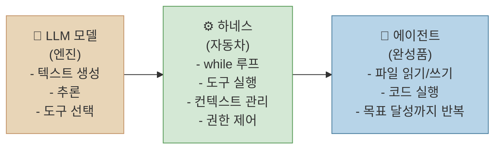

이 개념의 가장 좋은 실사례가 바로 Claude Code다. Anthropic의 공식 문서는 Claude Code를 명시적으로 "Claude를 감싸는 에이전트 하네스(agentic harness around Claude)"라고 정의한다. 언어 모델 자체는 Claude지만, 그것을 유능한 코딩 에이전트로 만드는 것은 Claude Code라는 하네스다. 파일 시스템 접근, 터미널 실행, 컨텍스트 관리, 권한 시스템이 모두 하네스의 일부다.

이 관계를 바꾸어 말하면, **하네스 없이는 에이전트도 없다.** 하네스는 단순한 래퍼가 아니라, 에이전트를 에이전트답게 만드는 본질적인 구조다.

---

## 2. 하네스 vs. 프레임워크 — 중요한 구별

하네스를 이해하려면 반드시 프레임워크와의 차이를 명확히 해야 한다. 두 개념은 자주 혼용되지만, 설계 철학이 근본적으로 다르다.

**프레임워크**의 예시로는 LangChain, LangGraph, AutoGen, CrewAI가 있다. 이것들은 추상화를 제공한다. State, Chain, Memory, Retriever 같은 건축 자재를 준다. 하지만 그 자재를 어떻게 조합할지는 개발자가 결정해야 한다. "당신이 설계하세요. 우리는 부품을 드립니다"가 프레임워크의 철학이다.

**하네스**는 반대 방향에서 시작한다. 조립 단계 자체가 없다. 이미 완성된 채로 출하되기 때문이다. "그냥 목표를 알려주세요. 우리가 알아서 합니다"가 하네스의 철학이다. 내부적으로 보면 하네스는 결국 "while 루프 + 도구 레지스트리 + 권한 레이어"가 모두 미리 연결된 구조다.

| 구분 | 프레임워크 | 하네스 |
|------|-----------|--------|
| 목적 | 인간이 에이전트를 조립하기 위한 도구 | 에이전트 자체가 작업을 수행하기 위한 구조 |
| 핵심 제공물 | State, Chain, Memory, Retriever 등 추상화 | 즉시 실행 가능한 완성된 에이전트 |
| 사용 방식 | 개발자가 직접 부품을 연결해야 함 | 조립 단계 없음, 목표만 제공 |
| 핵심 가정 | 인간 아키텍트가 설계 및 구성할 것 | 에이전트가 목표를 받아 스스로 처리할 것 |
| 대표 예시 | LangChain, LangGraph, AutoGen, CrewAI | Claude Code, Cursor, Codex, Windsurf |

한 가지 핵심 문장으로 요약하면 이렇다.

> **프레임워크는 인간이 에이전트를 만들기 위해 설계된 것이고, 하네스는 에이전트 자체가 작업을 수행하기 위해 설계된 것이다.**

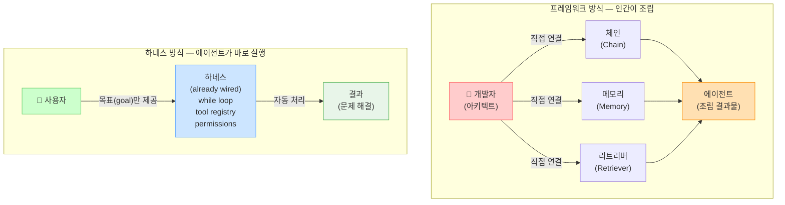

이 구분이 중요한 이유는 실용적인 선택 문제와 직결되기 때문이다. 특정 도메인의 에이전트를 처음부터 유연하게 설계하고 싶다면 프레임워크가 맞다. 반면 "지금 당장 코드 작업을 자동화할 에이전트가 필요하다"면 하네스가 맞다. 하네스를 프레임워크처럼 쓰려 하거나, 프레임워크를 하네스처럼 기대하는 것이 많은 혼란의 원인이다.

---

## 3. 하네스의 9가지 핵심 구성 요소

현대적인 에이전트 하네스를 구성하는 요소는 크게 9가지로 분류할 수 있다. Claude Code, Codex, Cursor 같은 주요 코딩 에이전트들이 서로 다른 팀에 의해 독립적으로 만들어졌음에도 놀랍도록 유사한 아키텍처로 수렴했다는 사실이 이 9가지 요소의 보편성을 증명한다. 즉, 이것은 한 사람의 의견이 아니라, 실전에서 검증된 패턴이다.

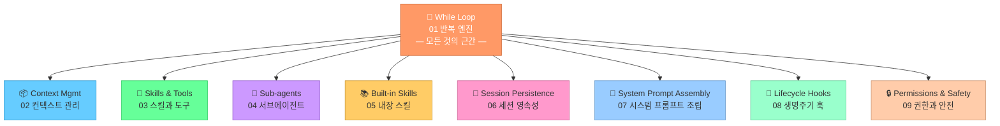

9가지를 한번에 외우기 어렵다면, 세 그룹으로 묶어 생각해도 좋다.

- **실행 엔진** (01~02): 루프와 메모리 관리 — "어떻게 돌아가는가"
- **능력 확장** (03~05): 도구, 서브에이전트, 내장 스킬 — "무엇을 할 수 있는가"
- **인프라 레이어** (06~09): 저장, 프롬프트, 훅, 권한 — "안전하고 지속적으로 어떻게 운영하는가"

---

### 3-1. While Loop — 반복 엔진 (The Foundation)

**한 문장 요약: 하네스의 심장. 이것이 없으면 에이전트도 없다.**

하네스의 가장 근본적인 구성 요소는 **while 루프**다. 에이전트가 단순한 챗봇과 다른 이유, 목표를 향해 스스로 계속 행동하는 이유가 모두 이 루프에서 비롯된다.

동작 방식은 놀랍도록 단순하다. 루프의 각 반복(iteration)에서 세 가지 일이 순서대로 일어난다. 첫째, 모델이 현재까지의 맥락(시스템 프롬프트 + 메시지 히스토리 + 사용 가능한 도구 목록)을 읽고 다음 행동을 결정한다. 둘째, 모델이 선택한 도구를 하네스가 실행한다. 셋째, 실행 결과를 메시지 히스토리에 추가하고 다시 모델에게 넘긴다. 이 과정을 모델이 "이제 더 이상 도구가 필요 없다"고 판단(텍스트 전용 응답)하거나, 미리 설정한 최대 반복 횟수에 도달할 때까지 반복한다.

Python 레퍼런스 구현의 루프 코드(`harness/loop.py`, 63줄)는 이렇다:

```python
# harness/loop.py — 유일하게 모델을 직접 호출하는 파일
def run(self, goal: str) -> str:
    system_prompt = assemble_system_prompt(self.cwd)          # 07번 컴포넌트
    messages = [{"role": "user", "content": goal}]

    for step in range(1, self.max_iterations + 1):            # 상한선으로 while 대신 for 사용
        messages = self.context.compact_if_needed(messages)   # 02번 컴포넌트
        response = self.model(system_prompt, messages, self.tools.descriptors())

        if response.get("stop_reason") == "end_turn":         # 텍스트 응답 → 종료
            return response.get("text", "")

        result = self._dispatch_tool(response["tool_call"])    # 도구 실행 (03, 09번 관여)
        messages.append({"role": "user", "content": f"tool_result: {result}"})

    return f"(stopped after {self.max_iterations} iterations)" # 안전 탈출구
```

각 줄이 무엇을 담당하는지 살펴보자. `assemble_system_prompt()`는 07번 컴포넌트(시스템 프롬프트 조립)를 호출한다. `compact_if_needed()`는 02번 컴포넌트(컨텍스트 관리)를 호출한다. `self.tools.descriptors()`는 03번 컴포넌트(도구 레지스트리)에서 모델에게 보낼 도구 목록을 가져온다. `_dispatch_tool()`은 09번 컴포넌트(권한)와 03번 컴포넌트(레지스트리)를 통해 도구를 실행한다. **loop.py 이외의 모든 파일은 이 루프를 지원하기 위해 존재한다.** 이 점이 이 파일 구조의 핵심 설계 원칙이다.

루프 흐름을 시각화하면 다음과 같다:

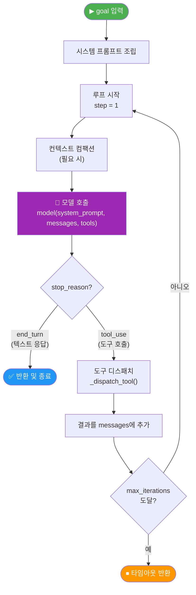

이 구조는 텍스트 모델뿐 아니라 비전, 오디오 등 멀티모달 모델에도 동일하게 적용된다. 토큰의 종류(텍스트 토큰, 이미지 토큰, 오디오 토큰)만 다를 뿐, 루프 자체의 패턴은 동일하다.

최신 연구와 엔지니어링 분석 모두 같은 결론을 내린다. **에이전트를 만드는 것의 5%는 "루프 안에서 모델 호출하기"이고, 나머지 95%는 컨텍스트 관리, 도구 실행, 샌드박싱, 에러 처리 같은 주변 인프라다.** 루프 자체는 단순하다. 루프 주변을 제대로 만드는 것이 진짜 작업이다.

---

### 3-2. Context Management — 컨텍스트 관리

**한 문장 요약: 무엇을 기억하고, 무엇을 요약하고, 무엇을 버릴지 결정하는 메모리 관리자.**

루프가 돌 때마다 대화 트리는 자라난다. 사용자 메시지, 도구 호출, 도구 결과, 모델의 추론 과정이 모두 누적되면서 LLM의 컨텍스트 한계에 점점 가까워진다. 인간으로 치면 단기 기억이 점점 꽉 차는 상황이다. 하네스는 무엇을 원문 그대로 유지하고(`keep verbatim`), 무엇을 요약하고(`summarize`), 무엇을 버릴지(`drop`)를 지속적으로 결정해야 한다.

**왜 이것이 어려운가.** 컨텍스트 관리의 어려움은 단순히 토큰을 줄이는 문제가 아니다. 잘못된 컴팩션은 에이전트가 이전에 내린 결정의 근거, 특정 파일의 내용, 이미 시도해서 실패한 접근법 같은 중요한 정보를 조용히 잃게 만든다. 에이전트도, 사용자도 이 사실을 모른 채 작업이 계속되다가 나중에 이상한 결과를 낳는다. 이것이 바로 "Bad compaction has real consequences. The agent forgets — silently(나쁜 컴팩션은 실제 결과를 낳는다. 에이전트는 조용히 잊는다)"라는 경고의 의미다.

**Claude Code의 컨텍스트 버짓.** Claude Code의 경우, 컨텍스트 예산은 기존 200,000 토큰에서 Opus 모델 기준 1,000,000 토큰(1M)으로 크게 확대되었다. 컨텍스트 사용량이 약 80~90%에 도달하면 **컴팩션(compaction)** 이 트리거된다. 가장 최근 메시지 4개 정도는 원문 그대로 남기고, 더 오래된 내용은 모두 요약된다. 컨텍스트가 98%에 도달하면 자동 컴팩션이 강제 실행된다.

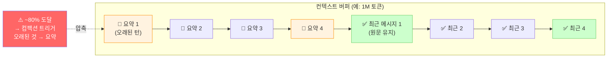

**Python 레퍼런스 구현.** `harness/context.py`(32줄)는 메시지 수가 임계값(`compact_threshold = 18`)을 초과하면 오래된 메시지들을 요약하고 최근 4개(`keep_recent = 4`)만 그대로 유지한다. 이 단순한 구현도 구조를 이해하기에는 충분하다.

```python
class ContextManager:
    compact_threshold: int = 18   # 메시지가 18개를 넘으면 컴팩션 시작
    keep_recent: int = 4          # 최근 4개는 원문 그대로

    def compact_if_needed(self, messages: list[dict]) -> list[dict]:
        if len(messages) < self.compact_threshold:
            return messages                         # 임계값 미만 → 그대로 반환
        older   = messages[: -self.keep_recent]    # 오래된 부분
        recent  = messages[-self.keep_recent :]    # 최근 부분 (원문 유지)
        summary = self._summarize(older)           # 오래된 것은 요약
        return [summary] + recent                  # 요약 1개 + 최근 4개
```

프로덕션 환경에서는 `_summarize()`에 단순 텍스트 요약 대신 실제 LLM 호출을 사용하는 것이 권장된다. 단순한 휴리스틱 요약은 컨텍스트의 의미적 중요성을 파악하지 못하기 때문이다. 무엇이 중요한지 판단하는 것 자체가 지능이 필요한 작업이다.

실제 개발을 할 때 이 부분은 처음에는 무시되다가, 코드베이스에서 에이전트를 30분~1시간 이상 실행했을 때 비로소 문제를 일으키기 시작하는 영역이다. "왜 에이전트가 아까 했던 걸 또 하려고 하지?", "분명히 이미 실패한 방법인데 왜 다시 시도하지?" 같은 증상이 대부분 이 컨텍스트 관리 문제다.

---

### 3-3. Skills & Tools — 스킬과 도구

**한 문장 요약: 도구는 범용 동사이고, 스킬은 팀 고유의 지식이다. 레지스트리가 둘을 통합 관리한다.**

하네스 안에서 모델이 실제로 할 수 있는 모든 행동은 도구(tool) 또는 스킬(skill)을 통해 이루어진다. 이 둘은 서로 다른 층위에서 작동하며, 레지스트리라는 단일 인터페이스로 통합된다.

**도구(Tool)** 는 범용 프리미티브다. `read_file`, `edit_file`, `bash`, `search` 같이 어떤 프로젝트에서도 공통으로 사용할 수 있는 저수준 행동이다. 자연어로 치면 "읽다", "쓰다", "실행하다" 같은 기본 동사에 해당한다. 도구는 어떤 팀이든, 어떤 프로젝트든 동일하게 동작한다.

**스킬(Skill)** 은 그 위에 올려진 조직화된 지식의 인코딩이다. 보통 마크다운 파일 형태로 저장된다. `git_commit.md`, `open_pr.md`, `run_tests.md`, `deploy.md` 같은 파일들이 스킬의 예시다. 스킬은 "우리 팀에서 git commit은 이렇게 한다", "우리 프로젝트의 테스트는 이렇게 실행한다"는 팀 고유의 지식을 담는다. 같은 `run_tests`라도 팀마다 pytest를 쓸 수도 있고, jest를 쓸 수도 있고, 특정 환경 변수가 필요할 수도 있다. 그 차이를 스킬이 흡수한다.

이 둘을 연결하는 것이 **레지스트리(ToolRegistry)** 다. 레지스트리는 세 가지 질문에 답한다. "어떤 도구/스킬이 있는가?(`register`)", "각각 어떤 권한이 필요한가?(`permission`)", "어떻게 호출하는가?(`handler`)" 모델은 `descriptors()`를 통해 가벼운 목록(이름, 권한, 설명)만 받는다. 실제 핸들러 코드는 모델이 볼 필요가 없다.

```python
# harness/tools.py — 55줄, 모든 도구가 살아있는 단 하나의 장소
class Tool:
    name: str
    permission: str        # "read" / "workspace" / "full"
    handler: Callable      # 실제 실행 함수
    description: str = ""  # 모델에게 보여줄 설명

class ToolRegistry:
    def __init__(self) -> None:
        self._tools: dict[str, Tool] = {}

    def register(self, name, permission, handler, description=""):
        self._tools[name] = Tool(name, permission, handler, description)

    def get(self, name): 
        return self._tools.get(name)
    
    def descriptors(self):
        # 모델에게는 핸들러 없이 이름·권한·설명만 전달
        return [{"name": t.name, "permission": t.permission,
                 "description": t.description} for t in self._tools.values()]
```

스킬도 도구와 완전히 동일한 방식으로 등록된다. 차이는 단 하나, 스킬의 핸들러가 호출 시점에 마크다운 파일을 읽어 그 내용을 반환한다는 것이다. 모델 입장에서는 도구와 스킬이 동일한 인터페이스로 보인다.

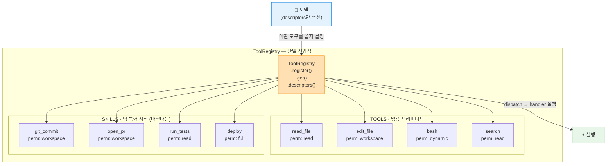

레지스트리 패턴의 장점은 **모든 도구 등록이 한 곳에서 이루어진다**는 것이다. 새 도구를 추가할 때 루프 코드를 건드릴 필요가 없다. `register()`를 한 번 호출하면 끝이다. 모델은 자동으로 새 도구를 인식한다.

---

### 3-4. Sub-agents — 서브에이전트

**한 문장 요약: 작업이 너무 크거나 병렬 처리가 필요할 때, 부모 에이전트가 전문화된 자식 에이전트를 생성한다.**

단일 대화 스레드로 처리하기엔 너무 크거나, 서로 독립적으로 동시에 처리할 수 있는 작업이 있을 때 하네스는 서브에이전트를 생성한다. 각 서브에이전트는 독립된 세션, 제한된 도구 집합, 그리고 특정 역할에 집중하는 시스템 프롬프트를 갖는다. 서브에이전트는 컨텍스트 오염(다른 작업의 정보가 섞이는 것)을 방지하는 격리 수단이기도 하다.

레퍼런스 구현(`harness/subagents.py`, 48줄)은 3가지 역할 기반 아키타입(archetype)을 미리 정의해 둔다:

```python
class SubAgentRegistry:
    PRESETS = {
        # 탐색 전용 — 읽기만 가능, 수정 불가
        "explore": SubAgentSpec(
            permission=Permission.READ_ONLY,
            tools=("read_file", "grep"),
            system_prompt="You are EXPLORE. You can only read.",
        ),
        # 범용 작업자 — 실제 코드 수정 가능
        "general": SubAgentSpec(
            permission=Permission.WORKSPACE,
            tools=("read_file", "write_file", "edit_file", "bash", "grep"),
            system_prompt="You are GENERAL. Get the work done.",
        ),
        # 검증 전용 — 테스트 실행, 확인
        "verify": SubAgentSpec(
            permission=Permission.WORKSPACE,
            tools=("read_file", "bash", "grep"),
            system_prompt="You are VERIFY. Confirm a change with tests.",
        ),
    }
```

각 아키타입의 역할을 구체적으로 살펴보자. **EXPLORE**는 코드베이스를 탐색하고 작업 계획을 세우는 정찰 에이전트다. 읽기만 할 수 있으므로 실수로 파일을 망칠 위험이 없다. **GENERAL**은 실제 코드 수정을 담당하는 작업자 에이전트다. 파일 읽기/쓰기/수정, bash 실행 등 가장 많은 권한을 가진다. **VERIFY**는 변경이 완료된 후 테스트를 실행하고 결과를 확인하는 검증 에이전트다. bash로 테스트를 실행하지만 파일을 직접 수정하지는 않는다.

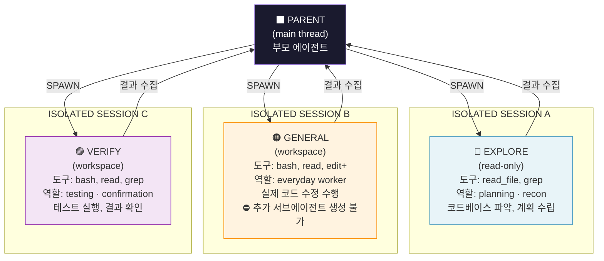

서브에이전트 패턴의 핵심은 세 가지로 요약된다. **생성(spawn)** — 부모가 서브에이전트를 만들고 작업을 위임한다. **제한(restrict)** — 각 서브에이전트는 역할에 필요한 최소한의 도구와 권한만 받는다. **수집(collect)** — 서브에이전트의 결과를 부모가 수집하여 전체 그림을 만든다.

특히 중요한 규칙이 하나 있다. **서브에이전트는 추가로 서브에이전트를 생성할 수 없다.** `general` 아키타입의 주석에 "no further sub-agents"라고 명시되어 있는 이유가 바로 이것이다. 이 규칙이 없으면 에이전트가 기하급수적으로 증식하는 무한 재귀 생성(infinite spawn) 문제가 발생한다. 이것은 안전성뿐 아니라 비용과 제어 가능성 측면에서도 반드시 지켜야 하는 원칙이다.

---

### 3-5. Built-in Skills — 내장 스킬

**한 문장 요약: 모든 코딩 에이전트가 기본으로 탑재해야 하는 논네고셔블(non-negotiable) 기능 목록.**

모든 하네스는 사용자가 아무것도 설정하지 않아도 바로 동작하는 기본 도구 세트를 갖추어야 한다. 특히 코딩 에이전트라면 반드시 다음 5가지 프리미티브가 있어야 한다. 이 5가지가 없으면 코딩 에이전트라고 부를 수 없다.

```python
# harness/builtins.py — 55줄, 순수 표준 라이브러리만 사용 (외부 의존성 없음)

# 1. 파일 읽기 — 가장 기본적인 동사
def read_file(path: str) -> str:
    return Path(path).read_text()

# 2. 파일 수정 — 고유성 가드(uniqueness guard)로 모호한 수정 방지
def edit_file(path: str, find: str, replace: str) -> str:
    p    = Path(path)
    text = p.read_text()
    if text.count(find) != 1:                    # find가 정확히 1번 등장해야 함
        raise ValueError(f"text not unique in {path!r}")
    p.write_text(text.replace(find, replace, 1))
    return f"edited {path}: 1 replacement applied"

# 3. bash 실행 — stdout/stderr를 8KB로 잘라 컨텍스트 오염 방지
def bash(cmd: str, timeout: int = 30) -> str:
    r   = subprocess.run(cmd, shell=True, capture_output=True,
                         text=True, timeout=timeout)
    out = (r.stdout or "")[:8192]
    err = (r.stderr or "")[:8192]
    return f"exit_code={r.returncode}\n{out}{err}"

# 4. grep — 코드 내 패턴 탐색
# 5. glob — 파일 시스템 탐색
# (구현 생략, 동일 패턴)
```

`edit_file`의 **고유성 가드**는 특히 중요하다. 수정하려는 텍스트가 파일 내에 정확히 1번만 등장해야 수정이 이루어진다. 같은 코드 패턴이 여러 곳에 있을 때 엉뚱한 곳을 수정하는 사고를 원천 차단하는 안전 장치다.

`bash`의 **8KB 상한**도 핵심이다. `ls -la /usr/lib` 같은 명령은 수백 줄의 출력을 낼 수 있다. 그 모든 내용을 컨텍스트에 넣으면 금방 컨텍스트 한계에 도달한다. 8KB로 잘라서 중요한 정보만 모델에게 전달한다.

이 프리미티브들은 반드시 **순수 표준 라이브러리**만으로 구현해야 한다. 외부 프레임워크 의존성이 생기는 순간 두 가지 문제가 생긴다. 하나는 이식성 손상이고, 다른 하나는 버전 충돌과 같은 운영 부담이다. 하네스의 가장 낮은 층은 단단하고 의존성 없이 독립적이어야 한다.

5가지 프리미티브가 바닥이라면, 그 위에는 **벤더 특화 고수준 스킬**이 올라간다. `git_commit`, `open_pr`, `run_tests`, `deploy` 같은 것들이다. 이 고수준 스킬 영역이 각 하네스 제공업체들이 차별화를 꾀하며 경쟁하는 공간이다. 프리미티브는 모든 하네스가 동의해야 하는 공통 기반이고, 고수준 스킬은 각자가 더 잘 만들기 위해 노력하는 경쟁 영역이다.

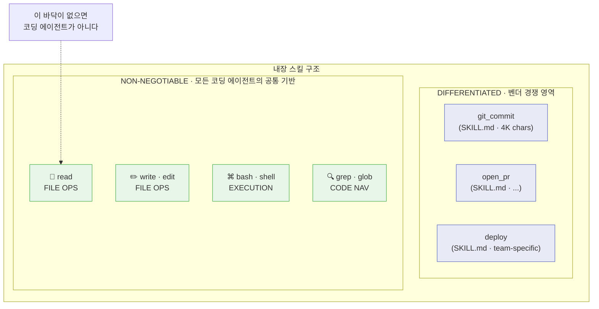

---

### 3-6. Session Persistence — 세션 영속성

**한 문장 요약: 프로세스가 죽어도 파일은 살아있다. Append-only JSONL이 내구성의 전부다.**

에이전트 세션은 상태를 가진다(stateful). 복잡한 코드 수정 작업을 30분째 진행하던 중 컴퓨터가 갑자기 꺼진다면? 하네스가 디스크에 상태를 기록하지 않는 한 모든 것이 사라진다. 이 문제를 해결하는 것이 세션 영속성 컴포넌트다.

현대적인 하네스의 해결책은 우아하게 단순하다. **Append-only JSONL 파일**을 사용한다. 모든 이벤트(사용자 메시지, 에이전트 사고, 도구 호출, 도구 결과, 컴팩션 이벤트)가 한 줄씩 이 파일에 추가된다. 덮어쓰기는 절대 하지 않는다.

```python
# harness/persistence.py — 37줄
class Session:
    def __init__(self, path: str | Path) -> None:
        self.path = Path(path)
        self.path.parent.mkdir(parents=True, exist_ok=True)

    def append(self, event: dict) -> None:
        line = json.dumps(event, ensure_ascii=False, default=str)
        with open(self.path, "a", encoding="utf-8") as f:
            f.write(line + "\n")
            f.flush()   # ← 핵심: 다음 줄 실행 전에 디스크에 확실히 기록

    def replay(self) -> list[dict]:
        if not self.path.exists():
            return []
        return [json.loads(l) for l in
                self.path.read_text(encoding="utf-8").splitlines() if l.strip()]
```

`f.flush()`의 의미를 깊이 이해하는 것이 중요하다. 파일 쓰기는 운영체제 버퍼를 통해 이루어진다. `flush()`를 호출하지 않으면 데이터가 메모리 버퍼에만 있다가 프로세스가 죽으면 함께 사라질 수 있다. `flush()`는 버퍼의 내용을 즉시 디스크에 강제 기록한다. 즉, `f.flush()`가 끝난 이후에 프로세스가 죽더라도 방금 쓴 이벤트는 이미 디스크에 안전하다.

실제 세션 로그를 시각화하면 이렇다:

```
# session.jsonl — 한 줄이 하나의 이벤트

001 {"role": "user", "msg": "edit main.py to handle float inputs"}
002 {"role": "assistant", "thinking": "I should read the file first..."}
003 {"tool_call": "read_file", "args": {"path": "main.py"}}
004 {"tool_result": "def add(a: int, b: int): return a + b"}
005 {"role": "assistant", "thinking": "I see. I need to change int to float."}
006 {"tool_call": "edit_file", "args": {"path": "main.py", "find": "int", "replace": "float"}}
007 {"tool_result": "ok · 1 file changed"}
008 {"compaction": {"older_turns": 2, "summary": "Read main.py, changed int to float"}}
009 {"role": "user", "msg": "now run the tests"}
010 {"tool_call": "bash", "args": {"cmd": "pytest"}}
    ← ⚠️ session interrupted · process killed
    ← (파일은 살아있음. 010번까지 안전)
011 {"resume": "session.jsonl", "from_line": 11}   ← 재시작 시
012 {"tool_result": "5 passed in 0.42s"}
013 {"role": "assistant", "msg": "All tests pass."}
```

`replay()` 메서드는 이 파일을 한 줄씩 읽어 전체 세션을 재구성한다. 파일이 append-only이기 때문에 두 번의 하네스 실행이 같은 로그를 공유해도 서로 덮어쓰지 않는다.

Anthropic이 자사 관리형 에이전트 아키텍처(Managed Agents, v2.0)에서 **세션 관리를 하네스 자체와 분리**한 것도 이 철학의 연장선이다. 세션은 하네스보다 더 긴 수명을 가져야 한다. 하네스가 죽어도 세션은 살아있어야 하기 때문이다.

---

### 3-7. System Prompt Assembly — 시스템 프롬프트 조립

**한 문장 요약: 시스템 프롬프트는 정적 문자열이 아니다. 디렉토리를 탐색해 조립하는 파이프라인이다.**

많은 사람이 놀라는 사실이 있다. 에이전트의 시스템 프롬프트는 하드코딩된 고정 문자열이 아니다. 실행 시점에 현재 작업 디렉토리부터 루트 방향으로 디렉토리를 탐색하면서 `CLAUDE.md`, `AGENTS.md` 같은 특정 파일들을 찾아 동적으로 조립되는 **파이프라인**이다.

이것이 왜 중요한가? 프로젝트마다, 팀마다, 디렉토리마다 다른 지시사항이 있을 수 있다. 루트 디렉토리의 `CLAUDE.md`에는 전사적 코딩 컨벤션이, 특정 서비스 디렉토리의 `CLAUDE.md`에는 그 서비스 고유의 규칙이 담길 수 있다. 에이전트가 어느 디렉토리에서 작업하느냐에 따라 적용되는 지시사항이 달라지는 것이다.

```python
# harness/prompt.py — 53줄
def assemble_system_prompt(
    cwd: str | Path,
    max_per_file: int = 4_000,   # 파일 하나당 최대 4K 문자
    max_total: int = 12_000,     # 전체 동적 부분 합계 최대 12K 문자
) -> str:
    parts: list[str] = [STATIC_SCAFFOLD]   # ← 반드시 정적 부분이 먼저!
    total_dynamic = 0
    for directory in _walk_ancestors(Path(cwd)):          # cwd → 루트 방향으로 탐색
        for fname in INSTRUCTION_FILES:                   # CLAUDE.md, AGENTS.md 등
            f = directory / fname
            if not f.exists():
                continue
            text = f.read_text()[:max_per_file]           # 파일당 4K 상한
            remaining = max_total - total_dynamic
            text = text[:remaining]                       # 전체 합계 12K 상한
            parts.append(f"\n# {fname} (from {directory})\n{text}")
            total_dynamic += len(text)
    return "\n".join(parts)
```

조립 결과물의 구조는 다음과 같다:

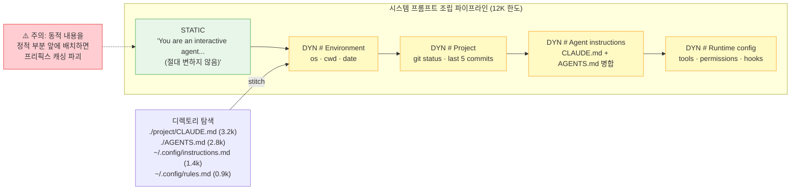

**정적 부분을 반드시 먼저** 배치해야 하는 이유는 **프리픽스 캐싱(prefix caching)** 때문이다. LLM API에는 변하지 않는 프롬프트 앞부분을 서버에 캐싱해 두어 반복 호출 시 비용과 지연을 줄이는 최적화가 있다. 동적 내용이 앞에 오면 매 루프마다 프롬프트 전체가 달라지고, 캐싱이 전혀 작동하지 않는다. 결과적으로 비용은 수 배로 늘어나고, 응답 속도는 느려진다. 긴 에이전트 세션일수록 이 차이는 극명해진다.

---

### 3-8. Lifecycle Hooks — 생명주기 훅

**한 문장 요약: 하네스를 수정하지 않고 도구 실행 전후에 커스텀 로직을 끼워 넣는 확장 지점.**

훅은 하네스의 **확장성 솔기(extensibility seam)** 다. 어떤 기업이나 팀이 기존 하네스에 자신들의 워크플로우를 통합하고 싶을 때, 하네스 코어를 수정하지 않고도 그렇게 할 수 있게 해주는 것이 훅이다. 마치 플러그인 시스템처럼, 하네스가 정해진 시점에 "훅을 실행"하고 결과에 따라 행동을 바꾼다.

두 종류의 훅이 있다:

- **pre-tool hook(사전 훅)**: 도구 실행 직전에 발화된다. 도구 이름과 입력 값을 받아 "허용(allow)", "거부(deny)", 또는 "수정(modify)"을 결정할 수 있다. 첫 번째 거부가 나오는 순간 단락(short-circuit)되어 이후 훅은 실행하지 않고 즉시 거부한다.
- **post-tool hook(사후 훅)**: 도구 실행 직후에 발화된다. 결과를 볼 수 있다. 하지만 실행을 차단하거나 결과를 바꿀 수는 없다. 감사(audit), 로깅, 관측 가능성(observability)에 사용된다.

```python
# harness/hooks.py — 40줄
class Hooks:
    def __init__(self) -> None:
        self._pre:  list[Callable[[HookContext], HookDecision]] = []
        self._post: list[Callable[[HookContext], None]]         = []

    def add_pre(self, hook):  self._pre.append(hook)
    def add_post(self, hook): self._post.append(hook)

    def fire_pre(self, ctx: HookContext) -> HookDecision:
        for hook in self._pre:
            if hook(ctx) == "deny":
                return "deny"          # 첫 번째 거부에서 단락
        return "allow"

    def fire_post(self, ctx: HookContext) -> None:
        for hook in self._post:
            hook(ctx)                  # 차단 불가, 로그/관측만 가능
```

실제 하네스에서는 **JSON-on-stdin 프로토콜**을 사용한다. 훅은 하네스와 동일한 언어(Python)로 작성할 필요가 없다. 어떤 언어로든 작성 가능하며, stdin으로 JSON을 받고 exit code로 결정을 내린다. exit code 0은 허용, exit code 2는 거부를 의미한다.

도구 실행 흐름에서 훅이 어디 위치하는지 살펴보자:

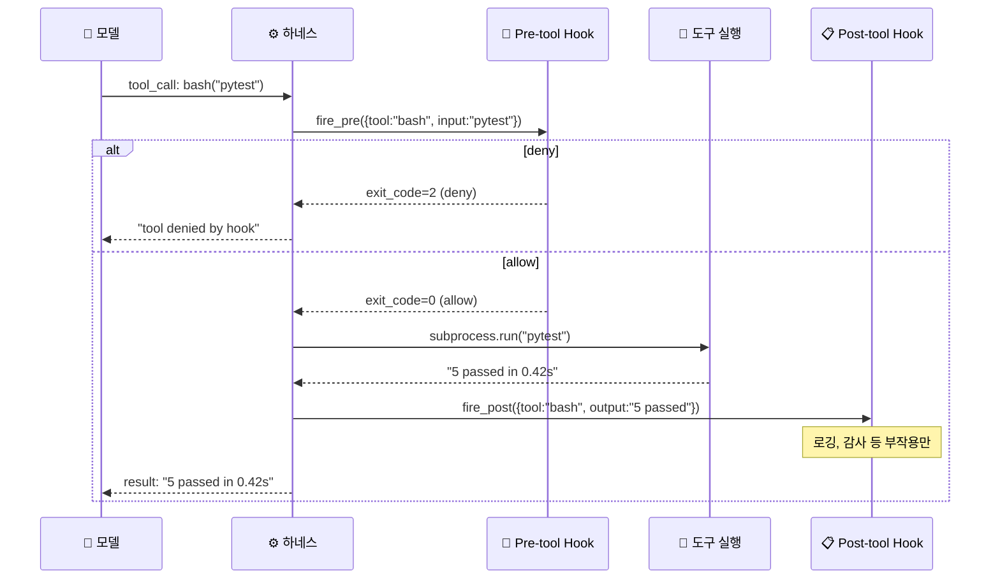

훅 사용 예시를 구체적으로 들면 이렇다. pre-tool 훅으로 "프로덕션 DB에 직접 쓰는 명령은 모두 거부"하는 정책을 추가할 수 있다. post-tool 훅으로 "모든 파일 수정을 감사 로그에 기록"하는 기능을 추가할 수 있다. 또한 훅은 서로 다른 하네스 간의 통신 수단으로도 활용된다. 엔터프라이즈 환경에서 사내 보안 정책, 컴플라이언스 요건, 레거시 시스템과의 통합을 하네스 코어를 건드리지 않고 훅만으로 구현하는 것이 가능하다.

---

### 3-9. Permissions & Safety — 권한과 안전

**한 문장 요약: 유용한 도구와 위험한 도구를 가르는 계층. 정적 규칙 + 동적 분류 + 사람의 승인이 3중 안전망이다.**

권한과 안전 레이어는 하네스를 진짜 프로덕션에서 사용할 수 있게 만드는 마지막 요소다. 아무리 영리한 에이전트라도 `rm -rf /`를 실수로 실행할 수 있다. 에이전트가 잘못된 판단을 내릴 때 그 결과가 되돌릴 수 없는 피해가 되는 것을 막는 것이 이 레이어의 임무다.

현대적인 하네스는 3단계 권한 계층을 정의한다:

```python
# harness/permissions.py — 54줄
class Permission:
    READ_ONLY  = "read"       # 1등급: 읽기만 가능
    WORKSPACE  = "workspace"  # 2등급: 작업 공간 내 쓰기 가능
    FULL       = "full"       # 3등급: 모든 것 가능 (위험)

# 숫자 순위로 비교 가능하게
RANK = {Permission.READ_ONLY: 1, Permission.WORKSPACE: 2, Permission.FULL: 3}

# 안전한 bash 명령 목록 (정적)
_READ_CMDS   = {"ls", "cat", "head", "grep", "find", "wc", "echo", "pwd", "which", ...}
# 위험한 bash 명령 목록 (정적)
_DANGER_CMDS = {"rm", "sudo", "mv", "kill", "shutdown", "dd", "mkfs", "fdisk", ...}

# bash 명령을 동적으로 분류
def classify_bash(cmd: str) -> str:
    parts = shlex.split(cmd) if cmd else []
    if not parts:                    return Permission.READ_ONLY
    if parts[0] in _READ_CMDS:      return Permission.READ_ONLY   # ls → read
    if parts[0] in _DANGER_CMDS:    return Permission.FULL        # rm → full
    return Permission.WORKSPACE                                    # 나머지 → workspace

# 현재 권한으로 해당 작업이 허용되는지 확인
def can_dispatch(required: str, current: str) -> bool:
    return RANK[current] >= RANK[required]
```

bash 명령어가 **동적으로 분류**되는 것이 핵심이다. `bash`라는 도구 자체에는 하나의 권한 레벨을 줄 수 없다. 같은 bash라도 `ls`는 완전히 안전하고 `rm -rf`는 치명적이다. 따라서 하네스는 실제 명령 문자열을 파싱해서 그 명령이 어떤 권한을 요구하는지를 런타임에 결정한다.

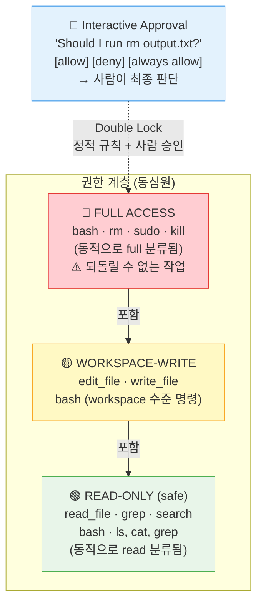

정적 규칙 위에, 에이전트는 **대화형 승인(interactive approval)** 을 요청할 수 있다. 파괴적인 작업(`rm output.txt` 같은)을 실행하기 전에 "이것을 실행할까요?"라고 사용자에게 물어보는 것이다. 사용자는 허용, 거부, 항상 허용 중 하나를 선택한다.

이것이 **이중 잠금(double lock)** 이다. 정적 규칙(코드로 정의된 허용/거부 목록)이 1차 방어선이고, 사람의 실시간 승인이 2차 방어선이다. 하나가 뚫려도 다른 하나가 막는다. 아무리 강력한 모델이라도 권한 게이트를 "설득"할 수 없다. 하네스는 모델의 주장을 듣지 않는다. 규칙이 곧 법이다.

---

## 4. Python 레퍼런스 구현 — 전체 프로젝트 구조

9가지 구성 요소는 각각 독립적인 Python 파일로 구현된다. 이 미니멀한 레퍼런스 구현의 설계 철학은 명확하다. **프레임워크 의존성 제로, 순수 표준 라이브러리, 각 파일이 단 하나의 책임만 진다.** 전체 프로젝트는 약 400줄로, 실제 동작하는 에이전트 하네스를 처음부터 끝까지 이해하기에 이상적인 크기다.

```
build/
├── harness/                       # 패키지 본체 — 9개 컴포넌트
│   ├── __init__.py
│   ├── loop.py        (63줄)      # 01 · while loop
│   │                               #     → 유일하게 모델을 직접 호출하는 파일
│   ├── context.py     (32줄)      # 02 · context management
│   │                               #     → 컴팩션 트리거 및 요약
│   ├── tools.py       (55줄)      # 03 · skills & tools registry
│   │                               #     → Tool 데이터클래스 + ToolRegistry
│   ├── subagents.py   (48줄)      # 04 · sub-agent archetypes
│   │                               #     → explore / general / verify 프리셋
│   ├── builtins.py    (55줄)      # 05 · built-in primitives
│   │                               #     → read_file, edit_file, bash, grep, glob
│   ├── persistence.py (37줄)      # 06 · JSONL session
│   │                               #     → append-only 세션 로그, replay
│   ├── prompt.py      (53줄)      # 07 · system prompt assembly
│   │                               #     → 정적 스캐폴드 + 디렉토리 탐색 + stitch
│   ├── hooks.py       (40줄)      # 08 · pre/post hooks
│   │                               #     → fire_pre (allow/deny), fire_post (log)
│   ├── permissions.py (54줄)      # 09 · permissions & safety
│   │                               #     → 3단계 권한, classify_bash, can_dispatch
│   └── model.py                   # mock + anthropic adapter
│                                   # → 실제 API 호출 또는 테스트용 mock
│
├── demo/                          # 에이전트가 작업할 대상 프로젝트
│   ├── CLAUDE.md                  # 07번 컴포넌트가 자동으로 인식 (프로젝트 지시사항)
│   ├── main.py                    # 에이전트가 실제로 수정할 파일
│   ├── test_main.py               # 05번이 실행할 테스트
│   └── run_demo.py                # 엔드투엔드 실행기
│
└── tests/
    └── test_harness.py            # 17개 테스트 — 모든 컴포넌트 검증
```

**핵심 통계:**

| 항목 | 값 |
|------|-----|
| 컴포넌트 수 | 9개 |
| 테스트 수 | 17개 (모두 통과) |
| 프레임워크 의존성 | 0개 |
| 전체 코드량 | ~400줄 Python |
| 모델 호출 위치 | loop.py 단 1개 파일 |

`loop.py`가 유일하게 모델을 호출하는 파일이라는 설계 결정이 가장 중요하다. 나머지 8개 파일은 이 루프를 지원하기 위해 존재하며, 각 파일은 독립적으로 테스트 가능하다. 모델 어댑터(`model.py`)를 mock으로 교체하면 실제 API 호출 없이 전체 하네스의 동작을 테스트할 수 있다.

---

## 5. 전체 데이터 흐름 — 한눈에 보기

사용자가 목표를 입력하는 순간부터 최종 결과가 반환되는 순간까지, 9가지 컴포넌트가 어떻게 협력하는지를 하나의 시퀀스 다이어그램으로 표현하면 다음과 같다.

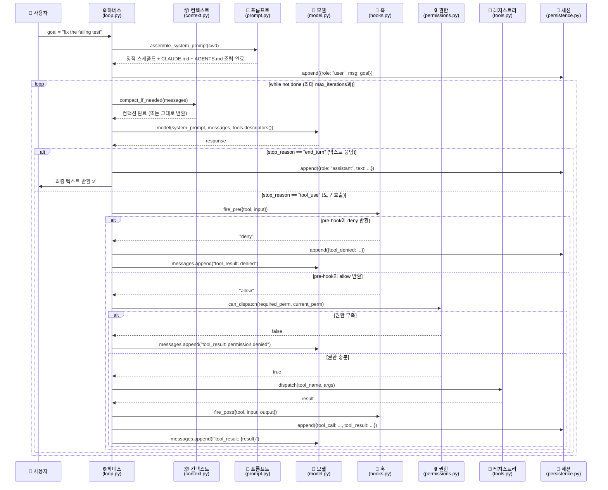

이 흐름에서 눈여겨볼 점은, 에러가 발생했을 때 하네스가 **크래시하지 않는다**는 것이다. 도구가 거부되거나, 권한이 부족하거나, 도구 실행 중 에러가 발생해도, 그 결과가 `tool_result`로 모델에게 피드백된다. 모델은 그 피드백을 보고 다음 행동을 결정한다. 에러는 크래시가 아니라 피드백이다. 이것이 에이전트가 자기 수정(self-correction)을 할 수 있는 이유다.

---

## 6. 최신 동향 — 2026년의 하네스 아키텍처

### 하네스가 진짜 차별화 요인이 되다

2026년 현재, 흥미로운 역전 현상이 벌어지고 있다. Claude Code, Cursor, Codex, Aider, Cline은 모두 에이전트 하네스다. 그런데 이들이 사용하는 기반 모델이 동일한 경우가 있다. 그럼에도 사용자 경험은 제품마다 크게 다르다. 이것이 의미하는 바는 명확하다. **사용자가 경험하는 에이전트의 능력은 모델보다 하네스가 더 크게 결정한다.**

이를 입증하는 데이터가 있다. Terminal Bench 2.0에서 Claude Opus 4.6을 Claude Code 안에서 실행했을 때보다 커스텀 하네스에서 실행했을 때 훨씬 높은 점수가 나왔다. 한 팀은 코딩 에이전트를 Top 30에서 Top 5로 끌어올리는 데 성공했는데, 바꾼 것은 **하네스뿐**이었다. 모델 버전도, 프롬프트도 건드리지 않았다. 더 나은 도구, 더 타이트한 프롬프트, 더 정교한 컨텍스트 관리가 그 도약을 만들었다.

이것은 "더 좋은 모델이 나올 때까지 기다리자"라는 수동적 전략에 대한 직접적인 반론이다. **모델이 할 수 있는 것과 실제로 하고 있는 것 사이의 간격은 대부분 하네스 gap이다.**

### Claude Code의 실제 구조 (2026년 분석)

Claude Code는 공식적으로 "Claude를 감싸는 에이전트 하네스"다. 2026년 3월 Claude Code 버전 2.1.88에서 소스 맵이 의도치 않게 노출되면서 약 500,000줄의 TypeScript 코드가 공개되었고(Anthropic이 DMCA 조치를 취했지만 아키텍처 자체는 이미 공개 지식이 되었다), 커뮤니티 분석을 통해 구조가 상세히 알려지게 되었다.

최신 연구에 따르면 Claude Code의 코드 비율은 놀랍다. **98.4%가 인프라이고 1.6%가 AI(모델 호출)다.** 루프 자체는 사실 아주 단순하다. 진짜 공학적 복잡도는 다음 시스템들에 있다.

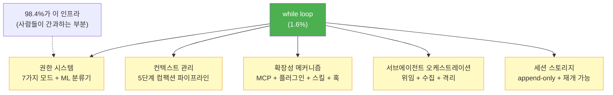

### 권한 분류의 진화 — ML 분류기의 등장

Claude Code의 권한 모델은 단순한 정적 분류를 넘어섰다. 2026년 3월에 도입된 자동 모드(auto mode)에서는 Sonnet 4.6 기반 **백그라운드 ML 분류기**가 각 도구 호출이 사용자 확인 없이 진행될 수 있는지를 실시간으로 평가한다.

이 분류기의 설계에는 중요한 세부사항이 있다. 분류기는 사용자의 요청과 도구 호출 내용을 보지만, **모델이 생성한 설명 텍스트는 보지 않는다.** 이것은 의도적인 설계다. 만약 분류기가 모델의 설명 텍스트를 본다면, 모델이 "이 명령은 안전합니다, 왜냐하면..."과 같은 설득력 있는 텍스트를 생성하여 분류기를 통과시키려는 시도가 가능해진다. 모델이 게이트를 "설득"하는 것을 원천 차단한 설계다.

### 메시지가 상태다 — 단순함의 힘

Claude Code 아키텍처 분석에서 가장 통찰력 있는 관찰 중 하나는 상태 관리 방식에 관한 것이다. 명시적인 상태 관리 시스템(state machine, database 등)을 사용하는 대신, **모든 것을 메시지로 저장한다.** 전체 상태는 메시지 히스토리로부터 완전히 재구성 가능하다.

이 단순한 접근법이 여러 문제를 동시에 해결한다. 세션 저장(메시지 배열을 직렬화), 재생(replay, 메시지 배열을 역직렬화), 압축(컨텍스트 관리, 오래된 메시지를 요약으로 교체)이 모두 하나의 append-only 구조로 처리된다. 상태를 별도로 관리하는 복잡한 시스템이 필요 없다.

---

## 7. 정리 — 하네스를 설계할 때 기억해야 할 것

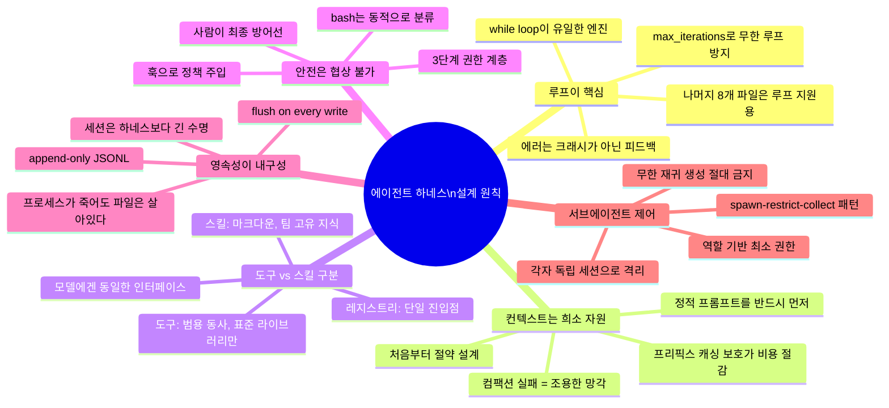

하네스를 처음 만드는 사람들이 가장 흔히 빠지는 함정이 있다. 루프를 만드는 데 집중하고, 나머지는 나중에 생각하는 것이다. 루프 자체는 10~15줄이면 된다. 하지만 그것만으로는 3분 데모용 장난감에 불과하다.

진짜 작업은 다음 네 가지에 있다. 첫째, 컨텍스트가 꽉 찼을 때 무엇을 잃어버릴지 결정하는 방식. 둘째, 모든 행동이 실행되기 전에 통과해야 하는 권한 게이트. 셋째, 프로세스가 죽어도 재개할 수 있게 하는 세션 영속성. 넷째, 새 도구를 추가해도 루프 코드를 건드리지 않아도 되는 레지스트리 구조. 이 네 가지가 장난감 데모와 프로덕션 에이전트를 가르는 실질적인 차이다.

다시 한번 강조할 만한 비율이 있다. **98.4%가 인프라, 1.6%가 모델 호출.** 에이전트를 만드는 것은 5%가 "루프에서 모델 호출하기"이고 95%가 나머지 인프라다. 이 숫자를 기억하고 하네스를 설계에 임한다면, 처음부터 올바른 방향을 잡을 수 있다.

마지막으로, 모델은 이미 스마트하다. 하네스는 그 모델에게 손(도구)과 눈(컨텍스트)과 작업 공간(파일 시스템)을 준다. 그리고 그 손이 실수로 위험한 일을 하지 않도록 안전벨트(권한 레이어)를 채운다. 이것이 하네스의 본질이다.

---

## 참고 자료

- Prompt Engineering YouTube: [The Common Architecture Behind Every Agent Harness](https://www.youtube.com/watch?v=nWzXyjXCoCE) (2026.05.01)
- Anthropic 공식 문서: [How Claude Code Works](https://code.claude.com/docs/en/how-claude-code-works)
- DEV Community: [Claude Code Architecture Explained: Agent Loop, Tool System, and Permission Model (Rust Rewrite Analysis)](https://dev.to/brooks_wilson_36fbefbbae4/claude-code-architecture-explained-agent-loop-tool-system-and-permission-model-rust-rewrite-41b2)
- Medium (Jonathan Fulton): [Inside the Agent Harness: How Codex and Claude Code Actually Work](https://medium.com/jonathans-musings/inside-the-agent-harness-how-codex-and-claude-code-actually-work-63593e26c176) (2026.04)
- Addy Osmani: [Agent Harness Engineering](https://addyosmani.com/blog/agent-harness-engineering/)
- WaveSpeed AI Blog: [Claude Code Agent Harness: Architecture Breakdown](https://wavespeed.ai/blog/posts/claude-code-agent-harness-architecture/)
- VILA-Lab: [Dive into Claude Code: A Systematic Analysis and Discussion of Claude Code](https://github.com/VILA-Lab/Dive-into-Claude-Code) (2026)
- arXiv: [Dive into Claude Code: The Design Space of Today's and Future AI Agent Systems](https://arxiv.org/html/2604.14228v1)
- GitHub: [learn-claude-code — Harness Engineering for Real Agents](https://github.com/shareAI-lab/learn-claude-code)
- Sid Bharath: [The Anatomy of Claude Code And How To Build Agent Harnesses](https://sidbharath.com/blog/the-anatomy-of-claude-code/)
