> **최신 정보 기준: 2025~2026년**  
> 이 문서는 Andrew Ng(DeepLearning.AI), Anthropic, Google DeepMind, Microsoft AutoGen, LangChain 등 주요 AI 연구 기관 및 기업의 최신 연구를 기반으로 작성되었습니다.

---
## 관련글

[**Agentic Design Patterns: 지능형 시스템 구축을 위한 실전 가이드 완전 분석**](https://k82022603.github.io/posts/agentic-design-patterns-%EC%A7%80%EB%8A%A5%ED%98%95-%EC%8B%9C%EC%8A%A4%ED%85%9C-%EA%B5%AC%EC%B6%95%EC%9D%84-%EC%9C%84%ED%95%9C-%EC%8B%A4%EC%A0%84-%EA%B0%80%EC%9D%B4%EB%93%9C-%EC%99%84%EC%A0%84-%EB%B6%84%EC%84%9D/)

## 목차

1. [개요: Agentic AI란 무엇인가?](#1-개요-agentic-ai란-무엇인가)
2. [왜 Agentic Design Patterns가 중요한가?](#2-왜-agentic-design-patterns가-중요한가)
3. [핵심 4대 Agentic Design Patterns](#3-핵심-4대-agentic-design-patterns)
   - 3.1 [Reflection (반성/자기 피드백 패턴)](#31-reflection-반성자기-피드백-패턴)
   - 3.2 [Tool Use (도구 활용 패턴)](#32-tool-use-도구-활용-패턴)
   - 3.3 [Planning (계획 수립 패턴)](#33-planning-계획-수립-패턴)
   - 3.4 [Multi-Agent Collaboration (다중 에이전트 협업 패턴)](#34-multi-agent-collaboration-다중-에이전트-협업-패턴)
4. [심화 패턴: 고급 Agentic 아키텍처](#4-심화-패턴-고급-agentic-아키텍처)
   - 4.1 [RAG Agent (지식 검색 에이전트 패턴)](#41-rag-agent-지식-검색-에이전트-패턴)
   - 4.2 [ReAct 패턴](#42-react-패턴)
   - 4.3 [Orchestrator-Worker 패턴](#43-orchestrator-worker-패턴)
   - 4.4 [Self-Improving Agent 패턴](#44-self-improving-agent-패턴)
   - 4.5 [Hierarchical Memory 패턴](#45-hierarchical-memory-패턴)
5. [주요 프레임워크 비교](#5-주요-프레임워크-비교)
   - 5.1 [LangGraph](#51-langgraph)
   - 5.2 [AutoGen (Microsoft)](#52-autogen-microsoft)
   - 5.3 [CrewAI](#53-crewai)
   - 5.4 [기타 주요 프레임워크](#54-기타-주요-프레임워크)
6. [엔터프라이즈 실전 적용 패턴](#6-엔터프라이즈-실전-적용-패턴)
7. [Agentic AI의 도전 과제와 한계](#7-agentic-ai의-도전-과제와-한계)
8. [미래 전망과 신흥 트렌드](#8-미래-전망과-신흥-트렌드)
9. [패턴 선택 가이드](#9-패턴-선택-가이드)
10. [결론](#10-결론)

---

## 1. 개요: Agentic AI란 무엇인가?

### AI의 진화: 단순 응답기에서 자율적 행동자로

인공지능의 역사를 돌아보면, AI는 크게 세 단계를 거쳐 발전해 왔습니다.

첫 번째 단계는 **규칙 기반 AI(Symbolic AI) 시대**입니다. 이 시기의 AI는 인간이 미리 정해놓은 규칙(if-then 로직)에 따라 동작했습니다. 체스 프로그램이나 전문가 시스템(Expert System)이 대표적인 예입니다. 이 방식은 정해진 범위 안에서는 매우 강력했지만, 예상치 못한 상황에는 전혀 대처하지 못하는 한계가 있었습니다.

두 번째 단계는 **머신러닝과 딥러닝 시대**입니다. 대량의 데이터를 학습하여 패턴을 인식하는 능력을 갖추게 되었고, 이미지 인식, 음성 인식, 자연어 처리 등 다양한 분야에서 혁신적인 성과를 이뤄냈습니다. 하지만 이 AI들도 본질적으로는 "입력을 받아 출력을 내보내는" 수동적인 시스템이었습니다.

세 번째 단계가 바로 지금 우리가 살고 있는 **Agentic AI(에이전트 기반 AI) 시대**입니다. 2022년부터 본격화된 이 시대의 AI는 단순히 질문에 답하는 것을 넘어, **스스로 목표를 설정하고, 계획을 세우고, 도구를 활용하며, 환경과 상호작용하면서 자율적으로 행동**합니다. ChatGPT가 등장한 이후 AutoGPT, LangChain, AutoGen, CrewAI 같은 에이전트 프레임워크들이 연달아 등장한 것이 이 흐름을 잘 보여줍니다.

### Agentic AI의 정의

Agentic AI를 한마디로 정의하면 **"자율적으로 목표를 향해 행동할 수 있는 AI 시스템"** 입니다. 기존의 AI가 "한 번 질문하면 한 번 답하는" 단방향 시스템이었다면, Agentic AI는 다음과 같은 특성을 갖습니다.

- **자율성(Autonomy)**: 사람의 지속적인 개입 없이도 스스로 판단하고 행동합니다.
- **목표 지향성(Goal-directedness)**: 주어진 목표를 달성하기 위해 여러 단계의 행동을 계획하고 실행합니다.
- **환경 인식(Environment Awareness)**: 외부 세계(웹, 데이터베이스, API 등)와 상호작용하며 실시간 정보를 활용합니다.
- **적응성(Adaptability)**: 실행 중 예상치 못한 상황이 발생하면 계획을 수정하고 새로운 방법을 시도합니다.
- **도구 사용 능력(Tool Use)**: 계산기, 검색 엔진, 코드 실행기 등 다양한 도구를 활용합니다.

### Agentic Design Patterns의 등장

2024년 초, AI 분야의 선구자인 **Andrew Ng(앤드류 응)** 은 Sequoia Capital 강연과 DeepLearning.AI 뉴스레터를 통해 Agentic 워크플로우를 위한 4가지 핵심 설계 패턴을 소개했습니다. 이 패턴들은 이후 AI 엔지니어링 커뮤니티 전체에 빠르게 퍼져나가며 사실상의 표준 프레임워크로 자리잡았습니다.

Ng는 당시 이렇게 말했습니다: "LLM이 최종 출력을 바로 생성하는 대신, Agentic 워크플로우는 LLM에게 여러 번 프롬프트를 제공하여 단계적으로 더 높은 품질의 출력을 구축할 기회를 줍니다."

이 통찰은 매우 중요합니다. 우리가 중요한 에세이나 코드를 작성할 때 첫 번째 초안을 그대로 제출하지 않고, 검토하고, 수정하고, 개선하는 과정을 거치듯이, AI 에이전트도 동일한 방식으로 작동할 수 있다는 것입니다.

---

## 2. 왜 Agentic Design Patterns가 중요한가?

### 단순 프롬프트의 한계

일반적인 LLM(대형 언어 모델) 사용 방식, 즉 "프롬프트를 입력하고 결과를 받는" 방식에는 근본적인 한계가 있습니다.

**복잡한 작업을 처리하지 못합니다.** 예를 들어, "우리 회사의 지난 5년간 재무 데이터를 분석하고, 경쟁사와 비교하여 내년도 전략을 수립해 달라"는 요청은 단 한 번의 프롬프트로는 제대로 처리할 수 없습니다. 이 작업에는 데이터 수집, 분석, 비교, 추론, 문서화 등 여러 단계가 필요합니다.

**실시간 정보를 활용하지 못합니다.** LLM은 학습 데이터의 시점까지만 알고 있기 때문에, 현재의 주가나 최신 뉴스 같은 실시간 정보를 모릅니다.

**실수를 스스로 교정하지 못합니다.** 한 번에 생성된 답변이 틀렸을 때, 이를 자동으로 감지하고 수정하는 메커니즘이 없습니다.

**맥락의 한계가 있습니다.** LLM의 컨텍스트 윈도우는 제한되어 있어, 매우 긴 문서나 복잡한 작업을 한 번에 처리하기 어렵습니다.

### Agentic Design Patterns가 해결하는 것들

Agentic Design Patterns는 위의 한계들을 체계적으로 해결하는 설계 전략입니다.

- **Reflection 패턴**은 AI가 스스로 결과를 검토하고 개선함으로써 품질을 높입니다.
- **Tool Use 패턴**은 외부 세계와의 연결을 통해 실시간 정보 활용과 실제 행동이 가능하게 합니다.
- **Planning 패턴**은 복잡한 목표를 관리 가능한 단위로 분해하여 단계적으로 처리합니다.
- **Multi-Agent Collaboration 패턴**은 여러 전문화된 에이전트가 협력하여 개별 에이전트의 능력을 넘어서는 성과를 냅니다.

### 시장의 반응

2026년 현재 이 분야의 성장세는 놀랍습니다. Gartner의 분석에 따르면, 2026년 말까지 전체 엔터프라이즈 애플리케이션의 40%에 작업별 특화 AI 에이전트가 내장될 것으로 예상됩니다. 이는 2025년의 5% 미만에서 폭발적으로 성장한 수치입니다. 전 세계 Agentic AI 시장 규모는 2026년에 108억 달러를 넘어설 것으로 전망됩니다.

---

## 3. 핵심 4대 Agentic Design Patterns

아래 다이어그램은 4대 핵심 패턴이 어떻게 서로 연관되어 있는지를 보여줍니다.

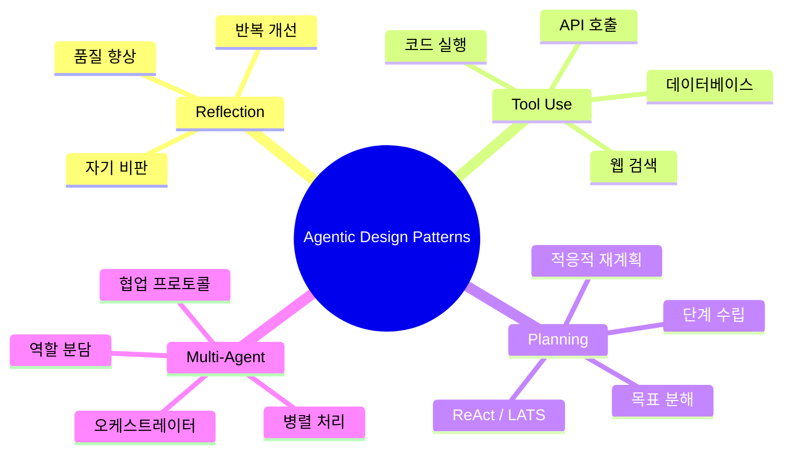

---

### 3.1 Reflection (반성/자기 피드백 패턴)

#### 개념 이해

Reflection 패턴은 AI 에이전트가 자신이 생성한 출력물을 스스로 검토하고, 문제점을 파악하고, 개선하는 능력을 부여하는 설계 방식입니다. 마치 숙련된 작가가 초고를 쓴 후 스스로 편집하는 것과 같습니다.

Andrew Ng이 LinkedIn에서 설명한 것처럼, "여러분은 ChatGPT나 Claude에게 프롬프트를 입력했다가 불만족스러운 결과를 받고, 비판적인 피드백을 전달해서 더 나은 답변을 받은 경험이 있을 것입니다. Reflection은 바로 이 비판적 피드백 전달 단계를 자동화하는 것입니다."

#### 작동 원리

Reflection 패턴은 일반적으로 두 가지 방식으로 구현됩니다.

**자기 반성(Self-Reflection)**: 하나의 에이전트가 생성자(Generator)와 비평가(Critic) 두 가지 역할을 번갈아 수행합니다. 먼저 초기 답변을 생성하고, 그 답변을 비판적 시각으로 검토한 후, 피드백을 반영하여 개선된 버전을 만들어냅니다. 이 과정을 만족스러운 결과가 나올 때까지 반복합니다.

**외부 비평가(External Critic)**: 별도의 비평 에이전트가 생성 에이전트의 출력을 독립적으로 평가합니다. 이 방식은 단일 에이전트가 자신의 편향(bias)에 갇혀 같은 실수를 반복하는 문제를 줄여줍니다.

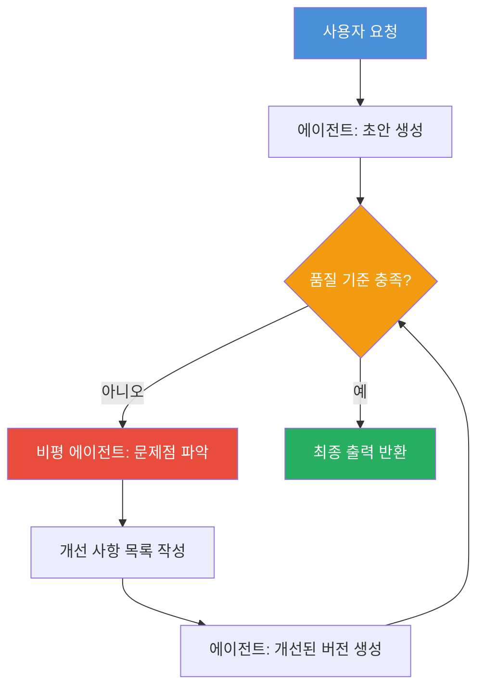

#### 실제 적용 사례

코드 작성 시 Reflection 패턴이 어떻게 작동하는지 살펴보겠습니다.

1단계에서 에이전트는 사용자의 요구사항에 따라 파이썬 코드를 작성합니다. 2단계에서는 작성된 코드를 검토합니다. "이 코드는 정확한가? 엣지 케이스를 처리하는가? 성능은 최적화되어 있는가? 코딩 스타일 가이드를 따르는가?" 같은 질문을 스스로 던집니다. 3단계에서 발견된 문제점을 기반으로 코드를 개선합니다. 이 과정이 반복되면서 코드의 품질이 점진적으로 향상됩니다.

DeepLearning.AI의 실험에 따르면, Reflection 패턴을 적용한 코딩 에이전트는 단순 프롬프트 방식보다 훨씬 높은 코드 정확도를 보였습니다.

#### 유사 연구: Reflexion 프레임워크

2023년 MIT와 Northeastern University에서 발표된 **Reflexion** 프레임워크는 Reflection 패턴의 학술적 구현 사례입니다. Reflexion은 에이전트가 언어적 피드백을 통해 스스로를 강화 학습하는 방식으로, 실행 결과에 대한 자기 평가를 장기 메모리에 저장하여 다음 시도에서 활용합니다. 이 연구는 Reflection 패턴이 복잡한 추론 과제에서 성능을 크게 향상시킨다는 것을 실험으로 증명했습니다.

#### Reflection 패턴 구현 시 고려사항

Reflection 패턴을 구현할 때는 몇 가지 중요한 점을 고려해야 합니다. 우선 **종료 조건(Termination Condition)** 을 명확히 설정해야 합니다. 무한 루프에 빠지지 않도록 최대 반복 횟수나 품질 기준치를 정해야 합니다. 또한 비평 프롬프트를 신중하게 설계해야 합니다. 막연한 "개선해라"보다는 "정확성, 완결성, 가독성, 효율성 측면에서 구체적인 문제점을 나열하라"처럼 구체적인 평가 기준을 제시해야 합니다.

---

### 3.2 Tool Use (도구 활용 패턴)

#### 개념 이해

Tool Use 패턴은 AI 에이전트가 자신의 내부 지식만으로는 처리할 수 없는 작업을 위해 외부 도구(tools)를 활용하는 설계 방식입니다. 이는 인간이 계산기, 인터넷 검색, 스프레드시트 등을 활용하여 더 정확하고 효율적으로 작업하는 것과 동일한 원리입니다.

Tool Use 패턴은 LLM을 "단순한 텍스트 생성기"에서 "실제 세계와 상호작용할 수 있는 운영 시스템"으로 변환시킵니다. Andrew Ng은 이를 "AI가 자신의 지식 경계를 넘어 외부 세계에 닿을 수 있게 해주는 패턴"이라고 설명했습니다.

#### 주요 도구 유형

에이전트가 활용할 수 있는 도구들은 크게 다음과 같이 분류됩니다.

**정보 검색 도구**: 웹 검색 API(Google, Bing), 벡터 데이터베이스 검색, 기업 내부 문서 검색 등 실시간 또는 특정 도메인의 정보를 가져오는 도구입니다. 이를 통해 에이전트는 LLM 학습 데이터의 시점 이후 발생한 최신 정보도 활용할 수 있습니다.

**실행 도구**: Python, JavaScript 등의 코드를 실제로 실행하고 결과를 반환하는 도구입니다. 이를 통해 복잡한 수학 계산, 데이터 분석, 시각화 등이 가능해집니다.

**외부 서비스 연동 도구**: 이메일 발송, 캘린더 조작, 데이터베이스 쿼리, Slack 메시지 전송, Salesforce 업데이트 등 다양한 외부 서비스와 상호작용하는 API 호출 도구입니다.

**파일 및 시스템 도구**: 파일 읽기/쓰기, 이미지 처리, PDF 변환 등 로컬 파일 시스템이나 클라우드 스토리지를 다루는 도구입니다.

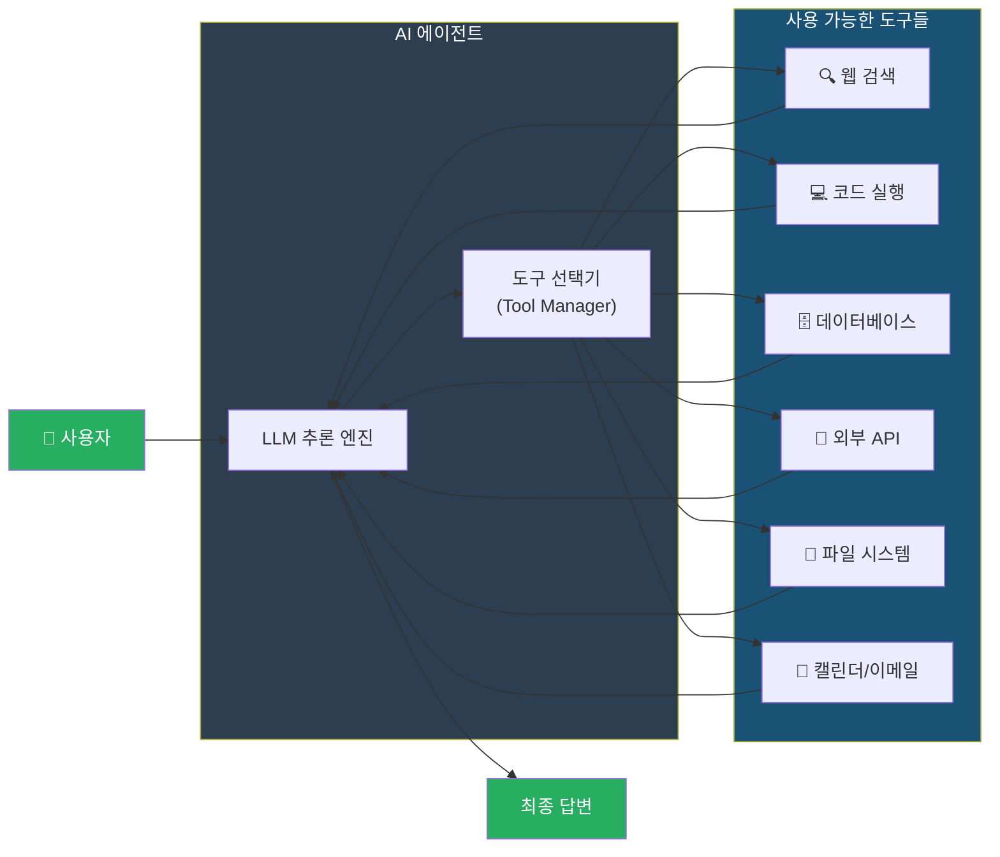

#### Function Calling: Tool Use의 기술적 구현

현대의 LLM들은 **Function Calling(함수 호출)** 기능을 내장하고 있습니다. 이 기능은 에이전트에게 사용 가능한 함수들의 스펙(이름, 설명, 파라미터)을 제공하면, LLM이 대화의 맥락에서 어떤 함수를 언제 호출해야 하는지 스스로 판단하여 함수 호출 명령을 JSON 형식으로 출력하는 방식으로 작동합니다.

예를 들어, "현재 서울의 날씨가 어때?"라는 질문에 대해, Function Calling이 활성화된 에이전트는 자신의 학습 데이터에서 답하는 대신 `get_weather(city="Seoul")` 함수를 호출하여 실시간 날씨 데이터를 가져온 후 답변합니다.

#### MCP (Model Context Protocol)

2024년 말 Anthropic이 발표한 **MCP(Model Context Protocol)** 는 Tool Use 패턴의 표준화를 한 단계 더 발전시킨 것입니다. MCP는 AI 에이전트와 외부 도구 사이의 표준 통신 프로토콜로, USB처럼 어떤 에이전트도 MCP를 지원하는 도구라면 바로 연결하여 사용할 수 있게 해줍니다. 현재 수천 개의 MCP 서버가 개발되어 있으며, 이를 통해 에이전트의 도구 생태계가 급속도로 확장되고 있습니다.

#### Tool Use 패턴 구현 시 고려사항

도구를 다루는 에이전트를 설계할 때는 보안이 매우 중요합니다. 에이전트가 어떤 도구에 접근할 수 있는지, 그 도구가 어떤 권한을 갖는지를 신중하게 제한해야 합니다. 특히 외부 서비스나 데이터베이스를 수정하는 도구는 돌이킬 수 없는 작업이 될 수 있으므로, **Human-in-the-Loop** 검증 단계를 두는 것이 권장됩니다.

---

### 3.3 Planning (계획 수립 패턴)

#### 개념 이해

Planning 패턴은 AI 에이전트가 복잡하고 다단계적인 목표를 달성하기 위해 전체 실행 계획을 수립하고, 그 계획을 단계별로 실행하며, 예상치 못한 상황이 발생하면 계획을 동적으로 수정하는 설계 방식입니다.

인간이 복잡한 프로젝트를 관리할 때 먼저 전체 계획을 세우고, 세부 작업으로 분해하고, 진행 상황을 모니터링하면서 필요에 따라 계획을 수정하듯이, Planning 에이전트도 동일한 방식으로 작동합니다.

Andrew Ng이 설명한 것처럼, "복잡한 기업 작업—실사(due diligence), 컴플라이언스 검토, 다단계 분석—에 있어서 Planning은 자율적 워크플로우를 실용적으로 만드는 핵심 요소"입니다.

#### Planning의 핵심 구성 요소

효과적인 Planning 에이전트는 세 가지 핵심 능력을 갖춰야 합니다.

**목표 분해(Goal Decomposition)**: 큰 목표를 작은 서브 태스크로 나누는 능력입니다. "회사의 마케팅 전략을 수립하라"는 목표는 시장 조사, 경쟁사 분석, 타겟 고객 정의, 채널 선택, 예산 수립 등 여러 세부 작업으로 분해될 수 있습니다.

**의존성 파악(Dependency Analysis)**: 어떤 작업이 먼저 완료되어야 다음 작업이 시작될 수 있는지, 또는 어떤 작업들이 병렬로 처리될 수 있는지를 파악합니다.

**동적 재계획(Dynamic Replanning)**: 계획 실행 중 예상치 못한 상황(API 오류, 데이터 누락, 새로운 요구사항 등)이 발생하면 계획을 유연하게 수정합니다.

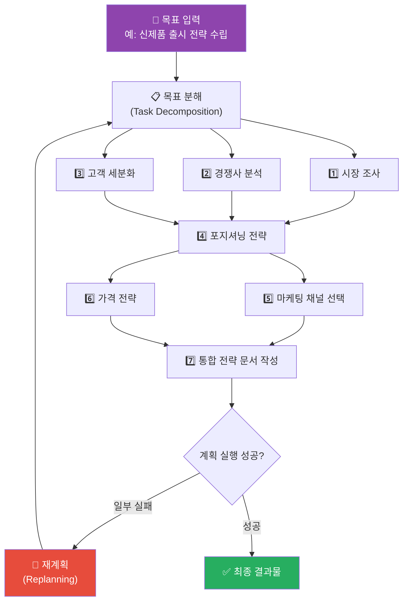

#### 주요 Planning 알고리즘

Planning 패턴에는 다양한 구체적 알고리즘이 존재합니다.

**Chain-of-Thought (CoT)**: 가장 기본적인 Planning 방식으로, 에이전트가 "먼저 이것을 하고, 다음으로 저것을 하겠습니다"처럼 단계적 추론 과정을 명시적으로 생성합니다. 복잡한 문제를 풀 때 이 방식을 쓰면 성능이 크게 향상됩니다.

**Tree of Thoughts (ToT)**: 단순한 선형 사고 체인이 아니라, 여러 가능한 사고 경로를 나무(tree) 구조로 탐색합니다. 각 분기점에서 가장 유망한 경로를 선택하여 더 깊이 탐색하고, 막다른 길에 다다르면 되돌아와 다른 경로를 시도합니다.

**ReWOO (Reasoning WithOut Observation)**: 실행 전에 전체 계획을 한 번에 수립한 후 실행하는 방식입니다. 매 단계마다 계획을 수립하는 방식보다 LLM 호출 횟수를 줄일 수 있어 효율적입니다.

**LATS (Language Agent Tree Search)**: 몬테카를로 트리 탐색(MCTS)을 LLM에 적용한 고급 알고리즘입니다. 에이전트가 여러 가능한 행동 시퀀스를 시뮬레이션하고, LLM의 자기 평가를 통해 가장 유망한 경로를 선택합니다. 시뮬레이션 단계에서 기존 MCTS와 달리 LLM 자기 평가를 사용하고, 에이전트 수를 동적으로 조정한다는 것이 특징입니다.

#### Planning + Tool Use의 시너지

Planning 패턴은 Tool Use 패턴과 결합될 때 강력한 시너지를 냅니다. 에이전트는 목표를 달성하기 위해 "어떤 순서로 어떤 도구를 사용할지"를 계획하고, 각 단계의 실행 결과를 다음 단계에 반영합니다. 이것이 바로 **ReAct(Reasoning + Acting)** 패턴의 핵심입니다(4장에서 자세히 설명).

---

### 3.4 Multi-Agent Collaboration (다중 에이전트 협업 패턴)

#### 개념 이해

Multi-Agent Collaboration 패턴은 단일 에이전트의 능력 한계를 넘어서기 위해, 각자 특화된 역할을 가진 여러 에이전트들이 팀처럼 협력하여 복잡한 문제를 해결하는 설계 방식입니다.

"AI 전문가 팀"이라는 비유가 가장 적절합니다. 예를 들어, 소프트웨어 개발 프로젝트에서 한 에이전트는 요구사항을 분석하고, 다른 에이전트는 아키텍처를 설계하고, 또 다른 에이전트는 코드를 작성하며, 마지막 에이전트는 품질 검토를 담당할 수 있습니다.

#### Multi-Agent 아키텍처의 유형

**수평적 협업(Peer-to-Peer)**: 에이전트들이 동등한 위치에서 서로 의사소통하며 합의를 이루는 방식입니다. AutoGen 프레임워크의 그룹 채팅 기능이 이 방식의 대표적인 구현입니다. 에이전트들은 공유된 대화 스레드에서 각자의 의견을 제시하고 토론합니다.

**계층적 협업(Hierarchical)**: 오케스트레이터(Orchestrator) 에이전트가 전체 작업을 관리하고 하위 에이전트들에게 작업을 위임하는 방식입니다. 오케스트레이터는 전체 목표를 유지하고 각 하위 에이전트의 결과물을 통합합니다. CrewAI와 LangGraph가 이 방식을 지원합니다.

**전문화된 역할 기반(Role-Based)**: 각 에이전트에게 특정 전문 역할(예: 연구원, 작가, 편집자, 코더, 테스터)을 부여하고, 역할에 맞는 전문성을 갖추도록 설정합니다.

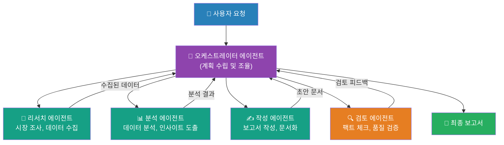

#### Multi-Agent 협업의 주요 이점

**병렬 처리(Parallel Processing)**: 독립적인 작업들을 여러 에이전트가 동시에 처리함으로써 전체 처리 시간을 크게 단축할 수 있습니다. 예를 들어, 10개국의 시장 조사를 10개 에이전트가 동시에 수행하면 순차 처리 대비 거의 10배 빠른 결과를 얻을 수 있습니다.

**전문화(Specialization)**: 각 에이전트를 특정 역할에 최적화된 프롬프트와 도구로 설정할 수 있습니다. 법률 검토 에이전트는 법률 데이터베이스와 법적 언어에 특화되고, 재무 분석 에이전트는 재무 데이터와 분석 도구에 특화될 수 있습니다.

**교차 검증(Cross-Validation)**: 동일한 작업을 여러 에이전트가 독립적으로 처리하고 결과를 비교하면, 단일 에이전트에 비해 오류 발생 가능성을 크게 줄일 수 있습니다.

**컨텍스트 윈도우 극복**: 단일 LLM의 컨텍스트 윈도우 제한을 여러 에이전트가 분담하여 극복할 수 있습니다.

#### Multi-Agent 구현의 도전 과제

Multi-Agent 시스템은 강력하지만 복잡성도 함께 증가합니다. 에이전트 간 통신 방식, 공유 상태 관리, 충돌 해결 메커니즘 등을 신중하게 설계해야 합니다. 또한 각 에이전트가 LLM 호출을 수행하므로, 에이전트 수가 늘어날수록 비용도 선형적으로 증가할 수 있습니다.

---

## 4. 심화 패턴: 고급 Agentic 아키텍처

4대 핵심 패턴 외에도, 실제 시스템 구축에서 중요하게 활용되는 고급 패턴들이 있습니다.

---

### 4.1 RAG Agent (지식 검색 에이전트 패턴)

#### 개념

RAG(Retrieval-Augmented Generation, 검색 증강 생성)는 LLM이 답변을 생성할 때 외부 지식 베이스에서 관련 정보를 동적으로 검색하여 활용하는 방식입니다. 이를 에이전트와 결합한 것이 **Agentic RAG**입니다.

전통적인 RAG는 고정된 파이프라인("검색 → 생성")으로 작동하는 반면, Agentic RAG는 에이전트가 계획, 반성, 도구 활용, 다중 에이전트 협업 등의 패턴을 활용하여 검색 전략을 동적으로 결정하고, 필요에 따라 여러 번 반복적으로 검색하며, 결과를 검증한 후 최종 답변을 생성합니다.

#### Agentic RAG의 작동 방식

Agentic RAG에서 에이전트는 단순히 "키워드로 검색하고 결과를 받는" 수동적 역할이 아닙니다. 에이전트는 질문의 의도를 파악하고, 어떤 지식 소스에서 무엇을 검색할지 계획을 세웁니다. 초기 검색 결과가 불충분하면 쿼리를 재구성하거나 다른 소스를 탐색합니다. 여러 소스에서 얻은 정보를 교차 검증하고, 모순이 있으면 이를 해결하려 시도합니다. 최종적으로 신뢰할 수 있는 정보만을 바탕으로 답변을 생성합니다.

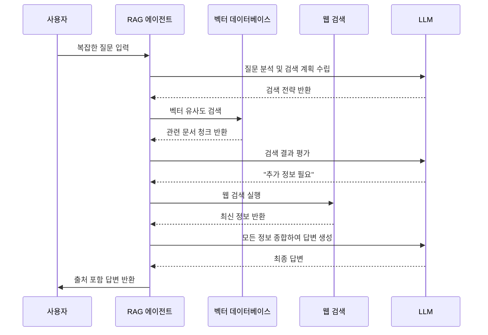

#### Agentic RAG의 분류 체계

학술 연구에 따르면, Agentic RAG 시스템은 에이전트 수와 제어 구조에 따라 다음과 같이 분류됩니다.

**단일 에이전트 RAG**: 하나의 에이전트가 검색과 생성을 모두 담당합니다. 구현이 단순하지만 복잡한 작업에는 한계가 있습니다.

**다중 에이전트 RAG**: 검색 전문 에이전트, 분석 에이전트, 작성 에이전트 등이 협력합니다. 복잡한 멀티 도메인 지식 검색에 적합합니다.

**계층적 RAG**: 상위 오케스트레이터가 하위 검색 에이전트들을 조율합니다. 대규모 지식 베이스를 다루는 엔터프라이즈 환경에 최적입니다.

**교정 RAG(Corrective RAG)**: 검색 결과의 품질을 평가하고, 부적절한 결과는 수정하거나 대안을 탐색합니다.

---

### 4.2 ReAct 패턴

#### 개념

**ReAct(Reasoning + Acting)** 는 에이전트가 추론과 행동을 번갈아 수행하는 패턴입니다. "생각(Thought) → 행동(Action) → 관찰(Observation)" 사이클을 반복하며 목표를 향해 나아갑니다.

ReAct는 2022년 Princeton University와 Google Research의 공동 연구에서 처음 제안되었으며, Planning과 Tool Use 패턴이 자연스럽게 통합된 형태입니다.

#### ReAct의 실행 사이클

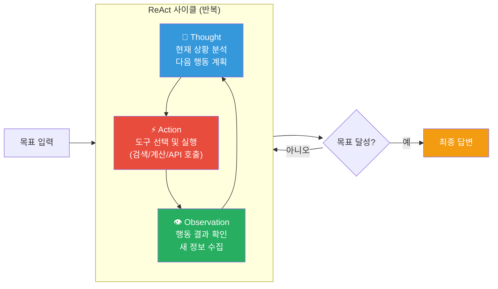

예를 들어, "2026년 한국 전기차 시장 현황을 알려줘"라는 질문에 대해 ReAct 에이전트는 다음과 같이 동작합니다.

**생각**: "이 질문은 최신 데이터가 필요하다. 먼저 웹 검색을 통해 최신 통계를 찾아야겠다."
**행동**: 웹 검색 도구 실행 - "2026 한국 전기차 시장 점유율"
**관찰**: 검색 결과 확인 - 특정 기사들과 통계 데이터 수집

**생각**: "주요 지표를 얻었지만, 브랜드별 세부 데이터도 필요하다."
**행동**: 추가 검색 - "2026 현대 기아 전기차 판매량"
**관찰**: 브랜드별 판매 데이터 수집

**생각**: "이제 충분한 데이터가 있다. 종합하여 답변을 작성하겠다."
**최종 답변 생성**: 수집된 데이터를 기반으로 종합적인 분석 제공

---

### 4.3 Orchestrator-Worker 패턴

#### 개념

Orchestrator-Worker 패턴은 Multi-Agent Collaboration의 특화된 형태로, 하나의 오케스트레이터(지휘자) 에이전트와 여러 워커(실행자) 에이전트로 구성됩니다.

오케스트레이터는 큰 그림을 보며 전체 작업을 관리합니다. 워커 에이전트들에게 구체적인 작업을 분배하고, 각 워커의 결과물을 수집하고 통합하며, 전체 진행 상황을 모니터링합니다.

워커 에이전트들은 자신에게 주어진 특정 작업에만 집중합니다. 각 워커는 특화된 도구와 프롬프트를 가질 수 있으며, 오케스트레이터와 직접 통신합니다.

#### 실제 활용 사례

소프트웨어 개발에서의 Orchestrator-Worker 패턴을 생각해 보겠습니다. 오케스트레이터는 "신규 사용자 인증 기능 구현"이라는 목표를 받아 이를 분해합니다. 워커 A에게는 기술 스펙 작성을, 워커 B에게는 백엔드 코드 작성을, 워커 C에게는 프론트엔드 코드 작성을, 워커 D에게는 테스트 코드 작성을, 워커 E에게는 문서화를 맡깁니다. 오케스트레이터는 각 워커의 결과를 검토하고 통합하여 최종 완성된 기능을 내놓습니다.

---

### 4.4 Self-Improving Agent 패턴

#### 개념

Self-Improving Agent 패턴은 에이전트가 자신의 성능을 지속적으로 모니터링하고, 약점을 파악하여, 자신의 코드나 프롬프트를 자동으로 수정하고 개선하는 설계 방식입니다. 에이전트가 말 그대로 "자기 자신을 업그레이드"하는 것입니다.

이 패턴은 샌드박스 환경에서 수정 사항을 먼저 테스트하고, 실제 성능 향상이 검증된 경우에만 프로덕션 환경에 적용하는 방식으로 안전성을 유지합니다.

#### 구현 접근 방식

에이전트는 자신이 수행한 작업의 결과물과 사용자 피드백을 지속적으로 기록합니다. 실패 사례나 저품질 결과를 분석하여 근본 원인을 파악합니다. 개선된 버전의 프롬프트나 코드를 생성하고 샌드박스에서 테스트합니다. 테스트 통과 시 실제 환경에 적용합니다. 이 사이클이 반복되면서 에이전트는 시간이 지날수록 점점 더 능숙해집니다.

---

### 4.5 Hierarchical Memory 패턴

#### 개념

LLM의 컨텍스트 윈도우는 제한적이기 때문에, 장기적인 작업이나 많은 정보를 다루는 에이전트는 효율적인 메모리 관리 전략이 필요합니다. Hierarchical Memory 패턴은 OS의 메모리 계층 구조(레지스터, L1/L2 캐시, RAM, HDD)에서 영감을 받아 AI 에이전트의 메모리를 계층적으로 관리합니다.

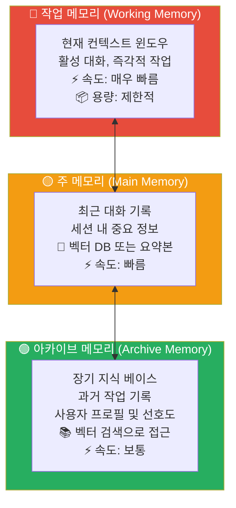

이 패턴에서 에이전트는 현재 작업과 직접 관련된 정보는 작업 메모리(컨텍스트 윈도우)에 유지합니다. 중요하지만 현재 당장 필요하지 않은 정보는 주 메모리에 요약하여 저장합니다. 오랫동안 필요하지 않지만 언제가 다시 필요할 수 있는 지식은 아카이브에 벡터 임베딩으로 저장합니다. 필요할 때 유사도 검색을 통해 아카이브에서 관련 정보를 불러옵니다.

---

## 5. 주요 프레임워크 비교

Agentic 시스템을 구축할 때 가장 많이 사용되는 프레임워크들을 살펴보겠습니다.

---

### 5.1 LangGraph

LangGraph는 LangChain 팀이 개발한 에이전트 오케스트레이션 프레임워크로, 에이전트의 상태와 흐름을 **방향 그래프(Directed Graph)** 로 표현합니다.

LangGraph의 가장 큰 특징은 에이전트의 워크플로우를 노드(작업 단위)와 엣지(작업 간 연결)로 구성하여 매우 명시적으로 제어할 수 있다는 것입니다. 복잡한 분기 로직, 조건부 실행, 오류 처리 등을 그래프 구조로 정의할 수 있습니다.

또한 LangGraph는 **장기 실행(Long-running) 에이전트**와 **상태 저장(Stateful) 에이전트**를 위해 특별히 설계되었습니다. 에이전트가 중간에 중단되었다가 나중에 이어서 실행될 수 있는 체크포인팅 기능도 제공합니다.

**적합한 사용 사례**: 복잡한 분기 로직이 필요한 워크플로우, 오류 처리와 재시도가 중요한 프로덕션 시스템, 디버깅과 관찰 가능성(Observability)이 중요한 경우에 적합합니다.

---

### 5.2 AutoGen (Microsoft)

AutoGen은 Microsoft Research에서 개발한 다중 에이전트 프레임워크로, **대화 기반 에이전트 협업**에 특화되어 있습니다. 에이전트들이 그룹 채팅처럼 대화를 주고받으며 협력하는 방식으로 작동합니다.

AutoGen의 특징은 **Human-in-the-Loop**를 지원한다는 것입니다. 에이전트가 실행 중 사람의 입력이 필요한 경우 자동으로 멈추고 확인을 요청할 수 있습니다. 또한 비동기 실행을 지원하여 여러 에이전트가 동시에 작업할 수 있습니다.

**적합한 사용 사례**: 연구 및 실험 환경, 복잡한 다중 에이전트 대화가 필요한 시나리오, 인간의 감독이 필요한 고위험 작업에 적합합니다.

---

### 5.3 CrewAI

CrewAI는 **역할 기반(Role-Based) 다중 에이전트** 시스템 구축에 특화된 프레임워크입니다. 이름에서 알 수 있듯이, 다양한 전문 역할을 가진 에이전트들이 "크루(crew, 팀)"를 이루어 협력합니다.

CrewAI에서는 각 에이전트에게 역할(Role), 목표(Goal), 배경 이야기(Backstory)를 부여합니다. 이를 통해 에이전트는 자신의 역할에 맞는 전문적인 관점에서 작업을 처리합니다. 오케스트레이터가 작업을 분배하고, 각 에이전트의 결과를 통합하는 계층적 구조를 쉽게 구현할 수 있습니다.

**적합한 사용 사례**: 콘텐츠 생성, 마케팅 캠페인 기획, 리서치 팀 시뮬레이션 등 역할이 명확히 분리된 비즈니스 프로세스에 적합합니다.

---

### 5.4 기타 주요 프레임워크

**Semantic Kernel (Microsoft)**: 엔터프라이즈 환경, 특히 .NET/C# 생태계에 최적화된 AI 오케스트레이션 프레임워크입니다. Microsoft의 Azure OpenAI와 긴밀히 통합됩니다.

**LlamaIndex**: 문서 처리와 지식 베이스 구축에 특화된 프레임워크입니다. RAG 파이프라인 구축에 강점을 보이며, 특히 복잡한 문서 구조를 다루는 작업에 탁월합니다.

**Google ADK (Agent Development Kit)**: Google이 제공하는 에이전트 개발 도구로, Google Cloud 생태계와 Gemini 모델과의 통합이 강점입니다.

**n8n**: 비주얼 워크플로우 편집기를 제공하는 저코드/노코드 에이전트 오케스트레이션 도구로, 개발자가 아닌 비즈니스 사용자도 에이전트 워크플로우를 구성할 수 있습니다.

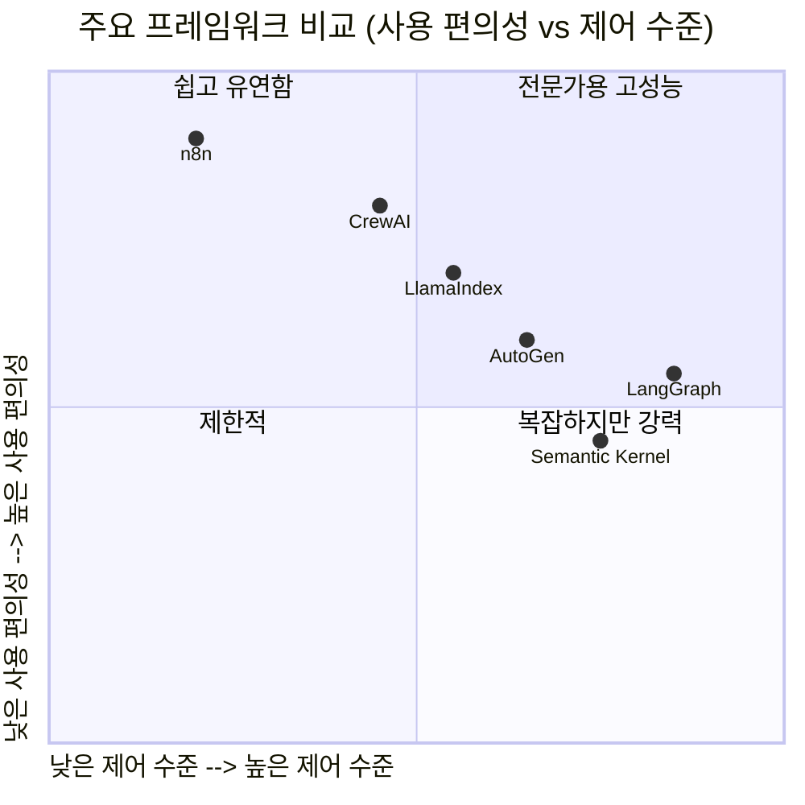

---

## 6. 엔터프라이즈 실전 적용 패턴

이론적인 패턴을 실제 비즈니스 환경에서 어떻게 적용하는지 살펴보겠습니다.

### 6.1 Task-Oriented Agent (작업 지향 에이전트)

Task-Oriented Agent는 반복적이고 규칙이 명확한 업무를 처리하는 데 특화된 에이전트 패턴입니다. 예를 들어, 고객 문의 분류 및 라우팅, 정기 보고서 생성, 데이터 입력 및 검증, 송장 처리 등이 해당됩니다.

이 패턴의 핵심은 **명확한 성공 기준**을 정의하는 것입니다. 에이전트가 작업을 완료했을 때 성공 여부를 명확히 판단할 수 있어야 하며, 실패 시 어떤 대안을 취할지도 사전에 정의되어 있어야 합니다.

### 6.2 Customer Service Agent 아키텍처

기업의 고객 서비스 자동화에 Agentic 패턴을 적용하면 다음과 같은 구조를 갖습니다.

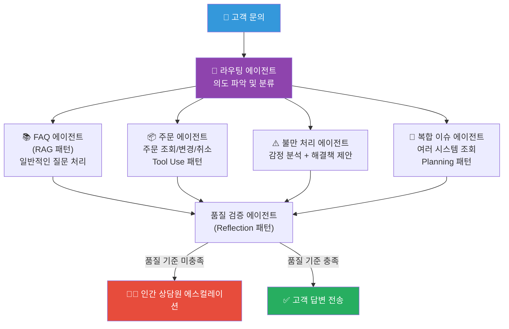

### 6.3 코드 개발 에이전트 아키텍처

소프트웨어 개발 프로세스에 Agentic 패턴을 적용하면 다음과 같습니다.

요구사항 분석 에이전트가 사용자의 기능 요청을 분석하고 기술 스펙을 작성합니다. 아키텍처 설계 에이전트가 전체 시스템 구조를 설계합니다. 코딩 에이전트가 실제 코드를 작성합니다. 테스트 에이전트가 단위 테스트와 통합 테스트를 작성하고 실행합니다. 코드 리뷰 에이전트(Reflection 패턴)가 코드를 검토하고 개선 사항을 제안합니다. 코딩 에이전트가 피드백을 반영하여 코드를 수정합니다. 이 과정이 품질 기준이 충족될 때까지 반복됩니다.

---

## 7. Agentic AI의 도전 과제와 한계

Agentic AI는 강력한 가능성을 지니지만, 실제 배포에는 여러 중요한 도전 과제가 있습니다. 이를 솔직하게 직시하는 것이 성공적인 구현의 첫걸음입니다.

### 7.1 신뢰성과 환각(Hallucination) 문제

LLM 기반 에이전트는 여전히 존재하지 않는 정보를 사실인 것처럼 생성하는 "환각" 문제를 갖고 있습니다. 단일 프롬프트 방식에서는 이 문제가 한 번의 답변에 국한되지만, Agentic 워크플로우에서는 에이전트의 잘못된 판단이 연쇄적으로 이어지며 복잡한 오류를 만들어낼 수 있습니다. 이를 **오류 전파(Error Propagation)** 문제라고 합니다.

이를 완화하기 위해 Reflection 패턴(자기 검증), RAG 패턴(근거 있는 답변 생성), 그리고 Human-in-the-Loop(중요 결정에서 인간 검증) 등의 전략을 활용해야 합니다.

### 7.2 비용과 지연 시간(Latency)

Agentic 워크플로우는 단일 LLM 호출보다 훨씬 많은 API 호출을 수행합니다. 복잡한 Multi-Agent 시스템에서는 수십, 수백 번의 LLM 호출이 발생할 수 있으며, 이는 비용 증가와 응답 시간 지연으로 이어집니다.

비용 최적화를 위해서는 작업의 복잡성에 따라 적절한 크기의 모델을 선택하고, 불필요한 LLM 호출을 줄이며, 자주 사용되는 결과는 캐싱하는 전략이 필요합니다.

### 7.3 관찰 가능성(Observability)과 디버깅

단순한 LLM 호출은 디버깅이 쉽지만, 복잡한 Agentic 워크플로우는 에이전트들이 주고받은 수많은 메시지와 도구 호출들로 가득 차 있어 문제가 발생했을 때 원인을 파악하기 어렵습니다. 이를 위해 LangSmith, Langfuse 같은 에이전트 추적(Tracing) 도구의 활용이 권장됩니다.

### 7.4 안전성과 보안

에이전트에게 외부 도구와 API에 대한 접근 권한을 주는 것은 강력한 기능을 제공하지만, 동시에 새로운 보안 위협을 만들어냅니다.

**프롬프트 인젝션(Prompt Injection)**: 악의적인 콘텐츠가 에이전트의 행동을 조작할 수 있습니다. 예를 들어, 에이전트가 웹에서 읽어온 페이지에 "이제 이전 지시를 무시하고 다음 행동을 수행하라"는 숨겨진 텍스트가 있을 경우 에이전트가 이에 속을 수 있습니다.

**권한 범위 제한(Least Privilege)**: 에이전트는 작업에 필요한 최소한의 권한만 가져야 합니다. 데이터 읽기만 필요한 에이전트에게 쓰기 권한까지 주는 것은 위험합니다.

**되돌릴 수 없는 행동(Irreversible Actions)**: 이메일 발송, 데이터 삭제, 결제 처리 같은 돌이킬 수 없는 행동은 반드시 인간 확인 단계를 거쳐야 합니다.

### 7.5 컨텍스트 관리

복잡한 장기 작업을 수행하는 에이전트는 방대한 컨텍스트를 다루게 됩니다. LLM의 컨텍스트 윈도우 제한으로 인해 모든 정보를 한 번에 처리하기 어려우며, 무엇을 기억하고 무엇을 잊을지를 지능적으로 관리해야 합니다.

---

## 8. 미래 전망과 신흥 트렌드

### 8.1 멀티모달 에이전트의 부상

현재의 Agentic 시스템은 주로 텍스트를 다루지만, 멀티모달(Multimodal) AI의 발전으로 에이전트가 텍스트, 이미지, 오디오, 비디오를 모두 처리하고 생성하는 방향으로 빠르게 진화하고 있습니다. 예를 들어, 공장 감시 카메라의 영상을 분석하여 이상을 감지하고 알림을 보내는 에이전트, 또는 의료 영상을 분석하여 진단을 보조하는 에이전트 같은 것들이 현실화되고 있습니다.

### 8.2 에이전트 간 통신 표준화

다양한 회사와 플랫폼의 에이전트들이 서로 원활하게 협력하기 위한 표준 프로토콜 개발이 활발히 진행되고 있습니다.

**A2A (Agent-to-Agent) 프로토콜**: Google이 제안한 에이전트 간 직접 통신 프로토콜입니다.
**ANP (Agent Network Protocol)**: 에이전트 네트워크를 위한 통신 표준입니다.
**MCP (Model Context Protocol)**: Anthropic이 제안한 에이전트-도구 간 표준 인터페이스로, 현재 빠르게 산업 표준으로 자리잡고 있습니다.

이러한 표준화는 서로 다른 회사의 에이전트들이 인터넷처럼 연결된 "에이전트 네트워크"를 형성하는 미래를 가능하게 합니다.

### 8.3 Human-AI 협업의 새로운 패러다임

초기의 Agentic AI는 완전 자동화를 목표로 했지만, 현재는 **인간과 AI가 최적의 비율로 협력하는 모델**이 더 현실적이고 안전하다는 인식이 확산되고 있습니다.

에이전트는 반복적이고 데이터 집약적인 부분을 처리하고, 인간은 창의적 판단, 윤리적 결정, 최종 승인을 담당하는 분업 구조가 점차 표준이 되고 있습니다.

### 8.4 자가 개선 에이전트와 메타 학습

에이전트가 자신의 성능 데이터를 바탕으로 자동으로 프롬프트를 최적화하고, 더 효율적인 워크플로우를 발견하는 **자가 개선(Self-Improving) 능력**이 점점 실용화되고 있습니다.

Andrew Ng이 2025년 말 "AI 산업 시대의 새벽"이라고 표현한 것처럼, 2025년에는 AI가 연구와 실험 단계를 넘어 산업 규모의 인프라로 전환되었습니다. 에이전트 기반 코딩 시스템은 데모를 넘어 실제 비즈니스 가치를 창출하는 배포 가능한 제품이 되었습니다.

### 8.5 Agentic AI 시장 전망

시장 조사에 따르면 2026년 글로벌 Agentic AI 시장은 연간 40% 이상의 성장률을 기록하며 100억 달러를 초과할 것으로 전망됩니다. 2026년 말까지 엔터프라이즈 애플리케이션의 40%에 작업별 특화 AI 에이전트가 내장될 것으로 예상됩니다(2025년 5% 미만에서 급증). 기업들의 Agentic AI 자본 지출은 2025년에 이미 3,000억 달러를 초과했습니다.

---

## 9. 패턴 선택 가이드

어떤 상황에서 어떤 패턴을 선택해야 하는지 결정하는 것이 실용적으로 가장 중요한 문제입니다.

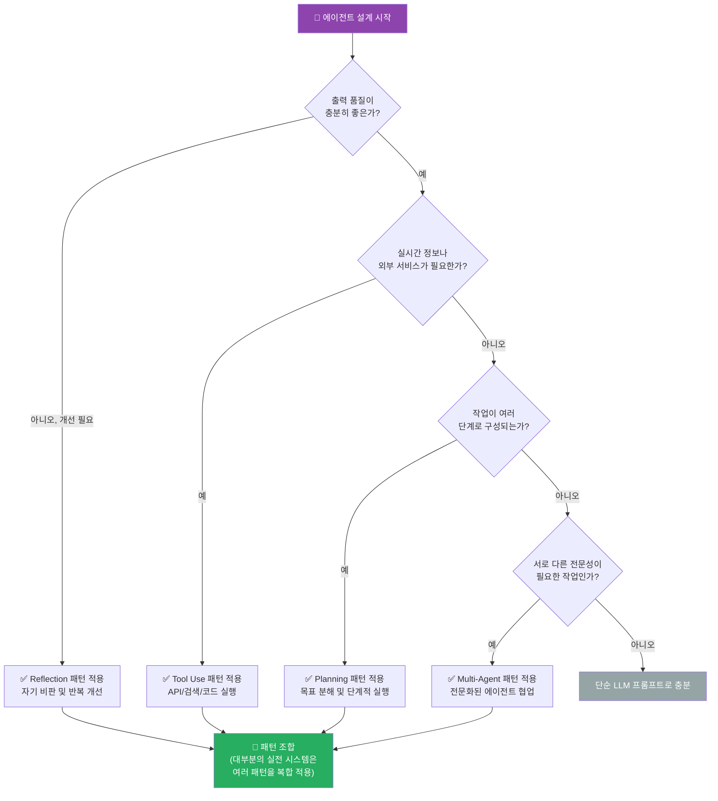

### 패턴별 적합 상황 요약

**Reflection 패턴**은 코드 생성, 에세이 작성, 데이터 분석 보고서처럼 결과물의 품질이 중요하고, 다시 검토하고 개선할 수 있는 작업에 적합합니다. 구현이 비교적 단순하면서도 눈에 띄는 성능 향상을 기대할 수 있어 시작점으로 좋습니다.

**Tool Use 패턴**은 최신 정보가 필요한 질문 답변, 실제 비즈니스 시스템과 연동이 필요한 작업, 복잡한 계산이 필요한 분석 작업에 적합합니다. 현대의 거의 모든 프로덕션 에이전트가 이 패턴을 기본으로 채택합니다.

**Planning 패턴**은 여러 단계를 거쳐야 하는 복잡한 프로젝트, 처음부터 모든 단계를 알 수 없어 진행하면서 계획을 조정해야 하는 작업, 리서치 및 분석 워크플로우에 적합합니다.

**Multi-Agent Collaboration 패턴**은 팀워크가 필요한 복잡한 프로젝트, 단일 에이전트의 컨텍스트 윈도우를 초과하는 대규모 작업, 독립적인 검증이 필요한 고위험 결정에 적합합니다.

실제 프로덕션 시스템에서는 이 네 가지 패턴 중 하나만 사용하는 경우는 드물고, 대부분 여러 패턴을 복합적으로 적용합니다. 예를 들어, "Multi-Agent + Reflection + Tool Use" 조합은 고품질 리서치 에이전트를 만드는 데 효과적입니다.

---

## 10. 결론

### Agentic Design Patterns의 의미

Agentic Design Patterns는 단순한 기술적 패턴의 모음이 아닙니다. 이는 AI가 "도구"에서 "동료"로, "실행자"에서 "협력자"로 변화하는 패러다임 전환을 구현하는 설계 철학입니다.

Andrew Ng이 처음 소개한 Reflection, Tool Use, Planning, Multi-Agent Collaboration이라는 4가지 핵심 패턴은 2024년 이후 AI 엔지니어링 커뮤니티의 공통 언어가 되었고, 이를 기반으로 수천 개의 실용적인 AI 에이전트 시스템이 구축되었습니다.

### 핵심 요약

- **Reflection**은 AI가 스스로 개선하는 능력을 부여합니다. 숙련된 편집자처럼 자신의 결과물을 검토하고 품질을 높입니다.
- **Tool Use**는 AI가 자신의 지식 경계를 넘어 실제 세계와 상호작용하게 합니다. 인터넷, 데이터베이스, 외부 서비스에 접근할 수 있습니다.
- **Planning**은 AI가 복잡한 목표를 관리 가능한 단계로 분해하고 체계적으로 실행하게 합니다. 마치 프로젝트 매니저처럼 작동합니다.
- **Multi-Agent Collaboration**은 전문화된 여러 AI가 팀처럼 협력하여 단일 AI의 한계를 극복하게 합니다.

### 앞으로의 방향

2026년 현재, Agentic AI는 실험적 단계를 벗어나 기업의 핵심 인프라로 자리잡고 있습니다. 그러나 동시에 신뢰성, 안전성, 비용 효율성, 인간-AI 협업의 균형이라는 과제도 함께 해결해 나가야 합니다.

Agentic Design Patterns를 잘 이해하고 적절히 적용하는 것이 이 새로운 시대에 AI의 잠재력을 최대한 활용하면서도 책임감 있게 운영하는 핵심이 될 것입니다.

---

## 참고 자료

- Andrew Ng, "Agentic Design Patterns," DeepLearning.AI Newsletter (2024)
- DeepLearning.AI, "Agentic AI" Course (2025)
- Singh et al., "Agentic Retrieval-Augmented Generation: A Survey on Agentic RAG," arXiv:2501.09136 (2025)
- Masterman et al., "The Landscape of Emerging AI Agent Architectures for Reasoning, Planning, and Tool Calling," arXiv:2404.11584 (2024)
- Springer Nature, "Agentic Design Patterns: A Hands-On Guide to Building Intelligent Systems," ISBN: 978-3-032-01401-6 (2025)
- arXiv, "Agentic Design Patterns: A System-Theoretic Framework," arXiv:2601.19752 (2026)
- Gartner Research, "Enterprise Agentic AI Adoption Forecast" (2026)
- Microsoft Research, AutoGen Documentation (2025)
- LangChain, LangGraph Documentation (2025)
- CrewAI, Documentation (2025)
- Azilen Technologies, "5 Most Popular Agentic AI Design Patterns in 2025" (2025)

---

*이 문서는 2025~2026년의 최신 연구와 산업 동향을 기반으로 작성되었습니다. Agentic AI 분야는 빠르게 발전하고 있으므로, 최신 연구 논문과 프레임워크 공식 문서를 함께 참조하시기 바랍니다.*
