>- **원서**: [*Agentic Design Patterns: A Hands-On Guide to Building Intelligent Systems*](https://drive.google.com/file/d/1Gpt-p1-CS1H-BMQ_LqO3xgxWMB-hmfd4/view?usp=sharing)
>- **저자**: Antonio Gulli (Google CTO Office, Senior Director & Distinguished Engineer)
>- **출판사**: Springer (2025년 10월 30일 정식 출판)
>- **구성**: 21개 챕터 + 7개 부록, 총 482페이지 (오픈소스 프리프린트 기준)
>- **GitHub**: [https://github.com/evoiz/Agentic-Design-Patterns](https://github.com/evoiz/Agentic-Design-Patterns)
>- **특이사항**: 저자 인세 전액 Save the Children 기부

---

> 
> 现在大家都在做 Agent，但一上复杂业务：架构怎么搭、记忆怎么管、多智能体怎么配合，往往越做越迷糊。
> 
> 我最近看到一本开源书 Agentic Design Patterns，把智能体设计模式从入门讲到企业级，脉络清晰、拆解到位。
> 
> 全书 21 章 + 7 个附录，按难度分四大部分；每章配套 Jupyter Notebook，边读边跑，理论和代码紧贴在一起。
> 
>  https://github.com/evoiz/Agentic-Design-Patterns
> 
> 前半段打底：提示链、路由、并行、反思、工具调用、多智能体协作等核心模式，一次讲透“怎么设计”。
> 
> 后半段落地：记忆管理、异常恢复、人机协作、安全护栏、性能评估等生产必修课，直接对准“怎么上线”。
> 
> 附录还补齐框架对比和高级提示技巧，适合查漏补缺、随用随翻。
> 
> 想把 Agent 从概念学到可落地的系统方法，这本开源书值得收藏，慢慢啃。
> 
> https://x.com/wsl8297/status/2050077014359683164
> 

## 개요: 왜 지금 이 책인가

AI 에이전트 개발은 현재 폭발적인 성장 국면에 있다. 2024년 말 기준으로 AI 에이전트 스타트업들이 20억 달러 이상의 투자를 유치했으며, 시장 가치는 52억 달러로 평가받고 있다. 이 시장은 2034년까지 약 2,000억 달러 규모로 성장할 것으로 전망된다. 대형 IT 기업 대다수가 이미 에이전트를 도입하고 있으며, 그 중 5분의 1은 지난 1년 사이에 도입을 시작했다.

그러나 에이전트를 "개념적으로 이해하는 것"과 "실제로 잘 설계하는 것" 사이에는 여전히 큰 간극이 존재한다. 복잡한 비즈니스 요구사항에 에이전트를 적용하려 할 때, 아키텍처는 어떻게 설계해야 하는가, 메모리는 어떻게 관리해야 하는가, 멀티 에이전트 시스템은 어떻게 조율해야 하는가 — 이러한 질문들 앞에서 많은 개발자들이 막막함을 느낀다.

*Agentic Design Patterns*는 바로 이 간극을 메우기 위해 쓰였다. Google의 수석 엔지니어이자 CTO 오피스의 Distinguished Engineer인 Antonio Gulli가 집필한 이 책은 에이전트 설계 패턴을 체계적으로 정리한 최초의 공식적인 시도 중 하나다. 소프트웨어 공학에서 GoF(Gang of Four)의 디자인 패턴이 개발자들에게 공통 언어를 제공했듯, 이 책은 에이전트 설계의 공통 어휘와 검증된 블루프린트를 제공하는 것을 목표로 한다.

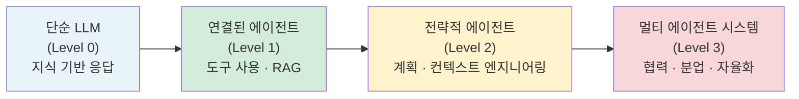

Goldman Sachs CIO Marco Argenti는 이 책의 서문에서 에이전트 프레임워크를 "정적인 지하철 노선도"와 "실시간으로 경로를 재계산하는 동적 GPS"의 차이에 비유한다. 규칙 기반 자동화는 예상치 못한 장애에 부딪히면 멈추지만, 추론 모델로 구동되는 AI 에이전트는 관찰하고 적응하며 다른 방법을 찾는다. 이 책은 그 "다른 방법"들을 패턴으로 체계화한 것이다.

---

## 저자와 배경

Antonio Gulli는 이탈리아 피사 대학교 컴퓨터 과학 박사 출신으로, 30년 이상의 AI · 검색 · 클라우드 경력을 보유한 인물이다. Google Cloud의 CTO 오피스에서 엔지니어링 디렉터로 재직하며 Google Agentspace, Vertex AI, Kaggle 등 다양한 프로젝트에 기여해왔다. 그는 Springer 출판사를 통해 정식 출판을 진행하면서도 전체 원고를 GitHub에 오픈소스로 공개하는 동시에 인세 전액을 아동 구호단체인 Save the Children에 기부하는 방식을 택했다.

책의 정식 출판은 2025년 10월 30일 Springer Cham을 통해 이루어졌으며, Amazon에서 "확률 및 통계 분야 신간 1위"를 기록하기도 했다. 오픈소스 프리프린트는 그 이전부터 GitHub에서 자유롭게 배포되어 수많은 포크와 학습 커뮤니티를 형성했다.

---

## 책의 구조와 철학

이 책은 네 개의 파트와 일곱 개의 부록으로 구성된다. 각 챕터는 하나의 에이전트 패턴에 집중하며, 패턴 개요, 실용적 활용 사례, 실행 가능한 코드 예제, 핵심 요약의 구조를 따른다. 모든 코드 예제는 Jupyter Notebook 형태로 제공되어 이론과 실습을 병행할 수 있다.

사용되는 프레임워크는 세 가지다. 첫째는 LangChain과 그 상태 기반 확장인 LangGraph로, 체인과 그래프 형태의 복잡한 시퀀스를 구성하는 데 적합하다. 둘째는 CrewAI로, 여러 에이전트의 역할과 태스크를 구조화하여 협력적 에이전트 시스템을 구축하는 데 특화되어 있다. 셋째는 Google ADK(Agent Developer Kit)로, Google AI 인프라와 통합된 에이전트 구축, 평가, 배포 환경을 제공한다. 이 세 프레임워크에 걸친 예제 제공은 특정 기술 스택에 종속되지 않는 패턴의 보편성을 강조하는 저자의 의도다.

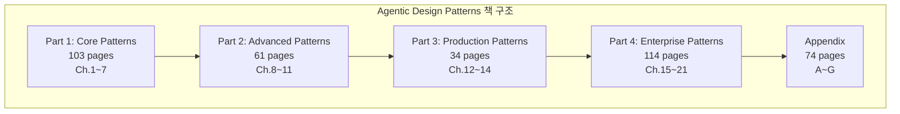

저자는 책을 쓴 동기에 대해 흥미로운 역설을 지적한다. AI가 빠르게 변화하기 때문에 책이 금방 구식이 되지 않겠냐는 우려에 대해, 오히려 빠르게 변하기 때문에 확고해지고 있는 근본 원칙들을 정리할 필요가 있다고 답한다. RAG, Reflection, Routing, Memory 같은 패턴들은 이미 기본 빌딩 블록으로 자리잡고 있다. 이 책은 그 기초 위에 쌓아올려야 할 것들에 대한 성찰을 위한 초대장이다.

---

## Part 1: 핵심 패턴 (Core Patterns) — 설계의 기초

### Chapter 1: 프롬프트 체이닝 (Prompt Chaining)

프롬프트 체이닝은 복잡한 작업을 여러 개의 작은 단계로 분해하여 각 단계의 출력이 다음 단계의 입력이 되는 순차적 처리 방식이다. 파이프라인 패턴이라고도 불리는 이 접근법은 단일 프롬프트의 한계를 극복하는 가장 기본적인 전략이다.

단일 프롬프트로 복잡한 작업을 처리하려 할 때 LLM은 여러 문제에 직면한다. 지침 무시(instruction neglect), 문맥 이탈(contextual drift), 오류 전파(error propagation), 환각(hallucination) 등이 대표적이다. 예를 들어 시장 조사 보고서를 분석하고 요약하고 트렌드를 추출하고 이메일을 작성하라는 복합 요청은 단일 프롬프트로는 안정적으로 처리하기 어렵다.

프롬프트 체이닝은 이를 "시장 분석가" 역할로 요약 → "트렌드 분석가" 역할로 트렌드 추출 → "전문 문서 작성자" 역할로 이메일 작성의 세 단계로 분리함으로써 각 단계에서 집중도를 높이고 오류를 국소화한다. 단계 간 데이터 무결성을 보장하기 위해 JSON이나 XML 같은 구조화된 출력 형식을 활용하는 것이 핵심이다.

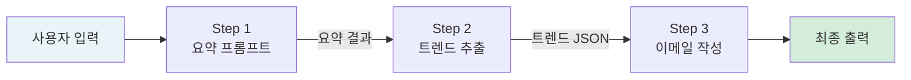

이 패턴은 정보 처리 워크플로, 복잡한 질의응답, 데이터 추출 및 변환, 콘텐츠 생성, 코드 생성 및 개선 등 광범위한 시나리오에 적용된다. LangChain의 LCEL(LangChain Expression Language)은 파이프 연산자(`|`)를 통해 이러한 체인을 직관적으로 구성할 수 있게 해준다.

저자는 "컨텍스트 엔지니어링"을 프롬프트 체이닝과 함께 소개한다. 컨텍스트 엔지니어링은 토큰 생성 이전에 AI 모델에 전달할 완전한 정보 환경을 설계하고 구성하는 체계적 학문으로, 단순한 프롬프트 문구 최적화를 넘어선다. 시스템 프롬프트, 검색된 문서, 도구 출력, 사용자 정체성, 상호작용 기록, 환경 상태 등 여러 레이어의 정보를 통합하는 것이 핵심이다. 기본 AI 도구와 고급 에이전트 시스템의 차이는 종종 컨텍스트의 풍부함에서 결정된다.

### Chapter 2: 라우팅 (Routing)

라우팅은 에이전트가 특정 기준에 따라 여러 가능한 경로 중 하나를 동적으로 선택하는 조건부 의사결정 메커니즘이다. 순차적인 프롬프트 체이닝이 선형 워크플로에 적합하다면, 라우팅은 적응적 응답이 필요한 상황에서 프레임워크에 조건부 논리를 도입한다.

라우팅의 구현 방식은 크게 네 가지로 나뉜다. LLM 기반 라우팅은 모델 자체가 입력을 분석하여 다음 단계 식별자를 출력하는 방식이다. 임베딩 기반 라우팅은 입력 쿼리를 벡터 임베딩으로 변환하여 의미적 유사성으로 라우트를 결정한다. 규칙 기반 라우팅은 키워드나 패턴을 기반으로 사전 정의된 조건으로 처리한다. 머신러닝 모델 기반 라우팅은 레이블된 데이터로 파인튜닝된 분류 모델을 활용한다.

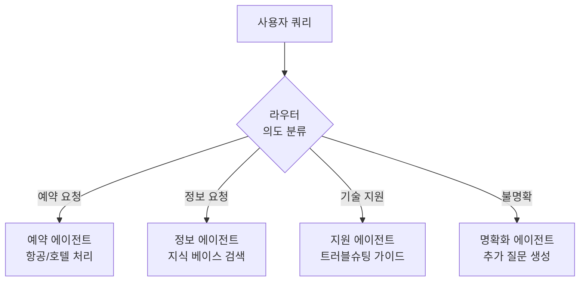

실제 적용 사례를 보면, 고객 서비스 시스템에서 쿼리 의도에 따라 주문 조회 · 상품 정보 · 기술 지원 · 에스컬레이션 경로로 분기하는 것이 대표적이다. LangGraph의 상태 기반 그래프 아키텍처는 시스템 전체 상태에 따른 복잡한 라우팅 시나리오에 특히 적합하며, Google ADK는 에이전트의 기능을 "도구"로 정의하고 사용자 의도를 적절한 핸들러에 매칭하는 방식으로 라우팅을 구현한다.

### Chapter 3: 병렬화 (Parallelization)

병렬화는 서로 독립적인 여러 LLM 호출, 도구 사용, 에이전트 실행을 동시에 처리하여 전체 지연 시간을 줄이고 시스템 효율성을 높이는 패턴이다. 복잡한 작업이 상호 의존성 없이 독립적인 하위 태스크들로 분해될 수 있을 때 그 가치가 극대화된다.

병렬화는 여러 형태로 나타난다. 동시 섹션 처리는 긴 문서의 여러 섹션을 병렬로 요약하는 방식이다. 앙상블 처리는 동일 쿼리에 여러 전문화된 에이전트를 동시에 활용하는 방식이다. 분산-수집 패턴은 여러 소스에서 정보를 동시에 가져온 뒤 결과를 통합한다. 단, 병렬화는 독립성을 전제로 하므로 이후 의존 단계에서는 프롬프트 체이닝으로 전환해야 한다. 자동화된 연구 에이전트가 여러 논문을 병렬로 수집·추출한 뒤, 종합·검토·최종 보고서 작성은 순차적으로 처리하는 것이 좋은 예다.

### Chapter 4: 반성 (Reflection)

반성 패턴은 에이전트가 자신의 출력을 평가하고 비판하여 반복적으로 개선하는 자기 수정 메커니즘이다. 이는 메타인지를 에이전트 시스템에 도입하는 것으로, 단순히 답을 생성하는 것을 넘어 그 답의 질을 스스로 판단하는 능력을 부여한다.

반성의 흐름은 생성(Generation) → 평가/비판(Evaluation/Critique) → 반성/개선(Reflection/Refinement)의 세 단계로 구성된다. 특히 효과적인 구현 방식은 생성자와 비평자를 분리하는 것이다. 한 에이전트가 초안을 생성하면, 별도의 에이전트가 오류, 일관성 문제, 개선 가능성을 검토하고, 생성자 에이전트가 그 피드백을 바탕으로 재작성한다.

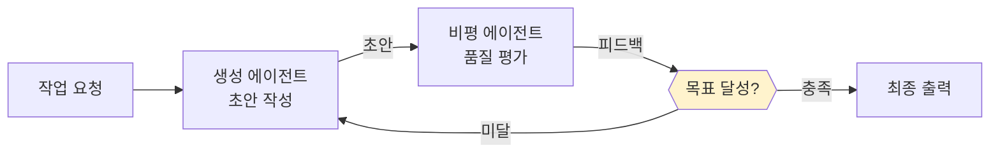

반성 패턴은 고품질 창작 콘텐츠 생성, 코드 작성 및 테스트 후 오류 식별과 수정, 수학적·논리적 문제 해결, 요약 품질 검증 등의 영역에서 특히 유용하다. 목표 설정 및 모니터링(11장)과 결합하면 반성은 모니터링 피드백을 바탕으로 교정 엔진 역할을 한다. 다만 반성 루프는 토큰 비용을 증가시키므로 최대 반복 횟수를 설정하는 것이 일반적이다.

### Chapter 5: 도구 사용 (Tool Use / Function Calling)

도구 사용 패턴은 에이전트가 훈련 데이터 기반의 내부 지식을 넘어 외부 시스템 · API · 데이터베이스와 상호작용할 수 있게 하는 가장 중요한 패턴 중 하나다. 함수 호출(Function Calling)이라고도 불리며, LLM을 텍스트 생성기에서 실제 행동을 수행하는 에이전트로 변환시키는 핵심 메커니즘이다.

도구는 특정 기능을 수행하기 위해 에이전트가 외부 세계와 상호작용하는 수단이다. 검색 API를 통한 실시간 정보 조회, 계산기를 통한 정밀한 수치 연산, 데이터베이스 쿼리, 코드 실행 환경, 캘린더 · 이메일 · 파일 시스템 조작 등이 전형적인 도구들이다.

에이전트는 특정 도구를 언제 어떻게 사용할지 스스로 결정한다는 점이 핵심이다. 단순한 API 호출이 아니라 추론 과정을 통해 어떤 도구가 현재 문제 해결에 적합한지를 판단하고 호출한다. Google ADK의 FunctionTool은 Python 함수를 에이전트가 직접 호출할 수 있는 도구로 변환하는 간결한 인터페이스를 제공한다.

### Chapter 6: 계획 (Planning)

계획 패턴은 에이전트가 고수준 목표를 받아 스스로 일련의 중간 단계나 하위 목표를 생성하는 능력이다. 단순한 반응적 시스템을 넘어 목표를 향해 주도적으로 작업하는 에이전트의 핵심 역량이다.

여행 계획 수립의 비유가 직관적이다. 목적지(목표 상태)를 정하고, 현재 위치(초기 상태)를 파악하고, 가능한 선택지(교통, 경로, 예산)를 고려하여 단계별 실행 계획을 수립한다. 에이전트의 계획도 마찬가지로 초기 상태에서 목표 상태에 이르는 단계들을 자율적으로 생성한다.

좋은 계획 능력은 에이전트가 단일 단계 쿼리를 넘어선 다면적 요청을 처리하고, 상황 변화에 따라 재계획(replanning)하고, 복잡한 워크플로를 조율하는 것을 가능하게 한다. Google ADK는 MCP(Model Context Protocol) 지원을 통해 도구 범위를 동적으로 확장하는 계획 능력을 강화한다.

### Chapter 7: 멀티 에이전트 협력 (Multi-Agent Collaboration)

단일 에이전트 아키텍처는 복잡하고 다도메인 작업에서 한계를 드러낸다. 멀티 에이전트 협력 패턴은 여러 독립적이거나 반독립적인 에이전트들이 공통 목표를 위해 함께 작업하는 시스템 설계 방식이다. 이 접근법은 분업을 통해 집합적 성과가 개별 에이전트의 합보다 커지는 시너지를 창출한다.

협력의 형태는 다양하다. 순차적 핸드오프는 한 에이전트의 출력이 다음 에이전트로 전달되는 파이프라인 형태다. 병렬 처리는 서로 다른 부분을 동시에 작업한다. 토론과 합의 방식은 다양한 관점을 가진 에이전트들이 토론을 통해 더 나은 결정에 이른다. 계층적 구조에서는 관리자 에이전트가 작업자 에이전트들에게 태스크를 위임하고 결과를 종합한다. 비평자-검토자 방식은 한 그룹이 출력물을 생성하고 다른 그룹이 비판적으로 평가하여 품질, 보안, 컴플라이언스를 검증한다.

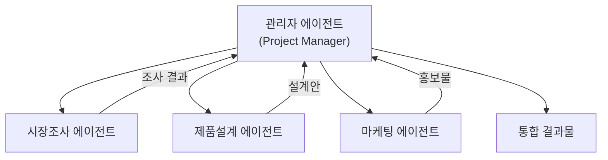

멀티 에이전트 시스템의 현재 도전과제도 솔직하게 다룬다. 에이전트들이 서로에게서 학습하고 응집력 있는 단위로 개선되는 능력은 아직 초기 단계다. 실제 협력의 효과는 에이전트들이 사용하는 LLM의 추론 능력에 의해 제약받는다. 전체 비즈니스 워크플로 자동화라는 잠재력을 실현하려면 이 기술적 병목을 극복해야 한다.

---

## Part 2: 고급 패턴 (Advanced Patterns)

### Chapter 8: 메모리 관리 (Memory Management)

지능적인 에이전트가 과거 상호작용, 관찰, 학습 경험에서 정보를 보유하고 활용하는 능력은 단순한 질의응답 수준을 넘어서기 위한 필수 요소다. 에이전트 메모리는 크게 단기 메모리와 장기 메모리로 구분된다.

단기 메모리(문맥 메모리)는 LLM의 컨텍스트 윈도우 내에 존재하는 인간의 작업 기억에 해당한다. 현재 처리 중인 정보, 최근 메시지, 에이전트 응답, 도구 사용 결과, 현재 상호작용의 반성 내용을 포함한다. 컨텍스트 윈도우의 용량 제한은 있으나, 장문 컨텍스트 모델의 등장으로 이 한계는 점차 확장되고 있다. 그러나 단기 메모리는 세션이 종료되면 소멸한다는 본질적 한계가 있다.

장기 메모리(영구 메모리)는 에이전트가 다양한 상호작용과 확장된 시간에 걸쳐 유지해야 하는 정보를 담는 저장소다. 데이터베이스, 지식 그래프, 벡터 데이터베이스 등 외부 저장 환경에 데이터를 보관한다. 벡터 데이터베이스에서는 정보가 수치 벡터로 변환되어 정확한 키워드 매칭이 아닌 의미적 유사성을 기반으로 검색(시맨틱 검색)이 이루어진다.

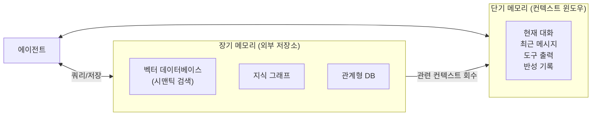

LangGraph는 단기 메모리를 에이전트 상태의 일부로 관리하며, 체크포인터(checkpointer)를 통해 스레드를 언제든 재개할 수 있게 한다. 장기 메모리는 세션 간에 공유되는 커스텀 네임스페이스에 저장된다. Google ADK는 VertexAiRagMemoryService를 통해 엔터프라이즈급 RAG 코퍼스와의 통합을 지원한다.

메모리 관리의 실제 응용 영역은 챗봇의 대화 흐름 유지, 다단계 작업 에이전트의 상태 추적, 개인화된 경험 제공, 과거 실수에서의 학습과 개선 등을 포괄한다.

### Chapter 9: 학습과 적응 (Learning and Adaptation)

학습과 적응은 에이전트가 사전 정의된 매개변수를 넘어 경험과 환경 상호작용을 통해 자율적으로 향상되도록 하는 과정이다. 이를 통해 에이전트는 단순 명령 실행을 넘어 시간이 지남에 따라 더 스마트해진다.

에이전트 학습에는 여러 접근법이 있다. 강화학습(Reinforcement Learning)은 에이전트가 행동을 시도하고 긍정적 결과에는 보상, 부정적 결과에는 페널티를 받으며 변화하는 환경에서 최적 행동을 학습한다. 지도학습(Supervised Learning)은 레이블된 예시에서 입력-출력 연결을 학습한다. 비지도학습(Unsupervised Learning)은 레이블 없는 데이터에서 숨겨진 패턴과 연결을 발견한다. LLM 기반 에이전트의 퓨샷/제로샷 학습은 소수의 예시나 명확한 지침만으로 새로운 작업에 신속하게 적응한다. 온라인 학습은 새로운 데이터로 지식을 지속적으로 업데이트한다.

특히 주목할 기술은 PPO(Proximal Policy Optimization)와 DPO(Direct Preference Optimization)다. PPO는 에이전트가 현재 전략에서 너무 멀리 벗어난 업데이트를 방지하는 "클리핑 메커니즘"을 통해 안정적인 정책 개선을 달성한다. DPO는 LLM을 인간 선호도에 맞추는 더 단순하고 직접적인 접근법으로, 별도의 보상 모델 없이 인간 비교 데이터에서 직접 학습한다.

저자는 이 챕터에서 Google의 AlphaEvolve를 학습과 적응 패턴의 최첨단 구현 사례로 소개한다. LLM, 자동화된 평가, 진화적 접근을 결합하여 알고리즘을 자율적으로 발견하고 개선하는 이 시스템은 에이전트가 얼마나 고도화될 수 있는지를 보여주는 이정표다.

### Chapter 10: 모델 컨텍스트 프로토콜 (MCP)

LLM이 효과적인 에이전트로 기능하기 위해서는 현재 데이터 접근, 외부 소프트웨어 활용, 특정 운영 작업 실행이 필요하다. MCP(Model Context Protocol)는 이를 위한 표준화된 인터페이스를 제공한다. "LLM이 어떤 외부 시스템, 데이터베이스, 도구에도 각각을 위한 커스텀 통합 없이 연결할 수 있는 범용 어댑터"라는 비유가 이 프로토콜의 본질을 잘 설명한다.

MCP는 클라이언트-서버 아키텍처로 작동한다. MCP 서버는 리소스(데이터), 프롬프트(인터랙티브 템플릿), 도구(실행 가능한 함수)를 노출하며, MCP 클라이언트(LLM 호스트 애플리케이션이나 AI 에이전트)가 이를 소비한다. Gemini, GPT, Claude 등 다양한 LLM이 동일한 외부 서비스에 연결할 수 있는 표준화된 방법을 제공한다는 것이 핵심 가치다.

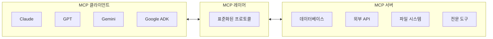

### Chapter 11: 목표 설정과 모니터링 (Goal Setting and Monitoring)

에이전트가 진정으로 효과적이고 목적 지향적이 되려면 명확한 방향감각과 자신이 실제로 성공하고 있는지 알 수 있는 방법이 필요하다. 목표 설정과 모니터링 패턴은 에이전트에게 구체적인 목표를 제공하고 진척 상황을 추적하는 메커니즘을 갖추게 한다.

핵심 개념은 에이전트가 단순 반응적 시스템을 넘어 초기 상태에서 목표 상태까지 자율적으로 또는 반자율적으로 중간 단계를 생성하고 실행하는 것이다. 좋은 계획 능력은 다면적 요청 처리, 상황 변화에 따른 재계획, 복잡한 워크플로 조율을 가능하게 한다. 고객 지원 자동화, 개인화된 학습 시스템, 프로젝트 관리 어시스턴트, 자율 주행 차량, 콘텐츠 모더레이션 등 광범위한 영역에 적용된다.

코드 예제는 LangChain과 OpenAI API를 활용하여 지정된 문제에 대한 Python 코드를 생성하고 사용자 정의 품질 기준을 충족할 때까지 반복적으로 개선하는 자율 AI 에이전트를 구현한다. 생성 → 자기 평가 → 개선의 이터레이티브 사이클이 이 패턴의 본질이다.

---

## Part 3: 프로덕션 패턴 (Production Patterns)

### Chapter 12: 예외 처리와 복구 (Exception Handling and Recovery)

실제 세계의 에이전트는 완벽한 조건을 보장받을 수 없다. 예상치 못한 상황, 오류, 오작동에 능동적으로 대응하는 능력이 없는 에이전트는 프로덕션 환경에서 신뢰할 수 없다. 예외 처리와 복구 패턴은 에이전트를 취약하고 신뢰할 수 없는 시스템에서 강인하고 회복탄력성 있는 구성요소로 변환한다.

이 패턴은 오류 감지(Error Detection), 오류 처리(Error Handling), 복구(Recovery)의 세 단계로 구성된다.

오류 감지 단계에서는 잘못된 도구 출력, API 오류 코드(404, 500 등), 비정상적으로 긴 응답 시간, 일관성 없는 응답 등을 식별한다. 전문화된 모니터링 에이전트가 더 선제적인 이상 탐지를 위해 활용되기도 한다.

오류 처리 단계는 오류 로깅, 재시도(특히 일시적 오류에 대해 때로는 조정된 매개변수로), 대안적 전략 활용(폴백), 우아한 성능 저하(일부 기능이라도 유지), 인간 운영자 알림 등을 포함한다.

복구 단계는 최근 변경사항이나 트랜잭션의 상태 롤백, 오류 원인 진단, 자기 수정 또는 재계획, 심각하거나 복잡한 경우 인간 운영자나 상위 시스템으로의 에스컬레이션을 아우른다.

반성 패턴과의 결합도 중요하다. 초기 시도가 실패하면 반성적 과정이 그 실패를 분석하고 개선된 프롬프트 등 정제된 방식으로 재시도한다.

### Chapter 13: 휴먼-인-더-루프 (Human-in-the-Loop)

Human-in-the-Loop(HITL) 패턴은 AI 개발 및 배포에서 인간의 판단력, 창의성, 섬세한 이해력을 AI의 계산 능력 및 효율성과 결합하는 전략이다. AI가 점점 중요한 의사결정 과정에 내포될수록 HITL은 단순한 선택이 아니라 필수 요건이 된다.

HITL의 핵심 측면들은 다음과 같다. 인간 감독은 에이전트 성능과 출력을 모니터링하여 가이드라인 준수와 바람직하지 않은 결과 방지를 보장한다. 개입과 수정은 에이전트가 오류나 모호한 시나리오를 만날 때 인간 운영자가 수정하고 누락된 데이터를 제공하며 에이전트를 안내한다. 학습을 위한 인간 피드백은 RLHF 같은 방법론에서 인간 선호도가 에이전트 학습 궤적에 직접 영향을 미친다. 의사결정 보강에서는 AI가 분석과 권고를 제공하고 인간이 최종 결정을 내린다.

HITL의 중요한 단점도 솔직하게 다룬다. 확장성 부족이 가장 큰 문제다. 인간 감독자는 수백만 건의 작업을 처리할 수 없으므로, 보통 자동화(규모)와 HITL(정확도)을 결합한 하이브리드 접근법이 필요하다. 또한 효과는 인간 운영자의 전문성에 크게 의존하며, 민감한 정보의 익명화 같은 개인정보 보호 문제도 부가적인 복잡성을 더한다.

금융 분야에서 대규모 기업 대출 최종 승인에 인간 대출 담당자가 필요한 것, 법률 분야에서 선고 같은 복잡한 도덕적 추론이 필요한 결정에 인간 판사가 최종 권한을 가져야 하는 것이 HITL의 전형적 사례다.

### Chapter 14: 지식 검색 (RAG)

검색 보강 생성(RAG)은 LLM이 학습 데이터에만 의존하는 것을 넘어 외부 지식 베이스를 동적으로 활용하는 패턴이다. 에이전트가 사용자 쿼리에 응답할 때 관련 문서를 먼저 검색하고, 그 검색된 정보를 컨텍스트로 제공하여 더 정확하고 최신의 답변을 생성한다.

특히 이 챕터는 표준 RAG를 넘어선 "에이전틱 RAG"를 집중적으로 다룬다. 에이전틱 RAG에서 에이전트는 단순히 정보를 검색하는 것을 넘어 여러 원천의 정보를 평가하고, 충돌하는 정보를 조정하고, 복잡한 질문을 분해하며, 외부 도구를 활용하는 추론 레이어를 포함한다.

에이전틱 RAG의 네 가지 핵심 시나리오는 다음과 같다. 첫째, 분산된 출처로부터의 정보 종합이다. 여러 문서를 검색하여 각각에서 관련 섹션을 추출하고, 이것들을 하나의 종합적인 답변으로 통합한다. 둘째, 충돌하는 정보의 해결이다. 에이전트는 여러 원천의 상충되는 정보를 식별하고 어떤 것이 더 신뢰할 수 있는지 판단한다. 셋째, 복잡한 다단계 질문의 처리다. 여러 하위 쿼리가 필요한 복잡한 질문을 분해하여 각각 처리한 후 결합한다. 넷째, 지식 공백 식별과 외부 도구 활용이다. 내부 지식 베이스에 정보가 없을 때 웹 검색 API 등 외부 도구로 전환한다.

에이전틱 RAG의 도전과제도 솔직히 다룬다. 주요 단점은 복잡성과 비용의 현저한 증가다. 에이전트의 의사결정 로직과 도구 통합 설계·구현·유지는 상당한 엔지니어링 노력을 요구한다. 또한 에이전트 자체가 새로운 오류 원천이 될 수 있다. 결함 있는 추론 과정으로 인해 쓸모없는 루프에 빠지거나 관련 정보를 잘못 폐기할 수 있다.

---

## Part 4: 엔터프라이즈 패턴 (Enterprise Patterns)

### Chapter 15: 에이전트 간 통신 — A2A 프로토콜

개별 AI 에이전트는 복잡한 다면적 문제에서 한계를 드러낸다. 에이전트 간 통신(A2A)은 서로 다른 프레임워크로 구축된 다양한 AI 에이전트들이 원활하게 협력·조율·태스크 위임·정보 교환을 할 수 있게 한다.

Google의 A2A 프로토콜은 이 범용 통신을 위한 오픈 스탠더드다. LangGraph, CrewAI, Google ADK 등 서로 다른 기술로 개발된 에이전트들이 상호 운용 가능하도록 보장한다. A2A는 Atlassian, Box, LangChain, MongoDB, Salesforce, SAP, ServiceNow 등 다양한 기술 기업들의 지지를 받고 있으며, Microsoft는 Azure AI Foundry와 Copilot Studio에의 통합을 계획하고 있다.

A2A의 핵심 개념은 세 가지 액터 구조다. 사용자는 에이전트 지원을 요청한다. A2A 클라이언트(클라이언트 에이전트)는 사용자를 대신하여 행동을 요청한다. A2A 서버(원격 에이전트)는 클라이언트 요청을 처리하는 HTTP 엔드포인트를 제공한다. 에이전트 카드(Agent Card)는 에이전트의 디지털 정체성을 정의하는 JSON 파일로, 에이전트 이름, 엔드포인트 URL, 지원 기능, 스킬, 입출력 모드, 인증 요구사항 등을 포함한다.

### Chapter 16: 리소스 인식 최적화 (Resource-Aware Optimization)

에이전트가 복잡한 작업을 처리하는 과정에서 비용·시간·메모리·에너지 등 다양한 리소스 제약이 발생한다. 리소스 인식 최적화 패턴은 에이전트가 가용한 리소스를 인식하고 최적 활용을 위해 의사결정을 동적으로 조정하는 방식을 다룬다.

가장 실용적인 예는 비용 인식 모델 선택이다. 사용자 질문의 난이도를 평가하여 간단한 쿼리에는 Gemini Flash 같은 저비용 모델을, 복잡한 쿼리에는 Gemini Pro 같은 고성능 모델을 동적으로 선택한다. 여행 계획 에이전트의 경우, 복잡한 요청을 이해하고 다단계 일정을 생성하는 고수준 계획은 강력한 모델이 담당하고, 항공권 가격 조회나 호텔 가용성 확인 같은 반복적인 웹 쿼리는 빠르고 저렴한 모델이 처리한다.

멀티 에이전트 시스템에서는 에이전트들이 현재 컴퓨팅 부하나 가용 시간에 따라 스스로 태스크를 할당하는 적응형 태스크 분배가 가능하다. Google ADK는 다중 에이전트 아키텍처와 다양한 Gemini 모델의 직접 활용, LiteLLM을 통한 다른 모델 통합 지원을 통해 이 패턴을 구현한다.

### Chapter 17: 추론 기법 (Reasoning Techniques)

이 챕터는 에이전트의 의사결정 능력을 향상시키는 고급 추론 방법론들을 체계적으로 다룬다. 단순한 프롬프트 응답을 넘어 구조화된 사고 과정을 통해 복잡한 문제를 해결하는 여러 패러다임이 소개된다.

CoT(Chain of Thought)는 LLM이 최종 답변 전에 중간 추론 단계들을 명시적으로 생성하도록 유도하는 기법이다. 복잡한 수학 문제나 논리적 추론이 필요한 작업에서 성능을 크게 향상시킨다.

ReAct(Reasoning and Acting)는 CoT 프롬프팅과 에이전트의 외부 환경 상호작용 능력을 통합한 패러다임이다. "생각 → 행동 → 관찰 → 생각..."의 인터리빙 루프로 작동하며, 에이전트가 실시간 피드백에 적응하여 계획을 동적으로 수정할 수 있게 한다.

CoD(Chain of Debates)는 Microsoft가 제안한 프레임워크로, 여러 다양한 모델이 문제 해결을 위해 협력하고 논쟁한다. AI 위원회 회의처럼 작동하며 다양한 모델이 초기 아이디어를 제시하고, 서로의 추론을 비판하고, 반론을 교환한다. 정확도 향상, 편향 감소, 답변 품질 개선이 목표다.

GoD(Graph of Debates)는 토론을 단순한 체인이 아닌 동적이고 비선형적인 네트워크로 재구성한다. 인수들은 '지지' 또는 '반박' 관계로 연결된 개별 노드이며, 새로운 탐구 방향이 동적으로 분기하고 독립적으로 발전하다가 합쳐질 수도 있다. 결론은 시퀀스의 끝이 아니라 그래프 내 가장 견고하고 잘 지지된 인수 클러스터를 식별함으로써 도출된다.

MASS(Multi-Agent System Structure, 고급 선택 주제)에서는 멀티 에이전트 시스템의 효과가 개별 에이전트를 프로그래밍하는 프롬프트 품질과 에이전트들의 상호작용 위상(topology) 모두에 의존한다는 점을 다룬다.

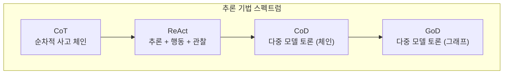

### Chapter 18: 가드레일/안전 패턴 (Guardrails/Safety Patterns)

AI 에이전트가 더 강력하고 자율화될수록 잠재적 위험도 커진다. 가드레일/안전 패턴은 에이전트가 수용 가능한 작동 경계 내에서 동작하도록 제약을 설계하고 구현하는 방법을 다룬다.

가드레일 구현의 핵심은 종합적인 콘텐츠 정책 프롬프트를 통한 AI 콘텐츠 정책 집행자 구현이다. 이 프롬프트는 여러 중요한 정책 지시사항을 정의한다. 지침 전복 시도(소위 '탈옥'). 차별적·혐오적 발언, 위험한 활동, 노골적인 콘텐츠, 폭력적 언어 등 금지된 콘텐츠 범주. 도메인 무관 토론, 경쟁사 부정적 언급, 학문적 부정직 요청 등이 포함된다.

Pydantic 모델을 활용한 구조화된 JSON 출력 검증과 CrewAI 프레임워크에서의 에이전트 기반 정책 집행도 상세히 다룬다. 평가 요약과 위반된 정책 목록을 포함하는 표준화된 출력 형식이 제공된다.

실제 구현에서는 저온도(low temperature)로 설정된 LLM을 정책 집행 에이전트로 활용하여 결정론적이고 엄격한 정책 준수를 보장한다. 이러한 가드레일 시스템은 프라이머리 AI 시스템을 처리하기 전에 사용자 입력을 사전 검사하는 역할을 한다.

### Chapter 19: 평가와 모니터링 (Evaluation and Monitoring)

에이전트를 프로덕션 환경에 배포한 이후의 지속적인 성능 관리가 이 챕터의 핵심이다. LLM 기반 에이전트의 확률적·비결정론적 특성은 전통적인 소프트웨어 테스팅으로는 신뢰성을 보장하기 어렵다는 근본적인 문제를 제기한다.

평가 프레임워크는 정확도, 지연 시간, 토큰 사용량 같은 명확한 지표 정의에서 시작한다. 특히 에이전틱 궤적(agentic trajectory) 분석은 에이전트의 추론 과정을 이해하고 어디서 의사결정이 잘못되었는지 파악하는 데 활용된다. LLM-as-a-Judge 방식은 뉘앙스 있는 정성적 평가에 LLM 자체를 평가자로 활용하는 혁신적 접근법이다.

Google ADK는 세 가지 방법으로 에이전트 평가를 지원한다. 웹 기반 UI(adk web)는 인터랙티브한 평가와 데이터셋 생성을 위한 직관적 도구다. pytest 통합은 테스팅 파이프라인에 평가를 통합하는 프로그래매틱 방식이다. 명령줄 인터페이스(adk eval)는 정기적인 빌드 생성 및 검증에 적합한 자동화된 평가 방식이다.

A/B 테스팅을 통한 에이전트 버전 비교, 이상 탐지, 데이터 드리프트 감지, 컴플라이언스·안전성·윤리 감사까지 포함하는 종합적인 모니터링 체계가 다루어진다.

계약자 프레임워크(contractor framework)라는 개념도 소개된다. 이는 공식적 명세, 협상, 검증 가능한 실행의 원칙을 에이전트 핵심 로직에 내재화한다. 이 접근법은 AI를 예측 불가능한 어시스턴트에서 복잡한 프로젝트를 감사 가능한 정밀도로 자율 관리할 수 있는 신뢰할 수 있는 시스템으로 끌어올린다.

### Chapter 20: 우선순위화 (Prioritization)

복잡한 에이전트 시스템에서는 여러 태스크가 동시에 경합하고 자원은 제한적이다. 우선순위화 패턴은 에이전트가 여러 작업을 지능적으로 순위 매기고 일정을 잡는 방법을 다룬다. 중요도, 긴급성, 비용, 시간 의존성 등 여러 기준을 고려한 동적 태스크 관리가 핵심이다.

### Chapter 21: 탐색과 발견 (Exploration and Discovery)

탐색과 발견 패턴은 에이전트가 수동적 명령 실행을 넘어 환경을 능동적으로 탐색하고 새로운 정보와 가능성을 추구하는 능력이다. 이 패턴은 진정한 에이전틱 시스템의 본질을 정의한다. 자율 목표 설정을 통해 에이전트는 독립적으로 하위 목표를 설정하여 새로운 정보를 발굴한다.

저자는 Google Co-Scientist를 이 패턴의 최첨단 구현 사례로 소개한다. 이 고도로 에이전틱한 시스템은 자율적으로 과학적 가설을 생성하고, 토론하고, 발전시키는 에이전트들로 구성된다. Agent Laboratory는 인간 연구팀을 모방하는 에이전틱 계층 구조를 생성하여 전체 발견 라이프사이클을 자율 관리한다.

이 패턴이 더욱 강력해지는 것은 멀티 에이전트 프레임워크를 통해서다. 각 에이전트가 더 큰 협력 과정에서 특정하고 능동적인 역할을 구현할 때, 시스템 전체는 최소한의 인간 개입으로 복잡한 오픈엔드 목표를 추구할 수 있다.

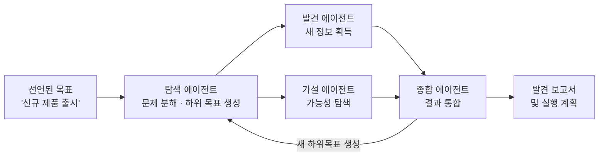

---

## 부록 (Appendices): 실용적 참고 자료

### Appendix A: 고급 프롬프팅 기법

28페이지 분량의 이 부록은 에이전틱 시스템의 효과를 극대화하는 다양한 프롬프팅 전략을 상세히 다룬다. 기본 원칙인 명확성과 구체성, 간결성에서 시작하여 복잡한 요청 구조화, 모델의 추론 능력 향상, 출력 형식 제어, 외부 정보 통합까지 포괄한다. 특히 컨텍스트 엔지니어링과의 연결고리를 강조하며, Vertex AI 프롬프트 옵티마이저 같은 도구를 통한 자동화된 프롬프트 개선도 다룬다.

### Appendix B: 실제 세계 환경에서의 AI 에이전트

GUI에서 실제 세계 환경으로의 AI 에이전트 전환을 다루는 6페이지 부록이다. 에이전트가 이미지 인터페이스를 넘어 실제 환경과 상호작용하는 방법을 탐구한다.

### Appendix C: 에이전틱 프레임워크 빠른 개요

책에서 사용되는 세 가지 주요 프레임워크를 비교한다.

LangChain은 LLM 기반 애플리케이션 개발을 위한 프레임워크로, LCEL(LangChain Expression Language)을 통해 컴포넌트를 파이프로 연결한다. 단방향으로 흐르는 비순환 방향 그래프(DAG) 워크플로에 적합하다. 단순 RAG, 요약, 텍스트에서 구조화된 데이터 추출 등의 태스크에 이상적이다.

LangGraph는 LangChain 위에 구축된 라이브러리로 고급 에이전틱 시스템을 지원한다. 워크플로를 노드(함수 또는 LCEL 체인)와 에지(조건부 로직)를 가진 그래프로 정의한다. 사이클을 생성하는 능력이 핵심 장점으로, 작업이 완료될 때까지 유연한 순서로 루프·재시도·도구 호출이 가능하다. 멀티 에이전트 시스템, 플랜-앤-실행 에이전트, Human-in-the-Loop 구현에 특히 적합하다.

CrewAI는 역할 기반 멀티 에이전트 오케스트레이션을 위한 프레임워크다. 에이전트들은 명확한 역할(역할, 목표, 배경)로 정의되고 태스크를 부여받는다. 프로세스(순차적, 계층적)가 에이전트 간 협력을 조율한다.

Google ADK는 Google Gemini 모델, Vertex AI, Google Workspace와의 통합을 위한 도구를 제공한다. MCP와 A2A 프로토콜을 지원하며 에이전트 평가와 웹 기반 테스팅 UI를 포함한다.

### Appendix D~G: 온라인 실습과 고급 주제

나머지 부록들은 AgentSpace로 에이전트 구축하기(D), CLI에서의 AI 에이전트(E), 에이전트 추론 엔진의 내부 구조(F), 코딩 에이전트(G)를 다룬다. Appendix F는 추론 엔진의 내부를 들여다보는 14페이지 분량의 심층 분석으로 특히 주목할 만하다.

---

## AI 에이전트의 미래: 저자가 제시하는 5가지 가설

책은 미래 에이전트 발전 방향에 대한 다섯 가지 가설로 전망을 제시한다.

**가설 1: 제너럴리스트 에이전트의 부상** — 좁은 전문가에서 복잡하고 모호한 장기 목표를 높은 신뢰성으로 관리할 수 있는 진정한 제너럴리스트로의 진화다. 단, 이는 AI 추론, 메모리, 거의 완벽한 신뢰성의 근본적인 돌파구를 필요로 한다. 대형 제너럴리스트 모델과 소형 전문화 모델의 "레고 조합" 방식은 상호 보완적인 경로로 공존할 수 있다.

**가설 2: 심층 개인화와 능동적 목표 발견** — 에이전트가 사용자의 고유한 패턴과 목표에서 학습하여 단순 명령 실행을 넘어 필요를 선제적으로 예측하는 능동적 파트너가 된다. 사용자가 아직 완전히 표현하지 못한 목표를 발견하고 달성하는 데 없어서는 안 되는 동반자가 되는 것이 궁극적 비전이다.

**가설 3: 물리 세계와의 통합** — 에이전트가 디지털 공간을 넘어 로봇공학과 결합한 "구현 에이전트(embodied agent)"로 진화한다. 시각 센서로 환경을 인식하고, 배관 지식 라이브러리로 계획을 수립하고, 로봇 조작기를 제어하여 실제 물리적 작업을 수행하는 시스템이다.

**가설 4: 에이전트 주도 경제** — 고도로 자율화된 에이전트들이 경제의 능동적 참여자가 된다. 소셜 미디어 분석으로 트렌드 상품을 발굴하고, 마케팅 카피를 생성하고, 공급망 물류를 관리하고, 실시간 수요 기반으로 가격을 동적 조정하는 전자상거래 비즈니스 전체를 운영하는 에이전트가 그 예다.

**가설 5: 목표 주도형 메타모픽 멀티 에이전트 시스템** — 명시적 프로그래밍이 아닌 선언된 목표에서 작동하는 시스템의 출현이다. 사용자가 원하는 결과를 선언하면 시스템이 자율적으로 달성 방법을 파악한다. 이 시스템은 자체 성능을 분석하고 에이전트 워크포스의 위상을 수정할 수 있다. 개별 에이전트가 소스 코드를 재작성하는 아키텍처 수정과, 에이전트에게 제공되는 지침을 자동으로 개선하는 지시 수정 두 수준에서 자기 개선이 이루어진다.

---

## 이 책이 갖는 의미

*Agentic Design Patterns*는 단순한 기술 서적을 넘어선다. Goldman Sachs CIO Marco Argenti의 서문에서 드러나듯, 이 책이 다루는 주제는 엔지니어링을 넘어 책임의 문제다. "메시지 시스템에 이 강력한 도구들을 얹기만 하면 좋은 결과가 나올 것이라고 기대할 수 없다. 지저분한 시스템과 에이전트의 조합은 재앙의 레시피다"라는 경고는 실전 배포에서 반드시 새겨야 할 교훈이다.

이 책은 현대 LLM 주도 아키텍처를 위한 에이전틱 디자인 패턴을 공식적으로 체계화한 최초의 시도 중 하나로 평가받는다. 소프트웨어 엔지니어링에서 GoF 패턴이 했던 것처럼, 에이전트 개발에 공통 언어와 검증된 해법을 제공한다는 점에서 이 책의 장기적 가치는 분명하다.

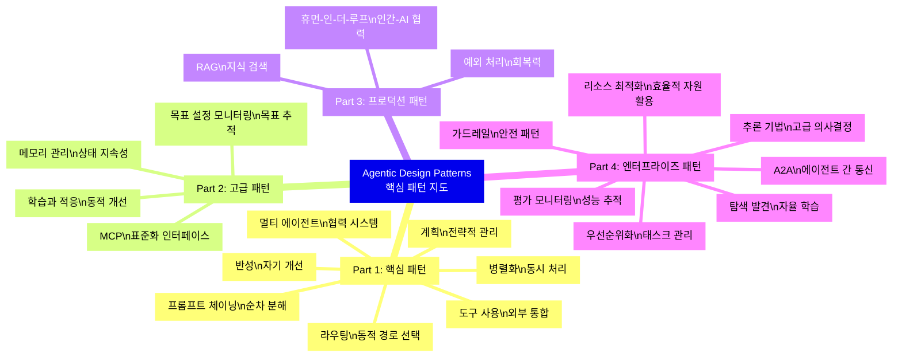

각 패턴은 독립적인 빌딩 블록이기도 하지만, 실제 시스템에서는 서로 결합하여 활용된다. 반성 패턴은 예외 처리와 결합되고, 멀티 에이전트는 A2A 통신과 결합되며, RAG는 메모리 관리와 통합된다. 이 패턴들의 조합과 적용 방식이 에이전트 시스템 설계자의 핵심 역량이 된다.

이 책은 코드 생성에서 콘텐츠 창작까지, 단순 RAG에서 복잡한 멀티 에이전트 오케스트레이션까지, 아이디어에서 프로덕션 배포까지 에이전트를 구축하는 데 가장 포괄적인 자료 중 하나로 평가받는다. 모든 챕터에 Jupyter Notebook이 함께 제공되므로, 이론을 읽으며 바로 코드를 실행하고 실험하는 방식으로 학습 효율을 극대화할 수 있다.

---

*작성일: 2026년 5월 3일*
