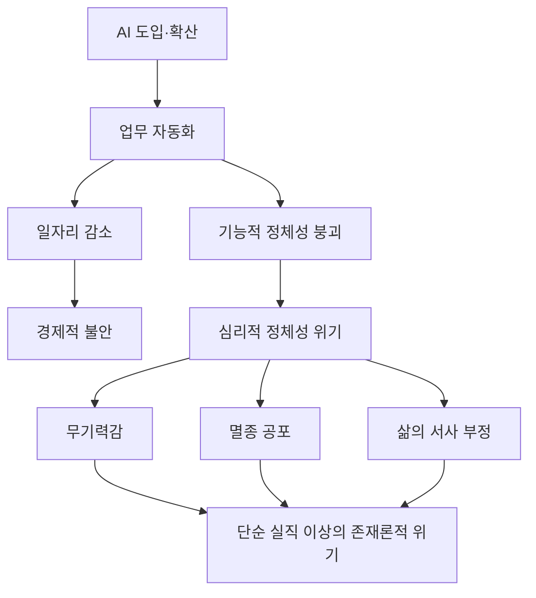
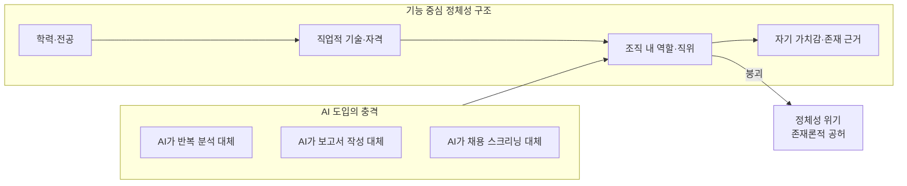
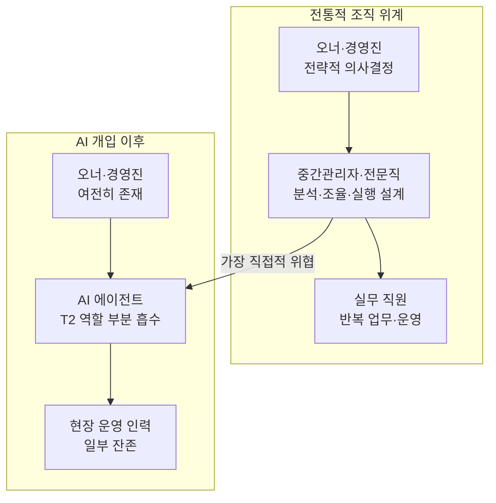
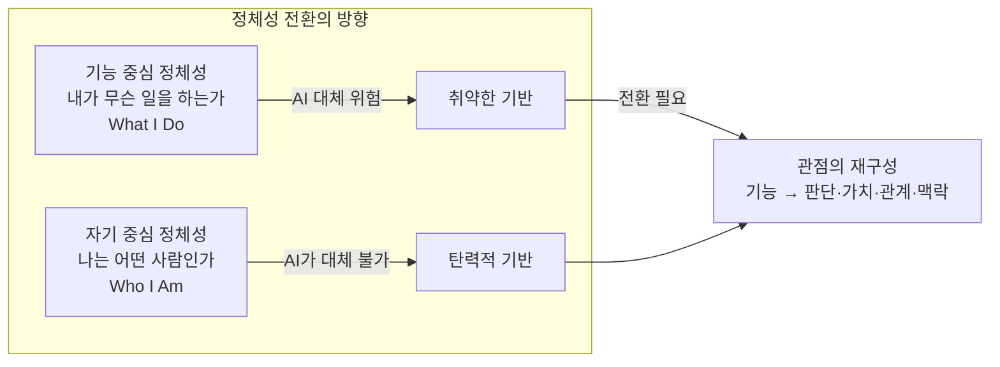
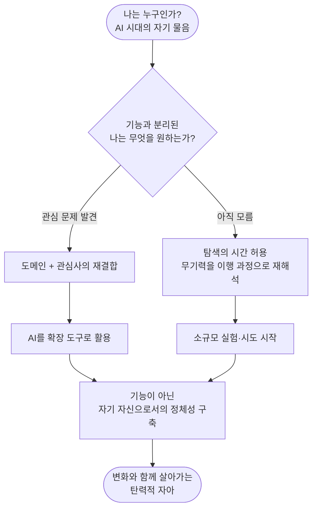

> "단순히 일자리가 없어지는 것 이상으로, 본인의 정체성이 흔들리면서 지금까지 살아온 삶을 부정당하는 느낌. 그게 더 무섭다."  
> — [@jamie_jung_184]( https://www.threads.com/@jamie_jung_184/post/DX1Z_ZoGhmz), Threads

---

## 들어가며: 구조조정 현장에서 들려오는 목소리들

기술 혁명은 언제나 숫자로 이야기되어 왔다. 몇 퍼센트의 일자리가 사라지고, 몇 년 후 노동시장이 어떻게 재편될 것이며, 어떤 직군이 살아남고 어떤 직군이 소멸할 것인지. 하지만 그 숫자들이 실제 사람의 삶 위로 내려앉을 때, 그것은 더 이상 통계가 아니다. 그것은 정체성의 붕괴에 관한 이야기가 된다.

2025년 초, 한 대기업 계열사의 대표 자리에 있는 사람이 겪은 일이 있다. AI에 깊은 관심을 가진 젊은 오너가 직접 AI 도구를 작동시켜보고 난 뒤, 그에게 짧은 한 마디를 던졌다. "인원을 30% 수준으로 줄이세요." 불과 몇 초의 발화로 수십 명, 수백 명의 직업 경로가 결정되어 버린 것이다. 더 충격적인 것은 그 결론에 이르는 과정에서 조직의 대표였던 그 자신이 철저히 배제되었다는 사실이다.

예전의 구조조정은 달랐다. 핵심 인력들이 조직을 진단하고, 데이터를 분석하고, 각 부서의 성과와 기여를 평가하고, 이행 계획을 세우는 데만 몇 달이 걸렸다. 그 과정에서 조직의 대표는 판단의 중심에 있었다. 의사결정의 주체였다. 그런데 이번에는 AI가 그 전 과정을 대체했고, 대표에게 남은 역할은 결론을 이행하는 것뿐이었다. 오른팔, 책사, 선생님 같은 역할이 하루아침에 무의미해진 것이다. 그 선배는 급진적인 변화에 대한 스트레스와 함께 두려움을 느꼈다. 주인이 아닌 자신 또한 언제든 그 30%의 대상이 될 수 있다는 두려움이었다.

이 이야기는 하나의 사례가 아니다. 지금 이 순간, 한국의 수많은 직장에서 비슷한 장면들이 펼쳐지고 있다.

---

## 1. 세 가지 초상화: 무기력의 현장

### 1-1. 보고서를 쓰는 자가 바로 그 보고서의 대상이 될 때

또 다른 사례는 더욱 구조적인 아이러니를 담고 있다. 어느 직장인은 회사로부터 AI 전환에 따른 부문 구조조정 보고서 작성 업무를 맡았다. 분석하고 정리하고 제안하는 일, 바로 그것이 그의 전문성이었고 그의 직업적 존재 이유였다. 그런데 그 분석의 결론은 자신이 속한 부문이 무너져 내린다는 내용이었다. 집도의가 스스로의 장기를 적출하는 수술을 집도하는 것과 같은 상황이다.

이것이 단순한 "몇 명이 잘려 나가는" 이야기가 아닌 이유가 여기에 있다. 그가 느끼는 두려움은 개인 해고가 아니라, 자신과 동일한 교육과 경험, 동일한 사고방식과 직업윤리를 공유한 기능 집단 전체가 사라질 수 있다는 두려움이다. 이것은 멸종(extinction)에 대한 두려움이다. 그 단어는 과장이 아니다. 특정 기능을 수행하도록 수십 년에 걸쳐 형성된 직업적 종(種)이 사라지는 것이기 때문이다.

### 1-2. 400명을 뽑던 HR 담당자가 더 이상 뽑지 않는 세상

세 번째 초상화는 게임 회사의 HR 담당자 이야기다. 그는 매년 400명을 직접 면접하고 채용하는 업무를 해왔다. 사람을 만나고, 평가하고, 가능성을 발굴하는 일이 그의 직업이자 정체성이었다. 그런데 올해 들어 채용이 전면 중단되었다. 업무가 급격히 줄어들었고, 그는 이제 스스로 예감한다. "곧 내 차례가 오겠구나."

이 세 사람의 공통점은 무엇인가. 이들은 무능한 사람들이 아니다. 오히려 각자의 분야에서 연마된 전문성과 경험을 가진 사람들이다. 그러나 AI가 그 전문성의 핵심 부분을 더 빠르고 저렴하게 수행할 수 있게 되면서, 그 전문성이 곧 직업적 정체성이었던 이들은 존재의 근거를 잃어가고 있다.

---

## 2. 왜 이것은 단순한 실직의 문제가 아닌가

인류 역사에서 기술 혁명이 일어날 때마다 일자리는 사라졌다. 방직기가 베틀을 밀어냈고, 자동차가 마차를 대체했고, ATM이 은행원의 수를 줄였다. 하지만 이번 AI 혁명이 이전과 근본적으로 다른 점이 있다.

이전의 기계 혁명은 주로 육체노동, 즉 근육과 반복 동작을 대체했다. 기계는 힘을 가졌지만 생각하지 못했고, 패턴을 인식했지만 판단하지 못했다. 그래서 정신노동, 즉 분석하고 설득하고 판단하고 조율하는 일은 인간의 고유 영역으로 남아 있었다. 그리고 수십 년간 사람들은 그 정신노동으로 이루어진 화이트칼라 직업군이 더 안전하다고 믿어왔다. 교육을 받고, 전문 자격을 취득하고, 경험을 쌓고, 위계 구조 안에서 승진하면 된다고 믿었다.

그 믿음이 지금 흔들리고 있다. 생성형 AI는 보고서를 쓰고, 데이터를 분석하고, 전략적 대안을 도출하고, 법률 문서를 검토하고, 코드를 작성한다. 그것이 인간이 하는 것만큼 완벽하지 않더라도, 비용 대비 효율이라는 기업의 논리 앞에서 충분히 경쟁력이 있다.

여기서 단순한 실직과는 다른 차원의 충격이 발생한다. 직업은 단순히 돈을 버는 수단이 아니다. 직업은 사회 안에서 자신이 어떤 존재인지를 정의하는 핵심적인 정체성 기반이다. 특히 한국 사회에서 직업은 사회적 지위, 인간관계, 자기 가치감과 복잡하게 얽혀 있다. "무슨 일 하세요?"라는 질문에 대한 답변이 그 사람의 존재를 규정한다. 그 답변이 위협받을 때, 단순한 경제적 불안이 아니라 존재론적 위기가 시작된다.

---

## 3. 기능적 정체성의 위기 — 직업으로 살아온 사람들

사회학자들은 직업적 정체성을 크게 두 가지로 구분한다. 하나는 **기능적 정체성(Functional Identity)** 으로, 자신이 수행하는 역할과 기술에 기반한 정체성이다. "나는 회계사다," "나는 마케터다," "나는 변호사다"라고 스스로를 규정하는 방식이다. 다른 하나는 **자기 중심적 정체성(Self-Centered Identity)** 으로, 자신이 어떤 사람인지, 어떤 가치를 추구하고 어떤 방식으로 세상에 기여하는지에 기반한 정체성이다.

한국의 교육 시스템과 조직 문화는 오랫동안 기능적 정체성을 강화하는 방향으로 작동해왔다. 어떤 직업을 갖는가가 어떤 사람이 되는가보다 중요하게 취급되었다. 대학교에서 전공을 선택할 때부터, 취업 준비를 할 때부터, 승진 경로를 설계할 때까지, 모든 것이 기능적 정체성을 중심으로 구축된다.

그 결과, 많은 사람들의 자기 가치감이 직업적 기능과 분리되지 않는 상태로 묶여 있다. "나는 HR 담당자다"라는 정체성을 가진 사람이 HR 기능이 사라지는 현실을 마주했을 때, 그것은 단순히 일자리를 잃는 것이 아니라 자신의 존재를 정의하는 핵심 서사가 붕괴되는 경험이 된다.

이것이 앞서 언급한 세 사람의 이야기가 단순한 직업 불안을 넘어 깊은 무기력감으로 이어지는 이유다. 그들은 자신의 기능이 쓸모없어지는 것을 목격하는 동시에, 그 기능이 곧 자신의 정체성과 동일시되어 있기 때문에, 자신의 존재 전체가 부정당하는 느낌을 받는다.

---

## 4. 세계는 지금 어디에 있는가 — 데이터가 말하는 현실

이런 경험은 개인의 예민함이나 과잉 반응이 아니다. 구조적 변화가 실제로 일어나고 있다는 것은 숫자로도 확인된다.

한국고용정보원의 분석에 따르면, 2025년 기준 국내 직업 종사자의 61.3%가 AI와 로봇으로 대체될 가능성이 높은 직업에 종사하고 있다. 글로벌 차원에서도 마찬가지다. 세계경제포럼(WEF)은 2025년부터 2030년 사이를 "AI와 자동화가 업무 구조를 본격적으로 재편하는 시기"로 규정했다. 이 기간 동안 약 8,300만 개의 기존 일자리가 사라지는 반면 6,900만 개의 새로운 일자리가 생겨날 것으로 전망했다. 숫자만 보면 순감 1,400만 개이지만, 사라지는 일자리와 생겨나는 일자리가 같은 사람들에게 돌아가지 않는다는 점이 문제의 핵심이다.

빅테크 기업들은 이미 대규모 구조조정을 단행하고 있다. 마이크로소프트는 2025년 전 세계 인력의 약 4%인 9,000명을 감원했고, 세일즈포스는 AI가 업무의 50%를 처리할 수 있다고 밝히며 수천 명을 해고했다. 클라르나는 AI 도구 도입으로 직원을 40% 감축했다. 아마존은 장기적으로 60만 개의 일자리를 AI로 대체하는 계획을 세우고 있으며, 별도로 2025년 본사 사무직 3만 명을 추가 감원한다고 발표했다.

특히 주목할 것은 이 구조조정의 성격이다. 이전의 구조조정이 경기 침체나 사업 실패에 따른 고통스러운 불가피성이었다면, 지금의 구조조정은 AI 도입에 따른 의도적인 인력 슬림화다. 기업의 관점에서는 효율화이지만, 노동자의 관점에서는 자신의 가치가 의도적으로 제로(zero)로 재평가되는 경험이다.

흥미롭게도, 포레스터(Forrester)의 보고서에 따르면 AI를 이유로 구조조정을 단행한 기업 중 55%가 그 결정을 후회하고 있으며, 일부는 해고한 인력을 다시 고용하거나 외주 형태로 재활용하고 있다. AI가 기대만큼 생산성을 높이지 못하고, 핵심 인력 손실로 인한 업무 공백이 커졌기 때문이다. 하지만 이미 해고된 사람들의 정체성 상처는 기업의 후회와 무관하게 남는다.

---

## 5. 중간관리자와 전문직의 역설 — 가장 먼저 위협받는 사람들

역설적이게도, AI 혁명에서 가장 직접적인 위협을 받는 직군은 단순 반복 업무를 하는 하위 직군이 아니라 중간관리자와 전문직이다. 이전의 자동화 혁명이 블루칼라를 위협했다면, 생성형 AI의 혁명은 화이트칼라, 그 중에서도 중간층을 정확히 겨냥한다.

그 이유는 명확하다. AI가 특히 능숙한 것이 바로 정보를 취합하고, 패턴을 인식하고, 보고서를 작성하고, 대안을 제시하는 일이기 때문이다. 이것이 정확히 중간관리자와 분석가, 기획자, 컨설턴트들이 해온 일이다. 이들은 조직의 정보를 위아래로 번역하고 중계하는 역할을 해왔는데, 그 번역과 중계의 역할을 AI가 더 빠르고 저렴하게 수행할 수 있게 된 것이다.

마이크로소프트의 AI 책임자 무스타파 술레이만은 "AI가 변호사, 회계사, 마케팅 전문가 등 대부분의 사무직 업무를 완전히 자동화할 것"이라고 밝혔다. 앤트로픽의 CEO 다리오 아모데이도 2025년 5월 미국 정부에 "AI가 향후 5년 내 화이트칼라 직업의 절반을 대체할 수 있다"고 경고한 바 있다.

이 예측이 현실로 구현되는 속도는 전문가마다 다르게 보지만, 방향에 대해서는 이견이 없다. 그리고 그 방향의 화살표는 바로 수십 년간 안전하다고 믿어온 지식 노동자들을 가리키고 있다.

---

## 6. 온라인의 적극성과 오프라인의 무기력감 — 두 개의 세계

소셜 미디어, 특히 Threads나 LinkedIn 같은 플랫폼에서는 AI를 적극적으로 활용하는 사람들의 이야기가 넘쳐난다. 하루에 AI로 얼마나 많은 업무를 처리했는지, 어떤 프롬프트를 써서 놀라운 결과를 얻었는지, AI 덕분에 얼마나 생산성이 올랐는지. 이 흐름은 AI 활용이 거의 자랑처럼 통용되는 특정 커뮤니티를 형성한다.

그러나 그 화면 너머의 현실에는 전혀 다른 풍경이 있다. 변화를 무기력하게 받아들이는 사람들이 훨씬 더 많다. 플랫폼에서 목소리를 내는 사람들은 대개 변화에 적극적으로 올라탈 수 있는 위치에 있는 사람들이다. 기술 습득 여력이 있고, 심리적 안정감이 있고, 실험할 수 있는 시간과 자원이 있는 사람들이다.

반면, AI가 자신의 기능을 대체하고 있다는 것을 알면서도 어떻게 해야 할지 모르는 사람들, 재교육을 받기에는 나이가 많고, 새로운 커리어를 설계하기에는 현재의 생활을 유지해야 하는 부담이 너무 큰 사람들, 변화의 속도가 너무 빨라 어디서부터 시작해야 할지 방향조차 잡기 어려운 사람들이 있다. 이들의 침묵은 적극적 선택의 침묵이 아니라, 무기력의 침묵이다.

이 두 세계 사이의 간극이 중요하다. AI를 논하는 담론이 주로 전자의 관점에서 구성될 때, 후자의 사람들은 더욱 소외된다. "AI를 잘 활용하면 오히려 기회"라는 메시지는 기회에 접근할 수 있는 사람들에게만 유의미한 메시지다.

---

## 7. 기능으로서의 정체성에서 자기 중심의 정체성으로

그렇다면 이 상황에서 무엇을 할 수 있는가. 가장 근본적인 물음으로 돌아가야 한다. 당신의 정체성은 무엇을 기반으로 서 있는가.

기능적 정체성은 외부가 부여하는 역할에 묶인 정체성이다. 조직이 인정해주는 직함, 시장이 필요로 하는 기술, 사회가 가치 있다고 판단하는 전문성. 이 모든 것은 외부 조건이 바뀌면 함께 흔들린다. AI가 그 외부 조건을 급격히 바꾸고 있다면, 기능적 정체성에만 의존하는 사람은 그 흔들림을 고스란히 받아낼 수밖에 없다.

자기 중심의 정체성은 다르다. 이것은 내가 어떤 문제에 관심을 갖는 사람인지, 어떤 가치를 중요하게 여기는 사람인지, 어떤 방식으로 세상과 연결되고 기여하고 싶은 사람인지에 기반한다. 이 정체성은 특정 직함이나 기술에 묶이지 않는다. 그래서 도구가 바뀌어도, 조직 구조가 바뀌어도, 시장의 수요가 바뀌어도 그 핵심은 유지된다.

한국고용정보원의 미래직업연구팀 연구위원은 "반복적이고 규칙 기반인 업무는 빠르게 AI로 넘어가고, 인간에게 남는 것은 판단과 조정의 역할"이라고 설명한다. 이 '판단과 조정'은 기능이 아니다. 그것은 인간이 어떤 사람인가에서 나오는 역량이다.

---

## 8. 이행(移行)의 고통을 인정하는 것에서부터

정체성을 재구성하라는 조언은 쉽다. 그러나 그것이 얼마나 어려운 일인지를 충분히 인정하지 않으면 공허한 말이 된다.

누군가가 20년, 30년을 특정 기능을 중심으로 자신을 구축해 왔다면, 그 구조물을 해체하고 다시 쌓는 것은 단순한 기술 재교육이나 커리어 전환의 문제가 아니다. 그것은 그동안 살아온 삶의 서사, 자신을 정당화해 온 근거, 사회적 관계망, 자기 가치감 전체를 재검토하는 일이다. 그 과정에서 고통이 없을 수 없다.

AI 전환 담론이 종종 놓치는 것이 바로 이 이행의 고통에 대한 진지한 응시다. "변화에 적응하라," "AI를 활용하면 된다," "새로운 기회가 열린다"는 메시지들은 그 자체로 틀리지 않지만, 이행 과정의 고통을 건너뛴다. 변화가 두렵고, 방향을 모르겠고, 노력해도 따라가기 힘들다는 감각을 충분히 안고 가지 않는 위로는 위로가 아니다.

이행의 고통을 인정하는 것이 왜 중요한가. 무기력감은 현실 직시의 실패에서 오는 것이 아니라, 종종 그 현실을 감당할 자원이 없을 때 오는 것이기 때문이다. 그 자원은 경제적 여력이기도 하고, 심리적 안정감이기도 하고, 사회적 지지망이기도 하다. 개인에게 모든 적응의 책임을 전가하는 사회적 담론은 구조적 문제를 개인의 의지 문제로 치환한다.

---

## 9. 조직이 사라진 자리에서 자신이 중심이 되는 법

그럼에도 불구하고, 할 수 있는 일이 있다. 조직의 기능 안에 자신을 가두어 왔다면, 그 기능이 흔들리기 전에, 혹은 흔들리고 있는 지금이라도, 조직 바깥에서 자신을 바라보는 훈련이 필요하다.

첫째, 자신이 진정으로 관심을 갖는 문제가 무엇인지를 다시 묻는 일이다. 직업의 껍질을 벗겨냈을 때 남는 것이 무엇인가. 회계사로서가 아니라 한 사람으로서, 어떤 복잡성을 푸는 것이 즐거운가, 어떤 맥락에서 자신이 살아있다는 느낌을 받는가.

둘째, 자신이 가진 도메인 지식을 AI가 대체할 수 없는 방식으로 재포지셔닝하는 일이다. AI는 범용적인 패턴을 학습하지만, 특정 조직의 역사, 특정 산업의 비공식적 규칙, 특정 인간 관계의 맥락은 데이터로 포착되지 않는다. 그 비공식적 지식과 맥락 독해 능력이 오히려 AI 시대에 더 귀해진다.

셋째, AI를 두려워하는 대신 사용하는 사람이 되는 것이다. 이것은 AI를 전면 수용하거나 AI에 압도당하지 않고, AI를 자신의 확장 도구로 활용하는 능력이다. 쇼피파이의 CEO는 "앞으로 AI가 못하는 업무에 대해서만 사람을 뽑겠다"고 했다. 이 발언을 위협으로 읽을 수도 있고, AI가 하지 못하는 영역이 곧 인간의 핵심 가치라는 역설적 지침으로 읽을 수도 있다.

---

## 10. 거대한 변화와 함께 살아가는 법

사회 전체의 관점에서 보면, 이것은 개인의 정체성 재구성 문제를 넘어서는 구조적 과제다. 교육 시스템이 기능적 인재 양성이 아닌 자기 주도적 탐구 능력과 적응력을 기르는 방향으로 전환되어야 하고, 기업은 인력 구조조정의 효율성만이 아니라 이행 과정에서의 인간적 책임을 함께 지어야 하며, 사회적 안전망은 직업이 불안정해지는 현실에 대응할 수 있도록 재설계되어야 한다.

하지만 지금 이 순간, 무기력감 속에 있는 개인에게 가장 중요한 것은 아마도 이것일 것이다. 변화가 두려운 것은 정상이다. 자신의 정체성이 흔들리는 것에 혼란을 느끼는 것도 정상이다. 그것이 나약함이 아니라, 오랫동안 구축해 온 자아가 외부 충격에 반응하는 자연스러운 과정이다.

그 두려움과 혼란을 인정한 뒤에, 조금씩 다른 질문을 던지기 시작할 수 있다. 내가 수행하는 기능이 없어진다면, 나는 무엇을 하고 싶은가. 내가 속한 조직이 사라진다면, 나는 어떤 문제를 풀고 싶은가. 내 직함이 의미를 잃는다면, 나는 어떤 사람으로 기억되고 싶은가.

이 질문들이 쉬운 답을 줄 것이라고 기대할 수는 없다. 그러나 기능으로서의 정체성에서 자기 자신으로서의 정체성을 향해 조금씩 무게 중심을 이동시키는 과정이, 결국 AI 시대를 통과하는 가장 인간적인 방법이 아닐까.

---

## 마치며: 조직의 부속품이 아닌 사람으로

AI 시대에 가장 빠르게 쓸모없어지는 것은 특정 기술이 아니라, 자신을 특정 기술로만 정의하는 방식일지 모른다. 기능이 사라지더라도 사람은 남는다. 그리고 사람은 기능보다 훨씬 복잡하고, 훨씬 많은 것을 담을 수 있다.

조직의 기능 일부로만 살아온 사람들에게 이 전환의 시간이 고통스러운 것은 당연하다. 그러나 그 고통의 이면에는, 어쩌면 오랫동안 기능 뒤에 숨겨두었던 자신을 다시 만날 기회가 있을지도 모른다. AI가 기능을 대체하는 속도만큼, 인간이 자기 자신을 발견하는 속도도 조금은 빨라져야 할 때다.

---

*참고 자료*

- 한국고용정보원, 2025년 직업 AI 대체 가능성 분석
- 세계경제포럼(WEF), Future of Jobs Report 2025-2030
- 포레스터(Forrester), Predictions 2026: The Future of Work
- 아시아경제, "2026년, AI 이후의 노동은 어떻게 재설계되는가" (2026.01.03)
- 아시아경제, "2026년, 직장인은 무엇을 준비해야 하는가" (2026.01.03)
- ZDNet Korea, "AI 해고의 역풍…구조조정 기업 절반 '결정 후회'" (2025.11.02)
- 디지털투데이, "MS AI 책임자: AI, 18개월 내 화이트칼라 직업 대체" (2026.02.17)
- @jamie_jung_184, Threads 원문 포스트 (DX1Z_ZoGhmz)

---

*작성일: 2026년 5월 3일*
