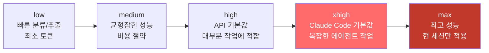
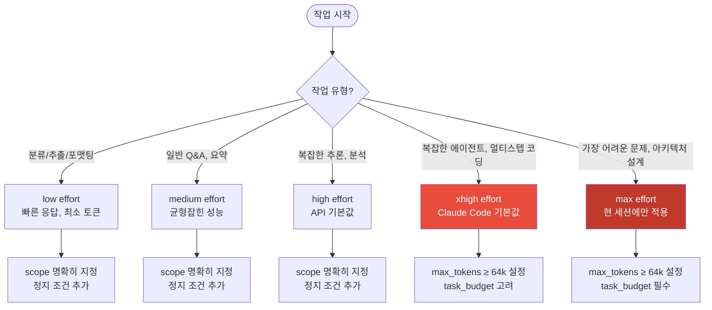
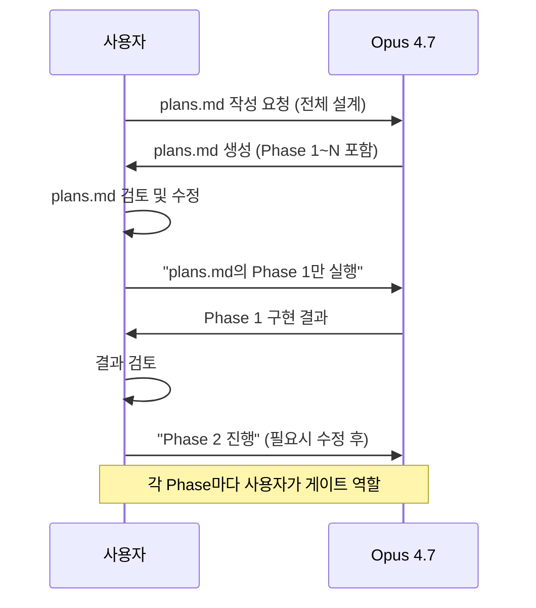
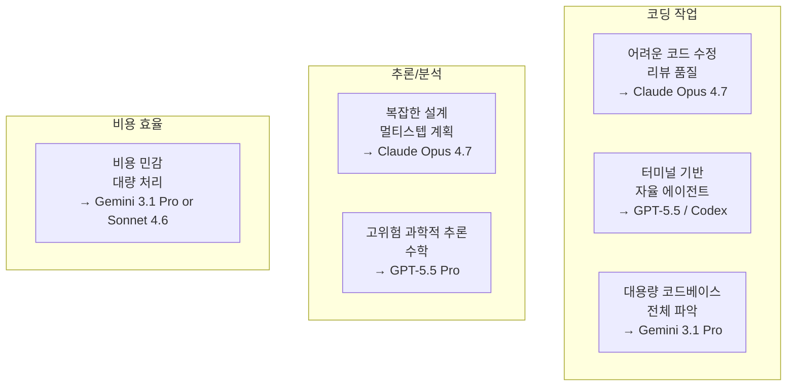
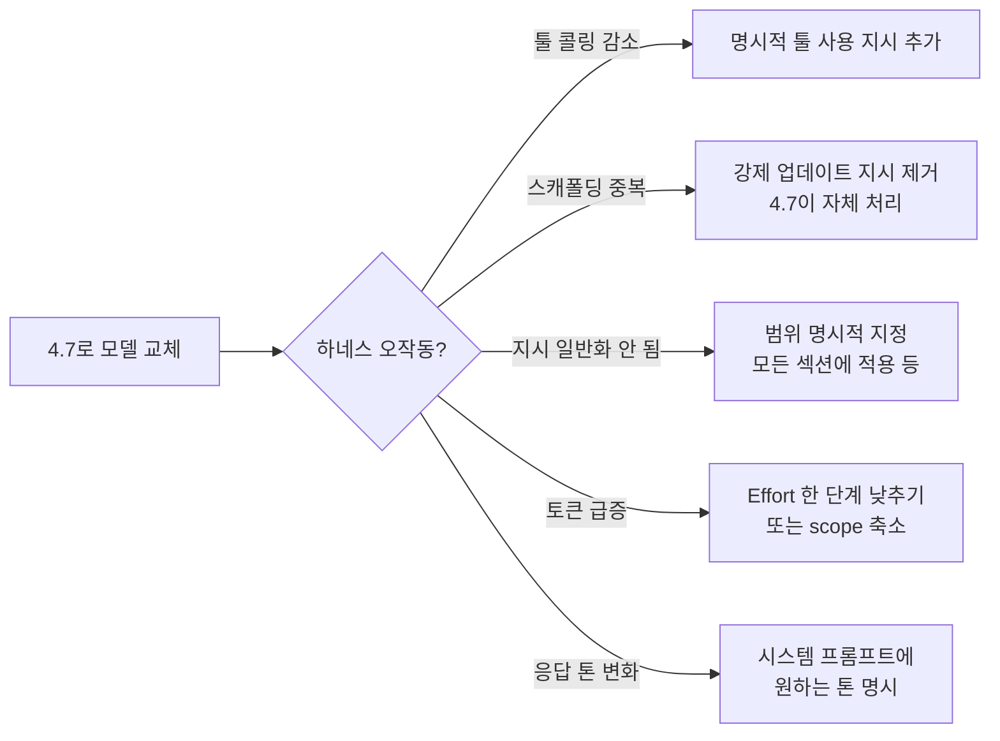
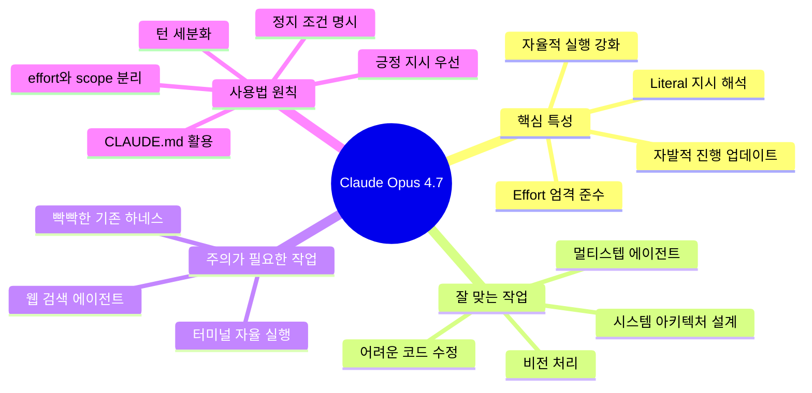

## "더 똑똑한 4.6"이 아닌, 완전히 다른 사용법을 요구하는 모델

### 관련글

[**4.7은 4.6보다 더 자율적입니다**](https://www.threads.com/@gptaku_ai/post/DX1eVKPE13y)

[**Opus 4.7 이후 4.6 과의 차이점 정리**](https://www.threads.com/@sangwoo.ha.12/post/DX0zdfFkehW)

---


## 1. 들어가며: 왜 4.7이 4.6보다 "나쁘게 느껴지는가"

Claude Opus 4.7이 출시된 지 약 2주가 지났다. 그런데 커뮤니티 반응은 기묘하게 양분된다. 벤치마크 수치상으로는 명백한 향상인데, 실제 사용하는 사람들 중 일부는 "오히려 퇴보한 것 같다", "말이 너무 많아졌다", "내가 시키지 않은 것까지 한다"는 반응을 보인다. 반대로 또 다른 사람들은 "제대로 쓰니까 훨씬 낫다"고 말한다.

이 간극의 원인은 단 하나다. **4.7은 4.6과 사용법이 근본적으로 다른 모델이다.** 4.6을 쓰던 방식 그대로 4.7을 사용하면, 모델이 나빠진 게 아니라 인터페이스가 달라진 것임에도 불구하고 경험상 퇴보처럼 느껴진다. 마치 수동변속기 차량에 익숙한 운전자가 갑자기 자동변속기로 바꿨는데, "왜 기어가 안 먹히지?"라고 하는 것과 비슷한 상황이다.

이 문서는 Anthropic의 공식 문서, 실사용자들의 경험, 그리고 최신 벤치마크 데이터를 종합하여, Opus 4.7을 제대로 이해하고 활용하기 위한 완전 가이드를 제공한다.

---

## 2. Opus 4.7의 주요 변경 사항 개요

먼저 4.7에서 무엇이 바뀌었는지 큰 그림을 파악해야 한다. 변경점은 크게 **성능 향상**, **행동 방식 변화**, **API 수준의 구조적 변화** 세 가지로 나뉜다.

### 2.1 성능 향상 요약

<details>
<summary>주요 벤치마크 비교표</summary>

| 벤치마크 | Opus 4.6 | Opus 4.7 | 변화 |
|---|---|---|---|
| SWE-bench Pro | 53.4% | 64.3% | **+10.9pp** |
| SWE-bench Verified | 80.8% | 87.6% | +6.8pp |
| CursorBench | 58% | 70% | **+12pp** |
| MCP-Atlas (툴 사용) | 62.7% | 77.3% | **+14.6pp** |
| OSWorld-Verified (컴퓨터 사용) | 72.7% | 78.0% | +5.3pp |
| GPQA Diamond | ~88% | 94.2% | +6.2pp |
| BrowseComp (웹 검색) | 83.7% | 79.3% | **-4.4pp (퇴보)** |
| 비전 정확도 | 54.5% | 98.5% | **+44pp** |

</details>

코딩, 툴 사용, 비전 영역에서 큰 폭의 향상이 있었다. 다만 웹 검색 에이전트 성능(BrowseComp)과 터미널 벤치마크에서는 퇴보가 있었다는 점은 솔직하게 인정해야 한다.

### 2.2 행동 방식의 구조적 변화

성능 수치보다 더 중요한 것은 **모델이 동작하는 방식 자체가 달라졌다**는 것이다. 공식 문서와 실사용자 경험을 종합하면 다음 9가지 변화가 핵심이다.

---

## 3. 9가지 핵심 행동 변화 상세 분석

### 3.1 응답 길이: 고정 verbose → 작업 복잡도 기반 동적 조정

4.6은 비교적 일정한 길이의 응답을 생성하는 경향이 있었다. 4.7은 이를 완전히 바꿨다. **작업의 복잡도를 스스로 판단해 응답 길이를 동적으로 조정한다.** 간단한 질문에는 짧게, 복잡한 작업에는 길게 응답한다.

문제는 여기서 발생한다. 4.6에서 5턴에 걸쳐 점진적으로 처리하던 작업을 4.7에 한 번에 던지면, 4.7은 "이건 복잡한 작업이구나"라고 판단하고 처음부터 전체 구현까지 다 해버린다. 응답이 길어지고 토큰도 많이 쓰는 것처럼 보이지만, 이것은 모델의 문제가 아니라 **작업 범위 설정의 문제**다.

실사용자들이 공통적으로 발견한 해결책은 단순하다. **턴당 작업 범위를 더 작게 잘라야 한다.** 4.6에서 5턴에 처리했다면 4.7에서는 7~10턴 정도로 세분화하는 것이 오히려 효율적이다.

```
❌ 4.6 방식: "이 기능 전체를 구현해줘"
✅ 4.7 방식: "이 기능의 데이터 모델 설계만 해줘. 코드 작성은 하지 마"
```

### 3.2 Effort 파라미터: 느슨한 준수 → 엄격한 준수 + xhigh 추가

이것이 4.7에서 가장 핵심적인 변화다.

4.6에서 effort 파라미터는 다소 느슨하게 적용되었다. 같은 `high` 설정이어도 어떤 작업에서는 더 많이 생각하고, 어떤 작업에서는 덜 생각하는 식이었다.

4.7은 **effort 레벨을 극도로 엄격하게 준수한다.** 공식 문서는 명시적으로 "Opus 4.7은 이전 어떤 Claude 모델보다 effort 레벨을 중요하게 준수한다"고 밝히고 있다.

**4.7의 effort 단계 (5단계)**

```
low → medium → high (기본값) → xhigh (신규) → max
```

각 단계의 특성을 이해하는 것이 매우 중요하다.



**xhigh가 추가된 이유**

xhigh는 `high`와 `max` 사이의 새로운 단계다. 실제 토큰 사용량 측면에서는 다음과 같이 작동한다.

- `high`: 약 5,000 thinking 토큰
- `xhigh`: 약 10,000 thinking 토큰
- `max`: 약 20,000 thinking 토큰

Datacamp의 실험에 따르면 xhigh는 max 비용의 절반 정도를 쓰면서 max에 근접한 품질을 낸다. Claude Code는 모든 플랜에서 기본값을 xhigh로 설정했다.

**중요한 발견: "low effort 4.7 ≈ medium effort 4.6"**

Hex의 CTO가 보고한 내용에 따르면, **4.7의 low effort는 4.6의 medium effort와 품질이 유사하다.** 이는 매우 중요한 함의를 갖는다. 4.7로 마이그레이션하면서 effort를 한 단계 낮춰도 기존과 유사한 품질을 유지할 수 있다는 뜻이다.

**effort와 scope를 분리하라**

실사용자들이 발견한 핵심 인사이트는 **effort(얼마나 깊게 생각할지)와 scope(어디까지 작업할지)를 분리해서 생각해야 한다**는 것이다.

많은 사람들이 "effort를 높이면 알아서 잘 해준다"고 생각하지만, effort를 높이면서 scope를 명확히 지정하지 않으면 모델이 원하는 방향 이상으로 달려간다. 반대로 일상적인 작업은 effort를 낮추되 scope를 명확히 주는 것이 오히려 더 제어하기 쉽다.

```
effort = 사고의 깊이 (얼마나 치밀하게 생각하는가)
scope  = 작업의 범위 (어디까지 실행하는가)
```

이 두 가지는 독립적으로 설정해야 한다.

### 3.3 툴 콜링 빈도: 도구 의존 → 추론 우선

4.6은 툴을 자주 호출하는 경향이 있었다. Sub-agent를 빈번히 생성하고, 조금이라도 불확실하면 도구를 써서 확인하려 했다.

4.7은 반대다. **도구보다 추론을 우선한다.** 도구를 쓰지 않아도 해결할 수 있다고 판단하면 추론만으로 응답한다. 이 때문에 기존에 툴 콜링 빈도를 전제로 설계된 Superpowers, omc 같은 플러그인들이 4.7에서 의도한 대로 동작하지 않는 경우가 발생한다.

흥미로운 수치가 있다. Box의 평가에 따르면 특정 워크플로에서 4.7은 4.6 대비 **모델 호출 56% 감소, 툴 호출 50% 감소**를 달성했다. 더 적은 단계로 같은 작업을 완료한다는 의미다.

더 많은 툴을 사용하게 하려면 **명시적 지시**가 필요하다. "이 작업에서는 반드시 파일 시스템을 직접 확인해라"와 같이 구체적으로 요청해야 한다.

### 3.4 지시 해석 방식: 추론/일반화 → 문자 그대로(Literal)

이것이 실사용자들이 가장 많이 체감하는 변화다.

4.6은 지시를 어느 정도 해석하고 추론해서 실행했다. "이메일을 깔끔하게 정리해줘"라고 하면 전체를 재작성하고, 어조를 조정하고, 구조를 개선하고, 심지어 사실 오류까지 지적해주는 식이었다. 사용자 입장에서는 편리했지만, 예측 불가능했다.

4.7은 **문자 그대로 해석한다.** 시킨 것만 한다. 한 항목에 적용된 지시를 다른 항목에 자동으로 일반화하지 않는다.

예를 들어보자.

```
❌ 4.6 방식으로 4.7에게 주는 지시:
"섹션 1에서 핵심 내용만 추출해줘"
→ 4.7은 섹션 1만 처리하고 멈춘다. 섹션 2~5는 건드리지 않는다.

✅ 4.7에게 올바르게 주는 지시:
"모든 섹션에서 핵심 내용만 추출해줘. 각 섹션마다 동일하게 적용할 것"
```

이 변화는 **표준화된 엔터프라이즈 워크플로에서는 매우 강력한 장점**이다. 예측 가능성과 감사 가능성이 높아진다. 하지만 기존에 모델의 추론 능력에 의존하던 프롬프트들은 수정이 필요하다.

공식 문서는 이것을 명확하게 표현했다. 4.7은 "요청하지 않은 것은 추론하지 않는다"는 원칙을 따른다.

### 3.5 진행 상황 업데이트: 수동 스캐폴딩 필요 → 자발적 정기 업데이트

4.6에서는 긴 에이전트 작업 중에 중간 상태 업데이트가 부족해서 "3 tool call마다 요약해줘"와 같은 강제 지시를 넣는 스캐폴딩이 필요했다.

4.7은 **긴 에이전트 트레이스 동안 자발적으로 정기 업데이트를 제공한다.** 공식 문서는 기존에 이런 강제 지시를 넣었다면 **제거하라**고 권장한다. 4.7은 스스로 처리하기 때문에, 기존 스캐폴딩이 오히려 중복 업데이트나 비효율적 토큰 소비를 유발할 수 있다.

### 3.6 응답 톤: 따뜻하고 검증 중심 → 직접적이고 의견 명확

4.6은 따뜻한 어조, 공감 표현, 이모지를 많이 사용했다. 사용자를 격려하고 검증하는 방식이었다.

4.7은 **더 직설적이고 의견을 분명히 말한다.** 이모지가 줄었고, 불필요한 검증 표현이 줄었다. "좋은 질문이에요!"나 "물론이죠~" 같은 표현보다 바로 본론으로 들어간다. 일부 사용자들은 이를 "싸가지가 없어졌다"고 표현했는데, 설계상 의도된 변화다.

제품에서 특정 어조가 필요하다면 시스템 프롬프트에 명시적으로 지정해야 한다. "따뜻하고 공감적인 어조를 사용해라"고 적으면 4.7도 그렇게 동작한다.

### 3.7 프론트엔드 디자인: 일반적 AI 패턴 → 강한 디자인 본능

4.6에서 디자인 결과물의 품질을 높이려면 긴 프롬프트가 필요했다. 4.7은 **스스로 강한 디자인 본능을 가지고 있어** 별다른 지시 없이도 독특한 UI를 생성한다.

단, 이 "디자인 본능"이 강한 하우스 스타일 기본값을 갖기 때문에, dashboard·fintech 등 특정 산업에서 관례적으로 사용하는 레이아웃과 맞지 않을 수 있다. 원하는 디자인이 있다면 **구체적인 대안을 명시**해야 한다. 예: "핀테크 스타일로 직관적인 대시보드 레이아웃, 화이트/블루 컬러 스킴, Material Design 컴포넌트 기반"

### 3.8 코드 리뷰: 느슨한 필터링 → 엄격한 필터링 + 향상된 버그 탐지

버그 발견 능력 자체는 어려운 평가 기준에서 +11pp recall 향상이 있었다. 그러나 필터링 지시를 더 충실히 따르기 때문에 역설적으로 보고되는 결과 수가 줄어들 수 있다.

예를 들어 "high-severity 버그만 보고해줘"라는 지시를 4.6은 느슨하게 따라서 medium severity도 함께 보고하는 경우가 있었다. 4.7은 지시를 문자 그대로 따르기 때문에 정말 high-severity만 보고한다.

이 특성을 활용하려면 **발견 단계와 필터링 단계를 분리**하는 것이 좋다.

```
1단계: "모든 잠재적 문제를 심각도 무관하게 찾아줘"
2단계: "위 결과 중 high-severity만 추려줘"
```

### 3.9 새롭게 추가된 기능

**Computer Use 해상도 확장**: 비전 해상도가 2,576px (3.75MP)로 증가했다. 기존 최대 1,568px (1.15MP) 대비 3배 이상이다. 밀도 높은 스크린샷을 사전 크롭 없이 처리할 수 있게 됐다.

**인터랙티브 코딩**: 사용자와 턴 바이 턴으로 매번 추론하며 진행하는 방식이 강화됐다. 이는 품질은 높이지만 토큰 소비가 증가하는 원인이 될 수 있다.

**파일시스템 메모리**: 모델이 스스로 메모리 파일에 노트를 작성하고 세션 간에 이를 참조한다. 4.6에서 멀티세션 작업 시 매번 컨텍스트를 새로 제공해야 했던 문제가 개선됐다.

---

## 4. Effort 파라미터 활용 전략

### 4.1 작업 유형별 권장 Effort 설정



### 4.2 Effort를 낮춰야 하는 상황

많은 사람들이 "항상 높은 effort = 좋은 결과"라고 생각한다. 틀렸다. **대부분의 일상적 작업은 effort를 낮추는 것이 오히려 효율적이다.**

이유는 단순하다. Effort가 높으면 모델이 더 많이 생각하고, 그 과정에서 명확하지 않은 부분을 스스로 채워 넣으려 한다. 즉 scope가 확장될 가능성이 높아진다. 이를 방지하기 위해 상세한 정지 조건을 추가해야 하는데, 그 오버헤드가 effort를 낮추는 것보다 큰 경우가 많다.

effort를 낮추되 **scope를 명확히** 주면, 모델은 지시받은 범위 내에서 효율적으로 작업한다.

### 4.3 Effort를 높여야 하는 상황

반대로 다음 상황에서는 xhigh 또는 max를 써야 한다.

첫째, **신규 기능 설계, 시스템 아키텍처 결정, 전체 리팩토링**처럼 모델이 깊이 생각해야 하는 작업이다. 이때도 scope는 명확히 지정해야 한다. "구현 계획까지만", "페이즈 1 태스크까지만"과 같은 정지 조건을 명시한다.

둘째, **단일 어려운 문제** 해결이다. 알고리즘 최적화, 복잡한 버그 추적, 보안 취약점 분석 등이 해당한다.

셋째, **긴 에이전트 루프**다. xhigh나 max 사용 시 `max_tokens`를 최소 64k로 설정해야 한다. 모델에게 충분한 thinking 공간을 주지 않으면 중간에 잘리거나 품질이 저하된다.

---

## 5. 실전 프롬프팅 전략: 정지 조건의 기술

4.7을 제대로 쓰는 핵심은 **"어디서 멈출지"를 명확히 지정하는 것**이다. 이를 "정지 조건"이라고 부를 수 있다.

### 5.1 정지 조건의 세 가지 형태

**형태 1: 작업 범위 제한**
```
"이 파일만 보고서 수정해"
"원인만 찾고 정리해. 코드 수정은 하지 마"
"이번 턴에서는 계획만 세우고 작업 시작하지 마"
```

**형태 2: 단계 기반 제한**
```
"구현 계획까지만"
"페이즈 1 태스크까지만"
"데이터 모델 설계만. 코드 작성은 다음 페이즈에서"
```

**형태 3: 확인 게이트 삽입**
```
"각 단계 완료 후 다음 단계로 넘어가기 전에 확인을 요청해"
"구현 전에 내 승인을 받아라"
```

### 5.2 plans.md 방식의 활용

실사용자들 중 이미 이 방식을 자연스럽게 쓰고 있던 경우가 있다. plans.md 파일을 생성하고 단계별 계획을 정의한 후, "plans.md의 페이즈 1만 진행"하는 방식이다.



이 방식의 장점은 세 가지다. 첫째, 전체 작업에 대한 공유된 멘탈 모델을 확립한다. 둘째, 각 단계에서 방향을 수정할 기회를 가진다. 셋째, 4.7의 literal instruction following 특성을 최대한 활용한다.

### 5.3 CLAUDE.md의 중요성 증가

CLAUDE.md는 Claude Code에서 프로젝트 전역 컨텍스트를 저장하는 파일이다. 4.7로 오면서 이 파일의 중요성이 크게 높아졌다.

4.6은 이전 대화에서 암묵적으로 파악한 내용을 어느 정도 유지했다. 4.7은 literal interpretation 원칙에 따라 **매 세션을 문자 그대로 해석한다.** 따라서 프로젝트의 맥락, 코딩 스타일, 아키텍처 원칙, 금지 사항 등을 CLAUDE.md에 명시해야 한다.

```markdown
# CLAUDE.md 예시 구조

## 프로젝트 개요
- 프로젝트명, 목적, 현재 단계

## 기술 스택
- 언어, 프레임워크, 주요 라이브러리

## 코딩 원칙
- 스타일 가이드
- 테스트 요구사항
- 금지 패턴

## 현재 단계 / 진행 중인 작업
- 최신 상태 기록

## 아키텍처 결정 사항
- 주요 설계 결정과 그 이유
```

---

## 6. 멀티 모델 워크플로: 단일 모델 올인에서 벗어나기

4.7을 잘 활용하는 또 다른 접근법은 **단일 모델에 모든 작업을 맡기지 않는 것**이다. 이것은 4.7의 단점을 보완하는 것이기도 하지만, 더 근본적으로는 각 모델의 강점을 최대화하는 전략이다.

### 6.1 각 모델의 상대적 강점 (2026년 5월 기준)



현재 기준으로 각 모델의 특화 영역을 정리하면 다음과 같다.

**Claude Opus 4.7의 강점**: SWE-bench Pro 기준 어려운 GitHub 이슈 해결(64.3%), 코드 리뷰 품질, MCP-Atlas 기준 툴 사용(77.3%), 멀티스텝 에이전트 작업.

**GPT-5.5 / Codex의 강점**: Terminal-Bench 2.0 기준 터미널 기반 자율 작업(82.7%), GitHub PR 자동 생성, 레포지토리 수준 마이그레이션.

**Gemini 3.1 Pro의 강점**: 대용량 컨텍스트 처리, 비용 효율성, 대규모 코드베이스 전체 파악.

### 6.2 실전 역할 분배 예시

실사용자들이 공유한 멀티 모델 운영 방식은 다음과 같다.

```
Opus 4.7  : 메인 작업 (설계, 핵심 구현, 코드 리뷰)
Codex     : 자율 실행 (코드 리뷰, 리팩토링 제안, PR 생성)
Gemini    : 엣지 케이스 관점, 대용량 코드베이스 파악
Sonnet 4.6: 단순 반복 작업, 비용 민감 배치 처리
```

핵심은 **한 모델의 판단에 전적으로 의존하지 않는 것**이다. 여러 모델의 의견을 비교하면서 합의 지점과 불일치 지점을 파악하고, 사용자가 최종 판단을 내린다. 이 방식은 단순히 비용 절감이나 속도 향상이 목적이 아니라, **의사결정의 품질을 높이는 것**이 목적이다.

---

## 7. 기존 하네스/플러그인 업데이트 가이드

4.7로 전환 시 기존에 구성된 하네스나 스킬이 제대로 동작하지 않는 원인과 해결 방법을 정리한다.

### 7.1 하네스 오작동의 주요 원인



### 7.2 너무 tight한 지침을 풀어야 하는 역설

흥미로운 점이 있다. 4.6 시절에는 모델이 스스로 많이 채워줬기 때문에 tight한 지침으로 모델의 과잉 행동을 억제해야 했다. 4.7은 반대다. 모델이 이미 literal하게 따르기 때문에, 너무 tight한 지침이 오히려 불필요한 제약이 된다.

실사용자들은 "오히려 너무 타이트하던 지침을 풀어주면서 수정 중"이라는 경험을 공유했다. 4.7에서는 **"하지 마라"는 금지 규칙을 줄이고, "이렇게 해라"는 긍정 지시를 늘리는 방향**으로 하네스를 재구성하는 것이 효과적이다.

공식 문서도 같은 내용을 권장한다. "Like this:" 뒤에 예시를 주는 방식이 "Don't do this:" 방식보다 효과적이며, 금지 규칙이 3개 이상이면 긍정 지시로 전환하라고 명시한다.

### 7.3 마이그레이션 체크리스트

마이그레이션 전에 확인해야 할 항목들이다.

첫째, **토큰 재측정이다.** 새 토크나이저로 인해 동일 입력이 최대 1.35배 더 많은 토큰을 소비한다. 특히 구조화된 데이터나 다국어 콘텐츠에서 영향이 크다. 기존 비용 예측을 다시 계산해야 한다.

둘째, **프롬프트 감사다.** 4.6의 느슨한 해석에 의존하던 프롬프트는 4.7에서 의도한 대로 동작하지 않는다. 특히 bullet point 형태의 "제안" 목록이 4.7에서는 "요구사항"으로 해석될 수 있다.

셋째, **에이전트 스캐폴딩 제거다.** "N번 툴콜마다 요약해라" 같은 강제 지시는 4.7에서 불필요하다. 오히려 제거하는 것이 낫다.

넷째, **xhigh/max 사용 시 max_tokens 조정이다.** 최소 64k로 시작하고 작업 유형에 따라 조정한다.

다섯째, **task_budget 도입 검토다.** 긴 에이전트 루프에서 토큰 소비를 제어하는 beta 기능이다. 현재 공개 베타 상태다.

---

## 8. 4.7의 새로운 기능 상세: Task Budget과 /ultrareview

### 8.1 Task Budget (공개 베타)

Task Budget은 4.7에서 새롭게 도입된 에이전트 제어 메커니즘이다. 전체 에이전트 루프(thinking + tool calls + tool results + 최종 출력)에 대해 토큰 예산을 설정하면, 모델이 카운트다운을 인식하고 예산 내에서 작업을 완료하도록 우선순위를 조정한다.

```python
response = client.beta.messages.create(
    model="claude-opus-4-7",
    max_tokens=128000,
    output_config={
        "effort": "high",
        "task_budget": {"type": "tokens", "total": 128000}
    },
    messages=[{"role": "user", "content": "코드베이스를 리뷰하고 리팩토링 계획을 제안해줘"}],
    betas=["task-budgets-2026-03-13"]
)
```

Task Budget은 "비용 예측 가능성"이 핵심 목적이다. 예산이 너무 빡빡하면 모델이 작업을 덜 철저하게 처리하거나 거부할 수 있으므로, 작업 유형에 따라 적절한 예산을 실험적으로 찾아야 한다. 품질이 비용보다 중요한 오픈엔드 작업에는 Task Budget을 설정하지 않는 것이 낫다.

### 8.2 /ultrareview (Claude Code)

Claude Code에 새로 추가된 명령어다. 전용 리뷰 세션을 시작해서 버그와 설계 문제를 포괄적으로 진단한다. Pro/Max 사용자에게는 매 결제 주기마다 3회 무료 사용이 제공된다.

기존 코드 리뷰보다 더 깊은 분석을 제공하며, 특히 버그 recall이 +11pp 향상된 4.7의 코드 분석 능력을 최대로 활용하는 방식이다.

---

## 9. 종합: 4.7은 어떤 모델인가



Opus 4.7은 "더 똑똑한 4.6"이 아니다. 더 정확한 표현은 **"더 자율적이고 더 literal한, 완전히 다른 사용 계약을 요구하는 모델"** 이다.

4.6이 사용자의 의도를 추론하고 채워주는 모델이었다면, 4.7은 **사용자가 명확하게 표현한 것을 최고의 품질로 실행하는 모델**이다. 전자가 더 편할 수도 있지만, 후자가 더 예측 가능하고 제어 가능하다.

4.7을 잘 쓰는 방법은 결국 하나의 원칙으로 수렴한다. **intent를 명확하게 표현하라.** 더 많은 프롬프트가 필요한 것이 아니라, 더 정확한 프롬프트가 필요하다. 짧고 정확한 프롬프트가 길고 모호한 프롬프트보다 훨씬 좋은 결과를 낸다.

작은 작업은 낮은 effort로 짧게 쪼개고, 큰 작업은 높은 effort로 맡기되 어디까지 하고 멈출지를 명확히 정하는 것. 지금 시점에서 4.7을 가장 잘 사용하는 방법이다.

---

## 참고 자료

- Anthropic 공식 문서: [What's new in Claude Opus 4.7](https://platform.claude.com/docs/en/about-claude/models/whats-new-claude-4-7)
- Anthropic 공식 문서: [Effort Parameter Guide](https://platform.claude.com/docs/en/build-with-claude/effort)
- Anthropic 공식 문서: [Migration Guide](https://platform.claude.com/docs/en/about-claude/models/migration-guide)
- Claude Code 공식 문서: [Model Configuration](https://code.claude.com/docs/en/model-config)
- DataCamp: [Opus 4.7 Benchmark: Memory & Effort Levels Tested](https://www.datacamp.com/tutorial/opus-4-7-project)
- Vellum: [Claude Opus 4.7 Benchmarks Explained](https://www.vellum.ai/blog/claude-opus-4-7-benchmarks-explained)
- Product Compass (Paweł Huryn): [The Ultimate Guide to Claude Opus 4.7](https://www.productcompass.pm/p/claude-opus-4-7-guide)
- NxCode: [Claude Opus 4.7 Developer Guide](https://www.nxcode.io/resources/news/claude-opus-4-7-developer-guide-api-claude-code-migration-2026)

---

*작성일: 2026년 5월 3일*
