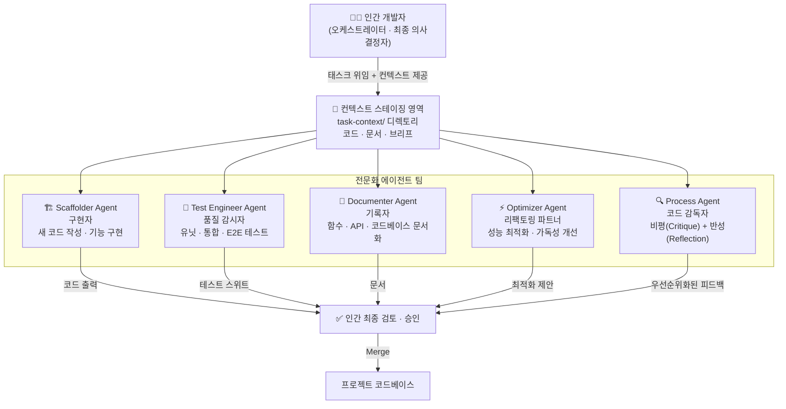
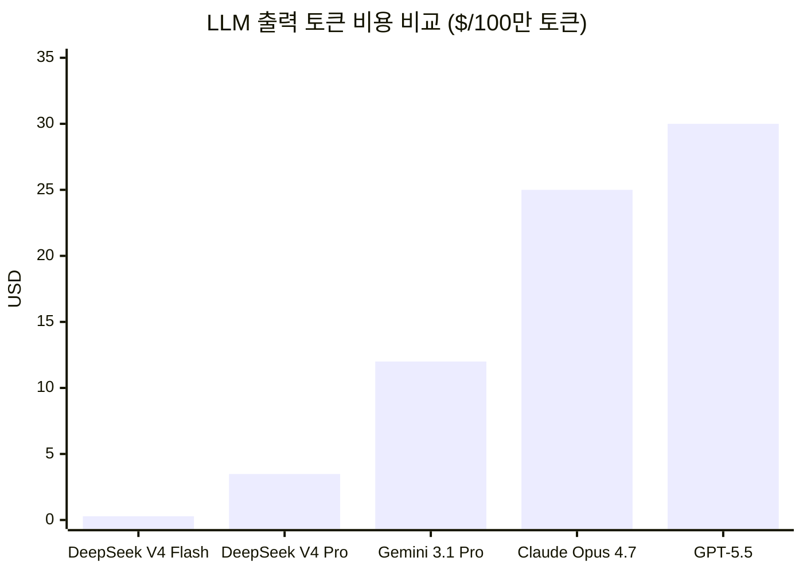
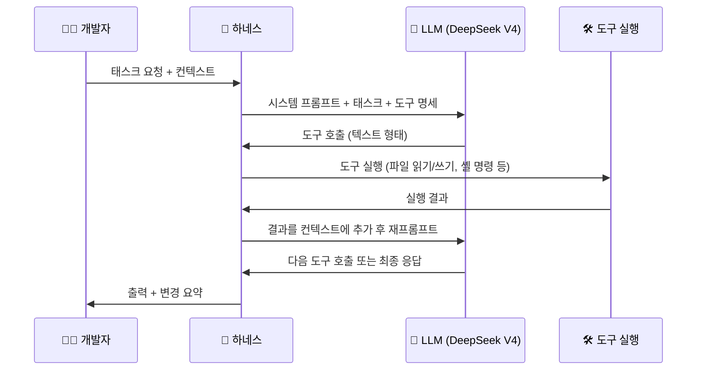
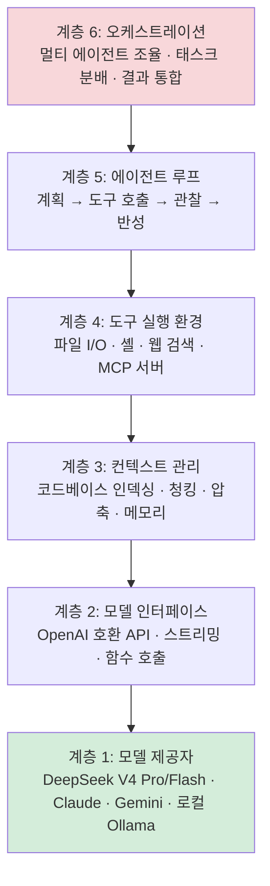
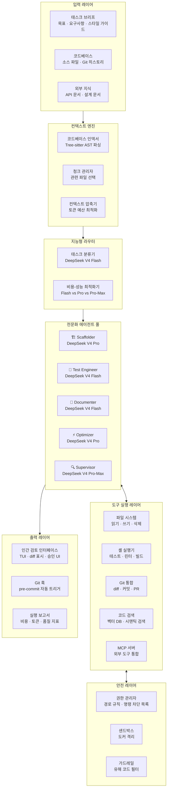
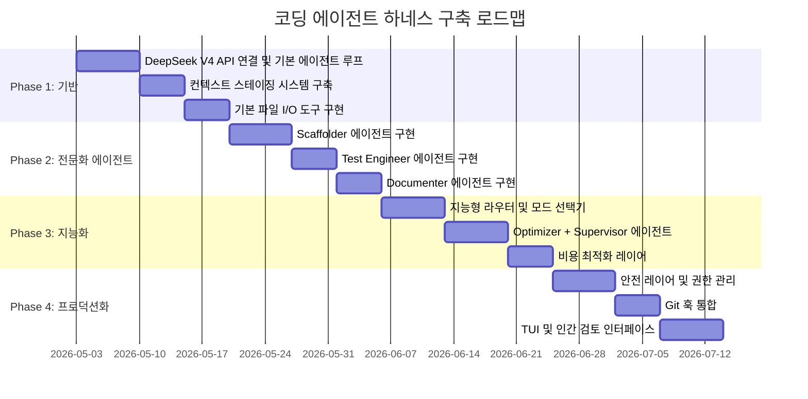
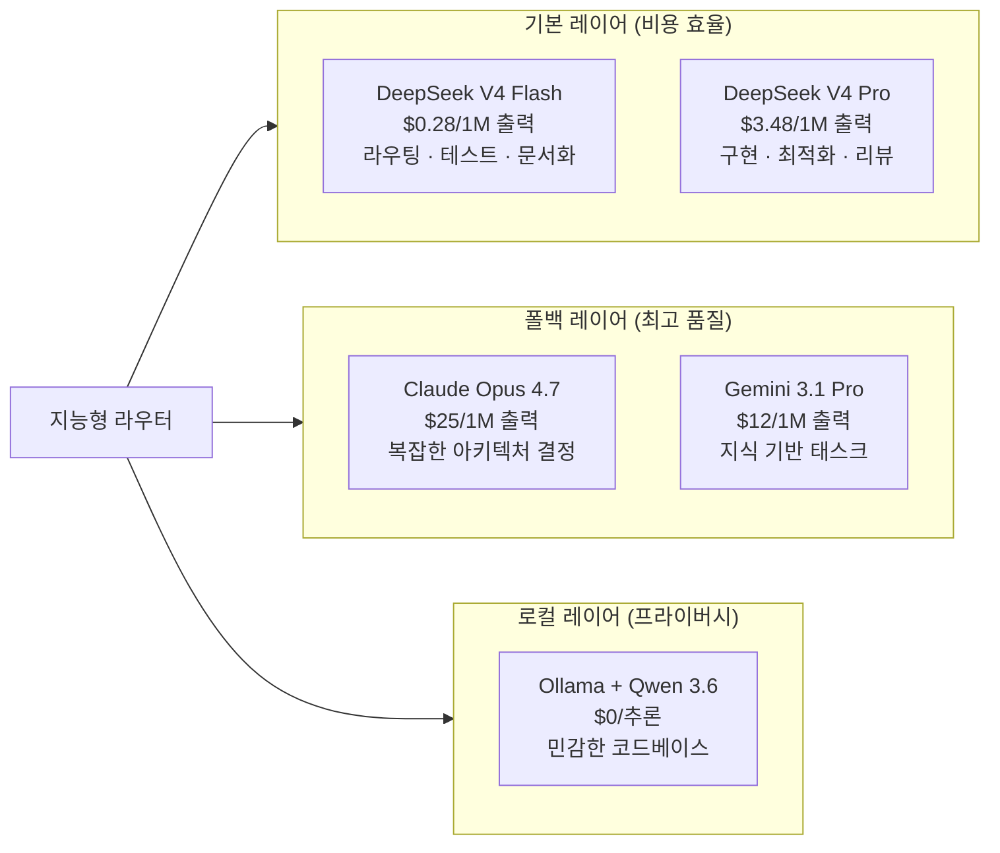

## Appendix G 심층 분석 + DeepSeek V4 기반 Claude Code형 도구 설계

> 기반 문서: [*Agentic Design Patterns*](https://drive.google.com/file/d/1Gpt-p1-CS1H-BMQ_LqO3xgxWMB-hmfd4/view?usp=drive_link) Appendix G — Coding Agents (Antonio Gulli, Springer 2025)
> 참조 모델: DeepSeek V4 Pro/Flash (2026년 4월 24일 프리뷰 공개)
> 작성일: 2026년 5월 3일

---
## 관련문서

[**Agentic Design Patterns: 지능형 시스템 구축을 위한 실전 가이드 완전 분석**](https://k82022603.github.io/posts/agentic-design-patterns-%EC%A7%80%EB%8A%A5%ED%98%95-%EC%8B%9C%EC%8A%A4%ED%85%9C-%EA%B5%AC%EC%B6%95%EC%9D%84-%EC%9C%84%ED%95%9C-%EC%8B%A4%EC%A0%84-%EA%B0%80%EC%9D%B4%EB%93%9C-%EC%99%84%EC%A0%84-%EB%B6%84%EC%84%9D/)

## 서론: 왜 지금 코딩 에이전트 하네스인가

2025년 초, Alphabet CEO Sundar Pichai는 Google에서 새로 작성되는 코드의 30% 이상이 Gemini 모델의 보조를 받고 있다고 발표했다. Microsoft CEO Satya Nadella도 같은 수치를 언급했다. 이 숫자는 단순한 자동 완성 통계가 아니다. 에이전트가 실제 개발 워크플로에서 팀원으로 기능하기 시작했다는 신호다.

그러나 에이전트의 성능은 모델 자체보다 그것을 둘러싼 **하네스(harness)** — 도구, 컨텍스트 관리, 복구 로직, 권한 체계 — 에 더 크게 좌우된다는 사실이 2026년 현재 명확해지고 있다. 동일한 Claude Opus 모델이 Claude Code에서보다 Cursor에서 더 높은 SWE-bench 점수(87.2% vs 91.1%)를 기록하는 현상이 이를 증명한다. **하네스의 차이가 모델의 차이보다 크다.**

그리고 지금, DeepSeek V4 Pro가 등장했다. 오픈소스이며, GPT-5.5와 Claude Opus 4.7에 버금가는 에이전틱 벤치마크 성능을 출력 토큰당 비용 기준 약 10~13배 저렴한 가격에 제공한다. 제대로 된 하네스를 구축한다면, 당신만의 Claude Code를 만들 수 있는 조건이 갖춰진 것이다.

---

## Part 1: Appendix G 심층 해설 — 코딩 에이전트 팀 프레임워크

### 1.1 바이브 코딩: 시작점이자 한계점

**바이브 코딩(Vibe Coding)** 은 LLM을 활용하여 초기 초안을 생성하고, 복잡한 로직을 개략적으로 정리하거나, 빠른 프로토타입을 구축하는 기법이다. "빈 페이지 문제"를 극복하고 막연한 개념에서 실행 가능한 코드로 빠르게 전환하는 데 탁월하다.

낯선 API를 탐색하거나 새로운 아키텍처 패턴을 시험할 때 특히 효과적이다. 생성된 코드는 개발자가 비판하고, 리팩토링하고, 확장하는 기반으로 작동하는 **창의적 촉매** 역할을 한다.

그러나 바이브 코딩의 한계는 명확하다. **아이디어 발굴과 초기 탐색에는 강하지만**, 견고하고 확장 가능하며 유지보수 가능한 소프트웨어를 만들려면 보다 구조화된 접근법이 필요하다. 이 지점에서 **전문화된 코딩 에이전트 팀**으로의 전환이 요구된다.

### 1.2 에이전트를 팀원으로: 인간-에이전트 협력 모델

Appendix G의 핵심 통찰은 에이전트를 단순한 도구가 아닌 **팀원**으로 재정의하는 것이다. 이 접근의 세 가지 근본 원칙이 있다.

**원칙 1: 인간 주도 오케스트레이션 (Human-Led Orchestration)**
개발자는 팀장이자 프로젝트 아키텍트다. 항상 루프 안에 있으며 워크플로를 지휘하고, 고수준 목표를 설정하고, 최종 결정을 내린다. 에이전트는 강력하지만 지원적 협력자다. 개발자는 어떤 에이전트를 투입할지 지시하고, 필요한 컨텍스트를 제공하고, 무엇보다 에이전트가 생성한 모든 출력에 대한 최종 판단을 내린다.

**원칙 2: 컨텍스트의 최우선성 (Primacy of Context)**
에이전트의 성능은 제공받는 컨텍스트의 품질과 완전성에 전적으로 의존한다. 빈약한 컨텍스트를 받은 강력한 LLM은 쓸모없다. 이 프레임워크는 인간 주도의 철저한 컨텍스트 큐레이션을 우선시한다. 자동화된 블랙박스 컨텍스트 검색은 지양한다. 개발자가 에이전트 팀원을 위한 완벽한 "브리핑 패키지"를 직접 조립할 책임을 진다.

브리핑 패키지는 세 요소로 구성된다. 완전한 코드베이스(에이전트가 기존 패턴과 로직을 이해하기 위한 모든 관련 소스 코드), 외부 지식(특정 문서, API 정의, 설계 문서), 인간 브리프(명확한 목표, 요구사항, PR 설명, 스타일 가이드)다.

**원칙 3: 직접 모델 접근 (Direct Model Access)**
최고 수준의 결과를 달성하려면 프런티어 모델(Gemini 2.5 Pro, Claude Opus 4.x, DeepSeek V4 Pro 등)에 직접 접근해야 한다. 성능이 낮은 모델을 사용하거나 컨텍스트를 가리거나 잘라내는 중개 플랫폼을 통해 요청을 라우팅하면 성능이 저하된다. 핵심은 인간 리드와 모델의 원시 역량 사이의 가능한 가장 순수한 대화를 만드는 것이다.

### 1.3 전문화된 에이전트 팀 구성



각 에이전트는 별도의 애플리케이션이 아니라 LLM 내에서 세심하게 작성된 역할별 프롬프트와 컨텍스트를 통해 호출되는 **개념적 페르소나**다.

#### Scaffolder Agent — 구현자
코드 작성, 기능 구현, 상세 명세에 기반한 보일러플레이트 생성을 담당한다. 호출 프롬프트는 "당신은 시니어 소프트웨어 엔지니어입니다. `01_BRIEF.md`의 요구사항과 `02_CODE/`의 기존 패턴을 기반으로 해당 기능을 구현하십시오..."와 같이 구성된다.

#### Test Engineer Agent — 품질 감시자
신규 또는 기존 코드에 대한 포괄적인 유닛 테스트, 통합 테스트, E2E 테스트를 작성한다. "당신은 QA 엔지니어입니다. `02_CODE/`에 제공된 코드에 대해 [pytest] 등을 사용하여 전체 유닛 테스트 스위트를 작성하십시오. 모든 엣지 케이스를 커버하고 프로젝트의 테스팅 철학을 준수하십시오."

#### Documenter Agent — 기록자
함수, 클래스, API, 코드베이스 전체에 대한 명확하고 간결한 문서를 생성한다. "당신은 기술 작가입니다. 제공된 코드에 정의된 API 엔드포인트에 대한 마크다운 문서를 생성하십시오. 요청/응답 예시를 포함하고 각 파라미터를 설명하십시오."

#### Optimizer Agent — 리팩토링 파트너
성능 최적화와 코드 리팩토링을 제안하여 가독성, 유지보수성, 효율성을 향상시킨다. "제공된 코드에서 성능 병목이나 명확성을 위해 리팩토링할 수 있는 영역을 분석하십시오. 각 개선이 왜 향상인지에 대한 설명과 함께 구체적인 변경사항을 제안하십시오."

#### Process Agent (Supervisor) — 코드 감독자
이 에이전트는 **비평(Critique)과 반성(Reflection)** 의 두 단계로 작동한다. 비평 단계에서 잠재적 버그, 스타일 위반, 논리적 결함을 식별한다. 반성 단계에서 자신의 비평을 분석하고 가장 중요한 이슈를 종합·우선순위화하고 사소하거나 영향이 낮은 제안을 배제한다. 호출 프롬프트: "당신은 코드 리뷰를 수행하는 수석 엔지니어입니다. 먼저 변경사항에 대한 상세한 비평을 수행하십시오. 둘째, 당신의 비평을 반성하여 가장 중요한 피드백의 간결하고 우선순위화된 요약을 제공하십시오."

### 1.4 실용적 구현 설정 체크리스트

**1단계: 프런티어 모델 접근 확보**
두 개 이상의 주요 LLM에 대한 API 키를 확보한다. 이 이중 공급자 접근법은 비교 분석을 가능하게 하고 단일 플랫폼의 한계나 다운타임에 대한 위험을 분산한다.

**2단계: 로컬 컨텍스트 오케스트레이터 구현**
임시방편 스크립트 대신 경량 CLI 도구나 로컬 에이전트 러너를 사용한다. `context.toml` 같은 간단한 설정 파일이 어떤 파일, 디렉토리, URL을 LLM 프롬프트를 위한 단일 페이로드로 컴파일할지 지정한다.

**3단계: 버전 관리 프롬프트 라이브러리 구축**
프로젝트 Git 저장소 내에 `/prompts` 디렉토리를 생성한다. 각 전문화 에이전트의 호출 프롬프트를 마크다운 파일(예: `reviewer.md`, `documenter.md`, `tester.md`)로 저장한다. 프롬프트를 코드처럼 취급하면 팀 전체가 에이전트에게 주어지는 지침을 협력·개선·버전 관리할 수 있다.

**4단계: Git 훅과 에이전트 워크플로 통합**
로컬 Git 훅을 활용하여 리뷰 리듬을 자동화한다. `pre-commit` 훅이 스테이징된 변경사항에 대해 Reviewer 에이전트를 자동으로 트리거하도록 구성할 수 있다. 에이전트의 비평-반성 요약이 터미널에 직접 표시되어 커밋을 확정하기 전에 즉각적인 피드백을 제공한다.

### 1.5 증강된 팀을 이끄는 원칙

아키텍처 소유권 유지(Maintain Architectural Ownership), 브리핑 기술 숙달(Master the Art of the Brief), 최종 품질 게이트로 행동(Act as the Ultimate Quality Gate), 반복적 대화 참여(Engage in Iterative Dialogue) — 이 네 원칙이 인간-에이전트 팀의 성공을 결정한다.

특히 반복적 대화 원칙이 중요하다. 에이전트의 초기 출력이 불완전하다면 버리지 말고 개선하라. 수정 피드백을 제공하고, 명확화하는 컨텍스트를 추가하고, 다시 시도를 요청하라. 이 반복적 대화는 특히 Supervisor 에이전트의 "반성" 출력이 최종 보고서가 아닌 협력적 토론의 시작점으로 설계되어 있다는 점에서 중요하다.

---

## Part 2: DeepSeek V4 — 2026년 오픈소스 최전선

### 2.1 DeepSeek V4 프리뷰: 무엇이 달라졌나

2026년 4월 24일, DeepSeek는 공식 API 문서에 `deepseek-v4-flash`와 `deepseek-v4-pro`를 사용 가능한 모델 ID로 등록하며 V4 프리뷰를 공식 출시했다. 두 변형 모두 1M 컨텍스트 길이와 384K 최대 출력을 지원한다.

DeepSeek-V4 시리즈는 두 가지 강력한 MoE(Mixture-of-Experts) 언어 모델로 구성된다. DeepSeek-V4-Pro는 1.6T 파라미터(49B 활성화)의 플래그십 모델이며, DeepSeek-V4-Flash는 284B 파라미터(13B 활성화)의 경량·고속 변형이다. 두 모델 모두 100만 토큰의 컨텍스트 길이를 지원한다.

DeepSeek-V4는 에이전틱 코딩 벤치마크에서 오픈소스 SOTA를 달성했으며, Claude Code, OpenClaw, OpenCode 같은 주요 AI 에이전트와의 통합이 원활하도록 최적화되었다. 1M 컨텍스트가 모든 공식 DeepSeek 서비스에서 기본값으로 제공된다.

### 2.2 핵심 아키텍처 혁신

**하이브리드 어텐션 아키텍처 (Hybrid Attention Architecture)**

V4의 핵심 혁신 중 하나는 긴 컨텍스트 윈도우에 대한 접근법이다. V4는 프롬프트의 모든 부분을 동등하게 중요하게 취급하는 대신 오래된 컨텍스트를 압축하고 현재 가장 중요한 것에 컴퓨팅을 집중한다.

CSA(Compressed Sparse Attention)와 HCA(Heavily Compressed Attention)를 결합한 하이브리드 어텐션 메커니즘을 설계하여 장문 컨텍스트 효율성을 획기적으로 개선했다. 100만 토큰 컨텍스트 설정에서 V4-Pro는 DeepSeek-V3.2 대비 단일 토큰 추론 FLOPs의 27%, KV 캐시의 10%만 필요로 한다.

**Manifold-Constrained Hyper-Connections (mHC)**

기존 잔차 연결(residual connections)을 강화하는 mHC를 통합하여 레이어 간 신호 전파의 안정성을 높이면서 모델 표현력을 보존한다.

**학습 패러다임: 독립적 배양 후 통합**

두 모델 모두 32T 이상의 다양하고 고품질 토큰으로 사전 학습되었으며, 포스트 학습은 2단계 패러다임을 따른다. 먼저 SFT와 GRPO를 통한 RL로 도메인별 전문가를 독립적으로 배양하고, 이후 온-폴리시 증류를 통해 단일 모델에 다양한 도메인의 역량을 통합한다.

### 2.3 비용 구조: 게임 체인저

V4-Pro API 가격은 입력 토큰 백만 개당 1.74달러, 출력 토큰 백만 개당 3.48달러다. V4-Flash는 입력 0.14달러, 출력 0.28달러다. 비교하면 Gemini 3.1 Pro는 입력 2달러/출력 12달러, GPT-5.5는 입력 5달러/출력 30달러, Claude Opus 4.7은 입력 5달러/출력 25달러다.



V4 Pro는 256K 컨텍스트 윈도우에서 약 200K 토큰까지 강력한 성능을 유지하며, 긴 코드베이스, 대용량 문서 세트, 확장된 에이전틱 세션에 실용적으로 활용할 수 있다.

오픈소스 LLM의 에이전틱 코딩 생태계를 보면, DeepSeek V4, Kimi K2.6, Qwen 3.6 Plus, GLM 5.1 등이 클로즈드 소스 프런티어 모델과의 격차를 실제 에이전트 작업에서 의미 있는 방식으로 좁혔다. 특히 다단계 태스크 완료, 도구 호출 정확도, 복구 가능한 오류 패턴 측면에서 두드러진다.

### 2.4 추론 모드: 3단계 스펙트럼

DeepSeek-V4-Pro와 V4-Flash 모두 세 가지 추론 노력 모드를 지원한다. V4-Pro-Max(최대 추론 노력 모드)는 오픈소스 모델의 지식 역량을 크게 향상시켜 현재 이용 가능한 최고의 오픈소스 모델로서의 위치를 확립했다.

에이전트 하네스 설계에서 이 세 가지 모드는 매우 실용적이다. 단순한 라우팅이나 분류 작업에는 Flash-Standard를 사용하고, 복잡한 멀티스텝 코딩 작업에는 Pro-Standard를, 최고 품질의 아키텍처 검토나 심층 버그 분석에는 Pro-Max를 활용하는 **동적 모드 선택 전략**이 비용 대비 성능을 최적화한다.

---

## Part 3: 코딩 에이전트 하네스 설계 원리

### 3.1 하네스란 무엇인가

하네스는 말을 수레에 연결하는 장비다. AI 코딩에서 하네스는 LLM을 기능하는 에이전트로 만들기 위해 모델을 둘러싸는 도구와 환경의 집합이다. 핵심 사실을 이해해야 한다: **LLM은 텍스트만 생성할 수 있다**. 파일을 직접 읽거나, 명령어를 실행하거나, 코드를 직접 편집할 수 없다.

하네스가 하는 일은 모델이 텍스트로 내보낼 수 있는 구조화된 도구 호출을 제공하는 것이다. 하네스는 이것을 가로채서 실제 코드로 실행하고, 출력을 대화 기록에 추가하고, 모델에게 계속하도록 프롬프트한다.



핵심은 약 60~75줄의 Python 코드다. 복잡성은 전적으로 튜닝에 있다: 모델이 받는 도구들, 그 도구들이 어떻게 설명되는지, 시스템 프롬프트가 무엇을 말하는지가 하네스의 실질적 차별성을 만든다.

### 3.2 하네스의 6개 계층 구조

에이전트가 구축되는 실제 스택은 명확한 레이어 구조를 가진다. 오케스트레이션 레이어가 가장 큰 기회이자 가장 큰 공백이다.



### 3.3 현존하는 주요 코딩 에이전트 하네스 비교

Aider는 40K+ GitHub 스타와 4.1M+ 설치를 기록하며, 전체 코드베이스를 매핑하고 관행적인 Git 커밋을 자동으로 생성한다. 모든 LLM 제공자(OpenAI, Anthropic, Google, DeepSeek, 로컬 Ollama)를 지원하며, 아키텍트 모드에서는 두 모델 파이프라인을 구성한다: 아키텍트가 변경사항을 제안하고 에디터가 제안을 파일 편집으로 변환한다.

Cline은 VS Code, Cursor, JetBrains, Zed, Neovim에서 5M+ 설치를 기록한 가장 인기 있는 오픈소스 AI 코딩 익스텐션이다. 2026년 2월에 병렬 실행을 위한 네이티브 서브에이전트(v3.58)와 헤드리스 CI/CD 모드를 위한 CLI 2.0이 추가되었다. Plan and Act 아키텍처가 정보 수집과 코드 변경을 분리한다.

OpenHarness는 에이전트 루프, 43개 도구(파일 I/O, 셸, 검색, 웹, MCP), 스킬(온디맨드 기술 로딩), 플러그인, 권한 시스템, 훅, 명령어 54개, MCP 클라이언트, 메모리, 태스크 관리, 멀티 에이전트 코디네이터를 포함하는 포괄적인 오픈소스 파이썬 구현이다. Claude, OpenAI, Copilot, Codex, Moonshot(Kimi), GLM, MiniMax 및 모든 호환 엔드포인트를 지원한다.

| 하네스 | 모델 지원 | 특화 영역 | 라이선스 |
|--------|-----------|-----------|---------|
| **Claude Code** | Claude 전용 | Agent Teams, CLAUDE.md, 훅 시스템 | 독점 |
| **Aider** | 모든 LLM | Git 통합, 아키텍트 모드, 양방향 diff | Apache-2.0 |
| **Cline** | 10+ 제공자 | IDE 통합, Plan/Act 분리, 서브에이전트 | MIT |
| **OpenCode** | 75+ 제공자 | 멀티 제공자 통합, SWE-bench 76.8% | MIT |
| **OpenHarness** | 10+ 제공자 | 43 도구, 54 명령, 멀티 에이전트 | Apache-2.0 |
| **Pi** | 15+ 제공자 | 미니멀리즘, RPC 모드, 확장 가능한 원시형 | MIT |

---

## Part 4: DeepSeek V4 기반 코딩 에이전트 하네스 구축

### 4.1 전체 아키텍처 설계

Appendix G의 전문화 에이전트 팀 프레임워크를 DeepSeek V4와 결합하여 구성하는 하네스의 전체 설계도다.



### 4.2 단계별 구현 로드맵



### 4.3 Phase 1: 기반 구현 — DeepSeek V4 에이전트 루프

```python
# harness/core/agent_loop.py
"""
DeepSeek V4 기반 핵심 에이전트 루프
Appendix G의 "Direct Model Access" 원칙 구현
"""
import os
import json
from typing import Optional
from openai import OpenAI  # DeepSeek V4는 OpenAI 호환 API 제공

# DeepSeek V4 API 설정
client = OpenAI(
    api_key=os.environ["DEEPSEEK_API_KEY"],
    base_url="https://api.deepseek.com"
)

# 모델 선택 전략: 태스크 복잡도에 따른 동적 라우팅
MODEL_STRATEGY = {
    "scaffold":   "deepseek-v4-pro",         # 코드 생성: Pro 필요
    "test":       "deepseek-v4-flash",        # 테스트 작성: Flash 충분
    "document":   "deepseek-v4-flash",        # 문서화: Flash 충분
    "optimize":   "deepseek-v4-pro",          # 최적화 분석: Pro 필요
    "supervise":  "deepseek-v4-pro",          # 코드 리뷰: Pro 권장
    "route":      "deepseek-v4-flash",        # 라우팅 결정: Flash 충분
}

# 추론 모드 매핑 (V4의 세 가지 모드 활용)
REASONING_MODE = {
    "standard":   None,                       # 기본 모드
    "think":      {"type": "enabled"},        # 추론 활성화
    "think_max":  {"type": "max_tokens", "budget_tokens": 32768}  # 최대 추론
}

def build_tool_definitions() -> list[dict]:
    """에이전트가 사용할 도구 명세 정의"""
    return [
        {
            "type": "function",
            "function": {
                "name": "read_file",
                "description": "파일 내용을 읽습니다",
                "parameters": {
                    "type": "object",
                    "properties": {
                        "path": {"type": "string", "description": "파일 경로"}
                    },
                    "required": ["path"]
                }
            }
        },
        {
            "type": "function",
            "function": {
                "name": "write_file",
                "description": "파일에 내용을 씁니다",
                "parameters": {
                    "type": "object",
                    "properties": {
                        "path": {"type": "string"},
                        "content": {"type": "string"}
                    },
                    "required": ["path", "content"]
                }
            }
        },
        {
            "type": "function",
            "function": {
                "name": "run_shell",
                "description": "셸 명령을 실행합니다 (테스트, 린터 등)",
                "parameters": {
                    "type": "object",
                    "properties": {
                        "command": {"type": "string"},
                        "cwd": {"type": "string", "description": "작업 디렉토리"}
                    },
                    "required": ["command"]
                }
            }
        },
        {
            "type": "function",
            "function": {
                "name": "search_codebase",
                "description": "코드베이스에서 관련 코드를 시맨틱 검색합니다",
                "parameters": {
                    "type": "object",
                    "properties": {
                        "query": {"type": "string"},
                        "top_k": {"type": "integer", "default": 5}
                    },
                    "required": ["query"]
                }
            }
        }
    ]

def execute_tool(tool_name: str, tool_args: dict, 
                  permissions: dict) -> str:
    """도구 실행 - 권한 검사 포함"""
    
    if tool_name == "read_file":
        path = tool_args["path"]
        if not _check_path_permission(path, permissions):
            return f"Permission denied: {path}"
        try:
            with open(path, 'r') as f:
                return f.read()
        except Exception as e:
            return f"Error reading file: {e}"
    
    elif tool_name == "write_file":
        path = tool_args["path"]
        if not _check_path_permission(path, permissions, write=True):
            return f"Permission denied: {path}"
        with open(path, 'w') as f:
            f.write(tool_args["content"])
        return f"Written to {path}"
    
    elif tool_name == "run_shell":
        import subprocess
        cmd = tool_args["command"]
        if _check_command_blocked(cmd, permissions):
            return f"Command blocked by policy: {cmd}"
        result = subprocess.run(
            cmd, shell=True, capture_output=True, text=True,
            cwd=tool_args.get("cwd", "."), timeout=60
        )
        return result.stdout + result.stderr
    
    return f"Unknown tool: {tool_name}"

def run_agent(
    agent_role: str,
    system_prompt: str,
    task: str,
    context_files: list[str],
    reasoning_mode: str = "standard",
    max_iterations: int = 10,
    permissions: Optional[dict] = None
) -> str:
    """
    단일 전문화 에이전트 실행 루프
    Appendix G의 전문화 에이전트 페르소나 구현
    """
    model = MODEL_STRATEGY.get(agent_role, "deepseek-v4-pro")
    tools = build_tool_definitions()
    permissions = permissions or {"allowed_paths": ["."], "blocked_commands": ["rm -rf"]}
    
    # 컨텍스트 파일 로드
    context_content = ""
    for filepath in context_files:
        try:
            with open(filepath, 'r') as f:
                context_content += f"\n\n## File: {filepath}\n```\n{f.read()}\n```"
        except:
            pass
    
    messages = [
        {"role": "system", "content": system_prompt},
        {"role": "user", "content": f"{task}\n\n--- 컨텍스트 ---{context_content}"}
    ]
    
    # 추론 모드 설정
    extra_params = {}
    if reasoning_mode != "standard":
        extra_params["thinking"] = REASONING_MODE[reasoning_mode]
    
    # 에이전트 루프
    for iteration in range(max_iterations):
        response = client.chat.completions.create(
            model=model,
            messages=messages,
            tools=tools,
            tool_choice="auto",
            temperature=0.6,
            **extra_params
        )
        
        choice = response.choices[0]
        messages.append(choice.message.model_dump())
        
        # 도구 호출이 없으면 최종 응답
        if not choice.message.tool_calls:
            return choice.message.content or ""
        
        # 도구 호출 실행
        for tool_call in choice.message.tool_calls:
            tool_result = execute_tool(
                tool_call.function.name,
                json.loads(tool_call.function.arguments),
                permissions
            )
            messages.append({
                "role": "tool",
                "tool_call_id": tool_call.id,
                "content": tool_result
            })
    
    return "최대 반복 횟수 도달"

def _check_path_permission(path: str, permissions: dict, 
                            write: bool = False) -> bool:
    """경로 권한 검사"""
    allowed = permissions.get("allowed_paths", ["."])
    for allowed_path in allowed:
        if path.startswith(allowed_path):
            return True
    return False

def _check_command_blocked(cmd: str, permissions: dict) -> bool:
    """차단된 명령어 검사"""
    blocked = permissions.get("blocked_commands", [])
    return any(b in cmd for b in blocked)
```

### 4.4 Phase 2: 전문화 에이전트 프롬프트 라이브러리

```python
# harness/prompts/agent_prompts.py
"""
Appendix G의 전문화 에이전트 팀을 위한 버전 관리 프롬프트 라이브러리
원칙: 프롬프트를 코드처럼 취급 — Git으로 버전 관리
"""

AGENT_PROMPTS = {

    "scaffolder": """당신은 시니어 소프트웨어 엔지니어입니다.
제공된 브리프와 기존 코드 패턴을 기반으로 새로운 코드를 구현합니다.

핵심 원칙:
- 기존 코드베이스의 패턴, 스타일, 관례를 철저히 따릅니다
- 완전하고 실행 가능한 코드를 작성합니다 (플레이스홀더 없음)
- 명확한 주석과 독스트링을 포함합니다
- 엣지 케이스를 처리하는 방어적 프로그래밍을 적용합니다
- 구현 전에 `search_codebase`로 관련 패턴을 검색하십시오

출력 형식: 완전한 구현 코드 + 변경 요약""",

    "test_engineer": """당신은 QA 엔지니어이자 테스트 전문가입니다.
제공된 코드에 대해 포괄적이고 실행 가능한 테스트 스위트를 작성합니다.

테스트 전략:
- 유닛 테스트: 각 함수/메서드의 격리된 테스트
- 통합 테스트: 컴포넌트 간 상호작용 테스트
- 엣지 케이스: 경계값, 빈 입력, 오류 상황
- 코드 커버리지 목표: 90% 이상

도구 활용: `run_shell`로 pytest 실행하여 테스트가 통과하는지 확인하십시오.
실패 시 수정하고 재검증하십시오.

출력 형식: 실행 가능한 테스트 파일 + 커버리지 요약""",

    "documenter": """당신은 기술 문서 작가입니다.
개발자가 코드를 빠르게 이해하고 사용할 수 있는 명확한 문서를 생성합니다.

문서화 범위:
- 함수/클래스별 독스트링 (Google 스타일)
- API 엔드포인트: 요청/응답 예시 포함
- 복잡한 로직: 단계별 설명
- 사용 예제: 실제 시나리오 기반

출력 형식: 마크다운 문서 + 인라인 주석""",

    "optimizer": """당신은 성능 최적화 및 코드 품질 전문가입니다.
코드의 병목, 안티패턴, 개선 기회를 식별합니다.

분석 영역:
- 알고리즘 복잡도: O(n) 분석 및 개선 방안
- 메모리 사용: 불필요한 할당, 메모리 누수
- 가독성: 복잡한 로직의 단순화
- 유지보수성: 중복 제거, 추상화 기회
- 보안: 잠재적 취약점

출력 형식: 우선순위화된 개선 목록 + 각 항목의 구체적 코드 변경안""",

    "supervisor": """당신은 수석 엔지니어로서 코드 리뷰를 수행합니다.
비평(Critique)과 반성(Reflection)의 두 단계로 작동합니다.

1단계 - 비평(Critique):
모든 잠재적 문제를 식별합니다:
- 버그 및 로직 오류
- 보안 취약점
- 성능 이슈
- 코딩 표준 위반
- 테스트 커버리지 부족

2단계 - 반성(Reflection):
비평을 분석하여 우선순위화합니다:
- 중요하지 않은 제안 제거
- 심각도별 분류: Critical / Major / Minor
- 실행 가능한 요약 생성

출력 형식:
## Critical Issues (즉시 수정 필요)
## Major Issues (PR 전 수정 권장)
## Minor Issues (향후 개선 권장)
## 종합 평가""",

    "router": """당신은 태스크 분류 에이전트입니다.
주어진 개발 태스크를 분석하여 어떤 전문화 에이전트를 호출해야 하는지 결정합니다.

에이전트 선택 기준:
- scaffolder: 새 기능 구현, 코드 작성, 보일러플레이트 생성
- test_engineer: 테스트 작성, 테스트 커버리지 개선
- documenter: 문서 생성, 주석 추가, README 작성
- optimizer: 성능 개선, 리팩토링, 코드 품질 향상
- supervisor: 코드 리뷰, PR 검토, 품질 감사

모델 선택 권장:
- 간단한 태스크: deepseek-v4-flash
- 복잡한 구현: deepseek-v4-pro
- 최고 품질 리뷰: deepseek-v4-pro (think_max 모드)

JSON 형식으로만 응답하십시오:
{"agent": "agent_name", "model_mode": "standard|think|think_max", "reasoning": "선택 이유"}"""
}
```

### 4.5 Phase 3: 지능형 오케스트레이터

```python
# harness/orchestrator.py
"""
Appendix G의 "인간 주도 오케스트레이션" 원칙의 코드 구현
인간 = 최종 결정자, 오케스트레이터 = 지능형 태스크 분배자
"""
import json
from pathlib import Path
from .core.agent_loop import run_agent, client, MODEL_STRATEGY
from .prompts.agent_prompts import AGENT_PROMPTS
from .context.staging import ContextStagingArea

class CodingAgentHarness:
    """
    DeepSeek V4 기반 코딩 에이전트 하네스
    Appendix G 전문화 에이전트 팀 프레임워크 구현
    """
    
    def __init__(self, project_root: str, 
                 permissions: dict = None):
        self.project_root = Path(project_root)
        self.staging = ContextStagingArea(project_root)
        self.permissions = permissions or {
            "allowed_paths": [project_root],
            "blocked_commands": ["rm -rf /", ":(){ :|:& };:"]
        }
        self.execution_log = []
    
    def route_task(self, task: str) -> dict:
        """
        태스크를 분석하여 적절한 에이전트와 모델 모드 결정
        DeepSeek V4 Flash로 저비용 라우팅
        """
        response = client.chat.completions.create(
            model="deepseek-v4-flash",
            messages=[
                {"role": "system", "content": AGENT_PROMPTS["router"]},
                {"role": "user", "content": f"태스크: {task}"}
            ],
            temperature=0
        )
        
        content = response.choices[0].message.content
        try:
            return json.loads(content)
        except json.JSONDecodeError:
            # 파싱 실패 시 안전한 기본값
            return {"agent": "scaffolder", "model_mode": "standard"}
    
    def run(self, task: str, 
            context_files: list[str] = None,
            force_agent: str = None,
            dry_run: bool = False) -> dict:
        """
        메인 실행 진입점
        
        Args:
            task: 개발 태스크 설명
            context_files: 컨텍스트로 제공할 파일 목록
            force_agent: 특정 에이전트 강제 지정
            dry_run: True면 실행 계획만 반환 (실제 변경 없음)
        """
        # 1단계: 자동 라우팅
        if force_agent:
            routing = {"agent": force_agent, "model_mode": "standard"}
        else:
            routing = self.route_task(task)
        
        agent_name = routing["agent"]
        model_mode = routing.get("model_mode", "standard")
        
        print(f"🔀 라우팅 결정: {agent_name} ({model_mode} 모드)")
        print(f"💰 예상 모델: {MODEL_STRATEGY.get(agent_name)}")
        
        if dry_run:
            return {"routing": routing, "status": "dry_run"}
        
        # 2단계: 컨텍스트 준비
        if context_files is None:
            context_files = self.staging.auto_discover(task)
        
        # 3단계: 에이전트 실행
        result = run_agent(
            agent_role=agent_name,
            system_prompt=AGENT_PROMPTS[agent_name],
            task=task,
            context_files=context_files,
            reasoning_mode=model_mode,
            permissions=self.permissions
        )
        
        # 4단계: 실행 로그 기록
        log_entry = {
            "task": task[:100],
            "agent": agent_name,
            "model": MODEL_STRATEGY.get(agent_name),
            "mode": model_mode,
            "output_length": len(result)
        }
        self.execution_log.append(log_entry)
        
        return {
            "agent": agent_name,
            "result": result,
            "routing": routing,
            "log": log_entry
        }
    
    def run_full_pipeline(self, task: str, 
                          context_files: list[str] = None) -> dict:
        """
        전체 파이프라인 실행:
        Scaffold → Test → Document → Optimize → Supervise
        """
        pipeline_results = {}
        
        print("\n🚀 전체 파이프라인 시작")
        print("=" * 50)
        
        # 1. 코드 작성
        print("\n[1/5] 🏗️  Scaffolder: 코드 구현 중...")
        pipeline_results["scaffold"] = self.run(
            task, context_files, force_agent="scaffolder"
        )
        
        # 2. 테스트 작성
        print("\n[2/5] 🧪 Test Engineer: 테스트 작성 중...")
        pipeline_results["test"] = self.run(
            f"다음 코드에 대한 테스트를 작성하십시오:\n{pipeline_results['scaffold']['result'][:2000]}",
            force_agent="test_engineer"
        )
        
        # 3. 문서화
        print("\n[3/5] 📝 Documenter: 문서화 중...")
        pipeline_results["document"] = self.run(
            f"다음 코드를 문서화하십시오:\n{pipeline_results['scaffold']['result'][:2000]}",
            force_agent="documenter"
        )
        
        # 4. 최적화
        print("\n[4/5] ⚡ Optimizer: 최적화 분석 중...")
        pipeline_results["optimize"] = self.run(
            f"다음 코드의 최적화 방안을 제안하십시오:\n{pipeline_results['scaffold']['result'][:2000]}",
            force_agent="optimizer"
        )
        
        # 5. 감독 리뷰 (Pro-Max 모드로 최고 품질 보장)
        print("\n[5/5] 🔍 Supervisor: 최종 코드 리뷰 중...")
        combined = f"""
## 구현 코드
{pipeline_results['scaffold']['result'][:1500]}

## 테스트
{pipeline_results['test']['result'][:800]}

## 최적화 제안
{pipeline_results['optimize']['result'][:800]}
"""
        pipeline_results["supervise"] = self.run(
            f"다음 전체 변경사항을 리뷰하십시오:\n{combined}",
            force_agent="supervisor"
        )
        
        return pipeline_results
```

### 4.6 Phase 4: 컨텍스트 스테이징 영역

```python
# harness/context/staging.py
"""
Appendix G 원칙 2 구현: "컨텍스트의 최우선성"
태스크별 완전하고 정확한 브리핑 자동 조립
"""
import os
from pathlib import Path
from typing import Optional

class ContextStagingArea:
    """
    태스크에 최적화된 컨텍스트 자동 조립
    원칙: 자동화된 블랙박스 검색 지양, 투명한 컨텍스트 선택
    """
    
    CONTEXT_EXTENSIONS = {
        "code": [".py", ".go", ".ts", ".js", ".java", ".rs"],
        "config": [".toml", ".yaml", ".json", ".env.example"],
        "docs": [".md", ".rst", ".txt"]
    }
    
    MAX_CONTEXT_TOKENS = 180_000  # V4 Pro: 1M 컨텍스트의 18%만 사용
    
    def __init__(self, project_root: str):
        self.root = Path(project_root)
    
    def auto_discover(self, task: str, 
                      max_files: int = 20) -> list[str]:
        """
        태스크 설명을 분석하여 관련 파일 자동 발견
        키워드 기반 + 파일 중요도 점수화
        """
        keywords = self._extract_keywords(task)
        scored_files = []
        
        for ext_group, extensions in self.CONTEXT_EXTENSIONS.items():
            for ext in extensions:
                for filepath in self.root.rglob(f"*{ext}"):
                    if self._should_skip(filepath):
                        continue
                    
                    score = self._score_file(filepath, keywords)
                    if score > 0:
                        scored_files.append((score, str(filepath)))
        
        # 점수 기준 정렬, 최대 파일 수 제한
        scored_files.sort(reverse=True)
        return [f for _, f in scored_files[:max_files]]
    
    def build_staging_dir(self, task: str, 
                           output_dir: str = "task-context") -> str:
        """
        태스크별 스테이징 디렉토리 생성
        Appendix G의 "task-context/" 디렉토리 패턴 구현
        """
        staging_path = Path(output_dir)
        staging_path.mkdir(exist_ok=True)
        
        # 01_BRIEF.md: 태스크 브리프
        (staging_path / "01_BRIEF.md").write_text(
            f"# 태스크 브리프\n\n{task}\n"
        )
        
        # 02_CODE/: 관련 소스 파일
        code_dir = staging_path / "02_CODE"
        code_dir.mkdir(exist_ok=True)
        
        relevant_files = self.auto_discover(task)
        for filepath in relevant_files[:10]:  # 코드 파일 최대 10개
            import shutil
            shutil.copy2(filepath, code_dir / Path(filepath).name)
        
        # 03_DOCS/: 관련 문서
        docs_dir = staging_path / "03_DOCS"
        docs_dir.mkdir(exist_ok=True)
        
        return str(staging_path)
    
    def _extract_keywords(self, task: str) -> list[str]:
        """태스크에서 키워드 추출"""
        # 간단한 키워드 추출 (실제 구현에서는 NLP 활용 권장)
        stop_words = {"the", "a", "an", "is", "are", "for", "in", "to",
                      "and", "or", "of", "with", "this", "that"}
        words = task.lower().split()
        return [w for w in words if w not in stop_words and len(w) > 3]
    
    def _score_file(self, filepath: Path, keywords: list[str]) -> float:
        """파일의 관련성 점수 계산"""
        score = 0.0
        filepath_str = str(filepath).lower()
        
        # 파일명에 키워드 포함: 높은 점수
        for kw in keywords:
            if kw in filepath_str:
                score += 2.0
        
        # 최근 수정된 파일: 약간 높은 점수
        import time
        mtime = filepath.stat().st_mtime
        age_days = (time.time() - mtime) / 86400
        if age_days < 7:
            score += 0.5
        
        return score
    
    def _should_skip(self, filepath: Path) -> bool:
        """건너뛸 파일 판단"""
        skip_dirs = {".git", "node_modules", "__pycache__", 
                     ".venv", "dist", "build", ".next"}
        return any(d in filepath.parts for d in skip_dirs)
```

### 4.7 Phase 4: Git 훅 통합

```bash
#!/bin/bash
# .git/hooks/pre-commit
# Appendix G 원칙: Git 훅으로 에이전트 워크플로 자동화

set -e

echo "🔍 Supervisor Agent: 스테이징된 변경사항 리뷰 중..."

# 스테이징된 변경사항 추출
DIFF=$(git diff --cached --name-only --diff-filter=ACM)

if [ -z "$DIFF" ]; then
    echo "✅ 변경사항 없음"
    exit 0
fi

# Python 하네스를 통해 Supervisor 에이전트 실행
python3 -c "
import subprocess
import sys

# 스테이징된 파일 목록
staged_files = '''$DIFF'''.strip().split('\n')

from harness.orchestrator import CodingAgentHarness

harness = CodingAgentHarness('.')
result = harness.run(
    task=f'다음 파일들의 변경사항을 리뷰하십시오: {staged_files}',
    context_files=staged_files,
    force_agent='supervisor'
)

print(result['result'])

# Critical 이슈가 있으면 커밋 차단 (선택적)
# if 'Critical Issues' in result['result']:
#     print('\\n⛔ Critical 이슈 발견. 커밋 전 수정하십시오.')
#     sys.exit(1)
"

echo "✅ 리뷰 완료. 커밋 진행 중..."
```

### 4.8 CLI 인터페이스 구현

```python
# harness/cli.py
"""
개발자가 하네스와 상호작용하는 메인 CLI
Appendix G의 "개발자 = 오케스트레이터" 원칙 구현
"""
import click
from .orchestrator import CodingAgentHarness

def cli(ctx, project):
    """DeepSeek V4 기반 코딩 에이전트 하네스"""
    ctx.ensure_object(dict)
    ctx.obj['harness'] = CodingAgentHarness(project)

              type=click.Choice(['scaffolder', 'test_engineer', 
                                  'documenter', 'optimizer', 'supervisor']),
              help='특정 에이전트 지정 (기본: 자동 라우팅)')
              type=click.Choice(['standard', 'think', 'think_max']),
              default='standard', help='추론 모드')
def run(ctx, task, agent, files, mode, dry_run):
    """단일 태스크 실행
    
    예시:
        harness run "user 인증 모듈 구현"
        harness run "테스트 커버리지 개선" --agent test_engineer
        harness run "코드 리뷰" --agent supervisor --mode think_max
    """
    harness = ctx.obj['harness']
    
    result = harness.run(
        task=task,
        context_files=list(files) if files else None,
        force_agent=agent,
        dry_run=dry_run
    )
    
    click.echo("\n" + "="*60)
    click.echo(f"🤖 에이전트: {result.get('agent')}")
    click.echo("="*60)
    click.echo(result.get('result', ''))

def pipeline(ctx, task, files):
    """전체 파이프라인 실행 (Scaffold → Test → Document → Optimize → Supervise)
    
    예시:
        harness pipeline "새로운 결제 모듈 구현"
    """
    harness = ctx.obj['harness']
    results = harness.run_full_pipeline(
        task=task,
        context_files=list(files) if files else None
    )
    
    for step, result in results.items():
        click.echo(f"\n{'='*60}")
        click.echo(f"📋 {step.upper()} 결과")
        click.echo('='*60)
        click.echo(result['result'][:500] + "..." 
                   if len(result['result']) > 500 else result['result'])

def cost(ctx):
    """실행 비용 요약 출력"""
    harness = ctx.obj['harness']
    
    click.echo("\n💰 실행 비용 요약")
    click.echo("="*40)
    
    for entry in harness.execution_log:
        model = entry['model']
        # 대략적인 비용 계산 (출력 토큰 기준)
        cost_per_1m = {
            "deepseek-v4-pro": 3.48,
            "deepseek-v4-flash": 0.28
        }.get(model, 3.48)
        
        est_tokens = entry['output_length'] / 4  # 대략적 추정
        est_cost = (est_tokens / 1_000_000) * cost_per_1m
        
        click.echo(f"  {entry['agent']:15} {model:20} ~${est_cost:.4f}")

if __name__ == '__main__':
    cli()
```

### 4.9 설정 파일 구조

```toml
# context.toml — 프로젝트 루트에 위치
# Appendix G의 "로컬 컨텍스트 오케스트레이터" 설정

[project]
name = "my-project"
root = "."
language = "python"  # python, go, typescript, java, rust

[models]
# 태스크별 모델 선택 오버라이드
scaffold = "deepseek-v4-pro"
test = "deepseek-v4-flash"
document = "deepseek-v4-flash"
optimize = "deepseek-v4-pro"
supervise = "deepseek-v4-pro"
route = "deepseek-v4-flash"

[context]
# 컨텍스트 자동 수집 설정
max_files = 20
max_tokens = 180000
always_include = [
    "README.md",
    "pyproject.toml",
    "src/main.py"
]
always_exclude = [
    "**/__pycache__/**",
    "**/node_modules/**",
    "**/.git/**",
    "**/dist/**"
]

[permissions]
# 안전 레이어: 에이전트 권한 제한
allowed_paths = ["./src", "./tests", "./docs"]
blocked_commands = [
    "rm -rf /",
    ":(){ :|:& };:",
    "curl * | bash",
    "wget * | sh"
]
require_approval_for = ["write_file", "run_shell"]

[hooks]
# Git 훅 자동화 설정
pre_commit = true          # 커밋 전 Supervisor 리뷰
pre_push = false           # 푸시 전 전체 파이프라인 (선택적)
auto_test = true           # 코드 변경 후 자동 테스트 실행

[prompts]
# 버전 관리 프롬프트 라이브러리 경로
library_path = "./prompts"
scaffolder = "./prompts/scaffolder.md"
test_engineer = "./prompts/test_engineer.md"
documenter = "./prompts/documenter.md"
optimizer = "./prompts/optimizer.md"
supervisor = "./prompts/supervisor.md"
```

---

## Part 5: 멀티 모델 전략 — DeepSeek V4를 넘어

단일 모델에 의존하는 것은 위험하다. Aider는 아키텍트 모드에서 두 모델 파이프라인을 구성한다: 아키텍트가 변경사항을 제안하고 에디터가 제안을 파일 편집으로 변환한다. OpenAI, Anthropic, Google, DeepSeek 등 모든 LLM 제공자를 지원한다.

Appendix G의 "이중 공급자 접근법" 원칙을 실제 모델 조합으로 구현하면 다음과 같다.



### 모델별 최적 사용 시나리오

| 시나리오 | 권장 모델 | 이유 |
|---------|-----------|------|
| 라우팅 · 분류 | DeepSeek V4 Flash | 빠르고 저렴, 충분한 정확도 |
| 테스트 작성 | DeepSeek V4 Flash | 반복적 작업, 비용 절감 |
| 문서화 | DeepSeek V4 Flash | 창의성 불필요, 명확성 중심 |
| 기능 구현 | DeepSeek V4 Pro | 복잡한 로직, 컨텍스트 이해 |
| 코드 리뷰 | DeepSeek V4 Pro (think) | 심층 분석 필요 |
| 아키텍처 결정 | Claude Opus 4.7 | 최고 품질 추론 |
| 민감 코드 | 로컬 Qwen 3.6 | 데이터 유출 방지 |

모든 모델은 구조화된 에이전트 하네스 내에서 원시 채팅 모드보다 훨씬 우수한 성능을 발휘한다. Qwen 3.6 Plus는 오픈소스 에이전틱 코딩 성능에서 가장 직접적인 경쟁자로, 잘 정의된 태스크 경계를 가진 하네스 구동 파이프라인에서 강력하다.

---

## Part 6: 설치 및 빠른 시작

```bash
# 프로젝트 클론 및 설치
git clone https://github.com/your-org/deepseek-coding-harness
cd deepseek-coding-harness

# 환경 설정
python -m venv .venv
source .venv/bin/activate  # Windows: .venv\Scripts\activate
pip install -r requirements.txt

# API 키 설정
export DEEPSEEK_API_KEY="your-deepseek-api-key"
# 선택적: 폴백 모델
export ANTHROPIC_API_KEY="your-claude-api-key"

# 기본 사용법 — 자동 라우팅
harness run "사용자 인증 모듈 구현 (JWT + OAuth2)"

# 특정 에이전트 지정
harness run "기존 테스트의 커버리지 개선" --agent test_engineer

# 최고 품질 코드 리뷰
harness run "전체 PR 리뷰" \
    --agent supervisor \
    --mode think_max \
    --files src/auth.py src/models.py

# 전체 파이프라인
harness pipeline "결제 처리 API 엔드포인트 구현"

# Git 훅 설치
cp .git-hooks/pre-commit .git/hooks/pre-commit
chmod +x .git/hooks/pre-commit

# 비용 확인
harness cost
```

---

## Part 7: 핵심 통찰 및 설계 원칙 정리

Appendix G와 현재 에이전트 하네스 생태계에서 도출되는 가장 중요한 통찰들을 정리한다.

**통찰 1: 하네스가 모델보다 중요하다**

Vercel은 텍스트-to-SQL 에이전트를 전문화된 도구 80%를 제거하고 기본 bash + 파일 접근만 제공함으로써 정확도를 80%에서 100%로 높였다. 동시에 토큰을 40% 줄이고 속도를 3.5배 향상시켰다. Manus는 6개월 동안 에이전트 프레임워크를 5번 재구축했는데, 가장 큰 성과는 기능을 추가하는 것이 아니라 제거하는 데서 왔다.

**통찰 2: 컨텍스트 엔지니어링이 핵심 역량이다**

단순히 전체 코드베이스를 컨텍스트에 넣는 것은 비효율적이다. 태스크와 관련된 파일, 패턴, 의존성을 정밀하게 선별하여 모델이 정확히 필요한 것을 볼 수 있게 하는 컨텍스트 엔지니어링이 에이전트 성능의 핵심 결정 요소다.

**통찰 3: 비판과 반성의 분리가 품질을 높인다**

Supervisor 에이전트에서 비평(모든 문제 식별)과 반성(우선순위화, 사소한 것 제거)을 명시적으로 분리하는 것은 단순히 "코드 리뷰"를 요청하는 것보다 실질적으로 더 유용한 피드백을 생성한다. 이는 Agentic Design Patterns의 Reflection 패턴을 실용적으로 구현한 것이다.

**통찰 4: 모든 에이전트 출력은 제안이지 명령이 아니다**

인간 개발자가 최종 품질 게이트다. 에이전트의 코드를 검토하지 않고 그대로 커밋하는 것은 바이브 코딩의 함정이다. 하네스의 설계는 이 원칙을 구조적으로 강제해야 한다: 승인 없이는 파일 변경이 일어나지 않도록.

**통찰 5: 반복적 대화가 품질을 결정한다**

에이전트의 초기 출력이 불완전하면 버리는 것이 아니라 개선 피드백을 제공하고 재시도를 요청하는 반복적 대화가 최선의 결과를 만든다. 특히 Supervisor 에이전트의 "반성" 출력은 최종 보고서가 아닌 협력적 토론의 시작점이다.

---

## 결론: 개발의 미래는 증강이다

코딩 에이전트의 미래는 인간 대 기계의 경쟁이 아니라 **인간 창의성과 AI 실행력의 파트너십**이다. Appendix G가 제시하는 프레임워크는 이 파트너십의 구체적인 청사진이다.

DeepSeek V4의 등장은 이 파트너십을 비용적으로 접근 가능하게 만들었다. 프런티어급 추론이 출력 토큰당 1.10달러의 오픈 웨이트로 제공될 때, 빌드할 수 있는 것에 대한 제약이 "LLM 호출을 감당할 수 있는가?"에서 "애플리케이션을 지능적으로 구조화할 수 있는가?"로 이동한다.

제대로 구축된 코딩 에이전트 하네스는 개발자를 대체하지 않는다. 대신 Scaffolder가 반복적인 구현 작업을 처리하고, Test Engineer가 테스트 스위트를 유지하고, Documenter가 코드를 문서화하고, Optimizer가 성능 문제를 발견하고, Supervisor가 품질을 지킬 때 — 개발자는 아키텍처 비전, 창의적 문제 해결, 사용자를 즐겁게 하는 제품 구축이라는 진짜 가치를 제공하는 작업에 집중할 수 있다.

---

*작성일: 2026년 5월 3일*


---
# Appendix G - Coding Agents

## Vibe Coding: A Starting Point

"Vibe coding" has become a powerful technique for rapid innovation and creative exploration.
This practice involves using LLMs to generate initial drafts, outline complex logic, or build
quick prototypes, significantly reducing initial friction. It is invaluable for overcoming the
"blank page" problem, enabling developers to quickly transition from a vague concept to
tangible, runnable code. Vibe coding is particularly effective when exploring unfamiliar APIs or
testing novel architectural patterns, as it bypasses the immediate need for perfect
implementation. The generated code often acts as a creative catalyst, providing a foundation
for developers to critique, refactor, and expand upon. Its primary strength lies in its ability to
accelerate the initial discovery and ideation phases of the software lifecycle. However, while
vibe coding excels at brainstorming, developing robust, scalable, and maintainable software
demands a more structured approach, shifting from pure generation to a collaborative
partnership with specialized coding agents.

## Agents as Team Members

While the initial wave focused on raw code generation—the "vibe code" perfect for
ideation—the industry is now shifting towards a more integrated and powerful paradigm for
production work. The most effective development teams are not merely delegating tasks to
Agent; they are augmenting themselves with a suite of sophisticated coding agents. These
agents act as tireless, specialized team members, amplifying human creativity and
dramatically increasing a team's scalability and velocity.

This evolution is reflected in statements from industry leaders. In early 2025, Alphabet CEO
Sundar Pichai noted that at Google, "over 30% of new code is now assisted or generated by
our Gemini models, fundamentally changing our development velocity. Microsoft made a
similar claim. This industry-wide shift signals that the true frontier is not replacing developers,
but empowering them. The goal is an augmented relationship where humans guide the
architectural vision and creative problem-solving, while agents handle specialized, scalable
tasks like testing, documentation, and review.

This chapter presents a framework for organizing a human-agent team based on the core
philosophy that human developers act as creative leads and architects, while AI agents
function as force multipliers. This framework rests upon three foundational principles:

1. **Human-Led Orchestration**: The developer is the team lead and project architect. They
are always in the loop, orchestrating the workflow, setting the high-level goals, and
making the final decisions. The agents are powerful, but they are supportive
collaborators. The developer directs which agent to engage, provides the necessary
context, and, most importantly, exercises the final judgment on any Agent-generated
output, ensuring it aligns with the project's quality standards and long-term vision.
2. **The Primacy of Context**: An agent's performance is entirely dependent on the quality
and completeness of its context. A powerful LLM with poor context is useless. Therefore,
our framework prioritizes a meticulous, human-led approach to context curation.
Automated, black-box context retrieval is avoided. The developer is responsible for
assembling the perfect "briefing" for their Agent team member. This includes:
- The Complete Codebase: Providing all relevant source code so the agent understands the existing patterns and logic.
- External Knowledge: Supplying specific documentation, API definitions, or design documents.
- The Human Brief: Articulating clear goals, requirements, pull request descriptions, and style guides.
3. **Direct Model Access**: To achieve state-of-the-art results, the agents must be powered
by direct access to frontier models (e.g., Gemini 2.5 PRO, Claude Opus 4, OpenAI,
DeepSeek, etc). Using less powerful models or routing requests through intermediary
platforms that obscure or truncate context will degrade performance. The framework is
built on creating the purest possible dialogue between the human lead and the raw
capabilities of the underlying model, ensuring each agent operates at its peak potential.

The framework is structured as a team of specialized agents, each designed for a core
function in the development lifecycle. The human developer acts as the central orchestrator,
delegating tasks and integrating the results.

## Core Components

To effectively leverage a frontier Large Language Model, this framework assigns distinct
development roles to a team of specialized agents. These agents are not separate
applications but are conceptual personas invoked within the LLM through carefully crafted,
role-specific prompts and contexts. This approach ensures that the model's vast capabilities
are precisely focused on the task at hand, from writing initial code to performing a nuanced,
critical review.

**The Orchestrator: The Human Developer**: In this collaborative framework, the human
developer acts as the Orchestrator, serving as the central intelligence and ultimate authority
over the AI agents.

- Role: Team Lead, Architect, and final decision-maker. The orchestrator defines tasks,
prepares the context, and validates all work done by the agents.
- Interface: The developer's own terminal, editor, and the native web UI of the chosen
Agents.

**The Context Staging Area**: As the foundation for any successful agent interaction, the
Context Staging Area is where the human developer meticulously prepares a complete and
task-specific briefing.

- Role: A dedicated workspace for each task, ensuring agents receive a complete and
accurate briefing.
- Implementation: A temporary directory (task-context/) containing markdown files
for goals, code files, and relevant docs

**The Specialist Agents**: By using targeted prompts, we can build a team of specialist agents,
each tailored for a specific development task.

- The Scaffolder Agent: The Implementer
  - Purpose: Writes new code, implements features, or creates boilerplate based on detailed specifications.
  - Invocation Prompt: "You are a senior software engineer. Based on the requirements in 01_BRIEF.md and the existing patterns in 02_CODE/, implement the feature..."

- The Test Engineer Agent: The Quality Guard
  - Purpose: Writes comprehensive unit tests, integration tests, and end-to-end tests for new or existing code.
  - Invocation Prompt: "You are a quality assurance engineer. For the code provided in 02_CODE/, write a full suite of unit tests using [Testing Framework, e.g., pytest]. Cover all edge cases and adhere to the project's testing philosophy."

- The Documenter Agent: The Scribe
  - Purpose: Generates clear, concise documentation for functions, classes, APIs, or entire codebases.
  - Invocation Prompt: "You are a technical writer. Generate markdown documentation for the API endpoints defined in the provided code. Include request/response examples and explain each parameter."

- The Optimizer Agent: The Refactoring Partner
  - Purpose: Proposes performance optimizations and code refactoring to improve readability, maintainability, and efficiency.
  - Invocation Prompt: "Analyze the provided code for performance bottlenecks or areas that could be refactored for clarity. Propose specific changes with explanations for why they are an improvement."

- The Process Agent: The Code Supervisor
  - Critique: The agent performs an initial pass, identifying potential bugs, style violations, and logical flaws, much like a static analysis tool.
  - Reflection: The agent then analyzes its own critique. It synthesizes the findings, prioritizes the most critical issues, dismisses pedantic or low-impact suggestions, and provides a high-level, actionable summary for the human developer.
  - Invocation Prompt: "You are a principal engineer conducting a code review. First, perform a detailed critique of the changes. Second, reflect on your critique to provide a concise, prioritized summary of the most important feedback."

Ultimately, this human-led model creates a powerful synergy between the developer's
strategic direction and the agents' tactical execution. As a result, developers can transcend
routine tasks, focusing their expertise on the creative and architectural challenges that deliver
the most value.

## Practical Implementation

### Setup Checklist

To effectively implement the human-agent team framework, the following setup is
recommended, focusing on maintaining control while improving efficiency.

1. **Provision Access to Frontier Models** Secure API keys for at least two leading large language models, such as Gemini 2.5 Pro and Claude 4 Opus. This dual-provider approach allows for comparative analysis and hedges against single-platform limitations or downtime. These credentials should be managed securely as you would any other production secret.
2. **Implement a Local Context Orchestrator** Instead of ad-hoc scripts, use a lightweight CLI tool or a local agent runner to manage context. These tools should allow you to define a simple configuration file (e.g., context.toml) in your project root that specifies which files, directories, or even URLs to compile into a single payload for the LLM prompt. This ensures you retain full, transparent control over what the model sees on every request.
3. **Establish a Version-Controlled Prompt Library** Create a dedicated /prompts
directory within your project's Git repository. In it, store the invocation prompts for
each specialist agent (e.g., reviewer.md, documenter.md, tester.md) as markdown files.
Treating your prompts as code allows the entire team to collaborate on, refine, and
version the instructions given to your AI agents over time.
4. **Integrate Agent Workflows with Git Hooks** Automate your review rhythm by using
local Git hooks. For instance, a pre-commit hook can be configured to automatically
trigger the Reviewer Agent on your staged changes. The agent's
critique-and-reflection summary can be presented directly in your terminal, providing
immediate feedback before you finalize the commit and baking the quality assurance
step directly into your development process.


<div align="center"></div>

<div align="center">Fig. 1: Coding Specialist Examples</div>


### Principles for Leading the Augmented Team
Successfully leading this framework requires evolving from a sole contributor into the lead of a
human-AI team, guided by the following principles:
- **Maintain Architectural Ownership** Your role is to set the strategic direction and own
the high-level architecture. You define the "what" and the "why," using the agent team to
accelerate the "how." You are the final **arbiter** of design, ensuring every component
aligns with the project's long-term vision and quality standards.
- **Master the Art of the Brief** The quality of an agent's output is a direct reflection of the
quality of its input. Master the art of the brief by providing clear, unambiguous, and
comprehensive context for every task. Think of your prompt not as a simple command,
but as a complete briefing package for a new, highly capable team member.
- **Act as the Ultimate Quality Gate** An agent's output is always a proposal, never a
command. Treat the Reviewer Agent's feedback as a powerful signal, but you are the
ultimate quality gate. Apply your domain expertise and project-specific knowledge to
validate, challenge, and approve all changes, acting as the final guardian of the
codebase's integrity.
- **Engage in Iterative Dialogue** The best results emerge from conversation, not
monologue. If an agent's initial output is imperfect, don't discard it—refine it. Provide
corrective feedback, add clarifying context, and prompt for another attempt. This
iterative dialogue is crucial, especially with the Reviewer Agent, whose "Reflection"
output is designed to be the start of a collaborative discussion, not just a final report.

## Conclusion
The future of code development has arrived, and it is augmented. The era of the lone coder
has given way to a new paradigm where developers lead teams of specialized AI agents. This
model doesn't diminish the human role; it elevates it by automating routine tasks, scaling
individual impact, and achieving a development velocity previously unimaginable.

By offloading tactical execution to Agents, developers can now dedicate their cognitive
energy to what truly matters: strategic innovation, resilient architectural design, and the
creative problem-solving required to build products that delight users. The fundamental
relationship has been redefined; it is no longer a contest of human versus machine, but a
partnership between human ingenuity and AI, working as a single, seamlessly integrated team.

## References
1. AI is responsible for generating more than 30% of the code at Google [https://www.reddit.com/r/singularity/comments/1k7rxo0/ai_is_now_writing_well_over_30_of_the_code_at/](https://www.reddit.com/r/singularity/comments/1k7rxo0/ai_is_now_writing_well_over_30_of_the_code_at/)
2. AI is responsible for generating more than 30% of the code at Microsoft [https://www.businesstoday.in/tech-today/news/story/30-of-microsofts-code-is-now-ai-generated-says-ceo-satya-nadella-474167-2025-04-30](https://www.businesstoday.in/tech-today/news/story/30-of-microsofts-code-is-now-ai-generated-says-ceo-satya-nadella-474167-2025-04-30)
