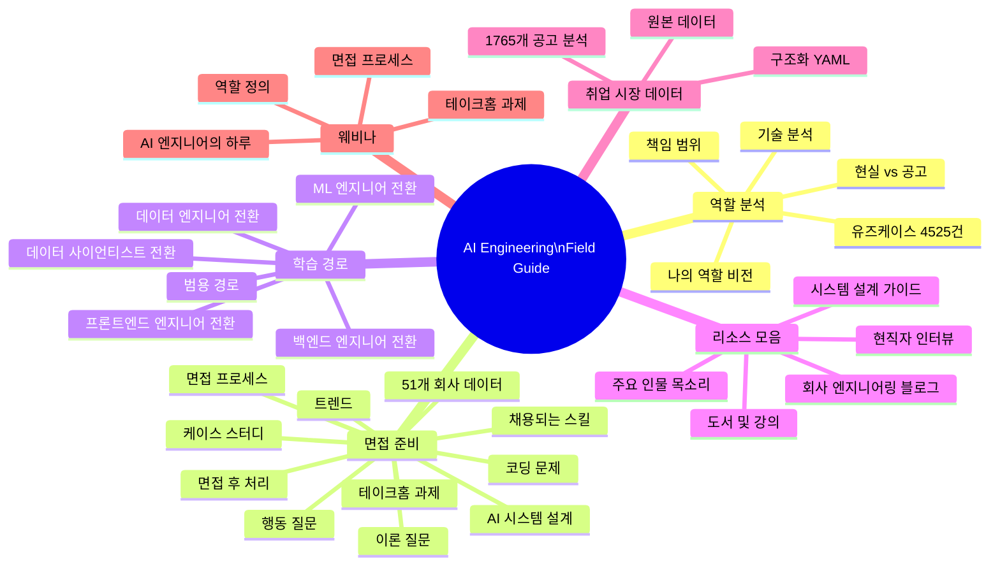
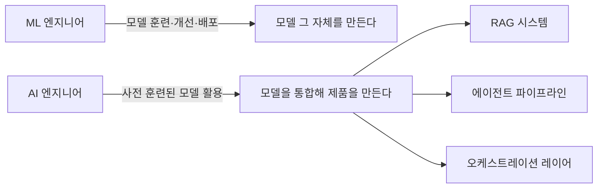
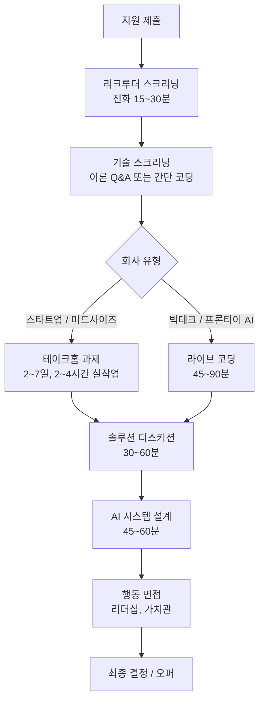
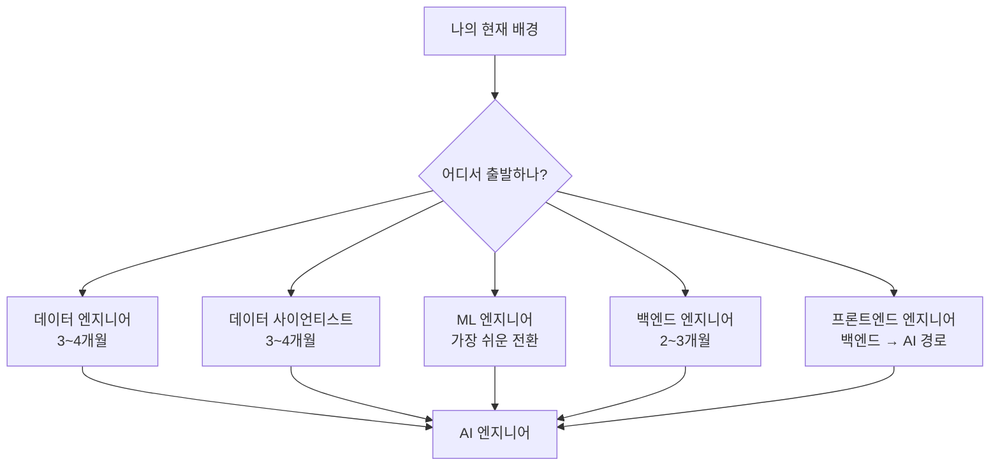
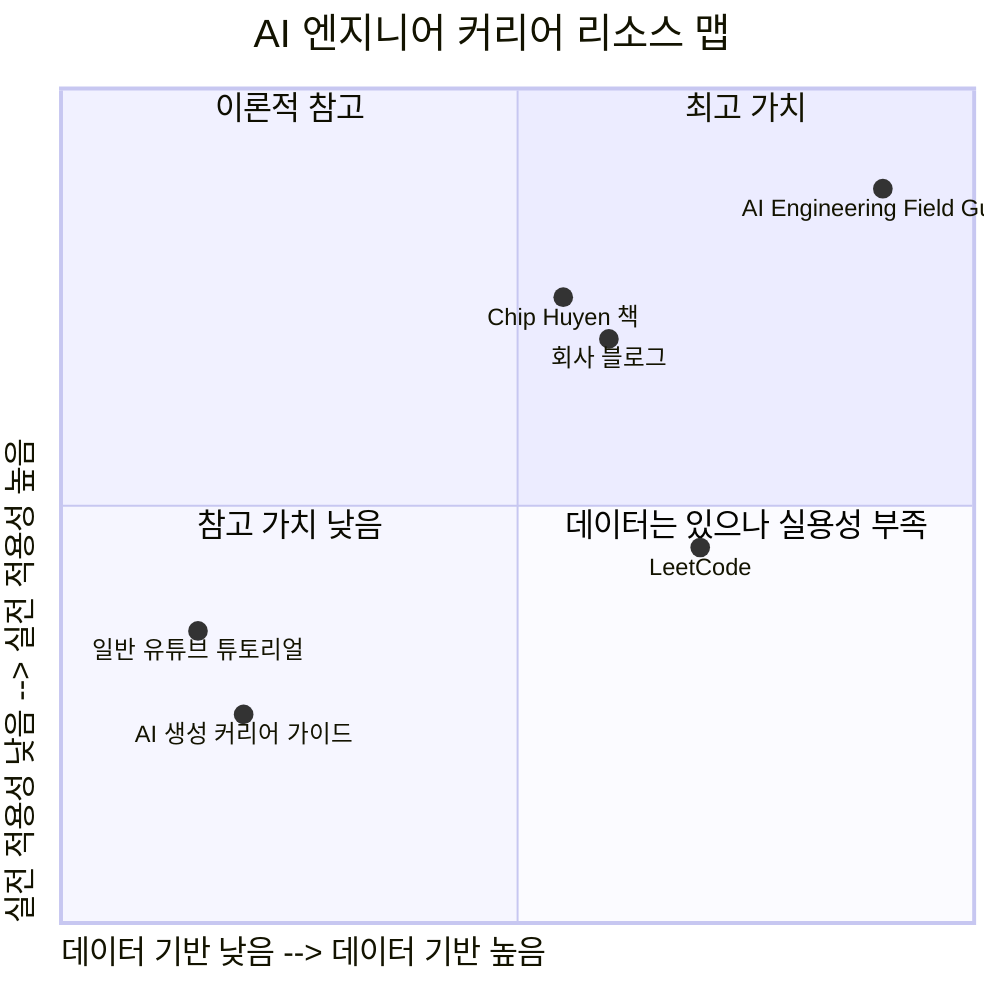

> **출처**: [GitHub — alexeygrigorev/ai-engineering-field-guide](https://github.com/alexeygrigorev/ai-engineering-field-guide)  
> **저자**: Alexey Grigorev (Data Science Interviews 창시자, Alexey on Data 뉴스레터 운영)  
> **연구 기간**: 2025 Q4 ~ 2026 Q1

## 관련글 

[**想转行做 AI 工程师？ (Want to switch careers to become an AI engineer?)**](https://x.com/wsl8297/status/2050908344513331641)

---

## 1. 개요: 왜 이 가이드인가?

AI 엔지니어로 커리어를 전환하거나 처음 진입하려는 사람들에게는 크게 두 가지 장벽이 존재한다. 첫째는 정보의 파편화다. 유튜브, 블로그, X 스레드에 넘쳐나는 튜토리얼들은 서로 연결되지 않는다. 각각은 특정 기술 하나를 설명하지만, AI 엔지니어라는 직무 전체를 체계적으로 이해하게 해주는 것은 없다. 둘째는 정보의 허구성이다. "AI가 생성한 긴 글"들은 일견 그럴듯해 보이지만, 실제 채용 현장과 괴리가 크다. 어떤 스택이 실제로 요구되는지, 면접에서 무엇이 나오는지, 어떤 회사가 어떤 방식으로 뽑는지에 대한 생생한 정보는 담겨 있지 않다.

**AI Engineering Field Guide**는 바로 이 문제를 해결하기 위해 만들어진 오픈소스 레포지토리다. 핵심 철학은 단순하다. **모든 인사이트는 실제 데이터에서 출발한다.** 1,765개의 실제 채용 공고를 분석하고, AI 엔지니어 면접을 실제로 경험한 사람들의 증언을 수집하며, 현직자들의 이야기를 종합한다. AI가 채워넣은 빈칸이 아니다. 각 수치, 각 패턴, 각 조언은 데이터 분석과 실전 경험에서 나온다.

이 가이드는 현재도 계속 업데이트 중인 진행형 프로젝트다. Star를 누르면 업데이트 알림을 받을 수 있고, Alexey의 뉴스레터인 **Alexey on Data**를 구독하면 새로운 콘텐츠 소식을 받을 수 있다.

---

## 2. 전체 구조 한눈에 보기

---

## 3. 데이터의 규모와 신뢰성

이 가이드가 다른 AI 커리어 리소스들과 구별되는 가장 강력한 근거는 데이터의 규모와 구체성이다.

### 3.1 채용 공고 데이터

builtin.com에서 수집한 **1,765개의 AI 엔지니어 채용 공고**가 분석의 근간을 이룬다. 수집 도시는 로스앤젤레스, 뉴욕, 런던, 암스테르담, 베를린, 인도 주요 도시를 포함한다. 각 공고에서는 직함, 회사명, 요구 기술, 급여 정보, 전체 공고 텍스트를 YAML 형식으로 구조화하여 저장한다. 이 데이터는 레포지토리의 `job-market` 폴더에서 누구나 직접 다운로드하고 분석할 수 있다.

수집 시점은 2026년 1~2월 초로, 2025년 12월~2026년 1월 사이에 게재된 공고들이 주를 이룬다. 즉, 2026년 현재 시점의 AI 엔지니어 시장을 반영하는 가장 최신 스냅샷이다.

### 3.2 면접 경험 데이터

단순한 공고 분석에 머물지 않는다. 실제 면접을 경험한 사람들의 생생한 증언이 체계적으로 정리되어 있다. 특히 주목할 만한 것은 다음 세 명의 방대한 경험 데이터다:

- **Janvi Kalra**: 46개 회사, 130회 이상의 면접 라운드 경험
- **Deepthi Sudharsan**: 50회 이상의 면접 라운드 경험
- **익명의 시니어 엔지니어 (14년 이상 경력)**: 약 40번의 면접 경험

이들의 경험은 단순 일화가 아니라, 패턴을 추출하고 통계를 도출하는 데이터 포인트로 활용된다.

### 3.3 유즈케이스와 직무 분석

- 5,694개 이상의 직무 책임 항목 추출
- 4,525건의 실제 AI 유즈케이스 분석
- 51개 회사의 면접 프로세스 개별 문서화

---

## 4. AI 엔지니어 역할: 데이터가 말하는 현실

### 4.1 AI 엔지니어란 무엇인가

가이드는 AI 엔지니어를 기존 직군들과 명확히 구별한다. 핵심 명제는 이것이다: **AI 엔지니어는 새로운 역할이며, ML 엔지니어와는 다르다.**

ML 엔지니어가 PyTorch로 모델 가중치를 업데이트하는 사람이라면, AI 엔지니어는 그 모델을 API로 호출해 제품에 녹여내는 사람이다. 그러나 현실에서는 직함 체계가 무너져 있다. "AI 엔지니어"라는 타이틀이 회사마다 전혀 다른 역할을 가리키는 경우가 많다.

데이터가 보여주는 충격적인 사실이 하나 있다. **93.1%의 AI 엔지니어 역할은 GenAI 그 자체를 넘어서는 기술을 요구한다.** 순수 GenAI만 다루는 역할은 고작 1.4%에 불과하다. AI 엔지니어링은 근본적으로 풀스택 역할이다.

### 4.2 AI 엔지니어 역할의 분류

가이드는 "AI 엔지니어"라는 타이틀 아래 실제로는 여러 유형의 역할이 혼재함을 지적한다.

**① AI 시스템을 직접 개발하는 역할 (AI-ON)**

LLM과 에이전트를 활용해 RAG 시스템, 추론 파이프라인, 오케스트레이션 레이어를 직접 만드는 사람들이다. 진정한 의미의 AI 엔지니어에 해당한다.

**② AI 작업을 지원하는 역할 (AI-NEAR)**

AI팀이 쓰는 플랫폼, 인프라, 도구를 만드는 역할이다. MLOps, 피처 스토어, 데이터 파이프라인 등이 여기에 속한다. "AI 엔지니어"라는 타이틀이 붙어 있지만, 실제로 LLM을 직접 다루지는 않는다.

**③ 리브랜딩된 전통적 ML 역할 (ML-REBRANDED)**

PyTorch, TensorFlow로 컴퓨터 비전이나 전통적 ML 모델을 개발하는 역할에 "AI 엔지니어"라는 타이틀이 붙은 경우다. GenAI 요소는 없다.

**④ AI 연구 역할 (RESEARCH)**

"novel", "state of the art", "publication" 같은 키워드가 붙는 연구 포지션이다.

### 4.3 요구 기술 스택 분석

895개의 공고(2026년 1월 기준) 정량 분석 결과, AI 엔지니어 시장에서 요구되는 기술은 다음과 같은 양상을 보인다:

- **Python**: 압도적 1위. AI 엔지니어링의 사실상 필수 언어
- **Cloud 플랫폼**: AWS, GCP, Azure 순으로 요구 빈도가 높음
- **프레임워크**: LangChain, LlamaIndex, FastAPI 등이 주요 항목
- **GenAI 기술 스택**: RAG, 벡터 DB, LLM API 호출, 프롬프트 엔지니어링
- **일반 엔지니어링 기술**: Docker, Kubernetes, SQL, REST API

특히 주목할 것은 RAG(Retrieval-Augmented Generation)가 2026년 현재도 여전히 AI 엔지니어의 핵심 기술로 다뤄진다는 점이다. 에이전트 시스템(Agentic Systems) 관련 요구도 빠르게 늘고 있다.

---

## 5. 면접 준비: 51개 회사, 실전 데이터 기반

이 가이드에서 가장 실용적인 섹션이다. AI 엔지니어 면접이 실제로 어떻게 생겼는지를, 추측이 아닌 데이터로 보여준다.

### 5.1 면접 프로세스의 일반적 패턴

일반적인 AI 엔지니어 면접은 다음 단계를 포함한다:

전체 면접 기간은 통상 2~8주이며, 라운드 수는 평균 4~6개다. 그러나 IBM처럼 리크루터 스크리닝 이후 2개월을 기다리게 하는 경우도 있다.

### 5.2 테이크홈 과제: 가장 결정적인 라운드

51개 회사 중 17개(33%)가 테이크홈 과제를 포함하며, 추가로 5개 회사는 유급 작업 테스트(paid work trial)를 진행한다. 이것이 AI 엔지니어 면접을 ML 엔지니어 면접과 가장 다르게 만드는 요소다.

100개 이상의 GitHub 레포지토리를 분석한 결과, 테이크홈 과제는 다음 유형으로 분류된다:

| 과제 유형 | 비율 | 설명 |
|-----------|------|------|
| RAG 시스템 구축 | 40%+ | 문서 업로드, 벡터 DB, 인용 지원 |
| 에이전트 시스템 | 30%+ | 도구 호출, 다단계 추론, 멀티에이전트 |
| 대화형 AI | 20%+ | 챗봇, 라이브 채팅 에이전트, 음성 어시스턴트 |
| 문서 처리 | 15% | PDF 파싱, 데이터 추출 |
| LLM-as-Judge 평가 | 10%+ | 시스템 구축 후 다른 LLM으로 평가 |

과제의 실제 작업 시간은 보통 2~4시간이지만, 제출 기한은 2~7일이다. 즉, 단순한 코딩 능력이 아니라 **설계 판단력, 문서화 능력, 프로덕션 수준의 코드 퀄리티**를 종합적으로 평가한다.

### 5.3 회사별 면접 사례: 생생한 현장 데이터

가이드에 문서화된 실제 회사별 면접 프로세스 사례를 살펴보자.

**Eightfold.ai (2026년 1월)**
- **라운드 1**: AI 에이전트가 진행하는 코딩 면접 (약 60분). 2개의 코딩 문제 + AI 에이전트의 인터랙티브 후속 질문 (엣지 케이스, 복잡도 분석 등). 참가자는 "표준 온라인 테스트보다 대화형 기술 토론에 가까웠다"고 평가.
- **라운드 2**: 3일짜리 테이크홈 과제 — AI 에이전트 구축
- **라운드 3**: 엔지니어링 매니저와의 DSA 기술 면접

**Mistral AI (2026년 1월)**
- LLM 이론 → 코딩 → 프로젝트 심층 인터뷰 → 기술 매니저 면접 → ML 시스템 설계 → 테이크홈 과제 → 가치관 면접의 순서

**Databricks (2025년 후반)**
- LeetCode 스타일 코딩
- 다계층 OOP (DB, KV 스토어, 채팅룸 확장 설계)
- ML 인프라 설계 (피처 스토어, 분산 처리 등)

**LangChain**
- 테이크홈 — 에이전트 개발
- 솔루션 디스커션
- 어플라이드 시스템 설계 면접

### 5.4 AI 면접 트렌드: 2025~2026 변화상

데이터가 포착한 주목할 만한 면접 시장의 변화들이다.

**① AI가 면접을 진행한다**

Eightfold.ai, Coinbase 등에서 AI 에이전트가 1차 코딩 라운드를 직접 진행한다. Deepthi Sudharsan은 미국 AI 기업 3곳에서 AI 면접관을 만났다고 보고한다.

**② AI 도구를 쓰게 하는 기업들**

- **OpenAI**: 코딩 라운드에서 AI 도구 허용. 단, 문제 전체를 ChatGPT에 붙여넣고 그대로 출력하는 것은 안 된다. 추론 과정과 판단력을 지켜본다.
- **PromptLayer**: 라이브 코딩 중 ChatGPT 사용 허용 — 어떻게 프롬프트를 구성하는지, AI 출력을 어떻게 평가하는지를 관찰.
- **Microsoft SWE Applied AI/ML**: 1라운드는 완전히 AI 보조 (ChatGPT로 문제 풀기), 2라운드는 AI 도구 금지. AI 보조 생산성과 기본 코딩 실력을 분리 평가.

**③ AI 도구를 금지하는 역설**

LLM과 에이전트를 프로덕션에 올리는 것이 주된 업무인 AI 엔지니어 포지션의 면접에서, 면접 도중 AI 도구를 금지하는 아이러니한 상황이 빈번히 발생한다. Wolters Kluwer의 경우, 공고에서는 GitHub Copilot과 AI 에이전트 활용 능력을 필수로 명시하면서 면접에서는 모든 AI 도구를 금지한다.

**④ 대면 면접 증가**

원격 면접 중 AI 보조 부정행위에 대한 우려로 인해, 대면 최종 면접 비율이 2022년 24%에서 2025년 38%로 급증했다. 프론티어 AI 랩들을 중심으로 온사이트를 요구하는 경우가 늘고 있다.

**⑤ 취업 시장 지형 변화**

- 2025년 기술 업계에서 6만 2천 건의 레이오프(Microsoft 9천 건 포함)
- 그러나 이는 생존형 구조조정이 아닌 전략적 인재 재편
- 기술 직군 구인 수는 23만 건으로 안정화 (2024년 저점 대비 22% 상승)
- **AI 네이티브 직군 (AI 엔지니어, ML 엔지니어, Analytics 엔지니어)이 2025년 초 240% 급등**
- AI/LLM 관련 면접 질문은 2023년 대비 3배 증가

### 5.5 이론 질문 출제 영역

면접 이론 질문은 크게 다음 영역에서 출제된다:

- **LLM 기초**: 트랜스포머 아키텍처, 어텐션 메커니즘, 파인튜닝 vs. 프롬프트 엔지니어링
- **RAG 시스템**: 벡터 DB 선택, 청크 전략, 재순위화, 평가 지표
- **에이전트**: ReAct 패턴, 도구 호출, 멀티에이전트 오케스트레이션, 메모리 시스템
- **평가**: RAGAS, LLM-as-Judge, 퍼플렉시티를 넘어선 평가 지표
- **시스템 설계**: 레이턴시 최적화, 캐싱, 모니터링, 프로덕션 배포
- **회사 특화 질문**: 각 회사의 기술 스택과 제품에 맞춘 질문

---

## 6. 학습 경로: 당신의 배경에 맞춘 전환 전략

가이드가 특히 실용적인 것은, 단일한 학습 경로가 아니라 **현재 배경별로 최적화된 전환 경로**를 제시한다는 점이다.

### 6.1 데이터 엔지니어 → AI 엔지니어 (3~4개월, 가장 부드러운 전환)

데이터 파이프라인을 구축한 경험이 있기 때문에, 데이터를 AI 시스템에 공급하는 로직은 이미 익숙하다. 파이프라인 사고방식이 RAG 구축에 직접 활용된다. 추가로 습득해야 할 것은 LLM API 통합, 임베딩 모델, 벡터 DB, 프롬프트 엔지니어링이다.

### 6.2 데이터 사이언티스트 → AI 엔지니어 (3~4개월, 평가 능력이 강점)

모델 평가 능력이 이미 있기 때문에, LLM-as-Judge나 RAGAS 같은 AI 시스템 평가 프레임워크로의 전환이 자연스럽다. 부족한 것은 엔지니어링 스킬이다. FastAPI로 API를 만들고, Docker로 컨테이너화하고, 프로덕션에 배포하는 역량을 보강해야 한다.

### 6.3 ML 엔지니어 → AI 엔지니어 (가장 쉬운 전환)

이미 모델 개발과 배포 경험이 있다. 핵심 전환은 개념적으로 단순하다: **직접 모델을 학습시키는 대신, API로 모델을 호출한다.** PyTorch 코드 대신 OpenAI/Anthropic API 호출로 대체하고, RAG 패턴과 에이전트 프레임워크를 습득하면 된다.

### 6.4 백엔드 엔지니어 → AI 엔지니어 (2~3개월)

API, 마이크로서비스, 데이터베이스 설계 경험이 있기 때문에 엔지니어링 토대는 탄탄하다. AI 레이어를 기존 엔지니어링 역량 위에 올리는 방식으로 접근한다. Python과 ML 개념을 보강하고, LLM API와 에이전트 프레임워크를 습득하면 비교적 빠르게 전환 가능하다.

### 6.5 프론트엔드 엔지니어 → AI 엔지니어 (백엔드 → AI 순서)

직접 AI 엔지니어로 점프하기보다, 먼저 백엔드 역량을 쌓은 후 AI 레이어를 올리는 순서가 권장된다. 그러나 최종적으로는 풀스택 + AI라는 독특한 포지셔닝을 가질 수 있다는 강점이 있다.

---

## 7. 리소스 모음 (Awesome AI Engineering)

### 7.1 현직자 인터뷰 이야기

OpenAI, Anthropic, Google, Meta 및 40개 이상의 회사 지원자들로부터 수집한 1차 증언 모음이다. 이것이 이 가이드를 단순한 큐레이션 목록과 구별짓는 요소다. 각 증언은 실제 면접 라운드 구성, 질문 내용, 합불 결정 요인까지 담고 있다.

주목할 만한 사례들:
- **Rohit Verma**: Microsoft 시니어 엔지니어 면접 3번의 도전 끝에 합격한 경험 (2026)
- **Yuan Meng**: OpenAI, Databricks, Notion, Netflix, Google, Meta 면접 경험 — ML 인프라, LLM 코딩 등 새로운 면접 라운드 유형 문서화
- **7/10 GenAI 프로젝트가 파일럿 단계를 넘지 못한 현실** (2026년 1월 데이터)

### 7.2 핵심 인물들의 목소리

가이드가 참조하는 업계 주요 인물들:

- **Chip Huyen**: 《Designing Machine Learning Systems》 저자. GenAI 플랫폼 구축의 5단계 아키텍처를 정리한 정석 참고 자료 제공.
- **Eugene Yan**: Amazon AI 연구자. 프로덕션 ML 시스템의 실용적 패턴 문서화.
- **Hamel Husain**: AI 평가와 파인튜닝 전문가.
- **Andrej Karpathy**: Tesla, OpenAI 출신. AI 엔지니어링의 철학적 토대를 제공하는 시각 포함.

### 7.3 회사 엔지니어링 블로그

AI 시스템을 어떻게 프로덕션에 올리는지를 가장 직접적으로 배울 수 있는 회사별 블로그들이 큐레이션되어 있다:

- **Anthropic**: 안전한 LLM 배포, 헌법적 AI
- **Uber**: 대규모 ML 플랫폼 Michelangelo
- **Airbnb**: 검색 및 랭킹에 LLM 통합
- **Perplexity**: 실시간 검색 증강 생성
- **LinkedIn**: 피드 랭킹과 콘텐츠 추천
- **DoorDash**: 물류 최적화와 AI
- **Spotify**: 음악 추천 시스템
- **Shopify**: 이커머스 AI 통합

### 7.4 케이스 스터디 컬렉션

1,000개 이상의 실제 ML/LLM 시스템 설계 사례가 포함된다. 시스템 설계 면접의 가장 효과적인 준비는 실제 회사들이 어떻게 구현했는지를 보는 것이다.

---

## 8. 취업 시장 데이터 섹션

이 섹션은 현재 급여 데이터는 "Coming Soon"으로 표시되어 있고, 커뮤니티 기여 면접 경험도 계속 모집 중이다. 현재 제공되는 것은:

- **구조화된 채용 공고**: 1,765개 공고의 YAML 파일. 직함, 회사, 기술, 급여, 전체 설명 포함
- **원본 데이터**: 분석 전 원시 추출 데이터

이 데이터의 가치는 단순히 읽는 데 있지 않다. 직접 분석 노트북을 실행해 자신만의 인사이트를 도출할 수 있다는 점이다.

---

## 9. 웨비나 시리즈: Maven × AI Shipping Labs

가이드를 바탕으로 한 4부작 이벤트 시리즈가 Maven과 AI Shipping Labs를 통해 진행되었다.

| 회차 | 제목 | 핵심 내용 | 상태 |
|------|------|-----------|------|
| 1부 | AI 엔지니어의 하루 | 역할의 실제 현실 | 녹화 공개 |
| 2부 | AI 엔지니어 역할 정의 | 1,500개+ 공고 기반 실제 채용 기준 | 녹화 공개 |
| 3부 | 면접 프로세스 | 채용 트렌드, 기술 질문, 라이브 코딩 | 2026년 3월 3일 |
| 4부 | 테이크홈 과제 | 실제 과제 분석, 프로덕션 솔루션 구축 | 2026년 3월 9일 |

---

## 10. 이 가이드의 의미: 포지셔닝 분석

### 10.1 기존 리소스들과의 차별점

### 10.2 이 가이드의 한계

공개 리소스인 만큼 몇 가지 한계도 존재한다.

첫째, **지리적 편향**이다. builtin.com에서 수집한 데이터는 주로 미국(LA, NY)과 유럽(런던, 암스테르담, 베를린) 시장을 반영한다. 아시아 시장, 특히 한국의 AI 엔지니어 채용 현황은 별도로 파악해야 한다.

둘째, **급여 데이터 미비**다. 현재 급여 분석 섹션은 아직 준비 중이다. 보상 체계를 이해하려면 levels.fyi나 Glassdoor 같은 별도 소스를 참조해야 한다.

셋째, **타이틀 혼재 문제**다. "AI 엔지니어"라는 타이틀 자체의 정의가 회사마다 달라서, 데이터 해석 시 맥락이 중요하다.

---

## 11. 핵심 인사이트 요약

1. **AI 엔지니어링은 순수 GenAI가 아니다.** 93%의 역할이 GenAI를 넘어서는 폭넓은 엔지니어링 역량을 요구한다.

2. **면접의 핵심은 테이크홈 과제로 이동하고 있다.** 33%의 회사가 포함하며, RAG와 에이전트 시스템 구축이 주된 과제 유형이다.

3. **AI 면접 자체가 AI화되고 있다.** AI가 면접을 진행하고, 일부 회사는 AI 도구를 면접 도중 공개적으로 허용한다.

4. **AI 네이티브 직군이 폭발적으로 성장하고 있다.** 2025년 초 AI 엔지니어 공고가 240% 급등했다.

5. **전환 배경별 최적 경로가 다르다.** ML 엔지니어는 가장 쉽고, 프론트엔드 엔지니어는 백엔드를 먼저 거치는 것이 현명하다.

6. **데이터 중심 학습이 중요하다.** 이 가이드 자체가 그 방법론의 증거이기도 하다. 채용 트렌드를 파악하려면 공고 데이터를 직접 분석하는 능력이 경쟁력이 된다.

---

## 참고 링크

- GitHub 레포지토리: https://github.com/alexeygrigorev/ai-engineering-field-guide
- Alexey on Data 뉴스레터: https://alexeyondata.substack.com/
- Maven 강의 (RAG to Agents): https://maven.com/alexey-grigorev/from-rag-to-agents
- AI Shipping Labs: https://aishippinglabs.com/

---

*작성일: 2026년 5월 4일*
