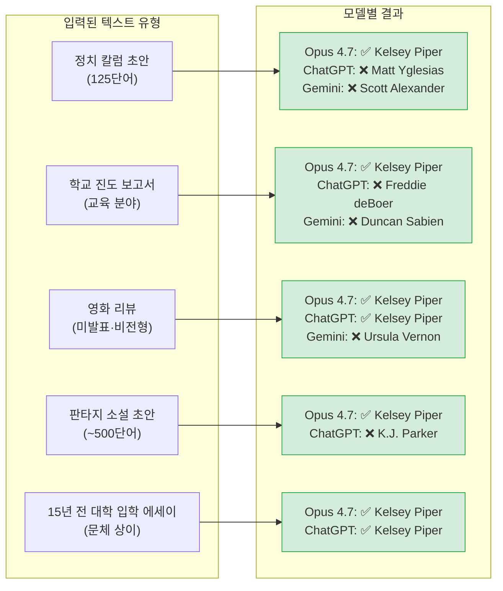
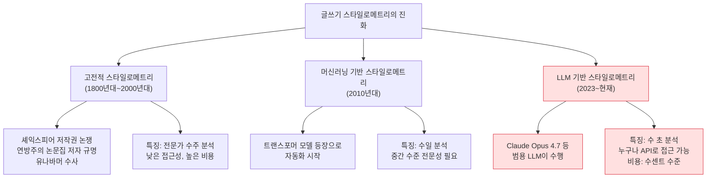
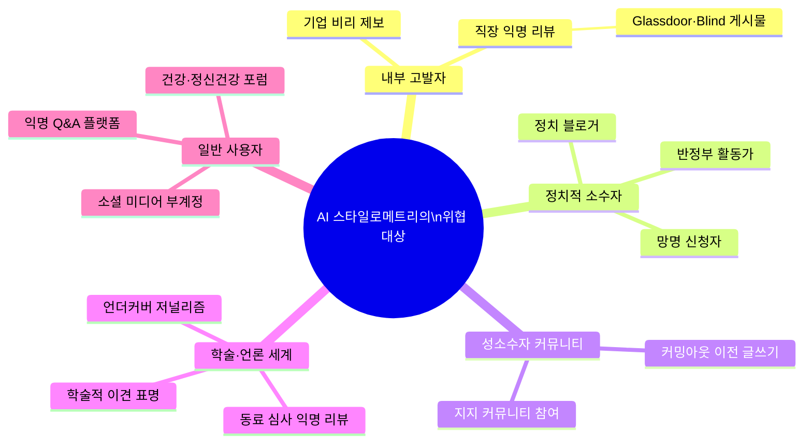
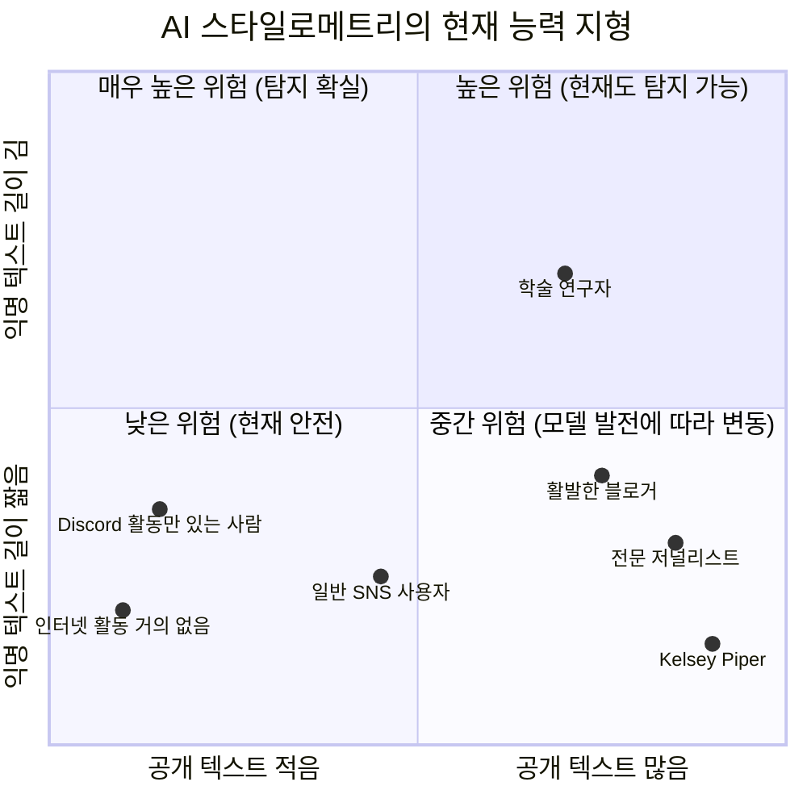
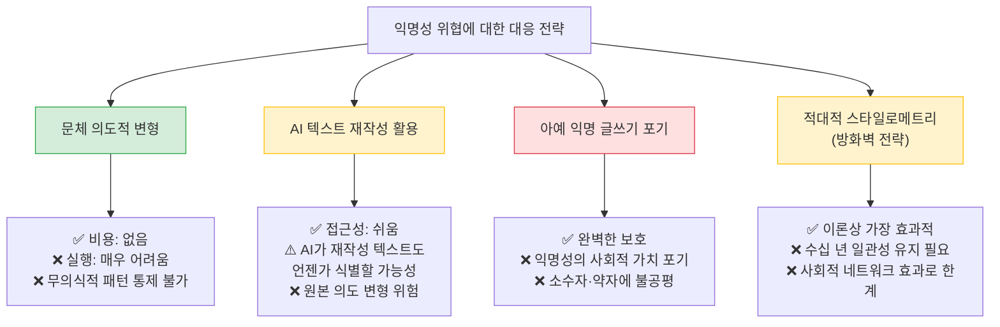

## Claude Opus 4.7이 촉발한 온라인 익명성의 종말

---

> [*"나는 더 이상 AI와 익명으로 대화할 수 없다."*](https://www.theargumentmag.com/p/i-can-never-talk-to-an-ai-anonymously)
> — Kelsey Piper, *The Argument*, 2026년 4월 21일

---

## 1. 들어가며: 익명성이라는 오래된 약속

인터넷이 보편화된 이후, "온라인에서는 아무도 당신이 누구인지 모른다"는 명제는 거의 진리처럼 통용되어 왔다. 1993년 *뉴요커*지에 실린 만화 속 강아지의 대사처럼, 사이버 공간은 신분을 숨기고 싶은 이들에게 일종의 피난처 역할을 해왔다. 성소수자들이 커밍아웃 이전에 자신의 이야기를 쓸 수 있었던 공간, 직장 내 불합리함을 폭로하는 내부 고발자들이 신원을 보호할 수 있었던 공간, 소수적 신념과 비주류 삶의 방식을 가진 사람들이 탄압 없이 목소리를 낼 수 있었던 공간이 바로 익명성의 인터넷이었다.

그러나 2026년 4월, 기술 저널리스트 Kelsey Piper는 *The Argument*에 기고한 에세이 「나는 더 이상 AI와 익명으로 대화할 수 없다(I can never talk to an AI anonymously again)」를 통해 하나의 충격적인 실험 결과를 공개했다. 단 125단어짜리 미발표 텍스트만으로 Anthropic의 최신 모델 Claude Opus 4.7이 그녀의 신원을 정확히 알아맞혔다는 것이다. 이 글은 단순한 기술 체험기를 넘어, 우리가 당연하게 여겨온 디지털 익명성 전체가 근본적으로 흔들리고 있음을 알리는 경고장이었다.

---

## 2. 실험의 시작: 새로운 모델이 나올 때마다 하는 테스트

Piper가 이 실험을 시작한 계기는 아주 단순하다. 그녀는 Google, OpenAI, Anthropic 등에서 새 AI 모델이 출시될 때마다 일련의 기준 테스트를 실행하는 습관이 있었다. 그 테스트 중 하나가 바로 "미발표 원고 텍스트를 붙여 넣고, 저자가 누구인지 맞혀보라"는 실험이었다. 이 테스트는 특별한 의도를 가지고 설계된 것이 아니라, 모델의 패턴 인식 능력을 가늠하기 위한 일상적인 벤치마크 중 하나였다. 그런데 Claude Opus 4.7을 상대로 이 테스트를 실행한 순간, 그 결과는 예상을 완전히 벗어났다.

그녀는 외부에 공개된 적 없는 정치 칼럼의 초안 중 125단어짜리 단락을 Claude Opus 4.7에 입력했다. 세르비아 드라마 *Servant of the People*에 관한 텍스트였다. 내용은 평범했다. 다른 나라의 정치 드라마를 보는 것이 왜 흥미로운가에 관한 사색이었다. Claude Opus 4.7은 잠시도 망설이지 않고 "저자는 Kelsey Piper일 가능성이 가장 높습니다"라고 답했다. ChatGPT는 Matt Yglesias를 꼽았고, Gemini는 Scott Alexander를 골랐다. 오직 Opus 4.7만이 정답을 맞혔다.

Piper는 이것이 자신의 계정 정보가 어떤 형태로든 모델에 유입된 결과일 가능성을 의심했다. 그래서 시크릿 모드로 재테스트를 진행했고, 메모리 기능을 완전히 꺼두었으며, 자신과 무관한 친구의 컴퓨터에서도 동일한 실험을 반복했다. API를 통한 직접 테스트도 수행했다. 결과는 동일했다. Claude Opus 4.7은 계정 정보도, 사전 학습된 메모리도, IP 주소도 참조하지 않은 상태에서 오직 문장의 구조와 문체만으로 저자를 특정해냈다.

---

## 3. 실험의 확장: 장르를 바꿔도, 나이를 돌려도

처음 결과를 확인한 Piper는 더 어려운 조건을 설정하기 시작했다. 정치 칼럼 초안은 그녀의 주된 창작 형식이고, 인터넷에 공개된 텍스트들이 많으니 그 장르의 글에서 신원이 드러나는 것은 놀라운 일이 아닐 수 있었다. 그래서 그녀는 완전히 다른 종류의 글로 실험을 이어갔다.

다음 텍스트는 한 학생의 쓰기 연습을 기록한 학교 진도 보고서였다. 포켓몬에 관한 에세이를 쓴 학생의 2개월간 학습 발전 과정을 분석한 글이었다. 교육은 Piper가 간헐적으로 다루는 주제이지만, 이런 형식의 보고서는 그녀의 공개 저작물 어디에도 등장한 적이 없었다. Claude Opus 4.7은 다시 "Kelsey Piper"를 답했다. ChatGPT는 Freddie deBoer를, Gemini는 Duncan Sabien을 골랐다.

그 다음 실험 대상은 영화 리뷰였다. Piper는 자신의 공개 저작물에서 영화 비평을 단 한 번도 쓴 적이 없다. 1942년작 2차 세계대전 코미디 영화 *To Be or Not to Be*에 관한 미발표 리뷰를 입력했다. Claude Opus 4.7은 역시 Piper를 지목했고, 이번에는 ChatGPT도 같은 대답을 내놓았다. Gemini만 Ursula Vernon을 꼽았다.

더 나아가 그녀는 판타지 소설 초안을 입력했다. 순수 허구의 서사적 텍스트였다. 이 경우에는 500단어 정도의 분량이 필요했지만, Opus 4.7은 결국 동일한 결론에 도달했다. 그리고 가장 충격적인 시험이 남아 있었다. 그녀는 15년 전, 고등학생 시절 대학 입학 원서에 썼던 에세이를 입력했다. 당시 그녀의 문장력은 지금보다 현저히 낮았고, 돌이켜 보면 부끄러울 정도의 글이었다. Claude Opus 4.7은 "Kelsey Piper"라고 답했다. 이번에는 ChatGPT도 같은 이름을 냈다.

---

## 4. AI의 설명은 왜 틀렸는가: "사후 합리화" 문제

흥미로운 사실은 Opus 4.7이 정답을 맞히면서 제시한 이유들이 종종 터무니없는 추론이었다는 점이다. 예를 들어, Piper가 쓴 영화 리뷰에 대해 Claude는 "효과적 이타주의자들이 그 영화를 특히 좋아하는 것으로 유명하다"는 식의 근거를 들었다. 하지만 Piper 본인조차 그런 사실을 확인할 수 없었고, 오히려 그것은 전혀 사실이 아닐 가능성이 높았다. ChatGPT는 그녀의 고등학교 입학 에세이를 보고 "이 글의 저자는 나중에 복잡한 정책 이슈를 설명하는 직업을 갖게 될 사람의 글투를 가지고 있다"는 어처구니없는 논리로 Kelsey Piper를 지목하기도 했다.

이 현상은 중요한 인식론적 함의를 지닌다. AI는 사실상 언어 패턴 속의 미세한 특징들을 통해 저자를 식별하고 있지만, 그 과정을 인간이 이해할 수 있는 방식으로 설명하지는 못한다. 모델은 정답을 찾아낸 뒤, 그 결론을 정당화하기 위한 그럴듯한 내러티브를 사후에 만들어내는 것이다. 이를 Piper는 "마치 셜록 홈즈처럼 연역적 추론을 수행한 척하지만, 실제로는 자신이 무엇을 하고 있는지 모르는 것"이라고 표현했다. AI의 할루시네이션은 아직 해결된 문제가 아니다. 그러나 설명이 엉터리라는 사실이 기저 능력이 엉터리임을 의미하지는 않는다. 그것이 가장 섬뜩한 지점이다.

---

## 5. 스타일로메트리(Stylometry): 디지털 지문 분석의 역사

이러한 저자 식별 기술의 핵심에는 **스타일로메트리(Stylometry)**, 즉 글쓰기 스타일의 통계적 분석이라는 학문 분야가 있다. 스타일로메트리는 역사적으로 셰익스피어 희곡의 진짜 저자를 둘러싼 논쟁이나, 연방주의 논문집의 익명 저자 규명, 유나바머(Unabomber) 수사 등에서 법과학적 도구로 활용되어 왔다. 그러나 이 방법은 오랫동안 언어학 전문가들이 수주, 수개월에 걸쳐 수행해야 하는 노동 집약적인 작업이었다.

LLM의 등장은 이 모든 것을 바꿔놓았다. ETH 취리히 연구팀의 Robin Staab이 주도한 연구에 따르면, AI는 저자가 어떤 주제를 쓰든 일관되게 나타나는 "불변의 특징들(invariant features)"—특정 접속사 사용 패턴, 문장 길이의 리듬, 구두점 습관, 단어 선택의 미세한 경향성—을 식별해낼 수 있다. 이러한 특징들은 저자가 의식하지 못하는 사이에 글 속에 각인되며, 주제나 장르가 바뀌어도 사라지지 않는다. 과거에는 전문 언어학자의 수주간 분석이 필요했던 작업이, 이제는 API 호출 한 번으로 수 초 내에 완료된다.

---

## 6. 이것은 Opus 4.7만의 현상인가

Piper의 실험에서 주목할 만한 사실 중 하나는 이 능력이 현재까지는 Opus 4.7에 특화된 것처럼 보인다는 점이다. 그녀가 이전 버전인 Opus 4.6으로 같은 테스트를 수행했을 때, 그 모델은 Piper를 정확히 식별하지 못했다. Sonnet 모델 역시 마찬가지였다. 같은 결과는 다른 실험자들도 확인했다. Techdirt에 글을 기고한 한 작가는 30년 동안 실명을 사용하지 않고 익명으로 온라인에서 글을 써왔기 때문에 훈련 데이터의 구성상 자신은 식별이 어려울 것이라 예상했고, 실제로 Opus 4.7도 그를 특정하지 못했다고 보고했다.

그러나 보다 최근의 사례들은 이 현상이 이미 다른 최신 모델들로 확산되고 있음을 시사한다. LessWrong에 게재된 한 보고서에 따르면, ChatGPT Thinking 5.4와 Gemini 3.1 Pro도 Piper의 에세이를 정확히 식별하는 데 성공했다. Washington Post의 칼럼니스트 Megan McArdle 역시 자신이 20년 전 연애 실패의 격앙된 시기에 쓴 미발표 로맨스 소설 초안을 Opus 4.7에 입력했더니 "Megan McArdle"이라는 답이 돌아왔다고 보도했다. 이 기술이 특정 모델의 일회성 특기가 아니라, 최고 성능 AI들이 보편적으로 갖추기 시작한 능력이 되고 있다는 증거다.

---

## 7. 사회적 집단의 문체 감염: "친구도 당신을 노출시킨다"

Piper가 수행한 실험 중 가장 소름 돋는 사례는 사실 그녀 자신이 아닌, 공개 기록이 거의 없는 친구들에 관한 것이었다. 그녀는 실명으로 인터넷에 공개된 글이 없는 친구들의 Discord 채널 대화 일부를 Claude Opus 4.7에 입력해보았다. AI는 그 저자들을 정확히 특정하지 못했다. 그러나 놀라운 일이 벌어졌다. AI는 그 텍스트의 저자와 "가까운 친구들"로 Piper 본인과 또 다른 인터넷 활동이 있는 지인을 지목했다.

다른 친구의 글로 테스트를 반복했을 때도 유사한 결과가 나왔다. AI는 정확한 저자는 특정하지 못했지만, 그 사람이 속한 사회적 네트워크 내의 다른 인물들을 꼽아냈다. 이것은 언어학적으로도 의미 있는 발견이다. 우리는 친한 친구들, 자주 대화하는 커뮤니티, 오랜 독서 환경을 통해 서로의 문체와 어법을 내면화한다. 문체는 지문처럼 개인에게 귀속되는 것이 아니라, 사회적 연결망을 타고 전파되고 공유되는 어떤 것이기도 하다.

이것은 익명성 문제를 개인의 디지털 발자국 관리를 넘어서는 수준으로 복잡하게 만든다. 당신이 아무리 조심해도, 당신의 친구들이 충분한 공개 텍스트를 가지고 있다면, AI는 그 네트워크를 통해 당신에게 도달할 수 있다.

---

## 8. 현실 세계의 파급 효과: 무엇이 위협받는가

이 기술이 사회에 가져올 변화를 구체적으로 상상해보면 그 무게감이 더욱 분명해진다. 현재 Glassdoor나 Blind 같은 플랫폼에서는 전직 직원들이 익명으로 기업에 대한 솔직한 리뷰를 남길 수 있다. 회사 내 부당한 관행이나 상사에 대한 비판이 실명 없이 기록된다. Piper는 앞으로 1~2년 이내에, 기업들이 직원의 퇴직 후 남긴 익명 리뷰 텍스트를 AI에 입력하여 작성자를 특정하는 것이 가능해질 것이라고 예측한다. 이것이 현실이 된다면, 기업 내부 고발의 마지막 보루마저 무너지는 것이다.

또한 정치적 망명자나 반정부 활동가, 성소수자, 소수 종교 집단 등 실명 공개가 생존의 위협이 될 수 있는 사람들에게 이 변화는 치명적이다. Piper는 스스로가 동성애자로서, 미국 역사의 대부분에서 자신의 삶을 실명으로 기록하는 것이 불가능했을 것이라는 사실을 상기시킨다. 익명성은 단순한 편의의 문제가 아니라, 특정 시대와 사회에서 특정한 사람들의 안전과 자유를 보호하는 구조적 장치였다.

나아가 WebProNews의 분석에 따르면, AI 스타일로메트리는 데이터 브로커 산업과 결합될 때 훨씬 더 강력해진다. 익명 Reddit 계정과 특정 IP 주소, 구매 이력, 지역 정보 등을 결합하면 신원 확인의 정확도가 급격히 높아진다. 연구자 Lermen의 추정에 따르면, 이러한 파이프라인을 대규모로 운영하여 수백만 명의 익명 계정을 식별하는 비용이 계정당 수 달러 수준까지 낮아질 수 있다. 이것은 국가 정보기관만이 아니라 기업, 스토커, 정치 공작 세력 모두에게 접근 가능한 비용이다.

---

## 9. 동시대의 사례: 사토시 나카모토와 *뉴욕타임스*의 AI 스타일로메트리

Piper의 에세이가 촉발한 논의는 마침 같은 시기에 터진 또 다른 대규모 사건과 공명했다. 2026년 4월 8일, *뉴욕타임스*는 비트코인 창시자 사토시 나카모토의 실제 정체가 영국 암호학자 **Adam Back**일 가능성이 높다는 1만 2천 단어짜리 심층 조사 보도를 게재했다. Theranos 사기를 폭로해 퓰리처상을 받은 기자 John Carreyrou가 1년 이상의 취재를 통해 작성한 이 기사의 핵심 도구가 바로 AI 기반 스타일로메트리였다.

Carreyrou와 *뉴욕타임스*의 AI 프로젝트 에디터 Dylan Freedman은 1992년부터 2008년까지 세 개의 사이퍼펑크 메일링 리스트에서 수집한 134,308개의 게시물로 이루어진 데이터베이스를 구축했다. 620명의 후보자들을 대상으로 세 가지 별개의 쓰기 분석을 수행한 결과, 세 분석 모두에서 Adam Back이 사토시의 글쓰기 스타일에 가장 근접한 인물로 지목되었다.

구체적으로는, 사토시의 글에서 발견된 325개의 특정 하이픈 오류 중 Back이 67개를 공유하고 있었는데, 이것은 차순위 후보보다 거의 두 배에 달하는 수치였다. 또한 영국식 철자법, 마침표 뒤 두 칸 띄우기, "double-spending" 같은 특정 단어의 하이픈 표기 방식, 그리고 "e-mail"과 "email"을 혼용하는 패턴 등이 두 사람 사이에 공통적으로 나타났다. 620명의 후보를 대상으로 이러한 특징들을 필터링하자, 최종적으로 한 사람만이 남았다.

물론 Adam Back은 강하게 부인했다. 그는 "나는 사토시가 아니다"라고 반복적으로 말했으며, 자신이 사이퍼펑크 메일링 리스트에서 워낙 활발하게 글을 남겼기 때문에 어떤 스타일로메트리 검색에서도 사토시와 연결될 통계적 편향이 존재한다고 주장했다. *뉴욕타임스* 자체 언어학 전문가 Florian Cafiero도 자신의 스타일로메트리 결과를 "비결정적(inconclusive)"이라고 표현했으며, 초기 비트코인 기여자 Hal Finney(2014년 사망)가 근소한 차이로 2위를 차지했다는 사실도 공개했다. 암호화폐 커뮤니티의 반응은 회의적이었다. 개발자들은 Back의 오픈소스 코드와 사토시의 코드가 전혀 닮지 않았다는 점을 지적했다.

사토시 사건이 가진 메타적 아이러니는 여기에 있다. 오늘날 만약 사토시가 비트코인 백서를 ChatGPT를 통해 다듬었다면, 이러한 스타일로메트리 분석은 불가능했을 것이다. AI 어시스턴트가 문장의 개인적 특징들을 매끄럽게 표준화했을 것이기 때문이다. 역설적으로, AI 텍스트 분석이 이 추적을 가능하게 만든 바로 그 시대에, AI 텍스트 재작성이 추적을 불가능하게 만드는 유일한 방어 수단이 되고 있다.

---

## 10. AI의 능력 지형: 무엇이 가능하고 무엇이 불가능한가

현재 시점에서 AI 스타일로메트리가 어디까지 가능하고 어디서 한계에 부딪히는지를 명확히 이해하는 것이 중요하다. Piper의 실험과 후속 보고들을 종합하면, 다음과 같은 지형도가 그려진다.

현재 가능한 것은 실명으로 인터넷에 대량의 텍스트를 남긴 사람이 익명으로 쓴 글을 식별하는 것이다. 기자, 작가, 연구자, 활발한 블로거, SNS 파워 유저들이 여기에 해당한다. 그 익명 텍스트가 어떤 장르이든, 얼마나 짧든(125단어 수준), 얼마나 오래 전에 쓰였든 상관없이 식별이 가능한 것으로 보인다.

현재 불가능한 것은 실명으로 쓴 공개 텍스트가 거의 없는 일반인의 완전한 신원 특정이다. Piper가 공개 기록이 없는 친구들을 대상으로 테스트했을 때, AI는 그들의 신원을 맞히지 못했다. 그러나 그 친구들이 속한 사회적 네트워크의 다른 구성원들을 추론하는 것은 가능했다.

---

## 11. 앞으로 어떻게 될 것인가: 임계값의 하락

Piper가 에세이에서 가장 강조한 지점은 "이것은 AI가 가장 약한 시점이다"라는 경고다. 현재 식별에 필요한 공개 텍스트의 양과 질의 기준은 앞으로 지속적으로 낮아질 것이다. 모델이 더 강력해지고 훈련 데이터가 축적될수록, 이전에는 안전했던 사람들도 점차 식별 가능한 범주 안으로 들어오게 된다.

LessWrong의 분석에 따르면, 동일한 에세이 텍스트를 더 최근에 출시된 ChatGPT Thinking 5.4와 Gemini 3.1 Pro에 입력했을 때, 이 모델들도 Piper를 정확히 식별했다. 처음에 Opus 4.7에만 특화된 것처럼 보였던 능력이, 몇 달 사이에 경쟁 모델들로도 확산된 것이다. 그리고 한 Techdirt 저자가 관찰한 것처럼, 스타일로메트리 분석이 오류를 범한다 해도 그 결과가 추가 조사를 위한 출발점으로 사용될 수 있다는 점에서 불확실성이 보호막이 되지 않는다.

---

## 12. 대응할 수 있는 방법은 무엇인가

현실적인 대응책은 몇 가지가 있으나, 각각 상당한 비용과 한계를 수반한다.

첫 번째 방법은 의도적인 문체 변형이다. 평소와 완전히 다른 스타일로 글을 쓰도록 훈련하는 것이다. 그러나 이것은 극히 어렵다. 문체의 특징들 중 상당수는 의식적 통제 영역 밖에 있으며, 일관된 위장을 수십 년간 유지하는 것은 현실적으로 불가능에 가깝다. 실제로 Adam Back 역시 1990년대부터 2000년대까지 일관된 문체 특징들을 유지해왔고, 그것이 결국 취약점이 되었다.

두 번째 방법은 AI를 통한 텍스트 재작성이다. 자신이 쓴 글을 AI에게 다른 스타일로 다시 쓰게 하는 방식이다. LessWrong의 한 기고자는 반쯤 농담처럼 "모든 익명 글을 Kelsey Piper의 스타일로 바꾸어 쓰게 하라"고 제안했는데, 그렇게 되면 Piper에게 뛰어난 알리바이가 생긴다는 역설적 논리를 제시하기도 했다. 그러나 이 방법의 현실적 문제는 AI가 점차 자신이 재작성한 텍스트도 식별할 수 있게 될 가능성이 높다는 것이다.

세 번째는 가장 근본적인 방법으로, 처음부터 온라인에서 실명 글쓰기와 익명 글쓰기 사이에 엄격한 스타일적 방화벽을 세우는 것이다. 즉, 아예 처음부터 두 정체성의 문체가 겹치지 않도록 관리하는 것이다. 학술적으로는 "적대적 스타일로메트리(adversarial stylometry)"라 불리는 이 방법이 이론적으로는 가장 효과적이지만, 수십 년에 걸쳐 완벽하게 수행하는 것은 거의 불가능하다.

---

## 13. 이것은 "나쁜 일"인가: 기술의 윤리와 현실의 간극

Piper는 에세이의 말미에서 이것이 좋은 발전이라고 생각하지 않는다는 점을 분명히 했다. 그러나 동시에 이것이 예측 가능한 발전이라고도 말한다. 익명성이 제공해온 모든 가치—아직 목소리를 내기 어려운 사람들에게 준 공간, 잘못된 생각을 가진 이들조차도 처벌 없이 발언할 수 있었던 자유—는 앞으로 점차 사라질 것이다. 그녀가 가장 원하는 것은 사람들이 이 변화에 "놀라지 않는 것"이다.

그러나 한 가지 분명히 해야 할 것은, AI 스타일로메트리가 완벽하지 않다는 사실이다. AI가 제시하는 사후 설명들이 종종 허구임이 이미 드러났고, 같은 텍스트에 대해서도 모델마다 다른 결론을 내놓는다. 사토시 나카모토 사건에서 *뉴욕타임스*의 자체 언어학 전문가조차 결과를 "비결정적"이라고 표현했다. 이 기술은 확실한 증거가 아니라 "수사의 출발점"으로서의 역할에 가까울 수 있다.

그렇다면 더 큰 위험은, AI 스타일로메트리 결과가 신뢰할 수 없음에도 불구하고, 그것이 실제 해고나 체포나 박해의 근거로 사용되는 상황이다. AI가 틀렸을 때도 많은 사람들이 그 결과를 진실처럼 받아들일 것이라는 점이 기술적 능력 자체만큼이나 우려스럽다.

---

## 14. 결론: 디지털 익명성의 마지막 시대를 기록하며

Kelsey Piper의 에세이는 하나의 실험 보고서이면서 동시에 하나의 애도문이기도 하다. 그것은 인터넷의 창조 이래 수십 년간 수많은 사람들에게 생존과 자유와 표현의 공간을 제공해온 익명성이라는 구조가, 이제 그 기반이 흔들리기 시작했다는 기록이다.

이 변화는 일부 사람들에게 먼저 찾아온다. 인터넷에서 실명으로 오랫동안 많은 글을 써온 사람들에게, 이 순간은 이미 도래했다. 더 많은 사람들에게는 조금 더 시간이 걸릴 것이다. 그러나 AI가 역대 가장 강력하지 않은 시점이 지금이라는 사실을 기억해야 한다.

인터넷의 첫 30년이 "아무도 당신이 개인지 모른다"는 시대였다면, 앞으로의 시대는 "AI는 이미 알고 있다"는 시대일 것이다. 그 전환을 피할 방법은 없다. 다만 알고 있는 것과 모르는 것의 차이는, 여전히 존재한다.

---

## 참고 자료

- Kelsey Piper, *I can never talk to an AI anonymously again*, The Argument, April 21, 2026
- Megan McArdle, *Artificial intelligence could kill anonymity online*, Washington Post, April 26, 2026
- Automated Deanonymization is Here, LessWrong, April 2026
- The Risks of Anonymity in the Age of Generative AI, Techdirt, April 27, 2026
- Generative AI's ability to unmask authorship raises new privacy concerns, Noah News, April 2026
- The Algorithmic Detective: How AI is Quietly Dismantling Digital Anonymity, WebProNews, March 2026
- John Carreyrou, *NYT Investigation: Adam Back as Satoshi Nakamoto*, New York Times, April 8, 2026
- ETH Zurich, Robin Staab et al., *Assessing Deanonymization Risks with Stylometry-Assisted LLM Agent*, arXiv:2602.23079
- Adversarial stylometry: Circumventing authorship recognition, ACM Transactions on Information and System Security, Vol. 15, No. 3

---

*작성일: 2026년 5월 4일*
